cola Report for Consensus Partitioning
==================

**Date**: 2019-12-02 23:53:50 CET, **cola version**: 1.3.2

----------------------------------------------------------------

<style type='text/css'>

body, td, th {
   font-family: Arial,Helvetica,sans-serif;
   background-color: white;
   font-size: 13px;
  max-width: 800px;
  margin: auto;
  margin-left:210px;
  padding: 0px 10px 0px 10px;
  border-left: 1px solid #EEEEEE;
  line-height: 150%;
}

tt, code, pre {
   font-family: 'DejaVu Sans Mono', 'Droid Sans Mono', 'Lucida Console', Consolas, Monaco, 

monospace;
}

h1 {
   font-size:2.2em;
}

h2 {
   font-size:1.8em;
}

h3 {
   font-size:1.4em;
}

h4 {
   font-size:1.0em;
}

h5 {
   font-size:0.9em;
}

h6 {
   font-size:0.8em;
}

a {
  text-decoration: none;
  color: #0366d6;
}

a:hover {
  text-decoration: underline;
}

a:visited {
   color: #0366d6;
}

pre, img {
  max-width: 100%;
}
pre {
  overflow-x: auto;
}
pre code {
   display: block; padding: 0.5em;
}

code {
  font-size: 92%;
  border: 1px solid #ccc;
}

code[class] {
  background-color: #F8F8F8;
}

table, td, th {
  border: 1px solid #ccc;
}

blockquote {
   color:#666666;
   margin:0;
   padding-left: 1em;
   border-left: 0.5em #EEE solid;
}

hr {
   height: 0px;
   border-bottom: none;
   border-top-width: thin;
   border-top-style: dotted;
   border-top-color: #999999;
}

@media print {
   * {
      background: transparent !important;
      color: black !important;
      filter:none !important;
      -ms-filter: none !important;
   }

   body {
      font-size:12pt;
      max-width:100%;
   }

   a, a:visited {
      text-decoration: underline;
   }

   hr {
      visibility: hidden;
      page-break-before: always;
   }

   pre, blockquote {
      padding-right: 1em;
      page-break-inside: avoid;
   }

   tr, img {
      page-break-inside: avoid;
   }

   img {
      max-width: 100% !important;
   }

   @page :left {
      margin: 15mm 20mm 15mm 10mm;
   }

   @page :right {
      margin: 15mm 10mm 15mm 20mm;
   }

   p, h2, h3 {
      orphans: 3; widows: 3;
   }

   h2, h3 {
      page-break-after: avoid;
   }
}
</style>


## Summary


All available functions which can be applied to this `res_list` object:


```r
res_list
```

```
#> A 'ConsensusPartitionList' object with 24 methods.
#>   On a matrix with 8353 rows and 87 columns.
#>   Top rows are extracted by 'SD, CV, MAD, ATC' methods.
#>   Subgroups are detected by 'hclust, kmeans, skmeans, pam, mclust, NMF' method.
#>   Number of partitions are tried for k = 2, 3, 4, 5, 6.
#>   Performed in total 30000 partitions by row resampling.
#> 
#> Following methods can be applied to this 'ConsensusPartitionList' object:
#>  [1] "cola_report"           "collect_classes"       "collect_plots"         "collect_stats"        
#>  [5] "colnames"              "functional_enrichment" "get_anno_col"          "get_anno"             
#>  [9] "get_classes"           "get_matrix"            "get_membership"        "get_stats"            
#> [13] "is_best_k"             "is_stable_k"           "ncol"                  "nrow"                 
#> [17] "rownames"              "show"                  "suggest_best_k"        "test_to_known_factors"
#> [21] "top_rows_heatmap"      "top_rows_overlap"     
#> 
#> You can get result for a single method by, e.g. object["SD", "hclust"] or object["SD:hclust"]
#> or a subset of methods by object[c("SD", "CV")], c("hclust", "kmeans")]
```

The call of `run_all_consensus_partition_methods()` was:


```
#> run_all_consensus_partition_methods(data = mat, mc.cores = 4, anno = anno)
```

Dimension of the input matrix:


```r
mat = get_matrix(res_list)
dim(mat)
```

```
#> [1] 8353   87
```

### Density distribution

The density distribution for each sample is visualized as in one column in the
following heatmap. The clustering is based on the distance which is the
Kolmogorov-Smirnov statistic between two distributions.


```r
library(ComplexHeatmap)
densityHeatmap(mat, top_annotation = HeatmapAnnotation(df = get_anno(res_list), 
    col = get_anno_col(res_list)), ylab = "value", cluster_columns = TRUE, show_column_names = FALSE,
    mc.cores = 4)
```

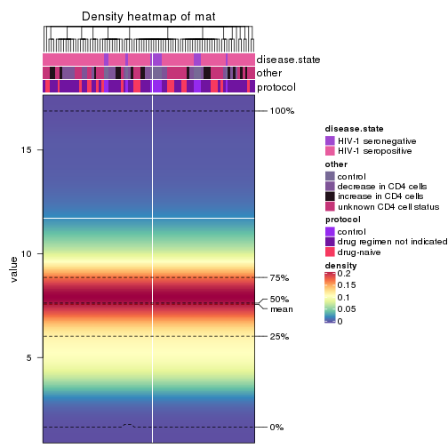


### Suggest the best k


Folowing table shows the best `k` (number of partitions) for each combination
of top-value methods and partition methods. Clicking on the method name in
the table goes to the section for a single combination of methods.

[The cola vignette](http://bioconductor.org/packages/devel/bioc/vignettes/cola/inst/doc/cola.html#toc_13)
explains the definition of the metrics used for determining the best
number of partitions.


```r
suggest_best_k(res_list)
```


|                            | The best k| 1-PAC| Mean silhouette| Concordance|   |Optional k |
|:---------------------------|----------:|-----:|---------------:|-----------:|:--|:----------|
|[ATC:hclust](#ATC-hclust)   |          2| 1.000|           0.984|       0.994|** |           |
|[ATC:NMF](#ATC-NMF)         |          2| 0.999|           0.957|       0.980|** |           |
|[CV:skmeans](#CV-skmeans)   |          2| 0.976|           0.917|       0.970|** |           |
|[ATC:skmeans](#ATC-skmeans) |          3| 0.975|           0.916|       0.958|** |2          |
|[ATC:mclust](#ATC-mclust)   |          2| 0.975|           0.965|       0.983|** |           |
|[SD:skmeans](#SD-skmeans)   |          2| 0.904|           0.914|       0.968|*  |           |
|[SD:NMF](#SD-NMF)           |          2| 0.882|           0.919|       0.967|   |           |
|[ATC:kmeans](#ATC-kmeans)   |          2| 0.847|           0.941|       0.965|   |           |
|[CV:NMF](#CV-NMF)           |          2| 0.837|           0.901|       0.960|   |           |
|[MAD:skmeans](#MAD-skmeans) |          2| 0.820|           0.893|       0.954|   |           |
|[SD:kmeans](#SD-kmeans)     |          2| 0.813|           0.887|       0.949|   |           |
|[CV:mclust](#CV-mclust)     |          2| 0.805|           0.884|       0.947|   |           |
|[MAD:kmeans](#MAD-kmeans)   |          2| 0.800|           0.885|       0.950|   |           |
|[MAD:NMF](#MAD-NMF)         |          2| 0.768|           0.883|       0.949|   |           |
|[CV:kmeans](#CV-kmeans)     |          2| 0.735|           0.891|       0.945|   |           |
|[SD:hclust](#SD-hclust)     |          2| 0.623|           0.874|       0.927|   |           |
|[ATC:pam](#ATC-pam)         |          4| 0.582|           0.631|       0.823|   |           |
|[MAD:mclust](#MAD-mclust)   |          2| 0.578|           0.718|       0.882|   |           |
|[SD:mclust](#SD-mclust)     |          2| 0.573|           0.737|       0.884|   |           |
|[MAD:hclust](#MAD-hclust)   |          2| 0.563|           0.856|       0.911|   |           |
|[CV:hclust](#CV-hclust)     |          2| 0.474|           0.848|       0.904|   |           |
|[SD:pam](#SD-pam)           |          3| 0.305|           0.624|       0.819|   |           |
|[MAD:pam](#MAD-pam)         |          3| 0.226|           0.570|       0.780|   |           |
|[CV:pam](#CV-pam)           |         NA|    NA|              NA|          NA|   |           |

\*\*: 1-PAC > 0.95, \*: 1-PAC > 0.9


### CDF of consensus matrices

Cumulative distribution function curves of consensus matrix for all methods.


```r
collect_plots(res_list, fun = plot_ecdf)
```

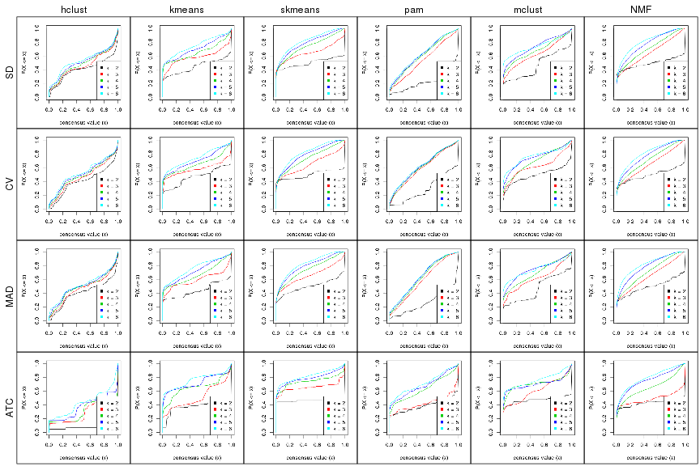


### Consensus heatmap

Consensus heatmaps for all methods. ([What is a consensus heatmap?](http://bioconductor.org/packages/devel/bioc/vignettes/cola/inst/doc/cola.html#toc_9))


<style type='text/css'>


.ui-helper-hidden {
	display: none;
}
.ui-helper-hidden-accessible {
	border: 0;
	clip: rect(0 0 0 0);
	height: 1px;
	margin: -1px;
	overflow: hidden;
	padding: 0;
	position: absolute;
	width: 1px;
}
.ui-helper-reset {
	margin: 0;
	padding: 0;
	border: 0;
	outline: 0;
	line-height: 1.3;
	text-decoration: none;
	font-size: 100%;
	list-style: none;
}
.ui-helper-clearfix:before,
.ui-helper-clearfix:after {
	content: "";
	display: table;
	border-collapse: collapse;
}
.ui-helper-clearfix:after {
	clear: both;
}
.ui-helper-zfix {
	width: 100%;
	height: 100%;
	top: 0;
	left: 0;
	position: absolute;
	opacity: 0;
	filter:Alpha(Opacity=0); 
}

.ui-front {
	z-index: 100;
}


.ui-state-disabled {
	cursor: default !important;
	pointer-events: none;
}


.ui-icon {
	display: inline-block;
	vertical-align: middle;
	margin-top: -.25em;
	position: relative;
	text-indent: -99999px;
	overflow: hidden;
	background-repeat: no-repeat;
}

.ui-widget-icon-block {
	left: 50%;
	margin-left: -8px;
	display: block;
}


.ui-widget-overlay {
	position: fixed;
	top: 0;
	left: 0;
	width: 100%;
	height: 100%;
}
.ui-accordion .ui-accordion-header {
	display: block;
	cursor: pointer;
	position: relative;
	margin: 2px 0 0 0;
	padding: .5em .5em .5em .7em;
	font-size: 100%;
}
.ui-accordion .ui-accordion-content {
	padding: 1em 2.2em;
	border-top: 0;
	overflow: auto;
}
.ui-autocomplete {
	position: absolute;
	top: 0;
	left: 0;
	cursor: default;
}
.ui-menu {
	list-style: none;
	padding: 0;
	margin: 0;
	display: block;
	outline: 0;
}
.ui-menu .ui-menu {
	position: absolute;
}
.ui-menu .ui-menu-item {
	margin: 0;
	cursor: pointer;
	
	list-style-image: url("data:image/gif;base64,R0lGODlhAQABAIAAAAAAAP///yH5BAEAAAAALAAAAAABAAEAAAIBRAA7");
}
.ui-menu .ui-menu-item-wrapper {
	position: relative;
	padding: 3px 1em 3px .4em;
}
.ui-menu .ui-menu-divider {
	margin: 5px 0;
	height: 0;
	font-size: 0;
	line-height: 0;
	border-width: 1px 0 0 0;
}
.ui-menu .ui-state-focus,
.ui-menu .ui-state-active {
	margin: -1px;
}


.ui-menu-icons {
	position: relative;
}
.ui-menu-icons .ui-menu-item-wrapper {
	padding-left: 2em;
}


.ui-menu .ui-icon {
	position: absolute;
	top: 0;
	bottom: 0;
	left: .2em;
	margin: auto 0;
}


.ui-menu .ui-menu-icon {
	left: auto;
	right: 0;
}
.ui-button {
	padding: .4em 1em;
	display: inline-block;
	position: relative;
	line-height: normal;
	margin-right: .1em;
	cursor: pointer;
	vertical-align: middle;
	text-align: center;
	-webkit-user-select: none;
	-moz-user-select: none;
	-ms-user-select: none;
	user-select: none;

	
	overflow: visible;
}

.ui-button,
.ui-button:link,
.ui-button:visited,
.ui-button:hover,
.ui-button:active {
	text-decoration: none;
}


.ui-button-icon-only {
	width: 2em;
	box-sizing: border-box;
	text-indent: -9999px;
	white-space: nowrap;
}


input.ui-button.ui-button-icon-only {
	text-indent: 0;
}


.ui-button-icon-only .ui-icon {
	position: absolute;
	top: 50%;
	left: 50%;
	margin-top: -8px;
	margin-left: -8px;
}

.ui-button.ui-icon-notext .ui-icon {
	padding: 0;
	width: 2.1em;
	height: 2.1em;
	text-indent: -9999px;
	white-space: nowrap;

}

input.ui-button.ui-icon-notext .ui-icon {
	width: auto;
	height: auto;
	text-indent: 0;
	white-space: normal;
	padding: .4em 1em;
}


input.ui-button::-moz-focus-inner,
button.ui-button::-moz-focus-inner {
	border: 0;
	padding: 0;
}
.ui-controlgroup {
	vertical-align: middle;
	display: inline-block;
}
.ui-controlgroup > .ui-controlgroup-item {
	float: left;
	margin-left: 0;
	margin-right: 0;
}
.ui-controlgroup > .ui-controlgroup-item:focus,
.ui-controlgroup > .ui-controlgroup-item.ui-visual-focus {
	z-index: 9999;
}
.ui-controlgroup-vertical > .ui-controlgroup-item {
	display: block;
	float: none;
	width: 100%;
	margin-top: 0;
	margin-bottom: 0;
	text-align: left;
}
.ui-controlgroup-vertical .ui-controlgroup-item {
	box-sizing: border-box;
}
.ui-controlgroup .ui-controlgroup-label {
	padding: .4em 1em;
}
.ui-controlgroup .ui-controlgroup-label span {
	font-size: 80%;
}
.ui-controlgroup-horizontal .ui-controlgroup-label + .ui-controlgroup-item {
	border-left: none;
}
.ui-controlgroup-vertical .ui-controlgroup-label + .ui-controlgroup-item {
	border-top: none;
}
.ui-controlgroup-horizontal .ui-controlgroup-label.ui-widget-content {
	border-right: none;
}
.ui-controlgroup-vertical .ui-controlgroup-label.ui-widget-content {
	border-bottom: none;
}


.ui-controlgroup-vertical .ui-spinner-input {

	
	width: 75%;
	width: calc( 100% - 2.4em );
}
.ui-controlgroup-vertical .ui-spinner .ui-spinner-up {
	border-top-style: solid;
}

.ui-checkboxradio-label .ui-icon-background {
	box-shadow: inset 1px 1px 1px #ccc;
	border-radius: .12em;
	border: none;
}
.ui-checkboxradio-radio-label .ui-icon-background {
	width: 16px;
	height: 16px;
	border-radius: 1em;
	overflow: visible;
	border: none;
}
.ui-checkboxradio-radio-label.ui-checkboxradio-checked .ui-icon,
.ui-checkboxradio-radio-label.ui-checkboxradio-checked:hover .ui-icon {
	background-image: none;
	width: 8px;
	height: 8px;
	border-width: 4px;
	border-style: solid;
}
.ui-checkboxradio-disabled {
	pointer-events: none;
}
.ui-datepicker {
	width: 17em;
	padding: .2em .2em 0;
	display: none;
}
.ui-datepicker .ui-datepicker-header {
	position: relative;
	padding: .2em 0;
}
.ui-datepicker .ui-datepicker-prev,
.ui-datepicker .ui-datepicker-next {
	position: absolute;
	top: 2px;
	width: 1.8em;
	height: 1.8em;
}
.ui-datepicker .ui-datepicker-prev-hover,
.ui-datepicker .ui-datepicker-next-hover {
	top: 1px;
}
.ui-datepicker .ui-datepicker-prev {
	left: 2px;
}
.ui-datepicker .ui-datepicker-next {
	right: 2px;
}
.ui-datepicker .ui-datepicker-prev-hover {
	left: 1px;
}
.ui-datepicker .ui-datepicker-next-hover {
	right: 1px;
}
.ui-datepicker .ui-datepicker-prev span,
.ui-datepicker .ui-datepicker-next span {
	display: block;
	position: absolute;
	left: 50%;
	margin-left: -8px;
	top: 50%;
	margin-top: -8px;
}
.ui-datepicker .ui-datepicker-title {
	margin: 0 2.3em;
	line-height: 1.8em;
	text-align: center;
}
.ui-datepicker .ui-datepicker-title select {
	font-size: 1em;
	margin: 1px 0;
}
.ui-datepicker select.ui-datepicker-month,
.ui-datepicker select.ui-datepicker-year {
	width: 45%;
}
.ui-datepicker table {
	width: 100%;
	font-size: .9em;
	border-collapse: collapse;
	margin: 0 0 .4em;
}
.ui-datepicker th {
	padding: .7em .3em;
	text-align: center;
	font-weight: bold;
	border: 0;
}
.ui-datepicker td {
	border: 0;
	padding: 1px;
}
.ui-datepicker td span,
.ui-datepicker td a {
	display: block;
	padding: .2em;
	text-align: right;
	text-decoration: none;
}
.ui-datepicker .ui-datepicker-buttonpane {
	background-image: none;
	margin: .7em 0 0 0;
	padding: 0 .2em;
	border-left: 0;
	border-right: 0;
	border-bottom: 0;
}
.ui-datepicker .ui-datepicker-buttonpane button {
	float: right;
	margin: .5em .2em .4em;
	cursor: pointer;
	padding: .2em .6em .3em .6em;
	width: auto;
	overflow: visible;
}
.ui-datepicker .ui-datepicker-buttonpane button.ui-datepicker-current {
	float: left;
}


.ui-datepicker.ui-datepicker-multi {
	width: auto;
}
.ui-datepicker-multi .ui-datepicker-group {
	float: left;
}
.ui-datepicker-multi .ui-datepicker-group table {
	width: 95%;
	margin: 0 auto .4em;
}
.ui-datepicker-multi-2 .ui-datepicker-group {
	width: 50%;
}
.ui-datepicker-multi-3 .ui-datepicker-group {
	width: 33.3%;
}
.ui-datepicker-multi-4 .ui-datepicker-group {
	width: 25%;
}
.ui-datepicker-multi .ui-datepicker-group-last .ui-datepicker-header,
.ui-datepicker-multi .ui-datepicker-group-middle .ui-datepicker-header {
	border-left-width: 0;
}
.ui-datepicker-multi .ui-datepicker-buttonpane {
	clear: left;
}
.ui-datepicker-row-break {
	clear: both;
	width: 100%;
	font-size: 0;
}


.ui-datepicker-rtl {
	direction: rtl;
}
.ui-datepicker-rtl .ui-datepicker-prev {
	right: 2px;
	left: auto;
}
.ui-datepicker-rtl .ui-datepicker-next {
	left: 2px;
	right: auto;
}
.ui-datepicker-rtl .ui-datepicker-prev:hover {
	right: 1px;
	left: auto;
}
.ui-datepicker-rtl .ui-datepicker-next:hover {
	left: 1px;
	right: auto;
}
.ui-datepicker-rtl .ui-datepicker-buttonpane {
	clear: right;
}
.ui-datepicker-rtl .ui-datepicker-buttonpane button {
	float: left;
}
.ui-datepicker-rtl .ui-datepicker-buttonpane button.ui-datepicker-current,
.ui-datepicker-rtl .ui-datepicker-group {
	float: right;
}
.ui-datepicker-rtl .ui-datepicker-group-last .ui-datepicker-header,
.ui-datepicker-rtl .ui-datepicker-group-middle .ui-datepicker-header {
	border-right-width: 0;
	border-left-width: 1px;
}


.ui-datepicker .ui-icon {
	display: block;
	text-indent: -99999px;
	overflow: hidden;
	background-repeat: no-repeat;
	left: .5em;
	top: .3em;
}
.ui-dialog {
	position: absolute;
	top: 0;
	left: 0;
	padding: .2em;
	outline: 0;
}
.ui-dialog .ui-dialog-titlebar {
	padding: .4em 1em;
	position: relative;
}
.ui-dialog .ui-dialog-title {
	float: left;
	margin: .1em 0;
	white-space: nowrap;
	width: 90%;
	overflow: hidden;
	text-overflow: ellipsis;
}
.ui-dialog .ui-dialog-titlebar-close {
	position: absolute;
	right: .3em;
	top: 50%;
	width: 20px;
	margin: -10px 0 0 0;
	padding: 1px;
	height: 20px;
}
.ui-dialog .ui-dialog-content {
	position: relative;
	border: 0;
	padding: .5em 1em;
	background: none;
	overflow: auto;
}
.ui-dialog .ui-dialog-buttonpane {
	text-align: left;
	border-width: 1px 0 0 0;
	background-image: none;
	margin-top: .5em;
	padding: .3em 1em .5em .4em;
}
.ui-dialog .ui-dialog-buttonpane .ui-dialog-buttonset {
	float: right;
}
.ui-dialog .ui-dialog-buttonpane button {
	margin: .5em .4em .5em 0;
	cursor: pointer;
}
.ui-dialog .ui-resizable-n {
	height: 2px;
	top: 0;
}
.ui-dialog .ui-resizable-e {
	width: 2px;
	right: 0;
}
.ui-dialog .ui-resizable-s {
	height: 2px;
	bottom: 0;
}
.ui-dialog .ui-resizable-w {
	width: 2px;
	left: 0;
}
.ui-dialog .ui-resizable-se,
.ui-dialog .ui-resizable-sw,
.ui-dialog .ui-resizable-ne,
.ui-dialog .ui-resizable-nw {
	width: 7px;
	height: 7px;
}
.ui-dialog .ui-resizable-se {
	right: 0;
	bottom: 0;
}
.ui-dialog .ui-resizable-sw {
	left: 0;
	bottom: 0;
}
.ui-dialog .ui-resizable-ne {
	right: 0;
	top: 0;
}
.ui-dialog .ui-resizable-nw {
	left: 0;
	top: 0;
}
.ui-draggable .ui-dialog-titlebar {
	cursor: move;
}
.ui-draggable-handle {
	-ms-touch-action: none;
	touch-action: none;
}
.ui-resizable {
	position: relative;
}
.ui-resizable-handle {
	position: absolute;
	font-size: 0.1px;
	display: block;
	-ms-touch-action: none;
	touch-action: none;
}
.ui-resizable-disabled .ui-resizable-handle,
.ui-resizable-autohide .ui-resizable-handle {
	display: none;
}
.ui-resizable-n {
	cursor: n-resize;
	height: 7px;
	width: 100%;
	top: -5px;
	left: 0;
}
.ui-resizable-s {
	cursor: s-resize;
	height: 7px;
	width: 100%;
	bottom: -5px;
	left: 0;
}
.ui-resizable-e {
	cursor: e-resize;
	width: 7px;
	right: -5px;
	top: 0;
	height: 100%;
}
.ui-resizable-w {
	cursor: w-resize;
	width: 7px;
	left: -5px;
	top: 0;
	height: 100%;
}
.ui-resizable-se {
	cursor: se-resize;
	width: 12px;
	height: 12px;
	right: 1px;
	bottom: 1px;
}
.ui-resizable-sw {
	cursor: sw-resize;
	width: 9px;
	height: 9px;
	left: -5px;
	bottom: -5px;
}
.ui-resizable-nw {
	cursor: nw-resize;
	width: 9px;
	height: 9px;
	left: -5px;
	top: -5px;
}
.ui-resizable-ne {
	cursor: ne-resize;
	width: 9px;
	height: 9px;
	right: -5px;
	top: -5px;
}
.ui-progressbar {
	height: 2em;
	text-align: left;
	overflow: hidden;
}
.ui-progressbar .ui-progressbar-value {
	margin: -1px;
	height: 100%;
}
.ui-progressbar .ui-progressbar-overlay {
	background: url("");
	height: 100%;
	filter: alpha(opacity=25); 
	opacity: 0.25;
}
.ui-progressbar-indeterminate .ui-progressbar-value {
	background-image: none;
}
.ui-selectable {
	-ms-touch-action: none;
	touch-action: none;
}
.ui-selectable-helper {
	position: absolute;
	z-index: 100;
	border: 1px dotted black;
}
.ui-selectmenu-menu {
	padding: 0;
	margin: 0;
	position: absolute;
	top: 0;
	left: 0;
	display: none;
}
.ui-selectmenu-menu .ui-menu {
	overflow: auto;
	overflow-x: hidden;
	padding-bottom: 1px;
}
.ui-selectmenu-menu .ui-menu .ui-selectmenu-optgroup {
	font-size: 1em;
	font-weight: bold;
	line-height: 1.5;
	padding: 2px 0.4em;
	margin: 0.5em 0 0 0;
	height: auto;
	border: 0;
}
.ui-selectmenu-open {
	display: block;
}
.ui-selectmenu-text {
	display: block;
	margin-right: 20px;
	overflow: hidden;
	text-overflow: ellipsis;
}
.ui-selectmenu-button.ui-button {
	text-align: left;
	white-space: nowrap;
	width: 14em;
}
.ui-selectmenu-icon.ui-icon {
	float: right;
	margin-top: 0;
}
.ui-slider {
	position: relative;
	text-align: left;
}
.ui-slider .ui-slider-handle {
	position: absolute;
	z-index: 2;
	width: 1.2em;
	height: 1.2em;
	cursor: default;
	-ms-touch-action: none;
	touch-action: none;
}
.ui-slider .ui-slider-range {
	position: absolute;
	z-index: 1;
	font-size: .7em;
	display: block;
	border: 0;
	background-position: 0 0;
}


.ui-slider.ui-state-disabled .ui-slider-handle,
.ui-slider.ui-state-disabled .ui-slider-range {
	filter: inherit;
}

.ui-slider-horizontal {
	height: .8em;
}
.ui-slider-horizontal .ui-slider-handle {
	top: -.3em;
	margin-left: -.6em;
}
.ui-slider-horizontal .ui-slider-range {
	top: 0;
	height: 100%;
}
.ui-slider-horizontal .ui-slider-range-min {
	left: 0;
}
.ui-slider-horizontal .ui-slider-range-max {
	right: 0;
}

.ui-slider-vertical {
	width: .8em;
	height: 100px;
}
.ui-slider-vertical .ui-slider-handle {
	left: -.3em;
	margin-left: 0;
	margin-bottom: -.6em;
}
.ui-slider-vertical .ui-slider-range {
	left: 0;
	width: 100%;
}
.ui-slider-vertical .ui-slider-range-min {
	bottom: 0;
}
.ui-slider-vertical .ui-slider-range-max {
	top: 0;
}
.ui-sortable-handle {
	-ms-touch-action: none;
	touch-action: none;
}
.ui-spinner {
	position: relative;
	display: inline-block;
	overflow: hidden;
	padding: 0;
	vertical-align: middle;
}
.ui-spinner-input {
	border: none;
	background: none;
	color: inherit;
	padding: .222em 0;
	margin: .2em 0;
	vertical-align: middle;
	margin-left: .4em;
	margin-right: 2em;
}
.ui-spinner-button {
	width: 1.6em;
	height: 50%;
	font-size: .5em;
	padding: 0;
	margin: 0;
	text-align: center;
	position: absolute;
	cursor: default;
	display: block;
	overflow: hidden;
	right: 0;
}

.ui-spinner a.ui-spinner-button {
	border-top-style: none;
	border-bottom-style: none;
	border-right-style: none;
}
.ui-spinner-up {
	top: 0;
}
.ui-spinner-down {
	bottom: 0;
}
.ui-tabs {
	position: relative;
	padding: .2em;
}
.ui-tabs .ui-tabs-nav {
	margin: 0;
	padding: .2em .2em 0;
}
.ui-tabs .ui-tabs-nav li {
	list-style: none;
	float: left;
	position: relative;
	top: 0;
	margin: 1px .2em 0 0;
	border-bottom-width: 0;
	padding: 0;
	white-space: nowrap;
}
.ui-tabs .ui-tabs-nav .ui-tabs-anchor {
	float: left;
	padding: .5em 1em;
	text-decoration: none;
}
.ui-tabs .ui-tabs-nav li.ui-tabs-active {
	margin-bottom: -1px;
	padding-bottom: 1px;
}
.ui-tabs .ui-tabs-nav li.ui-tabs-active .ui-tabs-anchor,
.ui-tabs .ui-tabs-nav li.ui-state-disabled .ui-tabs-anchor,
.ui-tabs .ui-tabs-nav li.ui-tabs-loading .ui-tabs-anchor {
	cursor: text;
}
.ui-tabs-collapsible .ui-tabs-nav li.ui-tabs-active .ui-tabs-anchor {
	cursor: pointer;
}
.ui-tabs .ui-tabs-panel {
	display: block;
	border-width: 0;
	padding: 1em 1.4em;
	background: none;
}
.ui-tooltip {
	padding: 8px;
	position: absolute;
	z-index: 9999;
	max-width: 300px;
}
body .ui-tooltip {
	border-width: 2px;
}

.ui-widget {
	font-family: Arial,Helvetica,sans-serif;
	font-size: 1em;
}
.ui-widget .ui-widget {
	font-size: 1em;
}
.ui-widget input,
.ui-widget select,
.ui-widget textarea,
.ui-widget button {
	font-family: Arial,Helvetica,sans-serif;
	font-size: 1em;
}
.ui-widget.ui-widget-content {
	border: 1px solid #c5c5c5;
}
.ui-widget-content {
	border: 1px solid #dddddd;
	background: #ffffff;
	color: #333333;
}
.ui-widget-content a {
	color: #333333;
}
.ui-widget-header {
	border: 1px solid #dddddd;
	background: #e9e9e9;
	color: #333333;
	font-weight: bold;
}
.ui-widget-header a {
	color: #333333;
}


.ui-state-default,
.ui-widget-content .ui-state-default,
.ui-widget-header .ui-state-default,
.ui-button,


html .ui-button.ui-state-disabled:hover,
html .ui-button.ui-state-disabled:active {
	border: 1px solid #c5c5c5;
	background: #f6f6f6;
	font-weight: normal;
	color: #454545;
}
.ui-state-default a,
.ui-state-default a:link,
.ui-state-default a:visited,
a.ui-button,
a:link.ui-button,
a:visited.ui-button,
.ui-button {
	color: #454545;
	text-decoration: none;
}
.ui-state-hover,
.ui-widget-content .ui-state-hover,
.ui-widget-header .ui-state-hover,
.ui-state-focus,
.ui-widget-content .ui-state-focus,
.ui-widget-header .ui-state-focus,
.ui-button:hover,
.ui-button:focus {
	border: 1px solid #cccccc;
	background: #ededed;
	font-weight: normal;
	color: #2b2b2b;
}
.ui-state-hover a,
.ui-state-hover a:hover,
.ui-state-hover a:link,
.ui-state-hover a:visited,
.ui-state-focus a,
.ui-state-focus a:hover,
.ui-state-focus a:link,
.ui-state-focus a:visited,
a.ui-button:hover,
a.ui-button:focus {
	color: #2b2b2b;
	text-decoration: none;
}

.ui-visual-focus {
	box-shadow: 0 0 3px 1px rgb(94, 158, 214);
}
.ui-state-active,
.ui-widget-content .ui-state-active,
.ui-widget-header .ui-state-active,
a.ui-button:active,
.ui-button:active,
.ui-button.ui-state-active:hover {
	border: 1px solid #003eff;
	background: #007fff;
	font-weight: normal;
	color: #ffffff;
}
.ui-icon-background,
.ui-state-active .ui-icon-background {
	border: #003eff;
	background-color: #ffffff;
}
.ui-state-active a,
.ui-state-active a:link,
.ui-state-active a:visited {
	color: #ffffff;
	text-decoration: none;
}


.ui-state-highlight,
.ui-widget-content .ui-state-highlight,
.ui-widget-header .ui-state-highlight {
	border: 1px solid #dad55e;
	background: #fffa90;
	color: #777620;
}
.ui-state-checked {
	border: 1px solid #dad55e;
	background: #fffa90;
}
.ui-state-highlight a,
.ui-widget-content .ui-state-highlight a,
.ui-widget-header .ui-state-highlight a {
	color: #777620;
}
.ui-state-error,
.ui-widget-content .ui-state-error,
.ui-widget-header .ui-state-error {
	border: 1px solid #f1a899;
	background: #fddfdf;
	color: #5f3f3f;
}
.ui-state-error a,
.ui-widget-content .ui-state-error a,
.ui-widget-header .ui-state-error a {
	color: #5f3f3f;
}
.ui-state-error-text,
.ui-widget-content .ui-state-error-text,
.ui-widget-header .ui-state-error-text {
	color: #5f3f3f;
}
.ui-priority-primary,
.ui-widget-content .ui-priority-primary,
.ui-widget-header .ui-priority-primary {
	font-weight: bold;
}
.ui-priority-secondary,
.ui-widget-content .ui-priority-secondary,
.ui-widget-header .ui-priority-secondary {
	opacity: .7;
	filter:Alpha(Opacity=70); 
	font-weight: normal;
}
.ui-state-disabled,
.ui-widget-content .ui-state-disabled,
.ui-widget-header .ui-state-disabled {
	opacity: .35;
	filter:Alpha(Opacity=35); 
	background-image: none;
}
.ui-state-disabled .ui-icon {
	filter:Alpha(Opacity=35); 
}


.ui-icon {
	width: 16px;
	height: 16px;
}
.ui-icon,
.ui-widget-content .ui-icon {
	background-image: url("images/ui-icons_444444_256x240.png");
}
.ui-widget-header .ui-icon {
	background-image: url("images/ui-icons_444444_256x240.png");
}
.ui-state-hover .ui-icon,
.ui-state-focus .ui-icon,
.ui-button:hover .ui-icon,
.ui-button:focus .ui-icon {
	background-image: url("images/ui-icons_555555_256x240.png");
}
.ui-state-active .ui-icon,
.ui-button:active .ui-icon {
	background-image: url("images/ui-icons_ffffff_256x240.png");
}
.ui-state-highlight .ui-icon,
.ui-button .ui-state-highlight.ui-icon {
	background-image: url("images/ui-icons_777620_256x240.png");
}
.ui-state-error .ui-icon,
.ui-state-error-text .ui-icon {
	background-image: url("images/ui-icons_cc0000_256x240.png");
}
.ui-button .ui-icon {
	background-image: url("images/ui-icons_777777_256x240.png");
}


.ui-icon-blank { background-position: 16px 16px; }
.ui-icon-caret-1-n { background-position: 0 0; }
.ui-icon-caret-1-ne { background-position: -16px 0; }
.ui-icon-caret-1-e { background-position: -32px 0; }
.ui-icon-caret-1-se { background-position: -48px 0; }
.ui-icon-caret-1-s { background-position: -65px 0; }
.ui-icon-caret-1-sw { background-position: -80px 0; }
.ui-icon-caret-1-w { background-position: -96px 0; }
.ui-icon-caret-1-nw { background-position: -112px 0; }
.ui-icon-caret-2-n-s { background-position: -128px 0; }
.ui-icon-caret-2-e-w { background-position: -144px 0; }
.ui-icon-triangle-1-n { background-position: 0 -16px; }
.ui-icon-triangle-1-ne { background-position: -16px -16px; }
.ui-icon-triangle-1-e { background-position: -32px -16px; }
.ui-icon-triangle-1-se { background-position: -48px -16px; }
.ui-icon-triangle-1-s { background-position: -65px -16px; }
.ui-icon-triangle-1-sw { background-position: -80px -16px; }
.ui-icon-triangle-1-w { background-position: -96px -16px; }
.ui-icon-triangle-1-nw { background-position: -112px -16px; }
.ui-icon-triangle-2-n-s { background-position: -128px -16px; }
.ui-icon-triangle-2-e-w { background-position: -144px -16px; }
.ui-icon-arrow-1-n { background-position: 0 -32px; }
.ui-icon-arrow-1-ne { background-position: -16px -32px; }
.ui-icon-arrow-1-e { background-position: -32px -32px; }
.ui-icon-arrow-1-se { background-position: -48px -32px; }
.ui-icon-arrow-1-s { background-position: -65px -32px; }
.ui-icon-arrow-1-sw { background-position: -80px -32px; }
.ui-icon-arrow-1-w { background-position: -96px -32px; }
.ui-icon-arrow-1-nw { background-position: -112px -32px; }
.ui-icon-arrow-2-n-s { background-position: -128px -32px; }
.ui-icon-arrow-2-ne-sw { background-position: -144px -32px; }
.ui-icon-arrow-2-e-w { background-position: -160px -32px; }
.ui-icon-arrow-2-se-nw { background-position: -176px -32px; }
.ui-icon-arrowstop-1-n { background-position: -192px -32px; }
.ui-icon-arrowstop-1-e { background-position: -208px -32px; }
.ui-icon-arrowstop-1-s { background-position: -224px -32px; }
.ui-icon-arrowstop-1-w { background-position: -240px -32px; }
.ui-icon-arrowthick-1-n { background-position: 1px -48px; }
.ui-icon-arrowthick-1-ne { background-position: -16px -48px; }
.ui-icon-arrowthick-1-e { background-position: -32px -48px; }
.ui-icon-arrowthick-1-se { background-position: -48px -48px; }
.ui-icon-arrowthick-1-s { background-position: -64px -48px; }
.ui-icon-arrowthick-1-sw { background-position: -80px -48px; }
.ui-icon-arrowthick-1-w { background-position: -96px -48px; }
.ui-icon-arrowthick-1-nw { background-position: -112px -48px; }
.ui-icon-arrowthick-2-n-s { background-position: -128px -48px; }
.ui-icon-arrowthick-2-ne-sw { background-position: -144px -48px; }
.ui-icon-arrowthick-2-e-w { background-position: -160px -48px; }
.ui-icon-arrowthick-2-se-nw { background-position: -176px -48px; }
.ui-icon-arrowthickstop-1-n { background-position: -192px -48px; }
.ui-icon-arrowthickstop-1-e { background-position: -208px -48px; }
.ui-icon-arrowthickstop-1-s { background-position: -224px -48px; }
.ui-icon-arrowthickstop-1-w { background-position: -240px -48px; }
.ui-icon-arrowreturnthick-1-w { background-position: 0 -64px; }
.ui-icon-arrowreturnthick-1-n { background-position: -16px -64px; }
.ui-icon-arrowreturnthick-1-e { background-position: -32px -64px; }
.ui-icon-arrowreturnthick-1-s { background-position: -48px -64px; }
.ui-icon-arrowreturn-1-w { background-position: -64px -64px; }
.ui-icon-arrowreturn-1-n { background-position: -80px -64px; }
.ui-icon-arrowreturn-1-e { background-position: -96px -64px; }
.ui-icon-arrowreturn-1-s { background-position: -112px -64px; }
.ui-icon-arrowrefresh-1-w { background-position: -128px -64px; }
.ui-icon-arrowrefresh-1-n { background-position: -144px -64px; }
.ui-icon-arrowrefresh-1-e { background-position: -160px -64px; }
.ui-icon-arrowrefresh-1-s { background-position: -176px -64px; }
.ui-icon-arrow-4 { background-position: 0 -80px; }
.ui-icon-arrow-4-diag { background-position: -16px -80px; }
.ui-icon-extlink { background-position: -32px -80px; }
.ui-icon-newwin { background-position: -48px -80px; }
.ui-icon-refresh { background-position: -64px -80px; }
.ui-icon-shuffle { background-position: -80px -80px; }
.ui-icon-transfer-e-w { background-position: -96px -80px; }
.ui-icon-transferthick-e-w { background-position: -112px -80px; }
.ui-icon-folder-collapsed { background-position: 0 -96px; }
.ui-icon-folder-open { background-position: -16px -96px; }
.ui-icon-document { background-position: -32px -96px; }
.ui-icon-document-b { background-position: -48px -96px; }
.ui-icon-note { background-position: -64px -96px; }
.ui-icon-mail-closed { background-position: -80px -96px; }
.ui-icon-mail-open { background-position: -96px -96px; }
.ui-icon-suitcase { background-position: -112px -96px; }
.ui-icon-comment { background-position: -128px -96px; }
.ui-icon-person { background-position: -144px -96px; }
.ui-icon-print { background-position: -160px -96px; }
.ui-icon-trash { background-position: -176px -96px; }
.ui-icon-locked { background-position: -192px -96px; }
.ui-icon-unlocked { background-position: -208px -96px; }
.ui-icon-bookmark { background-position: -224px -96px; }
.ui-icon-tag { background-position: -240px -96px; }
.ui-icon-home { background-position: 0 -112px; }
.ui-icon-flag { background-position: -16px -112px; }
.ui-icon-calendar { background-position: -32px -112px; }
.ui-icon-cart { background-position: -48px -112px; }
.ui-icon-pencil { background-position: -64px -112px; }
.ui-icon-clock { background-position: -80px -112px; }
.ui-icon-disk { background-position: -96px -112px; }
.ui-icon-calculator { background-position: -112px -112px; }
.ui-icon-zoomin { background-position: -128px -112px; }
.ui-icon-zoomout { background-position: -144px -112px; }
.ui-icon-search { background-position: -160px -112px; }
.ui-icon-wrench { background-position: -176px -112px; }
.ui-icon-gear { background-position: -192px -112px; }
.ui-icon-heart { background-position: -208px -112px; }
.ui-icon-star { background-position: -224px -112px; }
.ui-icon-link { background-position: -240px -112px; }
.ui-icon-cancel { background-position: 0 -128px; }
.ui-icon-plus { background-position: -16px -128px; }
.ui-icon-plusthick { background-position: -32px -128px; }
.ui-icon-minus { background-position: -48px -128px; }
.ui-icon-minusthick { background-position: -64px -128px; }
.ui-icon-close { background-position: -80px -128px; }
.ui-icon-closethick { background-position: -96px -128px; }
.ui-icon-key { background-position: -112px -128px; }
.ui-icon-lightbulb { background-position: -128px -128px; }
.ui-icon-scissors { background-position: -144px -128px; }
.ui-icon-clipboard { background-position: -160px -128px; }
.ui-icon-copy { background-position: -176px -128px; }
.ui-icon-contact { background-position: -192px -128px; }
.ui-icon-image { background-position: -208px -128px; }
.ui-icon-video { background-position: -224px -128px; }
.ui-icon-script { background-position: -240px -128px; }
.ui-icon-alert { background-position: 0 -144px; }
.ui-icon-info { background-position: -16px -144px; }
.ui-icon-notice { background-position: -32px -144px; }
.ui-icon-help { background-position: -48px -144px; }
.ui-icon-check { background-position: -64px -144px; }
.ui-icon-bullet { background-position: -80px -144px; }
.ui-icon-radio-on { background-position: -96px -144px; }
.ui-icon-radio-off { background-position: -112px -144px; }
.ui-icon-pin-w { background-position: -128px -144px; }
.ui-icon-pin-s { background-position: -144px -144px; }
.ui-icon-play { background-position: 0 -160px; }
.ui-icon-pause { background-position: -16px -160px; }
.ui-icon-seek-next { background-position: -32px -160px; }
.ui-icon-seek-prev { background-position: -48px -160px; }
.ui-icon-seek-end { background-position: -64px -160px; }
.ui-icon-seek-start { background-position: -80px -160px; }

.ui-icon-seek-first { background-position: -80px -160px; }
.ui-icon-stop { background-position: -96px -160px; }
.ui-icon-eject { background-position: -112px -160px; }
.ui-icon-volume-off { background-position: -128px -160px; }
.ui-icon-volume-on { background-position: -144px -160px; }
.ui-icon-power { background-position: 0 -176px; }
.ui-icon-signal-diag { background-position: -16px -176px; }
.ui-icon-signal { background-position: -32px -176px; }
.ui-icon-battery-0 { background-position: -48px -176px; }
.ui-icon-battery-1 { background-position: -64px -176px; }
.ui-icon-battery-2 { background-position: -80px -176px; }
.ui-icon-battery-3 { background-position: -96px -176px; }
.ui-icon-circle-plus { background-position: 0 -192px; }
.ui-icon-circle-minus { background-position: -16px -192px; }
.ui-icon-circle-close { background-position: -32px -192px; }
.ui-icon-circle-triangle-e { background-position: -48px -192px; }
.ui-icon-circle-triangle-s { background-position: -64px -192px; }
.ui-icon-circle-triangle-w { background-position: -80px -192px; }
.ui-icon-circle-triangle-n { background-position: -96px -192px; }
.ui-icon-circle-arrow-e { background-position: -112px -192px; }
.ui-icon-circle-arrow-s { background-position: -128px -192px; }
.ui-icon-circle-arrow-w { background-position: -144px -192px; }
.ui-icon-circle-arrow-n { background-position: -160px -192px; }
.ui-icon-circle-zoomin { background-position: -176px -192px; }
.ui-icon-circle-zoomout { background-position: -192px -192px; }
.ui-icon-circle-check { background-position: -208px -192px; }
.ui-icon-circlesmall-plus { background-position: 0 -208px; }
.ui-icon-circlesmall-minus { background-position: -16px -208px; }
.ui-icon-circlesmall-close { background-position: -32px -208px; }
.ui-icon-squaresmall-plus { background-position: -48px -208px; }
.ui-icon-squaresmall-minus { background-position: -64px -208px; }
.ui-icon-squaresmall-close { background-position: -80px -208px; }
.ui-icon-grip-dotted-vertical { background-position: 0 -224px; }
.ui-icon-grip-dotted-horizontal { background-position: -16px -224px; }
.ui-icon-grip-solid-vertical { background-position: -32px -224px; }
.ui-icon-grip-solid-horizontal { background-position: -48px -224px; }
.ui-icon-gripsmall-diagonal-se { background-position: -64px -224px; }
.ui-icon-grip-diagonal-se { background-position: -80px -224px; }


.ui-corner-all,
.ui-corner-top,
.ui-corner-left,
.ui-corner-tl {
	border-top-left-radius: 3px;
}
.ui-corner-all,
.ui-corner-top,
.ui-corner-right,
.ui-corner-tr {
	border-top-right-radius: 3px;
}
.ui-corner-all,
.ui-corner-bottom,
.ui-corner-left,
.ui-corner-bl {
	border-bottom-left-radius: 3px;
}
.ui-corner-all,
.ui-corner-bottom,
.ui-corner-right,
.ui-corner-br {
	border-bottom-right-radius: 3px;
}


.ui-widget-overlay {
	background: #aaaaaa;
	opacity: .3;
	filter: Alpha(Opacity=30); 
}
.ui-widget-shadow {
	-webkit-box-shadow: 0px 0px 5px #666666;
	box-shadow: 0px 0px 5px #666666;
} 
</style>
<script src='js/jquery-1.12.4.js'></script>
<script src='js/jquery-ui.js'></script>

<script>
$( function() {
	$( '#tabs-collect-consensus-heatmap' ).tabs();
} );
</script>
<div id='tabs-collect-consensus-heatmap'>
<ul>
<li><a href='#tab-collect-consensus-heatmap-1'>k = 2</a></li>
<li><a href='#tab-collect-consensus-heatmap-2'>k = 3</a></li>
<li><a href='#tab-collect-consensus-heatmap-3'>k = 4</a></li>
<li><a href='#tab-collect-consensus-heatmap-4'>k = 5</a></li>
<li><a href='#tab-collect-consensus-heatmap-5'>k = 6</a></li>
</ul>
<div id='tab-collect-consensus-heatmap-1'>
<pre><code class="r">collect_plots(res_list, k = 2, fun = consensus_heatmap, mc.cores = 4)
</code></pre>

<p>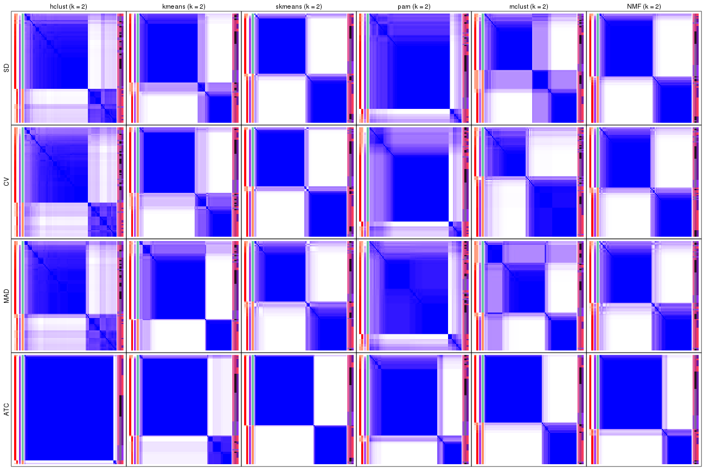</p>

</div>
<div id='tab-collect-consensus-heatmap-2'>
<pre><code class="r">collect_plots(res_list, k = 3, fun = consensus_heatmap, mc.cores = 4)
</code></pre>

<p>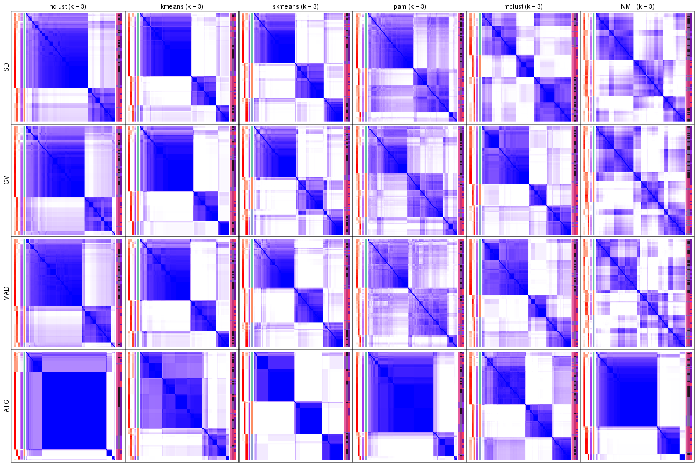</p>

</div>
<div id='tab-collect-consensus-heatmap-3'>
<pre><code class="r">collect_plots(res_list, k = 4, fun = consensus_heatmap, mc.cores = 4)
</code></pre>

<p>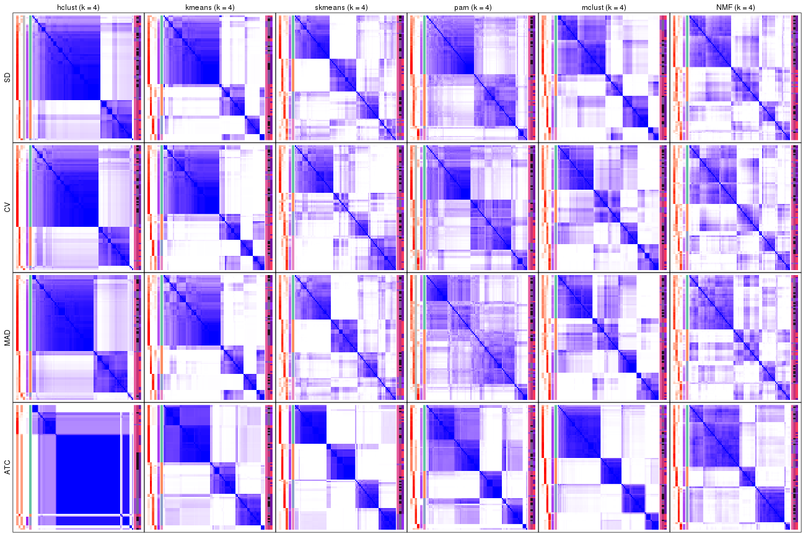</p>

</div>
<div id='tab-collect-consensus-heatmap-4'>
<pre><code class="r">collect_plots(res_list, k = 5, fun = consensus_heatmap, mc.cores = 4)
</code></pre>

<p>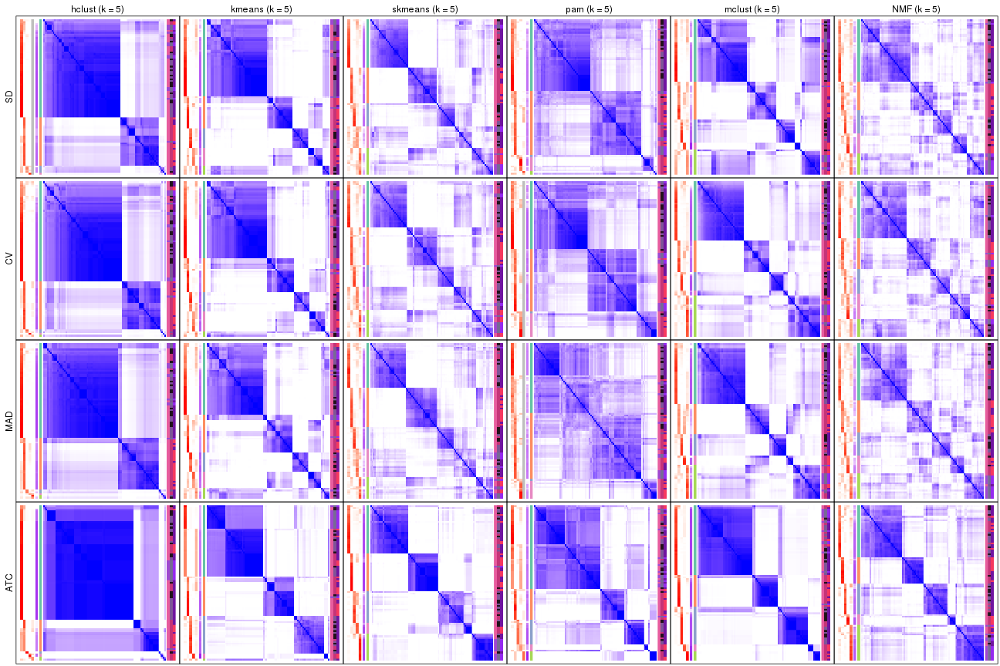</p>

</div>
<div id='tab-collect-consensus-heatmap-5'>
<pre><code class="r">collect_plots(res_list, k = 6, fun = consensus_heatmap, mc.cores = 4)
</code></pre>

<p>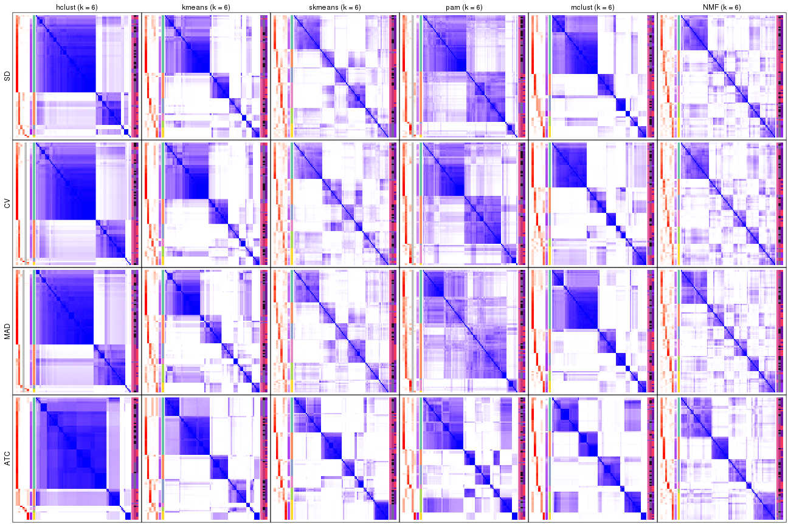</p>

</div>
</div>


### Membership heatmap

Membership heatmaps for all methods. ([What is a membership heatmap?](http://bioconductor.org/packages/devel/bioc/vignettes/cola/inst/doc/cola.html#toc_12))


<script>
$( function() {
	$( '#tabs-collect-membership-heatmap' ).tabs();
} );
</script>
<div id='tabs-collect-membership-heatmap'>
<ul>
<li><a href='#tab-collect-membership-heatmap-1'>k = 2</a></li>
<li><a href='#tab-collect-membership-heatmap-2'>k = 3</a></li>
<li><a href='#tab-collect-membership-heatmap-3'>k = 4</a></li>
<li><a href='#tab-collect-membership-heatmap-4'>k = 5</a></li>
<li><a href='#tab-collect-membership-heatmap-5'>k = 6</a></li>
</ul>
<div id='tab-collect-membership-heatmap-1'>
<pre><code class="r">collect_plots(res_list, k = 2, fun = membership_heatmap, mc.cores = 4)
</code></pre>

<p>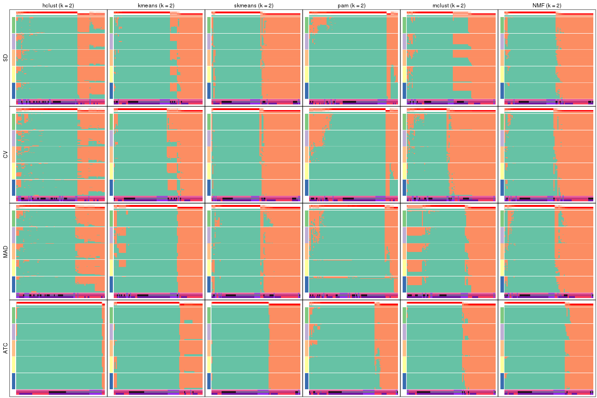</p>

</div>
<div id='tab-collect-membership-heatmap-2'>
<pre><code class="r">collect_plots(res_list, k = 3, fun = membership_heatmap, mc.cores = 4)
</code></pre>

<p>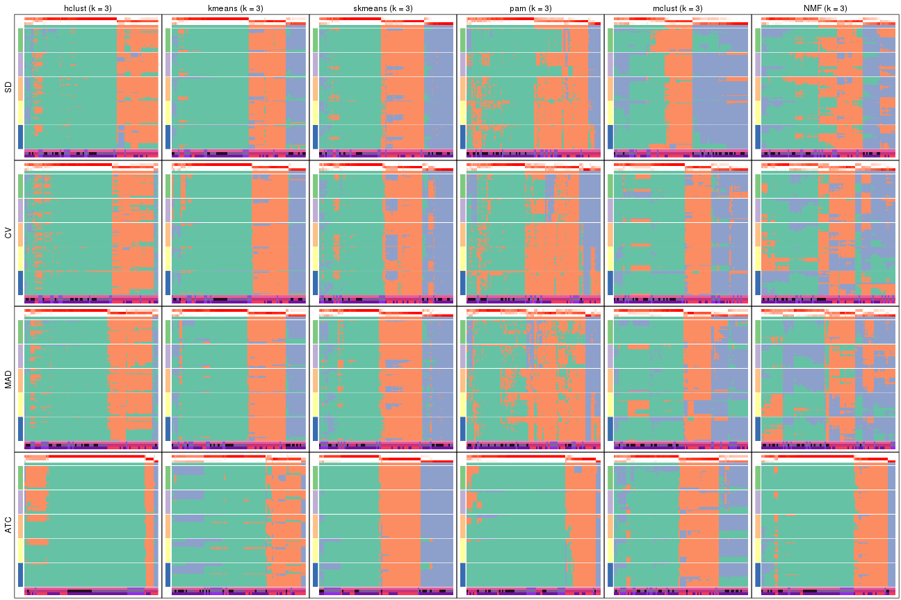</p>

</div>
<div id='tab-collect-membership-heatmap-3'>
<pre><code class="r">collect_plots(res_list, k = 4, fun = membership_heatmap, mc.cores = 4)
</code></pre>

<p>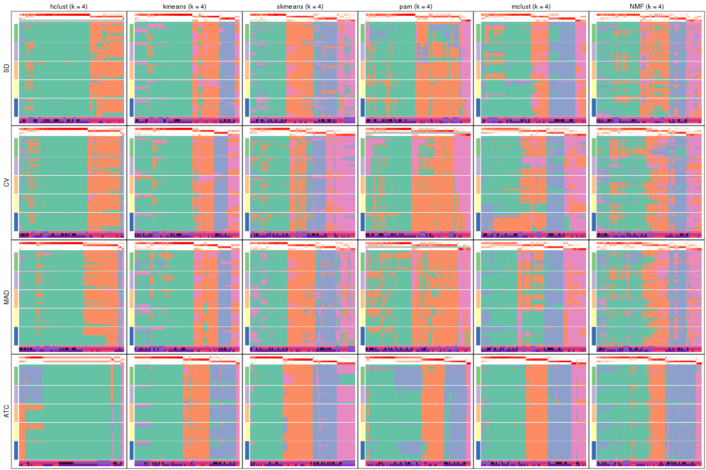</p>

</div>
<div id='tab-collect-membership-heatmap-4'>
<pre><code class="r">collect_plots(res_list, k = 5, fun = membership_heatmap, mc.cores = 4)
</code></pre>

<p>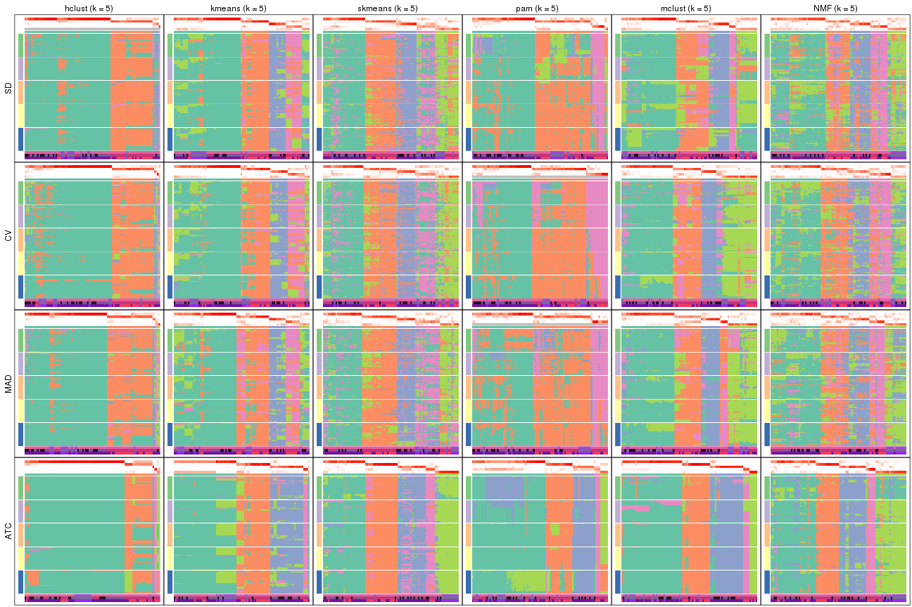</p>

</div>
<div id='tab-collect-membership-heatmap-5'>
<pre><code class="r">collect_plots(res_list, k = 6, fun = membership_heatmap, mc.cores = 4)
</code></pre>

<p>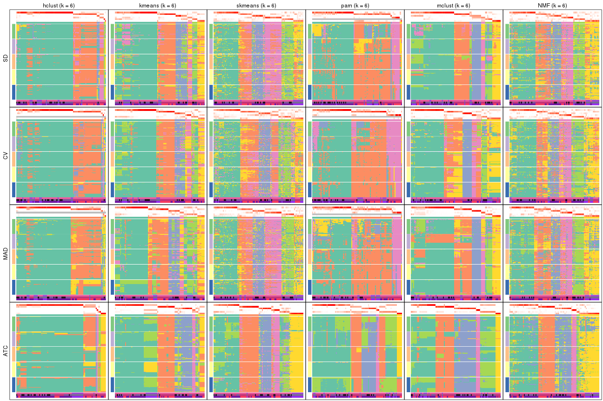</p>

</div>
</div>


### Signature heatmap

Signature heatmaps for all methods. ([What is a signature heatmap?](http://bioconductor.org/packages/devel/bioc/vignettes/cola/inst/doc/cola.html#toc_22))


Note in following heatmaps, rows are scaled.


<script>
$( function() {
	$( '#tabs-collect-get-signatures' ).tabs();
} );
</script>
<div id='tabs-collect-get-signatures'>
<ul>
<li><a href='#tab-collect-get-signatures-1'>k = 2</a></li>
<li><a href='#tab-collect-get-signatures-2'>k = 3</a></li>
<li><a href='#tab-collect-get-signatures-3'>k = 4</a></li>
<li><a href='#tab-collect-get-signatures-4'>k = 5</a></li>
<li><a href='#tab-collect-get-signatures-5'>k = 6</a></li>
</ul>
<div id='tab-collect-get-signatures-1'>
<pre><code class="r">collect_plots(res_list, k = 2, fun = get_signatures, mc.cores = 4)
</code></pre>

<p>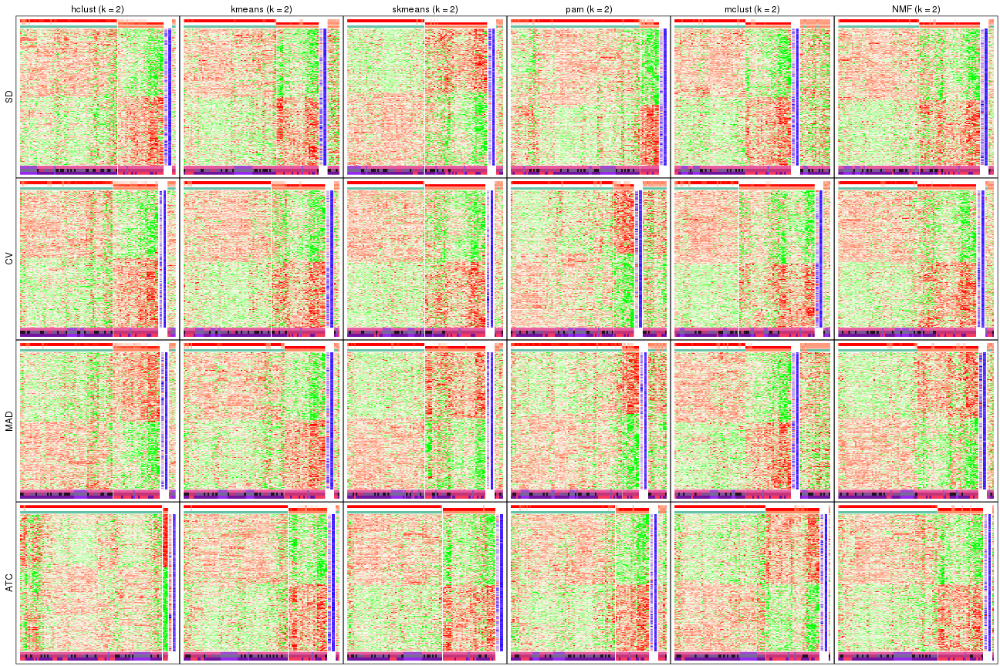</p>

</div>
<div id='tab-collect-get-signatures-2'>
<pre><code class="r">collect_plots(res_list, k = 3, fun = get_signatures, mc.cores = 4)
</code></pre>

<p>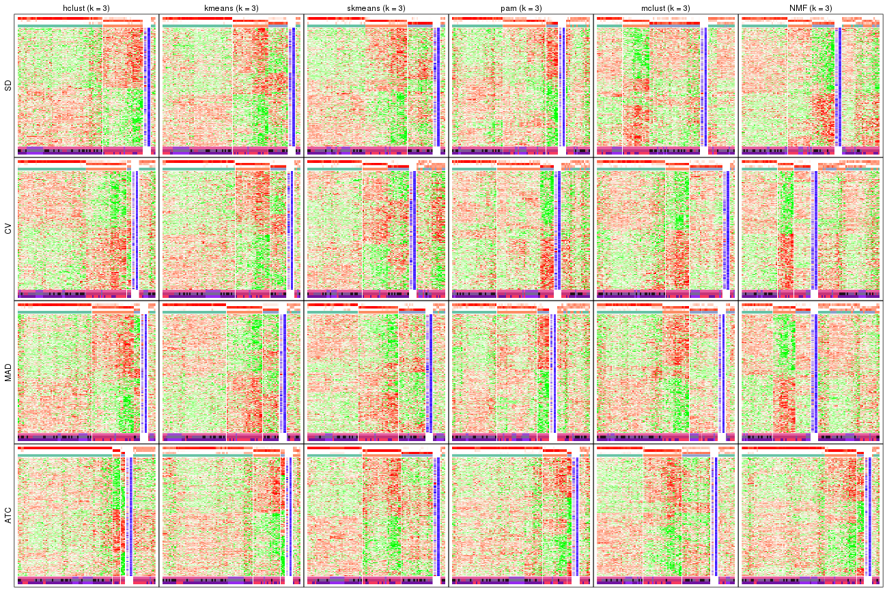</p>

</div>
<div id='tab-collect-get-signatures-3'>
<pre><code class="r">collect_plots(res_list, k = 4, fun = get_signatures, mc.cores = 4)
</code></pre>

<p>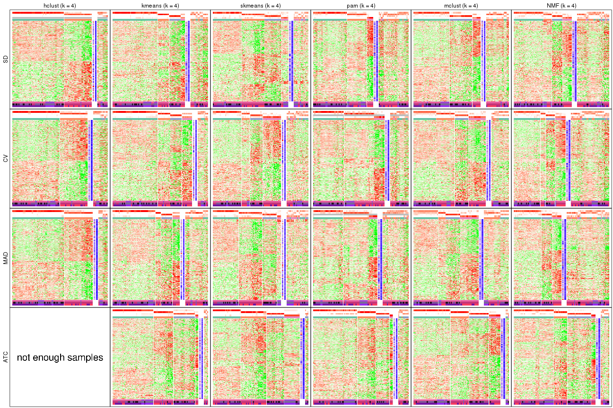</p>

</div>
<div id='tab-collect-get-signatures-4'>
<pre><code class="r">collect_plots(res_list, k = 5, fun = get_signatures, mc.cores = 4)
</code></pre>

<p>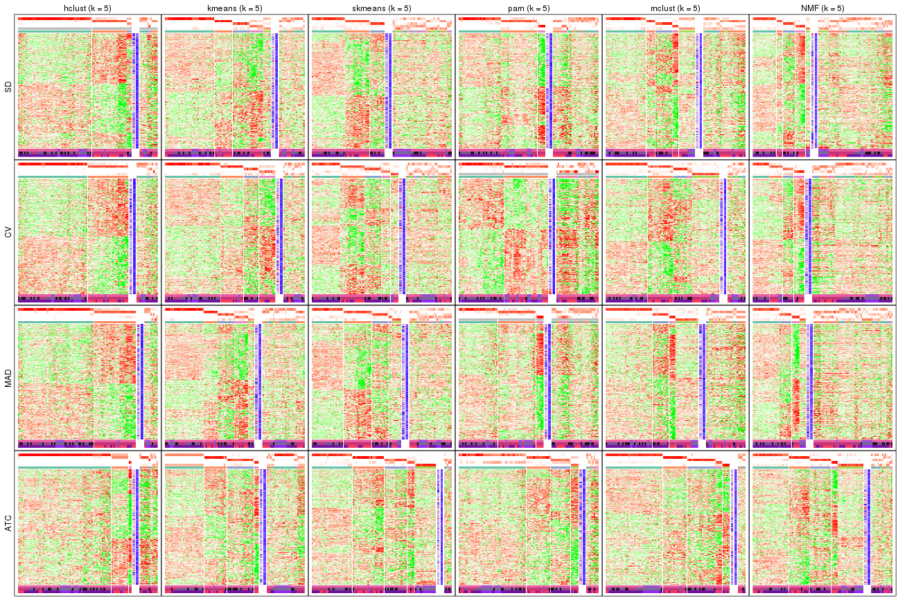</p>

</div>
<div id='tab-collect-get-signatures-5'>
<pre><code class="r">collect_plots(res_list, k = 6, fun = get_signatures, mc.cores = 4)
</code></pre>

<p>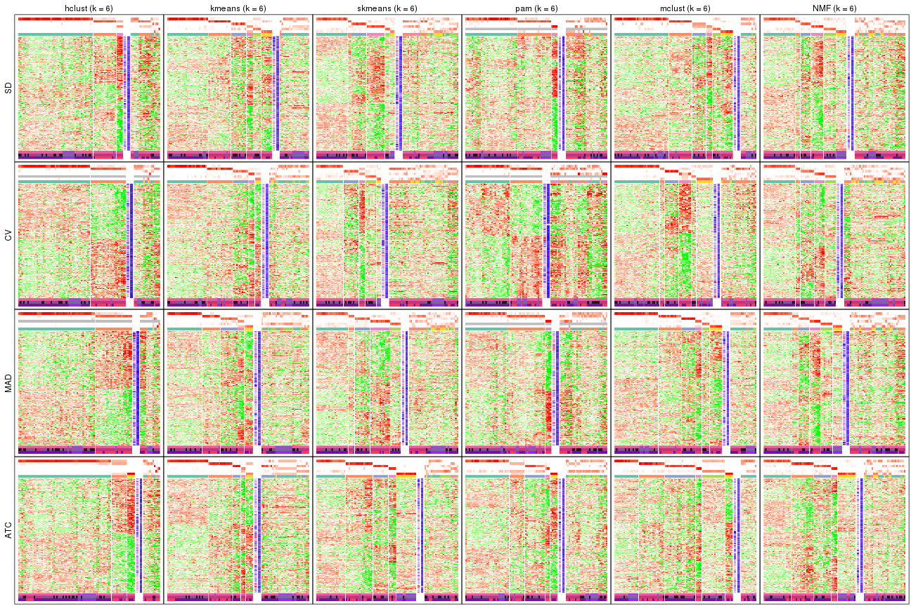</p>

</div>
</div>


### Statistics table

The statistics used for measuring the stability of consensus partitioning.
([How are they
defined?](http://bioconductor.org/packages/devel/bioc/vignettes/cola/inst/doc/cola.html#toc_13))


<script>
$( function() {
	$( '#tabs-get-stats-from-consensus-partition-list' ).tabs();
} );
</script>
<div id='tabs-get-stats-from-consensus-partition-list'>
<ul>
<li><a href='#tab-get-stats-from-consensus-partition-list-1'>k = 2</a></li>
<li><a href='#tab-get-stats-from-consensus-partition-list-2'>k = 3</a></li>
<li><a href='#tab-get-stats-from-consensus-partition-list-3'>k = 4</a></li>
<li><a href='#tab-get-stats-from-consensus-partition-list-4'>k = 5</a></li>
<li><a href='#tab-get-stats-from-consensus-partition-list-5'>k = 6</a></li>
</ul>
<div id='tab-get-stats-from-consensus-partition-list-1'>
<pre><code class="r">get_stats(res_list, k = 2)
</code></pre>

<pre><code>#&gt;             k 1-PAC mean_silhouette concordance area_increased  Rand Jaccard
#&gt; SD:NMF      2 0.882           0.919       0.967         0.4929 0.505   0.505
#&gt; CV:NMF      2 0.837           0.901       0.960         0.4968 0.500   0.500
#&gt; MAD:NMF     2 0.768           0.883       0.949         0.4956 0.502   0.502
#&gt; ATC:NMF     2 0.999           0.957       0.980         0.4297 0.558   0.558
#&gt; SD:skmeans  2 0.904           0.914       0.968         0.5006 0.500   0.500
#&gt; CV:skmeans  2 0.976           0.917       0.970         0.5005 0.497   0.497
#&gt; MAD:skmeans 2 0.820           0.893       0.954         0.4990 0.500   0.500
#&gt; ATC:skmeans 2 1.000           0.985       0.994         0.4639 0.536   0.536
#&gt; SD:mclust   2 0.573           0.737       0.884         0.4647 0.495   0.495
#&gt; CV:mclust   2 0.805           0.884       0.947         0.4928 0.500   0.500
#&gt; MAD:mclust  2 0.578           0.718       0.882         0.4689 0.543   0.543
#&gt; ATC:mclust  2 0.975           0.965       0.983         0.4687 0.524   0.524
#&gt; SD:kmeans   2 0.813           0.887       0.949         0.4460 0.530   0.530
#&gt; CV:kmeans   2 0.735           0.891       0.945         0.4658 0.513   0.513
#&gt; MAD:kmeans  2 0.800           0.885       0.950         0.4413 0.586   0.586
#&gt; ATC:kmeans  2 0.847           0.941       0.965         0.3771 0.607   0.607
#&gt; SD:pam      2 0.666           0.895       0.945         0.2189 0.777   0.777
#&gt; CV:pam      2 0.531           0.731       0.894         0.2928 0.759   0.759
#&gt; MAD:pam     2 0.629           0.788       0.908         0.2684 0.743   0.743
#&gt; ATC:pam     2 0.858           0.896       0.957         0.3858 0.607   0.607
#&gt; SD:hclust   2 0.623           0.874       0.927         0.4100 0.567   0.567
#&gt; CV:hclust   2 0.474           0.848       0.904         0.4070 0.567   0.567
#&gt; MAD:hclust  2 0.563           0.856       0.911         0.4057 0.550   0.550
#&gt; ATC:hclust  2 1.000           0.984       0.994         0.0699 0.933   0.933
</code></pre>

</div>
<div id='tab-get-stats-from-consensus-partition-list-2'>
<pre><code class="r">get_stats(res_list, k = 3)
</code></pre>

<pre><code>#&gt;             k 1-PAC mean_silhouette concordance area_increased  Rand Jaccard
#&gt; SD:NMF      3 0.451           0.550       0.763          0.318 0.706   0.485
#&gt; CV:NMF      3 0.443           0.462       0.669          0.317 0.680   0.448
#&gt; MAD:NMF     3 0.413           0.417       0.637          0.316 0.628   0.396
#&gt; ATC:NMF     3 0.854           0.877       0.950          0.143 0.906   0.842
#&gt; SD:skmeans  3 0.689           0.826       0.914          0.304 0.786   0.600
#&gt; CV:skmeans  3 0.650           0.667       0.864          0.301 0.795   0.613
#&gt; MAD:skmeans 3 0.609           0.763       0.885          0.321 0.785   0.595
#&gt; ATC:skmeans 3 0.975           0.916       0.958          0.415 0.776   0.595
#&gt; SD:mclust   3 0.524           0.654       0.820          0.356 0.568   0.324
#&gt; CV:mclust   3 0.511           0.794       0.874          0.262 0.558   0.335
#&gt; MAD:mclust  3 0.531           0.747       0.833          0.324 0.759   0.586
#&gt; ATC:mclust  3 0.603           0.748       0.832          0.300 0.732   0.536
#&gt; SD:kmeans   3 0.714           0.857       0.914          0.307 0.871   0.762
#&gt; CV:kmeans   3 0.801           0.868       0.931          0.247 0.866   0.755
#&gt; MAD:kmeans  3 0.739           0.810       0.907          0.345 0.810   0.682
#&gt; ATC:kmeans  3 0.610           0.729       0.843          0.362 0.919   0.870
#&gt; SD:pam      3 0.305           0.624       0.819          1.490 0.592   0.491
#&gt; CV:pam      3 0.335           0.612       0.808          1.044 0.599   0.476
#&gt; MAD:pam     3 0.226           0.570       0.780          1.191 0.599   0.480
#&gt; ATC:pam     3 0.768           0.843       0.937          0.107 0.984   0.974
#&gt; SD:hclust   3 0.508           0.816       0.885          0.124 1.000   1.000
#&gt; CV:hclust   3 0.387           0.699       0.877          0.142 0.954   0.919
#&gt; MAD:hclust  3 0.461           0.778       0.885          0.142 0.942   0.895
#&gt; ATC:hclust  3 0.668           0.743       0.911          3.132 0.875   0.866
</code></pre>

</div>
<div id='tab-get-stats-from-consensus-partition-list-3'>
<pre><code class="r">get_stats(res_list, k = 4)
</code></pre>

<pre><code>#&gt;             k 1-PAC mean_silhouette concordance area_increased  Rand Jaccard
#&gt; SD:NMF      4 0.441           0.517       0.740         0.0920 0.892   0.707
#&gt; CV:NMF      4 0.427           0.439       0.676         0.0945 0.754   0.451
#&gt; MAD:NMF     4 0.410           0.438       0.694         0.0962 0.761   0.463
#&gt; ATC:NMF     4 0.547           0.747       0.860         0.3346 0.661   0.447
#&gt; SD:skmeans  4 0.581           0.656       0.804         0.1349 0.876   0.663
#&gt; CV:skmeans  4 0.566           0.584       0.776         0.1340 0.826   0.567
#&gt; MAD:skmeans 4 0.539           0.609       0.782         0.1277 0.855   0.617
#&gt; ATC:skmeans 4 0.787           0.871       0.915         0.1317 0.867   0.637
#&gt; SD:mclust   4 0.523           0.606       0.775         0.0854 0.737   0.436
#&gt; CV:mclust   4 0.493           0.641       0.689         0.1173 0.865   0.655
#&gt; MAD:mclust  4 0.503           0.560       0.699         0.1168 0.851   0.621
#&gt; ATC:mclust  4 0.827           0.875       0.927         0.1628 0.875   0.678
#&gt; SD:kmeans   4 0.650           0.650       0.835         0.1205 0.942   0.867
#&gt; CV:kmeans   4 0.668           0.742       0.845         0.1214 0.896   0.773
#&gt; MAD:kmeans  4 0.578           0.631       0.808         0.1263 0.901   0.779
#&gt; ATC:kmeans  4 0.581           0.833       0.884         0.2674 0.764   0.581
#&gt; SD:pam      4 0.298           0.558       0.771         0.1170 0.923   0.827
#&gt; CV:pam      4 0.342           0.622       0.799         0.0273 1.000   1.000
#&gt; MAD:pam     4 0.250           0.564       0.741         0.0620 0.987   0.968
#&gt; ATC:pam     4 0.582           0.631       0.823         0.4854 0.773   0.616
#&gt; SD:hclust   4 0.475           0.709       0.868         0.0608 0.984   0.972
#&gt; CV:hclust   4 0.385           0.692       0.872         0.0542 0.999   0.999
#&gt; MAD:hclust  4 0.452           0.758       0.874         0.0554 0.985   0.969
#&gt; ATC:hclust  4 0.661          -0.508       0.765         0.0922 0.733   0.710
</code></pre>

</div>
<div id='tab-get-stats-from-consensus-partition-list-4'>
<pre><code class="r">get_stats(res_list, k = 5)
</code></pre>

<pre><code>#&gt;             k 1-PAC mean_silhouette concordance area_increased  Rand Jaccard
#&gt; SD:NMF      5 0.490           0.420       0.651        0.09316 0.823   0.500
#&gt; CV:NMF      5 0.493           0.392       0.636        0.07882 0.864   0.599
#&gt; MAD:NMF     5 0.492           0.424       0.642        0.09767 0.782   0.414
#&gt; ATC:NMF     5 0.587           0.706       0.807        0.15602 0.769   0.428
#&gt; SD:skmeans  5 0.568           0.506       0.715        0.06448 0.910   0.678
#&gt; CV:skmeans  5 0.545           0.511       0.719        0.06870 0.895   0.643
#&gt; MAD:skmeans 5 0.559           0.542       0.712        0.06719 0.898   0.642
#&gt; ATC:skmeans 5 0.773           0.786       0.865        0.06146 0.966   0.866
#&gt; SD:mclust   5 0.600           0.532       0.694        0.07219 0.770   0.433
#&gt; CV:mclust   5 0.611           0.649       0.788        0.07499 0.968   0.886
#&gt; MAD:mclust  5 0.576           0.621       0.777        0.07484 0.910   0.699
#&gt; ATC:mclust  5 0.829           0.848       0.912       -0.00469 0.915   0.748
#&gt; SD:kmeans   5 0.641           0.638       0.801        0.08065 0.893   0.734
#&gt; CV:kmeans   5 0.618           0.623       0.803        0.07989 0.916   0.782
#&gt; MAD:kmeans  5 0.588           0.527       0.760        0.08356 0.871   0.681
#&gt; ATC:kmeans  5 0.778           0.642       0.828        0.10469 0.994   0.983
#&gt; SD:pam      5 0.303           0.518       0.763        0.02865 0.989   0.973
#&gt; CV:pam      5 0.335           0.537       0.793        0.01537 0.997   0.991
#&gt; MAD:pam     5 0.261           0.495       0.720        0.02880 0.977   0.943
#&gt; ATC:pam     5 0.554           0.691       0.794        0.07456 0.893   0.742
#&gt; SD:hclust   5 0.489           0.714       0.858        0.04871 0.941   0.893
#&gt; CV:hclust   5 0.384           0.662       0.861        0.04119 0.985   0.971
#&gt; MAD:hclust  5 0.428           0.749       0.867        0.03248 0.999   0.999
#&gt; ATC:hclust  5 0.599           0.757       0.889        0.17697 0.627   0.567
</code></pre>

</div>
<div id='tab-get-stats-from-consensus-partition-list-5'>
<pre><code class="r">get_stats(res_list, k = 6)
</code></pre>

<pre><code>#&gt;             k 1-PAC mean_silhouette concordance area_increased  Rand Jaccard
#&gt; SD:NMF      6 0.545           0.495       0.685        0.05110 0.895   0.600
#&gt; CV:NMF      6 0.544           0.444       0.658        0.04792 0.875   0.533
#&gt; MAD:NMF     6 0.606           0.513       0.689        0.04692 0.914   0.651
#&gt; ATC:NMF     6 0.602           0.583       0.772        0.04302 0.963   0.844
#&gt; SD:skmeans  6 0.602           0.501       0.688        0.04317 0.905   0.608
#&gt; CV:skmeans  6 0.542           0.428       0.607        0.04083 0.936   0.721
#&gt; MAD:skmeans 6 0.580           0.490       0.675        0.04081 0.909   0.617
#&gt; ATC:skmeans 6 0.793           0.637       0.807        0.04190 0.942   0.752
#&gt; SD:mclust   6 0.709           0.698       0.811        0.01301 0.836   0.540
#&gt; CV:mclust   6 0.665           0.647       0.734        0.02552 0.905   0.671
#&gt; MAD:mclust  6 0.715           0.677       0.776        0.00145 0.807   0.476
#&gt; ATC:mclust  6 0.722           0.728       0.793        0.08116 0.904   0.679
#&gt; SD:kmeans   6 0.650           0.584       0.757        0.06363 0.952   0.850
#&gt; CV:kmeans   6 0.634           0.594       0.767        0.05623 0.947   0.836
#&gt; MAD:kmeans  6 0.622           0.528       0.711        0.05255 0.895   0.664
#&gt; ATC:kmeans  6 0.727           0.553       0.759        0.05437 0.946   0.842
#&gt; SD:pam      6 0.312           0.553       0.763        0.01817 1.000   1.000
#&gt; CV:pam      6 0.352           0.461       0.792        0.02035 0.991   0.975
#&gt; MAD:pam     6 0.255           0.501       0.704        0.01366 0.965   0.915
#&gt; ATC:pam     6 0.537           0.474       0.716        0.04810 0.856   0.618
#&gt; SD:hclust   6 0.451           0.688       0.850        0.04877 0.975   0.948
#&gt; CV:hclust   6 0.398           0.672       0.845        0.04471 0.985   0.970
#&gt; MAD:hclust  6 0.433           0.727       0.835        0.03631 1.000   1.000
#&gt; ATC:hclust  6 0.565           0.733       0.847        0.16957 0.962   0.937
</code></pre>

</div>
</div>

Following heatmap plots the partition for each combination of methods and the
lightness correspond to the silhouette scores for samples in each method. On
top the consensus subgroup is inferred from all methods by taking the mean
silhouette scores as weight.


<script>
$( function() {
	$( '#tabs-collect-stats-from-consensus-partition-list' ).tabs();
} );
</script>
<div id='tabs-collect-stats-from-consensus-partition-list'>
<ul>
<li><a href='#tab-collect-stats-from-consensus-partition-list-1'>k = 2</a></li>
<li><a href='#tab-collect-stats-from-consensus-partition-list-2'>k = 3</a></li>
<li><a href='#tab-collect-stats-from-consensus-partition-list-3'>k = 4</a></li>
<li><a href='#tab-collect-stats-from-consensus-partition-list-4'>k = 5</a></li>
<li><a href='#tab-collect-stats-from-consensus-partition-list-5'>k = 6</a></li>
</ul>
<div id='tab-collect-stats-from-consensus-partition-list-1'>
<pre><code class="r">collect_stats(res_list, k = 2)
</code></pre>

<p>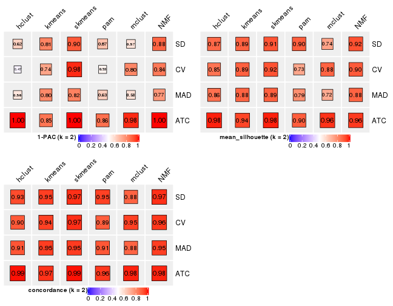</p>

</div>
<div id='tab-collect-stats-from-consensus-partition-list-2'>
<pre><code class="r">collect_stats(res_list, k = 3)
</code></pre>

<p>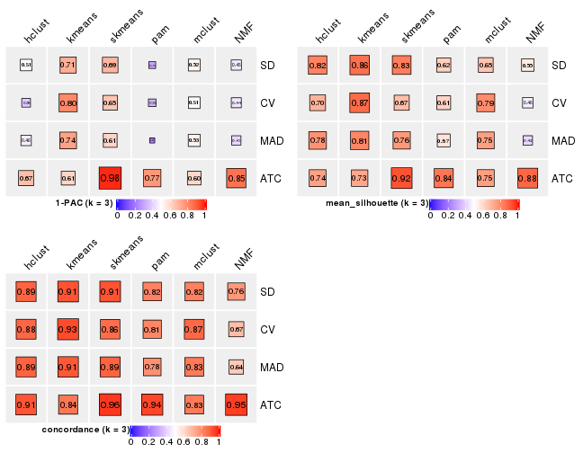</p>

</div>
<div id='tab-collect-stats-from-consensus-partition-list-3'>
<pre><code class="r">collect_stats(res_list, k = 4)
</code></pre>

<p>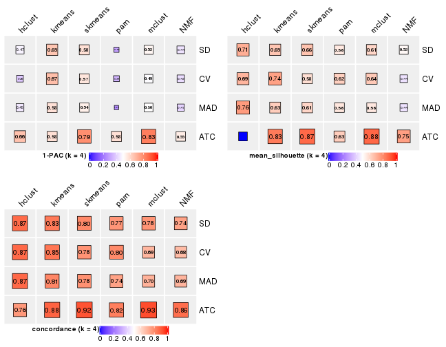</p>

</div>
<div id='tab-collect-stats-from-consensus-partition-list-4'>
<pre><code class="r">collect_stats(res_list, k = 5)
</code></pre>

<p>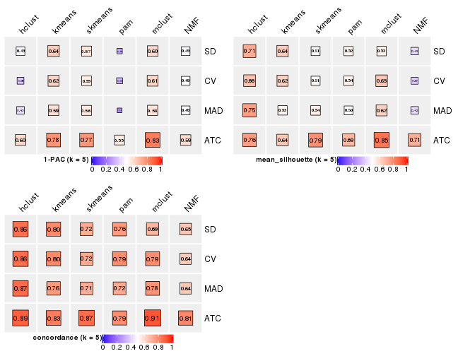</p>

</div>
<div id='tab-collect-stats-from-consensus-partition-list-5'>
<pre><code class="r">collect_stats(res_list, k = 6)
</code></pre>

<p>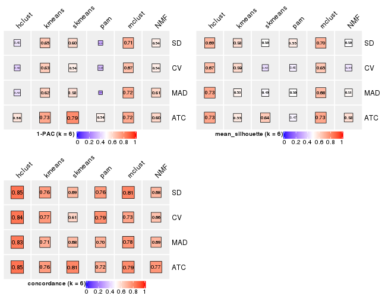</p>

</div>
</div>

### Partition from all methods


Collect partitions from all methods:


<script>
$( function() {
	$( '#tabs-collect-classes-from-consensus-partition-list' ).tabs();
} );
</script>
<div id='tabs-collect-classes-from-consensus-partition-list'>
<ul>
<li><a href='#tab-collect-classes-from-consensus-partition-list-1'>k = 2</a></li>
<li><a href='#tab-collect-classes-from-consensus-partition-list-2'>k = 3</a></li>
<li><a href='#tab-collect-classes-from-consensus-partition-list-3'>k = 4</a></li>
<li><a href='#tab-collect-classes-from-consensus-partition-list-4'>k = 5</a></li>
<li><a href='#tab-collect-classes-from-consensus-partition-list-5'>k = 6</a></li>
</ul>
<div id='tab-collect-classes-from-consensus-partition-list-1'>
<pre><code class="r">collect_classes(res_list, k = 2)
</code></pre>

<p>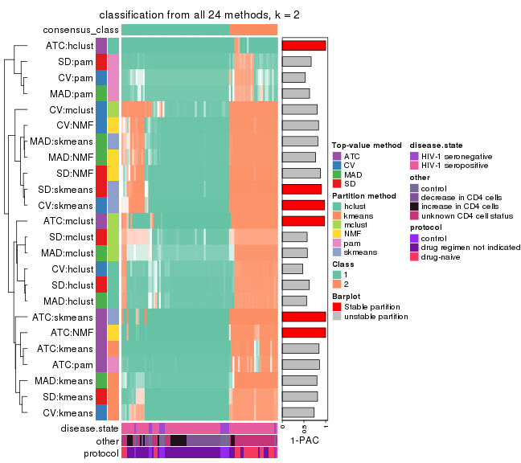</p>

</div>
<div id='tab-collect-classes-from-consensus-partition-list-2'>
<pre><code class="r">collect_classes(res_list, k = 3)
</code></pre>

<p>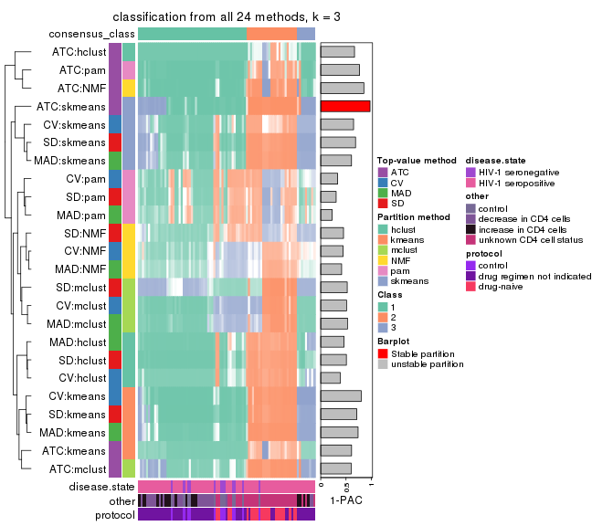</p>

</div>
<div id='tab-collect-classes-from-consensus-partition-list-3'>
<pre><code class="r">collect_classes(res_list, k = 4)
</code></pre>

<p>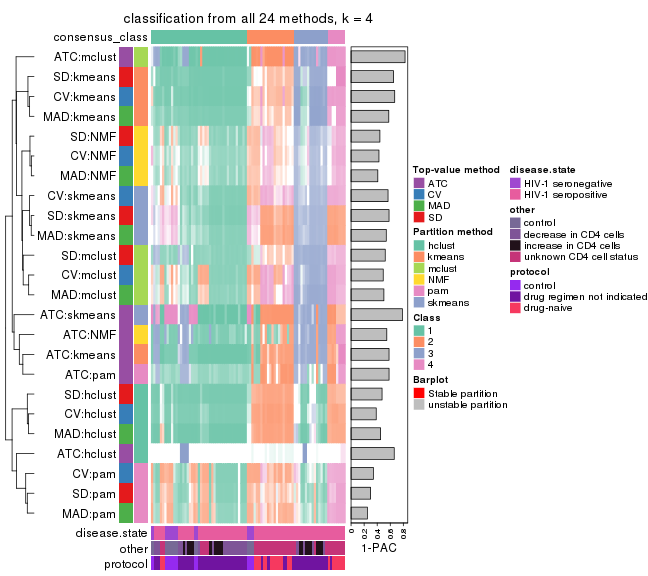</p>

</div>
<div id='tab-collect-classes-from-consensus-partition-list-4'>
<pre><code class="r">collect_classes(res_list, k = 5)
</code></pre>

<p>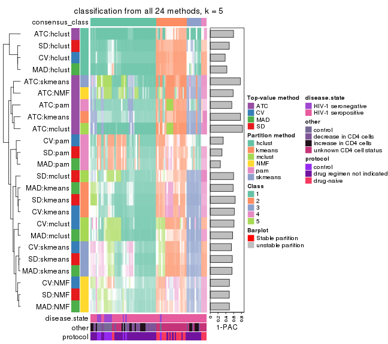</p>

</div>
<div id='tab-collect-classes-from-consensus-partition-list-5'>
<pre><code class="r">collect_classes(res_list, k = 6)
</code></pre>

<p>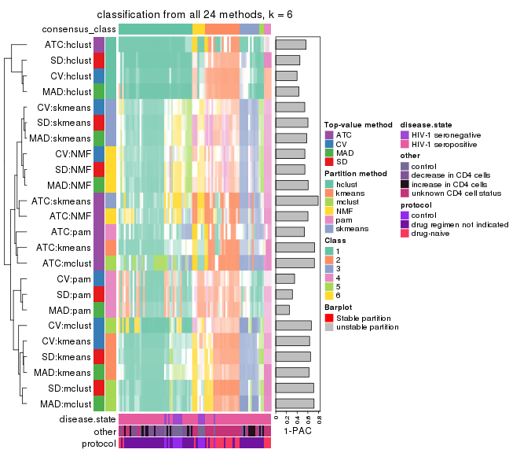</p>

</div>
</div>


### Top rows overlap


Overlap of top rows from different top-row methods:


<script>
$( function() {
	$( '#tabs-top-rows-overlap-by-euler' ).tabs();
} );
</script>
<div id='tabs-top-rows-overlap-by-euler'>
<ul>
<li><a href='#tab-top-rows-overlap-by-euler-1'>top_n = 835</a></li>
<li><a href='#tab-top-rows-overlap-by-euler-2'>top_n = 1670</a></li>
<li><a href='#tab-top-rows-overlap-by-euler-3'>top_n = 2506</a></li>
<li><a href='#tab-top-rows-overlap-by-euler-4'>top_n = 3341</a></li>
<li><a href='#tab-top-rows-overlap-by-euler-5'>top_n = 4176</a></li>
</ul>
<div id='tab-top-rows-overlap-by-euler-1'>
<pre><code class="r">top_rows_overlap(res_list, top_n = 835, method = &quot;euler&quot;)
</code></pre>

<p>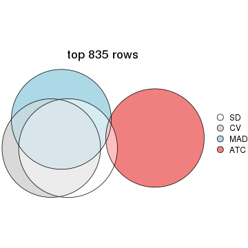</p>

</div>
<div id='tab-top-rows-overlap-by-euler-2'>
<pre><code class="r">top_rows_overlap(res_list, top_n = 1670, method = &quot;euler&quot;)
</code></pre>

<p>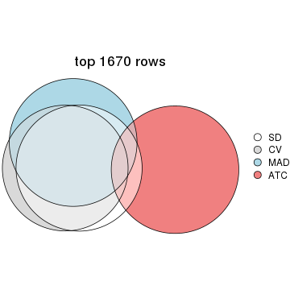</p>

</div>
<div id='tab-top-rows-overlap-by-euler-3'>
<pre><code class="r">top_rows_overlap(res_list, top_n = 2506, method = &quot;euler&quot;)
</code></pre>

<p>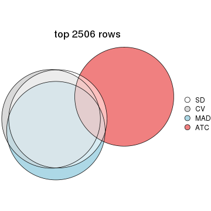</p>

</div>
<div id='tab-top-rows-overlap-by-euler-4'>
<pre><code class="r">top_rows_overlap(res_list, top_n = 3341, method = &quot;euler&quot;)
</code></pre>

<p>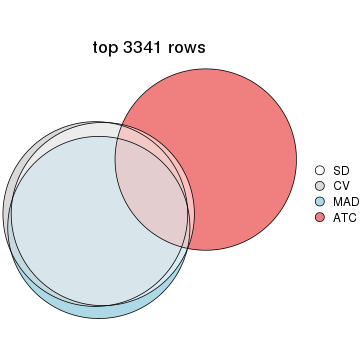</p>

</div>
<div id='tab-top-rows-overlap-by-euler-5'>
<pre><code class="r">top_rows_overlap(res_list, top_n = 4176, method = &quot;euler&quot;)
</code></pre>

<p>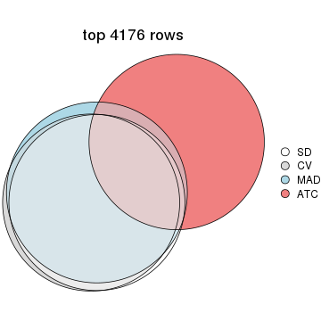</p>

</div>
</div>

Also visualize the correspondance of rankings between different top-row methods:


<script>
$( function() {
	$( '#tabs-top-rows-overlap-by-correspondance' ).tabs();
} );
</script>
<div id='tabs-top-rows-overlap-by-correspondance'>
<ul>
<li><a href='#tab-top-rows-overlap-by-correspondance-1'>top_n = 835</a></li>
<li><a href='#tab-top-rows-overlap-by-correspondance-2'>top_n = 1670</a></li>
<li><a href='#tab-top-rows-overlap-by-correspondance-3'>top_n = 2506</a></li>
<li><a href='#tab-top-rows-overlap-by-correspondance-4'>top_n = 3341</a></li>
<li><a href='#tab-top-rows-overlap-by-correspondance-5'>top_n = 4176</a></li>
</ul>
<div id='tab-top-rows-overlap-by-correspondance-1'>
<pre><code class="r">top_rows_overlap(res_list, top_n = 835, method = &quot;correspondance&quot;)
</code></pre>

<p>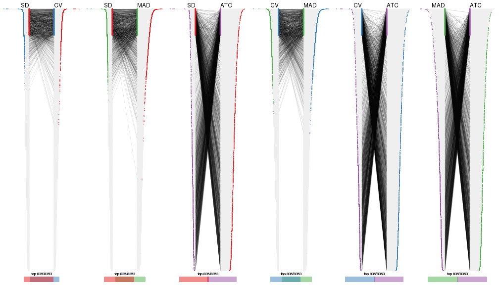</p>

</div>
<div id='tab-top-rows-overlap-by-correspondance-2'>
<pre><code class="r">top_rows_overlap(res_list, top_n = 1670, method = &quot;correspondance&quot;)
</code></pre>

<p>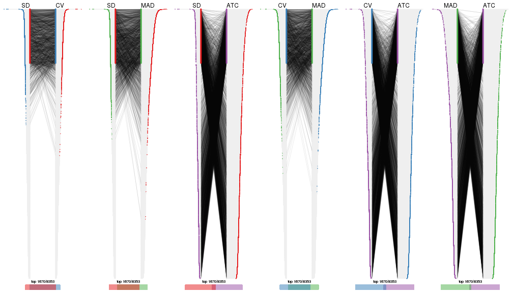</p>

</div>
<div id='tab-top-rows-overlap-by-correspondance-3'>
<pre><code class="r">top_rows_overlap(res_list, top_n = 2506, method = &quot;correspondance&quot;)
</code></pre>

<p>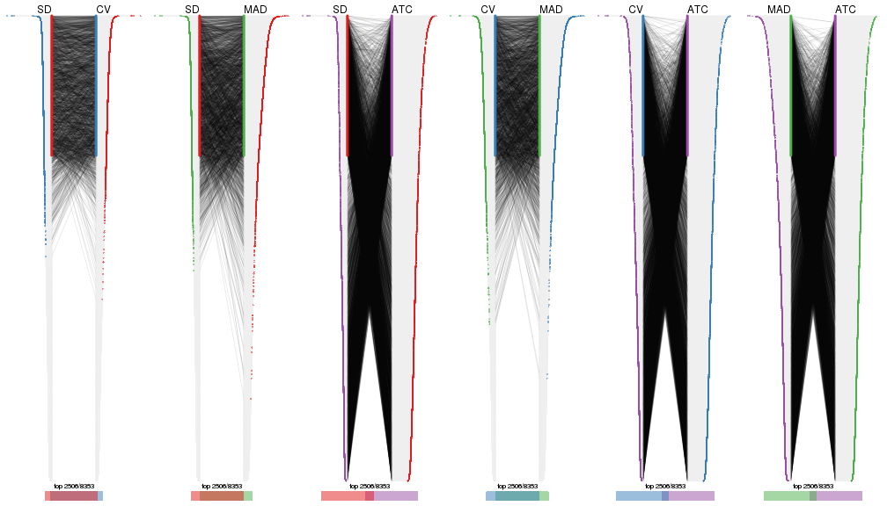</p>

</div>
<div id='tab-top-rows-overlap-by-correspondance-4'>
<pre><code class="r">top_rows_overlap(res_list, top_n = 3341, method = &quot;correspondance&quot;)
</code></pre>

<p>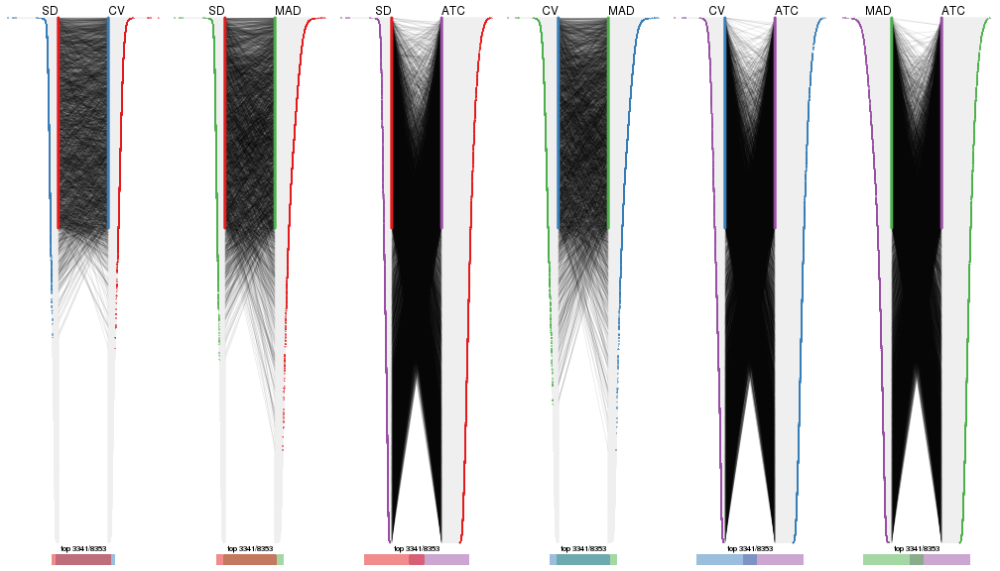</p>

</div>
<div id='tab-top-rows-overlap-by-correspondance-5'>
<pre><code class="r">top_rows_overlap(res_list, top_n = 4176, method = &quot;correspondance&quot;)
</code></pre>

<p>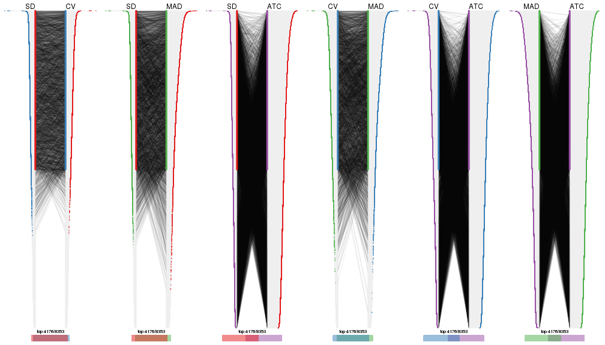</p>

</div>
</div>


Heatmaps of the top rows:


<script>
$( function() {
	$( '#tabs-top-rows-heatmap' ).tabs();
} );
</script>
<div id='tabs-top-rows-heatmap'>
<ul>
<li><a href='#tab-top-rows-heatmap-1'>top_n = 835</a></li>
<li><a href='#tab-top-rows-heatmap-2'>top_n = 1670</a></li>
<li><a href='#tab-top-rows-heatmap-3'>top_n = 2506</a></li>
<li><a href='#tab-top-rows-heatmap-4'>top_n = 3341</a></li>
<li><a href='#tab-top-rows-heatmap-5'>top_n = 4176</a></li>
</ul>
<div id='tab-top-rows-heatmap-1'>
<pre><code class="r">top_rows_heatmap(res_list, top_n = 835)
</code></pre>

<p>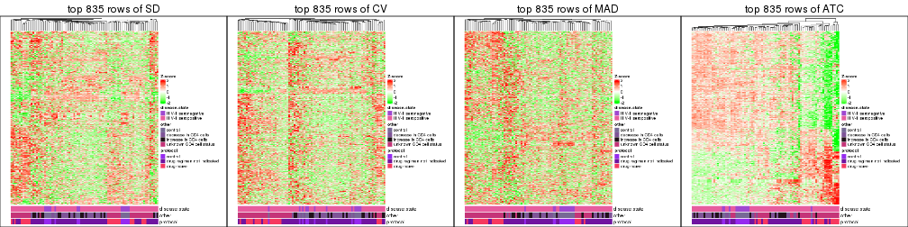</p>

</div>
<div id='tab-top-rows-heatmap-2'>
<pre><code class="r">top_rows_heatmap(res_list, top_n = 1670)
</code></pre>

<p>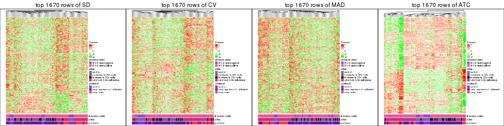</p>

</div>
<div id='tab-top-rows-heatmap-3'>
<pre><code class="r">top_rows_heatmap(res_list, top_n = 2506)
</code></pre>

<p>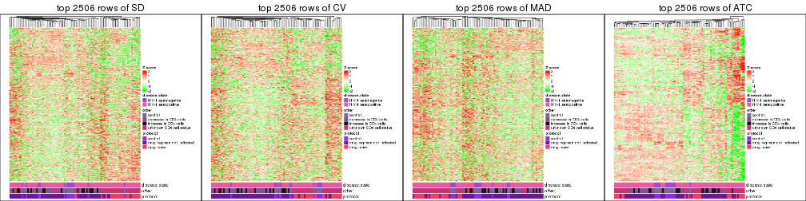</p>

</div>
<div id='tab-top-rows-heatmap-4'>
<pre><code class="r">top_rows_heatmap(res_list, top_n = 3341)
</code></pre>

<p>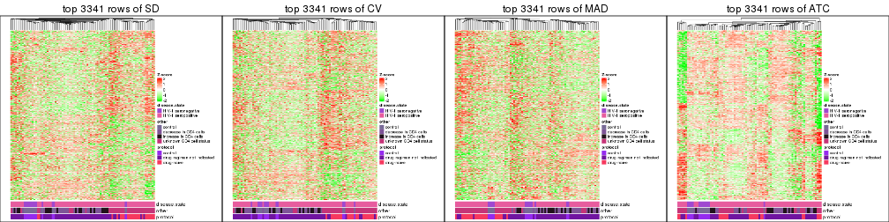</p>

</div>
<div id='tab-top-rows-heatmap-5'>
<pre><code class="r">top_rows_heatmap(res_list, top_n = 4176)
</code></pre>

<p>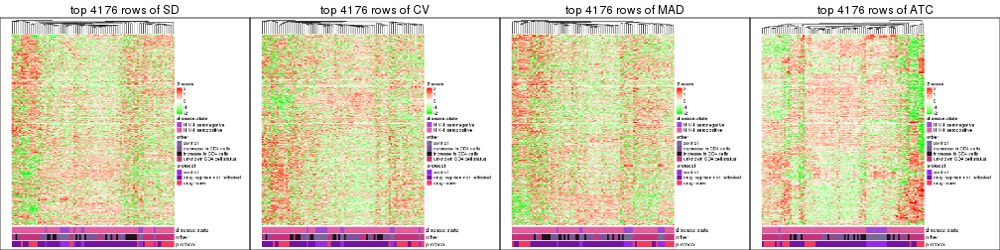</p>

</div>
</div>


### Test to known annotations


Test correlation between subgroups and known annotations. If the known
annotation is numeric, one-way ANOVA test is applied, and if the known
annotation is discrete, chi-squared contingency table test is applied.


<script>
$( function() {
	$( '#tabs-test-to-known-factors-from-consensus-partition-list' ).tabs();
} );
</script>
<div id='tabs-test-to-known-factors-from-consensus-partition-list'>
<ul>
<li><a href='#tab-test-to-known-factors-from-consensus-partition-list-1'>k = 2</a></li>
<li><a href='#tab-test-to-known-factors-from-consensus-partition-list-2'>k = 3</a></li>
<li><a href='#tab-test-to-known-factors-from-consensus-partition-list-3'>k = 4</a></li>
<li><a href='#tab-test-to-known-factors-from-consensus-partition-list-4'>k = 5</a></li>
<li><a href='#tab-test-to-known-factors-from-consensus-partition-list-5'>k = 6</a></li>
</ul>
<div id='tab-test-to-known-factors-from-consensus-partition-list-1'>
<pre><code class="r">test_to_known_factors(res_list, k = 2)
</code></pre>

<pre><code>#&gt;              n disease.state(p) other(p) protocol(p) k
#&gt; SD:NMF      84           0.0959 5.48e-07    4.41e-05 2
#&gt; CV:NMF      82           0.1504 2.11e-07    1.17e-05 2
#&gt; MAD:NMF     83           0.1379 1.27e-07    2.42e-06 2
#&gt; ATC:NMF     86           0.1284 8.56e-08    4.44e-07 2
#&gt; SD:skmeans  83           0.0736 1.42e-06    8.31e-05 2
#&gt; CV:skmeans  82           0.0814 3.50e-07    1.71e-05 2
#&gt; MAD:skmeans 82           0.0814 1.64e-07    6.97e-06 2
#&gt; ATC:skmeans 87           0.0715 3.03e-07    7.30e-07 2
#&gt; SD:mclust   69           0.1387 1.02e-09    1.23e-08 2
#&gt; CV:mclust   83           1.0000 2.68e-05    2.45e-04 2
#&gt; MAD:mclust  69           0.2090 9.91e-10    1.26e-08 2
#&gt; ATC:mclust  86           0.2058 3.97e-09    1.18e-08 2
#&gt; SD:kmeans   80           0.1285 1.76e-08    2.87e-07 2
#&gt; CV:kmeans   84           0.0731 6.30e-07    8.55e-05 2
#&gt; MAD:kmeans  84           0.1832 7.77e-10    1.25e-09 2
#&gt; ATC:kmeans  85           0.2206 6.68e-07    8.53e-07 2
#&gt; SD:pam      87           0.3413 3.14e-04    2.23e-05 2
#&gt; CV:pam      73           0.2096 2.00e-05    1.10e-04 2
#&gt; MAD:pam     76           0.3153 1.11e-04    3.79e-05 2
#&gt; ATC:pam     82           0.2992 8.44e-07    5.96e-07 2
#&gt; SD:hclust   85           0.1219 5.85e-12    6.19e-13 2
#&gt; CV:hclust   82           0.2713 1.83e-11    1.99e-12 2
#&gt; MAD:hclust  83           0.2514 1.04e-11    1.02e-12 2
#&gt; ATC:hclust  87           1.0000 2.02e-01    1.02e-02 2
</code></pre>

</div>
<div id='tab-test-to-known-factors-from-consensus-partition-list-2'>
<pre><code class="r">test_to_known_factors(res_list, k = 3)
</code></pre>

<pre><code>#&gt;              n disease.state(p) other(p) protocol(p) k
#&gt; SD:NMF      62          0.04454 1.51e-07    6.20e-07 3
#&gt; CV:NMF      46          0.27464 1.45e-07    1.77e-05 3
#&gt; MAD:NMF     46          0.05942 5.30e-08    1.71e-05 3
#&gt; ATC:NMF     82          0.16365 1.20e-07    1.62e-08 3
#&gt; SD:skmeans  84          0.01736 2.53e-10    1.37e-10 3
#&gt; CV:skmeans  68          0.18544 2.21e-07    1.59e-08 3
#&gt; MAD:skmeans 79          0.27650 5.54e-09    3.42e-09 3
#&gt; ATC:skmeans 84          0.00149 3.65e-09    3.07e-09 3
#&gt; SD:mclust   69          0.00106 2.98e-11    9.01e-09 3
#&gt; CV:mclust   84          0.00684 5.95e-13    2.98e-10 3
#&gt; MAD:mclust  81          0.00209 5.35e-13    6.46e-10 3
#&gt; ATC:mclust  76          0.01616 2.11e-09    8.51e-10 3
#&gt; SD:kmeans   84          0.02516 6.83e-09    2.65e-08 3
#&gt; CV:kmeans   83          0.06557 1.18e-08    3.87e-08 3
#&gt; MAD:kmeans  78          0.03446 3.35e-09    3.56e-09 3
#&gt; ATC:kmeans  82          0.32209 7.22e-06    1.70e-06 3
#&gt; SD:pam      71          0.02270 1.94e-11    1.88e-08 3
#&gt; CV:pam      68          0.00188 4.37e-12    8.74e-09 3
#&gt; MAD:pam     65          0.01086 1.89e-10    3.81e-08 3
#&gt; ATC:pam     80          0.38094 2.38e-05    7.41e-06 3
#&gt; SD:hclust   84          0.11555 2.06e-12    9.05e-13 3
#&gt; CV:hclust   76          0.17615 4.10e-10    3.40e-10 3
#&gt; MAD:hclust  82          0.18675 1.48e-10    2.61e-11 3
#&gt; ATC:hclust  72          0.44420 2.30e-03    2.86e-04 3
</code></pre>

</div>
<div id='tab-test-to-known-factors-from-consensus-partition-list-3'>
<pre><code class="r">test_to_known_factors(res_list, k = 4)
</code></pre>

<pre><code>#&gt;              n disease.state(p) other(p) protocol(p) k
#&gt; SD:NMF      56         9.28e-03 8.15e-08    8.74e-10 4
#&gt; CV:NMF      50         6.04e-01 2.73e-05    3.51e-08 4
#&gt; MAD:NMF     47         1.09e-02 6.19e-07    3.24e-09 4
#&gt; ATC:NMF     79         5.19e-02 9.69e-06    9.32e-06 4
#&gt; SD:skmeans  73         1.16e-07 3.85e-14    6.37e-15 4
#&gt; CV:skmeans  66         5.34e-03 4.49e-09    2.77e-09 4
#&gt; MAD:skmeans 66         2.60e-11 2.90e-18    4.43e-18 4
#&gt; ATC:skmeans 84         2.71e-11 4.43e-16    4.88e-16 4
#&gt; SD:mclust   66         1.52e-02 8.78e-06    2.01e-08 4
#&gt; CV:mclust   70         8.41e-02 2.03e-10    4.56e-07 4
#&gt; MAD:mclust  63         7.76e-03 4.26e-10    5.61e-09 4
#&gt; ATC:mclust  84         1.39e-02 2.13e-09    2.74e-09 4
#&gt; SD:kmeans   70         5.24e-02 1.50e-06    6.19e-09 4
#&gt; CV:kmeans   77         2.69e-01 3.02e-07    4.17e-08 4
#&gt; MAD:kmeans  65         1.72e-01 2.60e-05    7.02e-07 4
#&gt; ATC:kmeans  83         1.25e-02 3.24e-07    3.76e-08 4
#&gt; SD:pam      58         2.06e-03 1.88e-09    4.74e-10 4
#&gt; CV:pam      69         1.58e-03 1.32e-11    2.29e-08 4
#&gt; MAD:pam     62         7.55e-03 1.18e-10    3.24e-08 4
#&gt; ATC:pam     77         5.51e-02 1.07e-05    2.05e-06 4
#&gt; SD:hclust   77         1.54e-01 8.24e-12    1.35e-11 4
#&gt; CV:hclust   73         1.77e-01 9.63e-12    6.37e-11 4
#&gt; MAD:hclust  79         2.37e-01 8.65e-11    1.16e-10 4
#&gt; ATC:hclust   6               NA       NA          NA 4
</code></pre>

</div>
<div id='tab-test-to-known-factors-from-consensus-partition-list-4'>
<pre><code class="r">test_to_known_factors(res_list, k = 5)
</code></pre>

<pre><code>#&gt;              n disease.state(p) other(p) protocol(p) k
#&gt; SD:NMF      38         1.12e-07 6.99e-10    1.45e-10 5
#&gt; CV:NMF      35         5.02e-02 1.84e-04    5.27e-05 5
#&gt; MAD:NMF     36         2.89e-07 7.84e-08    8.44e-11 5
#&gt; ATC:NMF     73         1.03e-07 1.98e-09    8.01e-11 5
#&gt; SD:skmeans  48               NA 1.16e-05    6.35e-07 5
#&gt; CV:skmeans  57         2.46e-04 1.64e-08    2.65e-09 5
#&gt; MAD:skmeans 59         1.29e-05 1.25e-09    2.09e-10 5
#&gt; ATC:skmeans 82         2.54e-11 3.98e-14    6.24e-15 5
#&gt; SD:mclust   59         2.11e-02 1.40e-07    5.06e-08 5
#&gt; CV:mclust   75         6.13e-02 4.22e-11    3.01e-07 5
#&gt; MAD:mclust  61         7.86e-02 1.02e-06    9.16e-08 5
#&gt; ATC:mclust  82         1.79e-02 2.46e-07    3.55e-09 5
#&gt; SD:kmeans   70         1.67e-01 5.61e-06    2.30e-07 5
#&gt; CV:kmeans   73         2.36e-01 2.19e-08    1.21e-09 5
#&gt; MAD:kmeans  59         5.67e-01 1.46e-04    1.67e-06 5
#&gt; ATC:kmeans  62         3.64e-01 1.78e-04    1.18e-05 5
#&gt; SD:pam      57         1.66e-03 6.53e-10    6.63e-09 5
#&gt; CV:pam      59         6.20e-03 1.38e-09    2.67e-07 5
#&gt; MAD:pam     56         2.01e-02 8.84e-10    1.93e-07 5
#&gt; ATC:pam     79         6.55e-02 7.50e-06    2.53e-06 5
#&gt; SD:hclust   75         2.79e-01 1.23e-09    1.74e-09 5
#&gt; CV:hclust   73         1.77e-01 9.63e-12    6.37e-11 5
#&gt; MAD:hclust  78         2.01e-01 4.63e-12    7.17e-12 5
#&gt; ATC:hclust  75         6.34e-01 3.16e-04    5.29e-06 5
</code></pre>

</div>
<div id='tab-test-to-known-factors-from-consensus-partition-list-5'>
<pre><code class="r">test_to_known_factors(res_list, k = 6)
</code></pre>

<pre><code>#&gt;              n disease.state(p) other(p) protocol(p) k
#&gt; SD:NMF      54         2.10e-10 2.93e-11    4.51e-15 6
#&gt; CV:NMF      47               NA 8.00e-03    1.94e-06 6
#&gt; MAD:NMF     51         8.65e-10 3.73e-10    4.97e-14 6
#&gt; ATC:NMF     60         1.41e-08 2.51e-10    2.40e-11 6
#&gt; SD:skmeans  51         8.65e-10 2.01e-11    1.67e-15 6
#&gt; CV:skmeans  42         1.67e-08 1.25e-08    7.63e-15 6
#&gt; MAD:skmeans 56         2.15e-06 7.30e-09    8.39e-13 6
#&gt; ATC:skmeans 66         3.12e-09 1.04e-10    3.18e-11 6
#&gt; SD:mclust   77         3.91e-01 2.39e-07    1.94e-07 6
#&gt; CV:mclust   64         7.10e-02 7.85e-08    1.91e-05 6
#&gt; MAD:mclust  70         3.82e-01 2.95e-08    7.73e-08 6
#&gt; ATC:mclust  77         3.56e-03 7.56e-09    2.82e-10 6
#&gt; SD:kmeans   68         8.55e-01 2.76e-05    9.53e-07 6
#&gt; CV:kmeans   61         4.58e-01 3.39e-05    1.43e-07 6
#&gt; MAD:kmeans  56         4.43e-01 7.24e-05    8.45e-07 6
#&gt; ATC:kmeans  56         6.37e-01 1.93e-02    3.86e-03 6
#&gt; SD:pam      60         7.47e-03 3.99e-09    2.10e-08 6
#&gt; CV:pam      50         1.41e-02 1.78e-08    5.06e-07 6
#&gt; MAD:pam     56         2.05e-02 7.12e-09    3.69e-07 6
#&gt; ATC:pam     60         5.45e-01 3.78e-03    4.26e-04 6
#&gt; SD:hclust   69         6.25e-01 2.62e-07    2.97e-10 6
#&gt; CV:hclust   70         2.68e-01 2.72e-10    2.61e-12 6
#&gt; MAD:hclust  74         2.81e-01 4.43e-11    3.86e-13 6
#&gt; ATC:hclust  76         4.92e-01 4.42e-05    7.40e-05 6
</code></pre>

</div>
</div>


 
## Results for each method


---------------------------------------------------


### SD:hclust


The object with results only for a single top-value method and a single partition method 
can be extracted as:

```r
res = res_list["SD", "hclust"]
# you can also extract it by
# res = res_list["SD:hclust"]
```

A summary of `res` and all the functions that can be applied to it:

```r
res
```

```
#> A 'ConsensusPartition' object with k = 2, 3, 4, 5, 6.
#>   On a matrix with 8353 rows and 87 columns.
#>   Top rows (835, 1670, 2506, 3341, 4176) are extracted by 'SD' method.
#>   Subgroups are detected by 'hclust' method.
#>   Performed in total 1250 partitions by row resampling.
#>   Best k for subgroups seems to be 2.
#> 
#> Following methods can be applied to this 'ConsensusPartition' object:
#>  [1] "cola_report"             "collect_classes"         "collect_plots"          
#>  [4] "collect_stats"           "colnames"                "compare_signatures"     
#>  [7] "consensus_heatmap"       "dimension_reduction"     "functional_enrichment"  
#> [10] "get_anno_col"            "get_anno"                "get_classes"            
#> [13] "get_consensus"           "get_matrix"              "get_membership"         
#> [16] "get_param"               "get_signatures"          "get_stats"              
#> [19] "is_best_k"               "is_stable_k"             "membership_heatmap"     
#> [22] "ncol"                    "nrow"                    "plot_ecdf"              
#> [25] "rownames"                "select_partition_number" "show"                   
#> [28] "suggest_best_k"          "test_to_known_factors"
```

`collect_plots()` function collects all the plots made from `res` for all `k` (number of partitions)
into one single page to provide an easy and fast comparison between different `k`.

```r
collect_plots(res)
```

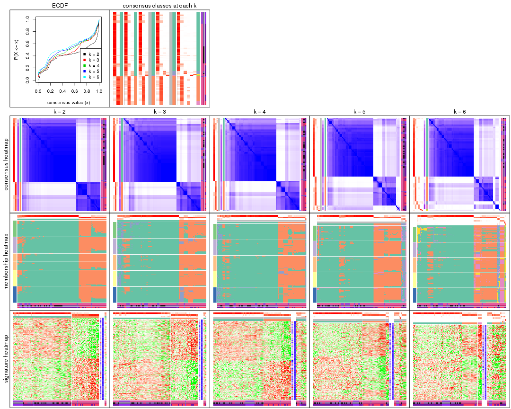

The plots are:

- The first row: a plot of the ECDF (Empirical cumulative distribution
  function) curves of the consensus matrix for each `k` and the heatmap of
  predicted classes for each `k`.
- The second row: heatmaps of the consensus matrix for each `k`.
- The third row: heatmaps of the membership matrix for each `k`.
- The fouth row: heatmaps of the signatures for each `k`.

All the plots in panels can be made by individual functions and they are
plotted later in this section.

`select_partition_number()` produces several plots showing different
statistics for choosing "optimized" `k`. There are following statistics:

- ECDF curves of the consensus matrix for each `k`;
- 1-PAC. [The PAC
  score](https://en.wikipedia.org/wiki/Consensus_clustering#Over-interpretation_potential_of_consensus_clustering)
  measures the proportion of the ambiguous subgrouping.
- Mean silhouette score.
- Concordance. The mean probability of fiting the consensus class ids in all
  partitions.
- Area increased. Denote $A_k$ as the area under the ECDF curve for current
  `k`, the area increased is defined as $A_k - A_{k-1}$.
- Rand index. The percent of pairs of samples that are both in a same cluster
  or both are not in a same cluster in the partition of k and k-1.
- Jaccard index. The ratio of pairs of samples are both in a same cluster in
  the partition of k and k-1 and the pairs of samples are both in a same
  cluster in the partition k or k-1.

The detailed explanations of these statistics can be found in [the cola
vignette](http://bioconductor.org/packages/devel/bioc/vignettes/cola/inst/doc/cola.html#toc_13).

Generally speaking, lower PAC score, higher mean silhouette score or higher
concordance corresponds to better partition. Rand index and Jaccard index
measure how similar the current partition is compared to partition with `k-1`.
If they are too similar, we won't accept `k` is better than `k-1`.

```r
select_partition_number(res)
```

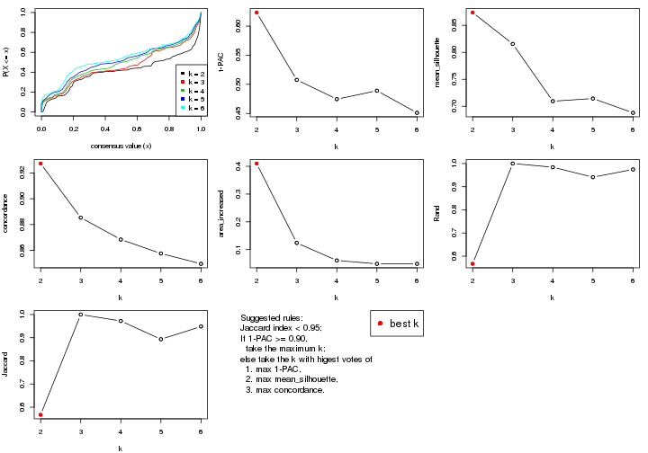

The numeric values for all these statistics can be obtained by `get_stats()`.

```r
get_stats(res)
```

```
#>   k 1-PAC mean_silhouette concordance area_increased  Rand Jaccard
#> 2 2 0.623           0.874       0.927         0.4100 0.567   0.567
#> 3 3 0.508           0.816       0.885         0.1241 1.000   1.000
#> 4 4 0.475           0.709       0.868         0.0608 0.984   0.972
#> 5 5 0.489           0.714       0.858         0.0487 0.941   0.893
#> 6 6 0.451           0.688       0.850         0.0488 0.975   0.948
```

`suggest_best_k()` suggests the best $k$ based on these statistics. The rules are as follows:

- All $k$ with Jaccard index larger than 0.95 are removed because the increase of
  the partition number does not provides enough extra information. If all $k$ are removed,
  the best $k$ is assigned by `NA`.
- For $k$ with 1-PAC larger than 0.9, the maximal $k$ is taken as the "best k". Other $k$ is called "optional k".
- If it does not fit the second rule. The $k$ with the highest vote of highest
  1-PAC, mean silhouette and concordance is taken as the "best k".

```r
suggest_best_k(res)
```

```
#> [1] 2
```


Following shows the table of the partitions (You need to click the **show/hide
code output** link to see it). The membership matrix (columns with name `p*`)
is inferred by
[`clue::cl_consensus()`](https://www.rdocumentation.org/link/cl_consensus?package=clue)
function with the `SE` method. Basically the value in the membership matrix
represents the probability to belong to a certain group. The finall class
label for an item is determined with the group with highest probability it
belongs to.

In `get_classes()` function, the entropy is calculated from the membership
matrix and the silhouette score is calculated from the consensus matrix.


<script>
$( function() {
	$( '#tabs-SD-hclust-get-classes' ).tabs();
} );
</script>
<div id='tabs-SD-hclust-get-classes'>
<ul>
<li><a href='#tab-SD-hclust-get-classes-1'>k = 2</a></li>
<li><a href='#tab-SD-hclust-get-classes-2'>k = 3</a></li>
<li><a href='#tab-SD-hclust-get-classes-3'>k = 4</a></li>
<li><a href='#tab-SD-hclust-get-classes-4'>k = 5</a></li>
<li><a href='#tab-SD-hclust-get-classes-5'>k = 6</a></li>
</ul>

<div id='tab-SD-hclust-get-classes-1'>
<p><a id='tab-SD-hclust-get-classes-1-a' style='color:#0366d6' href='#'>show/hide code output</a></p>
<pre><code class="r">cbind(get_classes(res, k = 2), get_membership(res, k = 2))
</code></pre>

<pre><code>#&gt;          class entropy silhouette    p1    p2
#&gt; GSM39104     1  0.0000      0.943 1.000 0.000
#&gt; GSM39105     1  0.0672      0.941 0.992 0.008
#&gt; GSM39106     1  0.5178      0.838 0.884 0.116
#&gt; GSM39107     1  0.8861      0.504 0.696 0.304
#&gt; GSM39108     1  0.1633      0.932 0.976 0.024
#&gt; GSM39109     1  0.3274      0.903 0.940 0.060
#&gt; GSM39110     1  0.3114      0.907 0.944 0.056
#&gt; GSM39111     1  0.1414      0.935 0.980 0.020
#&gt; GSM39112     1  0.8813      0.514 0.700 0.300
#&gt; GSM39113     1  0.8861      0.504 0.696 0.304
#&gt; GSM39114     2  0.8955      0.711 0.312 0.688
#&gt; GSM39115     1  0.0672      0.941 0.992 0.008
#&gt; GSM39148     1  0.0000      0.943 1.000 0.000
#&gt; GSM39149     1  0.0938      0.937 0.988 0.012
#&gt; GSM39150     1  0.0000      0.943 1.000 0.000
#&gt; GSM39151     1  0.0938      0.937 0.988 0.012
#&gt; GSM39152     1  0.0000      0.943 1.000 0.000
#&gt; GSM39153     1  0.0376      0.942 0.996 0.004
#&gt; GSM39154     1  0.0000      0.943 1.000 0.000
#&gt; GSM39155     1  0.0000      0.943 1.000 0.000
#&gt; GSM39156     1  0.2043      0.928 0.968 0.032
#&gt; GSM39157     1  0.0000      0.943 1.000 0.000
#&gt; GSM39158     1  0.0000      0.943 1.000 0.000
#&gt; GSM39159     1  0.0672      0.942 0.992 0.008
#&gt; GSM39160     1  0.0000      0.943 1.000 0.000
#&gt; GSM39161     1  0.1633      0.935 0.976 0.024
#&gt; GSM39162     1  0.0000      0.943 1.000 0.000
#&gt; GSM39163     1  0.0376      0.943 0.996 0.004
#&gt; GSM39164     1  0.0000      0.943 1.000 0.000
#&gt; GSM39165     1  0.0000      0.943 1.000 0.000
#&gt; GSM39166     1  0.0000      0.943 1.000 0.000
#&gt; GSM39167     1  0.0376      0.943 0.996 0.004
#&gt; GSM39168     1  0.0000      0.943 1.000 0.000
#&gt; GSM39169     1  0.0000      0.943 1.000 0.000
#&gt; GSM39170     1  0.0000      0.943 1.000 0.000
#&gt; GSM39171     1  0.0000      0.943 1.000 0.000
#&gt; GSM39172     1  0.0000      0.943 1.000 0.000
#&gt; GSM39173     1  0.3114      0.910 0.944 0.056
#&gt; GSM39174     1  0.0000      0.943 1.000 0.000
#&gt; GSM39175     1  0.0000      0.943 1.000 0.000
#&gt; GSM39176     1  0.0376      0.943 0.996 0.004
#&gt; GSM39177     1  0.0376      0.941 0.996 0.004
#&gt; GSM39178     1  0.0000      0.943 1.000 0.000
#&gt; GSM39179     1  0.0938      0.937 0.988 0.012
#&gt; GSM39180     1  0.6973      0.753 0.812 0.188
#&gt; GSM39181     1  0.0000      0.943 1.000 0.000
#&gt; GSM39182     1  0.1843      0.931 0.972 0.028
#&gt; GSM39183     1  0.0000      0.943 1.000 0.000
#&gt; GSM39184     1  0.0000      0.943 1.000 0.000
#&gt; GSM39185     1  0.1633      0.935 0.976 0.024
#&gt; GSM39186     1  0.0672      0.941 0.992 0.008
#&gt; GSM39187     1  0.1184      0.938 0.984 0.016
#&gt; GSM39116     2  0.6343      0.886 0.160 0.840
#&gt; GSM39117     2  0.1843      0.870 0.028 0.972
#&gt; GSM39118     2  0.4431      0.885 0.092 0.908
#&gt; GSM39119     2  0.1843      0.871 0.028 0.972
#&gt; GSM39120     1  0.9522      0.314 0.628 0.372
#&gt; GSM39121     2  0.8443      0.776 0.272 0.728
#&gt; GSM39122     2  0.8207      0.798 0.256 0.744
#&gt; GSM39123     2  0.1843      0.870 0.028 0.972
#&gt; GSM39124     2  0.7056      0.871 0.192 0.808
#&gt; GSM39125     1  0.9922      0.020 0.552 0.448
#&gt; GSM39126     2  0.8909      0.716 0.308 0.692
#&gt; GSM39127     2  0.6801      0.879 0.180 0.820
#&gt; GSM39128     2  0.7139      0.867 0.196 0.804
#&gt; GSM39129     2  0.1184      0.866 0.016 0.984
#&gt; GSM39130     2  0.1843      0.870 0.028 0.972
#&gt; GSM39131     2  0.6623      0.883 0.172 0.828
#&gt; GSM39132     2  0.6438      0.886 0.164 0.836
#&gt; GSM39133     2  0.1843      0.870 0.028 0.972
#&gt; GSM39134     2  0.1843      0.870 0.028 0.972
#&gt; GSM39135     2  0.6438      0.886 0.164 0.836
#&gt; GSM39136     2  0.6048      0.887 0.148 0.852
#&gt; GSM39137     2  0.7056      0.871 0.192 0.808
#&gt; GSM39138     2  0.1184      0.866 0.016 0.984
#&gt; GSM39139     2  0.1184      0.866 0.016 0.984
#&gt; GSM39140     1  0.7674      0.677 0.776 0.224
#&gt; GSM39141     1  0.2423      0.920 0.960 0.040
#&gt; GSM39142     1  0.2423      0.920 0.960 0.040
#&gt; GSM39143     1  0.2423      0.920 0.960 0.040
#&gt; GSM39144     2  0.1184      0.866 0.016 0.984
#&gt; GSM39145     2  0.4562      0.886 0.096 0.904
#&gt; GSM39146     2  0.6623      0.883 0.172 0.828
#&gt; GSM39147     2  0.7056      0.871 0.192 0.808
#&gt; GSM39188     1  0.1184      0.933 0.984 0.016
#&gt; GSM39189     1  0.0000      0.943 1.000 0.000
#&gt; GSM39190     1  0.0672      0.939 0.992 0.008
</code></pre>

<script>
$('#tab-SD-hclust-get-classes-1-a').parent().next().next().hide();
$('#tab-SD-hclust-get-classes-1-a').click(function(){
  $('#tab-SD-hclust-get-classes-1-a').parent().next().next().toggle();
  return(false);
});
</script>
</div>

<div id='tab-SD-hclust-get-classes-2'>
<p><a id='tab-SD-hclust-get-classes-2-a' style='color:#0366d6' href='#'>show/hide code output</a></p>
<pre><code class="r">cbind(get_classes(res, k = 3), get_membership(res, k = 3))
</code></pre>

<pre><code>#&gt;          class entropy silhouette    p1    p2    p3
#&gt; GSM39104     1  0.0000     0.9032 1.000 0.000 0.000
#&gt; GSM39105     1  0.0424     0.9027 0.992 0.008 0.000
#&gt; GSM39106     1  0.3412     0.8141 0.876 0.124 0.000
#&gt; GSM39107     1  0.5650     0.5087 0.688 0.312 0.000
#&gt; GSM39108     1  0.1163     0.8956 0.972 0.028 0.000
#&gt; GSM39109     1  0.2165     0.8736 0.936 0.064 0.000
#&gt; GSM39110     1  0.2066     0.8766 0.940 0.060 0.000
#&gt; GSM39111     1  0.1031     0.8975 0.976 0.024 0.000
#&gt; GSM39112     1  0.5621     0.5173 0.692 0.308 0.000
#&gt; GSM39113     1  0.5650     0.5087 0.688 0.312 0.000
#&gt; GSM39114     2  0.5591     0.6869 0.304 0.696 0.000
#&gt; GSM39115     1  0.0424     0.9027 0.992 0.008 0.000
#&gt; GSM39148     1  0.0000     0.9032 1.000 0.000 0.000
#&gt; GSM39149     1  0.6155     0.6078 0.664 0.008 0.328
#&gt; GSM39150     1  0.0000     0.9032 1.000 0.000 0.000
#&gt; GSM39151     1  0.5621     0.6470 0.692 0.000 0.308
#&gt; GSM39152     1  0.0000     0.9032 1.000 0.000 0.000
#&gt; GSM39153     1  0.0237     0.9030 0.996 0.004 0.000
#&gt; GSM39154     1  0.0000     0.9032 1.000 0.000 0.000
#&gt; GSM39155     1  0.0000     0.9032 1.000 0.000 0.000
#&gt; GSM39156     1  0.1289     0.8945 0.968 0.032 0.000
#&gt; GSM39157     1  0.0000     0.9032 1.000 0.000 0.000
#&gt; GSM39158     1  0.0892     0.9000 0.980 0.000 0.020
#&gt; GSM39159     1  0.1525     0.8940 0.964 0.004 0.032
#&gt; GSM39160     1  0.0000     0.9032 1.000 0.000 0.000
#&gt; GSM39161     1  0.3207     0.8598 0.904 0.012 0.084
#&gt; GSM39162     1  0.0000     0.9032 1.000 0.000 0.000
#&gt; GSM39163     1  0.0237     0.9033 0.996 0.004 0.000
#&gt; GSM39164     1  0.0000     0.9032 1.000 0.000 0.000
#&gt; GSM39165     1  0.0000     0.9032 1.000 0.000 0.000
#&gt; GSM39166     1  0.1289     0.8950 0.968 0.000 0.032
#&gt; GSM39167     1  0.0237     0.9033 0.996 0.004 0.000
#&gt; GSM39168     1  0.0000     0.9032 1.000 0.000 0.000
#&gt; GSM39169     1  0.0000     0.9032 1.000 0.000 0.000
#&gt; GSM39170     1  0.0747     0.9000 0.984 0.000 0.016
#&gt; GSM39171     1  0.0000     0.9032 1.000 0.000 0.000
#&gt; GSM39172     1  0.0661     0.9027 0.988 0.008 0.004
#&gt; GSM39173     1  0.4097     0.8436 0.880 0.060 0.060
#&gt; GSM39174     1  0.0000     0.9032 1.000 0.000 0.000
#&gt; GSM39175     1  0.0000     0.9032 1.000 0.000 0.000
#&gt; GSM39176     1  0.0237     0.9033 0.996 0.004 0.000
#&gt; GSM39177     1  0.1647     0.8928 0.960 0.004 0.036
#&gt; GSM39178     1  0.0000     0.9032 1.000 0.000 0.000
#&gt; GSM39179     1  0.6104     0.5846 0.648 0.004 0.348
#&gt; GSM39180     1  0.8261     0.5214 0.616 0.124 0.260
#&gt; GSM39181     1  0.1289     0.8950 0.968 0.000 0.032
#&gt; GSM39182     1  0.1585     0.8955 0.964 0.028 0.008
#&gt; GSM39183     1  0.1289     0.8950 0.968 0.000 0.032
#&gt; GSM39184     1  0.0000     0.9032 1.000 0.000 0.000
#&gt; GSM39185     1  0.3207     0.8598 0.904 0.012 0.084
#&gt; GSM39186     1  0.0424     0.9027 0.992 0.008 0.000
#&gt; GSM39187     1  0.0747     0.9007 0.984 0.016 0.000
#&gt; GSM39116     2  0.4228     0.8584 0.148 0.844 0.008
#&gt; GSM39117     2  0.5502     0.7813 0.008 0.744 0.248
#&gt; GSM39118     2  0.3550     0.8549 0.080 0.896 0.024
#&gt; GSM39119     2  0.3454     0.8278 0.008 0.888 0.104
#&gt; GSM39120     1  0.6062     0.3173 0.616 0.384 0.000
#&gt; GSM39121     2  0.5216     0.7533 0.260 0.740 0.000
#&gt; GSM39122     2  0.5058     0.7749 0.244 0.756 0.000
#&gt; GSM39123     2  0.5502     0.7813 0.008 0.744 0.248
#&gt; GSM39124     2  0.4291     0.8438 0.180 0.820 0.000
#&gt; GSM39125     1  0.6280     0.0349 0.540 0.460 0.000
#&gt; GSM39126     2  0.5529     0.6946 0.296 0.704 0.000
#&gt; GSM39127     2  0.4121     0.8515 0.168 0.832 0.000
#&gt; GSM39128     2  0.4346     0.8404 0.184 0.816 0.000
#&gt; GSM39129     2  0.2356     0.8209 0.000 0.928 0.072
#&gt; GSM39130     2  0.5502     0.7813 0.008 0.744 0.248
#&gt; GSM39131     2  0.4233     0.8554 0.160 0.836 0.004
#&gt; GSM39132     2  0.4110     0.8576 0.152 0.844 0.004
#&gt; GSM39133     2  0.5502     0.7813 0.008 0.744 0.248
#&gt; GSM39134     2  0.2860     0.8216 0.004 0.912 0.084
#&gt; GSM39135     2  0.4110     0.8576 0.152 0.844 0.004
#&gt; GSM39136     2  0.4195     0.8592 0.136 0.852 0.012
#&gt; GSM39137     2  0.4291     0.8438 0.180 0.820 0.000
#&gt; GSM39138     2  0.2261     0.8218 0.000 0.932 0.068
#&gt; GSM39139     2  0.2261     0.8218 0.000 0.932 0.068
#&gt; GSM39140     1  0.4931     0.6677 0.768 0.232 0.000
#&gt; GSM39141     1  0.1753     0.8851 0.952 0.048 0.000
#&gt; GSM39142     1  0.1753     0.8851 0.952 0.048 0.000
#&gt; GSM39143     1  0.1753     0.8851 0.952 0.048 0.000
#&gt; GSM39144     2  0.2261     0.8218 0.000 0.932 0.068
#&gt; GSM39145     2  0.4035     0.8521 0.080 0.880 0.040
#&gt; GSM39146     2  0.4575     0.8557 0.160 0.828 0.012
#&gt; GSM39147     2  0.4291     0.8438 0.180 0.820 0.000
#&gt; GSM39188     1  0.6280     0.4378 0.540 0.000 0.460
#&gt; GSM39189     1  0.1129     0.9001 0.976 0.004 0.020
#&gt; GSM39190     1  0.5902     0.6320 0.680 0.004 0.316
</code></pre>

<script>
$('#tab-SD-hclust-get-classes-2-a').parent().next().next().hide();
$('#tab-SD-hclust-get-classes-2-a').click(function(){
  $('#tab-SD-hclust-get-classes-2-a').parent().next().next().toggle();
  return(false);
});
</script>
</div>

<div id='tab-SD-hclust-get-classes-3'>
<p><a id='tab-SD-hclust-get-classes-3-a' style='color:#0366d6' href='#'>show/hide code output</a></p>
<pre><code class="r">cbind(get_classes(res, k = 4), get_membership(res, k = 4))
</code></pre>

<pre><code>#&gt;          class entropy silhouette    p1    p2    p3 p4
#&gt; GSM39104     1  0.0000      0.870 1.000 0.000 0.000 NA
#&gt; GSM39105     1  0.0336      0.870 0.992 0.008 0.000 NA
#&gt; GSM39106     1  0.2704      0.777 0.876 0.124 0.000 NA
#&gt; GSM39107     1  0.4477      0.496 0.688 0.312 0.000 NA
#&gt; GSM39108     1  0.0921      0.863 0.972 0.028 0.000 NA
#&gt; GSM39109     1  0.1902      0.839 0.932 0.064 0.000 NA
#&gt; GSM39110     1  0.1637      0.842 0.940 0.060 0.000 NA
#&gt; GSM39111     1  0.0817      0.865 0.976 0.024 0.000 NA
#&gt; GSM39112     1  0.4454      0.505 0.692 0.308 0.000 NA
#&gt; GSM39113     1  0.4477      0.496 0.688 0.312 0.000 NA
#&gt; GSM39114     2  0.4431      0.622 0.304 0.696 0.000 NA
#&gt; GSM39115     1  0.0336      0.870 0.992 0.008 0.000 NA
#&gt; GSM39148     1  0.0000      0.870 1.000 0.000 0.000 NA
#&gt; GSM39149     1  0.7935     -0.273 0.460 0.008 0.256 NA
#&gt; GSM39150     1  0.0376      0.868 0.992 0.000 0.004 NA
#&gt; GSM39151     1  0.7631     -0.313 0.456 0.000 0.320 NA
#&gt; GSM39152     1  0.0376      0.868 0.992 0.000 0.004 NA
#&gt; GSM39153     1  0.0188      0.870 0.996 0.004 0.000 NA
#&gt; GSM39154     1  0.0000      0.870 1.000 0.000 0.000 NA
#&gt; GSM39155     1  0.0000      0.870 1.000 0.000 0.000 NA
#&gt; GSM39156     1  0.1022      0.862 0.968 0.032 0.000 NA
#&gt; GSM39157     1  0.0000      0.870 1.000 0.000 0.000 NA
#&gt; GSM39158     1  0.1004      0.864 0.972 0.000 0.004 NA
#&gt; GSM39159     1  0.1489      0.852 0.952 0.000 0.004 NA
#&gt; GSM39160     1  0.0376      0.868 0.992 0.000 0.004 NA
#&gt; GSM39161     1  0.2922      0.799 0.884 0.008 0.004 NA
#&gt; GSM39162     1  0.0000      0.870 1.000 0.000 0.000 NA
#&gt; GSM39163     1  0.0188      0.870 0.996 0.004 0.000 NA
#&gt; GSM39164     1  0.0000      0.870 1.000 0.000 0.000 NA
#&gt; GSM39165     1  0.0336      0.870 0.992 0.000 0.008 NA
#&gt; GSM39166     1  0.1305      0.857 0.960 0.000 0.004 NA
#&gt; GSM39167     1  0.0188      0.870 0.996 0.004 0.000 NA
#&gt; GSM39168     1  0.0000      0.870 1.000 0.000 0.000 NA
#&gt; GSM39169     1  0.0000      0.870 1.000 0.000 0.000 NA
#&gt; GSM39170     1  0.0779      0.866 0.980 0.000 0.004 NA
#&gt; GSM39171     1  0.0376      0.868 0.992 0.000 0.004 NA
#&gt; GSM39172     1  0.1247      0.864 0.968 0.004 0.016 NA
#&gt; GSM39173     1  0.4439      0.757 0.840 0.056 0.052 NA
#&gt; GSM39174     1  0.0000      0.870 1.000 0.000 0.000 NA
#&gt; GSM39175     1  0.0188      0.869 0.996 0.000 0.004 NA
#&gt; GSM39176     1  0.0188      0.870 0.996 0.004 0.000 NA
#&gt; GSM39177     1  0.2587      0.817 0.908 0.004 0.076 NA
#&gt; GSM39178     1  0.0376      0.868 0.992 0.000 0.004 NA
#&gt; GSM39179     1  0.7730     -0.218 0.480 0.004 0.236 NA
#&gt; GSM39180     1  0.7617      0.186 0.556 0.088 0.052 NA
#&gt; GSM39181     1  0.1305      0.857 0.960 0.000 0.004 NA
#&gt; GSM39182     1  0.1739      0.860 0.952 0.024 0.008 NA
#&gt; GSM39183     1  0.1305      0.857 0.960 0.000 0.004 NA
#&gt; GSM39184     1  0.0000      0.870 1.000 0.000 0.000 NA
#&gt; GSM39185     1  0.2922      0.799 0.884 0.008 0.004 NA
#&gt; GSM39186     1  0.0336      0.870 0.992 0.008 0.000 NA
#&gt; GSM39187     1  0.0592      0.868 0.984 0.016 0.000 NA
#&gt; GSM39116     2  0.3479      0.792 0.148 0.840 0.000 NA
#&gt; GSM39117     2  0.4406      0.566 0.000 0.700 0.000 NA
#&gt; GSM39118     2  0.3013      0.768 0.080 0.888 0.000 NA
#&gt; GSM39119     2  0.3351      0.690 0.008 0.844 0.000 NA
#&gt; GSM39120     1  0.4804      0.309 0.616 0.384 0.000 NA
#&gt; GSM39121     2  0.4134      0.687 0.260 0.740 0.000 NA
#&gt; GSM39122     2  0.4008      0.708 0.244 0.756 0.000 NA
#&gt; GSM39123     2  0.4406      0.566 0.000 0.700 0.000 NA
#&gt; GSM39124     2  0.3400      0.780 0.180 0.820 0.000 NA
#&gt; GSM39125     1  0.4977      0.033 0.540 0.460 0.000 NA
#&gt; GSM39126     2  0.4382      0.630 0.296 0.704 0.000 NA
#&gt; GSM39127     2  0.3266      0.787 0.168 0.832 0.000 NA
#&gt; GSM39128     2  0.3444      0.776 0.184 0.816 0.000 NA
#&gt; GSM39129     2  0.2654      0.665 0.000 0.888 0.004 NA
#&gt; GSM39130     2  0.4406      0.566 0.000 0.700 0.000 NA
#&gt; GSM39131     2  0.3355      0.791 0.160 0.836 0.000 NA
#&gt; GSM39132     2  0.3257      0.792 0.152 0.844 0.000 NA
#&gt; GSM39133     2  0.4406      0.566 0.000 0.700 0.000 NA
#&gt; GSM39134     2  0.2888      0.668 0.000 0.872 0.004 NA
#&gt; GSM39135     2  0.3401      0.792 0.152 0.840 0.000 NA
#&gt; GSM39136     2  0.3443      0.790 0.136 0.848 0.000 NA
#&gt; GSM39137     2  0.3400      0.780 0.180 0.820 0.000 NA
#&gt; GSM39138     2  0.2654      0.664 0.000 0.888 0.004 NA
#&gt; GSM39139     2  0.2654      0.664 0.000 0.888 0.004 NA
#&gt; GSM39140     1  0.3907      0.639 0.768 0.232 0.000 NA
#&gt; GSM39141     1  0.1389      0.852 0.952 0.048 0.000 NA
#&gt; GSM39142     1  0.1389      0.852 0.952 0.048 0.000 NA
#&gt; GSM39143     1  0.1389      0.852 0.952 0.048 0.000 NA
#&gt; GSM39144     2  0.2654      0.664 0.000 0.888 0.004 NA
#&gt; GSM39145     2  0.3761      0.751 0.080 0.852 0.000 NA
#&gt; GSM39146     2  0.3625      0.791 0.160 0.828 0.000 NA
#&gt; GSM39147     2  0.3400      0.780 0.180 0.820 0.000 NA
#&gt; GSM39188     3  0.3024      0.000 0.148 0.000 0.852 NA
#&gt; GSM39189     1  0.1892      0.851 0.944 0.004 0.016 NA
#&gt; GSM39190     1  0.7745     -0.343 0.436 0.004 0.360 NA
</code></pre>

<script>
$('#tab-SD-hclust-get-classes-3-a').parent().next().next().hide();
$('#tab-SD-hclust-get-classes-3-a').click(function(){
  $('#tab-SD-hclust-get-classes-3-a').parent().next().next().toggle();
  return(false);
});
</script>
</div>

<div id='tab-SD-hclust-get-classes-4'>
<p><a id='tab-SD-hclust-get-classes-4-a' style='color:#0366d6' href='#'>show/hide code output</a></p>
<pre><code class="r">cbind(get_classes(res, k = 5), get_membership(res, k = 5))
</code></pre>

<pre><code>#&gt;          class entropy silhouette    p1    p2    p3    p4 p5
#&gt; GSM39104     1  0.0162    0.87775 0.996 0.000 0.000 0.000 NA
#&gt; GSM39105     1  0.0290    0.87751 0.992 0.008 0.000 0.000 NA
#&gt; GSM39106     1  0.2536    0.74364 0.868 0.128 0.000 0.000 NA
#&gt; GSM39107     1  0.4047    0.38379 0.676 0.320 0.000 0.000 NA
#&gt; GSM39108     1  0.1041    0.86292 0.964 0.032 0.000 0.000 NA
#&gt; GSM39109     1  0.1928    0.82458 0.920 0.072 0.004 0.000 NA
#&gt; GSM39110     1  0.1704    0.83008 0.928 0.068 0.000 0.000 NA
#&gt; GSM39111     1  0.0865    0.86849 0.972 0.024 0.000 0.000 NA
#&gt; GSM39112     1  0.4029    0.39197 0.680 0.316 0.000 0.000 NA
#&gt; GSM39113     1  0.4047    0.38379 0.676 0.320 0.000 0.000 NA
#&gt; GSM39114     2  0.3884    0.58877 0.288 0.708 0.000 0.000 NA
#&gt; GSM39115     1  0.0290    0.87751 0.992 0.008 0.000 0.000 NA
#&gt; GSM39148     1  0.0000    0.87785 1.000 0.000 0.000 0.000 NA
#&gt; GSM39149     3  0.5062    0.60224 0.308 0.004 0.648 0.032 NA
#&gt; GSM39150     1  0.0486    0.87666 0.988 0.000 0.004 0.004 NA
#&gt; GSM39151     3  0.7141    0.61258 0.344 0.000 0.448 0.172 NA
#&gt; GSM39152     1  0.0566    0.87270 0.984 0.000 0.012 0.004 NA
#&gt; GSM39153     1  0.0162    0.87790 0.996 0.004 0.000 0.000 NA
#&gt; GSM39154     1  0.0000    0.87785 1.000 0.000 0.000 0.000 NA
#&gt; GSM39155     1  0.0000    0.87785 1.000 0.000 0.000 0.000 NA
#&gt; GSM39156     1  0.0880    0.86661 0.968 0.032 0.000 0.000 NA
#&gt; GSM39157     1  0.0000    0.87785 1.000 0.000 0.000 0.000 NA
#&gt; GSM39158     1  0.1059    0.86675 0.968 0.000 0.004 0.008 NA
#&gt; GSM39159     1  0.1282    0.85452 0.952 0.000 0.000 0.004 NA
#&gt; GSM39160     1  0.0324    0.87564 0.992 0.000 0.004 0.004 NA
#&gt; GSM39161     1  0.2919    0.77768 0.880 0.008 0.016 0.008 NA
#&gt; GSM39162     1  0.0000    0.87785 1.000 0.000 0.000 0.000 NA
#&gt; GSM39163     1  0.0162    0.87836 0.996 0.004 0.000 0.000 NA
#&gt; GSM39164     1  0.0000    0.87785 1.000 0.000 0.000 0.000 NA
#&gt; GSM39165     1  0.0324    0.87723 0.992 0.000 0.004 0.004 NA
#&gt; GSM39166     1  0.1329    0.85701 0.956 0.000 0.004 0.008 NA
#&gt; GSM39167     1  0.0162    0.87836 0.996 0.004 0.000 0.000 NA
#&gt; GSM39168     1  0.0000    0.87785 1.000 0.000 0.000 0.000 NA
#&gt; GSM39169     1  0.0000    0.87785 1.000 0.000 0.000 0.000 NA
#&gt; GSM39170     1  0.0833    0.86939 0.976 0.000 0.004 0.004 NA
#&gt; GSM39171     1  0.0324    0.87564 0.992 0.000 0.004 0.004 NA
#&gt; GSM39172     1  0.1329    0.85733 0.956 0.000 0.032 0.004 NA
#&gt; GSM39173     1  0.5019    0.59793 0.776 0.036 0.100 0.020 NA
#&gt; GSM39174     1  0.0000    0.87785 1.000 0.000 0.000 0.000 NA
#&gt; GSM39175     1  0.0162    0.87662 0.996 0.000 0.000 0.004 NA
#&gt; GSM39176     1  0.0162    0.87836 0.996 0.004 0.000 0.000 NA
#&gt; GSM39177     1  0.3154    0.68255 0.836 0.004 0.148 0.012 NA
#&gt; GSM39178     1  0.0324    0.87564 0.992 0.000 0.004 0.004 NA
#&gt; GSM39179     3  0.5996    0.62627 0.364 0.004 0.552 0.060 NA
#&gt; GSM39180     1  0.7104   -0.20726 0.524 0.084 0.052 0.020 NA
#&gt; GSM39181     1  0.1329    0.85701 0.956 0.000 0.004 0.008 NA
#&gt; GSM39182     1  0.1757    0.85964 0.944 0.028 0.012 0.004 NA
#&gt; GSM39183     1  0.1329    0.85701 0.956 0.000 0.004 0.008 NA
#&gt; GSM39184     1  0.0000    0.87785 1.000 0.000 0.000 0.000 NA
#&gt; GSM39185     1  0.2919    0.77768 0.880 0.008 0.016 0.008 NA
#&gt; GSM39186     1  0.0290    0.87751 0.992 0.008 0.000 0.000 NA
#&gt; GSM39187     1  0.0510    0.87507 0.984 0.016 0.000 0.000 NA
#&gt; GSM39116     2  0.3106    0.76964 0.140 0.840 0.000 0.000 NA
#&gt; GSM39117     2  0.4201    0.43542 0.000 0.592 0.000 0.000 NA
#&gt; GSM39118     2  0.2726    0.73324 0.064 0.884 0.000 0.000 NA
#&gt; GSM39119     2  0.3783    0.60077 0.008 0.740 0.000 0.000 NA
#&gt; GSM39120     1  0.4299    0.23790 0.608 0.388 0.000 0.000 NA
#&gt; GSM39121     2  0.3607    0.66088 0.244 0.752 0.000 0.000 NA
#&gt; GSM39122     2  0.3491    0.68440 0.228 0.768 0.000 0.000 NA
#&gt; GSM39123     2  0.4201    0.43542 0.000 0.592 0.000 0.000 NA
#&gt; GSM39124     2  0.2813    0.75730 0.168 0.832 0.000 0.000 NA
#&gt; GSM39125     1  0.4440    0.00666 0.528 0.468 0.000 0.000 NA
#&gt; GSM39126     2  0.3838    0.59855 0.280 0.716 0.000 0.000 NA
#&gt; GSM39127     2  0.2690    0.76489 0.156 0.844 0.000 0.000 NA
#&gt; GSM39128     2  0.2852    0.75369 0.172 0.828 0.000 0.000 NA
#&gt; GSM39129     2  0.3863    0.56025 0.000 0.792 0.012 0.020 NA
#&gt; GSM39130     2  0.4201    0.43542 0.000 0.592 0.000 0.000 NA
#&gt; GSM39131     2  0.2763    0.76835 0.148 0.848 0.000 0.000 NA
#&gt; GSM39132     2  0.2674    0.76923 0.140 0.856 0.000 0.000 NA
#&gt; GSM39133     2  0.4201    0.43542 0.000 0.592 0.000 0.000 NA
#&gt; GSM39134     2  0.3333    0.58116 0.000 0.788 0.000 0.004 NA
#&gt; GSM39135     2  0.2909    0.76963 0.140 0.848 0.000 0.000 NA
#&gt; GSM39136     2  0.3229    0.76629 0.128 0.840 0.000 0.000 NA
#&gt; GSM39137     2  0.2813    0.75730 0.168 0.832 0.000 0.000 NA
#&gt; GSM39138     2  0.3209    0.57717 0.000 0.812 0.000 0.008 NA
#&gt; GSM39139     2  0.3209    0.57599 0.000 0.812 0.000 0.008 NA
#&gt; GSM39140     1  0.3521    0.56369 0.764 0.232 0.000 0.000 NA
#&gt; GSM39141     1  0.1357    0.85105 0.948 0.048 0.000 0.000 NA
#&gt; GSM39142     1  0.1357    0.85105 0.948 0.048 0.000 0.000 NA
#&gt; GSM39143     1  0.1357    0.85105 0.948 0.048 0.000 0.000 NA
#&gt; GSM39144     2  0.3209    0.57599 0.000 0.812 0.000 0.008 NA
#&gt; GSM39145     2  0.3586    0.71141 0.076 0.828 0.000 0.000 NA
#&gt; GSM39146     2  0.3326    0.76736 0.152 0.824 0.000 0.000 NA
#&gt; GSM39147     2  0.2813    0.75730 0.168 0.832 0.000 0.000 NA
#&gt; GSM39188     4  0.2304    0.00000 0.048 0.000 0.044 0.908 NA
#&gt; GSM39189     1  0.1978    0.83141 0.928 0.000 0.044 0.004 NA
#&gt; GSM39190     3  0.8270    0.05575 0.228 0.000 0.396 0.172 NA
</code></pre>

<script>
$('#tab-SD-hclust-get-classes-4-a').parent().next().next().hide();
$('#tab-SD-hclust-get-classes-4-a').click(function(){
  $('#tab-SD-hclust-get-classes-4-a').parent().next().next().toggle();
  return(false);
});
</script>
</div>

<div id='tab-SD-hclust-get-classes-5'>
<p><a id='tab-SD-hclust-get-classes-5-a' style='color:#0366d6' href='#'>show/hide code output</a></p>
<pre><code class="r">cbind(get_classes(res, k = 6), get_membership(res, k = 6))
</code></pre>

<pre><code>#&gt;          class entropy silhouette    p1    p2    p3    p4    p5    p6
#&gt; GSM39104     1  0.0260     0.8908 0.992 0.000 0.000 0.008 0.000 0.000
#&gt; GSM39105     1  0.0260     0.8914 0.992 0.008 0.000 0.000 0.000 0.000
#&gt; GSM39106     1  0.2473     0.7787 0.856 0.136 0.000 0.008 0.000 0.000
#&gt; GSM39107     1  0.3789     0.4579 0.660 0.332 0.000 0.008 0.000 0.000
#&gt; GSM39108     1  0.1453     0.8709 0.944 0.040 0.008 0.008 0.000 0.000
#&gt; GSM39109     1  0.2395     0.8354 0.892 0.076 0.020 0.012 0.000 0.000
#&gt; GSM39110     1  0.2058     0.8434 0.908 0.072 0.008 0.012 0.000 0.000
#&gt; GSM39111     1  0.1230     0.8787 0.956 0.028 0.008 0.008 0.000 0.000
#&gt; GSM39112     1  0.3774     0.4674 0.664 0.328 0.000 0.008 0.000 0.000
#&gt; GSM39113     1  0.3789     0.4579 0.660 0.332 0.000 0.008 0.000 0.000
#&gt; GSM39114     2  0.3512     0.5349 0.272 0.720 0.000 0.008 0.000 0.000
#&gt; GSM39115     1  0.0260     0.8914 0.992 0.008 0.000 0.000 0.000 0.000
#&gt; GSM39148     1  0.0000     0.8913 1.000 0.000 0.000 0.000 0.000 0.000
#&gt; GSM39149     3  0.5516     0.4967 0.172 0.000 0.612 0.008 0.004 0.204
#&gt; GSM39150     1  0.0622     0.8891 0.980 0.000 0.012 0.008 0.000 0.000
#&gt; GSM39151     3  0.6967     0.4622 0.156 0.000 0.572 0.052 0.104 0.116
#&gt; GSM39152     1  0.0692     0.8852 0.976 0.000 0.020 0.000 0.000 0.004
#&gt; GSM39153     1  0.0146     0.8915 0.996 0.004 0.000 0.000 0.000 0.000
#&gt; GSM39154     1  0.0000     0.8913 1.000 0.000 0.000 0.000 0.000 0.000
#&gt; GSM39155     1  0.0000     0.8913 1.000 0.000 0.000 0.000 0.000 0.000
#&gt; GSM39156     1  0.0790     0.8835 0.968 0.032 0.000 0.000 0.000 0.000
#&gt; GSM39157     1  0.0000     0.8913 1.000 0.000 0.000 0.000 0.000 0.000
#&gt; GSM39158     1  0.0951     0.8833 0.968 0.000 0.008 0.000 0.004 0.020
#&gt; GSM39159     1  0.1425     0.8755 0.952 0.000 0.008 0.020 0.008 0.012
#&gt; GSM39160     1  0.0508     0.8888 0.984 0.000 0.012 0.004 0.000 0.000
#&gt; GSM39161     1  0.3129     0.8113 0.872 0.008 0.032 0.028 0.008 0.052
#&gt; GSM39162     1  0.0000     0.8913 1.000 0.000 0.000 0.000 0.000 0.000
#&gt; GSM39163     1  0.0146     0.8919 0.996 0.004 0.000 0.000 0.000 0.000
#&gt; GSM39164     1  0.0000     0.8913 1.000 0.000 0.000 0.000 0.000 0.000
#&gt; GSM39165     1  0.0260     0.8911 0.992 0.000 0.008 0.000 0.000 0.000
#&gt; GSM39166     1  0.1294     0.8757 0.956 0.000 0.008 0.008 0.004 0.024
#&gt; GSM39167     1  0.0146     0.8919 0.996 0.004 0.000 0.000 0.000 0.000
#&gt; GSM39168     1  0.0000     0.8913 1.000 0.000 0.000 0.000 0.000 0.000
#&gt; GSM39169     1  0.0000     0.8913 1.000 0.000 0.000 0.000 0.000 0.000
#&gt; GSM39170     1  0.0779     0.8852 0.976 0.000 0.008 0.008 0.000 0.008
#&gt; GSM39171     1  0.0405     0.8902 0.988 0.000 0.008 0.004 0.000 0.000
#&gt; GSM39172     1  0.1478     0.8699 0.944 0.000 0.032 0.004 0.000 0.020
#&gt; GSM39173     1  0.5025     0.6419 0.748 0.028 0.132 0.044 0.020 0.028
#&gt; GSM39174     1  0.0000     0.8913 1.000 0.000 0.000 0.000 0.000 0.000
#&gt; GSM39175     1  0.0146     0.8903 0.996 0.000 0.004 0.000 0.000 0.000
#&gt; GSM39176     1  0.0146     0.8919 0.996 0.004 0.000 0.000 0.000 0.000
#&gt; GSM39177     1  0.3134     0.6670 0.784 0.000 0.208 0.000 0.004 0.004
#&gt; GSM39178     1  0.0405     0.8902 0.988 0.000 0.008 0.004 0.000 0.000
#&gt; GSM39179     3  0.3433     0.6100 0.200 0.000 0.780 0.008 0.004 0.008
#&gt; GSM39180     1  0.7901     0.0208 0.508 0.084 0.096 0.180 0.024 0.108
#&gt; GSM39181     1  0.1294     0.8757 0.956 0.000 0.008 0.008 0.004 0.024
#&gt; GSM39182     1  0.1975     0.8714 0.928 0.028 0.020 0.012 0.000 0.012
#&gt; GSM39183     1  0.1294     0.8757 0.956 0.000 0.008 0.008 0.004 0.024
#&gt; GSM39184     1  0.0000     0.8913 1.000 0.000 0.000 0.000 0.000 0.000
#&gt; GSM39185     1  0.3129     0.8113 0.872 0.008 0.032 0.028 0.008 0.052
#&gt; GSM39186     1  0.0260     0.8914 0.992 0.008 0.000 0.000 0.000 0.000
#&gt; GSM39187     1  0.0458     0.8896 0.984 0.016 0.000 0.000 0.000 0.000
#&gt; GSM39116     2  0.2826     0.6601 0.128 0.844 0.000 0.028 0.000 0.000
#&gt; GSM39117     4  0.3823     1.0000 0.000 0.436 0.000 0.564 0.000 0.000
#&gt; GSM39118     2  0.2672     0.4926 0.052 0.868 0.000 0.080 0.000 0.000
#&gt; GSM39119     2  0.4010    -0.6323 0.008 0.584 0.000 0.408 0.000 0.000
#&gt; GSM39120     1  0.3993     0.2690 0.592 0.400 0.000 0.008 0.000 0.000
#&gt; GSM39121     2  0.3245     0.5972 0.228 0.764 0.000 0.008 0.000 0.000
#&gt; GSM39122     2  0.3133     0.6163 0.212 0.780 0.000 0.008 0.000 0.000
#&gt; GSM39123     4  0.3823     1.0000 0.000 0.436 0.000 0.564 0.000 0.000
#&gt; GSM39124     2  0.2416     0.6767 0.156 0.844 0.000 0.000 0.000 0.000
#&gt; GSM39125     1  0.4095    -0.0446 0.512 0.480 0.000 0.008 0.000 0.000
#&gt; GSM39126     2  0.3468     0.5435 0.264 0.728 0.000 0.008 0.000 0.000
#&gt; GSM39127     2  0.2300     0.6778 0.144 0.856 0.000 0.000 0.000 0.000
#&gt; GSM39128     2  0.2454     0.6743 0.160 0.840 0.000 0.000 0.000 0.000
#&gt; GSM39129     2  0.4567     0.1241 0.000 0.644 0.016 0.316 0.008 0.016
#&gt; GSM39130     4  0.3823     1.0000 0.000 0.436 0.000 0.564 0.000 0.000
#&gt; GSM39131     2  0.2362     0.6747 0.136 0.860 0.000 0.004 0.000 0.000
#&gt; GSM39132     2  0.2278     0.6691 0.128 0.868 0.000 0.004 0.000 0.000
#&gt; GSM39133     4  0.3823     1.0000 0.000 0.436 0.000 0.564 0.000 0.000
#&gt; GSM39134     2  0.4171    -0.2603 0.000 0.656 0.012 0.320 0.000 0.012
#&gt; GSM39135     2  0.2581     0.6656 0.128 0.856 0.000 0.016 0.000 0.000
#&gt; GSM39136     2  0.2979     0.6323 0.116 0.840 0.000 0.044 0.000 0.000
#&gt; GSM39137     2  0.2416     0.6767 0.156 0.844 0.000 0.000 0.000 0.000
#&gt; GSM39138     2  0.4222     0.1645 0.000 0.676 0.016 0.292 0.000 0.016
#&gt; GSM39139     2  0.4184     0.1718 0.000 0.684 0.016 0.284 0.000 0.016
#&gt; GSM39140     1  0.3298     0.6398 0.756 0.236 0.000 0.008 0.000 0.000
#&gt; GSM39141     1  0.1398     0.8682 0.940 0.052 0.000 0.008 0.000 0.000
#&gt; GSM39142     1  0.1398     0.8682 0.940 0.052 0.000 0.008 0.000 0.000
#&gt; GSM39143     1  0.1398     0.8682 0.940 0.052 0.000 0.008 0.000 0.000
#&gt; GSM39144     2  0.4240     0.1642 0.000 0.672 0.016 0.296 0.000 0.016
#&gt; GSM39145     2  0.3384     0.4977 0.068 0.812 0.000 0.120 0.000 0.000
#&gt; GSM39146     2  0.2949     0.6671 0.140 0.832 0.000 0.028 0.000 0.000
#&gt; GSM39147     2  0.2416     0.6767 0.156 0.844 0.000 0.000 0.000 0.000
#&gt; GSM39188     5  0.0777     0.0000 0.004 0.000 0.024 0.000 0.972 0.000
#&gt; GSM39189     1  0.2094     0.8464 0.912 0.000 0.060 0.004 0.004 0.020
#&gt; GSM39190     6  0.3833     0.0000 0.120 0.000 0.004 0.000 0.092 0.784
</code></pre>

<script>
$('#tab-SD-hclust-get-classes-5-a').parent().next().next().hide();
$('#tab-SD-hclust-get-classes-5-a').click(function(){
  $('#tab-SD-hclust-get-classes-5-a').parent().next().next().toggle();
  return(false);
});
</script>
</div>
</div>

Heatmaps for the consensus matrix. It visualizes the probability of two
samples to be in a same group.


<script>
$( function() {
	$( '#tabs-SD-hclust-consensus-heatmap' ).tabs();
} );
</script>
<div id='tabs-SD-hclust-consensus-heatmap'>
<ul>
<li><a href='#tab-SD-hclust-consensus-heatmap-1'>k = 2</a></li>
<li><a href='#tab-SD-hclust-consensus-heatmap-2'>k = 3</a></li>
<li><a href='#tab-SD-hclust-consensus-heatmap-3'>k = 4</a></li>
<li><a href='#tab-SD-hclust-consensus-heatmap-4'>k = 5</a></li>
<li><a href='#tab-SD-hclust-consensus-heatmap-5'>k = 6</a></li>
</ul>
<div id='tab-SD-hclust-consensus-heatmap-1'>
<pre><code class="r">consensus_heatmap(res, k = 2)
</code></pre>

<p>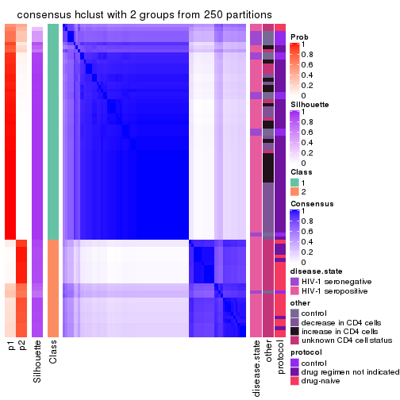</p>

</div>
<div id='tab-SD-hclust-consensus-heatmap-2'>
<pre><code class="r">consensus_heatmap(res, k = 3)
</code></pre>

<p>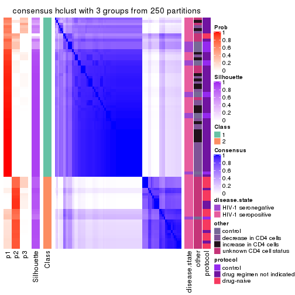</p>

</div>
<div id='tab-SD-hclust-consensus-heatmap-3'>
<pre><code class="r">consensus_heatmap(res, k = 4)
</code></pre>

<p>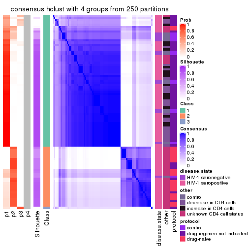</p>

</div>
<div id='tab-SD-hclust-consensus-heatmap-4'>
<pre><code class="r">consensus_heatmap(res, k = 5)
</code></pre>

<p>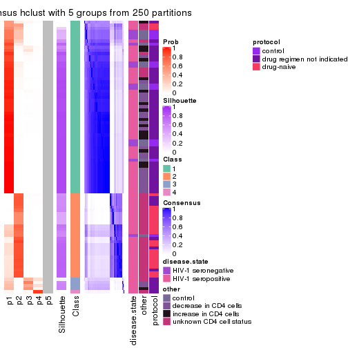</p>

</div>
<div id='tab-SD-hclust-consensus-heatmap-5'>
<pre><code class="r">consensus_heatmap(res, k = 6)
</code></pre>

<p>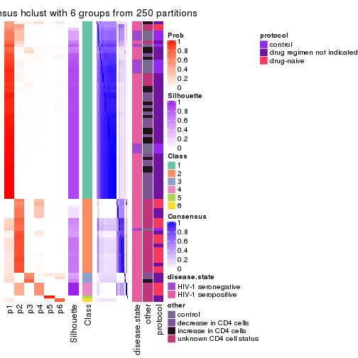</p>

</div>
</div>

Heatmaps for the membership of samples in all partitions to see how consistent they are:


<script>
$( function() {
	$( '#tabs-SD-hclust-membership-heatmap' ).tabs();
} );
</script>
<div id='tabs-SD-hclust-membership-heatmap'>
<ul>
<li><a href='#tab-SD-hclust-membership-heatmap-1'>k = 2</a></li>
<li><a href='#tab-SD-hclust-membership-heatmap-2'>k = 3</a></li>
<li><a href='#tab-SD-hclust-membership-heatmap-3'>k = 4</a></li>
<li><a href='#tab-SD-hclust-membership-heatmap-4'>k = 5</a></li>
<li><a href='#tab-SD-hclust-membership-heatmap-5'>k = 6</a></li>
</ul>
<div id='tab-SD-hclust-membership-heatmap-1'>
<pre><code class="r">membership_heatmap(res, k = 2)
</code></pre>

<p>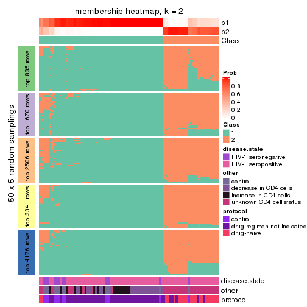</p>

</div>
<div id='tab-SD-hclust-membership-heatmap-2'>
<pre><code class="r">membership_heatmap(res, k = 3)
</code></pre>

<p>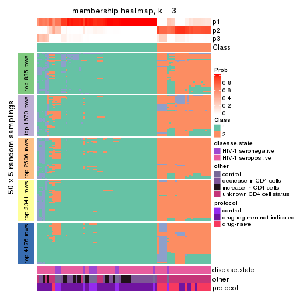</p>

</div>
<div id='tab-SD-hclust-membership-heatmap-3'>
<pre><code class="r">membership_heatmap(res, k = 4)
</code></pre>

<p>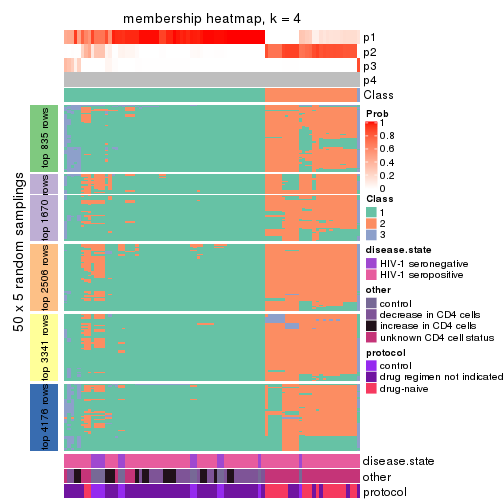</p>

</div>
<div id='tab-SD-hclust-membership-heatmap-4'>
<pre><code class="r">membership_heatmap(res, k = 5)
</code></pre>

<p>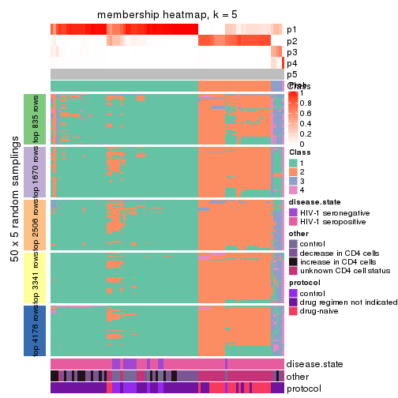</p>

</div>
<div id='tab-SD-hclust-membership-heatmap-5'>
<pre><code class="r">membership_heatmap(res, k = 6)
</code></pre>

<p>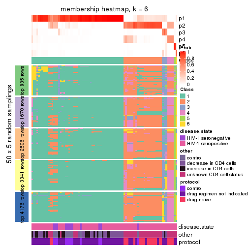</p>

</div>
</div>

As soon as we have had the classes for columns, we can look for signatures
which are significantly different between classes which can be candidate marks
for certain classes. Following are the heatmaps for signatures.


Signature heatmaps where rows are scaled:


<script>
$( function() {
	$( '#tabs-SD-hclust-get-signatures' ).tabs();
} );
</script>
<div id='tabs-SD-hclust-get-signatures'>
<ul>
<li><a href='#tab-SD-hclust-get-signatures-1'>k = 2</a></li>
<li><a href='#tab-SD-hclust-get-signatures-2'>k = 3</a></li>
<li><a href='#tab-SD-hclust-get-signatures-3'>k = 4</a></li>
<li><a href='#tab-SD-hclust-get-signatures-4'>k = 5</a></li>
<li><a href='#tab-SD-hclust-get-signatures-5'>k = 6</a></li>
</ul>
<div id='tab-SD-hclust-get-signatures-1'>
<pre><code class="r">get_signatures(res, k = 2)
</code></pre>

<p>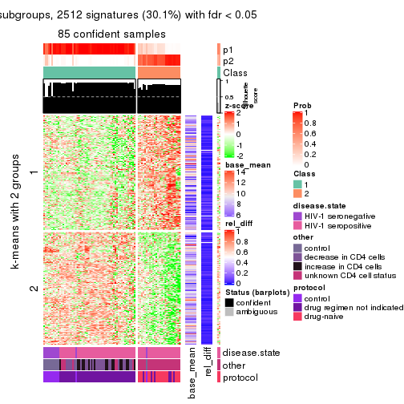</p>

</div>
<div id='tab-SD-hclust-get-signatures-2'>
<pre><code class="r">get_signatures(res, k = 3)
</code></pre>

<p>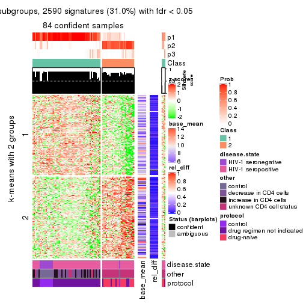</p>

</div>
<div id='tab-SD-hclust-get-signatures-3'>
<pre><code class="r">get_signatures(res, k = 4)
</code></pre>

<p>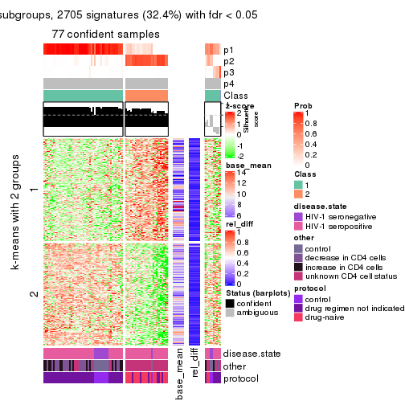</p>

</div>
<div id='tab-SD-hclust-get-signatures-4'>
<pre><code class="r">get_signatures(res, k = 5)
</code></pre>

<p>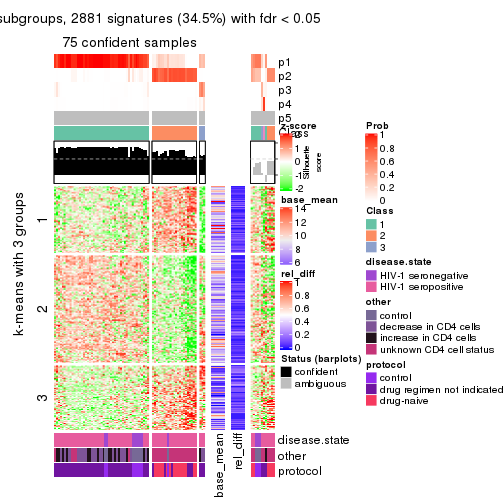</p>

</div>
<div id='tab-SD-hclust-get-signatures-5'>
<pre><code class="r">get_signatures(res, k = 6)
</code></pre>

<p>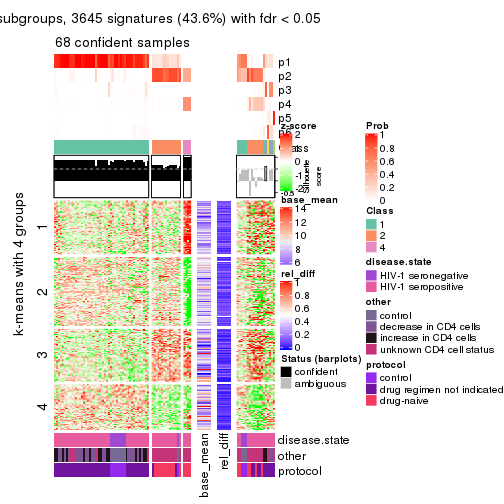</p>

</div>
</div>


Signature heatmaps where rows are not scaled:


<script>
$( function() {
	$( '#tabs-SD-hclust-get-signatures-no-scale' ).tabs();
} );
</script>
<div id='tabs-SD-hclust-get-signatures-no-scale'>
<ul>
<li><a href='#tab-SD-hclust-get-signatures-no-scale-1'>k = 2</a></li>
<li><a href='#tab-SD-hclust-get-signatures-no-scale-2'>k = 3</a></li>
<li><a href='#tab-SD-hclust-get-signatures-no-scale-3'>k = 4</a></li>
<li><a href='#tab-SD-hclust-get-signatures-no-scale-4'>k = 5</a></li>
<li><a href='#tab-SD-hclust-get-signatures-no-scale-5'>k = 6</a></li>
</ul>
<div id='tab-SD-hclust-get-signatures-no-scale-1'>
<pre><code class="r">get_signatures(res, k = 2, scale_rows = FALSE)
</code></pre>

<p>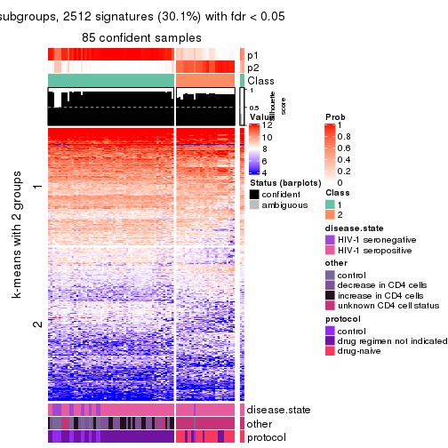</p>

</div>
<div id='tab-SD-hclust-get-signatures-no-scale-2'>
<pre><code class="r">get_signatures(res, k = 3, scale_rows = FALSE)
</code></pre>

<p>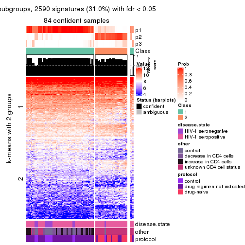</p>

</div>
<div id='tab-SD-hclust-get-signatures-no-scale-3'>
<pre><code class="r">get_signatures(res, k = 4, scale_rows = FALSE)
</code></pre>

<p>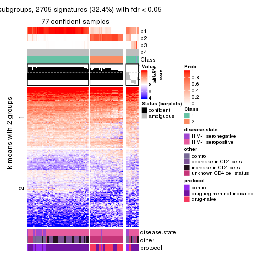</p>

</div>
<div id='tab-SD-hclust-get-signatures-no-scale-4'>
<pre><code class="r">get_signatures(res, k = 5, scale_rows = FALSE)
</code></pre>

<p>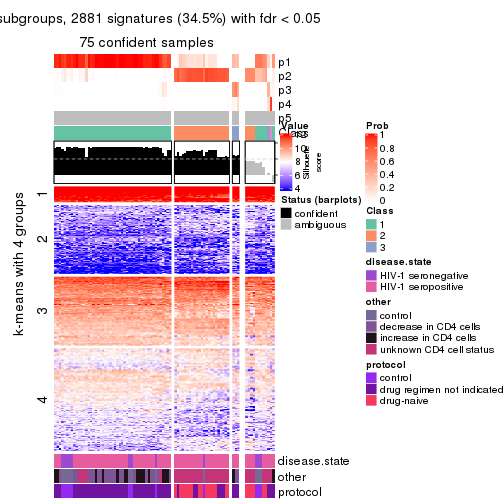</p>

</div>
<div id='tab-SD-hclust-get-signatures-no-scale-5'>
<pre><code class="r">get_signatures(res, k = 6, scale_rows = FALSE)
</code></pre>

<p></p>

</div>
</div>


Compare the overlap of signatures from different k:

```r
compare_signatures(res)
```

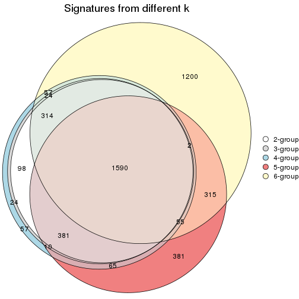

`get_signature()` returns a data frame invisibly. TO get the list of signatures, the function
call should be assigned to a variable explicitly. In following code, if `plot` argument is set
to `FALSE`, no heatmap is plotted while only the differential analysis is performed.

```r
# code only for demonstration
tb = get_signature(res, k = ..., plot = FALSE)
```

An example of the output of `tb` is:

```
#>   which_row         fdr    mean_1    mean_2 scaled_mean_1 scaled_mean_2 km
#> 1        38 0.042760348  8.373488  9.131774    -0.5533452     0.5164555  1
#> 2        40 0.018707592  7.106213  8.469186    -0.6173731     0.5762149  1
#> 3        55 0.019134737 10.221463 11.207825    -0.6159697     0.5749050  1
#> 4        59 0.006059896  5.921854  7.869574    -0.6899429     0.6439467  1
#> 5        60 0.018055526  8.928898 10.211722    -0.6204761     0.5791110  1
#> 6        98 0.009384629 15.714769 14.887706     0.6635654    -0.6193277  2
...
```

The columns in `tb` are:

1. `which_row`: row indices corresponding to the input matrix.
2. `fdr`: FDR for the differential test. 
3. `mean_x`: The mean value in group x.
4. `scaled_mean_x`: The mean value in group x after rows are scaled.
5. `km`: Row groups if k-means clustering is applied to rows.


UMAP plot which shows how samples are separated.


<script>
$( function() {
	$( '#tabs-SD-hclust-dimension-reduction' ).tabs();
} );
</script>
<div id='tabs-SD-hclust-dimension-reduction'>
<ul>
<li><a href='#tab-SD-hclust-dimension-reduction-1'>k = 2</a></li>
<li><a href='#tab-SD-hclust-dimension-reduction-2'>k = 3</a></li>
<li><a href='#tab-SD-hclust-dimension-reduction-3'>k = 4</a></li>
<li><a href='#tab-SD-hclust-dimension-reduction-4'>k = 5</a></li>
<li><a href='#tab-SD-hclust-dimension-reduction-5'>k = 6</a></li>
</ul>
<div id='tab-SD-hclust-dimension-reduction-1'>
<pre><code class="r">dimension_reduction(res, k = 2, method = &quot;UMAP&quot;)
</code></pre>

<p>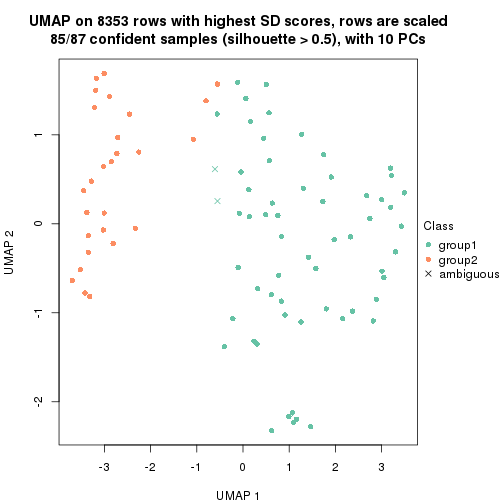</p>

</div>
<div id='tab-SD-hclust-dimension-reduction-2'>
<pre><code class="r">dimension_reduction(res, k = 3, method = &quot;UMAP&quot;)
</code></pre>

<p>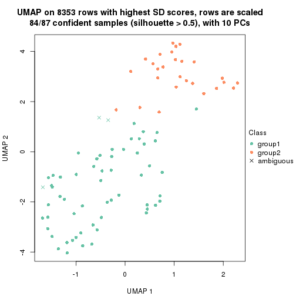</p>

</div>
<div id='tab-SD-hclust-dimension-reduction-3'>
<pre><code class="r">dimension_reduction(res, k = 4, method = &quot;UMAP&quot;)
</code></pre>

<p>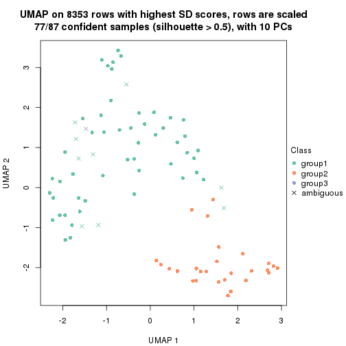</p>

</div>
<div id='tab-SD-hclust-dimension-reduction-4'>
<pre><code class="r">dimension_reduction(res, k = 5, method = &quot;UMAP&quot;)
</code></pre>

<p>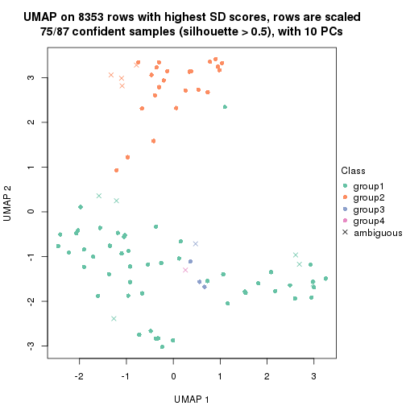</p>

</div>
<div id='tab-SD-hclust-dimension-reduction-5'>
<pre><code class="r">dimension_reduction(res, k = 6, method = &quot;UMAP&quot;)
</code></pre>

<p>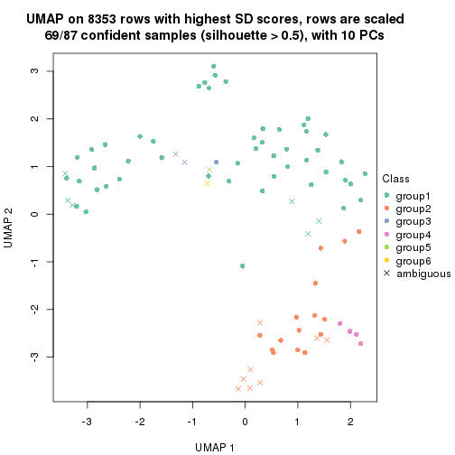</p>

</div>
</div>


Following heatmap shows how subgroups are split when increasing `k`:

```r
collect_classes(res)
```

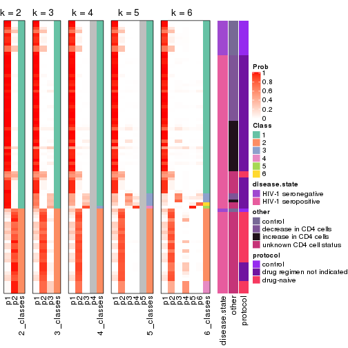


Test correlation between subgroups and known annotations. If the known
annotation is numeric, one-way ANOVA test is applied, and if the known
annotation is discrete, chi-squared contingency table test is applied.

```r
test_to_known_factors(res)
```

```
#>            n disease.state(p) other(p) protocol(p) k
#> SD:hclust 85            0.122 5.85e-12    6.19e-13 2
#> SD:hclust 84            0.116 2.06e-12    9.05e-13 3
#> SD:hclust 77            0.154 8.24e-12    1.35e-11 4
#> SD:hclust 75            0.279 1.23e-09    1.74e-09 5
#> SD:hclust 69            0.625 2.62e-07    2.97e-10 6
```


If matrix rows can be associated to genes, consider to use `GO_Enrichment(res,
...)` to perform function enrichment for the signature genes.


 

---------------------------------------------------


### SD:kmeans


The object with results only for a single top-value method and a single partition method 
can be extracted as:

```r
res = res_list["SD", "kmeans"]
# you can also extract it by
# res = res_list["SD:kmeans"]
```

A summary of `res` and all the functions that can be applied to it:

```r
res
```

```
#> A 'ConsensusPartition' object with k = 2, 3, 4, 5, 6.
#>   On a matrix with 8353 rows and 87 columns.
#>   Top rows (835, 1670, 2506, 3341, 4176) are extracted by 'SD' method.
#>   Subgroups are detected by 'kmeans' method.
#>   Performed in total 1250 partitions by row resampling.
#>   Best k for subgroups seems to be 2.
#> 
#> Following methods can be applied to this 'ConsensusPartition' object:
#>  [1] "cola_report"             "collect_classes"         "collect_plots"          
#>  [4] "collect_stats"           "colnames"                "compare_signatures"     
#>  [7] "consensus_heatmap"       "dimension_reduction"     "functional_enrichment"  
#> [10] "get_anno_col"            "get_anno"                "get_classes"            
#> [13] "get_consensus"           "get_matrix"              "get_membership"         
#> [16] "get_param"               "get_signatures"          "get_stats"              
#> [19] "is_best_k"               "is_stable_k"             "membership_heatmap"     
#> [22] "ncol"                    "nrow"                    "plot_ecdf"              
#> [25] "rownames"                "select_partition_number" "show"                   
#> [28] "suggest_best_k"          "test_to_known_factors"
```

`collect_plots()` function collects all the plots made from `res` for all `k` (number of partitions)
into one single page to provide an easy and fast comparison between different `k`.

```r
collect_plots(res)
```

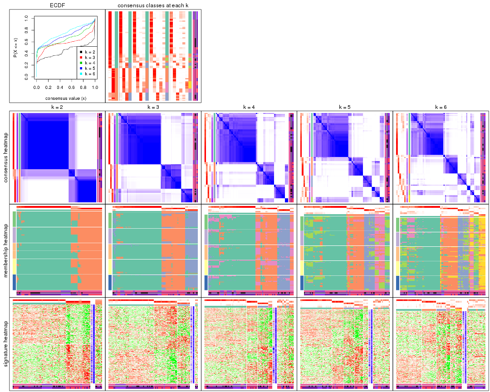

The plots are:

- The first row: a plot of the ECDF (Empirical cumulative distribution
  function) curves of the consensus matrix for each `k` and the heatmap of
  predicted classes for each `k`.
- The second row: heatmaps of the consensus matrix for each `k`.
- The third row: heatmaps of the membership matrix for each `k`.
- The fouth row: heatmaps of the signatures for each `k`.

All the plots in panels can be made by individual functions and they are
plotted later in this section.

`select_partition_number()` produces several plots showing different
statistics for choosing "optimized" `k`. There are following statistics:

- ECDF curves of the consensus matrix for each `k`;
- 1-PAC. [The PAC
  score](https://en.wikipedia.org/wiki/Consensus_clustering#Over-interpretation_potential_of_consensus_clustering)
  measures the proportion of the ambiguous subgrouping.
- Mean silhouette score.
- Concordance. The mean probability of fiting the consensus class ids in all
  partitions.
- Area increased. Denote $A_k$ as the area under the ECDF curve for current
  `k`, the area increased is defined as $A_k - A_{k-1}$.
- Rand index. The percent of pairs of samples that are both in a same cluster
  or both are not in a same cluster in the partition of k and k-1.
- Jaccard index. The ratio of pairs of samples are both in a same cluster in
  the partition of k and k-1 and the pairs of samples are both in a same
  cluster in the partition k or k-1.

The detailed explanations of these statistics can be found in [the cola
vignette](http://bioconductor.org/packages/devel/bioc/vignettes/cola/inst/doc/cola.html#toc_13).

Generally speaking, lower PAC score, higher mean silhouette score or higher
concordance corresponds to better partition. Rand index and Jaccard index
measure how similar the current partition is compared to partition with `k-1`.
If they are too similar, we won't accept `k` is better than `k-1`.

```r
select_partition_number(res)
```

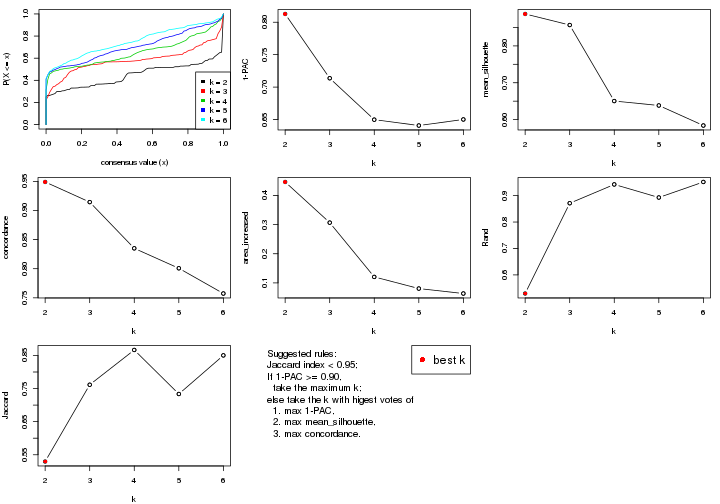

The numeric values for all these statistics can be obtained by `get_stats()`.

```r
get_stats(res)
```

```
#>   k 1-PAC mean_silhouette concordance area_increased  Rand Jaccard
#> 2 2 0.813           0.887       0.949         0.4460 0.530   0.530
#> 3 3 0.714           0.857       0.914         0.3067 0.871   0.762
#> 4 4 0.650           0.650       0.835         0.1205 0.942   0.867
#> 5 5 0.641           0.638       0.801         0.0806 0.893   0.734
#> 6 6 0.650           0.584       0.757         0.0636 0.952   0.850
```

`suggest_best_k()` suggests the best $k$ based on these statistics. The rules are as follows:

- All $k$ with Jaccard index larger than 0.95 are removed because the increase of
  the partition number does not provides enough extra information. If all $k$ are removed,
  the best $k$ is assigned by `NA`.
- For $k$ with 1-PAC larger than 0.9, the maximal $k$ is taken as the "best k". Other $k$ is called "optional k".
- If it does not fit the second rule. The $k$ with the highest vote of highest
  1-PAC, mean silhouette and concordance is taken as the "best k".

```r
suggest_best_k(res)
```

```
#> [1] 2
```


Following shows the table of the partitions (You need to click the **show/hide
code output** link to see it). The membership matrix (columns with name `p*`)
is inferred by
[`clue::cl_consensus()`](https://www.rdocumentation.org/link/cl_consensus?package=clue)
function with the `SE` method. Basically the value in the membership matrix
represents the probability to belong to a certain group. The finall class
label for an item is determined with the group with highest probability it
belongs to.

In `get_classes()` function, the entropy is calculated from the membership
matrix and the silhouette score is calculated from the consensus matrix.


<script>
$( function() {
	$( '#tabs-SD-kmeans-get-classes' ).tabs();
} );
</script>
<div id='tabs-SD-kmeans-get-classes'>
<ul>
<li><a href='#tab-SD-kmeans-get-classes-1'>k = 2</a></li>
<li><a href='#tab-SD-kmeans-get-classes-2'>k = 3</a></li>
<li><a href='#tab-SD-kmeans-get-classes-3'>k = 4</a></li>
<li><a href='#tab-SD-kmeans-get-classes-4'>k = 5</a></li>
<li><a href='#tab-SD-kmeans-get-classes-5'>k = 6</a></li>
</ul>

<div id='tab-SD-kmeans-get-classes-1'>
<p><a id='tab-SD-kmeans-get-classes-1-a' style='color:#0366d6' href='#'>show/hide code output</a></p>
<pre><code class="r">cbind(get_classes(res, k = 2), get_membership(res, k = 2))
</code></pre>

<pre><code>#&gt;          class entropy silhouette    p1    p2
#&gt; GSM39104     1  0.0000      0.986 1.000 0.000
#&gt; GSM39105     1  0.0000      0.986 1.000 0.000
#&gt; GSM39106     1  0.0000      0.986 1.000 0.000
#&gt; GSM39107     1  0.0000      0.986 1.000 0.000
#&gt; GSM39108     1  0.0000      0.986 1.000 0.000
#&gt; GSM39109     1  0.4161      0.894 0.916 0.084
#&gt; GSM39110     1  0.0000      0.986 1.000 0.000
#&gt; GSM39111     1  0.0000      0.986 1.000 0.000
#&gt; GSM39112     1  0.0000      0.986 1.000 0.000
#&gt; GSM39113     1  0.0000      0.986 1.000 0.000
#&gt; GSM39114     2  0.8081      0.664 0.248 0.752
#&gt; GSM39115     1  0.0000      0.986 1.000 0.000
#&gt; GSM39148     1  0.0000      0.986 1.000 0.000
#&gt; GSM39149     2  0.9933      0.325 0.452 0.548
#&gt; GSM39150     1  0.0000      0.986 1.000 0.000
#&gt; GSM39151     2  0.9896      0.356 0.440 0.560
#&gt; GSM39152     1  0.0000      0.986 1.000 0.000
#&gt; GSM39153     1  0.0000      0.986 1.000 0.000
#&gt; GSM39154     1  0.0000      0.986 1.000 0.000
#&gt; GSM39155     1  0.0000      0.986 1.000 0.000
#&gt; GSM39156     1  0.0000      0.986 1.000 0.000
#&gt; GSM39157     1  0.0000      0.986 1.000 0.000
#&gt; GSM39158     1  0.0000      0.986 1.000 0.000
#&gt; GSM39159     1  0.0000      0.986 1.000 0.000
#&gt; GSM39160     1  0.0000      0.986 1.000 0.000
#&gt; GSM39161     1  0.0000      0.986 1.000 0.000
#&gt; GSM39162     1  0.0000      0.986 1.000 0.000
#&gt; GSM39163     1  0.0000      0.986 1.000 0.000
#&gt; GSM39164     1  0.0000      0.986 1.000 0.000
#&gt; GSM39165     1  0.0000      0.986 1.000 0.000
#&gt; GSM39166     1  0.0000      0.986 1.000 0.000
#&gt; GSM39167     1  0.0000      0.986 1.000 0.000
#&gt; GSM39168     1  0.0000      0.986 1.000 0.000
#&gt; GSM39169     1  0.0000      0.986 1.000 0.000
#&gt; GSM39170     1  0.0000      0.986 1.000 0.000
#&gt; GSM39171     1  0.0000      0.986 1.000 0.000
#&gt; GSM39172     2  0.9933      0.325 0.452 0.548
#&gt; GSM39173     2  0.9608      0.468 0.384 0.616
#&gt; GSM39174     1  0.0000      0.986 1.000 0.000
#&gt; GSM39175     1  0.0000      0.986 1.000 0.000
#&gt; GSM39176     1  0.0000      0.986 1.000 0.000
#&gt; GSM39177     1  0.4815      0.867 0.896 0.104
#&gt; GSM39178     1  0.0000      0.986 1.000 0.000
#&gt; GSM39179     2  0.9954      0.302 0.460 0.540
#&gt; GSM39180     2  0.0376      0.868 0.004 0.996
#&gt; GSM39181     1  0.0000      0.986 1.000 0.000
#&gt; GSM39182     1  0.5294      0.845 0.880 0.120
#&gt; GSM39183     1  0.0000      0.986 1.000 0.000
#&gt; GSM39184     1  0.0000      0.986 1.000 0.000
#&gt; GSM39185     1  0.2948      0.933 0.948 0.052
#&gt; GSM39186     1  0.0000      0.986 1.000 0.000
#&gt; GSM39187     1  0.0000      0.986 1.000 0.000
#&gt; GSM39116     2  0.0000      0.870 0.000 1.000
#&gt; GSM39117     2  0.0000      0.870 0.000 1.000
#&gt; GSM39118     2  0.0000      0.870 0.000 1.000
#&gt; GSM39119     2  0.0000      0.870 0.000 1.000
#&gt; GSM39120     1  0.0000      0.986 1.000 0.000
#&gt; GSM39121     1  0.1843      0.959 0.972 0.028
#&gt; GSM39122     1  0.2423      0.948 0.960 0.040
#&gt; GSM39123     2  0.0000      0.870 0.000 1.000
#&gt; GSM39124     2  0.5737      0.778 0.136 0.864
#&gt; GSM39125     1  0.0000      0.986 1.000 0.000
#&gt; GSM39126     1  0.2603      0.943 0.956 0.044
#&gt; GSM39127     2  0.0000      0.870 0.000 1.000
#&gt; GSM39128     2  0.3114      0.838 0.056 0.944
#&gt; GSM39129     2  0.0000      0.870 0.000 1.000
#&gt; GSM39130     2  0.0000      0.870 0.000 1.000
#&gt; GSM39131     2  0.0000      0.870 0.000 1.000
#&gt; GSM39132     2  0.0000      0.870 0.000 1.000
#&gt; GSM39133     2  0.0000      0.870 0.000 1.000
#&gt; GSM39134     2  0.0000      0.870 0.000 1.000
#&gt; GSM39135     2  0.0000      0.870 0.000 1.000
#&gt; GSM39136     2  0.0000      0.870 0.000 1.000
#&gt; GSM39137     2  0.8499      0.630 0.276 0.724
#&gt; GSM39138     2  0.0000      0.870 0.000 1.000
#&gt; GSM39139     2  0.0000      0.870 0.000 1.000
#&gt; GSM39140     1  0.0000      0.986 1.000 0.000
#&gt; GSM39141     1  0.0000      0.986 1.000 0.000
#&gt; GSM39142     1  0.0000      0.986 1.000 0.000
#&gt; GSM39143     1  0.0000      0.986 1.000 0.000
#&gt; GSM39144     2  0.0000      0.870 0.000 1.000
#&gt; GSM39145     2  0.0000      0.870 0.000 1.000
#&gt; GSM39146     2  0.0000      0.870 0.000 1.000
#&gt; GSM39147     2  0.0000      0.870 0.000 1.000
#&gt; GSM39188     2  0.9850      0.383 0.428 0.572
#&gt; GSM39189     1  0.6973      0.735 0.812 0.188
#&gt; GSM39190     2  0.9896      0.356 0.440 0.560
</code></pre>

<script>
$('#tab-SD-kmeans-get-classes-1-a').parent().next().next().hide();
$('#tab-SD-kmeans-get-classes-1-a').click(function(){
  $('#tab-SD-kmeans-get-classes-1-a').parent().next().next().toggle();
  return(false);
});
</script>
</div>

<div id='tab-SD-kmeans-get-classes-2'>
<p><a id='tab-SD-kmeans-get-classes-2-a' style='color:#0366d6' href='#'>show/hide code output</a></p>
<pre><code class="r">cbind(get_classes(res, k = 3), get_membership(res, k = 3))
</code></pre>

<pre><code>#&gt;          class entropy silhouette    p1    p2    p3
#&gt; GSM39104     1  0.0000      0.929 1.000 0.000 0.000
#&gt; GSM39105     1  0.0000      0.929 1.000 0.000 0.000
#&gt; GSM39106     1  0.1129      0.920 0.976 0.004 0.020
#&gt; GSM39107     1  0.3805      0.844 0.884 0.092 0.024
#&gt; GSM39108     1  0.0829      0.924 0.984 0.004 0.012
#&gt; GSM39109     1  0.4964      0.802 0.836 0.116 0.048
#&gt; GSM39110     1  0.0829      0.924 0.984 0.004 0.012
#&gt; GSM39111     1  0.0000      0.929 1.000 0.000 0.000
#&gt; GSM39112     1  0.3370      0.863 0.904 0.072 0.024
#&gt; GSM39113     1  0.3805      0.844 0.884 0.092 0.024
#&gt; GSM39114     2  0.2689      0.872 0.032 0.932 0.036
#&gt; GSM39115     1  0.0000      0.929 1.000 0.000 0.000
#&gt; GSM39148     1  0.0237      0.928 0.996 0.000 0.004
#&gt; GSM39149     3  0.3989      0.905 0.124 0.012 0.864
#&gt; GSM39150     1  0.0237      0.927 0.996 0.000 0.004
#&gt; GSM39151     3  0.3921      0.900 0.112 0.016 0.872
#&gt; GSM39152     3  0.5098      0.824 0.248 0.000 0.752
#&gt; GSM39153     1  0.0000      0.929 1.000 0.000 0.000
#&gt; GSM39154     1  0.0000      0.929 1.000 0.000 0.000
#&gt; GSM39155     1  0.0000      0.929 1.000 0.000 0.000
#&gt; GSM39156     1  0.1129      0.920 0.976 0.004 0.020
#&gt; GSM39157     1  0.0000      0.929 1.000 0.000 0.000
#&gt; GSM39158     1  0.0000      0.929 1.000 0.000 0.000
#&gt; GSM39159     1  0.6286     -0.168 0.536 0.000 0.464
#&gt; GSM39160     1  0.0892      0.915 0.980 0.000 0.020
#&gt; GSM39161     3  0.5785      0.704 0.332 0.000 0.668
#&gt; GSM39162     1  0.0424      0.927 0.992 0.000 0.008
#&gt; GSM39163     1  0.0000      0.929 1.000 0.000 0.000
#&gt; GSM39164     1  0.0000      0.929 1.000 0.000 0.000
#&gt; GSM39165     1  0.4002      0.747 0.840 0.000 0.160
#&gt; GSM39166     1  0.0237      0.927 0.996 0.000 0.004
#&gt; GSM39167     1  0.0000      0.929 1.000 0.000 0.000
#&gt; GSM39168     1  0.0237      0.928 0.996 0.000 0.004
#&gt; GSM39169     1  0.0000      0.929 1.000 0.000 0.000
#&gt; GSM39170     1  0.0000      0.929 1.000 0.000 0.000
#&gt; GSM39171     1  0.0000      0.929 1.000 0.000 0.000
#&gt; GSM39172     3  0.3896      0.905 0.128 0.008 0.864
#&gt; GSM39173     3  0.4479      0.878 0.096 0.044 0.860
#&gt; GSM39174     1  0.0000      0.929 1.000 0.000 0.000
#&gt; GSM39175     1  0.0000      0.929 1.000 0.000 0.000
#&gt; GSM39176     1  0.0000      0.929 1.000 0.000 0.000
#&gt; GSM39177     3  0.4465      0.880 0.176 0.004 0.820
#&gt; GSM39178     1  0.5882      0.307 0.652 0.000 0.348
#&gt; GSM39179     3  0.3896      0.905 0.128 0.008 0.864
#&gt; GSM39180     3  0.3141      0.770 0.020 0.068 0.912
#&gt; GSM39181     1  0.0237      0.927 0.996 0.000 0.004
#&gt; GSM39182     1  0.6140      0.119 0.596 0.000 0.404
#&gt; GSM39183     1  0.0237      0.927 0.996 0.000 0.004
#&gt; GSM39184     1  0.0000      0.929 1.000 0.000 0.000
#&gt; GSM39185     3  0.5706      0.724 0.320 0.000 0.680
#&gt; GSM39186     1  0.0000      0.929 1.000 0.000 0.000
#&gt; GSM39187     1  0.0000      0.929 1.000 0.000 0.000
#&gt; GSM39116     2  0.0592      0.902 0.000 0.988 0.012
#&gt; GSM39117     2  0.5254      0.788 0.000 0.736 0.264
#&gt; GSM39118     2  0.2959      0.889 0.000 0.900 0.100
#&gt; GSM39119     2  0.3551      0.877 0.000 0.868 0.132
#&gt; GSM39120     1  0.1620      0.913 0.964 0.012 0.024
#&gt; GSM39121     1  0.5402      0.737 0.792 0.180 0.028
#&gt; GSM39122     1  0.5610      0.716 0.776 0.196 0.028
#&gt; GSM39123     2  0.5254      0.788 0.000 0.736 0.264
#&gt; GSM39124     2  0.1411      0.898 0.000 0.964 0.036
#&gt; GSM39125     1  0.1774      0.910 0.960 0.016 0.024
#&gt; GSM39126     1  0.5728      0.712 0.772 0.196 0.032
#&gt; GSM39127     2  0.1411      0.898 0.000 0.964 0.036
#&gt; GSM39128     2  0.1411      0.898 0.000 0.964 0.036
#&gt; GSM39129     2  0.3482      0.881 0.000 0.872 0.128
#&gt; GSM39130     2  0.5254      0.788 0.000 0.736 0.264
#&gt; GSM39131     2  0.1411      0.898 0.000 0.964 0.036
#&gt; GSM39132     2  0.1411      0.898 0.000 0.964 0.036
#&gt; GSM39133     2  0.4702      0.835 0.000 0.788 0.212
#&gt; GSM39134     2  0.3192      0.885 0.000 0.888 0.112
#&gt; GSM39135     2  0.0592      0.902 0.000 0.988 0.012
#&gt; GSM39136     2  0.0424      0.901 0.000 0.992 0.008
#&gt; GSM39137     2  0.5526      0.667 0.172 0.792 0.036
#&gt; GSM39138     2  0.3482      0.881 0.000 0.872 0.128
#&gt; GSM39139     2  0.2165      0.897 0.000 0.936 0.064
#&gt; GSM39140     1  0.1453      0.916 0.968 0.008 0.024
#&gt; GSM39141     1  0.1453      0.916 0.968 0.008 0.024
#&gt; GSM39142     1  0.1267      0.918 0.972 0.004 0.024
#&gt; GSM39143     1  0.1453      0.916 0.968 0.008 0.024
#&gt; GSM39144     2  0.3482      0.881 0.000 0.872 0.128
#&gt; GSM39145     2  0.0892      0.901 0.000 0.980 0.020
#&gt; GSM39146     2  0.1411      0.898 0.000 0.964 0.036
#&gt; GSM39147     2  0.1411      0.898 0.000 0.964 0.036
#&gt; GSM39188     3  0.3690      0.888 0.100 0.016 0.884
#&gt; GSM39189     3  0.3965      0.904 0.132 0.008 0.860
#&gt; GSM39190     3  0.3921      0.900 0.112 0.016 0.872
</code></pre>

<script>
$('#tab-SD-kmeans-get-classes-2-a').parent().next().next().hide();
$('#tab-SD-kmeans-get-classes-2-a').click(function(){
  $('#tab-SD-kmeans-get-classes-2-a').parent().next().next().toggle();
  return(false);
});
</script>
</div>

<div id='tab-SD-kmeans-get-classes-3'>
<p><a id='tab-SD-kmeans-get-classes-3-a' style='color:#0366d6' href='#'>show/hide code output</a></p>
<pre><code class="r">cbind(get_classes(res, k = 4), get_membership(res, k = 4))
</code></pre>

<pre><code>#&gt;          class entropy silhouette    p1    p2    p3    p4
#&gt; GSM39104     1  0.2546     0.8644 0.900 0.000 0.008 0.092
#&gt; GSM39105     1  0.1356     0.8773 0.960 0.000 0.008 0.032
#&gt; GSM39106     1  0.2852     0.8585 0.904 0.024 0.008 0.064
#&gt; GSM39107     1  0.5503     0.6736 0.728 0.204 0.008 0.060
#&gt; GSM39108     1  0.2380     0.8657 0.920 0.008 0.008 0.064
#&gt; GSM39109     1  0.7013     0.5567 0.616 0.256 0.024 0.104
#&gt; GSM39110     1  0.2510     0.8639 0.916 0.012 0.008 0.064
#&gt; GSM39111     1  0.2271     0.8684 0.916 0.000 0.008 0.076
#&gt; GSM39112     1  0.4712     0.7645 0.800 0.132 0.008 0.060
#&gt; GSM39113     1  0.5539     0.6672 0.724 0.208 0.008 0.060
#&gt; GSM39114     2  0.3453     0.4768 0.080 0.868 0.000 0.052
#&gt; GSM39115     1  0.1256     0.8785 0.964 0.000 0.008 0.028
#&gt; GSM39148     1  0.0000     0.8833 1.000 0.000 0.000 0.000
#&gt; GSM39149     3  0.1722     0.8621 0.008 0.000 0.944 0.048
#&gt; GSM39150     1  0.3978     0.7886 0.796 0.000 0.012 0.192
#&gt; GSM39151     3  0.1890     0.8595 0.008 0.000 0.936 0.056
#&gt; GSM39152     3  0.2805     0.8328 0.012 0.000 0.888 0.100
#&gt; GSM39153     1  0.0188     0.8826 0.996 0.000 0.000 0.004
#&gt; GSM39154     1  0.0000     0.8833 1.000 0.000 0.000 0.000
#&gt; GSM39155     1  0.0000     0.8833 1.000 0.000 0.000 0.000
#&gt; GSM39156     1  0.0804     0.8810 0.980 0.012 0.000 0.008
#&gt; GSM39157     1  0.0000     0.8833 1.000 0.000 0.000 0.000
#&gt; GSM39158     1  0.3172     0.8017 0.840 0.000 0.000 0.160
#&gt; GSM39159     1  0.7602    -0.1028 0.420 0.000 0.380 0.200
#&gt; GSM39160     1  0.4801     0.7595 0.764 0.000 0.048 0.188
#&gt; GSM39161     3  0.7289     0.4856 0.268 0.000 0.532 0.200
#&gt; GSM39162     1  0.0000     0.8833 1.000 0.000 0.000 0.000
#&gt; GSM39163     1  0.0000     0.8833 1.000 0.000 0.000 0.000
#&gt; GSM39164     1  0.0000     0.8833 1.000 0.000 0.000 0.000
#&gt; GSM39165     1  0.4700     0.7577 0.792 0.000 0.124 0.084
#&gt; GSM39166     1  0.3751     0.7766 0.800 0.000 0.004 0.196
#&gt; GSM39167     1  0.0000     0.8833 1.000 0.000 0.000 0.000
#&gt; GSM39168     1  0.0000     0.8833 1.000 0.000 0.000 0.000
#&gt; GSM39169     1  0.0000     0.8833 1.000 0.000 0.000 0.000
#&gt; GSM39170     1  0.3074     0.8075 0.848 0.000 0.000 0.152
#&gt; GSM39171     1  0.1867     0.8647 0.928 0.000 0.000 0.072
#&gt; GSM39172     3  0.1356     0.8677 0.008 0.000 0.960 0.032
#&gt; GSM39173     3  0.1339     0.8689 0.008 0.004 0.964 0.024
#&gt; GSM39174     1  0.0000     0.8833 1.000 0.000 0.000 0.000
#&gt; GSM39175     1  0.0188     0.8826 0.996 0.000 0.000 0.004
#&gt; GSM39176     1  0.0000     0.8833 1.000 0.000 0.000 0.000
#&gt; GSM39177     3  0.1284     0.8706 0.012 0.000 0.964 0.024
#&gt; GSM39178     1  0.7304     0.3519 0.532 0.000 0.260 0.208
#&gt; GSM39179     3  0.1807     0.8609 0.008 0.000 0.940 0.052
#&gt; GSM39180     3  0.1792     0.8620 0.000 0.000 0.932 0.068
#&gt; GSM39181     1  0.3626     0.7795 0.812 0.000 0.004 0.184
#&gt; GSM39182     1  0.7496     0.2302 0.512 0.008 0.320 0.160
#&gt; GSM39183     1  0.3668     0.7785 0.808 0.000 0.004 0.188
#&gt; GSM39184     1  0.0000     0.8833 1.000 0.000 0.000 0.000
#&gt; GSM39185     3  0.7269     0.4907 0.264 0.000 0.536 0.200
#&gt; GSM39186     1  0.1209     0.8791 0.964 0.000 0.004 0.032
#&gt; GSM39187     1  0.0000     0.8833 1.000 0.000 0.000 0.000
#&gt; GSM39116     2  0.0921     0.5495 0.000 0.972 0.000 0.028
#&gt; GSM39117     4  0.5440     0.9949 0.000 0.384 0.020 0.596
#&gt; GSM39118     2  0.4222     0.0548 0.000 0.728 0.000 0.272
#&gt; GSM39119     2  0.5165    -0.6441 0.000 0.512 0.004 0.484
#&gt; GSM39120     1  0.2413     0.8609 0.924 0.036 0.004 0.036
#&gt; GSM39121     1  0.5861     0.0356 0.488 0.480 0.000 0.032
#&gt; GSM39122     2  0.5938    -0.0649 0.476 0.488 0.000 0.036
#&gt; GSM39123     4  0.5440     0.9949 0.000 0.384 0.020 0.596
#&gt; GSM39124     2  0.1677     0.5440 0.040 0.948 0.000 0.012
#&gt; GSM39125     1  0.1833     0.8683 0.944 0.032 0.000 0.024
#&gt; GSM39126     2  0.5861    -0.0716 0.480 0.488 0.000 0.032
#&gt; GSM39127     2  0.0000     0.5642 0.000 1.000 0.000 0.000
#&gt; GSM39128     2  0.0895     0.5595 0.020 0.976 0.000 0.004
#&gt; GSM39129     2  0.5163    -0.4628 0.000 0.516 0.004 0.480
#&gt; GSM39130     4  0.5440     0.9949 0.000 0.384 0.020 0.596
#&gt; GSM39131     2  0.0188     0.5638 0.000 0.996 0.000 0.004
#&gt; GSM39132     2  0.0000     0.5642 0.000 1.000 0.000 0.000
#&gt; GSM39133     4  0.5364     0.9846 0.000 0.392 0.016 0.592
#&gt; GSM39134     2  0.4948    -0.4471 0.000 0.560 0.000 0.440
#&gt; GSM39135     2  0.0921     0.5495 0.000 0.972 0.000 0.028
#&gt; GSM39136     2  0.1118     0.5427 0.000 0.964 0.000 0.036
#&gt; GSM39137     2  0.3647     0.4250 0.152 0.832 0.000 0.016
#&gt; GSM39138     2  0.5163    -0.4628 0.000 0.516 0.004 0.480
#&gt; GSM39139     2  0.4193     0.2262 0.000 0.732 0.000 0.268
#&gt; GSM39140     1  0.1151     0.8774 0.968 0.008 0.000 0.024
#&gt; GSM39141     1  0.0672     0.8809 0.984 0.008 0.000 0.008
#&gt; GSM39142     1  0.0524     0.8818 0.988 0.004 0.000 0.008
#&gt; GSM39143     1  0.0672     0.8809 0.984 0.008 0.000 0.008
#&gt; GSM39144     2  0.5163    -0.4628 0.000 0.516 0.004 0.480
#&gt; GSM39145     2  0.2469     0.5155 0.000 0.892 0.000 0.108
#&gt; GSM39146     2  0.0000     0.5642 0.000 1.000 0.000 0.000
#&gt; GSM39147     2  0.0707     0.5631 0.000 0.980 0.000 0.020
#&gt; GSM39188     3  0.1970     0.8586 0.008 0.000 0.932 0.060
#&gt; GSM39189     3  0.1824     0.8616 0.004 0.000 0.936 0.060
#&gt; GSM39190     3  0.0672     0.8695 0.008 0.000 0.984 0.008
</code></pre>

<script>
$('#tab-SD-kmeans-get-classes-3-a').parent().next().next().hide();
$('#tab-SD-kmeans-get-classes-3-a').click(function(){
  $('#tab-SD-kmeans-get-classes-3-a').parent().next().next().toggle();
  return(false);
});
</script>
</div>

<div id='tab-SD-kmeans-get-classes-4'>
<p><a id='tab-SD-kmeans-get-classes-4-a' style='color:#0366d6' href='#'>show/hide code output</a></p>
<pre><code class="r">cbind(get_classes(res, k = 5), get_membership(res, k = 5))
</code></pre>

<pre><code>#&gt;          class entropy silhouette    p1    p2    p3    p4    p5
#&gt; GSM39104     1  0.4210     0.6319 0.756 0.000 0.004 0.036 0.204
#&gt; GSM39105     1  0.2470     0.7307 0.884 0.000 0.000 0.012 0.104
#&gt; GSM39106     1  0.4530     0.6389 0.768 0.036 0.000 0.032 0.164
#&gt; GSM39107     1  0.6954     0.1593 0.468 0.348 0.000 0.032 0.152
#&gt; GSM39108     1  0.4004     0.6635 0.792 0.012 0.000 0.032 0.164
#&gt; GSM39109     2  0.7761     0.0832 0.292 0.404 0.008 0.044 0.252
#&gt; GSM39110     1  0.4430     0.6466 0.772 0.020 0.004 0.032 0.172
#&gt; GSM39111     1  0.4202     0.6525 0.776 0.004 0.008 0.032 0.180
#&gt; GSM39112     1  0.6691     0.2718 0.544 0.280 0.000 0.032 0.144
#&gt; GSM39113     1  0.6974     0.1220 0.456 0.360 0.000 0.032 0.152
#&gt; GSM39114     2  0.3531     0.6395 0.036 0.852 0.000 0.032 0.080
#&gt; GSM39115     1  0.1670     0.7605 0.936 0.000 0.000 0.012 0.052
#&gt; GSM39148     1  0.0000     0.7826 1.000 0.000 0.000 0.000 0.000
#&gt; GSM39149     3  0.1018     0.8372 0.000 0.000 0.968 0.016 0.016
#&gt; GSM39150     1  0.4491     0.2733 0.648 0.000 0.004 0.012 0.336
#&gt; GSM39151     3  0.1750     0.8270 0.000 0.000 0.936 0.036 0.028
#&gt; GSM39152     3  0.4156     0.7321 0.008 0.000 0.700 0.004 0.288
#&gt; GSM39153     1  0.0162     0.7808 0.996 0.000 0.000 0.000 0.004
#&gt; GSM39154     1  0.0162     0.7808 0.996 0.000 0.000 0.000 0.004
#&gt; GSM39155     1  0.0000     0.7826 1.000 0.000 0.000 0.000 0.000
#&gt; GSM39156     1  0.1205     0.7705 0.956 0.004 0.000 0.000 0.040
#&gt; GSM39157     1  0.0000     0.7826 1.000 0.000 0.000 0.000 0.000
#&gt; GSM39158     1  0.3715     0.3803 0.736 0.000 0.000 0.004 0.260
#&gt; GSM39159     5  0.5991     0.8405 0.352 0.000 0.108 0.004 0.536
#&gt; GSM39160     1  0.4620     0.0931 0.612 0.000 0.004 0.012 0.372
#&gt; GSM39161     5  0.6383     0.7990 0.264 0.000 0.196 0.004 0.536
#&gt; GSM39162     1  0.0000     0.7826 1.000 0.000 0.000 0.000 0.000
#&gt; GSM39163     1  0.0000     0.7826 1.000 0.000 0.000 0.000 0.000
#&gt; GSM39164     1  0.0000     0.7826 1.000 0.000 0.000 0.000 0.000
#&gt; GSM39165     1  0.3936     0.5488 0.800 0.000 0.052 0.004 0.144
#&gt; GSM39166     1  0.4251     0.0622 0.624 0.000 0.000 0.004 0.372
#&gt; GSM39167     1  0.0000     0.7826 1.000 0.000 0.000 0.000 0.000
#&gt; GSM39168     1  0.0000     0.7826 1.000 0.000 0.000 0.000 0.000
#&gt; GSM39169     1  0.0000     0.7826 1.000 0.000 0.000 0.000 0.000
#&gt; GSM39170     1  0.3814     0.3570 0.720 0.000 0.000 0.004 0.276
#&gt; GSM39171     1  0.2127     0.7165 0.892 0.000 0.000 0.000 0.108
#&gt; GSM39172     3  0.4119     0.8320 0.000 0.000 0.752 0.036 0.212
#&gt; GSM39173     3  0.3988     0.8422 0.000 0.000 0.768 0.036 0.196
#&gt; GSM39174     1  0.0000     0.7826 1.000 0.000 0.000 0.000 0.000
#&gt; GSM39175     1  0.0162     0.7808 0.996 0.000 0.000 0.000 0.004
#&gt; GSM39176     1  0.0000     0.7826 1.000 0.000 0.000 0.000 0.000
#&gt; GSM39177     3  0.1704     0.8541 0.000 0.000 0.928 0.004 0.068
#&gt; GSM39178     5  0.5606     0.7867 0.360 0.000 0.072 0.004 0.564
#&gt; GSM39179     3  0.0912     0.8398 0.000 0.000 0.972 0.016 0.012
#&gt; GSM39180     3  0.4495     0.8258 0.000 0.000 0.712 0.044 0.244
#&gt; GSM39181     1  0.4182     0.0981 0.644 0.000 0.000 0.004 0.352
#&gt; GSM39182     5  0.6944     0.7743 0.376 0.004 0.168 0.016 0.436
#&gt; GSM39183     1  0.4264     0.0424 0.620 0.000 0.000 0.004 0.376
#&gt; GSM39184     1  0.0162     0.7808 0.996 0.000 0.000 0.000 0.004
#&gt; GSM39185     5  0.6313     0.8170 0.272 0.000 0.180 0.004 0.544
#&gt; GSM39186     1  0.0794     0.7748 0.972 0.000 0.000 0.000 0.028
#&gt; GSM39187     1  0.0000     0.7826 1.000 0.000 0.000 0.000 0.000
#&gt; GSM39116     2  0.1041     0.6829 0.000 0.964 0.000 0.032 0.004
#&gt; GSM39117     4  0.6263     0.6654 0.000 0.192 0.000 0.532 0.276
#&gt; GSM39118     2  0.4302    -0.4574 0.000 0.520 0.000 0.480 0.000
#&gt; GSM39119     4  0.4485     0.7069 0.000 0.292 0.000 0.680 0.028
#&gt; GSM39120     1  0.4737     0.6155 0.768 0.096 0.000 0.024 0.112
#&gt; GSM39121     2  0.5331     0.4928 0.256 0.668 0.000 0.020 0.056
#&gt; GSM39122     2  0.5402     0.4954 0.248 0.668 0.000 0.020 0.064
#&gt; GSM39123     4  0.6263     0.6654 0.000 0.192 0.000 0.532 0.276
#&gt; GSM39124     2  0.0609     0.7084 0.020 0.980 0.000 0.000 0.000
#&gt; GSM39125     1  0.3546     0.6931 0.848 0.060 0.000 0.016 0.076
#&gt; GSM39126     2  0.5466     0.4976 0.240 0.668 0.000 0.020 0.072
#&gt; GSM39127     2  0.0324     0.7064 0.000 0.992 0.000 0.004 0.004
#&gt; GSM39128     2  0.0671     0.7098 0.016 0.980 0.000 0.004 0.000
#&gt; GSM39129     4  0.3906     0.6999 0.000 0.292 0.004 0.704 0.000
#&gt; GSM39130     4  0.6263     0.6654 0.000 0.192 0.000 0.532 0.276
#&gt; GSM39131     2  0.0324     0.7079 0.000 0.992 0.000 0.004 0.004
#&gt; GSM39132     2  0.0324     0.7064 0.000 0.992 0.000 0.004 0.004
#&gt; GSM39133     4  0.6263     0.6654 0.000 0.192 0.000 0.532 0.276
#&gt; GSM39134     4  0.3932     0.6889 0.000 0.328 0.000 0.672 0.000
#&gt; GSM39135     2  0.1041     0.6829 0.000 0.964 0.000 0.032 0.004
#&gt; GSM39136     2  0.1205     0.6733 0.000 0.956 0.000 0.040 0.004
#&gt; GSM39137     2  0.1768     0.6792 0.072 0.924 0.000 0.000 0.004
#&gt; GSM39138     4  0.3906     0.6999 0.000 0.292 0.004 0.704 0.000
#&gt; GSM39139     4  0.4297     0.3878 0.000 0.472 0.000 0.528 0.000
#&gt; GSM39140     1  0.1280     0.7720 0.960 0.008 0.000 0.008 0.024
#&gt; GSM39141     1  0.0771     0.7771 0.976 0.004 0.000 0.000 0.020
#&gt; GSM39142     1  0.0404     0.7803 0.988 0.000 0.000 0.000 0.012
#&gt; GSM39143     1  0.0771     0.7771 0.976 0.004 0.000 0.000 0.020
#&gt; GSM39144     4  0.3906     0.6999 0.000 0.292 0.004 0.704 0.000
#&gt; GSM39145     2  0.3949     0.1476 0.000 0.668 0.000 0.332 0.000
#&gt; GSM39146     2  0.0324     0.7064 0.000 0.992 0.000 0.004 0.004
#&gt; GSM39147     2  0.0510     0.7055 0.000 0.984 0.000 0.016 0.000
#&gt; GSM39188     3  0.2304     0.8236 0.000 0.000 0.908 0.048 0.044
#&gt; GSM39189     3  0.4276     0.8104 0.000 0.000 0.724 0.032 0.244
#&gt; GSM39190     3  0.3649     0.8535 0.000 0.000 0.808 0.040 0.152
</code></pre>

<script>
$('#tab-SD-kmeans-get-classes-4-a').parent().next().next().hide();
$('#tab-SD-kmeans-get-classes-4-a').click(function(){
  $('#tab-SD-kmeans-get-classes-4-a').parent().next().next().toggle();
  return(false);
});
</script>
</div>

<div id='tab-SD-kmeans-get-classes-5'>
<p><a id='tab-SD-kmeans-get-classes-5-a' style='color:#0366d6' href='#'>show/hide code output</a></p>
<pre><code class="r">cbind(get_classes(res, k = 6), get_membership(res, k = 6))
</code></pre>

<pre><code>#&gt;          class entropy silhouette    p1    p2    p3    p4    p5    p6
#&gt; GSM39104     1  0.5905     0.3179 0.492 0.004 0.000 0.296 0.208 0.000
#&gt; GSM39105     1  0.4640     0.5398 0.680 0.000 0.000 0.212 0.108 0.000
#&gt; GSM39106     1  0.6096     0.3936 0.528 0.028 0.000 0.276 0.168 0.000
#&gt; GSM39107     2  0.7287     0.1388 0.248 0.388 0.000 0.252 0.112 0.000
#&gt; GSM39108     1  0.5877     0.4168 0.548 0.020 0.000 0.276 0.156 0.000
#&gt; GSM39109     4  0.7518    -0.2197 0.128 0.324 0.004 0.328 0.216 0.000
#&gt; GSM39110     1  0.5998     0.3928 0.528 0.020 0.000 0.280 0.172 0.000
#&gt; GSM39111     1  0.5780     0.3870 0.532 0.008 0.000 0.288 0.172 0.000
#&gt; GSM39112     1  0.7324     0.1315 0.380 0.252 0.000 0.252 0.116 0.000
#&gt; GSM39113     2  0.7305     0.1415 0.228 0.392 0.000 0.260 0.120 0.000
#&gt; GSM39114     2  0.3191     0.6649 0.016 0.832 0.000 0.128 0.024 0.000
#&gt; GSM39115     1  0.2812     0.6800 0.856 0.000 0.000 0.096 0.048 0.000
#&gt; GSM39148     1  0.0146     0.7398 0.996 0.000 0.000 0.000 0.004 0.000
#&gt; GSM39149     3  0.0717     0.7071 0.000 0.000 0.976 0.000 0.016 0.008
#&gt; GSM39150     1  0.6053    -0.1085 0.440 0.000 0.008 0.192 0.360 0.000
#&gt; GSM39151     3  0.1710     0.6894 0.000 0.000 0.936 0.016 0.020 0.028
#&gt; GSM39152     3  0.5154     0.4823 0.000 0.000 0.524 0.076 0.396 0.004
#&gt; GSM39153     1  0.0000     0.7402 1.000 0.000 0.000 0.000 0.000 0.000
#&gt; GSM39154     1  0.0146     0.7399 0.996 0.000 0.000 0.000 0.004 0.000
#&gt; GSM39155     1  0.0260     0.7393 0.992 0.000 0.000 0.000 0.008 0.000
#&gt; GSM39156     1  0.2444     0.7028 0.896 0.016 0.000 0.052 0.036 0.000
#&gt; GSM39157     1  0.0146     0.7399 0.996 0.000 0.000 0.000 0.004 0.000
#&gt; GSM39158     1  0.3482     0.3526 0.684 0.000 0.000 0.000 0.316 0.000
#&gt; GSM39159     5  0.3719     0.7808 0.248 0.000 0.024 0.000 0.728 0.000
#&gt; GSM39160     1  0.6038    -0.2007 0.420 0.000 0.008 0.184 0.388 0.000
#&gt; GSM39161     5  0.3861     0.7908 0.184 0.000 0.060 0.000 0.756 0.000
#&gt; GSM39162     1  0.0260     0.7395 0.992 0.000 0.000 0.000 0.008 0.000
#&gt; GSM39163     1  0.0146     0.7399 0.996 0.000 0.000 0.000 0.004 0.000
#&gt; GSM39164     1  0.0000     0.7402 1.000 0.000 0.000 0.000 0.000 0.000
#&gt; GSM39165     1  0.3767     0.5588 0.780 0.000 0.028 0.020 0.172 0.000
#&gt; GSM39166     1  0.4305    -0.0259 0.544 0.000 0.000 0.020 0.436 0.000
#&gt; GSM39167     1  0.0146     0.7399 0.996 0.000 0.000 0.000 0.004 0.000
#&gt; GSM39168     1  0.0260     0.7395 0.992 0.000 0.000 0.000 0.008 0.000
#&gt; GSM39169     1  0.0260     0.7393 0.992 0.000 0.000 0.000 0.008 0.000
#&gt; GSM39170     1  0.3619     0.3559 0.680 0.000 0.000 0.004 0.316 0.000
#&gt; GSM39171     1  0.3566     0.6034 0.788 0.000 0.000 0.056 0.156 0.000
#&gt; GSM39172     3  0.5553     0.6512 0.000 0.000 0.524 0.104 0.360 0.012
#&gt; GSM39173     3  0.5536     0.6812 0.000 0.000 0.540 0.080 0.356 0.024
#&gt; GSM39174     1  0.0146     0.7399 0.996 0.000 0.000 0.000 0.004 0.000
#&gt; GSM39175     1  0.0260     0.7393 0.992 0.000 0.000 0.000 0.008 0.000
#&gt; GSM39176     1  0.0146     0.7399 0.996 0.000 0.000 0.000 0.004 0.000
#&gt; GSM39177     3  0.2872     0.7267 0.000 0.000 0.832 0.012 0.152 0.004
#&gt; GSM39178     5  0.5369     0.7363 0.196 0.000 0.024 0.120 0.656 0.004
#&gt; GSM39179     3  0.1152     0.7139 0.000 0.000 0.952 0.000 0.044 0.004
#&gt; GSM39180     3  0.6053     0.6185 0.000 0.000 0.440 0.100 0.420 0.040
#&gt; GSM39181     1  0.3950     0.0209 0.564 0.000 0.000 0.004 0.432 0.000
#&gt; GSM39182     5  0.6417     0.6833 0.220 0.000 0.072 0.132 0.568 0.008
#&gt; GSM39183     1  0.4238    -0.0451 0.540 0.000 0.000 0.016 0.444 0.000
#&gt; GSM39184     1  0.0260     0.7393 0.992 0.000 0.000 0.000 0.008 0.000
#&gt; GSM39185     5  0.4000     0.7897 0.184 0.000 0.060 0.004 0.752 0.000
#&gt; GSM39186     1  0.1088     0.7286 0.960 0.000 0.000 0.016 0.024 0.000
#&gt; GSM39187     1  0.0146     0.7399 0.996 0.000 0.000 0.000 0.004 0.000
#&gt; GSM39116     2  0.1080     0.7141 0.000 0.960 0.000 0.004 0.004 0.032
#&gt; GSM39117     4  0.5104     0.6043 0.000 0.088 0.000 0.540 0.000 0.372
#&gt; GSM39118     6  0.4415     0.6467 0.000 0.420 0.000 0.004 0.020 0.556
#&gt; GSM39119     6  0.4541     0.6099 0.000 0.160 0.000 0.088 0.020 0.732
#&gt; GSM39120     1  0.6379     0.4142 0.568 0.116 0.000 0.200 0.116 0.000
#&gt; GSM39121     2  0.4467     0.6230 0.132 0.756 0.000 0.064 0.048 0.000
#&gt; GSM39122     2  0.4455     0.6290 0.120 0.760 0.000 0.072 0.048 0.000
#&gt; GSM39123     4  0.5104     0.6043 0.000 0.088 0.000 0.540 0.000 0.372
#&gt; GSM39124     2  0.0976     0.7324 0.016 0.968 0.000 0.008 0.008 0.000
#&gt; GSM39125     1  0.4169     0.6223 0.788 0.080 0.000 0.076 0.056 0.000
#&gt; GSM39126     2  0.4574     0.6244 0.120 0.752 0.000 0.072 0.056 0.000
#&gt; GSM39127     2  0.0547     0.7269 0.000 0.980 0.000 0.000 0.000 0.020
#&gt; GSM39128     2  0.1223     0.7324 0.016 0.960 0.000 0.004 0.008 0.012
#&gt; GSM39129     6  0.3198     0.8124 0.000 0.188 0.000 0.008 0.008 0.796
#&gt; GSM39130     4  0.5104     0.6043 0.000 0.088 0.000 0.540 0.000 0.372
#&gt; GSM39131     2  0.0291     0.7321 0.000 0.992 0.000 0.004 0.000 0.004
#&gt; GSM39132     2  0.0632     0.7244 0.000 0.976 0.000 0.000 0.000 0.024
#&gt; GSM39133     4  0.5127     0.5987 0.000 0.092 0.000 0.544 0.000 0.364
#&gt; GSM39134     6  0.3371     0.8085 0.000 0.200 0.000 0.004 0.016 0.780
#&gt; GSM39135     2  0.0935     0.7152 0.000 0.964 0.000 0.000 0.004 0.032
#&gt; GSM39136     2  0.1080     0.7141 0.000 0.960 0.000 0.004 0.004 0.032
#&gt; GSM39137     2  0.1692     0.7197 0.048 0.932 0.000 0.012 0.008 0.000
#&gt; GSM39138     6  0.2838     0.8142 0.000 0.188 0.000 0.000 0.004 0.808
#&gt; GSM39139     6  0.4079     0.6563 0.000 0.380 0.000 0.004 0.008 0.608
#&gt; GSM39140     1  0.1798     0.7216 0.932 0.020 0.000 0.020 0.028 0.000
#&gt; GSM39141     1  0.1346     0.7288 0.952 0.016 0.000 0.008 0.024 0.000
#&gt; GSM39142     1  0.1251     0.7305 0.956 0.012 0.000 0.008 0.024 0.000
#&gt; GSM39143     1  0.1346     0.7288 0.952 0.016 0.000 0.008 0.024 0.000
#&gt; GSM39144     6  0.3012     0.8158 0.000 0.196 0.000 0.000 0.008 0.796
#&gt; GSM39145     2  0.4211    -0.3955 0.000 0.532 0.000 0.004 0.008 0.456
#&gt; GSM39146     2  0.0603     0.7277 0.000 0.980 0.000 0.004 0.000 0.016
#&gt; GSM39147     2  0.1080     0.7242 0.000 0.960 0.000 0.004 0.004 0.032
#&gt; GSM39188     3  0.3481     0.6715 0.000 0.000 0.836 0.068 0.044 0.052
#&gt; GSM39189     3  0.5495     0.6405 0.000 0.000 0.524 0.096 0.368 0.012
#&gt; GSM39190     3  0.5628     0.7068 0.000 0.000 0.600 0.080 0.272 0.048
</code></pre>

<script>
$('#tab-SD-kmeans-get-classes-5-a').parent().next().next().hide();
$('#tab-SD-kmeans-get-classes-5-a').click(function(){
  $('#tab-SD-kmeans-get-classes-5-a').parent().next().next().toggle();
  return(false);
});
</script>
</div>
</div>

Heatmaps for the consensus matrix. It visualizes the probability of two
samples to be in a same group.


<script>
$( function() {
	$( '#tabs-SD-kmeans-consensus-heatmap' ).tabs();
} );
</script>
<div id='tabs-SD-kmeans-consensus-heatmap'>
<ul>
<li><a href='#tab-SD-kmeans-consensus-heatmap-1'>k = 2</a></li>
<li><a href='#tab-SD-kmeans-consensus-heatmap-2'>k = 3</a></li>
<li><a href='#tab-SD-kmeans-consensus-heatmap-3'>k = 4</a></li>
<li><a href='#tab-SD-kmeans-consensus-heatmap-4'>k = 5</a></li>
<li><a href='#tab-SD-kmeans-consensus-heatmap-5'>k = 6</a></li>
</ul>
<div id='tab-SD-kmeans-consensus-heatmap-1'>
<pre><code class="r">consensus_heatmap(res, k = 2)
</code></pre>

<p>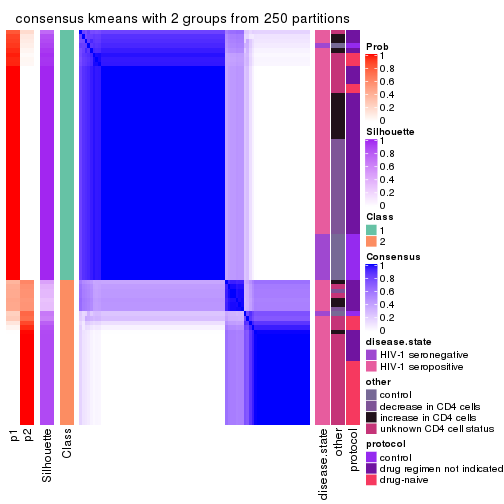</p>

</div>
<div id='tab-SD-kmeans-consensus-heatmap-2'>
<pre><code class="r">consensus_heatmap(res, k = 3)
</code></pre>

<p>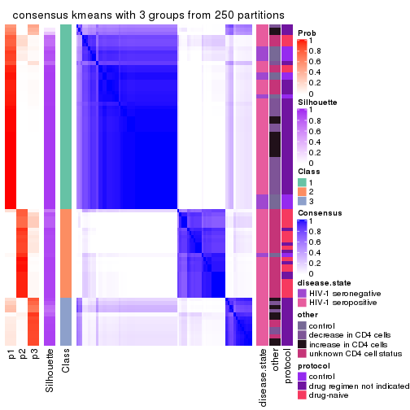</p>

</div>
<div id='tab-SD-kmeans-consensus-heatmap-3'>
<pre><code class="r">consensus_heatmap(res, k = 4)
</code></pre>

<p>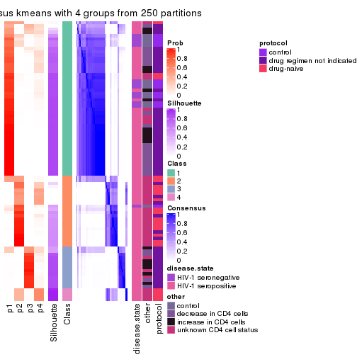</p>

</div>
<div id='tab-SD-kmeans-consensus-heatmap-4'>
<pre><code class="r">consensus_heatmap(res, k = 5)
</code></pre>

<p>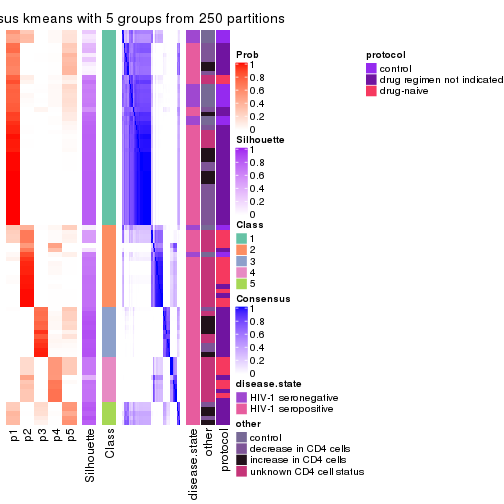</p>

</div>
<div id='tab-SD-kmeans-consensus-heatmap-5'>
<pre><code class="r">consensus_heatmap(res, k = 6)
</code></pre>

<p>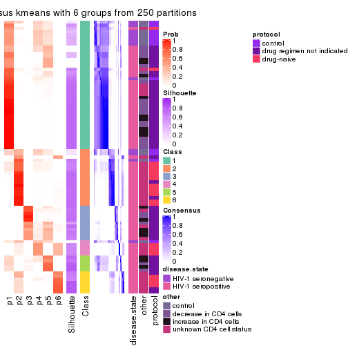</p>

</div>
</div>

Heatmaps for the membership of samples in all partitions to see how consistent they are:


<script>
$( function() {
	$( '#tabs-SD-kmeans-membership-heatmap' ).tabs();
} );
</script>
<div id='tabs-SD-kmeans-membership-heatmap'>
<ul>
<li><a href='#tab-SD-kmeans-membership-heatmap-1'>k = 2</a></li>
<li><a href='#tab-SD-kmeans-membership-heatmap-2'>k = 3</a></li>
<li><a href='#tab-SD-kmeans-membership-heatmap-3'>k = 4</a></li>
<li><a href='#tab-SD-kmeans-membership-heatmap-4'>k = 5</a></li>
<li><a href='#tab-SD-kmeans-membership-heatmap-5'>k = 6</a></li>
</ul>
<div id='tab-SD-kmeans-membership-heatmap-1'>
<pre><code class="r">membership_heatmap(res, k = 2)
</code></pre>

<p>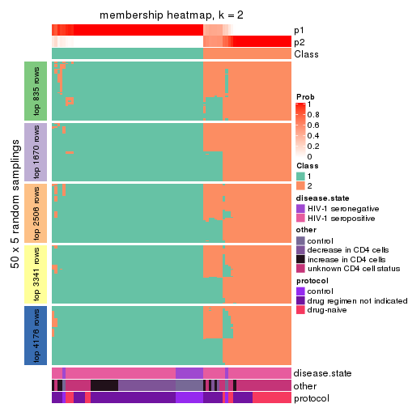</p>

</div>
<div id='tab-SD-kmeans-membership-heatmap-2'>
<pre><code class="r">membership_heatmap(res, k = 3)
</code></pre>

<p>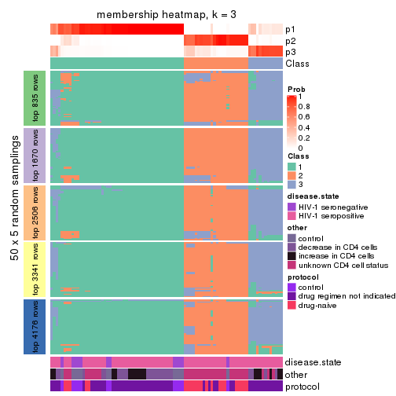</p>

</div>
<div id='tab-SD-kmeans-membership-heatmap-3'>
<pre><code class="r">membership_heatmap(res, k = 4)
</code></pre>

<p>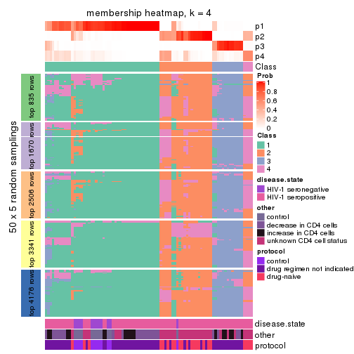</p>

</div>
<div id='tab-SD-kmeans-membership-heatmap-4'>
<pre><code class="r">membership_heatmap(res, k = 5)
</code></pre>

<p>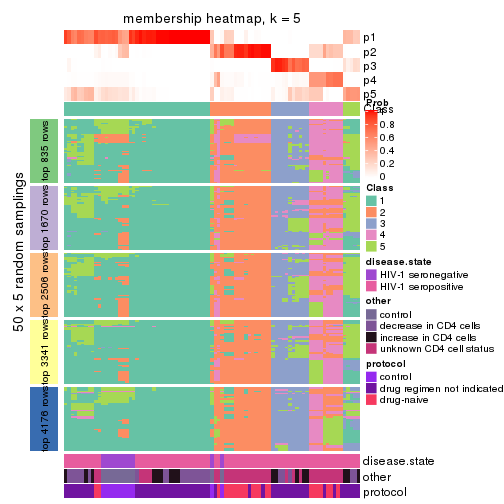</p>

</div>
<div id='tab-SD-kmeans-membership-heatmap-5'>
<pre><code class="r">membership_heatmap(res, k = 6)
</code></pre>

<p>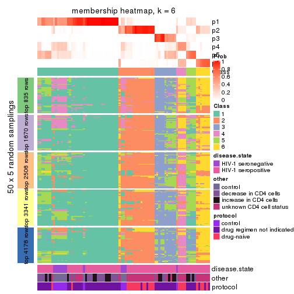</p>

</div>
</div>

As soon as we have had the classes for columns, we can look for signatures
which are significantly different between classes which can be candidate marks
for certain classes. Following are the heatmaps for signatures.


Signature heatmaps where rows are scaled:


<script>
$( function() {
	$( '#tabs-SD-kmeans-get-signatures' ).tabs();
} );
</script>
<div id='tabs-SD-kmeans-get-signatures'>
<ul>
<li><a href='#tab-SD-kmeans-get-signatures-1'>k = 2</a></li>
<li><a href='#tab-SD-kmeans-get-signatures-2'>k = 3</a></li>
<li><a href='#tab-SD-kmeans-get-signatures-3'>k = 4</a></li>
<li><a href='#tab-SD-kmeans-get-signatures-4'>k = 5</a></li>
<li><a href='#tab-SD-kmeans-get-signatures-5'>k = 6</a></li>
</ul>
<div id='tab-SD-kmeans-get-signatures-1'>
<pre><code class="r">get_signatures(res, k = 2)
</code></pre>

<p>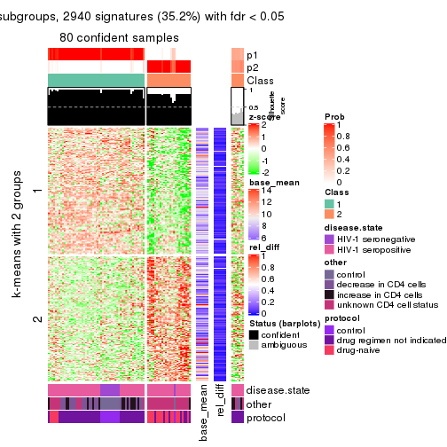</p>

</div>
<div id='tab-SD-kmeans-get-signatures-2'>
<pre><code class="r">get_signatures(res, k = 3)
</code></pre>

<p>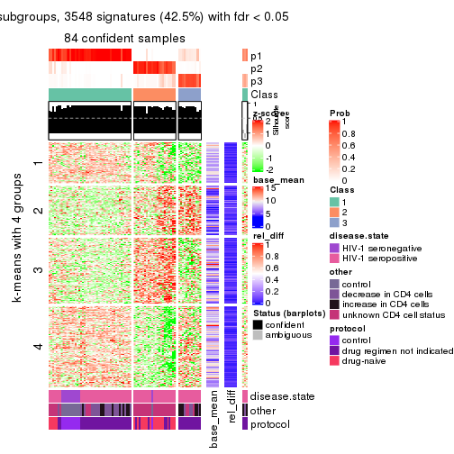</p>

</div>
<div id='tab-SD-kmeans-get-signatures-3'>
<pre><code class="r">get_signatures(res, k = 4)
</code></pre>

<p>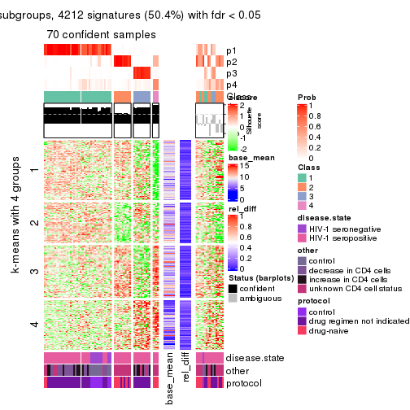</p>

</div>
<div id='tab-SD-kmeans-get-signatures-4'>
<pre><code class="r">get_signatures(res, k = 5)
</code></pre>

<p>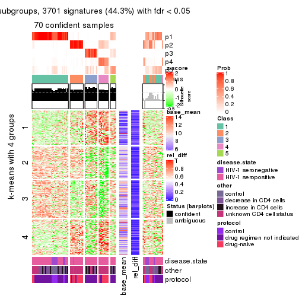</p>

</div>
<div id='tab-SD-kmeans-get-signatures-5'>
<pre><code class="r">get_signatures(res, k = 6)
</code></pre>

<p>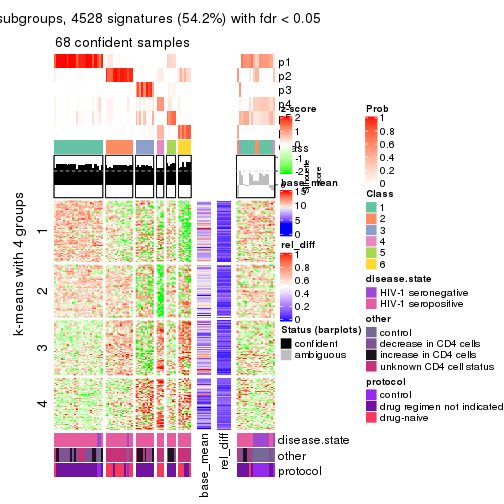</p>

</div>
</div>


Signature heatmaps where rows are not scaled:


<script>
$( function() {
	$( '#tabs-SD-kmeans-get-signatures-no-scale' ).tabs();
} );
</script>
<div id='tabs-SD-kmeans-get-signatures-no-scale'>
<ul>
<li><a href='#tab-SD-kmeans-get-signatures-no-scale-1'>k = 2</a></li>
<li><a href='#tab-SD-kmeans-get-signatures-no-scale-2'>k = 3</a></li>
<li><a href='#tab-SD-kmeans-get-signatures-no-scale-3'>k = 4</a></li>
<li><a href='#tab-SD-kmeans-get-signatures-no-scale-4'>k = 5</a></li>
<li><a href='#tab-SD-kmeans-get-signatures-no-scale-5'>k = 6</a></li>
</ul>
<div id='tab-SD-kmeans-get-signatures-no-scale-1'>
<pre><code class="r">get_signatures(res, k = 2, scale_rows = FALSE)
</code></pre>

<p>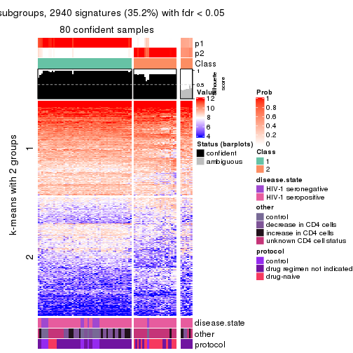</p>

</div>
<div id='tab-SD-kmeans-get-signatures-no-scale-2'>
<pre><code class="r">get_signatures(res, k = 3, scale_rows = FALSE)
</code></pre>

<p>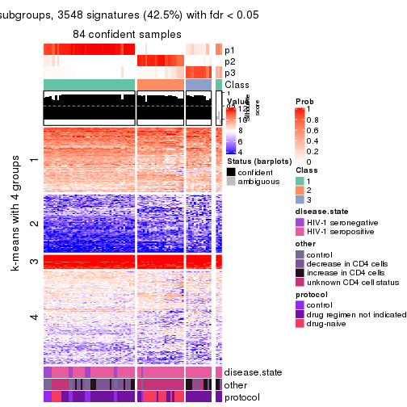</p>

</div>
<div id='tab-SD-kmeans-get-signatures-no-scale-3'>
<pre><code class="r">get_signatures(res, k = 4, scale_rows = FALSE)
</code></pre>

<p>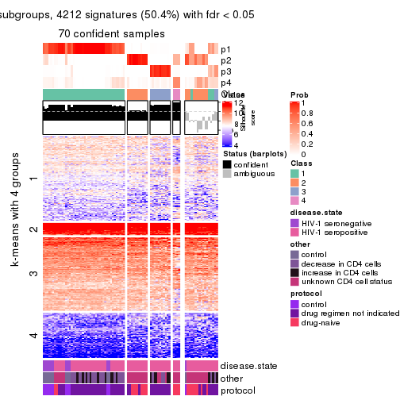</p>

</div>
<div id='tab-SD-kmeans-get-signatures-no-scale-4'>
<pre><code class="r">get_signatures(res, k = 5, scale_rows = FALSE)
</code></pre>

<p>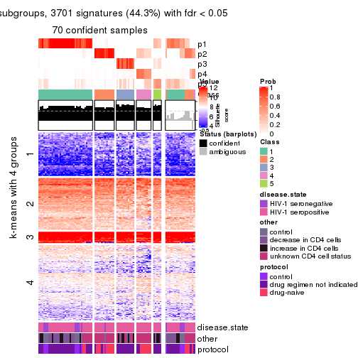</p>

</div>
<div id='tab-SD-kmeans-get-signatures-no-scale-5'>
<pre><code class="r">get_signatures(res, k = 6, scale_rows = FALSE)
</code></pre>

<p>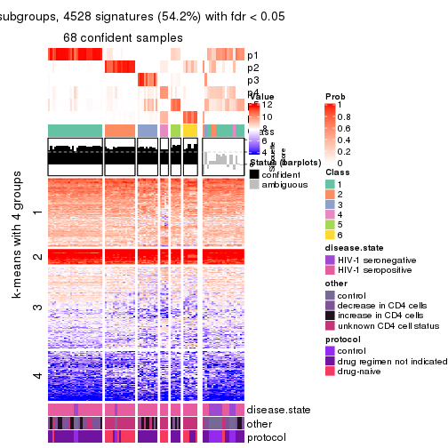</p>

</div>
</div>


Compare the overlap of signatures from different k:

```r
compare_signatures(res)
```

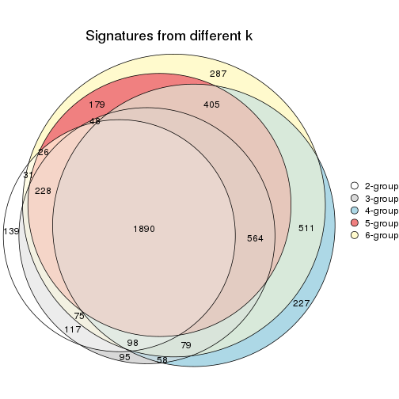

`get_signature()` returns a data frame invisibly. TO get the list of signatures, the function
call should be assigned to a variable explicitly. In following code, if `plot` argument is set
to `FALSE`, no heatmap is plotted while only the differential analysis is performed.

```r
# code only for demonstration
tb = get_signature(res, k = ..., plot = FALSE)
```

An example of the output of `tb` is:

```
#>   which_row         fdr    mean_1    mean_2 scaled_mean_1 scaled_mean_2 km
#> 1        38 0.042760348  8.373488  9.131774    -0.5533452     0.5164555  1
#> 2        40 0.018707592  7.106213  8.469186    -0.6173731     0.5762149  1
#> 3        55 0.019134737 10.221463 11.207825    -0.6159697     0.5749050  1
#> 4        59 0.006059896  5.921854  7.869574    -0.6899429     0.6439467  1
#> 5        60 0.018055526  8.928898 10.211722    -0.6204761     0.5791110  1
#> 6        98 0.009384629 15.714769 14.887706     0.6635654    -0.6193277  2
...
```

The columns in `tb` are:

1. `which_row`: row indices corresponding to the input matrix.
2. `fdr`: FDR for the differential test. 
3. `mean_x`: The mean value in group x.
4. `scaled_mean_x`: The mean value in group x after rows are scaled.
5. `km`: Row groups if k-means clustering is applied to rows.


UMAP plot which shows how samples are separated.


<script>
$( function() {
	$( '#tabs-SD-kmeans-dimension-reduction' ).tabs();
} );
</script>
<div id='tabs-SD-kmeans-dimension-reduction'>
<ul>
<li><a href='#tab-SD-kmeans-dimension-reduction-1'>k = 2</a></li>
<li><a href='#tab-SD-kmeans-dimension-reduction-2'>k = 3</a></li>
<li><a href='#tab-SD-kmeans-dimension-reduction-3'>k = 4</a></li>
<li><a href='#tab-SD-kmeans-dimension-reduction-4'>k = 5</a></li>
<li><a href='#tab-SD-kmeans-dimension-reduction-5'>k = 6</a></li>
</ul>
<div id='tab-SD-kmeans-dimension-reduction-1'>
<pre><code class="r">dimension_reduction(res, k = 2, method = &quot;UMAP&quot;)
</code></pre>

<p>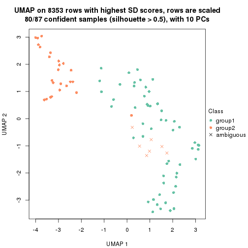</p>

</div>
<div id='tab-SD-kmeans-dimension-reduction-2'>
<pre><code class="r">dimension_reduction(res, k = 3, method = &quot;UMAP&quot;)
</code></pre>

<p>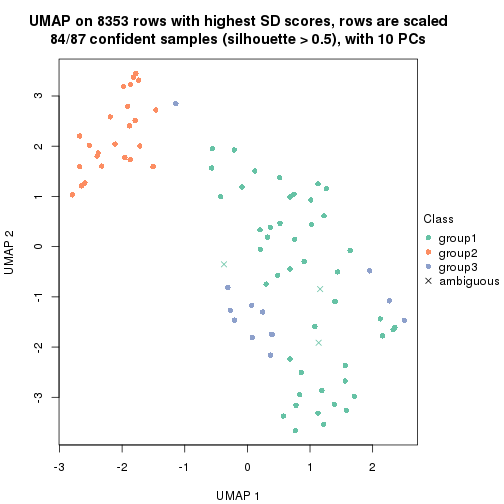</p>

</div>
<div id='tab-SD-kmeans-dimension-reduction-3'>
<pre><code class="r">dimension_reduction(res, k = 4, method = &quot;UMAP&quot;)
</code></pre>

<p>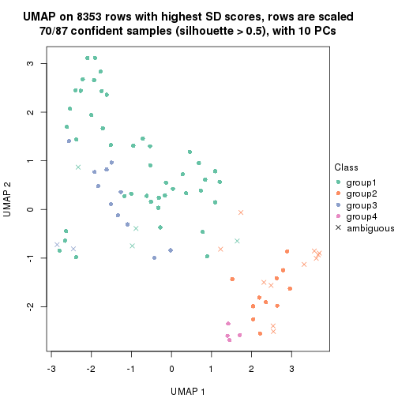</p>

</div>
<div id='tab-SD-kmeans-dimension-reduction-4'>
<pre><code class="r">dimension_reduction(res, k = 5, method = &quot;UMAP&quot;)
</code></pre>

<p>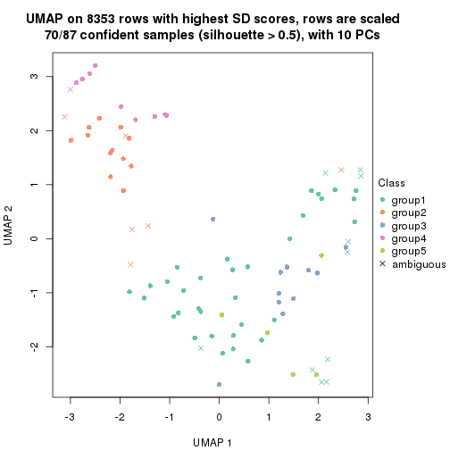</p>

</div>
<div id='tab-SD-kmeans-dimension-reduction-5'>
<pre><code class="r">dimension_reduction(res, k = 6, method = &quot;UMAP&quot;)
</code></pre>

<p>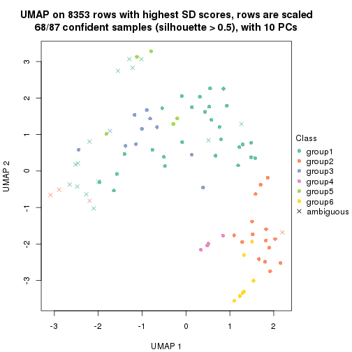</p>

</div>
</div>


Following heatmap shows how subgroups are split when increasing `k`:

```r
collect_classes(res)
```

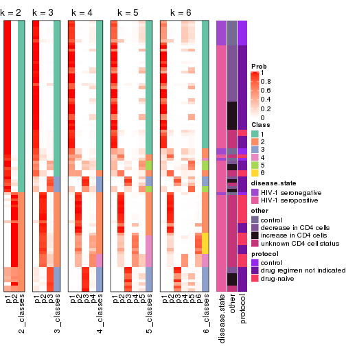


Test correlation between subgroups and known annotations. If the known
annotation is numeric, one-way ANOVA test is applied, and if the known
annotation is discrete, chi-squared contingency table test is applied.

```r
test_to_known_factors(res)
```

```
#>            n disease.state(p) other(p) protocol(p) k
#> SD:kmeans 80           0.1285 1.76e-08    2.87e-07 2
#> SD:kmeans 84           0.0252 6.83e-09    2.65e-08 3
#> SD:kmeans 70           0.0524 1.50e-06    6.19e-09 4
#> SD:kmeans 70           0.1673 5.61e-06    2.30e-07 5
#> SD:kmeans 68           0.8553 2.76e-05    9.53e-07 6
```


If matrix rows can be associated to genes, consider to use `GO_Enrichment(res,
...)` to perform function enrichment for the signature genes.


 

---------------------------------------------------


### SD:skmeans*


The object with results only for a single top-value method and a single partition method 
can be extracted as:

```r
res = res_list["SD", "skmeans"]
# you can also extract it by
# res = res_list["SD:skmeans"]
```

A summary of `res` and all the functions that can be applied to it:

```r
res
```

```
#> A 'ConsensusPartition' object with k = 2, 3, 4, 5, 6.
#>   On a matrix with 8353 rows and 87 columns.
#>   Top rows (835, 1670, 2506, 3341, 4176) are extracted by 'SD' method.
#>   Subgroups are detected by 'skmeans' method.
#>   Performed in total 1250 partitions by row resampling.
#>   Best k for subgroups seems to be 2.
#> 
#> Following methods can be applied to this 'ConsensusPartition' object:
#>  [1] "cola_report"             "collect_classes"         "collect_plots"          
#>  [4] "collect_stats"           "colnames"                "compare_signatures"     
#>  [7] "consensus_heatmap"       "dimension_reduction"     "functional_enrichment"  
#> [10] "get_anno_col"            "get_anno"                "get_classes"            
#> [13] "get_consensus"           "get_matrix"              "get_membership"         
#> [16] "get_param"               "get_signatures"          "get_stats"              
#> [19] "is_best_k"               "is_stable_k"             "membership_heatmap"     
#> [22] "ncol"                    "nrow"                    "plot_ecdf"              
#> [25] "rownames"                "select_partition_number" "show"                   
#> [28] "suggest_best_k"          "test_to_known_factors"
```

`collect_plots()` function collects all the plots made from `res` for all `k` (number of partitions)
into one single page to provide an easy and fast comparison between different `k`.

```r
collect_plots(res)
```

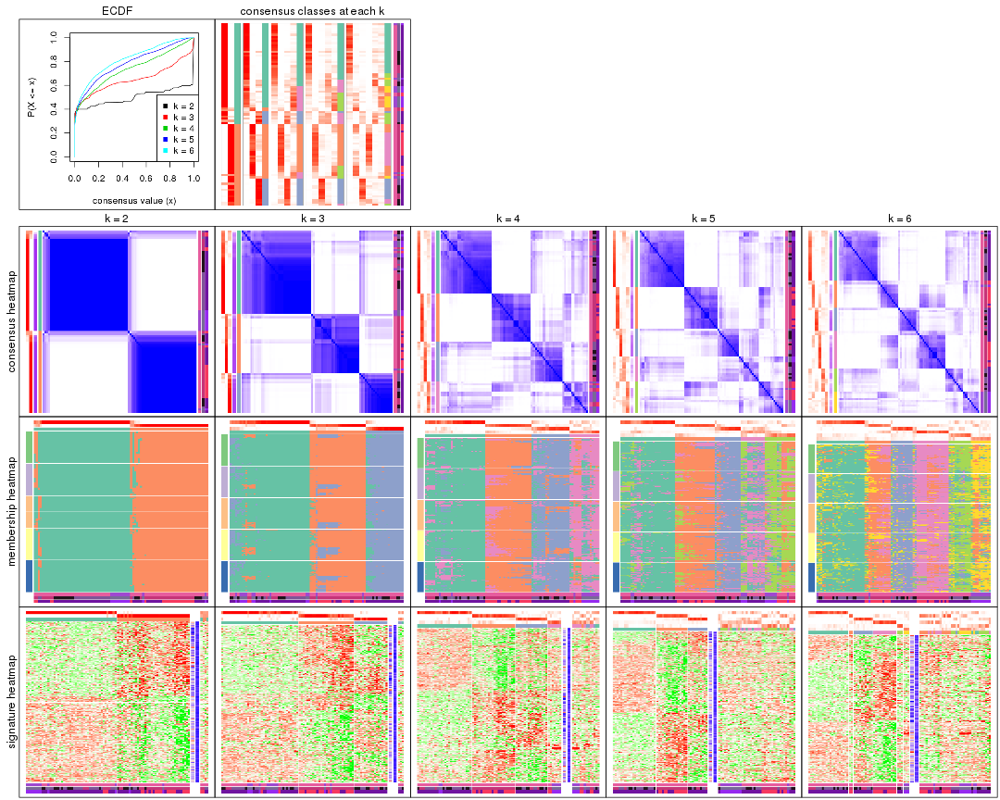

The plots are:

- The first row: a plot of the ECDF (Empirical cumulative distribution
  function) curves of the consensus matrix for each `k` and the heatmap of
  predicted classes for each `k`.
- The second row: heatmaps of the consensus matrix for each `k`.
- The third row: heatmaps of the membership matrix for each `k`.
- The fouth row: heatmaps of the signatures for each `k`.

All the plots in panels can be made by individual functions and they are
plotted later in this section.

`select_partition_number()` produces several plots showing different
statistics for choosing "optimized" `k`. There are following statistics:

- ECDF curves of the consensus matrix for each `k`;
- 1-PAC. [The PAC
  score](https://en.wikipedia.org/wiki/Consensus_clustering#Over-interpretation_potential_of_consensus_clustering)
  measures the proportion of the ambiguous subgrouping.
- Mean silhouette score.
- Concordance. The mean probability of fiting the consensus class ids in all
  partitions.
- Area increased. Denote $A_k$ as the area under the ECDF curve for current
  `k`, the area increased is defined as $A_k - A_{k-1}$.
- Rand index. The percent of pairs of samples that are both in a same cluster
  or both are not in a same cluster in the partition of k and k-1.
- Jaccard index. The ratio of pairs of samples are both in a same cluster in
  the partition of k and k-1 and the pairs of samples are both in a same
  cluster in the partition k or k-1.

The detailed explanations of these statistics can be found in [the cola
vignette](http://bioconductor.org/packages/devel/bioc/vignettes/cola/inst/doc/cola.html#toc_13).

Generally speaking, lower PAC score, higher mean silhouette score or higher
concordance corresponds to better partition. Rand index and Jaccard index
measure how similar the current partition is compared to partition with `k-1`.
If they are too similar, we won't accept `k` is better than `k-1`.

```r
select_partition_number(res)
```

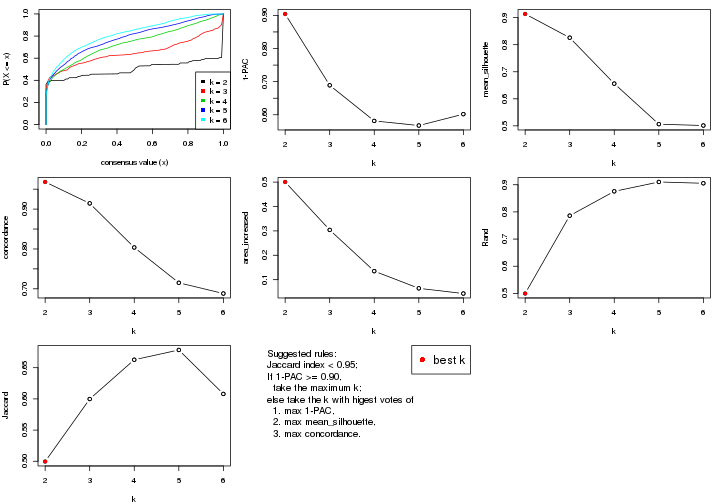

The numeric values for all these statistics can be obtained by `get_stats()`.

```r
get_stats(res)
```

```
#>   k 1-PAC mean_silhouette concordance area_increased  Rand Jaccard
#> 2 2 0.904           0.914       0.968         0.5006 0.500   0.500
#> 3 3 0.689           0.826       0.914         0.3039 0.786   0.600
#> 4 4 0.581           0.656       0.804         0.1349 0.876   0.663
#> 5 5 0.568           0.506       0.715         0.0645 0.910   0.678
#> 6 6 0.602           0.501       0.688         0.0432 0.905   0.608
```

`suggest_best_k()` suggests the best $k$ based on these statistics. The rules are as follows:

- All $k$ with Jaccard index larger than 0.95 are removed because the increase of
  the partition number does not provides enough extra information. If all $k$ are removed,
  the best $k$ is assigned by `NA`.
- For $k$ with 1-PAC larger than 0.9, the maximal $k$ is taken as the "best k". Other $k$ is called "optional k".
- If it does not fit the second rule. The $k$ with the highest vote of highest
  1-PAC, mean silhouette and concordance is taken as the "best k".

```r
suggest_best_k(res)
```

```
#> [1] 2
```


Following shows the table of the partitions (You need to click the **show/hide
code output** link to see it). The membership matrix (columns with name `p*`)
is inferred by
[`clue::cl_consensus()`](https://www.rdocumentation.org/link/cl_consensus?package=clue)
function with the `SE` method. Basically the value in the membership matrix
represents the probability to belong to a certain group. The finall class
label for an item is determined with the group with highest probability it
belongs to.

In `get_classes()` function, the entropy is calculated from the membership
matrix and the silhouette score is calculated from the consensus matrix.


<script>
$( function() {
	$( '#tabs-SD-skmeans-get-classes' ).tabs();
} );
</script>
<div id='tabs-SD-skmeans-get-classes'>
<ul>
<li><a href='#tab-SD-skmeans-get-classes-1'>k = 2</a></li>
<li><a href='#tab-SD-skmeans-get-classes-2'>k = 3</a></li>
<li><a href='#tab-SD-skmeans-get-classes-3'>k = 4</a></li>
<li><a href='#tab-SD-skmeans-get-classes-4'>k = 5</a></li>
<li><a href='#tab-SD-skmeans-get-classes-5'>k = 6</a></li>
</ul>

<div id='tab-SD-skmeans-get-classes-1'>
<p><a id='tab-SD-skmeans-get-classes-1-a' style='color:#0366d6' href='#'>show/hide code output</a></p>
<pre><code class="r">cbind(get_classes(res, k = 2), get_membership(res, k = 2))
</code></pre>

<pre><code>#&gt;          class entropy silhouette    p1    p2
#&gt; GSM39104     1  0.0000    0.96929 1.000 0.000
#&gt; GSM39105     1  0.0000    0.96929 1.000 0.000
#&gt; GSM39106     1  0.0000    0.96929 1.000 0.000
#&gt; GSM39107     1  0.0000    0.96929 1.000 0.000
#&gt; GSM39108     1  0.0000    0.96929 1.000 0.000
#&gt; GSM39109     2  0.0672    0.95494 0.008 0.992
#&gt; GSM39110     1  0.0000    0.96929 1.000 0.000
#&gt; GSM39111     1  0.0000    0.96929 1.000 0.000
#&gt; GSM39112     1  0.0000    0.96929 1.000 0.000
#&gt; GSM39113     1  0.0000    0.96929 1.000 0.000
#&gt; GSM39114     2  0.0000    0.96092 0.000 1.000
#&gt; GSM39115     1  0.0000    0.96929 1.000 0.000
#&gt; GSM39148     1  0.0000    0.96929 1.000 0.000
#&gt; GSM39149     2  0.0000    0.96092 0.000 1.000
#&gt; GSM39150     1  0.0000    0.96929 1.000 0.000
#&gt; GSM39151     2  0.0000    0.96092 0.000 1.000
#&gt; GSM39152     2  0.9983    0.09761 0.476 0.524
#&gt; GSM39153     1  0.0000    0.96929 1.000 0.000
#&gt; GSM39154     1  0.0000    0.96929 1.000 0.000
#&gt; GSM39155     1  0.0000    0.96929 1.000 0.000
#&gt; GSM39156     1  0.0000    0.96929 1.000 0.000
#&gt; GSM39157     1  0.0000    0.96929 1.000 0.000
#&gt; GSM39158     1  0.0000    0.96929 1.000 0.000
#&gt; GSM39159     1  0.7139    0.73569 0.804 0.196
#&gt; GSM39160     1  0.0000    0.96929 1.000 0.000
#&gt; GSM39161     1  1.0000   -0.05080 0.500 0.500
#&gt; GSM39162     1  0.0000    0.96929 1.000 0.000
#&gt; GSM39163     1  0.0000    0.96929 1.000 0.000
#&gt; GSM39164     1  0.0000    0.96929 1.000 0.000
#&gt; GSM39165     1  0.0000    0.96929 1.000 0.000
#&gt; GSM39166     1  0.0000    0.96929 1.000 0.000
#&gt; GSM39167     1  0.0000    0.96929 1.000 0.000
#&gt; GSM39168     1  0.0000    0.96929 1.000 0.000
#&gt; GSM39169     1  0.0000    0.96929 1.000 0.000
#&gt; GSM39170     1  0.0000    0.96929 1.000 0.000
#&gt; GSM39171     1  0.0000    0.96929 1.000 0.000
#&gt; GSM39172     2  0.0000    0.96092 0.000 1.000
#&gt; GSM39173     2  0.0000    0.96092 0.000 1.000
#&gt; GSM39174     1  0.0000    0.96929 1.000 0.000
#&gt; GSM39175     1  0.0000    0.96929 1.000 0.000
#&gt; GSM39176     1  0.0000    0.96929 1.000 0.000
#&gt; GSM39177     2  0.6801    0.76990 0.180 0.820
#&gt; GSM39178     1  0.0000    0.96929 1.000 0.000
#&gt; GSM39179     2  0.0000    0.96092 0.000 1.000
#&gt; GSM39180     2  0.0000    0.96092 0.000 1.000
#&gt; GSM39181     1  0.0000    0.96929 1.000 0.000
#&gt; GSM39182     2  0.5408    0.84018 0.124 0.876
#&gt; GSM39183     1  0.0000    0.96929 1.000 0.000
#&gt; GSM39184     1  0.0000    0.96929 1.000 0.000
#&gt; GSM39185     2  0.4815    0.86469 0.104 0.896
#&gt; GSM39186     1  0.0000    0.96929 1.000 0.000
#&gt; GSM39187     1  0.0000    0.96929 1.000 0.000
#&gt; GSM39116     2  0.0000    0.96092 0.000 1.000
#&gt; GSM39117     2  0.0000    0.96092 0.000 1.000
#&gt; GSM39118     2  0.0000    0.96092 0.000 1.000
#&gt; GSM39119     2  0.0000    0.96092 0.000 1.000
#&gt; GSM39120     1  0.0000    0.96929 1.000 0.000
#&gt; GSM39121     1  0.8144    0.64837 0.748 0.252
#&gt; GSM39122     1  0.9775    0.28717 0.588 0.412
#&gt; GSM39123     2  0.0000    0.96092 0.000 1.000
#&gt; GSM39124     2  0.0000    0.96092 0.000 1.000
#&gt; GSM39125     1  0.0000    0.96929 1.000 0.000
#&gt; GSM39126     2  0.9998    0.00163 0.492 0.508
#&gt; GSM39127     2  0.0000    0.96092 0.000 1.000
#&gt; GSM39128     2  0.0000    0.96092 0.000 1.000
#&gt; GSM39129     2  0.0000    0.96092 0.000 1.000
#&gt; GSM39130     2  0.0000    0.96092 0.000 1.000
#&gt; GSM39131     2  0.0000    0.96092 0.000 1.000
#&gt; GSM39132     2  0.0000    0.96092 0.000 1.000
#&gt; GSM39133     2  0.0000    0.96092 0.000 1.000
#&gt; GSM39134     2  0.0000    0.96092 0.000 1.000
#&gt; GSM39135     2  0.0000    0.96092 0.000 1.000
#&gt; GSM39136     2  0.0000    0.96092 0.000 1.000
#&gt; GSM39137     2  0.0376    0.95804 0.004 0.996
#&gt; GSM39138     2  0.0000    0.96092 0.000 1.000
#&gt; GSM39139     2  0.0000    0.96092 0.000 1.000
#&gt; GSM39140     1  0.0000    0.96929 1.000 0.000
#&gt; GSM39141     1  0.0000    0.96929 1.000 0.000
#&gt; GSM39142     1  0.0000    0.96929 1.000 0.000
#&gt; GSM39143     1  0.0000    0.96929 1.000 0.000
#&gt; GSM39144     2  0.0000    0.96092 0.000 1.000
#&gt; GSM39145     2  0.0000    0.96092 0.000 1.000
#&gt; GSM39146     2  0.0000    0.96092 0.000 1.000
#&gt; GSM39147     2  0.0000    0.96092 0.000 1.000
#&gt; GSM39188     2  0.0000    0.96092 0.000 1.000
#&gt; GSM39189     2  0.1843    0.93844 0.028 0.972
#&gt; GSM39190     2  0.0000    0.96092 0.000 1.000
</code></pre>

<script>
$('#tab-SD-skmeans-get-classes-1-a').parent().next().next().hide();
$('#tab-SD-skmeans-get-classes-1-a').click(function(){
  $('#tab-SD-skmeans-get-classes-1-a').parent().next().next().toggle();
  return(false);
});
</script>
</div>

<div id='tab-SD-skmeans-get-classes-2'>
<p><a id='tab-SD-skmeans-get-classes-2-a' style='color:#0366d6' href='#'>show/hide code output</a></p>
<pre><code class="r">cbind(get_classes(res, k = 3), get_membership(res, k = 3))
</code></pre>

<pre><code>#&gt;          class entropy silhouette    p1    p2    p3
#&gt; GSM39104     1  0.3816      0.797 0.852 0.000 0.148
#&gt; GSM39105     1  0.0000      0.911 1.000 0.000 0.000
#&gt; GSM39106     1  0.4058      0.852 0.880 0.076 0.044
#&gt; GSM39107     1  0.4178      0.783 0.828 0.172 0.000
#&gt; GSM39108     1  0.0424      0.909 0.992 0.008 0.000
#&gt; GSM39109     2  0.6427      0.510 0.012 0.640 0.348
#&gt; GSM39110     1  0.5598      0.772 0.800 0.052 0.148
#&gt; GSM39111     1  0.5363      0.617 0.724 0.000 0.276
#&gt; GSM39112     1  0.3686      0.815 0.860 0.140 0.000
#&gt; GSM39113     1  0.5560      0.614 0.700 0.300 0.000
#&gt; GSM39114     2  0.0000      0.886 0.000 1.000 0.000
#&gt; GSM39115     1  0.0000      0.911 1.000 0.000 0.000
#&gt; GSM39148     1  0.0000      0.911 1.000 0.000 0.000
#&gt; GSM39149     3  0.0000      0.899 0.000 0.000 1.000
#&gt; GSM39150     3  0.6307      0.026 0.488 0.000 0.512
#&gt; GSM39151     3  0.0000      0.899 0.000 0.000 1.000
#&gt; GSM39152     3  0.0592      0.897 0.012 0.000 0.988
#&gt; GSM39153     1  0.0000      0.911 1.000 0.000 0.000
#&gt; GSM39154     1  0.0000      0.911 1.000 0.000 0.000
#&gt; GSM39155     1  0.0000      0.911 1.000 0.000 0.000
#&gt; GSM39156     1  0.0424      0.909 0.992 0.008 0.000
#&gt; GSM39157     1  0.0000      0.911 1.000 0.000 0.000
#&gt; GSM39158     1  0.1163      0.898 0.972 0.000 0.028
#&gt; GSM39159     3  0.2356      0.860 0.072 0.000 0.928
#&gt; GSM39160     3  0.5882      0.465 0.348 0.000 0.652
#&gt; GSM39161     3  0.0747      0.895 0.016 0.000 0.984
#&gt; GSM39162     1  0.0000      0.911 1.000 0.000 0.000
#&gt; GSM39163     1  0.0000      0.911 1.000 0.000 0.000
#&gt; GSM39164     1  0.0000      0.911 1.000 0.000 0.000
#&gt; GSM39165     3  0.5254      0.637 0.264 0.000 0.736
#&gt; GSM39166     1  0.5706      0.521 0.680 0.000 0.320
#&gt; GSM39167     1  0.0000      0.911 1.000 0.000 0.000
#&gt; GSM39168     1  0.0000      0.911 1.000 0.000 0.000
#&gt; GSM39169     1  0.0237      0.910 0.996 0.000 0.004
#&gt; GSM39170     1  0.1031      0.901 0.976 0.000 0.024
#&gt; GSM39171     1  0.5650      0.542 0.688 0.000 0.312
#&gt; GSM39172     3  0.0000      0.899 0.000 0.000 1.000
#&gt; GSM39173     3  0.0592      0.892 0.000 0.012 0.988
#&gt; GSM39174     1  0.0000      0.911 1.000 0.000 0.000
#&gt; GSM39175     1  0.1964      0.881 0.944 0.000 0.056
#&gt; GSM39176     1  0.0000      0.911 1.000 0.000 0.000
#&gt; GSM39177     3  0.0237      0.899 0.004 0.000 0.996
#&gt; GSM39178     3  0.3482      0.813 0.128 0.000 0.872
#&gt; GSM39179     3  0.0000      0.899 0.000 0.000 1.000
#&gt; GSM39180     3  0.1163      0.879 0.000 0.028 0.972
#&gt; GSM39181     1  0.5497      0.577 0.708 0.000 0.292
#&gt; GSM39182     3  0.1878      0.862 0.004 0.044 0.952
#&gt; GSM39183     1  0.6267      0.147 0.548 0.000 0.452
#&gt; GSM39184     1  0.0000      0.911 1.000 0.000 0.000
#&gt; GSM39185     3  0.0237      0.898 0.004 0.000 0.996
#&gt; GSM39186     1  0.0237      0.910 0.996 0.000 0.004
#&gt; GSM39187     1  0.0000      0.911 1.000 0.000 0.000
#&gt; GSM39116     2  0.0424      0.886 0.000 0.992 0.008
#&gt; GSM39117     2  0.5178      0.766 0.000 0.744 0.256
#&gt; GSM39118     2  0.3482      0.857 0.000 0.872 0.128
#&gt; GSM39119     2  0.4399      0.827 0.000 0.812 0.188
#&gt; GSM39120     1  0.3896      0.823 0.864 0.128 0.008
#&gt; GSM39121     2  0.4887      0.658 0.228 0.772 0.000
#&gt; GSM39122     2  0.3482      0.783 0.128 0.872 0.000
#&gt; GSM39123     2  0.5178      0.766 0.000 0.744 0.256
#&gt; GSM39124     2  0.0000      0.886 0.000 1.000 0.000
#&gt; GSM39125     1  0.3272      0.846 0.892 0.104 0.004
#&gt; GSM39126     2  0.2625      0.827 0.084 0.916 0.000
#&gt; GSM39127     2  0.0000      0.886 0.000 1.000 0.000
#&gt; GSM39128     2  0.0000      0.886 0.000 1.000 0.000
#&gt; GSM39129     2  0.4235      0.834 0.000 0.824 0.176
#&gt; GSM39130     2  0.5138      0.770 0.000 0.748 0.252
#&gt; GSM39131     2  0.0000      0.886 0.000 1.000 0.000
#&gt; GSM39132     2  0.0237      0.886 0.000 0.996 0.004
#&gt; GSM39133     2  0.4796      0.801 0.000 0.780 0.220
#&gt; GSM39134     2  0.4002      0.842 0.000 0.840 0.160
#&gt; GSM39135     2  0.0424      0.886 0.000 0.992 0.008
#&gt; GSM39136     2  0.0424      0.887 0.000 0.992 0.008
#&gt; GSM39137     2  0.0000      0.886 0.000 1.000 0.000
#&gt; GSM39138     2  0.4291      0.832 0.000 0.820 0.180
#&gt; GSM39139     2  0.2066      0.878 0.000 0.940 0.060
#&gt; GSM39140     1  0.0747      0.905 0.984 0.016 0.000
#&gt; GSM39141     1  0.0237      0.910 0.996 0.004 0.000
#&gt; GSM39142     1  0.0237      0.910 0.996 0.004 0.000
#&gt; GSM39143     1  0.0237      0.910 0.996 0.004 0.000
#&gt; GSM39144     2  0.4062      0.840 0.000 0.836 0.164
#&gt; GSM39145     2  0.0892      0.886 0.000 0.980 0.020
#&gt; GSM39146     2  0.0237      0.886 0.000 0.996 0.004
#&gt; GSM39147     2  0.0000      0.886 0.000 1.000 0.000
#&gt; GSM39188     3  0.0000      0.899 0.000 0.000 1.000
#&gt; GSM39189     3  0.0000      0.899 0.000 0.000 1.000
#&gt; GSM39190     3  0.0000      0.899 0.000 0.000 1.000
</code></pre>

<script>
$('#tab-SD-skmeans-get-classes-2-a').parent().next().next().hide();
$('#tab-SD-skmeans-get-classes-2-a').click(function(){
  $('#tab-SD-skmeans-get-classes-2-a').parent().next().next().toggle();
  return(false);
});
</script>
</div>

<div id='tab-SD-skmeans-get-classes-3'>
<p><a id='tab-SD-skmeans-get-classes-3-a' style='color:#0366d6' href='#'>show/hide code output</a></p>
<pre><code class="r">cbind(get_classes(res, k = 4), get_membership(res, k = 4))
</code></pre>

<pre><code>#&gt;          class entropy silhouette    p1    p2    p3    p4
#&gt; GSM39104     4  0.7285     0.2693 0.300 0.000 0.180 0.520
#&gt; GSM39105     1  0.4891     0.5706 0.680 0.000 0.012 0.308
#&gt; GSM39106     4  0.4405     0.6126 0.152 0.000 0.048 0.800
#&gt; GSM39107     4  0.3383     0.6523 0.076 0.052 0.000 0.872
#&gt; GSM39108     4  0.5855     0.3557 0.356 0.000 0.044 0.600
#&gt; GSM39109     4  0.7122     0.3605 0.000 0.248 0.192 0.560
#&gt; GSM39110     4  0.6954     0.5115 0.224 0.008 0.156 0.612
#&gt; GSM39111     4  0.7700     0.2376 0.304 0.000 0.248 0.448
#&gt; GSM39112     4  0.3946     0.6453 0.168 0.020 0.000 0.812
#&gt; GSM39113     4  0.3398     0.6450 0.068 0.060 0.000 0.872
#&gt; GSM39114     4  0.4585     0.3247 0.000 0.332 0.000 0.668
#&gt; GSM39115     1  0.3982     0.7046 0.776 0.000 0.004 0.220
#&gt; GSM39148     1  0.0921     0.8264 0.972 0.000 0.000 0.028
#&gt; GSM39149     3  0.2101     0.7556 0.000 0.060 0.928 0.012
#&gt; GSM39150     3  0.7904     0.0432 0.324 0.000 0.368 0.308
#&gt; GSM39151     3  0.2255     0.7561 0.000 0.068 0.920 0.012
#&gt; GSM39152     3  0.2707     0.7323 0.008 0.016 0.908 0.068
#&gt; GSM39153     1  0.1022     0.8314 0.968 0.000 0.000 0.032
#&gt; GSM39154     1  0.0657     0.8318 0.984 0.000 0.004 0.012
#&gt; GSM39155     1  0.1211     0.8295 0.960 0.000 0.000 0.040
#&gt; GSM39156     1  0.3801     0.6598 0.780 0.000 0.000 0.220
#&gt; GSM39157     1  0.0188     0.8314 0.996 0.000 0.000 0.004
#&gt; GSM39158     1  0.4245     0.7467 0.820 0.000 0.064 0.116
#&gt; GSM39159     3  0.5771     0.5711 0.212 0.004 0.704 0.080
#&gt; GSM39160     3  0.7594     0.2523 0.264 0.000 0.480 0.256
#&gt; GSM39161     3  0.4805     0.6867 0.088 0.016 0.808 0.088
#&gt; GSM39162     1  0.1118     0.8232 0.964 0.000 0.000 0.036
#&gt; GSM39163     1  0.0188     0.8312 0.996 0.000 0.000 0.004
#&gt; GSM39164     1  0.1557     0.8284 0.944 0.000 0.000 0.056
#&gt; GSM39165     3  0.6077     0.0523 0.460 0.000 0.496 0.044
#&gt; GSM39166     1  0.7004     0.4674 0.580 0.000 0.200 0.220
#&gt; GSM39167     1  0.0592     0.8308 0.984 0.000 0.000 0.016
#&gt; GSM39168     1  0.1022     0.8249 0.968 0.000 0.000 0.032
#&gt; GSM39169     1  0.1854     0.8255 0.940 0.000 0.012 0.048
#&gt; GSM39170     1  0.4920     0.7111 0.776 0.000 0.088 0.136
#&gt; GSM39171     1  0.6634     0.5034 0.624 0.000 0.212 0.164
#&gt; GSM39172     3  0.2408     0.7439 0.000 0.104 0.896 0.000
#&gt; GSM39173     3  0.2944     0.7322 0.000 0.128 0.868 0.004
#&gt; GSM39174     1  0.0188     0.8317 0.996 0.000 0.000 0.004
#&gt; GSM39175     1  0.2124     0.8200 0.932 0.000 0.040 0.028
#&gt; GSM39176     1  0.0707     0.8317 0.980 0.000 0.000 0.020
#&gt; GSM39177     3  0.2245     0.7551 0.008 0.040 0.932 0.020
#&gt; GSM39178     3  0.5184     0.5998 0.060 0.000 0.736 0.204
#&gt; GSM39179     3  0.2542     0.7530 0.000 0.084 0.904 0.012
#&gt; GSM39180     3  0.4428     0.5687 0.000 0.276 0.720 0.004
#&gt; GSM39181     1  0.6133     0.5899 0.676 0.000 0.188 0.136
#&gt; GSM39182     3  0.6199     0.5113 0.028 0.288 0.648 0.036
#&gt; GSM39183     1  0.7345     0.2941 0.508 0.000 0.308 0.184
#&gt; GSM39184     1  0.1576     0.8225 0.948 0.000 0.004 0.048
#&gt; GSM39185     3  0.5194     0.6890 0.056 0.040 0.792 0.112
#&gt; GSM39186     1  0.2859     0.7946 0.880 0.000 0.008 0.112
#&gt; GSM39187     1  0.0817     0.8320 0.976 0.000 0.000 0.024
#&gt; GSM39116     2  0.1637     0.7939 0.000 0.940 0.000 0.060
#&gt; GSM39117     2  0.3528     0.7204 0.000 0.808 0.192 0.000
#&gt; GSM39118     2  0.2125     0.7990 0.000 0.920 0.076 0.004
#&gt; GSM39119     2  0.2868     0.7722 0.000 0.864 0.136 0.000
#&gt; GSM39120     4  0.4955     0.5960 0.244 0.024 0.004 0.728
#&gt; GSM39121     4  0.6478     0.5001 0.132 0.236 0.000 0.632
#&gt; GSM39122     4  0.5827     0.3788 0.052 0.316 0.000 0.632
#&gt; GSM39123     2  0.3444     0.7291 0.000 0.816 0.184 0.000
#&gt; GSM39124     2  0.4500     0.5779 0.000 0.684 0.000 0.316
#&gt; GSM39125     4  0.6012     0.3548 0.404 0.024 0.012 0.560
#&gt; GSM39126     4  0.5646     0.4115 0.048 0.296 0.000 0.656
#&gt; GSM39127     2  0.4072     0.6647 0.000 0.748 0.000 0.252
#&gt; GSM39128     2  0.4477     0.5864 0.000 0.688 0.000 0.312
#&gt; GSM39129     2  0.2408     0.7884 0.000 0.896 0.104 0.000
#&gt; GSM39130     2  0.3486     0.7252 0.000 0.812 0.188 0.000
#&gt; GSM39131     2  0.4431     0.5975 0.000 0.696 0.000 0.304
#&gt; GSM39132     2  0.3266     0.7395 0.000 0.832 0.000 0.168
#&gt; GSM39133     2  0.2868     0.7718 0.000 0.864 0.136 0.000
#&gt; GSM39134     2  0.1940     0.7980 0.000 0.924 0.076 0.000
#&gt; GSM39135     2  0.2081     0.7850 0.000 0.916 0.000 0.084
#&gt; GSM39136     2  0.1743     0.7960 0.000 0.940 0.004 0.056
#&gt; GSM39137     2  0.5112     0.4370 0.008 0.608 0.000 0.384
#&gt; GSM39138     2  0.2530     0.7848 0.000 0.888 0.112 0.000
#&gt; GSM39139     2  0.1733     0.8026 0.000 0.948 0.028 0.024
#&gt; GSM39140     1  0.4304     0.5253 0.716 0.000 0.000 0.284
#&gt; GSM39141     1  0.3172     0.7236 0.840 0.000 0.000 0.160
#&gt; GSM39142     1  0.3074     0.7371 0.848 0.000 0.000 0.152
#&gt; GSM39143     1  0.3266     0.7172 0.832 0.000 0.000 0.168
#&gt; GSM39144     2  0.2081     0.7957 0.000 0.916 0.084 0.000
#&gt; GSM39145     2  0.2255     0.7980 0.000 0.920 0.012 0.068
#&gt; GSM39146     2  0.2345     0.7795 0.000 0.900 0.000 0.100
#&gt; GSM39147     2  0.3311     0.7383 0.000 0.828 0.000 0.172
#&gt; GSM39188     3  0.2011     0.7525 0.000 0.080 0.920 0.000
#&gt; GSM39189     3  0.2443     0.7408 0.000 0.024 0.916 0.060
#&gt; GSM39190     3  0.1978     0.7549 0.000 0.068 0.928 0.004
</code></pre>

<script>
$('#tab-SD-skmeans-get-classes-3-a').parent().next().next().hide();
$('#tab-SD-skmeans-get-classes-3-a').click(function(){
  $('#tab-SD-skmeans-get-classes-3-a').parent().next().next().toggle();
  return(false);
});
</script>
</div>

<div id='tab-SD-skmeans-get-classes-4'>
<p><a id='tab-SD-skmeans-get-classes-4-a' style='color:#0366d6' href='#'>show/hide code output</a></p>
<pre><code class="r">cbind(get_classes(res, k = 5), get_membership(res, k = 5))
</code></pre>

<pre><code>#&gt;          class entropy silhouette    p1    p2    p3    p4    p5
#&gt; GSM39104     4  0.7685     0.2094 0.136 0.000 0.116 0.460 0.288
#&gt; GSM39105     1  0.6418     0.2533 0.508 0.000 0.004 0.316 0.172
#&gt; GSM39106     5  0.6675     0.1737 0.108 0.000 0.036 0.356 0.500
#&gt; GSM39107     5  0.4841     0.4438 0.052 0.012 0.000 0.220 0.716
#&gt; GSM39108     4  0.7426    -0.0631 0.216 0.000 0.040 0.384 0.360
#&gt; GSM39109     5  0.8508     0.1006 0.004 0.192 0.172 0.304 0.328
#&gt; GSM39110     5  0.7652     0.0391 0.100 0.000 0.132 0.364 0.404
#&gt; GSM39111     4  0.8299     0.2429 0.152 0.000 0.232 0.376 0.240
#&gt; GSM39112     5  0.5792     0.3530 0.128 0.004 0.004 0.228 0.636
#&gt; GSM39113     5  0.4165     0.4413 0.032 0.004 0.000 0.208 0.756
#&gt; GSM39114     5  0.4400     0.4487 0.000 0.196 0.000 0.060 0.744
#&gt; GSM39115     1  0.5942     0.4124 0.580 0.000 0.004 0.292 0.124
#&gt; GSM39148     1  0.1216     0.7792 0.960 0.000 0.000 0.020 0.020
#&gt; GSM39149     3  0.1300     0.7170 0.000 0.016 0.956 0.028 0.000
#&gt; GSM39150     4  0.7583     0.4588 0.164 0.000 0.236 0.496 0.104
#&gt; GSM39151     3  0.1403     0.7223 0.000 0.024 0.952 0.024 0.000
#&gt; GSM39152     3  0.2873     0.6320 0.000 0.000 0.856 0.128 0.016
#&gt; GSM39153     1  0.1682     0.7864 0.940 0.000 0.004 0.044 0.012
#&gt; GSM39154     1  0.1557     0.7844 0.940 0.000 0.008 0.052 0.000
#&gt; GSM39155     1  0.2110     0.7774 0.912 0.000 0.000 0.072 0.016
#&gt; GSM39156     1  0.4258     0.6723 0.768 0.000 0.000 0.072 0.160
#&gt; GSM39157     1  0.1444     0.7857 0.948 0.000 0.000 0.040 0.012
#&gt; GSM39158     1  0.4928     0.1709 0.548 0.000 0.020 0.428 0.004
#&gt; GSM39159     4  0.6657     0.2525 0.112 0.008 0.392 0.472 0.016
#&gt; GSM39160     4  0.7496     0.3267 0.164 0.000 0.368 0.404 0.064
#&gt; GSM39161     4  0.6144     0.1213 0.060 0.016 0.456 0.460 0.008
#&gt; GSM39162     1  0.1403     0.7771 0.952 0.000 0.000 0.024 0.024
#&gt; GSM39163     1  0.1205     0.7843 0.956 0.000 0.000 0.040 0.004
#&gt; GSM39164     1  0.2632     0.7776 0.888 0.000 0.000 0.072 0.040
#&gt; GSM39165     3  0.7093    -0.2192 0.340 0.000 0.444 0.188 0.028
#&gt; GSM39166     4  0.5403     0.4207 0.292 0.000 0.076 0.628 0.004
#&gt; GSM39167     1  0.0609     0.7827 0.980 0.000 0.000 0.020 0.000
#&gt; GSM39168     1  0.1211     0.7794 0.960 0.000 0.000 0.024 0.016
#&gt; GSM39169     1  0.3387     0.7445 0.836 0.000 0.004 0.128 0.032
#&gt; GSM39170     1  0.4888     0.0818 0.508 0.000 0.016 0.472 0.004
#&gt; GSM39171     1  0.7378    -0.0734 0.464 0.000 0.168 0.308 0.060
#&gt; GSM39172     3  0.4045     0.6465 0.000 0.136 0.796 0.064 0.004
#&gt; GSM39173     3  0.4460     0.6300 0.000 0.136 0.772 0.084 0.008
#&gt; GSM39174     1  0.1484     0.7855 0.944 0.000 0.000 0.048 0.008
#&gt; GSM39175     1  0.3449     0.7269 0.844 0.000 0.064 0.088 0.004
#&gt; GSM39176     1  0.1041     0.7845 0.964 0.000 0.000 0.032 0.004
#&gt; GSM39177     3  0.1830     0.6928 0.012 0.004 0.932 0.052 0.000
#&gt; GSM39178     4  0.6005     0.2300 0.044 0.000 0.412 0.508 0.036
#&gt; GSM39179     3  0.1399     0.7216 0.000 0.028 0.952 0.020 0.000
#&gt; GSM39180     3  0.5882     0.3469 0.000 0.376 0.528 0.092 0.004
#&gt; GSM39181     4  0.5535     0.2309 0.392 0.000 0.072 0.536 0.000
#&gt; GSM39182     3  0.7524     0.2977 0.024 0.364 0.420 0.168 0.024
#&gt; GSM39183     4  0.5681     0.4624 0.268 0.000 0.124 0.608 0.000
#&gt; GSM39184     1  0.2907     0.7483 0.864 0.000 0.008 0.116 0.012
#&gt; GSM39185     4  0.6578     0.1597 0.032 0.080 0.360 0.520 0.008
#&gt; GSM39186     1  0.4967     0.6072 0.716 0.000 0.012 0.204 0.068
#&gt; GSM39187     1  0.1717     0.7855 0.936 0.000 0.004 0.052 0.008
#&gt; GSM39116     2  0.2784     0.7232 0.000 0.872 0.004 0.016 0.108
#&gt; GSM39117     2  0.3867     0.6729 0.000 0.804 0.144 0.048 0.004
#&gt; GSM39118     2  0.2990     0.7488 0.000 0.876 0.080 0.012 0.032
#&gt; GSM39119     2  0.2990     0.7331 0.000 0.868 0.100 0.024 0.008
#&gt; GSM39120     5  0.6646     0.3423 0.196 0.012 0.016 0.192 0.584
#&gt; GSM39121     5  0.5277     0.4757 0.092 0.144 0.000 0.036 0.728
#&gt; GSM39122     5  0.4536     0.4630 0.044 0.176 0.000 0.020 0.760
#&gt; GSM39123     2  0.3779     0.6830 0.000 0.812 0.136 0.048 0.004
#&gt; GSM39124     5  0.4965    -0.1828 0.000 0.452 0.000 0.028 0.520
#&gt; GSM39125     5  0.6773     0.1397 0.336 0.012 0.000 0.188 0.464
#&gt; GSM39126     5  0.4406     0.4613 0.016 0.172 0.000 0.044 0.768
#&gt; GSM39127     2  0.4510     0.3280 0.000 0.560 0.000 0.008 0.432
#&gt; GSM39128     5  0.4743    -0.1819 0.000 0.472 0.000 0.016 0.512
#&gt; GSM39129     2  0.3530     0.7451 0.000 0.844 0.104 0.024 0.028
#&gt; GSM39130     2  0.3795     0.6743 0.000 0.808 0.144 0.044 0.004
#&gt; GSM39131     2  0.4767     0.3236 0.000 0.560 0.000 0.020 0.420
#&gt; GSM39132     2  0.4339     0.4997 0.000 0.652 0.000 0.012 0.336
#&gt; GSM39133     2  0.3107     0.7210 0.000 0.864 0.096 0.032 0.008
#&gt; GSM39134     2  0.2882     0.7509 0.000 0.888 0.060 0.028 0.024
#&gt; GSM39135     2  0.3011     0.7054 0.000 0.844 0.000 0.016 0.140
#&gt; GSM39136     2  0.2352     0.7304 0.000 0.896 0.004 0.008 0.092
#&gt; GSM39137     5  0.5127    -0.0214 0.016 0.416 0.000 0.016 0.552
#&gt; GSM39138     2  0.3361     0.7449 0.000 0.856 0.092 0.032 0.020
#&gt; GSM39139     2  0.4041     0.7054 0.000 0.804 0.024 0.032 0.140
#&gt; GSM39140     1  0.4824     0.6139 0.720 0.004 0.000 0.076 0.200
#&gt; GSM39141     1  0.3714     0.7054 0.812 0.000 0.000 0.056 0.132
#&gt; GSM39142     1  0.3946     0.7157 0.800 0.000 0.000 0.080 0.120
#&gt; GSM39143     1  0.4069     0.6973 0.788 0.000 0.000 0.076 0.136
#&gt; GSM39144     2  0.3811     0.7469 0.000 0.836 0.080 0.028 0.056
#&gt; GSM39145     2  0.4755     0.6569 0.000 0.732 0.028 0.032 0.208
#&gt; GSM39146     2  0.3914     0.6427 0.000 0.760 0.004 0.016 0.220
#&gt; GSM39147     2  0.4920     0.4274 0.000 0.584 0.000 0.032 0.384
#&gt; GSM39188     3  0.2153     0.7200 0.000 0.040 0.916 0.044 0.000
#&gt; GSM39189     3  0.3300     0.6634 0.000 0.020 0.856 0.100 0.024
#&gt; GSM39190     3  0.2221     0.7162 0.000 0.036 0.912 0.052 0.000
</code></pre>

<script>
$('#tab-SD-skmeans-get-classes-4-a').parent().next().next().hide();
$('#tab-SD-skmeans-get-classes-4-a').click(function(){
  $('#tab-SD-skmeans-get-classes-4-a').parent().next().next().toggle();
  return(false);
});
</script>
</div>

<div id='tab-SD-skmeans-get-classes-5'>
<p><a id='tab-SD-skmeans-get-classes-5-a' style='color:#0366d6' href='#'>show/hide code output</a></p>
<pre><code class="r">cbind(get_classes(res, k = 6), get_membership(res, k = 6))
</code></pre>

<pre><code>#&gt;          class entropy silhouette    p1    p2    p3    p4    p5    p6
#&gt; GSM39104     6   0.636      0.439 0.080 0.040 0.068 0.000 0.204 0.608
#&gt; GSM39105     6   0.641      0.156 0.352 0.016 0.012 0.000 0.172 0.448
#&gt; GSM39106     6   0.590      0.588 0.068 0.168 0.024 0.000 0.084 0.656
#&gt; GSM39107     6   0.538      0.313 0.036 0.440 0.000 0.004 0.032 0.488
#&gt; GSM39108     6   0.631      0.532 0.160 0.084 0.028 0.000 0.104 0.624
#&gt; GSM39109     6   0.789      0.391 0.008 0.136 0.112 0.132 0.112 0.500
#&gt; GSM39110     6   0.699      0.522 0.120 0.104 0.128 0.000 0.068 0.580
#&gt; GSM39111     6   0.705      0.377 0.100 0.028 0.152 0.000 0.184 0.536
#&gt; GSM39112     6   0.578      0.500 0.124 0.296 0.000 0.000 0.024 0.556
#&gt; GSM39113     6   0.464      0.376 0.020 0.416 0.000 0.004 0.008 0.552
#&gt; GSM39114     2   0.406      0.418 0.000 0.744 0.000 0.060 0.004 0.192
#&gt; GSM39115     1   0.663      0.203 0.456 0.028 0.008 0.000 0.220 0.288
#&gt; GSM39148     1   0.130      0.759 0.952 0.012 0.000 0.000 0.004 0.032
#&gt; GSM39149     3   0.267      0.771 0.000 0.008 0.892 0.028 0.028 0.044
#&gt; GSM39150     5   0.720      0.214 0.096 0.012 0.152 0.000 0.432 0.308
#&gt; GSM39151     3   0.262      0.778 0.000 0.008 0.892 0.056 0.024 0.020
#&gt; GSM39152     3   0.410      0.674 0.000 0.004 0.776 0.012 0.132 0.076
#&gt; GSM39153     1   0.374      0.736 0.820 0.028 0.004 0.000 0.080 0.068
#&gt; GSM39154     1   0.301      0.748 0.864 0.004 0.012 0.000 0.064 0.056
#&gt; GSM39155     1   0.415      0.698 0.772 0.012 0.004 0.000 0.132 0.080
#&gt; GSM39156     1   0.524      0.542 0.672 0.100 0.004 0.000 0.028 0.196
#&gt; GSM39157     1   0.298      0.750 0.856 0.012 0.000 0.000 0.092 0.040
#&gt; GSM39158     5   0.465      0.354 0.348 0.012 0.000 0.000 0.608 0.032
#&gt; GSM39159     5   0.614      0.392 0.080 0.008 0.304 0.012 0.560 0.036
#&gt; GSM39160     5   0.783      0.137 0.120 0.020 0.256 0.000 0.324 0.280
#&gt; GSM39161     5   0.495      0.500 0.032 0.004 0.224 0.024 0.696 0.020
#&gt; GSM39162     1   0.160      0.757 0.940 0.024 0.000 0.000 0.008 0.028
#&gt; GSM39163     1   0.321      0.738 0.832 0.012 0.000 0.000 0.124 0.032
#&gt; GSM39164     1   0.277      0.755 0.864 0.004 0.000 0.000 0.040 0.092
#&gt; GSM39165     3   0.794     -0.130 0.276 0.020 0.384 0.012 0.188 0.120
#&gt; GSM39166     5   0.381      0.591 0.112 0.000 0.028 0.000 0.804 0.056
#&gt; GSM39167     1   0.126      0.761 0.952 0.000 0.000 0.000 0.028 0.020
#&gt; GSM39168     1   0.131      0.760 0.952 0.008 0.000 0.000 0.008 0.032
#&gt; GSM39169     1   0.510      0.637 0.688 0.016 0.008 0.000 0.176 0.112
#&gt; GSM39170     5   0.522      0.286 0.380 0.008 0.004 0.000 0.544 0.064
#&gt; GSM39171     1   0.768     -0.188 0.332 0.016 0.108 0.000 0.308 0.236
#&gt; GSM39172     3   0.561      0.590 0.000 0.008 0.644 0.220 0.076 0.052
#&gt; GSM39173     3   0.507      0.699 0.000 0.028 0.732 0.124 0.080 0.036
#&gt; GSM39174     1   0.285      0.762 0.872 0.008 0.004 0.000 0.060 0.056
#&gt; GSM39175     1   0.549      0.608 0.684 0.012 0.064 0.000 0.160 0.080
#&gt; GSM39176     1   0.204      0.761 0.912 0.008 0.000 0.000 0.064 0.016
#&gt; GSM39177     3   0.336      0.752 0.008 0.008 0.856 0.020 0.044 0.064
#&gt; GSM39178     5   0.567      0.368 0.012 0.004 0.276 0.000 0.576 0.132
#&gt; GSM39179     3   0.149      0.775 0.000 0.000 0.944 0.024 0.004 0.028
#&gt; GSM39180     4   0.635     -0.223 0.000 0.016 0.412 0.428 0.120 0.024
#&gt; GSM39181     5   0.386      0.583 0.208 0.004 0.020 0.000 0.756 0.012
#&gt; GSM39182     4   0.822     -0.117 0.032 0.028 0.248 0.404 0.176 0.112
#&gt; GSM39183     5   0.377      0.600 0.112 0.004 0.036 0.000 0.812 0.036
#&gt; GSM39184     1   0.484      0.613 0.688 0.008 0.008 0.000 0.216 0.080
#&gt; GSM39185     5   0.540      0.457 0.012 0.004 0.240 0.052 0.656 0.036
#&gt; GSM39186     1   0.670      0.334 0.504 0.020 0.032 0.000 0.236 0.208
#&gt; GSM39187     1   0.268      0.767 0.884 0.024 0.000 0.000 0.056 0.036
#&gt; GSM39116     4   0.377      0.507 0.000 0.296 0.004 0.692 0.000 0.008
#&gt; GSM39117     4   0.259      0.647 0.000 0.004 0.052 0.892 0.036 0.016
#&gt; GSM39118     4   0.333      0.680 0.000 0.096 0.032 0.844 0.012 0.016
#&gt; GSM39119     4   0.182      0.677 0.000 0.028 0.028 0.932 0.008 0.004
#&gt; GSM39120     2   0.735     -0.343 0.236 0.340 0.012 0.000 0.072 0.340
#&gt; GSM39121     2   0.438      0.389 0.084 0.772 0.000 0.012 0.020 0.112
#&gt; GSM39122     2   0.371      0.456 0.016 0.800 0.000 0.036 0.004 0.144
#&gt; GSM39123     4   0.260      0.647 0.000 0.004 0.052 0.892 0.032 0.020
#&gt; GSM39124     2   0.343      0.520 0.000 0.764 0.000 0.216 0.000 0.020
#&gt; GSM39125     2   0.746     -0.264 0.308 0.324 0.000 0.000 0.132 0.236
#&gt; GSM39126     2   0.405      0.467 0.020 0.792 0.000 0.048 0.012 0.128
#&gt; GSM39127     2   0.390      0.374 0.000 0.652 0.000 0.336 0.000 0.012
#&gt; GSM39128     2   0.403      0.480 0.000 0.708 0.000 0.260 0.008 0.024
#&gt; GSM39129     4   0.358      0.670 0.000 0.116 0.040 0.820 0.004 0.020
#&gt; GSM39130     4   0.251      0.648 0.000 0.004 0.052 0.896 0.032 0.016
#&gt; GSM39131     2   0.444      0.410 0.000 0.660 0.004 0.300 0.008 0.028
#&gt; GSM39132     2   0.450      0.149 0.000 0.564 0.000 0.408 0.008 0.020
#&gt; GSM39133     4   0.180      0.670 0.000 0.020 0.016 0.936 0.020 0.008
#&gt; GSM39134     4   0.276      0.681 0.000 0.084 0.012 0.876 0.008 0.020
#&gt; GSM39135     4   0.427      0.391 0.000 0.356 0.004 0.620 0.000 0.020
#&gt; GSM39136     4   0.383      0.525 0.000 0.280 0.004 0.704 0.004 0.008
#&gt; GSM39137     2   0.389      0.546 0.016 0.776 0.000 0.176 0.008 0.024
#&gt; GSM39138     4   0.327      0.679 0.000 0.096 0.024 0.848 0.012 0.020
#&gt; GSM39139     4   0.461      0.482 0.000 0.312 0.020 0.644 0.004 0.020
#&gt; GSM39140     1   0.575      0.522 0.640 0.140 0.008 0.000 0.040 0.172
#&gt; GSM39141     1   0.394      0.702 0.796 0.072 0.000 0.000 0.028 0.104
#&gt; GSM39142     1   0.399      0.694 0.780 0.040 0.000 0.000 0.032 0.148
#&gt; GSM39143     1   0.396      0.698 0.792 0.072 0.000 0.000 0.024 0.112
#&gt; GSM39144     4   0.409      0.645 0.000 0.160 0.040 0.772 0.004 0.024
#&gt; GSM39145     4   0.498      0.410 0.000 0.336 0.012 0.604 0.008 0.040
#&gt; GSM39146     4   0.442      0.279 0.000 0.384 0.000 0.588 0.004 0.024
#&gt; GSM39147     2   0.484      0.203 0.000 0.560 0.000 0.384 0.004 0.052
#&gt; GSM39188     3   0.234      0.773 0.000 0.004 0.900 0.068 0.016 0.012
#&gt; GSM39189     3   0.472      0.667 0.000 0.008 0.740 0.024 0.120 0.108
#&gt; GSM39190     3   0.339      0.761 0.000 0.008 0.844 0.084 0.040 0.024
</code></pre>

<script>
$('#tab-SD-skmeans-get-classes-5-a').parent().next().next().hide();
$('#tab-SD-skmeans-get-classes-5-a').click(function(){
  $('#tab-SD-skmeans-get-classes-5-a').parent().next().next().toggle();
  return(false);
});
</script>
</div>
</div>

Heatmaps for the consensus matrix. It visualizes the probability of two
samples to be in a same group.


<script>
$( function() {
	$( '#tabs-SD-skmeans-consensus-heatmap' ).tabs();
} );
</script>
<div id='tabs-SD-skmeans-consensus-heatmap'>
<ul>
<li><a href='#tab-SD-skmeans-consensus-heatmap-1'>k = 2</a></li>
<li><a href='#tab-SD-skmeans-consensus-heatmap-2'>k = 3</a></li>
<li><a href='#tab-SD-skmeans-consensus-heatmap-3'>k = 4</a></li>
<li><a href='#tab-SD-skmeans-consensus-heatmap-4'>k = 5</a></li>
<li><a href='#tab-SD-skmeans-consensus-heatmap-5'>k = 6</a></li>
</ul>
<div id='tab-SD-skmeans-consensus-heatmap-1'>
<pre><code class="r">consensus_heatmap(res, k = 2)
</code></pre>

<p>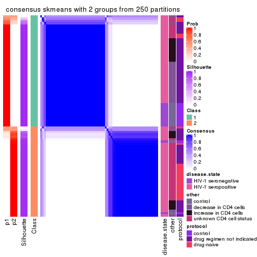</p>

</div>
<div id='tab-SD-skmeans-consensus-heatmap-2'>
<pre><code class="r">consensus_heatmap(res, k = 3)
</code></pre>

<p>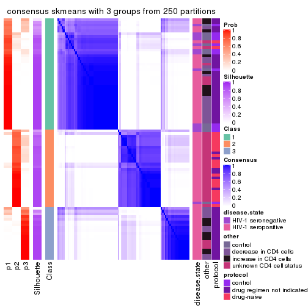</p>

</div>
<div id='tab-SD-skmeans-consensus-heatmap-3'>
<pre><code class="r">consensus_heatmap(res, k = 4)
</code></pre>

<p>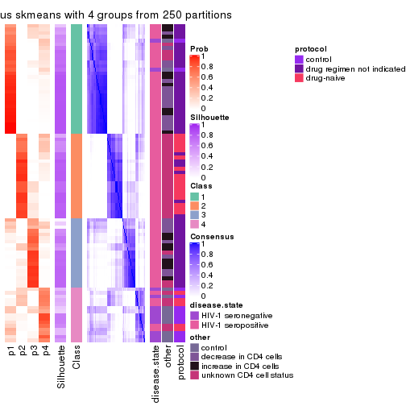</p>

</div>
<div id='tab-SD-skmeans-consensus-heatmap-4'>
<pre><code class="r">consensus_heatmap(res, k = 5)
</code></pre>

<p>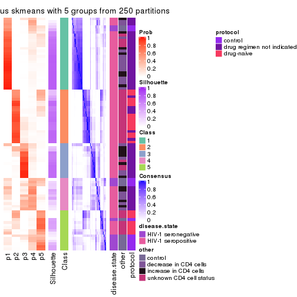</p>

</div>
<div id='tab-SD-skmeans-consensus-heatmap-5'>
<pre><code class="r">consensus_heatmap(res, k = 6)
</code></pre>

<p>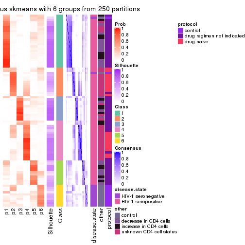</p>

</div>
</div>

Heatmaps for the membership of samples in all partitions to see how consistent they are:


<script>
$( function() {
	$( '#tabs-SD-skmeans-membership-heatmap' ).tabs();
} );
</script>
<div id='tabs-SD-skmeans-membership-heatmap'>
<ul>
<li><a href='#tab-SD-skmeans-membership-heatmap-1'>k = 2</a></li>
<li><a href='#tab-SD-skmeans-membership-heatmap-2'>k = 3</a></li>
<li><a href='#tab-SD-skmeans-membership-heatmap-3'>k = 4</a></li>
<li><a href='#tab-SD-skmeans-membership-heatmap-4'>k = 5</a></li>
<li><a href='#tab-SD-skmeans-membership-heatmap-5'>k = 6</a></li>
</ul>
<div id='tab-SD-skmeans-membership-heatmap-1'>
<pre><code class="r">membership_heatmap(res, k = 2)
</code></pre>

<p>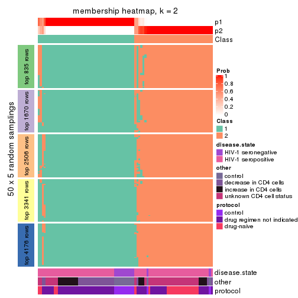</p>

</div>
<div id='tab-SD-skmeans-membership-heatmap-2'>
<pre><code class="r">membership_heatmap(res, k = 3)
</code></pre>

<p>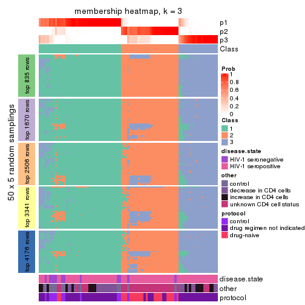</p>

</div>
<div id='tab-SD-skmeans-membership-heatmap-3'>
<pre><code class="r">membership_heatmap(res, k = 4)
</code></pre>

<p>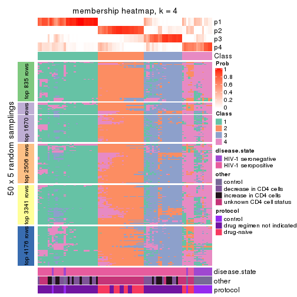</p>

</div>
<div id='tab-SD-skmeans-membership-heatmap-4'>
<pre><code class="r">membership_heatmap(res, k = 5)
</code></pre>

<p>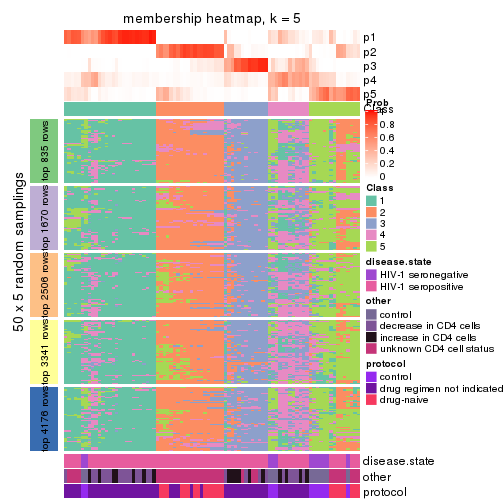</p>

</div>
<div id='tab-SD-skmeans-membership-heatmap-5'>
<pre><code class="r">membership_heatmap(res, k = 6)
</code></pre>

<p>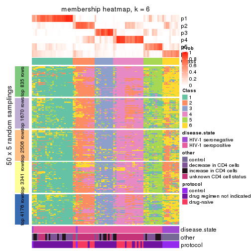</p>

</div>
</div>

As soon as we have had the classes for columns, we can look for signatures
which are significantly different between classes which can be candidate marks
for certain classes. Following are the heatmaps for signatures.


Signature heatmaps where rows are scaled:


<script>
$( function() {
	$( '#tabs-SD-skmeans-get-signatures' ).tabs();
} );
</script>
<div id='tabs-SD-skmeans-get-signatures'>
<ul>
<li><a href='#tab-SD-skmeans-get-signatures-1'>k = 2</a></li>
<li><a href='#tab-SD-skmeans-get-signatures-2'>k = 3</a></li>
<li><a href='#tab-SD-skmeans-get-signatures-3'>k = 4</a></li>
<li><a href='#tab-SD-skmeans-get-signatures-4'>k = 5</a></li>
<li><a href='#tab-SD-skmeans-get-signatures-5'>k = 6</a></li>
</ul>
<div id='tab-SD-skmeans-get-signatures-1'>
<pre><code class="r">get_signatures(res, k = 2)
</code></pre>

<p>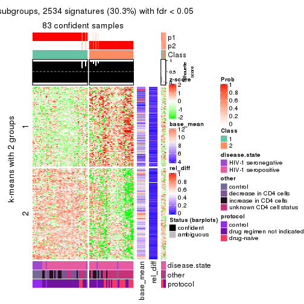</p>

</div>
<div id='tab-SD-skmeans-get-signatures-2'>
<pre><code class="r">get_signatures(res, k = 3)
</code></pre>

<p>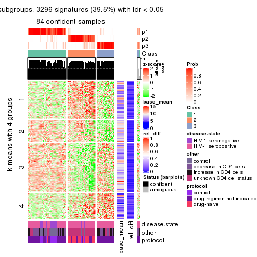</p>

</div>
<div id='tab-SD-skmeans-get-signatures-3'>
<pre><code class="r">get_signatures(res, k = 4)
</code></pre>

<p>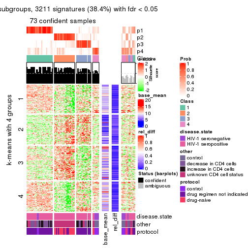</p>

</div>
<div id='tab-SD-skmeans-get-signatures-4'>
<pre><code class="r">get_signatures(res, k = 5)
</code></pre>

<p>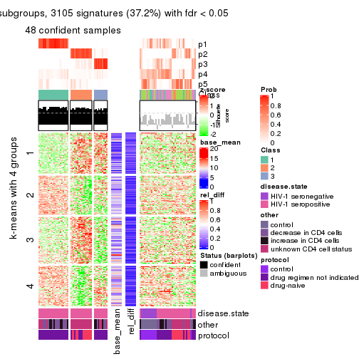</p>

</div>
<div id='tab-SD-skmeans-get-signatures-5'>
<pre><code class="r">get_signatures(res, k = 6)
</code></pre>

<p>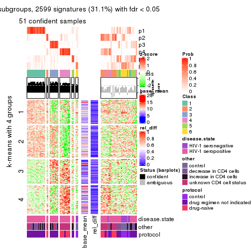</p>

</div>
</div>


Signature heatmaps where rows are not scaled:


<script>
$( function() {
	$( '#tabs-SD-skmeans-get-signatures-no-scale' ).tabs();
} );
</script>
<div id='tabs-SD-skmeans-get-signatures-no-scale'>
<ul>
<li><a href='#tab-SD-skmeans-get-signatures-no-scale-1'>k = 2</a></li>
<li><a href='#tab-SD-skmeans-get-signatures-no-scale-2'>k = 3</a></li>
<li><a href='#tab-SD-skmeans-get-signatures-no-scale-3'>k = 4</a></li>
<li><a href='#tab-SD-skmeans-get-signatures-no-scale-4'>k = 5</a></li>
<li><a href='#tab-SD-skmeans-get-signatures-no-scale-5'>k = 6</a></li>
</ul>
<div id='tab-SD-skmeans-get-signatures-no-scale-1'>
<pre><code class="r">get_signatures(res, k = 2, scale_rows = FALSE)
</code></pre>

<p>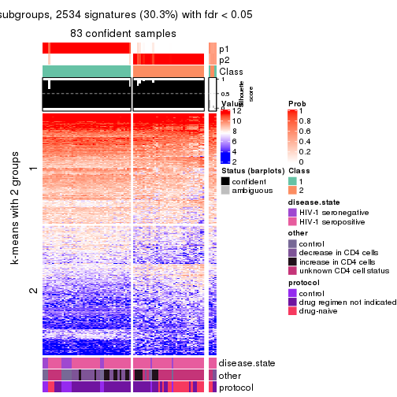</p>

</div>
<div id='tab-SD-skmeans-get-signatures-no-scale-2'>
<pre><code class="r">get_signatures(res, k = 3, scale_rows = FALSE)
</code></pre>

<p>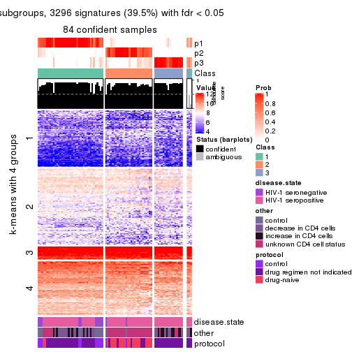</p>

</div>
<div id='tab-SD-skmeans-get-signatures-no-scale-3'>
<pre><code class="r">get_signatures(res, k = 4, scale_rows = FALSE)
</code></pre>

<p>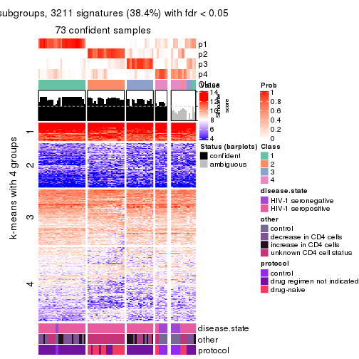</p>

</div>
<div id='tab-SD-skmeans-get-signatures-no-scale-4'>
<pre><code class="r">get_signatures(res, k = 5, scale_rows = FALSE)
</code></pre>

<p>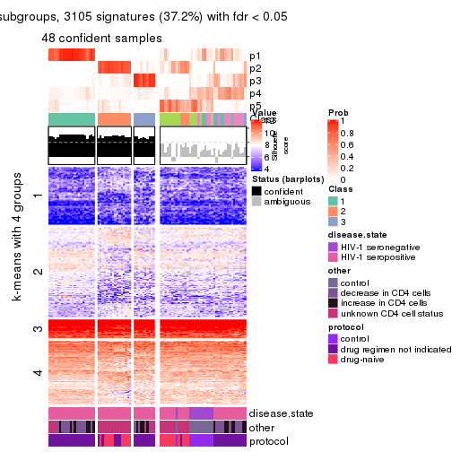</p>

</div>
<div id='tab-SD-skmeans-get-signatures-no-scale-5'>
<pre><code class="r">get_signatures(res, k = 6, scale_rows = FALSE)
</code></pre>

<p>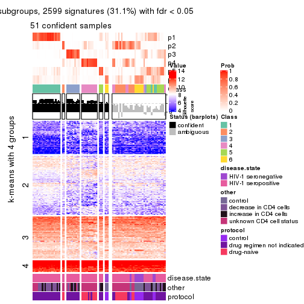</p>

</div>
</div>


Compare the overlap of signatures from different k:

```r
compare_signatures(res)
```

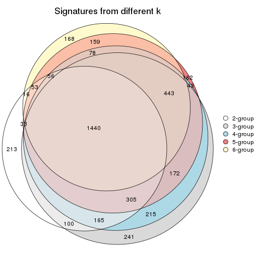

`get_signature()` returns a data frame invisibly. TO get the list of signatures, the function
call should be assigned to a variable explicitly. In following code, if `plot` argument is set
to `FALSE`, no heatmap is plotted while only the differential analysis is performed.

```r
# code only for demonstration
tb = get_signature(res, k = ..., plot = FALSE)
```

An example of the output of `tb` is:

```
#>   which_row         fdr    mean_1    mean_2 scaled_mean_1 scaled_mean_2 km
#> 1        38 0.042760348  8.373488  9.131774    -0.5533452     0.5164555  1
#> 2        40 0.018707592  7.106213  8.469186    -0.6173731     0.5762149  1
#> 3        55 0.019134737 10.221463 11.207825    -0.6159697     0.5749050  1
#> 4        59 0.006059896  5.921854  7.869574    -0.6899429     0.6439467  1
#> 5        60 0.018055526  8.928898 10.211722    -0.6204761     0.5791110  1
#> 6        98 0.009384629 15.714769 14.887706     0.6635654    -0.6193277  2
...
```

The columns in `tb` are:

1. `which_row`: row indices corresponding to the input matrix.
2. `fdr`: FDR for the differential test. 
3. `mean_x`: The mean value in group x.
4. `scaled_mean_x`: The mean value in group x after rows are scaled.
5. `km`: Row groups if k-means clustering is applied to rows.


UMAP plot which shows how samples are separated.


<script>
$( function() {
	$( '#tabs-SD-skmeans-dimension-reduction' ).tabs();
} );
</script>
<div id='tabs-SD-skmeans-dimension-reduction'>
<ul>
<li><a href='#tab-SD-skmeans-dimension-reduction-1'>k = 2</a></li>
<li><a href='#tab-SD-skmeans-dimension-reduction-2'>k = 3</a></li>
<li><a href='#tab-SD-skmeans-dimension-reduction-3'>k = 4</a></li>
<li><a href='#tab-SD-skmeans-dimension-reduction-4'>k = 5</a></li>
<li><a href='#tab-SD-skmeans-dimension-reduction-5'>k = 6</a></li>
</ul>
<div id='tab-SD-skmeans-dimension-reduction-1'>
<pre><code class="r">dimension_reduction(res, k = 2, method = &quot;UMAP&quot;)
</code></pre>

<p>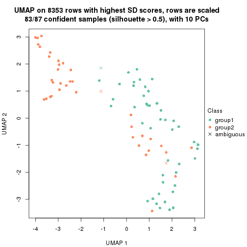</p>

</div>
<div id='tab-SD-skmeans-dimension-reduction-2'>
<pre><code class="r">dimension_reduction(res, k = 3, method = &quot;UMAP&quot;)
</code></pre>

<p>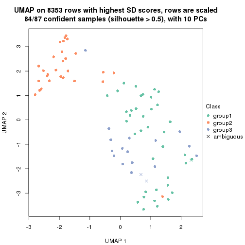</p>

</div>
<div id='tab-SD-skmeans-dimension-reduction-3'>
<pre><code class="r">dimension_reduction(res, k = 4, method = &quot;UMAP&quot;)
</code></pre>

<p>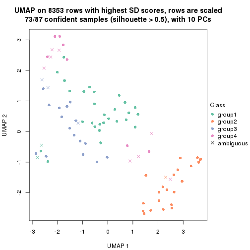</p>

</div>
<div id='tab-SD-skmeans-dimension-reduction-4'>
<pre><code class="r">dimension_reduction(res, k = 5, method = &quot;UMAP&quot;)
</code></pre>

<p>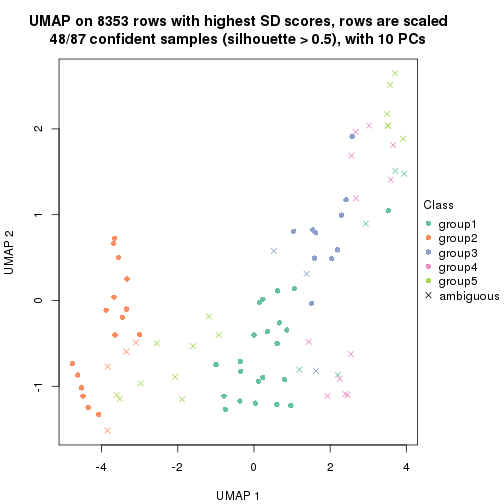</p>

</div>
<div id='tab-SD-skmeans-dimension-reduction-5'>
<pre><code class="r">dimension_reduction(res, k = 6, method = &quot;UMAP&quot;)
</code></pre>

<p>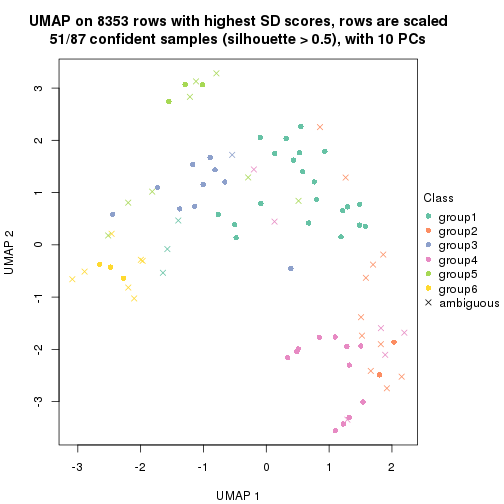</p>

</div>
</div>


Following heatmap shows how subgroups are split when increasing `k`:

```r
collect_classes(res)
```

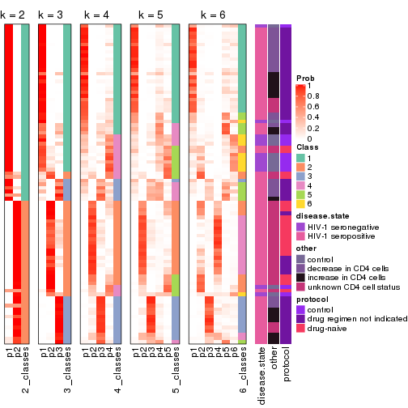


Test correlation between subgroups and known annotations. If the known
annotation is numeric, one-way ANOVA test is applied, and if the known
annotation is discrete, chi-squared contingency table test is applied.

```r
test_to_known_factors(res)
```

```
#>             n disease.state(p) other(p) protocol(p) k
#> SD:skmeans 83         7.36e-02 1.42e-06    8.31e-05 2
#> SD:skmeans 84         1.74e-02 2.53e-10    1.37e-10 3
#> SD:skmeans 73         1.16e-07 3.85e-14    6.37e-15 4
#> SD:skmeans 48               NA 1.16e-05    6.35e-07 5
#> SD:skmeans 51         8.65e-10 2.01e-11    1.67e-15 6
```


If matrix rows can be associated to genes, consider to use `GO_Enrichment(res,
...)` to perform function enrichment for the signature genes.


 

---------------------------------------------------


### SD:pam


The object with results only for a single top-value method and a single partition method 
can be extracted as:

```r
res = res_list["SD", "pam"]
# you can also extract it by
# res = res_list["SD:pam"]
```

A summary of `res` and all the functions that can be applied to it:

```r
res
```

```
#> A 'ConsensusPartition' object with k = 2, 3, 4, 5, 6.
#>   On a matrix with 8353 rows and 87 columns.
#>   Top rows (835, 1670, 2506, 3341, 4176) are extracted by 'SD' method.
#>   Subgroups are detected by 'pam' method.
#>   Performed in total 1250 partitions by row resampling.
#>   Best k for subgroups seems to be 3.
#> 
#> Following methods can be applied to this 'ConsensusPartition' object:
#>  [1] "cola_report"             "collect_classes"         "collect_plots"          
#>  [4] "collect_stats"           "colnames"                "compare_signatures"     
#>  [7] "consensus_heatmap"       "dimension_reduction"     "functional_enrichment"  
#> [10] "get_anno_col"            "get_anno"                "get_classes"            
#> [13] "get_consensus"           "get_matrix"              "get_membership"         
#> [16] "get_param"               "get_signatures"          "get_stats"              
#> [19] "is_best_k"               "is_stable_k"             "membership_heatmap"     
#> [22] "ncol"                    "nrow"                    "plot_ecdf"              
#> [25] "rownames"                "select_partition_number" "show"                   
#> [28] "suggest_best_k"          "test_to_known_factors"
```

`collect_plots()` function collects all the plots made from `res` for all `k` (number of partitions)
into one single page to provide an easy and fast comparison between different `k`.

```r
collect_plots(res)
```

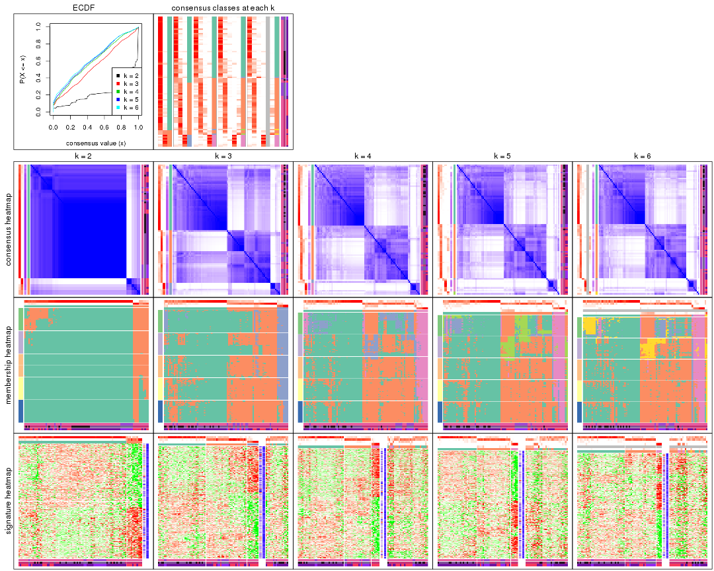

The plots are:

- The first row: a plot of the ECDF (Empirical cumulative distribution
  function) curves of the consensus matrix for each `k` and the heatmap of
  predicted classes for each `k`.
- The second row: heatmaps of the consensus matrix for each `k`.
- The third row: heatmaps of the membership matrix for each `k`.
- The fouth row: heatmaps of the signatures for each `k`.

All the plots in panels can be made by individual functions and they are
plotted later in this section.

`select_partition_number()` produces several plots showing different
statistics for choosing "optimized" `k`. There are following statistics:

- ECDF curves of the consensus matrix for each `k`;
- 1-PAC. [The PAC
  score](https://en.wikipedia.org/wiki/Consensus_clustering#Over-interpretation_potential_of_consensus_clustering)
  measures the proportion of the ambiguous subgrouping.
- Mean silhouette score.
- Concordance. The mean probability of fiting the consensus class ids in all
  partitions.
- Area increased. Denote $A_k$ as the area under the ECDF curve for current
  `k`, the area increased is defined as $A_k - A_{k-1}$.
- Rand index. The percent of pairs of samples that are both in a same cluster
  or both are not in a same cluster in the partition of k and k-1.
- Jaccard index. The ratio of pairs of samples are both in a same cluster in
  the partition of k and k-1 and the pairs of samples are both in a same
  cluster in the partition k or k-1.

The detailed explanations of these statistics can be found in [the cola
vignette](http://bioconductor.org/packages/devel/bioc/vignettes/cola/inst/doc/cola.html#toc_13).

Generally speaking, lower PAC score, higher mean silhouette score or higher
concordance corresponds to better partition. Rand index and Jaccard index
measure how similar the current partition is compared to partition with `k-1`.
If they are too similar, we won't accept `k` is better than `k-1`.

```r
select_partition_number(res)
```

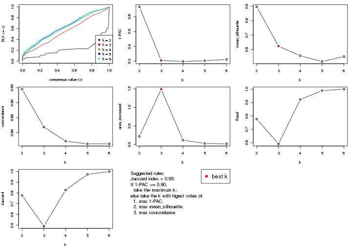

The numeric values for all these statistics can be obtained by `get_stats()`.

```r
get_stats(res)
```

```
#>   k 1-PAC mean_silhouette concordance area_increased  Rand Jaccard
#> 2 2 0.666           0.895       0.945         0.2189 0.777   0.777
#> 3 3 0.305           0.624       0.819         1.4903 0.592   0.491
#> 4 4 0.298           0.558       0.771         0.1170 0.923   0.827
#> 5 5 0.303           0.518       0.763         0.0286 0.989   0.973
#> 6 6 0.312           0.553       0.763         0.0182 1.000   1.000
```

`suggest_best_k()` suggests the best $k$ based on these statistics. The rules are as follows:

- All $k$ with Jaccard index larger than 0.95 are removed because the increase of
  the partition number does not provides enough extra information. If all $k$ are removed,
  the best $k$ is assigned by `NA`.
- For $k$ with 1-PAC larger than 0.9, the maximal $k$ is taken as the "best k". Other $k$ is called "optional k".
- If it does not fit the second rule. The $k$ with the highest vote of highest
  1-PAC, mean silhouette and concordance is taken as the "best k".

```r
suggest_best_k(res)
```

```
#> [1] 3
```


Following shows the table of the partitions (You need to click the **show/hide
code output** link to see it). The membership matrix (columns with name `p*`)
is inferred by
[`clue::cl_consensus()`](https://www.rdocumentation.org/link/cl_consensus?package=clue)
function with the `SE` method. Basically the value in the membership matrix
represents the probability to belong to a certain group. The finall class
label for an item is determined with the group with highest probability it
belongs to.

In `get_classes()` function, the entropy is calculated from the membership
matrix and the silhouette score is calculated from the consensus matrix.


<script>
$( function() {
	$( '#tabs-SD-pam-get-classes' ).tabs();
} );
</script>
<div id='tabs-SD-pam-get-classes'>
<ul>
<li><a href='#tab-SD-pam-get-classes-1'>k = 2</a></li>
<li><a href='#tab-SD-pam-get-classes-2'>k = 3</a></li>
<li><a href='#tab-SD-pam-get-classes-3'>k = 4</a></li>
<li><a href='#tab-SD-pam-get-classes-4'>k = 5</a></li>
<li><a href='#tab-SD-pam-get-classes-5'>k = 6</a></li>
</ul>

<div id='tab-SD-pam-get-classes-1'>
<p><a id='tab-SD-pam-get-classes-1-a' style='color:#0366d6' href='#'>show/hide code output</a></p>
<pre><code class="r">cbind(get_classes(res, k = 2), get_membership(res, k = 2))
</code></pre>

<pre><code>#&gt;          class entropy silhouette    p1    p2
#&gt; GSM39104     1  0.0000      0.956 1.000 0.000
#&gt; GSM39105     1  0.0000      0.956 1.000 0.000
#&gt; GSM39106     1  0.0000      0.956 1.000 0.000
#&gt; GSM39107     1  0.1414      0.943 0.980 0.020
#&gt; GSM39108     1  0.0000      0.956 1.000 0.000
#&gt; GSM39109     1  0.0376      0.954 0.996 0.004
#&gt; GSM39110     1  0.0000      0.956 1.000 0.000
#&gt; GSM39111     1  0.0000      0.956 1.000 0.000
#&gt; GSM39112     1  0.0000      0.956 1.000 0.000
#&gt; GSM39113     1  0.0000      0.956 1.000 0.000
#&gt; GSM39114     1  0.4690      0.870 0.900 0.100
#&gt; GSM39115     1  0.0000      0.956 1.000 0.000
#&gt; GSM39148     1  0.0000      0.956 1.000 0.000
#&gt; GSM39149     1  0.2043      0.933 0.968 0.032
#&gt; GSM39150     1  0.0000      0.956 1.000 0.000
#&gt; GSM39151     1  0.0938      0.949 0.988 0.012
#&gt; GSM39152     1  0.0000      0.956 1.000 0.000
#&gt; GSM39153     1  0.0000      0.956 1.000 0.000
#&gt; GSM39154     1  0.0000      0.956 1.000 0.000
#&gt; GSM39155     1  0.0000      0.956 1.000 0.000
#&gt; GSM39156     1  0.0000      0.956 1.000 0.000
#&gt; GSM39157     1  0.0000      0.956 1.000 0.000
#&gt; GSM39158     1  0.0000      0.956 1.000 0.000
#&gt; GSM39159     1  0.0000      0.956 1.000 0.000
#&gt; GSM39160     1  0.0000      0.956 1.000 0.000
#&gt; GSM39161     1  0.0000      0.956 1.000 0.000
#&gt; GSM39162     1  0.0000      0.956 1.000 0.000
#&gt; GSM39163     1  0.0000      0.956 1.000 0.000
#&gt; GSM39164     1  0.0000      0.956 1.000 0.000
#&gt; GSM39165     1  0.0000      0.956 1.000 0.000
#&gt; GSM39166     1  0.0000      0.956 1.000 0.000
#&gt; GSM39167     1  0.0000      0.956 1.000 0.000
#&gt; GSM39168     1  0.0000      0.956 1.000 0.000
#&gt; GSM39169     1  0.0000      0.956 1.000 0.000
#&gt; GSM39170     1  0.0000      0.956 1.000 0.000
#&gt; GSM39171     1  0.0000      0.956 1.000 0.000
#&gt; GSM39172     1  0.4562      0.866 0.904 0.096
#&gt; GSM39173     1  0.0376      0.954 0.996 0.004
#&gt; GSM39174     1  0.0000      0.956 1.000 0.000
#&gt; GSM39175     1  0.0000      0.956 1.000 0.000
#&gt; GSM39176     1  0.0000      0.956 1.000 0.000
#&gt; GSM39177     1  0.0000      0.956 1.000 0.000
#&gt; GSM39178     1  0.0000      0.956 1.000 0.000
#&gt; GSM39179     1  0.2236      0.931 0.964 0.036
#&gt; GSM39180     1  0.7745      0.668 0.772 0.228
#&gt; GSM39181     1  0.0000      0.956 1.000 0.000
#&gt; GSM39182     1  0.0000      0.956 1.000 0.000
#&gt; GSM39183     1  0.0000      0.956 1.000 0.000
#&gt; GSM39184     1  0.0000      0.956 1.000 0.000
#&gt; GSM39185     1  0.0000      0.956 1.000 0.000
#&gt; GSM39186     1  0.0000      0.956 1.000 0.000
#&gt; GSM39187     1  0.0000      0.956 1.000 0.000
#&gt; GSM39116     1  0.7950      0.653 0.760 0.240
#&gt; GSM39117     2  0.0000      0.757 0.000 1.000
#&gt; GSM39118     2  0.9815      0.532 0.420 0.580
#&gt; GSM39119     2  0.7219      0.786 0.200 0.800
#&gt; GSM39120     1  0.0000      0.956 1.000 0.000
#&gt; GSM39121     1  0.0000      0.956 1.000 0.000
#&gt; GSM39122     1  0.2236      0.931 0.964 0.036
#&gt; GSM39123     2  0.0000      0.757 0.000 1.000
#&gt; GSM39124     1  0.4431      0.879 0.908 0.092
#&gt; GSM39125     1  0.0000      0.956 1.000 0.000
#&gt; GSM39126     1  0.0672      0.951 0.992 0.008
#&gt; GSM39127     1  0.6531      0.785 0.832 0.168
#&gt; GSM39128     1  0.5178      0.854 0.884 0.116
#&gt; GSM39129     2  0.7299      0.785 0.204 0.796
#&gt; GSM39130     2  0.0000      0.757 0.000 1.000
#&gt; GSM39131     1  0.4690      0.870 0.900 0.100
#&gt; GSM39132     1  0.5737      0.830 0.864 0.136
#&gt; GSM39133     2  0.2043      0.767 0.032 0.968
#&gt; GSM39134     2  0.8443      0.754 0.272 0.728
#&gt; GSM39135     1  0.7299      0.725 0.796 0.204
#&gt; GSM39136     2  0.9686      0.589 0.396 0.604
#&gt; GSM39137     1  0.4562      0.875 0.904 0.096
#&gt; GSM39138     2  0.8443      0.754 0.272 0.728
#&gt; GSM39139     1  0.7219      0.733 0.800 0.200
#&gt; GSM39140     1  0.0000      0.956 1.000 0.000
#&gt; GSM39141     1  0.0000      0.956 1.000 0.000
#&gt; GSM39142     1  0.0000      0.956 1.000 0.000
#&gt; GSM39143     1  0.0000      0.956 1.000 0.000
#&gt; GSM39144     2  0.9710      0.582 0.400 0.600
#&gt; GSM39145     1  0.4815      0.867 0.896 0.104
#&gt; GSM39146     1  0.4939      0.863 0.892 0.108
#&gt; GSM39147     1  0.4690      0.870 0.900 0.100
#&gt; GSM39188     1  0.6623      0.752 0.828 0.172
#&gt; GSM39189     1  0.2043      0.933 0.968 0.032
#&gt; GSM39190     1  0.5842      0.820 0.860 0.140
</code></pre>

<script>
$('#tab-SD-pam-get-classes-1-a').parent().next().next().hide();
$('#tab-SD-pam-get-classes-1-a').click(function(){
  $('#tab-SD-pam-get-classes-1-a').parent().next().next().toggle();
  return(false);
});
</script>
</div>

<div id='tab-SD-pam-get-classes-2'>
<p><a id='tab-SD-pam-get-classes-2-a' style='color:#0366d6' href='#'>show/hide code output</a></p>
<pre><code class="r">cbind(get_classes(res, k = 3), get_membership(res, k = 3))
</code></pre>

<pre><code>#&gt;          class entropy silhouette    p1    p2    p3
#&gt; GSM39104     1  0.6280   -0.09826 0.540 0.460 0.000
#&gt; GSM39105     2  0.6026    0.56104 0.376 0.624 0.000
#&gt; GSM39106     1  0.3412    0.76422 0.876 0.124 0.000
#&gt; GSM39107     2  0.5178    0.68780 0.256 0.744 0.000
#&gt; GSM39108     2  0.5733    0.64917 0.324 0.676 0.000
#&gt; GSM39109     2  0.5363    0.68076 0.276 0.724 0.000
#&gt; GSM39110     1  0.4842    0.58499 0.776 0.224 0.000
#&gt; GSM39111     2  0.5926    0.59633 0.356 0.644 0.000
#&gt; GSM39112     2  0.5591    0.65905 0.304 0.696 0.000
#&gt; GSM39113     2  0.5810    0.61973 0.336 0.664 0.000
#&gt; GSM39114     2  0.0592    0.65363 0.012 0.988 0.000
#&gt; GSM39115     2  0.6309    0.23102 0.496 0.504 0.000
#&gt; GSM39148     1  0.0000    0.79329 1.000 0.000 0.000
#&gt; GSM39149     1  0.6159    0.66728 0.756 0.196 0.048
#&gt; GSM39150     1  0.1411    0.79406 0.964 0.036 0.000
#&gt; GSM39151     2  0.6924    0.47005 0.400 0.580 0.020
#&gt; GSM39152     1  0.0892    0.79661 0.980 0.020 0.000
#&gt; GSM39153     1  0.0000    0.79329 1.000 0.000 0.000
#&gt; GSM39154     1  0.0892    0.79491 0.980 0.020 0.000
#&gt; GSM39155     1  0.6079    0.14258 0.612 0.388 0.000
#&gt; GSM39156     1  0.1163    0.79711 0.972 0.028 0.000
#&gt; GSM39157     2  0.5785    0.64714 0.332 0.668 0.000
#&gt; GSM39158     1  0.1411    0.79465 0.964 0.036 0.000
#&gt; GSM39159     1  0.4750    0.66195 0.784 0.216 0.000
#&gt; GSM39160     1  0.1860    0.79297 0.948 0.052 0.000
#&gt; GSM39161     1  0.1289    0.79508 0.968 0.032 0.000
#&gt; GSM39162     1  0.0237    0.79416 0.996 0.004 0.000
#&gt; GSM39163     1  0.3482    0.74876 0.872 0.128 0.000
#&gt; GSM39164     1  0.0000    0.79329 1.000 0.000 0.000
#&gt; GSM39165     1  0.0592    0.79532 0.988 0.012 0.000
#&gt; GSM39166     1  0.3116    0.76711 0.892 0.108 0.000
#&gt; GSM39167     1  0.0000    0.79329 1.000 0.000 0.000
#&gt; GSM39168     1  0.0237    0.79416 0.996 0.004 0.000
#&gt; GSM39169     1  0.0000    0.79329 1.000 0.000 0.000
#&gt; GSM39170     1  0.0237    0.79461 0.996 0.004 0.000
#&gt; GSM39171     1  0.6267   -0.13069 0.548 0.452 0.000
#&gt; GSM39172     1  0.6892    0.61540 0.736 0.112 0.152
#&gt; GSM39173     1  0.0592    0.79146 0.988 0.012 0.000
#&gt; GSM39174     1  0.1289    0.79280 0.968 0.032 0.000
#&gt; GSM39175     1  0.0424    0.79543 0.992 0.008 0.000
#&gt; GSM39176     1  0.0000    0.79329 1.000 0.000 0.000
#&gt; GSM39177     1  0.5785    0.44120 0.668 0.332 0.000
#&gt; GSM39178     1  0.2878    0.77546 0.904 0.096 0.000
#&gt; GSM39179     1  0.6662    0.56184 0.704 0.252 0.044
#&gt; GSM39180     1  0.9730    0.08220 0.428 0.340 0.232
#&gt; GSM39181     1  0.4062    0.71143 0.836 0.164 0.000
#&gt; GSM39182     1  0.4452    0.69861 0.808 0.192 0.000
#&gt; GSM39183     1  0.3340    0.76403 0.880 0.120 0.000
#&gt; GSM39184     1  0.5810    0.41298 0.664 0.336 0.000
#&gt; GSM39185     1  0.5926    0.39085 0.644 0.356 0.000
#&gt; GSM39186     1  0.6244   -0.00249 0.560 0.440 0.000
#&gt; GSM39187     1  0.2261    0.78509 0.932 0.068 0.000
#&gt; GSM39116     2  0.0000    0.64101 0.000 1.000 0.000
#&gt; GSM39117     3  0.0000    0.84367 0.000 0.000 1.000
#&gt; GSM39118     2  0.4796    0.53103 0.000 0.780 0.220
#&gt; GSM39119     3  0.4842    0.74484 0.000 0.224 0.776
#&gt; GSM39120     2  0.6286    0.32288 0.464 0.536 0.000
#&gt; GSM39121     2  0.5650    0.66423 0.312 0.688 0.000
#&gt; GSM39122     2  0.5016    0.69961 0.240 0.760 0.000
#&gt; GSM39123     3  0.0000    0.84367 0.000 0.000 1.000
#&gt; GSM39124     2  0.3941    0.71379 0.156 0.844 0.000
#&gt; GSM39125     2  0.5905    0.59738 0.352 0.648 0.000
#&gt; GSM39126     1  0.6274   -0.06853 0.544 0.456 0.000
#&gt; GSM39127     2  0.0000    0.64101 0.000 1.000 0.000
#&gt; GSM39128     2  0.5810    0.26751 0.336 0.664 0.000
#&gt; GSM39129     3  0.5402    0.77686 0.028 0.180 0.792
#&gt; GSM39130     3  0.0000    0.84367 0.000 0.000 1.000
#&gt; GSM39131     2  0.0000    0.64101 0.000 1.000 0.000
#&gt; GSM39132     2  0.2959    0.61550 0.100 0.900 0.000
#&gt; GSM39133     3  0.1163    0.84496 0.000 0.028 0.972
#&gt; GSM39134     3  0.7101    0.72040 0.080 0.216 0.704
#&gt; GSM39135     2  0.1647    0.64041 0.036 0.960 0.004
#&gt; GSM39136     2  0.4887    0.32910 0.000 0.772 0.228
#&gt; GSM39137     2  0.2959    0.70479 0.100 0.900 0.000
#&gt; GSM39138     3  0.7605    0.68929 0.192 0.124 0.684
#&gt; GSM39139     2  0.0829    0.64592 0.012 0.984 0.004
#&gt; GSM39140     2  0.6140    0.51927 0.404 0.596 0.000
#&gt; GSM39141     2  0.5529    0.66760 0.296 0.704 0.000
#&gt; GSM39142     2  0.5591    0.65823 0.304 0.696 0.000
#&gt; GSM39143     2  0.5465    0.66829 0.288 0.712 0.000
#&gt; GSM39144     2  0.4887    0.36271 0.000 0.772 0.228
#&gt; GSM39145     2  0.1031    0.64999 0.024 0.976 0.000
#&gt; GSM39146     2  0.0000    0.64101 0.000 1.000 0.000
#&gt; GSM39147     2  0.1031    0.66031 0.024 0.976 0.000
#&gt; GSM39188     1  0.8109    0.44465 0.628 0.116 0.256
#&gt; GSM39189     1  0.3472    0.77621 0.904 0.056 0.040
#&gt; GSM39190     2  0.7245    0.67617 0.168 0.712 0.120
</code></pre>

<script>
$('#tab-SD-pam-get-classes-2-a').parent().next().next().hide();
$('#tab-SD-pam-get-classes-2-a').click(function(){
  $('#tab-SD-pam-get-classes-2-a').parent().next().next().toggle();
  return(false);
});
</script>
</div>

<div id='tab-SD-pam-get-classes-3'>
<p><a id='tab-SD-pam-get-classes-3-a' style='color:#0366d6' href='#'>show/hide code output</a></p>
<pre><code class="r">cbind(get_classes(res, k = 4), get_membership(res, k = 4))
</code></pre>

<pre><code>#&gt;          class entropy silhouette    p1    p2    p3    p4
#&gt; GSM39104     2  0.6090     0.2621 0.384 0.564 0.052 0.000
#&gt; GSM39105     2  0.3486     0.5923 0.188 0.812 0.000 0.000
#&gt; GSM39106     1  0.5463     0.6053 0.692 0.256 0.052 0.000
#&gt; GSM39107     2  0.2928     0.6006 0.052 0.896 0.052 0.000
#&gt; GSM39108     2  0.3569     0.6084 0.196 0.804 0.000 0.000
#&gt; GSM39109     2  0.3056     0.6086 0.072 0.888 0.040 0.000
#&gt; GSM39110     1  0.3907     0.5669 0.768 0.232 0.000 0.000
#&gt; GSM39111     2  0.3837     0.5631 0.224 0.776 0.000 0.000
#&gt; GSM39112     2  0.3453     0.6044 0.080 0.868 0.052 0.000
#&gt; GSM39113     2  0.3778     0.6060 0.100 0.848 0.052 0.000
#&gt; GSM39114     2  0.3306     0.5300 0.004 0.840 0.156 0.000
#&gt; GSM39115     2  0.4605     0.4136 0.336 0.664 0.000 0.000
#&gt; GSM39148     1  0.0000     0.7756 1.000 0.000 0.000 0.000
#&gt; GSM39149     1  0.4939     0.6423 0.740 0.220 0.000 0.040
#&gt; GSM39150     1  0.3278     0.7423 0.864 0.116 0.020 0.000
#&gt; GSM39151     2  0.5530     0.4042 0.360 0.616 0.004 0.020
#&gt; GSM39152     1  0.0707     0.7791 0.980 0.020 0.000 0.000
#&gt; GSM39153     1  0.0000     0.7756 1.000 0.000 0.000 0.000
#&gt; GSM39154     1  0.0707     0.7757 0.980 0.020 0.000 0.000
#&gt; GSM39155     1  0.4961     0.0202 0.552 0.448 0.000 0.000
#&gt; GSM39156     1  0.0921     0.7787 0.972 0.028 0.000 0.000
#&gt; GSM39157     2  0.3907     0.5997 0.232 0.768 0.000 0.000
#&gt; GSM39158     1  0.1398     0.7775 0.956 0.040 0.004 0.000
#&gt; GSM39159     1  0.5244     0.4818 0.600 0.388 0.012 0.000
#&gt; GSM39160     1  0.3597     0.7403 0.836 0.148 0.016 0.000
#&gt; GSM39161     1  0.2596     0.7648 0.908 0.068 0.024 0.000
#&gt; GSM39162     1  0.0000     0.7756 1.000 0.000 0.000 0.000
#&gt; GSM39163     1  0.2760     0.7316 0.872 0.128 0.000 0.000
#&gt; GSM39164     1  0.0000     0.7756 1.000 0.000 0.000 0.000
#&gt; GSM39165     1  0.2011     0.7553 0.920 0.080 0.000 0.000
#&gt; GSM39166     1  0.4225     0.7202 0.792 0.184 0.024 0.000
#&gt; GSM39167     1  0.0000     0.7756 1.000 0.000 0.000 0.000
#&gt; GSM39168     1  0.0000     0.7756 1.000 0.000 0.000 0.000
#&gt; GSM39169     1  0.0000     0.7756 1.000 0.000 0.000 0.000
#&gt; GSM39170     1  0.1902     0.7653 0.932 0.064 0.004 0.000
#&gt; GSM39171     2  0.4981     0.3070 0.464 0.536 0.000 0.000
#&gt; GSM39172     1  0.5416     0.6228 0.740 0.112 0.000 0.148
#&gt; GSM39173     1  0.0657     0.7755 0.984 0.004 0.012 0.000
#&gt; GSM39174     1  0.0921     0.7748 0.972 0.028 0.000 0.000
#&gt; GSM39175     1  0.0188     0.7767 0.996 0.004 0.000 0.000
#&gt; GSM39176     1  0.0336     0.7752 0.992 0.008 0.000 0.000
#&gt; GSM39177     1  0.4661     0.4561 0.652 0.348 0.000 0.000
#&gt; GSM39178     1  0.3946     0.7344 0.812 0.168 0.020 0.000
#&gt; GSM39179     1  0.5442     0.5397 0.672 0.288 0.000 0.040
#&gt; GSM39180     1  0.7843    -0.0393 0.420 0.356 0.004 0.220
#&gt; GSM39181     1  0.4898     0.6398 0.716 0.260 0.024 0.000
#&gt; GSM39182     1  0.3688     0.6858 0.792 0.208 0.000 0.000
#&gt; GSM39183     1  0.4464     0.7075 0.768 0.208 0.024 0.000
#&gt; GSM39184     1  0.4776     0.3545 0.624 0.376 0.000 0.000
#&gt; GSM39185     1  0.5716     0.3602 0.552 0.420 0.028 0.000
#&gt; GSM39186     1  0.4992    -0.0846 0.524 0.476 0.000 0.000
#&gt; GSM39187     1  0.1867     0.7653 0.928 0.072 0.000 0.000
#&gt; GSM39116     2  0.4730     0.3182 0.000 0.636 0.364 0.000
#&gt; GSM39117     4  0.0000     0.7790 0.000 0.000 0.000 1.000
#&gt; GSM39118     2  0.5109     0.4081 0.000 0.736 0.052 0.212
#&gt; GSM39119     4  0.4914     0.5443 0.000 0.208 0.044 0.748
#&gt; GSM39120     2  0.5636     0.4291 0.308 0.648 0.044 0.000
#&gt; GSM39121     2  0.3649     0.6109 0.204 0.796 0.000 0.000
#&gt; GSM39122     2  0.3172     0.6229 0.160 0.840 0.000 0.000
#&gt; GSM39123     4  0.0000     0.7790 0.000 0.000 0.000 1.000
#&gt; GSM39124     2  0.4236     0.6051 0.088 0.824 0.088 0.000
#&gt; GSM39125     2  0.5624     0.5322 0.280 0.668 0.052 0.000
#&gt; GSM39126     2  0.5372     0.2558 0.444 0.544 0.012 0.000
#&gt; GSM39127     2  0.4730     0.3182 0.000 0.636 0.364 0.000
#&gt; GSM39128     3  0.7912     0.1672 0.328 0.312 0.360 0.000
#&gt; GSM39129     4  0.5078     0.7303 0.008 0.072 0.144 0.776
#&gt; GSM39130     4  0.0000     0.7790 0.000 0.000 0.000 1.000
#&gt; GSM39131     2  0.4643     0.3447 0.000 0.656 0.344 0.000
#&gt; GSM39132     2  0.6665     0.1128 0.096 0.544 0.360 0.000
#&gt; GSM39133     4  0.0921     0.7788 0.000 0.028 0.000 0.972
#&gt; GSM39134     4  0.6608     0.4970 0.080 0.192 0.044 0.684
#&gt; GSM39135     2  0.5389     0.3247 0.032 0.660 0.308 0.000
#&gt; GSM39136     2  0.6773     0.0715 0.000 0.532 0.364 0.104
#&gt; GSM39137     2  0.3991     0.5867 0.048 0.832 0.120 0.000
#&gt; GSM39138     4  0.6772     0.4657 0.192 0.076 0.056 0.676
#&gt; GSM39139     2  0.4673     0.3838 0.008 0.700 0.292 0.000
#&gt; GSM39140     2  0.4585     0.4865 0.332 0.668 0.000 0.000
#&gt; GSM39141     2  0.3444     0.6213 0.184 0.816 0.000 0.000
#&gt; GSM39142     2  0.3528     0.6232 0.192 0.808 0.000 0.000
#&gt; GSM39143     2  0.3311     0.6235 0.172 0.828 0.000 0.000
#&gt; GSM39144     3  0.6377     0.1461 0.000 0.256 0.632 0.112
#&gt; GSM39145     2  0.4546     0.4313 0.012 0.732 0.256 0.000
#&gt; GSM39146     2  0.3873     0.4610 0.000 0.772 0.228 0.000
#&gt; GSM39147     2  0.2859     0.5549 0.008 0.880 0.112 0.000
#&gt; GSM39188     1  0.8499     0.2635 0.528 0.096 0.140 0.236
#&gt; GSM39189     1  0.3940     0.7333 0.824 0.152 0.020 0.004
#&gt; GSM39190     2  0.5755     0.5557 0.136 0.752 0.032 0.080
</code></pre>

<script>
$('#tab-SD-pam-get-classes-3-a').parent().next().next().hide();
$('#tab-SD-pam-get-classes-3-a').click(function(){
  $('#tab-SD-pam-get-classes-3-a').parent().next().next().toggle();
  return(false);
});
</script>
</div>

<div id='tab-SD-pam-get-classes-4'>
<p><a id='tab-SD-pam-get-classes-4-a' style='color:#0366d6' href='#'>show/hide code output</a></p>
<pre><code class="r">cbind(get_classes(res, k = 5), get_membership(res, k = 5))
</code></pre>

<pre><code>#&gt;          class entropy silhouette    p1    p2    p3    p4    p5
#&gt; GSM39104     2  0.5880     0.3570 0.360 0.560 0.028 0.000 0.052
#&gt; GSM39105     2  0.2997     0.6262 0.148 0.840 0.012 0.000 0.000
#&gt; GSM39106     1  0.5567     0.3625 0.640 0.280 0.028 0.000 0.052
#&gt; GSM39107     2  0.2745     0.6257 0.024 0.896 0.028 0.000 0.052
#&gt; GSM39108     2  0.3430     0.6470 0.220 0.776 0.004 0.000 0.000
#&gt; GSM39109     2  0.2698     0.6324 0.036 0.900 0.028 0.000 0.036
#&gt; GSM39110     1  0.3366     0.4949 0.768 0.232 0.000 0.000 0.000
#&gt; GSM39111     2  0.3010     0.6417 0.172 0.824 0.004 0.000 0.000
#&gt; GSM39112     2  0.3152     0.6262 0.044 0.876 0.028 0.000 0.052
#&gt; GSM39113     2  0.3432     0.6251 0.060 0.860 0.028 0.000 0.052
#&gt; GSM39114     2  0.2848     0.6007 0.000 0.868 0.028 0.000 0.104
#&gt; GSM39115     2  0.3949     0.4677 0.332 0.668 0.000 0.000 0.000
#&gt; GSM39148     1  0.0000     0.7008 1.000 0.000 0.000 0.000 0.000
#&gt; GSM39149     1  0.4629     0.5361 0.724 0.224 0.008 0.044 0.000
#&gt; GSM39150     1  0.3471     0.6288 0.836 0.072 0.092 0.000 0.000
#&gt; GSM39151     2  0.5371     0.4955 0.312 0.624 0.052 0.012 0.000
#&gt; GSM39152     1  0.1836     0.6954 0.932 0.036 0.032 0.000 0.000
#&gt; GSM39153     1  0.0000     0.7008 1.000 0.000 0.000 0.000 0.000
#&gt; GSM39154     1  0.0963     0.6933 0.964 0.036 0.000 0.000 0.000
#&gt; GSM39155     1  0.4235     0.0240 0.576 0.424 0.000 0.000 0.000
#&gt; GSM39156     1  0.0794     0.7039 0.972 0.028 0.000 0.000 0.000
#&gt; GSM39157     2  0.3561     0.6221 0.260 0.740 0.000 0.000 0.000
#&gt; GSM39158     1  0.1469     0.7037 0.948 0.036 0.016 0.000 0.000
#&gt; GSM39159     1  0.5246     0.3544 0.596 0.344 0.060 0.000 0.000
#&gt; GSM39160     1  0.3906     0.6271 0.804 0.112 0.084 0.000 0.000
#&gt; GSM39161     1  0.3647     0.6035 0.816 0.052 0.132 0.000 0.000
#&gt; GSM39162     1  0.0000     0.7008 1.000 0.000 0.000 0.000 0.000
#&gt; GSM39163     1  0.2471     0.6467 0.864 0.136 0.000 0.000 0.000
#&gt; GSM39164     1  0.0000     0.7008 1.000 0.000 0.000 0.000 0.000
#&gt; GSM39165     1  0.0955     0.6998 0.968 0.028 0.004 0.000 0.000
#&gt; GSM39166     1  0.4926     0.5587 0.716 0.152 0.132 0.000 0.000
#&gt; GSM39167     1  0.0000     0.7008 1.000 0.000 0.000 0.000 0.000
#&gt; GSM39168     1  0.0000     0.7008 1.000 0.000 0.000 0.000 0.000
#&gt; GSM39169     1  0.0000     0.7008 1.000 0.000 0.000 0.000 0.000
#&gt; GSM39170     1  0.1915     0.6851 0.928 0.040 0.032 0.000 0.000
#&gt; GSM39171     2  0.4449     0.2600 0.484 0.512 0.004 0.000 0.000
#&gt; GSM39172     1  0.5199     0.4443 0.720 0.124 0.016 0.140 0.000
#&gt; GSM39173     1  0.0912     0.6977 0.972 0.000 0.016 0.000 0.012
#&gt; GSM39174     1  0.0794     0.6996 0.972 0.028 0.000 0.000 0.000
#&gt; GSM39175     1  0.0162     0.7023 0.996 0.004 0.000 0.000 0.000
#&gt; GSM39176     1  0.0162     0.7005 0.996 0.000 0.004 0.000 0.000
#&gt; GSM39177     1  0.4511     0.3530 0.628 0.356 0.016 0.000 0.000
#&gt; GSM39178     1  0.4766     0.5723 0.732 0.136 0.132 0.000 0.000
#&gt; GSM39179     1  0.4815     0.4081 0.660 0.304 0.008 0.028 0.000
#&gt; GSM39180     1  0.6751    -0.1870 0.424 0.352 0.004 0.220 0.000
#&gt; GSM39181     1  0.5365     0.4953 0.664 0.204 0.132 0.000 0.000
#&gt; GSM39182     1  0.3366     0.5899 0.784 0.212 0.004 0.000 0.000
#&gt; GSM39183     1  0.5109     0.5436 0.696 0.172 0.132 0.000 0.000
#&gt; GSM39184     1  0.4114     0.3288 0.624 0.376 0.000 0.000 0.000
#&gt; GSM39185     1  0.6339     0.1947 0.484 0.368 0.144 0.000 0.004
#&gt; GSM39186     1  0.4443    -0.0935 0.524 0.472 0.004 0.000 0.000
#&gt; GSM39187     1  0.1671     0.6873 0.924 0.076 0.000 0.000 0.000
#&gt; GSM39116     2  0.4299     0.4566 0.000 0.608 0.004 0.000 0.388
#&gt; GSM39117     4  0.0000     0.7111 0.000 0.000 0.000 1.000 0.000
#&gt; GSM39118     2  0.4400     0.5231 0.000 0.736 0.000 0.212 0.052
#&gt; GSM39119     4  0.4270     0.4997 0.000 0.204 0.000 0.748 0.048
#&gt; GSM39120     2  0.5340     0.4691 0.336 0.608 0.012 0.000 0.044
#&gt; GSM39121     2  0.3366     0.6359 0.232 0.768 0.000 0.000 0.000
#&gt; GSM39122     2  0.2890     0.6600 0.160 0.836 0.000 0.000 0.004
#&gt; GSM39123     4  0.0000     0.7111 0.000 0.000 0.000 1.000 0.000
#&gt; GSM39124     2  0.4166     0.6567 0.088 0.792 0.004 0.000 0.116
#&gt; GSM39125     2  0.5218     0.5956 0.280 0.656 0.012 0.000 0.052
#&gt; GSM39126     2  0.5094     0.2270 0.468 0.504 0.016 0.000 0.012
#&gt; GSM39127     2  0.4161     0.4540 0.000 0.608 0.000 0.000 0.392
#&gt; GSM39128     5  0.6775    -0.1799 0.328 0.284 0.000 0.000 0.388
#&gt; GSM39129     4  0.4536     0.5493 0.000 0.008 0.344 0.640 0.008
#&gt; GSM39130     4  0.0000     0.7111 0.000 0.000 0.000 1.000 0.000
#&gt; GSM39131     2  0.4101     0.4748 0.000 0.628 0.000 0.000 0.372
#&gt; GSM39132     2  0.5843     0.3059 0.100 0.512 0.000 0.000 0.388
#&gt; GSM39133     4  0.0794     0.7086 0.000 0.028 0.000 0.972 0.000
#&gt; GSM39134     4  0.5739     0.3905 0.076 0.188 0.000 0.684 0.052
#&gt; GSM39135     2  0.4763     0.4638 0.032 0.632 0.000 0.000 0.336
#&gt; GSM39136     2  0.5889     0.2835 0.000 0.504 0.000 0.104 0.392
#&gt; GSM39137     2  0.3639     0.6435 0.044 0.812 0.000 0.000 0.144
#&gt; GSM39138     4  0.5916     0.1253 0.188 0.080 0.000 0.672 0.060
#&gt; GSM39139     2  0.4165     0.5039 0.008 0.672 0.000 0.000 0.320
#&gt; GSM39140     2  0.4015     0.5193 0.348 0.652 0.000 0.000 0.000
#&gt; GSM39141     2  0.3003     0.6541 0.188 0.812 0.000 0.000 0.000
#&gt; GSM39142     2  0.3109     0.6549 0.200 0.800 0.000 0.000 0.000
#&gt; GSM39143     2  0.2929     0.6560 0.180 0.820 0.000 0.000 0.000
#&gt; GSM39144     5  0.2663    -0.1104 0.000 0.048 0.008 0.048 0.896
#&gt; GSM39145     2  0.4086     0.5393 0.012 0.704 0.000 0.000 0.284
#&gt; GSM39146     2  0.3534     0.5595 0.000 0.744 0.000 0.000 0.256
#&gt; GSM39147     2  0.2997     0.6218 0.012 0.840 0.000 0.000 0.148
#&gt; GSM39188     3  0.7518     0.0000 0.288 0.072 0.464 0.176 0.000
#&gt; GSM39189     1  0.4487     0.5722 0.756 0.104 0.140 0.000 0.000
#&gt; GSM39190     2  0.5779     0.5733 0.072 0.708 0.164 0.024 0.032
</code></pre>

<script>
$('#tab-SD-pam-get-classes-4-a').parent().next().next().hide();
$('#tab-SD-pam-get-classes-4-a').click(function(){
  $('#tab-SD-pam-get-classes-4-a').parent().next().next().toggle();
  return(false);
});
</script>
</div>

<div id='tab-SD-pam-get-classes-5'>
<p><a id='tab-SD-pam-get-classes-5-a' style='color:#0366d6' href='#'>show/hide code output</a></p>
<pre><code class="r">cbind(get_classes(res, k = 6), get_membership(res, k = 6))
</code></pre>

<pre><code>#&gt;          class entropy silhouette    p1    p2    p3    p4 p5    p6
#&gt; GSM39104     2  0.5540     0.3663 0.356 0.552 0.024 0.000 NA 0.060
#&gt; GSM39105     2  0.2695     0.6301 0.144 0.844 0.008 0.000 NA 0.000
#&gt; GSM39106     1  0.5146     0.5289 0.644 0.268 0.020 0.000 NA 0.060
#&gt; GSM39107     2  0.2683     0.6220 0.020 0.888 0.024 0.000 NA 0.060
#&gt; GSM39108     2  0.3081     0.6424 0.220 0.776 0.000 0.000 NA 0.000
#&gt; GSM39109     2  0.2666     0.6288 0.032 0.892 0.024 0.000 NA 0.044
#&gt; GSM39110     1  0.3050     0.5669 0.764 0.236 0.000 0.000 NA 0.000
#&gt; GSM39111     2  0.2703     0.6416 0.172 0.824 0.004 0.000 NA 0.000
#&gt; GSM39112     2  0.2992     0.6224 0.036 0.872 0.024 0.000 NA 0.060
#&gt; GSM39113     2  0.3320     0.6214 0.056 0.852 0.024 0.000 NA 0.060
#&gt; GSM39114     2  0.2781     0.6021 0.000 0.860 0.024 0.000 NA 0.108
#&gt; GSM39115     2  0.3499     0.4919 0.320 0.680 0.000 0.000 NA 0.000
#&gt; GSM39148     1  0.0000     0.7696 1.000 0.000 0.000 0.000 NA 0.000
#&gt; GSM39149     1  0.4356     0.6426 0.728 0.212 0.008 0.040 NA 0.000
#&gt; GSM39150     1  0.3324     0.7245 0.840 0.060 0.080 0.000 NA 0.000
#&gt; GSM39151     2  0.6390     0.3831 0.284 0.544 0.032 0.012 NA 0.008
#&gt; GSM39152     1  0.1829     0.7674 0.928 0.036 0.028 0.000 NA 0.000
#&gt; GSM39153     1  0.0000     0.7696 1.000 0.000 0.000 0.000 NA 0.000
#&gt; GSM39154     1  0.0865     0.7661 0.964 0.036 0.000 0.000 NA 0.000
#&gt; GSM39155     1  0.3804     0.0281 0.576 0.424 0.000 0.000 NA 0.000
#&gt; GSM39156     1  0.0632     0.7719 0.976 0.024 0.000 0.000 NA 0.000
#&gt; GSM39157     2  0.3151     0.6233 0.252 0.748 0.000 0.000 NA 0.000
#&gt; GSM39158     1  0.1245     0.7724 0.952 0.032 0.016 0.000 NA 0.000
#&gt; GSM39159     1  0.4805     0.5236 0.608 0.332 0.052 0.000 NA 0.000
#&gt; GSM39160     1  0.3817     0.7182 0.796 0.104 0.088 0.000 NA 0.000
#&gt; GSM39161     1  0.3720     0.7039 0.812 0.044 0.108 0.000 NA 0.000
#&gt; GSM39162     1  0.0000     0.7696 1.000 0.000 0.000 0.000 NA 0.000
#&gt; GSM39163     1  0.2260     0.7155 0.860 0.140 0.000 0.000 NA 0.000
#&gt; GSM39164     1  0.0000     0.7696 1.000 0.000 0.000 0.000 NA 0.000
#&gt; GSM39165     1  0.0858     0.7700 0.968 0.028 0.004 0.000 NA 0.000
#&gt; GSM39166     1  0.4881     0.6711 0.716 0.140 0.108 0.000 NA 0.000
#&gt; GSM39167     1  0.0000     0.7696 1.000 0.000 0.000 0.000 NA 0.000
#&gt; GSM39168     1  0.0000     0.7696 1.000 0.000 0.000 0.000 NA 0.000
#&gt; GSM39169     1  0.0000     0.7696 1.000 0.000 0.000 0.000 NA 0.000
#&gt; GSM39170     1  0.1636     0.7655 0.936 0.036 0.024 0.000 NA 0.000
#&gt; GSM39171     2  0.3986     0.3104 0.464 0.532 0.004 0.000 NA 0.000
#&gt; GSM39172     1  0.4640     0.6341 0.728 0.116 0.012 0.140 NA 0.000
#&gt; GSM39173     1  0.0881     0.7690 0.972 0.000 0.008 0.000 NA 0.012
#&gt; GSM39174     1  0.0713     0.7676 0.972 0.028 0.000 0.000 NA 0.000
#&gt; GSM39175     1  0.0146     0.7707 0.996 0.004 0.000 0.000 NA 0.000
#&gt; GSM39176     1  0.0146     0.7696 0.996 0.000 0.004 0.000 NA 0.000
#&gt; GSM39177     1  0.4266     0.4554 0.628 0.348 0.016 0.000 NA 0.000
#&gt; GSM39178     1  0.4729     0.6830 0.732 0.124 0.108 0.000 NA 0.000
#&gt; GSM39179     1  0.5342     0.5103 0.628 0.288 0.016 0.024 NA 0.004
#&gt; GSM39180     1  0.6182     0.0944 0.428 0.344 0.004 0.220 NA 0.000
#&gt; GSM39181     1  0.5349     0.6100 0.656 0.200 0.108 0.000 NA 0.000
#&gt; GSM39182     1  0.2871     0.6934 0.804 0.192 0.004 0.000 NA 0.000
#&gt; GSM39183     1  0.5054     0.6610 0.696 0.160 0.108 0.000 NA 0.000
#&gt; GSM39184     1  0.3647     0.3778 0.640 0.360 0.000 0.000 NA 0.000
#&gt; GSM39185     1  0.6255     0.3267 0.480 0.360 0.116 0.000 NA 0.004
#&gt; GSM39186     1  0.3993    -0.1158 0.520 0.476 0.004 0.000 NA 0.000
#&gt; GSM39187     1  0.1501     0.7557 0.924 0.076 0.000 0.000 NA 0.000
#&gt; GSM39116     2  0.3915     0.4510 0.000 0.584 0.004 0.000 NA 0.412
#&gt; GSM39117     4  0.0000     0.6330 0.000 0.000 0.000 1.000 NA 0.000
#&gt; GSM39118     2  0.4176     0.5222 0.000 0.720 0.000 0.212 NA 0.068
#&gt; GSM39119     4  0.3896     0.4584 0.000 0.204 0.000 0.744 NA 0.052
#&gt; GSM39120     2  0.4855     0.4799 0.320 0.616 0.012 0.000 NA 0.052
#&gt; GSM39121     2  0.2996     0.6353 0.228 0.772 0.000 0.000 NA 0.000
#&gt; GSM39122     2  0.2520     0.6583 0.152 0.844 0.000 0.000 NA 0.004
#&gt; GSM39123     4  0.0000     0.6330 0.000 0.000 0.000 1.000 NA 0.000
#&gt; GSM39124     2  0.3598     0.6558 0.080 0.804 0.004 0.000 NA 0.112
#&gt; GSM39125     2  0.4744     0.6011 0.264 0.668 0.012 0.000 NA 0.052
#&gt; GSM39126     2  0.4713     0.2737 0.448 0.520 0.012 0.000 NA 0.012
#&gt; GSM39127     2  0.3789     0.4484 0.000 0.584 0.000 0.000 NA 0.416
#&gt; GSM39128     6  0.6047    -0.0881 0.316 0.272 0.000 0.000 NA 0.412
#&gt; GSM39129     4  0.3765     0.2927 0.000 0.000 0.000 0.596 NA 0.000
#&gt; GSM39130     4  0.0000     0.6330 0.000 0.000 0.000 1.000 NA 0.000
#&gt; GSM39131     2  0.3747     0.4685 0.000 0.604 0.000 0.000 NA 0.396
#&gt; GSM39132     2  0.5278     0.2960 0.100 0.488 0.000 0.000 NA 0.412
#&gt; GSM39133     4  0.0713     0.6348 0.000 0.028 0.000 0.972 NA 0.000
#&gt; GSM39134     4  0.5155     0.4462 0.076 0.188 0.000 0.684 NA 0.052
#&gt; GSM39135     2  0.4332     0.4628 0.032 0.616 0.000 0.000 NA 0.352
#&gt; GSM39136     2  0.5171     0.3190 0.000 0.496 0.000 0.088 NA 0.416
#&gt; GSM39137     2  0.3163     0.6428 0.040 0.820 0.000 0.000 NA 0.140
#&gt; GSM39138     4  0.5562     0.3721 0.188 0.076 0.008 0.664 NA 0.064
#&gt; GSM39139     2  0.3819     0.4982 0.008 0.652 0.000 0.000 NA 0.340
#&gt; GSM39140     2  0.3607     0.5131 0.348 0.652 0.000 0.000 NA 0.000
#&gt; GSM39141     2  0.2631     0.6527 0.180 0.820 0.000 0.000 NA 0.000
#&gt; GSM39142     2  0.2697     0.6541 0.188 0.812 0.000 0.000 NA 0.000
#&gt; GSM39143     2  0.2562     0.6544 0.172 0.828 0.000 0.000 NA 0.000
#&gt; GSM39144     6  0.2728    -0.3997 0.000 0.012 0.004 0.024 NA 0.876
#&gt; GSM39145     2  0.3729     0.5409 0.012 0.692 0.000 0.000 NA 0.296
#&gt; GSM39146     2  0.3244     0.5605 0.000 0.732 0.000 0.000 NA 0.268
#&gt; GSM39147     2  0.2593     0.6231 0.008 0.844 0.000 0.000 NA 0.148
#&gt; GSM39188     3  0.2664     0.0000 0.016 0.000 0.848 0.136 NA 0.000
#&gt; GSM39189     1  0.4439     0.6873 0.760 0.084 0.116 0.000 NA 0.000
#&gt; GSM39190     2  0.5437     0.3842 0.036 0.564 0.036 0.004 NA 0.004
</code></pre>

<script>
$('#tab-SD-pam-get-classes-5-a').parent().next().next().hide();
$('#tab-SD-pam-get-classes-5-a').click(function(){
  $('#tab-SD-pam-get-classes-5-a').parent().next().next().toggle();
  return(false);
});
</script>
</div>
</div>

Heatmaps for the consensus matrix. It visualizes the probability of two
samples to be in a same group.


<script>
$( function() {
	$( '#tabs-SD-pam-consensus-heatmap' ).tabs();
} );
</script>
<div id='tabs-SD-pam-consensus-heatmap'>
<ul>
<li><a href='#tab-SD-pam-consensus-heatmap-1'>k = 2</a></li>
<li><a href='#tab-SD-pam-consensus-heatmap-2'>k = 3</a></li>
<li><a href='#tab-SD-pam-consensus-heatmap-3'>k = 4</a></li>
<li><a href='#tab-SD-pam-consensus-heatmap-4'>k = 5</a></li>
<li><a href='#tab-SD-pam-consensus-heatmap-5'>k = 6</a></li>
</ul>
<div id='tab-SD-pam-consensus-heatmap-1'>
<pre><code class="r">consensus_heatmap(res, k = 2)
</code></pre>

<p>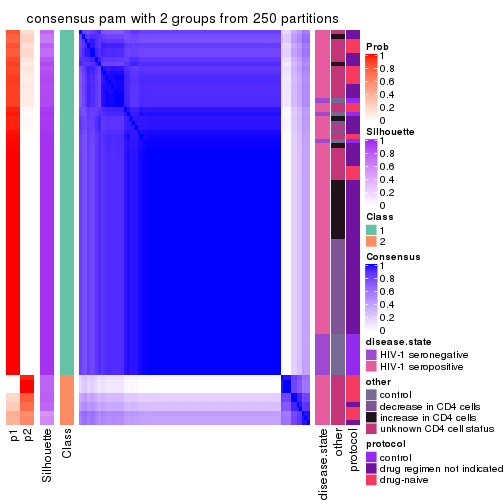</p>

</div>
<div id='tab-SD-pam-consensus-heatmap-2'>
<pre><code class="r">consensus_heatmap(res, k = 3)
</code></pre>

<p>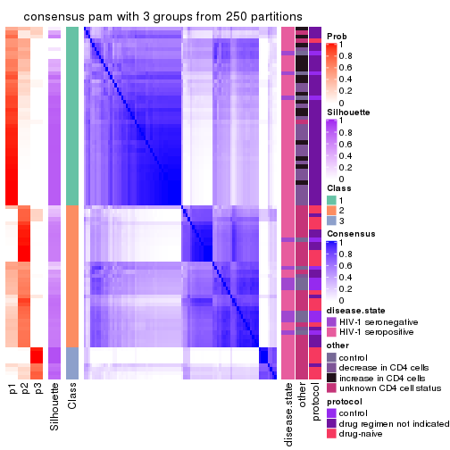</p>

</div>
<div id='tab-SD-pam-consensus-heatmap-3'>
<pre><code class="r">consensus_heatmap(res, k = 4)
</code></pre>

<p>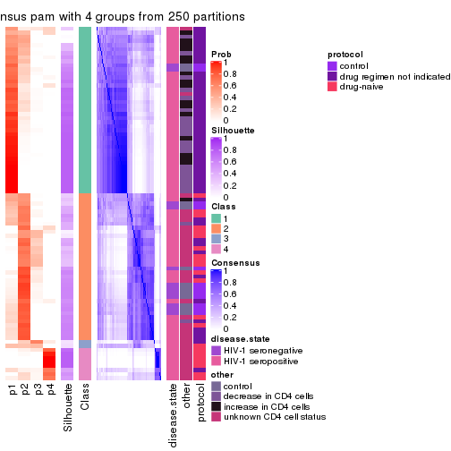</p>

</div>
<div id='tab-SD-pam-consensus-heatmap-4'>
<pre><code class="r">consensus_heatmap(res, k = 5)
</code></pre>

<p>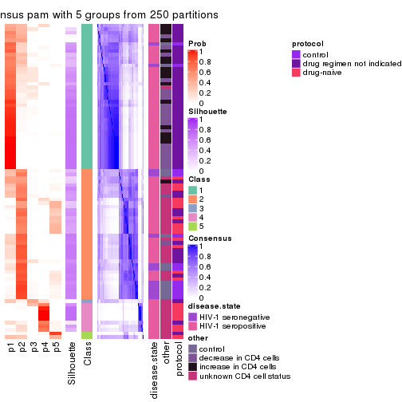</p>

</div>
<div id='tab-SD-pam-consensus-heatmap-5'>
<pre><code class="r">consensus_heatmap(res, k = 6)
</code></pre>

<p>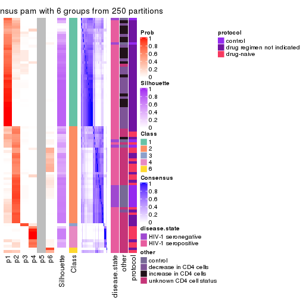</p>

</div>
</div>

Heatmaps for the membership of samples in all partitions to see how consistent they are:


<script>
$( function() {
	$( '#tabs-SD-pam-membership-heatmap' ).tabs();
} );
</script>
<div id='tabs-SD-pam-membership-heatmap'>
<ul>
<li><a href='#tab-SD-pam-membership-heatmap-1'>k = 2</a></li>
<li><a href='#tab-SD-pam-membership-heatmap-2'>k = 3</a></li>
<li><a href='#tab-SD-pam-membership-heatmap-3'>k = 4</a></li>
<li><a href='#tab-SD-pam-membership-heatmap-4'>k = 5</a></li>
<li><a href='#tab-SD-pam-membership-heatmap-5'>k = 6</a></li>
</ul>
<div id='tab-SD-pam-membership-heatmap-1'>
<pre><code class="r">membership_heatmap(res, k = 2)
</code></pre>

<p>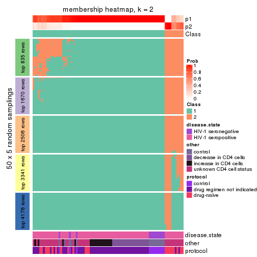</p>

</div>
<div id='tab-SD-pam-membership-heatmap-2'>
<pre><code class="r">membership_heatmap(res, k = 3)
</code></pre>

<p>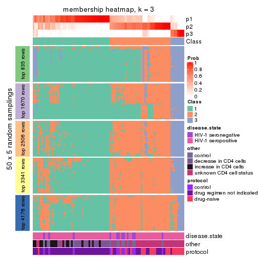</p>

</div>
<div id='tab-SD-pam-membership-heatmap-3'>
<pre><code class="r">membership_heatmap(res, k = 4)
</code></pre>

<p>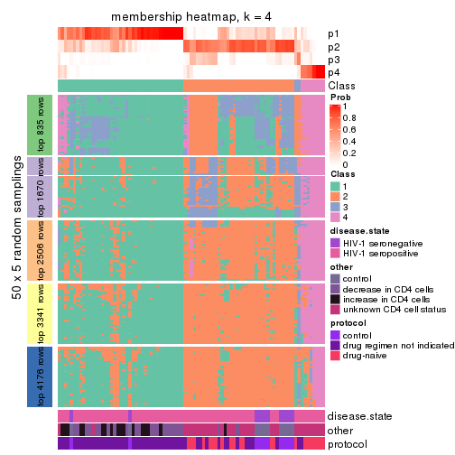</p>

</div>
<div id='tab-SD-pam-membership-heatmap-4'>
<pre><code class="r">membership_heatmap(res, k = 5)
</code></pre>

<p>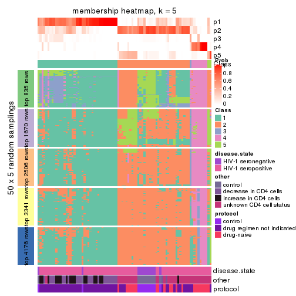</p>

</div>
<div id='tab-SD-pam-membership-heatmap-5'>
<pre><code class="r">membership_heatmap(res, k = 6)
</code></pre>

<p>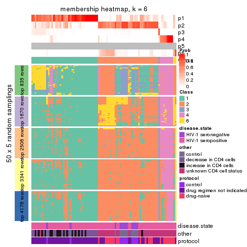</p>

</div>
</div>

As soon as we have had the classes for columns, we can look for signatures
which are significantly different between classes which can be candidate marks
for certain classes. Following are the heatmaps for signatures.


Signature heatmaps where rows are scaled:


<script>
$( function() {
	$( '#tabs-SD-pam-get-signatures' ).tabs();
} );
</script>
<div id='tabs-SD-pam-get-signatures'>
<ul>
<li><a href='#tab-SD-pam-get-signatures-1'>k = 2</a></li>
<li><a href='#tab-SD-pam-get-signatures-2'>k = 3</a></li>
<li><a href='#tab-SD-pam-get-signatures-3'>k = 4</a></li>
<li><a href='#tab-SD-pam-get-signatures-4'>k = 5</a></li>
<li><a href='#tab-SD-pam-get-signatures-5'>k = 6</a></li>
</ul>
<div id='tab-SD-pam-get-signatures-1'>
<pre><code class="r">get_signatures(res, k = 2)
</code></pre>

<p>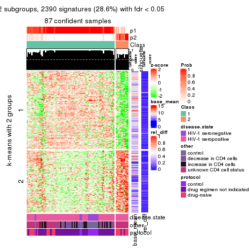</p>

</div>
<div id='tab-SD-pam-get-signatures-2'>
<pre><code class="r">get_signatures(res, k = 3)
</code></pre>

<p>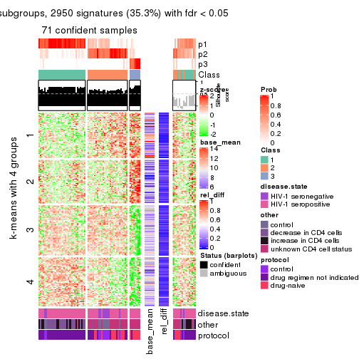</p>

</div>
<div id='tab-SD-pam-get-signatures-3'>
<pre><code class="r">get_signatures(res, k = 4)
</code></pre>

<p>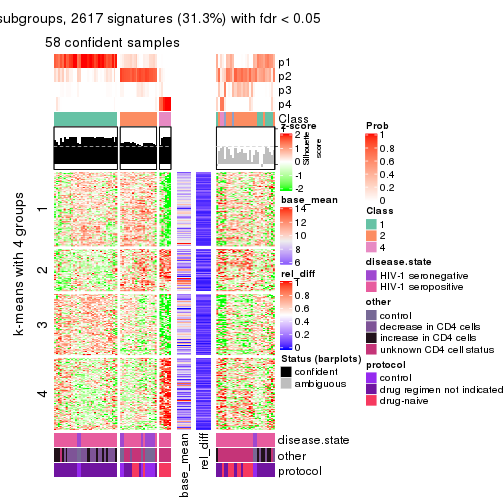</p>

</div>
<div id='tab-SD-pam-get-signatures-4'>
<pre><code class="r">get_signatures(res, k = 5)
</code></pre>

<p>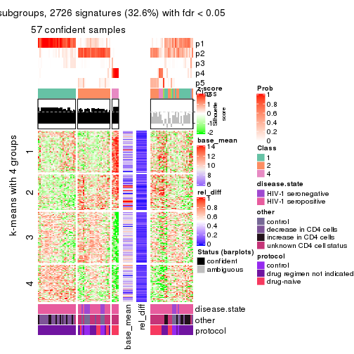</p>

</div>
<div id='tab-SD-pam-get-signatures-5'>
<pre><code class="r">get_signatures(res, k = 6)
</code></pre>

<p>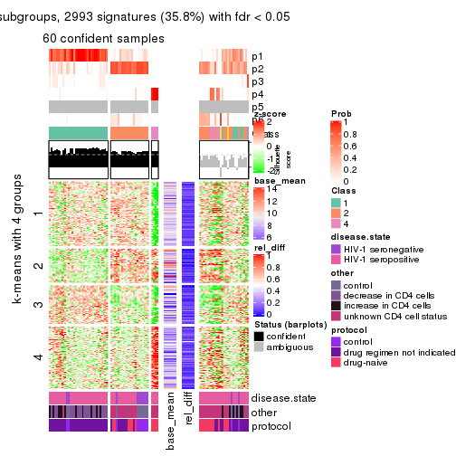</p>

</div>
</div>


Signature heatmaps where rows are not scaled:


<script>
$( function() {
	$( '#tabs-SD-pam-get-signatures-no-scale' ).tabs();
} );
</script>
<div id='tabs-SD-pam-get-signatures-no-scale'>
<ul>
<li><a href='#tab-SD-pam-get-signatures-no-scale-1'>k = 2</a></li>
<li><a href='#tab-SD-pam-get-signatures-no-scale-2'>k = 3</a></li>
<li><a href='#tab-SD-pam-get-signatures-no-scale-3'>k = 4</a></li>
<li><a href='#tab-SD-pam-get-signatures-no-scale-4'>k = 5</a></li>
<li><a href='#tab-SD-pam-get-signatures-no-scale-5'>k = 6</a></li>
</ul>
<div id='tab-SD-pam-get-signatures-no-scale-1'>
<pre><code class="r">get_signatures(res, k = 2, scale_rows = FALSE)
</code></pre>

<p>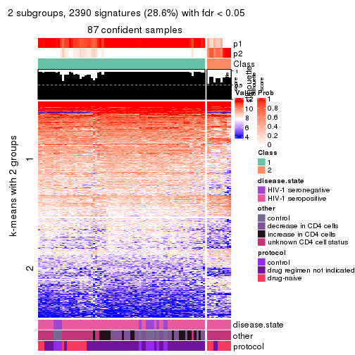</p>

</div>
<div id='tab-SD-pam-get-signatures-no-scale-2'>
<pre><code class="r">get_signatures(res, k = 3, scale_rows = FALSE)
</code></pre>

<p>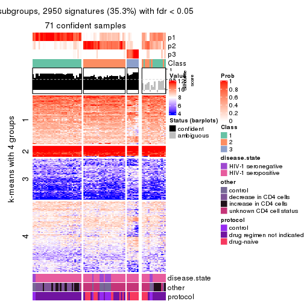</p>

</div>
<div id='tab-SD-pam-get-signatures-no-scale-3'>
<pre><code class="r">get_signatures(res, k = 4, scale_rows = FALSE)
</code></pre>

<p>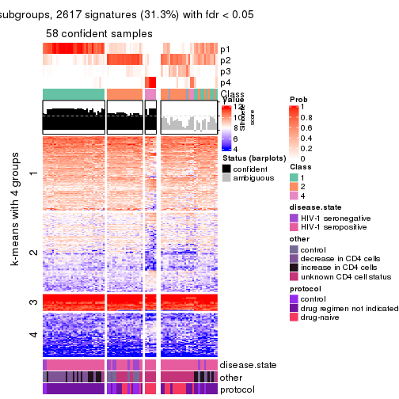</p>

</div>
<div id='tab-SD-pam-get-signatures-no-scale-4'>
<pre><code class="r">get_signatures(res, k = 5, scale_rows = FALSE)
</code></pre>

<p>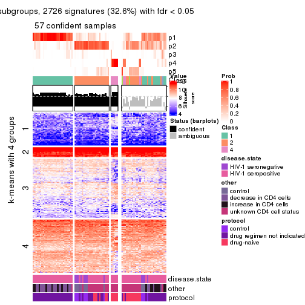</p>

</div>
<div id='tab-SD-pam-get-signatures-no-scale-5'>
<pre><code class="r">get_signatures(res, k = 6, scale_rows = FALSE)
</code></pre>

<p>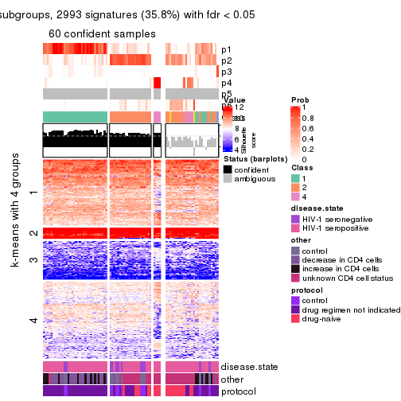</p>

</div>
</div>


Compare the overlap of signatures from different k:

```r
compare_signatures(res)
```

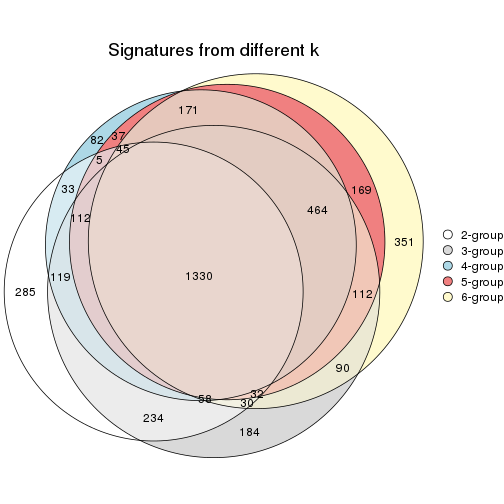

`get_signature()` returns a data frame invisibly. TO get the list of signatures, the function
call should be assigned to a variable explicitly. In following code, if `plot` argument is set
to `FALSE`, no heatmap is plotted while only the differential analysis is performed.

```r
# code only for demonstration
tb = get_signature(res, k = ..., plot = FALSE)
```

An example of the output of `tb` is:

```
#>   which_row         fdr    mean_1    mean_2 scaled_mean_1 scaled_mean_2 km
#> 1        38 0.042760348  8.373488  9.131774    -0.5533452     0.5164555  1
#> 2        40 0.018707592  7.106213  8.469186    -0.6173731     0.5762149  1
#> 3        55 0.019134737 10.221463 11.207825    -0.6159697     0.5749050  1
#> 4        59 0.006059896  5.921854  7.869574    -0.6899429     0.6439467  1
#> 5        60 0.018055526  8.928898 10.211722    -0.6204761     0.5791110  1
#> 6        98 0.009384629 15.714769 14.887706     0.6635654    -0.6193277  2
...
```

The columns in `tb` are:

1. `which_row`: row indices corresponding to the input matrix.
2. `fdr`: FDR for the differential test. 
3. `mean_x`: The mean value in group x.
4. `scaled_mean_x`: The mean value in group x after rows are scaled.
5. `km`: Row groups if k-means clustering is applied to rows.


UMAP plot which shows how samples are separated.


<script>
$( function() {
	$( '#tabs-SD-pam-dimension-reduction' ).tabs();
} );
</script>
<div id='tabs-SD-pam-dimension-reduction'>
<ul>
<li><a href='#tab-SD-pam-dimension-reduction-1'>k = 2</a></li>
<li><a href='#tab-SD-pam-dimension-reduction-2'>k = 3</a></li>
<li><a href='#tab-SD-pam-dimension-reduction-3'>k = 4</a></li>
<li><a href='#tab-SD-pam-dimension-reduction-4'>k = 5</a></li>
<li><a href='#tab-SD-pam-dimension-reduction-5'>k = 6</a></li>
</ul>
<div id='tab-SD-pam-dimension-reduction-1'>
<pre><code class="r">dimension_reduction(res, k = 2, method = &quot;UMAP&quot;)
</code></pre>

<p>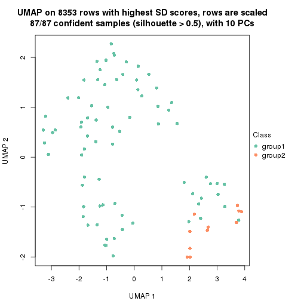</p>

</div>
<div id='tab-SD-pam-dimension-reduction-2'>
<pre><code class="r">dimension_reduction(res, k = 3, method = &quot;UMAP&quot;)
</code></pre>

<p>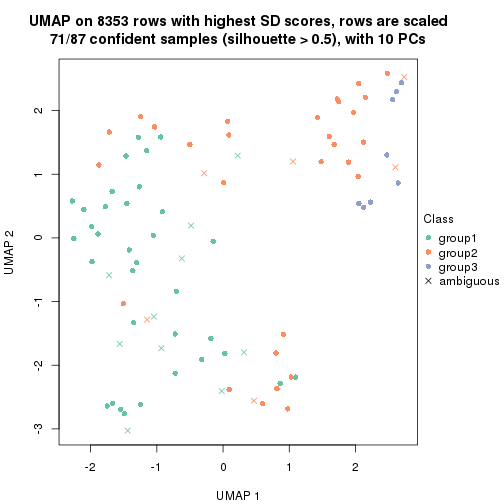</p>

</div>
<div id='tab-SD-pam-dimension-reduction-3'>
<pre><code class="r">dimension_reduction(res, k = 4, method = &quot;UMAP&quot;)
</code></pre>

<p>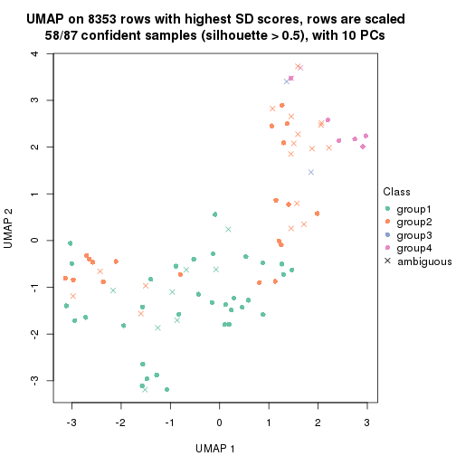</p>

</div>
<div id='tab-SD-pam-dimension-reduction-4'>
<pre><code class="r">dimension_reduction(res, k = 5, method = &quot;UMAP&quot;)
</code></pre>

<p>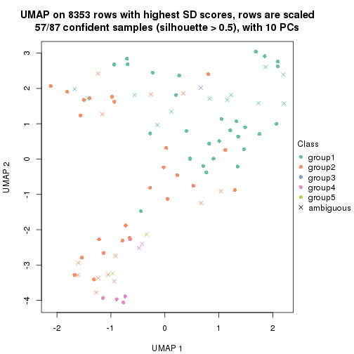</p>

</div>
<div id='tab-SD-pam-dimension-reduction-5'>
<pre><code class="r">dimension_reduction(res, k = 6, method = &quot;UMAP&quot;)
</code></pre>

<p>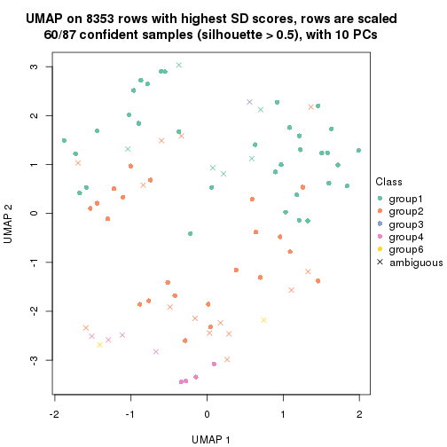</p>

</div>
</div>


Following heatmap shows how subgroups are split when increasing `k`:

```r
collect_classes(res)
```

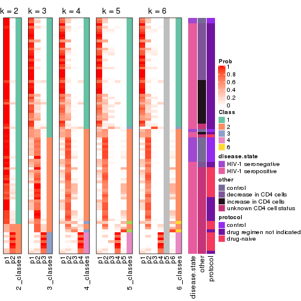


Test correlation between subgroups and known annotations. If the known
annotation is numeric, one-way ANOVA test is applied, and if the known
annotation is discrete, chi-squared contingency table test is applied.

```r
test_to_known_factors(res)
```

```
#>         n disease.state(p) other(p) protocol(p) k
#> SD:pam 87          0.34127 3.14e-04    2.23e-05 2
#> SD:pam 71          0.02270 1.94e-11    1.88e-08 3
#> SD:pam 58          0.00206 1.88e-09    4.74e-10 4
#> SD:pam 57          0.00166 6.53e-10    6.63e-09 5
#> SD:pam 60          0.00747 3.99e-09    2.10e-08 6
```


If matrix rows can be associated to genes, consider to use `GO_Enrichment(res,
...)` to perform function enrichment for the signature genes.


 

---------------------------------------------------


### SD:mclust


The object with results only for a single top-value method and a single partition method 
can be extracted as:

```r
res = res_list["SD", "mclust"]
# you can also extract it by
# res = res_list["SD:mclust"]
```

A summary of `res` and all the functions that can be applied to it:

```r
res
```

```
#> A 'ConsensusPartition' object with k = 2, 3, 4, 5, 6.
#>   On a matrix with 8353 rows and 87 columns.
#>   Top rows (835, 1670, 2506, 3341, 4176) are extracted by 'SD' method.
#>   Subgroups are detected by 'mclust' method.
#>   Performed in total 1250 partitions by row resampling.
#>   Best k for subgroups seems to be 2.
#> 
#> Following methods can be applied to this 'ConsensusPartition' object:
#>  [1] "cola_report"             "collect_classes"         "collect_plots"          
#>  [4] "collect_stats"           "colnames"                "compare_signatures"     
#>  [7] "consensus_heatmap"       "dimension_reduction"     "functional_enrichment"  
#> [10] "get_anno_col"            "get_anno"                "get_classes"            
#> [13] "get_consensus"           "get_matrix"              "get_membership"         
#> [16] "get_param"               "get_signatures"          "get_stats"              
#> [19] "is_best_k"               "is_stable_k"             "membership_heatmap"     
#> [22] "ncol"                    "nrow"                    "plot_ecdf"              
#> [25] "rownames"                "select_partition_number" "show"                   
#> [28] "suggest_best_k"          "test_to_known_factors"
```

`collect_plots()` function collects all the plots made from `res` for all `k` (number of partitions)
into one single page to provide an easy and fast comparison between different `k`.

```r
collect_plots(res)
```

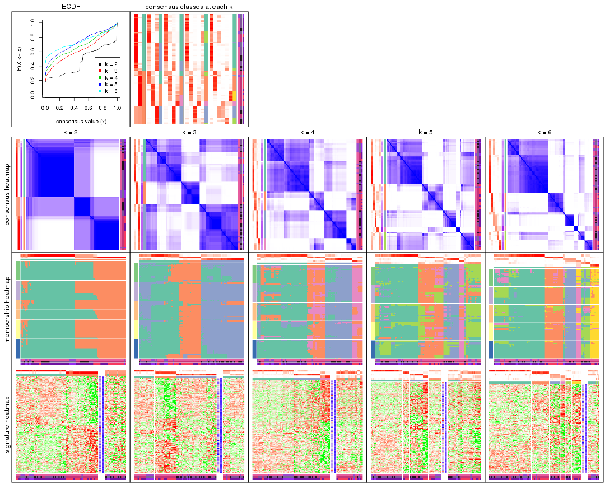

The plots are:

- The first row: a plot of the ECDF (Empirical cumulative distribution
  function) curves of the consensus matrix for each `k` and the heatmap of
  predicted classes for each `k`.
- The second row: heatmaps of the consensus matrix for each `k`.
- The third row: heatmaps of the membership matrix for each `k`.
- The fouth row: heatmaps of the signatures for each `k`.

All the plots in panels can be made by individual functions and they are
plotted later in this section.

`select_partition_number()` produces several plots showing different
statistics for choosing "optimized" `k`. There are following statistics:

- ECDF curves of the consensus matrix for each `k`;
- 1-PAC. [The PAC
  score](https://en.wikipedia.org/wiki/Consensus_clustering#Over-interpretation_potential_of_consensus_clustering)
  measures the proportion of the ambiguous subgrouping.
- Mean silhouette score.
- Concordance. The mean probability of fiting the consensus class ids in all
  partitions.
- Area increased. Denote $A_k$ as the area under the ECDF curve for current
  `k`, the area increased is defined as $A_k - A_{k-1}$.
- Rand index. The percent of pairs of samples that are both in a same cluster
  or both are not in a same cluster in the partition of k and k-1.
- Jaccard index. The ratio of pairs of samples are both in a same cluster in
  the partition of k and k-1 and the pairs of samples are both in a same
  cluster in the partition k or k-1.

The detailed explanations of these statistics can be found in [the cola
vignette](http://bioconductor.org/packages/devel/bioc/vignettes/cola/inst/doc/cola.html#toc_13).

Generally speaking, lower PAC score, higher mean silhouette score or higher
concordance corresponds to better partition. Rand index and Jaccard index
measure how similar the current partition is compared to partition with `k-1`.
If they are too similar, we won't accept `k` is better than `k-1`.

```r
select_partition_number(res)
```

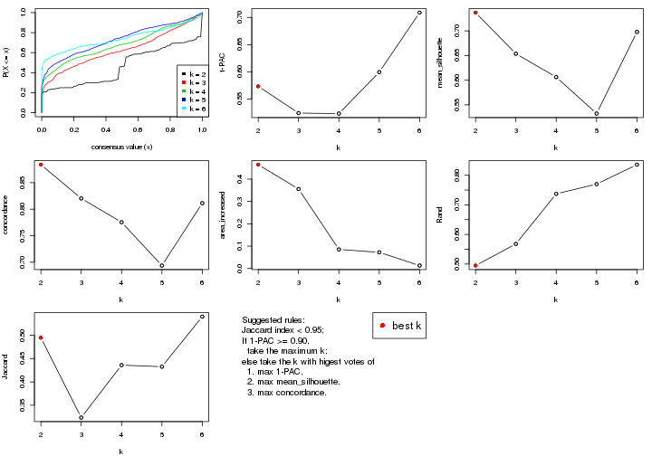

The numeric values for all these statistics can be obtained by `get_stats()`.

```r
get_stats(res)
```

```
#>   k 1-PAC mean_silhouette concordance area_increased  Rand Jaccard
#> 2 2 0.573           0.737       0.884         0.4647 0.495   0.495
#> 3 3 0.524           0.654       0.820         0.3556 0.568   0.324
#> 4 4 0.523           0.606       0.775         0.0854 0.737   0.436
#> 5 5 0.600           0.532       0.694         0.0722 0.770   0.433
#> 6 6 0.709           0.698       0.811         0.0130 0.836   0.540
```

`suggest_best_k()` suggests the best $k$ based on these statistics. The rules are as follows:

- All $k$ with Jaccard index larger than 0.95 are removed because the increase of
  the partition number does not provides enough extra information. If all $k$ are removed,
  the best $k$ is assigned by `NA`.
- For $k$ with 1-PAC larger than 0.9, the maximal $k$ is taken as the "best k". Other $k$ is called "optional k".
- If it does not fit the second rule. The $k$ with the highest vote of highest
  1-PAC, mean silhouette and concordance is taken as the "best k".

```r
suggest_best_k(res)
```

```
#> [1] 2
```


Following shows the table of the partitions (You need to click the **show/hide
code output** link to see it). The membership matrix (columns with name `p*`)
is inferred by
[`clue::cl_consensus()`](https://www.rdocumentation.org/link/cl_consensus?package=clue)
function with the `SE` method. Basically the value in the membership matrix
represents the probability to belong to a certain group. The finall class
label for an item is determined with the group with highest probability it
belongs to.

In `get_classes()` function, the entropy is calculated from the membership
matrix and the silhouette score is calculated from the consensus matrix.


<script>
$( function() {
	$( '#tabs-SD-mclust-get-classes' ).tabs();
} );
</script>
<div id='tabs-SD-mclust-get-classes'>
<ul>
<li><a href='#tab-SD-mclust-get-classes-1'>k = 2</a></li>
<li><a href='#tab-SD-mclust-get-classes-2'>k = 3</a></li>
<li><a href='#tab-SD-mclust-get-classes-3'>k = 4</a></li>
<li><a href='#tab-SD-mclust-get-classes-4'>k = 5</a></li>
<li><a href='#tab-SD-mclust-get-classes-5'>k = 6</a></li>
</ul>

<div id='tab-SD-mclust-get-classes-1'>
<p><a id='tab-SD-mclust-get-classes-1-a' style='color:#0366d6' href='#'>show/hide code output</a></p>
<pre><code class="r">cbind(get_classes(res, k = 2), get_membership(res, k = 2))
</code></pre>

<pre><code>#&gt;          class entropy silhouette    p1    p2
#&gt; GSM39104     1  0.0000      0.934 1.000 0.000
#&gt; GSM39105     1  0.0000      0.934 1.000 0.000
#&gt; GSM39106     1  0.0000      0.934 1.000 0.000
#&gt; GSM39107     1  0.9944     -0.110 0.544 0.456
#&gt; GSM39108     1  0.0000      0.934 1.000 0.000
#&gt; GSM39109     2  0.9896      0.414 0.440 0.560
#&gt; GSM39110     1  0.7056      0.682 0.808 0.192
#&gt; GSM39111     1  0.3114      0.883 0.944 0.056
#&gt; GSM39112     1  0.4939      0.831 0.892 0.108
#&gt; GSM39113     1  0.9427      0.291 0.640 0.360
#&gt; GSM39114     2  0.0000      0.771 0.000 1.000
#&gt; GSM39115     1  0.0000      0.934 1.000 0.000
#&gt; GSM39148     1  0.0000      0.934 1.000 0.000
#&gt; GSM39149     2  0.9988      0.358 0.480 0.520
#&gt; GSM39150     1  0.0000      0.934 1.000 0.000
#&gt; GSM39151     2  0.9988      0.358 0.480 0.520
#&gt; GSM39152     2  0.9988      0.358 0.480 0.520
#&gt; GSM39153     1  0.0000      0.934 1.000 0.000
#&gt; GSM39154     1  0.0000      0.934 1.000 0.000
#&gt; GSM39155     1  0.0000      0.934 1.000 0.000
#&gt; GSM39156     1  0.0000      0.934 1.000 0.000
#&gt; GSM39157     1  0.0000      0.934 1.000 0.000
#&gt; GSM39158     1  0.0000      0.934 1.000 0.000
#&gt; GSM39159     1  0.9580      0.158 0.620 0.380
#&gt; GSM39160     1  0.2043      0.907 0.968 0.032
#&gt; GSM39161     2  0.9988      0.358 0.480 0.520
#&gt; GSM39162     1  0.0000      0.934 1.000 0.000
#&gt; GSM39163     1  0.0000      0.934 1.000 0.000
#&gt; GSM39164     1  0.0000      0.934 1.000 0.000
#&gt; GSM39165     1  0.7745      0.614 0.772 0.228
#&gt; GSM39166     1  0.0000      0.934 1.000 0.000
#&gt; GSM39167     1  0.0000      0.934 1.000 0.000
#&gt; GSM39168     1  0.0000      0.934 1.000 0.000
#&gt; GSM39169     1  0.0000      0.934 1.000 0.000
#&gt; GSM39170     1  0.0000      0.934 1.000 0.000
#&gt; GSM39171     1  0.0000      0.934 1.000 0.000
#&gt; GSM39172     2  0.9988      0.358 0.480 0.520
#&gt; GSM39173     2  0.9988      0.358 0.480 0.520
#&gt; GSM39174     1  0.0000      0.934 1.000 0.000
#&gt; GSM39175     1  0.0000      0.934 1.000 0.000
#&gt; GSM39176     1  0.0000      0.934 1.000 0.000
#&gt; GSM39177     2  0.9988      0.358 0.480 0.520
#&gt; GSM39178     1  0.8386      0.522 0.732 0.268
#&gt; GSM39179     2  0.9988      0.358 0.480 0.520
#&gt; GSM39180     2  0.9988      0.358 0.480 0.520
#&gt; GSM39181     1  0.4298      0.846 0.912 0.088
#&gt; GSM39182     2  0.9988      0.358 0.480 0.520
#&gt; GSM39183     1  0.2236      0.903 0.964 0.036
#&gt; GSM39184     1  0.0000      0.934 1.000 0.000
#&gt; GSM39185     2  0.9988      0.358 0.480 0.520
#&gt; GSM39186     1  0.0000      0.934 1.000 0.000
#&gt; GSM39187     1  0.0000      0.934 1.000 0.000
#&gt; GSM39116     2  0.0000      0.771 0.000 1.000
#&gt; GSM39117     2  0.0000      0.771 0.000 1.000
#&gt; GSM39118     2  0.0000      0.771 0.000 1.000
#&gt; GSM39119     2  0.0000      0.771 0.000 1.000
#&gt; GSM39120     1  0.0000      0.934 1.000 0.000
#&gt; GSM39121     2  0.7602      0.655 0.220 0.780
#&gt; GSM39122     2  0.7056      0.675 0.192 0.808
#&gt; GSM39123     2  0.0000      0.771 0.000 1.000
#&gt; GSM39124     2  0.0000      0.771 0.000 1.000
#&gt; GSM39125     1  0.0000      0.934 1.000 0.000
#&gt; GSM39126     2  0.8207      0.625 0.256 0.744
#&gt; GSM39127     2  0.0000      0.771 0.000 1.000
#&gt; GSM39128     2  0.0376      0.770 0.004 0.996
#&gt; GSM39129     2  0.0000      0.771 0.000 1.000
#&gt; GSM39130     2  0.0000      0.771 0.000 1.000
#&gt; GSM39131     2  0.0376      0.770 0.004 0.996
#&gt; GSM39132     2  0.0000      0.771 0.000 1.000
#&gt; GSM39133     2  0.0000      0.771 0.000 1.000
#&gt; GSM39134     2  0.0000      0.771 0.000 1.000
#&gt; GSM39135     2  0.0000      0.771 0.000 1.000
#&gt; GSM39136     2  0.0000      0.771 0.000 1.000
#&gt; GSM39137     2  0.2236      0.758 0.036 0.964
#&gt; GSM39138     2  0.0000      0.771 0.000 1.000
#&gt; GSM39139     2  0.0000      0.771 0.000 1.000
#&gt; GSM39140     1  0.0672      0.927 0.992 0.008
#&gt; GSM39141     1  0.0376      0.931 0.996 0.004
#&gt; GSM39142     1  0.0000      0.934 1.000 0.000
#&gt; GSM39143     1  0.0376      0.931 0.996 0.004
#&gt; GSM39144     2  0.0000      0.771 0.000 1.000
#&gt; GSM39145     2  0.0000      0.771 0.000 1.000
#&gt; GSM39146     2  0.0000      0.771 0.000 1.000
#&gt; GSM39147     2  0.0000      0.771 0.000 1.000
#&gt; GSM39188     2  0.9988      0.358 0.480 0.520
#&gt; GSM39189     2  0.9988      0.358 0.480 0.520
#&gt; GSM39190     2  0.9988      0.358 0.480 0.520
</code></pre>

<script>
$('#tab-SD-mclust-get-classes-1-a').parent().next().next().hide();
$('#tab-SD-mclust-get-classes-1-a').click(function(){
  $('#tab-SD-mclust-get-classes-1-a').parent().next().next().toggle();
  return(false);
});
</script>
</div>

<div id='tab-SD-mclust-get-classes-2'>
<p><a id='tab-SD-mclust-get-classes-2-a' style='color:#0366d6' href='#'>show/hide code output</a></p>
<pre><code class="r">cbind(get_classes(res, k = 3), get_membership(res, k = 3))
</code></pre>

<pre><code>#&gt;          class entropy silhouette    p1    p2    p3
#&gt; GSM39104     3  0.4974     0.7687 0.236 0.000 0.764
#&gt; GSM39105     1  0.6126     0.1269 0.600 0.000 0.400
#&gt; GSM39106     1  0.2066     0.6935 0.940 0.000 0.060
#&gt; GSM39107     1  0.3461     0.6783 0.900 0.076 0.024
#&gt; GSM39108     1  0.2625     0.6828 0.916 0.000 0.084
#&gt; GSM39109     1  0.4209     0.6620 0.856 0.016 0.128
#&gt; GSM39110     1  0.3038     0.6722 0.896 0.000 0.104
#&gt; GSM39111     3  0.4654     0.7821 0.208 0.000 0.792
#&gt; GSM39112     1  0.1585     0.7011 0.964 0.008 0.028
#&gt; GSM39113     1  0.3590     0.6823 0.896 0.076 0.028
#&gt; GSM39114     1  0.5722     0.4834 0.704 0.292 0.004
#&gt; GSM39115     3  0.5465     0.7468 0.288 0.000 0.712
#&gt; GSM39148     1  0.6062     0.1091 0.616 0.000 0.384
#&gt; GSM39149     3  0.0592     0.7715 0.000 0.012 0.988
#&gt; GSM39150     3  0.4654     0.7821 0.208 0.000 0.792
#&gt; GSM39151     3  0.0592     0.7715 0.000 0.012 0.988
#&gt; GSM39152     3  0.1015     0.7748 0.008 0.012 0.980
#&gt; GSM39153     3  0.6235     0.4826 0.436 0.000 0.564
#&gt; GSM39154     3  0.6126     0.5671 0.400 0.000 0.600
#&gt; GSM39155     1  0.6244    -0.1041 0.560 0.000 0.440
#&gt; GSM39156     1  0.1643     0.6913 0.956 0.000 0.044
#&gt; GSM39157     1  0.6295    -0.2360 0.528 0.000 0.472
#&gt; GSM39158     3  0.5291     0.7618 0.268 0.000 0.732
#&gt; GSM39159     3  0.4172     0.7964 0.156 0.004 0.840
#&gt; GSM39160     3  0.4555     0.7847 0.200 0.000 0.800
#&gt; GSM39161     3  0.2599     0.7748 0.052 0.016 0.932
#&gt; GSM39162     1  0.5465     0.3644 0.712 0.000 0.288
#&gt; GSM39163     3  0.6111     0.5755 0.396 0.000 0.604
#&gt; GSM39164     1  0.6299    -0.2457 0.524 0.000 0.476
#&gt; GSM39165     3  0.4178     0.7955 0.172 0.000 0.828
#&gt; GSM39166     3  0.5216     0.7630 0.260 0.000 0.740
#&gt; GSM39167     3  0.5988     0.6276 0.368 0.000 0.632
#&gt; GSM39168     1  0.5905     0.2161 0.648 0.000 0.352
#&gt; GSM39169     1  0.6309    -0.3306 0.500 0.000 0.500
#&gt; GSM39170     3  0.5363     0.7562 0.276 0.000 0.724
#&gt; GSM39171     3  0.4842     0.7775 0.224 0.000 0.776
#&gt; GSM39172     3  0.0983     0.7672 0.004 0.016 0.980
#&gt; GSM39173     3  0.0592     0.7715 0.000 0.012 0.988
#&gt; GSM39174     1  0.6126     0.0579 0.600 0.000 0.400
#&gt; GSM39175     3  0.5327     0.7594 0.272 0.000 0.728
#&gt; GSM39176     3  0.5810     0.6833 0.336 0.000 0.664
#&gt; GSM39177     3  0.0592     0.7715 0.000 0.012 0.988
#&gt; GSM39178     3  0.2711     0.7936 0.088 0.000 0.912
#&gt; GSM39179     3  0.0592     0.7715 0.000 0.012 0.988
#&gt; GSM39180     3  0.1636     0.7702 0.020 0.016 0.964
#&gt; GSM39181     3  0.4062     0.7960 0.164 0.000 0.836
#&gt; GSM39182     3  0.2703     0.7752 0.056 0.016 0.928
#&gt; GSM39183     3  0.4291     0.7943 0.180 0.000 0.820
#&gt; GSM39184     3  0.5465     0.7440 0.288 0.000 0.712
#&gt; GSM39185     3  0.2599     0.7748 0.052 0.016 0.932
#&gt; GSM39186     1  0.5810     0.2932 0.664 0.000 0.336
#&gt; GSM39187     3  0.6308     0.3165 0.492 0.000 0.508
#&gt; GSM39116     2  0.3009     0.9155 0.028 0.920 0.052
#&gt; GSM39117     2  0.3715     0.9010 0.004 0.868 0.128
#&gt; GSM39118     2  0.2261     0.9318 0.000 0.932 0.068
#&gt; GSM39119     2  0.2537     0.9279 0.000 0.920 0.080
#&gt; GSM39120     1  0.1267     0.7007 0.972 0.004 0.024
#&gt; GSM39121     1  0.4605     0.5882 0.796 0.204 0.000
#&gt; GSM39122     1  0.5016     0.5508 0.760 0.240 0.000
#&gt; GSM39123     2  0.3715     0.9010 0.004 0.868 0.128
#&gt; GSM39124     1  0.5529     0.4775 0.704 0.296 0.000
#&gt; GSM39125     1  0.1129     0.7005 0.976 0.004 0.020
#&gt; GSM39126     1  0.4452     0.6002 0.808 0.192 0.000
#&gt; GSM39127     1  0.5733     0.4372 0.676 0.324 0.000
#&gt; GSM39128     1  0.5560     0.4732 0.700 0.300 0.000
#&gt; GSM39129     2  0.2356     0.9307 0.000 0.928 0.072
#&gt; GSM39130     2  0.3715     0.9010 0.004 0.868 0.128
#&gt; GSM39131     1  0.5560     0.4732 0.700 0.300 0.000
#&gt; GSM39132     2  0.2959     0.8186 0.100 0.900 0.000
#&gt; GSM39133     2  0.3644     0.9036 0.004 0.872 0.124
#&gt; GSM39134     2  0.2261     0.9318 0.000 0.932 0.068
#&gt; GSM39135     2  0.2443     0.8970 0.032 0.940 0.028
#&gt; GSM39136     2  0.3406     0.9229 0.028 0.904 0.068
#&gt; GSM39137     1  0.5529     0.4779 0.704 0.296 0.000
#&gt; GSM39138     2  0.2261     0.9318 0.000 0.932 0.068
#&gt; GSM39139     2  0.2261     0.9318 0.000 0.932 0.068
#&gt; GSM39140     1  0.0892     0.6997 0.980 0.000 0.020
#&gt; GSM39141     1  0.0892     0.6997 0.980 0.000 0.020
#&gt; GSM39142     1  0.0892     0.6997 0.980 0.000 0.020
#&gt; GSM39143     1  0.0892     0.6997 0.980 0.000 0.020
#&gt; GSM39144     2  0.2261     0.9318 0.000 0.932 0.068
#&gt; GSM39145     2  0.2261     0.9318 0.000 0.932 0.068
#&gt; GSM39146     2  0.5953     0.5304 0.280 0.708 0.012
#&gt; GSM39147     2  0.3551     0.7863 0.132 0.868 0.000
#&gt; GSM39188     3  0.0592     0.7715 0.000 0.012 0.988
#&gt; GSM39189     3  0.0592     0.7715 0.000 0.012 0.988
#&gt; GSM39190     3  0.0592     0.7715 0.000 0.012 0.988
</code></pre>

<script>
$('#tab-SD-mclust-get-classes-2-a').parent().next().next().hide();
$('#tab-SD-mclust-get-classes-2-a').click(function(){
  $('#tab-SD-mclust-get-classes-2-a').parent().next().next().toggle();
  return(false);
});
</script>
</div>

<div id='tab-SD-mclust-get-classes-3'>
<p><a id='tab-SD-mclust-get-classes-3-a' style='color:#0366d6' href='#'>show/hide code output</a></p>
<pre><code class="r">cbind(get_classes(res, k = 4), get_membership(res, k = 4))
</code></pre>

<pre><code>#&gt;          class entropy silhouette    p1    p2    p3    p4
#&gt; GSM39104     1  0.3172    0.68973 0.840 0.000 0.160 0.000
#&gt; GSM39105     1  0.1994    0.76793 0.936 0.004 0.052 0.008
#&gt; GSM39106     1  0.5229    0.72165 0.772 0.156 0.048 0.024
#&gt; GSM39107     1  0.6107    0.58582 0.652 0.288 0.024 0.036
#&gt; GSM39108     1  0.4742    0.73440 0.800 0.140 0.044 0.016
#&gt; GSM39109     1  0.6923    0.60543 0.636 0.244 0.084 0.036
#&gt; GSM39110     1  0.5146    0.74020 0.784 0.120 0.080 0.016
#&gt; GSM39111     1  0.4857    0.47644 0.668 0.008 0.324 0.000
#&gt; GSM39112     1  0.5909    0.61232 0.672 0.272 0.020 0.036
#&gt; GSM39113     1  0.5996    0.56789 0.644 0.304 0.016 0.036
#&gt; GSM39114     2  0.3875    0.48205 0.068 0.852 0.004 0.076
#&gt; GSM39115     1  0.2530    0.72238 0.888 0.000 0.112 0.000
#&gt; GSM39148     1  0.1284    0.76875 0.964 0.012 0.024 0.000
#&gt; GSM39149     3  0.1302    0.82987 0.044 0.000 0.956 0.000
#&gt; GSM39150     3  0.4866    0.56601 0.404 0.000 0.596 0.000
#&gt; GSM39151     3  0.1302    0.82987 0.044 0.000 0.956 0.000
#&gt; GSM39152     3  0.1867    0.83129 0.072 0.000 0.928 0.000
#&gt; GSM39153     1  0.1867    0.75367 0.928 0.000 0.072 0.000
#&gt; GSM39154     1  0.2281    0.73504 0.904 0.000 0.096 0.000
#&gt; GSM39155     1  0.1557    0.75999 0.944 0.000 0.056 0.000
#&gt; GSM39156     1  0.4781    0.72592 0.788 0.160 0.040 0.012
#&gt; GSM39157     1  0.1022    0.76669 0.968 0.000 0.032 0.000
#&gt; GSM39158     1  0.4564    0.29992 0.672 0.000 0.328 0.000
#&gt; GSM39159     3  0.4193    0.72537 0.268 0.000 0.732 0.000
#&gt; GSM39160     3  0.4730    0.63761 0.364 0.000 0.636 0.000
#&gt; GSM39161     3  0.2610    0.82220 0.088 0.000 0.900 0.012
#&gt; GSM39162     1  0.1722    0.76800 0.944 0.048 0.008 0.000
#&gt; GSM39163     1  0.1716    0.75632 0.936 0.000 0.064 0.000
#&gt; GSM39164     1  0.1211    0.76552 0.960 0.000 0.040 0.000
#&gt; GSM39165     3  0.4543    0.67982 0.324 0.000 0.676 0.000
#&gt; GSM39166     3  0.4855    0.58265 0.400 0.000 0.600 0.000
#&gt; GSM39167     1  0.1940    0.74911 0.924 0.000 0.076 0.000
#&gt; GSM39168     1  0.1284    0.76910 0.964 0.024 0.012 0.000
#&gt; GSM39169     1  0.1637    0.75827 0.940 0.000 0.060 0.000
#&gt; GSM39170     1  0.2921    0.68888 0.860 0.000 0.140 0.000
#&gt; GSM39171     1  0.4888   -0.00631 0.588 0.000 0.412 0.000
#&gt; GSM39172     3  0.0657    0.78902 0.000 0.004 0.984 0.012
#&gt; GSM39173     3  0.1022    0.82354 0.032 0.000 0.968 0.000
#&gt; GSM39174     1  0.1118    0.76608 0.964 0.000 0.036 0.000
#&gt; GSM39175     1  0.3356    0.64007 0.824 0.000 0.176 0.000
#&gt; GSM39176     1  0.1940    0.74911 0.924 0.000 0.076 0.000
#&gt; GSM39177     3  0.1389    0.83058 0.048 0.000 0.952 0.000
#&gt; GSM39178     3  0.4331    0.72499 0.288 0.000 0.712 0.000
#&gt; GSM39179     3  0.1302    0.82987 0.044 0.000 0.956 0.000
#&gt; GSM39180     3  0.0844    0.79139 0.004 0.004 0.980 0.012
#&gt; GSM39181     3  0.5110    0.66345 0.352 0.000 0.636 0.012
#&gt; GSM39182     3  0.3617    0.80307 0.108 0.020 0.860 0.012
#&gt; GSM39183     3  0.4679    0.65729 0.352 0.000 0.648 0.000
#&gt; GSM39184     1  0.2469    0.72727 0.892 0.000 0.108 0.000
#&gt; GSM39185     3  0.1767    0.81215 0.044 0.000 0.944 0.012
#&gt; GSM39186     1  0.1824    0.76507 0.936 0.004 0.060 0.000
#&gt; GSM39187     1  0.1389    0.76306 0.952 0.000 0.048 0.000
#&gt; GSM39116     2  0.3726    0.38350 0.000 0.788 0.000 0.212
#&gt; GSM39117     4  0.1474    0.62547 0.000 0.052 0.000 0.948
#&gt; GSM39118     2  0.5167   -0.51488 0.000 0.508 0.004 0.488
#&gt; GSM39119     4  0.4730    0.58324 0.000 0.364 0.000 0.636
#&gt; GSM39120     1  0.5430    0.70376 0.752 0.180 0.032 0.036
#&gt; GSM39121     1  0.5678    0.26662 0.500 0.480 0.004 0.016
#&gt; GSM39122     1  0.5510    0.26959 0.504 0.480 0.000 0.016
#&gt; GSM39123     4  0.1474    0.62547 0.000 0.052 0.000 0.948
#&gt; GSM39124     2  0.4706    0.46124 0.140 0.788 0.000 0.072
#&gt; GSM39125     1  0.5478    0.70383 0.752 0.176 0.036 0.036
#&gt; GSM39126     1  0.5859    0.28507 0.504 0.468 0.004 0.024
#&gt; GSM39127     2  0.2081    0.50456 0.000 0.916 0.000 0.084
#&gt; GSM39128     2  0.5267    0.43750 0.184 0.740 0.000 0.076
#&gt; GSM39129     4  0.5161    0.51748 0.000 0.476 0.004 0.520
#&gt; GSM39130     4  0.1474    0.62547 0.000 0.052 0.000 0.948
#&gt; GSM39131     2  0.5307    0.43605 0.188 0.736 0.000 0.076
#&gt; GSM39132     2  0.2868    0.48461 0.000 0.864 0.000 0.136
#&gt; GSM39133     4  0.1637    0.62644 0.000 0.060 0.000 0.940
#&gt; GSM39134     4  0.4998    0.49918 0.000 0.488 0.000 0.512
#&gt; GSM39135     2  0.3528    0.41213 0.000 0.808 0.000 0.192
#&gt; GSM39136     2  0.4134    0.25694 0.000 0.740 0.000 0.260
#&gt; GSM39137     2  0.5924   -0.03470 0.404 0.556 0.000 0.040
#&gt; GSM39138     4  0.4992    0.51949 0.000 0.476 0.000 0.524
#&gt; GSM39139     2  0.4925   -0.31156 0.000 0.572 0.000 0.428
#&gt; GSM39140     1  0.5716    0.68461 0.728 0.200 0.036 0.036
#&gt; GSM39141     1  0.5400    0.69396 0.744 0.196 0.024 0.036
#&gt; GSM39142     1  0.5065    0.71407 0.772 0.172 0.024 0.032
#&gt; GSM39143     1  0.5548    0.67864 0.728 0.212 0.024 0.036
#&gt; GSM39144     4  0.5161    0.51748 0.000 0.476 0.004 0.520
#&gt; GSM39145     2  0.4304    0.22824 0.000 0.716 0.000 0.284
#&gt; GSM39146     2  0.3569    0.47713 0.000 0.804 0.000 0.196
#&gt; GSM39147     2  0.2973    0.48633 0.000 0.856 0.000 0.144
#&gt; GSM39188     3  0.1118    0.82724 0.036 0.000 0.964 0.000
#&gt; GSM39189     3  0.1211    0.82888 0.040 0.000 0.960 0.000
#&gt; GSM39190     3  0.1118    0.82724 0.036 0.000 0.964 0.000
</code></pre>

<script>
$('#tab-SD-mclust-get-classes-3-a').parent().next().next().hide();
$('#tab-SD-mclust-get-classes-3-a').click(function(){
  $('#tab-SD-mclust-get-classes-3-a').parent().next().next().toggle();
  return(false);
});
</script>
</div>

<div id='tab-SD-mclust-get-classes-4'>
<p><a id='tab-SD-mclust-get-classes-4-a' style='color:#0366d6' href='#'>show/hide code output</a></p>
<pre><code class="r">cbind(get_classes(res, k = 5), get_membership(res, k = 5))
</code></pre>

<pre><code>#&gt;          class entropy silhouette    p1    p2    p3    p4    p5
#&gt; GSM39104     1  0.2325     0.7009 0.904 0.000 0.028 0.000 0.068
#&gt; GSM39105     1  0.1251     0.6983 0.956 0.000 0.008 0.000 0.036
#&gt; GSM39106     5  0.4811     0.6752 0.452 0.000 0.020 0.000 0.528
#&gt; GSM39107     5  0.5836     0.7349 0.348 0.076 0.012 0.000 0.564
#&gt; GSM39108     1  0.5014    -0.4995 0.536 0.000 0.032 0.000 0.432
#&gt; GSM39109     5  0.6631     0.6663 0.340 0.048 0.060 0.012 0.540
#&gt; GSM39110     1  0.5393    -0.5268 0.504 0.000 0.056 0.000 0.440
#&gt; GSM39111     1  0.5435     0.5359 0.668 0.000 0.124 0.004 0.204
#&gt; GSM39112     5  0.5210     0.7486 0.384 0.028 0.012 0.000 0.576
#&gt; GSM39113     5  0.5778     0.7169 0.324 0.096 0.004 0.000 0.576
#&gt; GSM39114     2  0.4691     0.4554 0.004 0.636 0.000 0.020 0.340
#&gt; GSM39115     1  0.1026     0.7157 0.968 0.000 0.004 0.004 0.024
#&gt; GSM39148     1  0.1502     0.6690 0.940 0.000 0.004 0.000 0.056
#&gt; GSM39149     3  0.0963     0.7852 0.036 0.000 0.964 0.000 0.000
#&gt; GSM39150     1  0.5796     0.5403 0.624 0.000 0.092 0.016 0.268
#&gt; GSM39151     3  0.1124     0.7848 0.036 0.000 0.960 0.000 0.004
#&gt; GSM39152     3  0.4901     0.7101 0.084 0.000 0.716 0.004 0.196
#&gt; GSM39153     1  0.0324     0.7145 0.992 0.000 0.004 0.000 0.004
#&gt; GSM39154     1  0.0162     0.7136 0.996 0.000 0.000 0.000 0.004
#&gt; GSM39155     1  0.0162     0.7098 0.996 0.000 0.000 0.000 0.004
#&gt; GSM39156     1  0.4708    -0.5250 0.548 0.000 0.016 0.000 0.436
#&gt; GSM39157     1  0.0404     0.7041 0.988 0.000 0.000 0.000 0.012
#&gt; GSM39158     1  0.3073     0.6779 0.856 0.000 0.024 0.004 0.116
#&gt; GSM39159     1  0.7952     0.1145 0.400 0.000 0.200 0.100 0.300
#&gt; GSM39160     1  0.5977     0.5250 0.612 0.000 0.100 0.020 0.268
#&gt; GSM39161     3  0.8141     0.3933 0.220 0.000 0.372 0.116 0.292
#&gt; GSM39162     1  0.2563     0.5764 0.872 0.000 0.008 0.000 0.120
#&gt; GSM39163     1  0.0000     0.7120 1.000 0.000 0.000 0.000 0.000
#&gt; GSM39164     1  0.0290     0.7073 0.992 0.000 0.000 0.000 0.008
#&gt; GSM39165     1  0.6235     0.4548 0.572 0.000 0.164 0.008 0.256
#&gt; GSM39166     1  0.6200     0.5188 0.612 0.000 0.100 0.036 0.252
#&gt; GSM39167     1  0.0000     0.7120 1.000 0.000 0.000 0.000 0.000
#&gt; GSM39168     1  0.1894     0.6552 0.920 0.000 0.008 0.000 0.072
#&gt; GSM39169     1  0.0451     0.7092 0.988 0.000 0.004 0.000 0.008
#&gt; GSM39170     1  0.1638     0.7061 0.932 0.000 0.004 0.000 0.064
#&gt; GSM39171     1  0.4701     0.5942 0.704 0.000 0.060 0.000 0.236
#&gt; GSM39172     3  0.6760     0.6096 0.064 0.000 0.572 0.112 0.252
#&gt; GSM39173     3  0.1834     0.7776 0.032 0.004 0.940 0.008 0.016
#&gt; GSM39174     1  0.0290     0.7073 0.992 0.000 0.000 0.000 0.008
#&gt; GSM39175     1  0.2304     0.6917 0.892 0.000 0.008 0.000 0.100
#&gt; GSM39176     1  0.0162     0.7131 0.996 0.000 0.004 0.000 0.000
#&gt; GSM39177     3  0.3622     0.7580 0.048 0.000 0.816 0.000 0.136
#&gt; GSM39178     1  0.7071     0.3236 0.504 0.000 0.180 0.040 0.276
#&gt; GSM39179     3  0.1124     0.7864 0.036 0.000 0.960 0.000 0.004
#&gt; GSM39180     3  0.4898     0.6894 0.020 0.004 0.760 0.120 0.096
#&gt; GSM39181     1  0.6558     0.4626 0.568 0.000 0.108 0.044 0.280
#&gt; GSM39182     5  0.8243    -0.4175 0.260 0.000 0.304 0.116 0.320
#&gt; GSM39183     1  0.6300     0.4895 0.592 0.000 0.092 0.040 0.276
#&gt; GSM39184     1  0.1121     0.7141 0.956 0.000 0.000 0.000 0.044
#&gt; GSM39185     3  0.7969     0.4643 0.172 0.000 0.400 0.116 0.312
#&gt; GSM39186     1  0.1012     0.7121 0.968 0.000 0.020 0.000 0.012
#&gt; GSM39187     1  0.0290     0.7091 0.992 0.000 0.000 0.000 0.008
#&gt; GSM39116     2  0.0963     0.5296 0.000 0.964 0.000 0.036 0.000
#&gt; GSM39117     4  0.2439     0.9894 0.000 0.120 0.000 0.876 0.004
#&gt; GSM39118     2  0.5513     0.2744 0.000 0.632 0.000 0.252 0.116
#&gt; GSM39119     2  0.5844    -0.0515 0.000 0.484 0.000 0.420 0.096
#&gt; GSM39120     5  0.4769     0.7187 0.440 0.004 0.012 0.000 0.544
#&gt; GSM39121     5  0.6613     0.2406 0.184 0.384 0.000 0.004 0.428
#&gt; GSM39122     2  0.6620    -0.2809 0.184 0.408 0.000 0.004 0.404
#&gt; GSM39123     4  0.2230     0.9879 0.000 0.116 0.000 0.884 0.000
#&gt; GSM39124     2  0.4462     0.4667 0.004 0.672 0.000 0.016 0.308
#&gt; GSM39125     5  0.5067     0.7272 0.436 0.012 0.016 0.000 0.536
#&gt; GSM39126     5  0.6656     0.2902 0.196 0.364 0.000 0.004 0.436
#&gt; GSM39127     2  0.2864     0.5566 0.000 0.864 0.000 0.024 0.112
#&gt; GSM39128     2  0.4920     0.4484 0.020 0.660 0.000 0.020 0.300
#&gt; GSM39129     2  0.5811     0.1992 0.000 0.568 0.000 0.316 0.116
#&gt; GSM39130     4  0.2439     0.9894 0.000 0.120 0.000 0.876 0.004
#&gt; GSM39131     2  0.5005     0.4465 0.020 0.656 0.000 0.024 0.300
#&gt; GSM39132     2  0.2012     0.5559 0.000 0.920 0.000 0.020 0.060
#&gt; GSM39133     4  0.2536     0.9757 0.000 0.128 0.000 0.868 0.004
#&gt; GSM39134     2  0.5838     0.1686 0.000 0.552 0.000 0.336 0.112
#&gt; GSM39135     2  0.1168     0.5355 0.000 0.960 0.000 0.032 0.008
#&gt; GSM39136     2  0.2798     0.4846 0.000 0.852 0.000 0.140 0.008
#&gt; GSM39137     2  0.6606    -0.1176 0.176 0.480 0.000 0.008 0.336
#&gt; GSM39138     2  0.5862     0.1512 0.000 0.544 0.000 0.344 0.112
#&gt; GSM39139     2  0.5790     0.2702 0.000 0.608 0.004 0.268 0.120
#&gt; GSM39140     5  0.5012     0.7488 0.404 0.016 0.012 0.000 0.568
#&gt; GSM39141     5  0.4936     0.7455 0.412 0.012 0.012 0.000 0.564
#&gt; GSM39142     5  0.4779     0.7116 0.448 0.004 0.012 0.000 0.536
#&gt; GSM39143     5  0.4928     0.7473 0.408 0.012 0.012 0.000 0.568
#&gt; GSM39144     2  0.5811     0.1992 0.000 0.568 0.000 0.316 0.116
#&gt; GSM39145     2  0.3741     0.4569 0.000 0.816 0.000 0.076 0.108
#&gt; GSM39146     2  0.2813     0.5468 0.000 0.876 0.000 0.040 0.084
#&gt; GSM39147     2  0.2416     0.5613 0.000 0.888 0.000 0.012 0.100
#&gt; GSM39188     3  0.1124     0.7848 0.036 0.000 0.960 0.000 0.004
#&gt; GSM39189     3  0.1741     0.7874 0.040 0.000 0.936 0.000 0.024
#&gt; GSM39190     3  0.0963     0.7852 0.036 0.000 0.964 0.000 0.000
</code></pre>

<script>
$('#tab-SD-mclust-get-classes-4-a').parent().next().next().hide();
$('#tab-SD-mclust-get-classes-4-a').click(function(){
  $('#tab-SD-mclust-get-classes-4-a').parent().next().next().toggle();
  return(false);
});
</script>
</div>

<div id='tab-SD-mclust-get-classes-5'>
<p><a id='tab-SD-mclust-get-classes-5-a' style='color:#0366d6' href='#'>show/hide code output</a></p>
<pre><code class="r">cbind(get_classes(res, k = 6), get_membership(res, k = 6))
</code></pre>

<pre><code>#&gt;          class entropy silhouette    p1    p2    p3    p4    p5    p6
#&gt; GSM39104     1  0.1970      0.746 0.920 0.000 0.044 0.008 0.028 0.000
#&gt; GSM39105     1  0.1155      0.764 0.956 0.000 0.036 0.004 0.004 0.000
#&gt; GSM39106     1  0.4361      0.498 0.544 0.016 0.436 0.004 0.000 0.000
#&gt; GSM39107     1  0.5579      0.340 0.444 0.120 0.432 0.000 0.004 0.000
#&gt; GSM39108     1  0.4402      0.573 0.632 0.016 0.336 0.016 0.000 0.000
#&gt; GSM39109     3  0.6694     -0.356 0.372 0.156 0.408 0.000 0.064 0.000
#&gt; GSM39110     1  0.4957      0.567 0.628 0.016 0.304 0.048 0.004 0.000
#&gt; GSM39111     1  0.4120      0.662 0.788 0.000 0.056 0.104 0.052 0.000
#&gt; GSM39112     1  0.4336      0.455 0.504 0.020 0.476 0.000 0.000 0.000
#&gt; GSM39113     3  0.5879     -0.184 0.284 0.240 0.476 0.000 0.000 0.000
#&gt; GSM39114     2  0.2260      0.861 0.000 0.860 0.140 0.000 0.000 0.000
#&gt; GSM39115     1  0.0146      0.772 0.996 0.000 0.000 0.000 0.004 0.000
#&gt; GSM39148     1  0.0547      0.771 0.980 0.000 0.020 0.000 0.000 0.000
#&gt; GSM39149     3  0.4783      0.710 0.000 0.000 0.520 0.428 0.052 0.000
#&gt; GSM39150     1  0.3111      0.674 0.836 0.000 0.032 0.008 0.124 0.000
#&gt; GSM39151     3  0.4783      0.710 0.000 0.000 0.520 0.428 0.052 0.000
#&gt; GSM39152     3  0.5811      0.589 0.008 0.000 0.492 0.348 0.152 0.000
#&gt; GSM39153     1  0.0508      0.769 0.984 0.000 0.000 0.004 0.012 0.000
#&gt; GSM39154     1  0.0632      0.766 0.976 0.000 0.000 0.000 0.024 0.000
#&gt; GSM39155     1  0.0146      0.772 0.996 0.000 0.000 0.000 0.004 0.000
#&gt; GSM39156     1  0.4074      0.579 0.656 0.016 0.324 0.000 0.004 0.000
#&gt; GSM39157     1  0.0000      0.772 1.000 0.000 0.000 0.000 0.000 0.000
#&gt; GSM39158     1  0.1196      0.756 0.952 0.000 0.008 0.000 0.040 0.000
#&gt; GSM39159     5  0.4118      0.535 0.396 0.000 0.008 0.004 0.592 0.000
#&gt; GSM39160     1  0.3491      0.631 0.804 0.000 0.040 0.008 0.148 0.000
#&gt; GSM39161     5  0.2994      0.707 0.208 0.000 0.004 0.000 0.788 0.000
#&gt; GSM39162     1  0.0713      0.769 0.972 0.000 0.028 0.000 0.000 0.000
#&gt; GSM39163     1  0.0000      0.772 1.000 0.000 0.000 0.000 0.000 0.000
#&gt; GSM39164     1  0.0146      0.772 0.996 0.000 0.000 0.000 0.004 0.000
#&gt; GSM39165     1  0.4502      0.583 0.732 0.000 0.012 0.116 0.140 0.000
#&gt; GSM39166     1  0.2020      0.716 0.896 0.000 0.008 0.000 0.096 0.000
#&gt; GSM39167     1  0.0260      0.772 0.992 0.000 0.000 0.000 0.008 0.000
#&gt; GSM39168     1  0.0692      0.771 0.976 0.000 0.020 0.000 0.004 0.000
#&gt; GSM39169     1  0.0405      0.772 0.988 0.000 0.004 0.000 0.008 0.000
#&gt; GSM39170     1  0.0806      0.763 0.972 0.000 0.008 0.000 0.020 0.000
#&gt; GSM39171     1  0.2215      0.724 0.900 0.000 0.012 0.012 0.076 0.000
#&gt; GSM39172     5  0.5420      0.568 0.144 0.000 0.044 0.148 0.664 0.000
#&gt; GSM39173     3  0.4873      0.708 0.000 0.000 0.520 0.420 0.060 0.000
#&gt; GSM39174     1  0.0000      0.772 1.000 0.000 0.000 0.000 0.000 0.000
#&gt; GSM39175     1  0.0891      0.761 0.968 0.000 0.008 0.000 0.024 0.000
#&gt; GSM39176     1  0.0000      0.772 1.000 0.000 0.000 0.000 0.000 0.000
#&gt; GSM39177     3  0.4962      0.703 0.000 0.000 0.516 0.416 0.068 0.000
#&gt; GSM39178     5  0.4702      0.480 0.440 0.000 0.012 0.024 0.524 0.000
#&gt; GSM39179     3  0.4783      0.710 0.000 0.000 0.520 0.428 0.052 0.000
#&gt; GSM39180     5  0.6049     -0.154 0.004 0.000 0.216 0.288 0.488 0.004
#&gt; GSM39181     1  0.3298      0.525 0.756 0.000 0.008 0.000 0.236 0.000
#&gt; GSM39182     5  0.2883      0.706 0.212 0.000 0.000 0.000 0.788 0.000
#&gt; GSM39183     1  0.3437      0.507 0.752 0.000 0.008 0.004 0.236 0.000
#&gt; GSM39184     1  0.0458      0.768 0.984 0.000 0.000 0.000 0.016 0.000
#&gt; GSM39185     5  0.2933      0.703 0.200 0.000 0.004 0.000 0.796 0.000
#&gt; GSM39186     1  0.0976      0.769 0.968 0.000 0.016 0.008 0.008 0.000
#&gt; GSM39187     1  0.0146      0.772 0.996 0.000 0.004 0.000 0.000 0.000
#&gt; GSM39116     2  0.1524      0.878 0.000 0.932 0.000 0.008 0.000 0.060
#&gt; GSM39117     4  0.5696      0.997 0.000 0.008 0.000 0.564 0.200 0.228
#&gt; GSM39118     6  0.2340      0.822 0.000 0.148 0.000 0.000 0.000 0.852
#&gt; GSM39119     6  0.4252      0.695 0.000 0.128 0.000 0.076 0.028 0.768
#&gt; GSM39120     1  0.4176      0.516 0.580 0.016 0.404 0.000 0.000 0.000
#&gt; GSM39121     2  0.2595      0.842 0.004 0.836 0.160 0.000 0.000 0.000
#&gt; GSM39122     2  0.2482      0.852 0.004 0.848 0.148 0.000 0.000 0.000
#&gt; GSM39123     4  0.5696      0.997 0.000 0.008 0.000 0.564 0.200 0.228
#&gt; GSM39124     2  0.1075      0.901 0.000 0.952 0.048 0.000 0.000 0.000
#&gt; GSM39125     1  0.4404      0.514 0.576 0.016 0.400 0.000 0.008 0.000
#&gt; GSM39126     2  0.2668      0.836 0.004 0.828 0.168 0.000 0.000 0.000
#&gt; GSM39127     2  0.1453      0.893 0.000 0.944 0.008 0.008 0.000 0.040
#&gt; GSM39128     2  0.1007      0.901 0.000 0.956 0.044 0.000 0.000 0.000
#&gt; GSM39129     6  0.0865      0.850 0.000 0.036 0.000 0.000 0.000 0.964
#&gt; GSM39130     4  0.5696      0.997 0.000 0.008 0.000 0.564 0.200 0.228
#&gt; GSM39131     2  0.1007      0.901 0.000 0.956 0.044 0.000 0.000 0.000
#&gt; GSM39132     2  0.1219      0.887 0.000 0.948 0.000 0.004 0.000 0.048
#&gt; GSM39133     4  0.5766      0.992 0.000 0.012 0.000 0.564 0.200 0.224
#&gt; GSM39134     6  0.2510      0.819 0.000 0.080 0.000 0.028 0.008 0.884
#&gt; GSM39135     2  0.1411      0.880 0.000 0.936 0.000 0.004 0.000 0.060
#&gt; GSM39136     2  0.2480      0.836 0.000 0.872 0.000 0.024 0.000 0.104
#&gt; GSM39137     2  0.1610      0.889 0.000 0.916 0.084 0.000 0.000 0.000
#&gt; GSM39138     6  0.0767      0.824 0.000 0.012 0.000 0.008 0.004 0.976
#&gt; GSM39139     6  0.1700      0.843 0.000 0.080 0.004 0.000 0.000 0.916
#&gt; GSM39140     1  0.4439      0.480 0.540 0.028 0.432 0.000 0.000 0.000
#&gt; GSM39141     1  0.4294      0.492 0.552 0.020 0.428 0.000 0.000 0.000
#&gt; GSM39142     1  0.4121      0.537 0.604 0.016 0.380 0.000 0.000 0.000
#&gt; GSM39143     1  0.4366      0.488 0.548 0.024 0.428 0.000 0.000 0.000
#&gt; GSM39144     6  0.0865      0.850 0.000 0.036 0.000 0.000 0.000 0.964
#&gt; GSM39145     6  0.3189      0.705 0.000 0.236 0.004 0.000 0.000 0.760
#&gt; GSM39146     2  0.0632      0.893 0.000 0.976 0.000 0.000 0.000 0.024
#&gt; GSM39147     2  0.1588      0.875 0.000 0.924 0.004 0.000 0.000 0.072
#&gt; GSM39188     3  0.4921      0.705 0.000 0.000 0.516 0.420 0.064 0.000
#&gt; GSM39189     3  0.5275      0.689 0.008 0.000 0.504 0.412 0.076 0.000
#&gt; GSM39190     3  0.4783      0.710 0.000 0.000 0.520 0.428 0.052 0.000
</code></pre>

<script>
$('#tab-SD-mclust-get-classes-5-a').parent().next().next().hide();
$('#tab-SD-mclust-get-classes-5-a').click(function(){
  $('#tab-SD-mclust-get-classes-5-a').parent().next().next().toggle();
  return(false);
});
</script>
</div>
</div>

Heatmaps for the consensus matrix. It visualizes the probability of two
samples to be in a same group.


<script>
$( function() {
	$( '#tabs-SD-mclust-consensus-heatmap' ).tabs();
} );
</script>
<div id='tabs-SD-mclust-consensus-heatmap'>
<ul>
<li><a href='#tab-SD-mclust-consensus-heatmap-1'>k = 2</a></li>
<li><a href='#tab-SD-mclust-consensus-heatmap-2'>k = 3</a></li>
<li><a href='#tab-SD-mclust-consensus-heatmap-3'>k = 4</a></li>
<li><a href='#tab-SD-mclust-consensus-heatmap-4'>k = 5</a></li>
<li><a href='#tab-SD-mclust-consensus-heatmap-5'>k = 6</a></li>
</ul>
<div id='tab-SD-mclust-consensus-heatmap-1'>
<pre><code class="r">consensus_heatmap(res, k = 2)
</code></pre>

<p>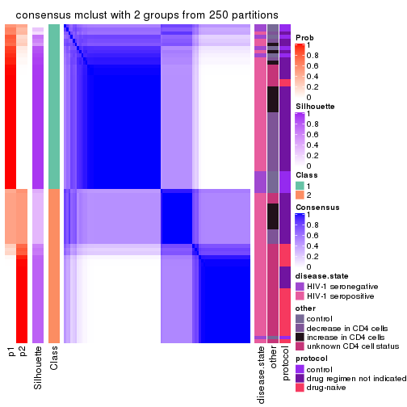</p>

</div>
<div id='tab-SD-mclust-consensus-heatmap-2'>
<pre><code class="r">consensus_heatmap(res, k = 3)
</code></pre>

<p>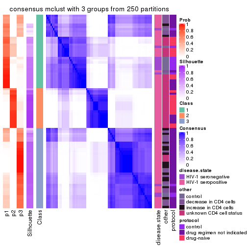</p>

</div>
<div id='tab-SD-mclust-consensus-heatmap-3'>
<pre><code class="r">consensus_heatmap(res, k = 4)
</code></pre>

<p>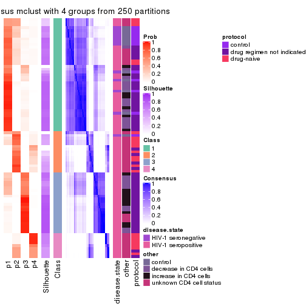</p>

</div>
<div id='tab-SD-mclust-consensus-heatmap-4'>
<pre><code class="r">consensus_heatmap(res, k = 5)
</code></pre>

<p>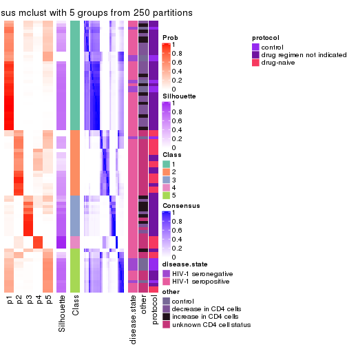</p>

</div>
<div id='tab-SD-mclust-consensus-heatmap-5'>
<pre><code class="r">consensus_heatmap(res, k = 6)
</code></pre>

<p>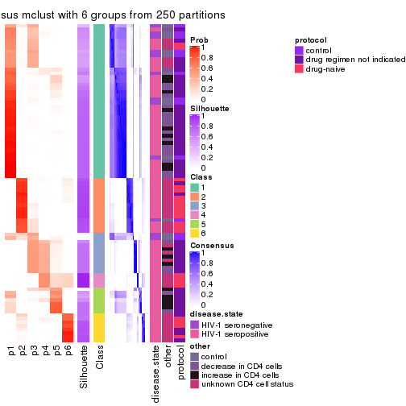</p>

</div>
</div>

Heatmaps for the membership of samples in all partitions to see how consistent they are:


<script>
$( function() {
	$( '#tabs-SD-mclust-membership-heatmap' ).tabs();
} );
</script>
<div id='tabs-SD-mclust-membership-heatmap'>
<ul>
<li><a href='#tab-SD-mclust-membership-heatmap-1'>k = 2</a></li>
<li><a href='#tab-SD-mclust-membership-heatmap-2'>k = 3</a></li>
<li><a href='#tab-SD-mclust-membership-heatmap-3'>k = 4</a></li>
<li><a href='#tab-SD-mclust-membership-heatmap-4'>k = 5</a></li>
<li><a href='#tab-SD-mclust-membership-heatmap-5'>k = 6</a></li>
</ul>
<div id='tab-SD-mclust-membership-heatmap-1'>
<pre><code class="r">membership_heatmap(res, k = 2)
</code></pre>

<p>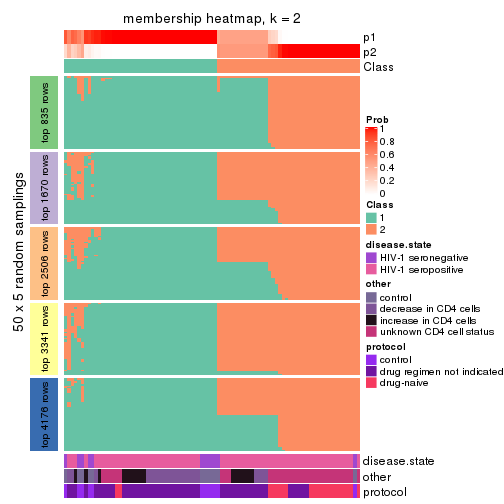</p>

</div>
<div id='tab-SD-mclust-membership-heatmap-2'>
<pre><code class="r">membership_heatmap(res, k = 3)
</code></pre>

<p>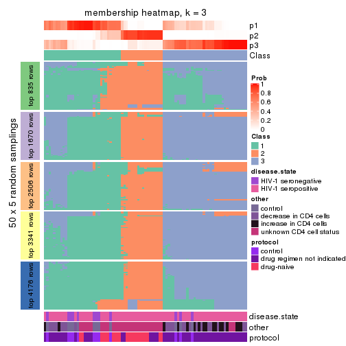</p>

</div>
<div id='tab-SD-mclust-membership-heatmap-3'>
<pre><code class="r">membership_heatmap(res, k = 4)
</code></pre>

<p>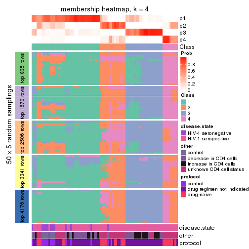</p>

</div>
<div id='tab-SD-mclust-membership-heatmap-4'>
<pre><code class="r">membership_heatmap(res, k = 5)
</code></pre>

<p>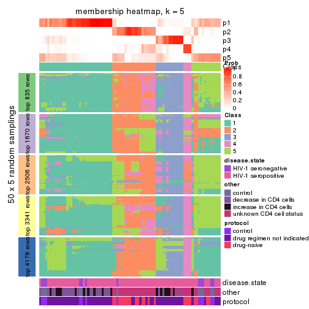</p>

</div>
<div id='tab-SD-mclust-membership-heatmap-5'>
<pre><code class="r">membership_heatmap(res, k = 6)
</code></pre>

<p>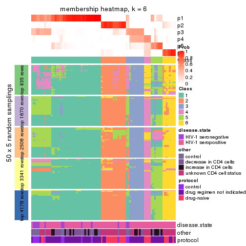</p>

</div>
</div>

As soon as we have had the classes for columns, we can look for signatures
which are significantly different between classes which can be candidate marks
for certain classes. Following are the heatmaps for signatures.


Signature heatmaps where rows are scaled:


<script>
$( function() {
	$( '#tabs-SD-mclust-get-signatures' ).tabs();
} );
</script>
<div id='tabs-SD-mclust-get-signatures'>
<ul>
<li><a href='#tab-SD-mclust-get-signatures-1'>k = 2</a></li>
<li><a href='#tab-SD-mclust-get-signatures-2'>k = 3</a></li>
<li><a href='#tab-SD-mclust-get-signatures-3'>k = 4</a></li>
<li><a href='#tab-SD-mclust-get-signatures-4'>k = 5</a></li>
<li><a href='#tab-SD-mclust-get-signatures-5'>k = 6</a></li>
</ul>
<div id='tab-SD-mclust-get-signatures-1'>
<pre><code class="r">get_signatures(res, k = 2)
</code></pre>

<p>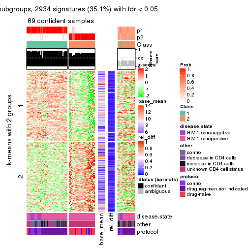</p>

</div>
<div id='tab-SD-mclust-get-signatures-2'>
<pre><code class="r">get_signatures(res, k = 3)
</code></pre>

<p>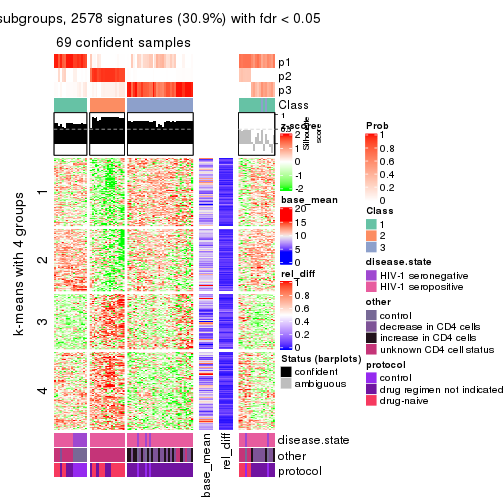</p>

</div>
<div id='tab-SD-mclust-get-signatures-3'>
<pre><code class="r">get_signatures(res, k = 4)
</code></pre>

<p>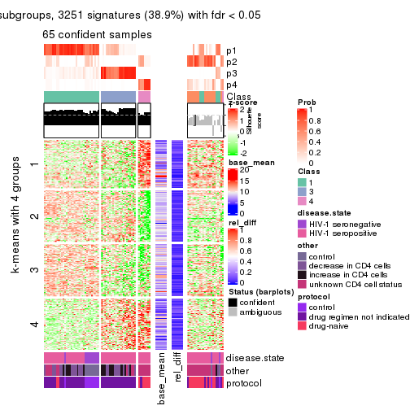</p>

</div>
<div id='tab-SD-mclust-get-signatures-4'>
<pre><code class="r">get_signatures(res, k = 5)
</code></pre>

<p>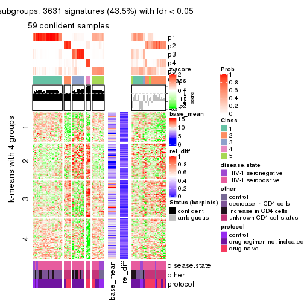</p>

</div>
<div id='tab-SD-mclust-get-signatures-5'>
<pre><code class="r">get_signatures(res, k = 6)
</code></pre>

<p>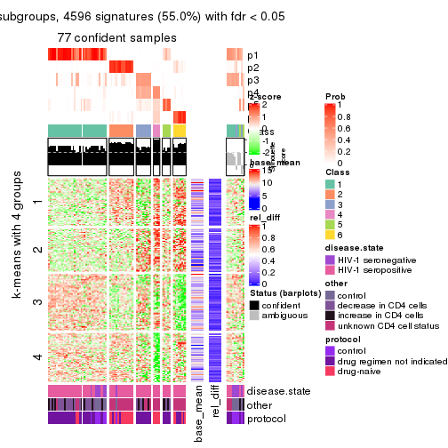</p>

</div>
</div>


Signature heatmaps where rows are not scaled:


<script>
$( function() {
	$( '#tabs-SD-mclust-get-signatures-no-scale' ).tabs();
} );
</script>
<div id='tabs-SD-mclust-get-signatures-no-scale'>
<ul>
<li><a href='#tab-SD-mclust-get-signatures-no-scale-1'>k = 2</a></li>
<li><a href='#tab-SD-mclust-get-signatures-no-scale-2'>k = 3</a></li>
<li><a href='#tab-SD-mclust-get-signatures-no-scale-3'>k = 4</a></li>
<li><a href='#tab-SD-mclust-get-signatures-no-scale-4'>k = 5</a></li>
<li><a href='#tab-SD-mclust-get-signatures-no-scale-5'>k = 6</a></li>
</ul>
<div id='tab-SD-mclust-get-signatures-no-scale-1'>
<pre><code class="r">get_signatures(res, k = 2, scale_rows = FALSE)
</code></pre>

<p>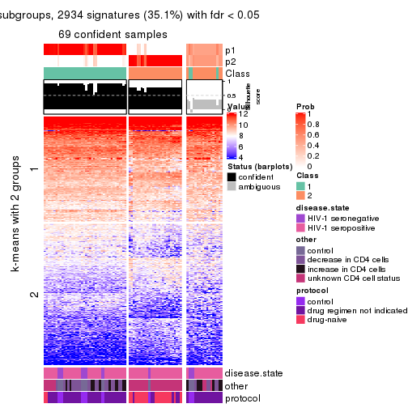</p>

</div>
<div id='tab-SD-mclust-get-signatures-no-scale-2'>
<pre><code class="r">get_signatures(res, k = 3, scale_rows = FALSE)
</code></pre>

<p>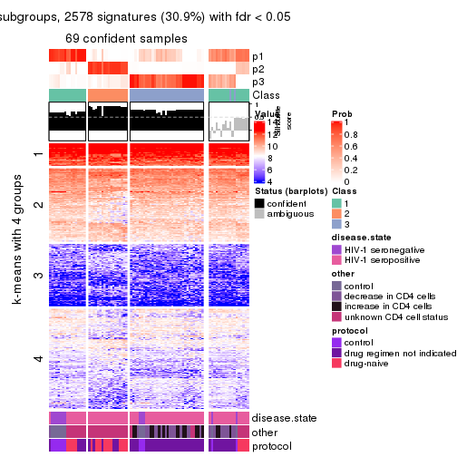</p>

</div>
<div id='tab-SD-mclust-get-signatures-no-scale-3'>
<pre><code class="r">get_signatures(res, k = 4, scale_rows = FALSE)
</code></pre>

<p>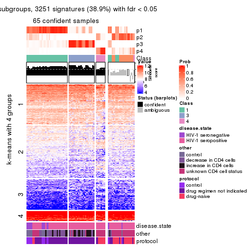</p>

</div>
<div id='tab-SD-mclust-get-signatures-no-scale-4'>
<pre><code class="r">get_signatures(res, k = 5, scale_rows = FALSE)
</code></pre>

<p>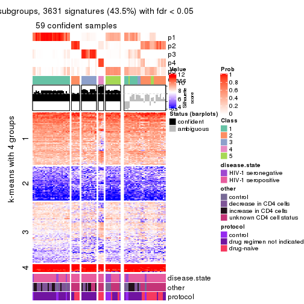</p>

</div>
<div id='tab-SD-mclust-get-signatures-no-scale-5'>
<pre><code class="r">get_signatures(res, k = 6, scale_rows = FALSE)
</code></pre>

<p>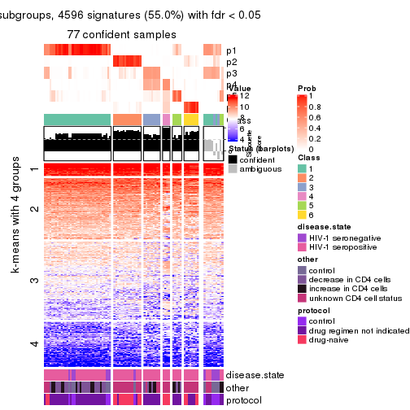</p>

</div>
</div>


Compare the overlap of signatures from different k:

```r
compare_signatures(res)
```

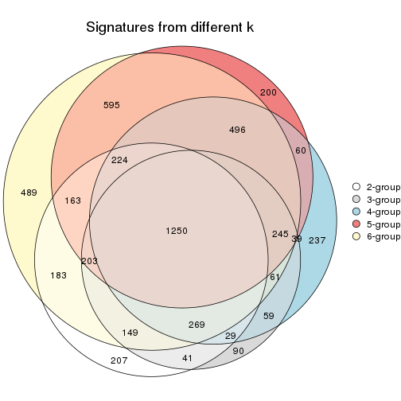

`get_signature()` returns a data frame invisibly. TO get the list of signatures, the function
call should be assigned to a variable explicitly. In following code, if `plot` argument is set
to `FALSE`, no heatmap is plotted while only the differential analysis is performed.

```r
# code only for demonstration
tb = get_signature(res, k = ..., plot = FALSE)
```

An example of the output of `tb` is:

```
#>   which_row         fdr    mean_1    mean_2 scaled_mean_1 scaled_mean_2 km
#> 1        38 0.042760348  8.373488  9.131774    -0.5533452     0.5164555  1
#> 2        40 0.018707592  7.106213  8.469186    -0.6173731     0.5762149  1
#> 3        55 0.019134737 10.221463 11.207825    -0.6159697     0.5749050  1
#> 4        59 0.006059896  5.921854  7.869574    -0.6899429     0.6439467  1
#> 5        60 0.018055526  8.928898 10.211722    -0.6204761     0.5791110  1
#> 6        98 0.009384629 15.714769 14.887706     0.6635654    -0.6193277  2
...
```

The columns in `tb` are:

1. `which_row`: row indices corresponding to the input matrix.
2. `fdr`: FDR for the differential test. 
3. `mean_x`: The mean value in group x.
4. `scaled_mean_x`: The mean value in group x after rows are scaled.
5. `km`: Row groups if k-means clustering is applied to rows.


UMAP plot which shows how samples are separated.


<script>
$( function() {
	$( '#tabs-SD-mclust-dimension-reduction' ).tabs();
} );
</script>
<div id='tabs-SD-mclust-dimension-reduction'>
<ul>
<li><a href='#tab-SD-mclust-dimension-reduction-1'>k = 2</a></li>
<li><a href='#tab-SD-mclust-dimension-reduction-2'>k = 3</a></li>
<li><a href='#tab-SD-mclust-dimension-reduction-3'>k = 4</a></li>
<li><a href='#tab-SD-mclust-dimension-reduction-4'>k = 5</a></li>
<li><a href='#tab-SD-mclust-dimension-reduction-5'>k = 6</a></li>
</ul>
<div id='tab-SD-mclust-dimension-reduction-1'>
<pre><code class="r">dimension_reduction(res, k = 2, method = &quot;UMAP&quot;)
</code></pre>

<p>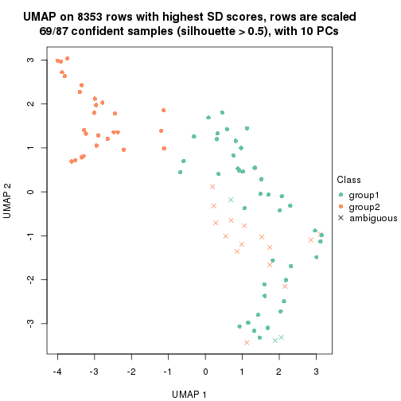</p>

</div>
<div id='tab-SD-mclust-dimension-reduction-2'>
<pre><code class="r">dimension_reduction(res, k = 3, method = &quot;UMAP&quot;)
</code></pre>

<p>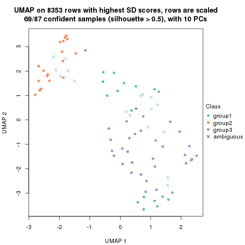</p>

</div>
<div id='tab-SD-mclust-dimension-reduction-3'>
<pre><code class="r">dimension_reduction(res, k = 4, method = &quot;UMAP&quot;)
</code></pre>

<p>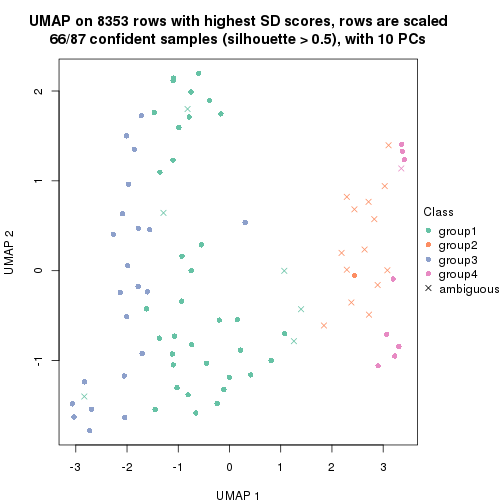</p>

</div>
<div id='tab-SD-mclust-dimension-reduction-4'>
<pre><code class="r">dimension_reduction(res, k = 5, method = &quot;UMAP&quot;)
</code></pre>

<p>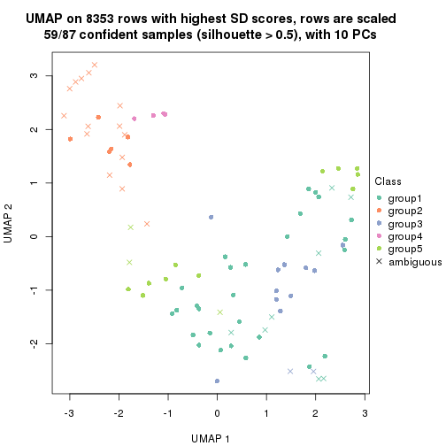</p>

</div>
<div id='tab-SD-mclust-dimension-reduction-5'>
<pre><code class="r">dimension_reduction(res, k = 6, method = &quot;UMAP&quot;)
</code></pre>

<p>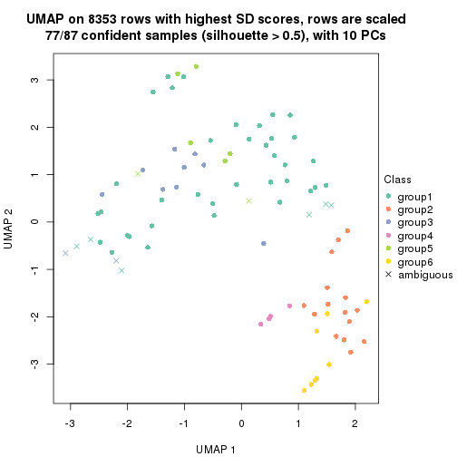</p>

</div>
</div>


Following heatmap shows how subgroups are split when increasing `k`:

```r
collect_classes(res)
```

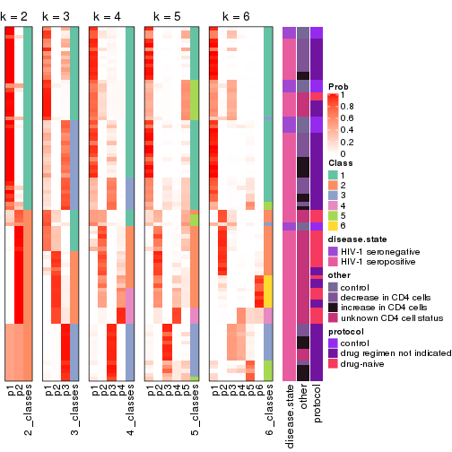


Test correlation between subgroups and known annotations. If the known
annotation is numeric, one-way ANOVA test is applied, and if the known
annotation is discrete, chi-squared contingency table test is applied.

```r
test_to_known_factors(res)
```

```
#>            n disease.state(p) other(p) protocol(p) k
#> SD:mclust 69          0.13866 1.02e-09    1.23e-08 2
#> SD:mclust 69          0.00106 2.98e-11    9.01e-09 3
#> SD:mclust 66          0.01518 8.78e-06    2.01e-08 4
#> SD:mclust 59          0.02108 1.40e-07    5.06e-08 5
#> SD:mclust 77          0.39118 2.39e-07    1.94e-07 6
```


If matrix rows can be associated to genes, consider to use `GO_Enrichment(res,
...)` to perform function enrichment for the signature genes.


 

---------------------------------------------------


### SD:NMF


The object with results only for a single top-value method and a single partition method 
can be extracted as:

```r
res = res_list["SD", "NMF"]
# you can also extract it by
# res = res_list["SD:NMF"]
```

A summary of `res` and all the functions that can be applied to it:

```r
res
```

```
#> A 'ConsensusPartition' object with k = 2, 3, 4, 5, 6.
#>   On a matrix with 8353 rows and 87 columns.
#>   Top rows (835, 1670, 2506, 3341, 4176) are extracted by 'SD' method.
#>   Subgroups are detected by 'NMF' method.
#>   Performed in total 1250 partitions by row resampling.
#>   Best k for subgroups seems to be 2.
#> 
#> Following methods can be applied to this 'ConsensusPartition' object:
#>  [1] "cola_report"             "collect_classes"         "collect_plots"          
#>  [4] "collect_stats"           "colnames"                "compare_signatures"     
#>  [7] "consensus_heatmap"       "dimension_reduction"     "functional_enrichment"  
#> [10] "get_anno_col"            "get_anno"                "get_classes"            
#> [13] "get_consensus"           "get_matrix"              "get_membership"         
#> [16] "get_param"               "get_signatures"          "get_stats"              
#> [19] "is_best_k"               "is_stable_k"             "membership_heatmap"     
#> [22] "ncol"                    "nrow"                    "plot_ecdf"              
#> [25] "rownames"                "select_partition_number" "show"                   
#> [28] "suggest_best_k"          "test_to_known_factors"
```

`collect_plots()` function collects all the plots made from `res` for all `k` (number of partitions)
into one single page to provide an easy and fast comparison between different `k`.

```r
collect_plots(res)
```

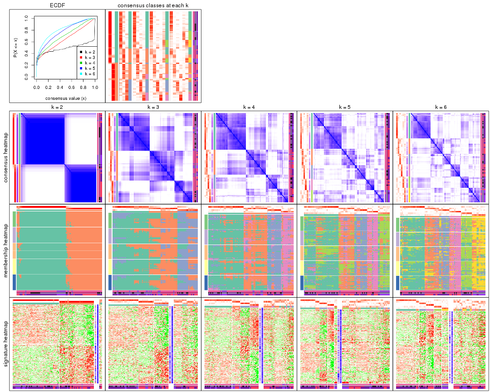

The plots are:

- The first row: a plot of the ECDF (Empirical cumulative distribution
  function) curves of the consensus matrix for each `k` and the heatmap of
  predicted classes for each `k`.
- The second row: heatmaps of the consensus matrix for each `k`.
- The third row: heatmaps of the membership matrix for each `k`.
- The fouth row: heatmaps of the signatures for each `k`.

All the plots in panels can be made by individual functions and they are
plotted later in this section.

`select_partition_number()` produces several plots showing different
statistics for choosing "optimized" `k`. There are following statistics:

- ECDF curves of the consensus matrix for each `k`;
- 1-PAC. [The PAC
  score](https://en.wikipedia.org/wiki/Consensus_clustering#Over-interpretation_potential_of_consensus_clustering)
  measures the proportion of the ambiguous subgrouping.
- Mean silhouette score.
- Concordance. The mean probability of fiting the consensus class ids in all
  partitions.
- Area increased. Denote $A_k$ as the area under the ECDF curve for current
  `k`, the area increased is defined as $A_k - A_{k-1}$.
- Rand index. The percent of pairs of samples that are both in a same cluster
  or both are not in a same cluster in the partition of k and k-1.
- Jaccard index. The ratio of pairs of samples are both in a same cluster in
  the partition of k and k-1 and the pairs of samples are both in a same
  cluster in the partition k or k-1.

The detailed explanations of these statistics can be found in [the cola
vignette](http://bioconductor.org/packages/devel/bioc/vignettes/cola/inst/doc/cola.html#toc_13).

Generally speaking, lower PAC score, higher mean silhouette score or higher
concordance corresponds to better partition. Rand index and Jaccard index
measure how similar the current partition is compared to partition with `k-1`.
If they are too similar, we won't accept `k` is better than `k-1`.

```r
select_partition_number(res)
```

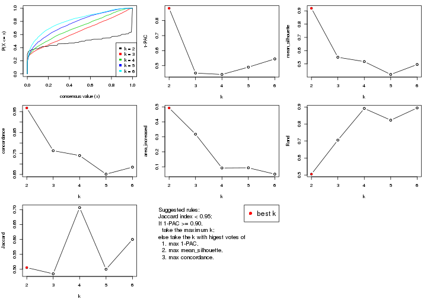

The numeric values for all these statistics can be obtained by `get_stats()`.

```r
get_stats(res)
```

```
#>   k 1-PAC mean_silhouette concordance area_increased  Rand Jaccard
#> 2 2 0.882           0.919       0.967         0.4929 0.505   0.505
#> 3 3 0.451           0.550       0.763         0.3178 0.706   0.485
#> 4 4 0.441           0.517       0.740         0.0920 0.892   0.707
#> 5 5 0.490           0.420       0.651         0.0932 0.823   0.500
#> 6 6 0.545           0.495       0.685         0.0511 0.895   0.600
```

`suggest_best_k()` suggests the best $k$ based on these statistics. The rules are as follows:

- All $k$ with Jaccard index larger than 0.95 are removed because the increase of
  the partition number does not provides enough extra information. If all $k$ are removed,
  the best $k$ is assigned by `NA`.
- For $k$ with 1-PAC larger than 0.9, the maximal $k$ is taken as the "best k". Other $k$ is called "optional k".
- If it does not fit the second rule. The $k$ with the highest vote of highest
  1-PAC, mean silhouette and concordance is taken as the "best k".

```r
suggest_best_k(res)
```

```
#> [1] 2
```


Following shows the table of the partitions (You need to click the **show/hide
code output** link to see it). The membership matrix (columns with name `p*`)
is inferred by
[`clue::cl_consensus()`](https://www.rdocumentation.org/link/cl_consensus?package=clue)
function with the `SE` method. Basically the value in the membership matrix
represents the probability to belong to a certain group. The finall class
label for an item is determined with the group with highest probability it
belongs to.

In `get_classes()` function, the entropy is calculated from the membership
matrix and the silhouette score is calculated from the consensus matrix.


<script>
$( function() {
	$( '#tabs-SD-NMF-get-classes' ).tabs();
} );
</script>
<div id='tabs-SD-NMF-get-classes'>
<ul>
<li><a href='#tab-SD-NMF-get-classes-1'>k = 2</a></li>
<li><a href='#tab-SD-NMF-get-classes-2'>k = 3</a></li>
<li><a href='#tab-SD-NMF-get-classes-3'>k = 4</a></li>
<li><a href='#tab-SD-NMF-get-classes-4'>k = 5</a></li>
<li><a href='#tab-SD-NMF-get-classes-5'>k = 6</a></li>
</ul>

<div id='tab-SD-NMF-get-classes-1'>
<p><a id='tab-SD-NMF-get-classes-1-a' style='color:#0366d6' href='#'>show/hide code output</a></p>
<pre><code class="r">cbind(get_classes(res, k = 2), get_membership(res, k = 2))
</code></pre>

<pre><code>#&gt;          class entropy silhouette    p1    p2
#&gt; GSM39104     1  0.0000     0.9698 1.000 0.000
#&gt; GSM39105     1  0.0000     0.9698 1.000 0.000
#&gt; GSM39106     1  0.0000     0.9698 1.000 0.000
#&gt; GSM39107     1  0.0000     0.9698 1.000 0.000
#&gt; GSM39108     1  0.0000     0.9698 1.000 0.000
#&gt; GSM39109     2  0.8608     0.6146 0.284 0.716
#&gt; GSM39110     1  0.0000     0.9698 1.000 0.000
#&gt; GSM39111     1  0.0000     0.9698 1.000 0.000
#&gt; GSM39112     1  0.0000     0.9698 1.000 0.000
#&gt; GSM39113     1  0.0376     0.9669 0.996 0.004
#&gt; GSM39114     2  0.2236     0.9323 0.036 0.964
#&gt; GSM39115     1  0.0000     0.9698 1.000 0.000
#&gt; GSM39148     1  0.0000     0.9698 1.000 0.000
#&gt; GSM39149     2  0.0000     0.9586 0.000 1.000
#&gt; GSM39150     1  0.0000     0.9698 1.000 0.000
#&gt; GSM39151     2  0.0938     0.9506 0.012 0.988
#&gt; GSM39152     1  0.7056     0.7520 0.808 0.192
#&gt; GSM39153     1  0.0000     0.9698 1.000 0.000
#&gt; GSM39154     1  0.0000     0.9698 1.000 0.000
#&gt; GSM39155     1  0.0000     0.9698 1.000 0.000
#&gt; GSM39156     1  0.0000     0.9698 1.000 0.000
#&gt; GSM39157     1  0.0000     0.9698 1.000 0.000
#&gt; GSM39158     1  0.0000     0.9698 1.000 0.000
#&gt; GSM39159     1  0.2043     0.9422 0.968 0.032
#&gt; GSM39160     1  0.0000     0.9698 1.000 0.000
#&gt; GSM39161     1  0.4939     0.8624 0.892 0.108
#&gt; GSM39162     1  0.0000     0.9698 1.000 0.000
#&gt; GSM39163     1  0.0000     0.9698 1.000 0.000
#&gt; GSM39164     1  0.0000     0.9698 1.000 0.000
#&gt; GSM39165     1  0.0376     0.9668 0.996 0.004
#&gt; GSM39166     1  0.0000     0.9698 1.000 0.000
#&gt; GSM39167     1  0.0000     0.9698 1.000 0.000
#&gt; GSM39168     1  0.0000     0.9698 1.000 0.000
#&gt; GSM39169     1  0.0000     0.9698 1.000 0.000
#&gt; GSM39170     1  0.0000     0.9698 1.000 0.000
#&gt; GSM39171     1  0.0000     0.9698 1.000 0.000
#&gt; GSM39172     2  0.0000     0.9586 0.000 1.000
#&gt; GSM39173     2  0.0000     0.9586 0.000 1.000
#&gt; GSM39174     1  0.0000     0.9698 1.000 0.000
#&gt; GSM39175     1  0.0000     0.9698 1.000 0.000
#&gt; GSM39176     1  0.0000     0.9698 1.000 0.000
#&gt; GSM39177     2  0.9996     0.0498 0.488 0.512
#&gt; GSM39178     1  0.0000     0.9698 1.000 0.000
#&gt; GSM39179     2  0.0000     0.9586 0.000 1.000
#&gt; GSM39180     2  0.0000     0.9586 0.000 1.000
#&gt; GSM39181     1  0.0000     0.9698 1.000 0.000
#&gt; GSM39182     2  0.5294     0.8542 0.120 0.880
#&gt; GSM39183     1  0.0000     0.9698 1.000 0.000
#&gt; GSM39184     1  0.0000     0.9698 1.000 0.000
#&gt; GSM39185     2  0.8661     0.6034 0.288 0.712
#&gt; GSM39186     1  0.0000     0.9698 1.000 0.000
#&gt; GSM39187     1  0.0000     0.9698 1.000 0.000
#&gt; GSM39116     2  0.0000     0.9586 0.000 1.000
#&gt; GSM39117     2  0.0000     0.9586 0.000 1.000
#&gt; GSM39118     2  0.0000     0.9586 0.000 1.000
#&gt; GSM39119     2  0.0000     0.9586 0.000 1.000
#&gt; GSM39120     1  0.0376     0.9669 0.996 0.004
#&gt; GSM39121     1  0.7453     0.7185 0.788 0.212
#&gt; GSM39122     1  0.9608     0.3607 0.616 0.384
#&gt; GSM39123     2  0.0000     0.9586 0.000 1.000
#&gt; GSM39124     2  0.0376     0.9561 0.004 0.996
#&gt; GSM39125     1  0.0376     0.9669 0.996 0.004
#&gt; GSM39126     1  0.9933     0.1504 0.548 0.452
#&gt; GSM39127     2  0.0000     0.9586 0.000 1.000
#&gt; GSM39128     2  0.0000     0.9586 0.000 1.000
#&gt; GSM39129     2  0.0000     0.9586 0.000 1.000
#&gt; GSM39130     2  0.0000     0.9586 0.000 1.000
#&gt; GSM39131     2  0.0000     0.9586 0.000 1.000
#&gt; GSM39132     2  0.0000     0.9586 0.000 1.000
#&gt; GSM39133     2  0.0000     0.9586 0.000 1.000
#&gt; GSM39134     2  0.0000     0.9586 0.000 1.000
#&gt; GSM39135     2  0.0000     0.9586 0.000 1.000
#&gt; GSM39136     2  0.0000     0.9586 0.000 1.000
#&gt; GSM39137     2  0.5737     0.8329 0.136 0.864
#&gt; GSM39138     2  0.0000     0.9586 0.000 1.000
#&gt; GSM39139     2  0.0000     0.9586 0.000 1.000
#&gt; GSM39140     1  0.0000     0.9698 1.000 0.000
#&gt; GSM39141     1  0.0000     0.9698 1.000 0.000
#&gt; GSM39142     1  0.0000     0.9698 1.000 0.000
#&gt; GSM39143     1  0.0000     0.9698 1.000 0.000
#&gt; GSM39144     2  0.0000     0.9586 0.000 1.000
#&gt; GSM39145     2  0.0000     0.9586 0.000 1.000
#&gt; GSM39146     2  0.0000     0.9586 0.000 1.000
#&gt; GSM39147     2  0.0000     0.9586 0.000 1.000
#&gt; GSM39188     2  0.0000     0.9586 0.000 1.000
#&gt; GSM39189     2  0.3431     0.9097 0.064 0.936
#&gt; GSM39190     2  0.0000     0.9586 0.000 1.000
</code></pre>

<script>
$('#tab-SD-NMF-get-classes-1-a').parent().next().next().hide();
$('#tab-SD-NMF-get-classes-1-a').click(function(){
  $('#tab-SD-NMF-get-classes-1-a').parent().next().next().toggle();
  return(false);
});
</script>
</div>

<div id='tab-SD-NMF-get-classes-2'>
<p><a id='tab-SD-NMF-get-classes-2-a' style='color:#0366d6' href='#'>show/hide code output</a></p>
<pre><code class="r">cbind(get_classes(res, k = 3), get_membership(res, k = 3))
</code></pre>

<pre><code>#&gt;          class entropy silhouette    p1    p2    p3
#&gt; GSM39104     1   0.271     0.7419 0.912 0.088 0.000
#&gt; GSM39105     1   0.533     0.6640 0.728 0.272 0.000
#&gt; GSM39106     2   0.613     0.1774 0.400 0.600 0.000
#&gt; GSM39107     2   0.388     0.6345 0.152 0.848 0.000
#&gt; GSM39108     1   0.619     0.4094 0.580 0.420 0.000
#&gt; GSM39109     2   0.818     0.5532 0.208 0.640 0.152
#&gt; GSM39110     1   0.610     0.4728 0.608 0.392 0.000
#&gt; GSM39111     1   0.206     0.7308 0.948 0.044 0.008
#&gt; GSM39112     2   0.440     0.6025 0.188 0.812 0.000
#&gt; GSM39113     2   0.355     0.6493 0.132 0.868 0.000
#&gt; GSM39114     2   0.153     0.6805 0.040 0.960 0.000
#&gt; GSM39115     1   0.536     0.6591 0.724 0.276 0.000
#&gt; GSM39148     1   0.595     0.5350 0.640 0.360 0.000
#&gt; GSM39149     3   0.588     0.5603 0.348 0.000 0.652
#&gt; GSM39150     1   0.254     0.6551 0.920 0.000 0.080
#&gt; GSM39151     3   0.550     0.6194 0.292 0.000 0.708
#&gt; GSM39152     1   0.588     0.1589 0.652 0.000 0.348
#&gt; GSM39153     1   0.327     0.7448 0.884 0.116 0.000
#&gt; GSM39154     1   0.312     0.7448 0.892 0.108 0.000
#&gt; GSM39155     1   0.394     0.7382 0.844 0.156 0.000
#&gt; GSM39156     2   0.617     0.1377 0.412 0.588 0.000
#&gt; GSM39157     1   0.543     0.6490 0.716 0.284 0.000
#&gt; GSM39158     1   0.312     0.7446 0.892 0.108 0.000
#&gt; GSM39159     1   0.445     0.5065 0.808 0.000 0.192
#&gt; GSM39160     1   0.288     0.6380 0.904 0.000 0.096
#&gt; GSM39161     1   0.619    -0.0736 0.580 0.000 0.420
#&gt; GSM39162     1   0.625     0.3443 0.556 0.444 0.000
#&gt; GSM39163     1   0.445     0.7239 0.808 0.192 0.000
#&gt; GSM39164     1   0.514     0.6818 0.748 0.252 0.000
#&gt; GSM39165     1   0.319     0.6204 0.888 0.000 0.112
#&gt; GSM39166     1   0.216     0.6699 0.936 0.000 0.064
#&gt; GSM39167     1   0.510     0.6855 0.752 0.248 0.000
#&gt; GSM39168     1   0.601     0.5122 0.628 0.372 0.000
#&gt; GSM39169     1   0.455     0.7199 0.800 0.200 0.000
#&gt; GSM39170     1   0.382     0.7405 0.852 0.148 0.000
#&gt; GSM39171     1   0.175     0.6837 0.952 0.000 0.048
#&gt; GSM39172     3   0.559     0.6095 0.304 0.000 0.696
#&gt; GSM39173     3   0.369     0.6694 0.140 0.000 0.860
#&gt; GSM39174     1   0.460     0.7174 0.796 0.204 0.000
#&gt; GSM39175     1   0.103     0.7005 0.976 0.000 0.024
#&gt; GSM39176     1   0.489     0.7017 0.772 0.228 0.000
#&gt; GSM39177     1   0.620    -0.0864 0.576 0.000 0.424
#&gt; GSM39178     1   0.424     0.5321 0.824 0.000 0.176
#&gt; GSM39179     3   0.550     0.6199 0.292 0.000 0.708
#&gt; GSM39180     3   0.259     0.6621 0.072 0.004 0.924
#&gt; GSM39181     1   0.164     0.6866 0.956 0.000 0.044
#&gt; GSM39182     3   0.595     0.5431 0.360 0.000 0.640
#&gt; GSM39183     1   0.236     0.6634 0.928 0.000 0.072
#&gt; GSM39184     1   0.348     0.7435 0.872 0.128 0.000
#&gt; GSM39185     3   0.629     0.3498 0.464 0.000 0.536
#&gt; GSM39186     1   0.382     0.7404 0.852 0.148 0.000
#&gt; GSM39187     1   0.565     0.6126 0.688 0.312 0.000
#&gt; GSM39116     2   0.593     0.3302 0.000 0.644 0.356
#&gt; GSM39117     3   0.334     0.6234 0.000 0.120 0.880
#&gt; GSM39118     3   0.620     0.2045 0.000 0.424 0.576
#&gt; GSM39119     3   0.429     0.5923 0.000 0.180 0.820
#&gt; GSM39120     2   0.455     0.5901 0.200 0.800 0.000
#&gt; GSM39121     2   0.288     0.6701 0.096 0.904 0.000
#&gt; GSM39122     2   0.271     0.6734 0.088 0.912 0.000
#&gt; GSM39123     3   0.355     0.6196 0.000 0.132 0.868
#&gt; GSM39124     2   0.240     0.6433 0.004 0.932 0.064
#&gt; GSM39125     2   0.502     0.5391 0.240 0.760 0.000
#&gt; GSM39126     2   0.280     0.6720 0.092 0.908 0.000
#&gt; GSM39127     2   0.382     0.5853 0.000 0.852 0.148
#&gt; GSM39128     2   0.295     0.6306 0.004 0.908 0.088
#&gt; GSM39129     3   0.506     0.5392 0.000 0.244 0.756
#&gt; GSM39130     3   0.355     0.6196 0.000 0.132 0.868
#&gt; GSM39131     2   0.341     0.6043 0.000 0.876 0.124
#&gt; GSM39132     2   0.497     0.4979 0.000 0.764 0.236
#&gt; GSM39133     3   0.540     0.4919 0.000 0.280 0.720
#&gt; GSM39134     3   0.556     0.4692 0.000 0.300 0.700
#&gt; GSM39135     2   0.581     0.3628 0.000 0.664 0.336
#&gt; GSM39136     2   0.597     0.3146 0.000 0.636 0.364
#&gt; GSM39137     2   0.257     0.6691 0.032 0.936 0.032
#&gt; GSM39138     3   0.470     0.5686 0.000 0.212 0.788
#&gt; GSM39139     2   0.628     0.0793 0.000 0.540 0.460
#&gt; GSM39140     2   0.533     0.4895 0.272 0.728 0.000
#&gt; GSM39141     2   0.536     0.4827 0.276 0.724 0.000
#&gt; GSM39142     2   0.603     0.2536 0.376 0.624 0.000
#&gt; GSM39143     2   0.581     0.3578 0.336 0.664 0.000
#&gt; GSM39144     3   0.559     0.4616 0.000 0.304 0.696
#&gt; GSM39145     2   0.604     0.2838 0.000 0.620 0.380
#&gt; GSM39146     2   0.502     0.4944 0.000 0.760 0.240
#&gt; GSM39147     2   0.455     0.5363 0.000 0.800 0.200
#&gt; GSM39188     3   0.533     0.6325 0.272 0.000 0.728
#&gt; GSM39189     3   0.618     0.4526 0.416 0.000 0.584
#&gt; GSM39190     3   0.525     0.6367 0.264 0.000 0.736
</code></pre>

<script>
$('#tab-SD-NMF-get-classes-2-a').parent().next().next().hide();
$('#tab-SD-NMF-get-classes-2-a').click(function(){
  $('#tab-SD-NMF-get-classes-2-a').parent().next().next().toggle();
  return(false);
});
</script>
</div>

<div id='tab-SD-NMF-get-classes-3'>
<p><a id='tab-SD-NMF-get-classes-3-a' style='color:#0366d6' href='#'>show/hide code output</a></p>
<pre><code class="r">cbind(get_classes(res, k = 4), get_membership(res, k = 4))
</code></pre>

<pre><code>#&gt;          class entropy silhouette    p1    p2    p3    p4
#&gt; GSM39104     1   0.404     0.7508 0.852 0.036 0.088 0.024
#&gt; GSM39105     1   0.527     0.6488 0.740 0.212 0.028 0.020
#&gt; GSM39106     2   0.609     0.3549 0.348 0.604 0.012 0.036
#&gt; GSM39107     2   0.673     0.5531 0.216 0.636 0.008 0.140
#&gt; GSM39108     1   0.685     0.1869 0.500 0.428 0.036 0.036
#&gt; GSM39109     4   0.814     0.0205 0.212 0.284 0.024 0.480
#&gt; GSM39110     1   0.686     0.2137 0.496 0.428 0.056 0.020
#&gt; GSM39111     1   0.615     0.6799 0.700 0.072 0.204 0.024
#&gt; GSM39112     2   0.523     0.5864 0.244 0.716 0.004 0.036
#&gt; GSM39113     2   0.476     0.5869 0.160 0.784 0.004 0.052
#&gt; GSM39114     2   0.249     0.5018 0.028 0.920 0.004 0.048
#&gt; GSM39115     1   0.447     0.7084 0.820 0.116 0.012 0.052
#&gt; GSM39148     1   0.476     0.5502 0.724 0.260 0.004 0.012
#&gt; GSM39149     3   0.251     0.7197 0.064 0.008 0.916 0.012
#&gt; GSM39150     1   0.476     0.6504 0.764 0.000 0.192 0.044
#&gt; GSM39151     3   0.273     0.7214 0.088 0.000 0.896 0.016
#&gt; GSM39152     3   0.488     0.5699 0.272 0.000 0.708 0.020
#&gt; GSM39153     1   0.212     0.7649 0.936 0.032 0.028 0.004
#&gt; GSM39154     1   0.232     0.7648 0.928 0.032 0.036 0.004
#&gt; GSM39155     1   0.248     0.7623 0.916 0.052 0.032 0.000
#&gt; GSM39156     2   0.558     0.1461 0.468 0.516 0.008 0.008
#&gt; GSM39157     1   0.421     0.6673 0.804 0.172 0.008 0.016
#&gt; GSM39158     1   0.252     0.7520 0.920 0.012 0.016 0.052
#&gt; GSM39159     1   0.499     0.5925 0.744 0.000 0.208 0.048
#&gt; GSM39160     1   0.499     0.6222 0.740 0.000 0.216 0.044
#&gt; GSM39161     1   0.635     0.4135 0.636 0.000 0.252 0.112
#&gt; GSM39162     1   0.516     0.3421 0.624 0.364 0.000 0.012
#&gt; GSM39163     1   0.230     0.7522 0.924 0.060 0.008 0.008
#&gt; GSM39164     1   0.352     0.7165 0.848 0.136 0.008 0.008
#&gt; GSM39165     1   0.511     0.4841 0.648 0.004 0.340 0.008
#&gt; GSM39166     1   0.360     0.7177 0.860 0.000 0.084 0.056
#&gt; GSM39167     1   0.362     0.7139 0.856 0.116 0.012 0.016
#&gt; GSM39168     1   0.509     0.4733 0.672 0.312 0.004 0.012
#&gt; GSM39169     1   0.330     0.7511 0.876 0.092 0.028 0.004
#&gt; GSM39170     1   0.184     0.7593 0.948 0.016 0.008 0.028
#&gt; GSM39171     1   0.420     0.6704 0.788 0.004 0.196 0.012
#&gt; GSM39172     3   0.763     0.4023 0.320 0.000 0.456 0.224
#&gt; GSM39173     3   0.246     0.6883 0.028 0.040 0.924 0.008
#&gt; GSM39174     1   0.339     0.7452 0.868 0.104 0.024 0.004
#&gt; GSM39175     1   0.327     0.7241 0.860 0.004 0.128 0.008
#&gt; GSM39176     1   0.343     0.7254 0.868 0.104 0.008 0.020
#&gt; GSM39177     3   0.371     0.6664 0.192 0.000 0.804 0.004
#&gt; GSM39178     1   0.568     0.5232 0.680 0.000 0.256 0.064
#&gt; GSM39179     3   0.185     0.7193 0.048 0.000 0.940 0.012
#&gt; GSM39180     3   0.423     0.6320 0.036 0.004 0.816 0.144
#&gt; GSM39181     1   0.395     0.7081 0.828 0.000 0.036 0.136
#&gt; GSM39182     4   0.513     0.3939 0.184 0.000 0.068 0.748
#&gt; GSM39183     1   0.402     0.7096 0.836 0.000 0.068 0.096
#&gt; GSM39184     1   0.184     0.7646 0.948 0.028 0.016 0.008
#&gt; GSM39185     1   0.706     0.1777 0.540 0.000 0.312 0.148
#&gt; GSM39186     1   0.334     0.7616 0.884 0.052 0.056 0.008
#&gt; GSM39187     1   0.403     0.6835 0.824 0.148 0.008 0.020
#&gt; GSM39116     4   0.532     0.6144 0.000 0.312 0.028 0.660
#&gt; GSM39117     4   0.343     0.6426 0.000 0.028 0.112 0.860
#&gt; GSM39118     4   0.780     0.4800 0.000 0.340 0.256 0.404
#&gt; GSM39119     4   0.677     0.5119 0.000 0.128 0.292 0.580
#&gt; GSM39120     2   0.487     0.5874 0.244 0.728 0.000 0.028
#&gt; GSM39121     2   0.327     0.5842 0.132 0.856 0.000 0.012
#&gt; GSM39122     2   0.322     0.5768 0.112 0.868 0.000 0.020
#&gt; GSM39123     4   0.277     0.6532 0.008 0.024 0.060 0.908
#&gt; GSM39124     2   0.375     0.3757 0.012 0.836 0.008 0.144
#&gt; GSM39125     2   0.787     0.3511 0.364 0.428 0.008 0.200
#&gt; GSM39126     2   0.359     0.5714 0.104 0.860 0.004 0.032
#&gt; GSM39127     2   0.532    -0.1914 0.012 0.572 0.000 0.416
#&gt; GSM39128     2   0.468     0.2937 0.020 0.764 0.008 0.208
#&gt; GSM39129     3   0.659     0.2612 0.000 0.212 0.628 0.160
#&gt; GSM39130     4   0.294     0.6579 0.000 0.032 0.076 0.892
#&gt; GSM39131     2   0.484     0.2648 0.016 0.748 0.012 0.224
#&gt; GSM39132     2   0.590    -0.2670 0.000 0.564 0.040 0.396
#&gt; GSM39133     4   0.302     0.6759 0.004 0.060 0.040 0.896
#&gt; GSM39134     4   0.756     0.4733 0.000 0.220 0.304 0.476
#&gt; GSM39135     4   0.575     0.5195 0.000 0.396 0.032 0.572
#&gt; GSM39136     4   0.422     0.6787 0.000 0.184 0.024 0.792
#&gt; GSM39137     2   0.264     0.4953 0.032 0.908 0.000 0.060
#&gt; GSM39138     3   0.668     0.2176 0.000 0.156 0.616 0.228
#&gt; GSM39139     2   0.712    -0.2539 0.000 0.440 0.432 0.128
#&gt; GSM39140     2   0.494     0.4934 0.316 0.672 0.000 0.012
#&gt; GSM39141     2   0.539     0.4476 0.344 0.632 0.000 0.024
#&gt; GSM39142     2   0.578     0.1483 0.468 0.504 0.000 0.028
#&gt; GSM39143     2   0.570     0.3209 0.412 0.560 0.000 0.028
#&gt; GSM39144     3   0.654     0.2484 0.000 0.252 0.620 0.128
#&gt; GSM39145     2   0.698    -0.1579 0.000 0.536 0.332 0.132
#&gt; GSM39146     4   0.521     0.5768 0.004 0.336 0.012 0.648
#&gt; GSM39147     2   0.471     0.2591 0.000 0.792 0.088 0.120
#&gt; GSM39188     3   0.318     0.7178 0.084 0.000 0.880 0.036
#&gt; GSM39189     3   0.531     0.5672 0.280 0.000 0.684 0.036
#&gt; GSM39190     3   0.234     0.7216 0.060 0.000 0.920 0.020
</code></pre>

<script>
$('#tab-SD-NMF-get-classes-3-a').parent().next().next().hide();
$('#tab-SD-NMF-get-classes-3-a').click(function(){
  $('#tab-SD-NMF-get-classes-3-a').parent().next().next().toggle();
  return(false);
});
</script>
</div>

<div id='tab-SD-NMF-get-classes-4'>
<p><a id='tab-SD-NMF-get-classes-4-a' style='color:#0366d6' href='#'>show/hide code output</a></p>
<pre><code class="r">cbind(get_classes(res, k = 5), get_membership(res, k = 5))
</code></pre>

<pre><code>#&gt;          class entropy silhouette    p1    p2    p3    p4    p5
#&gt; GSM39104     5   0.546     0.4944 0.232 0.004 0.108 0.000 0.656
#&gt; GSM39105     5   0.497     0.4548 0.300 0.044 0.004 0.000 0.652
#&gt; GSM39106     5   0.542     0.5348 0.136 0.160 0.012 0.000 0.692
#&gt; GSM39107     5   0.739     0.0638 0.088 0.344 0.000 0.116 0.452
#&gt; GSM39108     5   0.553     0.5601 0.216 0.076 0.028 0.000 0.680
#&gt; GSM39109     5   0.745     0.3810 0.068 0.076 0.064 0.212 0.580
#&gt; GSM39110     5   0.649     0.5650 0.200 0.092 0.084 0.000 0.624
#&gt; GSM39111     5   0.613     0.4899 0.196 0.012 0.184 0.000 0.608
#&gt; GSM39112     5   0.638     0.2606 0.104 0.316 0.000 0.028 0.552
#&gt; GSM39113     5   0.657     0.1363 0.056 0.348 0.000 0.072 0.524
#&gt; GSM39114     2   0.614     0.3396 0.028 0.568 0.000 0.080 0.324
#&gt; GSM39115     1   0.525     0.2666 0.560 0.028 0.000 0.012 0.400
#&gt; GSM39148     1   0.346     0.5646 0.836 0.096 0.000 0.000 0.068
#&gt; GSM39149     3   0.199     0.7052 0.008 0.016 0.928 0.000 0.048
#&gt; GSM39150     5   0.716     0.1704 0.308 0.012 0.208 0.012 0.460
#&gt; GSM39151     3   0.361     0.6660 0.036 0.004 0.840 0.012 0.108
#&gt; GSM39152     3   0.559     0.4490 0.096 0.008 0.660 0.004 0.232
#&gt; GSM39153     1   0.338     0.5913 0.844 0.004 0.012 0.016 0.124
#&gt; GSM39154     1   0.305     0.6084 0.888 0.028 0.020 0.012 0.052
#&gt; GSM39155     1   0.305     0.5903 0.856 0.008 0.008 0.004 0.124
#&gt; GSM39156     1   0.633     0.0203 0.484 0.168 0.000 0.000 0.348
#&gt; GSM39157     1   0.268     0.5836 0.880 0.092 0.000 0.000 0.028
#&gt; GSM39158     1   0.505     0.5367 0.728 0.012 0.020 0.040 0.200
#&gt; GSM39159     1   0.721     0.4262 0.580 0.024 0.144 0.052 0.200
#&gt; GSM39160     5   0.727     0.1333 0.328 0.012 0.224 0.012 0.424
#&gt; GSM39161     1   0.823     0.3314 0.476 0.024 0.140 0.136 0.224
#&gt; GSM39162     1   0.496     0.4609 0.708 0.180 0.000 0.000 0.112
#&gt; GSM39163     1   0.176     0.6122 0.940 0.016 0.000 0.008 0.036
#&gt; GSM39164     1   0.381     0.5474 0.800 0.036 0.004 0.000 0.160
#&gt; GSM39165     1   0.610     0.3457 0.588 0.020 0.312 0.008 0.072
#&gt; GSM39166     1   0.661     0.4338 0.592 0.024 0.072 0.036 0.276
#&gt; GSM39167     1   0.231     0.6076 0.916 0.044 0.000 0.012 0.028
#&gt; GSM39168     1   0.475     0.4764 0.728 0.100 0.000 0.000 0.172
#&gt; GSM39169     1   0.272     0.6072 0.880 0.020 0.000 0.004 0.096
#&gt; GSM39170     1   0.538     0.5088 0.688 0.016 0.028 0.028 0.240
#&gt; GSM39171     1   0.669     0.2059 0.516 0.008 0.164 0.008 0.304
#&gt; GSM39172     4   0.810    -0.0925 0.112 0.016 0.324 0.420 0.128
#&gt; GSM39173     3   0.393     0.6444 0.008 0.168 0.792 0.000 0.032
#&gt; GSM39174     1   0.306     0.5844 0.868 0.028 0.004 0.004 0.096
#&gt; GSM39175     1   0.358     0.5863 0.848 0.012 0.036 0.008 0.096
#&gt; GSM39176     1   0.191     0.6112 0.936 0.024 0.000 0.016 0.024
#&gt; GSM39177     3   0.350     0.6761 0.080 0.020 0.852 0.000 0.048
#&gt; GSM39178     1   0.780     0.0276 0.364 0.020 0.308 0.024 0.284
#&gt; GSM39179     3   0.314     0.6899 0.008 0.016 0.876 0.024 0.076
#&gt; GSM39180     3   0.694     0.5719 0.048 0.076 0.648 0.104 0.124
#&gt; GSM39181     1   0.604     0.4855 0.648 0.020 0.016 0.084 0.232
#&gt; GSM39182     4   0.371     0.5952 0.052 0.012 0.040 0.856 0.040
#&gt; GSM39183     1   0.723     0.3995 0.544 0.024 0.072 0.076 0.284
#&gt; GSM39184     1   0.299     0.5978 0.884 0.016 0.008 0.020 0.072
#&gt; GSM39185     1   0.836     0.2987 0.452 0.024 0.148 0.136 0.240
#&gt; GSM39186     1   0.473     0.4789 0.704 0.012 0.024 0.004 0.256
#&gt; GSM39187     1   0.276     0.5972 0.892 0.060 0.000 0.012 0.036
#&gt; GSM39116     4   0.529     0.4651 0.000 0.280 0.004 0.644 0.072
#&gt; GSM39117     4   0.216     0.6736 0.000 0.024 0.036 0.924 0.016
#&gt; GSM39118     2   0.721    -0.0814 0.000 0.412 0.192 0.364 0.032
#&gt; GSM39119     4   0.595     0.4906 0.000 0.204 0.144 0.636 0.016
#&gt; GSM39120     2   0.713    -0.1098 0.204 0.400 0.000 0.024 0.372
#&gt; GSM39121     2   0.549     0.3875 0.212 0.660 0.000 0.004 0.124
#&gt; GSM39122     2   0.545     0.4611 0.116 0.692 0.000 0.016 0.176
#&gt; GSM39123     4   0.143     0.6789 0.004 0.024 0.012 0.956 0.004
#&gt; GSM39124     2   0.458     0.5555 0.068 0.796 0.004 0.088 0.044
#&gt; GSM39125     1   0.771     0.1325 0.464 0.256 0.000 0.096 0.184
#&gt; GSM39126     2   0.472     0.4846 0.144 0.736 0.000 0.000 0.120
#&gt; GSM39127     2   0.582     0.3003 0.012 0.588 0.000 0.316 0.084
#&gt; GSM39128     2   0.563     0.5256 0.076 0.716 0.008 0.152 0.048
#&gt; GSM39129     3   0.611     0.2912 0.000 0.388 0.516 0.076 0.020
#&gt; GSM39130     4   0.150     0.6795 0.000 0.024 0.016 0.952 0.008
#&gt; GSM39131     2   0.648     0.4133 0.016 0.592 0.008 0.224 0.160
#&gt; GSM39132     2   0.513     0.3178 0.000 0.656 0.008 0.284 0.052
#&gt; GSM39133     4   0.163     0.6738 0.000 0.044 0.000 0.940 0.016
#&gt; GSM39134     2   0.710    -0.1677 0.000 0.392 0.196 0.388 0.024
#&gt; GSM39135     4   0.515     0.0736 0.004 0.480 0.008 0.492 0.016
#&gt; GSM39136     4   0.479     0.5504 0.000 0.224 0.000 0.704 0.072
#&gt; GSM39137     2   0.434     0.5417 0.132 0.792 0.000 0.028 0.048
#&gt; GSM39138     3   0.659     0.2855 0.000 0.364 0.500 0.104 0.032
#&gt; GSM39139     2   0.531     0.1239 0.000 0.612 0.336 0.032 0.020
#&gt; GSM39140     1   0.620     0.1785 0.492 0.380 0.000 0.004 0.124
#&gt; GSM39141     1   0.641     0.2298 0.528 0.304 0.000 0.008 0.160
#&gt; GSM39142     1   0.608     0.3021 0.592 0.200 0.000 0.004 0.204
#&gt; GSM39143     1   0.665     0.1808 0.512 0.284 0.000 0.012 0.192
#&gt; GSM39144     3   0.560     0.2976 0.000 0.416 0.528 0.032 0.024
#&gt; GSM39145     2   0.504     0.2644 0.000 0.664 0.284 0.040 0.012
#&gt; GSM39146     4   0.528     0.5100 0.008 0.224 0.004 0.688 0.076
#&gt; GSM39147     2   0.325     0.5100 0.012 0.872 0.068 0.040 0.008
#&gt; GSM39188     3   0.287     0.6969 0.024 0.008 0.896 0.024 0.048
#&gt; GSM39189     3   0.595     0.4713 0.068 0.008 0.648 0.032 0.244
#&gt; GSM39190     3   0.207     0.7062 0.004 0.016 0.920 0.000 0.060
</code></pre>

<script>
$('#tab-SD-NMF-get-classes-4-a').parent().next().next().hide();
$('#tab-SD-NMF-get-classes-4-a').click(function(){
  $('#tab-SD-NMF-get-classes-4-a').parent().next().next().toggle();
  return(false);
});
</script>
</div>

<div id='tab-SD-NMF-get-classes-5'>
<p><a id='tab-SD-NMF-get-classes-5-a' style='color:#0366d6' href='#'>show/hide code output</a></p>
<pre><code class="r">cbind(get_classes(res, k = 6), get_membership(res, k = 6))
</code></pre>

<pre><code>#&gt;          class entropy silhouette    p1    p2    p3    p4    p5    p6
#&gt; GSM39104     6   0.441    0.55327 0.068 0.000 0.060 0.000 0.104 0.768
#&gt; GSM39105     6   0.493    0.52814 0.168 0.008 0.024 0.000 0.088 0.712
#&gt; GSM39106     6   0.338    0.59601 0.028 0.088 0.000 0.008 0.032 0.844
#&gt; GSM39107     6   0.586    0.40918 0.020 0.228 0.000 0.052 0.072 0.628
#&gt; GSM39108     6   0.349    0.61843 0.100 0.020 0.016 0.000 0.028 0.836
#&gt; GSM39109     6   0.463    0.56660 0.004 0.060 0.056 0.096 0.012 0.772
#&gt; GSM39110     6   0.544    0.56494 0.132 0.052 0.112 0.000 0.012 0.692
#&gt; GSM39111     6   0.553    0.44787 0.100 0.004 0.192 0.000 0.048 0.656
#&gt; GSM39112     6   0.470    0.50103 0.040 0.200 0.000 0.016 0.024 0.720
#&gt; GSM39113     6   0.434    0.48760 0.012 0.212 0.000 0.020 0.024 0.732
#&gt; GSM39114     6   0.529    0.15628 0.008 0.388 0.000 0.032 0.028 0.544
#&gt; GSM39115     5   0.679    0.23683 0.240 0.020 0.004 0.008 0.376 0.352
#&gt; GSM39148     1   0.170    0.71633 0.936 0.028 0.000 0.000 0.024 0.012
#&gt; GSM39149     3   0.314    0.71825 0.016 0.024 0.872 0.004 0.040 0.044
#&gt; GSM39150     6   0.676    0.22562 0.120 0.004 0.108 0.000 0.260 0.508
#&gt; GSM39151     3   0.418    0.69823 0.004 0.012 0.772 0.000 0.120 0.092
#&gt; GSM39152     3   0.594    0.44338 0.040 0.004 0.568 0.000 0.104 0.284
#&gt; GSM39153     1   0.368    0.69337 0.840 0.012 0.048 0.004 0.044 0.052
#&gt; GSM39154     1   0.177    0.71987 0.940 0.012 0.012 0.004 0.020 0.012
#&gt; GSM39155     1   0.509    0.53539 0.688 0.012 0.020 0.000 0.200 0.080
#&gt; GSM39156     1   0.526    0.58723 0.692 0.076 0.036 0.004 0.008 0.184
#&gt; GSM39157     1   0.293    0.70515 0.856 0.024 0.000 0.000 0.104 0.016
#&gt; GSM39158     5   0.472    0.51245 0.352 0.012 0.004 0.004 0.608 0.020
#&gt; GSM39159     5   0.442    0.71690 0.188 0.004 0.068 0.004 0.732 0.004
#&gt; GSM39160     6   0.741    0.12832 0.136 0.012 0.164 0.000 0.248 0.440
#&gt; GSM39161     5   0.474    0.70359 0.144 0.020 0.044 0.044 0.748 0.000
#&gt; GSM39162     1   0.209    0.70813 0.908 0.068 0.000 0.000 0.008 0.016
#&gt; GSM39163     1   0.360    0.61622 0.764 0.004 0.000 0.004 0.212 0.016
#&gt; GSM39164     1   0.330    0.70010 0.844 0.008 0.020 0.000 0.028 0.100
#&gt; GSM39165     1   0.558    0.38486 0.588 0.016 0.312 0.000 0.060 0.024
#&gt; GSM39166     5   0.472    0.71968 0.196 0.004 0.028 0.004 0.720 0.048
#&gt; GSM39167     1   0.245    0.70127 0.876 0.016 0.000 0.004 0.104 0.000
#&gt; GSM39168     1   0.219    0.71581 0.912 0.036 0.000 0.004 0.008 0.040
#&gt; GSM39169     1   0.383    0.62423 0.764 0.004 0.004 0.000 0.192 0.036
#&gt; GSM39170     5   0.418    0.64012 0.280 0.004 0.000 0.000 0.684 0.032
#&gt; GSM39171     1   0.770    0.08311 0.424 0.016 0.152 0.004 0.168 0.236
#&gt; GSM39172     4   0.649    0.25175 0.020 0.020 0.304 0.548 0.056 0.052
#&gt; GSM39173     3   0.493    0.53574 0.000 0.196 0.672 0.000 0.124 0.008
#&gt; GSM39174     1   0.155    0.72010 0.944 0.004 0.012 0.000 0.032 0.008
#&gt; GSM39175     1   0.338    0.68745 0.848 0.004 0.052 0.000 0.056 0.040
#&gt; GSM39176     1   0.350    0.63749 0.780 0.008 0.000 0.000 0.192 0.020
#&gt; GSM39177     3   0.437    0.67485 0.100 0.020 0.788 0.004 0.064 0.024
#&gt; GSM39178     5   0.671    0.44555 0.116 0.000 0.168 0.004 0.544 0.168
#&gt; GSM39179     3   0.441    0.69579 0.044 0.028 0.808 0.028 0.036 0.056
#&gt; GSM39180     5   0.627   -0.13710 0.008 0.084 0.324 0.044 0.532 0.008
#&gt; GSM39181     5   0.470    0.67478 0.248 0.012 0.004 0.028 0.692 0.016
#&gt; GSM39182     4   0.298    0.66796 0.016 0.016 0.024 0.884 0.044 0.016
#&gt; GSM39183     5   0.479    0.72933 0.168 0.004 0.020 0.020 0.736 0.052
#&gt; GSM39184     1   0.418    0.60618 0.752 0.008 0.008 0.008 0.196 0.028
#&gt; GSM39185     5   0.441    0.66118 0.096 0.020 0.052 0.032 0.792 0.008
#&gt; GSM39186     1   0.615    0.43971 0.612 0.016 0.048 0.000 0.168 0.156
#&gt; GSM39187     1   0.310    0.69076 0.836 0.008 0.000 0.004 0.132 0.020
#&gt; GSM39116     4   0.577    0.44874 0.000 0.248 0.004 0.588 0.020 0.140
#&gt; GSM39117     4   0.207    0.69979 0.000 0.012 0.036 0.920 0.028 0.004
#&gt; GSM39118     4   0.691    0.13110 0.000 0.384 0.172 0.388 0.028 0.028
#&gt; GSM39119     4   0.502    0.62363 0.000 0.148 0.096 0.716 0.028 0.012
#&gt; GSM39120     6   0.700    0.22294 0.116 0.276 0.000 0.028 0.080 0.500
#&gt; GSM39121     2   0.569    0.31712 0.356 0.516 0.004 0.000 0.008 0.116
#&gt; GSM39122     2   0.591    0.36890 0.188 0.572 0.000 0.008 0.012 0.220
#&gt; GSM39123     4   0.108    0.70401 0.000 0.012 0.008 0.964 0.016 0.000
#&gt; GSM39124     2   0.540    0.52615 0.132 0.712 0.016 0.048 0.008 0.084
#&gt; GSM39125     1   0.838    0.05821 0.372 0.160 0.000 0.100 0.232 0.136
#&gt; GSM39126     2   0.559    0.45353 0.180 0.628 0.000 0.004 0.020 0.168
#&gt; GSM39127     2   0.677    0.22796 0.020 0.500 0.000 0.272 0.044 0.164
#&gt; GSM39128     2   0.570    0.49714 0.100 0.696 0.004 0.092 0.024 0.084
#&gt; GSM39129     2   0.659   -0.06966 0.000 0.440 0.404 0.044 0.076 0.036
#&gt; GSM39130     4   0.133    0.70370 0.000 0.012 0.012 0.956 0.016 0.004
#&gt; GSM39131     2   0.654    0.20318 0.008 0.480 0.004 0.120 0.044 0.344
#&gt; GSM39132     2   0.622    0.31969 0.004 0.592 0.008 0.208 0.044 0.144
#&gt; GSM39133     4   0.184    0.70191 0.000 0.040 0.000 0.928 0.012 0.020
#&gt; GSM39134     2   0.704   -0.06023 0.000 0.436 0.168 0.316 0.068 0.012
#&gt; GSM39135     4   0.519    0.32534 0.004 0.404 0.004 0.536 0.016 0.036
#&gt; GSM39136     4   0.506    0.58495 0.000 0.212 0.004 0.684 0.036 0.064
#&gt; GSM39137     2   0.516    0.50133 0.184 0.692 0.000 0.020 0.016 0.088
#&gt; GSM39138     3   0.653    0.00822 0.000 0.404 0.432 0.060 0.092 0.012
#&gt; GSM39139     2   0.524    0.24174 0.004 0.624 0.296 0.020 0.048 0.008
#&gt; GSM39140     1   0.477    0.55104 0.688 0.236 0.000 0.004 0.024 0.048
#&gt; GSM39141     1   0.421    0.61147 0.744 0.196 0.000 0.008 0.008 0.044
#&gt; GSM39142     1   0.445    0.65059 0.752 0.112 0.000 0.004 0.016 0.116
#&gt; GSM39143     1   0.491    0.61830 0.708 0.136 0.000 0.000 0.028 0.128
#&gt; GSM39144     2   0.561   -0.11234 0.000 0.456 0.452 0.024 0.064 0.004
#&gt; GSM39145     2   0.479    0.36261 0.000 0.692 0.232 0.012 0.048 0.016
#&gt; GSM39146     4   0.403    0.63726 0.004 0.172 0.000 0.764 0.008 0.052
#&gt; GSM39147     2   0.471    0.50418 0.080 0.780 0.064 0.012 0.036 0.028
#&gt; GSM39188     3   0.420    0.71284 0.004 0.024 0.792 0.036 0.124 0.020
#&gt; GSM39189     3   0.639    0.49908 0.012 0.012 0.532 0.008 0.208 0.228
#&gt; GSM39190     3   0.440    0.68672 0.004 0.056 0.756 0.004 0.160 0.020
</code></pre>

<script>
$('#tab-SD-NMF-get-classes-5-a').parent().next().next().hide();
$('#tab-SD-NMF-get-classes-5-a').click(function(){
  $('#tab-SD-NMF-get-classes-5-a').parent().next().next().toggle();
  return(false);
});
</script>
</div>
</div>

Heatmaps for the consensus matrix. It visualizes the probability of two
samples to be in a same group.


<script>
$( function() {
	$( '#tabs-SD-NMF-consensus-heatmap' ).tabs();
} );
</script>
<div id='tabs-SD-NMF-consensus-heatmap'>
<ul>
<li><a href='#tab-SD-NMF-consensus-heatmap-1'>k = 2</a></li>
<li><a href='#tab-SD-NMF-consensus-heatmap-2'>k = 3</a></li>
<li><a href='#tab-SD-NMF-consensus-heatmap-3'>k = 4</a></li>
<li><a href='#tab-SD-NMF-consensus-heatmap-4'>k = 5</a></li>
<li><a href='#tab-SD-NMF-consensus-heatmap-5'>k = 6</a></li>
</ul>
<div id='tab-SD-NMF-consensus-heatmap-1'>
<pre><code class="r">consensus_heatmap(res, k = 2)
</code></pre>

<p>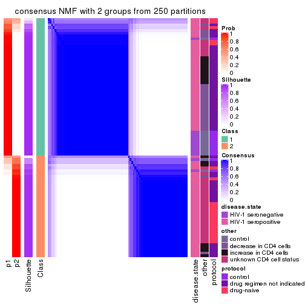</p>

</div>
<div id='tab-SD-NMF-consensus-heatmap-2'>
<pre><code class="r">consensus_heatmap(res, k = 3)
</code></pre>

<p>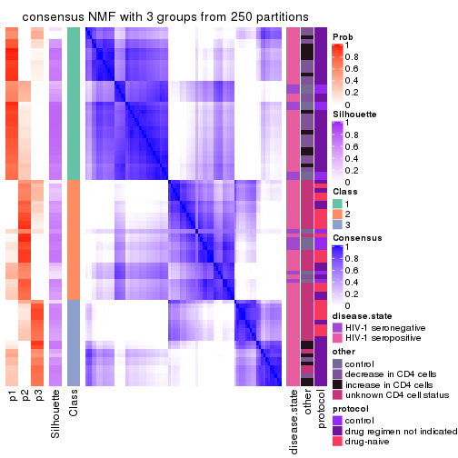</p>

</div>
<div id='tab-SD-NMF-consensus-heatmap-3'>
<pre><code class="r">consensus_heatmap(res, k = 4)
</code></pre>

<p>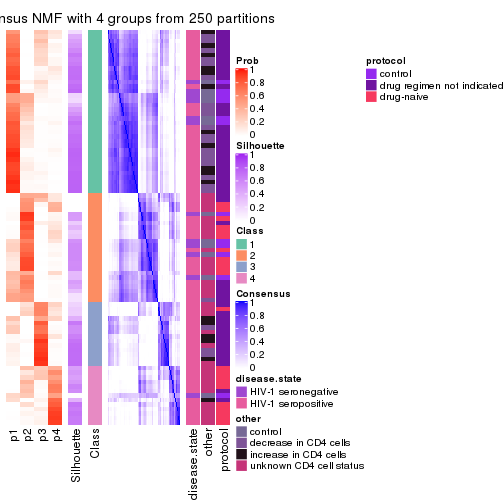</p>

</div>
<div id='tab-SD-NMF-consensus-heatmap-4'>
<pre><code class="r">consensus_heatmap(res, k = 5)
</code></pre>

<p>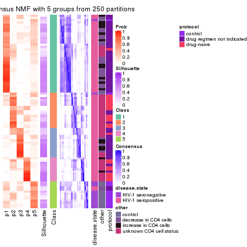</p>

</div>
<div id='tab-SD-NMF-consensus-heatmap-5'>
<pre><code class="r">consensus_heatmap(res, k = 6)
</code></pre>

<p>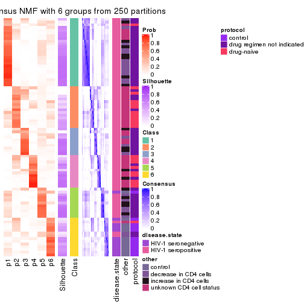</p>

</div>
</div>

Heatmaps for the membership of samples in all partitions to see how consistent they are:


<script>
$( function() {
	$( '#tabs-SD-NMF-membership-heatmap' ).tabs();
} );
</script>
<div id='tabs-SD-NMF-membership-heatmap'>
<ul>
<li><a href='#tab-SD-NMF-membership-heatmap-1'>k = 2</a></li>
<li><a href='#tab-SD-NMF-membership-heatmap-2'>k = 3</a></li>
<li><a href='#tab-SD-NMF-membership-heatmap-3'>k = 4</a></li>
<li><a href='#tab-SD-NMF-membership-heatmap-4'>k = 5</a></li>
<li><a href='#tab-SD-NMF-membership-heatmap-5'>k = 6</a></li>
</ul>
<div id='tab-SD-NMF-membership-heatmap-1'>
<pre><code class="r">membership_heatmap(res, k = 2)
</code></pre>

<p>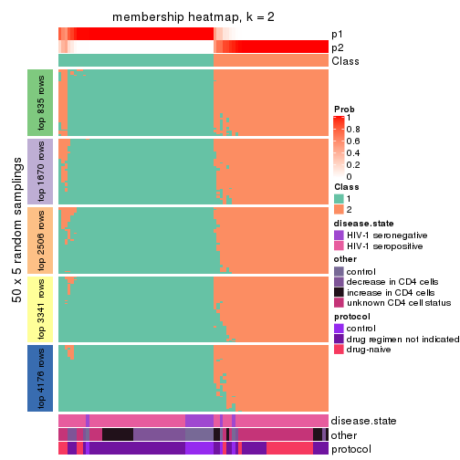</p>

</div>
<div id='tab-SD-NMF-membership-heatmap-2'>
<pre><code class="r">membership_heatmap(res, k = 3)
</code></pre>

<p>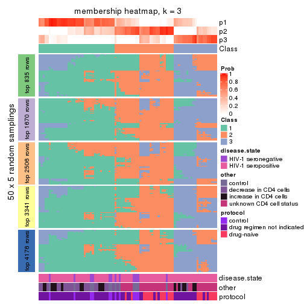</p>

</div>
<div id='tab-SD-NMF-membership-heatmap-3'>
<pre><code class="r">membership_heatmap(res, k = 4)
</code></pre>

<p>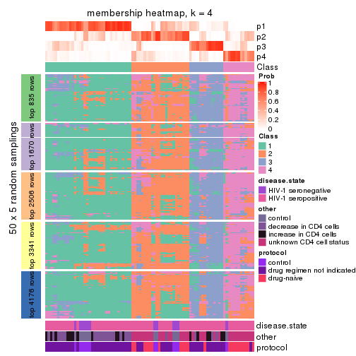</p>

</div>
<div id='tab-SD-NMF-membership-heatmap-4'>
<pre><code class="r">membership_heatmap(res, k = 5)
</code></pre>

<p>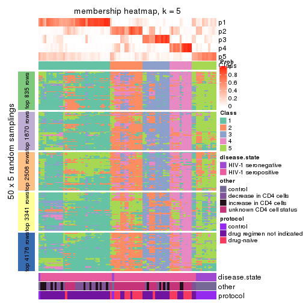</p>

</div>
<div id='tab-SD-NMF-membership-heatmap-5'>
<pre><code class="r">membership_heatmap(res, k = 6)
</code></pre>

<p>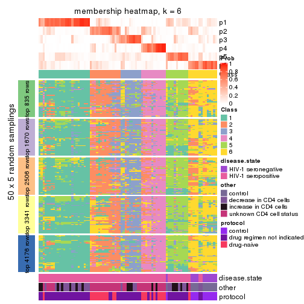</p>

</div>
</div>

As soon as we have had the classes for columns, we can look for signatures
which are significantly different between classes which can be candidate marks
for certain classes. Following are the heatmaps for signatures.


Signature heatmaps where rows are scaled:


<script>
$( function() {
	$( '#tabs-SD-NMF-get-signatures' ).tabs();
} );
</script>
<div id='tabs-SD-NMF-get-signatures'>
<ul>
<li><a href='#tab-SD-NMF-get-signatures-1'>k = 2</a></li>
<li><a href='#tab-SD-NMF-get-signatures-2'>k = 3</a></li>
<li><a href='#tab-SD-NMF-get-signatures-3'>k = 4</a></li>
<li><a href='#tab-SD-NMF-get-signatures-4'>k = 5</a></li>
<li><a href='#tab-SD-NMF-get-signatures-5'>k = 6</a></li>
</ul>
<div id='tab-SD-NMF-get-signatures-1'>
<pre><code class="r">get_signatures(res, k = 2)
</code></pre>

<p>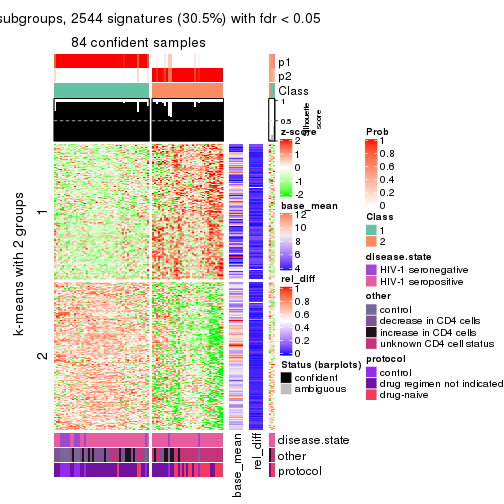</p>

</div>
<div id='tab-SD-NMF-get-signatures-2'>
<pre><code class="r">get_signatures(res, k = 3)
</code></pre>

<p>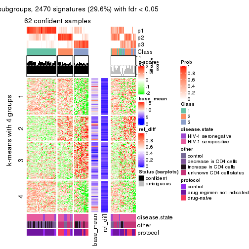</p>

</div>
<div id='tab-SD-NMF-get-signatures-3'>
<pre><code class="r">get_signatures(res, k = 4)
</code></pre>

<p>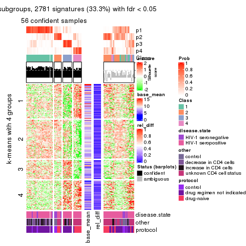</p>

</div>
<div id='tab-SD-NMF-get-signatures-4'>
<pre><code class="r">get_signatures(res, k = 5)
</code></pre>

<p>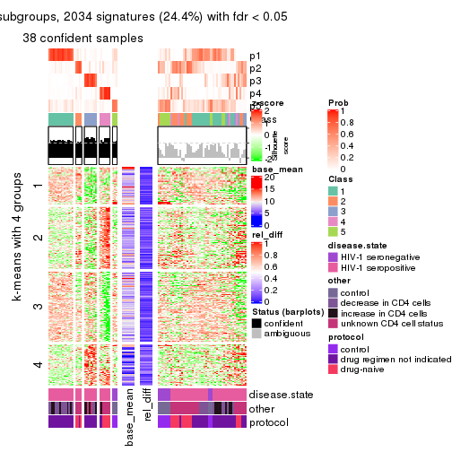</p>

</div>
<div id='tab-SD-NMF-get-signatures-5'>
<pre><code class="r">get_signatures(res, k = 6)
</code></pre>

<p>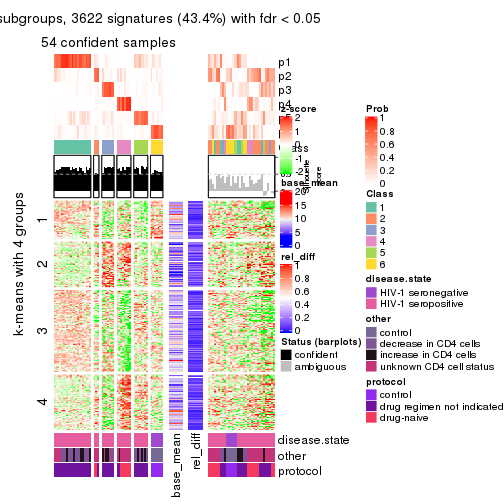</p>

</div>
</div>


Signature heatmaps where rows are not scaled:


<script>
$( function() {
	$( '#tabs-SD-NMF-get-signatures-no-scale' ).tabs();
} );
</script>
<div id='tabs-SD-NMF-get-signatures-no-scale'>
<ul>
<li><a href='#tab-SD-NMF-get-signatures-no-scale-1'>k = 2</a></li>
<li><a href='#tab-SD-NMF-get-signatures-no-scale-2'>k = 3</a></li>
<li><a href='#tab-SD-NMF-get-signatures-no-scale-3'>k = 4</a></li>
<li><a href='#tab-SD-NMF-get-signatures-no-scale-4'>k = 5</a></li>
<li><a href='#tab-SD-NMF-get-signatures-no-scale-5'>k = 6</a></li>
</ul>
<div id='tab-SD-NMF-get-signatures-no-scale-1'>
<pre><code class="r">get_signatures(res, k = 2, scale_rows = FALSE)
</code></pre>

<p>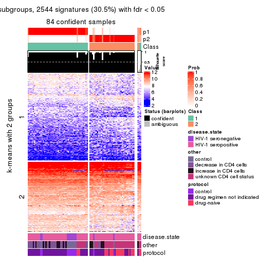</p>

</div>
<div id='tab-SD-NMF-get-signatures-no-scale-2'>
<pre><code class="r">get_signatures(res, k = 3, scale_rows = FALSE)
</code></pre>

<p>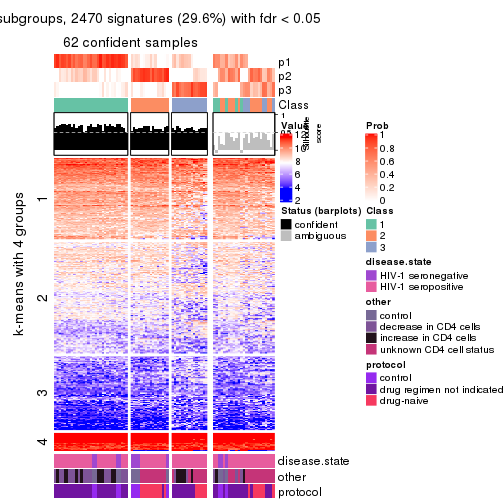</p>

</div>
<div id='tab-SD-NMF-get-signatures-no-scale-3'>
<pre><code class="r">get_signatures(res, k = 4, scale_rows = FALSE)
</code></pre>

<p>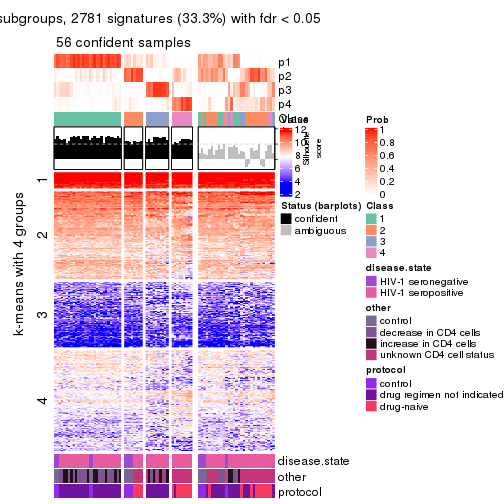</p>

</div>
<div id='tab-SD-NMF-get-signatures-no-scale-4'>
<pre><code class="r">get_signatures(res, k = 5, scale_rows = FALSE)
</code></pre>

<p>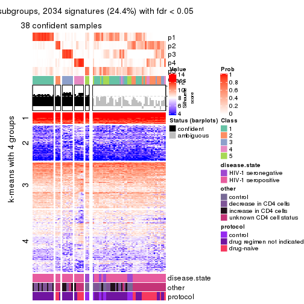</p>

</div>
<div id='tab-SD-NMF-get-signatures-no-scale-5'>
<pre><code class="r">get_signatures(res, k = 6, scale_rows = FALSE)
</code></pre>

<p>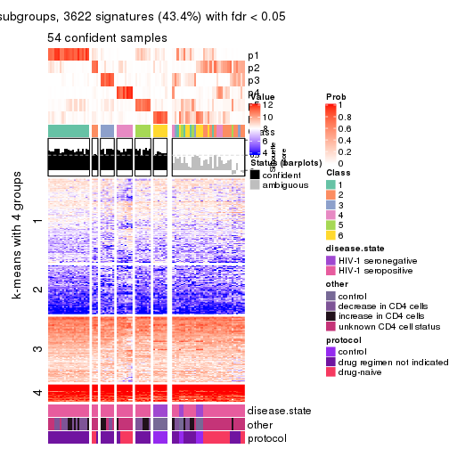</p>

</div>
</div>


Compare the overlap of signatures from different k:

```r
compare_signatures(res)
```

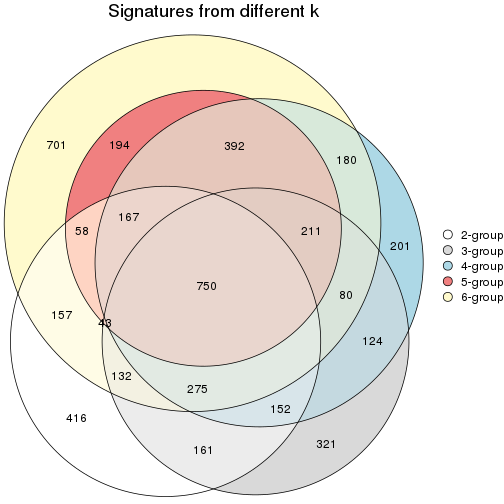

`get_signature()` returns a data frame invisibly. TO get the list of signatures, the function
call should be assigned to a variable explicitly. In following code, if `plot` argument is set
to `FALSE`, no heatmap is plotted while only the differential analysis is performed.

```r
# code only for demonstration
tb = get_signature(res, k = ..., plot = FALSE)
```

An example of the output of `tb` is:

```
#>   which_row         fdr    mean_1    mean_2 scaled_mean_1 scaled_mean_2 km
#> 1        38 0.042760348  8.373488  9.131774    -0.5533452     0.5164555  1
#> 2        40 0.018707592  7.106213  8.469186    -0.6173731     0.5762149  1
#> 3        55 0.019134737 10.221463 11.207825    -0.6159697     0.5749050  1
#> 4        59 0.006059896  5.921854  7.869574    -0.6899429     0.6439467  1
#> 5        60 0.018055526  8.928898 10.211722    -0.6204761     0.5791110  1
#> 6        98 0.009384629 15.714769 14.887706     0.6635654    -0.6193277  2
...
```

The columns in `tb` are:

1. `which_row`: row indices corresponding to the input matrix.
2. `fdr`: FDR for the differential test. 
3. `mean_x`: The mean value in group x.
4. `scaled_mean_x`: The mean value in group x after rows are scaled.
5. `km`: Row groups if k-means clustering is applied to rows.


UMAP plot which shows how samples are separated.


<script>
$( function() {
	$( '#tabs-SD-NMF-dimension-reduction' ).tabs();
} );
</script>
<div id='tabs-SD-NMF-dimension-reduction'>
<ul>
<li><a href='#tab-SD-NMF-dimension-reduction-1'>k = 2</a></li>
<li><a href='#tab-SD-NMF-dimension-reduction-2'>k = 3</a></li>
<li><a href='#tab-SD-NMF-dimension-reduction-3'>k = 4</a></li>
<li><a href='#tab-SD-NMF-dimension-reduction-4'>k = 5</a></li>
<li><a href='#tab-SD-NMF-dimension-reduction-5'>k = 6</a></li>
</ul>
<div id='tab-SD-NMF-dimension-reduction-1'>
<pre><code class="r">dimension_reduction(res, k = 2, method = &quot;UMAP&quot;)
</code></pre>

<p>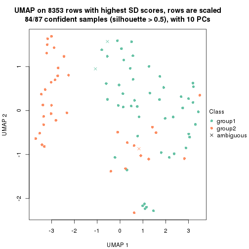</p>

</div>
<div id='tab-SD-NMF-dimension-reduction-2'>
<pre><code class="r">dimension_reduction(res, k = 3, method = &quot;UMAP&quot;)
</code></pre>

<p>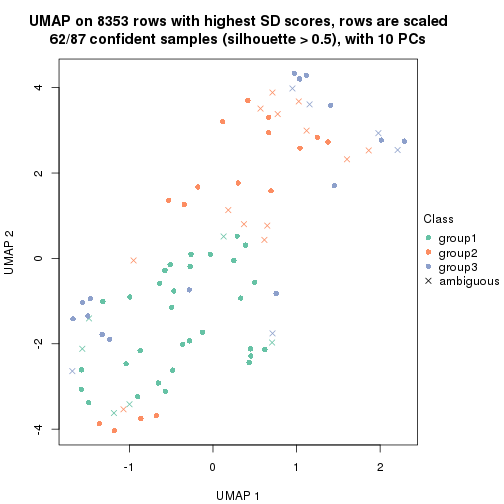</p>

</div>
<div id='tab-SD-NMF-dimension-reduction-3'>
<pre><code class="r">dimension_reduction(res, k = 4, method = &quot;UMAP&quot;)
</code></pre>

<p>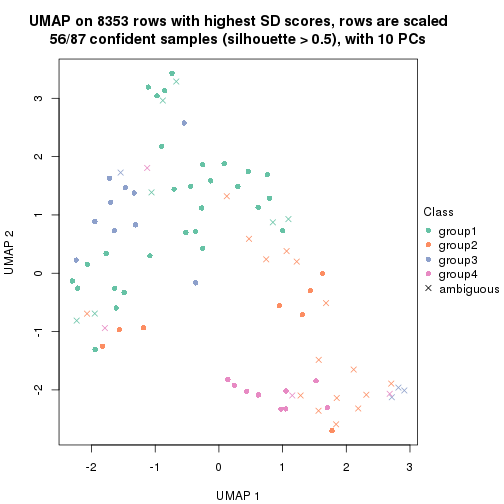</p>

</div>
<div id='tab-SD-NMF-dimension-reduction-4'>
<pre><code class="r">dimension_reduction(res, k = 5, method = &quot;UMAP&quot;)
</code></pre>

<p>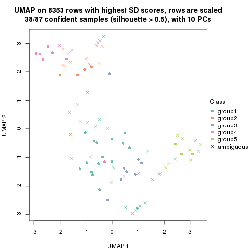</p>

</div>
<div id='tab-SD-NMF-dimension-reduction-5'>
<pre><code class="r">dimension_reduction(res, k = 6, method = &quot;UMAP&quot;)
</code></pre>

<p>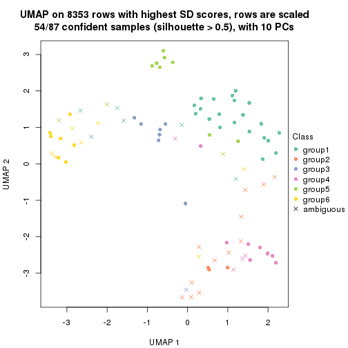</p>

</div>
</div>


Following heatmap shows how subgroups are split when increasing `k`:

```r
collect_classes(res)
```

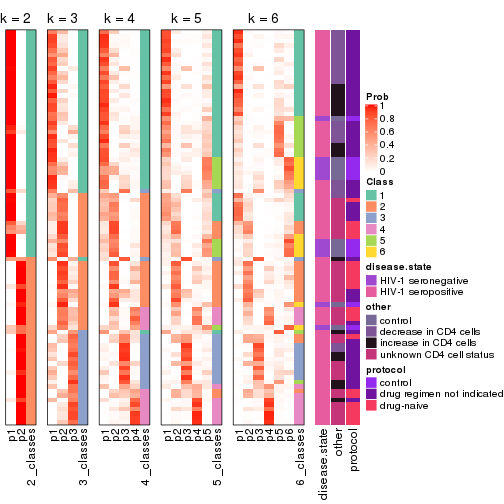


Test correlation between subgroups and known annotations. If the known
annotation is numeric, one-way ANOVA test is applied, and if the known
annotation is discrete, chi-squared contingency table test is applied.

```r
test_to_known_factors(res)
```

```
#>         n disease.state(p) other(p) protocol(p) k
#> SD:NMF 84         9.59e-02 5.48e-07    4.41e-05 2
#> SD:NMF 62         4.45e-02 1.51e-07    6.20e-07 3
#> SD:NMF 56         9.28e-03 8.15e-08    8.74e-10 4
#> SD:NMF 38         1.12e-07 6.99e-10    1.45e-10 5
#> SD:NMF 54         2.10e-10 2.93e-11    4.51e-15 6
```


If matrix rows can be associated to genes, consider to use `GO_Enrichment(res,
...)` to perform function enrichment for the signature genes.


 

---------------------------------------------------


### CV:hclust


The object with results only for a single top-value method and a single partition method 
can be extracted as:

```r
res = res_list["CV", "hclust"]
# you can also extract it by
# res = res_list["CV:hclust"]
```

A summary of `res` and all the functions that can be applied to it:

```r
res
```

```
#> A 'ConsensusPartition' object with k = 2, 3, 4, 5, 6.
#>   On a matrix with 8353 rows and 87 columns.
#>   Top rows (835, 1670, 2506, 3341, 4176) are extracted by 'CV' method.
#>   Subgroups are detected by 'hclust' method.
#>   Performed in total 1250 partitions by row resampling.
#>   Best k for subgroups seems to be 2.
#> 
#> Following methods can be applied to this 'ConsensusPartition' object:
#>  [1] "cola_report"             "collect_classes"         "collect_plots"          
#>  [4] "collect_stats"           "colnames"                "compare_signatures"     
#>  [7] "consensus_heatmap"       "dimension_reduction"     "functional_enrichment"  
#> [10] "get_anno_col"            "get_anno"                "get_classes"            
#> [13] "get_consensus"           "get_matrix"              "get_membership"         
#> [16] "get_param"               "get_signatures"          "get_stats"              
#> [19] "is_best_k"               "is_stable_k"             "membership_heatmap"     
#> [22] "ncol"                    "nrow"                    "plot_ecdf"              
#> [25] "rownames"                "select_partition_number" "show"                   
#> [28] "suggest_best_k"          "test_to_known_factors"
```

`collect_plots()` function collects all the plots made from `res` for all `k` (number of partitions)
into one single page to provide an easy and fast comparison between different `k`.

```r
collect_plots(res)
```

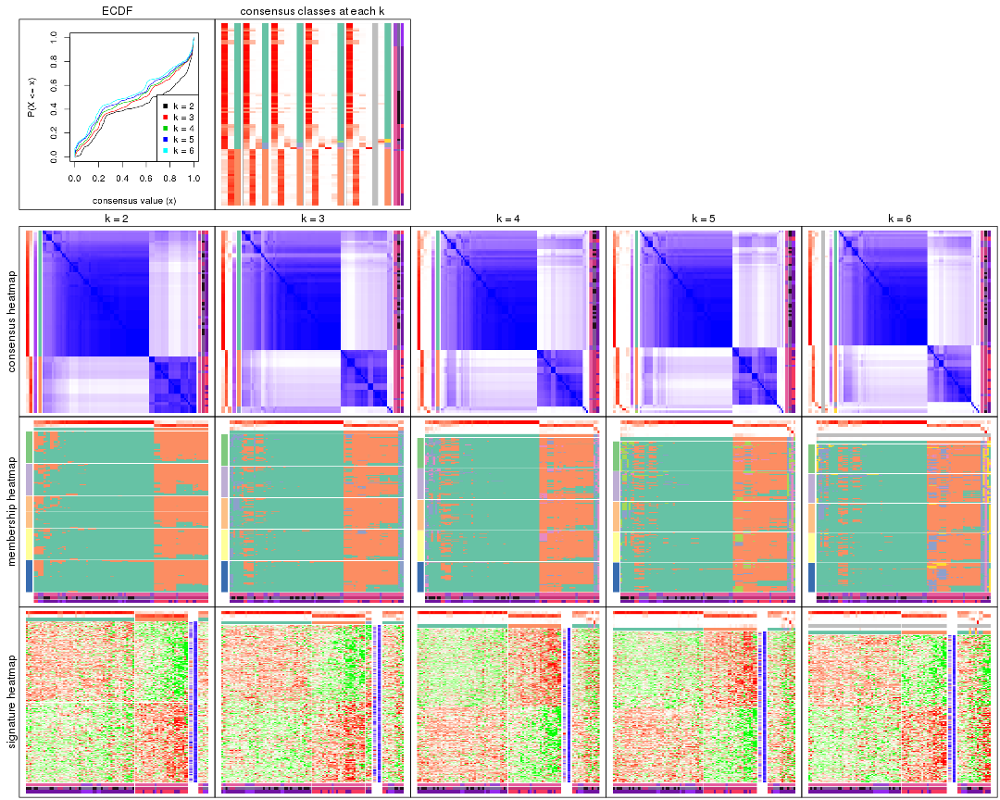

The plots are:

- The first row: a plot of the ECDF (Empirical cumulative distribution
  function) curves of the consensus matrix for each `k` and the heatmap of
  predicted classes for each `k`.
- The second row: heatmaps of the consensus matrix for each `k`.
- The third row: heatmaps of the membership matrix for each `k`.
- The fouth row: heatmaps of the signatures for each `k`.

All the plots in panels can be made by individual functions and they are
plotted later in this section.

`select_partition_number()` produces several plots showing different
statistics for choosing "optimized" `k`. There are following statistics:

- ECDF curves of the consensus matrix for each `k`;
- 1-PAC. [The PAC
  score](https://en.wikipedia.org/wiki/Consensus_clustering#Over-interpretation_potential_of_consensus_clustering)
  measures the proportion of the ambiguous subgrouping.
- Mean silhouette score.
- Concordance. The mean probability of fiting the consensus class ids in all
  partitions.
- Area increased. Denote $A_k$ as the area under the ECDF curve for current
  `k`, the area increased is defined as $A_k - A_{k-1}$.
- Rand index. The percent of pairs of samples that are both in a same cluster
  or both are not in a same cluster in the partition of k and k-1.
- Jaccard index. The ratio of pairs of samples are both in a same cluster in
  the partition of k and k-1 and the pairs of samples are both in a same
  cluster in the partition k or k-1.

The detailed explanations of these statistics can be found in [the cola
vignette](http://bioconductor.org/packages/devel/bioc/vignettes/cola/inst/doc/cola.html#toc_13).

Generally speaking, lower PAC score, higher mean silhouette score or higher
concordance corresponds to better partition. Rand index and Jaccard index
measure how similar the current partition is compared to partition with `k-1`.
If they are too similar, we won't accept `k` is better than `k-1`.

```r
select_partition_number(res)
```

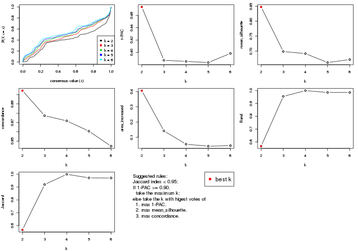

The numeric values for all these statistics can be obtained by `get_stats()`.

```r
get_stats(res)
```

```
#>   k 1-PAC mean_silhouette concordance area_increased  Rand Jaccard
#> 2 2 0.474           0.848       0.904         0.4070 0.567   0.567
#> 3 3 0.387           0.699       0.877         0.1416 0.954   0.919
#> 4 4 0.385           0.692       0.872         0.0542 0.999   0.999
#> 5 5 0.384           0.662       0.861         0.0412 0.985   0.971
#> 6 6 0.398           0.672       0.845         0.0447 0.985   0.970
```

`suggest_best_k()` suggests the best $k$ based on these statistics. The rules are as follows:

- All $k$ with Jaccard index larger than 0.95 are removed because the increase of
  the partition number does not provides enough extra information. If all $k$ are removed,
  the best $k$ is assigned by `NA`.
- For $k$ with 1-PAC larger than 0.9, the maximal $k$ is taken as the "best k". Other $k$ is called "optional k".
- If it does not fit the second rule. The $k$ with the highest vote of highest
  1-PAC, mean silhouette and concordance is taken as the "best k".

```r
suggest_best_k(res)
```

```
#> [1] 2
```


Following shows the table of the partitions (You need to click the **show/hide
code output** link to see it). The membership matrix (columns with name `p*`)
is inferred by
[`clue::cl_consensus()`](https://www.rdocumentation.org/link/cl_consensus?package=clue)
function with the `SE` method. Basically the value in the membership matrix
represents the probability to belong to a certain group. The finall class
label for an item is determined with the group with highest probability it
belongs to.

In `get_classes()` function, the entropy is calculated from the membership
matrix and the silhouette score is calculated from the consensus matrix.


<script>
$( function() {
	$( '#tabs-CV-hclust-get-classes' ).tabs();
} );
</script>
<div id='tabs-CV-hclust-get-classes'>
<ul>
<li><a href='#tab-CV-hclust-get-classes-1'>k = 2</a></li>
<li><a href='#tab-CV-hclust-get-classes-2'>k = 3</a></li>
<li><a href='#tab-CV-hclust-get-classes-3'>k = 4</a></li>
<li><a href='#tab-CV-hclust-get-classes-4'>k = 5</a></li>
<li><a href='#tab-CV-hclust-get-classes-5'>k = 6</a></li>
</ul>

<div id='tab-CV-hclust-get-classes-1'>
<p><a id='tab-CV-hclust-get-classes-1-a' style='color:#0366d6' href='#'>show/hide code output</a></p>
<pre><code class="r">cbind(get_classes(res, k = 2), get_membership(res, k = 2))
</code></pre>

<pre><code>#&gt;          class entropy silhouette    p1    p2
#&gt; GSM39104     1  0.0376     0.9182 0.996 0.004
#&gt; GSM39105     1  0.0672     0.9188 0.992 0.008
#&gt; GSM39106     1  0.5294     0.8256 0.880 0.120
#&gt; GSM39107     1  0.9460     0.3261 0.636 0.364
#&gt; GSM39108     1  0.0938     0.9179 0.988 0.012
#&gt; GSM39109     1  0.3879     0.8758 0.924 0.076
#&gt; GSM39110     1  0.2236     0.9067 0.964 0.036
#&gt; GSM39111     1  0.0938     0.9179 0.988 0.012
#&gt; GSM39112     1  0.9427     0.3393 0.640 0.360
#&gt; GSM39113     1  0.9522     0.2983 0.628 0.372
#&gt; GSM39114     2  0.8207     0.8354 0.256 0.744
#&gt; GSM39115     1  0.0672     0.9188 0.992 0.008
#&gt; GSM39148     1  0.0672     0.9188 0.992 0.008
#&gt; GSM39149     1  0.2603     0.8899 0.956 0.044
#&gt; GSM39150     1  0.0376     0.9182 0.996 0.004
#&gt; GSM39151     1  0.2236     0.8929 0.964 0.036
#&gt; GSM39152     1  0.0376     0.9154 0.996 0.004
#&gt; GSM39153     1  0.0938     0.9184 0.988 0.012
#&gt; GSM39154     1  0.0938     0.9184 0.988 0.012
#&gt; GSM39155     1  0.0672     0.9188 0.992 0.008
#&gt; GSM39156     1  0.2948     0.8951 0.948 0.052
#&gt; GSM39157     1  0.0672     0.9188 0.992 0.008
#&gt; GSM39158     1  0.0672     0.9171 0.992 0.008
#&gt; GSM39159     1  0.1843     0.9132 0.972 0.028
#&gt; GSM39160     1  0.0672     0.9173 0.992 0.008
#&gt; GSM39161     1  0.1843     0.9105 0.972 0.028
#&gt; GSM39162     1  0.0672     0.9188 0.992 0.008
#&gt; GSM39163     1  0.0672     0.9188 0.992 0.008
#&gt; GSM39164     1  0.0672     0.9188 0.992 0.008
#&gt; GSM39165     1  0.0376     0.9182 0.996 0.004
#&gt; GSM39166     1  0.0672     0.9171 0.992 0.008
#&gt; GSM39167     1  0.0938     0.9183 0.988 0.012
#&gt; GSM39168     1  0.0672     0.9188 0.992 0.008
#&gt; GSM39169     1  0.0672     0.9188 0.992 0.008
#&gt; GSM39170     1  0.0000     0.9171 1.000 0.000
#&gt; GSM39171     1  0.0672     0.9173 0.992 0.008
#&gt; GSM39172     1  0.4815     0.8410 0.896 0.104
#&gt; GSM39173     1  0.1633     0.9115 0.976 0.024
#&gt; GSM39174     1  0.0672     0.9188 0.992 0.008
#&gt; GSM39175     1  0.0672     0.9173 0.992 0.008
#&gt; GSM39176     1  0.0938     0.9183 0.988 0.012
#&gt; GSM39177     1  0.1184     0.9084 0.984 0.016
#&gt; GSM39178     1  0.0672     0.9173 0.992 0.008
#&gt; GSM39179     1  0.2236     0.8929 0.964 0.036
#&gt; GSM39180     1  0.5629     0.8115 0.868 0.132
#&gt; GSM39181     1  0.0672     0.9171 0.992 0.008
#&gt; GSM39182     1  0.8555     0.5632 0.720 0.280
#&gt; GSM39183     1  0.0672     0.9171 0.992 0.008
#&gt; GSM39184     1  0.0672     0.9188 0.992 0.008
#&gt; GSM39185     1  0.1843     0.9105 0.972 0.028
#&gt; GSM39186     1  0.0672     0.9188 0.992 0.008
#&gt; GSM39187     1  0.1633     0.9137 0.976 0.024
#&gt; GSM39116     2  0.5842     0.9032 0.140 0.860
#&gt; GSM39117     2  0.7883     0.8161 0.236 0.764
#&gt; GSM39118     2  0.3584     0.8782 0.068 0.932
#&gt; GSM39119     2  0.3274     0.8728 0.060 0.940
#&gt; GSM39120     1  0.9491     0.3260 0.632 0.368
#&gt; GSM39121     2  0.7950     0.8563 0.240 0.760
#&gt; GSM39122     2  0.7883     0.8608 0.236 0.764
#&gt; GSM39123     2  0.7883     0.8161 0.236 0.764
#&gt; GSM39124     2  0.7602     0.8753 0.220 0.780
#&gt; GSM39125     1  0.9866     0.0775 0.568 0.432
#&gt; GSM39126     2  0.8081     0.8462 0.248 0.752
#&gt; GSM39127     2  0.6712     0.8988 0.176 0.824
#&gt; GSM39128     2  0.7219     0.8880 0.200 0.800
#&gt; GSM39129     2  0.2778     0.8655 0.048 0.952
#&gt; GSM39130     2  0.7883     0.8161 0.236 0.764
#&gt; GSM39131     2  0.6438     0.9024 0.164 0.836
#&gt; GSM39132     2  0.6343     0.9028 0.160 0.840
#&gt; GSM39133     2  0.5294     0.8832 0.120 0.880
#&gt; GSM39134     2  0.3584     0.8774 0.068 0.932
#&gt; GSM39135     2  0.5842     0.9032 0.140 0.860
#&gt; GSM39136     2  0.5737     0.9027 0.136 0.864
#&gt; GSM39137     2  0.7602     0.8753 0.220 0.780
#&gt; GSM39138     2  0.2778     0.8655 0.048 0.952
#&gt; GSM39139     2  0.2778     0.8655 0.048 0.952
#&gt; GSM39140     1  0.8207     0.6176 0.744 0.256
#&gt; GSM39141     1  0.7056     0.7298 0.808 0.192
#&gt; GSM39142     1  0.6343     0.7759 0.840 0.160
#&gt; GSM39143     1  0.6343     0.7759 0.840 0.160
#&gt; GSM39144     2  0.2778     0.8655 0.048 0.952
#&gt; GSM39145     2  0.5059     0.8960 0.112 0.888
#&gt; GSM39146     2  0.6623     0.9013 0.172 0.828
#&gt; GSM39147     2  0.7602     0.8753 0.220 0.780
#&gt; GSM39188     1  0.2778     0.8817 0.952 0.048
#&gt; GSM39189     1  0.0000     0.9171 1.000 0.000
#&gt; GSM39190     1  0.2423     0.8965 0.960 0.040
</code></pre>

<script>
$('#tab-CV-hclust-get-classes-1-a').parent().next().next().hide();
$('#tab-CV-hclust-get-classes-1-a').click(function(){
  $('#tab-CV-hclust-get-classes-1-a').parent().next().next().toggle();
  return(false);
});
</script>
</div>

<div id='tab-CV-hclust-get-classes-2'>
<p><a id='tab-CV-hclust-get-classes-2-a' style='color:#0366d6' href='#'>show/hide code output</a></p>
<pre><code class="r">cbind(get_classes(res, k = 3), get_membership(res, k = 3))
</code></pre>

<pre><code>#&gt;          class entropy silhouette    p1    p2    p3
#&gt; GSM39104     1  0.0000     0.8092 1.000 0.000 0.000
#&gt; GSM39105     1  0.0237     0.8113 0.996 0.004 0.000
#&gt; GSM39106     1  0.3267     0.6738 0.884 0.116 0.000
#&gt; GSM39107     1  0.5948     0.1674 0.640 0.360 0.000
#&gt; GSM39108     1  0.0661     0.8095 0.988 0.008 0.004
#&gt; GSM39109     1  0.2845     0.7418 0.920 0.068 0.012
#&gt; GSM39110     1  0.1525     0.7908 0.964 0.032 0.004
#&gt; GSM39111     1  0.0661     0.8095 0.988 0.008 0.004
#&gt; GSM39112     1  0.5926     0.1754 0.644 0.356 0.000
#&gt; GSM39113     1  0.5988     0.1502 0.632 0.368 0.000
#&gt; GSM39114     2  0.5016     0.7768 0.240 0.760 0.000
#&gt; GSM39115     1  0.0237     0.8113 0.996 0.004 0.000
#&gt; GSM39148     1  0.0237     0.8113 0.996 0.004 0.000
#&gt; GSM39149     3  0.6489     0.7266 0.456 0.004 0.540
#&gt; GSM39150     1  0.0000     0.8092 1.000 0.000 0.000
#&gt; GSM39151     1  0.6169    -0.3730 0.636 0.004 0.360
#&gt; GSM39152     1  0.0661     0.8023 0.988 0.004 0.008
#&gt; GSM39153     1  0.0475     0.8104 0.992 0.004 0.004
#&gt; GSM39154     1  0.0475     0.8104 0.992 0.004 0.004
#&gt; GSM39155     1  0.0237     0.8113 0.996 0.004 0.000
#&gt; GSM39156     1  0.1860     0.7717 0.948 0.052 0.000
#&gt; GSM39157     1  0.0237     0.8113 0.996 0.004 0.000
#&gt; GSM39158     1  0.0592     0.8065 0.988 0.012 0.000
#&gt; GSM39159     1  0.1129     0.8004 0.976 0.020 0.004
#&gt; GSM39160     1  0.0237     0.8082 0.996 0.000 0.004
#&gt; GSM39161     1  0.1774     0.7878 0.960 0.024 0.016
#&gt; GSM39162     1  0.0237     0.8113 0.996 0.004 0.000
#&gt; GSM39163     1  0.0237     0.8113 0.996 0.004 0.000
#&gt; GSM39164     1  0.0237     0.8113 0.996 0.004 0.000
#&gt; GSM39165     1  0.0237     0.8087 0.996 0.000 0.004
#&gt; GSM39166     1  0.0592     0.8065 0.988 0.012 0.000
#&gt; GSM39167     1  0.0424     0.8107 0.992 0.008 0.000
#&gt; GSM39168     1  0.0237     0.8113 0.996 0.004 0.000
#&gt; GSM39169     1  0.0237     0.8113 0.996 0.004 0.000
#&gt; GSM39170     1  0.0237     0.8059 0.996 0.004 0.000
#&gt; GSM39171     1  0.0237     0.8082 0.996 0.000 0.004
#&gt; GSM39172     1  0.4982     0.5889 0.840 0.096 0.064
#&gt; GSM39173     1  0.5036     0.4953 0.808 0.020 0.172
#&gt; GSM39174     1  0.0237     0.8113 0.996 0.004 0.000
#&gt; GSM39175     1  0.0237     0.8082 0.996 0.000 0.004
#&gt; GSM39176     1  0.0424     0.8107 0.992 0.008 0.000
#&gt; GSM39177     1  0.3030     0.6883 0.904 0.004 0.092
#&gt; GSM39178     1  0.0237     0.8082 0.996 0.000 0.004
#&gt; GSM39179     1  0.6434    -0.4395 0.612 0.008 0.380
#&gt; GSM39180     1  0.7762     0.0472 0.668 0.120 0.212
#&gt; GSM39181     1  0.0592     0.8065 0.988 0.012 0.000
#&gt; GSM39182     1  0.7213     0.1546 0.668 0.272 0.060
#&gt; GSM39183     1  0.0592     0.8065 0.988 0.012 0.000
#&gt; GSM39184     1  0.0237     0.8113 0.996 0.004 0.000
#&gt; GSM39185     1  0.1774     0.7878 0.960 0.024 0.016
#&gt; GSM39186     1  0.0237     0.8113 0.996 0.004 0.000
#&gt; GSM39187     1  0.0892     0.8041 0.980 0.020 0.000
#&gt; GSM39116     2  0.3644     0.8589 0.124 0.872 0.004
#&gt; GSM39117     2  0.6402     0.7252 0.200 0.744 0.056
#&gt; GSM39118     2  0.1765     0.8176 0.040 0.956 0.004
#&gt; GSM39119     2  0.2879     0.8180 0.052 0.924 0.024
#&gt; GSM39120     1  0.6008     0.1608 0.628 0.372 0.000
#&gt; GSM39121     2  0.4842     0.8020 0.224 0.776 0.000
#&gt; GSM39122     2  0.4796     0.8074 0.220 0.780 0.000
#&gt; GSM39123     2  0.6402     0.7252 0.200 0.744 0.056
#&gt; GSM39124     2  0.4605     0.8247 0.204 0.796 0.000
#&gt; GSM39125     1  0.6235     0.0413 0.564 0.436 0.000
#&gt; GSM39126     2  0.4931     0.7900 0.232 0.768 0.000
#&gt; GSM39127     2  0.4002     0.8523 0.160 0.840 0.000
#&gt; GSM39128     2  0.4346     0.8395 0.184 0.816 0.000
#&gt; GSM39129     2  0.2063     0.7746 0.008 0.948 0.044
#&gt; GSM39130     2  0.6402     0.7252 0.200 0.744 0.056
#&gt; GSM39131     2  0.3983     0.8581 0.144 0.852 0.004
#&gt; GSM39132     2  0.3918     0.8585 0.140 0.856 0.004
#&gt; GSM39133     2  0.4217     0.8175 0.100 0.868 0.032
#&gt; GSM39134     2  0.1950     0.8166 0.040 0.952 0.008
#&gt; GSM39135     2  0.3644     0.8589 0.124 0.872 0.004
#&gt; GSM39136     2  0.3500     0.8572 0.116 0.880 0.004
#&gt; GSM39137     2  0.4605     0.8247 0.204 0.796 0.000
#&gt; GSM39138     2  0.2063     0.7745 0.008 0.948 0.044
#&gt; GSM39139     2  0.2173     0.7725 0.008 0.944 0.048
#&gt; GSM39140     1  0.5178     0.4040 0.744 0.256 0.000
#&gt; GSM39141     1  0.4399     0.5456 0.812 0.188 0.000
#&gt; GSM39142     1  0.3941     0.6072 0.844 0.156 0.000
#&gt; GSM39143     1  0.3941     0.6072 0.844 0.156 0.000
#&gt; GSM39144     2  0.2173     0.7725 0.008 0.944 0.048
#&gt; GSM39145     2  0.2955     0.8417 0.080 0.912 0.008
#&gt; GSM39146     2  0.4228     0.8577 0.148 0.844 0.008
#&gt; GSM39147     2  0.4605     0.8247 0.204 0.796 0.000
#&gt; GSM39188     3  0.6460     0.7425 0.440 0.004 0.556
#&gt; GSM39189     1  0.3425     0.6587 0.884 0.004 0.112
#&gt; GSM39190     3  0.6672     0.7139 0.472 0.008 0.520
</code></pre>

<script>
$('#tab-CV-hclust-get-classes-2-a').parent().next().next().hide();
$('#tab-CV-hclust-get-classes-2-a').click(function(){
  $('#tab-CV-hclust-get-classes-2-a').parent().next().next().toggle();
  return(false);
});
</script>
</div>

<div id='tab-CV-hclust-get-classes-3'>
<p><a id='tab-CV-hclust-get-classes-3-a' style='color:#0366d6' href='#'>show/hide code output</a></p>
<pre><code class="r">cbind(get_classes(res, k = 4), get_membership(res, k = 4))
</code></pre>

<pre><code>#&gt;          class entropy silhouette    p1    p2    p3    p4
#&gt; GSM39104     1  0.0000     0.8278 1.000 0.000 0.000 0.000
#&gt; GSM39105     1  0.0188     0.8294 0.996 0.004 0.000 0.000
#&gt; GSM39106     1  0.2831     0.7157 0.876 0.120 0.004 0.000
#&gt; GSM39107     1  0.4936     0.2661 0.624 0.372 0.004 0.000
#&gt; GSM39108     1  0.0804     0.8253 0.980 0.008 0.012 0.000
#&gt; GSM39109     1  0.2489     0.7704 0.912 0.068 0.020 0.000
#&gt; GSM39110     1  0.1488     0.8100 0.956 0.032 0.012 0.000
#&gt; GSM39111     1  0.0804     0.8253 0.980 0.008 0.012 0.000
#&gt; GSM39112     1  0.4920     0.2741 0.628 0.368 0.004 0.000
#&gt; GSM39113     1  0.4964     0.2489 0.616 0.380 0.004 0.000
#&gt; GSM39114     2  0.3873     0.7664 0.228 0.772 0.000 0.000
#&gt; GSM39115     1  0.0188     0.8294 0.996 0.004 0.000 0.000
#&gt; GSM39148     1  0.0188     0.8294 0.996 0.004 0.000 0.000
#&gt; GSM39149     3  0.6919     0.4128 0.352 0.000 0.528 0.120
#&gt; GSM39150     1  0.0000     0.8278 1.000 0.000 0.000 0.000
#&gt; GSM39151     1  0.7270    -0.3673 0.548 0.004 0.280 0.168
#&gt; GSM39152     1  0.0524     0.8230 0.988 0.000 0.008 0.004
#&gt; GSM39153     1  0.0376     0.8288 0.992 0.004 0.004 0.000
#&gt; GSM39154     1  0.0376     0.8288 0.992 0.004 0.004 0.000
#&gt; GSM39155     1  0.0188     0.8294 0.996 0.004 0.000 0.000
#&gt; GSM39156     1  0.1474     0.7991 0.948 0.052 0.000 0.000
#&gt; GSM39157     1  0.0188     0.8294 0.996 0.004 0.000 0.000
#&gt; GSM39158     1  0.0524     0.8260 0.988 0.008 0.000 0.004
#&gt; GSM39159     1  0.1059     0.8189 0.972 0.016 0.012 0.000
#&gt; GSM39160     1  0.0188     0.8272 0.996 0.000 0.004 0.000
#&gt; GSM39161     1  0.1593     0.8078 0.956 0.016 0.024 0.004
#&gt; GSM39162     1  0.0188     0.8294 0.996 0.004 0.000 0.000
#&gt; GSM39163     1  0.0188     0.8294 0.996 0.004 0.000 0.000
#&gt; GSM39164     1  0.0188     0.8294 0.996 0.004 0.000 0.000
#&gt; GSM39165     1  0.0188     0.8277 0.996 0.000 0.004 0.000
#&gt; GSM39166     1  0.0524     0.8260 0.988 0.008 0.000 0.004
#&gt; GSM39167     1  0.0336     0.8289 0.992 0.008 0.000 0.000
#&gt; GSM39168     1  0.0188     0.8294 0.996 0.004 0.000 0.000
#&gt; GSM39169     1  0.0188     0.8294 0.996 0.004 0.000 0.000
#&gt; GSM39170     1  0.0188     0.8253 0.996 0.000 0.000 0.004
#&gt; GSM39171     1  0.0188     0.8272 0.996 0.000 0.004 0.000
#&gt; GSM39172     1  0.4977     0.6034 0.804 0.096 0.072 0.028
#&gt; GSM39173     1  0.5403     0.4362 0.732 0.024 0.216 0.028
#&gt; GSM39174     1  0.0188     0.8294 0.996 0.004 0.000 0.000
#&gt; GSM39175     1  0.0188     0.8272 0.996 0.000 0.004 0.000
#&gt; GSM39176     1  0.0336     0.8289 0.992 0.008 0.000 0.000
#&gt; GSM39177     1  0.3239     0.7075 0.880 0.000 0.052 0.068
#&gt; GSM39178     1  0.0188     0.8272 0.996 0.000 0.004 0.000
#&gt; GSM39179     1  0.7001    -0.3705 0.544 0.000 0.316 0.140
#&gt; GSM39180     1  0.7718    -0.0724 0.572 0.120 0.260 0.048
#&gt; GSM39181     1  0.0524     0.8260 0.988 0.008 0.000 0.004
#&gt; GSM39182     1  0.6557     0.2432 0.636 0.268 0.080 0.016
#&gt; GSM39183     1  0.0524     0.8260 0.988 0.008 0.000 0.004
#&gt; GSM39184     1  0.0188     0.8294 0.996 0.004 0.000 0.000
#&gt; GSM39185     1  0.1593     0.8078 0.956 0.016 0.024 0.004
#&gt; GSM39186     1  0.0188     0.8294 0.996 0.004 0.000 0.000
#&gt; GSM39187     1  0.0707     0.8240 0.980 0.020 0.000 0.000
#&gt; GSM39116     2  0.2839     0.8408 0.108 0.884 0.004 0.004
#&gt; GSM39117     2  0.5679     0.7084 0.160 0.744 0.076 0.020
#&gt; GSM39118     2  0.1590     0.7862 0.028 0.956 0.008 0.008
#&gt; GSM39119     2  0.2669     0.7729 0.032 0.912 0.052 0.004
#&gt; GSM39120     1  0.4978     0.2599 0.612 0.384 0.004 0.000
#&gt; GSM39121     2  0.3726     0.7908 0.212 0.788 0.000 0.000
#&gt; GSM39122     2  0.3688     0.7959 0.208 0.792 0.000 0.000
#&gt; GSM39123     2  0.5679     0.7084 0.160 0.744 0.076 0.020
#&gt; GSM39124     2  0.3528     0.8125 0.192 0.808 0.000 0.000
#&gt; GSM39125     1  0.5132     0.0932 0.548 0.448 0.004 0.000
#&gt; GSM39126     2  0.3801     0.7794 0.220 0.780 0.000 0.000
#&gt; GSM39127     2  0.3024     0.8384 0.148 0.852 0.000 0.000
#&gt; GSM39128     2  0.3311     0.8270 0.172 0.828 0.000 0.000
#&gt; GSM39129     2  0.3577     0.6963 0.004 0.868 0.056 0.072
#&gt; GSM39130     2  0.5679     0.7084 0.160 0.744 0.076 0.020
#&gt; GSM39131     2  0.2999     0.8424 0.132 0.864 0.000 0.004
#&gt; GSM39132     2  0.2944     0.8425 0.128 0.868 0.000 0.004
#&gt; GSM39133     2  0.3705     0.7830 0.076 0.868 0.040 0.016
#&gt; GSM39134     2  0.2210     0.7801 0.028 0.936 0.016 0.020
#&gt; GSM39135     2  0.2839     0.8408 0.108 0.884 0.004 0.004
#&gt; GSM39136     2  0.2715     0.8380 0.100 0.892 0.004 0.004
#&gt; GSM39137     2  0.3528     0.8125 0.192 0.808 0.000 0.000
#&gt; GSM39138     2  0.3241     0.7062 0.004 0.884 0.040 0.072
#&gt; GSM39139     2  0.3400     0.7014 0.004 0.876 0.044 0.076
#&gt; GSM39140     1  0.4193     0.4891 0.732 0.268 0.000 0.000
#&gt; GSM39141     1  0.3610     0.6064 0.800 0.200 0.000 0.000
#&gt; GSM39142     1  0.3219     0.6605 0.836 0.164 0.000 0.000
#&gt; GSM39143     1  0.3219     0.6605 0.836 0.164 0.000 0.000
#&gt; GSM39144     2  0.3648     0.6909 0.004 0.864 0.056 0.076
#&gt; GSM39145     2  0.3328     0.8185 0.076 0.884 0.020 0.020
#&gt; GSM39146     2  0.3326     0.8431 0.132 0.856 0.008 0.004
#&gt; GSM39147     2  0.3528     0.8125 0.192 0.808 0.000 0.000
#&gt; GSM39188     4  0.2999     0.0000 0.132 0.000 0.004 0.864
#&gt; GSM39189     1  0.3612     0.6523 0.840 0.004 0.144 0.012
#&gt; GSM39190     3  0.6808     0.3856 0.320 0.000 0.560 0.120
</code></pre>

<script>
$('#tab-CV-hclust-get-classes-3-a').parent().next().next().hide();
$('#tab-CV-hclust-get-classes-3-a').click(function(){
  $('#tab-CV-hclust-get-classes-3-a').parent().next().next().toggle();
  return(false);
});
</script>
</div>

<div id='tab-CV-hclust-get-classes-4'>
<p><a id='tab-CV-hclust-get-classes-4-a' style='color:#0366d6' href='#'>show/hide code output</a></p>
<pre><code class="r">cbind(get_classes(res, k = 5), get_membership(res, k = 5))
</code></pre>

<pre><code>#&gt;          class entropy silhouette    p1    p2    p3    p4    p5
#&gt; GSM39104     1  0.0000     0.8162 1.000 0.000 0.000 0.000 0.000
#&gt; GSM39105     1  0.0162     0.8179 0.996 0.004 0.000 0.000 0.000
#&gt; GSM39106     1  0.2488     0.6920 0.872 0.124 0.004 0.000 0.000
#&gt; GSM39107     1  0.4276     0.2177 0.616 0.380 0.004 0.000 0.000
#&gt; GSM39108     1  0.0740     0.8133 0.980 0.008 0.008 0.000 0.004
#&gt; GSM39109     1  0.2585     0.7392 0.896 0.072 0.008 0.000 0.024
#&gt; GSM39110     1  0.1682     0.7886 0.944 0.032 0.012 0.000 0.012
#&gt; GSM39111     1  0.0740     0.8133 0.980 0.008 0.008 0.000 0.004
#&gt; GSM39112     1  0.4264     0.2260 0.620 0.376 0.004 0.000 0.000
#&gt; GSM39113     1  0.4299     0.2003 0.608 0.388 0.004 0.000 0.000
#&gt; GSM39114     2  0.3274     0.7520 0.220 0.780 0.000 0.000 0.000
#&gt; GSM39115     1  0.0162     0.8179 0.996 0.004 0.000 0.000 0.000
#&gt; GSM39148     1  0.0162     0.8179 0.996 0.004 0.000 0.000 0.000
#&gt; GSM39149     3  0.7694     0.2501 0.244 0.000 0.460 0.084 0.212
#&gt; GSM39150     1  0.0000     0.8162 1.000 0.000 0.000 0.000 0.000
#&gt; GSM39151     5  0.7603     0.0000 0.380 0.000 0.124 0.100 0.396
#&gt; GSM39152     1  0.0566     0.8091 0.984 0.004 0.000 0.000 0.012
#&gt; GSM39153     1  0.0324     0.8172 0.992 0.004 0.000 0.000 0.004
#&gt; GSM39154     1  0.0324     0.8172 0.992 0.004 0.000 0.000 0.004
#&gt; GSM39155     1  0.0162     0.8179 0.996 0.004 0.000 0.000 0.000
#&gt; GSM39156     1  0.1270     0.7855 0.948 0.052 0.000 0.000 0.000
#&gt; GSM39157     1  0.0162     0.8179 0.996 0.004 0.000 0.000 0.000
#&gt; GSM39158     1  0.0404     0.8142 0.988 0.012 0.000 0.000 0.000
#&gt; GSM39159     1  0.0960     0.8065 0.972 0.016 0.004 0.000 0.008
#&gt; GSM39160     1  0.0162     0.8154 0.996 0.000 0.000 0.000 0.004
#&gt; GSM39161     1  0.1471     0.7910 0.952 0.020 0.004 0.000 0.024
#&gt; GSM39162     1  0.0162     0.8179 0.996 0.004 0.000 0.000 0.000
#&gt; GSM39163     1  0.0162     0.8179 0.996 0.004 0.000 0.000 0.000
#&gt; GSM39164     1  0.0162     0.8179 0.996 0.004 0.000 0.000 0.000
#&gt; GSM39165     1  0.0451     0.8133 0.988 0.000 0.004 0.000 0.008
#&gt; GSM39166     1  0.0404     0.8142 0.988 0.012 0.000 0.000 0.000
#&gt; GSM39167     1  0.0290     0.8174 0.992 0.008 0.000 0.000 0.000
#&gt; GSM39168     1  0.0162     0.8179 0.996 0.004 0.000 0.000 0.000
#&gt; GSM39169     1  0.0162     0.8179 0.996 0.004 0.000 0.000 0.000
#&gt; GSM39170     1  0.0162     0.8135 0.996 0.004 0.000 0.000 0.000
#&gt; GSM39171     1  0.0162     0.8154 0.996 0.000 0.000 0.000 0.004
#&gt; GSM39172     1  0.4812     0.5388 0.784 0.108 0.040 0.012 0.056
#&gt; GSM39173     1  0.6004     0.1911 0.664 0.028 0.160 0.004 0.144
#&gt; GSM39174     1  0.0162     0.8179 0.996 0.004 0.000 0.000 0.000
#&gt; GSM39175     1  0.0162     0.8154 0.996 0.000 0.000 0.000 0.004
#&gt; GSM39176     1  0.0290     0.8174 0.992 0.008 0.000 0.000 0.000
#&gt; GSM39177     1  0.3581     0.6328 0.852 0.004 0.020 0.044 0.080
#&gt; GSM39178     1  0.0162     0.8154 0.996 0.000 0.000 0.000 0.004
#&gt; GSM39179     1  0.7832    -0.7448 0.436 0.004 0.204 0.076 0.280
#&gt; GSM39180     1  0.7933    -0.2609 0.512 0.132 0.188 0.016 0.152
#&gt; GSM39181     1  0.0404     0.8142 0.988 0.012 0.000 0.000 0.000
#&gt; GSM39182     1  0.6023     0.1637 0.620 0.276 0.036 0.004 0.064
#&gt; GSM39183     1  0.0404     0.8142 0.988 0.012 0.000 0.000 0.000
#&gt; GSM39184     1  0.0162     0.8179 0.996 0.004 0.000 0.000 0.000
#&gt; GSM39185     1  0.1471     0.7910 0.952 0.020 0.004 0.000 0.024
#&gt; GSM39186     1  0.0162     0.8179 0.996 0.004 0.000 0.000 0.000
#&gt; GSM39187     1  0.0609     0.8121 0.980 0.020 0.000 0.000 0.000
#&gt; GSM39116     2  0.2519     0.8220 0.100 0.884 0.000 0.000 0.016
#&gt; GSM39117     2  0.5590     0.6652 0.136 0.716 0.032 0.008 0.108
#&gt; GSM39118     2  0.1493     0.7699 0.024 0.948 0.000 0.000 0.028
#&gt; GSM39119     2  0.2482     0.7446 0.024 0.892 0.000 0.000 0.084
#&gt; GSM39120     1  0.4299     0.2202 0.608 0.388 0.004 0.000 0.000
#&gt; GSM39121     2  0.3143     0.7754 0.204 0.796 0.000 0.000 0.000
#&gt; GSM39122     2  0.3109     0.7801 0.200 0.800 0.000 0.000 0.000
#&gt; GSM39123     2  0.5590     0.6652 0.136 0.716 0.032 0.008 0.108
#&gt; GSM39124     2  0.2966     0.7953 0.184 0.816 0.000 0.000 0.000
#&gt; GSM39125     1  0.4425     0.0986 0.544 0.452 0.004 0.000 0.000
#&gt; GSM39126     2  0.3210     0.7646 0.212 0.788 0.000 0.000 0.000
#&gt; GSM39127     2  0.2516     0.8192 0.140 0.860 0.000 0.000 0.000
#&gt; GSM39128     2  0.2773     0.8083 0.164 0.836 0.000 0.000 0.000
#&gt; GSM39129     2  0.3491     0.6127 0.004 0.768 0.000 0.000 0.228
#&gt; GSM39130     2  0.5590     0.6652 0.136 0.716 0.032 0.008 0.108
#&gt; GSM39131     2  0.2488     0.8236 0.124 0.872 0.000 0.000 0.004
#&gt; GSM39132     2  0.2563     0.8237 0.120 0.872 0.000 0.000 0.008
#&gt; GSM39133     2  0.3777     0.7410 0.056 0.836 0.008 0.008 0.092
#&gt; GSM39134     2  0.2208     0.7534 0.020 0.908 0.000 0.000 0.072
#&gt; GSM39135     2  0.2416     0.8220 0.100 0.888 0.000 0.000 0.012
#&gt; GSM39136     2  0.2408     0.8195 0.092 0.892 0.000 0.000 0.016
#&gt; GSM39137     2  0.2966     0.7953 0.184 0.816 0.000 0.000 0.000
#&gt; GSM39138     2  0.3333     0.6305 0.004 0.788 0.000 0.000 0.208
#&gt; GSM39139     2  0.3333     0.6296 0.004 0.788 0.000 0.000 0.208
#&gt; GSM39140     1  0.3612     0.4606 0.732 0.268 0.000 0.000 0.000
#&gt; GSM39141     1  0.3109     0.5836 0.800 0.200 0.000 0.000 0.000
#&gt; GSM39142     1  0.2773     0.6399 0.836 0.164 0.000 0.000 0.000
#&gt; GSM39143     1  0.2773     0.6399 0.836 0.164 0.000 0.000 0.000
#&gt; GSM39144     2  0.3491     0.6095 0.004 0.768 0.000 0.000 0.228
#&gt; GSM39145     2  0.3354     0.7848 0.068 0.844 0.000 0.000 0.088
#&gt; GSM39146     2  0.2825     0.8243 0.124 0.860 0.000 0.000 0.016
#&gt; GSM39147     2  0.2966     0.7953 0.184 0.816 0.000 0.000 0.000
#&gt; GSM39188     4  0.0290     0.0000 0.008 0.000 0.000 0.992 0.000
#&gt; GSM39189     1  0.4253     0.5511 0.796 0.012 0.100 0.000 0.092
#&gt; GSM39190     3  0.3942     0.3724 0.232 0.000 0.748 0.020 0.000
</code></pre>

<script>
$('#tab-CV-hclust-get-classes-4-a').parent().next().next().hide();
$('#tab-CV-hclust-get-classes-4-a').click(function(){
  $('#tab-CV-hclust-get-classes-4-a').parent().next().next().toggle();
  return(false);
});
</script>
</div>

<div id='tab-CV-hclust-get-classes-5'>
<p><a id='tab-CV-hclust-get-classes-5-a' style='color:#0366d6' href='#'>show/hide code output</a></p>
<pre><code class="r">cbind(get_classes(res, k = 6), get_membership(res, k = 6))
</code></pre>

<pre><code>#&gt;          class entropy silhouette    p1    p2    p3    p4 p5    p6
#&gt; GSM39104     1  0.0000     0.8435 1.000 0.000 0.000 0.000 NA 0.000
#&gt; GSM39105     1  0.0146     0.8449 0.996 0.004 0.000 0.000 NA 0.000
#&gt; GSM39106     1  0.2489     0.7371 0.860 0.128 0.012 0.000 NA 0.000
#&gt; GSM39107     1  0.4131     0.3097 0.600 0.384 0.016 0.000 NA 0.000
#&gt; GSM39108     1  0.1086     0.8349 0.964 0.012 0.012 0.000 NA 0.012
#&gt; GSM39109     1  0.3051     0.7599 0.864 0.076 0.036 0.000 NA 0.008
#&gt; GSM39110     1  0.2451     0.7968 0.904 0.036 0.024 0.000 NA 0.028
#&gt; GSM39111     1  0.1086     0.8349 0.964 0.012 0.012 0.000 NA 0.012
#&gt; GSM39112     1  0.4121     0.3178 0.604 0.380 0.016 0.000 NA 0.000
#&gt; GSM39113     1  0.4150     0.2926 0.592 0.392 0.016 0.000 NA 0.000
#&gt; GSM39114     2  0.3103     0.7210 0.208 0.784 0.008 0.000 NA 0.000
#&gt; GSM39115     1  0.0146     0.8449 0.996 0.004 0.000 0.000 NA 0.000
#&gt; GSM39148     1  0.0146     0.8449 0.996 0.004 0.000 0.000 NA 0.000
#&gt; GSM39149     3  0.6801     0.2138 0.172 0.000 0.516 0.052 NA 0.240
#&gt; GSM39150     1  0.0000     0.8435 1.000 0.000 0.000 0.000 NA 0.000
#&gt; GSM39151     6  0.3974     0.0536 0.224 0.000 0.000 0.048 NA 0.728
#&gt; GSM39152     1  0.0622     0.8366 0.980 0.000 0.012 0.000 NA 0.008
#&gt; GSM39153     1  0.0291     0.8446 0.992 0.004 0.000 0.000 NA 0.004
#&gt; GSM39154     1  0.0291     0.8446 0.992 0.004 0.000 0.000 NA 0.004
#&gt; GSM39155     1  0.0146     0.8449 0.996 0.004 0.000 0.000 NA 0.000
#&gt; GSM39156     1  0.1349     0.8166 0.940 0.056 0.004 0.000 NA 0.000
#&gt; GSM39157     1  0.0146     0.8449 0.996 0.004 0.000 0.000 NA 0.000
#&gt; GSM39158     1  0.0405     0.8423 0.988 0.008 0.004 0.000 NA 0.000
#&gt; GSM39159     1  0.1173     0.8298 0.960 0.016 0.000 0.000 NA 0.016
#&gt; GSM39160     1  0.0146     0.8432 0.996 0.000 0.000 0.000 NA 0.004
#&gt; GSM39161     1  0.1627     0.8185 0.944 0.016 0.016 0.000 NA 0.008
#&gt; GSM39162     1  0.0146     0.8449 0.996 0.004 0.000 0.000 NA 0.000
#&gt; GSM39163     1  0.0146     0.8449 0.996 0.004 0.000 0.000 NA 0.000
#&gt; GSM39164     1  0.0146     0.8449 0.996 0.004 0.000 0.000 NA 0.000
#&gt; GSM39165     1  0.0837     0.8368 0.972 0.000 0.020 0.000 NA 0.004
#&gt; GSM39166     1  0.0405     0.8423 0.988 0.008 0.004 0.000 NA 0.000
#&gt; GSM39167     1  0.0260     0.8446 0.992 0.008 0.000 0.000 NA 0.000
#&gt; GSM39168     1  0.0146     0.8449 0.996 0.004 0.000 0.000 NA 0.000
#&gt; GSM39169     1  0.0146     0.8449 0.996 0.004 0.000 0.000 NA 0.000
#&gt; GSM39170     1  0.0146     0.8415 0.996 0.000 0.004 0.000 NA 0.000
#&gt; GSM39171     1  0.0291     0.8440 0.992 0.000 0.004 0.000 NA 0.004
#&gt; GSM39172     1  0.4754     0.5631 0.748 0.108 0.068 0.000 NA 0.004
#&gt; GSM39173     1  0.5391     0.2190 0.604 0.024 0.316 0.004 NA 0.036
#&gt; GSM39174     1  0.0146     0.8449 0.996 0.004 0.000 0.000 NA 0.000
#&gt; GSM39175     1  0.0146     0.8432 0.996 0.000 0.000 0.000 NA 0.004
#&gt; GSM39176     1  0.0260     0.8446 0.992 0.008 0.000 0.000 NA 0.000
#&gt; GSM39177     1  0.3463     0.6230 0.800 0.000 0.032 0.008 NA 0.160
#&gt; GSM39178     1  0.0146     0.8432 0.996 0.000 0.000 0.000 NA 0.004
#&gt; GSM39179     6  0.7407     0.0740 0.312 0.000 0.236 0.012 NA 0.360
#&gt; GSM39180     1  0.7212    -0.2369 0.448 0.132 0.320 0.008 NA 0.016
#&gt; GSM39181     1  0.0405     0.8423 0.988 0.008 0.004 0.000 NA 0.000
#&gt; GSM39182     1  0.5781     0.2392 0.588 0.272 0.056 0.000 NA 0.000
#&gt; GSM39183     1  0.0405     0.8423 0.988 0.008 0.004 0.000 NA 0.000
#&gt; GSM39184     1  0.0146     0.8449 0.996 0.004 0.000 0.000 NA 0.000
#&gt; GSM39185     1  0.1729     0.8155 0.940 0.016 0.016 0.000 NA 0.012
#&gt; GSM39186     1  0.0146     0.8449 0.996 0.004 0.000 0.000 NA 0.000
#&gt; GSM39187     1  0.0777     0.8381 0.972 0.024 0.004 0.000 NA 0.000
#&gt; GSM39116     2  0.2163     0.7844 0.092 0.892 0.000 0.000 NA 0.000
#&gt; GSM39117     2  0.5399     0.5677 0.104 0.652 0.040 0.000 NA 0.000
#&gt; GSM39118     2  0.1829     0.7344 0.024 0.920 0.000 0.000 NA 0.000
#&gt; GSM39119     2  0.2886     0.6830 0.016 0.836 0.000 0.000 NA 0.004
#&gt; GSM39120     1  0.4150     0.3091 0.592 0.392 0.016 0.000 NA 0.000
#&gt; GSM39121     2  0.2980     0.7432 0.192 0.800 0.008 0.000 NA 0.000
#&gt; GSM39122     2  0.2948     0.7478 0.188 0.804 0.008 0.000 NA 0.000
#&gt; GSM39123     2  0.5399     0.5677 0.104 0.652 0.040 0.000 NA 0.000
#&gt; GSM39124     2  0.2814     0.7627 0.172 0.820 0.008 0.000 NA 0.000
#&gt; GSM39125     1  0.4250     0.0898 0.528 0.456 0.016 0.000 NA 0.000
#&gt; GSM39126     2  0.3043     0.7325 0.200 0.792 0.008 0.000 NA 0.000
#&gt; GSM39127     2  0.2219     0.7827 0.136 0.864 0.000 0.000 NA 0.000
#&gt; GSM39128     2  0.2631     0.7748 0.152 0.840 0.008 0.000 NA 0.000
#&gt; GSM39129     2  0.3717     0.4291 0.000 0.616 0.000 0.000 NA 0.000
#&gt; GSM39130     2  0.5399     0.5677 0.104 0.652 0.040 0.000 NA 0.000
#&gt; GSM39131     2  0.2146     0.7872 0.116 0.880 0.000 0.000 NA 0.000
#&gt; GSM39132     2  0.2212     0.7871 0.112 0.880 0.000 0.000 NA 0.000
#&gt; GSM39133     2  0.3620     0.6530 0.044 0.772 0.000 0.000 NA 0.000
#&gt; GSM39134     2  0.2704     0.6879 0.016 0.844 0.000 0.000 NA 0.000
#&gt; GSM39135     2  0.2070     0.7844 0.092 0.896 0.000 0.000 NA 0.000
#&gt; GSM39136     2  0.2147     0.7813 0.084 0.896 0.000 0.000 NA 0.000
#&gt; GSM39137     2  0.2814     0.7627 0.172 0.820 0.008 0.000 NA 0.000
#&gt; GSM39138     2  0.3659     0.4602 0.000 0.636 0.000 0.000 NA 0.000
#&gt; GSM39139     2  0.3620     0.4770 0.000 0.648 0.000 0.000 NA 0.000
#&gt; GSM39140     1  0.3512     0.5393 0.720 0.272 0.008 0.000 NA 0.000
#&gt; GSM39141     1  0.3073     0.6449 0.788 0.204 0.008 0.000 NA 0.000
#&gt; GSM39142     1  0.2778     0.6921 0.824 0.168 0.008 0.000 NA 0.000
#&gt; GSM39143     1  0.2778     0.6921 0.824 0.168 0.008 0.000 NA 0.000
#&gt; GSM39144     2  0.3747     0.4245 0.000 0.604 0.000 0.000 NA 0.000
#&gt; GSM39145     2  0.3570     0.7232 0.064 0.792 0.000 0.000 NA 0.000
#&gt; GSM39146     2  0.2699     0.7878 0.108 0.864 0.008 0.000 NA 0.000
#&gt; GSM39147     2  0.2814     0.7627 0.172 0.820 0.008 0.000 NA 0.000
#&gt; GSM39188     4  0.0146     0.0000 0.000 0.000 0.000 0.996 NA 0.004
#&gt; GSM39189     1  0.3703     0.6009 0.768 0.008 0.200 0.000 NA 0.004
#&gt; GSM39190     3  0.6719     0.3414 0.176 0.000 0.464 0.020 NA 0.028
</code></pre>

<script>
$('#tab-CV-hclust-get-classes-5-a').parent().next().next().hide();
$('#tab-CV-hclust-get-classes-5-a').click(function(){
  $('#tab-CV-hclust-get-classes-5-a').parent().next().next().toggle();
  return(false);
});
</script>
</div>
</div>

Heatmaps for the consensus matrix. It visualizes the probability of two
samples to be in a same group.


<script>
$( function() {
	$( '#tabs-CV-hclust-consensus-heatmap' ).tabs();
} );
</script>
<div id='tabs-CV-hclust-consensus-heatmap'>
<ul>
<li><a href='#tab-CV-hclust-consensus-heatmap-1'>k = 2</a></li>
<li><a href='#tab-CV-hclust-consensus-heatmap-2'>k = 3</a></li>
<li><a href='#tab-CV-hclust-consensus-heatmap-3'>k = 4</a></li>
<li><a href='#tab-CV-hclust-consensus-heatmap-4'>k = 5</a></li>
<li><a href='#tab-CV-hclust-consensus-heatmap-5'>k = 6</a></li>
</ul>
<div id='tab-CV-hclust-consensus-heatmap-1'>
<pre><code class="r">consensus_heatmap(res, k = 2)
</code></pre>

<p>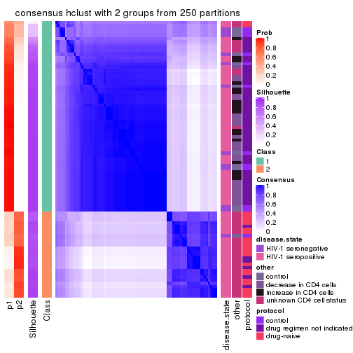</p>

</div>
<div id='tab-CV-hclust-consensus-heatmap-2'>
<pre><code class="r">consensus_heatmap(res, k = 3)
</code></pre>

<p>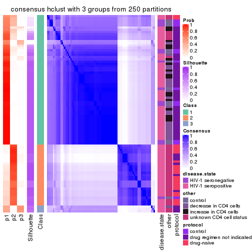</p>

</div>
<div id='tab-CV-hclust-consensus-heatmap-3'>
<pre><code class="r">consensus_heatmap(res, k = 4)
</code></pre>

<p>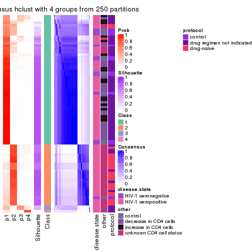</p>

</div>
<div id='tab-CV-hclust-consensus-heatmap-4'>
<pre><code class="r">consensus_heatmap(res, k = 5)
</code></pre>

<p>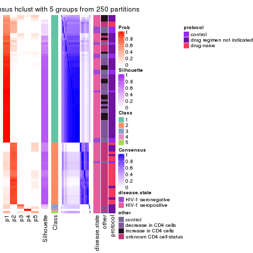</p>

</div>
<div id='tab-CV-hclust-consensus-heatmap-5'>
<pre><code class="r">consensus_heatmap(res, k = 6)
</code></pre>

<p>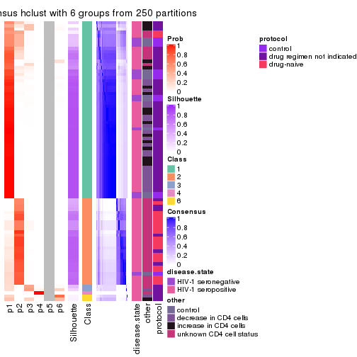</p>

</div>
</div>

Heatmaps for the membership of samples in all partitions to see how consistent they are:


<script>
$( function() {
	$( '#tabs-CV-hclust-membership-heatmap' ).tabs();
} );
</script>
<div id='tabs-CV-hclust-membership-heatmap'>
<ul>
<li><a href='#tab-CV-hclust-membership-heatmap-1'>k = 2</a></li>
<li><a href='#tab-CV-hclust-membership-heatmap-2'>k = 3</a></li>
<li><a href='#tab-CV-hclust-membership-heatmap-3'>k = 4</a></li>
<li><a href='#tab-CV-hclust-membership-heatmap-4'>k = 5</a></li>
<li><a href='#tab-CV-hclust-membership-heatmap-5'>k = 6</a></li>
</ul>
<div id='tab-CV-hclust-membership-heatmap-1'>
<pre><code class="r">membership_heatmap(res, k = 2)
</code></pre>

<p>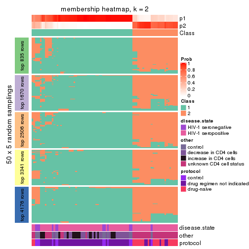</p>

</div>
<div id='tab-CV-hclust-membership-heatmap-2'>
<pre><code class="r">membership_heatmap(res, k = 3)
</code></pre>

<p>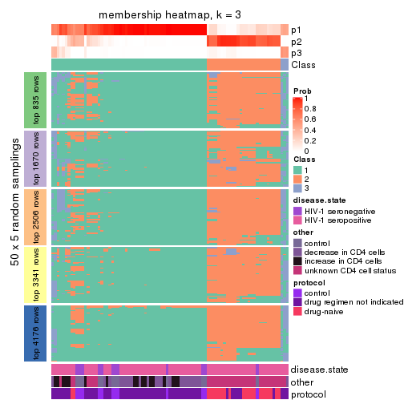</p>

</div>
<div id='tab-CV-hclust-membership-heatmap-3'>
<pre><code class="r">membership_heatmap(res, k = 4)
</code></pre>

<p>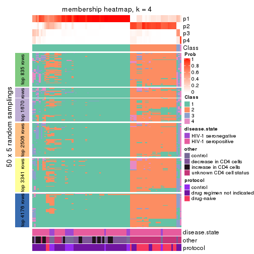</p>

</div>
<div id='tab-CV-hclust-membership-heatmap-4'>
<pre><code class="r">membership_heatmap(res, k = 5)
</code></pre>

<p>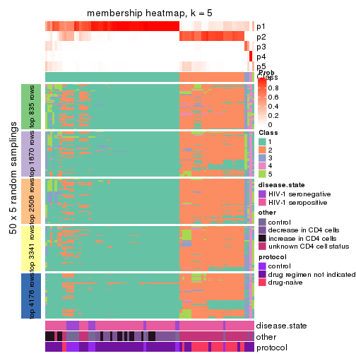</p>

</div>
<div id='tab-CV-hclust-membership-heatmap-5'>
<pre><code class="r">membership_heatmap(res, k = 6)
</code></pre>

<p>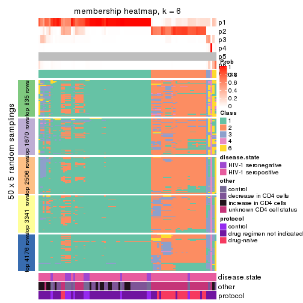</p>

</div>
</div>

As soon as we have had the classes for columns, we can look for signatures
which are significantly different between classes which can be candidate marks
for certain classes. Following are the heatmaps for signatures.


Signature heatmaps where rows are scaled:


<script>
$( function() {
	$( '#tabs-CV-hclust-get-signatures' ).tabs();
} );
</script>
<div id='tabs-CV-hclust-get-signatures'>
<ul>
<li><a href='#tab-CV-hclust-get-signatures-1'>k = 2</a></li>
<li><a href='#tab-CV-hclust-get-signatures-2'>k = 3</a></li>
<li><a href='#tab-CV-hclust-get-signatures-3'>k = 4</a></li>
<li><a href='#tab-CV-hclust-get-signatures-4'>k = 5</a></li>
<li><a href='#tab-CV-hclust-get-signatures-5'>k = 6</a></li>
</ul>
<div id='tab-CV-hclust-get-signatures-1'>
<pre><code class="r">get_signatures(res, k = 2)
</code></pre>

<p>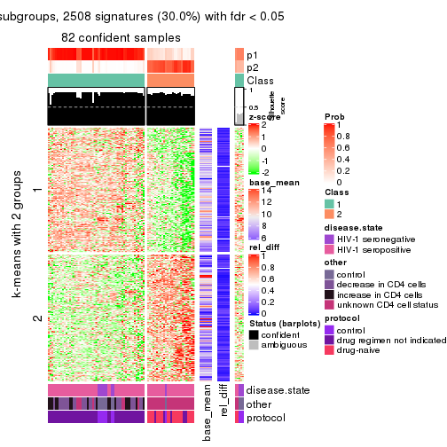</p>

</div>
<div id='tab-CV-hclust-get-signatures-2'>
<pre><code class="r">get_signatures(res, k = 3)
</code></pre>

<p>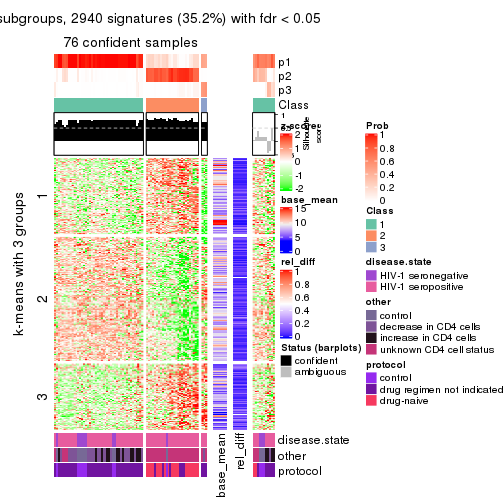</p>

</div>
<div id='tab-CV-hclust-get-signatures-3'>
<pre><code class="r">get_signatures(res, k = 4)
</code></pre>

<p>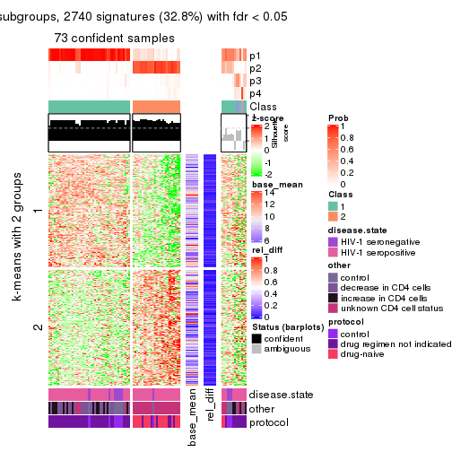</p>

</div>
<div id='tab-CV-hclust-get-signatures-4'>
<pre><code class="r">get_signatures(res, k = 5)
</code></pre>

<p>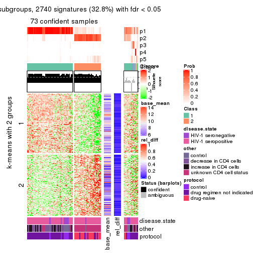</p>

</div>
<div id='tab-CV-hclust-get-signatures-5'>
<pre><code class="r">get_signatures(res, k = 6)
</code></pre>

<p>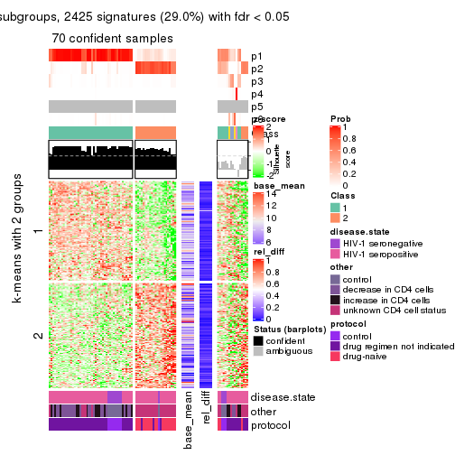</p>

</div>
</div>


Signature heatmaps where rows are not scaled:


<script>
$( function() {
	$( '#tabs-CV-hclust-get-signatures-no-scale' ).tabs();
} );
</script>
<div id='tabs-CV-hclust-get-signatures-no-scale'>
<ul>
<li><a href='#tab-CV-hclust-get-signatures-no-scale-1'>k = 2</a></li>
<li><a href='#tab-CV-hclust-get-signatures-no-scale-2'>k = 3</a></li>
<li><a href='#tab-CV-hclust-get-signatures-no-scale-3'>k = 4</a></li>
<li><a href='#tab-CV-hclust-get-signatures-no-scale-4'>k = 5</a></li>
<li><a href='#tab-CV-hclust-get-signatures-no-scale-5'>k = 6</a></li>
</ul>
<div id='tab-CV-hclust-get-signatures-no-scale-1'>
<pre><code class="r">get_signatures(res, k = 2, scale_rows = FALSE)
</code></pre>

<p>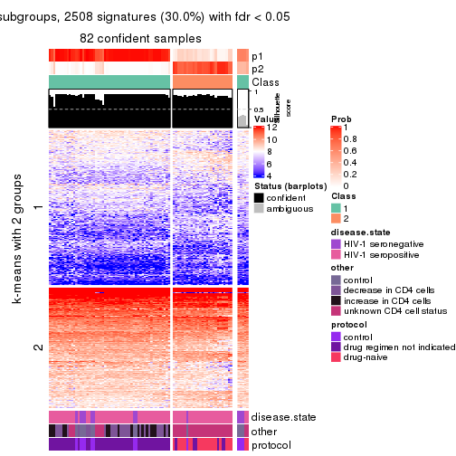</p>

</div>
<div id='tab-CV-hclust-get-signatures-no-scale-2'>
<pre><code class="r">get_signatures(res, k = 3, scale_rows = FALSE)
</code></pre>

<p>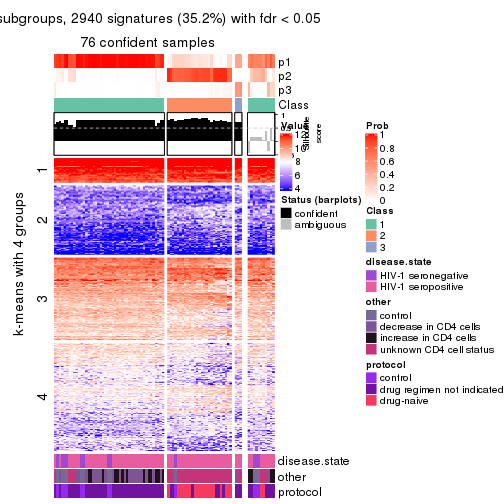</p>

</div>
<div id='tab-CV-hclust-get-signatures-no-scale-3'>
<pre><code class="r">get_signatures(res, k = 4, scale_rows = FALSE)
</code></pre>

<p>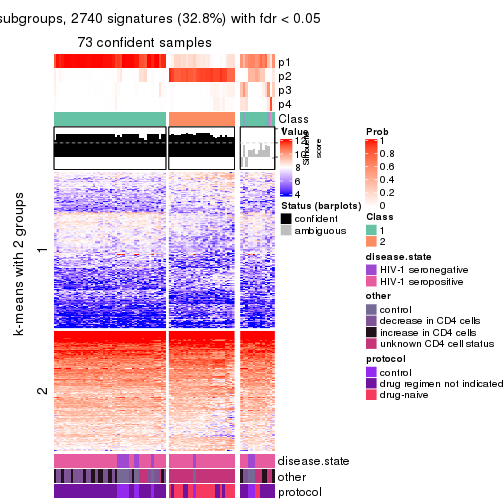</p>

</div>
<div id='tab-CV-hclust-get-signatures-no-scale-4'>
<pre><code class="r">get_signatures(res, k = 5, scale_rows = FALSE)
</code></pre>

<p>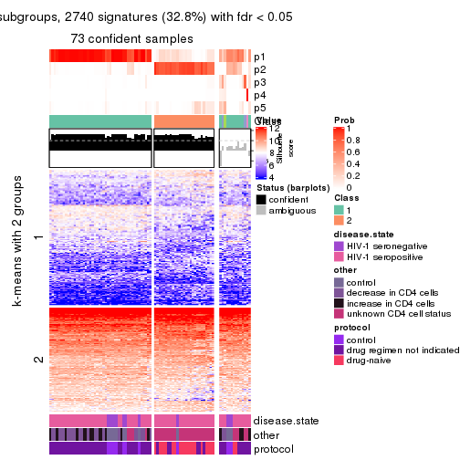</p>

</div>
<div id='tab-CV-hclust-get-signatures-no-scale-5'>
<pre><code class="r">get_signatures(res, k = 6, scale_rows = FALSE)
</code></pre>

<p>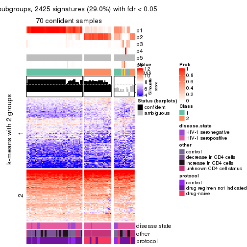</p>

</div>
</div>


Compare the overlap of signatures from different k:

```r
compare_signatures(res)
```

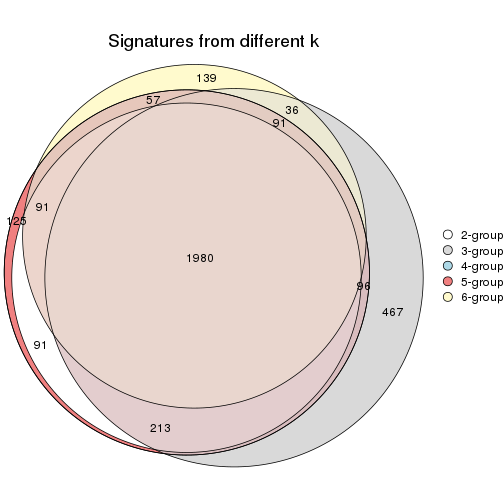

`get_signature()` returns a data frame invisibly. TO get the list of signatures, the function
call should be assigned to a variable explicitly. In following code, if `plot` argument is set
to `FALSE`, no heatmap is plotted while only the differential analysis is performed.

```r
# code only for demonstration
tb = get_signature(res, k = ..., plot = FALSE)
```

An example of the output of `tb` is:

```
#>   which_row         fdr    mean_1    mean_2 scaled_mean_1 scaled_mean_2 km
#> 1        38 0.042760348  8.373488  9.131774    -0.5533452     0.5164555  1
#> 2        40 0.018707592  7.106213  8.469186    -0.6173731     0.5762149  1
#> 3        55 0.019134737 10.221463 11.207825    -0.6159697     0.5749050  1
#> 4        59 0.006059896  5.921854  7.869574    -0.6899429     0.6439467  1
#> 5        60 0.018055526  8.928898 10.211722    -0.6204761     0.5791110  1
#> 6        98 0.009384629 15.714769 14.887706     0.6635654    -0.6193277  2
...
```

The columns in `tb` are:

1. `which_row`: row indices corresponding to the input matrix.
2. `fdr`: FDR for the differential test. 
3. `mean_x`: The mean value in group x.
4. `scaled_mean_x`: The mean value in group x after rows are scaled.
5. `km`: Row groups if k-means clustering is applied to rows.


UMAP plot which shows how samples are separated.


<script>
$( function() {
	$( '#tabs-CV-hclust-dimension-reduction' ).tabs();
} );
</script>
<div id='tabs-CV-hclust-dimension-reduction'>
<ul>
<li><a href='#tab-CV-hclust-dimension-reduction-1'>k = 2</a></li>
<li><a href='#tab-CV-hclust-dimension-reduction-2'>k = 3</a></li>
<li><a href='#tab-CV-hclust-dimension-reduction-3'>k = 4</a></li>
<li><a href='#tab-CV-hclust-dimension-reduction-4'>k = 5</a></li>
<li><a href='#tab-CV-hclust-dimension-reduction-5'>k = 6</a></li>
</ul>
<div id='tab-CV-hclust-dimension-reduction-1'>
<pre><code class="r">dimension_reduction(res, k = 2, method = &quot;UMAP&quot;)
</code></pre>

<p>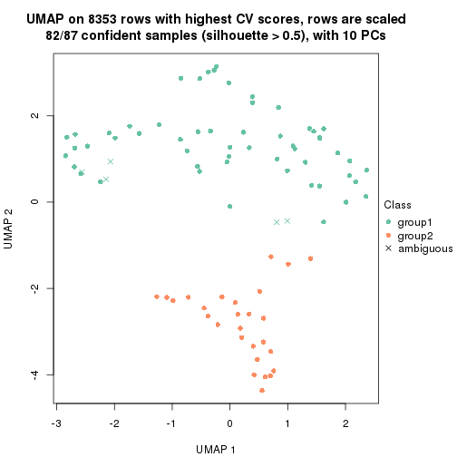</p>

</div>
<div id='tab-CV-hclust-dimension-reduction-2'>
<pre><code class="r">dimension_reduction(res, k = 3, method = &quot;UMAP&quot;)
</code></pre>

<p>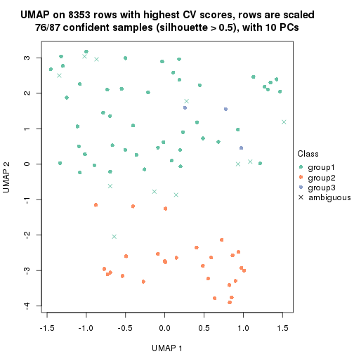</p>

</div>
<div id='tab-CV-hclust-dimension-reduction-3'>
<pre><code class="r">dimension_reduction(res, k = 4, method = &quot;UMAP&quot;)
</code></pre>

<p>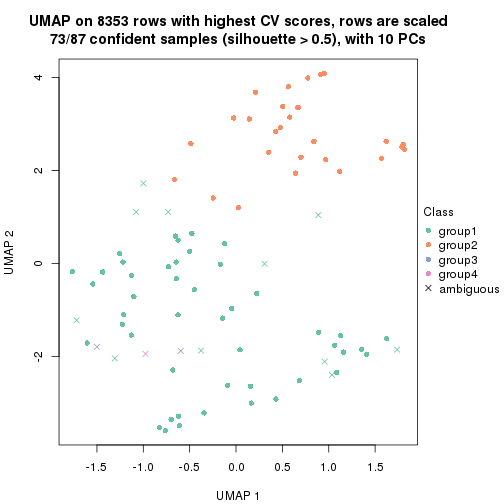</p>

</div>
<div id='tab-CV-hclust-dimension-reduction-4'>
<pre><code class="r">dimension_reduction(res, k = 5, method = &quot;UMAP&quot;)
</code></pre>

<p>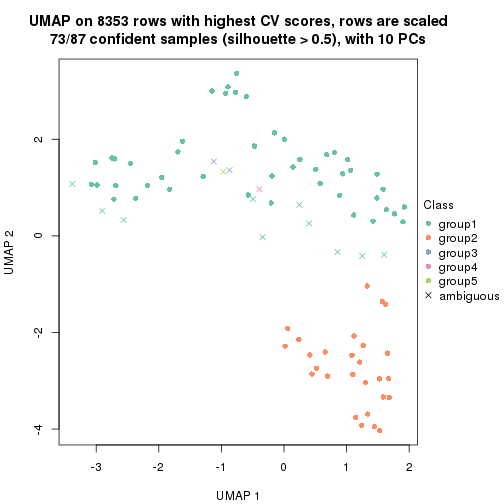</p>

</div>
<div id='tab-CV-hclust-dimension-reduction-5'>
<pre><code class="r">dimension_reduction(res, k = 6, method = &quot;UMAP&quot;)
</code></pre>

<p>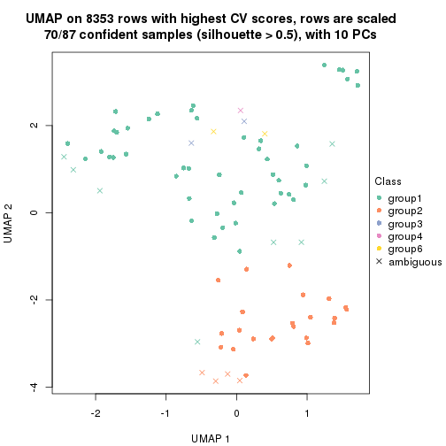</p>

</div>
</div>


Following heatmap shows how subgroups are split when increasing `k`:

```r
collect_classes(res)
```

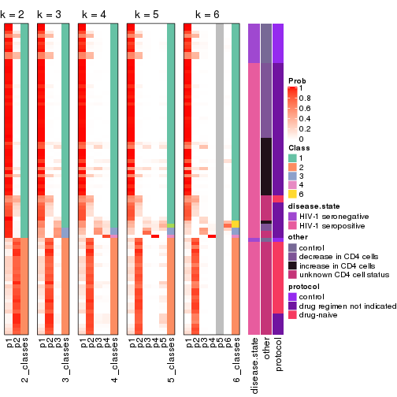


Test correlation between subgroups and known annotations. If the known
annotation is numeric, one-way ANOVA test is applied, and if the known
annotation is discrete, chi-squared contingency table test is applied.

```r
test_to_known_factors(res)
```

```
#>            n disease.state(p) other(p) protocol(p) k
#> CV:hclust 82            0.271 1.83e-11    1.99e-12 2
#> CV:hclust 76            0.176 4.10e-10    3.40e-10 3
#> CV:hclust 73            0.177 9.63e-12    6.37e-11 4
#> CV:hclust 73            0.177 9.63e-12    6.37e-11 5
#> CV:hclust 70            0.268 2.72e-10    2.61e-12 6
```


If matrix rows can be associated to genes, consider to use `GO_Enrichment(res,
...)` to perform function enrichment for the signature genes.


 

---------------------------------------------------


### CV:kmeans


The object with results only for a single top-value method and a single partition method 
can be extracted as:

```r
res = res_list["CV", "kmeans"]
# you can also extract it by
# res = res_list["CV:kmeans"]
```

A summary of `res` and all the functions that can be applied to it:

```r
res
```

```
#> A 'ConsensusPartition' object with k = 2, 3, 4, 5, 6.
#>   On a matrix with 8353 rows and 87 columns.
#>   Top rows (835, 1670, 2506, 3341, 4176) are extracted by 'CV' method.
#>   Subgroups are detected by 'kmeans' method.
#>   Performed in total 1250 partitions by row resampling.
#>   Best k for subgroups seems to be 2.
#> 
#> Following methods can be applied to this 'ConsensusPartition' object:
#>  [1] "cola_report"             "collect_classes"         "collect_plots"          
#>  [4] "collect_stats"           "colnames"                "compare_signatures"     
#>  [7] "consensus_heatmap"       "dimension_reduction"     "functional_enrichment"  
#> [10] "get_anno_col"            "get_anno"                "get_classes"            
#> [13] "get_consensus"           "get_matrix"              "get_membership"         
#> [16] "get_param"               "get_signatures"          "get_stats"              
#> [19] "is_best_k"               "is_stable_k"             "membership_heatmap"     
#> [22] "ncol"                    "nrow"                    "plot_ecdf"              
#> [25] "rownames"                "select_partition_number" "show"                   
#> [28] "suggest_best_k"          "test_to_known_factors"
```

`collect_plots()` function collects all the plots made from `res` for all `k` (number of partitions)
into one single page to provide an easy and fast comparison between different `k`.

```r
collect_plots(res)
```

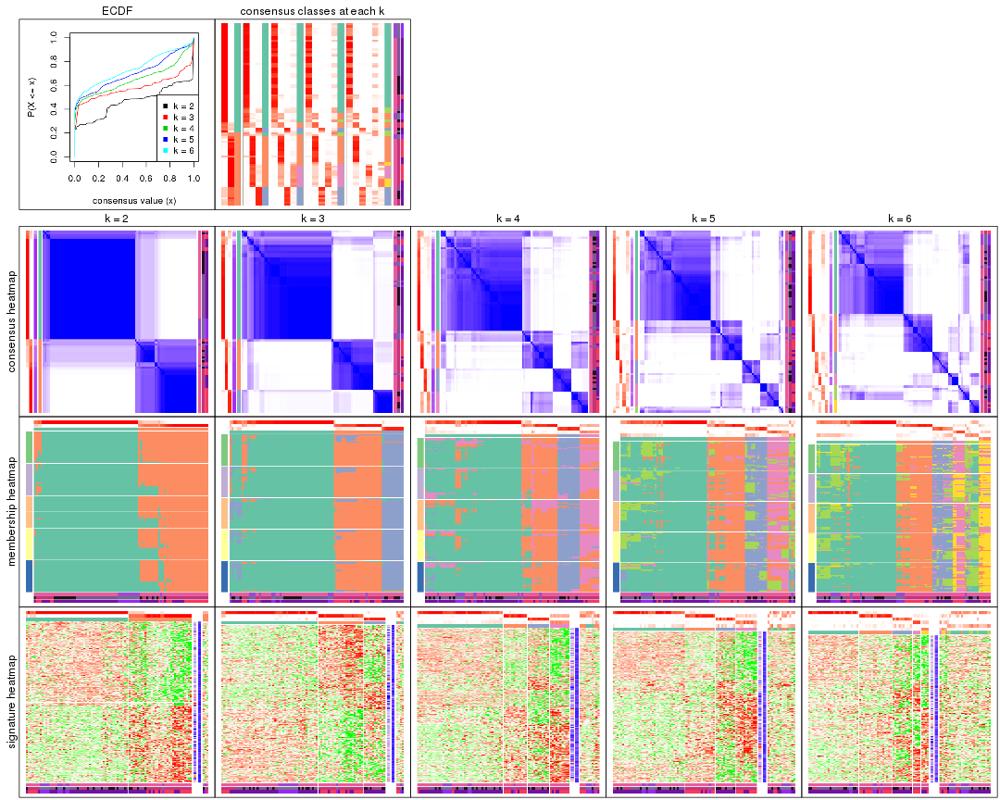

The plots are:

- The first row: a plot of the ECDF (Empirical cumulative distribution
  function) curves of the consensus matrix for each `k` and the heatmap of
  predicted classes for each `k`.
- The second row: heatmaps of the consensus matrix for each `k`.
- The third row: heatmaps of the membership matrix for each `k`.
- The fouth row: heatmaps of the signatures for each `k`.

All the plots in panels can be made by individual functions and they are
plotted later in this section.

`select_partition_number()` produces several plots showing different
statistics for choosing "optimized" `k`. There are following statistics:

- ECDF curves of the consensus matrix for each `k`;
- 1-PAC. [The PAC
  score](https://en.wikipedia.org/wiki/Consensus_clustering#Over-interpretation_potential_of_consensus_clustering)
  measures the proportion of the ambiguous subgrouping.
- Mean silhouette score.
- Concordance. The mean probability of fiting the consensus class ids in all
  partitions.
- Area increased. Denote $A_k$ as the area under the ECDF curve for current
  `k`, the area increased is defined as $A_k - A_{k-1}$.
- Rand index. The percent of pairs of samples that are both in a same cluster
  or both are not in a same cluster in the partition of k and k-1.
- Jaccard index. The ratio of pairs of samples are both in a same cluster in
  the partition of k and k-1 and the pairs of samples are both in a same
  cluster in the partition k or k-1.

The detailed explanations of these statistics can be found in [the cola
vignette](http://bioconductor.org/packages/devel/bioc/vignettes/cola/inst/doc/cola.html#toc_13).

Generally speaking, lower PAC score, higher mean silhouette score or higher
concordance corresponds to better partition. Rand index and Jaccard index
measure how similar the current partition is compared to partition with `k-1`.
If they are too similar, we won't accept `k` is better than `k-1`.

```r
select_partition_number(res)
```

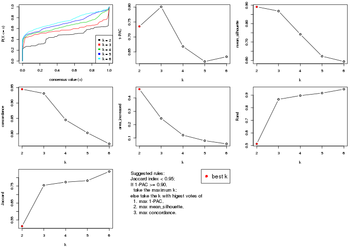

The numeric values for all these statistics can be obtained by `get_stats()`.

```r
get_stats(res)
```

```
#>   k 1-PAC mean_silhouette concordance area_increased  Rand Jaccard
#> 2 2 0.735           0.891       0.945         0.4658 0.513   0.513
#> 3 3 0.801           0.868       0.931         0.2469 0.866   0.755
#> 4 4 0.668           0.742       0.845         0.1214 0.896   0.773
#> 5 5 0.618           0.623       0.803         0.0799 0.916   0.782
#> 6 6 0.634           0.594       0.767         0.0562 0.947   0.836
```

`suggest_best_k()` suggests the best $k$ based on these statistics. The rules are as follows:

- All $k$ with Jaccard index larger than 0.95 are removed because the increase of
  the partition number does not provides enough extra information. If all $k$ are removed,
  the best $k$ is assigned by `NA`.
- For $k$ with 1-PAC larger than 0.9, the maximal $k$ is taken as the "best k". Other $k$ is called "optional k".
- If it does not fit the second rule. The $k$ with the highest vote of highest
  1-PAC, mean silhouette and concordance is taken as the "best k".

```r
suggest_best_k(res)
```

```
#> [1] 2
```


Following shows the table of the partitions (You need to click the **show/hide
code output** link to see it). The membership matrix (columns with name `p*`)
is inferred by
[`clue::cl_consensus()`](https://www.rdocumentation.org/link/cl_consensus?package=clue)
function with the `SE` method. Basically the value in the membership matrix
represents the probability to belong to a certain group. The finall class
label for an item is determined with the group with highest probability it
belongs to.

In `get_classes()` function, the entropy is calculated from the membership
matrix and the silhouette score is calculated from the consensus matrix.


<script>
$( function() {
	$( '#tabs-CV-kmeans-get-classes' ).tabs();
} );
</script>
<div id='tabs-CV-kmeans-get-classes'>
<ul>
<li><a href='#tab-CV-kmeans-get-classes-1'>k = 2</a></li>
<li><a href='#tab-CV-kmeans-get-classes-2'>k = 3</a></li>
<li><a href='#tab-CV-kmeans-get-classes-3'>k = 4</a></li>
<li><a href='#tab-CV-kmeans-get-classes-4'>k = 5</a></li>
<li><a href='#tab-CV-kmeans-get-classes-5'>k = 6</a></li>
</ul>

<div id='tab-CV-kmeans-get-classes-1'>
<p><a id='tab-CV-kmeans-get-classes-1-a' style='color:#0366d6' href='#'>show/hide code output</a></p>
<pre><code class="r">cbind(get_classes(res, k = 2), get_membership(res, k = 2))
</code></pre>

<pre><code>#&gt;          class entropy silhouette    p1    p2
#&gt; GSM39104     1  0.0000      0.978 1.000 0.000
#&gt; GSM39105     1  0.0000      0.978 1.000 0.000
#&gt; GSM39106     1  0.0000      0.978 1.000 0.000
#&gt; GSM39107     1  0.0000      0.978 1.000 0.000
#&gt; GSM39108     1  0.0000      0.978 1.000 0.000
#&gt; GSM39109     2  0.9754      0.473 0.408 0.592
#&gt; GSM39110     1  0.0000      0.978 1.000 0.000
#&gt; GSM39111     1  0.0000      0.978 1.000 0.000
#&gt; GSM39112     1  0.0000      0.978 1.000 0.000
#&gt; GSM39113     1  0.0000      0.978 1.000 0.000
#&gt; GSM39114     2  0.6712      0.769 0.176 0.824
#&gt; GSM39115     1  0.0000      0.978 1.000 0.000
#&gt; GSM39148     1  0.0000      0.978 1.000 0.000
#&gt; GSM39149     2  0.8386      0.719 0.268 0.732
#&gt; GSM39150     1  0.0000      0.978 1.000 0.000
#&gt; GSM39151     2  0.8443      0.715 0.272 0.728
#&gt; GSM39152     1  0.0000      0.978 1.000 0.000
#&gt; GSM39153     1  0.0000      0.978 1.000 0.000
#&gt; GSM39154     1  0.0000      0.978 1.000 0.000
#&gt; GSM39155     1  0.0000      0.978 1.000 0.000
#&gt; GSM39156     1  0.0000      0.978 1.000 0.000
#&gt; GSM39157     1  0.0000      0.978 1.000 0.000
#&gt; GSM39158     1  0.0000      0.978 1.000 0.000
#&gt; GSM39159     1  0.0000      0.978 1.000 0.000
#&gt; GSM39160     1  0.0000      0.978 1.000 0.000
#&gt; GSM39161     1  0.0000      0.978 1.000 0.000
#&gt; GSM39162     1  0.0000      0.978 1.000 0.000
#&gt; GSM39163     1  0.0000      0.978 1.000 0.000
#&gt; GSM39164     1  0.0000      0.978 1.000 0.000
#&gt; GSM39165     1  0.0000      0.978 1.000 0.000
#&gt; GSM39166     1  0.0000      0.978 1.000 0.000
#&gt; GSM39167     1  0.0000      0.978 1.000 0.000
#&gt; GSM39168     1  0.0000      0.978 1.000 0.000
#&gt; GSM39169     1  0.0000      0.978 1.000 0.000
#&gt; GSM39170     1  0.0000      0.978 1.000 0.000
#&gt; GSM39171     1  0.0000      0.978 1.000 0.000
#&gt; GSM39172     2  0.8386      0.719 0.268 0.732
#&gt; GSM39173     2  0.8327      0.723 0.264 0.736
#&gt; GSM39174     1  0.0000      0.978 1.000 0.000
#&gt; GSM39175     1  0.0000      0.978 1.000 0.000
#&gt; GSM39176     1  0.0000      0.978 1.000 0.000
#&gt; GSM39177     1  0.8608      0.535 0.716 0.284
#&gt; GSM39178     1  0.0000      0.978 1.000 0.000
#&gt; GSM39179     2  0.8386      0.719 0.268 0.732
#&gt; GSM39180     2  0.4562      0.843 0.096 0.904
#&gt; GSM39181     1  0.0000      0.978 1.000 0.000
#&gt; GSM39182     2  0.9686      0.498 0.396 0.604
#&gt; GSM39183     1  0.0000      0.978 1.000 0.000
#&gt; GSM39184     1  0.0000      0.978 1.000 0.000
#&gt; GSM39185     1  0.0000      0.978 1.000 0.000
#&gt; GSM39186     1  0.0000      0.978 1.000 0.000
#&gt; GSM39187     1  0.0000      0.978 1.000 0.000
#&gt; GSM39116     2  0.0000      0.880 0.000 1.000
#&gt; GSM39117     2  0.0000      0.880 0.000 1.000
#&gt; GSM39118     2  0.0000      0.880 0.000 1.000
#&gt; GSM39119     2  0.0000      0.880 0.000 1.000
#&gt; GSM39120     1  0.0000      0.978 1.000 0.000
#&gt; GSM39121     1  0.6801      0.754 0.820 0.180
#&gt; GSM39122     1  0.8661      0.547 0.712 0.288
#&gt; GSM39123     2  0.0000      0.880 0.000 1.000
#&gt; GSM39124     2  0.6247      0.788 0.156 0.844
#&gt; GSM39125     1  0.0000      0.978 1.000 0.000
#&gt; GSM39126     1  0.7528      0.692 0.784 0.216
#&gt; GSM39127     2  0.0938      0.877 0.012 0.988
#&gt; GSM39128     2  0.2236      0.867 0.036 0.964
#&gt; GSM39129     2  0.0000      0.880 0.000 1.000
#&gt; GSM39130     2  0.0000      0.880 0.000 1.000
#&gt; GSM39131     2  0.1184      0.876 0.016 0.984
#&gt; GSM39132     2  0.0000      0.880 0.000 1.000
#&gt; GSM39133     2  0.0000      0.880 0.000 1.000
#&gt; GSM39134     2  0.0000      0.880 0.000 1.000
#&gt; GSM39135     2  0.0000      0.880 0.000 1.000
#&gt; GSM39136     2  0.0000      0.880 0.000 1.000
#&gt; GSM39137     2  0.9522      0.477 0.372 0.628
#&gt; GSM39138     2  0.0000      0.880 0.000 1.000
#&gt; GSM39139     2  0.0000      0.880 0.000 1.000
#&gt; GSM39140     1  0.0000      0.978 1.000 0.000
#&gt; GSM39141     1  0.0000      0.978 1.000 0.000
#&gt; GSM39142     1  0.0000      0.978 1.000 0.000
#&gt; GSM39143     1  0.0000      0.978 1.000 0.000
#&gt; GSM39144     2  0.0000      0.880 0.000 1.000
#&gt; GSM39145     2  0.0000      0.880 0.000 1.000
#&gt; GSM39146     2  0.0000      0.880 0.000 1.000
#&gt; GSM39147     2  0.0000      0.880 0.000 1.000
#&gt; GSM39188     2  0.8016      0.742 0.244 0.756
#&gt; GSM39189     2  0.8813      0.675 0.300 0.700
#&gt; GSM39190     2  0.8386      0.719 0.268 0.732
</code></pre>

<script>
$('#tab-CV-kmeans-get-classes-1-a').parent().next().next().hide();
$('#tab-CV-kmeans-get-classes-1-a').click(function(){
  $('#tab-CV-kmeans-get-classes-1-a').parent().next().next().toggle();
  return(false);
});
</script>
</div>

<div id='tab-CV-kmeans-get-classes-2'>
<p><a id='tab-CV-kmeans-get-classes-2-a' style='color:#0366d6' href='#'>show/hide code output</a></p>
<pre><code class="r">cbind(get_classes(res, k = 3), get_membership(res, k = 3))
</code></pre>

<pre><code>#&gt;          class entropy silhouette    p1    p2    p3
#&gt; GSM39104     1  0.0000     0.9269 1.000 0.000 0.000
#&gt; GSM39105     1  0.0000     0.9269 1.000 0.000 0.000
#&gt; GSM39106     1  0.0592     0.9227 0.988 0.000 0.012
#&gt; GSM39107     1  0.3771     0.8355 0.876 0.112 0.012
#&gt; GSM39108     1  0.0237     0.9258 0.996 0.000 0.004
#&gt; GSM39109     1  0.9587     0.0906 0.440 0.356 0.204
#&gt; GSM39110     1  0.0747     0.9229 0.984 0.000 0.016
#&gt; GSM39111     1  0.0237     0.9250 0.996 0.000 0.004
#&gt; GSM39112     1  0.2651     0.8817 0.928 0.060 0.012
#&gt; GSM39113     1  0.3845     0.8317 0.872 0.116 0.012
#&gt; GSM39114     2  0.1129     0.9057 0.004 0.976 0.020
#&gt; GSM39115     1  0.0000     0.9269 1.000 0.000 0.000
#&gt; GSM39148     1  0.0237     0.9258 0.996 0.000 0.004
#&gt; GSM39149     3  0.1585     0.9682 0.028 0.008 0.964
#&gt; GSM39150     1  0.0000     0.9269 1.000 0.000 0.000
#&gt; GSM39151     3  0.1585     0.9682 0.028 0.008 0.964
#&gt; GSM39152     3  0.4504     0.7608 0.196 0.000 0.804
#&gt; GSM39153     1  0.0000     0.9269 1.000 0.000 0.000
#&gt; GSM39154     1  0.0000     0.9269 1.000 0.000 0.000
#&gt; GSM39155     1  0.0000     0.9269 1.000 0.000 0.000
#&gt; GSM39156     1  0.0829     0.9208 0.984 0.004 0.012
#&gt; GSM39157     1  0.0000     0.9269 1.000 0.000 0.000
#&gt; GSM39158     1  0.0000     0.9269 1.000 0.000 0.000
#&gt; GSM39159     1  0.3192     0.8335 0.888 0.000 0.112
#&gt; GSM39160     1  0.0000     0.9269 1.000 0.000 0.000
#&gt; GSM39161     1  0.5327     0.6085 0.728 0.000 0.272
#&gt; GSM39162     1  0.0237     0.9258 0.996 0.000 0.004
#&gt; GSM39163     1  0.0000     0.9269 1.000 0.000 0.000
#&gt; GSM39164     1  0.0000     0.9269 1.000 0.000 0.000
#&gt; GSM39165     1  0.2356     0.8769 0.928 0.000 0.072
#&gt; GSM39166     1  0.0000     0.9269 1.000 0.000 0.000
#&gt; GSM39167     1  0.0000     0.9269 1.000 0.000 0.000
#&gt; GSM39168     1  0.0237     0.9258 0.996 0.000 0.004
#&gt; GSM39169     1  0.0000     0.9269 1.000 0.000 0.000
#&gt; GSM39170     1  0.0000     0.9269 1.000 0.000 0.000
#&gt; GSM39171     1  0.0000     0.9269 1.000 0.000 0.000
#&gt; GSM39172     3  0.1585     0.9682 0.028 0.008 0.964
#&gt; GSM39173     3  0.1585     0.9682 0.028 0.008 0.964
#&gt; GSM39174     1  0.0000     0.9269 1.000 0.000 0.000
#&gt; GSM39175     1  0.0000     0.9269 1.000 0.000 0.000
#&gt; GSM39176     1  0.0000     0.9269 1.000 0.000 0.000
#&gt; GSM39177     3  0.2584     0.9293 0.064 0.008 0.928
#&gt; GSM39178     1  0.2959     0.8461 0.900 0.000 0.100
#&gt; GSM39179     3  0.1585     0.9682 0.028 0.008 0.964
#&gt; GSM39180     3  0.1482     0.9579 0.020 0.012 0.968
#&gt; GSM39181     1  0.0000     0.9269 1.000 0.000 0.000
#&gt; GSM39182     1  0.6798     0.3058 0.584 0.016 0.400
#&gt; GSM39183     1  0.0000     0.9269 1.000 0.000 0.000
#&gt; GSM39184     1  0.0000     0.9269 1.000 0.000 0.000
#&gt; GSM39185     1  0.5327     0.6085 0.728 0.000 0.272
#&gt; GSM39186     1  0.0000     0.9269 1.000 0.000 0.000
#&gt; GSM39187     1  0.0000     0.9269 1.000 0.000 0.000
#&gt; GSM39116     2  0.0424     0.9091 0.000 0.992 0.008
#&gt; GSM39117     2  0.4452     0.8330 0.000 0.808 0.192
#&gt; GSM39118     2  0.3038     0.8900 0.000 0.896 0.104
#&gt; GSM39119     2  0.3482     0.8779 0.000 0.872 0.128
#&gt; GSM39120     1  0.1337     0.9141 0.972 0.016 0.012
#&gt; GSM39121     1  0.6448     0.5360 0.656 0.328 0.016
#&gt; GSM39122     1  0.6994     0.2966 0.556 0.424 0.020
#&gt; GSM39123     2  0.4452     0.8330 0.000 0.808 0.192
#&gt; GSM39124     2  0.1129     0.9057 0.004 0.976 0.020
#&gt; GSM39125     1  0.1337     0.9141 0.972 0.016 0.012
#&gt; GSM39126     1  0.6497     0.5210 0.648 0.336 0.016
#&gt; GSM39127     2  0.0892     0.9080 0.000 0.980 0.020
#&gt; GSM39128     2  0.0892     0.9080 0.000 0.980 0.020
#&gt; GSM39129     2  0.3482     0.8802 0.000 0.872 0.128
#&gt; GSM39130     2  0.4452     0.8330 0.000 0.808 0.192
#&gt; GSM39131     2  0.0892     0.9080 0.000 0.980 0.020
#&gt; GSM39132     2  0.0892     0.9080 0.000 0.980 0.020
#&gt; GSM39133     2  0.3192     0.8909 0.000 0.888 0.112
#&gt; GSM39134     2  0.3192     0.8886 0.000 0.888 0.112
#&gt; GSM39135     2  0.0424     0.9091 0.000 0.992 0.008
#&gt; GSM39136     2  0.0424     0.9091 0.000 0.992 0.008
#&gt; GSM39137     2  0.6229     0.4925 0.280 0.700 0.020
#&gt; GSM39138     2  0.3482     0.8802 0.000 0.872 0.128
#&gt; GSM39139     2  0.1643     0.9041 0.000 0.956 0.044
#&gt; GSM39140     1  0.0829     0.9208 0.984 0.004 0.012
#&gt; GSM39141     1  0.0829     0.9208 0.984 0.004 0.012
#&gt; GSM39142     1  0.0829     0.9208 0.984 0.004 0.012
#&gt; GSM39143     1  0.0829     0.9208 0.984 0.004 0.012
#&gt; GSM39144     2  0.3482     0.8802 0.000 0.872 0.128
#&gt; GSM39145     2  0.0424     0.9074 0.000 0.992 0.008
#&gt; GSM39146     2  0.0892     0.9080 0.000 0.980 0.020
#&gt; GSM39147     2  0.0892     0.9080 0.000 0.980 0.020
#&gt; GSM39188     3  0.1585     0.9682 0.028 0.008 0.964
#&gt; GSM39189     3  0.1585     0.9682 0.028 0.008 0.964
#&gt; GSM39190     3  0.1585     0.9682 0.028 0.008 0.964
</code></pre>

<script>
$('#tab-CV-kmeans-get-classes-2-a').parent().next().next().hide();
$('#tab-CV-kmeans-get-classes-2-a').click(function(){
  $('#tab-CV-kmeans-get-classes-2-a').parent().next().next().toggle();
  return(false);
});
</script>
</div>

<div id='tab-CV-kmeans-get-classes-3'>
<p><a id='tab-CV-kmeans-get-classes-3-a' style='color:#0366d6' href='#'>show/hide code output</a></p>
<pre><code class="r">cbind(get_classes(res, k = 4), get_membership(res, k = 4))
</code></pre>

<pre><code>#&gt;          class entropy silhouette    p1    p2    p3    p4
#&gt; GSM39104     1  0.2125     0.8726 0.920 0.000 0.004 0.076
#&gt; GSM39105     1  0.0336     0.8862 0.992 0.000 0.000 0.008
#&gt; GSM39106     1  0.3090     0.8395 0.888 0.056 0.000 0.056
#&gt; GSM39107     1  0.5964     0.1104 0.536 0.424 0.000 0.040
#&gt; GSM39108     1  0.2644     0.8575 0.908 0.032 0.000 0.060
#&gt; GSM39109     2  0.7987     0.3653 0.256 0.544 0.044 0.156
#&gt; GSM39110     1  0.3689     0.8405 0.860 0.048 0.004 0.088
#&gt; GSM39111     1  0.2860     0.8630 0.888 0.008 0.004 0.100
#&gt; GSM39112     1  0.5835     0.2787 0.588 0.372 0.000 0.040
#&gt; GSM39113     1  0.6074    -0.0204 0.500 0.456 0.000 0.044
#&gt; GSM39114     2  0.2565     0.6071 0.056 0.912 0.000 0.032
#&gt; GSM39115     1  0.0000     0.8869 1.000 0.000 0.000 0.000
#&gt; GSM39148     1  0.0000     0.8869 1.000 0.000 0.000 0.000
#&gt; GSM39149     3  0.1743     0.9290 0.004 0.000 0.940 0.056
#&gt; GSM39150     1  0.3249     0.8355 0.852 0.000 0.008 0.140
#&gt; GSM39151     3  0.1489     0.9304 0.004 0.000 0.952 0.044
#&gt; GSM39152     3  0.4546     0.8180 0.056 0.004 0.804 0.136
#&gt; GSM39153     1  0.0000     0.8869 1.000 0.000 0.000 0.000
#&gt; GSM39154     1  0.0188     0.8867 0.996 0.000 0.000 0.004
#&gt; GSM39155     1  0.0000     0.8869 1.000 0.000 0.000 0.000
#&gt; GSM39156     1  0.1584     0.8718 0.952 0.012 0.000 0.036
#&gt; GSM39157     1  0.0000     0.8869 1.000 0.000 0.000 0.000
#&gt; GSM39158     1  0.2197     0.8625 0.916 0.000 0.004 0.080
#&gt; GSM39159     1  0.5077     0.7531 0.760 0.000 0.080 0.160
#&gt; GSM39160     1  0.3401     0.8299 0.840 0.000 0.008 0.152
#&gt; GSM39161     1  0.6323     0.6166 0.660 0.000 0.176 0.164
#&gt; GSM39162     1  0.0188     0.8860 0.996 0.004 0.000 0.000
#&gt; GSM39163     1  0.0000     0.8869 1.000 0.000 0.000 0.000
#&gt; GSM39164     1  0.0000     0.8869 1.000 0.000 0.000 0.000
#&gt; GSM39165     1  0.3818     0.8341 0.844 0.000 0.048 0.108
#&gt; GSM39166     1  0.2888     0.8424 0.872 0.000 0.004 0.124
#&gt; GSM39167     1  0.0000     0.8869 1.000 0.000 0.000 0.000
#&gt; GSM39168     1  0.0000     0.8869 1.000 0.000 0.000 0.000
#&gt; GSM39169     1  0.0336     0.8865 0.992 0.000 0.000 0.008
#&gt; GSM39170     1  0.2334     0.8589 0.908 0.000 0.004 0.088
#&gt; GSM39171     1  0.2675     0.8578 0.892 0.000 0.008 0.100
#&gt; GSM39172     3  0.2530     0.9172 0.004 0.000 0.896 0.100
#&gt; GSM39173     3  0.1902     0.9322 0.004 0.000 0.932 0.064
#&gt; GSM39174     1  0.0000     0.8869 1.000 0.000 0.000 0.000
#&gt; GSM39175     1  0.0188     0.8867 0.996 0.000 0.000 0.004
#&gt; GSM39176     1  0.0000     0.8869 1.000 0.000 0.000 0.000
#&gt; GSM39177     3  0.0895     0.9370 0.004 0.000 0.976 0.020
#&gt; GSM39178     1  0.5102     0.7488 0.748 0.000 0.064 0.188
#&gt; GSM39179     3  0.1576     0.9300 0.004 0.000 0.948 0.048
#&gt; GSM39180     3  0.2401     0.9240 0.004 0.000 0.904 0.092
#&gt; GSM39181     1  0.2773     0.8457 0.880 0.000 0.004 0.116
#&gt; GSM39182     1  0.8970     0.2886 0.480 0.108 0.208 0.204
#&gt; GSM39183     1  0.2888     0.8424 0.872 0.000 0.004 0.124
#&gt; GSM39184     1  0.0336     0.8865 0.992 0.000 0.000 0.008
#&gt; GSM39185     1  0.6439     0.6044 0.648 0.000 0.176 0.176
#&gt; GSM39186     1  0.0336     0.8865 0.992 0.000 0.000 0.008
#&gt; GSM39187     1  0.0000     0.8869 1.000 0.000 0.000 0.000
#&gt; GSM39116     2  0.1716     0.5341 0.000 0.936 0.000 0.064
#&gt; GSM39117     4  0.5800     0.8293 0.000 0.420 0.032 0.548
#&gt; GSM39118     2  0.4989    -0.7791 0.000 0.528 0.000 0.472
#&gt; GSM39119     4  0.4916     0.8436 0.000 0.424 0.000 0.576
#&gt; GSM39120     1  0.4423     0.7123 0.792 0.168 0.000 0.040
#&gt; GSM39121     2  0.5599     0.4197 0.352 0.616 0.000 0.032
#&gt; GSM39122     2  0.5453     0.4428 0.320 0.648 0.000 0.032
#&gt; GSM39123     4  0.5800     0.8293 0.000 0.420 0.032 0.548
#&gt; GSM39124     2  0.1302     0.6210 0.044 0.956 0.000 0.000
#&gt; GSM39125     1  0.2892     0.8329 0.896 0.068 0.000 0.036
#&gt; GSM39126     2  0.5599     0.4197 0.352 0.616 0.000 0.032
#&gt; GSM39127     2  0.0524     0.6104 0.004 0.988 0.000 0.008
#&gt; GSM39128     2  0.0927     0.6180 0.016 0.976 0.000 0.008
#&gt; GSM39129     4  0.4872     0.8213 0.000 0.356 0.004 0.640
#&gt; GSM39130     4  0.5800     0.8293 0.000 0.420 0.032 0.548
#&gt; GSM39131     2  0.1297     0.6203 0.016 0.964 0.000 0.020
#&gt; GSM39132     2  0.0592     0.6032 0.000 0.984 0.000 0.016
#&gt; GSM39133     4  0.5466     0.8274 0.000 0.436 0.016 0.548
#&gt; GSM39134     4  0.4999     0.8009 0.000 0.492 0.000 0.508
#&gt; GSM39135     2  0.1716     0.5341 0.000 0.936 0.000 0.064
#&gt; GSM39136     2  0.1716     0.5341 0.000 0.936 0.000 0.064
#&gt; GSM39137     2  0.4152     0.5446 0.160 0.808 0.000 0.032
#&gt; GSM39138     4  0.4872     0.8213 0.000 0.356 0.004 0.640
#&gt; GSM39139     4  0.5126     0.7395 0.000 0.444 0.004 0.552
#&gt; GSM39140     1  0.1610     0.8698 0.952 0.016 0.000 0.032
#&gt; GSM39141     1  0.0804     0.8816 0.980 0.008 0.000 0.012
#&gt; GSM39142     1  0.0804     0.8816 0.980 0.008 0.000 0.012
#&gt; GSM39143     1  0.0804     0.8816 0.980 0.008 0.000 0.012
#&gt; GSM39144     4  0.4872     0.8213 0.000 0.356 0.004 0.640
#&gt; GSM39145     2  0.3982     0.3464 0.000 0.776 0.004 0.220
#&gt; GSM39146     2  0.0469     0.6031 0.000 0.988 0.000 0.012
#&gt; GSM39147     2  0.0895     0.6094 0.004 0.976 0.000 0.020
#&gt; GSM39188     3  0.1661     0.9284 0.004 0.000 0.944 0.052
#&gt; GSM39189     3  0.2401     0.9204 0.004 0.000 0.904 0.092
#&gt; GSM39190     3  0.1209     0.9355 0.004 0.000 0.964 0.032
</code></pre>

<script>
$('#tab-CV-kmeans-get-classes-3-a').parent().next().next().hide();
$('#tab-CV-kmeans-get-classes-3-a').click(function(){
  $('#tab-CV-kmeans-get-classes-3-a').parent().next().next().toggle();
  return(false);
});
</script>
</div>

<div id='tab-CV-kmeans-get-classes-4'>
<p><a id='tab-CV-kmeans-get-classes-4-a' style='color:#0366d6' href='#'>show/hide code output</a></p>
<pre><code class="r">cbind(get_classes(res, k = 5), get_membership(res, k = 5))
</code></pre>

<pre><code>#&gt;          class entropy silhouette    p1    p2    p3    p4    p5
#&gt; GSM39104     1  0.3737     0.6361 0.764 0.004 0.000 0.008 0.224
#&gt; GSM39105     1  0.2471     0.7289 0.864 0.000 0.000 0.000 0.136
#&gt; GSM39106     1  0.4975     0.5478 0.712 0.076 0.000 0.008 0.204
#&gt; GSM39107     2  0.5804     0.1822 0.352 0.544 0.000 0.000 0.104
#&gt; GSM39108     1  0.4436     0.6026 0.744 0.040 0.000 0.008 0.208
#&gt; GSM39109     5  0.7081    -0.0530 0.132 0.416 0.012 0.024 0.416
#&gt; GSM39110     1  0.5321     0.4877 0.672 0.068 0.004 0.008 0.248
#&gt; GSM39111     1  0.4568     0.5734 0.716 0.024 0.004 0.008 0.248
#&gt; GSM39112     2  0.5933    -0.0160 0.444 0.452 0.000 0.000 0.104
#&gt; GSM39113     2  0.5902     0.2101 0.320 0.556 0.000 0.000 0.124
#&gt; GSM39114     2  0.1386     0.6809 0.032 0.952 0.000 0.000 0.016
#&gt; GSM39115     1  0.0404     0.8021 0.988 0.000 0.000 0.000 0.012
#&gt; GSM39148     1  0.0000     0.8029 1.000 0.000 0.000 0.000 0.000
#&gt; GSM39149     3  0.0912     0.7812 0.000 0.000 0.972 0.012 0.016
#&gt; GSM39150     1  0.3741     0.5940 0.732 0.000 0.000 0.004 0.264
#&gt; GSM39151     3  0.1493     0.7715 0.000 0.000 0.948 0.024 0.028
#&gt; GSM39152     3  0.5670     0.4725 0.040 0.004 0.476 0.012 0.468
#&gt; GSM39153     1  0.0000     0.8029 1.000 0.000 0.000 0.000 0.000
#&gt; GSM39154     1  0.0290     0.8027 0.992 0.000 0.000 0.000 0.008
#&gt; GSM39155     1  0.0162     0.8031 0.996 0.000 0.000 0.000 0.004
#&gt; GSM39156     1  0.2411     0.7351 0.884 0.008 0.000 0.000 0.108
#&gt; GSM39157     1  0.0162     0.8031 0.996 0.000 0.000 0.000 0.004
#&gt; GSM39158     1  0.3039     0.6818 0.836 0.000 0.000 0.012 0.152
#&gt; GSM39159     1  0.4745    -0.0378 0.560 0.000 0.004 0.012 0.424
#&gt; GSM39160     1  0.3906     0.5505 0.704 0.000 0.000 0.004 0.292
#&gt; GSM39161     1  0.5305    -0.1675 0.524 0.000 0.028 0.012 0.436
#&gt; GSM39162     1  0.0000     0.8029 1.000 0.000 0.000 0.000 0.000
#&gt; GSM39163     1  0.0162     0.8031 0.996 0.000 0.000 0.000 0.004
#&gt; GSM39164     1  0.0162     0.8031 0.996 0.000 0.000 0.000 0.004
#&gt; GSM39165     1  0.4065     0.6106 0.760 0.000 0.020 0.008 0.212
#&gt; GSM39166     1  0.3462     0.6353 0.792 0.000 0.000 0.012 0.196
#&gt; GSM39167     1  0.0162     0.8031 0.996 0.000 0.000 0.000 0.004
#&gt; GSM39168     1  0.0000     0.8029 1.000 0.000 0.000 0.000 0.000
#&gt; GSM39169     1  0.0162     0.8031 0.996 0.000 0.000 0.000 0.004
#&gt; GSM39170     1  0.2997     0.6863 0.840 0.000 0.000 0.012 0.148
#&gt; GSM39171     1  0.2971     0.7125 0.836 0.000 0.000 0.008 0.156
#&gt; GSM39172     3  0.4930     0.7276 0.000 0.000 0.580 0.032 0.388
#&gt; GSM39173     3  0.4520     0.7880 0.000 0.000 0.684 0.032 0.284
#&gt; GSM39174     1  0.0162     0.8031 0.996 0.000 0.000 0.000 0.004
#&gt; GSM39175     1  0.0404     0.8016 0.988 0.000 0.000 0.000 0.012
#&gt; GSM39176     1  0.0000     0.8029 1.000 0.000 0.000 0.000 0.000
#&gt; GSM39177     3  0.3039     0.8088 0.000 0.000 0.836 0.012 0.152
#&gt; GSM39178     5  0.4283    -0.0071 0.456 0.000 0.000 0.000 0.544
#&gt; GSM39179     3  0.1106     0.7887 0.000 0.000 0.964 0.012 0.024
#&gt; GSM39180     3  0.4661     0.7821 0.000 0.000 0.656 0.032 0.312
#&gt; GSM39181     1  0.3355     0.6457 0.804 0.000 0.000 0.012 0.184
#&gt; GSM39182     5  0.6267     0.2247 0.200 0.032 0.064 0.040 0.664
#&gt; GSM39183     1  0.3530     0.6270 0.784 0.000 0.000 0.012 0.204
#&gt; GSM39184     1  0.0290     0.8027 0.992 0.000 0.000 0.000 0.008
#&gt; GSM39185     1  0.5329    -0.2598 0.488 0.000 0.028 0.012 0.472
#&gt; GSM39186     1  0.0404     0.8014 0.988 0.000 0.000 0.000 0.012
#&gt; GSM39187     1  0.0000     0.8029 1.000 0.000 0.000 0.000 0.000
#&gt; GSM39116     2  0.2580     0.5948 0.000 0.892 0.000 0.064 0.044
#&gt; GSM39117     4  0.6547     0.7510 0.000 0.216 0.004 0.504 0.276
#&gt; GSM39118     4  0.4820     0.7231 0.000 0.332 0.000 0.632 0.036
#&gt; GSM39119     4  0.5223     0.7921 0.000 0.220 0.000 0.672 0.108
#&gt; GSM39120     1  0.5649     0.1931 0.596 0.296 0.000 0.000 0.108
#&gt; GSM39121     2  0.3659     0.5441 0.220 0.768 0.000 0.000 0.012
#&gt; GSM39122     2  0.3659     0.5441 0.220 0.768 0.000 0.000 0.012
#&gt; GSM39123     4  0.6547     0.7510 0.000 0.216 0.004 0.504 0.276
#&gt; GSM39124     2  0.1211     0.6852 0.024 0.960 0.000 0.016 0.000
#&gt; GSM39125     1  0.4370     0.4974 0.744 0.200 0.000 0.000 0.056
#&gt; GSM39126     2  0.4024     0.5297 0.220 0.752 0.000 0.000 0.028
#&gt; GSM39127     2  0.0794     0.6714 0.000 0.972 0.000 0.028 0.000
#&gt; GSM39128     2  0.0992     0.6789 0.008 0.968 0.000 0.024 0.000
#&gt; GSM39129     4  0.3093     0.7700 0.000 0.168 0.000 0.824 0.008
#&gt; GSM39130     4  0.6547     0.7510 0.000 0.216 0.004 0.504 0.276
#&gt; GSM39131     2  0.0162     0.6806 0.004 0.996 0.000 0.000 0.000
#&gt; GSM39132     2  0.0794     0.6714 0.000 0.972 0.000 0.028 0.000
#&gt; GSM39133     4  0.6423     0.7495 0.000 0.220 0.000 0.504 0.276
#&gt; GSM39134     4  0.5404     0.7695 0.000 0.292 0.000 0.620 0.088
#&gt; GSM39135     2  0.2645     0.5887 0.000 0.888 0.000 0.068 0.044
#&gt; GSM39136     2  0.2580     0.5948 0.000 0.892 0.000 0.064 0.044
#&gt; GSM39137     2  0.2020     0.6653 0.100 0.900 0.000 0.000 0.000
#&gt; GSM39138     4  0.2813     0.7697 0.000 0.168 0.000 0.832 0.000
#&gt; GSM39139     4  0.3983     0.6083 0.000 0.340 0.000 0.660 0.000
#&gt; GSM39140     1  0.1648     0.7722 0.940 0.040 0.000 0.000 0.020
#&gt; GSM39141     1  0.0912     0.7925 0.972 0.012 0.000 0.000 0.016
#&gt; GSM39142     1  0.0912     0.7925 0.972 0.012 0.000 0.000 0.016
#&gt; GSM39143     1  0.0912     0.7925 0.972 0.012 0.000 0.000 0.016
#&gt; GSM39144     4  0.2813     0.7697 0.000 0.168 0.000 0.832 0.000
#&gt; GSM39145     2  0.4278    -0.1513 0.000 0.548 0.000 0.452 0.000
#&gt; GSM39146     2  0.1493     0.6556 0.000 0.948 0.000 0.028 0.024
#&gt; GSM39147     2  0.1124     0.6740 0.004 0.960 0.000 0.036 0.000
#&gt; GSM39188     3  0.2520     0.7694 0.000 0.000 0.896 0.048 0.056
#&gt; GSM39189     3  0.4763     0.7559 0.000 0.000 0.632 0.032 0.336
#&gt; GSM39190     3  0.3848     0.8067 0.000 0.000 0.788 0.040 0.172
</code></pre>

<script>
$('#tab-CV-kmeans-get-classes-4-a').parent().next().next().hide();
$('#tab-CV-kmeans-get-classes-4-a').click(function(){
  $('#tab-CV-kmeans-get-classes-4-a').parent().next().next().toggle();
  return(false);
});
</script>
</div>

<div id='tab-CV-kmeans-get-classes-5'>
<p><a id='tab-CV-kmeans-get-classes-5-a' style='color:#0366d6' href='#'>show/hide code output</a></p>
<pre><code class="r">cbind(get_classes(res, k = 6), get_membership(res, k = 6))
</code></pre>

<pre><code>#&gt;          class entropy silhouette    p1    p2    p3    p4    p5    p6
#&gt; GSM39104     1  0.4527   0.460309 0.624 0.004 0.000 0.000 0.332 0.040
#&gt; GSM39105     1  0.2790   0.692665 0.840 0.000 0.000 0.000 0.140 0.020
#&gt; GSM39106     1  0.5451   0.389350 0.572 0.052 0.000 0.000 0.332 0.044
#&gt; GSM39107     2  0.5685   0.558330 0.184 0.632 0.000 0.000 0.136 0.048
#&gt; GSM39108     1  0.4974   0.427419 0.600 0.024 0.000 0.000 0.336 0.040
#&gt; GSM39109     5  0.6598  -0.089051 0.052 0.340 0.032 0.008 0.508 0.060
#&gt; GSM39110     1  0.5488   0.346343 0.552 0.036 0.004 0.000 0.360 0.048
#&gt; GSM39111     1  0.5038   0.385605 0.576 0.016 0.004 0.000 0.364 0.040
#&gt; GSM39112     2  0.6339   0.263994 0.336 0.480 0.000 0.000 0.136 0.048
#&gt; GSM39113     2  0.5731   0.565716 0.160 0.632 0.000 0.000 0.156 0.052
#&gt; GSM39114     2  0.1767   0.782401 0.012 0.932 0.000 0.000 0.036 0.020
#&gt; GSM39115     1  0.0603   0.765271 0.980 0.000 0.000 0.000 0.016 0.004
#&gt; GSM39148     1  0.0146   0.769975 0.996 0.000 0.000 0.000 0.004 0.000
#&gt; GSM39149     3  0.2763   0.716766 0.000 0.000 0.868 0.036 0.008 0.088
#&gt; GSM39150     1  0.4109   0.220445 0.576 0.000 0.000 0.000 0.412 0.012
#&gt; GSM39151     3  0.3993   0.683483 0.000 0.000 0.788 0.028 0.060 0.124
#&gt; GSM39152     5  0.4784  -0.408761 0.012 0.000 0.404 0.004 0.556 0.024
#&gt; GSM39153     1  0.0146   0.770165 0.996 0.000 0.000 0.000 0.000 0.004
#&gt; GSM39154     1  0.0000   0.770579 1.000 0.000 0.000 0.000 0.000 0.000
#&gt; GSM39155     1  0.0000   0.770579 1.000 0.000 0.000 0.000 0.000 0.000
#&gt; GSM39156     1  0.2851   0.687480 0.844 0.004 0.000 0.000 0.132 0.020
#&gt; GSM39157     1  0.0000   0.770579 1.000 0.000 0.000 0.000 0.000 0.000
#&gt; GSM39158     1  0.3536   0.481792 0.736 0.000 0.000 0.008 0.252 0.004
#&gt; GSM39159     5  0.4589   0.379449 0.432 0.000 0.004 0.008 0.540 0.016
#&gt; GSM39160     1  0.4116   0.280262 0.572 0.000 0.000 0.000 0.416 0.012
#&gt; GSM39161     5  0.4902   0.454198 0.400 0.000 0.016 0.012 0.556 0.016
#&gt; GSM39162     1  0.0260   0.769170 0.992 0.000 0.000 0.000 0.008 0.000
#&gt; GSM39163     1  0.0000   0.770579 1.000 0.000 0.000 0.000 0.000 0.000
#&gt; GSM39164     1  0.0000   0.770579 1.000 0.000 0.000 0.000 0.000 0.000
#&gt; GSM39165     1  0.4110   0.514398 0.712 0.000 0.032 0.000 0.248 0.008
#&gt; GSM39166     1  0.4031   0.331178 0.652 0.000 0.000 0.008 0.332 0.008
#&gt; GSM39167     1  0.0000   0.770579 1.000 0.000 0.000 0.000 0.000 0.000
#&gt; GSM39168     1  0.0260   0.769170 0.992 0.000 0.000 0.000 0.008 0.000
#&gt; GSM39169     1  0.0146   0.769922 0.996 0.000 0.000 0.000 0.004 0.000
#&gt; GSM39170     1  0.3714   0.461481 0.720 0.000 0.000 0.008 0.264 0.008
#&gt; GSM39171     1  0.3081   0.613994 0.776 0.000 0.000 0.000 0.220 0.004
#&gt; GSM39172     3  0.5702   0.624669 0.000 0.000 0.524 0.056 0.368 0.052
#&gt; GSM39173     3  0.5082   0.709305 0.000 0.000 0.628 0.016 0.280 0.076
#&gt; GSM39174     1  0.0000   0.770579 1.000 0.000 0.000 0.000 0.000 0.000
#&gt; GSM39175     1  0.0000   0.770579 1.000 0.000 0.000 0.000 0.000 0.000
#&gt; GSM39176     1  0.0000   0.770579 1.000 0.000 0.000 0.000 0.000 0.000
#&gt; GSM39177     3  0.3917   0.731468 0.000 0.000 0.780 0.024 0.156 0.040
#&gt; GSM39178     5  0.3636   0.470961 0.320 0.000 0.000 0.000 0.676 0.004
#&gt; GSM39179     3  0.3063   0.720847 0.000 0.000 0.860 0.024 0.052 0.064
#&gt; GSM39180     3  0.5550   0.686850 0.000 0.000 0.576 0.028 0.308 0.088
#&gt; GSM39181     1  0.3950   0.364928 0.672 0.000 0.000 0.008 0.312 0.008
#&gt; GSM39182     5  0.7406  -0.000111 0.064 0.028 0.112 0.260 0.504 0.032
#&gt; GSM39183     1  0.4031   0.331178 0.652 0.000 0.000 0.008 0.332 0.008
#&gt; GSM39184     1  0.0000   0.770579 1.000 0.000 0.000 0.000 0.000 0.000
#&gt; GSM39185     5  0.4666   0.484855 0.372 0.000 0.012 0.008 0.592 0.016
#&gt; GSM39186     1  0.0363   0.765894 0.988 0.000 0.000 0.000 0.012 0.000
#&gt; GSM39187     1  0.0000   0.770579 1.000 0.000 0.000 0.000 0.000 0.000
#&gt; GSM39116     2  0.2113   0.718860 0.000 0.896 0.000 0.092 0.008 0.004
#&gt; GSM39117     4  0.2135   0.750275 0.000 0.128 0.000 0.872 0.000 0.000
#&gt; GSM39118     6  0.6250   0.449282 0.000 0.212 0.000 0.292 0.020 0.476
#&gt; GSM39119     4  0.5659   0.078352 0.000 0.096 0.000 0.540 0.024 0.340
#&gt; GSM39120     1  0.6333   0.120247 0.472 0.348 0.000 0.000 0.132 0.048
#&gt; GSM39121     2  0.3949   0.711832 0.124 0.788 0.000 0.000 0.068 0.020
#&gt; GSM39122     2  0.3908   0.714933 0.120 0.792 0.000 0.000 0.068 0.020
#&gt; GSM39123     4  0.2135   0.750275 0.000 0.128 0.000 0.872 0.000 0.000
#&gt; GSM39124     2  0.0767   0.791788 0.012 0.976 0.000 0.004 0.008 0.000
#&gt; GSM39125     1  0.5567   0.373980 0.620 0.244 0.000 0.000 0.092 0.044
#&gt; GSM39126     2  0.4312   0.697921 0.124 0.764 0.000 0.000 0.084 0.028
#&gt; GSM39127     2  0.0692   0.783546 0.000 0.976 0.000 0.020 0.000 0.004
#&gt; GSM39128     2  0.0767   0.788704 0.000 0.976 0.000 0.012 0.008 0.004
#&gt; GSM39129     6  0.4753   0.674428 0.000 0.048 0.000 0.308 0.012 0.632
#&gt; GSM39130     4  0.2135   0.750275 0.000 0.128 0.000 0.872 0.000 0.000
#&gt; GSM39131     2  0.0291   0.790127 0.000 0.992 0.000 0.004 0.004 0.000
#&gt; GSM39132     2  0.0692   0.783546 0.000 0.976 0.000 0.020 0.000 0.004
#&gt; GSM39133     4  0.2278   0.748153 0.000 0.128 0.000 0.868 0.004 0.000
#&gt; GSM39134     4  0.6205  -0.133075 0.000 0.208 0.000 0.420 0.012 0.360
#&gt; GSM39135     2  0.2163   0.714317 0.000 0.892 0.000 0.096 0.008 0.004
#&gt; GSM39136     2  0.2113   0.718860 0.000 0.896 0.000 0.092 0.008 0.004
#&gt; GSM39137     2  0.1511   0.783227 0.044 0.940 0.000 0.000 0.012 0.004
#&gt; GSM39138     6  0.4386   0.679151 0.000 0.048 0.000 0.300 0.000 0.652
#&gt; GSM39139     6  0.4904   0.660167 0.000 0.148 0.000 0.196 0.000 0.656
#&gt; GSM39140     1  0.2307   0.726558 0.904 0.032 0.000 0.000 0.048 0.016
#&gt; GSM39141     1  0.1922   0.739044 0.924 0.024 0.000 0.000 0.040 0.012
#&gt; GSM39142     1  0.1838   0.741508 0.928 0.020 0.000 0.000 0.040 0.012
#&gt; GSM39143     1  0.1922   0.739044 0.924 0.024 0.000 0.000 0.040 0.012
#&gt; GSM39144     6  0.4666   0.682194 0.000 0.052 0.000 0.296 0.008 0.644
#&gt; GSM39145     6  0.4432   0.393636 0.000 0.364 0.000 0.036 0.000 0.600
#&gt; GSM39146     2  0.1080   0.775668 0.000 0.960 0.000 0.032 0.004 0.004
#&gt; GSM39147     2  0.0508   0.786983 0.000 0.984 0.000 0.004 0.000 0.012
#&gt; GSM39188     3  0.4735   0.678390 0.000 0.000 0.732 0.056 0.064 0.148
#&gt; GSM39189     3  0.5005   0.632626 0.000 0.000 0.544 0.012 0.396 0.048
#&gt; GSM39190     3  0.5473   0.724416 0.000 0.000 0.652 0.040 0.176 0.132
</code></pre>

<script>
$('#tab-CV-kmeans-get-classes-5-a').parent().next().next().hide();
$('#tab-CV-kmeans-get-classes-5-a').click(function(){
  $('#tab-CV-kmeans-get-classes-5-a').parent().next().next().toggle();
  return(false);
});
</script>
</div>
</div>

Heatmaps for the consensus matrix. It visualizes the probability of two
samples to be in a same group.


<script>
$( function() {
	$( '#tabs-CV-kmeans-consensus-heatmap' ).tabs();
} );
</script>
<div id='tabs-CV-kmeans-consensus-heatmap'>
<ul>
<li><a href='#tab-CV-kmeans-consensus-heatmap-1'>k = 2</a></li>
<li><a href='#tab-CV-kmeans-consensus-heatmap-2'>k = 3</a></li>
<li><a href='#tab-CV-kmeans-consensus-heatmap-3'>k = 4</a></li>
<li><a href='#tab-CV-kmeans-consensus-heatmap-4'>k = 5</a></li>
<li><a href='#tab-CV-kmeans-consensus-heatmap-5'>k = 6</a></li>
</ul>
<div id='tab-CV-kmeans-consensus-heatmap-1'>
<pre><code class="r">consensus_heatmap(res, k = 2)
</code></pre>

<p>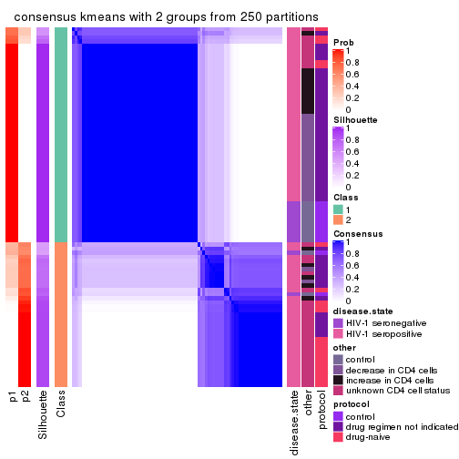</p>

</div>
<div id='tab-CV-kmeans-consensus-heatmap-2'>
<pre><code class="r">consensus_heatmap(res, k = 3)
</code></pre>

<p>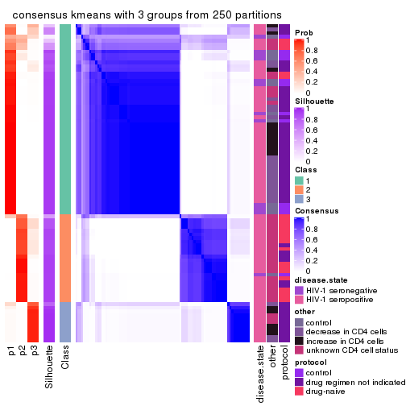</p>

</div>
<div id='tab-CV-kmeans-consensus-heatmap-3'>
<pre><code class="r">consensus_heatmap(res, k = 4)
</code></pre>

<p>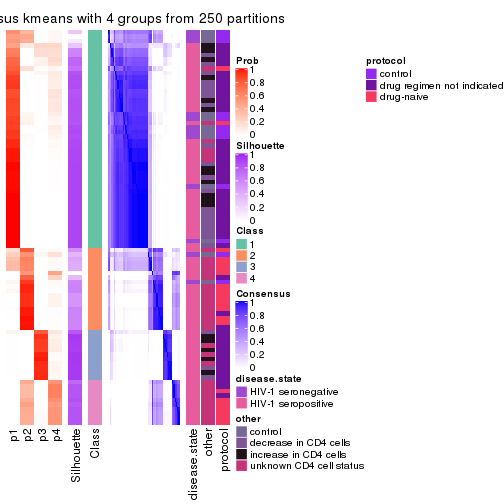</p>

</div>
<div id='tab-CV-kmeans-consensus-heatmap-4'>
<pre><code class="r">consensus_heatmap(res, k = 5)
</code></pre>

<p>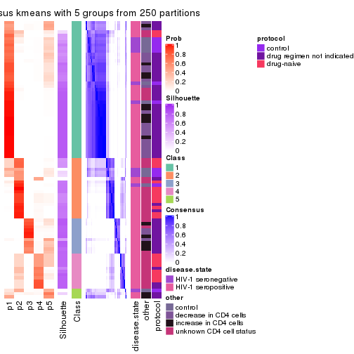</p>

</div>
<div id='tab-CV-kmeans-consensus-heatmap-5'>
<pre><code class="r">consensus_heatmap(res, k = 6)
</code></pre>

<p>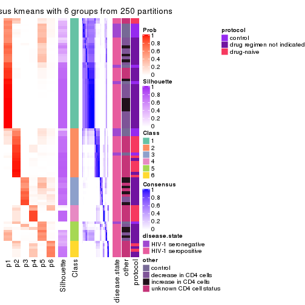</p>

</div>
</div>

Heatmaps for the membership of samples in all partitions to see how consistent they are:


<script>
$( function() {
	$( '#tabs-CV-kmeans-membership-heatmap' ).tabs();
} );
</script>
<div id='tabs-CV-kmeans-membership-heatmap'>
<ul>
<li><a href='#tab-CV-kmeans-membership-heatmap-1'>k = 2</a></li>
<li><a href='#tab-CV-kmeans-membership-heatmap-2'>k = 3</a></li>
<li><a href='#tab-CV-kmeans-membership-heatmap-3'>k = 4</a></li>
<li><a href='#tab-CV-kmeans-membership-heatmap-4'>k = 5</a></li>
<li><a href='#tab-CV-kmeans-membership-heatmap-5'>k = 6</a></li>
</ul>
<div id='tab-CV-kmeans-membership-heatmap-1'>
<pre><code class="r">membership_heatmap(res, k = 2)
</code></pre>

<p>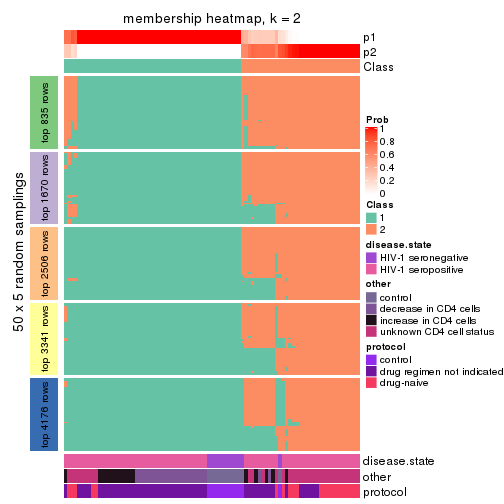</p>

</div>
<div id='tab-CV-kmeans-membership-heatmap-2'>
<pre><code class="r">membership_heatmap(res, k = 3)
</code></pre>

<p>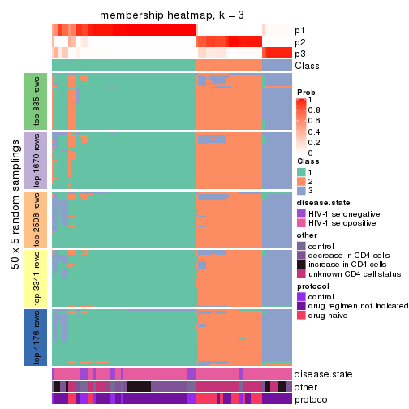</p>

</div>
<div id='tab-CV-kmeans-membership-heatmap-3'>
<pre><code class="r">membership_heatmap(res, k = 4)
</code></pre>

<p>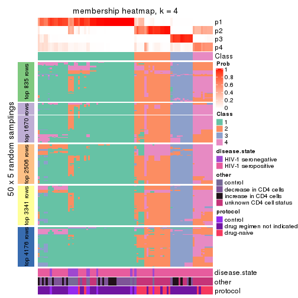</p>

</div>
<div id='tab-CV-kmeans-membership-heatmap-4'>
<pre><code class="r">membership_heatmap(res, k = 5)
</code></pre>

<p>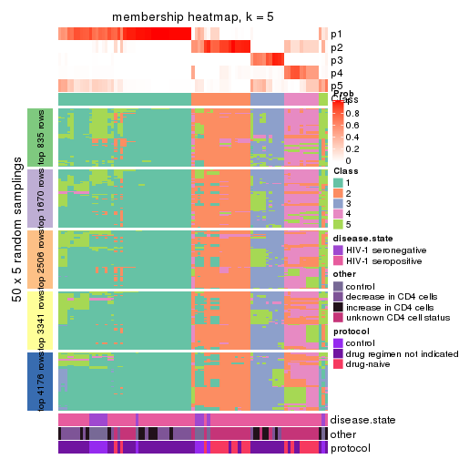</p>

</div>
<div id='tab-CV-kmeans-membership-heatmap-5'>
<pre><code class="r">membership_heatmap(res, k = 6)
</code></pre>

<p>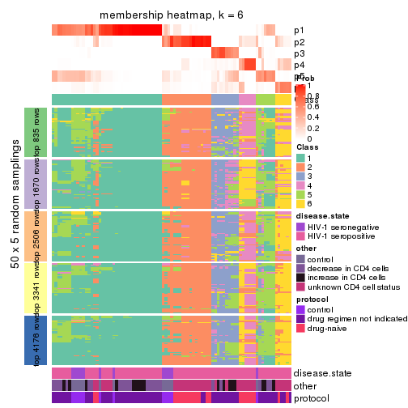</p>

</div>
</div>

As soon as we have had the classes for columns, we can look for signatures
which are significantly different between classes which can be candidate marks
for certain classes. Following are the heatmaps for signatures.


Signature heatmaps where rows are scaled:


<script>
$( function() {
	$( '#tabs-CV-kmeans-get-signatures' ).tabs();
} );
</script>
<div id='tabs-CV-kmeans-get-signatures'>
<ul>
<li><a href='#tab-CV-kmeans-get-signatures-1'>k = 2</a></li>
<li><a href='#tab-CV-kmeans-get-signatures-2'>k = 3</a></li>
<li><a href='#tab-CV-kmeans-get-signatures-3'>k = 4</a></li>
<li><a href='#tab-CV-kmeans-get-signatures-4'>k = 5</a></li>
<li><a href='#tab-CV-kmeans-get-signatures-5'>k = 6</a></li>
</ul>
<div id='tab-CV-kmeans-get-signatures-1'>
<pre><code class="r">get_signatures(res, k = 2)
</code></pre>

<p>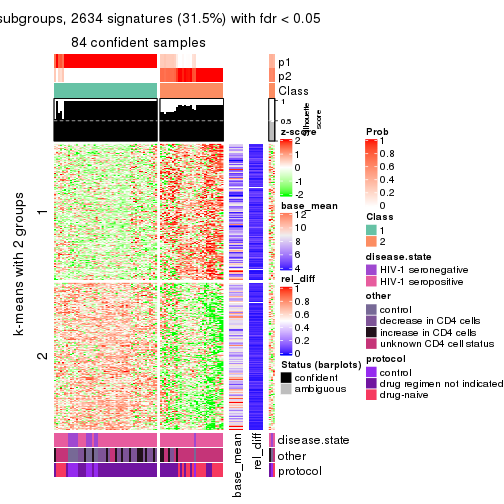</p>

</div>
<div id='tab-CV-kmeans-get-signatures-2'>
<pre><code class="r">get_signatures(res, k = 3)
</code></pre>

<p>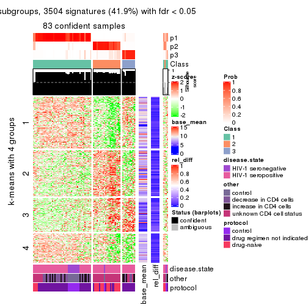</p>

</div>
<div id='tab-CV-kmeans-get-signatures-3'>
<pre><code class="r">get_signatures(res, k = 4)
</code></pre>

<p>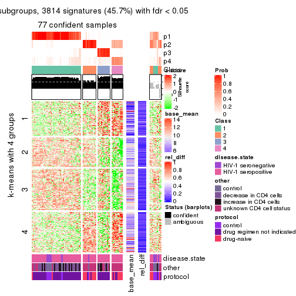</p>

</div>
<div id='tab-CV-kmeans-get-signatures-4'>
<pre><code class="r">get_signatures(res, k = 5)
</code></pre>

<p>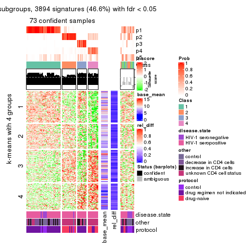</p>

</div>
<div id='tab-CV-kmeans-get-signatures-5'>
<pre><code class="r">get_signatures(res, k = 6)
</code></pre>

<p>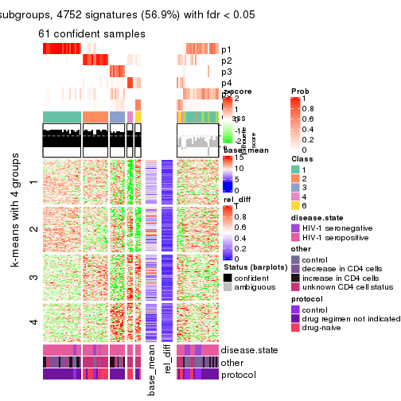</p>

</div>
</div>


Signature heatmaps where rows are not scaled:


<script>
$( function() {
	$( '#tabs-CV-kmeans-get-signatures-no-scale' ).tabs();
} );
</script>
<div id='tabs-CV-kmeans-get-signatures-no-scale'>
<ul>
<li><a href='#tab-CV-kmeans-get-signatures-no-scale-1'>k = 2</a></li>
<li><a href='#tab-CV-kmeans-get-signatures-no-scale-2'>k = 3</a></li>
<li><a href='#tab-CV-kmeans-get-signatures-no-scale-3'>k = 4</a></li>
<li><a href='#tab-CV-kmeans-get-signatures-no-scale-4'>k = 5</a></li>
<li><a href='#tab-CV-kmeans-get-signatures-no-scale-5'>k = 6</a></li>
</ul>
<div id='tab-CV-kmeans-get-signatures-no-scale-1'>
<pre><code class="r">get_signatures(res, k = 2, scale_rows = FALSE)
</code></pre>

<p>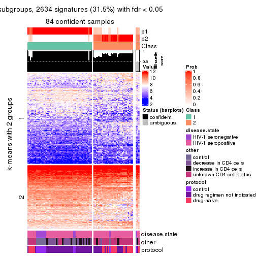</p>

</div>
<div id='tab-CV-kmeans-get-signatures-no-scale-2'>
<pre><code class="r">get_signatures(res, k = 3, scale_rows = FALSE)
</code></pre>

<p>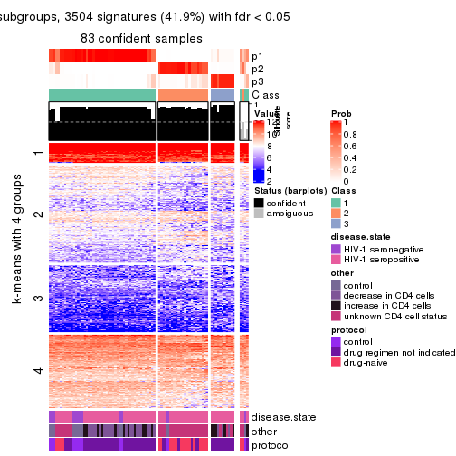</p>

</div>
<div id='tab-CV-kmeans-get-signatures-no-scale-3'>
<pre><code class="r">get_signatures(res, k = 4, scale_rows = FALSE)
</code></pre>

<p>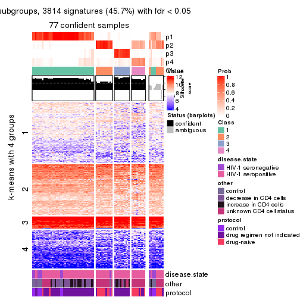</p>

</div>
<div id='tab-CV-kmeans-get-signatures-no-scale-4'>
<pre><code class="r">get_signatures(res, k = 5, scale_rows = FALSE)
</code></pre>

<p>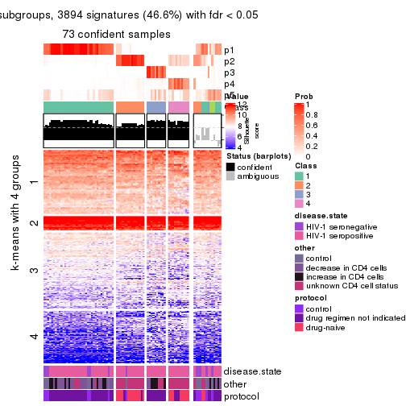</p>

</div>
<div id='tab-CV-kmeans-get-signatures-no-scale-5'>
<pre><code class="r">get_signatures(res, k = 6, scale_rows = FALSE)
</code></pre>

<p>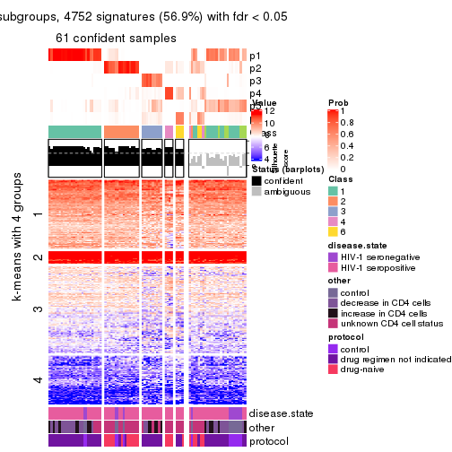</p>

</div>
</div>


Compare the overlap of signatures from different k:

```r
compare_signatures(res)
```

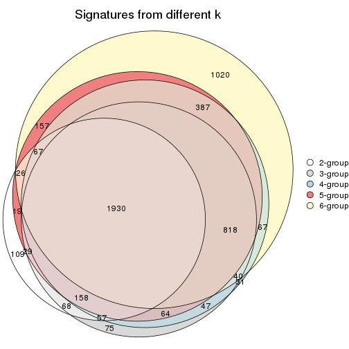

`get_signature()` returns a data frame invisibly. TO get the list of signatures, the function
call should be assigned to a variable explicitly. In following code, if `plot` argument is set
to `FALSE`, no heatmap is plotted while only the differential analysis is performed.

```r
# code only for demonstration
tb = get_signature(res, k = ..., plot = FALSE)
```

An example of the output of `tb` is:

```
#>   which_row         fdr    mean_1    mean_2 scaled_mean_1 scaled_mean_2 km
#> 1        38 0.042760348  8.373488  9.131774    -0.5533452     0.5164555  1
#> 2        40 0.018707592  7.106213  8.469186    -0.6173731     0.5762149  1
#> 3        55 0.019134737 10.221463 11.207825    -0.6159697     0.5749050  1
#> 4        59 0.006059896  5.921854  7.869574    -0.6899429     0.6439467  1
#> 5        60 0.018055526  8.928898 10.211722    -0.6204761     0.5791110  1
#> 6        98 0.009384629 15.714769 14.887706     0.6635654    -0.6193277  2
...
```

The columns in `tb` are:

1. `which_row`: row indices corresponding to the input matrix.
2. `fdr`: FDR for the differential test. 
3. `mean_x`: The mean value in group x.
4. `scaled_mean_x`: The mean value in group x after rows are scaled.
5. `km`: Row groups if k-means clustering is applied to rows.


UMAP plot which shows how samples are separated.


<script>
$( function() {
	$( '#tabs-CV-kmeans-dimension-reduction' ).tabs();
} );
</script>
<div id='tabs-CV-kmeans-dimension-reduction'>
<ul>
<li><a href='#tab-CV-kmeans-dimension-reduction-1'>k = 2</a></li>
<li><a href='#tab-CV-kmeans-dimension-reduction-2'>k = 3</a></li>
<li><a href='#tab-CV-kmeans-dimension-reduction-3'>k = 4</a></li>
<li><a href='#tab-CV-kmeans-dimension-reduction-4'>k = 5</a></li>
<li><a href='#tab-CV-kmeans-dimension-reduction-5'>k = 6</a></li>
</ul>
<div id='tab-CV-kmeans-dimension-reduction-1'>
<pre><code class="r">dimension_reduction(res, k = 2, method = &quot;UMAP&quot;)
</code></pre>

<p>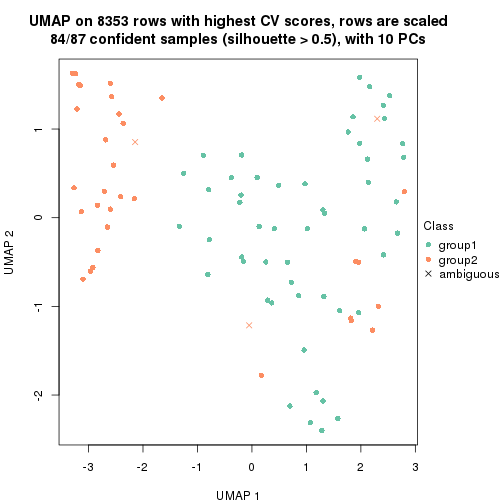</p>

</div>
<div id='tab-CV-kmeans-dimension-reduction-2'>
<pre><code class="r">dimension_reduction(res, k = 3, method = &quot;UMAP&quot;)
</code></pre>

<p></p>

</div>
<div id='tab-CV-kmeans-dimension-reduction-3'>
<pre><code class="r">dimension_reduction(res, k = 4, method = &quot;UMAP&quot;)
</code></pre>

<p>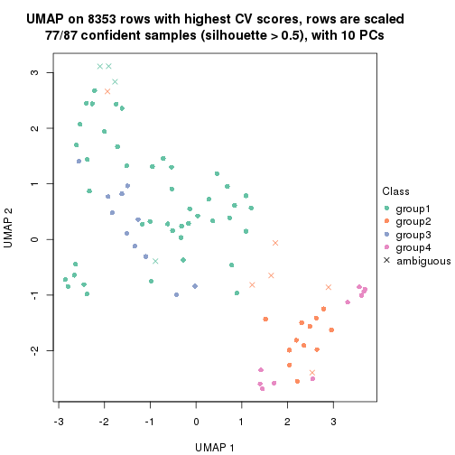</p>

</div>
<div id='tab-CV-kmeans-dimension-reduction-4'>
<pre><code class="r">dimension_reduction(res, k = 5, method = &quot;UMAP&quot;)
</code></pre>

<p>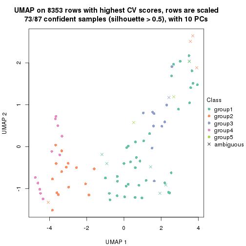</p>

</div>
<div id='tab-CV-kmeans-dimension-reduction-5'>
<pre><code class="r">dimension_reduction(res, k = 6, method = &quot;UMAP&quot;)
</code></pre>

<p>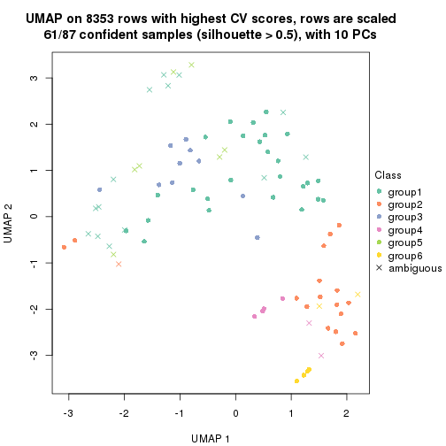</p>

</div>
</div>


Following heatmap shows how subgroups are split when increasing `k`:

```r
collect_classes(res)
```

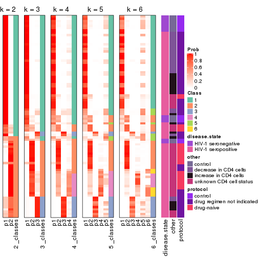


Test correlation between subgroups and known annotations. If the known
annotation is numeric, one-way ANOVA test is applied, and if the known
annotation is discrete, chi-squared contingency table test is applied.

```r
test_to_known_factors(res)
```

```
#>            n disease.state(p) other(p) protocol(p) k
#> CV:kmeans 84           0.0731 6.30e-07    8.55e-05 2
#> CV:kmeans 83           0.0656 1.18e-08    3.87e-08 3
#> CV:kmeans 77           0.2692 3.02e-07    4.17e-08 4
#> CV:kmeans 73           0.2358 2.19e-08    1.21e-09 5
#> CV:kmeans 61           0.4579 3.39e-05    1.43e-07 6
```


If matrix rows can be associated to genes, consider to use `GO_Enrichment(res,
...)` to perform function enrichment for the signature genes.


 

---------------------------------------------------


### CV:skmeans**


The object with results only for a single top-value method and a single partition method 
can be extracted as:

```r
res = res_list["CV", "skmeans"]
# you can also extract it by
# res = res_list["CV:skmeans"]
```

A summary of `res` and all the functions that can be applied to it:

```r
res
```

```
#> A 'ConsensusPartition' object with k = 2, 3, 4, 5, 6.
#>   On a matrix with 8353 rows and 87 columns.
#>   Top rows (835, 1670, 2506, 3341, 4176) are extracted by 'CV' method.
#>   Subgroups are detected by 'skmeans' method.
#>   Performed in total 1250 partitions by row resampling.
#>   Best k for subgroups seems to be 2.
#> 
#> Following methods can be applied to this 'ConsensusPartition' object:
#>  [1] "cola_report"             "collect_classes"         "collect_plots"          
#>  [4] "collect_stats"           "colnames"                "compare_signatures"     
#>  [7] "consensus_heatmap"       "dimension_reduction"     "functional_enrichment"  
#> [10] "get_anno_col"            "get_anno"                "get_classes"            
#> [13] "get_consensus"           "get_matrix"              "get_membership"         
#> [16] "get_param"               "get_signatures"          "get_stats"              
#> [19] "is_best_k"               "is_stable_k"             "membership_heatmap"     
#> [22] "ncol"                    "nrow"                    "plot_ecdf"              
#> [25] "rownames"                "select_partition_number" "show"                   
#> [28] "suggest_best_k"          "test_to_known_factors"
```

`collect_plots()` function collects all the plots made from `res` for all `k` (number of partitions)
into one single page to provide an easy and fast comparison between different `k`.

```r
collect_plots(res)
```

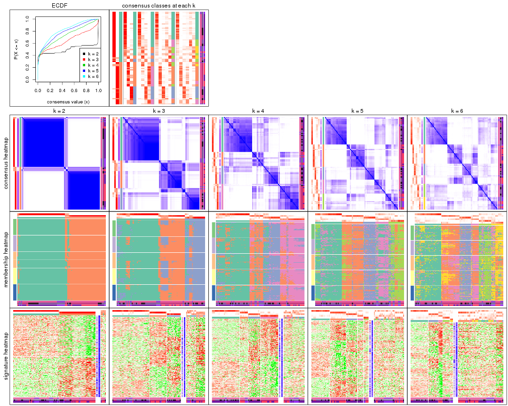

The plots are:

- The first row: a plot of the ECDF (Empirical cumulative distribution
  function) curves of the consensus matrix for each `k` and the heatmap of
  predicted classes for each `k`.
- The second row: heatmaps of the consensus matrix for each `k`.
- The third row: heatmaps of the membership matrix for each `k`.
- The fouth row: heatmaps of the signatures for each `k`.

All the plots in panels can be made by individual functions and they are
plotted later in this section.

`select_partition_number()` produces several plots showing different
statistics for choosing "optimized" `k`. There are following statistics:

- ECDF curves of the consensus matrix for each `k`;
- 1-PAC. [The PAC
  score](https://en.wikipedia.org/wiki/Consensus_clustering#Over-interpretation_potential_of_consensus_clustering)
  measures the proportion of the ambiguous subgrouping.
- Mean silhouette score.
- Concordance. The mean probability of fiting the consensus class ids in all
  partitions.
- Area increased. Denote $A_k$ as the area under the ECDF curve for current
  `k`, the area increased is defined as $A_k - A_{k-1}$.
- Rand index. The percent of pairs of samples that are both in a same cluster
  or both are not in a same cluster in the partition of k and k-1.
- Jaccard index. The ratio of pairs of samples are both in a same cluster in
  the partition of k and k-1 and the pairs of samples are both in a same
  cluster in the partition k or k-1.

The detailed explanations of these statistics can be found in [the cola
vignette](http://bioconductor.org/packages/devel/bioc/vignettes/cola/inst/doc/cola.html#toc_13).

Generally speaking, lower PAC score, higher mean silhouette score or higher
concordance corresponds to better partition. Rand index and Jaccard index
measure how similar the current partition is compared to partition with `k-1`.
If they are too similar, we won't accept `k` is better than `k-1`.

```r
select_partition_number(res)
```

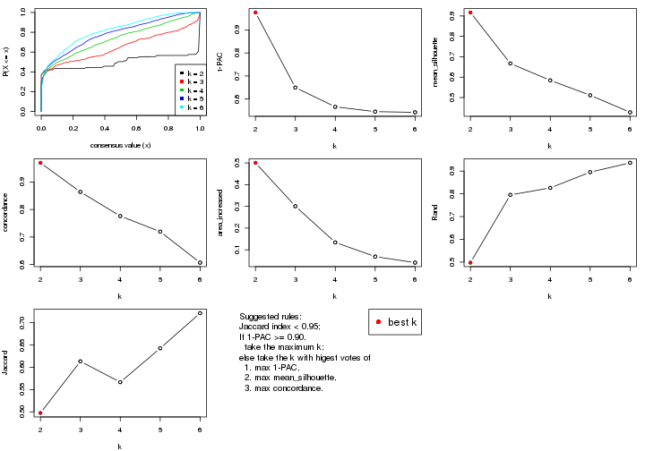

The numeric values for all these statistics can be obtained by `get_stats()`.

```r
get_stats(res)
```

```
#>   k 1-PAC mean_silhouette concordance area_increased  Rand Jaccard
#> 2 2 0.976           0.917       0.970         0.5005 0.497   0.497
#> 3 3 0.650           0.667       0.864         0.3007 0.795   0.613
#> 4 4 0.566           0.584       0.776         0.1340 0.826   0.567
#> 5 5 0.545           0.511       0.719         0.0687 0.895   0.643
#> 6 6 0.542           0.428       0.607         0.0408 0.936   0.721
```

`suggest_best_k()` suggests the best $k$ based on these statistics. The rules are as follows:

- All $k$ with Jaccard index larger than 0.95 are removed because the increase of
  the partition number does not provides enough extra information. If all $k$ are removed,
  the best $k$ is assigned by `NA`.
- For $k$ with 1-PAC larger than 0.9, the maximal $k$ is taken as the "best k". Other $k$ is called "optional k".
- If it does not fit the second rule. The $k$ with the highest vote of highest
  1-PAC, mean silhouette and concordance is taken as the "best k".

```r
suggest_best_k(res)
```

```
#> [1] 2
```


Following shows the table of the partitions (You need to click the **show/hide
code output** link to see it). The membership matrix (columns with name `p*`)
is inferred by
[`clue::cl_consensus()`](https://www.rdocumentation.org/link/cl_consensus?package=clue)
function with the `SE` method. Basically the value in the membership matrix
represents the probability to belong to a certain group. The finall class
label for an item is determined with the group with highest probability it
belongs to.

In `get_classes()` function, the entropy is calculated from the membership
matrix and the silhouette score is calculated from the consensus matrix.


<script>
$( function() {
	$( '#tabs-CV-skmeans-get-classes' ).tabs();
} );
</script>
<div id='tabs-CV-skmeans-get-classes'>
<ul>
<li><a href='#tab-CV-skmeans-get-classes-1'>k = 2</a></li>
<li><a href='#tab-CV-skmeans-get-classes-2'>k = 3</a></li>
<li><a href='#tab-CV-skmeans-get-classes-3'>k = 4</a></li>
<li><a href='#tab-CV-skmeans-get-classes-4'>k = 5</a></li>
<li><a href='#tab-CV-skmeans-get-classes-5'>k = 6</a></li>
</ul>

<div id='tab-CV-skmeans-get-classes-1'>
<p><a id='tab-CV-skmeans-get-classes-1-a' style='color:#0366d6' href='#'>show/hide code output</a></p>
<pre><code class="r">cbind(get_classes(res, k = 2), get_membership(res, k = 2))
</code></pre>

<pre><code>#&gt;          class entropy silhouette    p1    p2
#&gt; GSM39104     1  0.0000     0.9818 1.000 0.000
#&gt; GSM39105     1  0.0000     0.9818 1.000 0.000
#&gt; GSM39106     1  0.0000     0.9818 1.000 0.000
#&gt; GSM39107     1  0.0000     0.9818 1.000 0.000
#&gt; GSM39108     1  0.0000     0.9818 1.000 0.000
#&gt; GSM39109     2  0.0000     0.9499 0.000 1.000
#&gt; GSM39110     1  0.0376     0.9782 0.996 0.004
#&gt; GSM39111     1  0.0000     0.9818 1.000 0.000
#&gt; GSM39112     1  0.0000     0.9818 1.000 0.000
#&gt; GSM39113     1  0.1633     0.9583 0.976 0.024
#&gt; GSM39114     2  0.0000     0.9499 0.000 1.000
#&gt; GSM39115     1  0.0000     0.9818 1.000 0.000
#&gt; GSM39148     1  0.0000     0.9818 1.000 0.000
#&gt; GSM39149     2  0.0000     0.9499 0.000 1.000
#&gt; GSM39150     1  0.0000     0.9818 1.000 0.000
#&gt; GSM39151     2  0.0000     0.9499 0.000 1.000
#&gt; GSM39152     2  0.9635     0.3759 0.388 0.612
#&gt; GSM39153     1  0.0000     0.9818 1.000 0.000
#&gt; GSM39154     1  0.0000     0.9818 1.000 0.000
#&gt; GSM39155     1  0.0000     0.9818 1.000 0.000
#&gt; GSM39156     1  0.0000     0.9818 1.000 0.000
#&gt; GSM39157     1  0.0000     0.9818 1.000 0.000
#&gt; GSM39158     1  0.0000     0.9818 1.000 0.000
#&gt; GSM39159     1  0.0938     0.9705 0.988 0.012
#&gt; GSM39160     1  0.0000     0.9818 1.000 0.000
#&gt; GSM39161     1  0.8555     0.5774 0.720 0.280
#&gt; GSM39162     1  0.0000     0.9818 1.000 0.000
#&gt; GSM39163     1  0.0000     0.9818 1.000 0.000
#&gt; GSM39164     1  0.0000     0.9818 1.000 0.000
#&gt; GSM39165     1  0.0000     0.9818 1.000 0.000
#&gt; GSM39166     1  0.0000     0.9818 1.000 0.000
#&gt; GSM39167     1  0.0000     0.9818 1.000 0.000
#&gt; GSM39168     1  0.0000     0.9818 1.000 0.000
#&gt; GSM39169     1  0.0000     0.9818 1.000 0.000
#&gt; GSM39170     1  0.0000     0.9818 1.000 0.000
#&gt; GSM39171     1  0.0000     0.9818 1.000 0.000
#&gt; GSM39172     2  0.0000     0.9499 0.000 1.000
#&gt; GSM39173     2  0.0000     0.9499 0.000 1.000
#&gt; GSM39174     1  0.0000     0.9818 1.000 0.000
#&gt; GSM39175     1  0.0000     0.9818 1.000 0.000
#&gt; GSM39176     1  0.0000     0.9818 1.000 0.000
#&gt; GSM39177     2  0.3733     0.8848 0.072 0.928
#&gt; GSM39178     1  0.0000     0.9818 1.000 0.000
#&gt; GSM39179     2  0.0000     0.9499 0.000 1.000
#&gt; GSM39180     2  0.0000     0.9499 0.000 1.000
#&gt; GSM39181     1  0.0000     0.9818 1.000 0.000
#&gt; GSM39182     2  0.1184     0.9371 0.016 0.984
#&gt; GSM39183     1  0.0000     0.9818 1.000 0.000
#&gt; GSM39184     1  0.0000     0.9818 1.000 0.000
#&gt; GSM39185     2  0.9983     0.1152 0.476 0.524
#&gt; GSM39186     1  0.0000     0.9818 1.000 0.000
#&gt; GSM39187     1  0.0000     0.9818 1.000 0.000
#&gt; GSM39116     2  0.0000     0.9499 0.000 1.000
#&gt; GSM39117     2  0.0000     0.9499 0.000 1.000
#&gt; GSM39118     2  0.0000     0.9499 0.000 1.000
#&gt; GSM39119     2  0.0000     0.9499 0.000 1.000
#&gt; GSM39120     1  0.0000     0.9818 1.000 0.000
#&gt; GSM39121     1  0.9944     0.0991 0.544 0.456
#&gt; GSM39122     2  0.9944     0.1820 0.456 0.544
#&gt; GSM39123     2  0.0000     0.9499 0.000 1.000
#&gt; GSM39124     2  0.0000     0.9499 0.000 1.000
#&gt; GSM39125     1  0.0000     0.9818 1.000 0.000
#&gt; GSM39126     2  0.9944     0.1815 0.456 0.544
#&gt; GSM39127     2  0.0000     0.9499 0.000 1.000
#&gt; GSM39128     2  0.0000     0.9499 0.000 1.000
#&gt; GSM39129     2  0.0000     0.9499 0.000 1.000
#&gt; GSM39130     2  0.0000     0.9499 0.000 1.000
#&gt; GSM39131     2  0.0000     0.9499 0.000 1.000
#&gt; GSM39132     2  0.0000     0.9499 0.000 1.000
#&gt; GSM39133     2  0.0000     0.9499 0.000 1.000
#&gt; GSM39134     2  0.0000     0.9499 0.000 1.000
#&gt; GSM39135     2  0.0000     0.9499 0.000 1.000
#&gt; GSM39136     2  0.0000     0.9499 0.000 1.000
#&gt; GSM39137     2  0.0672     0.9437 0.008 0.992
#&gt; GSM39138     2  0.0000     0.9499 0.000 1.000
#&gt; GSM39139     2  0.0000     0.9499 0.000 1.000
#&gt; GSM39140     1  0.0000     0.9818 1.000 0.000
#&gt; GSM39141     1  0.0000     0.9818 1.000 0.000
#&gt; GSM39142     1  0.0000     0.9818 1.000 0.000
#&gt; GSM39143     1  0.0000     0.9818 1.000 0.000
#&gt; GSM39144     2  0.0000     0.9499 0.000 1.000
#&gt; GSM39145     2  0.0000     0.9499 0.000 1.000
#&gt; GSM39146     2  0.0000     0.9499 0.000 1.000
#&gt; GSM39147     2  0.0000     0.9499 0.000 1.000
#&gt; GSM39188     2  0.0000     0.9499 0.000 1.000
#&gt; GSM39189     2  0.0000     0.9499 0.000 1.000
#&gt; GSM39190     2  0.0000     0.9499 0.000 1.000
</code></pre>

<script>
$('#tab-CV-skmeans-get-classes-1-a').parent().next().next().hide();
$('#tab-CV-skmeans-get-classes-1-a').click(function(){
  $('#tab-CV-skmeans-get-classes-1-a').parent().next().next().toggle();
  return(false);
});
</script>
</div>

<div id='tab-CV-skmeans-get-classes-2'>
<p><a id='tab-CV-skmeans-get-classes-2-a' style='color:#0366d6' href='#'>show/hide code output</a></p>
<pre><code class="r">cbind(get_classes(res, k = 3), get_membership(res, k = 3))
</code></pre>

<pre><code>#&gt;          class entropy silhouette    p1    p2    p3
#&gt; GSM39104     1  0.3030      0.845 0.904 0.004 0.092
#&gt; GSM39105     1  0.0000      0.889 1.000 0.000 0.000
#&gt; GSM39106     1  0.5728      0.724 0.772 0.196 0.032
#&gt; GSM39107     2  0.6308     -0.152 0.492 0.508 0.000
#&gt; GSM39108     1  0.4165      0.833 0.876 0.048 0.076
#&gt; GSM39109     3  0.5810      0.365 0.000 0.336 0.664
#&gt; GSM39110     1  0.9144      0.082 0.448 0.144 0.408
#&gt; GSM39111     1  0.5864      0.610 0.704 0.008 0.288
#&gt; GSM39112     1  0.6062      0.433 0.616 0.384 0.000
#&gt; GSM39113     2  0.5431      0.456 0.284 0.716 0.000
#&gt; GSM39114     2  0.0000      0.758 0.000 1.000 0.000
#&gt; GSM39115     1  0.0000      0.889 1.000 0.000 0.000
#&gt; GSM39148     1  0.0000      0.889 1.000 0.000 0.000
#&gt; GSM39149     3  0.0000      0.773 0.000 0.000 1.000
#&gt; GSM39150     1  0.4178      0.772 0.828 0.000 0.172
#&gt; GSM39151     3  0.0000      0.773 0.000 0.000 1.000
#&gt; GSM39152     3  0.0892      0.764 0.020 0.000 0.980
#&gt; GSM39153     1  0.0000      0.889 1.000 0.000 0.000
#&gt; GSM39154     1  0.0000      0.889 1.000 0.000 0.000
#&gt; GSM39155     1  0.0000      0.889 1.000 0.000 0.000
#&gt; GSM39156     1  0.1289      0.877 0.968 0.032 0.000
#&gt; GSM39157     1  0.0000      0.889 1.000 0.000 0.000
#&gt; GSM39158     1  0.0892      0.883 0.980 0.000 0.020
#&gt; GSM39159     3  0.6126      0.228 0.400 0.000 0.600
#&gt; GSM39160     1  0.5497      0.614 0.708 0.000 0.292
#&gt; GSM39161     3  0.5138      0.578 0.252 0.000 0.748
#&gt; GSM39162     1  0.0000      0.889 1.000 0.000 0.000
#&gt; GSM39163     1  0.0000      0.889 1.000 0.000 0.000
#&gt; GSM39164     1  0.0000      0.889 1.000 0.000 0.000
#&gt; GSM39165     1  0.6309      0.123 0.504 0.000 0.496
#&gt; GSM39166     1  0.2711      0.845 0.912 0.000 0.088
#&gt; GSM39167     1  0.0000      0.889 1.000 0.000 0.000
#&gt; GSM39168     1  0.0000      0.889 1.000 0.000 0.000
#&gt; GSM39169     1  0.0000      0.889 1.000 0.000 0.000
#&gt; GSM39170     1  0.0747      0.885 0.984 0.000 0.016
#&gt; GSM39171     1  0.4750      0.723 0.784 0.000 0.216
#&gt; GSM39172     3  0.0000      0.773 0.000 0.000 1.000
#&gt; GSM39173     3  0.0424      0.770 0.000 0.008 0.992
#&gt; GSM39174     1  0.0000      0.889 1.000 0.000 0.000
#&gt; GSM39175     1  0.1860      0.870 0.948 0.000 0.052
#&gt; GSM39176     1  0.0000      0.889 1.000 0.000 0.000
#&gt; GSM39177     3  0.0424      0.770 0.008 0.000 0.992
#&gt; GSM39178     3  0.6215      0.104 0.428 0.000 0.572
#&gt; GSM39179     3  0.0000      0.773 0.000 0.000 1.000
#&gt; GSM39180     3  0.0892      0.762 0.000 0.020 0.980
#&gt; GSM39181     1  0.2356      0.856 0.928 0.000 0.072
#&gt; GSM39182     3  0.3765      0.702 0.028 0.084 0.888
#&gt; GSM39183     1  0.3619      0.807 0.864 0.000 0.136
#&gt; GSM39184     1  0.0424      0.887 0.992 0.000 0.008
#&gt; GSM39185     3  0.3619      0.685 0.136 0.000 0.864
#&gt; GSM39186     1  0.0237      0.888 0.996 0.000 0.004
#&gt; GSM39187     1  0.0000      0.889 1.000 0.000 0.000
#&gt; GSM39116     2  0.2066      0.744 0.000 0.940 0.060
#&gt; GSM39117     3  0.6286     -0.104 0.000 0.464 0.536
#&gt; GSM39118     2  0.6126      0.392 0.000 0.600 0.400
#&gt; GSM39119     2  0.6302      0.212 0.000 0.520 0.480
#&gt; GSM39120     1  0.6154      0.381 0.592 0.408 0.000
#&gt; GSM39121     2  0.2711      0.696 0.088 0.912 0.000
#&gt; GSM39122     2  0.1860      0.729 0.052 0.948 0.000
#&gt; GSM39123     3  0.6291     -0.117 0.000 0.468 0.532
#&gt; GSM39124     2  0.0000      0.758 0.000 1.000 0.000
#&gt; GSM39125     1  0.5650      0.573 0.688 0.312 0.000
#&gt; GSM39126     2  0.1643      0.735 0.044 0.956 0.000
#&gt; GSM39127     2  0.0000      0.758 0.000 1.000 0.000
#&gt; GSM39128     2  0.0237      0.759 0.000 0.996 0.004
#&gt; GSM39129     2  0.6225      0.334 0.000 0.568 0.432
#&gt; GSM39130     3  0.6291     -0.117 0.000 0.468 0.532
#&gt; GSM39131     2  0.0000      0.758 0.000 1.000 0.000
#&gt; GSM39132     2  0.0237      0.759 0.000 0.996 0.004
#&gt; GSM39133     2  0.6280      0.267 0.000 0.540 0.460
#&gt; GSM39134     2  0.6140      0.384 0.000 0.596 0.404
#&gt; GSM39135     2  0.1289      0.755 0.000 0.968 0.032
#&gt; GSM39136     2  0.1411      0.754 0.000 0.964 0.036
#&gt; GSM39137     2  0.0424      0.756 0.008 0.992 0.000
#&gt; GSM39138     2  0.6267      0.290 0.000 0.548 0.452
#&gt; GSM39139     2  0.5397      0.559 0.000 0.720 0.280
#&gt; GSM39140     1  0.2537      0.845 0.920 0.080 0.000
#&gt; GSM39141     1  0.0892      0.883 0.980 0.020 0.000
#&gt; GSM39142     1  0.0592      0.886 0.988 0.012 0.000
#&gt; GSM39143     1  0.0892      0.883 0.980 0.020 0.000
#&gt; GSM39144     2  0.6235      0.326 0.000 0.564 0.436
#&gt; GSM39145     2  0.3340      0.707 0.000 0.880 0.120
#&gt; GSM39146     2  0.1031      0.757 0.000 0.976 0.024
#&gt; GSM39147     2  0.0000      0.758 0.000 1.000 0.000
#&gt; GSM39188     3  0.0000      0.773 0.000 0.000 1.000
#&gt; GSM39189     3  0.0000      0.773 0.000 0.000 1.000
#&gt; GSM39190     3  0.0000      0.773 0.000 0.000 1.000
</code></pre>

<script>
$('#tab-CV-skmeans-get-classes-2-a').parent().next().next().hide();
$('#tab-CV-skmeans-get-classes-2-a').click(function(){
  $('#tab-CV-skmeans-get-classes-2-a').parent().next().next().toggle();
  return(false);
});
</script>
</div>

<div id='tab-CV-skmeans-get-classes-3'>
<p><a id='tab-CV-skmeans-get-classes-3-a' style='color:#0366d6' href='#'>show/hide code output</a></p>
<pre><code class="r">cbind(get_classes(res, k = 4), get_membership(res, k = 4))
</code></pre>

<pre><code>#&gt;          class entropy silhouette    p1    p2    p3    p4
#&gt; GSM39104     1  0.7831     0.2116 0.408 0.312 0.280 0.000
#&gt; GSM39105     1  0.4532     0.7453 0.792 0.156 0.052 0.000
#&gt; GSM39106     2  0.6112     0.4892 0.196 0.676 0.128 0.000
#&gt; GSM39107     2  0.3229     0.6700 0.072 0.880 0.000 0.048
#&gt; GSM39108     2  0.7146    -0.0724 0.412 0.456 0.132 0.000
#&gt; GSM39109     4  0.7601     0.2720 0.004 0.216 0.276 0.504
#&gt; GSM39110     2  0.7859     0.0433 0.160 0.428 0.396 0.016
#&gt; GSM39111     3  0.7817     0.1252 0.296 0.288 0.416 0.000
#&gt; GSM39112     2  0.3757     0.6667 0.152 0.828 0.000 0.020
#&gt; GSM39113     2  0.2797     0.6549 0.032 0.900 0.000 0.068
#&gt; GSM39114     2  0.4222     0.4586 0.000 0.728 0.000 0.272
#&gt; GSM39115     1  0.3497     0.7829 0.860 0.104 0.036 0.000
#&gt; GSM39148     1  0.1211     0.8020 0.960 0.040 0.000 0.000
#&gt; GSM39149     3  0.2647     0.7180 0.000 0.000 0.880 0.120
#&gt; GSM39150     1  0.7250     0.3491 0.516 0.168 0.316 0.000
#&gt; GSM39151     3  0.3157     0.7125 0.000 0.004 0.852 0.144
#&gt; GSM39152     3  0.3363     0.6800 0.020 0.052 0.888 0.040
#&gt; GSM39153     1  0.1209     0.8087 0.964 0.032 0.004 0.000
#&gt; GSM39154     1  0.1256     0.8107 0.964 0.028 0.008 0.000
#&gt; GSM39155     1  0.1022     0.8101 0.968 0.032 0.000 0.000
#&gt; GSM39156     1  0.5127     0.4232 0.632 0.356 0.012 0.000
#&gt; GSM39157     1  0.0895     0.8082 0.976 0.020 0.004 0.000
#&gt; GSM39158     1  0.3970     0.7596 0.840 0.084 0.076 0.000
#&gt; GSM39159     3  0.7221     0.3436 0.328 0.092 0.556 0.024
#&gt; GSM39160     3  0.7037    -0.0535 0.416 0.120 0.464 0.000
#&gt; GSM39161     3  0.6834     0.3388 0.340 0.068 0.572 0.020
#&gt; GSM39162     1  0.1637     0.7931 0.940 0.060 0.000 0.000
#&gt; GSM39163     1  0.1174     0.8098 0.968 0.020 0.012 0.000
#&gt; GSM39164     1  0.0921     0.8115 0.972 0.028 0.000 0.000
#&gt; GSM39165     1  0.6267    -0.0370 0.484 0.032 0.472 0.012
#&gt; GSM39166     1  0.6011     0.6293 0.688 0.132 0.180 0.000
#&gt; GSM39167     1  0.0817     0.8058 0.976 0.024 0.000 0.000
#&gt; GSM39168     1  0.1118     0.8035 0.964 0.036 0.000 0.000
#&gt; GSM39169     1  0.2124     0.8071 0.932 0.028 0.040 0.000
#&gt; GSM39170     1  0.4483     0.7437 0.808 0.088 0.104 0.000
#&gt; GSM39171     1  0.6192     0.5687 0.652 0.104 0.244 0.000
#&gt; GSM39172     3  0.4252     0.6141 0.000 0.004 0.744 0.252
#&gt; GSM39173     3  0.3402     0.6989 0.000 0.004 0.832 0.164
#&gt; GSM39174     1  0.1151     0.8102 0.968 0.024 0.008 0.000
#&gt; GSM39175     1  0.2706     0.7888 0.900 0.020 0.080 0.000
#&gt; GSM39176     1  0.0817     0.8064 0.976 0.024 0.000 0.000
#&gt; GSM39177     3  0.3006     0.7214 0.008 0.012 0.888 0.092
#&gt; GSM39178     3  0.6578     0.4424 0.244 0.136 0.620 0.000
#&gt; GSM39179     3  0.2888     0.7194 0.000 0.004 0.872 0.124
#&gt; GSM39180     3  0.4699     0.5131 0.004 0.000 0.676 0.320
#&gt; GSM39181     1  0.4920     0.7094 0.776 0.088 0.136 0.000
#&gt; GSM39182     4  0.7250    -0.1324 0.036 0.060 0.428 0.476
#&gt; GSM39183     1  0.6134     0.5908 0.668 0.116 0.216 0.000
#&gt; GSM39184     1  0.1510     0.8098 0.956 0.016 0.028 0.000
#&gt; GSM39185     3  0.7047     0.5570 0.196 0.092 0.656 0.056
#&gt; GSM39186     1  0.2830     0.7956 0.900 0.060 0.040 0.000
#&gt; GSM39187     1  0.1302     0.8095 0.956 0.044 0.000 0.000
#&gt; GSM39116     4  0.3172     0.6671 0.000 0.160 0.000 0.840
#&gt; GSM39117     4  0.3123     0.6476 0.000 0.000 0.156 0.844
#&gt; GSM39118     4  0.2222     0.7173 0.000 0.016 0.060 0.924
#&gt; GSM39119     4  0.2345     0.7011 0.000 0.000 0.100 0.900
#&gt; GSM39120     2  0.4541     0.6661 0.152 0.804 0.024 0.020
#&gt; GSM39121     2  0.4636     0.5929 0.040 0.772 0.000 0.188
#&gt; GSM39122     2  0.4642     0.5258 0.020 0.740 0.000 0.240
#&gt; GSM39123     4  0.2921     0.6647 0.000 0.000 0.140 0.860
#&gt; GSM39124     4  0.4985     0.2162 0.000 0.468 0.000 0.532
#&gt; GSM39125     2  0.5134     0.5924 0.232 0.732 0.020 0.016
#&gt; GSM39126     2  0.4050     0.6050 0.024 0.808 0.000 0.168
#&gt; GSM39127     4  0.4888     0.3705 0.000 0.412 0.000 0.588
#&gt; GSM39128     4  0.4972     0.2655 0.000 0.456 0.000 0.544
#&gt; GSM39129     4  0.2081     0.7094 0.000 0.000 0.084 0.916
#&gt; GSM39130     4  0.3123     0.6476 0.000 0.000 0.156 0.844
#&gt; GSM39131     4  0.4955     0.3026 0.000 0.444 0.000 0.556
#&gt; GSM39132     4  0.4543     0.5124 0.000 0.324 0.000 0.676
#&gt; GSM39133     4  0.2125     0.7134 0.000 0.004 0.076 0.920
#&gt; GSM39134     4  0.1474     0.7163 0.000 0.000 0.052 0.948
#&gt; GSM39135     4  0.2973     0.6753 0.000 0.144 0.000 0.856
#&gt; GSM39136     4  0.3356     0.6571 0.000 0.176 0.000 0.824
#&gt; GSM39137     2  0.5039     0.1282 0.004 0.592 0.000 0.404
#&gt; GSM39138     4  0.2281     0.7029 0.000 0.000 0.096 0.904
#&gt; GSM39139     4  0.2450     0.7056 0.000 0.072 0.016 0.912
#&gt; GSM39140     1  0.4843     0.3269 0.604 0.396 0.000 0.000
#&gt; GSM39141     1  0.4164     0.5926 0.736 0.264 0.000 0.000
#&gt; GSM39142     1  0.4040     0.6219 0.752 0.248 0.000 0.000
#&gt; GSM39143     1  0.4304     0.5664 0.716 0.284 0.000 0.000
#&gt; GSM39144     4  0.2222     0.7171 0.000 0.016 0.060 0.924
#&gt; GSM39145     4  0.3208     0.6766 0.000 0.148 0.004 0.848
#&gt; GSM39146     4  0.3764     0.6279 0.000 0.216 0.000 0.784
#&gt; GSM39147     4  0.4585     0.5022 0.000 0.332 0.000 0.668
#&gt; GSM39188     3  0.3157     0.7119 0.000 0.004 0.852 0.144
#&gt; GSM39189     3  0.2918     0.7207 0.000 0.008 0.876 0.116
#&gt; GSM39190     3  0.2973     0.7122 0.000 0.000 0.856 0.144
</code></pre>

<script>
$('#tab-CV-skmeans-get-classes-3-a').parent().next().next().hide();
$('#tab-CV-skmeans-get-classes-3-a').click(function(){
  $('#tab-CV-skmeans-get-classes-3-a').parent().next().next().toggle();
  return(false);
});
</script>
</div>

<div id='tab-CV-skmeans-get-classes-4'>
<p><a id='tab-CV-skmeans-get-classes-4-a' style='color:#0366d6' href='#'>show/hide code output</a></p>
<pre><code class="r">cbind(get_classes(res, k = 5), get_membership(res, k = 5))
</code></pre>

<pre><code>#&gt;          class entropy silhouette    p1    p2    p3    p4    p5
#&gt; GSM39104     4  0.7978     0.3384 0.224 0.000 0.124 0.440 0.212
#&gt; GSM39105     1  0.6586     0.2701 0.564 0.000 0.036 0.272 0.128
#&gt; GSM39106     5  0.7183     0.2544 0.156 0.000 0.064 0.260 0.520
#&gt; GSM39107     5  0.2713     0.5908 0.036 0.004 0.000 0.072 0.888
#&gt; GSM39108     5  0.8178    -0.0898 0.284 0.000 0.112 0.248 0.356
#&gt; GSM39109     3  0.8716     0.0953 0.008 0.280 0.304 0.180 0.228
#&gt; GSM39110     5  0.8591    -0.0420 0.128 0.012 0.312 0.232 0.316
#&gt; GSM39111     4  0.8260     0.2926 0.212 0.000 0.284 0.364 0.140
#&gt; GSM39112     5  0.5175     0.4959 0.172 0.004 0.008 0.100 0.716
#&gt; GSM39113     5  0.2197     0.6028 0.004 0.012 0.004 0.064 0.916
#&gt; GSM39114     5  0.3851     0.4885 0.000 0.212 0.004 0.016 0.768
#&gt; GSM39115     1  0.5590     0.3529 0.628 0.000 0.016 0.288 0.068
#&gt; GSM39148     1  0.0865     0.7054 0.972 0.000 0.000 0.004 0.024
#&gt; GSM39149     3  0.2659     0.7984 0.000 0.060 0.888 0.052 0.000
#&gt; GSM39150     4  0.6857     0.5388 0.268 0.000 0.132 0.548 0.052
#&gt; GSM39151     3  0.2228     0.7951 0.000 0.048 0.912 0.040 0.000
#&gt; GSM39152     3  0.4594     0.6598 0.012 0.028 0.760 0.184 0.016
#&gt; GSM39153     1  0.2364     0.7031 0.908 0.000 0.008 0.064 0.020
#&gt; GSM39154     1  0.3064     0.6755 0.856 0.000 0.036 0.108 0.000
#&gt; GSM39155     1  0.3080     0.6574 0.844 0.000 0.008 0.140 0.008
#&gt; GSM39156     1  0.5548     0.4969 0.668 0.000 0.020 0.084 0.228
#&gt; GSM39157     1  0.1983     0.7053 0.924 0.000 0.008 0.060 0.008
#&gt; GSM39158     4  0.4664     0.3699 0.436 0.000 0.008 0.552 0.004
#&gt; GSM39159     4  0.6794     0.4973 0.200 0.008 0.268 0.516 0.008
#&gt; GSM39160     4  0.7279     0.4219 0.316 0.000 0.208 0.440 0.036
#&gt; GSM39161     4  0.6348     0.5409 0.140 0.020 0.216 0.616 0.008
#&gt; GSM39162     1  0.1168     0.7039 0.960 0.000 0.000 0.008 0.032
#&gt; GSM39163     1  0.2392     0.6843 0.888 0.000 0.004 0.104 0.004
#&gt; GSM39164     1  0.2915     0.6914 0.860 0.000 0.000 0.116 0.024
#&gt; GSM39165     1  0.7478    -0.2034 0.400 0.008 0.348 0.216 0.028
#&gt; GSM39166     4  0.4956     0.5591 0.312 0.000 0.040 0.644 0.004
#&gt; GSM39167     1  0.0992     0.7055 0.968 0.000 0.000 0.024 0.008
#&gt; GSM39168     1  0.0854     0.7062 0.976 0.000 0.004 0.008 0.012
#&gt; GSM39169     1  0.4173     0.5945 0.756 0.000 0.020 0.212 0.012
#&gt; GSM39170     4  0.4886     0.3205 0.468 0.000 0.016 0.512 0.004
#&gt; GSM39171     1  0.7183    -0.3024 0.404 0.000 0.200 0.368 0.028
#&gt; GSM39172     3  0.4647     0.7246 0.000 0.184 0.732 0.084 0.000
#&gt; GSM39173     3  0.3597     0.7926 0.000 0.116 0.832 0.044 0.008
#&gt; GSM39174     1  0.2577     0.6929 0.892 0.000 0.008 0.084 0.016
#&gt; GSM39175     1  0.4367     0.5547 0.748 0.000 0.060 0.192 0.000
#&gt; GSM39176     1  0.1281     0.7084 0.956 0.000 0.000 0.032 0.012
#&gt; GSM39177     3  0.3426     0.7669 0.012 0.052 0.852 0.084 0.000
#&gt; GSM39178     4  0.6021     0.5179 0.124 0.004 0.236 0.624 0.012
#&gt; GSM39179     3  0.2144     0.8042 0.000 0.068 0.912 0.020 0.000
#&gt; GSM39180     3  0.5163     0.5733 0.000 0.296 0.636 0.068 0.000
#&gt; GSM39181     4  0.4626     0.5011 0.364 0.000 0.020 0.616 0.000
#&gt; GSM39182     2  0.7639    -0.2273 0.028 0.400 0.360 0.192 0.020
#&gt; GSM39183     4  0.5098     0.5672 0.300 0.000 0.052 0.644 0.004
#&gt; GSM39184     1  0.4296     0.5212 0.720 0.000 0.012 0.256 0.012
#&gt; GSM39185     4  0.6214     0.4222 0.076 0.048 0.244 0.628 0.004
#&gt; GSM39186     1  0.5148     0.3959 0.664 0.000 0.028 0.280 0.028
#&gt; GSM39187     1  0.1830     0.7112 0.932 0.000 0.000 0.040 0.028
#&gt; GSM39116     2  0.3559     0.6328 0.000 0.804 0.012 0.008 0.176
#&gt; GSM39117     2  0.4101     0.5978 0.000 0.768 0.184 0.048 0.000
#&gt; GSM39118     2  0.3068     0.7108 0.000 0.872 0.084 0.028 0.016
#&gt; GSM39119     2  0.3340     0.6746 0.000 0.840 0.124 0.032 0.004
#&gt; GSM39120     5  0.5496     0.4942 0.196 0.016 0.008 0.084 0.696
#&gt; GSM39121     5  0.3740     0.5707 0.044 0.128 0.000 0.008 0.820
#&gt; GSM39122     5  0.3381     0.5504 0.016 0.160 0.000 0.004 0.820
#&gt; GSM39123     2  0.4065     0.6030 0.000 0.772 0.180 0.048 0.000
#&gt; GSM39124     5  0.4967    -0.0444 0.000 0.464 0.004 0.020 0.512
#&gt; GSM39125     5  0.5860     0.4090 0.240 0.008 0.004 0.116 0.632
#&gt; GSM39126     5  0.3509     0.5748 0.016 0.132 0.000 0.020 0.832
#&gt; GSM39127     2  0.4967     0.0937 0.000 0.512 0.004 0.020 0.464
#&gt; GSM39128     5  0.4973    -0.0382 0.000 0.480 0.004 0.020 0.496
#&gt; GSM39129     2  0.3478     0.6834 0.000 0.828 0.136 0.032 0.004
#&gt; GSM39130     2  0.4101     0.5990 0.000 0.768 0.184 0.048 0.000
#&gt; GSM39131     2  0.5192     0.0152 0.000 0.488 0.004 0.032 0.476
#&gt; GSM39132     2  0.4691     0.3955 0.000 0.636 0.004 0.020 0.340
#&gt; GSM39133     2  0.3412     0.6844 0.000 0.848 0.096 0.048 0.008
#&gt; GSM39134     2  0.2736     0.7158 0.000 0.892 0.068 0.016 0.024
#&gt; GSM39135     2  0.2966     0.6549 0.000 0.848 0.000 0.016 0.136
#&gt; GSM39136     2  0.2723     0.6660 0.000 0.864 0.000 0.012 0.124
#&gt; GSM39137     5  0.5210     0.2784 0.008 0.344 0.004 0.032 0.612
#&gt; GSM39138     2  0.3115     0.6915 0.000 0.852 0.112 0.036 0.000
#&gt; GSM39139     2  0.3600     0.6911 0.000 0.848 0.044 0.028 0.080
#&gt; GSM39140     1  0.5086     0.4452 0.636 0.000 0.000 0.060 0.304
#&gt; GSM39141     1  0.3910     0.5923 0.772 0.000 0.000 0.032 0.196
#&gt; GSM39142     1  0.3885     0.6098 0.784 0.000 0.000 0.040 0.176
#&gt; GSM39143     1  0.4129     0.5807 0.756 0.000 0.000 0.040 0.204
#&gt; GSM39144     2  0.3106     0.6886 0.000 0.844 0.132 0.024 0.000
#&gt; GSM39145     2  0.4126     0.6436 0.000 0.796 0.032 0.024 0.148
#&gt; GSM39146     2  0.4143     0.6084 0.000 0.764 0.004 0.036 0.196
#&gt; GSM39147     2  0.5176     0.3598 0.000 0.608 0.012 0.032 0.348
#&gt; GSM39188     3  0.2628     0.8013 0.000 0.088 0.884 0.028 0.000
#&gt; GSM39189     3  0.4504     0.7481 0.000 0.068 0.768 0.152 0.012
#&gt; GSM39190     3  0.3354     0.7982 0.000 0.088 0.844 0.068 0.000
</code></pre>

<script>
$('#tab-CV-skmeans-get-classes-4-a').parent().next().next().hide();
$('#tab-CV-skmeans-get-classes-4-a').click(function(){
  $('#tab-CV-skmeans-get-classes-4-a').parent().next().next().toggle();
  return(false);
});
</script>
</div>

<div id='tab-CV-skmeans-get-classes-5'>
<p><a id='tab-CV-skmeans-get-classes-5-a' style='color:#0366d6' href='#'>show/hide code output</a></p>
<pre><code class="r">cbind(get_classes(res, k = 6), get_membership(res, k = 6))
</code></pre>

<pre><code>#&gt;          class entropy silhouette    p1    p2    p3    p4    p5    p6
#&gt; GSM39104     6   0.834    -0.1145 0.108 0.000 0.096 0.172 0.300 0.324
#&gt; GSM39105     1   0.784     0.1847 0.432 0.000 0.056 0.100 0.216 0.196
#&gt; GSM39106     6   0.809     0.2960 0.084 0.044 0.068 0.132 0.176 0.496
#&gt; GSM39107     6   0.394     0.5568 0.044 0.120 0.004 0.008 0.020 0.804
#&gt; GSM39108     6   0.866     0.1308 0.204 0.012 0.084 0.176 0.160 0.364
#&gt; GSM39109     4   0.848    -0.0701 0.004 0.144 0.200 0.356 0.076 0.220
#&gt; GSM39110     6   0.897     0.0858 0.108 0.020 0.216 0.148 0.180 0.328
#&gt; GSM39111     5   0.896     0.0125 0.104 0.008 0.232 0.188 0.256 0.212
#&gt; GSM39112     6   0.517     0.5066 0.204 0.072 0.000 0.028 0.012 0.684
#&gt; GSM39113     6   0.436     0.5275 0.008 0.168 0.008 0.040 0.016 0.760
#&gt; GSM39114     2   0.438    -0.1220 0.000 0.520 0.004 0.016 0.000 0.460
#&gt; GSM39115     1   0.668     0.2804 0.500 0.000 0.008 0.064 0.284 0.144
#&gt; GSM39148     1   0.155     0.6946 0.944 0.000 0.000 0.020 0.020 0.016
#&gt; GSM39149     3   0.324     0.7763 0.000 0.016 0.856 0.080 0.028 0.020
#&gt; GSM39150     5   0.743     0.5396 0.152 0.000 0.120 0.092 0.532 0.104
#&gt; GSM39151     3   0.385     0.7858 0.000 0.020 0.804 0.128 0.036 0.012
#&gt; GSM39152     3   0.502     0.6105 0.012 0.000 0.736 0.080 0.104 0.068
#&gt; GSM39153     1   0.431     0.6847 0.792 0.000 0.028 0.040 0.100 0.040
#&gt; GSM39154     1   0.484     0.6674 0.748 0.000 0.040 0.052 0.132 0.028
#&gt; GSM39155     1   0.455     0.6263 0.720 0.000 0.004 0.032 0.208 0.036
#&gt; GSM39156     1   0.644     0.4607 0.576 0.020 0.004 0.084 0.068 0.248
#&gt; GSM39157     1   0.311     0.6936 0.852 0.000 0.004 0.024 0.100 0.020
#&gt; GSM39158     5   0.442     0.4124 0.332 0.000 0.004 0.020 0.636 0.008
#&gt; GSM39159     5   0.740     0.4354 0.140 0.012 0.224 0.084 0.508 0.032
#&gt; GSM39160     5   0.820     0.4050 0.176 0.000 0.200 0.108 0.412 0.104
#&gt; GSM39161     5   0.513     0.6011 0.084 0.000 0.136 0.044 0.720 0.016
#&gt; GSM39162     1   0.159     0.6934 0.940 0.000 0.000 0.020 0.008 0.032
#&gt; GSM39163     1   0.388     0.6532 0.760 0.000 0.000 0.024 0.196 0.020
#&gt; GSM39164     1   0.451     0.6859 0.772 0.000 0.012 0.068 0.104 0.044
#&gt; GSM39165     1   0.804     0.0132 0.380 0.004 0.264 0.092 0.208 0.052
#&gt; GSM39166     5   0.384     0.6383 0.132 0.000 0.020 0.024 0.804 0.020
#&gt; GSM39167     1   0.170     0.6979 0.928 0.000 0.000 0.024 0.048 0.000
#&gt; GSM39168     1   0.136     0.6979 0.952 0.000 0.000 0.016 0.012 0.020
#&gt; GSM39169     1   0.454     0.6255 0.732 0.000 0.012 0.044 0.192 0.020
#&gt; GSM39170     5   0.539     0.4334 0.320 0.000 0.024 0.016 0.596 0.044
#&gt; GSM39171     1   0.803    -0.0814 0.376 0.000 0.136 0.084 0.304 0.100
#&gt; GSM39172     3   0.561     0.5247 0.000 0.028 0.544 0.364 0.052 0.012
#&gt; GSM39173     3   0.541     0.7511 0.004 0.056 0.708 0.152 0.048 0.032
#&gt; GSM39174     1   0.392     0.6809 0.804 0.000 0.008 0.052 0.112 0.024
#&gt; GSM39175     1   0.675     0.4585 0.584 0.000 0.108 0.068 0.184 0.056
#&gt; GSM39176     1   0.248     0.6978 0.884 0.000 0.000 0.024 0.084 0.008
#&gt; GSM39177     3   0.319     0.7449 0.012 0.008 0.864 0.060 0.048 0.008
#&gt; GSM39178     5   0.630     0.5339 0.048 0.000 0.168 0.100 0.628 0.056
#&gt; GSM39179     3   0.309     0.7798 0.000 0.012 0.860 0.084 0.032 0.012
#&gt; GSM39180     3   0.674     0.4915 0.000 0.080 0.500 0.296 0.112 0.012
#&gt; GSM39181     5   0.380     0.5963 0.196 0.000 0.008 0.012 0.768 0.016
#&gt; GSM39182     4   0.732     0.0706 0.020 0.092 0.236 0.524 0.096 0.032
#&gt; GSM39183     5   0.358     0.6473 0.116 0.000 0.040 0.004 0.820 0.020
#&gt; GSM39184     1   0.545     0.5489 0.644 0.000 0.024 0.044 0.252 0.036
#&gt; GSM39185     5   0.519     0.5452 0.040 0.012 0.156 0.060 0.720 0.012
#&gt; GSM39186     1   0.614     0.4859 0.608 0.000 0.024 0.060 0.228 0.080
#&gt; GSM39187     1   0.336     0.6989 0.836 0.000 0.000 0.024 0.096 0.044
#&gt; GSM39116     2   0.415     0.2547 0.000 0.716 0.008 0.244 0.004 0.028
#&gt; GSM39117     4   0.477     0.5997 0.000 0.364 0.060 0.576 0.000 0.000
#&gt; GSM39118     2   0.488    -0.4661 0.000 0.492 0.048 0.456 0.000 0.004
#&gt; GSM39119     4   0.486     0.4911 0.000 0.436 0.040 0.516 0.000 0.008
#&gt; GSM39120     6   0.570     0.4955 0.220 0.076 0.004 0.024 0.028 0.648
#&gt; GSM39121     6   0.568     0.3439 0.068 0.360 0.004 0.032 0.000 0.536
#&gt; GSM39122     6   0.553     0.1528 0.028 0.444 0.004 0.052 0.000 0.472
#&gt; GSM39123     4   0.483     0.5957 0.000 0.376 0.052 0.568 0.004 0.000
#&gt; GSM39124     2   0.403     0.4190 0.004 0.740 0.004 0.028 0.004 0.220
#&gt; GSM39125     6   0.647     0.4293 0.236 0.052 0.000 0.020 0.128 0.564
#&gt; GSM39126     6   0.551     0.3650 0.032 0.332 0.004 0.060 0.000 0.572
#&gt; GSM39127     2   0.342     0.4757 0.000 0.792 0.000 0.040 0.000 0.168
#&gt; GSM39128     2   0.410     0.3098 0.000 0.676 0.000 0.032 0.000 0.292
#&gt; GSM39129     2   0.514    -0.3842 0.000 0.504 0.072 0.420 0.000 0.004
#&gt; GSM39130     4   0.477     0.5998 0.000 0.364 0.060 0.576 0.000 0.000
#&gt; GSM39131     2   0.408     0.4509 0.000 0.736 0.000 0.072 0.000 0.192
#&gt; GSM39132     2   0.296     0.4529 0.000 0.848 0.000 0.084 0.000 0.068
#&gt; GSM39133     4   0.450     0.5357 0.000 0.432 0.032 0.536 0.000 0.000
#&gt; GSM39134     4   0.465     0.4413 0.000 0.476 0.040 0.484 0.000 0.000
#&gt; GSM39135     2   0.358     0.2599 0.000 0.748 0.008 0.236 0.004 0.004
#&gt; GSM39136     2   0.363     0.2927 0.000 0.760 0.004 0.216 0.004 0.016
#&gt; GSM39137     2   0.486     0.1590 0.008 0.616 0.008 0.040 0.000 0.328
#&gt; GSM39138     2   0.503    -0.4304 0.000 0.484 0.060 0.452 0.000 0.004
#&gt; GSM39139     2   0.461     0.2020 0.000 0.684 0.040 0.252 0.000 0.024
#&gt; GSM39140     1   0.530     0.4635 0.640 0.032 0.000 0.028 0.028 0.272
#&gt; GSM39141     1   0.338     0.6444 0.800 0.000 0.000 0.024 0.008 0.168
#&gt; GSM39142     1   0.443     0.5982 0.708 0.000 0.000 0.032 0.028 0.232
#&gt; GSM39143     1   0.415     0.5878 0.712 0.000 0.000 0.024 0.016 0.248
#&gt; GSM39144     2   0.549    -0.3077 0.000 0.524 0.072 0.384 0.004 0.016
#&gt; GSM39145     2   0.460     0.2559 0.000 0.704 0.052 0.224 0.004 0.016
#&gt; GSM39146     2   0.458     0.1928 0.000 0.652 0.004 0.300 0.008 0.036
#&gt; GSM39147     2   0.388     0.4660 0.000 0.792 0.008 0.076 0.004 0.120
#&gt; GSM39188     3   0.415     0.7760 0.000 0.012 0.776 0.144 0.056 0.012
#&gt; GSM39189     3   0.479     0.7152 0.000 0.000 0.704 0.168 0.112 0.016
#&gt; GSM39190     3   0.423     0.7763 0.000 0.028 0.772 0.140 0.056 0.004
</code></pre>

<script>
$('#tab-CV-skmeans-get-classes-5-a').parent().next().next().hide();
$('#tab-CV-skmeans-get-classes-5-a').click(function(){
  $('#tab-CV-skmeans-get-classes-5-a').parent().next().next().toggle();
  return(false);
});
</script>
</div>
</div>

Heatmaps for the consensus matrix. It visualizes the probability of two
samples to be in a same group.


<script>
$( function() {
	$( '#tabs-CV-skmeans-consensus-heatmap' ).tabs();
} );
</script>
<div id='tabs-CV-skmeans-consensus-heatmap'>
<ul>
<li><a href='#tab-CV-skmeans-consensus-heatmap-1'>k = 2</a></li>
<li><a href='#tab-CV-skmeans-consensus-heatmap-2'>k = 3</a></li>
<li><a href='#tab-CV-skmeans-consensus-heatmap-3'>k = 4</a></li>
<li><a href='#tab-CV-skmeans-consensus-heatmap-4'>k = 5</a></li>
<li><a href='#tab-CV-skmeans-consensus-heatmap-5'>k = 6</a></li>
</ul>
<div id='tab-CV-skmeans-consensus-heatmap-1'>
<pre><code class="r">consensus_heatmap(res, k = 2)
</code></pre>

<p>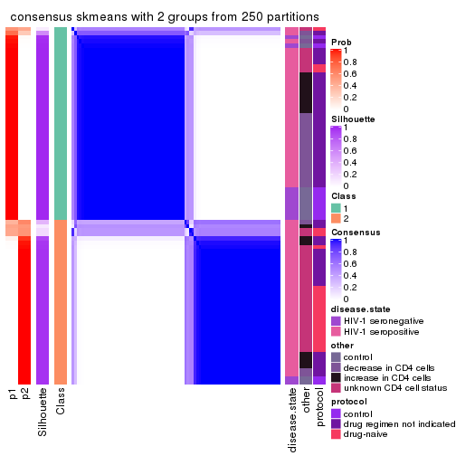</p>

</div>
<div id='tab-CV-skmeans-consensus-heatmap-2'>
<pre><code class="r">consensus_heatmap(res, k = 3)
</code></pre>

<p>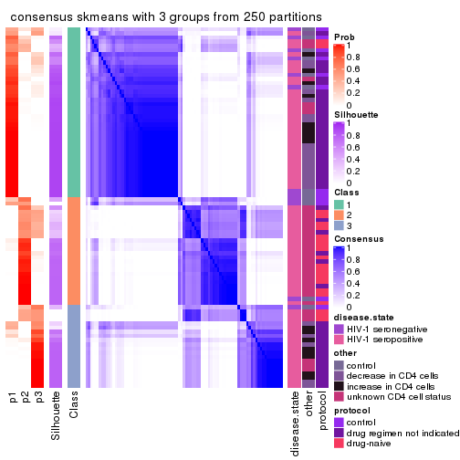</p>

</div>
<div id='tab-CV-skmeans-consensus-heatmap-3'>
<pre><code class="r">consensus_heatmap(res, k = 4)
</code></pre>

<p>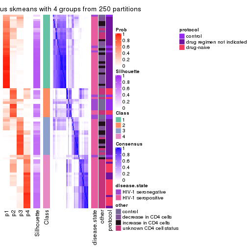</p>

</div>
<div id='tab-CV-skmeans-consensus-heatmap-4'>
<pre><code class="r">consensus_heatmap(res, k = 5)
</code></pre>

<p>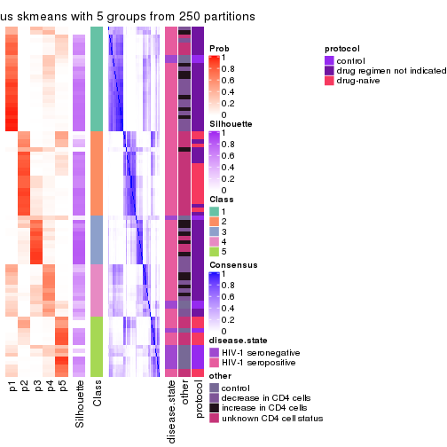</p>

</div>
<div id='tab-CV-skmeans-consensus-heatmap-5'>
<pre><code class="r">consensus_heatmap(res, k = 6)
</code></pre>

<p>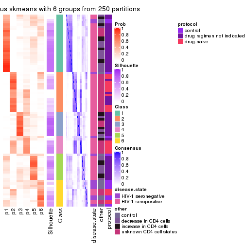</p>

</div>
</div>

Heatmaps for the membership of samples in all partitions to see how consistent they are:


<script>
$( function() {
	$( '#tabs-CV-skmeans-membership-heatmap' ).tabs();
} );
</script>
<div id='tabs-CV-skmeans-membership-heatmap'>
<ul>
<li><a href='#tab-CV-skmeans-membership-heatmap-1'>k = 2</a></li>
<li><a href='#tab-CV-skmeans-membership-heatmap-2'>k = 3</a></li>
<li><a href='#tab-CV-skmeans-membership-heatmap-3'>k = 4</a></li>
<li><a href='#tab-CV-skmeans-membership-heatmap-4'>k = 5</a></li>
<li><a href='#tab-CV-skmeans-membership-heatmap-5'>k = 6</a></li>
</ul>
<div id='tab-CV-skmeans-membership-heatmap-1'>
<pre><code class="r">membership_heatmap(res, k = 2)
</code></pre>

<p>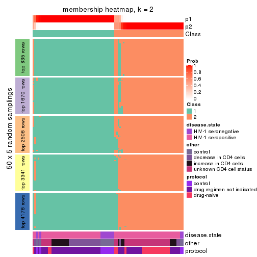</p>

</div>
<div id='tab-CV-skmeans-membership-heatmap-2'>
<pre><code class="r">membership_heatmap(res, k = 3)
</code></pre>

<p>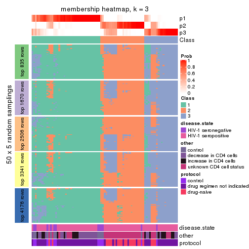</p>

</div>
<div id='tab-CV-skmeans-membership-heatmap-3'>
<pre><code class="r">membership_heatmap(res, k = 4)
</code></pre>

<p>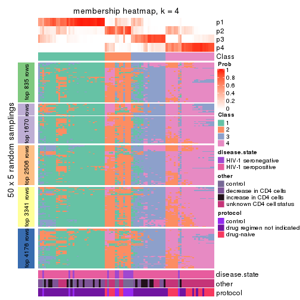</p>

</div>
<div id='tab-CV-skmeans-membership-heatmap-4'>
<pre><code class="r">membership_heatmap(res, k = 5)
</code></pre>

<p>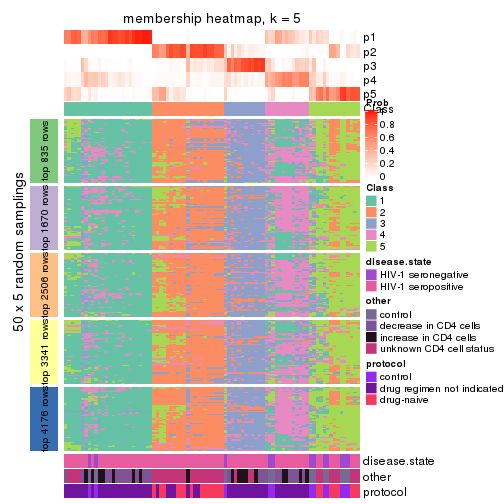</p>

</div>
<div id='tab-CV-skmeans-membership-heatmap-5'>
<pre><code class="r">membership_heatmap(res, k = 6)
</code></pre>

<p>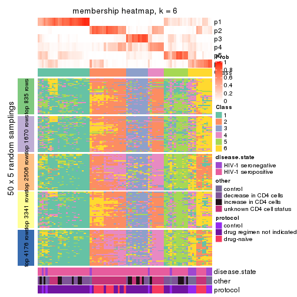</p>

</div>
</div>

As soon as we have had the classes for columns, we can look for signatures
which are significantly different between classes which can be candidate marks
for certain classes. Following are the heatmaps for signatures.


Signature heatmaps where rows are scaled:


<script>
$( function() {
	$( '#tabs-CV-skmeans-get-signatures' ).tabs();
} );
</script>
<div id='tabs-CV-skmeans-get-signatures'>
<ul>
<li><a href='#tab-CV-skmeans-get-signatures-1'>k = 2</a></li>
<li><a href='#tab-CV-skmeans-get-signatures-2'>k = 3</a></li>
<li><a href='#tab-CV-skmeans-get-signatures-3'>k = 4</a></li>
<li><a href='#tab-CV-skmeans-get-signatures-4'>k = 5</a></li>
<li><a href='#tab-CV-skmeans-get-signatures-5'>k = 6</a></li>
</ul>
<div id='tab-CV-skmeans-get-signatures-1'>
<pre><code class="r">get_signatures(res, k = 2)
</code></pre>

<p>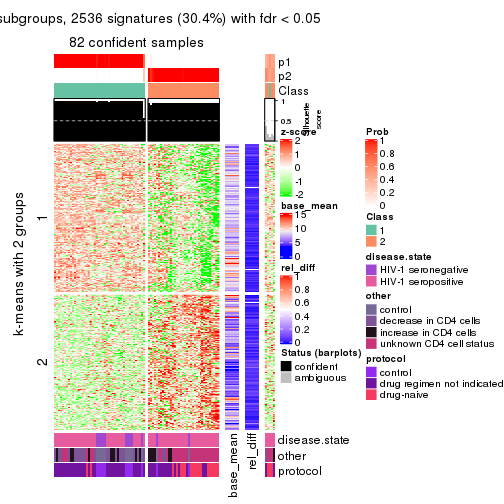</p>

</div>
<div id='tab-CV-skmeans-get-signatures-2'>
<pre><code class="r">get_signatures(res, k = 3)
</code></pre>

<p>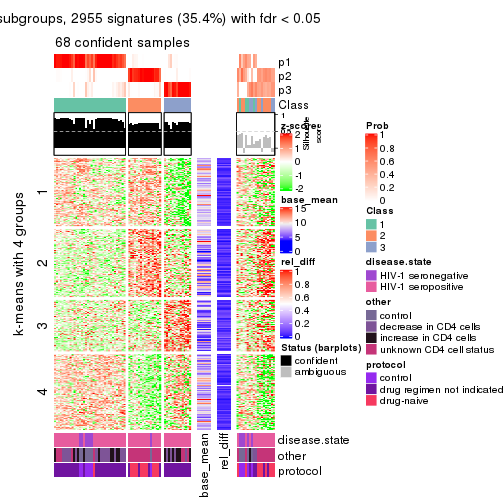</p>

</div>
<div id='tab-CV-skmeans-get-signatures-3'>
<pre><code class="r">get_signatures(res, k = 4)
</code></pre>

<p>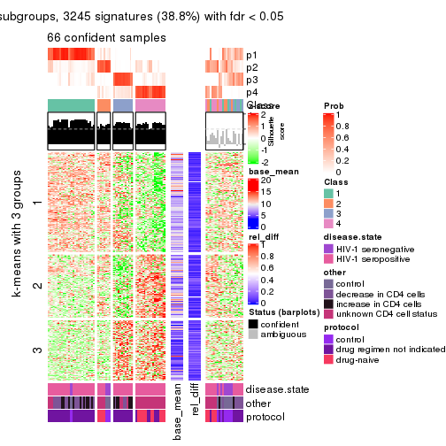</p>

</div>
<div id='tab-CV-skmeans-get-signatures-4'>
<pre><code class="r">get_signatures(res, k = 5)
</code></pre>

<p>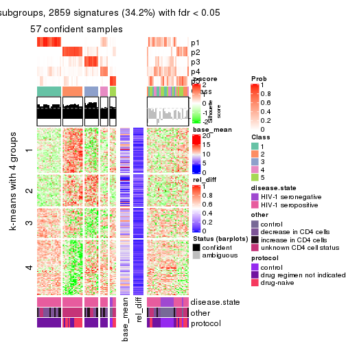</p>

</div>
<div id='tab-CV-skmeans-get-signatures-5'>
<pre><code class="r">get_signatures(res, k = 6)
</code></pre>

<p>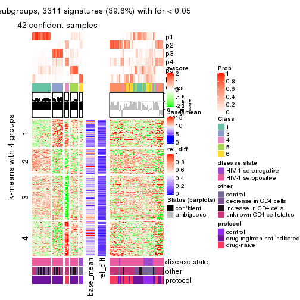</p>

</div>
</div>


Signature heatmaps where rows are not scaled:


<script>
$( function() {
	$( '#tabs-CV-skmeans-get-signatures-no-scale' ).tabs();
} );
</script>
<div id='tabs-CV-skmeans-get-signatures-no-scale'>
<ul>
<li><a href='#tab-CV-skmeans-get-signatures-no-scale-1'>k = 2</a></li>
<li><a href='#tab-CV-skmeans-get-signatures-no-scale-2'>k = 3</a></li>
<li><a href='#tab-CV-skmeans-get-signatures-no-scale-3'>k = 4</a></li>
<li><a href='#tab-CV-skmeans-get-signatures-no-scale-4'>k = 5</a></li>
<li><a href='#tab-CV-skmeans-get-signatures-no-scale-5'>k = 6</a></li>
</ul>
<div id='tab-CV-skmeans-get-signatures-no-scale-1'>
<pre><code class="r">get_signatures(res, k = 2, scale_rows = FALSE)
</code></pre>

<p>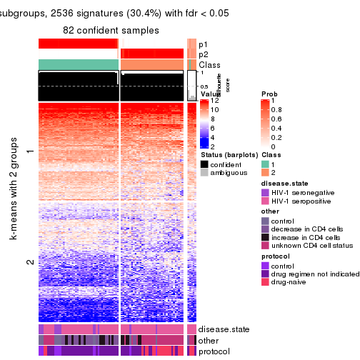</p>

</div>
<div id='tab-CV-skmeans-get-signatures-no-scale-2'>
<pre><code class="r">get_signatures(res, k = 3, scale_rows = FALSE)
</code></pre>

<p>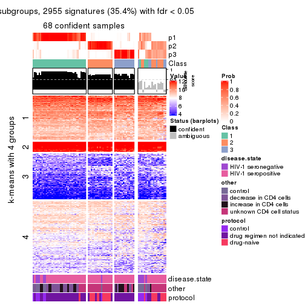</p>

</div>
<div id='tab-CV-skmeans-get-signatures-no-scale-3'>
<pre><code class="r">get_signatures(res, k = 4, scale_rows = FALSE)
</code></pre>

<p>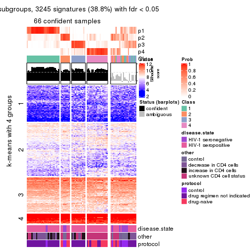</p>

</div>
<div id='tab-CV-skmeans-get-signatures-no-scale-4'>
<pre><code class="r">get_signatures(res, k = 5, scale_rows = FALSE)
</code></pre>

<p>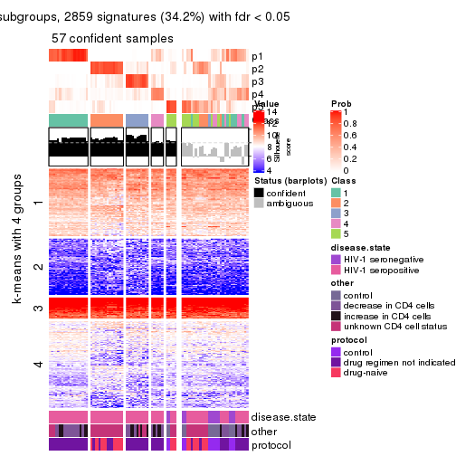</p>

</div>
<div id='tab-CV-skmeans-get-signatures-no-scale-5'>
<pre><code class="r">get_signatures(res, k = 6, scale_rows = FALSE)
</code></pre>

<p>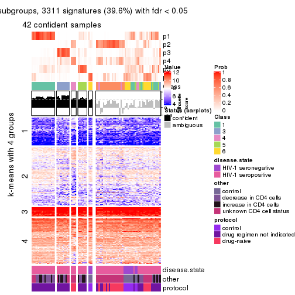</p>

</div>
</div>


Compare the overlap of signatures from different k:

```r
compare_signatures(res)
```

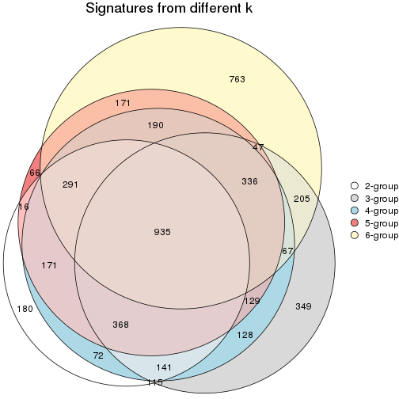

`get_signature()` returns a data frame invisibly. TO get the list of signatures, the function
call should be assigned to a variable explicitly. In following code, if `plot` argument is set
to `FALSE`, no heatmap is plotted while only the differential analysis is performed.

```r
# code only for demonstration
tb = get_signature(res, k = ..., plot = FALSE)
```

An example of the output of `tb` is:

```
#>   which_row         fdr    mean_1    mean_2 scaled_mean_1 scaled_mean_2 km
#> 1        38 0.042760348  8.373488  9.131774    -0.5533452     0.5164555  1
#> 2        40 0.018707592  7.106213  8.469186    -0.6173731     0.5762149  1
#> 3        55 0.019134737 10.221463 11.207825    -0.6159697     0.5749050  1
#> 4        59 0.006059896  5.921854  7.869574    -0.6899429     0.6439467  1
#> 5        60 0.018055526  8.928898 10.211722    -0.6204761     0.5791110  1
#> 6        98 0.009384629 15.714769 14.887706     0.6635654    -0.6193277  2
...
```

The columns in `tb` are:

1. `which_row`: row indices corresponding to the input matrix.
2. `fdr`: FDR for the differential test. 
3. `mean_x`: The mean value in group x.
4. `scaled_mean_x`: The mean value in group x after rows are scaled.
5. `km`: Row groups if k-means clustering is applied to rows.


UMAP plot which shows how samples are separated.


<script>
$( function() {
	$( '#tabs-CV-skmeans-dimension-reduction' ).tabs();
} );
</script>
<div id='tabs-CV-skmeans-dimension-reduction'>
<ul>
<li><a href='#tab-CV-skmeans-dimension-reduction-1'>k = 2</a></li>
<li><a href='#tab-CV-skmeans-dimension-reduction-2'>k = 3</a></li>
<li><a href='#tab-CV-skmeans-dimension-reduction-3'>k = 4</a></li>
<li><a href='#tab-CV-skmeans-dimension-reduction-4'>k = 5</a></li>
<li><a href='#tab-CV-skmeans-dimension-reduction-5'>k = 6</a></li>
</ul>
<div id='tab-CV-skmeans-dimension-reduction-1'>
<pre><code class="r">dimension_reduction(res, k = 2, method = &quot;UMAP&quot;)
</code></pre>

<p>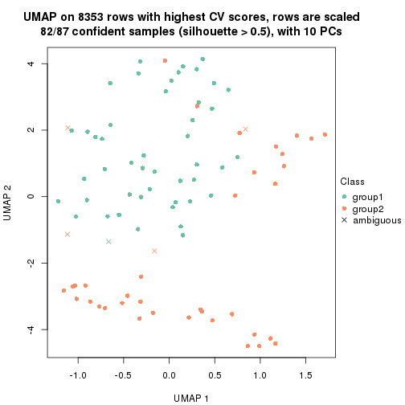</p>

</div>
<div id='tab-CV-skmeans-dimension-reduction-2'>
<pre><code class="r">dimension_reduction(res, k = 3, method = &quot;UMAP&quot;)
</code></pre>

<p>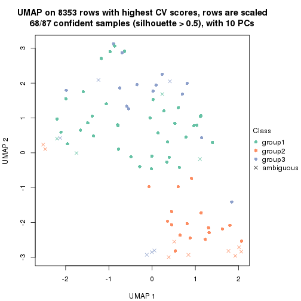</p>

</div>
<div id='tab-CV-skmeans-dimension-reduction-3'>
<pre><code class="r">dimension_reduction(res, k = 4, method = &quot;UMAP&quot;)
</code></pre>

<p>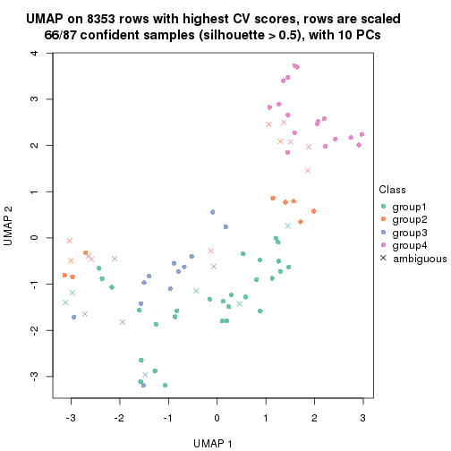</p>

</div>
<div id='tab-CV-skmeans-dimension-reduction-4'>
<pre><code class="r">dimension_reduction(res, k = 5, method = &quot;UMAP&quot;)
</code></pre>

<p>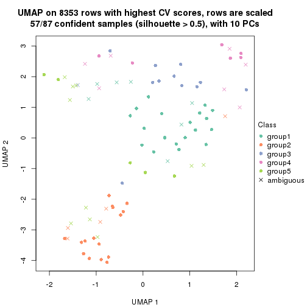</p>

</div>
<div id='tab-CV-skmeans-dimension-reduction-5'>
<pre><code class="r">dimension_reduction(res, k = 6, method = &quot;UMAP&quot;)
</code></pre>

<p>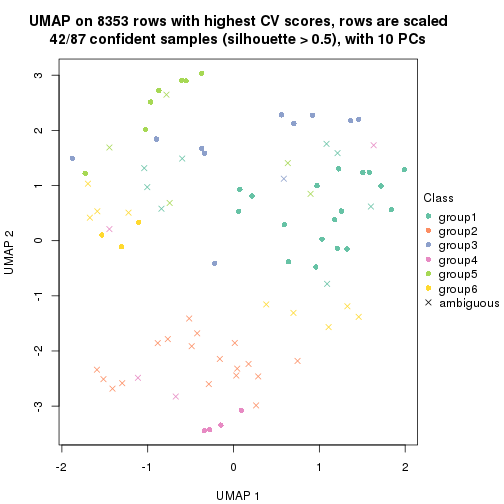</p>

</div>
</div>


Following heatmap shows how subgroups are split when increasing `k`:

```r
collect_classes(res)
```

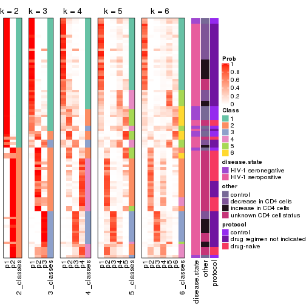


Test correlation between subgroups and known annotations. If the known
annotation is numeric, one-way ANOVA test is applied, and if the known
annotation is discrete, chi-squared contingency table test is applied.

```r
test_to_known_factors(res)
```

```
#>             n disease.state(p) other(p) protocol(p) k
#> CV:skmeans 82         8.14e-02 3.50e-07    1.71e-05 2
#> CV:skmeans 68         1.85e-01 2.21e-07    1.59e-08 3
#> CV:skmeans 66         5.34e-03 4.49e-09    2.77e-09 4
#> CV:skmeans 57         2.46e-04 1.64e-08    2.65e-09 5
#> CV:skmeans 42         1.67e-08 1.25e-08    7.63e-15 6
```


If matrix rows can be associated to genes, consider to use `GO_Enrichment(res,
...)` to perform function enrichment for the signature genes.


 

---------------------------------------------------


### CV:pam


The object with results only for a single top-value method and a single partition method 
can be extracted as:

```r
res = res_list["CV", "pam"]
# you can also extract it by
# res = res_list["CV:pam"]
```

A summary of `res` and all the functions that can be applied to it:

```r
res
```

```
#> A 'ConsensusPartition' object with k = 2, 3, 4, 5, 6.
#>   On a matrix with 8353 rows and 87 columns.
#>   Top rows (835, 1670, 2506, 3341, 4176) are extracted by 'CV' method.
#>   Subgroups are detected by 'pam' method.
#>   Performed in total 1250 partitions by row resampling.
#>   There is no best k.
#> 
#> Following methods can be applied to this 'ConsensusPartition' object:
#>  [1] "cola_report"             "collect_classes"         "collect_plots"          
#>  [4] "collect_stats"           "colnames"                "compare_signatures"     
#>  [7] "consensus_heatmap"       "dimension_reduction"     "functional_enrichment"  
#> [10] "get_anno_col"            "get_anno"                "get_classes"            
#> [13] "get_consensus"           "get_matrix"              "get_membership"         
#> [16] "get_param"               "get_signatures"          "get_stats"              
#> [19] "is_best_k"               "is_stable_k"             "membership_heatmap"     
#> [22] "ncol"                    "nrow"                    "plot_ecdf"              
#> [25] "rownames"                "select_partition_number" "show"                   
#> [28] "suggest_best_k"          "test_to_known_factors"
```

`collect_plots()` function collects all the plots made from `res` for all `k` (number of partitions)
into one single page to provide an easy and fast comparison between different `k`.

```r
collect_plots(res)
```

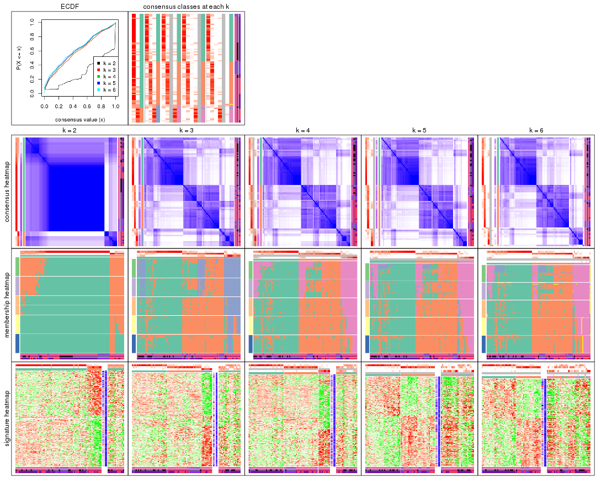

The plots are:

- The first row: a plot of the ECDF (Empirical cumulative distribution
  function) curves of the consensus matrix for each `k` and the heatmap of
  predicted classes for each `k`.
- The second row: heatmaps of the consensus matrix for each `k`.
- The third row: heatmaps of the membership matrix for each `k`.
- The fouth row: heatmaps of the signatures for each `k`.

All the plots in panels can be made by individual functions and they are
plotted later in this section.

`select_partition_number()` produces several plots showing different
statistics for choosing "optimized" `k`. There are following statistics:

- ECDF curves of the consensus matrix for each `k`;
- 1-PAC. [The PAC
  score](https://en.wikipedia.org/wiki/Consensus_clustering#Over-interpretation_potential_of_consensus_clustering)
  measures the proportion of the ambiguous subgrouping.
- Mean silhouette score.
- Concordance. The mean probability of fiting the consensus class ids in all
  partitions.
- Area increased. Denote $A_k$ as the area under the ECDF curve for current
  `k`, the area increased is defined as $A_k - A_{k-1}$.
- Rand index. The percent of pairs of samples that are both in a same cluster
  or both are not in a same cluster in the partition of k and k-1.
- Jaccard index. The ratio of pairs of samples are both in a same cluster in
  the partition of k and k-1 and the pairs of samples are both in a same
  cluster in the partition k or k-1.

The detailed explanations of these statistics can be found in [the cola
vignette](http://bioconductor.org/packages/devel/bioc/vignettes/cola/inst/doc/cola.html#toc_13).

Generally speaking, lower PAC score, higher mean silhouette score or higher
concordance corresponds to better partition. Rand index and Jaccard index
measure how similar the current partition is compared to partition with `k-1`.
If they are too similar, we won't accept `k` is better than `k-1`.

```r
select_partition_number(res)
```

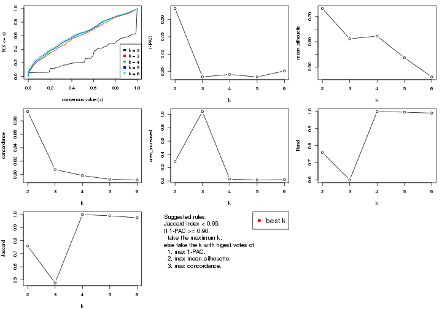

The numeric values for all these statistics can be obtained by `get_stats()`.

```r
get_stats(res)
```

```
#>   k 1-PAC mean_silhouette concordance area_increased  Rand Jaccard
#> 2 2 0.531           0.731       0.894         0.2928 0.759   0.759
#> 3 3 0.335           0.612       0.808         1.0438 0.599   0.476
#> 4 4 0.342           0.622       0.799         0.0273 1.000   1.000
#> 5 5 0.335           0.537       0.793         0.0154 0.997   0.991
#> 6 6 0.352           0.461       0.792         0.0204 0.991   0.975
```

`suggest_best_k()` suggests the best $k$ based on these statistics. The rules are as follows:

- All $k$ with Jaccard index larger than 0.95 are removed because the increase of
  the partition number does not provides enough extra information. If all $k$ are removed,
  the best $k$ is assigned by `NA`.
- For $k$ with 1-PAC larger than 0.9, the maximal $k$ is taken as the "best k". Other $k$ is called "optional k".
- If it does not fit the second rule. The $k$ with the highest vote of highest
  1-PAC, mean silhouette and concordance is taken as the "best k".

```r
suggest_best_k(res)
```

```
#> [1] NA
```


Following shows the table of the partitions (You need to click the **show/hide
code output** link to see it). The membership matrix (columns with name `p*`)
is inferred by
[`clue::cl_consensus()`](https://www.rdocumentation.org/link/cl_consensus?package=clue)
function with the `SE` method. Basically the value in the membership matrix
represents the probability to belong to a certain group. The finall class
label for an item is determined with the group with highest probability it
belongs to.

In `get_classes()` function, the entropy is calculated from the membership
matrix and the silhouette score is calculated from the consensus matrix.


<script>
$( function() {
	$( '#tabs-CV-pam-get-classes' ).tabs();
} );
</script>
<div id='tabs-CV-pam-get-classes'>
<ul>
<li><a href='#tab-CV-pam-get-classes-1'>k = 2</a></li>
<li><a href='#tab-CV-pam-get-classes-2'>k = 3</a></li>
<li><a href='#tab-CV-pam-get-classes-3'>k = 4</a></li>
<li><a href='#tab-CV-pam-get-classes-4'>k = 5</a></li>
<li><a href='#tab-CV-pam-get-classes-5'>k = 6</a></li>
</ul>

<div id='tab-CV-pam-get-classes-1'>
<p><a id='tab-CV-pam-get-classes-1-a' style='color:#0366d6' href='#'>show/hide code output</a></p>
<pre><code class="r">cbind(get_classes(res, k = 2), get_membership(res, k = 2))
</code></pre>

<pre><code>#&gt;          class entropy silhouette    p1    p2
#&gt; GSM39104     1  0.0000     0.8725 1.000 0.000
#&gt; GSM39105     1  0.0000     0.8725 1.000 0.000
#&gt; GSM39106     1  0.0000     0.8725 1.000 0.000
#&gt; GSM39107     1  0.0000     0.8725 1.000 0.000
#&gt; GSM39108     1  0.0000     0.8725 1.000 0.000
#&gt; GSM39109     1  0.8327     0.5760 0.736 0.264
#&gt; GSM39110     1  0.0000     0.8725 1.000 0.000
#&gt; GSM39111     1  0.0000     0.8725 1.000 0.000
#&gt; GSM39112     1  0.0000     0.8725 1.000 0.000
#&gt; GSM39113     1  0.0000     0.8725 1.000 0.000
#&gt; GSM39114     1  0.0376     0.8697 0.996 0.004
#&gt; GSM39115     1  0.0000     0.8725 1.000 0.000
#&gt; GSM39148     1  0.0000     0.8725 1.000 0.000
#&gt; GSM39149     1  0.9710     0.2665 0.600 0.400
#&gt; GSM39150     1  0.0000     0.8725 1.000 0.000
#&gt; GSM39151     1  0.9993    -0.0750 0.516 0.484
#&gt; GSM39152     1  0.0000     0.8725 1.000 0.000
#&gt; GSM39153     1  0.0000     0.8725 1.000 0.000
#&gt; GSM39154     1  0.0000     0.8725 1.000 0.000
#&gt; GSM39155     1  0.0000     0.8725 1.000 0.000
#&gt; GSM39156     1  0.0000     0.8725 1.000 0.000
#&gt; GSM39157     1  0.0000     0.8725 1.000 0.000
#&gt; GSM39158     1  0.0000     0.8725 1.000 0.000
#&gt; GSM39159     1  0.0000     0.8725 1.000 0.000
#&gt; GSM39160     1  0.0000     0.8725 1.000 0.000
#&gt; GSM39161     1  0.0000     0.8725 1.000 0.000
#&gt; GSM39162     1  0.0000     0.8725 1.000 0.000
#&gt; GSM39163     1  0.0000     0.8725 1.000 0.000
#&gt; GSM39164     1  0.0000     0.8725 1.000 0.000
#&gt; GSM39165     1  0.0000     0.8725 1.000 0.000
#&gt; GSM39166     1  0.0000     0.8725 1.000 0.000
#&gt; GSM39167     1  0.0000     0.8725 1.000 0.000
#&gt; GSM39168     1  0.0000     0.8725 1.000 0.000
#&gt; GSM39169     1  0.0000     0.8725 1.000 0.000
#&gt; GSM39170     1  0.0000     0.8725 1.000 0.000
#&gt; GSM39171     1  0.0000     0.8725 1.000 0.000
#&gt; GSM39172     1  0.9993    -0.0779 0.516 0.484
#&gt; GSM39173     1  0.6148     0.7348 0.848 0.152
#&gt; GSM39174     1  0.0000     0.8725 1.000 0.000
#&gt; GSM39175     1  0.0000     0.8725 1.000 0.000
#&gt; GSM39176     1  0.0000     0.8725 1.000 0.000
#&gt; GSM39177     1  0.6438     0.7212 0.836 0.164
#&gt; GSM39178     1  0.0000     0.8725 1.000 0.000
#&gt; GSM39179     1  0.9775     0.2285 0.588 0.412
#&gt; GSM39180     1  0.9993    -0.0730 0.516 0.484
#&gt; GSM39181     1  0.0000     0.8725 1.000 0.000
#&gt; GSM39182     1  0.9580     0.3198 0.620 0.380
#&gt; GSM39183     1  0.0000     0.8725 1.000 0.000
#&gt; GSM39184     1  0.0000     0.8725 1.000 0.000
#&gt; GSM39185     1  0.0000     0.8725 1.000 0.000
#&gt; GSM39186     1  0.0000     0.8725 1.000 0.000
#&gt; GSM39187     1  0.0000     0.8725 1.000 0.000
#&gt; GSM39116     1  0.9983    -0.0372 0.524 0.476
#&gt; GSM39117     2  0.0000     0.7702 0.000 1.000
#&gt; GSM39118     2  0.9044     0.6726 0.320 0.680
#&gt; GSM39119     2  0.7219     0.8213 0.200 0.800
#&gt; GSM39120     1  0.0000     0.8725 1.000 0.000
#&gt; GSM39121     1  0.0000     0.8725 1.000 0.000
#&gt; GSM39122     1  0.0938     0.8641 0.988 0.012
#&gt; GSM39123     2  0.0000     0.7702 0.000 1.000
#&gt; GSM39124     1  0.3274     0.8264 0.940 0.060
#&gt; GSM39125     1  0.0000     0.8725 1.000 0.000
#&gt; GSM39126     1  0.0000     0.8725 1.000 0.000
#&gt; GSM39127     1  0.9686     0.2784 0.604 0.396
#&gt; GSM39128     1  0.7219     0.6746 0.800 0.200
#&gt; GSM39129     2  0.7139     0.8222 0.196 0.804
#&gt; GSM39130     2  0.0000     0.7702 0.000 1.000
#&gt; GSM39131     1  0.4022     0.8087 0.920 0.080
#&gt; GSM39132     1  0.8555     0.5472 0.720 0.280
#&gt; GSM39133     2  0.0000     0.7702 0.000 1.000
#&gt; GSM39134     2  0.7219     0.8213 0.200 0.800
#&gt; GSM39135     1  0.9732     0.2542 0.596 0.404
#&gt; GSM39136     2  0.8713     0.7226 0.292 0.708
#&gt; GSM39137     1  0.0000     0.8725 1.000 0.000
#&gt; GSM39138     2  0.7139     0.8222 0.196 0.804
#&gt; GSM39139     1  0.9754     0.2414 0.592 0.408
#&gt; GSM39140     1  0.0000     0.8725 1.000 0.000
#&gt; GSM39141     1  0.0000     0.8725 1.000 0.000
#&gt; GSM39142     1  0.0000     0.8725 1.000 0.000
#&gt; GSM39143     1  0.0000     0.8725 1.000 0.000
#&gt; GSM39144     2  0.8016     0.7845 0.244 0.756
#&gt; GSM39145     1  0.9522     0.3442 0.628 0.372
#&gt; GSM39146     1  0.9710     0.2665 0.600 0.400
#&gt; GSM39147     1  0.6887     0.6962 0.816 0.184
#&gt; GSM39188     2  0.9460     0.5663 0.364 0.636
#&gt; GSM39189     1  0.8909     0.4933 0.692 0.308
#&gt; GSM39190     1  0.9795     0.2146 0.584 0.416
</code></pre>

<script>
$('#tab-CV-pam-get-classes-1-a').parent().next().next().hide();
$('#tab-CV-pam-get-classes-1-a').click(function(){
  $('#tab-CV-pam-get-classes-1-a').parent().next().next().toggle();
  return(false);
});
</script>
</div>

<div id='tab-CV-pam-get-classes-2'>
<p><a id='tab-CV-pam-get-classes-2-a' style='color:#0366d6' href='#'>show/hide code output</a></p>
<pre><code class="r">cbind(get_classes(res, k = 3), get_membership(res, k = 3))
</code></pre>

<pre><code>#&gt;          class entropy silhouette    p1    p2    p3
#&gt; GSM39104     2  0.5733     0.6184 0.324 0.676 0.000
#&gt; GSM39105     2  0.5016     0.7158 0.240 0.760 0.000
#&gt; GSM39106     1  0.5785     0.5531 0.668 0.332 0.000
#&gt; GSM39107     2  0.0892     0.7269 0.020 0.980 0.000
#&gt; GSM39108     2  0.4796     0.7314 0.220 0.780 0.000
#&gt; GSM39109     2  0.2056     0.7232 0.024 0.952 0.024
#&gt; GSM39110     1  0.5988     0.2680 0.632 0.368 0.000
#&gt; GSM39111     2  0.5882     0.5998 0.348 0.652 0.000
#&gt; GSM39112     2  0.0892     0.7269 0.020 0.980 0.000
#&gt; GSM39113     2  0.0892     0.7269 0.020 0.980 0.000
#&gt; GSM39114     2  0.0592     0.7214 0.012 0.988 0.000
#&gt; GSM39115     2  0.5968     0.5774 0.364 0.636 0.000
#&gt; GSM39148     1  0.0000     0.7987 1.000 0.000 0.000
#&gt; GSM39149     1  0.7796     0.1196 0.552 0.056 0.392
#&gt; GSM39150     1  0.1753     0.7980 0.952 0.048 0.000
#&gt; GSM39151     3  0.9520     0.3207 0.200 0.340 0.460
#&gt; GSM39152     1  0.1163     0.8013 0.972 0.028 0.000
#&gt; GSM39153     1  0.0000     0.7987 1.000 0.000 0.000
#&gt; GSM39154     1  0.0892     0.8005 0.980 0.020 0.000
#&gt; GSM39155     1  0.6274    -0.1966 0.544 0.456 0.000
#&gt; GSM39156     1  0.0592     0.7995 0.988 0.012 0.000
#&gt; GSM39157     2  0.5859     0.6325 0.344 0.656 0.000
#&gt; GSM39158     1  0.1031     0.8006 0.976 0.024 0.000
#&gt; GSM39159     1  0.5178     0.6271 0.744 0.256 0.000
#&gt; GSM39160     1  0.2959     0.7839 0.900 0.100 0.000
#&gt; GSM39161     1  0.1529     0.7996 0.960 0.040 0.000
#&gt; GSM39162     1  0.0000     0.7987 1.000 0.000 0.000
#&gt; GSM39163     1  0.1964     0.7939 0.944 0.056 0.000
#&gt; GSM39164     1  0.0000     0.7987 1.000 0.000 0.000
#&gt; GSM39165     1  0.4702     0.6603 0.788 0.212 0.000
#&gt; GSM39166     1  0.1643     0.7993 0.956 0.044 0.000
#&gt; GSM39167     1  0.0000     0.7987 1.000 0.000 0.000
#&gt; GSM39168     1  0.0000     0.7987 1.000 0.000 0.000
#&gt; GSM39169     1  0.0000     0.7987 1.000 0.000 0.000
#&gt; GSM39170     1  0.0747     0.7997 0.984 0.016 0.000
#&gt; GSM39171     2  0.5431     0.6922 0.284 0.716 0.000
#&gt; GSM39172     1  0.7030     0.1664 0.580 0.024 0.396
#&gt; GSM39173     1  0.4551     0.6820 0.840 0.020 0.140
#&gt; GSM39174     1  0.1529     0.7956 0.960 0.040 0.000
#&gt; GSM39175     1  0.0592     0.8012 0.988 0.012 0.000
#&gt; GSM39176     1  0.0000     0.7987 1.000 0.000 0.000
#&gt; GSM39177     1  0.7724     0.5519 0.680 0.156 0.164
#&gt; GSM39178     1  0.2066     0.7968 0.940 0.060 0.000
#&gt; GSM39179     1  0.9147    -0.1577 0.444 0.144 0.412
#&gt; GSM39180     3  0.9224     0.1830 0.408 0.152 0.440
#&gt; GSM39181     1  0.5785     0.4034 0.668 0.332 0.000
#&gt; GSM39182     1  0.7571     0.2519 0.592 0.052 0.356
#&gt; GSM39183     1  0.5178     0.5903 0.744 0.256 0.000
#&gt; GSM39184     1  0.5465     0.5126 0.712 0.288 0.000
#&gt; GSM39185     1  0.5363     0.5905 0.724 0.276 0.000
#&gt; GSM39186     2  0.6274     0.3748 0.456 0.544 0.000
#&gt; GSM39187     1  0.2066     0.7956 0.940 0.060 0.000
#&gt; GSM39116     2  0.6255     0.3856 0.012 0.668 0.320
#&gt; GSM39117     3  0.0000     0.6918 0.000 0.000 1.000
#&gt; GSM39118     3  0.6617     0.3847 0.012 0.388 0.600
#&gt; GSM39119     3  0.4968     0.6818 0.012 0.188 0.800
#&gt; GSM39120     2  0.3412     0.7227 0.124 0.876 0.000
#&gt; GSM39121     2  0.2878     0.7353 0.096 0.904 0.000
#&gt; GSM39122     2  0.1753     0.7353 0.048 0.952 0.000
#&gt; GSM39123     3  0.0000     0.6918 0.000 0.000 1.000
#&gt; GSM39124     2  0.3618     0.7503 0.104 0.884 0.012
#&gt; GSM39125     2  0.3192     0.7494 0.112 0.888 0.000
#&gt; GSM39126     2  0.3267     0.7358 0.116 0.884 0.000
#&gt; GSM39127     2  0.2749     0.6966 0.012 0.924 0.064
#&gt; GSM39128     2  0.6488     0.5584 0.192 0.744 0.064
#&gt; GSM39129     3  0.4733     0.6867 0.004 0.196 0.800
#&gt; GSM39130     3  0.0000     0.6918 0.000 0.000 1.000
#&gt; GSM39131     2  0.0983     0.7213 0.016 0.980 0.004
#&gt; GSM39132     2  0.4475     0.7006 0.072 0.864 0.064
#&gt; GSM39133     3  0.0000     0.6918 0.000 0.000 1.000
#&gt; GSM39134     3  0.5355     0.6939 0.032 0.168 0.800
#&gt; GSM39135     2  0.6357     0.3616 0.012 0.652 0.336
#&gt; GSM39136     3  0.6584     0.4146 0.012 0.380 0.608
#&gt; GSM39137     2  0.4291     0.7431 0.180 0.820 0.000
#&gt; GSM39138     3  0.5292     0.6528 0.172 0.028 0.800
#&gt; GSM39139     2  0.6632     0.2446 0.012 0.596 0.392
#&gt; GSM39140     2  0.6045     0.5561 0.380 0.620 0.000
#&gt; GSM39141     2  0.5178     0.7136 0.256 0.744 0.000
#&gt; GSM39142     2  0.5058     0.7168 0.244 0.756 0.000
#&gt; GSM39143     2  0.5016     0.7190 0.240 0.760 0.000
#&gt; GSM39144     3  0.5775     0.6127 0.012 0.260 0.728
#&gt; GSM39145     2  0.7442     0.3426 0.048 0.604 0.348
#&gt; GSM39146     2  0.5268     0.5927 0.012 0.776 0.212
#&gt; GSM39147     2  0.3112     0.7223 0.028 0.916 0.056
#&gt; GSM39188     3  0.7158     0.3607 0.372 0.032 0.596
#&gt; GSM39189     1  0.6798     0.4802 0.696 0.048 0.256
#&gt; GSM39190     2  0.8370     0.0149 0.084 0.500 0.416
</code></pre>

<script>
$('#tab-CV-pam-get-classes-2-a').parent().next().next().hide();
$('#tab-CV-pam-get-classes-2-a').click(function(){
  $('#tab-CV-pam-get-classes-2-a').parent().next().next().toggle();
  return(false);
});
</script>
</div>

<div id='tab-CV-pam-get-classes-3'>
<p><a id='tab-CV-pam-get-classes-3-a' style='color:#0366d6' href='#'>show/hide code output</a></p>
<pre><code class="r">cbind(get_classes(res, k = 4), get_membership(res, k = 4))
</code></pre>

<pre><code>#&gt;          class entropy silhouette    p1    p2 p3    p4
#&gt; GSM39104     2  0.5994     0.6087 0.296 0.636 NA 0.000
#&gt; GSM39105     2  0.5050     0.7253 0.176 0.756 NA 0.000
#&gt; GSM39106     1  0.5901     0.5899 0.652 0.280 NA 0.000
#&gt; GSM39107     2  0.0592     0.7359 0.016 0.984 NA 0.000
#&gt; GSM39108     2  0.5212     0.7252 0.192 0.740 NA 0.000
#&gt; GSM39109     2  0.1411     0.7349 0.020 0.960 NA 0.020
#&gt; GSM39110     1  0.4746     0.2804 0.632 0.368 NA 0.000
#&gt; GSM39111     2  0.5925     0.6362 0.284 0.648 NA 0.000
#&gt; GSM39112     2  0.0592     0.7359 0.016 0.984 NA 0.000
#&gt; GSM39113     2  0.0592     0.7359 0.016 0.984 NA 0.000
#&gt; GSM39114     2  0.0336     0.7306 0.008 0.992 NA 0.000
#&gt; GSM39115     2  0.6016     0.6147 0.300 0.632 NA 0.000
#&gt; GSM39148     1  0.0000     0.7933 1.000 0.000 NA 0.000
#&gt; GSM39149     1  0.7403     0.2186 0.548 0.060 NA 0.336
#&gt; GSM39150     1  0.1888     0.7914 0.940 0.044 NA 0.000
#&gt; GSM39151     4  0.8604     0.3405 0.176 0.324 NA 0.444
#&gt; GSM39152     1  0.1022     0.7958 0.968 0.032 NA 0.000
#&gt; GSM39153     1  0.0000     0.7933 1.000 0.000 NA 0.000
#&gt; GSM39154     1  0.0707     0.7953 0.980 0.020 NA 0.000
#&gt; GSM39155     1  0.6209    -0.2461 0.492 0.456 NA 0.000
#&gt; GSM39156     1  0.0469     0.7944 0.988 0.012 NA 0.000
#&gt; GSM39157     2  0.5697     0.6618 0.292 0.656 NA 0.000
#&gt; GSM39158     1  0.0817     0.7957 0.976 0.024 NA 0.000
#&gt; GSM39159     1  0.5687     0.6046 0.684 0.248 NA 0.000
#&gt; GSM39160     1  0.3948     0.7623 0.840 0.096 NA 0.000
#&gt; GSM39161     1  0.1706     0.7935 0.948 0.036 NA 0.000
#&gt; GSM39162     1  0.0000     0.7933 1.000 0.000 NA 0.000
#&gt; GSM39163     1  0.1557     0.7897 0.944 0.056 NA 0.000
#&gt; GSM39164     1  0.0000     0.7933 1.000 0.000 NA 0.000
#&gt; GSM39165     1  0.4290     0.6550 0.772 0.212 NA 0.000
#&gt; GSM39166     1  0.2319     0.7887 0.924 0.040 NA 0.000
#&gt; GSM39167     1  0.0000     0.7933 1.000 0.000 NA 0.000
#&gt; GSM39168     1  0.0000     0.7933 1.000 0.000 NA 0.000
#&gt; GSM39169     1  0.0000     0.7933 1.000 0.000 NA 0.000
#&gt; GSM39170     1  0.0927     0.7938 0.976 0.008 NA 0.000
#&gt; GSM39171     2  0.4250     0.7023 0.276 0.724 NA 0.000
#&gt; GSM39172     1  0.5660     0.2067 0.576 0.028 NA 0.396
#&gt; GSM39173     1  0.3847     0.6989 0.844 0.012 NA 0.124
#&gt; GSM39174     1  0.1211     0.7910 0.960 0.040 NA 0.000
#&gt; GSM39175     1  0.0469     0.7958 0.988 0.012 NA 0.000
#&gt; GSM39176     1  0.0000     0.7933 1.000 0.000 NA 0.000
#&gt; GSM39177     1  0.6163     0.5641 0.676 0.160 NA 0.164
#&gt; GSM39178     1  0.2363     0.7891 0.920 0.056 NA 0.000
#&gt; GSM39179     1  0.8264    -0.0795 0.440 0.144 NA 0.372
#&gt; GSM39180     4  0.7338     0.1459 0.404 0.156 NA 0.440
#&gt; GSM39181     1  0.6153     0.3566 0.604 0.328 NA 0.000
#&gt; GSM39182     1  0.6069     0.2882 0.588 0.056 NA 0.356
#&gt; GSM39183     1  0.5716     0.5576 0.680 0.252 NA 0.000
#&gt; GSM39184     1  0.5815     0.4758 0.652 0.288 NA 0.000
#&gt; GSM39185     1  0.5772     0.5673 0.672 0.260 NA 0.000
#&gt; GSM39186     2  0.5888     0.4001 0.424 0.540 NA 0.000
#&gt; GSM39187     1  0.1902     0.7906 0.932 0.064 NA 0.000
#&gt; GSM39116     2  0.5205     0.4233 0.008 0.672 NA 0.308
#&gt; GSM39117     4  0.0000     0.7133 0.000 0.000 NA 1.000
#&gt; GSM39118     4  0.5138     0.3614 0.008 0.392 NA 0.600
#&gt; GSM39119     4  0.3852     0.6827 0.008 0.192 NA 0.800
#&gt; GSM39120     2  0.2469     0.7320 0.108 0.892 NA 0.000
#&gt; GSM39121     2  0.2345     0.7431 0.100 0.900 NA 0.000
#&gt; GSM39122     2  0.1302     0.7455 0.044 0.956 NA 0.000
#&gt; GSM39123     4  0.0000     0.7133 0.000 0.000 NA 1.000
#&gt; GSM39124     2  0.2741     0.7587 0.096 0.892 NA 0.012
#&gt; GSM39125     2  0.2345     0.7583 0.100 0.900 NA 0.000
#&gt; GSM39126     2  0.2408     0.7445 0.104 0.896 NA 0.000
#&gt; GSM39127     2  0.2587     0.7047 0.008 0.916 NA 0.056
#&gt; GSM39128     2  0.5616     0.5637 0.180 0.740 NA 0.060
#&gt; GSM39129     4  0.4491     0.7111 0.000 0.140 NA 0.800
#&gt; GSM39130     4  0.0000     0.7133 0.000 0.000 NA 1.000
#&gt; GSM39131     2  0.1042     0.7275 0.008 0.972 NA 0.000
#&gt; GSM39132     2  0.3933     0.7079 0.064 0.860 NA 0.056
#&gt; GSM39133     4  0.0000     0.7133 0.000 0.000 NA 1.000
#&gt; GSM39134     4  0.4194     0.6988 0.028 0.172 NA 0.800
#&gt; GSM39135     2  0.5485     0.4020 0.008 0.652 NA 0.320
#&gt; GSM39136     4  0.5747     0.3747 0.008 0.384 NA 0.588
#&gt; GSM39137     2  0.3219     0.7525 0.164 0.836 NA 0.000
#&gt; GSM39138     4  0.4244     0.6624 0.168 0.032 NA 0.800
#&gt; GSM39139     2  0.5525     0.2884 0.008 0.600 NA 0.380
#&gt; GSM39140     2  0.4761     0.5654 0.372 0.628 NA 0.000
#&gt; GSM39141     2  0.4040     0.7203 0.248 0.752 NA 0.000
#&gt; GSM39142     2  0.3942     0.7242 0.236 0.764 NA 0.000
#&gt; GSM39143     2  0.3907     0.7265 0.232 0.768 NA 0.000
#&gt; GSM39144     4  0.6577     0.6692 0.004 0.176 NA 0.648
#&gt; GSM39145     2  0.6232     0.3806 0.040 0.608 NA 0.336
#&gt; GSM39146     2  0.4612     0.6018 0.008 0.764 NA 0.212
#&gt; GSM39147     2  0.2363     0.7343 0.024 0.920 NA 0.056
#&gt; GSM39188     4  0.8009     0.5480 0.204 0.028 NA 0.520
#&gt; GSM39189     1  0.5463     0.5028 0.692 0.052 NA 0.256
#&gt; GSM39190     2  0.8889     0.1549 0.076 0.456 NA 0.216
</code></pre>

<script>
$('#tab-CV-pam-get-classes-3-a').parent().next().next().hide();
$('#tab-CV-pam-get-classes-3-a').click(function(){
  $('#tab-CV-pam-get-classes-3-a').parent().next().next().toggle();
  return(false);
});
</script>
</div>

<div id='tab-CV-pam-get-classes-4'>
<p><a id='tab-CV-pam-get-classes-4-a' style='color:#0366d6' href='#'>show/hide code output</a></p>
<pre><code class="r">cbind(get_classes(res, k = 5), get_membership(res, k = 5))
</code></pre>

<pre><code>#&gt;          class entropy silhouette    p1    p2    p3    p4 p5
#&gt; GSM39104     2  0.5285     0.6057 0.288 0.632 0.080 0.000 NA
#&gt; GSM39105     2  0.4449     0.7245 0.168 0.752 0.080 0.000 NA
#&gt; GSM39106     1  0.5245     0.5868 0.640 0.280 0.080 0.000 NA
#&gt; GSM39107     2  0.0510     0.7359 0.016 0.984 0.000 0.000 NA
#&gt; GSM39108     2  0.4593     0.7264 0.184 0.736 0.080 0.000 NA
#&gt; GSM39109     2  0.1117     0.7334 0.016 0.964 0.000 0.020 NA
#&gt; GSM39110     1  0.4074     0.2869 0.636 0.364 0.000 0.000 NA
#&gt; GSM39111     2  0.5203     0.6386 0.272 0.648 0.080 0.000 NA
#&gt; GSM39112     2  0.0510     0.7359 0.016 0.984 0.000 0.000 NA
#&gt; GSM39113     2  0.0609     0.7367 0.020 0.980 0.000 0.000 NA
#&gt; GSM39114     2  0.0290     0.7308 0.008 0.992 0.000 0.000 NA
#&gt; GSM39115     2  0.5285     0.6175 0.288 0.632 0.080 0.000 NA
#&gt; GSM39148     1  0.0000     0.7889 1.000 0.000 0.000 0.000 NA
#&gt; GSM39149     1  0.7132     0.2638 0.548 0.056 0.104 0.276 NA
#&gt; GSM39150     1  0.1800     0.7862 0.932 0.048 0.020 0.000 NA
#&gt; GSM39151     4  0.8476     0.0725 0.148 0.300 0.080 0.420 NA
#&gt; GSM39152     1  0.0880     0.7926 0.968 0.032 0.000 0.000 NA
#&gt; GSM39153     1  0.0000     0.7889 1.000 0.000 0.000 0.000 NA
#&gt; GSM39154     1  0.0609     0.7914 0.980 0.020 0.000 0.000 NA
#&gt; GSM39155     1  0.5456    -0.2600 0.484 0.456 0.060 0.000 NA
#&gt; GSM39156     1  0.0404     0.7900 0.988 0.012 0.000 0.000 NA
#&gt; GSM39157     2  0.5029     0.6585 0.292 0.648 0.060 0.000 NA
#&gt; GSM39158     1  0.0794     0.7922 0.972 0.028 0.000 0.000 NA
#&gt; GSM39159     1  0.5064     0.6017 0.672 0.248 0.080 0.000 NA
#&gt; GSM39160     1  0.3586     0.7558 0.828 0.096 0.076 0.000 NA
#&gt; GSM39161     1  0.1725     0.7882 0.936 0.044 0.020 0.000 NA
#&gt; GSM39162     1  0.0000     0.7889 1.000 0.000 0.000 0.000 NA
#&gt; GSM39163     1  0.1341     0.7868 0.944 0.056 0.000 0.000 NA
#&gt; GSM39164     1  0.0000     0.7889 1.000 0.000 0.000 0.000 NA
#&gt; GSM39165     1  0.3663     0.6581 0.776 0.208 0.016 0.000 NA
#&gt; GSM39166     1  0.2228     0.7828 0.912 0.048 0.040 0.000 NA
#&gt; GSM39167     1  0.0000     0.7889 1.000 0.000 0.000 0.000 NA
#&gt; GSM39168     1  0.0000     0.7889 1.000 0.000 0.000 0.000 NA
#&gt; GSM39169     1  0.0000     0.7889 1.000 0.000 0.000 0.000 NA
#&gt; GSM39170     1  0.1012     0.7878 0.968 0.012 0.020 0.000 NA
#&gt; GSM39171     2  0.3707     0.6954 0.284 0.716 0.000 0.000 NA
#&gt; GSM39172     1  0.4876     0.2172 0.576 0.028 0.000 0.396 NA
#&gt; GSM39173     1  0.3929     0.6796 0.816 0.000 0.120 0.048 NA
#&gt; GSM39174     1  0.1043     0.7879 0.960 0.040 0.000 0.000 NA
#&gt; GSM39175     1  0.0404     0.7917 0.988 0.012 0.000 0.000 NA
#&gt; GSM39176     1  0.0000     0.7889 1.000 0.000 0.000 0.000 NA
#&gt; GSM39177     1  0.5273     0.5759 0.680 0.156 0.000 0.164 NA
#&gt; GSM39178     1  0.2260     0.7833 0.908 0.064 0.028 0.000 NA
#&gt; GSM39179     1  0.8289    -0.0471 0.428 0.132 0.044 0.316 NA
#&gt; GSM39180     4  0.6320    -0.0236 0.404 0.156 0.000 0.440 NA
#&gt; GSM39181     1  0.5470     0.3431 0.588 0.332 0.080 0.000 NA
#&gt; GSM39182     1  0.5215     0.3179 0.592 0.056 0.000 0.352 NA
#&gt; GSM39183     1  0.5088     0.5533 0.668 0.252 0.080 0.000 NA
#&gt; GSM39184     1  0.5124     0.4676 0.644 0.288 0.068 0.000 NA
#&gt; GSM39185     1  0.5158     0.5581 0.656 0.264 0.080 0.000 NA
#&gt; GSM39186     2  0.5243     0.4046 0.412 0.540 0.048 0.000 NA
#&gt; GSM39187     1  0.1638     0.7880 0.932 0.064 0.004 0.000 NA
#&gt; GSM39116     2  0.4540     0.4428 0.008 0.676 0.016 0.300 NA
#&gt; GSM39117     4  0.0000     0.0232 0.000 0.000 0.000 1.000 NA
#&gt; GSM39118     4  0.4425     0.2061 0.008 0.392 0.000 0.600 NA
#&gt; GSM39119     4  0.3318     0.2250 0.008 0.192 0.000 0.800 NA
#&gt; GSM39120     2  0.2179     0.7326 0.112 0.888 0.000 0.000 NA
#&gt; GSM39121     2  0.2127     0.7422 0.108 0.892 0.000 0.000 NA
#&gt; GSM39122     2  0.1197     0.7458 0.048 0.952 0.000 0.000 NA
#&gt; GSM39123     4  0.0000     0.0232 0.000 0.000 0.000 1.000 NA
#&gt; GSM39124     2  0.2470     0.7590 0.104 0.884 0.000 0.012 NA
#&gt; GSM39125     2  0.2074     0.7589 0.104 0.896 0.000 0.000 NA
#&gt; GSM39126     2  0.2179     0.7459 0.112 0.888 0.000 0.000 NA
#&gt; GSM39127     2  0.2409     0.7016 0.008 0.908 0.028 0.056 NA
#&gt; GSM39128     2  0.4972     0.5688 0.176 0.736 0.028 0.060 NA
#&gt; GSM39129     4  0.4383    -0.0769 0.000 0.048 0.048 0.800 NA
#&gt; GSM39130     4  0.0000     0.0232 0.000 0.000 0.000 1.000 NA
#&gt; GSM39131     2  0.0992     0.7266 0.008 0.968 0.024 0.000 NA
#&gt; GSM39132     2  0.3497     0.7089 0.064 0.856 0.028 0.052 NA
#&gt; GSM39133     4  0.0000     0.0232 0.000 0.000 0.000 1.000 NA
#&gt; GSM39134     4  0.3612     0.2163 0.028 0.172 0.000 0.800 NA
#&gt; GSM39135     2  0.4853     0.4198 0.008 0.652 0.028 0.312 NA
#&gt; GSM39136     4  0.5109     0.1983 0.008 0.384 0.028 0.580 NA
#&gt; GSM39137     2  0.2852     0.7523 0.172 0.828 0.000 0.000 NA
#&gt; GSM39138     4  0.3656    -0.0443 0.168 0.032 0.000 0.800 NA
#&gt; GSM39139     2  0.5395     0.3318 0.008 0.600 0.024 0.352 NA
#&gt; GSM39140     2  0.4126     0.5534 0.380 0.620 0.000 0.000 NA
#&gt; GSM39141     2  0.3534     0.7187 0.256 0.744 0.000 0.000 NA
#&gt; GSM39142     2  0.3452     0.7229 0.244 0.756 0.000 0.000 NA
#&gt; GSM39143     2  0.3424     0.7252 0.240 0.760 0.000 0.000 NA
#&gt; GSM39144     4  0.5656    -0.2502 0.000 0.104 0.000 0.588 NA
#&gt; GSM39145     2  0.5508     0.4007 0.040 0.608 0.024 0.328 NA
#&gt; GSM39146     2  0.4097     0.5987 0.008 0.756 0.020 0.216 NA
#&gt; GSM39147     2  0.2196     0.7336 0.024 0.916 0.004 0.056 NA
#&gt; GSM39188     3  0.5503     0.0000 0.024 0.024 0.484 0.468 NA
#&gt; GSM39189     1  0.4922     0.5036 0.684 0.056 0.004 0.256 NA
#&gt; GSM39190     2  0.7234     0.1267 0.068 0.408 0.000 0.116 NA
</code></pre>

<script>
$('#tab-CV-pam-get-classes-4-a').parent().next().next().hide();
$('#tab-CV-pam-get-classes-4-a').click(function(){
  $('#tab-CV-pam-get-classes-4-a').parent().next().next().toggle();
  return(false);
});
</script>
</div>

<div id='tab-CV-pam-get-classes-5'>
<p><a id='tab-CV-pam-get-classes-5-a' style='color:#0366d6' href='#'>show/hide code output</a></p>
<pre><code class="r">cbind(get_classes(res, k = 6), get_membership(res, k = 6))
</code></pre>

<pre><code>#&gt;          class entropy silhouette    p1    p2    p3    p4 p5    p6
#&gt; GSM39104     2  0.4812     0.3620 0.264 0.640 0.000 0.000 NA 0.000
#&gt; GSM39105     2  0.4014     0.5448 0.148 0.756 0.000 0.000 NA 0.000
#&gt; GSM39106     1  0.4869     0.5154 0.628 0.276 0.000 0.000 NA 0.000
#&gt; GSM39107     2  0.0146     0.5725 0.004 0.996 0.000 0.000 NA 0.000
#&gt; GSM39108     2  0.4220     0.5385 0.172 0.732 0.000 0.000 NA 0.000
#&gt; GSM39109     2  0.0717     0.5718 0.008 0.976 0.000 0.016 NA 0.000
#&gt; GSM39110     1  0.3659     0.2767 0.636 0.364 0.000 0.000 NA 0.000
#&gt; GSM39111     2  0.4729     0.4247 0.248 0.656 0.000 0.000 NA 0.000
#&gt; GSM39112     2  0.0146     0.5725 0.004 0.996 0.000 0.000 NA 0.000
#&gt; GSM39113     2  0.0363     0.5754 0.012 0.988 0.000 0.000 NA 0.000
#&gt; GSM39114     2  0.0551     0.5717 0.004 0.984 0.008 0.000 NA 0.000
#&gt; GSM39115     2  0.4812     0.4125 0.264 0.640 0.000 0.000 NA 0.000
#&gt; GSM39148     1  0.0000     0.7726 1.000 0.000 0.000 0.000 NA 0.000
#&gt; GSM39149     1  0.7081     0.2971 0.536 0.060 0.076 0.264 NA 0.024
#&gt; GSM39150     1  0.1682     0.7662 0.928 0.052 0.000 0.000 NA 0.000
#&gt; GSM39151     4  0.8612    -0.1008 0.060 0.172 0.052 0.392 NA 0.240
#&gt; GSM39152     1  0.0790     0.7746 0.968 0.032 0.000 0.000 NA 0.000
#&gt; GSM39153     1  0.0000     0.7726 1.000 0.000 0.000 0.000 NA 0.000
#&gt; GSM39154     1  0.0547     0.7730 0.980 0.020 0.000 0.000 NA 0.000
#&gt; GSM39155     1  0.5075    -0.2844 0.464 0.460 0.000 0.000 NA 0.000
#&gt; GSM39156     1  0.0458     0.7745 0.984 0.016 0.000 0.000 NA 0.000
#&gt; GSM39157     2  0.4616     0.4422 0.280 0.648 0.000 0.000 NA 0.000
#&gt; GSM39158     1  0.0713     0.7745 0.972 0.028 0.000 0.000 NA 0.000
#&gt; GSM39159     1  0.4750     0.5460 0.652 0.252 0.000 0.000 NA 0.000
#&gt; GSM39160     1  0.3423     0.7188 0.812 0.100 0.000 0.000 NA 0.000
#&gt; GSM39161     1  0.1700     0.7682 0.928 0.048 0.000 0.000 NA 0.000
#&gt; GSM39162     1  0.0000     0.7726 1.000 0.000 0.000 0.000 NA 0.000
#&gt; GSM39163     1  0.1267     0.7632 0.940 0.060 0.000 0.000 NA 0.000
#&gt; GSM39164     1  0.0000     0.7726 1.000 0.000 0.000 0.000 NA 0.000
#&gt; GSM39165     1  0.3320     0.6170 0.772 0.212 0.000 0.000 NA 0.000
#&gt; GSM39166     1  0.2197     0.7599 0.900 0.056 0.000 0.000 NA 0.000
#&gt; GSM39167     1  0.0000     0.7726 1.000 0.000 0.000 0.000 NA 0.000
#&gt; GSM39168     1  0.0000     0.7726 1.000 0.000 0.000 0.000 NA 0.000
#&gt; GSM39169     1  0.0000     0.7726 1.000 0.000 0.000 0.000 NA 0.000
#&gt; GSM39170     1  0.1003     0.7704 0.964 0.016 0.000 0.000 NA 0.000
#&gt; GSM39171     2  0.3309     0.5077 0.280 0.720 0.000 0.000 NA 0.000
#&gt; GSM39172     1  0.4379     0.2425 0.576 0.028 0.000 0.396 NA 0.000
#&gt; GSM39173     1  0.3367     0.6653 0.804 0.000 0.164 0.012 NA 0.000
#&gt; GSM39174     1  0.0937     0.7665 0.960 0.040 0.000 0.000 NA 0.000
#&gt; GSM39175     1  0.0363     0.7748 0.988 0.012 0.000 0.000 NA 0.000
#&gt; GSM39176     1  0.0000     0.7726 1.000 0.000 0.000 0.000 NA 0.000
#&gt; GSM39177     1  0.5142     0.5262 0.672 0.160 0.000 0.148 NA 0.000
#&gt; GSM39178     1  0.2088     0.7620 0.904 0.068 0.000 0.000 NA 0.000
#&gt; GSM39179     1  0.7969    -0.0625 0.376 0.120 0.024 0.172 NA 0.012
#&gt; GSM39180     4  0.5825     0.0589 0.400 0.160 0.000 0.436 NA 0.000
#&gt; GSM39181     1  0.4982     0.3119 0.576 0.340 0.000 0.000 NA 0.000
#&gt; GSM39182     1  0.4684     0.3344 0.592 0.056 0.000 0.352 NA 0.000
#&gt; GSM39183     1  0.4792     0.4979 0.644 0.260 0.000 0.000 NA 0.000
#&gt; GSM39184     1  0.4793     0.4220 0.628 0.288 0.000 0.000 NA 0.000
#&gt; GSM39185     1  0.4831     0.5021 0.636 0.268 0.000 0.000 NA 0.000
#&gt; GSM39186     2  0.4750     0.2386 0.404 0.544 0.000 0.000 NA 0.000
#&gt; GSM39187     1  0.1531     0.7646 0.928 0.068 0.000 0.000 NA 0.000
#&gt; GSM39116     2  0.4165     0.1993 0.004 0.676 0.028 0.292 NA 0.000
#&gt; GSM39117     4  0.0000     0.2155 0.000 0.000 0.000 1.000 NA 0.000
#&gt; GSM39118     4  0.3881     0.0536 0.004 0.396 0.000 0.600 NA 0.000
#&gt; GSM39119     4  0.2902     0.3243 0.004 0.196 0.000 0.800 NA 0.000
#&gt; GSM39120     2  0.1910     0.5404 0.108 0.892 0.000 0.000 NA 0.000
#&gt; GSM39121     2  0.1814     0.5667 0.100 0.900 0.000 0.000 NA 0.000
#&gt; GSM39122     2  0.1265     0.5908 0.044 0.948 0.008 0.000 NA 0.000
#&gt; GSM39123     4  0.0000     0.2155 0.000 0.000 0.000 1.000 NA 0.000
#&gt; GSM39124     2  0.2313     0.6112 0.100 0.884 0.004 0.012 NA 0.000
#&gt; GSM39125     2  0.1814     0.6004 0.100 0.900 0.000 0.000 NA 0.000
#&gt; GSM39126     2  0.1910     0.5744 0.108 0.892 0.000 0.000 NA 0.000
#&gt; GSM39127     2  0.2421     0.5141 0.004 0.896 0.044 0.052 NA 0.004
#&gt; GSM39128     2  0.4786     0.2157 0.172 0.724 0.044 0.056 NA 0.004
#&gt; GSM39129     4  0.2793     0.0719 0.000 0.000 0.000 0.800 NA 0.200
#&gt; GSM39130     4  0.0000     0.2155 0.000 0.000 0.000 1.000 NA 0.000
#&gt; GSM39131     2  0.1155     0.5579 0.004 0.956 0.036 0.000 NA 0.004
#&gt; GSM39132     2  0.3508     0.4989 0.060 0.840 0.044 0.052 NA 0.004
#&gt; GSM39133     4  0.0000     0.2155 0.000 0.000 0.000 1.000 NA 0.000
#&gt; GSM39134     4  0.3202     0.3299 0.024 0.176 0.000 0.800 NA 0.000
#&gt; GSM39135     2  0.4508     0.1803 0.004 0.648 0.036 0.308 NA 0.004
#&gt; GSM39136     4  0.4859     0.0144 0.004 0.380 0.044 0.568 NA 0.004
#&gt; GSM39137     2  0.2491     0.5957 0.164 0.836 0.000 0.000 NA 0.000
#&gt; GSM39138     4  0.3351     0.1821 0.160 0.040 0.000 0.800 NA 0.000
#&gt; GSM39139     2  0.5190     0.0960 0.004 0.600 0.064 0.320 NA 0.004
#&gt; GSM39140     2  0.3695     0.3584 0.376 0.624 0.000 0.000 NA 0.000
#&gt; GSM39141     2  0.3126     0.5445 0.248 0.752 0.000 0.000 NA 0.000
#&gt; GSM39142     2  0.3050     0.5543 0.236 0.764 0.000 0.000 NA 0.000
#&gt; GSM39143     2  0.3023     0.5575 0.232 0.768 0.000 0.000 NA 0.000
#&gt; GSM39144     4  0.3817    -0.3453 0.000 0.000 0.000 0.568 NA 0.000
#&gt; GSM39145     2  0.5179     0.1662 0.036 0.608 0.036 0.316 NA 0.004
#&gt; GSM39146     2  0.3733     0.3965 0.004 0.760 0.024 0.208 NA 0.004
#&gt; GSM39147     2  0.2220     0.5765 0.020 0.908 0.020 0.052 NA 0.000
#&gt; GSM39188     3  0.3747     0.0000 0.000 0.000 0.604 0.396 NA 0.000
#&gt; GSM39189     1  0.4476     0.5171 0.680 0.060 0.000 0.256 NA 0.000
#&gt; GSM39190     6  0.5717     0.0000 0.056 0.376 0.000 0.052 NA 0.516
</code></pre>

<script>
$('#tab-CV-pam-get-classes-5-a').parent().next().next().hide();
$('#tab-CV-pam-get-classes-5-a').click(function(){
  $('#tab-CV-pam-get-classes-5-a').parent().next().next().toggle();
  return(false);
});
</script>
</div>
</div>

Heatmaps for the consensus matrix. It visualizes the probability of two
samples to be in a same group.


<script>
$( function() {
	$( '#tabs-CV-pam-consensus-heatmap' ).tabs();
} );
</script>
<div id='tabs-CV-pam-consensus-heatmap'>
<ul>
<li><a href='#tab-CV-pam-consensus-heatmap-1'>k = 2</a></li>
<li><a href='#tab-CV-pam-consensus-heatmap-2'>k = 3</a></li>
<li><a href='#tab-CV-pam-consensus-heatmap-3'>k = 4</a></li>
<li><a href='#tab-CV-pam-consensus-heatmap-4'>k = 5</a></li>
<li><a href='#tab-CV-pam-consensus-heatmap-5'>k = 6</a></li>
</ul>
<div id='tab-CV-pam-consensus-heatmap-1'>
<pre><code class="r">consensus_heatmap(res, k = 2)
</code></pre>

<p>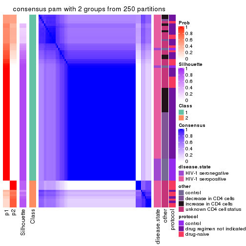</p>

</div>
<div id='tab-CV-pam-consensus-heatmap-2'>
<pre><code class="r">consensus_heatmap(res, k = 3)
</code></pre>

<p>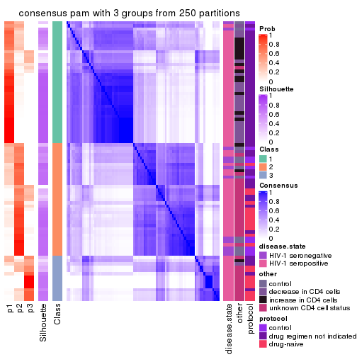</p>

</div>
<div id='tab-CV-pam-consensus-heatmap-3'>
<pre><code class="r">consensus_heatmap(res, k = 4)
</code></pre>

<p>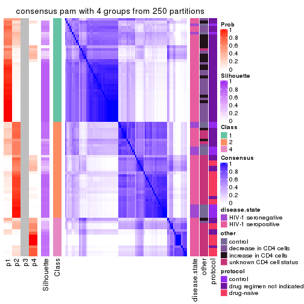</p>

</div>
<div id='tab-CV-pam-consensus-heatmap-4'>
<pre><code class="r">consensus_heatmap(res, k = 5)
</code></pre>

<p>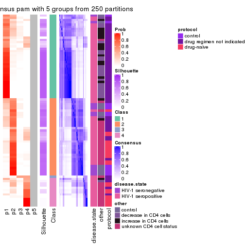</p>

</div>
<div id='tab-CV-pam-consensus-heatmap-5'>
<pre><code class="r">consensus_heatmap(res, k = 6)
</code></pre>

<p>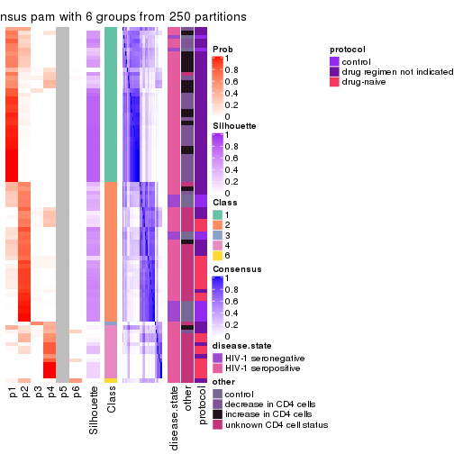</p>

</div>
</div>

Heatmaps for the membership of samples in all partitions to see how consistent they are:


<script>
$( function() {
	$( '#tabs-CV-pam-membership-heatmap' ).tabs();
} );
</script>
<div id='tabs-CV-pam-membership-heatmap'>
<ul>
<li><a href='#tab-CV-pam-membership-heatmap-1'>k = 2</a></li>
<li><a href='#tab-CV-pam-membership-heatmap-2'>k = 3</a></li>
<li><a href='#tab-CV-pam-membership-heatmap-3'>k = 4</a></li>
<li><a href='#tab-CV-pam-membership-heatmap-4'>k = 5</a></li>
<li><a href='#tab-CV-pam-membership-heatmap-5'>k = 6</a></li>
</ul>
<div id='tab-CV-pam-membership-heatmap-1'>
<pre><code class="r">membership_heatmap(res, k = 2)
</code></pre>

<p>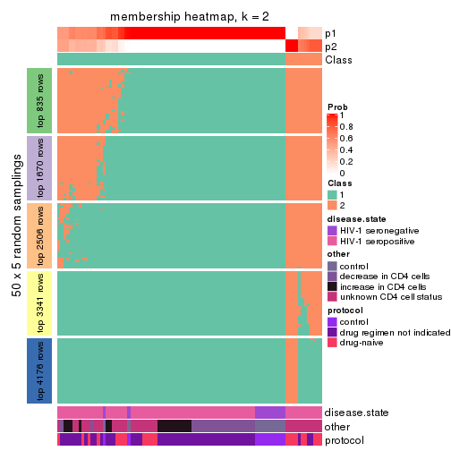</p>

</div>
<div id='tab-CV-pam-membership-heatmap-2'>
<pre><code class="r">membership_heatmap(res, k = 3)
</code></pre>

<p>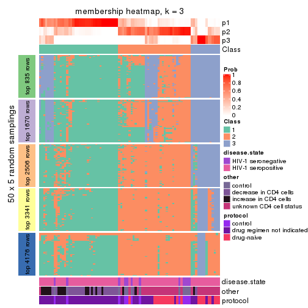</p>

</div>
<div id='tab-CV-pam-membership-heatmap-3'>
<pre><code class="r">membership_heatmap(res, k = 4)
</code></pre>

<p>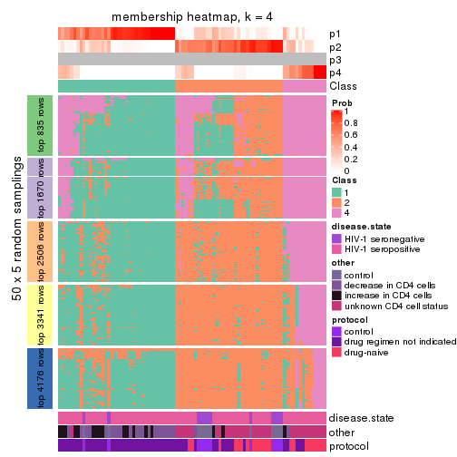</p>

</div>
<div id='tab-CV-pam-membership-heatmap-4'>
<pre><code class="r">membership_heatmap(res, k = 5)
</code></pre>

<p>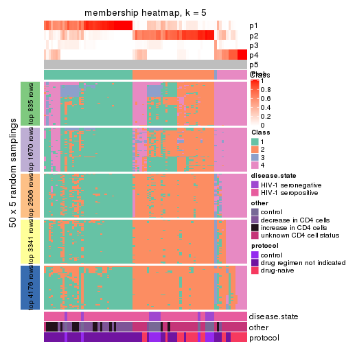</p>

</div>
<div id='tab-CV-pam-membership-heatmap-5'>
<pre><code class="r">membership_heatmap(res, k = 6)
</code></pre>

<p>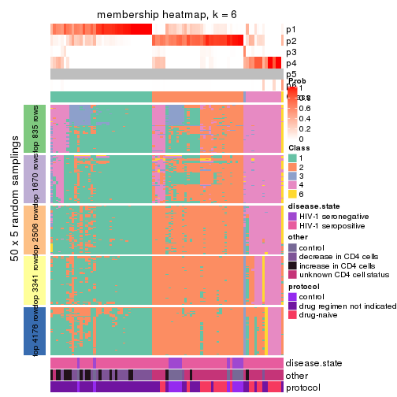</p>

</div>
</div>

As soon as we have had the classes for columns, we can look for signatures
which are significantly different between classes which can be candidate marks
for certain classes. Following are the heatmaps for signatures.


Signature heatmaps where rows are scaled:


<script>
$( function() {
	$( '#tabs-CV-pam-get-signatures' ).tabs();
} );
</script>
<div id='tabs-CV-pam-get-signatures'>
<ul>
<li><a href='#tab-CV-pam-get-signatures-1'>k = 2</a></li>
<li><a href='#tab-CV-pam-get-signatures-2'>k = 3</a></li>
<li><a href='#tab-CV-pam-get-signatures-3'>k = 4</a></li>
<li><a href='#tab-CV-pam-get-signatures-4'>k = 5</a></li>
<li><a href='#tab-CV-pam-get-signatures-5'>k = 6</a></li>
</ul>
<div id='tab-CV-pam-get-signatures-1'>
<pre><code class="r">get_signatures(res, k = 2)
</code></pre>

<p>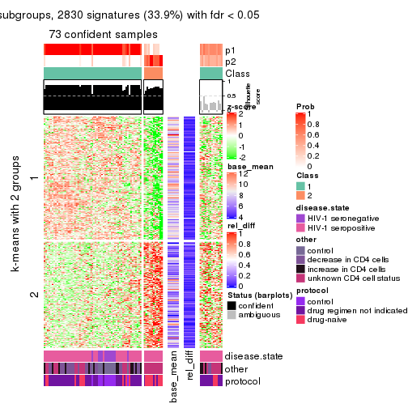</p>

</div>
<div id='tab-CV-pam-get-signatures-2'>
<pre><code class="r">get_signatures(res, k = 3)
</code></pre>

<p>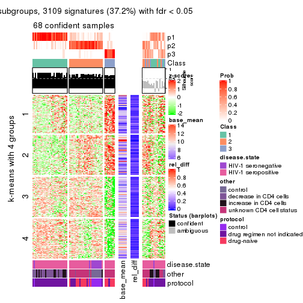</p>

</div>
<div id='tab-CV-pam-get-signatures-3'>
<pre><code class="r">get_signatures(res, k = 4)
</code></pre>

<p>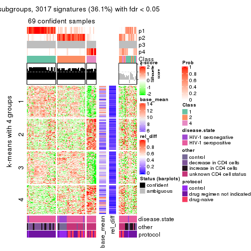</p>

</div>
<div id='tab-CV-pam-get-signatures-4'>
<pre><code class="r">get_signatures(res, k = 5)
</code></pre>

<p>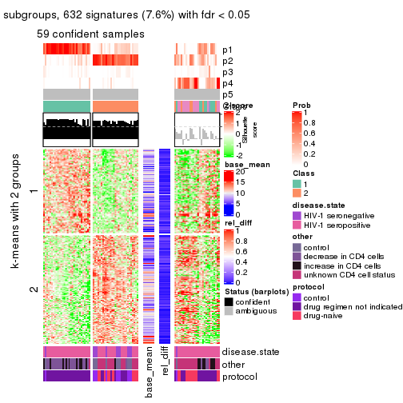</p>

</div>
<div id='tab-CV-pam-get-signatures-5'>
<pre><code class="r">get_signatures(res, k = 6)
</code></pre>

<p>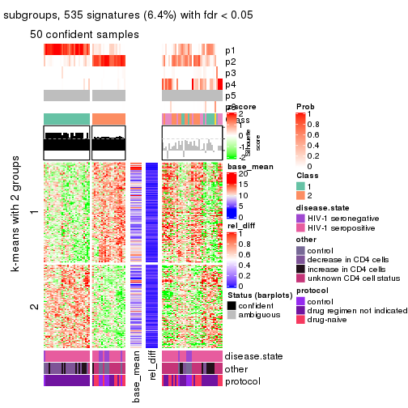</p>

</div>
</div>


Signature heatmaps where rows are not scaled:


<script>
$( function() {
	$( '#tabs-CV-pam-get-signatures-no-scale' ).tabs();
} );
</script>
<div id='tabs-CV-pam-get-signatures-no-scale'>
<ul>
<li><a href='#tab-CV-pam-get-signatures-no-scale-1'>k = 2</a></li>
<li><a href='#tab-CV-pam-get-signatures-no-scale-2'>k = 3</a></li>
<li><a href='#tab-CV-pam-get-signatures-no-scale-3'>k = 4</a></li>
<li><a href='#tab-CV-pam-get-signatures-no-scale-4'>k = 5</a></li>
<li><a href='#tab-CV-pam-get-signatures-no-scale-5'>k = 6</a></li>
</ul>
<div id='tab-CV-pam-get-signatures-no-scale-1'>
<pre><code class="r">get_signatures(res, k = 2, scale_rows = FALSE)
</code></pre>

<p>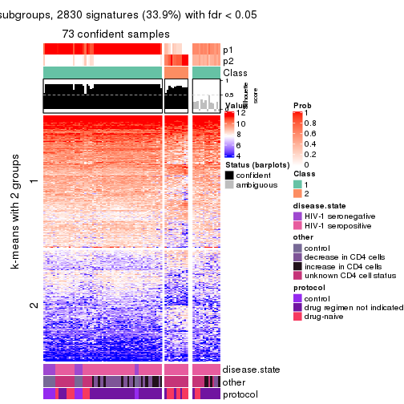</p>

</div>
<div id='tab-CV-pam-get-signatures-no-scale-2'>
<pre><code class="r">get_signatures(res, k = 3, scale_rows = FALSE)
</code></pre>

<p>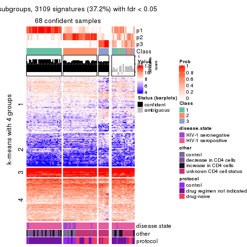</p>

</div>
<div id='tab-CV-pam-get-signatures-no-scale-3'>
<pre><code class="r">get_signatures(res, k = 4, scale_rows = FALSE)
</code></pre>

<p>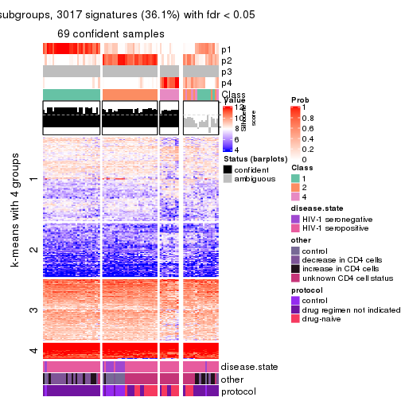</p>

</div>
<div id='tab-CV-pam-get-signatures-no-scale-4'>
<pre><code class="r">get_signatures(res, k = 5, scale_rows = FALSE)
</code></pre>

<p>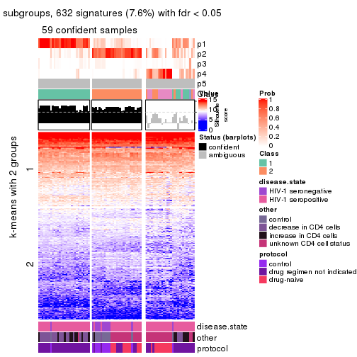</p>

</div>
<div id='tab-CV-pam-get-signatures-no-scale-5'>
<pre><code class="r">get_signatures(res, k = 6, scale_rows = FALSE)
</code></pre>

<p>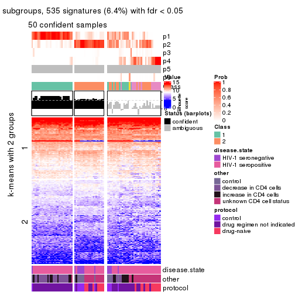</p>

</div>
</div>


Compare the overlap of signatures from different k:

```r
compare_signatures(res)
```

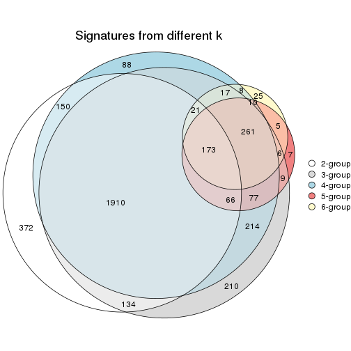

`get_signature()` returns a data frame invisibly. TO get the list of signatures, the function
call should be assigned to a variable explicitly. In following code, if `plot` argument is set
to `FALSE`, no heatmap is plotted while only the differential analysis is performed.

```r
# code only for demonstration
tb = get_signature(res, k = ..., plot = FALSE)
```

An example of the output of `tb` is:

```
#>   which_row         fdr    mean_1    mean_2 scaled_mean_1 scaled_mean_2 km
#> 1        38 0.042760348  8.373488  9.131774    -0.5533452     0.5164555  1
#> 2        40 0.018707592  7.106213  8.469186    -0.6173731     0.5762149  1
#> 3        55 0.019134737 10.221463 11.207825    -0.6159697     0.5749050  1
#> 4        59 0.006059896  5.921854  7.869574    -0.6899429     0.6439467  1
#> 5        60 0.018055526  8.928898 10.211722    -0.6204761     0.5791110  1
#> 6        98 0.009384629 15.714769 14.887706     0.6635654    -0.6193277  2
...
```

The columns in `tb` are:

1. `which_row`: row indices corresponding to the input matrix.
2. `fdr`: FDR for the differential test. 
3. `mean_x`: The mean value in group x.
4. `scaled_mean_x`: The mean value in group x after rows are scaled.
5. `km`: Row groups if k-means clustering is applied to rows.


UMAP plot which shows how samples are separated.


<script>
$( function() {
	$( '#tabs-CV-pam-dimension-reduction' ).tabs();
} );
</script>
<div id='tabs-CV-pam-dimension-reduction'>
<ul>
<li><a href='#tab-CV-pam-dimension-reduction-1'>k = 2</a></li>
<li><a href='#tab-CV-pam-dimension-reduction-2'>k = 3</a></li>
<li><a href='#tab-CV-pam-dimension-reduction-3'>k = 4</a></li>
<li><a href='#tab-CV-pam-dimension-reduction-4'>k = 5</a></li>
<li><a href='#tab-CV-pam-dimension-reduction-5'>k = 6</a></li>
</ul>
<div id='tab-CV-pam-dimension-reduction-1'>
<pre><code class="r">dimension_reduction(res, k = 2, method = &quot;UMAP&quot;)
</code></pre>

<p>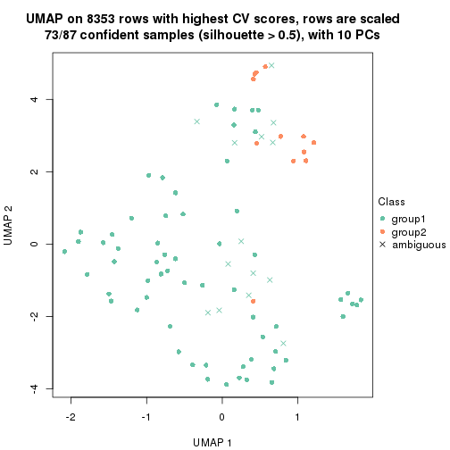</p>

</div>
<div id='tab-CV-pam-dimension-reduction-2'>
<pre><code class="r">dimension_reduction(res, k = 3, method = &quot;UMAP&quot;)
</code></pre>

<p>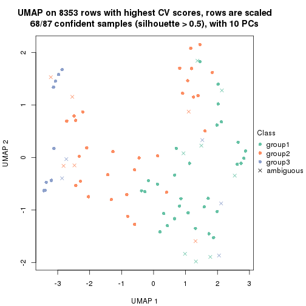</p>

</div>
<div id='tab-CV-pam-dimension-reduction-3'>
<pre><code class="r">dimension_reduction(res, k = 4, method = &quot;UMAP&quot;)
</code></pre>

<p>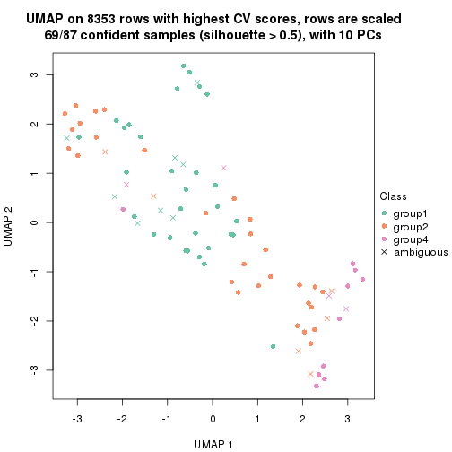</p>

</div>
<div id='tab-CV-pam-dimension-reduction-4'>
<pre><code class="r">dimension_reduction(res, k = 5, method = &quot;UMAP&quot;)
</code></pre>

<p>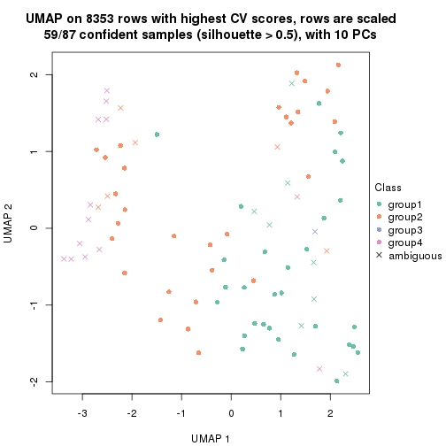</p>

</div>
<div id='tab-CV-pam-dimension-reduction-5'>
<pre><code class="r">dimension_reduction(res, k = 6, method = &quot;UMAP&quot;)
</code></pre>

<p>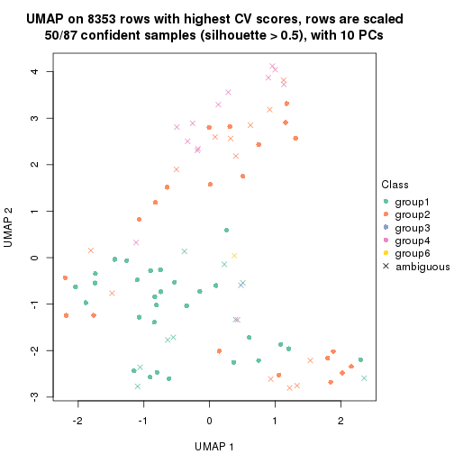</p>

</div>
</div>


Following heatmap shows how subgroups are split when increasing `k`:

```r
collect_classes(res)
```

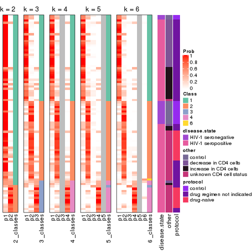


Test correlation between subgroups and known annotations. If the known
annotation is numeric, one-way ANOVA test is applied, and if the known
annotation is discrete, chi-squared contingency table test is applied.

```r
test_to_known_factors(res)
```

```
#>         n disease.state(p) other(p) protocol(p) k
#> CV:pam 73          0.20957 2.00e-05    1.10e-04 2
#> CV:pam 68          0.00188 4.37e-12    8.74e-09 3
#> CV:pam 69          0.00158 1.32e-11    2.29e-08 4
#> CV:pam 59          0.00620 1.38e-09    2.67e-07 5
#> CV:pam 50          0.01412 1.78e-08    5.06e-07 6
```


If matrix rows can be associated to genes, consider to use `GO_Enrichment(res,
...)` to perform function enrichment for the signature genes.


 

---------------------------------------------------


### CV:mclust


The object with results only for a single top-value method and a single partition method 
can be extracted as:

```r
res = res_list["CV", "mclust"]
# you can also extract it by
# res = res_list["CV:mclust"]
```

A summary of `res` and all the functions that can be applied to it:

```r
res
```

```
#> A 'ConsensusPartition' object with k = 2, 3, 4, 5, 6.
#>   On a matrix with 8353 rows and 87 columns.
#>   Top rows (835, 1670, 2506, 3341, 4176) are extracted by 'CV' method.
#>   Subgroups are detected by 'mclust' method.
#>   Performed in total 1250 partitions by row resampling.
#>   Best k for subgroups seems to be 2.
#> 
#> Following methods can be applied to this 'ConsensusPartition' object:
#>  [1] "cola_report"             "collect_classes"         "collect_plots"          
#>  [4] "collect_stats"           "colnames"                "compare_signatures"     
#>  [7] "consensus_heatmap"       "dimension_reduction"     "functional_enrichment"  
#> [10] "get_anno_col"            "get_anno"                "get_classes"            
#> [13] "get_consensus"           "get_matrix"              "get_membership"         
#> [16] "get_param"               "get_signatures"          "get_stats"              
#> [19] "is_best_k"               "is_stable_k"             "membership_heatmap"     
#> [22] "ncol"                    "nrow"                    "plot_ecdf"              
#> [25] "rownames"                "select_partition_number" "show"                   
#> [28] "suggest_best_k"          "test_to_known_factors"
```

`collect_plots()` function collects all the plots made from `res` for all `k` (number of partitions)
into one single page to provide an easy and fast comparison between different `k`.

```r
collect_plots(res)
```

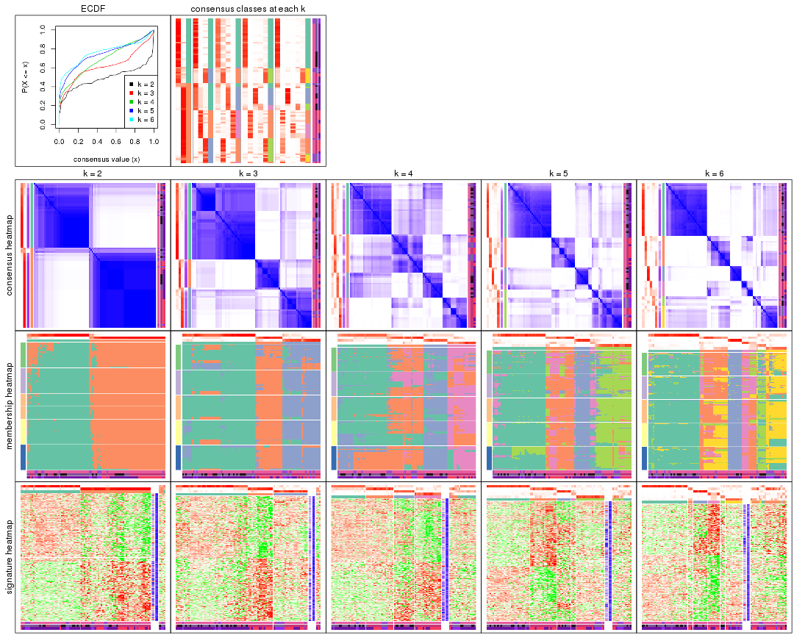

The plots are:

- The first row: a plot of the ECDF (Empirical cumulative distribution
  function) curves of the consensus matrix for each `k` and the heatmap of
  predicted classes for each `k`.
- The second row: heatmaps of the consensus matrix for each `k`.
- The third row: heatmaps of the membership matrix for each `k`.
- The fouth row: heatmaps of the signatures for each `k`.

All the plots in panels can be made by individual functions and they are
plotted later in this section.

`select_partition_number()` produces several plots showing different
statistics for choosing "optimized" `k`. There are following statistics:

- ECDF curves of the consensus matrix for each `k`;
- 1-PAC. [The PAC
  score](https://en.wikipedia.org/wiki/Consensus_clustering#Over-interpretation_potential_of_consensus_clustering)
  measures the proportion of the ambiguous subgrouping.
- Mean silhouette score.
- Concordance. The mean probability of fiting the consensus class ids in all
  partitions.
- Area increased. Denote $A_k$ as the area under the ECDF curve for current
  `k`, the area increased is defined as $A_k - A_{k-1}$.
- Rand index. The percent of pairs of samples that are both in a same cluster
  or both are not in a same cluster in the partition of k and k-1.
- Jaccard index. The ratio of pairs of samples are both in a same cluster in
  the partition of k and k-1 and the pairs of samples are both in a same
  cluster in the partition k or k-1.

The detailed explanations of these statistics can be found in [the cola
vignette](http://bioconductor.org/packages/devel/bioc/vignettes/cola/inst/doc/cola.html#toc_13).

Generally speaking, lower PAC score, higher mean silhouette score or higher
concordance corresponds to better partition. Rand index and Jaccard index
measure how similar the current partition is compared to partition with `k-1`.
If they are too similar, we won't accept `k` is better than `k-1`.

```r
select_partition_number(res)
```

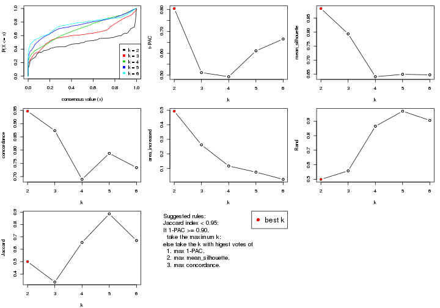

The numeric values for all these statistics can be obtained by `get_stats()`.

```r
get_stats(res)
```

```
#>   k 1-PAC mean_silhouette concordance area_increased  Rand Jaccard
#> 2 2 0.805           0.884       0.947         0.4928 0.500   0.500
#> 3 3 0.511           0.794       0.874         0.2619 0.558   0.335
#> 4 4 0.493           0.641       0.689         0.1173 0.865   0.655
#> 5 5 0.611           0.649       0.788         0.0750 0.968   0.886
#> 6 6 0.665           0.647       0.734         0.0255 0.905   0.671
```

`suggest_best_k()` suggests the best $k$ based on these statistics. The rules are as follows:

- All $k$ with Jaccard index larger than 0.95 are removed because the increase of
  the partition number does not provides enough extra information. If all $k$ are removed,
  the best $k$ is assigned by `NA`.
- For $k$ with 1-PAC larger than 0.9, the maximal $k$ is taken as the "best k". Other $k$ is called "optional k".
- If it does not fit the second rule. The $k$ with the highest vote of highest
  1-PAC, mean silhouette and concordance is taken as the "best k".

```r
suggest_best_k(res)
```

```
#> [1] 2
```


Following shows the table of the partitions (You need to click the **show/hide
code output** link to see it). The membership matrix (columns with name `p*`)
is inferred by
[`clue::cl_consensus()`](https://www.rdocumentation.org/link/cl_consensus?package=clue)
function with the `SE` method. Basically the value in the membership matrix
represents the probability to belong to a certain group. The finall class
label for an item is determined with the group with highest probability it
belongs to.

In `get_classes()` function, the entropy is calculated from the membership
matrix and the silhouette score is calculated from the consensus matrix.


<script>
$( function() {
	$( '#tabs-CV-mclust-get-classes' ).tabs();
} );
</script>
<div id='tabs-CV-mclust-get-classes'>
<ul>
<li><a href='#tab-CV-mclust-get-classes-1'>k = 2</a></li>
<li><a href='#tab-CV-mclust-get-classes-2'>k = 3</a></li>
<li><a href='#tab-CV-mclust-get-classes-3'>k = 4</a></li>
<li><a href='#tab-CV-mclust-get-classes-4'>k = 5</a></li>
<li><a href='#tab-CV-mclust-get-classes-5'>k = 6</a></li>
</ul>

<div id='tab-CV-mclust-get-classes-1'>
<p><a id='tab-CV-mclust-get-classes-1-a' style='color:#0366d6' href='#'>show/hide code output</a></p>
<pre><code class="r">cbind(get_classes(res, k = 2), get_membership(res, k = 2))
</code></pre>

<pre><code>#&gt;          class entropy silhouette    p1    p2
#&gt; GSM39104     1  0.3733     0.9042 0.928 0.072
#&gt; GSM39105     1  0.1414     0.9243 0.980 0.020
#&gt; GSM39106     1  0.7950     0.7346 0.760 0.240
#&gt; GSM39107     2  0.3114     0.9147 0.056 0.944
#&gt; GSM39108     1  0.7453     0.7728 0.788 0.212
#&gt; GSM39109     2  0.0672     0.9540 0.008 0.992
#&gt; GSM39110     2  0.5519     0.8338 0.128 0.872
#&gt; GSM39111     2  0.9993    -0.0516 0.484 0.516
#&gt; GSM39112     2  0.9393     0.3958 0.356 0.644
#&gt; GSM39113     2  0.3274     0.9107 0.060 0.940
#&gt; GSM39114     2  0.0000     0.9548 0.000 1.000
#&gt; GSM39115     1  0.0376     0.9275 0.996 0.004
#&gt; GSM39148     1  0.0000     0.9278 1.000 0.000
#&gt; GSM39149     2  0.0938     0.9531 0.012 0.988
#&gt; GSM39150     1  0.0672     0.9270 0.992 0.008
#&gt; GSM39151     2  0.0938     0.9531 0.012 0.988
#&gt; GSM39152     2  0.0938     0.9531 0.012 0.988
#&gt; GSM39153     1  0.0000     0.9278 1.000 0.000
#&gt; GSM39154     1  0.0000     0.9278 1.000 0.000
#&gt; GSM39155     1  0.0000     0.9278 1.000 0.000
#&gt; GSM39156     1  0.3879     0.9015 0.924 0.076
#&gt; GSM39157     1  0.0000     0.9278 1.000 0.000
#&gt; GSM39158     1  0.0000     0.9278 1.000 0.000
#&gt; GSM39159     1  0.9635     0.3948 0.612 0.388
#&gt; GSM39160     1  0.2423     0.9185 0.960 0.040
#&gt; GSM39161     2  0.5842     0.8262 0.140 0.860
#&gt; GSM39162     1  0.0000     0.9278 1.000 0.000
#&gt; GSM39163     1  0.0000     0.9278 1.000 0.000
#&gt; GSM39164     1  0.0000     0.9278 1.000 0.000
#&gt; GSM39165     1  0.9460     0.5047 0.636 0.364
#&gt; GSM39166     1  0.0000     0.9278 1.000 0.000
#&gt; GSM39167     1  0.0000     0.9278 1.000 0.000
#&gt; GSM39168     1  0.0000     0.9278 1.000 0.000
#&gt; GSM39169     1  0.0000     0.9278 1.000 0.000
#&gt; GSM39170     1  0.0000     0.9278 1.000 0.000
#&gt; GSM39171     1  0.3584     0.9063 0.932 0.068
#&gt; GSM39172     2  0.0938     0.9531 0.012 0.988
#&gt; GSM39173     2  0.0938     0.9531 0.012 0.988
#&gt; GSM39174     1  0.0000     0.9278 1.000 0.000
#&gt; GSM39175     1  0.0000     0.9278 1.000 0.000
#&gt; GSM39176     1  0.0000     0.9278 1.000 0.000
#&gt; GSM39177     2  0.0938     0.9531 0.012 0.988
#&gt; GSM39178     2  0.9988     0.0612 0.480 0.520
#&gt; GSM39179     2  0.0938     0.9531 0.012 0.988
#&gt; GSM39180     2  0.0938     0.9531 0.012 0.988
#&gt; GSM39181     1  0.5737     0.8490 0.864 0.136
#&gt; GSM39182     2  0.0938     0.9531 0.012 0.988
#&gt; GSM39183     1  0.1414     0.9215 0.980 0.020
#&gt; GSM39184     1  0.0376     0.9275 0.996 0.004
#&gt; GSM39185     2  0.4022     0.8944 0.080 0.920
#&gt; GSM39186     1  0.2236     0.9195 0.964 0.036
#&gt; GSM39187     1  0.0000     0.9278 1.000 0.000
#&gt; GSM39116     2  0.0000     0.9548 0.000 1.000
#&gt; GSM39117     2  0.0000     0.9548 0.000 1.000
#&gt; GSM39118     2  0.0000     0.9548 0.000 1.000
#&gt; GSM39119     2  0.0000     0.9548 0.000 1.000
#&gt; GSM39120     1  0.9286     0.5515 0.656 0.344
#&gt; GSM39121     2  0.0672     0.9540 0.008 0.992
#&gt; GSM39122     2  0.0672     0.9540 0.008 0.992
#&gt; GSM39123     2  0.0000     0.9548 0.000 1.000
#&gt; GSM39124     2  0.0000     0.9548 0.000 1.000
#&gt; GSM39125     1  0.7056     0.7981 0.808 0.192
#&gt; GSM39126     2  0.0672     0.9540 0.008 0.992
#&gt; GSM39127     2  0.0000     0.9548 0.000 1.000
#&gt; GSM39128     2  0.0000     0.9548 0.000 1.000
#&gt; GSM39129     2  0.0000     0.9548 0.000 1.000
#&gt; GSM39130     2  0.0000     0.9548 0.000 1.000
#&gt; GSM39131     2  0.0000     0.9548 0.000 1.000
#&gt; GSM39132     2  0.0000     0.9548 0.000 1.000
#&gt; GSM39133     2  0.0000     0.9548 0.000 1.000
#&gt; GSM39134     2  0.0000     0.9548 0.000 1.000
#&gt; GSM39135     2  0.0000     0.9548 0.000 1.000
#&gt; GSM39136     2  0.0000     0.9548 0.000 1.000
#&gt; GSM39137     2  0.0672     0.9540 0.008 0.992
#&gt; GSM39138     2  0.0000     0.9548 0.000 1.000
#&gt; GSM39139     2  0.0000     0.9548 0.000 1.000
#&gt; GSM39140     1  0.6712     0.8157 0.824 0.176
#&gt; GSM39141     1  0.4022     0.8988 0.920 0.080
#&gt; GSM39142     1  0.3584     0.9057 0.932 0.068
#&gt; GSM39143     1  0.4298     0.8933 0.912 0.088
#&gt; GSM39144     2  0.0000     0.9548 0.000 1.000
#&gt; GSM39145     2  0.0000     0.9548 0.000 1.000
#&gt; GSM39146     2  0.0000     0.9548 0.000 1.000
#&gt; GSM39147     2  0.0000     0.9548 0.000 1.000
#&gt; GSM39188     2  0.0938     0.9531 0.012 0.988
#&gt; GSM39189     2  0.0938     0.9531 0.012 0.988
#&gt; GSM39190     2  0.0938     0.9531 0.012 0.988
</code></pre>

<script>
$('#tab-CV-mclust-get-classes-1-a').parent().next().next().hide();
$('#tab-CV-mclust-get-classes-1-a').click(function(){
  $('#tab-CV-mclust-get-classes-1-a').parent().next().next().toggle();
  return(false);
});
</script>
</div>

<div id='tab-CV-mclust-get-classes-2'>
<p><a id='tab-CV-mclust-get-classes-2-a' style='color:#0366d6' href='#'>show/hide code output</a></p>
<pre><code class="r">cbind(get_classes(res, k = 3), get_membership(res, k = 3))
</code></pre>

<pre><code>#&gt;          class entropy silhouette    p1    p2    p3
#&gt; GSM39104     1  0.1877      0.869 0.956 0.012 0.032
#&gt; GSM39105     1  0.3826      0.811 0.868 0.008 0.124
#&gt; GSM39106     3  0.5315      0.732 0.216 0.012 0.772
#&gt; GSM39107     3  0.3276      0.792 0.024 0.068 0.908
#&gt; GSM39108     3  0.6284      0.612 0.304 0.016 0.680
#&gt; GSM39109     3  0.5842      0.678 0.036 0.196 0.768
#&gt; GSM39110     3  0.8144      0.307 0.380 0.076 0.544
#&gt; GSM39111     1  0.4087      0.851 0.880 0.068 0.052
#&gt; GSM39112     3  0.3618      0.803 0.104 0.012 0.884
#&gt; GSM39113     3  0.1399      0.793 0.004 0.028 0.968
#&gt; GSM39114     3  0.2261      0.780 0.000 0.068 0.932
#&gt; GSM39115     1  0.0000      0.872 1.000 0.000 0.000
#&gt; GSM39148     1  0.4796      0.655 0.780 0.000 0.220
#&gt; GSM39149     1  0.6208      0.786 0.752 0.200 0.048
#&gt; GSM39150     1  0.0424      0.873 0.992 0.008 0.000
#&gt; GSM39151     1  0.6208      0.786 0.752 0.200 0.048
#&gt; GSM39152     1  0.5791      0.807 0.784 0.168 0.048
#&gt; GSM39153     1  0.1753      0.855 0.952 0.000 0.048
#&gt; GSM39154     1  0.0000      0.872 1.000 0.000 0.000
#&gt; GSM39155     1  0.3816      0.763 0.852 0.000 0.148
#&gt; GSM39156     3  0.4702      0.747 0.212 0.000 0.788
#&gt; GSM39157     1  0.1411      0.862 0.964 0.000 0.036
#&gt; GSM39158     1  0.0000      0.872 1.000 0.000 0.000
#&gt; GSM39159     1  0.1289      0.871 0.968 0.000 0.032
#&gt; GSM39160     1  0.1170      0.872 0.976 0.008 0.016
#&gt; GSM39161     1  0.4677      0.829 0.840 0.132 0.028
#&gt; GSM39162     1  0.5327      0.552 0.728 0.000 0.272
#&gt; GSM39163     1  0.0000      0.872 1.000 0.000 0.000
#&gt; GSM39164     1  0.1529      0.861 0.960 0.000 0.040
#&gt; GSM39165     1  0.2806      0.864 0.928 0.032 0.040
#&gt; GSM39166     1  0.0000      0.872 1.000 0.000 0.000
#&gt; GSM39167     1  0.0424      0.871 0.992 0.000 0.008
#&gt; GSM39168     1  0.4504      0.695 0.804 0.000 0.196
#&gt; GSM39169     1  0.1031      0.867 0.976 0.000 0.024
#&gt; GSM39170     1  0.0000      0.872 1.000 0.000 0.000
#&gt; GSM39171     1  0.0848      0.873 0.984 0.008 0.008
#&gt; GSM39172     1  0.6302      0.779 0.744 0.208 0.048
#&gt; GSM39173     1  0.6208      0.786 0.752 0.200 0.048
#&gt; GSM39174     1  0.3879      0.757 0.848 0.000 0.152
#&gt; GSM39175     1  0.0000      0.872 1.000 0.000 0.000
#&gt; GSM39176     1  0.0592      0.870 0.988 0.000 0.012
#&gt; GSM39177     1  0.6208      0.786 0.752 0.200 0.048
#&gt; GSM39178     1  0.1411      0.872 0.964 0.036 0.000
#&gt; GSM39179     1  0.6208      0.786 0.752 0.200 0.048
#&gt; GSM39180     1  0.6255      0.783 0.748 0.204 0.048
#&gt; GSM39181     1  0.0237      0.873 0.996 0.000 0.004
#&gt; GSM39182     1  0.7610      0.706 0.676 0.216 0.108
#&gt; GSM39183     1  0.0000      0.872 1.000 0.000 0.000
#&gt; GSM39184     1  0.0000      0.872 1.000 0.000 0.000
#&gt; GSM39185     1  0.5094      0.824 0.824 0.136 0.040
#&gt; GSM39186     1  0.3116      0.810 0.892 0.000 0.108
#&gt; GSM39187     1  0.3267      0.801 0.884 0.000 0.116
#&gt; GSM39116     2  0.4178      0.849 0.000 0.828 0.172
#&gt; GSM39117     2  0.0747      0.887 0.000 0.984 0.016
#&gt; GSM39118     2  0.2066      0.910 0.000 0.940 0.060
#&gt; GSM39119     2  0.1860      0.906 0.000 0.948 0.052
#&gt; GSM39120     3  0.3551      0.799 0.132 0.000 0.868
#&gt; GSM39121     3  0.1753      0.788 0.000 0.048 0.952
#&gt; GSM39122     3  0.1753      0.788 0.000 0.048 0.952
#&gt; GSM39123     2  0.0747      0.887 0.000 0.984 0.016
#&gt; GSM39124     3  0.2066      0.785 0.000 0.060 0.940
#&gt; GSM39125     3  0.3686      0.797 0.140 0.000 0.860
#&gt; GSM39126     3  0.1753      0.788 0.000 0.048 0.952
#&gt; GSM39127     3  0.4452      0.660 0.000 0.192 0.808
#&gt; GSM39128     3  0.2711      0.769 0.000 0.088 0.912
#&gt; GSM39129     2  0.2066      0.910 0.000 0.940 0.060
#&gt; GSM39130     2  0.0747      0.887 0.000 0.984 0.016
#&gt; GSM39131     3  0.2066      0.785 0.000 0.060 0.940
#&gt; GSM39132     2  0.6215      0.423 0.000 0.572 0.428
#&gt; GSM39133     2  0.1529      0.898 0.000 0.960 0.040
#&gt; GSM39134     2  0.2066      0.909 0.000 0.940 0.060
#&gt; GSM39135     2  0.4235      0.846 0.000 0.824 0.176
#&gt; GSM39136     2  0.4235      0.846 0.000 0.824 0.176
#&gt; GSM39137     3  0.1753      0.788 0.000 0.048 0.952
#&gt; GSM39138     2  0.2066      0.910 0.000 0.940 0.060
#&gt; GSM39139     2  0.2711      0.904 0.000 0.912 0.088
#&gt; GSM39140     3  0.3619      0.798 0.136 0.000 0.864
#&gt; GSM39141     3  0.3941      0.791 0.156 0.000 0.844
#&gt; GSM39142     3  0.4062      0.787 0.164 0.000 0.836
#&gt; GSM39143     3  0.3941      0.791 0.156 0.000 0.844
#&gt; GSM39144     2  0.2066      0.910 0.000 0.940 0.060
#&gt; GSM39145     2  0.2711      0.904 0.000 0.912 0.088
#&gt; GSM39146     2  0.5591      0.670 0.000 0.696 0.304
#&gt; GSM39147     3  0.6308     -0.267 0.000 0.492 0.508
#&gt; GSM39188     1  0.6208      0.786 0.752 0.200 0.048
#&gt; GSM39189     1  0.6208      0.786 0.752 0.200 0.048
#&gt; GSM39190     1  0.6208      0.786 0.752 0.200 0.048
</code></pre>

<script>
$('#tab-CV-mclust-get-classes-2-a').parent().next().next().hide();
$('#tab-CV-mclust-get-classes-2-a').click(function(){
  $('#tab-CV-mclust-get-classes-2-a').parent().next().next().toggle();
  return(false);
});
</script>
</div>

<div id='tab-CV-mclust-get-classes-3'>
<p><a id='tab-CV-mclust-get-classes-3-a' style='color:#0366d6' href='#'>show/hide code output</a></p>
<pre><code class="r">cbind(get_classes(res, k = 4), get_membership(res, k = 4))
</code></pre>

<pre><code>#&gt;          class entropy silhouette    p1    p2    p3    p4
#&gt; GSM39104     1   0.580    0.73005 0.696 0.208 0.096 0.000
#&gt; GSM39105     1   0.531    0.72613 0.700 0.256 0.044 0.000
#&gt; GSM39106     2   0.658    0.57044 0.220 0.640 0.136 0.004
#&gt; GSM39107     2   0.357    0.76016 0.084 0.872 0.024 0.020
#&gt; GSM39108     2   0.759    0.22571 0.320 0.500 0.172 0.008
#&gt; GSM39109     2   0.780    0.41805 0.092 0.516 0.340 0.052
#&gt; GSM39110     2   0.805    0.00251 0.316 0.420 0.256 0.008
#&gt; GSM39111     1   0.750    0.20717 0.472 0.144 0.376 0.008
#&gt; GSM39112     2   0.240    0.76154 0.092 0.904 0.004 0.000
#&gt; GSM39113     2   0.241    0.75680 0.084 0.908 0.000 0.008
#&gt; GSM39114     2   0.401    0.45146 0.000 0.784 0.008 0.208
#&gt; GSM39115     1   0.508    0.74820 0.760 0.160 0.080 0.000
#&gt; GSM39148     1   0.416    0.73239 0.736 0.264 0.000 0.000
#&gt; GSM39149     3   0.387    0.83828 0.208 0.000 0.788 0.004
#&gt; GSM39150     1   0.453    0.42193 0.704 0.004 0.292 0.000
#&gt; GSM39151     3   0.376    0.83879 0.216 0.000 0.784 0.000
#&gt; GSM39152     3   0.481    0.78949 0.268 0.004 0.716 0.012
#&gt; GSM39153     1   0.416    0.77240 0.768 0.224 0.008 0.000
#&gt; GSM39154     1   0.491    0.75981 0.764 0.176 0.060 0.000
#&gt; GSM39155     1   0.419    0.75319 0.752 0.244 0.004 0.000
#&gt; GSM39156     2   0.555    0.67847 0.188 0.728 0.080 0.004
#&gt; GSM39157     1   0.391    0.76540 0.768 0.232 0.000 0.000
#&gt; GSM39158     1   0.514    0.54545 0.716 0.040 0.244 0.000
#&gt; GSM39159     3   0.516    0.29436 0.472 0.000 0.524 0.004
#&gt; GSM39160     1   0.460    0.34304 0.664 0.000 0.336 0.000
#&gt; GSM39161     3   0.523    0.48895 0.384 0.000 0.604 0.012
#&gt; GSM39162     1   0.472    0.63948 0.672 0.324 0.004 0.000
#&gt; GSM39163     1   0.433    0.77221 0.768 0.216 0.016 0.000
#&gt; GSM39164     1   0.430    0.76359 0.752 0.240 0.008 0.000
#&gt; GSM39165     1   0.517   -0.28773 0.500 0.000 0.496 0.004
#&gt; GSM39166     1   0.461    0.40413 0.692 0.004 0.304 0.000
#&gt; GSM39167     1   0.432    0.77123 0.776 0.204 0.020 0.000
#&gt; GSM39168     1   0.425    0.75252 0.744 0.252 0.004 0.000
#&gt; GSM39169     1   0.412    0.77197 0.772 0.220 0.008 0.000
#&gt; GSM39170     1   0.527    0.73082 0.752 0.140 0.108 0.000
#&gt; GSM39171     1   0.465    0.39500 0.684 0.004 0.312 0.000
#&gt; GSM39172     3   0.431    0.74632 0.108 0.004 0.824 0.064
#&gt; GSM39173     3   0.361    0.83814 0.200 0.000 0.800 0.000
#&gt; GSM39174     1   0.426    0.76733 0.756 0.236 0.008 0.000
#&gt; GSM39175     1   0.509    0.73273 0.764 0.140 0.096 0.000
#&gt; GSM39176     1   0.402    0.77068 0.772 0.224 0.004 0.000
#&gt; GSM39177     3   0.391    0.82916 0.232 0.000 0.768 0.000
#&gt; GSM39178     1   0.488    0.09486 0.592 0.000 0.408 0.000
#&gt; GSM39179     3   0.376    0.83879 0.216 0.000 0.784 0.000
#&gt; GSM39180     3   0.279    0.75613 0.088 0.004 0.896 0.012
#&gt; GSM39181     1   0.478    0.28354 0.624 0.000 0.376 0.000
#&gt; GSM39182     3   0.528    0.72685 0.132 0.020 0.776 0.072
#&gt; GSM39183     1   0.472    0.38289 0.672 0.004 0.324 0.000
#&gt; GSM39184     1   0.512    0.75015 0.756 0.164 0.080 0.000
#&gt; GSM39185     3   0.498    0.69965 0.260 0.004 0.716 0.020
#&gt; GSM39186     1   0.430    0.76259 0.752 0.240 0.008 0.000
#&gt; GSM39187     1   0.430    0.76076 0.752 0.240 0.008 0.000
#&gt; GSM39116     4   0.474    0.69524 0.000 0.240 0.024 0.736
#&gt; GSM39117     4   0.642    0.66949 0.216 0.056 0.044 0.684
#&gt; GSM39118     4   0.292    0.78102 0.000 0.044 0.060 0.896
#&gt; GSM39119     4   0.153    0.77205 0.012 0.016 0.012 0.960
#&gt; GSM39120     2   0.355    0.75295 0.136 0.844 0.020 0.000
#&gt; GSM39121     2   0.126    0.72369 0.008 0.964 0.000 0.028
#&gt; GSM39122     2   0.128    0.72752 0.012 0.964 0.000 0.024
#&gt; GSM39123     4   0.634    0.67052 0.216 0.056 0.040 0.688
#&gt; GSM39124     2   0.309    0.62084 0.000 0.864 0.008 0.128
#&gt; GSM39125     2   0.386    0.74835 0.144 0.828 0.028 0.000
#&gt; GSM39126     2   0.162    0.73727 0.028 0.952 0.000 0.020
#&gt; GSM39127     4   0.556    0.42170 0.000 0.432 0.020 0.548
#&gt; GSM39128     2   0.345    0.58411 0.000 0.836 0.008 0.156
#&gt; GSM39129     4   0.283    0.78060 0.000 0.040 0.060 0.900
#&gt; GSM39130     4   0.642    0.66949 0.216 0.056 0.044 0.684
#&gt; GSM39131     2   0.265    0.64427 0.000 0.888 0.004 0.108
#&gt; GSM39132     4   0.544    0.51581 0.000 0.384 0.020 0.596
#&gt; GSM39133     4   0.638    0.67830 0.212 0.076 0.028 0.684
#&gt; GSM39134     4   0.100    0.77923 0.000 0.024 0.004 0.972
#&gt; GSM39135     4   0.478    0.69219 0.000 0.244 0.024 0.732
#&gt; GSM39136     4   0.502    0.68746 0.000 0.264 0.028 0.708
#&gt; GSM39137     2   0.131    0.71814 0.004 0.960 0.000 0.036
#&gt; GSM39138     4   0.274    0.78082 0.000 0.036 0.060 0.904
#&gt; GSM39139     4   0.301    0.78081 0.000 0.056 0.052 0.892
#&gt; GSM39140     2   0.426    0.74619 0.140 0.812 0.048 0.000
#&gt; GSM39141     2   0.424    0.72809 0.168 0.800 0.032 0.000
#&gt; GSM39142     2   0.450    0.70159 0.192 0.776 0.032 0.000
#&gt; GSM39143     2   0.420    0.73300 0.164 0.804 0.032 0.000
#&gt; GSM39144     4   0.283    0.78060 0.000 0.040 0.060 0.900
#&gt; GSM39145     4   0.432    0.76509 0.000 0.116 0.068 0.816
#&gt; GSM39146     4   0.544    0.56275 0.000 0.384 0.020 0.596
#&gt; GSM39147     2   0.569   -0.26111 0.000 0.516 0.024 0.460
#&gt; GSM39188     3   0.385    0.83427 0.192 0.000 0.800 0.008
#&gt; GSM39189     3   0.412    0.83853 0.220 0.000 0.772 0.008
#&gt; GSM39190     3   0.383    0.83880 0.204 0.000 0.792 0.004
</code></pre>

<script>
$('#tab-CV-mclust-get-classes-3-a').parent().next().next().hide();
$('#tab-CV-mclust-get-classes-3-a').click(function(){
  $('#tab-CV-mclust-get-classes-3-a').parent().next().next().toggle();
  return(false);
});
</script>
</div>

<div id='tab-CV-mclust-get-classes-4'>
<p><a id='tab-CV-mclust-get-classes-4-a' style='color:#0366d6' href='#'>show/hide code output</a></p>
<pre><code class="r">cbind(get_classes(res, k = 5), get_membership(res, k = 5))
</code></pre>

<pre><code>#&gt;          class entropy silhouette    p1    p2    p3    p4    p5
#&gt; GSM39104     1  0.3569     0.7863 0.852 0.000 0.036 0.040 0.072
#&gt; GSM39105     1  0.3601     0.7863 0.832 0.000 0.020 0.024 0.124
#&gt; GSM39106     5  0.5052     0.6453 0.156 0.000 0.084 0.024 0.736
#&gt; GSM39107     5  0.2273     0.7372 0.048 0.008 0.016 0.008 0.920
#&gt; GSM39108     5  0.6760     0.4702 0.184 0.000 0.172 0.056 0.588
#&gt; GSM39109     5  0.8394    -0.2611 0.160 0.008 0.152 0.324 0.356
#&gt; GSM39110     5  0.7819     0.2038 0.172 0.000 0.264 0.112 0.452
#&gt; GSM39111     1  0.7097     0.0741 0.544 0.000 0.252 0.116 0.088
#&gt; GSM39112     5  0.2179     0.7356 0.072 0.000 0.008 0.008 0.912
#&gt; GSM39113     5  0.1560     0.7283 0.020 0.000 0.004 0.028 0.948
#&gt; GSM39114     5  0.4270     0.5818 0.000 0.124 0.008 0.080 0.788
#&gt; GSM39115     1  0.2248     0.8232 0.900 0.000 0.000 0.012 0.088
#&gt; GSM39148     1  0.2563     0.8047 0.872 0.000 0.000 0.008 0.120
#&gt; GSM39149     3  0.1557     0.8598 0.052 0.008 0.940 0.000 0.000
#&gt; GSM39150     1  0.1485     0.7682 0.948 0.000 0.020 0.032 0.000
#&gt; GSM39151     3  0.1341     0.8616 0.056 0.000 0.944 0.000 0.000
#&gt; GSM39152     3  0.4088     0.6393 0.176 0.000 0.780 0.036 0.008
#&gt; GSM39153     1  0.2011     0.8254 0.908 0.000 0.004 0.000 0.088
#&gt; GSM39154     1  0.2074     0.8233 0.920 0.000 0.004 0.016 0.060
#&gt; GSM39155     1  0.1892     0.8255 0.916 0.000 0.000 0.004 0.080
#&gt; GSM39156     5  0.4182     0.6800 0.164 0.000 0.036 0.016 0.784
#&gt; GSM39157     1  0.2570     0.8135 0.880 0.000 0.004 0.008 0.108
#&gt; GSM39158     1  0.0898     0.7851 0.972 0.000 0.008 0.020 0.000
#&gt; GSM39159     1  0.6192    -0.3619 0.520 0.000 0.132 0.344 0.004
#&gt; GSM39160     1  0.2438     0.7390 0.900 0.000 0.040 0.060 0.000
#&gt; GSM39161     1  0.6208    -0.5403 0.468 0.000 0.108 0.416 0.008
#&gt; GSM39162     1  0.3044     0.7799 0.840 0.000 0.004 0.008 0.148
#&gt; GSM39163     1  0.1831     0.8247 0.920 0.000 0.000 0.004 0.076
#&gt; GSM39164     1  0.2642     0.8158 0.880 0.000 0.008 0.008 0.104
#&gt; GSM39165     1  0.5572     0.2659 0.668 0.000 0.204 0.116 0.012
#&gt; GSM39166     1  0.2293     0.7171 0.900 0.000 0.016 0.084 0.000
#&gt; GSM39167     1  0.1831     0.8244 0.920 0.000 0.000 0.004 0.076
#&gt; GSM39168     1  0.2358     0.8168 0.888 0.000 0.000 0.008 0.104
#&gt; GSM39169     1  0.1892     0.8238 0.916 0.000 0.000 0.004 0.080
#&gt; GSM39170     1  0.1121     0.8208 0.956 0.000 0.000 0.000 0.044
#&gt; GSM39171     1  0.2074     0.7512 0.920 0.000 0.036 0.044 0.000
#&gt; GSM39172     4  0.7298     0.5468 0.188 0.008 0.360 0.420 0.024
#&gt; GSM39173     3  0.1770     0.8584 0.048 0.008 0.936 0.008 0.000
#&gt; GSM39174     1  0.2177     0.8260 0.908 0.000 0.004 0.008 0.080
#&gt; GSM39175     1  0.1280     0.8050 0.960 0.000 0.008 0.008 0.024
#&gt; GSM39176     1  0.1831     0.8247 0.920 0.000 0.000 0.004 0.076
#&gt; GSM39177     3  0.2127     0.8203 0.108 0.000 0.892 0.000 0.000
#&gt; GSM39178     1  0.4272     0.4942 0.752 0.000 0.052 0.196 0.000
#&gt; GSM39179     3  0.1341     0.8616 0.056 0.000 0.944 0.000 0.000
#&gt; GSM39180     3  0.6465    -0.3151 0.104 0.000 0.496 0.376 0.024
#&gt; GSM39181     1  0.3106     0.6553 0.844 0.000 0.024 0.132 0.000
#&gt; GSM39182     4  0.7455     0.7523 0.264 0.012 0.204 0.484 0.036
#&gt; GSM39183     1  0.2653     0.6917 0.880 0.000 0.024 0.096 0.000
#&gt; GSM39184     1  0.2562     0.8214 0.900 0.000 0.008 0.032 0.060
#&gt; GSM39185     4  0.6721     0.6939 0.360 0.000 0.172 0.456 0.012
#&gt; GSM39186     1  0.2787     0.8178 0.880 0.000 0.004 0.028 0.088
#&gt; GSM39187     1  0.2612     0.8026 0.868 0.000 0.000 0.008 0.124
#&gt; GSM39116     2  0.5085     0.6986 0.000 0.720 0.020 0.072 0.188
#&gt; GSM39117     2  0.4171     0.6122 0.000 0.604 0.000 0.396 0.000
#&gt; GSM39118     2  0.2444     0.7438 0.000 0.904 0.012 0.068 0.016
#&gt; GSM39119     2  0.2286     0.7439 0.000 0.888 0.000 0.108 0.004
#&gt; GSM39120     5  0.3320     0.7216 0.124 0.000 0.016 0.016 0.844
#&gt; GSM39121     5  0.3005     0.6872 0.004 0.048 0.012 0.052 0.884
#&gt; GSM39122     5  0.2710     0.6959 0.004 0.044 0.012 0.040 0.900
#&gt; GSM39123     2  0.4182     0.6146 0.000 0.600 0.000 0.400 0.000
#&gt; GSM39124     5  0.4693     0.5469 0.000 0.148 0.012 0.084 0.756
#&gt; GSM39125     5  0.3601     0.7217 0.124 0.000 0.020 0.024 0.832
#&gt; GSM39126     5  0.2276     0.7030 0.004 0.040 0.008 0.028 0.920
#&gt; GSM39127     2  0.5913     0.4460 0.000 0.548 0.020 0.064 0.368
#&gt; GSM39128     5  0.5232     0.4985 0.000 0.168 0.020 0.096 0.716
#&gt; GSM39129     2  0.2166     0.7384 0.000 0.912 0.012 0.072 0.004
#&gt; GSM39130     2  0.4171     0.6122 0.000 0.604 0.000 0.396 0.000
#&gt; GSM39131     5  0.4761     0.5586 0.000 0.136 0.020 0.084 0.760
#&gt; GSM39132     2  0.5838     0.5540 0.000 0.596 0.020 0.072 0.312
#&gt; GSM39133     2  0.4697     0.6266 0.000 0.592 0.000 0.388 0.020
#&gt; GSM39134     2  0.2102     0.7507 0.000 0.916 0.004 0.068 0.012
#&gt; GSM39135     2  0.5216     0.7003 0.000 0.716 0.024 0.080 0.180
#&gt; GSM39136     2  0.5127     0.7156 0.000 0.728 0.024 0.084 0.164
#&gt; GSM39137     5  0.2934     0.6902 0.004 0.048 0.012 0.048 0.888
#&gt; GSM39138     2  0.2166     0.7384 0.000 0.912 0.012 0.072 0.004
#&gt; GSM39139     2  0.2868     0.7416 0.000 0.884 0.012 0.072 0.032
#&gt; GSM39140     5  0.3416     0.7206 0.124 0.000 0.020 0.016 0.840
#&gt; GSM39141     5  0.3689     0.7105 0.140 0.000 0.024 0.016 0.820
#&gt; GSM39142     5  0.3817     0.7011 0.152 0.000 0.024 0.016 0.808
#&gt; GSM39143     5  0.3775     0.7044 0.148 0.000 0.024 0.016 0.812
#&gt; GSM39144     2  0.2166     0.7384 0.000 0.912 0.012 0.072 0.004
#&gt; GSM39145     2  0.4091     0.7374 0.000 0.808 0.012 0.084 0.096
#&gt; GSM39146     2  0.6301     0.5715 0.000 0.572 0.020 0.124 0.284
#&gt; GSM39147     5  0.5435    -0.0295 0.000 0.404 0.004 0.052 0.540
#&gt; GSM39188     3  0.1651     0.8363 0.036 0.008 0.944 0.012 0.000
#&gt; GSM39189     3  0.2344     0.8364 0.064 0.000 0.904 0.032 0.000
#&gt; GSM39190     3  0.1644     0.8565 0.048 0.004 0.940 0.008 0.000
</code></pre>

<script>
$('#tab-CV-mclust-get-classes-4-a').parent().next().next().hide();
$('#tab-CV-mclust-get-classes-4-a').click(function(){
  $('#tab-CV-mclust-get-classes-4-a').parent().next().next().toggle();
  return(false);
});
</script>
</div>

<div id='tab-CV-mclust-get-classes-5'>
<p><a id='tab-CV-mclust-get-classes-5-a' style='color:#0366d6' href='#'>show/hide code output</a></p>
<pre><code class="r">cbind(get_classes(res, k = 6), get_membership(res, k = 6))
</code></pre>

<pre><code>#&gt;          class entropy silhouette    p1    p2    p3    p4    p5    p6
#&gt; GSM39104     1  0.3036      0.838 0.876 0.004 0.020 0.016 0.056 0.028
#&gt; GSM39105     1  0.2165      0.882 0.912 0.000 0.004 0.008 0.024 0.052
#&gt; GSM39106     6  0.4875      0.771 0.200 0.004 0.040 0.000 0.052 0.704
#&gt; GSM39107     6  0.4089      0.517 0.052 0.184 0.000 0.000 0.012 0.752
#&gt; GSM39108     6  0.6669      0.616 0.240 0.004 0.104 0.012 0.088 0.552
#&gt; GSM39109     5  0.7704      0.129 0.104 0.116 0.040 0.008 0.420 0.312
#&gt; GSM39110     6  0.7584      0.436 0.216 0.004 0.188 0.020 0.120 0.452
#&gt; GSM39111     1  0.6701      0.301 0.580 0.004 0.188 0.020 0.112 0.096
#&gt; GSM39112     6  0.3930      0.764 0.156 0.072 0.004 0.000 0.000 0.768
#&gt; GSM39113     6  0.3982      0.254 0.008 0.280 0.000 0.000 0.016 0.696
#&gt; GSM39114     2  0.4127      0.482 0.000 0.620 0.000 0.012 0.004 0.364
#&gt; GSM39115     1  0.1036      0.896 0.964 0.000 0.000 0.004 0.008 0.024
#&gt; GSM39148     1  0.1668      0.881 0.928 0.000 0.000 0.004 0.008 0.060
#&gt; GSM39149     3  0.0405      0.956 0.008 0.000 0.988 0.000 0.000 0.004
#&gt; GSM39150     1  0.1265      0.886 0.948 0.000 0.008 0.000 0.044 0.000
#&gt; GSM39151     3  0.0146      0.956 0.004 0.000 0.996 0.000 0.000 0.000
#&gt; GSM39152     3  0.3634      0.797 0.048 0.000 0.836 0.012 0.068 0.036
#&gt; GSM39153     1  0.0260      0.899 0.992 0.000 0.000 0.000 0.000 0.008
#&gt; GSM39154     1  0.0692      0.893 0.976 0.000 0.004 0.000 0.020 0.000
#&gt; GSM39155     1  0.0837      0.898 0.972 0.000 0.000 0.004 0.004 0.020
#&gt; GSM39156     6  0.3909      0.797 0.236 0.000 0.012 0.000 0.020 0.732
#&gt; GSM39157     1  0.1370      0.893 0.948 0.000 0.000 0.004 0.012 0.036
#&gt; GSM39158     1  0.0767      0.895 0.976 0.000 0.008 0.004 0.012 0.000
#&gt; GSM39159     1  0.5530      0.149 0.568 0.000 0.056 0.004 0.336 0.036
#&gt; GSM39160     1  0.2407      0.856 0.896 0.000 0.016 0.008 0.072 0.008
#&gt; GSM39161     5  0.5044      0.410 0.404 0.000 0.020 0.008 0.544 0.024
#&gt; GSM39162     1  0.1787      0.876 0.920 0.000 0.000 0.004 0.008 0.068
#&gt; GSM39163     1  0.0922      0.899 0.968 0.000 0.004 0.004 0.000 0.024
#&gt; GSM39164     1  0.1500      0.890 0.936 0.000 0.000 0.000 0.012 0.052
#&gt; GSM39165     1  0.5822      0.501 0.664 0.004 0.148 0.016 0.120 0.048
#&gt; GSM39166     1  0.1382      0.888 0.948 0.000 0.008 0.000 0.036 0.008
#&gt; GSM39167     1  0.1080      0.894 0.960 0.000 0.000 0.004 0.004 0.032
#&gt; GSM39168     1  0.1477      0.889 0.940 0.000 0.000 0.004 0.008 0.048
#&gt; GSM39169     1  0.0551      0.899 0.984 0.000 0.000 0.004 0.004 0.008
#&gt; GSM39170     1  0.0551      0.895 0.984 0.000 0.004 0.004 0.008 0.000
#&gt; GSM39171     1  0.2433      0.858 0.900 0.000 0.016 0.012 0.060 0.012
#&gt; GSM39172     5  0.6425      0.614 0.124 0.012 0.168 0.024 0.620 0.052
#&gt; GSM39173     3  0.0665      0.953 0.004 0.000 0.980 0.000 0.008 0.008
#&gt; GSM39174     1  0.1003      0.899 0.964 0.000 0.000 0.000 0.016 0.020
#&gt; GSM39175     1  0.1155      0.888 0.956 0.000 0.004 0.000 0.036 0.004
#&gt; GSM39176     1  0.0922      0.896 0.968 0.000 0.000 0.004 0.004 0.024
#&gt; GSM39177     3  0.0622      0.953 0.012 0.000 0.980 0.000 0.000 0.008
#&gt; GSM39178     1  0.3847      0.632 0.748 0.000 0.020 0.004 0.220 0.008
#&gt; GSM39179     3  0.0291      0.956 0.004 0.000 0.992 0.000 0.000 0.004
#&gt; GSM39180     5  0.5281      0.334 0.028 0.000 0.336 0.008 0.588 0.040
#&gt; GSM39181     1  0.1598      0.880 0.940 0.000 0.008 0.004 0.040 0.008
#&gt; GSM39182     5  0.6125      0.660 0.148 0.016 0.044 0.036 0.664 0.092
#&gt; GSM39183     1  0.1462      0.875 0.936 0.000 0.008 0.000 0.056 0.000
#&gt; GSM39184     1  0.1226      0.887 0.952 0.000 0.004 0.000 0.040 0.004
#&gt; GSM39185     5  0.5095      0.649 0.256 0.000 0.048 0.004 0.656 0.036
#&gt; GSM39186     1  0.0951      0.900 0.968 0.000 0.004 0.000 0.008 0.020
#&gt; GSM39187     1  0.1477      0.888 0.940 0.000 0.000 0.004 0.008 0.048
#&gt; GSM39116     2  0.2361      0.357 0.000 0.880 0.000 0.104 0.012 0.004
#&gt; GSM39117     4  0.2278      0.548 0.000 0.128 0.000 0.868 0.004 0.000
#&gt; GSM39118     2  0.7598     -0.537 0.000 0.364 0.004 0.272 0.176 0.184
#&gt; GSM39119     4  0.6411      0.489 0.000 0.348 0.000 0.464 0.052 0.136
#&gt; GSM39120     6  0.3549      0.811 0.192 0.028 0.000 0.000 0.004 0.776
#&gt; GSM39121     2  0.4456      0.360 0.000 0.524 0.000 0.000 0.028 0.448
#&gt; GSM39122     2  0.4449      0.373 0.000 0.532 0.000 0.000 0.028 0.440
#&gt; GSM39123     4  0.2320      0.547 0.000 0.132 0.000 0.864 0.004 0.000
#&gt; GSM39124     2  0.4167      0.495 0.000 0.636 0.000 0.012 0.008 0.344
#&gt; GSM39125     6  0.3996      0.816 0.212 0.020 0.012 0.000 0.008 0.748
#&gt; GSM39126     2  0.4463      0.345 0.000 0.516 0.000 0.000 0.028 0.456
#&gt; GSM39127     2  0.3724      0.466 0.000 0.804 0.000 0.088 0.012 0.096
#&gt; GSM39128     2  0.4109      0.506 0.000 0.652 0.000 0.012 0.008 0.328
#&gt; GSM39129     4  0.7743      0.555 0.000 0.260 0.004 0.320 0.232 0.184
#&gt; GSM39130     4  0.2278      0.548 0.000 0.128 0.000 0.868 0.004 0.000
#&gt; GSM39131     2  0.4124      0.504 0.000 0.648 0.000 0.012 0.008 0.332
#&gt; GSM39132     2  0.2088      0.430 0.000 0.904 0.000 0.068 0.000 0.028
#&gt; GSM39133     4  0.2631      0.523 0.000 0.180 0.000 0.820 0.000 0.000
#&gt; GSM39134     2  0.6592     -0.521 0.000 0.400 0.000 0.396 0.060 0.144
#&gt; GSM39135     2  0.2264      0.368 0.000 0.888 0.000 0.096 0.012 0.004
#&gt; GSM39136     2  0.2872      0.348 0.000 0.832 0.000 0.152 0.012 0.004
#&gt; GSM39137     2  0.4423      0.402 0.000 0.552 0.000 0.000 0.028 0.420
#&gt; GSM39138     4  0.7736      0.556 0.000 0.260 0.004 0.324 0.228 0.184
#&gt; GSM39139     4  0.7751      0.548 0.000 0.268 0.004 0.312 0.232 0.184
#&gt; GSM39140     6  0.3449      0.816 0.196 0.016 0.000 0.000 0.008 0.780
#&gt; GSM39141     6  0.3497      0.814 0.224 0.004 0.000 0.004 0.008 0.760
#&gt; GSM39142     6  0.3463      0.802 0.240 0.000 0.000 0.004 0.008 0.748
#&gt; GSM39143     6  0.3384      0.811 0.228 0.000 0.000 0.004 0.008 0.760
#&gt; GSM39144     4  0.7743      0.555 0.000 0.260 0.004 0.320 0.232 0.184
#&gt; GSM39145     2  0.7766     -0.515 0.000 0.356 0.008 0.220 0.224 0.192
#&gt; GSM39146     2  0.2006      0.420 0.000 0.904 0.000 0.080 0.000 0.016
#&gt; GSM39147     2  0.4555      0.544 0.000 0.680 0.000 0.016 0.044 0.260
#&gt; GSM39188     3  0.0458      0.948 0.000 0.000 0.984 0.000 0.016 0.000
#&gt; GSM39189     3  0.1500      0.921 0.012 0.000 0.936 0.000 0.052 0.000
#&gt; GSM39190     3  0.0260      0.953 0.000 0.000 0.992 0.000 0.008 0.000
</code></pre>

<script>
$('#tab-CV-mclust-get-classes-5-a').parent().next().next().hide();
$('#tab-CV-mclust-get-classes-5-a').click(function(){
  $('#tab-CV-mclust-get-classes-5-a').parent().next().next().toggle();
  return(false);
});
</script>
</div>
</div>

Heatmaps for the consensus matrix. It visualizes the probability of two
samples to be in a same group.


<script>
$( function() {
	$( '#tabs-CV-mclust-consensus-heatmap' ).tabs();
} );
</script>
<div id='tabs-CV-mclust-consensus-heatmap'>
<ul>
<li><a href='#tab-CV-mclust-consensus-heatmap-1'>k = 2</a></li>
<li><a href='#tab-CV-mclust-consensus-heatmap-2'>k = 3</a></li>
<li><a href='#tab-CV-mclust-consensus-heatmap-3'>k = 4</a></li>
<li><a href='#tab-CV-mclust-consensus-heatmap-4'>k = 5</a></li>
<li><a href='#tab-CV-mclust-consensus-heatmap-5'>k = 6</a></li>
</ul>
<div id='tab-CV-mclust-consensus-heatmap-1'>
<pre><code class="r">consensus_heatmap(res, k = 2)
</code></pre>

<p>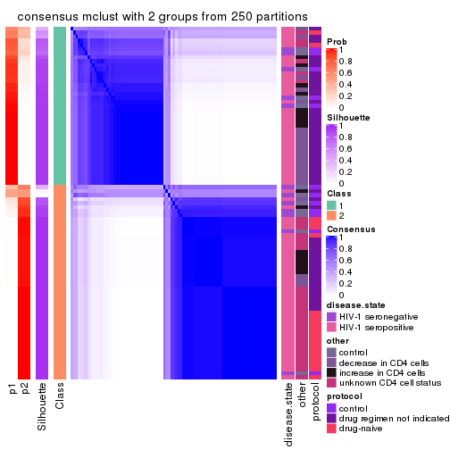</p>

</div>
<div id='tab-CV-mclust-consensus-heatmap-2'>
<pre><code class="r">consensus_heatmap(res, k = 3)
</code></pre>

<p>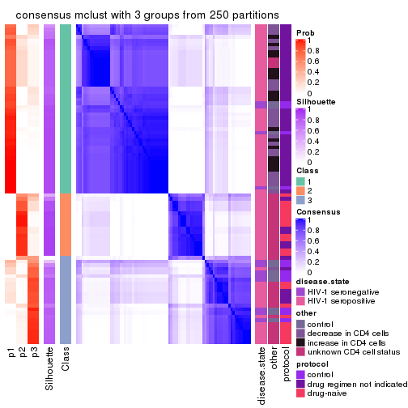</p>

</div>
<div id='tab-CV-mclust-consensus-heatmap-3'>
<pre><code class="r">consensus_heatmap(res, k = 4)
</code></pre>

<p>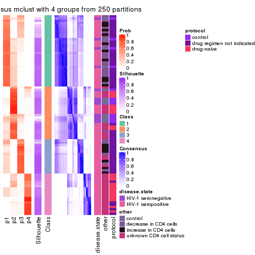</p>

</div>
<div id='tab-CV-mclust-consensus-heatmap-4'>
<pre><code class="r">consensus_heatmap(res, k = 5)
</code></pre>

<p>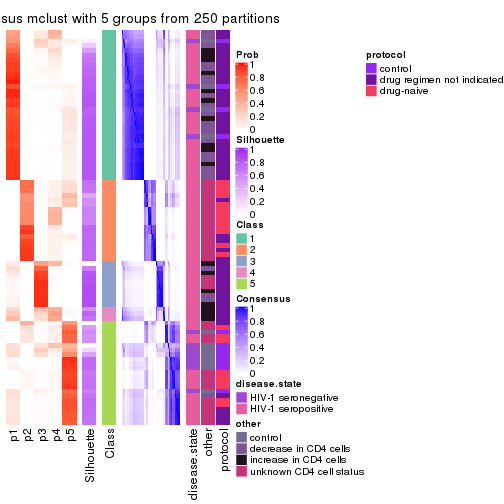</p>

</div>
<div id='tab-CV-mclust-consensus-heatmap-5'>
<pre><code class="r">consensus_heatmap(res, k = 6)
</code></pre>

<p>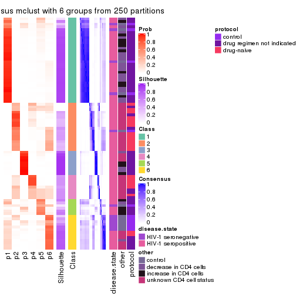</p>

</div>
</div>

Heatmaps for the membership of samples in all partitions to see how consistent they are:


<script>
$( function() {
	$( '#tabs-CV-mclust-membership-heatmap' ).tabs();
} );
</script>
<div id='tabs-CV-mclust-membership-heatmap'>
<ul>
<li><a href='#tab-CV-mclust-membership-heatmap-1'>k = 2</a></li>
<li><a href='#tab-CV-mclust-membership-heatmap-2'>k = 3</a></li>
<li><a href='#tab-CV-mclust-membership-heatmap-3'>k = 4</a></li>
<li><a href='#tab-CV-mclust-membership-heatmap-4'>k = 5</a></li>
<li><a href='#tab-CV-mclust-membership-heatmap-5'>k = 6</a></li>
</ul>
<div id='tab-CV-mclust-membership-heatmap-1'>
<pre><code class="r">membership_heatmap(res, k = 2)
</code></pre>

<p>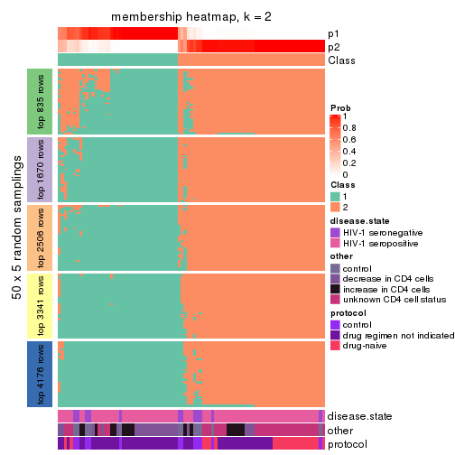</p>

</div>
<div id='tab-CV-mclust-membership-heatmap-2'>
<pre><code class="r">membership_heatmap(res, k = 3)
</code></pre>

<p>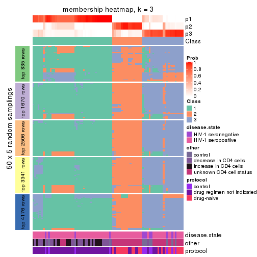</p>

</div>
<div id='tab-CV-mclust-membership-heatmap-3'>
<pre><code class="r">membership_heatmap(res, k = 4)
</code></pre>

<p>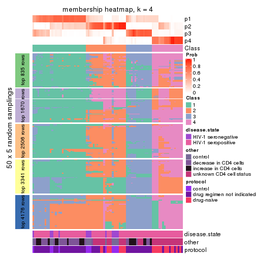</p>

</div>
<div id='tab-CV-mclust-membership-heatmap-4'>
<pre><code class="r">membership_heatmap(res, k = 5)
</code></pre>

<p>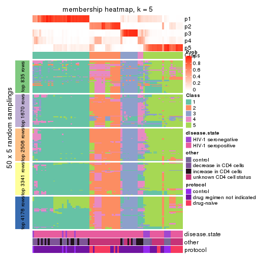</p>

</div>
<div id='tab-CV-mclust-membership-heatmap-5'>
<pre><code class="r">membership_heatmap(res, k = 6)
</code></pre>

<p>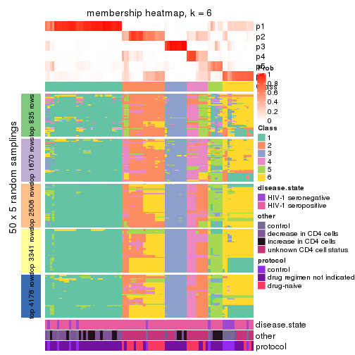</p>

</div>
</div>

As soon as we have had the classes for columns, we can look for signatures
which are significantly different between classes which can be candidate marks
for certain classes. Following are the heatmaps for signatures.


Signature heatmaps where rows are scaled:


<script>
$( function() {
	$( '#tabs-CV-mclust-get-signatures' ).tabs();
} );
</script>
<div id='tabs-CV-mclust-get-signatures'>
<ul>
<li><a href='#tab-CV-mclust-get-signatures-1'>k = 2</a></li>
<li><a href='#tab-CV-mclust-get-signatures-2'>k = 3</a></li>
<li><a href='#tab-CV-mclust-get-signatures-3'>k = 4</a></li>
<li><a href='#tab-CV-mclust-get-signatures-4'>k = 5</a></li>
<li><a href='#tab-CV-mclust-get-signatures-5'>k = 6</a></li>
</ul>
<div id='tab-CV-mclust-get-signatures-1'>
<pre><code class="r">get_signatures(res, k = 2)
</code></pre>

<p>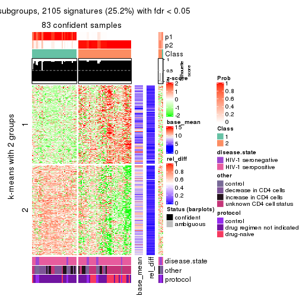</p>

</div>
<div id='tab-CV-mclust-get-signatures-2'>
<pre><code class="r">get_signatures(res, k = 3)
</code></pre>

<p>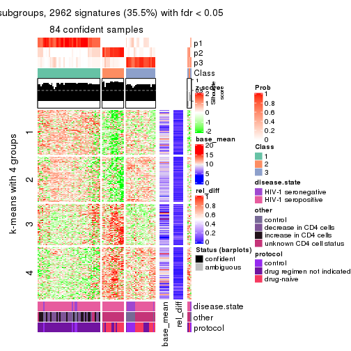</p>

</div>
<div id='tab-CV-mclust-get-signatures-3'>
<pre><code class="r">get_signatures(res, k = 4)
</code></pre>

<p>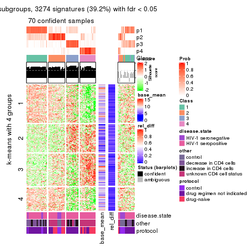</p>

</div>
<div id='tab-CV-mclust-get-signatures-4'>
<pre><code class="r">get_signatures(res, k = 5)
</code></pre>

<p>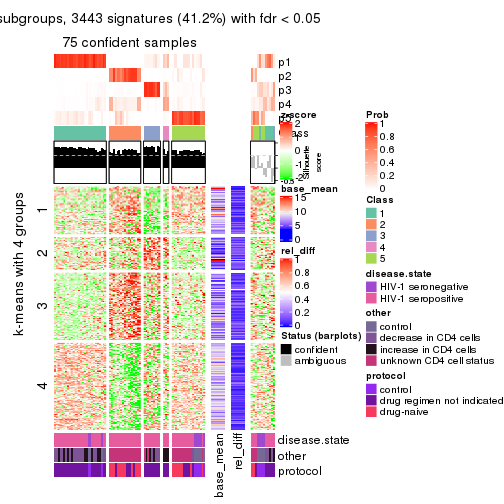</p>

</div>
<div id='tab-CV-mclust-get-signatures-5'>
<pre><code class="r">get_signatures(res, k = 6)
</code></pre>

<p>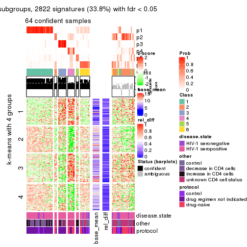</p>

</div>
</div>


Signature heatmaps where rows are not scaled:


<script>
$( function() {
	$( '#tabs-CV-mclust-get-signatures-no-scale' ).tabs();
} );
</script>
<div id='tabs-CV-mclust-get-signatures-no-scale'>
<ul>
<li><a href='#tab-CV-mclust-get-signatures-no-scale-1'>k = 2</a></li>
<li><a href='#tab-CV-mclust-get-signatures-no-scale-2'>k = 3</a></li>
<li><a href='#tab-CV-mclust-get-signatures-no-scale-3'>k = 4</a></li>
<li><a href='#tab-CV-mclust-get-signatures-no-scale-4'>k = 5</a></li>
<li><a href='#tab-CV-mclust-get-signatures-no-scale-5'>k = 6</a></li>
</ul>
<div id='tab-CV-mclust-get-signatures-no-scale-1'>
<pre><code class="r">get_signatures(res, k = 2, scale_rows = FALSE)
</code></pre>

<p>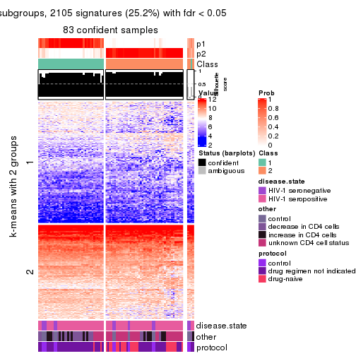</p>

</div>
<div id='tab-CV-mclust-get-signatures-no-scale-2'>
<pre><code class="r">get_signatures(res, k = 3, scale_rows = FALSE)
</code></pre>

<p>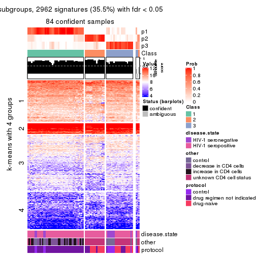</p>

</div>
<div id='tab-CV-mclust-get-signatures-no-scale-3'>
<pre><code class="r">get_signatures(res, k = 4, scale_rows = FALSE)
</code></pre>

<p>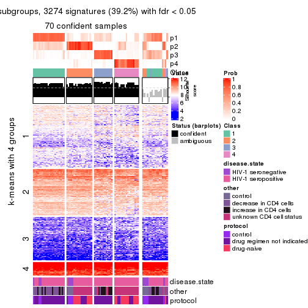</p>

</div>
<div id='tab-CV-mclust-get-signatures-no-scale-4'>
<pre><code class="r">get_signatures(res, k = 5, scale_rows = FALSE)
</code></pre>

<p>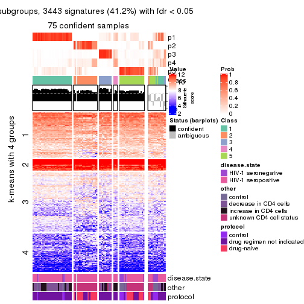</p>

</div>
<div id='tab-CV-mclust-get-signatures-no-scale-5'>
<pre><code class="r">get_signatures(res, k = 6, scale_rows = FALSE)
</code></pre>

<p>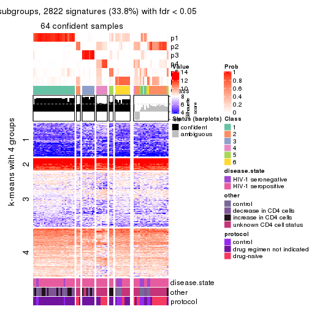</p>

</div>
</div>


Compare the overlap of signatures from different k:

```r
compare_signatures(res)
```

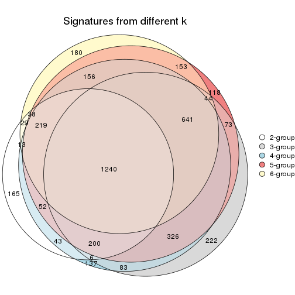

`get_signature()` returns a data frame invisibly. TO get the list of signatures, the function
call should be assigned to a variable explicitly. In following code, if `plot` argument is set
to `FALSE`, no heatmap is plotted while only the differential analysis is performed.

```r
# code only for demonstration
tb = get_signature(res, k = ..., plot = FALSE)
```

An example of the output of `tb` is:

```
#>   which_row         fdr    mean_1    mean_2 scaled_mean_1 scaled_mean_2 km
#> 1        38 0.042760348  8.373488  9.131774    -0.5533452     0.5164555  1
#> 2        40 0.018707592  7.106213  8.469186    -0.6173731     0.5762149  1
#> 3        55 0.019134737 10.221463 11.207825    -0.6159697     0.5749050  1
#> 4        59 0.006059896  5.921854  7.869574    -0.6899429     0.6439467  1
#> 5        60 0.018055526  8.928898 10.211722    -0.6204761     0.5791110  1
#> 6        98 0.009384629 15.714769 14.887706     0.6635654    -0.6193277  2
...
```

The columns in `tb` are:

1. `which_row`: row indices corresponding to the input matrix.
2. `fdr`: FDR for the differential test. 
3. `mean_x`: The mean value in group x.
4. `scaled_mean_x`: The mean value in group x after rows are scaled.
5. `km`: Row groups if k-means clustering is applied to rows.


UMAP plot which shows how samples are separated.


<script>
$( function() {
	$( '#tabs-CV-mclust-dimension-reduction' ).tabs();
} );
</script>
<div id='tabs-CV-mclust-dimension-reduction'>
<ul>
<li><a href='#tab-CV-mclust-dimension-reduction-1'>k = 2</a></li>
<li><a href='#tab-CV-mclust-dimension-reduction-2'>k = 3</a></li>
<li><a href='#tab-CV-mclust-dimension-reduction-3'>k = 4</a></li>
<li><a href='#tab-CV-mclust-dimension-reduction-4'>k = 5</a></li>
<li><a href='#tab-CV-mclust-dimension-reduction-5'>k = 6</a></li>
</ul>
<div id='tab-CV-mclust-dimension-reduction-1'>
<pre><code class="r">dimension_reduction(res, k = 2, method = &quot;UMAP&quot;)
</code></pre>

<p>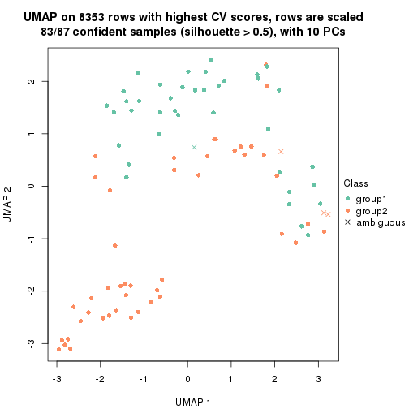</p>

</div>
<div id='tab-CV-mclust-dimension-reduction-2'>
<pre><code class="r">dimension_reduction(res, k = 3, method = &quot;UMAP&quot;)
</code></pre>

<p>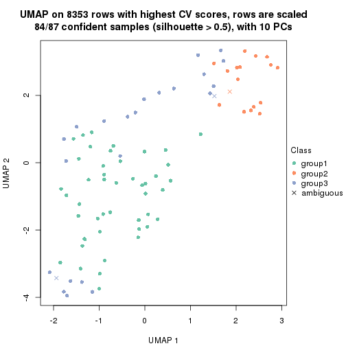</p>

</div>
<div id='tab-CV-mclust-dimension-reduction-3'>
<pre><code class="r">dimension_reduction(res, k = 4, method = &quot;UMAP&quot;)
</code></pre>

<p>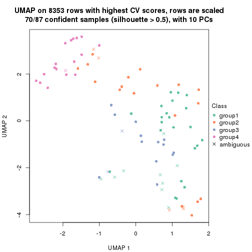</p>

</div>
<div id='tab-CV-mclust-dimension-reduction-4'>
<pre><code class="r">dimension_reduction(res, k = 5, method = &quot;UMAP&quot;)
</code></pre>

<p>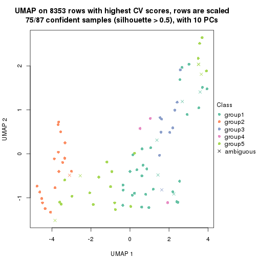</p>

</div>
<div id='tab-CV-mclust-dimension-reduction-5'>
<pre><code class="r">dimension_reduction(res, k = 6, method = &quot;UMAP&quot;)
</code></pre>

<p>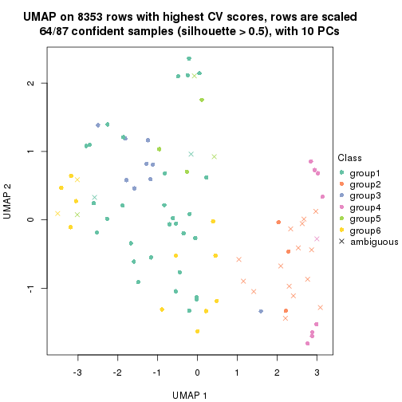</p>

</div>
</div>


Following heatmap shows how subgroups are split when increasing `k`:

```r
collect_classes(res)
```

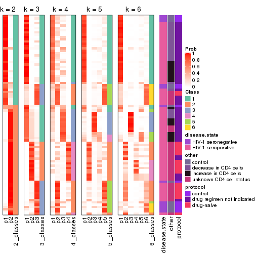


Test correlation between subgroups and known annotations. If the known
annotation is numeric, one-way ANOVA test is applied, and if the known
annotation is discrete, chi-squared contingency table test is applied.

```r
test_to_known_factors(res)
```

```
#>            n disease.state(p) other(p) protocol(p) k
#> CV:mclust 83          1.00000 2.68e-05    2.45e-04 2
#> CV:mclust 84          0.00684 5.95e-13    2.98e-10 3
#> CV:mclust 70          0.08415 2.03e-10    4.56e-07 4
#> CV:mclust 75          0.06126 4.22e-11    3.01e-07 5
#> CV:mclust 64          0.07104 7.85e-08    1.91e-05 6
```


If matrix rows can be associated to genes, consider to use `GO_Enrichment(res,
...)` to perform function enrichment for the signature genes.


 

---------------------------------------------------


### CV:NMF


The object with results only for a single top-value method and a single partition method 
can be extracted as:

```r
res = res_list["CV", "NMF"]
# you can also extract it by
# res = res_list["CV:NMF"]
```

A summary of `res` and all the functions that can be applied to it:

```r
res
```

```
#> A 'ConsensusPartition' object with k = 2, 3, 4, 5, 6.
#>   On a matrix with 8353 rows and 87 columns.
#>   Top rows (835, 1670, 2506, 3341, 4176) are extracted by 'CV' method.
#>   Subgroups are detected by 'NMF' method.
#>   Performed in total 1250 partitions by row resampling.
#>   Best k for subgroups seems to be 2.
#> 
#> Following methods can be applied to this 'ConsensusPartition' object:
#>  [1] "cola_report"             "collect_classes"         "collect_plots"          
#>  [4] "collect_stats"           "colnames"                "compare_signatures"     
#>  [7] "consensus_heatmap"       "dimension_reduction"     "functional_enrichment"  
#> [10] "get_anno_col"            "get_anno"                "get_classes"            
#> [13] "get_consensus"           "get_matrix"              "get_membership"         
#> [16] "get_param"               "get_signatures"          "get_stats"              
#> [19] "is_best_k"               "is_stable_k"             "membership_heatmap"     
#> [22] "ncol"                    "nrow"                    "plot_ecdf"              
#> [25] "rownames"                "select_partition_number" "show"                   
#> [28] "suggest_best_k"          "test_to_known_factors"
```

`collect_plots()` function collects all the plots made from `res` for all `k` (number of partitions)
into one single page to provide an easy and fast comparison between different `k`.

```r
collect_plots(res)
```

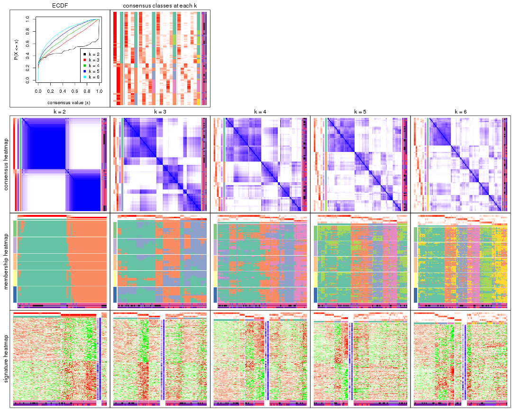

The plots are:

- The first row: a plot of the ECDF (Empirical cumulative distribution
  function) curves of the consensus matrix for each `k` and the heatmap of
  predicted classes for each `k`.
- The second row: heatmaps of the consensus matrix for each `k`.
- The third row: heatmaps of the membership matrix for each `k`.
- The fouth row: heatmaps of the signatures for each `k`.

All the plots in panels can be made by individual functions and they are
plotted later in this section.

`select_partition_number()` produces several plots showing different
statistics for choosing "optimized" `k`. There are following statistics:

- ECDF curves of the consensus matrix for each `k`;
- 1-PAC. [The PAC
  score](https://en.wikipedia.org/wiki/Consensus_clustering#Over-interpretation_potential_of_consensus_clustering)
  measures the proportion of the ambiguous subgrouping.
- Mean silhouette score.
- Concordance. The mean probability of fiting the consensus class ids in all
  partitions.
- Area increased. Denote $A_k$ as the area under the ECDF curve for current
  `k`, the area increased is defined as $A_k - A_{k-1}$.
- Rand index. The percent of pairs of samples that are both in a same cluster
  or both are not in a same cluster in the partition of k and k-1.
- Jaccard index. The ratio of pairs of samples are both in a same cluster in
  the partition of k and k-1 and the pairs of samples are both in a same
  cluster in the partition k or k-1.

The detailed explanations of these statistics can be found in [the cola
vignette](http://bioconductor.org/packages/devel/bioc/vignettes/cola/inst/doc/cola.html#toc_13).

Generally speaking, lower PAC score, higher mean silhouette score or higher
concordance corresponds to better partition. Rand index and Jaccard index
measure how similar the current partition is compared to partition with `k-1`.
If they are too similar, we won't accept `k` is better than `k-1`.

```r
select_partition_number(res)
```

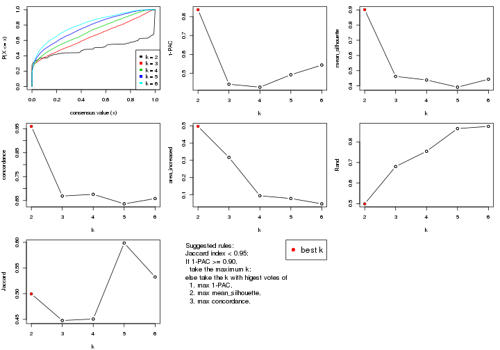

The numeric values for all these statistics can be obtained by `get_stats()`.

```r
get_stats(res)
```

```
#>   k 1-PAC mean_silhouette concordance area_increased  Rand Jaccard
#> 2 2 0.837           0.901       0.960         0.4968 0.500   0.500
#> 3 3 0.443           0.462       0.669         0.3170 0.680   0.448
#> 4 4 0.427           0.439       0.676         0.0945 0.754   0.451
#> 5 5 0.493           0.392       0.636         0.0788 0.864   0.599
#> 6 6 0.544           0.444       0.658         0.0479 0.875   0.533
```

`suggest_best_k()` suggests the best $k$ based on these statistics. The rules are as follows:

- All $k$ with Jaccard index larger than 0.95 are removed because the increase of
  the partition number does not provides enough extra information. If all $k$ are removed,
  the best $k$ is assigned by `NA`.
- For $k$ with 1-PAC larger than 0.9, the maximal $k$ is taken as the "best k". Other $k$ is called "optional k".
- If it does not fit the second rule. The $k$ with the highest vote of highest
  1-PAC, mean silhouette and concordance is taken as the "best k".

```r
suggest_best_k(res)
```

```
#> [1] 2
```


Following shows the table of the partitions (You need to click the **show/hide
code output** link to see it). The membership matrix (columns with name `p*`)
is inferred by
[`clue::cl_consensus()`](https://www.rdocumentation.org/link/cl_consensus?package=clue)
function with the `SE` method. Basically the value in the membership matrix
represents the probability to belong to a certain group. The finall class
label for an item is determined with the group with highest probability it
belongs to.

In `get_classes()` function, the entropy is calculated from the membership
matrix and the silhouette score is calculated from the consensus matrix.


<script>
$( function() {
	$( '#tabs-CV-NMF-get-classes' ).tabs();
} );
</script>
<div id='tabs-CV-NMF-get-classes'>
<ul>
<li><a href='#tab-CV-NMF-get-classes-1'>k = 2</a></li>
<li><a href='#tab-CV-NMF-get-classes-2'>k = 3</a></li>
<li><a href='#tab-CV-NMF-get-classes-3'>k = 4</a></li>
<li><a href='#tab-CV-NMF-get-classes-4'>k = 5</a></li>
<li><a href='#tab-CV-NMF-get-classes-5'>k = 6</a></li>
</ul>

<div id='tab-CV-NMF-get-classes-1'>
<p><a id='tab-CV-NMF-get-classes-1-a' style='color:#0366d6' href='#'>show/hide code output</a></p>
<pre><code class="r">cbind(get_classes(res, k = 2), get_membership(res, k = 2))
</code></pre>

<pre><code>#&gt;          class entropy silhouette    p1    p2
#&gt; GSM39104     1  0.0000     0.9677 1.000 0.000
#&gt; GSM39105     1  0.0000     0.9677 1.000 0.000
#&gt; GSM39106     1  0.0000     0.9677 1.000 0.000
#&gt; GSM39107     1  0.6623     0.7878 0.828 0.172
#&gt; GSM39108     1  0.0000     0.9677 1.000 0.000
#&gt; GSM39109     2  0.2948     0.9018 0.052 0.948
#&gt; GSM39110     1  0.0376     0.9651 0.996 0.004
#&gt; GSM39111     1  0.0000     0.9677 1.000 0.000
#&gt; GSM39112     1  0.2236     0.9393 0.964 0.036
#&gt; GSM39113     1  0.9686     0.3205 0.604 0.396
#&gt; GSM39114     2  0.0672     0.9363 0.008 0.992
#&gt; GSM39115     1  0.0000     0.9677 1.000 0.000
#&gt; GSM39148     1  0.0000     0.9677 1.000 0.000
#&gt; GSM39149     2  0.0938     0.9336 0.012 0.988
#&gt; GSM39150     1  0.0000     0.9677 1.000 0.000
#&gt; GSM39151     2  0.6247     0.7914 0.156 0.844
#&gt; GSM39152     1  0.7453     0.7229 0.788 0.212
#&gt; GSM39153     1  0.0000     0.9677 1.000 0.000
#&gt; GSM39154     1  0.0000     0.9677 1.000 0.000
#&gt; GSM39155     1  0.0000     0.9677 1.000 0.000
#&gt; GSM39156     1  0.0000     0.9677 1.000 0.000
#&gt; GSM39157     1  0.0000     0.9677 1.000 0.000
#&gt; GSM39158     1  0.0000     0.9677 1.000 0.000
#&gt; GSM39159     1  0.0672     0.9624 0.992 0.008
#&gt; GSM39160     1  0.0000     0.9677 1.000 0.000
#&gt; GSM39161     1  0.1414     0.9528 0.980 0.020
#&gt; GSM39162     1  0.0000     0.9677 1.000 0.000
#&gt; GSM39163     1  0.0000     0.9677 1.000 0.000
#&gt; GSM39164     1  0.0000     0.9677 1.000 0.000
#&gt; GSM39165     1  0.0376     0.9651 0.996 0.004
#&gt; GSM39166     1  0.0000     0.9677 1.000 0.000
#&gt; GSM39167     1  0.0000     0.9677 1.000 0.000
#&gt; GSM39168     1  0.0000     0.9677 1.000 0.000
#&gt; GSM39169     1  0.0000     0.9677 1.000 0.000
#&gt; GSM39170     1  0.0000     0.9677 1.000 0.000
#&gt; GSM39171     1  0.0000     0.9677 1.000 0.000
#&gt; GSM39172     2  0.0000     0.9414 0.000 1.000
#&gt; GSM39173     2  0.0000     0.9414 0.000 1.000
#&gt; GSM39174     1  0.0000     0.9677 1.000 0.000
#&gt; GSM39175     1  0.0000     0.9677 1.000 0.000
#&gt; GSM39176     1  0.0000     0.9677 1.000 0.000
#&gt; GSM39177     2  0.9795     0.2957 0.416 0.584
#&gt; GSM39178     1  0.0000     0.9677 1.000 0.000
#&gt; GSM39179     2  0.0000     0.9414 0.000 1.000
#&gt; GSM39180     2  0.0000     0.9414 0.000 1.000
#&gt; GSM39181     1  0.0000     0.9677 1.000 0.000
#&gt; GSM39182     2  0.0000     0.9414 0.000 1.000
#&gt; GSM39183     1  0.0000     0.9677 1.000 0.000
#&gt; GSM39184     1  0.0000     0.9677 1.000 0.000
#&gt; GSM39185     1  0.7950     0.6768 0.760 0.240
#&gt; GSM39186     1  0.0000     0.9677 1.000 0.000
#&gt; GSM39187     1  0.0000     0.9677 1.000 0.000
#&gt; GSM39116     2  0.0000     0.9414 0.000 1.000
#&gt; GSM39117     2  0.0000     0.9414 0.000 1.000
#&gt; GSM39118     2  0.0000     0.9414 0.000 1.000
#&gt; GSM39119     2  0.0000     0.9414 0.000 1.000
#&gt; GSM39120     1  0.5737     0.8349 0.864 0.136
#&gt; GSM39121     2  1.0000     0.0146 0.500 0.500
#&gt; GSM39122     2  0.9608     0.3911 0.384 0.616
#&gt; GSM39123     2  0.0000     0.9414 0.000 1.000
#&gt; GSM39124     2  0.0000     0.9414 0.000 1.000
#&gt; GSM39125     1  0.5842     0.8296 0.860 0.140
#&gt; GSM39126     2  0.9686     0.3602 0.396 0.604
#&gt; GSM39127     2  0.0000     0.9414 0.000 1.000
#&gt; GSM39128     2  0.0000     0.9414 0.000 1.000
#&gt; GSM39129     2  0.0000     0.9414 0.000 1.000
#&gt; GSM39130     2  0.0000     0.9414 0.000 1.000
#&gt; GSM39131     2  0.0000     0.9414 0.000 1.000
#&gt; GSM39132     2  0.0000     0.9414 0.000 1.000
#&gt; GSM39133     2  0.0000     0.9414 0.000 1.000
#&gt; GSM39134     2  0.0000     0.9414 0.000 1.000
#&gt; GSM39135     2  0.0000     0.9414 0.000 1.000
#&gt; GSM39136     2  0.0000     0.9414 0.000 1.000
#&gt; GSM39137     2  0.5408     0.8304 0.124 0.876
#&gt; GSM39138     2  0.0000     0.9414 0.000 1.000
#&gt; GSM39139     2  0.0000     0.9414 0.000 1.000
#&gt; GSM39140     1  0.2236     0.9392 0.964 0.036
#&gt; GSM39141     1  0.0000     0.9677 1.000 0.000
#&gt; GSM39142     1  0.0000     0.9677 1.000 0.000
#&gt; GSM39143     1  0.0000     0.9677 1.000 0.000
#&gt; GSM39144     2  0.0000     0.9414 0.000 1.000
#&gt; GSM39145     2  0.0000     0.9414 0.000 1.000
#&gt; GSM39146     2  0.0000     0.9414 0.000 1.000
#&gt; GSM39147     2  0.0000     0.9414 0.000 1.000
#&gt; GSM39188     2  0.0000     0.9414 0.000 1.000
#&gt; GSM39189     2  0.2948     0.9032 0.052 0.948
#&gt; GSM39190     2  0.0000     0.9414 0.000 1.000
</code></pre>

<script>
$('#tab-CV-NMF-get-classes-1-a').parent().next().next().hide();
$('#tab-CV-NMF-get-classes-1-a').click(function(){
  $('#tab-CV-NMF-get-classes-1-a').parent().next().next().toggle();
  return(false);
});
</script>
</div>

<div id='tab-CV-NMF-get-classes-2'>
<p><a id='tab-CV-NMF-get-classes-2-a' style='color:#0366d6' href='#'>show/hide code output</a></p>
<pre><code class="r">cbind(get_classes(res, k = 3), get_membership(res, k = 3))
</code></pre>

<pre><code>#&gt;          class entropy silhouette    p1    p2    p3
#&gt; GSM39104     1  0.4235     0.6988 0.824 0.000 0.176
#&gt; GSM39105     1  0.6008     0.4739 0.628 0.000 0.372
#&gt; GSM39106     3  0.5016     0.4867 0.240 0.000 0.760
#&gt; GSM39107     3  0.1163     0.6262 0.028 0.000 0.972
#&gt; GSM39108     3  0.6267    -0.0439 0.452 0.000 0.548
#&gt; GSM39109     2  0.6079     0.5455 0.036 0.748 0.216
#&gt; GSM39110     1  0.6140     0.4117 0.596 0.000 0.404
#&gt; GSM39111     1  0.2448     0.7188 0.924 0.000 0.076
#&gt; GSM39112     3  0.2261     0.6323 0.068 0.000 0.932
#&gt; GSM39113     3  0.0829     0.6174 0.012 0.004 0.984
#&gt; GSM39114     3  0.4235     0.4551 0.000 0.176 0.824
#&gt; GSM39115     1  0.6267     0.2970 0.548 0.000 0.452
#&gt; GSM39148     3  0.6308    -0.1798 0.492 0.000 0.508
#&gt; GSM39149     1  0.6180     0.1039 0.584 0.416 0.000
#&gt; GSM39150     1  0.0892     0.7140 0.980 0.000 0.020
#&gt; GSM39151     1  0.6308    -0.1199 0.508 0.492 0.000
#&gt; GSM39152     1  0.4931     0.4806 0.768 0.232 0.000
#&gt; GSM39153     1  0.3941     0.7070 0.844 0.000 0.156
#&gt; GSM39154     1  0.3412     0.7137 0.876 0.000 0.124
#&gt; GSM39155     1  0.4002     0.7052 0.840 0.000 0.160
#&gt; GSM39156     3  0.5016     0.4846 0.240 0.000 0.760
#&gt; GSM39157     1  0.6062     0.4538 0.616 0.000 0.384
#&gt; GSM39158     1  0.4002     0.7055 0.840 0.000 0.160
#&gt; GSM39159     1  0.2165     0.6739 0.936 0.064 0.000
#&gt; GSM39160     1  0.0424     0.7099 0.992 0.000 0.008
#&gt; GSM39161     1  0.4235     0.5566 0.824 0.176 0.000
#&gt; GSM39162     3  0.6140     0.1065 0.404 0.000 0.596
#&gt; GSM39163     1  0.5363     0.6079 0.724 0.000 0.276
#&gt; GSM39164     1  0.6045     0.4602 0.620 0.000 0.380
#&gt; GSM39165     1  0.1129     0.7004 0.976 0.020 0.004
#&gt; GSM39166     1  0.1529     0.7174 0.960 0.000 0.040
#&gt; GSM39167     1  0.5785     0.5366 0.668 0.000 0.332
#&gt; GSM39168     3  0.6302    -0.1426 0.480 0.000 0.520
#&gt; GSM39169     1  0.5098     0.6423 0.752 0.000 0.248
#&gt; GSM39170     1  0.4452     0.6896 0.808 0.000 0.192
#&gt; GSM39171     1  0.0747     0.7130 0.984 0.000 0.016
#&gt; GSM39172     2  0.6274     0.1950 0.456 0.544 0.000
#&gt; GSM39173     2  0.6111     0.3077 0.396 0.604 0.000
#&gt; GSM39174     1  0.4750     0.6673 0.784 0.000 0.216
#&gt; GSM39175     1  0.1163     0.7160 0.972 0.000 0.028
#&gt; GSM39176     1  0.6079     0.4496 0.612 0.000 0.388
#&gt; GSM39177     1  0.5835     0.2881 0.660 0.340 0.000
#&gt; GSM39178     1  0.2711     0.6524 0.912 0.088 0.000
#&gt; GSM39179     2  0.6309     0.0857 0.500 0.500 0.000
#&gt; GSM39180     2  0.5254     0.4834 0.264 0.736 0.000
#&gt; GSM39181     1  0.2165     0.7191 0.936 0.000 0.064
#&gt; GSM39182     2  0.6045     0.3358 0.380 0.620 0.000
#&gt; GSM39183     1  0.0747     0.7130 0.984 0.000 0.016
#&gt; GSM39184     1  0.3816     0.7084 0.852 0.000 0.148
#&gt; GSM39185     1  0.5098     0.4566 0.752 0.248 0.000
#&gt; GSM39186     1  0.4452     0.6873 0.808 0.000 0.192
#&gt; GSM39187     1  0.6286     0.2586 0.536 0.000 0.464
#&gt; GSM39116     2  0.5968     0.4383 0.000 0.636 0.364
#&gt; GSM39117     2  0.0424     0.6258 0.000 0.992 0.008
#&gt; GSM39118     2  0.4702     0.5940 0.000 0.788 0.212
#&gt; GSM39119     2  0.2796     0.6419 0.000 0.908 0.092
#&gt; GSM39120     3  0.2448     0.6293 0.076 0.000 0.924
#&gt; GSM39121     3  0.0592     0.6061 0.000 0.012 0.988
#&gt; GSM39122     3  0.2356     0.5657 0.000 0.072 0.928
#&gt; GSM39123     2  0.1753     0.6377 0.000 0.952 0.048
#&gt; GSM39124     3  0.5988     0.1447 0.000 0.368 0.632
#&gt; GSM39125     3  0.3340     0.6058 0.120 0.000 0.880
#&gt; GSM39126     3  0.1964     0.5806 0.000 0.056 0.944
#&gt; GSM39127     3  0.6079     0.0955 0.000 0.388 0.612
#&gt; GSM39128     3  0.6008     0.1352 0.000 0.372 0.628
#&gt; GSM39129     2  0.3340     0.6390 0.000 0.880 0.120
#&gt; GSM39130     2  0.1860     0.6385 0.000 0.948 0.052
#&gt; GSM39131     3  0.5988     0.1447 0.000 0.368 0.632
#&gt; GSM39132     3  0.6308    -0.1890 0.000 0.492 0.508
#&gt; GSM39133     2  0.4121     0.6230 0.000 0.832 0.168
#&gt; GSM39134     2  0.3816     0.6318 0.000 0.852 0.148
#&gt; GSM39135     2  0.6062     0.4059 0.000 0.616 0.384
#&gt; GSM39136     2  0.6111     0.3850 0.000 0.604 0.396
#&gt; GSM39137     3  0.4504     0.4349 0.000 0.196 0.804
#&gt; GSM39138     2  0.2959     0.6417 0.000 0.900 0.100
#&gt; GSM39139     2  0.5760     0.4831 0.000 0.672 0.328
#&gt; GSM39140     3  0.4121     0.5715 0.168 0.000 0.832
#&gt; GSM39141     3  0.4291     0.5609 0.180 0.000 0.820
#&gt; GSM39142     3  0.4974     0.4931 0.236 0.000 0.764
#&gt; GSM39143     3  0.4504     0.5445 0.196 0.000 0.804
#&gt; GSM39144     2  0.3941     0.6287 0.000 0.844 0.156
#&gt; GSM39145     2  0.5948     0.4434 0.000 0.640 0.360
#&gt; GSM39146     2  0.6295     0.2170 0.000 0.528 0.472
#&gt; GSM39147     3  0.6295    -0.1377 0.000 0.472 0.528
#&gt; GSM39188     2  0.6295     0.1564 0.472 0.528 0.000
#&gt; GSM39189     1  0.6192     0.0911 0.580 0.420 0.000
#&gt; GSM39190     2  0.6302     0.1375 0.480 0.520 0.000
</code></pre>

<script>
$('#tab-CV-NMF-get-classes-2-a').parent().next().next().hide();
$('#tab-CV-NMF-get-classes-2-a').click(function(){
  $('#tab-CV-NMF-get-classes-2-a').parent().next().next().toggle();
  return(false);
});
</script>
</div>

<div id='tab-CV-NMF-get-classes-3'>
<p><a id='tab-CV-NMF-get-classes-3-a' style='color:#0366d6' href='#'>show/hide code output</a></p>
<pre><code class="r">cbind(get_classes(res, k = 4), get_membership(res, k = 4))
</code></pre>

<pre><code>#&gt;          class entropy silhouette    p1    p2    p3    p4
#&gt; GSM39104     1   0.419     0.6681 0.816 0.032 0.148 0.004
#&gt; GSM39105     1   0.418     0.6659 0.832 0.116 0.044 0.008
#&gt; GSM39106     1   0.592     0.0443 0.492 0.480 0.012 0.016
#&gt; GSM39107     2   0.707     0.3234 0.348 0.536 0.008 0.108
#&gt; GSM39108     1   0.651     0.5207 0.644 0.260 0.080 0.016
#&gt; GSM39109     4   0.765     0.5769 0.064 0.192 0.132 0.612
#&gt; GSM39110     1   0.802     0.3367 0.444 0.220 0.324 0.012
#&gt; GSM39111     1   0.660     0.2967 0.504 0.052 0.432 0.012
#&gt; GSM39112     2   0.590     0.2494 0.388 0.576 0.004 0.032
#&gt; GSM39113     2   0.543     0.4302 0.300 0.668 0.004 0.028
#&gt; GSM39114     2   0.327     0.5303 0.056 0.884 0.004 0.056
#&gt; GSM39115     1   0.363     0.6613 0.868 0.076 0.008 0.048
#&gt; GSM39148     1   0.397     0.6105 0.816 0.164 0.004 0.016
#&gt; GSM39149     3   0.252     0.6648 0.060 0.020 0.916 0.004
#&gt; GSM39150     1   0.592     0.4795 0.652 0.004 0.288 0.056
#&gt; GSM39151     3   0.313     0.6645 0.100 0.008 0.880 0.012
#&gt; GSM39152     3   0.403     0.5780 0.192 0.008 0.796 0.004
#&gt; GSM39153     1   0.303     0.6835 0.888 0.020 0.088 0.004
#&gt; GSM39154     1   0.423     0.6286 0.804 0.004 0.168 0.024
#&gt; GSM39155     1   0.322     0.6805 0.876 0.020 0.100 0.004
#&gt; GSM39156     1   0.577     0.1555 0.540 0.436 0.008 0.016
#&gt; GSM39157     1   0.293     0.6718 0.888 0.096 0.012 0.004
#&gt; GSM39158     1   0.353     0.6637 0.864 0.000 0.056 0.080
#&gt; GSM39159     1   0.663     0.3325 0.564 0.000 0.336 0.100
#&gt; GSM39160     1   0.595     0.4246 0.616 0.000 0.328 0.056
#&gt; GSM39161     1   0.766     0.1759 0.464 0.000 0.260 0.276
#&gt; GSM39162     1   0.489     0.5205 0.732 0.244 0.008 0.016
#&gt; GSM39163     1   0.211     0.6923 0.940 0.024 0.020 0.016
#&gt; GSM39164     1   0.339     0.6731 0.868 0.104 0.024 0.004
#&gt; GSM39165     3   0.546    -0.2105 0.492 0.004 0.496 0.008
#&gt; GSM39166     1   0.503     0.6061 0.768 0.000 0.140 0.092
#&gt; GSM39167     1   0.251     0.6736 0.912 0.072 0.004 0.012
#&gt; GSM39168     1   0.418     0.5996 0.800 0.180 0.008 0.012
#&gt; GSM39169     1   0.258     0.6928 0.916 0.032 0.048 0.004
#&gt; GSM39170     1   0.349     0.6790 0.880 0.020 0.032 0.068
#&gt; GSM39171     1   0.528     0.3544 0.588 0.000 0.400 0.012
#&gt; GSM39172     4   0.729    -0.0655 0.164 0.000 0.340 0.496
#&gt; GSM39173     3   0.260     0.6057 0.004 0.064 0.912 0.020
#&gt; GSM39174     1   0.380     0.6859 0.852 0.044 0.100 0.004
#&gt; GSM39175     1   0.521     0.5173 0.692 0.004 0.280 0.024
#&gt; GSM39176     1   0.208     0.6780 0.932 0.056 0.004 0.008
#&gt; GSM39177     3   0.301     0.6635 0.092 0.008 0.888 0.012
#&gt; GSM39178     1   0.652     0.2633 0.536 0.000 0.384 0.080
#&gt; GSM39179     3   0.209     0.6467 0.024 0.024 0.940 0.012
#&gt; GSM39180     3   0.614     0.3607 0.052 0.008 0.624 0.316
#&gt; GSM39181     1   0.505     0.6035 0.756 0.000 0.068 0.176
#&gt; GSM39182     4   0.451     0.4662 0.120 0.000 0.076 0.804
#&gt; GSM39183     1   0.582     0.5600 0.708 0.000 0.148 0.144
#&gt; GSM39184     1   0.328     0.6633 0.864 0.000 0.116 0.020
#&gt; GSM39185     1   0.783     0.0481 0.412 0.000 0.292 0.296
#&gt; GSM39186     1   0.399     0.6701 0.832 0.032 0.132 0.004
#&gt; GSM39187     1   0.305     0.6543 0.880 0.104 0.004 0.012
#&gt; GSM39116     4   0.590     0.5361 0.000 0.348 0.048 0.604
#&gt; GSM39117     4   0.379     0.6843 0.000 0.044 0.112 0.844
#&gt; GSM39118     2   0.775    -0.3965 0.000 0.388 0.232 0.380
#&gt; GSM39119     4   0.659     0.6283 0.000 0.156 0.216 0.628
#&gt; GSM39120     2   0.530     0.2638 0.388 0.600 0.004 0.008
#&gt; GSM39121     2   0.325     0.5490 0.140 0.852 0.000 0.008
#&gt; GSM39122     2   0.328     0.5511 0.124 0.860 0.000 0.016
#&gt; GSM39123     4   0.258     0.6895 0.000 0.052 0.036 0.912
#&gt; GSM39124     2   0.462     0.4254 0.016 0.792 0.024 0.168
#&gt; GSM39125     1   0.743     0.0559 0.500 0.368 0.016 0.116
#&gt; GSM39126     2   0.320     0.5508 0.136 0.856 0.000 0.008
#&gt; GSM39127     2   0.543     0.1988 0.020 0.640 0.004 0.336
#&gt; GSM39128     2   0.500     0.3953 0.020 0.748 0.016 0.216
#&gt; GSM39129     3   0.751    -0.1172 0.000 0.376 0.440 0.184
#&gt; GSM39130     4   0.339     0.6987 0.000 0.056 0.072 0.872
#&gt; GSM39131     2   0.487     0.3873 0.012 0.760 0.024 0.204
#&gt; GSM39132     2   0.573    -0.0792 0.000 0.576 0.032 0.392
#&gt; GSM39133     4   0.305     0.6912 0.000 0.088 0.028 0.884
#&gt; GSM39134     4   0.691     0.5990 0.000 0.240 0.172 0.588
#&gt; GSM39135     4   0.597     0.5023 0.000 0.368 0.048 0.584
#&gt; GSM39136     4   0.531     0.6267 0.000 0.256 0.044 0.700
#&gt; GSM39137     2   0.427     0.5193 0.068 0.828 0.004 0.100
#&gt; GSM39138     3   0.780    -0.2284 0.000 0.328 0.412 0.260
#&gt; GSM39139     2   0.695    -0.0181 0.000 0.544 0.324 0.132
#&gt; GSM39140     2   0.576     0.0274 0.456 0.520 0.004 0.020
#&gt; GSM39141     1   0.606     0.0880 0.516 0.448 0.008 0.028
#&gt; GSM39142     1   0.619     0.2758 0.584 0.364 0.008 0.044
#&gt; GSM39143     1   0.612     0.1259 0.532 0.428 0.008 0.032
#&gt; GSM39144     3   0.723    -0.0434 0.000 0.392 0.464 0.144
#&gt; GSM39145     2   0.635     0.1298 0.000 0.636 0.252 0.112
#&gt; GSM39146     4   0.559     0.4893 0.000 0.372 0.028 0.600
#&gt; GSM39147     2   0.455     0.3833 0.000 0.804 0.096 0.100
#&gt; GSM39188     3   0.354     0.6514 0.076 0.000 0.864 0.060
#&gt; GSM39189     3   0.415     0.6387 0.132 0.000 0.820 0.048
#&gt; GSM39190     3   0.299     0.6603 0.056 0.008 0.900 0.036
</code></pre>

<script>
$('#tab-CV-NMF-get-classes-3-a').parent().next().next().hide();
$('#tab-CV-NMF-get-classes-3-a').click(function(){
  $('#tab-CV-NMF-get-classes-3-a').parent().next().next().toggle();
  return(false);
});
</script>
</div>

<div id='tab-CV-NMF-get-classes-4'>
<p><a id='tab-CV-NMF-get-classes-4-a' style='color:#0366d6' href='#'>show/hide code output</a></p>
<pre><code class="r">cbind(get_classes(res, k = 5), get_membership(res, k = 5))
</code></pre>

<pre><code>#&gt;          class entropy silhouette    p1    p2    p3    p4    p5
#&gt; GSM39104     5  0.6764     0.1944 0.384 0.080 0.048 0.004 0.484
#&gt; GSM39105     1  0.6011     0.2088 0.556 0.120 0.004 0.000 0.320
#&gt; GSM39106     2  0.6958     0.2829 0.232 0.464 0.016 0.000 0.288
#&gt; GSM39107     2  0.7119     0.5130 0.180 0.588 0.016 0.060 0.156
#&gt; GSM39108     1  0.7125     0.0359 0.396 0.252 0.016 0.000 0.336
#&gt; GSM39109     4  0.8574     0.1889 0.036 0.256 0.072 0.364 0.272
#&gt; GSM39110     5  0.8167     0.1666 0.252 0.184 0.156 0.000 0.408
#&gt; GSM39111     5  0.7597     0.2752 0.244 0.072 0.192 0.004 0.488
#&gt; GSM39112     2  0.6330     0.4543 0.240 0.580 0.004 0.008 0.168
#&gt; GSM39113     2  0.5658     0.5564 0.120 0.676 0.008 0.008 0.188
#&gt; GSM39114     2  0.3059     0.5881 0.004 0.872 0.012 0.020 0.092
#&gt; GSM39115     1  0.5716     0.2716 0.616 0.076 0.016 0.000 0.292
#&gt; GSM39148     1  0.2579     0.5455 0.900 0.064 0.004 0.004 0.028
#&gt; GSM39149     3  0.4919     0.5682 0.024 0.000 0.684 0.024 0.268
#&gt; GSM39150     5  0.6507     0.4422 0.384 0.016 0.080 0.016 0.504
#&gt; GSM39151     3  0.5582     0.5094 0.024 0.000 0.568 0.036 0.372
#&gt; GSM39152     3  0.6644     0.3649 0.068 0.020 0.476 0.024 0.412
#&gt; GSM39153     1  0.3268     0.5076 0.852 0.004 0.028 0.004 0.112
#&gt; GSM39154     1  0.3304     0.4804 0.852 0.000 0.052 0.004 0.092
#&gt; GSM39155     1  0.3500     0.4381 0.808 0.004 0.016 0.000 0.172
#&gt; GSM39156     1  0.6228     0.3485 0.580 0.248 0.004 0.004 0.164
#&gt; GSM39157     1  0.0912     0.5484 0.972 0.012 0.000 0.000 0.016
#&gt; GSM39158     1  0.4686     0.0700 0.636 0.008 0.004 0.008 0.344
#&gt; GSM39159     5  0.6563     0.4063 0.420 0.004 0.060 0.048 0.468
#&gt; GSM39160     5  0.6405     0.4560 0.348 0.000 0.104 0.024 0.524
#&gt; GSM39161     5  0.7252     0.4057 0.356 0.004 0.036 0.164 0.440
#&gt; GSM39162     1  0.4275     0.5116 0.796 0.116 0.008 0.004 0.076
#&gt; GSM39163     1  0.2286     0.4977 0.888 0.000 0.004 0.000 0.108
#&gt; GSM39164     1  0.3058     0.5399 0.876 0.036 0.008 0.004 0.076
#&gt; GSM39165     1  0.6880    -0.1320 0.516 0.004 0.240 0.016 0.224
#&gt; GSM39166     1  0.5786    -0.3569 0.480 0.004 0.024 0.032 0.460
#&gt; GSM39167     1  0.1913     0.5411 0.932 0.016 0.008 0.000 0.044
#&gt; GSM39168     1  0.3821     0.5237 0.824 0.104 0.004 0.004 0.064
#&gt; GSM39169     1  0.2796     0.5012 0.868 0.008 0.008 0.000 0.116
#&gt; GSM39170     1  0.4628     0.0283 0.624 0.004 0.008 0.004 0.360
#&gt; GSM39171     1  0.6625    -0.3492 0.456 0.000 0.128 0.020 0.396
#&gt; GSM39172     4  0.5877     0.2929 0.016 0.000 0.156 0.648 0.180
#&gt; GSM39173     3  0.4085     0.5690 0.004 0.040 0.796 0.008 0.152
#&gt; GSM39174     1  0.2499     0.5341 0.908 0.008 0.028 0.004 0.052
#&gt; GSM39175     1  0.4995     0.2449 0.704 0.000 0.084 0.004 0.208
#&gt; GSM39176     1  0.2452     0.5251 0.896 0.016 0.004 0.000 0.084
#&gt; GSM39177     3  0.5711     0.5313 0.076 0.000 0.660 0.032 0.232
#&gt; GSM39178     5  0.6977     0.5152 0.316 0.004 0.104 0.056 0.520
#&gt; GSM39179     3  0.5308     0.5761 0.016 0.012 0.696 0.048 0.228
#&gt; GSM39180     3  0.7356     0.2474 0.028 0.008 0.408 0.184 0.372
#&gt; GSM39181     1  0.5699    -0.1625 0.552 0.000 0.008 0.068 0.372
#&gt; GSM39182     4  0.2824     0.5774 0.028 0.000 0.016 0.888 0.068
#&gt; GSM39183     5  0.6087     0.3257 0.440 0.008 0.016 0.056 0.480
#&gt; GSM39184     1  0.3449     0.4379 0.812 0.000 0.024 0.000 0.164
#&gt; GSM39185     5  0.7633     0.4572 0.264 0.012 0.068 0.160 0.496
#&gt; GSM39186     1  0.4328     0.4084 0.752 0.012 0.020 0.004 0.212
#&gt; GSM39187     1  0.2152     0.5469 0.920 0.032 0.004 0.000 0.044
#&gt; GSM39116     4  0.5628     0.4612 0.000 0.360 0.032 0.576 0.032
#&gt; GSM39117     4  0.1281     0.6464 0.000 0.012 0.032 0.956 0.000
#&gt; GSM39118     4  0.7133     0.3495 0.000 0.304 0.272 0.408 0.016
#&gt; GSM39119     4  0.5181     0.6179 0.000 0.124 0.148 0.716 0.012
#&gt; GSM39120     2  0.5603     0.5516 0.212 0.660 0.004 0.004 0.120
#&gt; GSM39121     2  0.5374     0.5647 0.220 0.696 0.040 0.004 0.040
#&gt; GSM39122     2  0.4510     0.6180 0.128 0.792 0.016 0.016 0.048
#&gt; GSM39123     4  0.0807     0.6510 0.000 0.012 0.012 0.976 0.000
#&gt; GSM39124     2  0.5346     0.4629 0.008 0.724 0.120 0.132 0.016
#&gt; GSM39125     1  0.7403    -0.0437 0.412 0.392 0.016 0.032 0.148
#&gt; GSM39126     2  0.3619     0.6211 0.096 0.848 0.024 0.008 0.024
#&gt; GSM39127     2  0.4816     0.4271 0.000 0.724 0.028 0.216 0.032
#&gt; GSM39128     2  0.4830     0.4929 0.004 0.760 0.072 0.144 0.020
#&gt; GSM39129     3  0.6176     0.2082 0.000 0.292 0.580 0.108 0.020
#&gt; GSM39130     4  0.0912     0.6534 0.000 0.016 0.012 0.972 0.000
#&gt; GSM39131     2  0.4430     0.5205 0.000 0.784 0.024 0.136 0.056
#&gt; GSM39132     2  0.5078     0.3350 0.000 0.692 0.040 0.244 0.024
#&gt; GSM39133     4  0.2116     0.6663 0.000 0.076 0.004 0.912 0.008
#&gt; GSM39134     4  0.6637     0.4655 0.000 0.308 0.164 0.512 0.016
#&gt; GSM39135     4  0.5495     0.4585 0.000 0.364 0.048 0.576 0.012
#&gt; GSM39136     4  0.5669     0.4128 0.000 0.380 0.040 0.556 0.024
#&gt; GSM39137     2  0.4580     0.5842 0.056 0.808 0.064 0.056 0.016
#&gt; GSM39138     3  0.6461     0.1492 0.000 0.268 0.572 0.132 0.028
#&gt; GSM39139     3  0.5697    -0.0953 0.000 0.432 0.508 0.032 0.028
#&gt; GSM39140     1  0.5599     0.3712 0.620 0.300 0.008 0.004 0.068
#&gt; GSM39141     1  0.5510     0.4227 0.668 0.228 0.008 0.004 0.092
#&gt; GSM39142     1  0.5222     0.4463 0.696 0.196 0.000 0.008 0.100
#&gt; GSM39143     1  0.5601     0.4248 0.668 0.224 0.008 0.008 0.092
#&gt; GSM39144     3  0.5519     0.2311 0.000 0.304 0.624 0.052 0.020
#&gt; GSM39145     2  0.5694     0.1628 0.000 0.504 0.436 0.036 0.024
#&gt; GSM39146     4  0.4838     0.5579 0.000 0.284 0.020 0.676 0.020
#&gt; GSM39147     2  0.5203     0.4298 0.000 0.688 0.240 0.044 0.028
#&gt; GSM39188     3  0.6006     0.5308 0.024 0.000 0.568 0.072 0.336
#&gt; GSM39189     3  0.6287     0.3961 0.036 0.004 0.472 0.052 0.436
#&gt; GSM39190     3  0.4875     0.5513 0.012 0.008 0.636 0.008 0.336
</code></pre>

<script>
$('#tab-CV-NMF-get-classes-4-a').parent().next().next().hide();
$('#tab-CV-NMF-get-classes-4-a').click(function(){
  $('#tab-CV-NMF-get-classes-4-a').parent().next().next().toggle();
  return(false);
});
</script>
</div>

<div id='tab-CV-NMF-get-classes-5'>
<p><a id='tab-CV-NMF-get-classes-5-a' style='color:#0366d6' href='#'>show/hide code output</a></p>
<pre><code class="r">cbind(get_classes(res, k = 6), get_membership(res, k = 6))
</code></pre>

<pre><code>#&gt;          class entropy silhouette    p1    p2    p3    p4    p5    p6
#&gt; GSM39104     6   0.760    -0.1071 0.196 0.000 0.208 0.000 0.256 0.340
#&gt; GSM39105     1   0.716     0.1022 0.368 0.004 0.096 0.000 0.168 0.364
#&gt; GSM39106     6   0.570     0.3722 0.120 0.012 0.084 0.000 0.108 0.676
#&gt; GSM39107     6   0.465     0.4456 0.092 0.016 0.000 0.060 0.064 0.768
#&gt; GSM39108     6   0.710     0.1239 0.256 0.004 0.168 0.000 0.112 0.460
#&gt; GSM39109     6   0.773    -0.0248 0.024 0.016 0.212 0.288 0.064 0.396
#&gt; GSM39110     3   0.714     0.2110 0.144 0.024 0.404 0.000 0.064 0.364
#&gt; GSM39111     3   0.741     0.3123 0.136 0.012 0.436 0.000 0.160 0.256
#&gt; GSM39112     6   0.397     0.4574 0.140 0.020 0.000 0.012 0.036 0.792
#&gt; GSM39113     6   0.325     0.4420 0.056 0.044 0.008 0.012 0.016 0.864
#&gt; GSM39114     6   0.425     0.2902 0.004 0.220 0.004 0.024 0.016 0.732
#&gt; GSM39115     1   0.637    -0.1008 0.384 0.004 0.012 0.000 0.384 0.216
#&gt; GSM39148     1   0.261     0.6923 0.884 0.012 0.000 0.000 0.060 0.044
#&gt; GSM39149     3   0.399     0.6678 0.028 0.092 0.820 0.016 0.028 0.016
#&gt; GSM39150     5   0.707     0.3543 0.184 0.008 0.252 0.000 0.468 0.088
#&gt; GSM39151     3   0.383     0.6578 0.004 0.028 0.824 0.024 0.096 0.024
#&gt; GSM39152     3   0.544     0.5986 0.036 0.036 0.720 0.012 0.128 0.068
#&gt; GSM39153     1   0.332     0.6827 0.848 0.004 0.044 0.000 0.076 0.028
#&gt; GSM39154     1   0.285     0.6716 0.872 0.008 0.052 0.004 0.064 0.000
#&gt; GSM39155     1   0.446     0.5300 0.684 0.000 0.020 0.000 0.264 0.032
#&gt; GSM39156     1   0.567     0.4117 0.592 0.024 0.028 0.000 0.052 0.304
#&gt; GSM39157     1   0.276     0.6880 0.856 0.004 0.000 0.000 0.116 0.024
#&gt; GSM39158     5   0.449     0.4578 0.352 0.004 0.000 0.008 0.616 0.020
#&gt; GSM39159     5   0.528     0.6372 0.120 0.012 0.136 0.016 0.704 0.012
#&gt; GSM39160     5   0.746     0.1608 0.204 0.008 0.328 0.000 0.352 0.108
#&gt; GSM39161     5   0.509     0.6374 0.128 0.012 0.048 0.056 0.740 0.016
#&gt; GSM39162     1   0.221     0.6856 0.912 0.016 0.004 0.000 0.020 0.048
#&gt; GSM39163     1   0.326     0.6232 0.772 0.000 0.000 0.000 0.216 0.012
#&gt; GSM39164     1   0.251     0.6951 0.892 0.000 0.020 0.000 0.060 0.028
#&gt; GSM39165     1   0.647     0.2566 0.536 0.064 0.288 0.000 0.096 0.016
#&gt; GSM39166     5   0.469     0.6648 0.204 0.000 0.048 0.012 0.716 0.020
#&gt; GSM39167     1   0.256     0.6821 0.864 0.008 0.000 0.000 0.120 0.008
#&gt; GSM39168     1   0.173     0.6886 0.924 0.004 0.000 0.000 0.008 0.064
#&gt; GSM39169     1   0.387     0.5652 0.712 0.000 0.004 0.000 0.264 0.020
#&gt; GSM39170     5   0.461     0.5548 0.296 0.000 0.016 0.004 0.656 0.028
#&gt; GSM39171     1   0.691     0.0144 0.432 0.004 0.284 0.000 0.224 0.056
#&gt; GSM39172     4   0.536     0.4465 0.024 0.036 0.216 0.680 0.036 0.008
#&gt; GSM39173     3   0.572     0.5109 0.004 0.280 0.568 0.000 0.136 0.012
#&gt; GSM39174     1   0.253     0.6939 0.884 0.000 0.024 0.000 0.080 0.012
#&gt; GSM39175     1   0.436     0.5836 0.732 0.000 0.108 0.000 0.156 0.004
#&gt; GSM39176     1   0.311     0.6602 0.812 0.004 0.000 0.000 0.168 0.016
#&gt; GSM39177     3   0.604     0.6046 0.092 0.128 0.676 0.052 0.040 0.012
#&gt; GSM39178     5   0.604     0.4903 0.088 0.004 0.232 0.012 0.612 0.052
#&gt; GSM39179     3   0.592     0.6139 0.048 0.124 0.688 0.088 0.036 0.016
#&gt; GSM39180     5   0.661    -0.0253 0.004 0.092 0.320 0.048 0.512 0.024
#&gt; GSM39181     5   0.448     0.6154 0.240 0.000 0.000 0.028 0.700 0.032
#&gt; GSM39182     4   0.361     0.6345 0.016 0.020 0.076 0.840 0.044 0.004
#&gt; GSM39183     5   0.407     0.6835 0.160 0.000 0.036 0.012 0.776 0.016
#&gt; GSM39184     1   0.449     0.5740 0.704 0.004 0.040 0.000 0.236 0.016
#&gt; GSM39185     5   0.425     0.6110 0.072 0.000 0.080 0.032 0.796 0.020
#&gt; GSM39186     1   0.527     0.5366 0.664 0.004 0.048 0.000 0.224 0.060
#&gt; GSM39187     1   0.330     0.6827 0.816 0.000 0.000 0.000 0.128 0.056
#&gt; GSM39116     4   0.597     0.4477 0.000 0.116 0.004 0.552 0.032 0.296
#&gt; GSM39117     4   0.202     0.6872 0.000 0.028 0.036 0.920 0.016 0.000
#&gt; GSM39118     4   0.627     0.1592 0.000 0.412 0.044 0.452 0.016 0.076
#&gt; GSM39119     4   0.558     0.6078 0.000 0.168 0.068 0.684 0.044 0.036
#&gt; GSM39120     6   0.546     0.3979 0.212 0.080 0.004 0.004 0.040 0.660
#&gt; GSM39121     2   0.674    -0.0659 0.252 0.388 0.008 0.004 0.016 0.332
#&gt; GSM39122     6   0.578     0.1269 0.092 0.340 0.000 0.020 0.008 0.540
#&gt; GSM39123     4   0.123     0.6914 0.000 0.004 0.016 0.956 0.024 0.000
#&gt; GSM39124     2   0.525     0.4117 0.040 0.624 0.000 0.056 0.000 0.280
#&gt; GSM39125     6   0.680     0.2253 0.328 0.048 0.000 0.024 0.128 0.472
#&gt; GSM39126     6   0.565    -0.0512 0.092 0.404 0.000 0.008 0.008 0.488
#&gt; GSM39127     6   0.670     0.0501 0.008 0.252 0.004 0.184 0.044 0.508
#&gt; GSM39128     2   0.632     0.1956 0.040 0.464 0.000 0.088 0.016 0.392
#&gt; GSM39129     2   0.631     0.4548 0.000 0.620 0.180 0.032 0.076 0.092
#&gt; GSM39130     4   0.143     0.6925 0.000 0.008 0.024 0.948 0.020 0.000
#&gt; GSM39131     6   0.574     0.1423 0.004 0.268 0.008 0.080 0.032 0.608
#&gt; GSM39132     6   0.685    -0.0763 0.000 0.296 0.004 0.224 0.048 0.428
#&gt; GSM39133     4   0.219     0.6888 0.000 0.004 0.000 0.904 0.032 0.060
#&gt; GSM39134     2   0.593    -0.1706 0.000 0.468 0.020 0.428 0.044 0.040
#&gt; GSM39135     4   0.603     0.4196 0.000 0.224 0.004 0.564 0.024 0.184
#&gt; GSM39136     4   0.675     0.4020 0.000 0.136 0.012 0.512 0.072 0.268
#&gt; GSM39137     2   0.637     0.1660 0.092 0.464 0.000 0.036 0.020 0.388
#&gt; GSM39138     2   0.509     0.4673 0.000 0.732 0.112 0.088 0.048 0.020
#&gt; GSM39139     2   0.282     0.5697 0.000 0.884 0.052 0.024 0.012 0.028
#&gt; GSM39140     1   0.514     0.5174 0.692 0.124 0.008 0.000 0.020 0.156
#&gt; GSM39141     1   0.386     0.6249 0.792 0.056 0.000 0.000 0.020 0.132
#&gt; GSM39142     1   0.412     0.6045 0.740 0.024 0.000 0.000 0.028 0.208
#&gt; GSM39143     1   0.454     0.5290 0.680 0.032 0.000 0.000 0.024 0.264
#&gt; GSM39144     2   0.409     0.4987 0.000 0.784 0.144 0.032 0.028 0.012
#&gt; GSM39145     2   0.381     0.5653 0.000 0.816 0.052 0.016 0.016 0.100
#&gt; GSM39146     4   0.445     0.6189 0.000 0.080 0.008 0.732 0.004 0.176
#&gt; GSM39147     2   0.473     0.5034 0.024 0.716 0.016 0.040 0.000 0.204
#&gt; GSM39188     3   0.505     0.6299 0.004 0.076 0.724 0.084 0.112 0.000
#&gt; GSM39189     3   0.566     0.5547 0.004 0.048 0.652 0.036 0.228 0.032
#&gt; GSM39190     3   0.512     0.5855 0.000 0.116 0.668 0.000 0.196 0.020
</code></pre>

<script>
$('#tab-CV-NMF-get-classes-5-a').parent().next().next().hide();
$('#tab-CV-NMF-get-classes-5-a').click(function(){
  $('#tab-CV-NMF-get-classes-5-a').parent().next().next().toggle();
  return(false);
});
</script>
</div>
</div>

Heatmaps for the consensus matrix. It visualizes the probability of two
samples to be in a same group.


<script>
$( function() {
	$( '#tabs-CV-NMF-consensus-heatmap' ).tabs();
} );
</script>
<div id='tabs-CV-NMF-consensus-heatmap'>
<ul>
<li><a href='#tab-CV-NMF-consensus-heatmap-1'>k = 2</a></li>
<li><a href='#tab-CV-NMF-consensus-heatmap-2'>k = 3</a></li>
<li><a href='#tab-CV-NMF-consensus-heatmap-3'>k = 4</a></li>
<li><a href='#tab-CV-NMF-consensus-heatmap-4'>k = 5</a></li>
<li><a href='#tab-CV-NMF-consensus-heatmap-5'>k = 6</a></li>
</ul>
<div id='tab-CV-NMF-consensus-heatmap-1'>
<pre><code class="r">consensus_heatmap(res, k = 2)
</code></pre>

<p>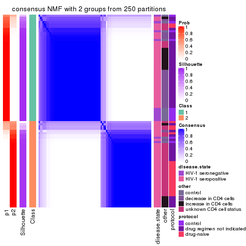</p>

</div>
<div id='tab-CV-NMF-consensus-heatmap-2'>
<pre><code class="r">consensus_heatmap(res, k = 3)
</code></pre>

<p>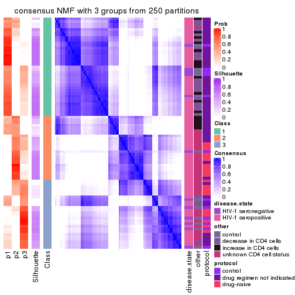</p>

</div>
<div id='tab-CV-NMF-consensus-heatmap-3'>
<pre><code class="r">consensus_heatmap(res, k = 4)
</code></pre>

<p>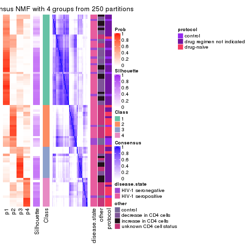</p>

</div>
<div id='tab-CV-NMF-consensus-heatmap-4'>
<pre><code class="r">consensus_heatmap(res, k = 5)
</code></pre>

<p>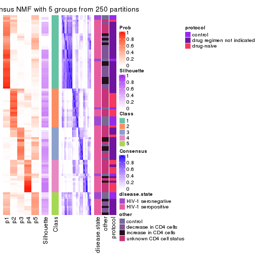</p>

</div>
<div id='tab-CV-NMF-consensus-heatmap-5'>
<pre><code class="r">consensus_heatmap(res, k = 6)
</code></pre>

<p>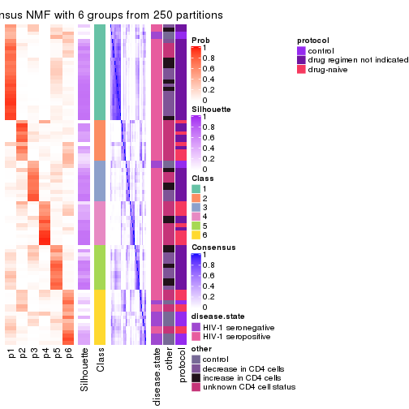</p>

</div>
</div>

Heatmaps for the membership of samples in all partitions to see how consistent they are:


<script>
$( function() {
	$( '#tabs-CV-NMF-membership-heatmap' ).tabs();
} );
</script>
<div id='tabs-CV-NMF-membership-heatmap'>
<ul>
<li><a href='#tab-CV-NMF-membership-heatmap-1'>k = 2</a></li>
<li><a href='#tab-CV-NMF-membership-heatmap-2'>k = 3</a></li>
<li><a href='#tab-CV-NMF-membership-heatmap-3'>k = 4</a></li>
<li><a href='#tab-CV-NMF-membership-heatmap-4'>k = 5</a></li>
<li><a href='#tab-CV-NMF-membership-heatmap-5'>k = 6</a></li>
</ul>
<div id='tab-CV-NMF-membership-heatmap-1'>
<pre><code class="r">membership_heatmap(res, k = 2)
</code></pre>

<p>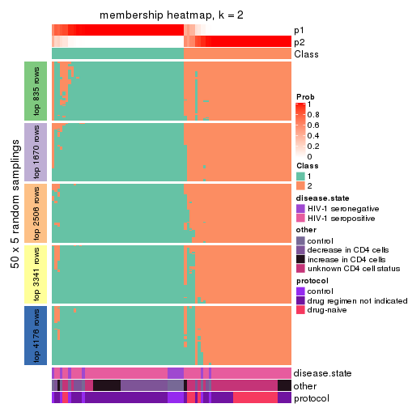</p>

</div>
<div id='tab-CV-NMF-membership-heatmap-2'>
<pre><code class="r">membership_heatmap(res, k = 3)
</code></pre>

<p>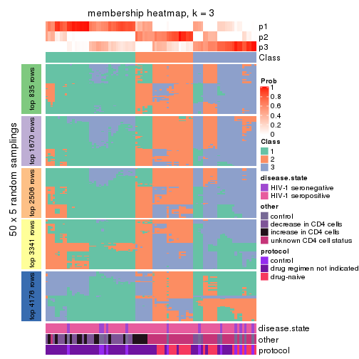</p>

</div>
<div id='tab-CV-NMF-membership-heatmap-3'>
<pre><code class="r">membership_heatmap(res, k = 4)
</code></pre>

<p>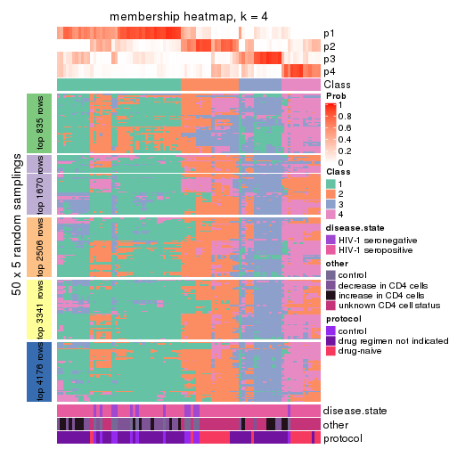</p>

</div>
<div id='tab-CV-NMF-membership-heatmap-4'>
<pre><code class="r">membership_heatmap(res, k = 5)
</code></pre>

<p>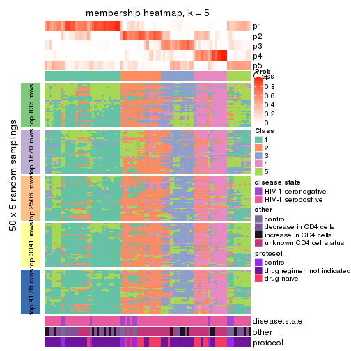</p>

</div>
<div id='tab-CV-NMF-membership-heatmap-5'>
<pre><code class="r">membership_heatmap(res, k = 6)
</code></pre>

<p>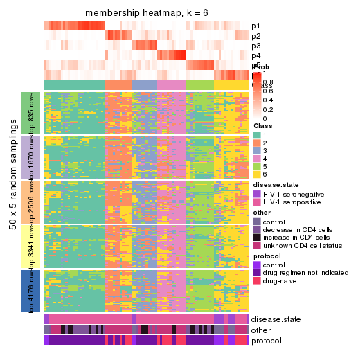</p>

</div>
</div>

As soon as we have had the classes for columns, we can look for signatures
which are significantly different between classes which can be candidate marks
for certain classes. Following are the heatmaps for signatures.


Signature heatmaps where rows are scaled:


<script>
$( function() {
	$( '#tabs-CV-NMF-get-signatures' ).tabs();
} );
</script>
<div id='tabs-CV-NMF-get-signatures'>
<ul>
<li><a href='#tab-CV-NMF-get-signatures-1'>k = 2</a></li>
<li><a href='#tab-CV-NMF-get-signatures-2'>k = 3</a></li>
<li><a href='#tab-CV-NMF-get-signatures-3'>k = 4</a></li>
<li><a href='#tab-CV-NMF-get-signatures-4'>k = 5</a></li>
<li><a href='#tab-CV-NMF-get-signatures-5'>k = 6</a></li>
</ul>
<div id='tab-CV-NMF-get-signatures-1'>
<pre><code class="r">get_signatures(res, k = 2)
</code></pre>

<p>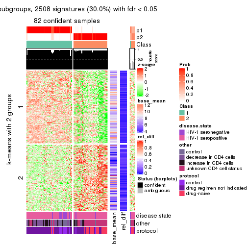</p>

</div>
<div id='tab-CV-NMF-get-signatures-2'>
<pre><code class="r">get_signatures(res, k = 3)
</code></pre>

<p>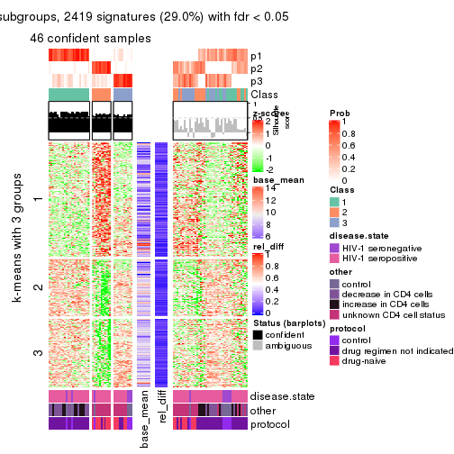</p>

</div>
<div id='tab-CV-NMF-get-signatures-3'>
<pre><code class="r">get_signatures(res, k = 4)
</code></pre>

<p>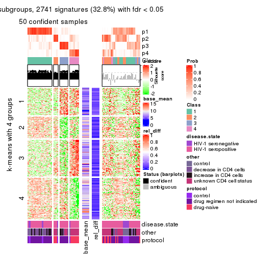</p>

</div>
<div id='tab-CV-NMF-get-signatures-4'>
<pre><code class="r">get_signatures(res, k = 5)
</code></pre>

<p>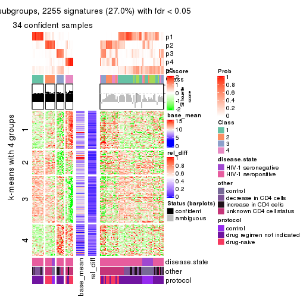</p>

</div>
<div id='tab-CV-NMF-get-signatures-5'>
<pre><code class="r">get_signatures(res, k = 6)
</code></pre>

<p>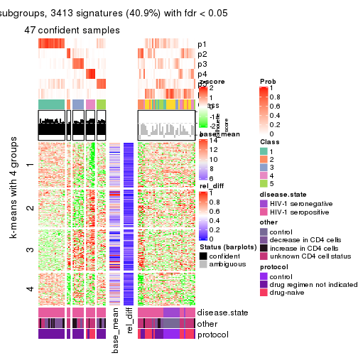</p>

</div>
</div>


Signature heatmaps where rows are not scaled:


<script>
$( function() {
	$( '#tabs-CV-NMF-get-signatures-no-scale' ).tabs();
} );
</script>
<div id='tabs-CV-NMF-get-signatures-no-scale'>
<ul>
<li><a href='#tab-CV-NMF-get-signatures-no-scale-1'>k = 2</a></li>
<li><a href='#tab-CV-NMF-get-signatures-no-scale-2'>k = 3</a></li>
<li><a href='#tab-CV-NMF-get-signatures-no-scale-3'>k = 4</a></li>
<li><a href='#tab-CV-NMF-get-signatures-no-scale-4'>k = 5</a></li>
<li><a href='#tab-CV-NMF-get-signatures-no-scale-5'>k = 6</a></li>
</ul>
<div id='tab-CV-NMF-get-signatures-no-scale-1'>
<pre><code class="r">get_signatures(res, k = 2, scale_rows = FALSE)
</code></pre>

<p>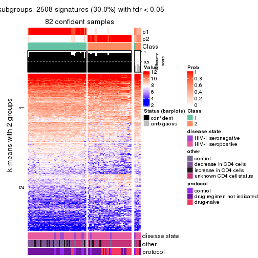</p>

</div>
<div id='tab-CV-NMF-get-signatures-no-scale-2'>
<pre><code class="r">get_signatures(res, k = 3, scale_rows = FALSE)
</code></pre>

<p>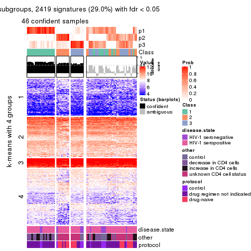</p>

</div>
<div id='tab-CV-NMF-get-signatures-no-scale-3'>
<pre><code class="r">get_signatures(res, k = 4, scale_rows = FALSE)
</code></pre>

<p>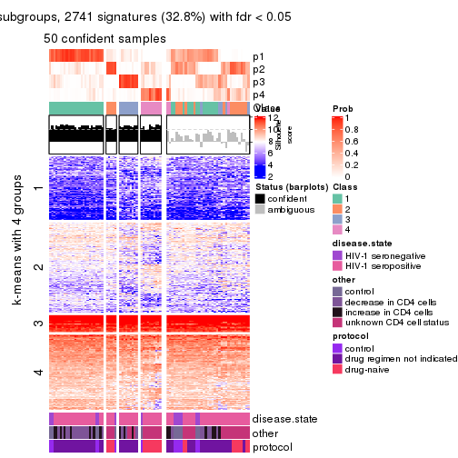</p>

</div>
<div id='tab-CV-NMF-get-signatures-no-scale-4'>
<pre><code class="r">get_signatures(res, k = 5, scale_rows = FALSE)
</code></pre>

<p>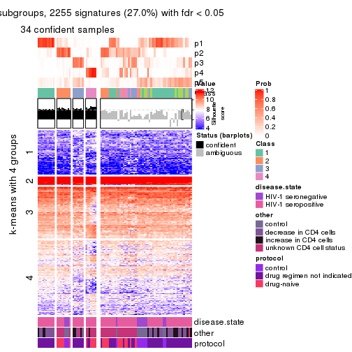</p>

</div>
<div id='tab-CV-NMF-get-signatures-no-scale-5'>
<pre><code class="r">get_signatures(res, k = 6, scale_rows = FALSE)
</code></pre>

<p>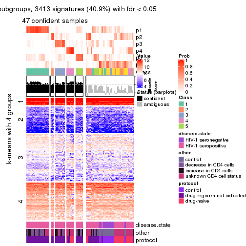</p>

</div>
</div>


Compare the overlap of signatures from different k:

```r
compare_signatures(res)
```

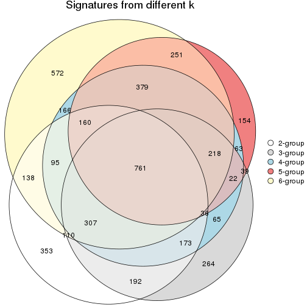

`get_signature()` returns a data frame invisibly. TO get the list of signatures, the function
call should be assigned to a variable explicitly. In following code, if `plot` argument is set
to `FALSE`, no heatmap is plotted while only the differential analysis is performed.

```r
# code only for demonstration
tb = get_signature(res, k = ..., plot = FALSE)
```

An example of the output of `tb` is:

```
#>   which_row         fdr    mean_1    mean_2 scaled_mean_1 scaled_mean_2 km
#> 1        38 0.042760348  8.373488  9.131774    -0.5533452     0.5164555  1
#> 2        40 0.018707592  7.106213  8.469186    -0.6173731     0.5762149  1
#> 3        55 0.019134737 10.221463 11.207825    -0.6159697     0.5749050  1
#> 4        59 0.006059896  5.921854  7.869574    -0.6899429     0.6439467  1
#> 5        60 0.018055526  8.928898 10.211722    -0.6204761     0.5791110  1
#> 6        98 0.009384629 15.714769 14.887706     0.6635654    -0.6193277  2
...
```

The columns in `tb` are:

1. `which_row`: row indices corresponding to the input matrix.
2. `fdr`: FDR for the differential test. 
3. `mean_x`: The mean value in group x.
4. `scaled_mean_x`: The mean value in group x after rows are scaled.
5. `km`: Row groups if k-means clustering is applied to rows.


UMAP plot which shows how samples are separated.


<script>
$( function() {
	$( '#tabs-CV-NMF-dimension-reduction' ).tabs();
} );
</script>
<div id='tabs-CV-NMF-dimension-reduction'>
<ul>
<li><a href='#tab-CV-NMF-dimension-reduction-1'>k = 2</a></li>
<li><a href='#tab-CV-NMF-dimension-reduction-2'>k = 3</a></li>
<li><a href='#tab-CV-NMF-dimension-reduction-3'>k = 4</a></li>
<li><a href='#tab-CV-NMF-dimension-reduction-4'>k = 5</a></li>
<li><a href='#tab-CV-NMF-dimension-reduction-5'>k = 6</a></li>
</ul>
<div id='tab-CV-NMF-dimension-reduction-1'>
<pre><code class="r">dimension_reduction(res, k = 2, method = &quot;UMAP&quot;)
</code></pre>

<p>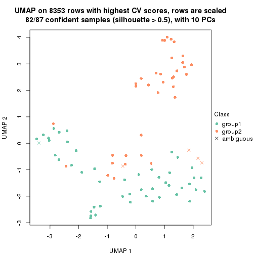</p>

</div>
<div id='tab-CV-NMF-dimension-reduction-2'>
<pre><code class="r">dimension_reduction(res, k = 3, method = &quot;UMAP&quot;)
</code></pre>

<p>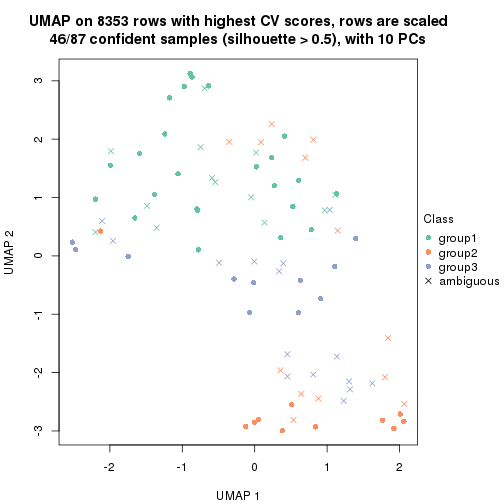</p>

</div>
<div id='tab-CV-NMF-dimension-reduction-3'>
<pre><code class="r">dimension_reduction(res, k = 4, method = &quot;UMAP&quot;)
</code></pre>

<p>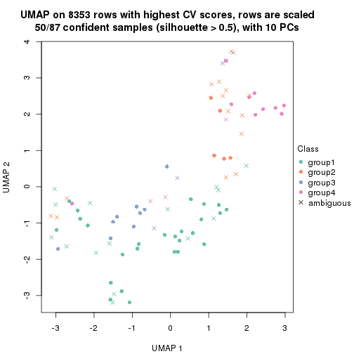</p>

</div>
<div id='tab-CV-NMF-dimension-reduction-4'>
<pre><code class="r">dimension_reduction(res, k = 5, method = &quot;UMAP&quot;)
</code></pre>

<p>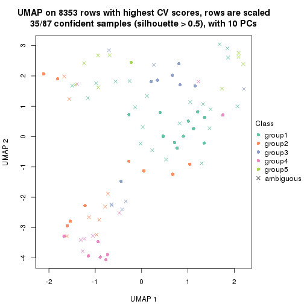</p>

</div>
<div id='tab-CV-NMF-dimension-reduction-5'>
<pre><code class="r">dimension_reduction(res, k = 6, method = &quot;UMAP&quot;)
</code></pre>

<p>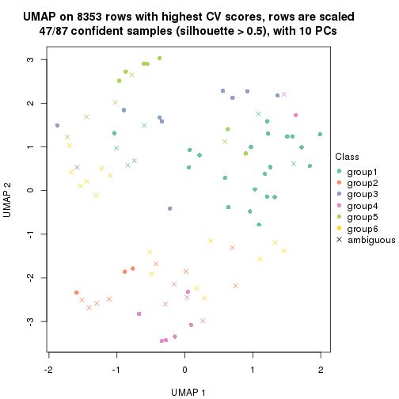</p>

</div>
</div>


Following heatmap shows how subgroups are split when increasing `k`:

```r
collect_classes(res)
```

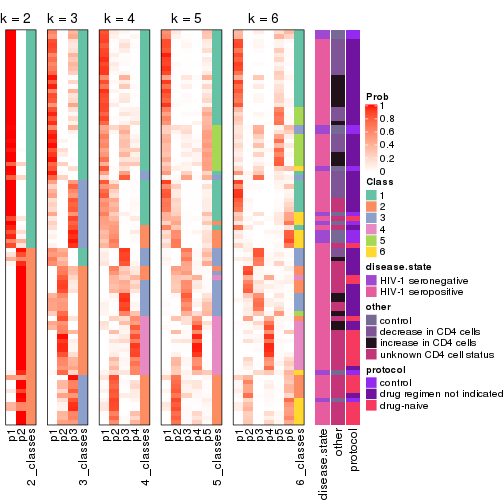


Test correlation between subgroups and known annotations. If the known
annotation is numeric, one-way ANOVA test is applied, and if the known
annotation is discrete, chi-squared contingency table test is applied.

```r
test_to_known_factors(res)
```

```
#>         n disease.state(p) other(p) protocol(p) k
#> CV:NMF 82           0.1504 2.11e-07    1.17e-05 2
#> CV:NMF 46           0.2746 1.45e-07    1.77e-05 3
#> CV:NMF 50           0.6041 2.73e-05    3.51e-08 4
#> CV:NMF 35           0.0502 1.84e-04    5.27e-05 5
#> CV:NMF 47               NA 8.00e-03    1.94e-06 6
```


If matrix rows can be associated to genes, consider to use `GO_Enrichment(res,
...)` to perform function enrichment for the signature genes.


 

---------------------------------------------------


### MAD:hclust


The object with results only for a single top-value method and a single partition method 
can be extracted as:

```r
res = res_list["MAD", "hclust"]
# you can also extract it by
# res = res_list["MAD:hclust"]
```

A summary of `res` and all the functions that can be applied to it:

```r
res
```

```
#> A 'ConsensusPartition' object with k = 2, 3, 4, 5, 6.
#>   On a matrix with 8353 rows and 87 columns.
#>   Top rows (835, 1670, 2506, 3341, 4176) are extracted by 'MAD' method.
#>   Subgroups are detected by 'hclust' method.
#>   Performed in total 1250 partitions by row resampling.
#>   Best k for subgroups seems to be 2.
#> 
#> Following methods can be applied to this 'ConsensusPartition' object:
#>  [1] "cola_report"             "collect_classes"         "collect_plots"          
#>  [4] "collect_stats"           "colnames"                "compare_signatures"     
#>  [7] "consensus_heatmap"       "dimension_reduction"     "functional_enrichment"  
#> [10] "get_anno_col"            "get_anno"                "get_classes"            
#> [13] "get_consensus"           "get_matrix"              "get_membership"         
#> [16] "get_param"               "get_signatures"          "get_stats"              
#> [19] "is_best_k"               "is_stable_k"             "membership_heatmap"     
#> [22] "ncol"                    "nrow"                    "plot_ecdf"              
#> [25] "rownames"                "select_partition_number" "show"                   
#> [28] "suggest_best_k"          "test_to_known_factors"
```

`collect_plots()` function collects all the plots made from `res` for all `k` (number of partitions)
into one single page to provide an easy and fast comparison between different `k`.

```r
collect_plots(res)
```

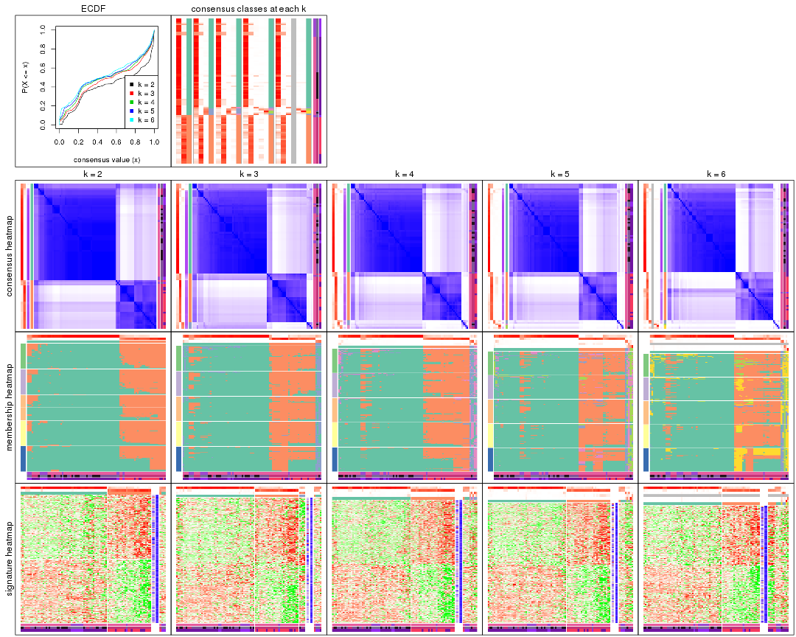

The plots are:

- The first row: a plot of the ECDF (Empirical cumulative distribution
  function) curves of the consensus matrix for each `k` and the heatmap of
  predicted classes for each `k`.
- The second row: heatmaps of the consensus matrix for each `k`.
- The third row: heatmaps of the membership matrix for each `k`.
- The fouth row: heatmaps of the signatures for each `k`.

All the plots in panels can be made by individual functions and they are
plotted later in this section.

`select_partition_number()` produces several plots showing different
statistics for choosing "optimized" `k`. There are following statistics:

- ECDF curves of the consensus matrix for each `k`;
- 1-PAC. [The PAC
  score](https://en.wikipedia.org/wiki/Consensus_clustering#Over-interpretation_potential_of_consensus_clustering)
  measures the proportion of the ambiguous subgrouping.
- Mean silhouette score.
- Concordance. The mean probability of fiting the consensus class ids in all
  partitions.
- Area increased. Denote $A_k$ as the area under the ECDF curve for current
  `k`, the area increased is defined as $A_k - A_{k-1}$.
- Rand index. The percent of pairs of samples that are both in a same cluster
  or both are not in a same cluster in the partition of k and k-1.
- Jaccard index. The ratio of pairs of samples are both in a same cluster in
  the partition of k and k-1 and the pairs of samples are both in a same
  cluster in the partition k or k-1.

The detailed explanations of these statistics can be found in [the cola
vignette](http://bioconductor.org/packages/devel/bioc/vignettes/cola/inst/doc/cola.html#toc_13).

Generally speaking, lower PAC score, higher mean silhouette score or higher
concordance corresponds to better partition. Rand index and Jaccard index
measure how similar the current partition is compared to partition with `k-1`.
If they are too similar, we won't accept `k` is better than `k-1`.

```r
select_partition_number(res)
```

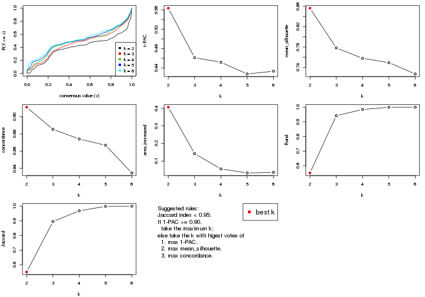

The numeric values for all these statistics can be obtained by `get_stats()`.

```r
get_stats(res)
```

```
#>   k 1-PAC mean_silhouette concordance area_increased  Rand Jaccard
#> 2 2 0.563           0.856       0.911         0.4057 0.550   0.550
#> 3 3 0.461           0.778       0.885         0.1423 0.942   0.895
#> 4 4 0.452           0.758       0.874         0.0554 0.985   0.969
#> 5 5 0.428           0.749       0.867         0.0325 0.999   0.999
#> 6 6 0.433           0.727       0.835         0.0363 1.000   1.000
```

`suggest_best_k()` suggests the best $k$ based on these statistics. The rules are as follows:

- All $k$ with Jaccard index larger than 0.95 are removed because the increase of
  the partition number does not provides enough extra information. If all $k$ are removed,
  the best $k$ is assigned by `NA`.
- For $k$ with 1-PAC larger than 0.9, the maximal $k$ is taken as the "best k". Other $k$ is called "optional k".
- If it does not fit the second rule. The $k$ with the highest vote of highest
  1-PAC, mean silhouette and concordance is taken as the "best k".

```r
suggest_best_k(res)
```

```
#> [1] 2
```


Following shows the table of the partitions (You need to click the **show/hide
code output** link to see it). The membership matrix (columns with name `p*`)
is inferred by
[`clue::cl_consensus()`](https://www.rdocumentation.org/link/cl_consensus?package=clue)
function with the `SE` method. Basically the value in the membership matrix
represents the probability to belong to a certain group. The finall class
label for an item is determined with the group with highest probability it
belongs to.

In `get_classes()` function, the entropy is calculated from the membership
matrix and the silhouette score is calculated from the consensus matrix.


<script>
$( function() {
	$( '#tabs-MAD-hclust-get-classes' ).tabs();
} );
</script>
<div id='tabs-MAD-hclust-get-classes'>
<ul>
<li><a href='#tab-MAD-hclust-get-classes-1'>k = 2</a></li>
<li><a href='#tab-MAD-hclust-get-classes-2'>k = 3</a></li>
<li><a href='#tab-MAD-hclust-get-classes-3'>k = 4</a></li>
<li><a href='#tab-MAD-hclust-get-classes-4'>k = 5</a></li>
<li><a href='#tab-MAD-hclust-get-classes-5'>k = 6</a></li>
</ul>

<div id='tab-MAD-hclust-get-classes-1'>
<p><a id='tab-MAD-hclust-get-classes-1-a' style='color:#0366d6' href='#'>show/hide code output</a></p>
<pre><code class="r">cbind(get_classes(res, k = 2), get_membership(res, k = 2))
</code></pre>

<pre><code>#&gt;          class entropy silhouette    p1    p2
#&gt; GSM39104     1  0.0938    0.93789 0.988 0.012
#&gt; GSM39105     1  0.0000    0.94194 1.000 0.000
#&gt; GSM39106     1  0.4161    0.87110 0.916 0.084
#&gt; GSM39107     1  0.9833   -0.00291 0.576 0.424
#&gt; GSM39108     1  0.2236    0.92054 0.964 0.036
#&gt; GSM39109     1  0.2948    0.90659 0.948 0.052
#&gt; GSM39110     1  0.2603    0.91393 0.956 0.044
#&gt; GSM39111     1  0.2043    0.92394 0.968 0.032
#&gt; GSM39112     1  0.9732    0.08844 0.596 0.404
#&gt; GSM39113     1  0.9833   -0.00291 0.576 0.424
#&gt; GSM39114     2  0.9358    0.68547 0.352 0.648
#&gt; GSM39115     1  0.0000    0.94194 1.000 0.000
#&gt; GSM39148     1  0.0376    0.94173 0.996 0.004
#&gt; GSM39149     1  0.2043    0.91830 0.968 0.032
#&gt; GSM39150     1  0.0376    0.94161 0.996 0.004
#&gt; GSM39151     1  0.2043    0.91830 0.968 0.032
#&gt; GSM39152     1  0.0000    0.94194 1.000 0.000
#&gt; GSM39153     1  0.0000    0.94194 1.000 0.000
#&gt; GSM39154     1  0.0000    0.94194 1.000 0.000
#&gt; GSM39155     1  0.0000    0.94194 1.000 0.000
#&gt; GSM39156     1  0.1843    0.92705 0.972 0.028
#&gt; GSM39157     1  0.0000    0.94194 1.000 0.000
#&gt; GSM39158     1  0.0376    0.94173 0.996 0.004
#&gt; GSM39159     1  0.0376    0.94173 0.996 0.004
#&gt; GSM39160     1  0.0376    0.94161 0.996 0.004
#&gt; GSM39161     1  0.0672    0.94052 0.992 0.008
#&gt; GSM39162     1  0.0376    0.94173 0.996 0.004
#&gt; GSM39163     1  0.0000    0.94194 1.000 0.000
#&gt; GSM39164     1  0.0000    0.94194 1.000 0.000
#&gt; GSM39165     1  0.0000    0.94194 1.000 0.000
#&gt; GSM39166     1  0.0376    0.94173 0.996 0.004
#&gt; GSM39167     1  0.0000    0.94194 1.000 0.000
#&gt; GSM39168     1  0.0376    0.94173 0.996 0.004
#&gt; GSM39169     1  0.0000    0.94194 1.000 0.000
#&gt; GSM39170     1  0.0376    0.94173 0.996 0.004
#&gt; GSM39171     1  0.0376    0.94161 0.996 0.004
#&gt; GSM39172     1  0.1843    0.92806 0.972 0.028
#&gt; GSM39173     1  0.1633    0.93400 0.976 0.024
#&gt; GSM39174     1  0.0000    0.94194 1.000 0.000
#&gt; GSM39175     1  0.0000    0.94194 1.000 0.000
#&gt; GSM39176     1  0.0000    0.94194 1.000 0.000
#&gt; GSM39177     1  0.0376    0.94031 0.996 0.004
#&gt; GSM39178     1  0.0376    0.94161 0.996 0.004
#&gt; GSM39179     1  0.2043    0.91830 0.968 0.032
#&gt; GSM39180     1  0.1633    0.93433 0.976 0.024
#&gt; GSM39181     1  0.0376    0.94173 0.996 0.004
#&gt; GSM39182     1  0.4298    0.87114 0.912 0.088
#&gt; GSM39183     1  0.0376    0.94173 0.996 0.004
#&gt; GSM39184     1  0.0000    0.94194 1.000 0.000
#&gt; GSM39185     1  0.0672    0.94052 0.992 0.008
#&gt; GSM39186     1  0.0000    0.94194 1.000 0.000
#&gt; GSM39187     1  0.0672    0.94055 0.992 0.008
#&gt; GSM39116     2  0.6801    0.87458 0.180 0.820
#&gt; GSM39117     2  0.4161    0.84773 0.084 0.916
#&gt; GSM39118     2  0.6343    0.87309 0.160 0.840
#&gt; GSM39119     2  0.3431    0.84495 0.064 0.936
#&gt; GSM39120     2  0.9977    0.38893 0.472 0.528
#&gt; GSM39121     2  0.8144    0.83435 0.252 0.748
#&gt; GSM39122     2  0.7950    0.84628 0.240 0.760
#&gt; GSM39123     2  0.4161    0.84773 0.084 0.916
#&gt; GSM39124     2  0.7815    0.85302 0.232 0.768
#&gt; GSM39125     2  0.9710    0.58592 0.400 0.600
#&gt; GSM39126     2  0.8608    0.79515 0.284 0.716
#&gt; GSM39127     2  0.7219    0.87141 0.200 0.800
#&gt; GSM39128     2  0.7950    0.84715 0.240 0.760
#&gt; GSM39129     2  0.2043    0.82960 0.032 0.968
#&gt; GSM39130     2  0.4161    0.84773 0.084 0.916
#&gt; GSM39131     2  0.7453    0.86658 0.212 0.788
#&gt; GSM39132     2  0.7299    0.86974 0.204 0.796
#&gt; GSM39133     2  0.3879    0.84700 0.076 0.924
#&gt; GSM39134     2  0.2603    0.83709 0.044 0.956
#&gt; GSM39135     2  0.6887    0.87424 0.184 0.816
#&gt; GSM39136     2  0.6531    0.87468 0.168 0.832
#&gt; GSM39137     2  0.7745    0.85603 0.228 0.772
#&gt; GSM39138     2  0.2043    0.82960 0.032 0.968
#&gt; GSM39139     2  0.2043    0.82960 0.032 0.968
#&gt; GSM39140     1  0.7602    0.65085 0.780 0.220
#&gt; GSM39141     1  0.5946    0.78368 0.856 0.144
#&gt; GSM39142     1  0.6048    0.77714 0.852 0.148
#&gt; GSM39143     1  0.6048    0.77714 0.852 0.148
#&gt; GSM39144     2  0.2043    0.82960 0.032 0.968
#&gt; GSM39145     2  0.5842    0.87127 0.140 0.860
#&gt; GSM39146     2  0.7299    0.87073 0.204 0.796
#&gt; GSM39147     2  0.7453    0.86625 0.212 0.788
#&gt; GSM39188     1  0.1843    0.92192 0.972 0.028
#&gt; GSM39189     1  0.0672    0.94082 0.992 0.008
#&gt; GSM39190     1  0.2423    0.91895 0.960 0.040
</code></pre>

<script>
$('#tab-MAD-hclust-get-classes-1-a').parent().next().next().hide();
$('#tab-MAD-hclust-get-classes-1-a').click(function(){
  $('#tab-MAD-hclust-get-classes-1-a').parent().next().next().toggle();
  return(false);
});
</script>
</div>

<div id='tab-MAD-hclust-get-classes-2'>
<p><a id='tab-MAD-hclust-get-classes-2-a' style='color:#0366d6' href='#'>show/hide code output</a></p>
<pre><code class="r">cbind(get_classes(res, k = 3), get_membership(res, k = 3))
</code></pre>

<pre><code>#&gt;          class entropy silhouette    p1    p2    p3
#&gt; GSM39104     1  0.1337     0.8782 0.972 0.012 0.016
#&gt; GSM39105     1  0.0592     0.8840 0.988 0.000 0.012
#&gt; GSM39106     1  0.3207     0.8010 0.904 0.084 0.012
#&gt; GSM39107     1  0.6215     0.0252 0.572 0.428 0.000
#&gt; GSM39108     1  0.2297     0.8543 0.944 0.036 0.020
#&gt; GSM39109     1  0.3009     0.8344 0.920 0.052 0.028
#&gt; GSM39110     1  0.2918     0.8380 0.924 0.044 0.032
#&gt; GSM39111     1  0.2176     0.8586 0.948 0.032 0.020
#&gt; GSM39112     1  0.6154     0.1137 0.592 0.408 0.000
#&gt; GSM39113     1  0.6215     0.0252 0.572 0.428 0.000
#&gt; GSM39114     2  0.5859     0.6184 0.344 0.656 0.000
#&gt; GSM39115     1  0.0592     0.8847 0.988 0.000 0.012
#&gt; GSM39148     1  0.0237     0.8851 0.996 0.004 0.000
#&gt; GSM39149     3  0.6215     0.7057 0.428 0.000 0.572
#&gt; GSM39150     1  0.0983     0.8835 0.980 0.004 0.016
#&gt; GSM39151     3  0.5591     0.8181 0.304 0.000 0.696
#&gt; GSM39152     1  0.1031     0.8831 0.976 0.000 0.024
#&gt; GSM39153     1  0.0000     0.8844 1.000 0.000 0.000
#&gt; GSM39154     1  0.0237     0.8841 0.996 0.000 0.004
#&gt; GSM39155     1  0.0000     0.8844 1.000 0.000 0.000
#&gt; GSM39156     1  0.1399     0.8701 0.968 0.028 0.004
#&gt; GSM39157     1  0.0000     0.8844 1.000 0.000 0.000
#&gt; GSM39158     1  0.0892     0.8819 0.980 0.000 0.020
#&gt; GSM39159     1  0.1031     0.8792 0.976 0.000 0.024
#&gt; GSM39160     1  0.0983     0.8835 0.980 0.004 0.016
#&gt; GSM39161     1  0.1163     0.8766 0.972 0.000 0.028
#&gt; GSM39162     1  0.0237     0.8851 0.996 0.004 0.000
#&gt; GSM39163     1  0.0000     0.8844 1.000 0.000 0.000
#&gt; GSM39164     1  0.0424     0.8837 0.992 0.000 0.008
#&gt; GSM39165     1  0.0424     0.8851 0.992 0.000 0.008
#&gt; GSM39166     1  0.0892     0.8819 0.980 0.000 0.020
#&gt; GSM39167     1  0.0000     0.8844 1.000 0.000 0.000
#&gt; GSM39168     1  0.0237     0.8851 0.996 0.004 0.000
#&gt; GSM39169     1  0.0000     0.8844 1.000 0.000 0.000
#&gt; GSM39170     1  0.0892     0.8819 0.980 0.000 0.020
#&gt; GSM39171     1  0.0237     0.8852 0.996 0.004 0.000
#&gt; GSM39172     1  0.2434     0.8545 0.940 0.024 0.036
#&gt; GSM39173     1  0.3845     0.7583 0.872 0.012 0.116
#&gt; GSM39174     1  0.0000     0.8844 1.000 0.000 0.000
#&gt; GSM39175     1  0.0424     0.8841 0.992 0.000 0.008
#&gt; GSM39176     1  0.0000     0.8844 1.000 0.000 0.000
#&gt; GSM39177     1  0.3551     0.7284 0.868 0.000 0.132
#&gt; GSM39178     1  0.0983     0.8844 0.980 0.004 0.016
#&gt; GSM39179     3  0.5733     0.8156 0.324 0.000 0.676
#&gt; GSM39180     1  0.3532     0.7803 0.884 0.008 0.108
#&gt; GSM39181     1  0.0892     0.8819 0.980 0.000 0.020
#&gt; GSM39182     1  0.3765     0.7837 0.888 0.084 0.028
#&gt; GSM39183     1  0.0892     0.8819 0.980 0.000 0.020
#&gt; GSM39184     1  0.0000     0.8844 1.000 0.000 0.000
#&gt; GSM39185     1  0.1163     0.8766 0.972 0.000 0.028
#&gt; GSM39186     1  0.0237     0.8841 0.996 0.000 0.004
#&gt; GSM39187     1  0.0424     0.8848 0.992 0.008 0.000
#&gt; GSM39116     2  0.4235     0.8258 0.176 0.824 0.000
#&gt; GSM39117     2  0.2902     0.7683 0.064 0.920 0.016
#&gt; GSM39118     2  0.4228     0.8186 0.148 0.844 0.008
#&gt; GSM39119     2  0.2527     0.7634 0.044 0.936 0.020
#&gt; GSM39120     2  0.6295     0.3411 0.472 0.528 0.000
#&gt; GSM39121     2  0.5138     0.7751 0.252 0.748 0.000
#&gt; GSM39122     2  0.4931     0.7965 0.232 0.768 0.000
#&gt; GSM39123     2  0.2902     0.7683 0.064 0.920 0.016
#&gt; GSM39124     2  0.4842     0.8041 0.224 0.776 0.000
#&gt; GSM39125     2  0.6126     0.5095 0.400 0.600 0.000
#&gt; GSM39126     2  0.5431     0.7293 0.284 0.716 0.000
#&gt; GSM39127     2  0.4452     0.8236 0.192 0.808 0.000
#&gt; GSM39128     2  0.4931     0.7971 0.232 0.768 0.000
#&gt; GSM39129     2  0.0592     0.7221 0.000 0.988 0.012
#&gt; GSM39130     2  0.2902     0.7683 0.064 0.920 0.016
#&gt; GSM39131     2  0.4605     0.8187 0.204 0.796 0.000
#&gt; GSM39132     2  0.4504     0.8219 0.196 0.804 0.000
#&gt; GSM39133     2  0.2651     0.7692 0.060 0.928 0.012
#&gt; GSM39134     2  0.1289     0.7585 0.032 0.968 0.000
#&gt; GSM39135     2  0.4235     0.8255 0.176 0.824 0.000
#&gt; GSM39136     2  0.4062     0.8244 0.164 0.836 0.000
#&gt; GSM39137     2  0.4796     0.8073 0.220 0.780 0.000
#&gt; GSM39138     2  0.0424     0.7234 0.000 0.992 0.008
#&gt; GSM39139     2  0.0424     0.7234 0.000 0.992 0.008
#&gt; GSM39140     1  0.4796     0.5528 0.780 0.220 0.000
#&gt; GSM39141     1  0.3752     0.7024 0.856 0.144 0.000
#&gt; GSM39142     1  0.3816     0.6951 0.852 0.148 0.000
#&gt; GSM39143     1  0.3816     0.6951 0.852 0.148 0.000
#&gt; GSM39144     2  0.0592     0.7231 0.000 0.988 0.012
#&gt; GSM39145     2  0.3551     0.8166 0.132 0.868 0.000
#&gt; GSM39146     2  0.4555     0.8210 0.200 0.800 0.000
#&gt; GSM39147     2  0.4605     0.8184 0.204 0.796 0.000
#&gt; GSM39188     3  0.6126     0.7703 0.400 0.000 0.600
#&gt; GSM39189     1  0.1411     0.8724 0.964 0.000 0.036
#&gt; GSM39190     1  0.5859     0.0387 0.656 0.000 0.344
</code></pre>

<script>
$('#tab-MAD-hclust-get-classes-2-a').parent().next().next().hide();
$('#tab-MAD-hclust-get-classes-2-a').click(function(){
  $('#tab-MAD-hclust-get-classes-2-a').parent().next().next().toggle();
  return(false);
});
</script>
</div>

<div id='tab-MAD-hclust-get-classes-3'>
<p><a id='tab-MAD-hclust-get-classes-3-a' style='color:#0366d6' href='#'>show/hide code output</a></p>
<pre><code class="r">cbind(get_classes(res, k = 4), get_membership(res, k = 4))
</code></pre>

<pre><code>#&gt;          class entropy silhouette    p1    p2    p3    p4
#&gt; GSM39104     1  0.1139     0.8938 0.972 0.012 0.008 0.008
#&gt; GSM39105     1  0.0672     0.8979 0.984 0.000 0.008 0.008
#&gt; GSM39106     1  0.2803     0.8276 0.900 0.080 0.008 0.012
#&gt; GSM39107     1  0.5220     0.0341 0.568 0.424 0.000 0.008
#&gt; GSM39108     1  0.2019     0.8718 0.940 0.032 0.004 0.024
#&gt; GSM39109     1  0.2825     0.8497 0.908 0.048 0.008 0.036
#&gt; GSM39110     1  0.2686     0.8552 0.916 0.040 0.012 0.032
#&gt; GSM39111     1  0.1920     0.8754 0.944 0.028 0.004 0.024
#&gt; GSM39112     1  0.5172     0.1208 0.588 0.404 0.000 0.008
#&gt; GSM39113     1  0.5220     0.0341 0.568 0.424 0.000 0.008
#&gt; GSM39114     2  0.4936     0.6264 0.340 0.652 0.000 0.008
#&gt; GSM39115     1  0.0657     0.8988 0.984 0.000 0.004 0.012
#&gt; GSM39148     1  0.0188     0.8995 0.996 0.004 0.000 0.000
#&gt; GSM39149     4  0.7258    -0.2501 0.164 0.000 0.328 0.508
#&gt; GSM39150     1  0.0859     0.8982 0.980 0.004 0.008 0.008
#&gt; GSM39151     3  0.3523     0.5540 0.112 0.000 0.856 0.032
#&gt; GSM39152     1  0.1059     0.8966 0.972 0.000 0.012 0.016
#&gt; GSM39153     1  0.0000     0.8987 1.000 0.000 0.000 0.000
#&gt; GSM39154     1  0.0188     0.8986 0.996 0.000 0.000 0.004
#&gt; GSM39155     1  0.0000     0.8987 1.000 0.000 0.000 0.000
#&gt; GSM39156     1  0.1256     0.8852 0.964 0.028 0.000 0.008
#&gt; GSM39157     1  0.0000     0.8987 1.000 0.000 0.000 0.000
#&gt; GSM39158     1  0.0804     0.8965 0.980 0.000 0.008 0.012
#&gt; GSM39159     1  0.0895     0.8943 0.976 0.000 0.004 0.020
#&gt; GSM39160     1  0.0859     0.8982 0.980 0.004 0.008 0.008
#&gt; GSM39161     1  0.1109     0.8899 0.968 0.000 0.004 0.028
#&gt; GSM39162     1  0.0188     0.8995 0.996 0.004 0.000 0.000
#&gt; GSM39163     1  0.0000     0.8987 1.000 0.000 0.000 0.000
#&gt; GSM39164     1  0.0376     0.8983 0.992 0.000 0.004 0.004
#&gt; GSM39165     1  0.0336     0.8995 0.992 0.000 0.008 0.000
#&gt; GSM39166     1  0.0804     0.8965 0.980 0.000 0.008 0.012
#&gt; GSM39167     1  0.0000     0.8987 1.000 0.000 0.000 0.000
#&gt; GSM39168     1  0.0188     0.8995 0.996 0.004 0.000 0.000
#&gt; GSM39169     1  0.0000     0.8987 1.000 0.000 0.000 0.000
#&gt; GSM39170     1  0.0804     0.8965 0.980 0.000 0.008 0.012
#&gt; GSM39171     1  0.0188     0.8994 0.996 0.004 0.000 0.000
#&gt; GSM39172     1  0.2207     0.8661 0.932 0.024 0.004 0.040
#&gt; GSM39173     1  0.5011     0.5490 0.748 0.004 0.040 0.208
#&gt; GSM39174     1  0.0000     0.8987 1.000 0.000 0.000 0.000
#&gt; GSM39175     1  0.0376     0.8985 0.992 0.000 0.004 0.004
#&gt; GSM39176     1  0.0000     0.8987 1.000 0.000 0.000 0.000
#&gt; GSM39177     1  0.3812     0.7172 0.832 0.000 0.140 0.028
#&gt; GSM39178     1  0.0859     0.8988 0.980 0.004 0.008 0.008
#&gt; GSM39179     3  0.5256     0.3581 0.204 0.000 0.732 0.064
#&gt; GSM39180     1  0.4260     0.6545 0.792 0.008 0.012 0.188
#&gt; GSM39181     1  0.0804     0.8965 0.980 0.000 0.008 0.012
#&gt; GSM39182     1  0.3342     0.8084 0.880 0.080 0.008 0.032
#&gt; GSM39183     1  0.0804     0.8965 0.980 0.000 0.008 0.012
#&gt; GSM39184     1  0.0000     0.8987 1.000 0.000 0.000 0.000
#&gt; GSM39185     1  0.1109     0.8899 0.968 0.000 0.004 0.028
#&gt; GSM39186     1  0.0188     0.8986 0.996 0.000 0.000 0.004
#&gt; GSM39187     1  0.0336     0.8995 0.992 0.008 0.000 0.000
#&gt; GSM39116     2  0.3681     0.8160 0.176 0.816 0.000 0.008
#&gt; GSM39117     2  0.3009     0.7381 0.056 0.892 0.000 0.052
#&gt; GSM39118     2  0.3547     0.8058 0.144 0.840 0.000 0.016
#&gt; GSM39119     2  0.2505     0.7379 0.040 0.920 0.004 0.036
#&gt; GSM39120     2  0.5285     0.3545 0.468 0.524 0.000 0.008
#&gt; GSM39121     2  0.4252     0.7689 0.252 0.744 0.000 0.004
#&gt; GSM39122     2  0.4088     0.7890 0.232 0.764 0.000 0.004
#&gt; GSM39123     2  0.3009     0.7381 0.056 0.892 0.000 0.052
#&gt; GSM39124     2  0.4018     0.7962 0.224 0.772 0.000 0.004
#&gt; GSM39125     2  0.5150     0.5324 0.396 0.596 0.000 0.008
#&gt; GSM39126     2  0.4594     0.7298 0.280 0.712 0.000 0.008
#&gt; GSM39127     2  0.3710     0.8148 0.192 0.804 0.000 0.004
#&gt; GSM39128     2  0.3907     0.7916 0.232 0.768 0.000 0.000
#&gt; GSM39129     2  0.1722     0.6726 0.000 0.944 0.008 0.048
#&gt; GSM39130     2  0.3009     0.7381 0.056 0.892 0.000 0.052
#&gt; GSM39131     2  0.3831     0.8095 0.204 0.792 0.000 0.004
#&gt; GSM39132     2  0.3569     0.8130 0.196 0.804 0.000 0.000
#&gt; GSM39133     2  0.2844     0.7387 0.052 0.900 0.000 0.048
#&gt; GSM39134     2  0.1833     0.7293 0.032 0.944 0.000 0.024
#&gt; GSM39135     2  0.3356     0.8156 0.176 0.824 0.000 0.000
#&gt; GSM39136     2  0.3402     0.8134 0.164 0.832 0.000 0.004
#&gt; GSM39137     2  0.3982     0.7992 0.220 0.776 0.000 0.004
#&gt; GSM39138     2  0.1576     0.6738 0.000 0.948 0.004 0.048
#&gt; GSM39139     2  0.1661     0.6728 0.000 0.944 0.004 0.052
#&gt; GSM39140     1  0.4086     0.6170 0.776 0.216 0.000 0.008
#&gt; GSM39141     1  0.3249     0.7448 0.852 0.140 0.000 0.008
#&gt; GSM39142     1  0.3300     0.7391 0.848 0.144 0.000 0.008
#&gt; GSM39143     1  0.3300     0.7391 0.848 0.144 0.000 0.008
#&gt; GSM39144     2  0.1661     0.6746 0.000 0.944 0.004 0.052
#&gt; GSM39145     2  0.3606     0.8029 0.132 0.844 0.000 0.024
#&gt; GSM39146     2  0.3791     0.8119 0.200 0.796 0.000 0.004
#&gt; GSM39147     2  0.3831     0.8091 0.204 0.792 0.000 0.004
#&gt; GSM39188     3  0.6738     0.3957 0.104 0.000 0.544 0.352
#&gt; GSM39189     1  0.1610     0.8793 0.952 0.000 0.016 0.032
#&gt; GSM39190     4  0.5339     0.2693 0.356 0.000 0.020 0.624
</code></pre>

<script>
$('#tab-MAD-hclust-get-classes-3-a').parent().next().next().hide();
$('#tab-MAD-hclust-get-classes-3-a').click(function(){
  $('#tab-MAD-hclust-get-classes-3-a').parent().next().next().toggle();
  return(false);
});
</script>
</div>

<div id='tab-MAD-hclust-get-classes-4'>
<p><a id='tab-MAD-hclust-get-classes-4-a' style='color:#0366d6' href='#'>show/hide code output</a></p>
<pre><code class="r">cbind(get_classes(res, k = 5), get_membership(res, k = 5))
</code></pre>

<pre><code>#&gt;          class entropy silhouette    p1    p2    p3    p4    p5
#&gt; GSM39104     1  0.0981     0.9060 0.972 0.012 0.008 0.000 0.008
#&gt; GSM39105     1  0.0566     0.9092 0.984 0.000 0.012 0.000 0.004
#&gt; GSM39106     1  0.2349     0.8518 0.900 0.084 0.012 0.000 0.004
#&gt; GSM39107     1  0.4397     0.0401 0.564 0.432 0.004 0.000 0.000
#&gt; GSM39108     1  0.1728     0.8881 0.940 0.036 0.020 0.000 0.004
#&gt; GSM39109     1  0.2624     0.8682 0.904 0.052 0.028 0.008 0.008
#&gt; GSM39110     1  0.2305     0.8745 0.916 0.044 0.028 0.000 0.012
#&gt; GSM39111     1  0.1646     0.8910 0.944 0.032 0.020 0.000 0.004
#&gt; GSM39112     1  0.4359     0.1247 0.584 0.412 0.004 0.000 0.000
#&gt; GSM39113     1  0.4397     0.0401 0.564 0.432 0.004 0.000 0.000
#&gt; GSM39114     2  0.4118     0.6320 0.336 0.660 0.004 0.000 0.000
#&gt; GSM39115     1  0.0510     0.9099 0.984 0.000 0.016 0.000 0.000
#&gt; GSM39148     1  0.0162     0.9103 0.996 0.004 0.000 0.000 0.000
#&gt; GSM39149     3  0.5482     0.0604 0.084 0.000 0.692 0.028 0.196
#&gt; GSM39150     1  0.0740     0.9094 0.980 0.004 0.008 0.000 0.008
#&gt; GSM39151     5  0.1205     0.0330 0.040 0.000 0.004 0.000 0.956
#&gt; GSM39152     1  0.1209     0.9054 0.964 0.000 0.012 0.012 0.012
#&gt; GSM39153     1  0.0000     0.9096 1.000 0.000 0.000 0.000 0.000
#&gt; GSM39154     1  0.0162     0.9095 0.996 0.000 0.004 0.000 0.000
#&gt; GSM39155     1  0.0000     0.9096 1.000 0.000 0.000 0.000 0.000
#&gt; GSM39156     1  0.1168     0.8970 0.960 0.032 0.008 0.000 0.000
#&gt; GSM39157     1  0.0000     0.9096 1.000 0.000 0.000 0.000 0.000
#&gt; GSM39158     1  0.0727     0.9081 0.980 0.000 0.004 0.012 0.004
#&gt; GSM39159     1  0.0912     0.9050 0.972 0.000 0.012 0.016 0.000
#&gt; GSM39160     1  0.0854     0.9090 0.976 0.004 0.012 0.000 0.008
#&gt; GSM39161     1  0.1117     0.9013 0.964 0.000 0.020 0.016 0.000
#&gt; GSM39162     1  0.0162     0.9103 0.996 0.004 0.000 0.000 0.000
#&gt; GSM39163     1  0.0000     0.9096 1.000 0.000 0.000 0.000 0.000
#&gt; GSM39164     1  0.0290     0.9094 0.992 0.000 0.008 0.000 0.000
#&gt; GSM39165     1  0.0324     0.9105 0.992 0.000 0.000 0.004 0.004
#&gt; GSM39166     1  0.0727     0.9081 0.980 0.000 0.004 0.012 0.004
#&gt; GSM39167     1  0.0000     0.9096 1.000 0.000 0.000 0.000 0.000
#&gt; GSM39168     1  0.0162     0.9103 0.996 0.004 0.000 0.000 0.000
#&gt; GSM39169     1  0.0000     0.9096 1.000 0.000 0.000 0.000 0.000
#&gt; GSM39170     1  0.0727     0.9081 0.980 0.000 0.004 0.012 0.004
#&gt; GSM39171     1  0.0324     0.9108 0.992 0.004 0.004 0.000 0.000
#&gt; GSM39172     1  0.2331     0.8756 0.920 0.028 0.016 0.032 0.004
#&gt; GSM39173     1  0.4313     0.5637 0.712 0.004 0.268 0.008 0.008
#&gt; GSM39174     1  0.0000     0.9096 1.000 0.000 0.000 0.000 0.000
#&gt; GSM39175     1  0.0324     0.9095 0.992 0.000 0.004 0.004 0.000
#&gt; GSM39176     1  0.0000     0.9096 1.000 0.000 0.000 0.000 0.000
#&gt; GSM39177     1  0.4019     0.7548 0.824 0.000 0.036 0.052 0.088
#&gt; GSM39178     1  0.1016     0.9085 0.972 0.004 0.012 0.008 0.004
#&gt; GSM39179     5  0.7218     0.3448 0.128 0.000 0.164 0.144 0.564
#&gt; GSM39180     1  0.4683     0.6647 0.760 0.012 0.168 0.052 0.008
#&gt; GSM39181     1  0.0727     0.9081 0.980 0.000 0.004 0.012 0.004
#&gt; GSM39182     1  0.3236     0.8262 0.868 0.084 0.020 0.024 0.004
#&gt; GSM39183     1  0.0727     0.9081 0.980 0.000 0.004 0.012 0.004
#&gt; GSM39184     1  0.0000     0.9096 1.000 0.000 0.000 0.000 0.000
#&gt; GSM39185     1  0.1117     0.9013 0.964 0.000 0.020 0.016 0.000
#&gt; GSM39186     1  0.0162     0.9095 0.996 0.000 0.004 0.000 0.000
#&gt; GSM39187     1  0.0290     0.9105 0.992 0.008 0.000 0.000 0.000
#&gt; GSM39116     2  0.3203     0.7963 0.168 0.820 0.000 0.012 0.000
#&gt; GSM39117     2  0.3481     0.6736 0.044 0.852 0.020 0.084 0.000
#&gt; GSM39118     2  0.3689     0.7832 0.144 0.816 0.008 0.032 0.000
#&gt; GSM39119     2  0.2379     0.6919 0.028 0.912 0.012 0.048 0.000
#&gt; GSM39120     2  0.4437     0.3482 0.464 0.532 0.004 0.000 0.000
#&gt; GSM39121     2  0.3480     0.7574 0.248 0.752 0.000 0.000 0.000
#&gt; GSM39122     2  0.3336     0.7754 0.228 0.772 0.000 0.000 0.000
#&gt; GSM39123     2  0.3481     0.6736 0.044 0.852 0.020 0.084 0.000
#&gt; GSM39124     2  0.3430     0.7816 0.220 0.776 0.000 0.004 0.000
#&gt; GSM39125     2  0.4310     0.5456 0.392 0.604 0.004 0.000 0.000
#&gt; GSM39126     2  0.3814     0.7224 0.276 0.720 0.004 0.000 0.000
#&gt; GSM39127     2  0.3317     0.7969 0.188 0.804 0.004 0.004 0.000
#&gt; GSM39128     2  0.3491     0.7777 0.228 0.768 0.004 0.000 0.000
#&gt; GSM39129     2  0.3086     0.5920 0.000 0.816 0.004 0.180 0.000
#&gt; GSM39130     2  0.3481     0.6736 0.044 0.852 0.020 0.084 0.000
#&gt; GSM39131     2  0.3109     0.7929 0.200 0.800 0.000 0.000 0.000
#&gt; GSM39132     2  0.3196     0.7955 0.192 0.804 0.004 0.000 0.000
#&gt; GSM39133     2  0.3251     0.6771 0.040 0.864 0.016 0.080 0.000
#&gt; GSM39134     2  0.2932     0.6752 0.020 0.864 0.004 0.112 0.000
#&gt; GSM39135     2  0.3289     0.7966 0.172 0.816 0.004 0.008 0.000
#&gt; GSM39136     2  0.3340     0.7916 0.156 0.824 0.004 0.016 0.000
#&gt; GSM39137     2  0.3242     0.7841 0.216 0.784 0.000 0.000 0.000
#&gt; GSM39138     2  0.2891     0.6000 0.000 0.824 0.000 0.176 0.000
#&gt; GSM39139     2  0.3003     0.5908 0.000 0.812 0.000 0.188 0.000
#&gt; GSM39140     1  0.3430     0.6666 0.776 0.220 0.004 0.000 0.000
#&gt; GSM39141     1  0.2719     0.7834 0.852 0.144 0.004 0.000 0.000
#&gt; GSM39142     1  0.2763     0.7785 0.848 0.148 0.004 0.000 0.000
#&gt; GSM39143     1  0.2763     0.7785 0.848 0.148 0.004 0.000 0.000
#&gt; GSM39144     2  0.3109     0.5792 0.000 0.800 0.000 0.200 0.000
#&gt; GSM39145     2  0.3780     0.7755 0.132 0.808 0.000 0.060 0.000
#&gt; GSM39146     2  0.3196     0.7960 0.192 0.804 0.000 0.004 0.000
#&gt; GSM39147     2  0.3388     0.7927 0.200 0.792 0.000 0.008 0.000
#&gt; GSM39188     4  0.6317     0.0000 0.032 0.000 0.072 0.480 0.416
#&gt; GSM39189     1  0.1893     0.8820 0.936 0.000 0.024 0.028 0.012
#&gt; GSM39190     3  0.5606     0.3392 0.208 0.000 0.672 0.100 0.020
</code></pre>

<script>
$('#tab-MAD-hclust-get-classes-4-a').parent().next().next().hide();
$('#tab-MAD-hclust-get-classes-4-a').click(function(){
  $('#tab-MAD-hclust-get-classes-4-a').parent().next().next().toggle();
  return(false);
});
</script>
</div>

<div id='tab-MAD-hclust-get-classes-5'>
<p><a id='tab-MAD-hclust-get-classes-5-a' style='color:#0366d6' href='#'>show/hide code output</a></p>
<pre><code class="r">cbind(get_classes(res, k = 6), get_membership(res, k = 6))
</code></pre>

<pre><code>#&gt;          class entropy silhouette    p1    p2    p3 p4    p5    p6
#&gt; GSM39104     1  0.1285     0.9062 0.960 0.012 0.008 NA 0.004 0.008
#&gt; GSM39105     1  0.0798     0.9103 0.976 0.000 0.012 NA 0.004 0.004
#&gt; GSM39106     1  0.2305     0.8568 0.892 0.088 0.012 NA 0.004 0.004
#&gt; GSM39107     1  0.3961     0.0425 0.556 0.440 0.004 NA 0.000 0.000
#&gt; GSM39108     1  0.1866     0.8912 0.932 0.036 0.016 NA 0.004 0.004
#&gt; GSM39109     1  0.2745     0.8717 0.892 0.052 0.020 NA 0.012 0.008
#&gt; GSM39110     1  0.2492     0.8773 0.904 0.044 0.024 NA 0.004 0.012
#&gt; GSM39111     1  0.1792     0.8938 0.936 0.032 0.016 NA 0.004 0.004
#&gt; GSM39112     1  0.3930     0.1222 0.576 0.420 0.004 NA 0.000 0.000
#&gt; GSM39113     1  0.3961     0.0425 0.556 0.440 0.004 NA 0.000 0.000
#&gt; GSM39114     2  0.3668     0.6230 0.328 0.668 0.004 NA 0.000 0.000
#&gt; GSM39115     1  0.0653     0.9117 0.980 0.000 0.012 NA 0.004 0.000
#&gt; GSM39148     1  0.0146     0.9119 0.996 0.004 0.000 NA 0.000 0.000
#&gt; GSM39149     3  0.3793     0.3223 0.068 0.000 0.812 NA 0.036 0.084
#&gt; GSM39150     1  0.1057     0.9094 0.968 0.004 0.004 NA 0.004 0.008
#&gt; GSM39151     6  0.0146    -0.1267 0.004 0.000 0.000 NA 0.000 0.996
#&gt; GSM39152     1  0.1344     0.9070 0.956 0.000 0.012 NA 0.012 0.008
#&gt; GSM39153     1  0.0146     0.9116 0.996 0.000 0.000 NA 0.000 0.000
#&gt; GSM39154     1  0.0146     0.9113 0.996 0.000 0.000 NA 0.000 0.000
#&gt; GSM39155     1  0.0000     0.9113 1.000 0.000 0.000 NA 0.000 0.000
#&gt; GSM39156     1  0.1409     0.9000 0.948 0.032 0.012 NA 0.000 0.000
#&gt; GSM39157     1  0.0000     0.9113 1.000 0.000 0.000 NA 0.000 0.000
#&gt; GSM39158     1  0.0665     0.9103 0.980 0.000 0.000 NA 0.008 0.004
#&gt; GSM39159     1  0.1065     0.9065 0.964 0.000 0.008 NA 0.008 0.000
#&gt; GSM39160     1  0.1171     0.9089 0.964 0.004 0.008 NA 0.004 0.008
#&gt; GSM39161     1  0.1167     0.9031 0.960 0.000 0.012 NA 0.008 0.000
#&gt; GSM39162     1  0.0146     0.9119 0.996 0.004 0.000 NA 0.000 0.000
#&gt; GSM39163     1  0.0000     0.9113 1.000 0.000 0.000 NA 0.000 0.000
#&gt; GSM39164     1  0.0551     0.9108 0.984 0.000 0.008 NA 0.004 0.000
#&gt; GSM39165     1  0.0291     0.9122 0.992 0.000 0.004 NA 0.004 0.000
#&gt; GSM39166     1  0.0665     0.9103 0.980 0.000 0.000 NA 0.008 0.004
#&gt; GSM39167     1  0.0000     0.9113 1.000 0.000 0.000 NA 0.000 0.000
#&gt; GSM39168     1  0.0146     0.9119 0.996 0.004 0.000 NA 0.000 0.000
#&gt; GSM39169     1  0.0000     0.9113 1.000 0.000 0.000 NA 0.000 0.000
#&gt; GSM39170     1  0.0665     0.9103 0.980 0.000 0.000 NA 0.008 0.004
#&gt; GSM39171     1  0.0291     0.9127 0.992 0.004 0.004 NA 0.000 0.000
#&gt; GSM39172     1  0.2619     0.8654 0.896 0.036 0.008 NA 0.012 0.004
#&gt; GSM39173     1  0.4342     0.5791 0.692 0.004 0.260 NA 0.004 0.000
#&gt; GSM39174     1  0.0000     0.9113 1.000 0.000 0.000 NA 0.000 0.000
#&gt; GSM39175     1  0.0405     0.9119 0.988 0.000 0.000 NA 0.004 0.000
#&gt; GSM39176     1  0.0000     0.9113 1.000 0.000 0.000 NA 0.000 0.000
#&gt; GSM39177     1  0.3620     0.7769 0.824 0.000 0.032 NA 0.072 0.072
#&gt; GSM39178     1  0.1241     0.9086 0.960 0.004 0.004 NA 0.008 0.004
#&gt; GSM39179     6  0.8450     0.1043 0.096 0.000 0.244 NA 0.212 0.332
#&gt; GSM39180     1  0.5132     0.6092 0.708 0.016 0.144 NA 0.024 0.000
#&gt; GSM39181     1  0.0665     0.9103 0.980 0.000 0.000 NA 0.008 0.004
#&gt; GSM39182     1  0.3462     0.8128 0.836 0.092 0.004 NA 0.012 0.004
#&gt; GSM39183     1  0.0665     0.9103 0.980 0.000 0.000 NA 0.008 0.004
#&gt; GSM39184     1  0.0000     0.9113 1.000 0.000 0.000 NA 0.000 0.000
#&gt; GSM39185     1  0.1167     0.9031 0.960 0.000 0.012 NA 0.008 0.000
#&gt; GSM39186     1  0.0146     0.9113 0.996 0.000 0.000 NA 0.000 0.000
#&gt; GSM39187     1  0.0260     0.9123 0.992 0.008 0.000 NA 0.000 0.000
#&gt; GSM39116     2  0.2981     0.7610 0.160 0.820 0.000 NA 0.000 0.000
#&gt; GSM39117     2  0.3104     0.5711 0.016 0.824 0.004 NA 0.004 0.000
#&gt; GSM39118     2  0.3663     0.7356 0.128 0.796 0.004 NA 0.000 0.000
#&gt; GSM39119     2  0.2153     0.6118 0.008 0.900 0.004 NA 0.004 0.000
#&gt; GSM39120     2  0.3979     0.3430 0.456 0.540 0.004 NA 0.000 0.000
#&gt; GSM39121     2  0.3215     0.7326 0.240 0.756 0.000 NA 0.000 0.000
#&gt; GSM39122     2  0.3081     0.7471 0.220 0.776 0.000 NA 0.000 0.000
#&gt; GSM39123     2  0.3104     0.5711 0.016 0.824 0.004 NA 0.004 0.000
#&gt; GSM39124     2  0.3230     0.7524 0.212 0.776 0.000 NA 0.000 0.000
#&gt; GSM39125     2  0.3852     0.5321 0.384 0.612 0.004 NA 0.000 0.000
#&gt; GSM39126     2  0.3383     0.7038 0.268 0.728 0.004 NA 0.000 0.000
#&gt; GSM39127     2  0.2989     0.7636 0.176 0.812 0.000 NA 0.004 0.000
#&gt; GSM39128     2  0.3221     0.7498 0.220 0.772 0.000 NA 0.004 0.000
#&gt; GSM39129     2  0.4018     0.3758 0.000 0.580 0.000 NA 0.008 0.000
#&gt; GSM39130     2  0.3104     0.5711 0.016 0.824 0.004 NA 0.004 0.000
#&gt; GSM39131     2  0.2871     0.7614 0.192 0.804 0.000 NA 0.000 0.000
#&gt; GSM39132     2  0.2805     0.7627 0.184 0.812 0.000 NA 0.004 0.000
#&gt; GSM39133     2  0.2948     0.5802 0.016 0.840 0.004 NA 0.004 0.000
#&gt; GSM39134     2  0.3441     0.5912 0.008 0.768 0.004 NA 0.004 0.000
#&gt; GSM39135     2  0.3124     0.7620 0.164 0.816 0.004 NA 0.004 0.000
#&gt; GSM39136     2  0.3271     0.7520 0.144 0.820 0.004 NA 0.004 0.000
#&gt; GSM39137     2  0.3103     0.7545 0.208 0.784 0.000 NA 0.000 0.000
#&gt; GSM39138     2  0.3684     0.4396 0.000 0.628 0.000 NA 0.000 0.000
#&gt; GSM39139     2  0.3774     0.3938 0.000 0.592 0.000 NA 0.000 0.000
#&gt; GSM39140     1  0.3109     0.6655 0.772 0.224 0.004 NA 0.000 0.000
#&gt; GSM39141     1  0.2442     0.7909 0.852 0.144 0.004 NA 0.000 0.000
#&gt; GSM39142     1  0.2482     0.7850 0.848 0.148 0.004 NA 0.000 0.000
#&gt; GSM39143     1  0.2482     0.7850 0.848 0.148 0.004 NA 0.000 0.000
#&gt; GSM39144     2  0.3937     0.3654 0.000 0.572 0.000 NA 0.004 0.000
#&gt; GSM39145     2  0.4575     0.6979 0.124 0.696 0.000 NA 0.000 0.000
#&gt; GSM39146     2  0.3071     0.7633 0.180 0.804 0.000 NA 0.000 0.000
#&gt; GSM39147     2  0.3409     0.7597 0.192 0.780 0.000 NA 0.000 0.000
#&gt; GSM39188     5  0.3816     0.0000 0.016 0.000 0.000 NA 0.688 0.296
#&gt; GSM39189     1  0.1905     0.8869 0.932 0.000 0.020 NA 0.020 0.012
#&gt; GSM39190     3  0.6612     0.4245 0.096 0.000 0.572 NA 0.104 0.020
</code></pre>

<script>
$('#tab-MAD-hclust-get-classes-5-a').parent().next().next().hide();
$('#tab-MAD-hclust-get-classes-5-a').click(function(){
  $('#tab-MAD-hclust-get-classes-5-a').parent().next().next().toggle();
  return(false);
});
</script>
</div>
</div>

Heatmaps for the consensus matrix. It visualizes the probability of two
samples to be in a same group.


<script>
$( function() {
	$( '#tabs-MAD-hclust-consensus-heatmap' ).tabs();
} );
</script>
<div id='tabs-MAD-hclust-consensus-heatmap'>
<ul>
<li><a href='#tab-MAD-hclust-consensus-heatmap-1'>k = 2</a></li>
<li><a href='#tab-MAD-hclust-consensus-heatmap-2'>k = 3</a></li>
<li><a href='#tab-MAD-hclust-consensus-heatmap-3'>k = 4</a></li>
<li><a href='#tab-MAD-hclust-consensus-heatmap-4'>k = 5</a></li>
<li><a href='#tab-MAD-hclust-consensus-heatmap-5'>k = 6</a></li>
</ul>
<div id='tab-MAD-hclust-consensus-heatmap-1'>
<pre><code class="r">consensus_heatmap(res, k = 2)
</code></pre>

<p>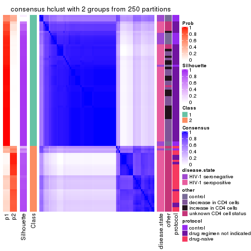</p>

</div>
<div id='tab-MAD-hclust-consensus-heatmap-2'>
<pre><code class="r">consensus_heatmap(res, k = 3)
</code></pre>

<p>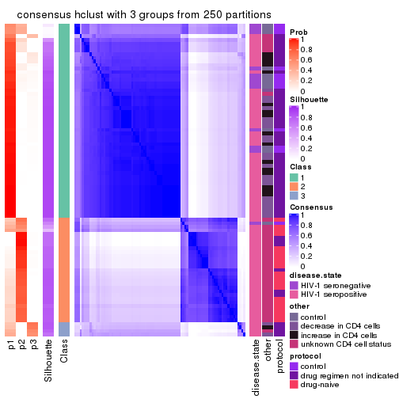</p>

</div>
<div id='tab-MAD-hclust-consensus-heatmap-3'>
<pre><code class="r">consensus_heatmap(res, k = 4)
</code></pre>

<p>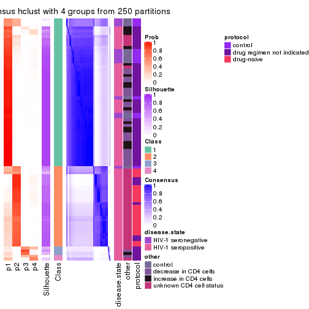</p>

</div>
<div id='tab-MAD-hclust-consensus-heatmap-4'>
<pre><code class="r">consensus_heatmap(res, k = 5)
</code></pre>

<p>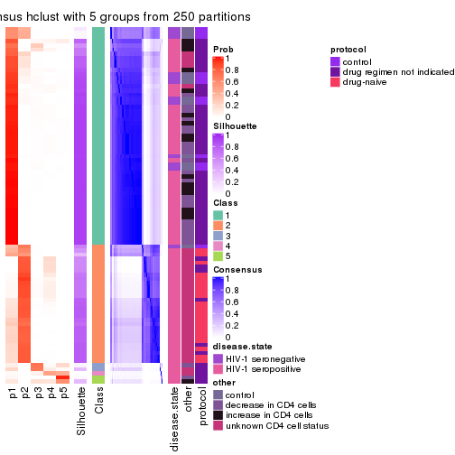</p>

</div>
<div id='tab-MAD-hclust-consensus-heatmap-5'>
<pre><code class="r">consensus_heatmap(res, k = 6)
</code></pre>

<p>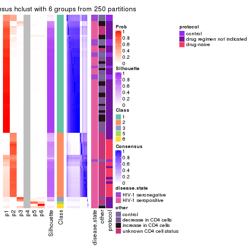</p>

</div>
</div>

Heatmaps for the membership of samples in all partitions to see how consistent they are:


<script>
$( function() {
	$( '#tabs-MAD-hclust-membership-heatmap' ).tabs();
} );
</script>
<div id='tabs-MAD-hclust-membership-heatmap'>
<ul>
<li><a href='#tab-MAD-hclust-membership-heatmap-1'>k = 2</a></li>
<li><a href='#tab-MAD-hclust-membership-heatmap-2'>k = 3</a></li>
<li><a href='#tab-MAD-hclust-membership-heatmap-3'>k = 4</a></li>
<li><a href='#tab-MAD-hclust-membership-heatmap-4'>k = 5</a></li>
<li><a href='#tab-MAD-hclust-membership-heatmap-5'>k = 6</a></li>
</ul>
<div id='tab-MAD-hclust-membership-heatmap-1'>
<pre><code class="r">membership_heatmap(res, k = 2)
</code></pre>

<p>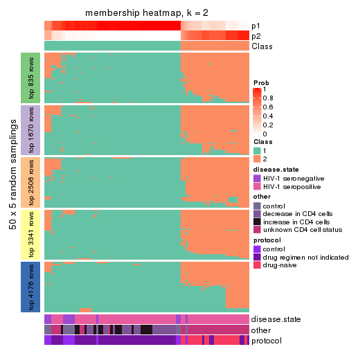</p>

</div>
<div id='tab-MAD-hclust-membership-heatmap-2'>
<pre><code class="r">membership_heatmap(res, k = 3)
</code></pre>

<p>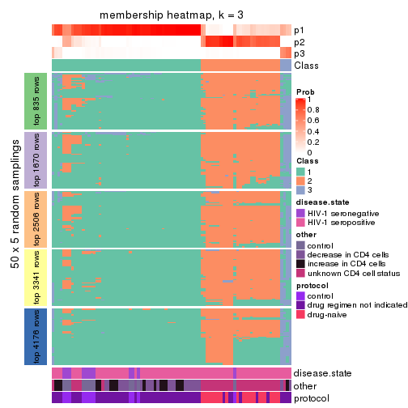</p>

</div>
<div id='tab-MAD-hclust-membership-heatmap-3'>
<pre><code class="r">membership_heatmap(res, k = 4)
</code></pre>

<p>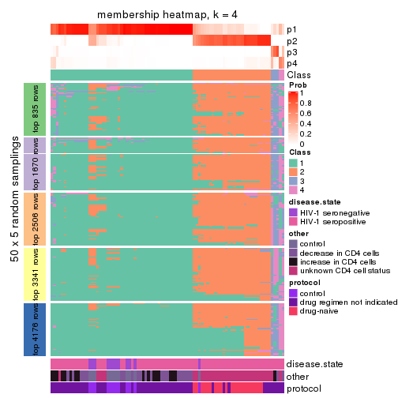</p>

</div>
<div id='tab-MAD-hclust-membership-heatmap-4'>
<pre><code class="r">membership_heatmap(res, k = 5)
</code></pre>

<p>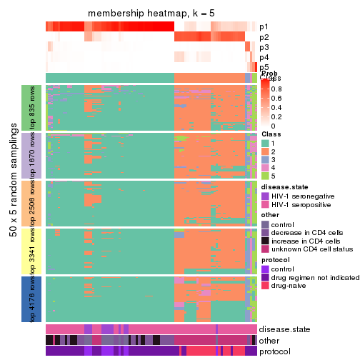</p>

</div>
<div id='tab-MAD-hclust-membership-heatmap-5'>
<pre><code class="r">membership_heatmap(res, k = 6)
</code></pre>

<p>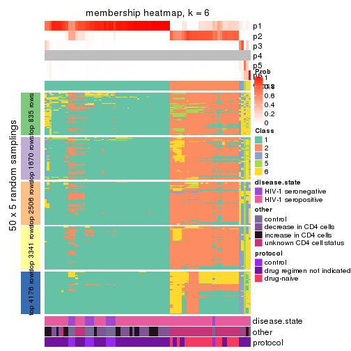</p>

</div>
</div>

As soon as we have had the classes for columns, we can look for signatures
which are significantly different between classes which can be candidate marks
for certain classes. Following are the heatmaps for signatures.


Signature heatmaps where rows are scaled:


<script>
$( function() {
	$( '#tabs-MAD-hclust-get-signatures' ).tabs();
} );
</script>
<div id='tabs-MAD-hclust-get-signatures'>
<ul>
<li><a href='#tab-MAD-hclust-get-signatures-1'>k = 2</a></li>
<li><a href='#tab-MAD-hclust-get-signatures-2'>k = 3</a></li>
<li><a href='#tab-MAD-hclust-get-signatures-3'>k = 4</a></li>
<li><a href='#tab-MAD-hclust-get-signatures-4'>k = 5</a></li>
<li><a href='#tab-MAD-hclust-get-signatures-5'>k = 6</a></li>
</ul>
<div id='tab-MAD-hclust-get-signatures-1'>
<pre><code class="r">get_signatures(res, k = 2)
</code></pre>

<p>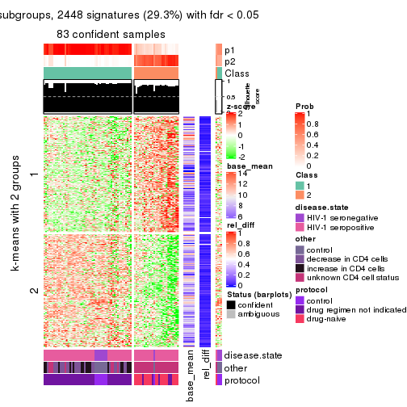</p>

</div>
<div id='tab-MAD-hclust-get-signatures-2'>
<pre><code class="r">get_signatures(res, k = 3)
</code></pre>

<p>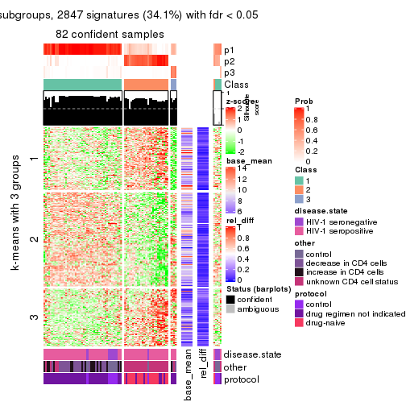</p>

</div>
<div id='tab-MAD-hclust-get-signatures-3'>
<pre><code class="r">get_signatures(res, k = 4)
</code></pre>

<p>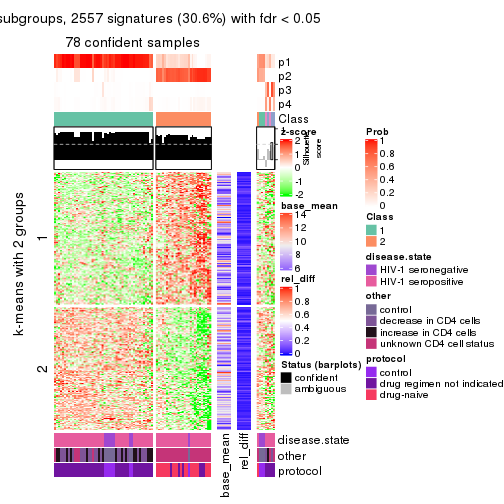</p>

</div>
<div id='tab-MAD-hclust-get-signatures-4'>
<pre><code class="r">get_signatures(res, k = 5)
</code></pre>

<p>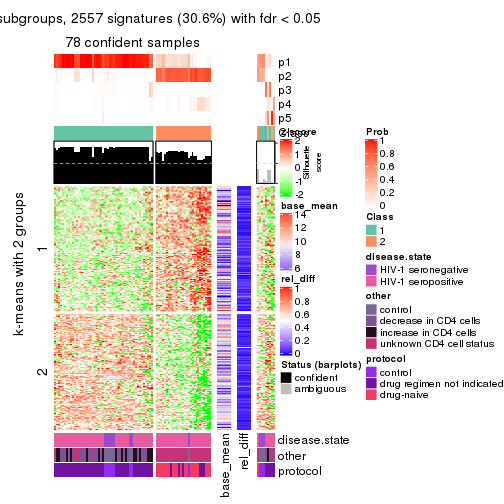</p>

</div>
<div id='tab-MAD-hclust-get-signatures-5'>
<pre><code class="r">get_signatures(res, k = 6)
</code></pre>

<p>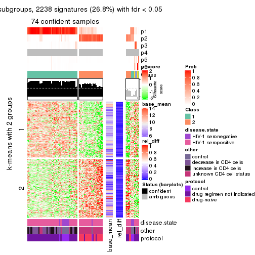</p>

</div>
</div>


Signature heatmaps where rows are not scaled:


<script>
$( function() {
	$( '#tabs-MAD-hclust-get-signatures-no-scale' ).tabs();
} );
</script>
<div id='tabs-MAD-hclust-get-signatures-no-scale'>
<ul>
<li><a href='#tab-MAD-hclust-get-signatures-no-scale-1'>k = 2</a></li>
<li><a href='#tab-MAD-hclust-get-signatures-no-scale-2'>k = 3</a></li>
<li><a href='#tab-MAD-hclust-get-signatures-no-scale-3'>k = 4</a></li>
<li><a href='#tab-MAD-hclust-get-signatures-no-scale-4'>k = 5</a></li>
<li><a href='#tab-MAD-hclust-get-signatures-no-scale-5'>k = 6</a></li>
</ul>
<div id='tab-MAD-hclust-get-signatures-no-scale-1'>
<pre><code class="r">get_signatures(res, k = 2, scale_rows = FALSE)
</code></pre>

<p>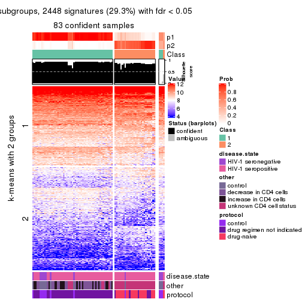</p>

</div>
<div id='tab-MAD-hclust-get-signatures-no-scale-2'>
<pre><code class="r">get_signatures(res, k = 3, scale_rows = FALSE)
</code></pre>

<p>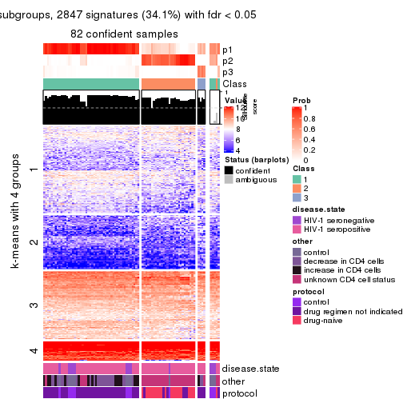</p>

</div>
<div id='tab-MAD-hclust-get-signatures-no-scale-3'>
<pre><code class="r">get_signatures(res, k = 4, scale_rows = FALSE)
</code></pre>

<p>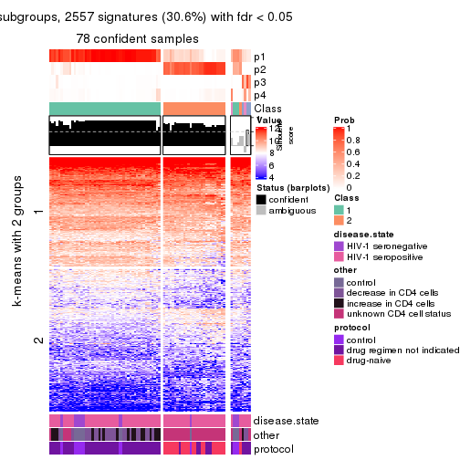</p>

</div>
<div id='tab-MAD-hclust-get-signatures-no-scale-4'>
<pre><code class="r">get_signatures(res, k = 5, scale_rows = FALSE)
</code></pre>

<p>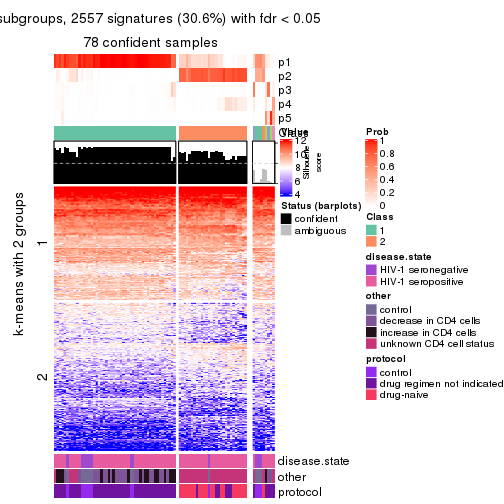</p>

</div>
<div id='tab-MAD-hclust-get-signatures-no-scale-5'>
<pre><code class="r">get_signatures(res, k = 6, scale_rows = FALSE)
</code></pre>

<p>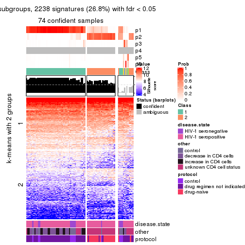</p>

</div>
</div>


Compare the overlap of signatures from different k:

```r
compare_signatures(res)
```

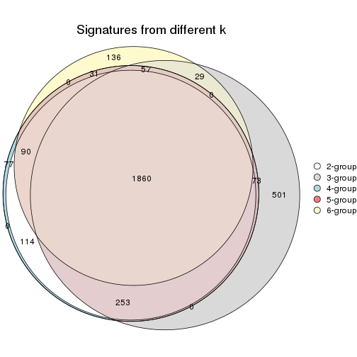

`get_signature()` returns a data frame invisibly. TO get the list of signatures, the function
call should be assigned to a variable explicitly. In following code, if `plot` argument is set
to `FALSE`, no heatmap is plotted while only the differential analysis is performed.

```r
# code only for demonstration
tb = get_signature(res, k = ..., plot = FALSE)
```

An example of the output of `tb` is:

```
#>   which_row         fdr    mean_1    mean_2 scaled_mean_1 scaled_mean_2 km
#> 1        38 0.042760348  8.373488  9.131774    -0.5533452     0.5164555  1
#> 2        40 0.018707592  7.106213  8.469186    -0.6173731     0.5762149  1
#> 3        55 0.019134737 10.221463 11.207825    -0.6159697     0.5749050  1
#> 4        59 0.006059896  5.921854  7.869574    -0.6899429     0.6439467  1
#> 5        60 0.018055526  8.928898 10.211722    -0.6204761     0.5791110  1
#> 6        98 0.009384629 15.714769 14.887706     0.6635654    -0.6193277  2
...
```

The columns in `tb` are:

1. `which_row`: row indices corresponding to the input matrix.
2. `fdr`: FDR for the differential test. 
3. `mean_x`: The mean value in group x.
4. `scaled_mean_x`: The mean value in group x after rows are scaled.
5. `km`: Row groups if k-means clustering is applied to rows.


UMAP plot which shows how samples are separated.


<script>
$( function() {
	$( '#tabs-MAD-hclust-dimension-reduction' ).tabs();
} );
</script>
<div id='tabs-MAD-hclust-dimension-reduction'>
<ul>
<li><a href='#tab-MAD-hclust-dimension-reduction-1'>k = 2</a></li>
<li><a href='#tab-MAD-hclust-dimension-reduction-2'>k = 3</a></li>
<li><a href='#tab-MAD-hclust-dimension-reduction-3'>k = 4</a></li>
<li><a href='#tab-MAD-hclust-dimension-reduction-4'>k = 5</a></li>
<li><a href='#tab-MAD-hclust-dimension-reduction-5'>k = 6</a></li>
</ul>
<div id='tab-MAD-hclust-dimension-reduction-1'>
<pre><code class="r">dimension_reduction(res, k = 2, method = &quot;UMAP&quot;)
</code></pre>

<p>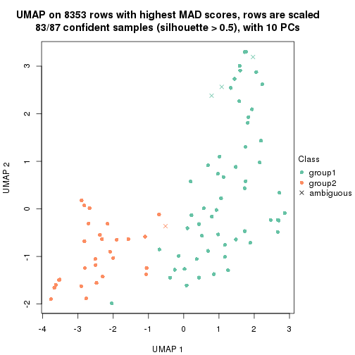</p>

</div>
<div id='tab-MAD-hclust-dimension-reduction-2'>
<pre><code class="r">dimension_reduction(res, k = 3, method = &quot;UMAP&quot;)
</code></pre>

<p>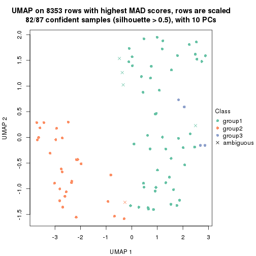</p>

</div>
<div id='tab-MAD-hclust-dimension-reduction-3'>
<pre><code class="r">dimension_reduction(res, k = 4, method = &quot;UMAP&quot;)
</code></pre>

<p>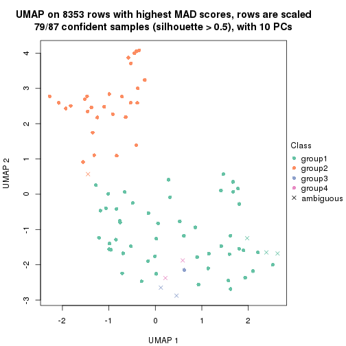</p>

</div>
<div id='tab-MAD-hclust-dimension-reduction-4'>
<pre><code class="r">dimension_reduction(res, k = 5, method = &quot;UMAP&quot;)
</code></pre>

<p>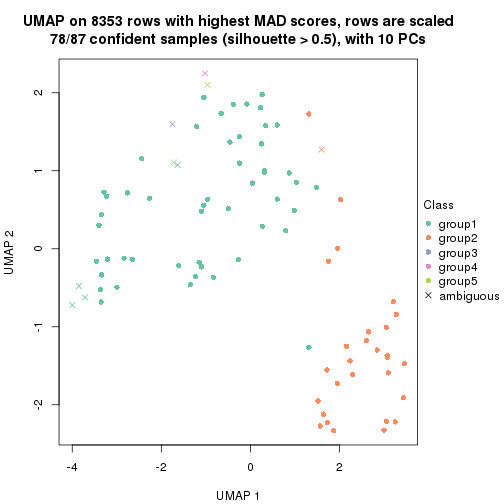</p>

</div>
<div id='tab-MAD-hclust-dimension-reduction-5'>
<pre><code class="r">dimension_reduction(res, k = 6, method = &quot;UMAP&quot;)
</code></pre>

<p>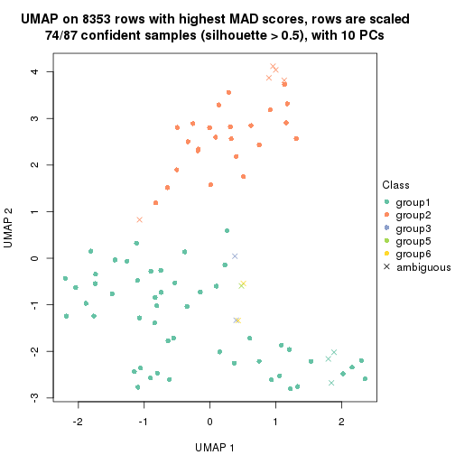</p>

</div>
</div>


Following heatmap shows how subgroups are split when increasing `k`:

```r
collect_classes(res)
```

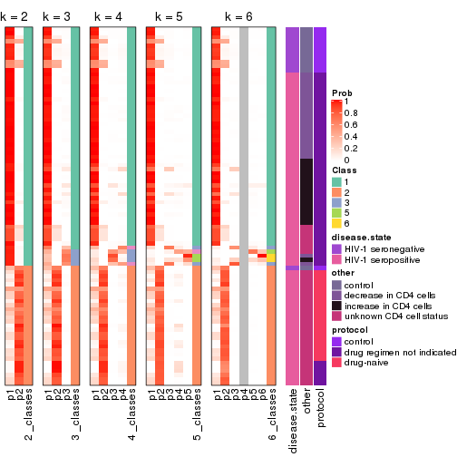


Test correlation between subgroups and known annotations. If the known
annotation is numeric, one-way ANOVA test is applied, and if the known
annotation is discrete, chi-squared contingency table test is applied.

```r
test_to_known_factors(res)
```

```
#>             n disease.state(p) other(p) protocol(p) k
#> MAD:hclust 83            0.251 1.04e-11    1.02e-12 2
#> MAD:hclust 82            0.187 1.48e-10    2.61e-11 3
#> MAD:hclust 79            0.237 8.65e-11    1.16e-10 4
#> MAD:hclust 78            0.201 4.63e-12    7.17e-12 5
#> MAD:hclust 74            0.281 4.43e-11    3.86e-13 6
```


If matrix rows can be associated to genes, consider to use `GO_Enrichment(res,
...)` to perform function enrichment for the signature genes.


 

---------------------------------------------------


### MAD:kmeans


The object with results only for a single top-value method and a single partition method 
can be extracted as:

```r
res = res_list["MAD", "kmeans"]
# you can also extract it by
# res = res_list["MAD:kmeans"]
```

A summary of `res` and all the functions that can be applied to it:

```r
res
```

```
#> A 'ConsensusPartition' object with k = 2, 3, 4, 5, 6.
#>   On a matrix with 8353 rows and 87 columns.
#>   Top rows (835, 1670, 2506, 3341, 4176) are extracted by 'MAD' method.
#>   Subgroups are detected by 'kmeans' method.
#>   Performed in total 1250 partitions by row resampling.
#>   Best k for subgroups seems to be 2.
#> 
#> Following methods can be applied to this 'ConsensusPartition' object:
#>  [1] "cola_report"             "collect_classes"         "collect_plots"          
#>  [4] "collect_stats"           "colnames"                "compare_signatures"     
#>  [7] "consensus_heatmap"       "dimension_reduction"     "functional_enrichment"  
#> [10] "get_anno_col"            "get_anno"                "get_classes"            
#> [13] "get_consensus"           "get_matrix"              "get_membership"         
#> [16] "get_param"               "get_signatures"          "get_stats"              
#> [19] "is_best_k"               "is_stable_k"             "membership_heatmap"     
#> [22] "ncol"                    "nrow"                    "plot_ecdf"              
#> [25] "rownames"                "select_partition_number" "show"                   
#> [28] "suggest_best_k"          "test_to_known_factors"
```

`collect_plots()` function collects all the plots made from `res` for all `k` (number of partitions)
into one single page to provide an easy and fast comparison between different `k`.

```r
collect_plots(res)
```

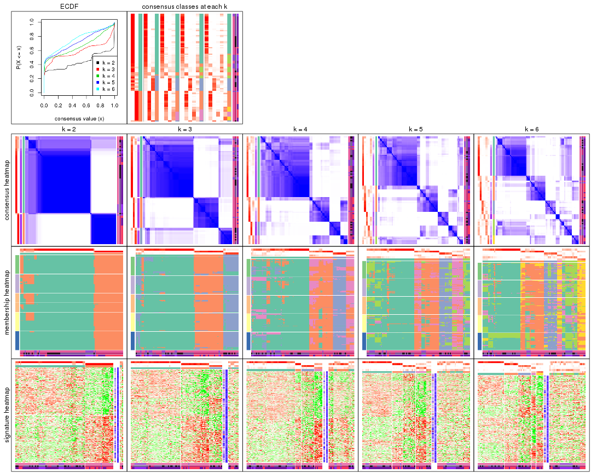

The plots are:

- The first row: a plot of the ECDF (Empirical cumulative distribution
  function) curves of the consensus matrix for each `k` and the heatmap of
  predicted classes for each `k`.
- The second row: heatmaps of the consensus matrix for each `k`.
- The third row: heatmaps of the membership matrix for each `k`.
- The fouth row: heatmaps of the signatures for each `k`.

All the plots in panels can be made by individual functions and they are
plotted later in this section.

`select_partition_number()` produces several plots showing different
statistics for choosing "optimized" `k`. There are following statistics:

- ECDF curves of the consensus matrix for each `k`;
- 1-PAC. [The PAC
  score](https://en.wikipedia.org/wiki/Consensus_clustering#Over-interpretation_potential_of_consensus_clustering)
  measures the proportion of the ambiguous subgrouping.
- Mean silhouette score.
- Concordance. The mean probability of fiting the consensus class ids in all
  partitions.
- Area increased. Denote $A_k$ as the area under the ECDF curve for current
  `k`, the area increased is defined as $A_k - A_{k-1}$.
- Rand index. The percent of pairs of samples that are both in a same cluster
  or both are not in a same cluster in the partition of k and k-1.
- Jaccard index. The ratio of pairs of samples are both in a same cluster in
  the partition of k and k-1 and the pairs of samples are both in a same
  cluster in the partition k or k-1.

The detailed explanations of these statistics can be found in [the cola
vignette](http://bioconductor.org/packages/devel/bioc/vignettes/cola/inst/doc/cola.html#toc_13).

Generally speaking, lower PAC score, higher mean silhouette score or higher
concordance corresponds to better partition. Rand index and Jaccard index
measure how similar the current partition is compared to partition with `k-1`.
If they are too similar, we won't accept `k` is better than `k-1`.

```r
select_partition_number(res)
```

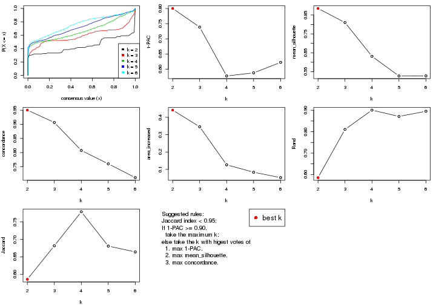

The numeric values for all these statistics can be obtained by `get_stats()`.

```r
get_stats(res)
```

```
#>   k 1-PAC mean_silhouette concordance area_increased  Rand Jaccard
#> 2 2 0.800           0.885       0.950         0.4413 0.586   0.586
#> 3 3 0.739           0.810       0.907         0.3454 0.810   0.682
#> 4 4 0.578           0.631       0.808         0.1263 0.901   0.779
#> 5 5 0.588           0.527       0.760         0.0836 0.871   0.681
#> 6 6 0.622           0.528       0.711         0.0525 0.895   0.664
```

`suggest_best_k()` suggests the best $k$ based on these statistics. The rules are as follows:

- All $k$ with Jaccard index larger than 0.95 are removed because the increase of
  the partition number does not provides enough extra information. If all $k$ are removed,
  the best $k$ is assigned by `NA`.
- For $k$ with 1-PAC larger than 0.9, the maximal $k$ is taken as the "best k". Other $k$ is called "optional k".
- If it does not fit the second rule. The $k$ with the highest vote of highest
  1-PAC, mean silhouette and concordance is taken as the "best k".

```r
suggest_best_k(res)
```

```
#> [1] 2
```


Following shows the table of the partitions (You need to click the **show/hide
code output** link to see it). The membership matrix (columns with name `p*`)
is inferred by
[`clue::cl_consensus()`](https://www.rdocumentation.org/link/cl_consensus?package=clue)
function with the `SE` method. Basically the value in the membership matrix
represents the probability to belong to a certain group. The finall class
label for an item is determined with the group with highest probability it
belongs to.

In `get_classes()` function, the entropy is calculated from the membership
matrix and the silhouette score is calculated from the consensus matrix.


<script>
$( function() {
	$( '#tabs-MAD-kmeans-get-classes' ).tabs();
} );
</script>
<div id='tabs-MAD-kmeans-get-classes'>
<ul>
<li><a href='#tab-MAD-kmeans-get-classes-1'>k = 2</a></li>
<li><a href='#tab-MAD-kmeans-get-classes-2'>k = 3</a></li>
<li><a href='#tab-MAD-kmeans-get-classes-3'>k = 4</a></li>
<li><a href='#tab-MAD-kmeans-get-classes-4'>k = 5</a></li>
<li><a href='#tab-MAD-kmeans-get-classes-5'>k = 6</a></li>
</ul>

<div id='tab-MAD-kmeans-get-classes-1'>
<p><a id='tab-MAD-kmeans-get-classes-1-a' style='color:#0366d6' href='#'>show/hide code output</a></p>
<pre><code class="r">cbind(get_classes(res, k = 2), get_membership(res, k = 2))
</code></pre>

<pre><code>#&gt;          class entropy silhouette    p1    p2
#&gt; GSM39104     1  0.0000     0.9331 1.000 0.000
#&gt; GSM39105     1  0.0000     0.9331 1.000 0.000
#&gt; GSM39106     1  0.0000     0.9331 1.000 0.000
#&gt; GSM39107     1  0.2778     0.8978 0.952 0.048
#&gt; GSM39108     1  0.0000     0.9331 1.000 0.000
#&gt; GSM39109     1  0.6623     0.7878 0.828 0.172
#&gt; GSM39110     1  0.0000     0.9331 1.000 0.000
#&gt; GSM39111     1  0.0000     0.9331 1.000 0.000
#&gt; GSM39112     1  0.0376     0.9305 0.996 0.004
#&gt; GSM39113     1  0.2948     0.8945 0.948 0.052
#&gt; GSM39114     2  0.0672     0.9717 0.008 0.992
#&gt; GSM39115     1  0.0000     0.9331 1.000 0.000
#&gt; GSM39148     1  0.0000     0.9331 1.000 0.000
#&gt; GSM39149     1  0.9000     0.5890 0.684 0.316
#&gt; GSM39150     1  0.0000     0.9331 1.000 0.000
#&gt; GSM39151     1  0.9044     0.5819 0.680 0.320
#&gt; GSM39152     1  0.0000     0.9331 1.000 0.000
#&gt; GSM39153     1  0.0000     0.9331 1.000 0.000
#&gt; GSM39154     1  0.0000     0.9331 1.000 0.000
#&gt; GSM39155     1  0.0000     0.9331 1.000 0.000
#&gt; GSM39156     1  0.0000     0.9331 1.000 0.000
#&gt; GSM39157     1  0.0000     0.9331 1.000 0.000
#&gt; GSM39158     1  0.0000     0.9331 1.000 0.000
#&gt; GSM39159     1  0.0000     0.9331 1.000 0.000
#&gt; GSM39160     1  0.0000     0.9331 1.000 0.000
#&gt; GSM39161     1  0.0000     0.9331 1.000 0.000
#&gt; GSM39162     1  0.0000     0.9331 1.000 0.000
#&gt; GSM39163     1  0.0000     0.9331 1.000 0.000
#&gt; GSM39164     1  0.0000     0.9331 1.000 0.000
#&gt; GSM39165     1  0.0000     0.9331 1.000 0.000
#&gt; GSM39166     1  0.0000     0.9331 1.000 0.000
#&gt; GSM39167     1  0.0000     0.9331 1.000 0.000
#&gt; GSM39168     1  0.0000     0.9331 1.000 0.000
#&gt; GSM39169     1  0.0000     0.9331 1.000 0.000
#&gt; GSM39170     1  0.0000     0.9331 1.000 0.000
#&gt; GSM39171     1  0.0000     0.9331 1.000 0.000
#&gt; GSM39172     1  0.8763     0.6203 0.704 0.296
#&gt; GSM39173     1  0.9087     0.5751 0.676 0.324
#&gt; GSM39174     1  0.0000     0.9331 1.000 0.000
#&gt; GSM39175     1  0.0000     0.9331 1.000 0.000
#&gt; GSM39176     1  0.0000     0.9331 1.000 0.000
#&gt; GSM39177     1  0.0938     0.9255 0.988 0.012
#&gt; GSM39178     1  0.0000     0.9331 1.000 0.000
#&gt; GSM39179     1  0.9044     0.5827 0.680 0.320
#&gt; GSM39180     2  0.9881     0.0992 0.436 0.564
#&gt; GSM39181     1  0.0000     0.9331 1.000 0.000
#&gt; GSM39182     1  0.5842     0.8183 0.860 0.140
#&gt; GSM39183     1  0.0000     0.9331 1.000 0.000
#&gt; GSM39184     1  0.0000     0.9331 1.000 0.000
#&gt; GSM39185     1  0.0000     0.9331 1.000 0.000
#&gt; GSM39186     1  0.0000     0.9331 1.000 0.000
#&gt; GSM39187     1  0.0000     0.9331 1.000 0.000
#&gt; GSM39116     2  0.0000     0.9790 0.000 1.000
#&gt; GSM39117     2  0.0000     0.9790 0.000 1.000
#&gt; GSM39118     2  0.0000     0.9790 0.000 1.000
#&gt; GSM39119     2  0.0000     0.9790 0.000 1.000
#&gt; GSM39120     1  0.0000     0.9331 1.000 0.000
#&gt; GSM39121     1  0.9661     0.3855 0.608 0.392
#&gt; GSM39122     1  0.9954     0.2092 0.540 0.460
#&gt; GSM39123     2  0.0000     0.9790 0.000 1.000
#&gt; GSM39124     2  0.0376     0.9756 0.004 0.996
#&gt; GSM39125     1  0.0000     0.9331 1.000 0.000
#&gt; GSM39126     1  0.9087     0.5399 0.676 0.324
#&gt; GSM39127     2  0.0000     0.9790 0.000 1.000
#&gt; GSM39128     2  0.0000     0.9790 0.000 1.000
#&gt; GSM39129     2  0.0000     0.9790 0.000 1.000
#&gt; GSM39130     2  0.0000     0.9790 0.000 1.000
#&gt; GSM39131     2  0.0000     0.9790 0.000 1.000
#&gt; GSM39132     2  0.0000     0.9790 0.000 1.000
#&gt; GSM39133     2  0.0000     0.9790 0.000 1.000
#&gt; GSM39134     2  0.0000     0.9790 0.000 1.000
#&gt; GSM39135     2  0.0000     0.9790 0.000 1.000
#&gt; GSM39136     2  0.0000     0.9790 0.000 1.000
#&gt; GSM39137     2  0.0376     0.9756 0.004 0.996
#&gt; GSM39138     2  0.0000     0.9790 0.000 1.000
#&gt; GSM39139     2  0.0000     0.9790 0.000 1.000
#&gt; GSM39140     1  0.0000     0.9331 1.000 0.000
#&gt; GSM39141     1  0.0000     0.9331 1.000 0.000
#&gt; GSM39142     1  0.0000     0.9331 1.000 0.000
#&gt; GSM39143     1  0.0000     0.9331 1.000 0.000
#&gt; GSM39144     2  0.0000     0.9790 0.000 1.000
#&gt; GSM39145     2  0.0000     0.9790 0.000 1.000
#&gt; GSM39146     2  0.0000     0.9790 0.000 1.000
#&gt; GSM39147     2  0.0000     0.9790 0.000 1.000
#&gt; GSM39188     1  0.9087     0.5751 0.676 0.324
#&gt; GSM39189     1  0.2236     0.9088 0.964 0.036
#&gt; GSM39190     1  0.9087     0.5751 0.676 0.324
</code></pre>

<script>
$('#tab-MAD-kmeans-get-classes-1-a').parent().next().next().hide();
$('#tab-MAD-kmeans-get-classes-1-a').click(function(){
  $('#tab-MAD-kmeans-get-classes-1-a').parent().next().next().toggle();
  return(false);
});
</script>
</div>

<div id='tab-MAD-kmeans-get-classes-2'>
<p><a id='tab-MAD-kmeans-get-classes-2-a' style='color:#0366d6' href='#'>show/hide code output</a></p>
<pre><code class="r">cbind(get_classes(res, k = 3), get_membership(res, k = 3))
</code></pre>

<pre><code>#&gt;          class entropy silhouette    p1    p2    p3
#&gt; GSM39104     1  0.1860    0.86774 0.948 0.000 0.052
#&gt; GSM39105     1  0.0000    0.89378 1.000 0.000 0.000
#&gt; GSM39106     1  0.2096    0.87520 0.944 0.004 0.052
#&gt; GSM39107     1  0.3669    0.82122 0.896 0.064 0.040
#&gt; GSM39108     1  0.1643    0.87285 0.956 0.000 0.044
#&gt; GSM39109     1  0.6934    0.35014 0.624 0.028 0.348
#&gt; GSM39110     1  0.1964    0.87322 0.944 0.000 0.056
#&gt; GSM39111     1  0.1753    0.87176 0.952 0.000 0.048
#&gt; GSM39112     1  0.3572    0.82494 0.900 0.060 0.040
#&gt; GSM39113     1  0.3947    0.81108 0.884 0.076 0.040
#&gt; GSM39114     2  0.1950    0.91315 0.008 0.952 0.040
#&gt; GSM39115     1  0.0000    0.89378 1.000 0.000 0.000
#&gt; GSM39148     1  0.0000    0.89378 1.000 0.000 0.000
#&gt; GSM39149     3  0.3192    0.90784 0.112 0.000 0.888
#&gt; GSM39150     1  0.2066    0.86353 0.940 0.000 0.060
#&gt; GSM39151     3  0.3192    0.90784 0.112 0.000 0.888
#&gt; GSM39152     3  0.3752    0.88901 0.144 0.000 0.856
#&gt; GSM39153     1  0.0237    0.89418 0.996 0.000 0.004
#&gt; GSM39154     1  0.0237    0.89418 0.996 0.000 0.004
#&gt; GSM39155     1  0.0237    0.89418 0.996 0.000 0.004
#&gt; GSM39156     1  0.1031    0.88486 0.976 0.000 0.024
#&gt; GSM39157     1  0.0237    0.89418 0.996 0.000 0.004
#&gt; GSM39158     1  0.0237    0.89418 0.996 0.000 0.004
#&gt; GSM39159     1  0.6062    0.17485 0.616 0.000 0.384
#&gt; GSM39160     1  0.3116    0.81541 0.892 0.000 0.108
#&gt; GSM39161     1  0.6295   -0.19571 0.528 0.000 0.472
#&gt; GSM39162     1  0.0592    0.88994 0.988 0.000 0.012
#&gt; GSM39163     1  0.0237    0.89418 0.996 0.000 0.004
#&gt; GSM39164     1  0.0000    0.89378 1.000 0.000 0.000
#&gt; GSM39165     1  0.5216    0.53889 0.740 0.000 0.260
#&gt; GSM39166     1  0.0592    0.89138 0.988 0.000 0.012
#&gt; GSM39167     1  0.0237    0.89418 0.996 0.000 0.004
#&gt; GSM39168     1  0.0237    0.89277 0.996 0.000 0.004
#&gt; GSM39169     1  0.0237    0.89418 0.996 0.000 0.004
#&gt; GSM39170     1  0.0237    0.89418 0.996 0.000 0.004
#&gt; GSM39171     1  0.1643    0.87510 0.956 0.000 0.044
#&gt; GSM39172     3  0.3192    0.90712 0.112 0.000 0.888
#&gt; GSM39173     3  0.3272    0.90170 0.104 0.004 0.892
#&gt; GSM39174     1  0.0237    0.89418 0.996 0.000 0.004
#&gt; GSM39175     1  0.0237    0.89418 0.996 0.000 0.004
#&gt; GSM39176     1  0.0237    0.89418 0.996 0.000 0.004
#&gt; GSM39177     3  0.3551    0.89811 0.132 0.000 0.868
#&gt; GSM39178     1  0.6260   -0.03381 0.552 0.000 0.448
#&gt; GSM39179     3  0.3116    0.90554 0.108 0.000 0.892
#&gt; GSM39180     3  0.2749    0.85245 0.064 0.012 0.924
#&gt; GSM39181     1  0.0592    0.89138 0.988 0.000 0.012
#&gt; GSM39182     3  0.6260    0.33436 0.448 0.000 0.552
#&gt; GSM39183     1  0.0592    0.89138 0.988 0.000 0.012
#&gt; GSM39184     1  0.0237    0.89418 0.996 0.000 0.004
#&gt; GSM39185     3  0.6308    0.22597 0.492 0.000 0.508
#&gt; GSM39186     1  0.0237    0.89418 0.996 0.000 0.004
#&gt; GSM39187     1  0.0000    0.89378 1.000 0.000 0.000
#&gt; GSM39116     2  0.0237    0.92529 0.000 0.996 0.004
#&gt; GSM39117     2  0.3752    0.87404 0.000 0.856 0.144
#&gt; GSM39118     2  0.1860    0.92098 0.000 0.948 0.052
#&gt; GSM39119     2  0.2261    0.91617 0.000 0.932 0.068
#&gt; GSM39120     1  0.3155    0.84090 0.916 0.044 0.040
#&gt; GSM39121     1  0.7578    0.09533 0.500 0.460 0.040
#&gt; GSM39122     2  0.7578   -0.00285 0.460 0.500 0.040
#&gt; GSM39123     2  0.3752    0.87404 0.000 0.856 0.144
#&gt; GSM39124     2  0.1647    0.91734 0.004 0.960 0.036
#&gt; GSM39125     1  0.2926    0.84723 0.924 0.036 0.040
#&gt; GSM39126     1  0.7464    0.28776 0.560 0.400 0.040
#&gt; GSM39127     2  0.1289    0.92135 0.000 0.968 0.032
#&gt; GSM39128     2  0.1647    0.91734 0.004 0.960 0.036
#&gt; GSM39129     2  0.2261    0.91605 0.000 0.932 0.068
#&gt; GSM39130     2  0.3752    0.87404 0.000 0.856 0.144
#&gt; GSM39131     2  0.1529    0.91864 0.000 0.960 0.040
#&gt; GSM39132     2  0.1289    0.92135 0.000 0.968 0.032
#&gt; GSM39133     2  0.2959    0.90480 0.000 0.900 0.100
#&gt; GSM39134     2  0.2261    0.91605 0.000 0.932 0.068
#&gt; GSM39135     2  0.0237    0.92529 0.000 0.996 0.004
#&gt; GSM39136     2  0.0424    0.92539 0.000 0.992 0.008
#&gt; GSM39137     2  0.2116    0.90971 0.012 0.948 0.040
#&gt; GSM39138     2  0.2261    0.91605 0.000 0.932 0.068
#&gt; GSM39139     2  0.1529    0.92247 0.000 0.960 0.040
#&gt; GSM39140     1  0.1399    0.88052 0.968 0.004 0.028
#&gt; GSM39141     1  0.1399    0.88052 0.968 0.004 0.028
#&gt; GSM39142     1  0.1163    0.88275 0.972 0.000 0.028
#&gt; GSM39143     1  0.1647    0.87519 0.960 0.004 0.036
#&gt; GSM39144     2  0.2261    0.91605 0.000 0.932 0.068
#&gt; GSM39145     2  0.0747    0.92516 0.000 0.984 0.016
#&gt; GSM39146     2  0.1163    0.92228 0.000 0.972 0.028
#&gt; GSM39147     2  0.1411    0.91856 0.000 0.964 0.036
#&gt; GSM39188     3  0.3116    0.90576 0.108 0.000 0.892
#&gt; GSM39189     3  0.3267    0.90687 0.116 0.000 0.884
#&gt; GSM39190     3  0.3192    0.90784 0.112 0.000 0.888
</code></pre>

<script>
$('#tab-MAD-kmeans-get-classes-2-a').parent().next().next().hide();
$('#tab-MAD-kmeans-get-classes-2-a').click(function(){
  $('#tab-MAD-kmeans-get-classes-2-a').parent().next().next().toggle();
  return(false);
});
</script>
</div>

<div id='tab-MAD-kmeans-get-classes-3'>
<p><a id='tab-MAD-kmeans-get-classes-3-a' style='color:#0366d6' href='#'>show/hide code output</a></p>
<pre><code class="r">cbind(get_classes(res, k = 4), get_membership(res, k = 4))
</code></pre>

<pre><code>#&gt;          class entropy silhouette    p1    p2    p3    p4
#&gt; GSM39104     1  0.4946     0.7801 0.776 0.008 0.052 0.164
#&gt; GSM39105     1  0.2081     0.8282 0.916 0.000 0.000 0.084
#&gt; GSM39106     1  0.6192     0.7372 0.728 0.104 0.040 0.128
#&gt; GSM39107     1  0.6665     0.4170 0.544 0.360 0.000 0.096
#&gt; GSM39108     1  0.4819     0.7864 0.808 0.028 0.048 0.116
#&gt; GSM39109     1  0.9434     0.3898 0.428 0.220 0.176 0.176
#&gt; GSM39110     1  0.5831     0.7571 0.752 0.080 0.040 0.128
#&gt; GSM39111     1  0.4220     0.7973 0.828 0.004 0.056 0.112
#&gt; GSM39112     1  0.6535     0.5057 0.588 0.312 0.000 0.100
#&gt; GSM39113     1  0.6903     0.3539 0.508 0.380 0.000 0.112
#&gt; GSM39114     2  0.2382     0.4704 0.004 0.912 0.004 0.080
#&gt; GSM39115     1  0.1489     0.8343 0.952 0.000 0.004 0.044
#&gt; GSM39148     1  0.0188     0.8378 0.996 0.004 0.000 0.000
#&gt; GSM39149     3  0.1452     0.9442 0.008 0.000 0.956 0.036
#&gt; GSM39150     1  0.5180     0.7488 0.740 0.000 0.064 0.196
#&gt; GSM39151     3  0.1452     0.9441 0.008 0.000 0.956 0.036
#&gt; GSM39152     3  0.2976     0.9099 0.008 0.000 0.872 0.120
#&gt; GSM39153     1  0.0000     0.8379 1.000 0.000 0.000 0.000
#&gt; GSM39154     1  0.0000     0.8379 1.000 0.000 0.000 0.000
#&gt; GSM39155     1  0.0000     0.8379 1.000 0.000 0.000 0.000
#&gt; GSM39156     1  0.2844     0.8141 0.900 0.052 0.000 0.048
#&gt; GSM39157     1  0.0000     0.8379 1.000 0.000 0.000 0.000
#&gt; GSM39158     1  0.3306     0.7805 0.840 0.000 0.004 0.156
#&gt; GSM39159     1  0.6475     0.5763 0.644 0.000 0.184 0.172
#&gt; GSM39160     1  0.5633     0.7249 0.716 0.000 0.100 0.184
#&gt; GSM39161     1  0.7039     0.4498 0.568 0.000 0.256 0.176
#&gt; GSM39162     1  0.0188     0.8378 0.996 0.004 0.000 0.000
#&gt; GSM39163     1  0.0000     0.8379 1.000 0.000 0.000 0.000
#&gt; GSM39164     1  0.0000     0.8379 1.000 0.000 0.000 0.000
#&gt; GSM39165     1  0.3463     0.7883 0.864 0.000 0.096 0.040
#&gt; GSM39166     1  0.3893     0.7671 0.796 0.000 0.008 0.196
#&gt; GSM39167     1  0.0000     0.8379 1.000 0.000 0.000 0.000
#&gt; GSM39168     1  0.0188     0.8378 0.996 0.004 0.000 0.000
#&gt; GSM39169     1  0.0336     0.8372 0.992 0.000 0.000 0.008
#&gt; GSM39170     1  0.3306     0.7802 0.840 0.000 0.004 0.156
#&gt; GSM39171     1  0.2522     0.8258 0.908 0.000 0.016 0.076
#&gt; GSM39172     3  0.2654     0.9197 0.004 0.000 0.888 0.108
#&gt; GSM39173     3  0.1151     0.9482 0.008 0.000 0.968 0.024
#&gt; GSM39174     1  0.0000     0.8379 1.000 0.000 0.000 0.000
#&gt; GSM39175     1  0.0336     0.8376 0.992 0.000 0.000 0.008
#&gt; GSM39176     1  0.0000     0.8379 1.000 0.000 0.000 0.000
#&gt; GSM39177     3  0.1722     0.9481 0.008 0.000 0.944 0.048
#&gt; GSM39178     1  0.7480     0.4333 0.504 0.000 0.248 0.248
#&gt; GSM39179     3  0.1452     0.9441 0.008 0.000 0.956 0.036
#&gt; GSM39180     3  0.1940     0.9341 0.000 0.000 0.924 0.076
#&gt; GSM39181     1  0.3545     0.7735 0.828 0.000 0.008 0.164
#&gt; GSM39182     1  0.7851     0.1045 0.412 0.004 0.364 0.220
#&gt; GSM39183     1  0.3852     0.7677 0.808 0.000 0.012 0.180
#&gt; GSM39184     1  0.0188     0.8376 0.996 0.000 0.000 0.004
#&gt; GSM39185     1  0.7138     0.4251 0.552 0.000 0.268 0.180
#&gt; GSM39186     1  0.1576     0.8335 0.948 0.000 0.004 0.048
#&gt; GSM39187     1  0.0000     0.8379 1.000 0.000 0.000 0.000
#&gt; GSM39116     2  0.3355     0.2748 0.000 0.836 0.004 0.160
#&gt; GSM39117     4  0.5620     0.8053 0.000 0.416 0.024 0.560
#&gt; GSM39118     2  0.4917    -0.4303 0.000 0.656 0.008 0.336
#&gt; GSM39119     2  0.5268    -0.7170 0.000 0.540 0.008 0.452
#&gt; GSM39120     1  0.5883     0.5660 0.648 0.288 0.000 0.064
#&gt; GSM39121     2  0.5911     0.2731 0.328 0.624 0.004 0.044
#&gt; GSM39122     2  0.5775     0.2981 0.276 0.668 0.004 0.052
#&gt; GSM39123     4  0.5620     0.8053 0.000 0.416 0.024 0.560
#&gt; GSM39124     2  0.0657     0.5114 0.000 0.984 0.004 0.012
#&gt; GSM39125     1  0.5321     0.6584 0.716 0.228 0.000 0.056
#&gt; GSM39126     2  0.6039     0.2625 0.340 0.608 0.004 0.048
#&gt; GSM39127     2  0.1489     0.4875 0.000 0.952 0.004 0.044
#&gt; GSM39128     2  0.0524     0.5118 0.000 0.988 0.004 0.008
#&gt; GSM39129     4  0.5168     0.6927 0.000 0.496 0.004 0.500
#&gt; GSM39130     4  0.5620     0.8053 0.000 0.416 0.024 0.560
#&gt; GSM39131     2  0.0524     0.5124 0.000 0.988 0.004 0.008
#&gt; GSM39132     2  0.1004     0.5038 0.000 0.972 0.004 0.024
#&gt; GSM39133     4  0.5444     0.8016 0.000 0.424 0.016 0.560
#&gt; GSM39134     2  0.5132    -0.6985 0.000 0.548 0.004 0.448
#&gt; GSM39135     2  0.3908     0.1008 0.000 0.784 0.004 0.212
#&gt; GSM39136     2  0.3402     0.2646 0.000 0.832 0.004 0.164
#&gt; GSM39137     2  0.2222     0.4864 0.032 0.932 0.004 0.032
#&gt; GSM39138     4  0.5167     0.7082 0.000 0.488 0.004 0.508
#&gt; GSM39139     2  0.4817    -0.3992 0.000 0.612 0.000 0.388
#&gt; GSM39140     1  0.2943     0.8067 0.892 0.076 0.000 0.032
#&gt; GSM39141     1  0.2489     0.8145 0.912 0.068 0.000 0.020
#&gt; GSM39142     1  0.0937     0.8352 0.976 0.012 0.000 0.012
#&gt; GSM39143     1  0.2489     0.8145 0.912 0.068 0.000 0.020
#&gt; GSM39144     4  0.5167     0.7082 0.000 0.488 0.004 0.508
#&gt; GSM39145     2  0.4477    -0.0802 0.000 0.688 0.000 0.312
#&gt; GSM39146     2  0.1807     0.4750 0.000 0.940 0.008 0.052
#&gt; GSM39147     2  0.0524     0.5117 0.000 0.988 0.004 0.008
#&gt; GSM39188     3  0.1545     0.9438 0.008 0.000 0.952 0.040
#&gt; GSM39189     3  0.2859     0.9168 0.008 0.000 0.880 0.112
#&gt; GSM39190     3  0.1042     0.9486 0.008 0.000 0.972 0.020
</code></pre>

<script>
$('#tab-MAD-kmeans-get-classes-3-a').parent().next().next().hide();
$('#tab-MAD-kmeans-get-classes-3-a').click(function(){
  $('#tab-MAD-kmeans-get-classes-3-a').parent().next().next().toggle();
  return(false);
});
</script>
</div>

<div id='tab-MAD-kmeans-get-classes-4'>
<p><a id='tab-MAD-kmeans-get-classes-4-a' style='color:#0366d6' href='#'>show/hide code output</a></p>
<pre><code class="r">cbind(get_classes(res, k = 5), get_membership(res, k = 5))
</code></pre>

<pre><code>#&gt;          class entropy silhouette    p1    p2    p3    p4    p5
#&gt; GSM39104     1  0.5158    0.36344 0.604 0.016 0.012 0.008 0.360
#&gt; GSM39105     1  0.3353    0.62084 0.796 0.000 0.000 0.008 0.196
#&gt; GSM39106     1  0.6324    0.32333 0.564 0.108 0.012 0.008 0.308
#&gt; GSM39107     2  0.6521    0.11320 0.348 0.472 0.000 0.004 0.176
#&gt; GSM39108     1  0.4975    0.50190 0.688 0.028 0.012 0.008 0.264
#&gt; GSM39109     5  0.8112    0.26491 0.252 0.212 0.080 0.016 0.440
#&gt; GSM39110     1  0.5973    0.37187 0.592 0.076 0.012 0.008 0.312
#&gt; GSM39111     1  0.4410    0.49598 0.700 0.000 0.016 0.008 0.276
#&gt; GSM39112     2  0.6596   -0.00925 0.392 0.424 0.000 0.004 0.180
#&gt; GSM39113     2  0.6639    0.11405 0.340 0.472 0.000 0.008 0.180
#&gt; GSM39114     2  0.2112    0.53996 0.004 0.908 0.000 0.004 0.084
#&gt; GSM39115     1  0.2389    0.68461 0.880 0.000 0.000 0.004 0.116
#&gt; GSM39148     1  0.0510    0.73679 0.984 0.000 0.000 0.000 0.016
#&gt; GSM39149     3  0.1670    0.79634 0.000 0.000 0.936 0.052 0.012
#&gt; GSM39150     1  0.4936    0.17549 0.560 0.000 0.016 0.008 0.416
#&gt; GSM39151     3  0.1628    0.78879 0.000 0.000 0.936 0.056 0.008
#&gt; GSM39152     3  0.4252    0.69562 0.000 0.000 0.652 0.008 0.340
#&gt; GSM39153     1  0.0609    0.73688 0.980 0.000 0.000 0.000 0.020
#&gt; GSM39154     1  0.0162    0.73658 0.996 0.000 0.000 0.000 0.004
#&gt; GSM39155     1  0.0290    0.73565 0.992 0.000 0.000 0.000 0.008
#&gt; GSM39156     1  0.2645    0.69053 0.888 0.044 0.000 0.000 0.068
#&gt; GSM39157     1  0.0162    0.73658 0.996 0.000 0.000 0.000 0.004
#&gt; GSM39158     1  0.4229    0.30683 0.704 0.000 0.000 0.020 0.276
#&gt; GSM39159     5  0.6274    0.54552 0.424 0.000 0.080 0.024 0.472
#&gt; GSM39160     1  0.5057    0.06123 0.532 0.000 0.020 0.008 0.440
#&gt; GSM39161     5  0.6552    0.61011 0.384 0.000 0.112 0.024 0.480
#&gt; GSM39162     1  0.0510    0.73679 0.984 0.000 0.000 0.000 0.016
#&gt; GSM39163     1  0.0162    0.73658 0.996 0.000 0.000 0.000 0.004
#&gt; GSM39164     1  0.0290    0.73781 0.992 0.000 0.000 0.000 0.008
#&gt; GSM39165     1  0.4072    0.47067 0.792 0.000 0.048 0.008 0.152
#&gt; GSM39166     1  0.4663    0.10304 0.604 0.000 0.000 0.020 0.376
#&gt; GSM39167     1  0.0290    0.73658 0.992 0.000 0.000 0.000 0.008
#&gt; GSM39168     1  0.0510    0.73679 0.984 0.000 0.000 0.000 0.016
#&gt; GSM39169     1  0.0290    0.73663 0.992 0.000 0.000 0.000 0.008
#&gt; GSM39170     1  0.4360    0.26775 0.680 0.000 0.000 0.020 0.300
#&gt; GSM39171     1  0.2881    0.67317 0.860 0.000 0.012 0.004 0.124
#&gt; GSM39172     3  0.4558    0.73420 0.000 0.000 0.652 0.024 0.324
#&gt; GSM39173     3  0.3745    0.81259 0.000 0.000 0.780 0.024 0.196
#&gt; GSM39174     1  0.0162    0.73658 0.996 0.000 0.000 0.000 0.004
#&gt; GSM39175     1  0.0290    0.73520 0.992 0.000 0.000 0.000 0.008
#&gt; GSM39176     1  0.0290    0.73658 0.992 0.000 0.000 0.000 0.008
#&gt; GSM39177     3  0.2798    0.81956 0.000 0.000 0.852 0.008 0.140
#&gt; GSM39178     5  0.5439    0.57543 0.232 0.000 0.088 0.012 0.668
#&gt; GSM39179     3  0.1582    0.80602 0.000 0.000 0.944 0.028 0.028
#&gt; GSM39180     3  0.4326    0.78118 0.000 0.000 0.708 0.028 0.264
#&gt; GSM39181     1  0.4524    0.16651 0.644 0.000 0.000 0.020 0.336
#&gt; GSM39182     5  0.8295    0.24698 0.176 0.012 0.176 0.184 0.452
#&gt; GSM39183     1  0.4851    0.09458 0.620 0.000 0.008 0.020 0.352
#&gt; GSM39184     1  0.0290    0.73565 0.992 0.000 0.000 0.000 0.008
#&gt; GSM39185     5  0.6502    0.63016 0.356 0.000 0.112 0.024 0.508
#&gt; GSM39186     1  0.1831    0.70686 0.920 0.000 0.000 0.004 0.076
#&gt; GSM39187     1  0.0290    0.73658 0.992 0.000 0.000 0.000 0.008
#&gt; GSM39116     2  0.3300    0.30939 0.000 0.792 0.000 0.204 0.004
#&gt; GSM39117     4  0.3003    0.73856 0.000 0.188 0.000 0.812 0.000
#&gt; GSM39118     2  0.6088   -0.51207 0.000 0.492 0.000 0.380 0.128
#&gt; GSM39119     4  0.6163    0.73334 0.000 0.300 0.000 0.536 0.164
#&gt; GSM39120     1  0.6124    0.06437 0.460 0.412 0.000 0.000 0.128
#&gt; GSM39121     2  0.4481    0.47276 0.232 0.720 0.000 0.000 0.048
#&gt; GSM39122     2  0.4204    0.48987 0.196 0.756 0.000 0.000 0.048
#&gt; GSM39123     4  0.3003    0.73856 0.000 0.188 0.000 0.812 0.000
#&gt; GSM39124     2  0.0324    0.55923 0.000 0.992 0.000 0.004 0.004
#&gt; GSM39125     1  0.5686    0.21076 0.552 0.356 0.000 0.000 0.092
#&gt; GSM39126     2  0.4481    0.47283 0.232 0.720 0.000 0.000 0.048
#&gt; GSM39127     2  0.1197    0.53617 0.000 0.952 0.000 0.048 0.000
#&gt; GSM39128     2  0.0404    0.55727 0.000 0.988 0.000 0.012 0.000
#&gt; GSM39129     4  0.6444    0.68294 0.000 0.308 0.000 0.488 0.204
#&gt; GSM39130     4  0.3003    0.73856 0.000 0.188 0.000 0.812 0.000
#&gt; GSM39131     2  0.0693    0.55851 0.000 0.980 0.000 0.012 0.008
#&gt; GSM39132     2  0.1041    0.54507 0.000 0.964 0.000 0.032 0.004
#&gt; GSM39133     4  0.3003    0.73856 0.000 0.188 0.000 0.812 0.000
#&gt; GSM39134     4  0.6244    0.70504 0.000 0.336 0.000 0.504 0.160
#&gt; GSM39135     2  0.3890    0.17159 0.000 0.736 0.000 0.252 0.012
#&gt; GSM39136     2  0.3430    0.27458 0.000 0.776 0.000 0.220 0.004
#&gt; GSM39137     2  0.1364    0.55726 0.036 0.952 0.000 0.000 0.012
#&gt; GSM39138     4  0.6366    0.70339 0.000 0.284 0.000 0.512 0.204
#&gt; GSM39139     2  0.6526   -0.46632 0.000 0.452 0.000 0.344 0.204
#&gt; GSM39140     1  0.2659    0.68304 0.888 0.060 0.000 0.000 0.052
#&gt; GSM39141     1  0.2304    0.69900 0.908 0.044 0.000 0.000 0.048
#&gt; GSM39142     1  0.1750    0.71686 0.936 0.028 0.000 0.000 0.036
#&gt; GSM39143     1  0.2304    0.69900 0.908 0.044 0.000 0.000 0.048
#&gt; GSM39144     4  0.6407    0.69587 0.000 0.296 0.000 0.500 0.204
#&gt; GSM39145     2  0.6287   -0.30429 0.000 0.520 0.000 0.296 0.184
#&gt; GSM39146     2  0.1478    0.52169 0.000 0.936 0.000 0.064 0.000
#&gt; GSM39147     2  0.0771    0.55240 0.000 0.976 0.000 0.020 0.004
#&gt; GSM39188     3  0.1626    0.79005 0.000 0.000 0.940 0.044 0.016
#&gt; GSM39189     3  0.4585    0.70353 0.000 0.000 0.628 0.020 0.352
#&gt; GSM39190     3  0.3531    0.82014 0.000 0.000 0.816 0.036 0.148
</code></pre>

<script>
$('#tab-MAD-kmeans-get-classes-4-a').parent().next().next().hide();
$('#tab-MAD-kmeans-get-classes-4-a').click(function(){
  $('#tab-MAD-kmeans-get-classes-4-a').parent().next().next().toggle();
  return(false);
});
</script>
</div>

<div id='tab-MAD-kmeans-get-classes-5'>
<p><a id='tab-MAD-kmeans-get-classes-5-a' style='color:#0366d6' href='#'>show/hide code output</a></p>
<pre><code class="r">cbind(get_classes(res, k = 6), get_membership(res, k = 6))
</code></pre>

<pre><code>#&gt;          class entropy silhouette    p1    p2    p3    p4    p5    p6
#&gt; GSM39104     5  0.4447     0.4682 0.372 0.004 0.004 0.020 0.600 0.000
#&gt; GSM39105     1  0.4269    -0.1339 0.568 0.000 0.000 0.020 0.412 0.000
#&gt; GSM39106     5  0.5390     0.4316 0.380 0.052 0.004 0.024 0.540 0.000
#&gt; GSM39107     2  0.6474     0.1654 0.224 0.452 0.000 0.016 0.300 0.008
#&gt; GSM39108     5  0.4882     0.3615 0.448 0.008 0.004 0.024 0.512 0.004
#&gt; GSM39109     5  0.5758     0.3422 0.136 0.100 0.064 0.024 0.676 0.000
#&gt; GSM39110     5  0.5388     0.4274 0.392 0.036 0.004 0.028 0.536 0.004
#&gt; GSM39111     5  0.4691     0.4077 0.428 0.004 0.004 0.020 0.540 0.004
#&gt; GSM39112     2  0.6654     0.0634 0.252 0.412 0.000 0.020 0.308 0.008
#&gt; GSM39113     2  0.6451     0.1734 0.216 0.456 0.000 0.016 0.304 0.008
#&gt; GSM39114     2  0.3216     0.5491 0.012 0.828 0.000 0.008 0.140 0.012
#&gt; GSM39115     1  0.3466     0.4629 0.760 0.000 0.000 0.008 0.224 0.008
#&gt; GSM39148     1  0.0291     0.7584 0.992 0.000 0.000 0.004 0.004 0.000
#&gt; GSM39149     3  0.3796     0.7185 0.000 0.000 0.768 0.188 0.012 0.032
#&gt; GSM39150     5  0.5051     0.4576 0.368 0.000 0.012 0.016 0.576 0.028
#&gt; GSM39151     3  0.4397     0.6971 0.000 0.000 0.672 0.284 0.012 0.032
#&gt; GSM39152     3  0.4820     0.6225 0.004 0.000 0.584 0.044 0.364 0.004
#&gt; GSM39153     1  0.0146     0.7596 0.996 0.000 0.000 0.004 0.000 0.000
#&gt; GSM39154     1  0.0000     0.7601 1.000 0.000 0.000 0.000 0.000 0.000
#&gt; GSM39155     1  0.0146     0.7602 0.996 0.000 0.000 0.000 0.004 0.000
#&gt; GSM39156     1  0.3094     0.6246 0.856 0.032 0.000 0.012 0.092 0.008
#&gt; GSM39157     1  0.0146     0.7602 0.996 0.000 0.000 0.000 0.004 0.000
#&gt; GSM39158     1  0.6146     0.1278 0.556 0.000 0.000 0.056 0.260 0.128
#&gt; GSM39159     5  0.7659     0.1898 0.360 0.000 0.072 0.064 0.368 0.136
#&gt; GSM39160     5  0.5311     0.4758 0.352 0.000 0.028 0.016 0.576 0.028
#&gt; GSM39161     5  0.7889     0.2567 0.312 0.000 0.104 0.064 0.384 0.136
#&gt; GSM39162     1  0.0291     0.7584 0.992 0.000 0.000 0.004 0.004 0.000
#&gt; GSM39163     1  0.0146     0.7602 0.996 0.000 0.000 0.000 0.004 0.000
#&gt; GSM39164     1  0.0146     0.7593 0.996 0.000 0.000 0.000 0.004 0.000
#&gt; GSM39165     1  0.2457     0.6469 0.880 0.000 0.036 0.000 0.084 0.000
#&gt; GSM39166     1  0.6671    -0.0908 0.452 0.000 0.004 0.064 0.344 0.136
#&gt; GSM39167     1  0.0146     0.7602 0.996 0.000 0.000 0.000 0.004 0.000
#&gt; GSM39168     1  0.0291     0.7584 0.992 0.000 0.000 0.004 0.004 0.000
#&gt; GSM39169     1  0.0891     0.7480 0.968 0.000 0.000 0.000 0.024 0.008
#&gt; GSM39170     1  0.6355     0.0768 0.528 0.000 0.000 0.064 0.272 0.136
#&gt; GSM39171     1  0.3604     0.4409 0.760 0.000 0.000 0.012 0.216 0.012
#&gt; GSM39172     3  0.4253     0.6980 0.004 0.000 0.680 0.016 0.288 0.012
#&gt; GSM39173     3  0.3058     0.7622 0.000 0.000 0.848 0.024 0.108 0.020
#&gt; GSM39174     1  0.0000     0.7601 1.000 0.000 0.000 0.000 0.000 0.000
#&gt; GSM39175     1  0.0000     0.7601 1.000 0.000 0.000 0.000 0.000 0.000
#&gt; GSM39176     1  0.0146     0.7602 0.996 0.000 0.000 0.000 0.004 0.000
#&gt; GSM39177     3  0.3782     0.7683 0.000 0.000 0.780 0.124 0.096 0.000
#&gt; GSM39178     5  0.5280     0.2566 0.116 0.000 0.068 0.016 0.716 0.084
#&gt; GSM39179     3  0.3328     0.7444 0.000 0.000 0.788 0.192 0.008 0.012
#&gt; GSM39180     3  0.3770     0.7366 0.000 0.000 0.760 0.012 0.204 0.024
#&gt; GSM39181     1  0.6514     0.0492 0.516 0.000 0.004 0.064 0.280 0.136
#&gt; GSM39182     5  0.8039    -0.1635 0.108 0.012 0.244 0.224 0.384 0.028
#&gt; GSM39183     1  0.6686    -0.0119 0.488 0.000 0.008 0.064 0.304 0.136
#&gt; GSM39184     1  0.0146     0.7602 0.996 0.000 0.000 0.000 0.004 0.000
#&gt; GSM39185     5  0.7902     0.2700 0.300 0.000 0.108 0.064 0.392 0.136
#&gt; GSM39186     1  0.2416     0.5865 0.844 0.000 0.000 0.000 0.156 0.000
#&gt; GSM39187     1  0.0146     0.7602 0.996 0.000 0.000 0.000 0.004 0.000
#&gt; GSM39116     2  0.2933     0.4113 0.000 0.852 0.000 0.032 0.008 0.108
#&gt; GSM39117     4  0.5204     0.9979 0.000 0.124 0.000 0.584 0.000 0.292
#&gt; GSM39118     2  0.5070    -0.6337 0.000 0.476 0.000 0.032 0.024 0.468
#&gt; GSM39119     6  0.5740     0.4394 0.000 0.248 0.000 0.144 0.024 0.584
#&gt; GSM39120     2  0.6417     0.0368 0.388 0.404 0.000 0.016 0.184 0.008
#&gt; GSM39121     2  0.4422     0.5304 0.180 0.736 0.000 0.004 0.068 0.012
#&gt; GSM39122     2  0.4309     0.5396 0.160 0.752 0.000 0.004 0.072 0.012
#&gt; GSM39123     4  0.5204     0.9979 0.000 0.124 0.000 0.584 0.000 0.292
#&gt; GSM39124     2  0.0363     0.5758 0.000 0.988 0.000 0.000 0.000 0.012
#&gt; GSM39125     1  0.6003    -0.0344 0.492 0.356 0.000 0.012 0.132 0.008
#&gt; GSM39126     2  0.4731     0.5238 0.180 0.716 0.000 0.008 0.084 0.012
#&gt; GSM39127     2  0.1168     0.5576 0.000 0.956 0.000 0.016 0.000 0.028
#&gt; GSM39128     2  0.0363     0.5753 0.000 0.988 0.000 0.000 0.000 0.012
#&gt; GSM39129     6  0.3463     0.7470 0.000 0.240 0.000 0.004 0.008 0.748
#&gt; GSM39130     4  0.5204     0.9979 0.000 0.124 0.000 0.584 0.000 0.292
#&gt; GSM39131     2  0.0820     0.5687 0.000 0.972 0.000 0.012 0.000 0.016
#&gt; GSM39132     2  0.0909     0.5660 0.000 0.968 0.000 0.012 0.000 0.020
#&gt; GSM39133     4  0.5337     0.9937 0.000 0.124 0.000 0.580 0.004 0.292
#&gt; GSM39134     6  0.4665     0.6600 0.000 0.272 0.000 0.060 0.008 0.660
#&gt; GSM39135     2  0.3534     0.2810 0.000 0.796 0.000 0.036 0.008 0.160
#&gt; GSM39136     2  0.3165     0.3822 0.000 0.836 0.000 0.040 0.008 0.116
#&gt; GSM39137     2  0.1219     0.5779 0.048 0.948 0.000 0.000 0.000 0.004
#&gt; GSM39138     6  0.3081     0.7395 0.000 0.220 0.000 0.004 0.000 0.776
#&gt; GSM39139     6  0.3769     0.6856 0.000 0.356 0.000 0.004 0.000 0.640
#&gt; GSM39140     1  0.2089     0.7058 0.920 0.032 0.000 0.008 0.032 0.008
#&gt; GSM39141     1  0.1936     0.7139 0.928 0.028 0.000 0.008 0.028 0.008
#&gt; GSM39142     1  0.1936     0.7139 0.928 0.028 0.000 0.008 0.028 0.008
#&gt; GSM39143     1  0.1936     0.7139 0.928 0.028 0.000 0.008 0.028 0.008
#&gt; GSM39144     6  0.3190     0.7403 0.000 0.220 0.000 0.008 0.000 0.772
#&gt; GSM39145     6  0.3982     0.5723 0.000 0.460 0.000 0.004 0.000 0.536
#&gt; GSM39146     2  0.1464     0.5475 0.000 0.944 0.000 0.016 0.004 0.036
#&gt; GSM39147     2  0.1075     0.5603 0.000 0.952 0.000 0.000 0.000 0.048
#&gt; GSM39188     3  0.4695     0.7013 0.000 0.000 0.696 0.224 0.028 0.052
#&gt; GSM39189     3  0.4353     0.6614 0.004 0.000 0.640 0.012 0.332 0.012
#&gt; GSM39190     3  0.3508     0.7613 0.000 0.000 0.828 0.060 0.088 0.024
</code></pre>

<script>
$('#tab-MAD-kmeans-get-classes-5-a').parent().next().next().hide();
$('#tab-MAD-kmeans-get-classes-5-a').click(function(){
  $('#tab-MAD-kmeans-get-classes-5-a').parent().next().next().toggle();
  return(false);
});
</script>
</div>
</div>

Heatmaps for the consensus matrix. It visualizes the probability of two
samples to be in a same group.


<script>
$( function() {
	$( '#tabs-MAD-kmeans-consensus-heatmap' ).tabs();
} );
</script>
<div id='tabs-MAD-kmeans-consensus-heatmap'>
<ul>
<li><a href='#tab-MAD-kmeans-consensus-heatmap-1'>k = 2</a></li>
<li><a href='#tab-MAD-kmeans-consensus-heatmap-2'>k = 3</a></li>
<li><a href='#tab-MAD-kmeans-consensus-heatmap-3'>k = 4</a></li>
<li><a href='#tab-MAD-kmeans-consensus-heatmap-4'>k = 5</a></li>
<li><a href='#tab-MAD-kmeans-consensus-heatmap-5'>k = 6</a></li>
</ul>
<div id='tab-MAD-kmeans-consensus-heatmap-1'>
<pre><code class="r">consensus_heatmap(res, k = 2)
</code></pre>

<p>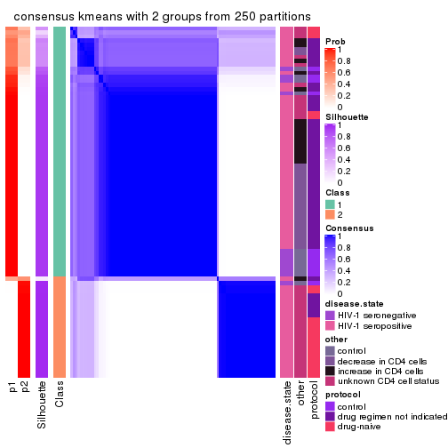</p>

</div>
<div id='tab-MAD-kmeans-consensus-heatmap-2'>
<pre><code class="r">consensus_heatmap(res, k = 3)
</code></pre>

<p>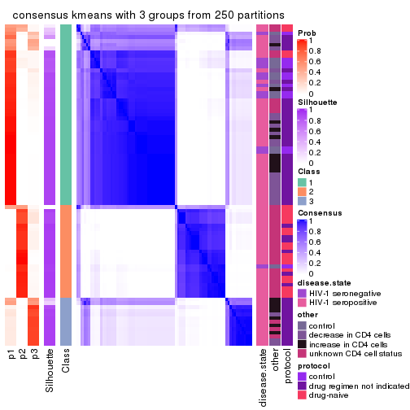</p>

</div>
<div id='tab-MAD-kmeans-consensus-heatmap-3'>
<pre><code class="r">consensus_heatmap(res, k = 4)
</code></pre>

<p>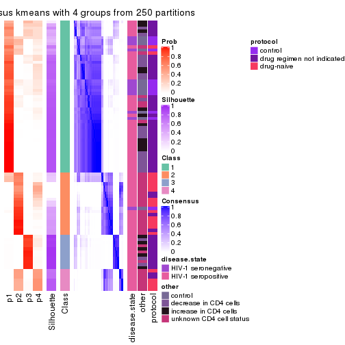</p>

</div>
<div id='tab-MAD-kmeans-consensus-heatmap-4'>
<pre><code class="r">consensus_heatmap(res, k = 5)
</code></pre>

<p>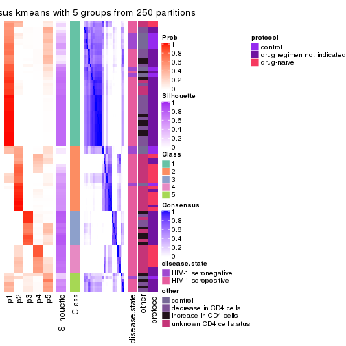</p>

</div>
<div id='tab-MAD-kmeans-consensus-heatmap-5'>
<pre><code class="r">consensus_heatmap(res, k = 6)
</code></pre>

<p>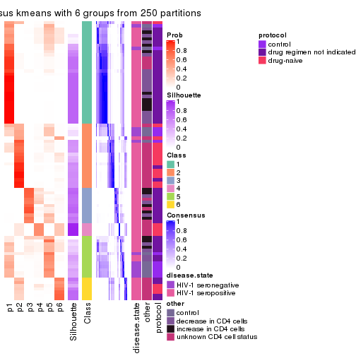</p>

</div>
</div>

Heatmaps for the membership of samples in all partitions to see how consistent they are:


<script>
$( function() {
	$( '#tabs-MAD-kmeans-membership-heatmap' ).tabs();
} );
</script>
<div id='tabs-MAD-kmeans-membership-heatmap'>
<ul>
<li><a href='#tab-MAD-kmeans-membership-heatmap-1'>k = 2</a></li>
<li><a href='#tab-MAD-kmeans-membership-heatmap-2'>k = 3</a></li>
<li><a href='#tab-MAD-kmeans-membership-heatmap-3'>k = 4</a></li>
<li><a href='#tab-MAD-kmeans-membership-heatmap-4'>k = 5</a></li>
<li><a href='#tab-MAD-kmeans-membership-heatmap-5'>k = 6</a></li>
</ul>
<div id='tab-MAD-kmeans-membership-heatmap-1'>
<pre><code class="r">membership_heatmap(res, k = 2)
</code></pre>

<p>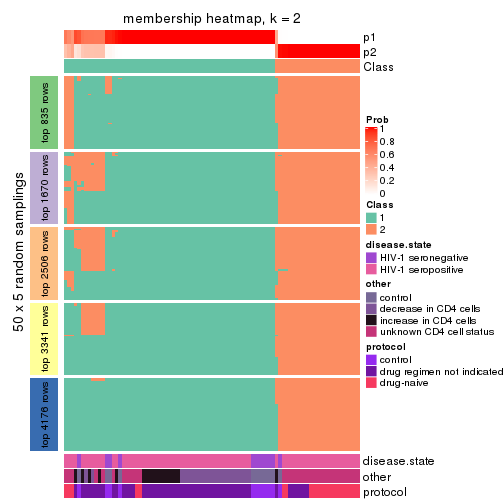</p>

</div>
<div id='tab-MAD-kmeans-membership-heatmap-2'>
<pre><code class="r">membership_heatmap(res, k = 3)
</code></pre>

<p>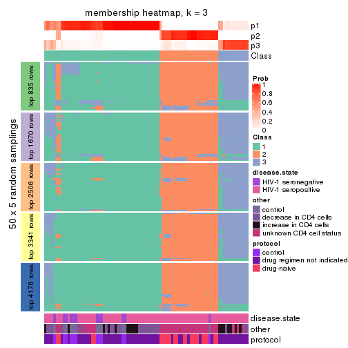</p>

</div>
<div id='tab-MAD-kmeans-membership-heatmap-3'>
<pre><code class="r">membership_heatmap(res, k = 4)
</code></pre>

<p>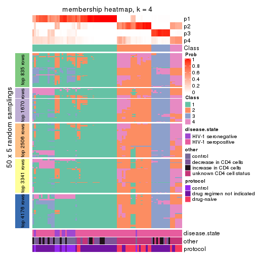</p>

</div>
<div id='tab-MAD-kmeans-membership-heatmap-4'>
<pre><code class="r">membership_heatmap(res, k = 5)
</code></pre>

<p>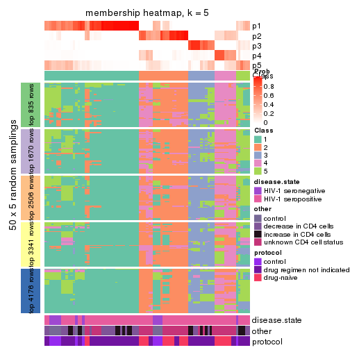</p>

</div>
<div id='tab-MAD-kmeans-membership-heatmap-5'>
<pre><code class="r">membership_heatmap(res, k = 6)
</code></pre>

<p>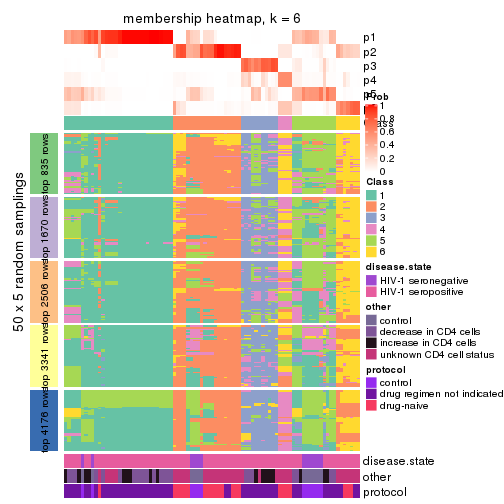</p>

</div>
</div>

As soon as we have had the classes for columns, we can look for signatures
which are significantly different between classes which can be candidate marks
for certain classes. Following are the heatmaps for signatures.


Signature heatmaps where rows are scaled:


<script>
$( function() {
	$( '#tabs-MAD-kmeans-get-signatures' ).tabs();
} );
</script>
<div id='tabs-MAD-kmeans-get-signatures'>
<ul>
<li><a href='#tab-MAD-kmeans-get-signatures-1'>k = 2</a></li>
<li><a href='#tab-MAD-kmeans-get-signatures-2'>k = 3</a></li>
<li><a href='#tab-MAD-kmeans-get-signatures-3'>k = 4</a></li>
<li><a href='#tab-MAD-kmeans-get-signatures-4'>k = 5</a></li>
<li><a href='#tab-MAD-kmeans-get-signatures-5'>k = 6</a></li>
</ul>
<div id='tab-MAD-kmeans-get-signatures-1'>
<pre><code class="r">get_signatures(res, k = 2)
</code></pre>

<p>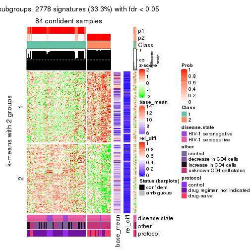</p>

</div>
<div id='tab-MAD-kmeans-get-signatures-2'>
<pre><code class="r">get_signatures(res, k = 3)
</code></pre>

<p>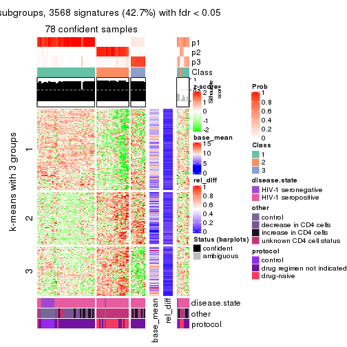</p>

</div>
<div id='tab-MAD-kmeans-get-signatures-3'>
<pre><code class="r">get_signatures(res, k = 4)
</code></pre>

<p>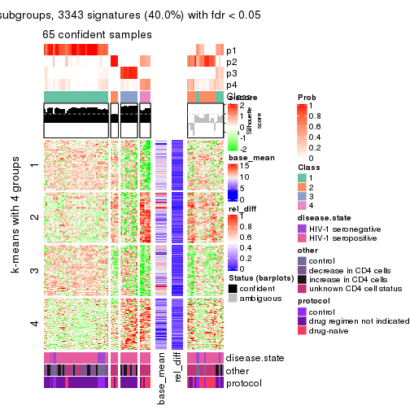</p>

</div>
<div id='tab-MAD-kmeans-get-signatures-4'>
<pre><code class="r">get_signatures(res, k = 5)
</code></pre>

<p>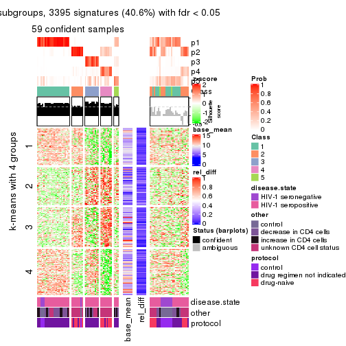</p>

</div>
<div id='tab-MAD-kmeans-get-signatures-5'>
<pre><code class="r">get_signatures(res, k = 6)
</code></pre>

<p>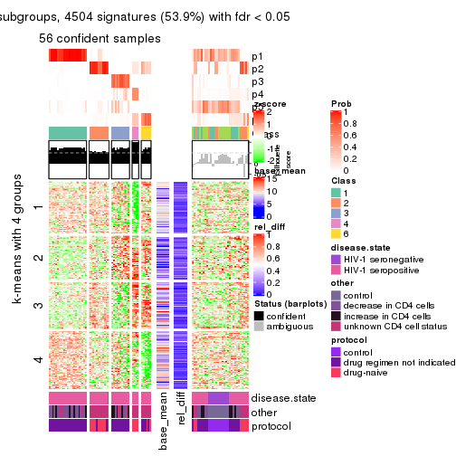</p>

</div>
</div>


Signature heatmaps where rows are not scaled:


<script>
$( function() {
	$( '#tabs-MAD-kmeans-get-signatures-no-scale' ).tabs();
} );
</script>
<div id='tabs-MAD-kmeans-get-signatures-no-scale'>
<ul>
<li><a href='#tab-MAD-kmeans-get-signatures-no-scale-1'>k = 2</a></li>
<li><a href='#tab-MAD-kmeans-get-signatures-no-scale-2'>k = 3</a></li>
<li><a href='#tab-MAD-kmeans-get-signatures-no-scale-3'>k = 4</a></li>
<li><a href='#tab-MAD-kmeans-get-signatures-no-scale-4'>k = 5</a></li>
<li><a href='#tab-MAD-kmeans-get-signatures-no-scale-5'>k = 6</a></li>
</ul>
<div id='tab-MAD-kmeans-get-signatures-no-scale-1'>
<pre><code class="r">get_signatures(res, k = 2, scale_rows = FALSE)
</code></pre>

<p>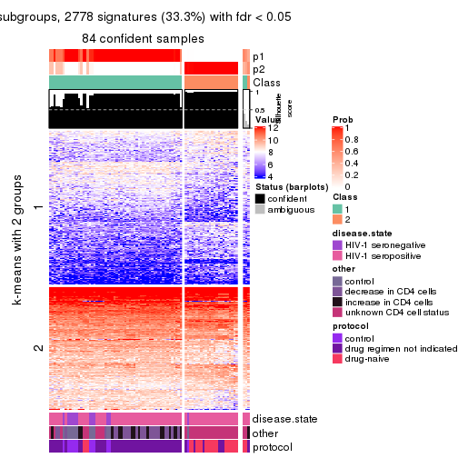</p>

</div>
<div id='tab-MAD-kmeans-get-signatures-no-scale-2'>
<pre><code class="r">get_signatures(res, k = 3, scale_rows = FALSE)
</code></pre>

<p>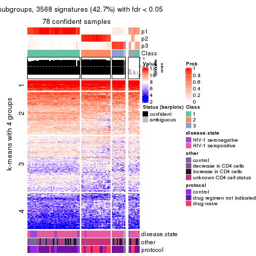</p>

</div>
<div id='tab-MAD-kmeans-get-signatures-no-scale-3'>
<pre><code class="r">get_signatures(res, k = 4, scale_rows = FALSE)
</code></pre>

<p>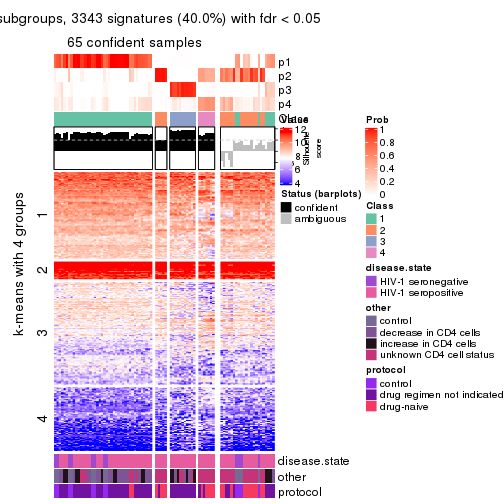</p>

</div>
<div id='tab-MAD-kmeans-get-signatures-no-scale-4'>
<pre><code class="r">get_signatures(res, k = 5, scale_rows = FALSE)
</code></pre>

<p>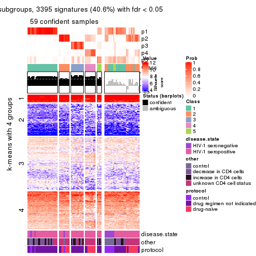</p>

</div>
<div id='tab-MAD-kmeans-get-signatures-no-scale-5'>
<pre><code class="r">get_signatures(res, k = 6, scale_rows = FALSE)
</code></pre>

<p>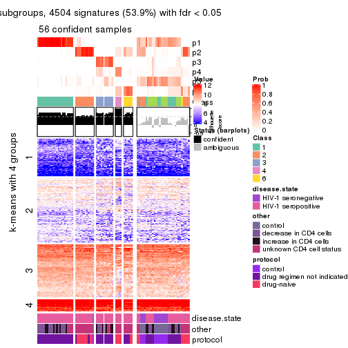</p>

</div>
</div>


Compare the overlap of signatures from different k:

```r
compare_signatures(res)
```

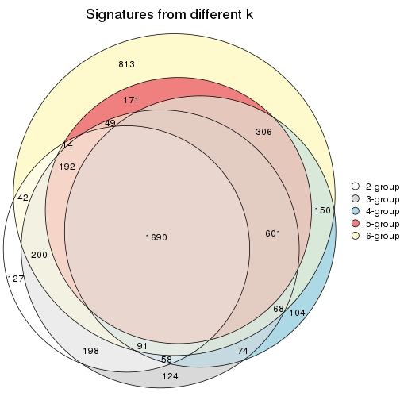

`get_signature()` returns a data frame invisibly. TO get the list of signatures, the function
call should be assigned to a variable explicitly. In following code, if `plot` argument is set
to `FALSE`, no heatmap is plotted while only the differential analysis is performed.

```r
# code only for demonstration
tb = get_signature(res, k = ..., plot = FALSE)
```

An example of the output of `tb` is:

```
#>   which_row         fdr    mean_1    mean_2 scaled_mean_1 scaled_mean_2 km
#> 1        38 0.042760348  8.373488  9.131774    -0.5533452     0.5164555  1
#> 2        40 0.018707592  7.106213  8.469186    -0.6173731     0.5762149  1
#> 3        55 0.019134737 10.221463 11.207825    -0.6159697     0.5749050  1
#> 4        59 0.006059896  5.921854  7.869574    -0.6899429     0.6439467  1
#> 5        60 0.018055526  8.928898 10.211722    -0.6204761     0.5791110  1
#> 6        98 0.009384629 15.714769 14.887706     0.6635654    -0.6193277  2
...
```

The columns in `tb` are:

1. `which_row`: row indices corresponding to the input matrix.
2. `fdr`: FDR for the differential test. 
3. `mean_x`: The mean value in group x.
4. `scaled_mean_x`: The mean value in group x after rows are scaled.
5. `km`: Row groups if k-means clustering is applied to rows.


UMAP plot which shows how samples are separated.


<script>
$( function() {
	$( '#tabs-MAD-kmeans-dimension-reduction' ).tabs();
} );
</script>
<div id='tabs-MAD-kmeans-dimension-reduction'>
<ul>
<li><a href='#tab-MAD-kmeans-dimension-reduction-1'>k = 2</a></li>
<li><a href='#tab-MAD-kmeans-dimension-reduction-2'>k = 3</a></li>
<li><a href='#tab-MAD-kmeans-dimension-reduction-3'>k = 4</a></li>
<li><a href='#tab-MAD-kmeans-dimension-reduction-4'>k = 5</a></li>
<li><a href='#tab-MAD-kmeans-dimension-reduction-5'>k = 6</a></li>
</ul>
<div id='tab-MAD-kmeans-dimension-reduction-1'>
<pre><code class="r">dimension_reduction(res, k = 2, method = &quot;UMAP&quot;)
</code></pre>

<p>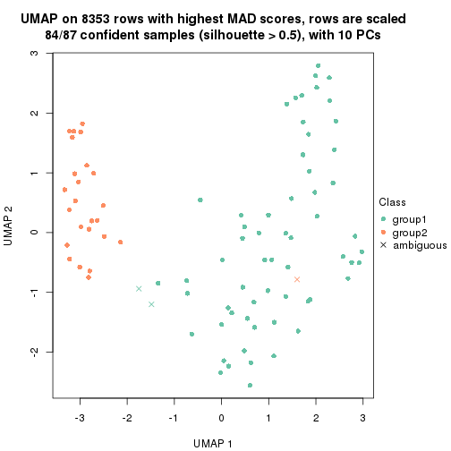</p>

</div>
<div id='tab-MAD-kmeans-dimension-reduction-2'>
<pre><code class="r">dimension_reduction(res, k = 3, method = &quot;UMAP&quot;)
</code></pre>

<p>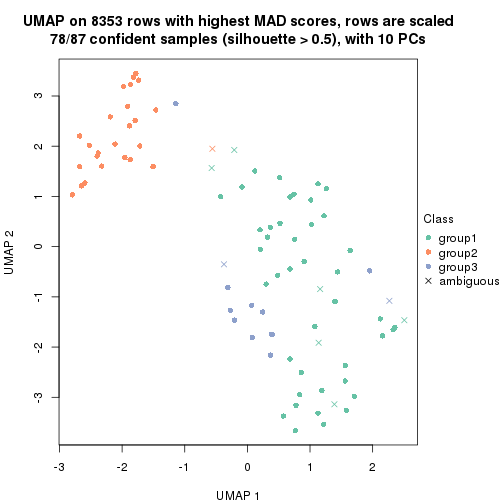</p>

</div>
<div id='tab-MAD-kmeans-dimension-reduction-3'>
<pre><code class="r">dimension_reduction(res, k = 4, method = &quot;UMAP&quot;)
</code></pre>

<p>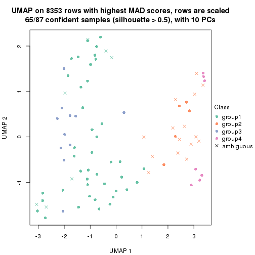</p>

</div>
<div id='tab-MAD-kmeans-dimension-reduction-4'>
<pre><code class="r">dimension_reduction(res, k = 5, method = &quot;UMAP&quot;)
</code></pre>

<p>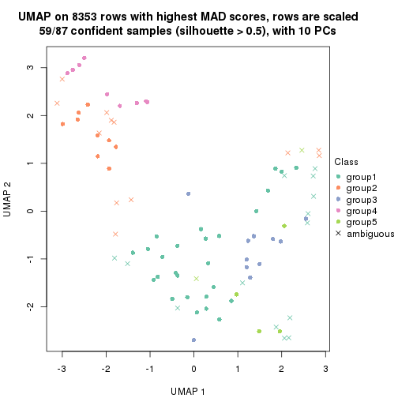</p>

</div>
<div id='tab-MAD-kmeans-dimension-reduction-5'>
<pre><code class="r">dimension_reduction(res, k = 6, method = &quot;UMAP&quot;)
</code></pre>

<p>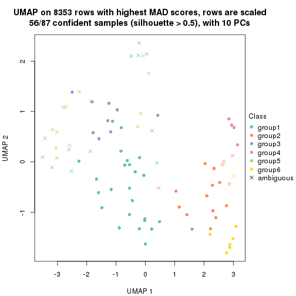</p>

</div>
</div>


Following heatmap shows how subgroups are split when increasing `k`:

```r
collect_classes(res)
```

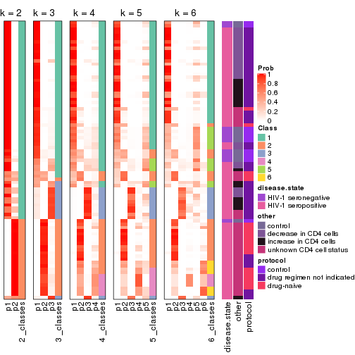


Test correlation between subgroups and known annotations. If the known
annotation is numeric, one-way ANOVA test is applied, and if the known
annotation is discrete, chi-squared contingency table test is applied.

```r
test_to_known_factors(res)
```

```
#>             n disease.state(p) other(p) protocol(p) k
#> MAD:kmeans 84           0.1832 7.77e-10    1.25e-09 2
#> MAD:kmeans 78           0.0345 3.35e-09    3.56e-09 3
#> MAD:kmeans 65           0.1721 2.60e-05    7.02e-07 4
#> MAD:kmeans 59           0.5672 1.46e-04    1.67e-06 5
#> MAD:kmeans 56           0.4433 7.24e-05    8.45e-07 6
```


If matrix rows can be associated to genes, consider to use `GO_Enrichment(res,
...)` to perform function enrichment for the signature genes.


 

---------------------------------------------------


### MAD:skmeans


The object with results only for a single top-value method and a single partition method 
can be extracted as:

```r
res = res_list["MAD", "skmeans"]
# you can also extract it by
# res = res_list["MAD:skmeans"]
```

A summary of `res` and all the functions that can be applied to it:

```r
res
```

```
#> A 'ConsensusPartition' object with k = 2, 3, 4, 5, 6.
#>   On a matrix with 8353 rows and 87 columns.
#>   Top rows (835, 1670, 2506, 3341, 4176) are extracted by 'MAD' method.
#>   Subgroups are detected by 'skmeans' method.
#>   Performed in total 1250 partitions by row resampling.
#>   Best k for subgroups seems to be 2.
#> 
#> Following methods can be applied to this 'ConsensusPartition' object:
#>  [1] "cola_report"             "collect_classes"         "collect_plots"          
#>  [4] "collect_stats"           "colnames"                "compare_signatures"     
#>  [7] "consensus_heatmap"       "dimension_reduction"     "functional_enrichment"  
#> [10] "get_anno_col"            "get_anno"                "get_classes"            
#> [13] "get_consensus"           "get_matrix"              "get_membership"         
#> [16] "get_param"               "get_signatures"          "get_stats"              
#> [19] "is_best_k"               "is_stable_k"             "membership_heatmap"     
#> [22] "ncol"                    "nrow"                    "plot_ecdf"              
#> [25] "rownames"                "select_partition_number" "show"                   
#> [28] "suggest_best_k"          "test_to_known_factors"
```

`collect_plots()` function collects all the plots made from `res` for all `k` (number of partitions)
into one single page to provide an easy and fast comparison between different `k`.

```r
collect_plots(res)
```

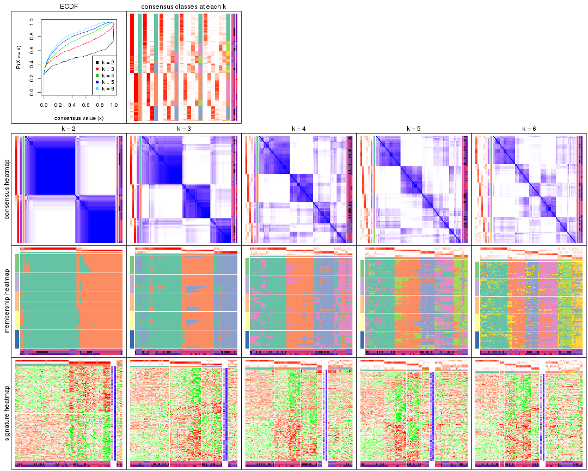

The plots are:

- The first row: a plot of the ECDF (Empirical cumulative distribution
  function) curves of the consensus matrix for each `k` and the heatmap of
  predicted classes for each `k`.
- The second row: heatmaps of the consensus matrix for each `k`.
- The third row: heatmaps of the membership matrix for each `k`.
- The fouth row: heatmaps of the signatures for each `k`.

All the plots in panels can be made by individual functions and they are
plotted later in this section.

`select_partition_number()` produces several plots showing different
statistics for choosing "optimized" `k`. There are following statistics:

- ECDF curves of the consensus matrix for each `k`;
- 1-PAC. [The PAC
  score](https://en.wikipedia.org/wiki/Consensus_clustering#Over-interpretation_potential_of_consensus_clustering)
  measures the proportion of the ambiguous subgrouping.
- Mean silhouette score.
- Concordance. The mean probability of fiting the consensus class ids in all
  partitions.
- Area increased. Denote $A_k$ as the area under the ECDF curve for current
  `k`, the area increased is defined as $A_k - A_{k-1}$.
- Rand index. The percent of pairs of samples that are both in a same cluster
  or both are not in a same cluster in the partition of k and k-1.
- Jaccard index. The ratio of pairs of samples are both in a same cluster in
  the partition of k and k-1 and the pairs of samples are both in a same
  cluster in the partition k or k-1.

The detailed explanations of these statistics can be found in [the cola
vignette](http://bioconductor.org/packages/devel/bioc/vignettes/cola/inst/doc/cola.html#toc_13).

Generally speaking, lower PAC score, higher mean silhouette score or higher
concordance corresponds to better partition. Rand index and Jaccard index
measure how similar the current partition is compared to partition with `k-1`.
If they are too similar, we won't accept `k` is better than `k-1`.

```r
select_partition_number(res)
```

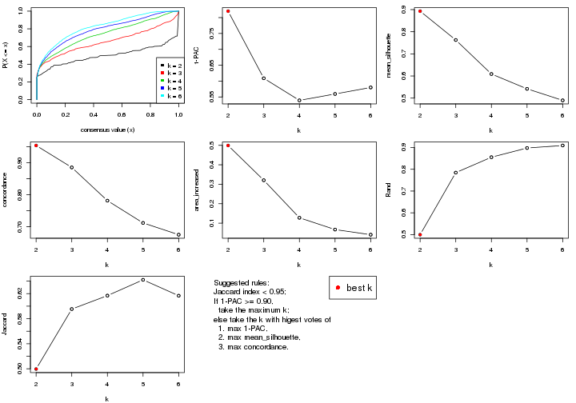

The numeric values for all these statistics can be obtained by `get_stats()`.

```r
get_stats(res)
```

```
#>   k 1-PAC mean_silhouette concordance area_increased  Rand Jaccard
#> 2 2 0.820           0.893       0.954         0.4990 0.500   0.500
#> 3 3 0.609           0.763       0.885         0.3206 0.785   0.595
#> 4 4 0.539           0.609       0.782         0.1277 0.855   0.617
#> 5 5 0.559           0.542       0.712         0.0672 0.898   0.642
#> 6 6 0.580           0.490       0.675         0.0408 0.909   0.617
```

`suggest_best_k()` suggests the best $k$ based on these statistics. The rules are as follows:

- All $k$ with Jaccard index larger than 0.95 are removed because the increase of
  the partition number does not provides enough extra information. If all $k$ are removed,
  the best $k$ is assigned by `NA`.
- For $k$ with 1-PAC larger than 0.9, the maximal $k$ is taken as the "best k". Other $k$ is called "optional k".
- If it does not fit the second rule. The $k$ with the highest vote of highest
  1-PAC, mean silhouette and concordance is taken as the "best k".

```r
suggest_best_k(res)
```

```
#> [1] 2
```


Following shows the table of the partitions (You need to click the **show/hide
code output** link to see it). The membership matrix (columns with name `p*`)
is inferred by
[`clue::cl_consensus()`](https://www.rdocumentation.org/link/cl_consensus?package=clue)
function with the `SE` method. Basically the value in the membership matrix
represents the probability to belong to a certain group. The finall class
label for an item is determined with the group with highest probability it
belongs to.

In `get_classes()` function, the entropy is calculated from the membership
matrix and the silhouette score is calculated from the consensus matrix.


<script>
$( function() {
	$( '#tabs-MAD-skmeans-get-classes' ).tabs();
} );
</script>
<div id='tabs-MAD-skmeans-get-classes'>
<ul>
<li><a href='#tab-MAD-skmeans-get-classes-1'>k = 2</a></li>
<li><a href='#tab-MAD-skmeans-get-classes-2'>k = 3</a></li>
<li><a href='#tab-MAD-skmeans-get-classes-3'>k = 4</a></li>
<li><a href='#tab-MAD-skmeans-get-classes-4'>k = 5</a></li>
<li><a href='#tab-MAD-skmeans-get-classes-5'>k = 6</a></li>
</ul>

<div id='tab-MAD-skmeans-get-classes-1'>
<p><a id='tab-MAD-skmeans-get-classes-1-a' style='color:#0366d6' href='#'>show/hide code output</a></p>
<pre><code class="r">cbind(get_classes(res, k = 2), get_membership(res, k = 2))
</code></pre>

<pre><code>#&gt;          class entropy silhouette    p1    p2
#&gt; GSM39104     1  0.0000      0.960 1.000 0.000
#&gt; GSM39105     1  0.0000      0.960 1.000 0.000
#&gt; GSM39106     1  0.1633      0.943 0.976 0.024
#&gt; GSM39107     1  0.5294      0.850 0.880 0.120
#&gt; GSM39108     1  0.0000      0.960 1.000 0.000
#&gt; GSM39109     2  0.0672      0.931 0.008 0.992
#&gt; GSM39110     1  0.0000      0.960 1.000 0.000
#&gt; GSM39111     1  0.0000      0.960 1.000 0.000
#&gt; GSM39112     1  0.3733      0.900 0.928 0.072
#&gt; GSM39113     1  0.8267      0.648 0.740 0.260
#&gt; GSM39114     2  0.0000      0.935 0.000 1.000
#&gt; GSM39115     1  0.0000      0.960 1.000 0.000
#&gt; GSM39148     1  0.0000      0.960 1.000 0.000
#&gt; GSM39149     2  0.5178      0.855 0.116 0.884
#&gt; GSM39150     1  0.0000      0.960 1.000 0.000
#&gt; GSM39151     2  0.6801      0.786 0.180 0.820
#&gt; GSM39152     1  0.7950      0.663 0.760 0.240
#&gt; GSM39153     1  0.0000      0.960 1.000 0.000
#&gt; GSM39154     1  0.0000      0.960 1.000 0.000
#&gt; GSM39155     1  0.0000      0.960 1.000 0.000
#&gt; GSM39156     1  0.0000      0.960 1.000 0.000
#&gt; GSM39157     1  0.0000      0.960 1.000 0.000
#&gt; GSM39158     1  0.0000      0.960 1.000 0.000
#&gt; GSM39159     1  0.3274      0.909 0.940 0.060
#&gt; GSM39160     1  0.0000      0.960 1.000 0.000
#&gt; GSM39161     1  0.9170      0.470 0.668 0.332
#&gt; GSM39162     1  0.0000      0.960 1.000 0.000
#&gt; GSM39163     1  0.0000      0.960 1.000 0.000
#&gt; GSM39164     1  0.0000      0.960 1.000 0.000
#&gt; GSM39165     1  0.0000      0.960 1.000 0.000
#&gt; GSM39166     1  0.0000      0.960 1.000 0.000
#&gt; GSM39167     1  0.0000      0.960 1.000 0.000
#&gt; GSM39168     1  0.0000      0.960 1.000 0.000
#&gt; GSM39169     1  0.0000      0.960 1.000 0.000
#&gt; GSM39170     1  0.0000      0.960 1.000 0.000
#&gt; GSM39171     1  0.0000      0.960 1.000 0.000
#&gt; GSM39172     2  0.2423      0.914 0.040 0.960
#&gt; GSM39173     2  0.3431      0.898 0.064 0.936
#&gt; GSM39174     1  0.0000      0.960 1.000 0.000
#&gt; GSM39175     1  0.0000      0.960 1.000 0.000
#&gt; GSM39176     1  0.0000      0.960 1.000 0.000
#&gt; GSM39177     2  0.9896      0.257 0.440 0.560
#&gt; GSM39178     1  0.0000      0.960 1.000 0.000
#&gt; GSM39179     2  0.0672      0.932 0.008 0.992
#&gt; GSM39180     2  0.0000      0.935 0.000 1.000
#&gt; GSM39181     1  0.0000      0.960 1.000 0.000
#&gt; GSM39182     2  0.2778      0.910 0.048 0.952
#&gt; GSM39183     1  0.0000      0.960 1.000 0.000
#&gt; GSM39184     1  0.0000      0.960 1.000 0.000
#&gt; GSM39185     1  0.9866      0.187 0.568 0.432
#&gt; GSM39186     1  0.0000      0.960 1.000 0.000
#&gt; GSM39187     1  0.0000      0.960 1.000 0.000
#&gt; GSM39116     2  0.0000      0.935 0.000 1.000
#&gt; GSM39117     2  0.0000      0.935 0.000 1.000
#&gt; GSM39118     2  0.0000      0.935 0.000 1.000
#&gt; GSM39119     2  0.0000      0.935 0.000 1.000
#&gt; GSM39120     1  0.3879      0.896 0.924 0.076
#&gt; GSM39121     2  0.9491      0.423 0.368 0.632
#&gt; GSM39122     2  0.9358      0.461 0.352 0.648
#&gt; GSM39123     2  0.0000      0.935 0.000 1.000
#&gt; GSM39124     2  0.0000      0.935 0.000 1.000
#&gt; GSM39125     1  0.4562      0.876 0.904 0.096
#&gt; GSM39126     2  0.7602      0.708 0.220 0.780
#&gt; GSM39127     2  0.0000      0.935 0.000 1.000
#&gt; GSM39128     2  0.0000      0.935 0.000 1.000
#&gt; GSM39129     2  0.0000      0.935 0.000 1.000
#&gt; GSM39130     2  0.0000      0.935 0.000 1.000
#&gt; GSM39131     2  0.0000      0.935 0.000 1.000
#&gt; GSM39132     2  0.0000      0.935 0.000 1.000
#&gt; GSM39133     2  0.0000      0.935 0.000 1.000
#&gt; GSM39134     2  0.0000      0.935 0.000 1.000
#&gt; GSM39135     2  0.0000      0.935 0.000 1.000
#&gt; GSM39136     2  0.0000      0.935 0.000 1.000
#&gt; GSM39137     2  0.0000      0.935 0.000 1.000
#&gt; GSM39138     2  0.0000      0.935 0.000 1.000
#&gt; GSM39139     2  0.0000      0.935 0.000 1.000
#&gt; GSM39140     1  0.0672      0.954 0.992 0.008
#&gt; GSM39141     1  0.0000      0.960 1.000 0.000
#&gt; GSM39142     1  0.0000      0.960 1.000 0.000
#&gt; GSM39143     1  0.0000      0.960 1.000 0.000
#&gt; GSM39144     2  0.0000      0.935 0.000 1.000
#&gt; GSM39145     2  0.0000      0.935 0.000 1.000
#&gt; GSM39146     2  0.0000      0.935 0.000 1.000
#&gt; GSM39147     2  0.0000      0.935 0.000 1.000
#&gt; GSM39188     2  0.4690      0.869 0.100 0.900
#&gt; GSM39189     2  0.8327      0.666 0.264 0.736
#&gt; GSM39190     2  0.4431      0.876 0.092 0.908
</code></pre>

<script>
$('#tab-MAD-skmeans-get-classes-1-a').parent().next().next().hide();
$('#tab-MAD-skmeans-get-classes-1-a').click(function(){
  $('#tab-MAD-skmeans-get-classes-1-a').parent().next().next().toggle();
  return(false);
});
</script>
</div>

<div id='tab-MAD-skmeans-get-classes-2'>
<p><a id='tab-MAD-skmeans-get-classes-2-a' style='color:#0366d6' href='#'>show/hide code output</a></p>
<pre><code class="r">cbind(get_classes(res, k = 3), get_membership(res, k = 3))
</code></pre>

<pre><code>#&gt;          class entropy silhouette    p1    p2    p3
#&gt; GSM39104     1  0.6204     0.2755 0.576 0.000 0.424
#&gt; GSM39105     1  0.1163     0.8455 0.972 0.000 0.028
#&gt; GSM39106     1  0.7596     0.5963 0.672 0.100 0.228
#&gt; GSM39107     1  0.6140     0.3789 0.596 0.404 0.000
#&gt; GSM39108     1  0.4539     0.7530 0.836 0.016 0.148
#&gt; GSM39109     3  0.6589     0.5134 0.032 0.280 0.688
#&gt; GSM39110     1  0.8056     0.2552 0.532 0.068 0.400
#&gt; GSM39111     1  0.6305     0.0604 0.516 0.000 0.484
#&gt; GSM39112     1  0.4733     0.7176 0.800 0.196 0.004
#&gt; GSM39113     2  0.6468     0.0677 0.444 0.552 0.004
#&gt; GSM39114     2  0.0000     0.8856 0.000 1.000 0.000
#&gt; GSM39115     1  0.0000     0.8533 1.000 0.000 0.000
#&gt; GSM39148     1  0.0000     0.8533 1.000 0.000 0.000
#&gt; GSM39149     3  0.0000     0.8599 0.000 0.000 1.000
#&gt; GSM39150     3  0.6095     0.3365 0.392 0.000 0.608
#&gt; GSM39151     3  0.0000     0.8599 0.000 0.000 1.000
#&gt; GSM39152     3  0.1031     0.8561 0.024 0.000 0.976
#&gt; GSM39153     1  0.0237     0.8530 0.996 0.000 0.004
#&gt; GSM39154     1  0.0424     0.8525 0.992 0.000 0.008
#&gt; GSM39155     1  0.0000     0.8533 1.000 0.000 0.000
#&gt; GSM39156     1  0.1399     0.8457 0.968 0.028 0.004
#&gt; GSM39157     1  0.0000     0.8533 1.000 0.000 0.000
#&gt; GSM39158     1  0.2959     0.7951 0.900 0.000 0.100
#&gt; GSM39159     3  0.5291     0.6442 0.268 0.000 0.732
#&gt; GSM39160     3  0.5327     0.6128 0.272 0.000 0.728
#&gt; GSM39161     3  0.4654     0.7242 0.208 0.000 0.792
#&gt; GSM39162     1  0.0000     0.8533 1.000 0.000 0.000
#&gt; GSM39163     1  0.0000     0.8533 1.000 0.000 0.000
#&gt; GSM39164     1  0.0000     0.8533 1.000 0.000 0.000
#&gt; GSM39165     3  0.6260     0.2426 0.448 0.000 0.552
#&gt; GSM39166     1  0.5650     0.5097 0.688 0.000 0.312
#&gt; GSM39167     1  0.0000     0.8533 1.000 0.000 0.000
#&gt; GSM39168     1  0.0000     0.8533 1.000 0.000 0.000
#&gt; GSM39169     1  0.0892     0.8491 0.980 0.000 0.020
#&gt; GSM39170     1  0.3412     0.7757 0.876 0.000 0.124
#&gt; GSM39171     1  0.5706     0.5296 0.680 0.000 0.320
#&gt; GSM39172     3  0.0237     0.8584 0.000 0.004 0.996
#&gt; GSM39173     3  0.1289     0.8452 0.000 0.032 0.968
#&gt; GSM39174     1  0.0000     0.8533 1.000 0.000 0.000
#&gt; GSM39175     1  0.3192     0.7960 0.888 0.000 0.112
#&gt; GSM39176     1  0.0000     0.8533 1.000 0.000 0.000
#&gt; GSM39177     3  0.0892     0.8582 0.020 0.000 0.980
#&gt; GSM39178     3  0.3482     0.7879 0.128 0.000 0.872
#&gt; GSM39179     3  0.0000     0.8599 0.000 0.000 1.000
#&gt; GSM39180     3  0.1753     0.8315 0.000 0.048 0.952
#&gt; GSM39181     1  0.5254     0.5940 0.736 0.000 0.264
#&gt; GSM39182     3  0.2096     0.8280 0.004 0.052 0.944
#&gt; GSM39183     1  0.6154     0.2680 0.592 0.000 0.408
#&gt; GSM39184     1  0.0424     0.8528 0.992 0.000 0.008
#&gt; GSM39185     3  0.3038     0.8196 0.104 0.000 0.896
#&gt; GSM39186     1  0.0747     0.8502 0.984 0.000 0.016
#&gt; GSM39187     1  0.0000     0.8533 1.000 0.000 0.000
#&gt; GSM39116     2  0.1289     0.8898 0.000 0.968 0.032
#&gt; GSM39117     2  0.4796     0.7998 0.000 0.780 0.220
#&gt; GSM39118     2  0.3267     0.8715 0.000 0.884 0.116
#&gt; GSM39119     2  0.4121     0.8463 0.000 0.832 0.168
#&gt; GSM39120     1  0.5517     0.6379 0.728 0.268 0.004
#&gt; GSM39121     2  0.4504     0.6943 0.196 0.804 0.000
#&gt; GSM39122     2  0.2959     0.8088 0.100 0.900 0.000
#&gt; GSM39123     2  0.4796     0.7998 0.000 0.780 0.220
#&gt; GSM39124     2  0.0000     0.8856 0.000 1.000 0.000
#&gt; GSM39125     1  0.4978     0.6973 0.780 0.216 0.004
#&gt; GSM39126     2  0.1860     0.8533 0.052 0.948 0.000
#&gt; GSM39127     2  0.0237     0.8872 0.000 0.996 0.004
#&gt; GSM39128     2  0.0000     0.8856 0.000 1.000 0.000
#&gt; GSM39129     2  0.4062     0.8496 0.000 0.836 0.164
#&gt; GSM39130     2  0.4796     0.7998 0.000 0.780 0.220
#&gt; GSM39131     2  0.0237     0.8871 0.000 0.996 0.004
#&gt; GSM39132     2  0.0424     0.8881 0.000 0.992 0.008
#&gt; GSM39133     2  0.3941     0.8549 0.000 0.844 0.156
#&gt; GSM39134     2  0.4002     0.8518 0.000 0.840 0.160
#&gt; GSM39135     2  0.1529     0.8901 0.000 0.960 0.040
#&gt; GSM39136     2  0.1529     0.8901 0.000 0.960 0.040
#&gt; GSM39137     2  0.0000     0.8856 0.000 1.000 0.000
#&gt; GSM39138     2  0.4062     0.8489 0.000 0.836 0.164
#&gt; GSM39139     2  0.2711     0.8804 0.000 0.912 0.088
#&gt; GSM39140     1  0.1643     0.8379 0.956 0.044 0.000
#&gt; GSM39141     1  0.1163     0.8454 0.972 0.028 0.000
#&gt; GSM39142     1  0.1031     0.8469 0.976 0.024 0.000
#&gt; GSM39143     1  0.1163     0.8454 0.972 0.028 0.000
#&gt; GSM39144     2  0.3879     0.8565 0.000 0.848 0.152
#&gt; GSM39145     2  0.1753     0.8891 0.000 0.952 0.048
#&gt; GSM39146     2  0.0592     0.8885 0.000 0.988 0.012
#&gt; GSM39147     2  0.0424     0.8881 0.000 0.992 0.008
#&gt; GSM39188     3  0.0000     0.8599 0.000 0.000 1.000
#&gt; GSM39189     3  0.0000     0.8599 0.000 0.000 1.000
#&gt; GSM39190     3  0.0000     0.8599 0.000 0.000 1.000
</code></pre>

<script>
$('#tab-MAD-skmeans-get-classes-2-a').parent().next().next().hide();
$('#tab-MAD-skmeans-get-classes-2-a').click(function(){
  $('#tab-MAD-skmeans-get-classes-2-a').parent().next().next().toggle();
  return(false);
});
</script>
</div>

<div id='tab-MAD-skmeans-get-classes-3'>
<p><a id='tab-MAD-skmeans-get-classes-3-a' style='color:#0366d6' href='#'>show/hide code output</a></p>
<pre><code class="r">cbind(get_classes(res, k = 4), get_membership(res, k = 4))
</code></pre>

<pre><code>#&gt;          class entropy silhouette    p1    p2    p3    p4
#&gt; GSM39104     4  0.7205     0.2707 0.200 0.000 0.252 0.548
#&gt; GSM39105     1  0.6454     0.3422 0.544 0.000 0.076 0.380
#&gt; GSM39106     4  0.6039     0.5168 0.140 0.020 0.116 0.724
#&gt; GSM39107     4  0.3948     0.5764 0.096 0.064 0.000 0.840
#&gt; GSM39108     4  0.7042     0.1585 0.352 0.000 0.132 0.516
#&gt; GSM39109     4  0.7928    -0.0133 0.008 0.208 0.380 0.404
#&gt; GSM39110     4  0.6877     0.3975 0.156 0.004 0.232 0.608
#&gt; GSM39111     4  0.7808     0.1091 0.256 0.000 0.344 0.400
#&gt; GSM39112     4  0.3876     0.5576 0.124 0.040 0.000 0.836
#&gt; GSM39113     4  0.3810     0.5808 0.060 0.092 0.000 0.848
#&gt; GSM39114     4  0.4843     0.1198 0.000 0.396 0.000 0.604
#&gt; GSM39115     1  0.4744     0.6017 0.704 0.000 0.012 0.284
#&gt; GSM39148     1  0.1474     0.7628 0.948 0.000 0.000 0.052
#&gt; GSM39149     3  0.1913     0.7608 0.000 0.040 0.940 0.020
#&gt; GSM39150     4  0.7880    -0.0119 0.284 0.000 0.344 0.372
#&gt; GSM39151     3  0.1545     0.7608 0.000 0.040 0.952 0.008
#&gt; GSM39152     3  0.2469     0.7047 0.000 0.000 0.892 0.108
#&gt; GSM39153     1  0.1975     0.7716 0.936 0.000 0.016 0.048
#&gt; GSM39154     1  0.1624     0.7726 0.952 0.000 0.020 0.028
#&gt; GSM39155     1  0.1557     0.7688 0.944 0.000 0.000 0.056
#&gt; GSM39156     1  0.4936     0.5290 0.700 0.000 0.020 0.280
#&gt; GSM39157     1  0.0592     0.7710 0.984 0.000 0.000 0.016
#&gt; GSM39158     1  0.4804     0.6784 0.776 0.000 0.064 0.160
#&gt; GSM39159     3  0.7008     0.3351 0.340 0.004 0.540 0.116
#&gt; GSM39160     3  0.7437     0.2352 0.248 0.000 0.512 0.240
#&gt; GSM39161     3  0.7400     0.4170 0.296 0.016 0.552 0.136
#&gt; GSM39162     1  0.1637     0.7597 0.940 0.000 0.000 0.060
#&gt; GSM39163     1  0.1004     0.7719 0.972 0.000 0.004 0.024
#&gt; GSM39164     1  0.1824     0.7733 0.936 0.000 0.004 0.060
#&gt; GSM39165     1  0.6305     0.1448 0.516 0.000 0.424 0.060
#&gt; GSM39166     1  0.7346     0.3758 0.520 0.000 0.200 0.280
#&gt; GSM39167     1  0.0817     0.7692 0.976 0.000 0.000 0.024
#&gt; GSM39168     1  0.1557     0.7615 0.944 0.000 0.000 0.056
#&gt; GSM39169     1  0.3143     0.7595 0.876 0.000 0.024 0.100
#&gt; GSM39170     1  0.5142     0.6566 0.744 0.000 0.064 0.192
#&gt; GSM39171     1  0.7310     0.3476 0.532 0.000 0.256 0.212
#&gt; GSM39172     3  0.2918     0.7435 0.000 0.116 0.876 0.008
#&gt; GSM39173     3  0.3612     0.7232 0.004 0.144 0.840 0.012
#&gt; GSM39174     1  0.1284     0.7732 0.964 0.000 0.012 0.024
#&gt; GSM39175     1  0.2943     0.7487 0.892 0.000 0.076 0.032
#&gt; GSM39176     1  0.1022     0.7688 0.968 0.000 0.000 0.032
#&gt; GSM39177     3  0.2291     0.7504 0.016 0.016 0.932 0.036
#&gt; GSM39178     3  0.5184     0.5923 0.056 0.000 0.732 0.212
#&gt; GSM39179     3  0.2125     0.7560 0.000 0.076 0.920 0.004
#&gt; GSM39180     3  0.4678     0.6422 0.000 0.232 0.744 0.024
#&gt; GSM39181     1  0.5807     0.6128 0.708 0.000 0.132 0.160
#&gt; GSM39182     3  0.6165     0.5606 0.032 0.268 0.664 0.036
#&gt; GSM39183     1  0.7538     0.3259 0.492 0.000 0.248 0.260
#&gt; GSM39184     1  0.2670     0.7563 0.904 0.000 0.024 0.072
#&gt; GSM39185     3  0.6962     0.5349 0.184 0.020 0.640 0.156
#&gt; GSM39186     1  0.4500     0.6791 0.776 0.000 0.032 0.192
#&gt; GSM39187     1  0.1474     0.7692 0.948 0.000 0.000 0.052
#&gt; GSM39116     2  0.1824     0.8292 0.000 0.936 0.004 0.060
#&gt; GSM39117     2  0.3649     0.7076 0.000 0.796 0.204 0.000
#&gt; GSM39118     2  0.1389     0.8265 0.000 0.952 0.048 0.000
#&gt; GSM39119     2  0.2469     0.7964 0.000 0.892 0.108 0.000
#&gt; GSM39120     4  0.5090     0.4967 0.228 0.044 0.000 0.728
#&gt; GSM39121     4  0.6748     0.2776 0.112 0.328 0.000 0.560
#&gt; GSM39122     4  0.5888     0.0453 0.036 0.424 0.000 0.540
#&gt; GSM39123     2  0.3486     0.7262 0.000 0.812 0.188 0.000
#&gt; GSM39124     2  0.4277     0.6555 0.000 0.720 0.000 0.280
#&gt; GSM39125     4  0.5959     0.3502 0.336 0.032 0.012 0.620
#&gt; GSM39126     4  0.6277     0.2193 0.068 0.360 0.000 0.572
#&gt; GSM39127     2  0.3444     0.7623 0.000 0.816 0.000 0.184
#&gt; GSM39128     2  0.4072     0.6922 0.000 0.748 0.000 0.252
#&gt; GSM39129     2  0.2081     0.8138 0.000 0.916 0.084 0.000
#&gt; GSM39130     2  0.3486     0.7262 0.000 0.812 0.188 0.000
#&gt; GSM39131     2  0.4040     0.6998 0.000 0.752 0.000 0.248
#&gt; GSM39132     2  0.3356     0.7682 0.000 0.824 0.000 0.176
#&gt; GSM39133     2  0.2611     0.8070 0.000 0.896 0.096 0.008
#&gt; GSM39134     2  0.1807     0.8256 0.000 0.940 0.052 0.008
#&gt; GSM39135     2  0.1557     0.8289 0.000 0.944 0.000 0.056
#&gt; GSM39136     2  0.1824     0.8296 0.000 0.936 0.004 0.060
#&gt; GSM39137     2  0.4720     0.5786 0.004 0.672 0.000 0.324
#&gt; GSM39138     2  0.2149     0.8090 0.000 0.912 0.088 0.000
#&gt; GSM39139     2  0.1706     0.8326 0.000 0.948 0.016 0.036
#&gt; GSM39140     1  0.4643     0.4385 0.656 0.000 0.000 0.344
#&gt; GSM39141     1  0.3975     0.5976 0.760 0.000 0.000 0.240
#&gt; GSM39142     1  0.3726     0.6400 0.788 0.000 0.000 0.212
#&gt; GSM39143     1  0.4193     0.5621 0.732 0.000 0.000 0.268
#&gt; GSM39144     2  0.2101     0.8243 0.000 0.928 0.060 0.012
#&gt; GSM39145     2  0.2021     0.8318 0.000 0.932 0.012 0.056
#&gt; GSM39146     2  0.2271     0.8259 0.000 0.916 0.008 0.076
#&gt; GSM39147     2  0.3610     0.7475 0.000 0.800 0.000 0.200
#&gt; GSM39188     3  0.1398     0.7617 0.000 0.040 0.956 0.004
#&gt; GSM39189     3  0.2032     0.7531 0.000 0.028 0.936 0.036
#&gt; GSM39190     3  0.2271     0.7585 0.000 0.076 0.916 0.008
</code></pre>

<script>
$('#tab-MAD-skmeans-get-classes-3-a').parent().next().next().hide();
$('#tab-MAD-skmeans-get-classes-3-a').click(function(){
  $('#tab-MAD-skmeans-get-classes-3-a').parent().next().next().toggle();
  return(false);
});
</script>
</div>

<div id='tab-MAD-skmeans-get-classes-4'>
<p><a id='tab-MAD-skmeans-get-classes-4-a' style='color:#0366d6' href='#'>show/hide code output</a></p>
<pre><code class="r">cbind(get_classes(res, k = 5), get_membership(res, k = 5))
</code></pre>

<pre><code>#&gt;          class entropy silhouette    p1    p2    p3    p4    p5
#&gt; GSM39104     4  0.7521     0.2961 0.092 0.000 0.144 0.476 0.288
#&gt; GSM39105     1  0.7596    -0.2145 0.364 0.000 0.052 0.364 0.220
#&gt; GSM39106     5  0.7432    -0.1147 0.088 0.000 0.120 0.348 0.444
#&gt; GSM39107     5  0.3920     0.5623 0.040 0.024 0.000 0.116 0.820
#&gt; GSM39108     4  0.8043     0.1780 0.196 0.000 0.108 0.348 0.348
#&gt; GSM39109     5  0.8785    -0.1007 0.012 0.168 0.244 0.284 0.292
#&gt; GSM39110     4  0.8454     0.1072 0.136 0.012 0.172 0.348 0.332
#&gt; GSM39111     4  0.8191     0.3751 0.164 0.000 0.228 0.412 0.196
#&gt; GSM39112     5  0.4741     0.4684 0.084 0.004 0.008 0.148 0.756
#&gt; GSM39113     5  0.2953     0.5727 0.004 0.028 0.000 0.100 0.868
#&gt; GSM39114     5  0.4273     0.5358 0.000 0.212 0.004 0.036 0.748
#&gt; GSM39115     4  0.6630     0.1691 0.368 0.000 0.012 0.464 0.156
#&gt; GSM39148     1  0.0566     0.7434 0.984 0.000 0.000 0.004 0.012
#&gt; GSM39149     3  0.1547     0.7904 0.000 0.016 0.948 0.032 0.004
#&gt; GSM39150     4  0.6951     0.4586 0.104 0.000 0.196 0.584 0.116
#&gt; GSM39151     3  0.2027     0.7967 0.000 0.024 0.928 0.040 0.008
#&gt; GSM39152     3  0.3838     0.6804 0.000 0.004 0.804 0.148 0.044
#&gt; GSM39153     1  0.2452     0.7432 0.896 0.000 0.016 0.084 0.004
#&gt; GSM39154     1  0.2561     0.7431 0.884 0.000 0.020 0.096 0.000
#&gt; GSM39155     1  0.3922     0.6651 0.780 0.000 0.000 0.180 0.040
#&gt; GSM39156     1  0.4851     0.5843 0.712 0.000 0.000 0.092 0.196
#&gt; GSM39157     1  0.2179     0.7377 0.896 0.000 0.000 0.100 0.004
#&gt; GSM39158     4  0.4516     0.1761 0.416 0.000 0.004 0.576 0.004
#&gt; GSM39159     4  0.7563     0.3137 0.140 0.032 0.304 0.488 0.036
#&gt; GSM39160     4  0.7710     0.3076 0.168 0.000 0.316 0.428 0.088
#&gt; GSM39161     4  0.6350     0.3410 0.092 0.028 0.276 0.596 0.008
#&gt; GSM39162     1  0.0865     0.7419 0.972 0.000 0.000 0.004 0.024
#&gt; GSM39163     1  0.2563     0.7346 0.872 0.000 0.000 0.120 0.008
#&gt; GSM39164     1  0.2873     0.7264 0.856 0.000 0.000 0.128 0.016
#&gt; GSM39165     1  0.6832     0.0490 0.472 0.000 0.300 0.216 0.012
#&gt; GSM39166     4  0.4550     0.5243 0.168 0.000 0.044 0.764 0.024
#&gt; GSM39167     1  0.1197     0.7443 0.952 0.000 0.000 0.048 0.000
#&gt; GSM39168     1  0.0671     0.7429 0.980 0.000 0.000 0.004 0.016
#&gt; GSM39169     1  0.4660     0.5941 0.728 0.000 0.016 0.220 0.036
#&gt; GSM39170     4  0.4960     0.3245 0.352 0.000 0.016 0.616 0.016
#&gt; GSM39171     1  0.7683    -0.1505 0.412 0.000 0.204 0.316 0.068
#&gt; GSM39172     3  0.4668     0.7194 0.000 0.136 0.764 0.084 0.016
#&gt; GSM39173     3  0.4112     0.7601 0.000 0.096 0.812 0.072 0.020
#&gt; GSM39174     1  0.1830     0.7479 0.924 0.000 0.000 0.068 0.008
#&gt; GSM39175     1  0.4584     0.6364 0.752 0.000 0.084 0.160 0.004
#&gt; GSM39176     1  0.1608     0.7443 0.928 0.000 0.000 0.072 0.000
#&gt; GSM39177     3  0.3940     0.7243 0.040 0.016 0.820 0.120 0.004
#&gt; GSM39178     4  0.5871     0.1994 0.044 0.004 0.376 0.552 0.024
#&gt; GSM39179     3  0.2472     0.7993 0.000 0.044 0.908 0.036 0.012
#&gt; GSM39180     3  0.5755     0.6198 0.000 0.212 0.648 0.128 0.012
#&gt; GSM39181     4  0.4728     0.3948 0.296 0.000 0.040 0.664 0.000
#&gt; GSM39182     3  0.8098     0.3429 0.036 0.324 0.424 0.160 0.056
#&gt; GSM39183     4  0.4675     0.5019 0.196 0.000 0.060 0.736 0.008
#&gt; GSM39184     1  0.3972     0.6553 0.764 0.000 0.008 0.212 0.016
#&gt; GSM39185     4  0.6066     0.2494 0.044 0.044 0.324 0.584 0.004
#&gt; GSM39186     1  0.5920     0.3418 0.592 0.000 0.024 0.312 0.072
#&gt; GSM39187     1  0.3064     0.7377 0.856 0.000 0.000 0.108 0.036
#&gt; GSM39116     2  0.3203     0.7528 0.000 0.848 0.008 0.020 0.124
#&gt; GSM39117     2  0.3923     0.6838 0.000 0.812 0.132 0.040 0.016
#&gt; GSM39118     2  0.2011     0.7664 0.000 0.928 0.044 0.008 0.020
#&gt; GSM39119     2  0.2927     0.7428 0.000 0.880 0.080 0.020 0.020
#&gt; GSM39120     5  0.5008     0.5332 0.156 0.020 0.004 0.076 0.744
#&gt; GSM39121     5  0.5126     0.5462 0.092 0.172 0.000 0.016 0.720
#&gt; GSM39122     5  0.4726     0.4914 0.048 0.228 0.000 0.008 0.716
#&gt; GSM39123     2  0.3830     0.6927 0.000 0.820 0.124 0.040 0.016
#&gt; GSM39124     2  0.4735     0.2954 0.000 0.524 0.000 0.016 0.460
#&gt; GSM39125     5  0.6671     0.3361 0.236 0.020 0.008 0.164 0.572
#&gt; GSM39126     5  0.4652     0.5410 0.056 0.188 0.000 0.012 0.744
#&gt; GSM39127     2  0.4313     0.5269 0.000 0.636 0.000 0.008 0.356
#&gt; GSM39128     2  0.4375     0.3944 0.000 0.576 0.000 0.004 0.420
#&gt; GSM39129     2  0.2879     0.7600 0.000 0.880 0.080 0.008 0.032
#&gt; GSM39130     2  0.3923     0.6838 0.000 0.812 0.132 0.040 0.016
#&gt; GSM39131     2  0.4446     0.4378 0.000 0.592 0.000 0.008 0.400
#&gt; GSM39132     2  0.4029     0.5914 0.000 0.680 0.000 0.004 0.316
#&gt; GSM39133     2  0.3100     0.7354 0.000 0.876 0.064 0.040 0.020
#&gt; GSM39134     2  0.1960     0.7673 0.000 0.928 0.048 0.004 0.020
#&gt; GSM39135     2  0.2304     0.7569 0.000 0.892 0.000 0.008 0.100
#&gt; GSM39136     2  0.2727     0.7538 0.000 0.868 0.000 0.016 0.116
#&gt; GSM39137     5  0.5299    -0.0492 0.024 0.420 0.000 0.016 0.540
#&gt; GSM39138     2  0.2046     0.7646 0.000 0.916 0.068 0.000 0.016
#&gt; GSM39139     2  0.3207     0.7630 0.000 0.864 0.040 0.012 0.084
#&gt; GSM39140     1  0.4441     0.5670 0.720 0.000 0.000 0.044 0.236
#&gt; GSM39141     1  0.3241     0.6807 0.832 0.000 0.000 0.024 0.144
#&gt; GSM39142     1  0.2813     0.7111 0.868 0.000 0.000 0.024 0.108
#&gt; GSM39143     1  0.3586     0.6535 0.792 0.000 0.000 0.020 0.188
#&gt; GSM39144     2  0.2535     0.7643 0.000 0.892 0.076 0.000 0.032
#&gt; GSM39145     2  0.2984     0.7471 0.000 0.856 0.016 0.004 0.124
#&gt; GSM39146     2  0.3706     0.7191 0.000 0.792 0.004 0.020 0.184
#&gt; GSM39147     2  0.4047     0.5803 0.000 0.676 0.000 0.004 0.320
#&gt; GSM39188     3  0.1403     0.7976 0.000 0.024 0.952 0.024 0.000
#&gt; GSM39189     3  0.2873     0.7412 0.000 0.000 0.860 0.120 0.020
#&gt; GSM39190     3  0.2857     0.7967 0.000 0.064 0.888 0.028 0.020
</code></pre>

<script>
$('#tab-MAD-skmeans-get-classes-4-a').parent().next().next().hide();
$('#tab-MAD-skmeans-get-classes-4-a').click(function(){
  $('#tab-MAD-skmeans-get-classes-4-a').parent().next().next().toggle();
  return(false);
});
</script>
</div>

<div id='tab-MAD-skmeans-get-classes-5'>
<p><a id='tab-MAD-skmeans-get-classes-5-a' style='color:#0366d6' href='#'>show/hide code output</a></p>
<pre><code class="r">cbind(get_classes(res, k = 6), get_membership(res, k = 6))
</code></pre>

<pre><code>#&gt;          class entropy silhouette    p1    p2    p3    p4    p5    p6
#&gt; GSM39104     6   0.692    0.43537 0.052 0.056 0.156 0.000 0.180 0.556
#&gt; GSM39105     6   0.679    0.27020 0.280 0.028 0.036 0.000 0.160 0.496
#&gt; GSM39106     6   0.648    0.51313 0.056 0.132 0.084 0.004 0.088 0.636
#&gt; GSM39107     2   0.567    0.04657 0.040 0.484 0.004 0.004 0.040 0.428
#&gt; GSM39108     6   0.718    0.47342 0.180 0.052 0.116 0.004 0.096 0.552
#&gt; GSM39109     6   0.775    0.26608 0.004 0.088 0.216 0.192 0.048 0.452
#&gt; GSM39110     6   0.721    0.48630 0.120 0.084 0.136 0.004 0.088 0.568
#&gt; GSM39111     6   0.655    0.45406 0.080 0.016 0.208 0.000 0.124 0.572
#&gt; GSM39112     6   0.621    0.11225 0.104 0.360 0.004 0.000 0.044 0.488
#&gt; GSM39113     2   0.536   -0.00203 0.024 0.468 0.008 0.004 0.028 0.468
#&gt; GSM39114     2   0.393    0.51460 0.000 0.764 0.000 0.052 0.008 0.176
#&gt; GSM39115     5   0.682   -0.05642 0.296 0.024 0.008 0.000 0.336 0.336
#&gt; GSM39148     1   0.140    0.74617 0.948 0.004 0.000 0.000 0.024 0.024
#&gt; GSM39149     3   0.324    0.73401 0.000 0.000 0.848 0.060 0.024 0.068
#&gt; GSM39150     5   0.725   -0.05154 0.068 0.016 0.192 0.000 0.388 0.336
#&gt; GSM39151     3   0.300    0.74360 0.000 0.000 0.864 0.064 0.024 0.048
#&gt; GSM39152     3   0.457    0.61958 0.000 0.012 0.752 0.020 0.080 0.136
#&gt; GSM39153     1   0.397    0.73449 0.812 0.016 0.044 0.000 0.036 0.092
#&gt; GSM39154     1   0.390    0.73276 0.812 0.004 0.040 0.000 0.080 0.064
#&gt; GSM39155     1   0.514    0.61341 0.672 0.008 0.008 0.000 0.180 0.132
#&gt; GSM39156     1   0.556    0.59386 0.672 0.080 0.020 0.000 0.044 0.184
#&gt; GSM39157     1   0.360    0.72643 0.812 0.008 0.004 0.000 0.120 0.056
#&gt; GSM39158     5   0.410    0.53110 0.232 0.012 0.004 0.000 0.728 0.024
#&gt; GSM39159     5   0.686    0.43829 0.120 0.004 0.224 0.028 0.552 0.072
#&gt; GSM39160     6   0.793    0.00588 0.112 0.020 0.276 0.004 0.292 0.296
#&gt; GSM39161     5   0.492    0.52464 0.052 0.000 0.156 0.024 0.732 0.036
#&gt; GSM39162     1   0.104    0.74379 0.964 0.008 0.000 0.000 0.004 0.024
#&gt; GSM39163     1   0.371    0.72144 0.800 0.016 0.004 0.000 0.144 0.036
#&gt; GSM39164     1   0.448    0.71370 0.760 0.012 0.016 0.000 0.108 0.104
#&gt; GSM39165     1   0.764   -0.01002 0.396 0.032 0.304 0.008 0.200 0.060
#&gt; GSM39166     5   0.364    0.56716 0.072 0.004 0.020 0.000 0.824 0.080
#&gt; GSM39167     1   0.204    0.74278 0.908 0.004 0.000 0.000 0.072 0.016
#&gt; GSM39168     1   0.174    0.74794 0.932 0.008 0.000 0.000 0.020 0.040
#&gt; GSM39169     1   0.612    0.52984 0.592 0.016 0.036 0.000 0.228 0.128
#&gt; GSM39170     5   0.465    0.53171 0.196 0.004 0.008 0.000 0.708 0.084
#&gt; GSM39171     5   0.797    0.08011 0.304 0.016 0.164 0.004 0.320 0.192
#&gt; GSM39172     3   0.581    0.61858 0.000 0.008 0.608 0.256 0.072 0.056
#&gt; GSM39173     3   0.668    0.60771 0.000 0.052 0.600 0.160 0.088 0.100
#&gt; GSM39174     1   0.352    0.74332 0.820 0.012 0.000 0.000 0.092 0.076
#&gt; GSM39175     1   0.590    0.59635 0.660 0.028 0.096 0.000 0.156 0.060
#&gt; GSM39176     1   0.247    0.74772 0.888 0.012 0.004 0.000 0.084 0.012
#&gt; GSM39177     3   0.408    0.71703 0.016 0.004 0.812 0.040 0.084 0.044
#&gt; GSM39178     5   0.637    0.19277 0.012 0.004 0.292 0.004 0.472 0.216
#&gt; GSM39179     3   0.354    0.74162 0.008 0.012 0.836 0.100 0.032 0.012
#&gt; GSM39180     3   0.650    0.48120 0.000 0.016 0.484 0.332 0.136 0.032
#&gt; GSM39181     5   0.288    0.58434 0.128 0.004 0.008 0.000 0.848 0.012
#&gt; GSM39182     4   0.827   -0.22844 0.056 0.024 0.248 0.420 0.140 0.112
#&gt; GSM39183     5   0.336    0.57780 0.068 0.004 0.020 0.000 0.844 0.064
#&gt; GSM39184     1   0.552    0.59100 0.656 0.024 0.024 0.000 0.216 0.080
#&gt; GSM39185     5   0.445    0.51717 0.020 0.004 0.168 0.036 0.756 0.016
#&gt; GSM39186     1   0.687    0.17894 0.444 0.008 0.044 0.000 0.248 0.256
#&gt; GSM39187     1   0.369    0.73239 0.808 0.024 0.000 0.000 0.120 0.048
#&gt; GSM39116     4   0.413    0.54921 0.000 0.300 0.012 0.676 0.004 0.008
#&gt; GSM39117     4   0.214    0.64962 0.000 0.000 0.064 0.908 0.016 0.012
#&gt; GSM39118     4   0.394    0.68598 0.000 0.164 0.032 0.780 0.012 0.012
#&gt; GSM39119     4   0.255    0.69412 0.000 0.060 0.040 0.888 0.000 0.012
#&gt; GSM39120     2   0.758   -0.04030 0.184 0.420 0.024 0.004 0.088 0.280
#&gt; GSM39121     2   0.446    0.50568 0.072 0.772 0.004 0.028 0.008 0.116
#&gt; GSM39122     2   0.496    0.55086 0.028 0.732 0.004 0.088 0.012 0.136
#&gt; GSM39123     4   0.222    0.65102 0.000 0.004 0.060 0.908 0.016 0.012
#&gt; GSM39124     2   0.427    0.36570 0.000 0.712 0.004 0.240 0.008 0.036
#&gt; GSM39125     2   0.770   -0.14384 0.188 0.348 0.004 0.000 0.236 0.224
#&gt; GSM39126     2   0.498    0.52291 0.044 0.744 0.004 0.048 0.028 0.132
#&gt; GSM39127     2   0.421    0.29032 0.000 0.652 0.000 0.320 0.004 0.024
#&gt; GSM39128     2   0.453    0.34443 0.000 0.656 0.000 0.288 0.004 0.052
#&gt; GSM39129     4   0.486    0.67097 0.000 0.136 0.084 0.736 0.016 0.028
#&gt; GSM39130     4   0.222    0.65102 0.000 0.004 0.060 0.908 0.016 0.012
#&gt; GSM39131     2   0.480    0.29219 0.000 0.632 0.004 0.308 0.008 0.048
#&gt; GSM39132     2   0.434    0.11113 0.000 0.604 0.000 0.372 0.008 0.016
#&gt; GSM39133     4   0.242    0.67349 0.000 0.060 0.020 0.900 0.008 0.012
#&gt; GSM39134     4   0.342    0.69490 0.000 0.148 0.028 0.812 0.004 0.008
#&gt; GSM39135     4   0.432    0.53387 0.000 0.336 0.000 0.636 0.012 0.016
#&gt; GSM39136     4   0.435    0.53006 0.000 0.312 0.008 0.656 0.004 0.020
#&gt; GSM39137     2   0.402    0.47061 0.032 0.780 0.004 0.160 0.004 0.020
#&gt; GSM39138     4   0.418    0.68448 0.000 0.144 0.048 0.776 0.008 0.024
#&gt; GSM39139     4   0.542    0.49680 0.000 0.344 0.032 0.576 0.016 0.032
#&gt; GSM39140     1   0.555    0.55769 0.660 0.136 0.012 0.000 0.028 0.164
#&gt; GSM39141     1   0.402    0.69045 0.792 0.076 0.000 0.000 0.032 0.100
#&gt; GSM39142     1   0.423    0.67145 0.772 0.056 0.000 0.000 0.040 0.132
#&gt; GSM39143     1   0.463    0.64597 0.740 0.072 0.000 0.000 0.044 0.144
#&gt; GSM39144     4   0.468    0.66610 0.000 0.184 0.052 0.728 0.012 0.024
#&gt; GSM39145     4   0.580    0.42066 0.000 0.376 0.040 0.524 0.016 0.044
#&gt; GSM39146     4   0.493    0.38053 0.000 0.376 0.016 0.576 0.012 0.020
#&gt; GSM39147     2   0.464    0.07553 0.000 0.596 0.004 0.364 0.004 0.032
#&gt; GSM39188     3   0.284    0.75285 0.000 0.000 0.868 0.076 0.044 0.012
#&gt; GSM39189     3   0.574    0.61304 0.000 0.004 0.648 0.068 0.108 0.172
#&gt; GSM39190     3   0.456    0.73436 0.000 0.004 0.744 0.136 0.096 0.020
</code></pre>

<script>
$('#tab-MAD-skmeans-get-classes-5-a').parent().next().next().hide();
$('#tab-MAD-skmeans-get-classes-5-a').click(function(){
  $('#tab-MAD-skmeans-get-classes-5-a').parent().next().next().toggle();
  return(false);
});
</script>
</div>
</div>

Heatmaps for the consensus matrix. It visualizes the probability of two
samples to be in a same group.


<script>
$( function() {
	$( '#tabs-MAD-skmeans-consensus-heatmap' ).tabs();
} );
</script>
<div id='tabs-MAD-skmeans-consensus-heatmap'>
<ul>
<li><a href='#tab-MAD-skmeans-consensus-heatmap-1'>k = 2</a></li>
<li><a href='#tab-MAD-skmeans-consensus-heatmap-2'>k = 3</a></li>
<li><a href='#tab-MAD-skmeans-consensus-heatmap-3'>k = 4</a></li>
<li><a href='#tab-MAD-skmeans-consensus-heatmap-4'>k = 5</a></li>
<li><a href='#tab-MAD-skmeans-consensus-heatmap-5'>k = 6</a></li>
</ul>
<div id='tab-MAD-skmeans-consensus-heatmap-1'>
<pre><code class="r">consensus_heatmap(res, k = 2)
</code></pre>

<p>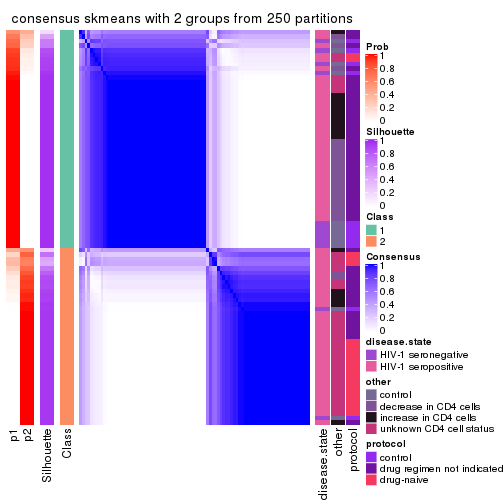</p>

</div>
<div id='tab-MAD-skmeans-consensus-heatmap-2'>
<pre><code class="r">consensus_heatmap(res, k = 3)
</code></pre>

<p>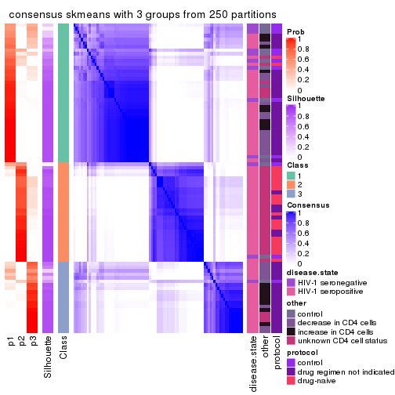</p>

</div>
<div id='tab-MAD-skmeans-consensus-heatmap-3'>
<pre><code class="r">consensus_heatmap(res, k = 4)
</code></pre>

<p>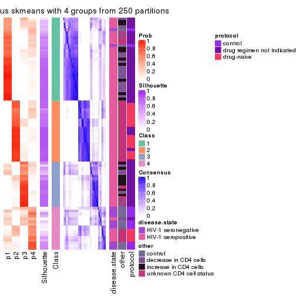</p>

</div>
<div id='tab-MAD-skmeans-consensus-heatmap-4'>
<pre><code class="r">consensus_heatmap(res, k = 5)
</code></pre>

<p>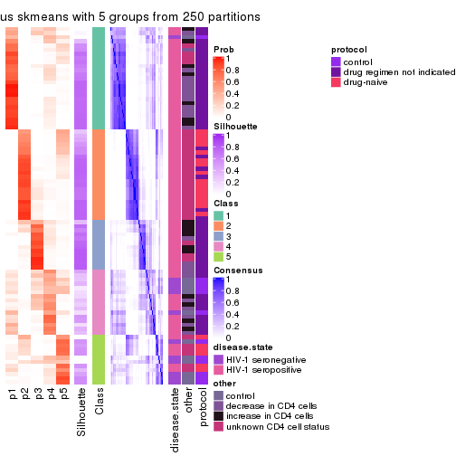</p>

</div>
<div id='tab-MAD-skmeans-consensus-heatmap-5'>
<pre><code class="r">consensus_heatmap(res, k = 6)
</code></pre>

<p>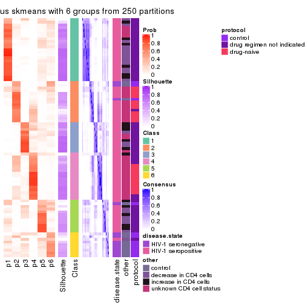</p>

</div>
</div>

Heatmaps for the membership of samples in all partitions to see how consistent they are:


<script>
$( function() {
	$( '#tabs-MAD-skmeans-membership-heatmap' ).tabs();
} );
</script>
<div id='tabs-MAD-skmeans-membership-heatmap'>
<ul>
<li><a href='#tab-MAD-skmeans-membership-heatmap-1'>k = 2</a></li>
<li><a href='#tab-MAD-skmeans-membership-heatmap-2'>k = 3</a></li>
<li><a href='#tab-MAD-skmeans-membership-heatmap-3'>k = 4</a></li>
<li><a href='#tab-MAD-skmeans-membership-heatmap-4'>k = 5</a></li>
<li><a href='#tab-MAD-skmeans-membership-heatmap-5'>k = 6</a></li>
</ul>
<div id='tab-MAD-skmeans-membership-heatmap-1'>
<pre><code class="r">membership_heatmap(res, k = 2)
</code></pre>

<p>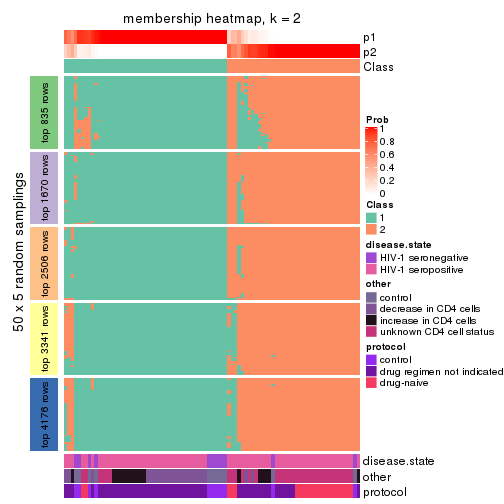</p>

</div>
<div id='tab-MAD-skmeans-membership-heatmap-2'>
<pre><code class="r">membership_heatmap(res, k = 3)
</code></pre>

<p>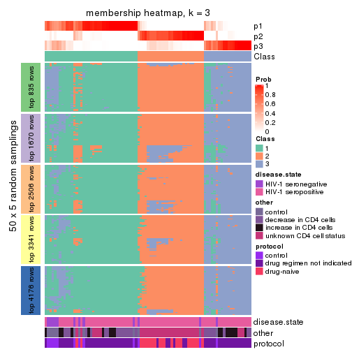</p>

</div>
<div id='tab-MAD-skmeans-membership-heatmap-3'>
<pre><code class="r">membership_heatmap(res, k = 4)
</code></pre>

<p>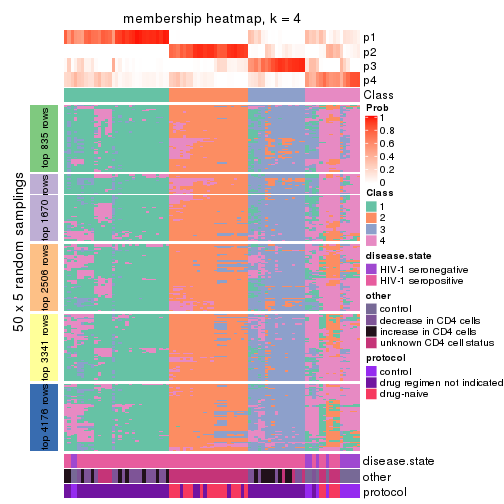</p>

</div>
<div id='tab-MAD-skmeans-membership-heatmap-4'>
<pre><code class="r">membership_heatmap(res, k = 5)
</code></pre>

<p>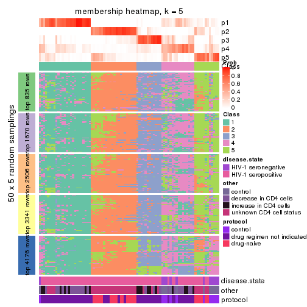</p>

</div>
<div id='tab-MAD-skmeans-membership-heatmap-5'>
<pre><code class="r">membership_heatmap(res, k = 6)
</code></pre>

<p>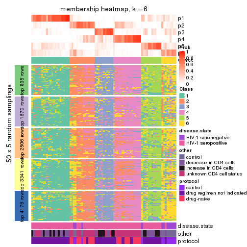</p>

</div>
</div>

As soon as we have had the classes for columns, we can look for signatures
which are significantly different between classes which can be candidate marks
for certain classes. Following are the heatmaps for signatures.


Signature heatmaps where rows are scaled:


<script>
$( function() {
	$( '#tabs-MAD-skmeans-get-signatures' ).tabs();
} );
</script>
<div id='tabs-MAD-skmeans-get-signatures'>
<ul>
<li><a href='#tab-MAD-skmeans-get-signatures-1'>k = 2</a></li>
<li><a href='#tab-MAD-skmeans-get-signatures-2'>k = 3</a></li>
<li><a href='#tab-MAD-skmeans-get-signatures-3'>k = 4</a></li>
<li><a href='#tab-MAD-skmeans-get-signatures-4'>k = 5</a></li>
<li><a href='#tab-MAD-skmeans-get-signatures-5'>k = 6</a></li>
</ul>
<div id='tab-MAD-skmeans-get-signatures-1'>
<pre><code class="r">get_signatures(res, k = 2)
</code></pre>

<p>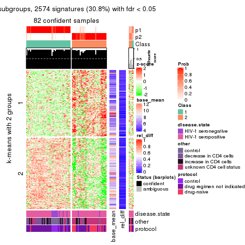</p>

</div>
<div id='tab-MAD-skmeans-get-signatures-2'>
<pre><code class="r">get_signatures(res, k = 3)
</code></pre>

<p>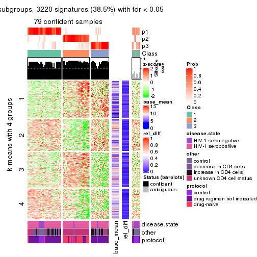</p>

</div>
<div id='tab-MAD-skmeans-get-signatures-3'>
<pre><code class="r">get_signatures(res, k = 4)
</code></pre>

<p>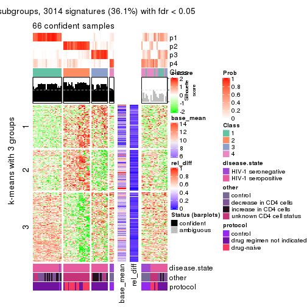</p>

</div>
<div id='tab-MAD-skmeans-get-signatures-4'>
<pre><code class="r">get_signatures(res, k = 5)
</code></pre>

<p>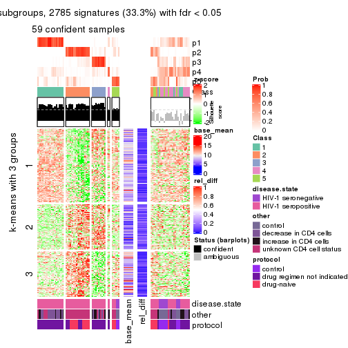</p>

</div>
<div id='tab-MAD-skmeans-get-signatures-5'>
<pre><code class="r">get_signatures(res, k = 6)
</code></pre>

<p>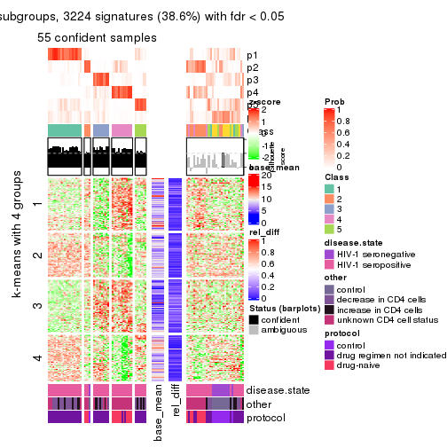</p>

</div>
</div>


Signature heatmaps where rows are not scaled:


<script>
$( function() {
	$( '#tabs-MAD-skmeans-get-signatures-no-scale' ).tabs();
} );
</script>
<div id='tabs-MAD-skmeans-get-signatures-no-scale'>
<ul>
<li><a href='#tab-MAD-skmeans-get-signatures-no-scale-1'>k = 2</a></li>
<li><a href='#tab-MAD-skmeans-get-signatures-no-scale-2'>k = 3</a></li>
<li><a href='#tab-MAD-skmeans-get-signatures-no-scale-3'>k = 4</a></li>
<li><a href='#tab-MAD-skmeans-get-signatures-no-scale-4'>k = 5</a></li>
<li><a href='#tab-MAD-skmeans-get-signatures-no-scale-5'>k = 6</a></li>
</ul>
<div id='tab-MAD-skmeans-get-signatures-no-scale-1'>
<pre><code class="r">get_signatures(res, k = 2, scale_rows = FALSE)
</code></pre>

<p>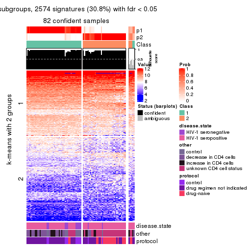</p>

</div>
<div id='tab-MAD-skmeans-get-signatures-no-scale-2'>
<pre><code class="r">get_signatures(res, k = 3, scale_rows = FALSE)
</code></pre>

<p>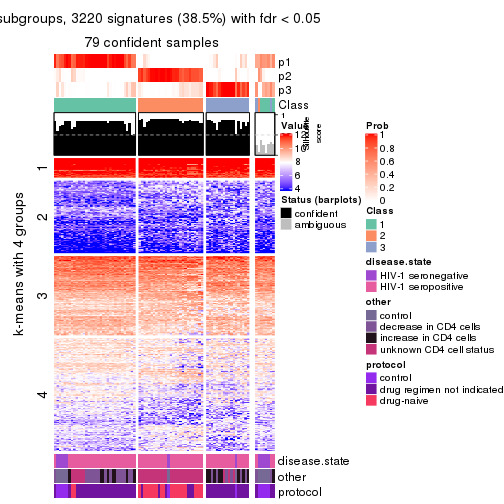</p>

</div>
<div id='tab-MAD-skmeans-get-signatures-no-scale-3'>
<pre><code class="r">get_signatures(res, k = 4, scale_rows = FALSE)
</code></pre>

<p>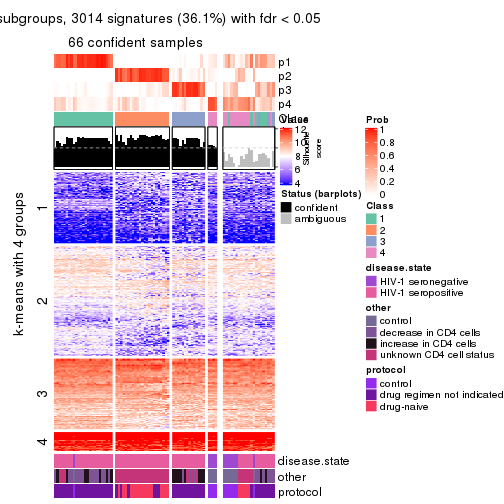</p>

</div>
<div id='tab-MAD-skmeans-get-signatures-no-scale-4'>
<pre><code class="r">get_signatures(res, k = 5, scale_rows = FALSE)
</code></pre>

<p>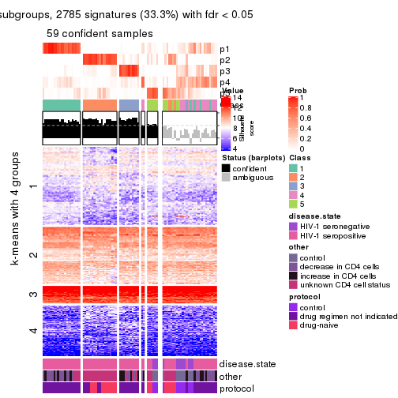</p>

</div>
<div id='tab-MAD-skmeans-get-signatures-no-scale-5'>
<pre><code class="r">get_signatures(res, k = 6, scale_rows = FALSE)
</code></pre>

<p>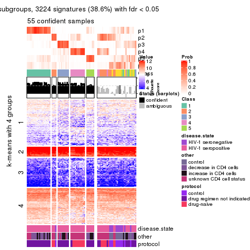</p>

</div>
</div>


Compare the overlap of signatures from different k:

```r
compare_signatures(res)
```

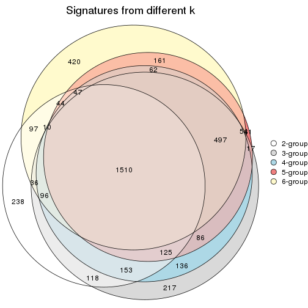

`get_signature()` returns a data frame invisibly. TO get the list of signatures, the function
call should be assigned to a variable explicitly. In following code, if `plot` argument is set
to `FALSE`, no heatmap is plotted while only the differential analysis is performed.

```r
# code only for demonstration
tb = get_signature(res, k = ..., plot = FALSE)
```

An example of the output of `tb` is:

```
#>   which_row         fdr    mean_1    mean_2 scaled_mean_1 scaled_mean_2 km
#> 1        38 0.042760348  8.373488  9.131774    -0.5533452     0.5164555  1
#> 2        40 0.018707592  7.106213  8.469186    -0.6173731     0.5762149  1
#> 3        55 0.019134737 10.221463 11.207825    -0.6159697     0.5749050  1
#> 4        59 0.006059896  5.921854  7.869574    -0.6899429     0.6439467  1
#> 5        60 0.018055526  8.928898 10.211722    -0.6204761     0.5791110  1
#> 6        98 0.009384629 15.714769 14.887706     0.6635654    -0.6193277  2
...
```

The columns in `tb` are:

1. `which_row`: row indices corresponding to the input matrix.
2. `fdr`: FDR for the differential test. 
3. `mean_x`: The mean value in group x.
4. `scaled_mean_x`: The mean value in group x after rows are scaled.
5. `km`: Row groups if k-means clustering is applied to rows.


UMAP plot which shows how samples are separated.


<script>
$( function() {
	$( '#tabs-MAD-skmeans-dimension-reduction' ).tabs();
} );
</script>
<div id='tabs-MAD-skmeans-dimension-reduction'>
<ul>
<li><a href='#tab-MAD-skmeans-dimension-reduction-1'>k = 2</a></li>
<li><a href='#tab-MAD-skmeans-dimension-reduction-2'>k = 3</a></li>
<li><a href='#tab-MAD-skmeans-dimension-reduction-3'>k = 4</a></li>
<li><a href='#tab-MAD-skmeans-dimension-reduction-4'>k = 5</a></li>
<li><a href='#tab-MAD-skmeans-dimension-reduction-5'>k = 6</a></li>
</ul>
<div id='tab-MAD-skmeans-dimension-reduction-1'>
<pre><code class="r">dimension_reduction(res, k = 2, method = &quot;UMAP&quot;)
</code></pre>

<p>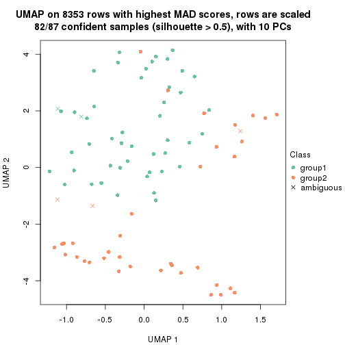</p>

</div>
<div id='tab-MAD-skmeans-dimension-reduction-2'>
<pre><code class="r">dimension_reduction(res, k = 3, method = &quot;UMAP&quot;)
</code></pre>

<p>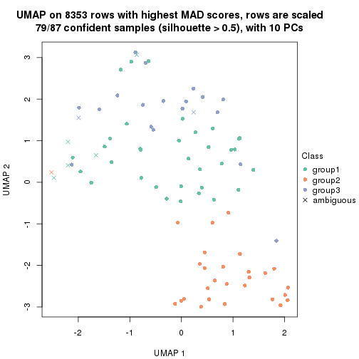</p>

</div>
<div id='tab-MAD-skmeans-dimension-reduction-3'>
<pre><code class="r">dimension_reduction(res, k = 4, method = &quot;UMAP&quot;)
</code></pre>

<p>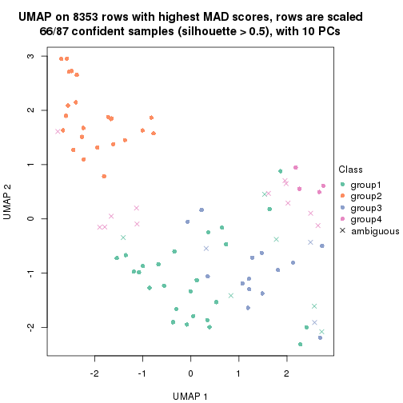</p>

</div>
<div id='tab-MAD-skmeans-dimension-reduction-4'>
<pre><code class="r">dimension_reduction(res, k = 5, method = &quot;UMAP&quot;)
</code></pre>

<p>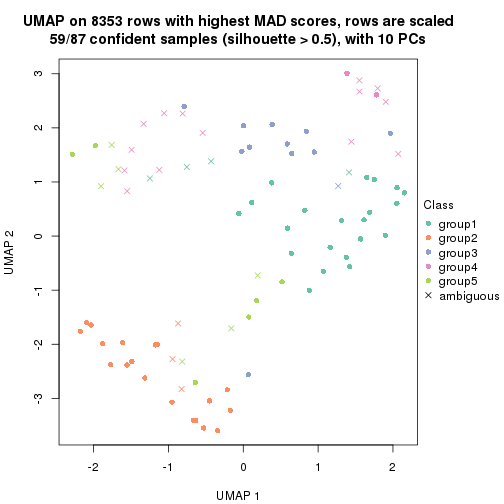</p>

</div>
<div id='tab-MAD-skmeans-dimension-reduction-5'>
<pre><code class="r">dimension_reduction(res, k = 6, method = &quot;UMAP&quot;)
</code></pre>

<p>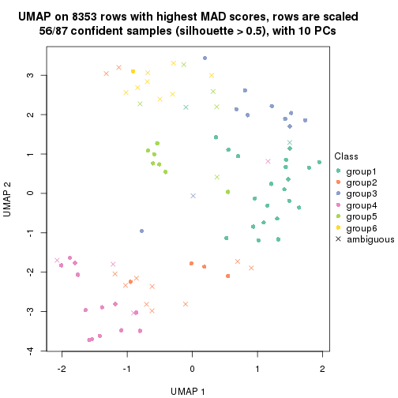</p>

</div>
</div>


Following heatmap shows how subgroups are split when increasing `k`:

```r
collect_classes(res)
```

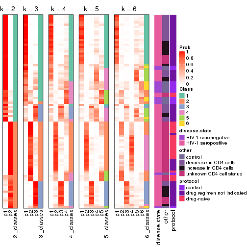


Test correlation between subgroups and known annotations. If the known
annotation is numeric, one-way ANOVA test is applied, and if the known
annotation is discrete, chi-squared contingency table test is applied.

```r
test_to_known_factors(res)
```

```
#>              n disease.state(p) other(p) protocol(p) k
#> MAD:skmeans 82         8.14e-02 1.64e-07    6.97e-06 2
#> MAD:skmeans 79         2.76e-01 5.54e-09    3.42e-09 3
#> MAD:skmeans 66         2.60e-11 2.90e-18    4.43e-18 4
#> MAD:skmeans 59         1.29e-05 1.25e-09    2.09e-10 5
#> MAD:skmeans 56         2.15e-06 7.30e-09    8.39e-13 6
```


If matrix rows can be associated to genes, consider to use `GO_Enrichment(res,
...)` to perform function enrichment for the signature genes.


 

---------------------------------------------------


### MAD:pam


The object with results only for a single top-value method and a single partition method 
can be extracted as:

```r
res = res_list["MAD", "pam"]
# you can also extract it by
# res = res_list["MAD:pam"]
```

A summary of `res` and all the functions that can be applied to it:

```r
res
```

```
#> A 'ConsensusPartition' object with k = 2, 3, 4, 5, 6.
#>   On a matrix with 8353 rows and 87 columns.
#>   Top rows (835, 1670, 2506, 3341, 4176) are extracted by 'MAD' method.
#>   Subgroups are detected by 'pam' method.
#>   Performed in total 1250 partitions by row resampling.
#>   Best k for subgroups seems to be 3.
#> 
#> Following methods can be applied to this 'ConsensusPartition' object:
#>  [1] "cola_report"             "collect_classes"         "collect_plots"          
#>  [4] "collect_stats"           "colnames"                "compare_signatures"     
#>  [7] "consensus_heatmap"       "dimension_reduction"     "functional_enrichment"  
#> [10] "get_anno_col"            "get_anno"                "get_classes"            
#> [13] "get_consensus"           "get_matrix"              "get_membership"         
#> [16] "get_param"               "get_signatures"          "get_stats"              
#> [19] "is_best_k"               "is_stable_k"             "membership_heatmap"     
#> [22] "ncol"                    "nrow"                    "plot_ecdf"              
#> [25] "rownames"                "select_partition_number" "show"                   
#> [28] "suggest_best_k"          "test_to_known_factors"
```

`collect_plots()` function collects all the plots made from `res` for all `k` (number of partitions)
into one single page to provide an easy and fast comparison between different `k`.

```r
collect_plots(res)
```

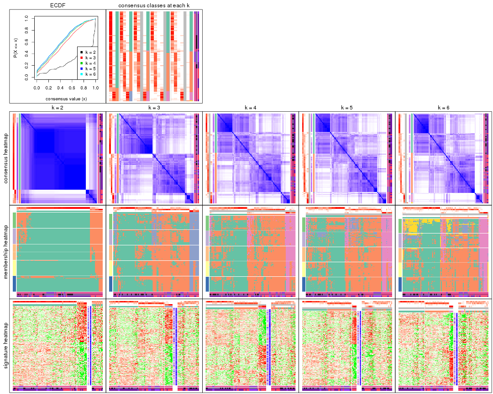

The plots are:

- The first row: a plot of the ECDF (Empirical cumulative distribution
  function) curves of the consensus matrix for each `k` and the heatmap of
  predicted classes for each `k`.
- The second row: heatmaps of the consensus matrix for each `k`.
- The third row: heatmaps of the membership matrix for each `k`.
- The fouth row: heatmaps of the signatures for each `k`.

All the plots in panels can be made by individual functions and they are
plotted later in this section.

`select_partition_number()` produces several plots showing different
statistics for choosing "optimized" `k`. There are following statistics:

- ECDF curves of the consensus matrix for each `k`;
- 1-PAC. [The PAC
  score](https://en.wikipedia.org/wiki/Consensus_clustering#Over-interpretation_potential_of_consensus_clustering)
  measures the proportion of the ambiguous subgrouping.
- Mean silhouette score.
- Concordance. The mean probability of fiting the consensus class ids in all
  partitions.
- Area increased. Denote $A_k$ as the area under the ECDF curve for current
  `k`, the area increased is defined as $A_k - A_{k-1}$.
- Rand index. The percent of pairs of samples that are both in a same cluster
  or both are not in a same cluster in the partition of k and k-1.
- Jaccard index. The ratio of pairs of samples are both in a same cluster in
  the partition of k and k-1 and the pairs of samples are both in a same
  cluster in the partition k or k-1.

The detailed explanations of these statistics can be found in [the cola
vignette](http://bioconductor.org/packages/devel/bioc/vignettes/cola/inst/doc/cola.html#toc_13).

Generally speaking, lower PAC score, higher mean silhouette score or higher
concordance corresponds to better partition. Rand index and Jaccard index
measure how similar the current partition is compared to partition with `k-1`.
If they are too similar, we won't accept `k` is better than `k-1`.

```r
select_partition_number(res)
```

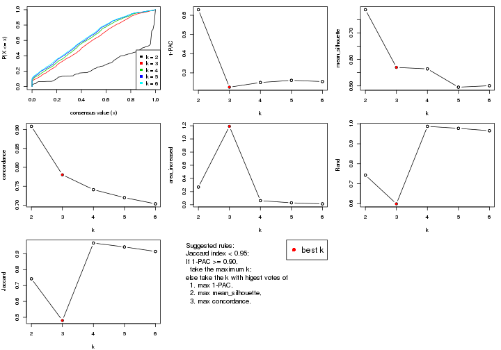

The numeric values for all these statistics can be obtained by `get_stats()`.

```r
get_stats(res)
```

```
#>   k 1-PAC mean_silhouette concordance area_increased  Rand Jaccard
#> 2 2 0.629           0.788       0.908         0.2684 0.743   0.743
#> 3 3 0.226           0.570       0.780         1.1910 0.599   0.480
#> 4 4 0.250           0.564       0.741         0.0620 0.987   0.968
#> 5 5 0.261           0.495       0.720         0.0288 0.977   0.943
#> 6 6 0.255           0.501       0.704         0.0137 0.965   0.915
```

`suggest_best_k()` suggests the best $k$ based on these statistics. The rules are as follows:

- All $k$ with Jaccard index larger than 0.95 are removed because the increase of
  the partition number does not provides enough extra information. If all $k$ are removed,
  the best $k$ is assigned by `NA`.
- For $k$ with 1-PAC larger than 0.9, the maximal $k$ is taken as the "best k". Other $k$ is called "optional k".
- If it does not fit the second rule. The $k$ with the highest vote of highest
  1-PAC, mean silhouette and concordance is taken as the "best k".

```r
suggest_best_k(res)
```

```
#> [1] 3
```


Following shows the table of the partitions (You need to click the **show/hide
code output** link to see it). The membership matrix (columns with name `p*`)
is inferred by
[`clue::cl_consensus()`](https://www.rdocumentation.org/link/cl_consensus?package=clue)
function with the `SE` method. Basically the value in the membership matrix
represents the probability to belong to a certain group. The finall class
label for an item is determined with the group with highest probability it
belongs to.

In `get_classes()` function, the entropy is calculated from the membership
matrix and the silhouette score is calculated from the consensus matrix.


<script>
$( function() {
	$( '#tabs-MAD-pam-get-classes' ).tabs();
} );
</script>
<div id='tabs-MAD-pam-get-classes'>
<ul>
<li><a href='#tab-MAD-pam-get-classes-1'>k = 2</a></li>
<li><a href='#tab-MAD-pam-get-classes-2'>k = 3</a></li>
<li><a href='#tab-MAD-pam-get-classes-3'>k = 4</a></li>
<li><a href='#tab-MAD-pam-get-classes-4'>k = 5</a></li>
<li><a href='#tab-MAD-pam-get-classes-5'>k = 6</a></li>
</ul>

<div id='tab-MAD-pam-get-classes-1'>
<p><a id='tab-MAD-pam-get-classes-1-a' style='color:#0366d6' href='#'>show/hide code output</a></p>
<pre><code class="r">cbind(get_classes(res, k = 2), get_membership(res, k = 2))
</code></pre>

<pre><code>#&gt;          class entropy silhouette    p1    p2
#&gt; GSM39104     1  0.1633     0.9084 0.976 0.024
#&gt; GSM39105     1  0.2423     0.9048 0.960 0.040
#&gt; GSM39106     1  0.0672     0.9090 0.992 0.008
#&gt; GSM39107     1  0.2423     0.9048 0.960 0.040
#&gt; GSM39108     1  0.2423     0.9048 0.960 0.040
#&gt; GSM39109     1  0.4161     0.8709 0.916 0.084
#&gt; GSM39110     1  0.1414     0.9088 0.980 0.020
#&gt; GSM39111     1  0.2423     0.9048 0.960 0.040
#&gt; GSM39112     1  0.2423     0.9048 0.960 0.040
#&gt; GSM39113     1  0.2423     0.9048 0.960 0.040
#&gt; GSM39114     1  0.2423     0.9048 0.960 0.040
#&gt; GSM39115     1  0.2423     0.9048 0.960 0.040
#&gt; GSM39148     1  0.0000     0.9078 1.000 0.000
#&gt; GSM39149     1  0.3114     0.8707 0.944 0.056
#&gt; GSM39150     1  0.0000     0.9078 1.000 0.000
#&gt; GSM39151     1  0.4815     0.8203 0.896 0.104
#&gt; GSM39152     1  0.0000     0.9078 1.000 0.000
#&gt; GSM39153     1  0.0000     0.9078 1.000 0.000
#&gt; GSM39154     1  0.0376     0.9085 0.996 0.004
#&gt; GSM39155     1  0.2423     0.9048 0.960 0.040
#&gt; GSM39156     1  0.0000     0.9078 1.000 0.000
#&gt; GSM39157     1  0.2423     0.9048 0.960 0.040
#&gt; GSM39158     1  0.0000     0.9078 1.000 0.000
#&gt; GSM39159     1  0.0000     0.9078 1.000 0.000
#&gt; GSM39160     1  0.0000     0.9078 1.000 0.000
#&gt; GSM39161     1  0.0000     0.9078 1.000 0.000
#&gt; GSM39162     1  0.0000     0.9078 1.000 0.000
#&gt; GSM39163     1  0.0672     0.9091 0.992 0.008
#&gt; GSM39164     1  0.0000     0.9078 1.000 0.000
#&gt; GSM39165     1  0.0000     0.9078 1.000 0.000
#&gt; GSM39166     1  0.0000     0.9078 1.000 0.000
#&gt; GSM39167     1  0.0000     0.9078 1.000 0.000
#&gt; GSM39168     1  0.0000     0.9078 1.000 0.000
#&gt; GSM39169     1  0.0000     0.9078 1.000 0.000
#&gt; GSM39170     1  0.0000     0.9078 1.000 0.000
#&gt; GSM39171     1  0.2423     0.9048 0.960 0.040
#&gt; GSM39172     1  0.8955     0.3676 0.688 0.312
#&gt; GSM39173     1  0.0000     0.9078 1.000 0.000
#&gt; GSM39174     1  0.0672     0.9091 0.992 0.008
#&gt; GSM39175     1  0.0000     0.9078 1.000 0.000
#&gt; GSM39176     1  0.0000     0.9078 1.000 0.000
#&gt; GSM39177     1  0.0000     0.9078 1.000 0.000
#&gt; GSM39178     1  0.0000     0.9078 1.000 0.000
#&gt; GSM39179     1  0.9580     0.1052 0.620 0.380
#&gt; GSM39180     1  0.9977    -0.3117 0.528 0.472
#&gt; GSM39181     1  0.1414     0.9088 0.980 0.020
#&gt; GSM39182     1  0.5294     0.7864 0.880 0.120
#&gt; GSM39183     1  0.0672     0.9091 0.992 0.008
#&gt; GSM39184     1  0.2423     0.9048 0.960 0.040
#&gt; GSM39185     1  0.0938     0.9092 0.988 0.012
#&gt; GSM39186     1  0.2236     0.9058 0.964 0.036
#&gt; GSM39187     1  0.0000     0.9078 1.000 0.000
#&gt; GSM39116     2  0.9954     0.3844 0.460 0.540
#&gt; GSM39117     2  0.0000     0.7236 0.000 1.000
#&gt; GSM39118     2  0.9933     0.4074 0.452 0.548
#&gt; GSM39119     2  0.6623     0.7615 0.172 0.828
#&gt; GSM39120     1  0.1414     0.9089 0.980 0.020
#&gt; GSM39121     1  0.2423     0.9048 0.960 0.040
#&gt; GSM39122     1  0.2423     0.9048 0.960 0.040
#&gt; GSM39123     2  0.0000     0.7236 0.000 1.000
#&gt; GSM39124     1  0.2603     0.9026 0.956 0.044
#&gt; GSM39125     1  0.1414     0.9089 0.980 0.020
#&gt; GSM39126     1  0.0672     0.9090 0.992 0.008
#&gt; GSM39127     1  0.9209     0.3931 0.664 0.336
#&gt; GSM39128     1  0.0000     0.9078 1.000 0.000
#&gt; GSM39129     2  0.6531     0.7616 0.168 0.832
#&gt; GSM39130     2  0.0000     0.7236 0.000 1.000
#&gt; GSM39131     1  0.2778     0.9008 0.952 0.048
#&gt; GSM39132     1  0.6247     0.7788 0.844 0.156
#&gt; GSM39133     2  0.0376     0.7251 0.004 0.996
#&gt; GSM39134     2  0.6973     0.7600 0.188 0.812
#&gt; GSM39135     2  0.9983     0.3305 0.476 0.524
#&gt; GSM39136     2  0.9209     0.6377 0.336 0.664
#&gt; GSM39137     1  0.2423     0.9048 0.960 0.040
#&gt; GSM39138     2  0.7950     0.7418 0.240 0.760
#&gt; GSM39139     1  0.9248     0.3614 0.660 0.340
#&gt; GSM39140     1  0.2423     0.9048 0.960 0.040
#&gt; GSM39141     1  0.2423     0.9048 0.960 0.040
#&gt; GSM39142     1  0.2423     0.9048 0.960 0.040
#&gt; GSM39143     1  0.2423     0.9048 0.960 0.040
#&gt; GSM39144     2  0.9248     0.6325 0.340 0.660
#&gt; GSM39145     1  0.9358     0.3423 0.648 0.352
#&gt; GSM39146     1  0.8713     0.5148 0.708 0.292
#&gt; GSM39147     1  0.2423     0.9048 0.960 0.040
#&gt; GSM39188     1  0.9754    -0.0344 0.592 0.408
#&gt; GSM39189     1  0.6887     0.6797 0.816 0.184
#&gt; GSM39190     1  0.9686     0.1724 0.604 0.396
</code></pre>

<script>
$('#tab-MAD-pam-get-classes-1-a').parent().next().next().hide();
$('#tab-MAD-pam-get-classes-1-a').click(function(){
  $('#tab-MAD-pam-get-classes-1-a').parent().next().next().toggle();
  return(false);
});
</script>
</div>

<div id='tab-MAD-pam-get-classes-2'>
<p><a id='tab-MAD-pam-get-classes-2-a' style='color:#0366d6' href='#'>show/hide code output</a></p>
<pre><code class="r">cbind(get_classes(res, k = 3), get_membership(res, k = 3))
</code></pre>

<pre><code>#&gt;          class entropy silhouette    p1    p2    p3
#&gt; GSM39104     2  0.6307    -0.0128 0.488 0.512 0.000
#&gt; GSM39105     2  0.3482     0.7056 0.128 0.872 0.000
#&gt; GSM39106     1  0.5529     0.6292 0.704 0.296 0.000
#&gt; GSM39107     2  0.1411     0.7028 0.036 0.964 0.000
#&gt; GSM39108     2  0.4555     0.6848 0.200 0.800 0.000
#&gt; GSM39109     2  0.3207     0.7204 0.084 0.904 0.012
#&gt; GSM39110     1  0.4605     0.5757 0.796 0.204 0.000
#&gt; GSM39111     2  0.4452     0.6732 0.192 0.808 0.000
#&gt; GSM39112     2  0.2066     0.7130 0.060 0.940 0.000
#&gt; GSM39113     2  0.1964     0.7125 0.056 0.944 0.000
#&gt; GSM39114     2  0.0000     0.6853 0.000 1.000 0.000
#&gt; GSM39115     2  0.5216     0.6097 0.260 0.740 0.000
#&gt; GSM39148     1  0.0747     0.7289 0.984 0.016 0.000
#&gt; GSM39149     1  0.5803     0.6461 0.736 0.248 0.016
#&gt; GSM39150     1  0.5058     0.6425 0.756 0.244 0.000
#&gt; GSM39151     2  0.8296     0.1346 0.412 0.508 0.080
#&gt; GSM39152     1  0.4346     0.6931 0.816 0.184 0.000
#&gt; GSM39153     1  0.0424     0.7281 0.992 0.008 0.000
#&gt; GSM39154     1  0.2165     0.7265 0.936 0.064 0.000
#&gt; GSM39155     1  0.6215    -0.0179 0.572 0.428 0.000
#&gt; GSM39156     1  0.2356     0.7231 0.928 0.072 0.000
#&gt; GSM39157     2  0.5948     0.5153 0.360 0.640 0.000
#&gt; GSM39158     1  0.3816     0.7129 0.852 0.148 0.000
#&gt; GSM39159     1  0.5968     0.4409 0.636 0.364 0.000
#&gt; GSM39160     1  0.5397     0.6170 0.720 0.280 0.000
#&gt; GSM39161     1  0.4605     0.6693 0.796 0.204 0.000
#&gt; GSM39162     1  0.0892     0.7288 0.980 0.020 0.000
#&gt; GSM39163     1  0.4702     0.6404 0.788 0.212 0.000
#&gt; GSM39164     1  0.0892     0.7294 0.980 0.020 0.000
#&gt; GSM39165     1  0.1753     0.7262 0.952 0.048 0.000
#&gt; GSM39166     1  0.5926     0.4943 0.644 0.356 0.000
#&gt; GSM39167     1  0.0892     0.7288 0.980 0.020 0.000
#&gt; GSM39168     1  0.0892     0.7288 0.980 0.020 0.000
#&gt; GSM39169     1  0.0747     0.7289 0.984 0.016 0.000
#&gt; GSM39170     1  0.1163     0.7301 0.972 0.028 0.000
#&gt; GSM39171     2  0.6267     0.2647 0.452 0.548 0.000
#&gt; GSM39172     1  0.7419     0.5537 0.680 0.088 0.232
#&gt; GSM39173     1  0.0892     0.7288 0.980 0.020 0.000
#&gt; GSM39174     1  0.2165     0.7181 0.936 0.064 0.000
#&gt; GSM39175     1  0.2878     0.7276 0.904 0.096 0.000
#&gt; GSM39176     1  0.0424     0.7281 0.992 0.008 0.000
#&gt; GSM39177     1  0.6079     0.4054 0.612 0.388 0.000
#&gt; GSM39178     1  0.6168     0.3837 0.588 0.412 0.000
#&gt; GSM39179     1  0.8827     0.0903 0.496 0.120 0.384
#&gt; GSM39180     2  0.9857     0.0214 0.252 0.380 0.368
#&gt; GSM39181     1  0.5058     0.6164 0.756 0.244 0.000
#&gt; GSM39182     1  0.7794     0.3838 0.572 0.368 0.060
#&gt; GSM39183     1  0.5760     0.5391 0.672 0.328 0.000
#&gt; GSM39184     2  0.6225     0.3576 0.432 0.568 0.000
#&gt; GSM39185     1  0.5706     0.5461 0.680 0.320 0.000
#&gt; GSM39186     2  0.6235     0.2983 0.436 0.564 0.000
#&gt; GSM39187     1  0.4235     0.6740 0.824 0.176 0.000
#&gt; GSM39116     2  0.5529     0.3748 0.000 0.704 0.296
#&gt; GSM39117     3  0.0000     0.7732 0.000 0.000 1.000
#&gt; GSM39118     2  0.6252     0.0732 0.000 0.556 0.444
#&gt; GSM39119     3  0.4452     0.7406 0.000 0.192 0.808
#&gt; GSM39120     2  0.5988     0.3867 0.368 0.632 0.000
#&gt; GSM39121     2  0.5529     0.5502 0.296 0.704 0.000
#&gt; GSM39122     2  0.4702     0.6576 0.212 0.788 0.000
#&gt; GSM39123     3  0.0000     0.7732 0.000 0.000 1.000
#&gt; GSM39124     2  0.4931     0.6524 0.232 0.768 0.000
#&gt; GSM39125     2  0.4121     0.6469 0.168 0.832 0.000
#&gt; GSM39126     1  0.6280     0.1705 0.540 0.460 0.000
#&gt; GSM39127     2  0.5028     0.6230 0.040 0.828 0.132
#&gt; GSM39128     2  0.6045     0.1207 0.380 0.620 0.000
#&gt; GSM39129     3  0.4912     0.7370 0.008 0.196 0.796
#&gt; GSM39130     3  0.0000     0.7732 0.000 0.000 1.000
#&gt; GSM39131     2  0.1289     0.6965 0.032 0.968 0.000
#&gt; GSM39132     2  0.4174     0.7054 0.092 0.872 0.036
#&gt; GSM39133     3  0.0424     0.7749 0.000 0.008 0.992
#&gt; GSM39134     3  0.5875     0.7424 0.072 0.136 0.792
#&gt; GSM39135     2  0.7043     0.1509 0.024 0.576 0.400
#&gt; GSM39136     3  0.6204     0.3908 0.000 0.424 0.576
#&gt; GSM39137     2  0.3816     0.7126 0.148 0.852 0.000
#&gt; GSM39138     3  0.6510     0.6625 0.156 0.088 0.756
#&gt; GSM39139     2  0.5823     0.6572 0.064 0.792 0.144
#&gt; GSM39140     2  0.5650     0.5645 0.312 0.688 0.000
#&gt; GSM39141     2  0.4555     0.6906 0.200 0.800 0.000
#&gt; GSM39142     2  0.4346     0.6873 0.184 0.816 0.000
#&gt; GSM39143     2  0.3412     0.7073 0.124 0.876 0.000
#&gt; GSM39144     3  0.6111     0.4078 0.000 0.396 0.604
#&gt; GSM39145     2  0.4805     0.6118 0.012 0.812 0.176
#&gt; GSM39146     2  0.2269     0.6847 0.016 0.944 0.040
#&gt; GSM39147     2  0.3038     0.7143 0.104 0.896 0.000
#&gt; GSM39188     1  0.9311     0.2155 0.468 0.168 0.364
#&gt; GSM39189     1  0.7788     0.5475 0.632 0.284 0.084
#&gt; GSM39190     2  0.6423     0.5616 0.044 0.728 0.228
</code></pre>

<script>
$('#tab-MAD-pam-get-classes-2-a').parent().next().next().hide();
$('#tab-MAD-pam-get-classes-2-a').click(function(){
  $('#tab-MAD-pam-get-classes-2-a').parent().next().next().toggle();
  return(false);
});
</script>
</div>

<div id='tab-MAD-pam-get-classes-3'>
<p><a id='tab-MAD-pam-get-classes-3-a' style='color:#0366d6' href='#'>show/hide code output</a></p>
<pre><code class="r">cbind(get_classes(res, k = 4), get_membership(res, k = 4))
</code></pre>

<pre><code>#&gt;          class entropy silhouette    p1    p2 p3    p4
#&gt; GSM39104     2  0.6557     0.0548 0.448 0.476 NA 0.000
#&gt; GSM39105     2  0.2984     0.6994 0.084 0.888 NA 0.000
#&gt; GSM39106     1  0.5599     0.5994 0.672 0.276 NA 0.000
#&gt; GSM39107     2  0.3427     0.6915 0.028 0.860 NA 0.000
#&gt; GSM39108     2  0.4121     0.6764 0.184 0.796 NA 0.000
#&gt; GSM39109     2  0.3726     0.7136 0.060 0.864 NA 0.008
#&gt; GSM39110     1  0.3528     0.5679 0.808 0.192 NA 0.000
#&gt; GSM39111     2  0.3547     0.6844 0.144 0.840 NA 0.000
#&gt; GSM39112     2  0.3523     0.6913 0.032 0.856 NA 0.000
#&gt; GSM39113     2  0.3485     0.6902 0.028 0.856 NA 0.000
#&gt; GSM39114     2  0.2868     0.6758 0.000 0.864 NA 0.000
#&gt; GSM39115     2  0.5219     0.6018 0.216 0.728 NA 0.000
#&gt; GSM39148     1  0.0469     0.7131 0.988 0.012 NA 0.000
#&gt; GSM39149     1  0.5572     0.6138 0.692 0.260 NA 0.008
#&gt; GSM39150     1  0.6139     0.5919 0.656 0.244 NA 0.000
#&gt; GSM39151     2  0.7154     0.2144 0.364 0.540 NA 0.052
#&gt; GSM39152     1  0.3870     0.6611 0.788 0.208 NA 0.000
#&gt; GSM39153     1  0.0336     0.7130 0.992 0.008 NA 0.000
#&gt; GSM39154     1  0.2081     0.7027 0.916 0.084 NA 0.000
#&gt; GSM39155     1  0.5337     0.0210 0.564 0.424 NA 0.000
#&gt; GSM39156     1  0.2149     0.6990 0.912 0.088 NA 0.000
#&gt; GSM39157     2  0.4730     0.4715 0.364 0.636 NA 0.000
#&gt; GSM39158     1  0.5416     0.6656 0.740 0.148 NA 0.000
#&gt; GSM39159     1  0.5527     0.4407 0.616 0.356 NA 0.000
#&gt; GSM39160     1  0.5321     0.5768 0.672 0.296 NA 0.000
#&gt; GSM39161     1  0.6083     0.6079 0.672 0.216 NA 0.000
#&gt; GSM39162     1  0.0921     0.7113 0.972 0.028 NA 0.000
#&gt; GSM39163     1  0.3688     0.6238 0.792 0.208 NA 0.000
#&gt; GSM39164     1  0.0707     0.7135 0.980 0.020 NA 0.000
#&gt; GSM39165     1  0.1557     0.7068 0.944 0.056 NA 0.000
#&gt; GSM39166     1  0.6831     0.4420 0.536 0.352 NA 0.000
#&gt; GSM39167     1  0.0921     0.7113 0.972 0.028 NA 0.000
#&gt; GSM39168     1  0.0921     0.7113 0.972 0.028 NA 0.000
#&gt; GSM39169     1  0.0592     0.7129 0.984 0.016 NA 0.000
#&gt; GSM39170     1  0.3144     0.7016 0.884 0.044 NA 0.000
#&gt; GSM39171     2  0.5894     0.2770 0.392 0.568 NA 0.000
#&gt; GSM39172     1  0.6990     0.5387 0.632 0.120 NA 0.224
#&gt; GSM39173     1  0.0921     0.7113 0.972 0.028 NA 0.000
#&gt; GSM39174     1  0.1637     0.7049 0.940 0.060 NA 0.000
#&gt; GSM39175     1  0.2216     0.7115 0.908 0.092 NA 0.000
#&gt; GSM39176     1  0.0000     0.7124 1.000 0.000 NA 0.000
#&gt; GSM39177     1  0.6163     0.3326 0.532 0.416 NA 0.000
#&gt; GSM39178     1  0.6857     0.3464 0.492 0.404 NA 0.000
#&gt; GSM39179     1  0.7977     0.1390 0.496 0.112 NA 0.344
#&gt; GSM39180     2  0.8898     0.0787 0.252 0.376 NA 0.320
#&gt; GSM39181     1  0.6147     0.5995 0.664 0.224 NA 0.000
#&gt; GSM39182     1  0.6189     0.3584 0.568 0.372 NA 0.060
#&gt; GSM39183     1  0.6607     0.5392 0.592 0.296 NA 0.000
#&gt; GSM39184     2  0.6186     0.3779 0.352 0.584 NA 0.000
#&gt; GSM39185     1  0.6729     0.4957 0.572 0.312 NA 0.000
#&gt; GSM39186     2  0.6123     0.3212 0.372 0.572 NA 0.000
#&gt; GSM39187     1  0.3569     0.6381 0.804 0.196 NA 0.000
#&gt; GSM39116     2  0.6440     0.4842 0.000 0.644 NA 0.208
#&gt; GSM39117     4  0.0592     0.7685 0.000 0.000 NA 0.984
#&gt; GSM39118     2  0.4955     0.1904 0.000 0.556 NA 0.444
#&gt; GSM39119     4  0.3356     0.6948 0.000 0.176 NA 0.824
#&gt; GSM39120     2  0.6275     0.4286 0.328 0.596 NA 0.000
#&gt; GSM39121     2  0.4936     0.4805 0.340 0.652 NA 0.000
#&gt; GSM39122     2  0.4872     0.6177 0.244 0.728 NA 0.000
#&gt; GSM39123     4  0.0592     0.7685 0.000 0.000 NA 0.984
#&gt; GSM39124     2  0.4262     0.6240 0.236 0.756 NA 0.000
#&gt; GSM39125     2  0.5007     0.6266 0.172 0.760 NA 0.000
#&gt; GSM39126     1  0.6690     0.2478 0.548 0.352 NA 0.000
#&gt; GSM39127     2  0.5478     0.6489 0.036 0.752 NA 0.036
#&gt; GSM39128     2  0.7942     0.0787 0.368 0.440 NA 0.016
#&gt; GSM39129     4  0.3768     0.7514 0.000 0.008 NA 0.808
#&gt; GSM39130     4  0.0592     0.7685 0.000 0.000 NA 0.984
#&gt; GSM39131     2  0.4218     0.6582 0.012 0.796 NA 0.008
#&gt; GSM39132     2  0.5476     0.6619 0.056 0.744 NA 0.016
#&gt; GSM39133     4  0.0336     0.7698 0.000 0.008 NA 0.992
#&gt; GSM39134     4  0.4428     0.7204 0.068 0.124 NA 0.808
#&gt; GSM39135     2  0.6671     0.3075 0.020 0.576 NA 0.348
#&gt; GSM39136     4  0.6562     0.2216 0.000 0.404 NA 0.516
#&gt; GSM39137     2  0.3105     0.6912 0.140 0.856 NA 0.000
#&gt; GSM39138     4  0.4985     0.6688 0.152 0.080 NA 0.768
#&gt; GSM39139     2  0.5333     0.6881 0.068 0.792 NA 0.076
#&gt; GSM39140     2  0.4250     0.5848 0.276 0.724 NA 0.000
#&gt; GSM39141     2  0.3311     0.6772 0.172 0.828 NA 0.000
#&gt; GSM39142     2  0.3528     0.6720 0.192 0.808 NA 0.000
#&gt; GSM39143     2  0.2469     0.6967 0.108 0.892 NA 0.000
#&gt; GSM39144     4  0.6566     0.4960 0.000 0.288 NA 0.600
#&gt; GSM39145     2  0.4549     0.6625 0.016 0.820 NA 0.108
#&gt; GSM39146     2  0.2761     0.6902 0.012 0.908 NA 0.016
#&gt; GSM39147     2  0.3333     0.7065 0.088 0.872 NA 0.000
#&gt; GSM39188     4  0.9204     0.2548 0.280 0.072 NA 0.332
#&gt; GSM39189     1  0.7611     0.5275 0.568 0.288 NA 0.056
#&gt; GSM39190     2  0.5230     0.5896 0.028 0.744 NA 0.208
</code></pre>

<script>
$('#tab-MAD-pam-get-classes-3-a').parent().next().next().hide();
$('#tab-MAD-pam-get-classes-3-a').click(function(){
  $('#tab-MAD-pam-get-classes-3-a').parent().next().next().toggle();
  return(false);
});
</script>
</div>

<div id='tab-MAD-pam-get-classes-4'>
<p><a id='tab-MAD-pam-get-classes-4-a' style='color:#0366d6' href='#'>show/hide code output</a></p>
<pre><code class="r">cbind(get_classes(res, k = 5), get_membership(res, k = 5))
</code></pre>

<pre><code>#&gt;          class entropy silhouette    p1    p2    p3    p4 p5
#&gt; GSM39104     1  0.6619   -0.05658 0.444 0.420 0.108 0.000 NA
#&gt; GSM39105     2  0.3018    0.69603 0.084 0.872 0.008 0.000 NA
#&gt; GSM39106     1  0.5939    0.54534 0.640 0.240 0.084 0.000 NA
#&gt; GSM39107     2  0.3160    0.66761 0.004 0.808 0.188 0.000 NA
#&gt; GSM39108     2  0.3805    0.66692 0.184 0.784 0.000 0.000 NA
#&gt; GSM39109     2  0.4153    0.69595 0.052 0.812 0.104 0.000 NA
#&gt; GSM39110     1  0.3109    0.53952 0.800 0.200 0.000 0.000 NA
#&gt; GSM39111     2  0.3412    0.67482 0.152 0.820 0.000 0.000 NA
#&gt; GSM39112     2  0.3160    0.66761 0.004 0.808 0.188 0.000 NA
#&gt; GSM39113     2  0.3160    0.66761 0.004 0.808 0.188 0.000 NA
#&gt; GSM39114     2  0.3353    0.66525 0.000 0.796 0.196 0.000 NA
#&gt; GSM39115     2  0.4763    0.59843 0.212 0.712 0.000 0.000 NA
#&gt; GSM39148     1  0.0404    0.63587 0.988 0.012 0.000 0.000 NA
#&gt; GSM39149     1  0.5487    0.56852 0.668 0.252 0.016 0.008 NA
#&gt; GSM39150     1  0.5504    0.53183 0.644 0.224 0.000 0.000 NA
#&gt; GSM39151     2  0.7178    0.17760 0.348 0.500 0.036 0.036 NA
#&gt; GSM39152     1  0.3548    0.62411 0.796 0.188 0.004 0.000 NA
#&gt; GSM39153     1  0.0510    0.63535 0.984 0.016 0.000 0.000 NA
#&gt; GSM39154     1  0.1956    0.63403 0.916 0.076 0.000 0.000 NA
#&gt; GSM39155     1  0.5201    0.00872 0.532 0.424 0.000 0.000 NA
#&gt; GSM39156     1  0.1851    0.62951 0.912 0.088 0.000 0.000 NA
#&gt; GSM39157     2  0.4045    0.47161 0.356 0.644 0.000 0.000 NA
#&gt; GSM39158     1  0.5025    0.55721 0.704 0.124 0.000 0.000 NA
#&gt; GSM39159     1  0.5260    0.40852 0.592 0.348 0.000 0.000 NA
#&gt; GSM39160     1  0.4780    0.56447 0.672 0.280 0.000 0.000 NA
#&gt; GSM39161     1  0.5546    0.52405 0.648 0.176 0.000 0.000 NA
#&gt; GSM39162     1  0.0794    0.63461 0.972 0.028 0.000 0.000 NA
#&gt; GSM39163     1  0.3663    0.57752 0.776 0.208 0.000 0.000 NA
#&gt; GSM39164     1  0.0609    0.63675 0.980 0.020 0.000 0.000 NA
#&gt; GSM39165     1  0.1341    0.63302 0.944 0.056 0.000 0.000 NA
#&gt; GSM39166     1  0.6351    0.43161 0.500 0.316 0.000 0.000 NA
#&gt; GSM39167     1  0.0794    0.63461 0.972 0.028 0.000 0.000 NA
#&gt; GSM39168     1  0.0794    0.63461 0.972 0.028 0.000 0.000 NA
#&gt; GSM39169     1  0.0404    0.63587 0.988 0.012 0.000 0.000 NA
#&gt; GSM39170     1  0.3141    0.59974 0.852 0.040 0.000 0.000 NA
#&gt; GSM39171     2  0.5378    0.22622 0.392 0.548 0.000 0.000 NA
#&gt; GSM39172     1  0.6089    0.34778 0.644 0.100 0.000 0.212 NA
#&gt; GSM39173     1  0.0955    0.63446 0.968 0.028 0.000 0.000 NA
#&gt; GSM39174     1  0.1410    0.63988 0.940 0.060 0.000 0.000 NA
#&gt; GSM39175     1  0.1851    0.64876 0.912 0.088 0.000 0.000 NA
#&gt; GSM39176     1  0.0162    0.63383 0.996 0.004 0.000 0.000 NA
#&gt; GSM39177     1  0.5492    0.37014 0.536 0.396 0.000 0.000 NA
#&gt; GSM39178     1  0.6229    0.32492 0.464 0.392 0.000 0.000 NA
#&gt; GSM39179     1  0.7835   -0.41102 0.448 0.064 0.016 0.308 NA
#&gt; GSM39180     2  0.8203   -0.22675 0.240 0.348 0.004 0.312 NA
#&gt; GSM39181     1  0.5817    0.50990 0.612 0.204 0.000 0.000 NA
#&gt; GSM39182     1  0.5386    0.36428 0.564 0.372 0.000 0.064 NA
#&gt; GSM39183     1  0.6191    0.47539 0.536 0.292 0.000 0.000 NA
#&gt; GSM39184     2  0.5613    0.41625 0.308 0.592 0.000 0.000 NA
#&gt; GSM39185     1  0.6373    0.46975 0.532 0.280 0.004 0.000 NA
#&gt; GSM39186     2  0.5498    0.33642 0.356 0.568 0.000 0.000 NA
#&gt; GSM39187     1  0.3318    0.59227 0.800 0.192 0.000 0.000 NA
#&gt; GSM39116     2  0.6133    0.49970 0.000 0.648 0.136 0.176 NA
#&gt; GSM39117     4  0.0451    0.59437 0.000 0.000 0.008 0.988 NA
#&gt; GSM39118     2  0.4410    0.25661 0.000 0.556 0.004 0.440 NA
#&gt; GSM39119     4  0.3086    0.44998 0.000 0.180 0.004 0.816 NA
#&gt; GSM39120     2  0.5903    0.39259 0.332 0.548 0.120 0.000 NA
#&gt; GSM39121     2  0.4268    0.47798 0.344 0.648 0.008 0.000 NA
#&gt; GSM39122     2  0.4223    0.62039 0.248 0.724 0.028 0.000 NA
#&gt; GSM39123     4  0.0451    0.59437 0.000 0.000 0.008 0.988 NA
#&gt; GSM39124     2  0.4095    0.63831 0.220 0.752 0.024 0.000 NA
#&gt; GSM39125     2  0.4845    0.62514 0.148 0.724 0.128 0.000 NA
#&gt; GSM39126     1  0.6133    0.25992 0.544 0.292 0.164 0.000 NA
#&gt; GSM39127     2  0.5087    0.63369 0.032 0.748 0.164 0.016 NA
#&gt; GSM39128     2  0.7513    0.06386 0.356 0.428 0.164 0.012 NA
#&gt; GSM39129     4  0.3795    0.50837 0.000 0.000 0.192 0.780 NA
#&gt; GSM39130     4  0.0451    0.59437 0.000 0.000 0.008 0.988 NA
#&gt; GSM39131     2  0.4130    0.64738 0.008 0.740 0.240 0.004 NA
#&gt; GSM39132     2  0.5383    0.63565 0.052 0.728 0.168 0.012 NA
#&gt; GSM39133     4  0.0290    0.59765 0.000 0.008 0.000 0.992 NA
#&gt; GSM39134     4  0.4017    0.41159 0.068 0.128 0.004 0.800 NA
#&gt; GSM39135     2  0.6301    0.40344 0.024 0.604 0.056 0.288 NA
#&gt; GSM39136     4  0.6665    0.04736 0.000 0.428 0.092 0.440 NA
#&gt; GSM39137     2  0.2719    0.68660 0.144 0.852 0.004 0.000 NA
#&gt; GSM39138     4  0.4519    0.11473 0.148 0.100 0.000 0.752 NA
#&gt; GSM39139     2  0.4598    0.67066 0.044 0.812 0.064 0.040 NA
#&gt; GSM39140     2  0.3774    0.54887 0.296 0.704 0.000 0.000 NA
#&gt; GSM39141     2  0.2929    0.67051 0.180 0.820 0.000 0.000 NA
#&gt; GSM39142     2  0.3039    0.67194 0.192 0.808 0.000 0.000 NA
#&gt; GSM39143     2  0.2230    0.69187 0.116 0.884 0.000 0.000 NA
#&gt; GSM39144     4  0.5346    0.25944 0.000 0.028 0.016 0.552 NA
#&gt; GSM39145     2  0.3922    0.66591 0.012 0.844 0.044 0.060 NA
#&gt; GSM39146     2  0.2251    0.67490 0.000 0.916 0.052 0.008 NA
#&gt; GSM39147     2  0.2418    0.69385 0.044 0.912 0.024 0.000 NA
#&gt; GSM39188     3  0.7863    0.00000 0.200 0.052 0.432 0.300 NA
#&gt; GSM39189     1  0.6894    0.46736 0.552 0.256 0.000 0.056 NA
#&gt; GSM39190     2  0.6322    0.53840 0.016 0.652 0.028 0.160 NA
</code></pre>

<script>
$('#tab-MAD-pam-get-classes-4-a').parent().next().next().hide();
$('#tab-MAD-pam-get-classes-4-a').click(function(){
  $('#tab-MAD-pam-get-classes-4-a').parent().next().next().toggle();
  return(false);
});
</script>
</div>

<div id='tab-MAD-pam-get-classes-5'>
<p><a id='tab-MAD-pam-get-classes-5-a' style='color:#0366d6' href='#'>show/hide code output</a></p>
<pre><code class="r">cbind(get_classes(res, k = 6), get_membership(res, k = 6))
</code></pre>

<pre><code>#&gt;          class entropy silhouette    p1    p2    p3    p4 p5    p6
#&gt; GSM39104     2  0.6332    0.14021 0.416 0.420 0.120 0.000 NA 0.004
#&gt; GSM39105     2  0.3093    0.67887 0.092 0.852 0.008 0.000 NA 0.004
#&gt; GSM39106     1  0.5632    0.57082 0.636 0.228 0.084 0.000 NA 0.008
#&gt; GSM39107     2  0.2762    0.66604 0.000 0.804 0.196 0.000 NA 0.000
#&gt; GSM39108     2  0.3800    0.66025 0.168 0.776 0.000 0.000 NA 0.008
#&gt; GSM39109     2  0.4243    0.69422 0.048 0.792 0.108 0.004 NA 0.008
#&gt; GSM39110     1  0.2902    0.55015 0.800 0.196 0.000 0.000 NA 0.000
#&gt; GSM39111     2  0.3414    0.66363 0.140 0.812 0.000 0.000 NA 0.008
#&gt; GSM39112     2  0.2762    0.66604 0.000 0.804 0.196 0.000 NA 0.000
#&gt; GSM39113     2  0.2762    0.66604 0.000 0.804 0.196 0.000 NA 0.000
#&gt; GSM39114     2  0.2933    0.66523 0.000 0.796 0.200 0.000 NA 0.000
#&gt; GSM39115     2  0.4711    0.61043 0.192 0.704 0.004 0.000 NA 0.008
#&gt; GSM39148     1  0.0363    0.68389 0.988 0.012 0.000 0.000 NA 0.000
#&gt; GSM39149     1  0.5920    0.58201 0.624 0.236 0.016 0.004 NA 0.064
#&gt; GSM39150     1  0.5157    0.58354 0.636 0.204 0.000 0.000 NA 0.004
#&gt; GSM39151     2  0.7300    0.13655 0.320 0.424 0.008 0.024 NA 0.176
#&gt; GSM39152     1  0.3327    0.65508 0.792 0.188 0.004 0.000 NA 0.004
#&gt; GSM39153     1  0.0508    0.68325 0.984 0.012 0.000 0.000 NA 0.000
#&gt; GSM39154     1  0.1643    0.68280 0.924 0.068 0.000 0.000 NA 0.000
#&gt; GSM39155     1  0.4863   -0.03526 0.528 0.412 0.000 0.000 NA 0.000
#&gt; GSM39156     1  0.1663    0.67696 0.912 0.088 0.000 0.000 NA 0.000
#&gt; GSM39157     2  0.3769    0.47093 0.356 0.640 0.000 0.000 NA 0.000
#&gt; GSM39158     1  0.4587    0.61385 0.688 0.108 0.000 0.000 NA 0.000
#&gt; GSM39159     1  0.4795    0.42466 0.604 0.324 0.000 0.000 NA 0.000
#&gt; GSM39160     1  0.4673    0.57555 0.660 0.264 0.000 0.000 NA 0.004
#&gt; GSM39161     1  0.5040    0.58972 0.636 0.152 0.000 0.000 NA 0.000
#&gt; GSM39162     1  0.0632    0.68282 0.976 0.024 0.000 0.000 NA 0.000
#&gt; GSM39163     1  0.3403    0.58810 0.768 0.212 0.000 0.000 NA 0.000
#&gt; GSM39164     1  0.0547    0.68452 0.980 0.020 0.000 0.000 NA 0.000
#&gt; GSM39165     1  0.1152    0.68323 0.952 0.044 0.000 0.000 NA 0.000
#&gt; GSM39166     1  0.5830    0.44210 0.488 0.284 0.000 0.000 NA 0.000
#&gt; GSM39167     1  0.0632    0.68282 0.976 0.024 0.000 0.000 NA 0.000
#&gt; GSM39168     1  0.0632    0.68282 0.976 0.024 0.000 0.000 NA 0.000
#&gt; GSM39169     1  0.0363    0.68389 0.988 0.012 0.000 0.000 NA 0.000
#&gt; GSM39170     1  0.2706    0.65749 0.852 0.024 0.000 0.000 NA 0.000
#&gt; GSM39171     2  0.5096    0.26833 0.388 0.536 0.000 0.000 NA 0.004
#&gt; GSM39172     1  0.5486    0.48673 0.648 0.088 0.000 0.208 NA 0.000
#&gt; GSM39173     1  0.0777    0.68283 0.972 0.024 0.000 0.000 NA 0.000
#&gt; GSM39174     1  0.1471    0.68322 0.932 0.064 0.000 0.000 NA 0.000
#&gt; GSM39175     1  0.1663    0.69750 0.912 0.088 0.000 0.000 NA 0.000
#&gt; GSM39176     1  0.0146    0.68237 0.996 0.000 0.000 0.000 NA 0.000
#&gt; GSM39177     1  0.4978    0.36154 0.532 0.396 0.000 0.000 NA 0.000
#&gt; GSM39178     1  0.5719    0.33092 0.460 0.372 0.000 0.000 NA 0.000
#&gt; GSM39179     1  0.7459   -0.28162 0.416 0.036 0.020 0.268 NA 0.020
#&gt; GSM39180     2  0.7527   -0.00372 0.244 0.332 0.004 0.316 NA 0.004
#&gt; GSM39181     1  0.5388    0.54987 0.584 0.188 0.000 0.000 NA 0.000
#&gt; GSM39182     1  0.5018    0.35510 0.556 0.372 0.000 0.068 NA 0.000
#&gt; GSM39183     1  0.5688    0.48562 0.524 0.264 0.000 0.000 NA 0.000
#&gt; GSM39184     2  0.5282    0.41351 0.304 0.568 0.000 0.000 NA 0.000
#&gt; GSM39185     1  0.5879    0.46188 0.508 0.260 0.004 0.000 NA 0.000
#&gt; GSM39186     2  0.5098    0.33568 0.352 0.556 0.000 0.000 NA 0.000
#&gt; GSM39187     1  0.2948    0.62668 0.804 0.188 0.000 0.000 NA 0.000
#&gt; GSM39116     2  0.5453    0.53530 0.000 0.668 0.112 0.172 NA 0.044
#&gt; GSM39117     4  0.0260    0.52486 0.000 0.000 0.008 0.992 NA 0.000
#&gt; GSM39118     2  0.3838    0.28819 0.000 0.552 0.000 0.448 NA 0.000
#&gt; GSM39119     4  0.2664    0.33568 0.000 0.184 0.000 0.816 NA 0.000
#&gt; GSM39120     2  0.5257    0.40848 0.328 0.556 0.116 0.000 NA 0.000
#&gt; GSM39121     2  0.3742    0.47288 0.348 0.648 0.004 0.000 NA 0.000
#&gt; GSM39122     2  0.3817    0.61096 0.252 0.720 0.028 0.000 NA 0.000
#&gt; GSM39123     4  0.0260    0.52486 0.000 0.000 0.008 0.992 NA 0.000
#&gt; GSM39124     2  0.3753    0.62971 0.220 0.748 0.028 0.000 NA 0.004
#&gt; GSM39125     2  0.4451    0.61395 0.148 0.724 0.124 0.000 NA 0.000
#&gt; GSM39126     1  0.5492    0.27689 0.552 0.280 0.168 0.000 NA 0.000
#&gt; GSM39127     2  0.4469    0.64440 0.032 0.768 0.140 0.012 NA 0.044
#&gt; GSM39128     2  0.6599    0.05981 0.360 0.452 0.140 0.008 NA 0.036
#&gt; GSM39129     4  0.3695   -0.17034 0.000 0.000 0.000 0.624 NA 0.000
#&gt; GSM39130     4  0.0260    0.52486 0.000 0.000 0.008 0.992 NA 0.000
#&gt; GSM39131     2  0.3388    0.65366 0.004 0.764 0.224 0.004 NA 0.004
#&gt; GSM39132     2  0.4546    0.64974 0.040 0.760 0.144 0.008 NA 0.044
#&gt; GSM39133     4  0.0260    0.52537 0.000 0.008 0.000 0.992 NA 0.000
#&gt; GSM39134     4  0.3508    0.38845 0.068 0.132 0.000 0.800 NA 0.000
#&gt; GSM39135     2  0.5677    0.44710 0.024 0.612 0.044 0.284 NA 0.032
#&gt; GSM39136     2  0.5979   -0.01263 0.000 0.448 0.072 0.432 NA 0.044
#&gt; GSM39137     2  0.2558    0.66722 0.156 0.840 0.004 0.000 NA 0.000
#&gt; GSM39138     4  0.4683    0.29614 0.108 0.096 0.052 0.744 NA 0.000
#&gt; GSM39139     2  0.4072    0.67763 0.048 0.820 0.056 0.028 NA 0.044
#&gt; GSM39140     2  0.3428    0.53808 0.304 0.696 0.000 0.000 NA 0.000
#&gt; GSM39141     2  0.2730    0.65104 0.192 0.808 0.000 0.000 NA 0.000
#&gt; GSM39142     2  0.2793    0.65438 0.200 0.800 0.000 0.000 NA 0.000
#&gt; GSM39143     2  0.2135    0.67337 0.128 0.872 0.000 0.000 NA 0.000
#&gt; GSM39144     6  0.4322    0.00000 0.000 0.008 0.008 0.472 NA 0.512
#&gt; GSM39145     2  0.3396    0.67156 0.012 0.856 0.032 0.056 NA 0.040
#&gt; GSM39146     2  0.1821    0.67481 0.000 0.928 0.040 0.008 NA 0.024
#&gt; GSM39147     2  0.2164    0.69295 0.044 0.912 0.028 0.000 NA 0.016
#&gt; GSM39188     3  0.5758    0.00000 0.112 0.008 0.584 0.280 NA 0.008
#&gt; GSM39189     1  0.6567    0.51450 0.532 0.252 0.000 0.064 NA 0.008
#&gt; GSM39190     2  0.7248    0.43584 0.016 0.548 0.040 0.076 NA 0.196
</code></pre>

<script>
$('#tab-MAD-pam-get-classes-5-a').parent().next().next().hide();
$('#tab-MAD-pam-get-classes-5-a').click(function(){
  $('#tab-MAD-pam-get-classes-5-a').parent().next().next().toggle();
  return(false);
});
</script>
</div>
</div>

Heatmaps for the consensus matrix. It visualizes the probability of two
samples to be in a same group.


<script>
$( function() {
	$( '#tabs-MAD-pam-consensus-heatmap' ).tabs();
} );
</script>
<div id='tabs-MAD-pam-consensus-heatmap'>
<ul>
<li><a href='#tab-MAD-pam-consensus-heatmap-1'>k = 2</a></li>
<li><a href='#tab-MAD-pam-consensus-heatmap-2'>k = 3</a></li>
<li><a href='#tab-MAD-pam-consensus-heatmap-3'>k = 4</a></li>
<li><a href='#tab-MAD-pam-consensus-heatmap-4'>k = 5</a></li>
<li><a href='#tab-MAD-pam-consensus-heatmap-5'>k = 6</a></li>
</ul>
<div id='tab-MAD-pam-consensus-heatmap-1'>
<pre><code class="r">consensus_heatmap(res, k = 2)
</code></pre>

<p>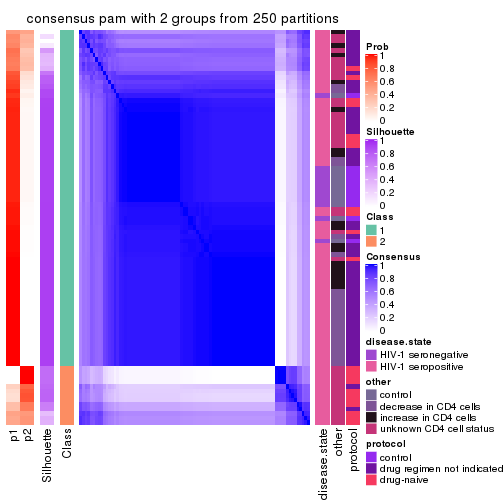</p>

</div>
<div id='tab-MAD-pam-consensus-heatmap-2'>
<pre><code class="r">consensus_heatmap(res, k = 3)
</code></pre>

<p>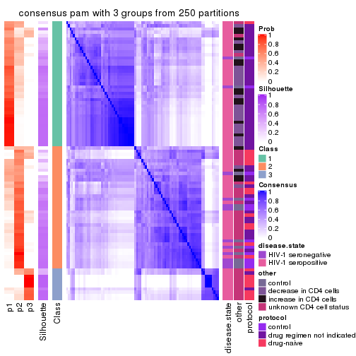</p>

</div>
<div id='tab-MAD-pam-consensus-heatmap-3'>
<pre><code class="r">consensus_heatmap(res, k = 4)
</code></pre>

<p>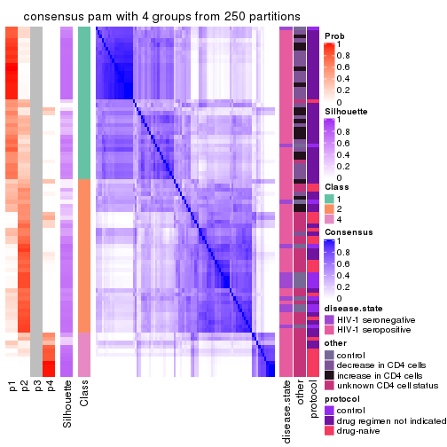</p>

</div>
<div id='tab-MAD-pam-consensus-heatmap-4'>
<pre><code class="r">consensus_heatmap(res, k = 5)
</code></pre>

<p>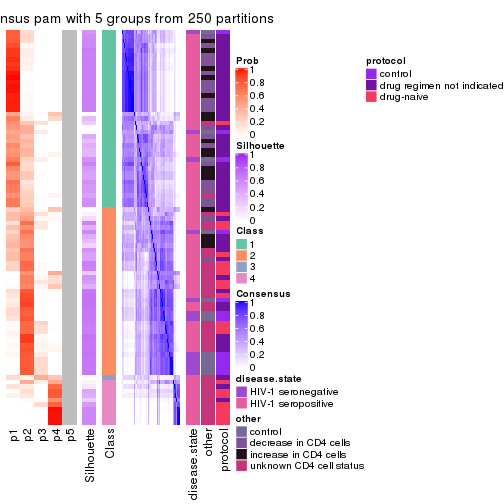</p>

</div>
<div id='tab-MAD-pam-consensus-heatmap-5'>
<pre><code class="r">consensus_heatmap(res, k = 6)
</code></pre>

<p>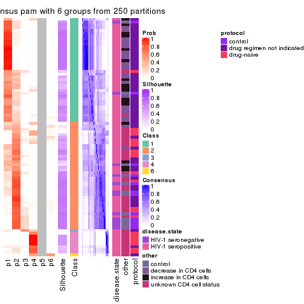</p>

</div>
</div>

Heatmaps for the membership of samples in all partitions to see how consistent they are:


<script>
$( function() {
	$( '#tabs-MAD-pam-membership-heatmap' ).tabs();
} );
</script>
<div id='tabs-MAD-pam-membership-heatmap'>
<ul>
<li><a href='#tab-MAD-pam-membership-heatmap-1'>k = 2</a></li>
<li><a href='#tab-MAD-pam-membership-heatmap-2'>k = 3</a></li>
<li><a href='#tab-MAD-pam-membership-heatmap-3'>k = 4</a></li>
<li><a href='#tab-MAD-pam-membership-heatmap-4'>k = 5</a></li>
<li><a href='#tab-MAD-pam-membership-heatmap-5'>k = 6</a></li>
</ul>
<div id='tab-MAD-pam-membership-heatmap-1'>
<pre><code class="r">membership_heatmap(res, k = 2)
</code></pre>

<p>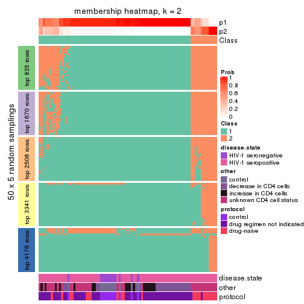</p>

</div>
<div id='tab-MAD-pam-membership-heatmap-2'>
<pre><code class="r">membership_heatmap(res, k = 3)
</code></pre>

<p>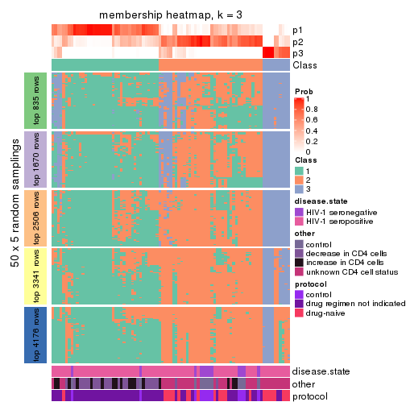</p>

</div>
<div id='tab-MAD-pam-membership-heatmap-3'>
<pre><code class="r">membership_heatmap(res, k = 4)
</code></pre>

<p>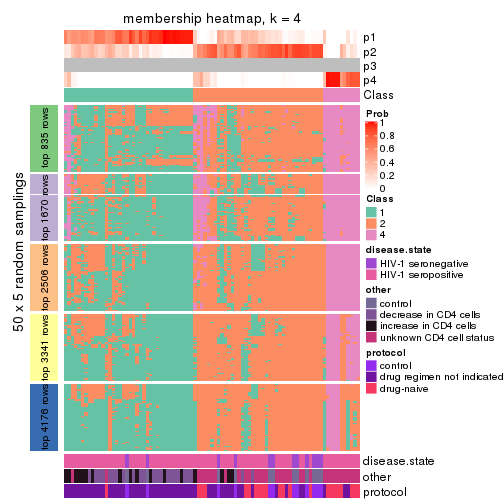</p>

</div>
<div id='tab-MAD-pam-membership-heatmap-4'>
<pre><code class="r">membership_heatmap(res, k = 5)
</code></pre>

<p>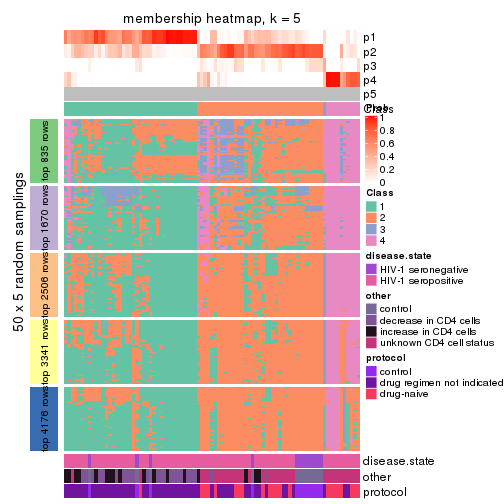</p>

</div>
<div id='tab-MAD-pam-membership-heatmap-5'>
<pre><code class="r">membership_heatmap(res, k = 6)
</code></pre>

<p>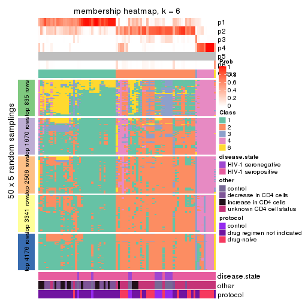</p>

</div>
</div>

As soon as we have had the classes for columns, we can look for signatures
which are significantly different between classes which can be candidate marks
for certain classes. Following are the heatmaps for signatures.


Signature heatmaps where rows are scaled:


<script>
$( function() {
	$( '#tabs-MAD-pam-get-signatures' ).tabs();
} );
</script>
<div id='tabs-MAD-pam-get-signatures'>
<ul>
<li><a href='#tab-MAD-pam-get-signatures-1'>k = 2</a></li>
<li><a href='#tab-MAD-pam-get-signatures-2'>k = 3</a></li>
<li><a href='#tab-MAD-pam-get-signatures-3'>k = 4</a></li>
<li><a href='#tab-MAD-pam-get-signatures-4'>k = 5</a></li>
<li><a href='#tab-MAD-pam-get-signatures-5'>k = 6</a></li>
</ul>
<div id='tab-MAD-pam-get-signatures-1'>
<pre><code class="r">get_signatures(res, k = 2)
</code></pre>

<p>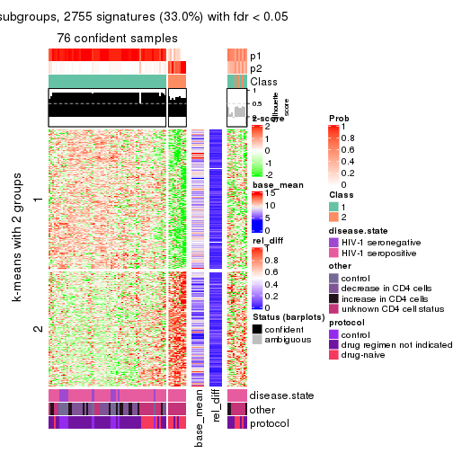</p>

</div>
<div id='tab-MAD-pam-get-signatures-2'>
<pre><code class="r">get_signatures(res, k = 3)
</code></pre>

<p>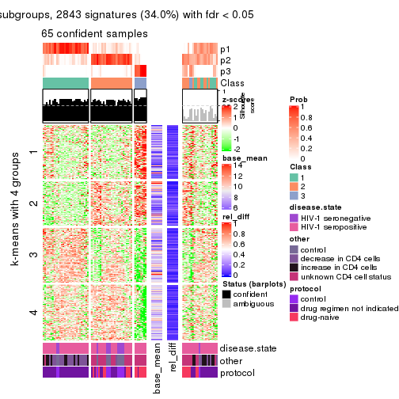</p>

</div>
<div id='tab-MAD-pam-get-signatures-3'>
<pre><code class="r">get_signatures(res, k = 4)
</code></pre>

<p>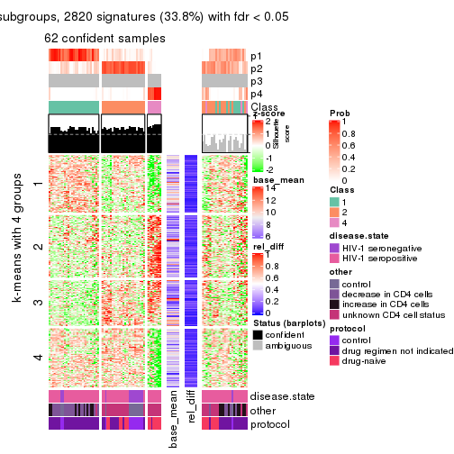</p>

</div>
<div id='tab-MAD-pam-get-signatures-4'>
<pre><code class="r">get_signatures(res, k = 5)
</code></pre>

<p>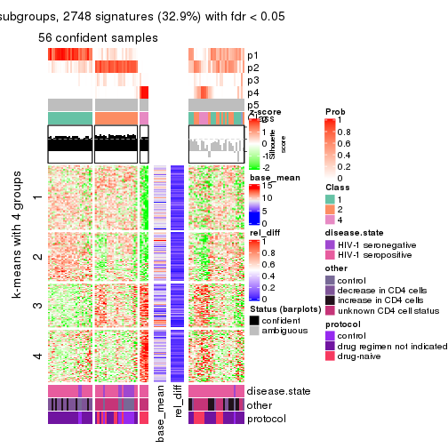</p>

</div>
<div id='tab-MAD-pam-get-signatures-5'>
<pre><code class="r">get_signatures(res, k = 6)
</code></pre>

<p>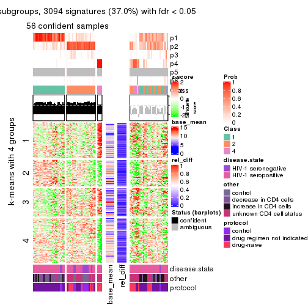</p>

</div>
</div>


Signature heatmaps where rows are not scaled:


<script>
$( function() {
	$( '#tabs-MAD-pam-get-signatures-no-scale' ).tabs();
} );
</script>
<div id='tabs-MAD-pam-get-signatures-no-scale'>
<ul>
<li><a href='#tab-MAD-pam-get-signatures-no-scale-1'>k = 2</a></li>
<li><a href='#tab-MAD-pam-get-signatures-no-scale-2'>k = 3</a></li>
<li><a href='#tab-MAD-pam-get-signatures-no-scale-3'>k = 4</a></li>
<li><a href='#tab-MAD-pam-get-signatures-no-scale-4'>k = 5</a></li>
<li><a href='#tab-MAD-pam-get-signatures-no-scale-5'>k = 6</a></li>
</ul>
<div id='tab-MAD-pam-get-signatures-no-scale-1'>
<pre><code class="r">get_signatures(res, k = 2, scale_rows = FALSE)
</code></pre>

<p>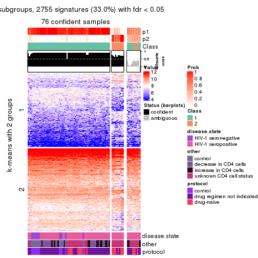</p>

</div>
<div id='tab-MAD-pam-get-signatures-no-scale-2'>
<pre><code class="r">get_signatures(res, k = 3, scale_rows = FALSE)
</code></pre>

<p>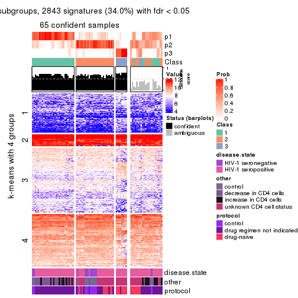</p>

</div>
<div id='tab-MAD-pam-get-signatures-no-scale-3'>
<pre><code class="r">get_signatures(res, k = 4, scale_rows = FALSE)
</code></pre>

<p>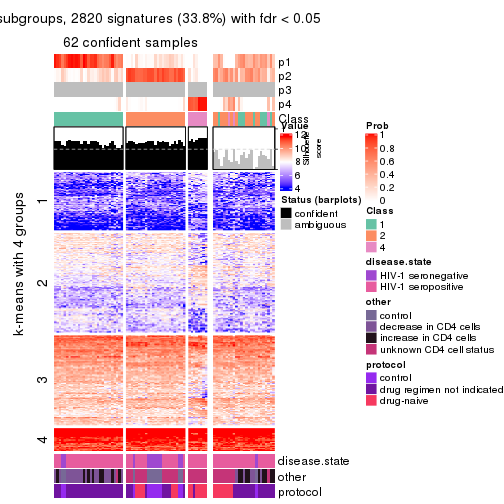</p>

</div>
<div id='tab-MAD-pam-get-signatures-no-scale-4'>
<pre><code class="r">get_signatures(res, k = 5, scale_rows = FALSE)
</code></pre>

<p>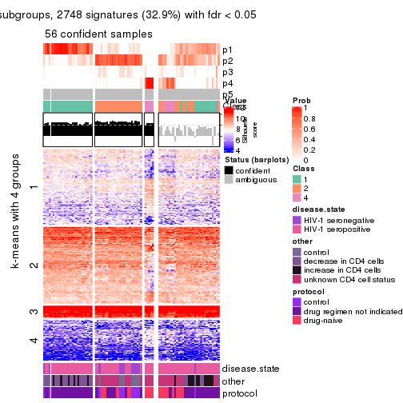</p>

</div>
<div id='tab-MAD-pam-get-signatures-no-scale-5'>
<pre><code class="r">get_signatures(res, k = 6, scale_rows = FALSE)
</code></pre>

<p>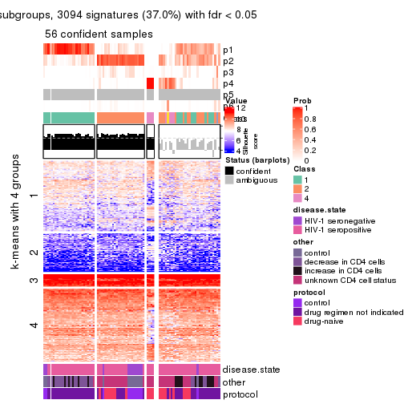</p>

</div>
</div>


Compare the overlap of signatures from different k:

```r
compare_signatures(res)
```

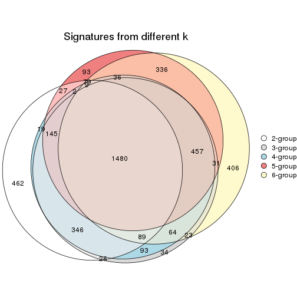

`get_signature()` returns a data frame invisibly. TO get the list of signatures, the function
call should be assigned to a variable explicitly. In following code, if `plot` argument is set
to `FALSE`, no heatmap is plotted while only the differential analysis is performed.

```r
# code only for demonstration
tb = get_signature(res, k = ..., plot = FALSE)
```

An example of the output of `tb` is:

```
#>   which_row         fdr    mean_1    mean_2 scaled_mean_1 scaled_mean_2 km
#> 1        38 0.042760348  8.373488  9.131774    -0.5533452     0.5164555  1
#> 2        40 0.018707592  7.106213  8.469186    -0.6173731     0.5762149  1
#> 3        55 0.019134737 10.221463 11.207825    -0.6159697     0.5749050  1
#> 4        59 0.006059896  5.921854  7.869574    -0.6899429     0.6439467  1
#> 5        60 0.018055526  8.928898 10.211722    -0.6204761     0.5791110  1
#> 6        98 0.009384629 15.714769 14.887706     0.6635654    -0.6193277  2
...
```

The columns in `tb` are:

1. `which_row`: row indices corresponding to the input matrix.
2. `fdr`: FDR for the differential test. 
3. `mean_x`: The mean value in group x.
4. `scaled_mean_x`: The mean value in group x after rows are scaled.
5. `km`: Row groups if k-means clustering is applied to rows.


UMAP plot which shows how samples are separated.


<script>
$( function() {
	$( '#tabs-MAD-pam-dimension-reduction' ).tabs();
} );
</script>
<div id='tabs-MAD-pam-dimension-reduction'>
<ul>
<li><a href='#tab-MAD-pam-dimension-reduction-1'>k = 2</a></li>
<li><a href='#tab-MAD-pam-dimension-reduction-2'>k = 3</a></li>
<li><a href='#tab-MAD-pam-dimension-reduction-3'>k = 4</a></li>
<li><a href='#tab-MAD-pam-dimension-reduction-4'>k = 5</a></li>
<li><a href='#tab-MAD-pam-dimension-reduction-5'>k = 6</a></li>
</ul>
<div id='tab-MAD-pam-dimension-reduction-1'>
<pre><code class="r">dimension_reduction(res, k = 2, method = &quot;UMAP&quot;)
</code></pre>

<p>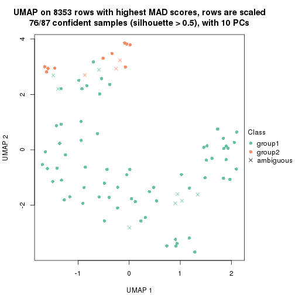</p>

</div>
<div id='tab-MAD-pam-dimension-reduction-2'>
<pre><code class="r">dimension_reduction(res, k = 3, method = &quot;UMAP&quot;)
</code></pre>

<p>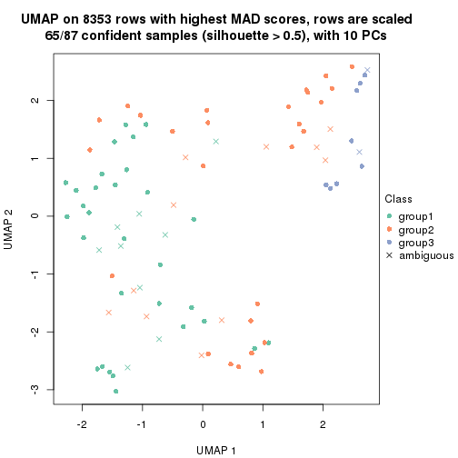</p>

</div>
<div id='tab-MAD-pam-dimension-reduction-3'>
<pre><code class="r">dimension_reduction(res, k = 4, method = &quot;UMAP&quot;)
</code></pre>

<p>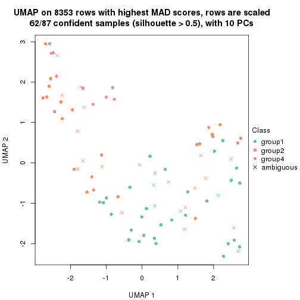</p>

</div>
<div id='tab-MAD-pam-dimension-reduction-4'>
<pre><code class="r">dimension_reduction(res, k = 5, method = &quot;UMAP&quot;)
</code></pre>

<p>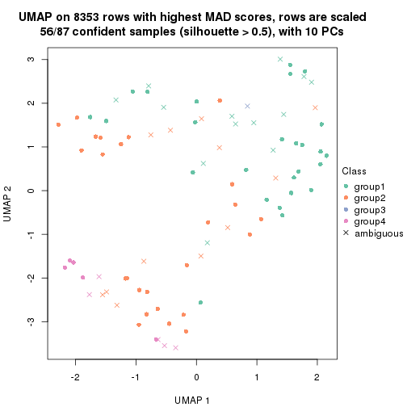</p>

</div>
<div id='tab-MAD-pam-dimension-reduction-5'>
<pre><code class="r">dimension_reduction(res, k = 6, method = &quot;UMAP&quot;)
</code></pre>

<p>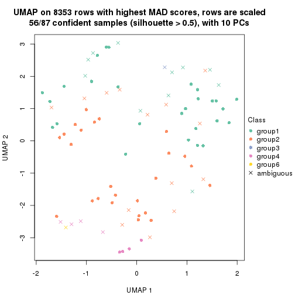</p>

</div>
</div>


Following heatmap shows how subgroups are split when increasing `k`:

```r
collect_classes(res)
```

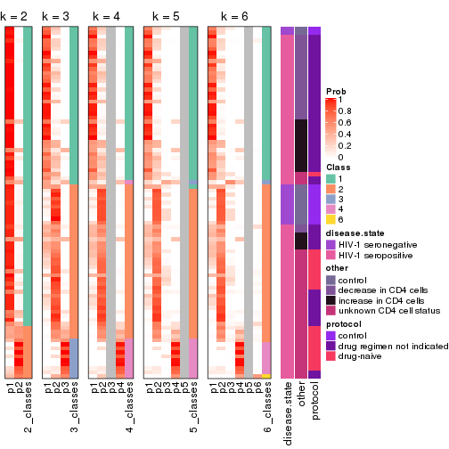


Test correlation between subgroups and known annotations. If the known
annotation is numeric, one-way ANOVA test is applied, and if the known
annotation is discrete, chi-squared contingency table test is applied.

```r
test_to_known_factors(res)
```

```
#>          n disease.state(p) other(p) protocol(p) k
#> MAD:pam 76          0.31534 1.11e-04    3.79e-05 2
#> MAD:pam 65          0.01086 1.89e-10    3.81e-08 3
#> MAD:pam 62          0.00755 1.18e-10    3.24e-08 4
#> MAD:pam 56          0.02012 8.84e-10    1.93e-07 5
#> MAD:pam 56          0.02048 7.12e-09    3.69e-07 6
```


If matrix rows can be associated to genes, consider to use `GO_Enrichment(res,
...)` to perform function enrichment for the signature genes.


 

---------------------------------------------------


### MAD:mclust


The object with results only for a single top-value method and a single partition method 
can be extracted as:

```r
res = res_list["MAD", "mclust"]
# you can also extract it by
# res = res_list["MAD:mclust"]
```

A summary of `res` and all the functions that can be applied to it:

```r
res
```

```
#> A 'ConsensusPartition' object with k = 2, 3, 4, 5, 6.
#>   On a matrix with 8353 rows and 87 columns.
#>   Top rows (835, 1670, 2506, 3341, 4176) are extracted by 'MAD' method.
#>   Subgroups are detected by 'mclust' method.
#>   Performed in total 1250 partitions by row resampling.
#>   Best k for subgroups seems to be 2.
#> 
#> Following methods can be applied to this 'ConsensusPartition' object:
#>  [1] "cola_report"             "collect_classes"         "collect_plots"          
#>  [4] "collect_stats"           "colnames"                "compare_signatures"     
#>  [7] "consensus_heatmap"       "dimension_reduction"     "functional_enrichment"  
#> [10] "get_anno_col"            "get_anno"                "get_classes"            
#> [13] "get_consensus"           "get_matrix"              "get_membership"         
#> [16] "get_param"               "get_signatures"          "get_stats"              
#> [19] "is_best_k"               "is_stable_k"             "membership_heatmap"     
#> [22] "ncol"                    "nrow"                    "plot_ecdf"              
#> [25] "rownames"                "select_partition_number" "show"                   
#> [28] "suggest_best_k"          "test_to_known_factors"
```

`collect_plots()` function collects all the plots made from `res` for all `k` (number of partitions)
into one single page to provide an easy and fast comparison between different `k`.

```r
collect_plots(res)
```

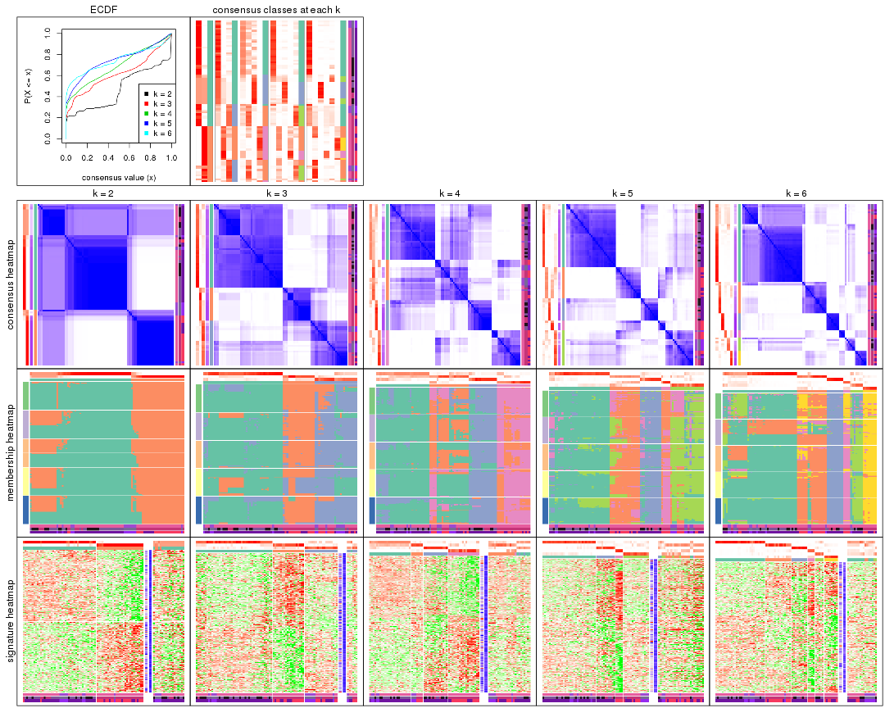

The plots are:

- The first row: a plot of the ECDF (Empirical cumulative distribution
  function) curves of the consensus matrix for each `k` and the heatmap of
  predicted classes for each `k`.
- The second row: heatmaps of the consensus matrix for each `k`.
- The third row: heatmaps of the membership matrix for each `k`.
- The fouth row: heatmaps of the signatures for each `k`.

All the plots in panels can be made by individual functions and they are
plotted later in this section.

`select_partition_number()` produces several plots showing different
statistics for choosing "optimized" `k`. There are following statistics:

- ECDF curves of the consensus matrix for each `k`;
- 1-PAC. [The PAC
  score](https://en.wikipedia.org/wiki/Consensus_clustering#Over-interpretation_potential_of_consensus_clustering)
  measures the proportion of the ambiguous subgrouping.
- Mean silhouette score.
- Concordance. The mean probability of fiting the consensus class ids in all
  partitions.
- Area increased. Denote $A_k$ as the area under the ECDF curve for current
  `k`, the area increased is defined as $A_k - A_{k-1}$.
- Rand index. The percent of pairs of samples that are both in a same cluster
  or both are not in a same cluster in the partition of k and k-1.
- Jaccard index. The ratio of pairs of samples are both in a same cluster in
  the partition of k and k-1 and the pairs of samples are both in a same
  cluster in the partition k or k-1.

The detailed explanations of these statistics can be found in [the cola
vignette](http://bioconductor.org/packages/devel/bioc/vignettes/cola/inst/doc/cola.html#toc_13).

Generally speaking, lower PAC score, higher mean silhouette score or higher
concordance corresponds to better partition. Rand index and Jaccard index
measure how similar the current partition is compared to partition with `k-1`.
If they are too similar, we won't accept `k` is better than `k-1`.

```r
select_partition_number(res)
```

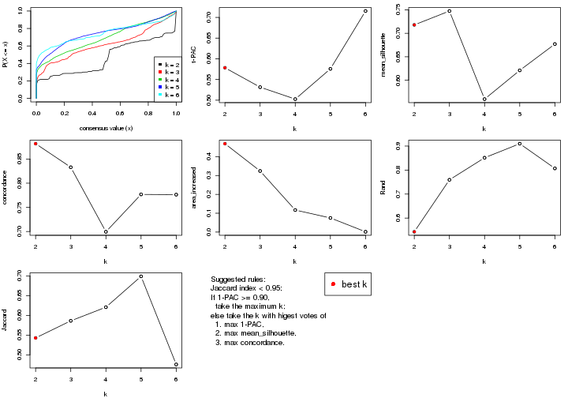

The numeric values for all these statistics can be obtained by `get_stats()`.

```r
get_stats(res)
```

```
#>   k 1-PAC mean_silhouette concordance area_increased  Rand Jaccard
#> 2 2 0.578           0.718       0.882        0.46895 0.543   0.543
#> 3 3 0.531           0.747       0.833        0.32412 0.759   0.586
#> 4 4 0.503           0.560       0.699        0.11683 0.851   0.621
#> 5 5 0.576           0.621       0.777        0.07484 0.910   0.699
#> 6 6 0.715           0.677       0.776        0.00145 0.807   0.476
```

`suggest_best_k()` suggests the best $k$ based on these statistics. The rules are as follows:

- All $k$ with Jaccard index larger than 0.95 are removed because the increase of
  the partition number does not provides enough extra information. If all $k$ are removed,
  the best $k$ is assigned by `NA`.
- For $k$ with 1-PAC larger than 0.9, the maximal $k$ is taken as the "best k". Other $k$ is called "optional k".
- If it does not fit the second rule. The $k$ with the highest vote of highest
  1-PAC, mean silhouette and concordance is taken as the "best k".

```r
suggest_best_k(res)
```

```
#> [1] 2
```


Following shows the table of the partitions (You need to click the **show/hide
code output** link to see it). The membership matrix (columns with name `p*`)
is inferred by
[`clue::cl_consensus()`](https://www.rdocumentation.org/link/cl_consensus?package=clue)
function with the `SE` method. Basically the value in the membership matrix
represents the probability to belong to a certain group. The finall class
label for an item is determined with the group with highest probability it
belongs to.

In `get_classes()` function, the entropy is calculated from the membership
matrix and the silhouette score is calculated from the consensus matrix.


<script>
$( function() {
	$( '#tabs-MAD-mclust-get-classes' ).tabs();
} );
</script>
<div id='tabs-MAD-mclust-get-classes'>
<ul>
<li><a href='#tab-MAD-mclust-get-classes-1'>k = 2</a></li>
<li><a href='#tab-MAD-mclust-get-classes-2'>k = 3</a></li>
<li><a href='#tab-MAD-mclust-get-classes-3'>k = 4</a></li>
<li><a href='#tab-MAD-mclust-get-classes-4'>k = 5</a></li>
<li><a href='#tab-MAD-mclust-get-classes-5'>k = 6</a></li>
</ul>

<div id='tab-MAD-mclust-get-classes-1'>
<p><a id='tab-MAD-mclust-get-classes-1-a' style='color:#0366d6' href='#'>show/hide code output</a></p>
<pre><code class="r">cbind(get_classes(res, k = 2), get_membership(res, k = 2))
</code></pre>

<pre><code>#&gt;          class entropy silhouette    p1    p2
#&gt; GSM39104     1  0.0000     0.8208 1.000 0.000
#&gt; GSM39105     1  0.0000     0.8208 1.000 0.000
#&gt; GSM39106     1  0.0938     0.8177 0.988 0.012
#&gt; GSM39107     2  0.9933     0.0198 0.452 0.548
#&gt; GSM39108     1  0.0000     0.8208 1.000 0.000
#&gt; GSM39109     2  0.9998    -0.2450 0.492 0.508
#&gt; GSM39110     1  0.6801     0.7111 0.820 0.180
#&gt; GSM39111     1  0.1633     0.8127 0.976 0.024
#&gt; GSM39112     1  0.9491     0.4467 0.632 0.368
#&gt; GSM39113     2  0.9686     0.2217 0.396 0.604
#&gt; GSM39114     2  0.0000     0.9259 0.000 1.000
#&gt; GSM39115     1  0.0000     0.8208 1.000 0.000
#&gt; GSM39148     1  0.0000     0.8208 1.000 0.000
#&gt; GSM39149     1  0.9993     0.2782 0.516 0.484
#&gt; GSM39150     1  0.0000     0.8208 1.000 0.000
#&gt; GSM39151     1  0.9993     0.2782 0.516 0.484
#&gt; GSM39152     1  0.9993     0.2782 0.516 0.484
#&gt; GSM39153     1  0.0000     0.8208 1.000 0.000
#&gt; GSM39154     1  0.0000     0.8208 1.000 0.000
#&gt; GSM39155     1  0.0000     0.8208 1.000 0.000
#&gt; GSM39156     1  0.0376     0.8197 0.996 0.004
#&gt; GSM39157     1  0.0000     0.8208 1.000 0.000
#&gt; GSM39158     1  0.0000     0.8208 1.000 0.000
#&gt; GSM39159     1  0.9170     0.5398 0.668 0.332
#&gt; GSM39160     1  0.0000     0.8208 1.000 0.000
#&gt; GSM39161     1  0.9993     0.2782 0.516 0.484
#&gt; GSM39162     1  0.0376     0.8197 0.996 0.004
#&gt; GSM39163     1  0.0000     0.8208 1.000 0.000
#&gt; GSM39164     1  0.0000     0.8208 1.000 0.000
#&gt; GSM39165     1  0.4562     0.7759 0.904 0.096
#&gt; GSM39166     1  0.0376     0.8200 0.996 0.004
#&gt; GSM39167     1  0.0000     0.8208 1.000 0.000
#&gt; GSM39168     1  0.0000     0.8208 1.000 0.000
#&gt; GSM39169     1  0.0000     0.8208 1.000 0.000
#&gt; GSM39170     1  0.0000     0.8208 1.000 0.000
#&gt; GSM39171     1  0.0000     0.8208 1.000 0.000
#&gt; GSM39172     1  0.9996     0.2699 0.512 0.488
#&gt; GSM39173     1  0.9996     0.2699 0.512 0.488
#&gt; GSM39174     1  0.0000     0.8208 1.000 0.000
#&gt; GSM39175     1  0.0000     0.8208 1.000 0.000
#&gt; GSM39176     1  0.0000     0.8208 1.000 0.000
#&gt; GSM39177     1  0.9993     0.2782 0.516 0.484
#&gt; GSM39178     1  0.8386     0.6241 0.732 0.268
#&gt; GSM39179     1  0.9993     0.2782 0.516 0.484
#&gt; GSM39180     1  0.9996     0.2699 0.512 0.488
#&gt; GSM39181     1  0.6887     0.7079 0.816 0.184
#&gt; GSM39182     1  0.9996     0.2699 0.512 0.488
#&gt; GSM39183     1  0.5178     0.7618 0.884 0.116
#&gt; GSM39184     1  0.0000     0.8208 1.000 0.000
#&gt; GSM39185     1  0.9993     0.2782 0.516 0.484
#&gt; GSM39186     1  0.0000     0.8208 1.000 0.000
#&gt; GSM39187     1  0.0000     0.8208 1.000 0.000
#&gt; GSM39116     2  0.0000     0.9259 0.000 1.000
#&gt; GSM39117     2  0.0000     0.9259 0.000 1.000
#&gt; GSM39118     2  0.0000     0.9259 0.000 1.000
#&gt; GSM39119     2  0.0000     0.9259 0.000 1.000
#&gt; GSM39120     1  0.4298     0.7823 0.912 0.088
#&gt; GSM39121     2  0.4562     0.8255 0.096 0.904
#&gt; GSM39122     2  0.4562     0.8255 0.096 0.904
#&gt; GSM39123     2  0.0000     0.9259 0.000 1.000
#&gt; GSM39124     2  0.0000     0.9259 0.000 1.000
#&gt; GSM39125     1  0.4431     0.7805 0.908 0.092
#&gt; GSM39126     2  0.6531     0.7177 0.168 0.832
#&gt; GSM39127     2  0.0000     0.9259 0.000 1.000
#&gt; GSM39128     2  0.0000     0.9259 0.000 1.000
#&gt; GSM39129     2  0.0000     0.9259 0.000 1.000
#&gt; GSM39130     2  0.0000     0.9259 0.000 1.000
#&gt; GSM39131     2  0.0000     0.9259 0.000 1.000
#&gt; GSM39132     2  0.0000     0.9259 0.000 1.000
#&gt; GSM39133     2  0.0000     0.9259 0.000 1.000
#&gt; GSM39134     2  0.0000     0.9259 0.000 1.000
#&gt; GSM39135     2  0.0000     0.9259 0.000 1.000
#&gt; GSM39136     2  0.0000     0.9259 0.000 1.000
#&gt; GSM39137     2  0.0376     0.9225 0.004 0.996
#&gt; GSM39138     2  0.0000     0.9259 0.000 1.000
#&gt; GSM39139     2  0.0000     0.9259 0.000 1.000
#&gt; GSM39140     1  0.0672     0.8180 0.992 0.008
#&gt; GSM39141     1  0.0672     0.8180 0.992 0.008
#&gt; GSM39142     1  0.0376     0.8197 0.996 0.004
#&gt; GSM39143     1  0.0672     0.8191 0.992 0.008
#&gt; GSM39144     2  0.0000     0.9259 0.000 1.000
#&gt; GSM39145     2  0.0000     0.9259 0.000 1.000
#&gt; GSM39146     2  0.0000     0.9259 0.000 1.000
#&gt; GSM39147     2  0.0000     0.9259 0.000 1.000
#&gt; GSM39188     1  0.9993     0.2782 0.516 0.484
#&gt; GSM39189     1  0.9993     0.2782 0.516 0.484
#&gt; GSM39190     1  0.9993     0.2782 0.516 0.484
</code></pre>

<script>
$('#tab-MAD-mclust-get-classes-1-a').parent().next().next().hide();
$('#tab-MAD-mclust-get-classes-1-a').click(function(){
  $('#tab-MAD-mclust-get-classes-1-a').parent().next().next().toggle();
  return(false);
});
</script>
</div>

<div id='tab-MAD-mclust-get-classes-2'>
<p><a id='tab-MAD-mclust-get-classes-2-a' style='color:#0366d6' href='#'>show/hide code output</a></p>
<pre><code class="r">cbind(get_classes(res, k = 3), get_membership(res, k = 3))
</code></pre>

<pre><code>#&gt;          class entropy silhouette    p1    p2    p3
#&gt; GSM39104     1  0.1964      0.847 0.944 0.000 0.056
#&gt; GSM39105     1  0.5465      0.561 0.712 0.000 0.288
#&gt; GSM39106     3  0.5497      0.656 0.292 0.000 0.708
#&gt; GSM39107     3  0.4399      0.662 0.044 0.092 0.864
#&gt; GSM39108     3  0.6244      0.359 0.440 0.000 0.560
#&gt; GSM39109     3  0.7308      0.582 0.296 0.056 0.648
#&gt; GSM39110     3  0.5926      0.550 0.356 0.000 0.644
#&gt; GSM39111     1  0.2356      0.845 0.928 0.000 0.072
#&gt; GSM39112     3  0.5891      0.734 0.200 0.036 0.764
#&gt; GSM39113     3  0.3797      0.679 0.056 0.052 0.892
#&gt; GSM39114     3  0.3551      0.574 0.000 0.132 0.868
#&gt; GSM39115     1  0.0592      0.846 0.988 0.000 0.012
#&gt; GSM39148     1  0.5216      0.515 0.740 0.000 0.260
#&gt; GSM39149     1  0.6027      0.789 0.776 0.164 0.060
#&gt; GSM39150     1  0.1860      0.847 0.948 0.000 0.052
#&gt; GSM39151     1  0.6027      0.789 0.776 0.164 0.060
#&gt; GSM39152     1  0.6027      0.789 0.776 0.164 0.060
#&gt; GSM39153     1  0.1964      0.829 0.944 0.000 0.056
#&gt; GSM39154     1  0.0237      0.848 0.996 0.000 0.004
#&gt; GSM39155     1  0.3038      0.787 0.896 0.000 0.104
#&gt; GSM39156     3  0.5138      0.731 0.252 0.000 0.748
#&gt; GSM39157     1  0.2537      0.808 0.920 0.000 0.080
#&gt; GSM39158     1  0.0237      0.848 0.996 0.000 0.004
#&gt; GSM39159     1  0.1585      0.851 0.964 0.028 0.008
#&gt; GSM39160     1  0.1753      0.847 0.952 0.000 0.048
#&gt; GSM39161     1  0.5202      0.761 0.772 0.220 0.008
#&gt; GSM39162     3  0.6260      0.448 0.448 0.000 0.552
#&gt; GSM39163     1  0.0747      0.845 0.984 0.000 0.016
#&gt; GSM39164     1  0.3116      0.782 0.892 0.000 0.108
#&gt; GSM39165     1  0.1182      0.852 0.976 0.012 0.012
#&gt; GSM39166     1  0.0237      0.849 0.996 0.004 0.000
#&gt; GSM39167     1  0.1411      0.837 0.964 0.000 0.036
#&gt; GSM39168     1  0.5785      0.316 0.668 0.000 0.332
#&gt; GSM39169     1  0.3551      0.750 0.868 0.000 0.132
#&gt; GSM39170     1  0.0237      0.848 0.996 0.000 0.004
#&gt; GSM39171     1  0.1860      0.847 0.948 0.000 0.052
#&gt; GSM39172     1  0.6535      0.750 0.728 0.220 0.052
#&gt; GSM39173     1  0.6027      0.789 0.776 0.164 0.060
#&gt; GSM39174     1  0.2796      0.798 0.908 0.000 0.092
#&gt; GSM39175     1  0.0237      0.848 0.996 0.000 0.004
#&gt; GSM39176     1  0.0592      0.846 0.988 0.000 0.012
#&gt; GSM39177     1  0.5932      0.790 0.780 0.164 0.056
#&gt; GSM39178     1  0.3791      0.837 0.892 0.060 0.048
#&gt; GSM39179     1  0.6027      0.789 0.776 0.164 0.060
#&gt; GSM39180     1  0.6586      0.751 0.728 0.216 0.056
#&gt; GSM39181     1  0.1529      0.847 0.960 0.040 0.000
#&gt; GSM39182     1  0.6012      0.759 0.748 0.220 0.032
#&gt; GSM39183     1  0.1031      0.849 0.976 0.024 0.000
#&gt; GSM39184     1  0.0424      0.847 0.992 0.000 0.008
#&gt; GSM39185     1  0.5202      0.761 0.772 0.220 0.008
#&gt; GSM39186     1  0.4235      0.689 0.824 0.000 0.176
#&gt; GSM39187     1  0.2959      0.794 0.900 0.000 0.100
#&gt; GSM39116     2  0.4346      0.890 0.000 0.816 0.184
#&gt; GSM39117     2  0.0237      0.801 0.004 0.996 0.000
#&gt; GSM39118     2  0.4002      0.899 0.000 0.840 0.160
#&gt; GSM39119     2  0.4002      0.899 0.000 0.840 0.160
#&gt; GSM39120     3  0.5461      0.741 0.244 0.008 0.748
#&gt; GSM39121     3  0.2261      0.630 0.000 0.068 0.932
#&gt; GSM39122     3  0.2537      0.623 0.000 0.080 0.920
#&gt; GSM39123     2  0.0237      0.801 0.004 0.996 0.000
#&gt; GSM39124     3  0.3941      0.544 0.000 0.156 0.844
#&gt; GSM39125     3  0.5502      0.739 0.248 0.008 0.744
#&gt; GSM39126     3  0.2356      0.628 0.000 0.072 0.928
#&gt; GSM39127     3  0.5733      0.200 0.000 0.324 0.676
#&gt; GSM39128     3  0.4842      0.433 0.000 0.224 0.776
#&gt; GSM39129     2  0.4002      0.899 0.000 0.840 0.160
#&gt; GSM39130     2  0.0237      0.801 0.004 0.996 0.000
#&gt; GSM39131     3  0.4931      0.414 0.000 0.232 0.768
#&gt; GSM39132     2  0.5905      0.733 0.000 0.648 0.352
#&gt; GSM39133     2  0.0475      0.804 0.004 0.992 0.004
#&gt; GSM39134     2  0.4002      0.899 0.000 0.840 0.160
#&gt; GSM39135     2  0.4702      0.872 0.000 0.788 0.212
#&gt; GSM39136     2  0.4504      0.883 0.000 0.804 0.196
#&gt; GSM39137     3  0.2959      0.607 0.000 0.100 0.900
#&gt; GSM39138     2  0.4002      0.899 0.000 0.840 0.160
#&gt; GSM39139     2  0.4002      0.899 0.000 0.840 0.160
#&gt; GSM39140     3  0.5502      0.739 0.248 0.008 0.744
#&gt; GSM39141     3  0.5502      0.739 0.248 0.008 0.744
#&gt; GSM39142     3  0.5216      0.731 0.260 0.000 0.740
#&gt; GSM39143     3  0.5502      0.739 0.248 0.008 0.744
#&gt; GSM39144     2  0.4002      0.899 0.000 0.840 0.160
#&gt; GSM39145     2  0.4062      0.898 0.000 0.836 0.164
#&gt; GSM39146     2  0.6126      0.631 0.000 0.600 0.400
#&gt; GSM39147     2  0.6008      0.701 0.000 0.628 0.372
#&gt; GSM39188     1  0.6083      0.787 0.772 0.168 0.060
#&gt; GSM39189     1  0.6083      0.787 0.772 0.168 0.060
#&gt; GSM39190     1  0.6083      0.787 0.772 0.168 0.060
</code></pre>

<script>
$('#tab-MAD-mclust-get-classes-2-a').parent().next().next().hide();
$('#tab-MAD-mclust-get-classes-2-a').click(function(){
  $('#tab-MAD-mclust-get-classes-2-a').parent().next().next().toggle();
  return(false);
});
</script>
</div>

<div id='tab-MAD-mclust-get-classes-3'>
<p><a id='tab-MAD-mclust-get-classes-3-a' style='color:#0366d6' href='#'>show/hide code output</a></p>
<pre><code class="r">cbind(get_classes(res, k = 4), get_membership(res, k = 4))
</code></pre>

<pre><code>#&gt;          class entropy silhouette    p1    p2    p3    p4
#&gt; GSM39104     1  0.7536      0.662 0.488 0.284 0.228 0.000
#&gt; GSM39105     1  0.6843      0.661 0.532 0.356 0.112 0.000
#&gt; GSM39106     2  0.6377      0.237 0.256 0.632 0.112 0.000
#&gt; GSM39107     2  0.4142      0.570 0.080 0.844 0.012 0.064
#&gt; GSM39108     2  0.7328     -0.378 0.392 0.452 0.156 0.000
#&gt; GSM39109     2  0.7223      0.240 0.100 0.528 0.356 0.016
#&gt; GSM39110     2  0.7381     -0.141 0.324 0.512 0.160 0.004
#&gt; GSM39111     1  0.7692      0.631 0.456 0.272 0.272 0.000
#&gt; GSM39112     2  0.4274      0.548 0.116 0.832 0.028 0.024
#&gt; GSM39113     2  0.3558      0.578 0.048 0.872 0.008 0.072
#&gt; GSM39114     2  0.5500     -0.323 0.016 0.520 0.000 0.464
#&gt; GSM39115     1  0.6641      0.741 0.600 0.276 0.124 0.000
#&gt; GSM39148     1  0.5085      0.679 0.616 0.376 0.008 0.000
#&gt; GSM39149     3  0.1716      0.881 0.064 0.000 0.936 0.000
#&gt; GSM39150     1  0.6187      0.320 0.516 0.052 0.432 0.000
#&gt; GSM39151     3  0.1716      0.881 0.064 0.000 0.936 0.000
#&gt; GSM39152     3  0.2011      0.873 0.080 0.000 0.920 0.000
#&gt; GSM39153     1  0.6005      0.738 0.616 0.324 0.060 0.000
#&gt; GSM39154     1  0.6350      0.746 0.612 0.296 0.092 0.000
#&gt; GSM39155     1  0.5848      0.731 0.616 0.336 0.048 0.000
#&gt; GSM39156     2  0.5168      0.351 0.248 0.712 0.040 0.000
#&gt; GSM39157     1  0.5666      0.722 0.616 0.348 0.036 0.000
#&gt; GSM39158     1  0.6536      0.537 0.580 0.096 0.324 0.000
#&gt; GSM39159     3  0.4761      0.353 0.372 0.000 0.628 0.000
#&gt; GSM39160     1  0.5604      0.168 0.504 0.020 0.476 0.000
#&gt; GSM39161     3  0.4086      0.689 0.216 0.000 0.776 0.008
#&gt; GSM39162     1  0.5236      0.577 0.560 0.432 0.008 0.000
#&gt; GSM39163     1  0.6141      0.743 0.616 0.312 0.072 0.000
#&gt; GSM39164     1  0.5599      0.717 0.616 0.352 0.032 0.000
#&gt; GSM39165     1  0.5493      0.192 0.528 0.016 0.456 0.000
#&gt; GSM39166     1  0.5088      0.266 0.572 0.004 0.424 0.000
#&gt; GSM39167     1  0.6052      0.741 0.616 0.320 0.064 0.000
#&gt; GSM39168     1  0.5138      0.656 0.600 0.392 0.008 0.000
#&gt; GSM39169     1  0.5682      0.716 0.612 0.352 0.036 0.000
#&gt; GSM39170     1  0.6761      0.719 0.608 0.224 0.168 0.000
#&gt; GSM39171     1  0.7412      0.641 0.504 0.200 0.296 0.000
#&gt; GSM39172     3  0.1042      0.847 0.020 0.000 0.972 0.008
#&gt; GSM39173     3  0.1716      0.881 0.064 0.000 0.936 0.000
#&gt; GSM39174     1  0.5666      0.720 0.616 0.348 0.036 0.000
#&gt; GSM39175     1  0.6501      0.743 0.616 0.268 0.116 0.000
#&gt; GSM39176     1  0.6295      0.746 0.616 0.296 0.088 0.000
#&gt; GSM39177     3  0.2081      0.874 0.084 0.000 0.916 0.000
#&gt; GSM39178     3  0.4898      0.166 0.416 0.000 0.584 0.000
#&gt; GSM39179     3  0.1716      0.881 0.064 0.000 0.936 0.000
#&gt; GSM39180     3  0.0336      0.840 0.000 0.000 0.992 0.008
#&gt; GSM39181     1  0.4998      0.123 0.512 0.000 0.488 0.000
#&gt; GSM39182     3  0.1639      0.843 0.036 0.004 0.952 0.008
#&gt; GSM39183     1  0.4977      0.185 0.540 0.000 0.460 0.000
#&gt; GSM39184     1  0.6661      0.741 0.604 0.264 0.132 0.000
#&gt; GSM39185     3  0.3681      0.740 0.176 0.000 0.816 0.008
#&gt; GSM39186     1  0.5599      0.717 0.616 0.352 0.032 0.000
#&gt; GSM39187     1  0.6039      0.721 0.596 0.348 0.056 0.000
#&gt; GSM39116     4  0.4019      0.713 0.012 0.196 0.000 0.792
#&gt; GSM39117     4  0.6197      0.600 0.364 0.024 0.024 0.588
#&gt; GSM39118     4  0.1545      0.764 0.008 0.040 0.000 0.952
#&gt; GSM39119     4  0.1716      0.762 0.064 0.000 0.000 0.936
#&gt; GSM39120     2  0.4105      0.514 0.156 0.812 0.032 0.000
#&gt; GSM39121     2  0.2654      0.544 0.004 0.888 0.000 0.108
#&gt; GSM39122     2  0.2714      0.540 0.004 0.884 0.000 0.112
#&gt; GSM39123     4  0.6237      0.601 0.376 0.024 0.024 0.576
#&gt; GSM39124     2  0.5691     -0.342 0.024 0.508 0.000 0.468
#&gt; GSM39125     2  0.4423      0.499 0.168 0.792 0.040 0.000
#&gt; GSM39126     2  0.3099      0.562 0.020 0.876 0.000 0.104
#&gt; GSM39127     4  0.4999      0.590 0.012 0.328 0.000 0.660
#&gt; GSM39128     2  0.6147     -0.366 0.048 0.488 0.000 0.464
#&gt; GSM39129     4  0.1389      0.767 0.048 0.000 0.000 0.952
#&gt; GSM39130     4  0.6197      0.600 0.364 0.024 0.024 0.588
#&gt; GSM39131     2  0.6147     -0.368 0.048 0.488 0.000 0.464
#&gt; GSM39132     4  0.5127      0.553 0.012 0.356 0.000 0.632
#&gt; GSM39133     4  0.5839      0.613 0.376 0.020 0.012 0.592
#&gt; GSM39134     4  0.1118      0.768 0.036 0.000 0.000 0.964
#&gt; GSM39135     4  0.4175      0.700 0.012 0.212 0.000 0.776
#&gt; GSM39136     4  0.3577      0.732 0.012 0.156 0.000 0.832
#&gt; GSM39137     2  0.3842      0.475 0.036 0.836 0.000 0.128
#&gt; GSM39138     4  0.1389      0.767 0.048 0.000 0.000 0.952
#&gt; GSM39139     4  0.1798      0.768 0.040 0.016 0.000 0.944
#&gt; GSM39140     2  0.4707      0.449 0.204 0.760 0.036 0.000
#&gt; GSM39141     2  0.4323      0.485 0.184 0.788 0.028 0.000
#&gt; GSM39142     2  0.4910      0.317 0.276 0.704 0.020 0.000
#&gt; GSM39143     2  0.4579      0.459 0.200 0.768 0.032 0.000
#&gt; GSM39144     4  0.1389      0.767 0.048 0.000 0.000 0.952
#&gt; GSM39145     4  0.3032      0.746 0.008 0.124 0.000 0.868
#&gt; GSM39146     4  0.5865      0.573 0.048 0.340 0.000 0.612
#&gt; GSM39147     4  0.5290      0.482 0.012 0.404 0.000 0.584
#&gt; GSM39188     3  0.1716      0.881 0.064 0.000 0.936 0.000
#&gt; GSM39189     3  0.1792      0.880 0.068 0.000 0.932 0.000
#&gt; GSM39190     3  0.1716      0.881 0.064 0.000 0.936 0.000
</code></pre>

<script>
$('#tab-MAD-mclust-get-classes-3-a').parent().next().next().hide();
$('#tab-MAD-mclust-get-classes-3-a').click(function(){
  $('#tab-MAD-mclust-get-classes-3-a').parent().next().next().toggle();
  return(false);
});
</script>
</div>

<div id='tab-MAD-mclust-get-classes-4'>
<p><a id='tab-MAD-mclust-get-classes-4-a' style='color:#0366d6' href='#'>show/hide code output</a></p>
<pre><code class="r">cbind(get_classes(res, k = 5), get_membership(res, k = 5))
</code></pre>

<pre><code>#&gt;          class entropy silhouette    p1    p2    p3    p4    p5
#&gt; GSM39104     1  0.4170     0.7871 0.820 0.020 0.080 0.008 0.072
#&gt; GSM39105     1  0.3889     0.8079 0.808 0.008 0.032 0.004 0.148
#&gt; GSM39106     5  0.4852     0.7071 0.116 0.020 0.096 0.004 0.764
#&gt; GSM39107     5  0.3715     0.6923 0.036 0.136 0.004 0.004 0.820
#&gt; GSM39108     5  0.6810     0.3045 0.336 0.020 0.132 0.008 0.504
#&gt; GSM39109     5  0.7733     0.2713 0.084 0.192 0.244 0.004 0.476
#&gt; GSM39110     5  0.6645     0.5393 0.216 0.036 0.152 0.004 0.592
#&gt; GSM39111     1  0.5286     0.6978 0.736 0.036 0.140 0.004 0.084
#&gt; GSM39112     5  0.2977     0.7240 0.052 0.060 0.004 0.004 0.880
#&gt; GSM39113     5  0.3768     0.6782 0.028 0.156 0.004 0.004 0.808
#&gt; GSM39114     5  0.4713     0.0611 0.000 0.440 0.000 0.016 0.544
#&gt; GSM39115     1  0.2777     0.8395 0.864 0.000 0.016 0.000 0.120
#&gt; GSM39148     1  0.2179     0.8419 0.888 0.000 0.000 0.000 0.112
#&gt; GSM39149     3  0.1798     0.8472 0.064 0.004 0.928 0.000 0.004
#&gt; GSM39150     1  0.1697     0.8047 0.932 0.008 0.060 0.000 0.000
#&gt; GSM39151     3  0.1544     0.8500 0.068 0.000 0.932 0.000 0.000
#&gt; GSM39152     3  0.3360     0.7894 0.168 0.012 0.816 0.000 0.004
#&gt; GSM39153     1  0.1965     0.8454 0.904 0.000 0.000 0.000 0.096
#&gt; GSM39154     1  0.2352     0.8477 0.896 0.004 0.008 0.000 0.092
#&gt; GSM39155     1  0.2516     0.8318 0.860 0.000 0.000 0.000 0.140
#&gt; GSM39156     5  0.3291     0.7360 0.120 0.000 0.040 0.000 0.840
#&gt; GSM39157     1  0.2690     0.8209 0.844 0.000 0.000 0.000 0.156
#&gt; GSM39158     1  0.1243     0.8168 0.960 0.004 0.028 0.000 0.008
#&gt; GSM39159     1  0.6356     0.2605 0.572 0.184 0.232 0.000 0.012
#&gt; GSM39160     1  0.1943     0.8003 0.924 0.020 0.056 0.000 0.000
#&gt; GSM39161     1  0.7334    -0.0283 0.468 0.196 0.300 0.020 0.016
#&gt; GSM39162     1  0.2970     0.8060 0.828 0.000 0.004 0.000 0.168
#&gt; GSM39163     1  0.2233     0.8445 0.892 0.000 0.004 0.000 0.104
#&gt; GSM39164     1  0.2233     0.8437 0.892 0.000 0.004 0.000 0.104
#&gt; GSM39165     1  0.2670     0.7764 0.888 0.016 0.088 0.004 0.004
#&gt; GSM39166     1  0.1911     0.7987 0.932 0.028 0.036 0.000 0.004
#&gt; GSM39167     1  0.2329     0.8397 0.876 0.000 0.000 0.000 0.124
#&gt; GSM39168     1  0.2488     0.8399 0.872 0.000 0.004 0.000 0.124
#&gt; GSM39169     1  0.2233     0.8431 0.892 0.000 0.004 0.000 0.104
#&gt; GSM39170     1  0.1243     0.8338 0.960 0.004 0.008 0.000 0.028
#&gt; GSM39171     1  0.2331     0.8044 0.908 0.008 0.068 0.000 0.016
#&gt; GSM39172     3  0.6574     0.5680 0.252 0.152 0.572 0.008 0.016
#&gt; GSM39173     3  0.1704     0.8498 0.068 0.000 0.928 0.000 0.004
#&gt; GSM39174     1  0.2179     0.8418 0.888 0.000 0.000 0.000 0.112
#&gt; GSM39175     1  0.0865     0.8334 0.972 0.000 0.004 0.000 0.024
#&gt; GSM39176     1  0.2280     0.8424 0.880 0.000 0.000 0.000 0.120
#&gt; GSM39177     3  0.2798     0.8242 0.140 0.008 0.852 0.000 0.000
#&gt; GSM39178     1  0.4456     0.6461 0.768 0.072 0.152 0.000 0.008
#&gt; GSM39179     3  0.1544     0.8500 0.068 0.000 0.932 0.000 0.000
#&gt; GSM39180     3  0.4548     0.7201 0.092 0.108 0.780 0.000 0.020
#&gt; GSM39181     1  0.3856     0.7389 0.840 0.056 0.076 0.020 0.008
#&gt; GSM39182     3  0.7572     0.4649 0.280 0.196 0.472 0.020 0.032
#&gt; GSM39183     1  0.3334     0.7540 0.864 0.048 0.072 0.004 0.012
#&gt; GSM39184     1  0.1952     0.8469 0.912 0.000 0.004 0.000 0.084
#&gt; GSM39185     1  0.7171    -0.1640 0.432 0.196 0.348 0.008 0.016
#&gt; GSM39186     1  0.2516     0.8319 0.860 0.000 0.000 0.000 0.140
#&gt; GSM39187     1  0.2773     0.8142 0.836 0.000 0.000 0.000 0.164
#&gt; GSM39116     2  0.5498     0.4449 0.000 0.580 0.000 0.340 0.080
#&gt; GSM39117     4  0.1043     0.7942 0.000 0.040 0.000 0.960 0.000
#&gt; GSM39118     2  0.4392     0.3544 0.000 0.612 0.000 0.380 0.008
#&gt; GSM39119     4  0.4291    -0.2331 0.000 0.464 0.000 0.536 0.000
#&gt; GSM39120     5  0.1894     0.7430 0.072 0.000 0.008 0.000 0.920
#&gt; GSM39121     5  0.3779     0.5712 0.000 0.236 0.000 0.012 0.752
#&gt; GSM39122     5  0.3642     0.5813 0.000 0.232 0.000 0.008 0.760
#&gt; GSM39123     4  0.1121     0.7957 0.000 0.044 0.000 0.956 0.000
#&gt; GSM39124     2  0.4740     0.1061 0.000 0.516 0.000 0.016 0.468
#&gt; GSM39125     5  0.2054     0.7430 0.072 0.004 0.008 0.000 0.916
#&gt; GSM39126     5  0.3578     0.6083 0.004 0.204 0.000 0.008 0.784
#&gt; GSM39127     2  0.6211     0.4692 0.000 0.548 0.000 0.248 0.204
#&gt; GSM39128     2  0.5542     0.1765 0.000 0.500 0.000 0.068 0.432
#&gt; GSM39129     2  0.4283     0.1955 0.000 0.544 0.000 0.456 0.000
#&gt; GSM39130     4  0.0963     0.7965 0.000 0.036 0.000 0.964 0.000
#&gt; GSM39131     2  0.5348     0.0937 0.000 0.492 0.000 0.052 0.456
#&gt; GSM39132     2  0.5775     0.4792 0.000 0.608 0.000 0.148 0.244
#&gt; GSM39133     4  0.1792     0.7722 0.000 0.084 0.000 0.916 0.000
#&gt; GSM39134     2  0.4294     0.2136 0.000 0.532 0.000 0.468 0.000
#&gt; GSM39135     2  0.5498     0.4459 0.000 0.580 0.000 0.340 0.080
#&gt; GSM39136     2  0.5562     0.3846 0.000 0.520 0.000 0.408 0.072
#&gt; GSM39137     5  0.4836     0.4048 0.000 0.304 0.000 0.044 0.652
#&gt; GSM39138     2  0.4283     0.1955 0.000 0.544 0.000 0.456 0.000
#&gt; GSM39139     2  0.4249     0.2488 0.000 0.568 0.000 0.432 0.000
#&gt; GSM39140     5  0.2707     0.7436 0.100 0.000 0.024 0.000 0.876
#&gt; GSM39141     5  0.2740     0.7439 0.096 0.000 0.028 0.000 0.876
#&gt; GSM39142     5  0.4021     0.6931 0.200 0.000 0.036 0.000 0.764
#&gt; GSM39143     5  0.2959     0.7422 0.100 0.000 0.036 0.000 0.864
#&gt; GSM39144     2  0.4283     0.1955 0.000 0.544 0.000 0.456 0.000
#&gt; GSM39145     2  0.4836     0.4119 0.000 0.628 0.000 0.336 0.036
#&gt; GSM39146     2  0.5902     0.4735 0.000 0.600 0.000 0.208 0.192
#&gt; GSM39147     2  0.5606     0.4405 0.000 0.600 0.000 0.104 0.296
#&gt; GSM39188     3  0.1544     0.8500 0.068 0.000 0.932 0.000 0.000
#&gt; GSM39189     3  0.2719     0.8368 0.068 0.048 0.884 0.000 0.000
#&gt; GSM39190     3  0.1894     0.8503 0.072 0.008 0.920 0.000 0.000
</code></pre>

<script>
$('#tab-MAD-mclust-get-classes-4-a').parent().next().next().hide();
$('#tab-MAD-mclust-get-classes-4-a').click(function(){
  $('#tab-MAD-mclust-get-classes-4-a').parent().next().next().toggle();
  return(false);
});
</script>
</div>

<div id='tab-MAD-mclust-get-classes-5'>
<p><a id='tab-MAD-mclust-get-classes-5-a' style='color:#0366d6' href='#'>show/hide code output</a></p>
<pre><code class="r">cbind(get_classes(res, k = 6), get_membership(res, k = 6))
</code></pre>

<pre><code>#&gt;          class entropy silhouette    p1    p2    p3    p4    p5    p6
#&gt; GSM39104     1  0.3451     0.6977 0.840 0.000 0.052 0.076 0.028 0.004
#&gt; GSM39105     1  0.1873     0.7487 0.924 0.000 0.020 0.048 0.008 0.000
#&gt; GSM39106     1  0.7766     0.3894 0.496 0.156 0.032 0.152 0.144 0.020
#&gt; GSM39107     2  0.6654    -0.0519 0.344 0.468 0.000 0.076 0.104 0.008
#&gt; GSM39108     1  0.6585     0.5350 0.640 0.092 0.064 0.116 0.076 0.012
#&gt; GSM39109     5  0.7382    -0.1138 0.392 0.040 0.060 0.096 0.396 0.016
#&gt; GSM39110     1  0.7592     0.4333 0.544 0.108 0.080 0.140 0.112 0.016
#&gt; GSM39111     1  0.4008     0.6595 0.792 0.000 0.092 0.088 0.028 0.000
#&gt; GSM39112     1  0.7446     0.3338 0.456 0.236 0.000 0.132 0.156 0.020
#&gt; GSM39113     2  0.5617     0.4031 0.164 0.664 0.000 0.080 0.088 0.004
#&gt; GSM39114     2  0.1003     0.7416 0.000 0.964 0.000 0.020 0.000 0.016
#&gt; GSM39115     1  0.0520     0.7696 0.984 0.000 0.000 0.008 0.008 0.000
#&gt; GSM39148     1  0.0622     0.7696 0.980 0.000 0.000 0.012 0.008 0.000
#&gt; GSM39149     3  0.0260     0.9745 0.000 0.000 0.992 0.008 0.000 0.000
#&gt; GSM39150     1  0.1353     0.7596 0.952 0.000 0.024 0.012 0.012 0.000
#&gt; GSM39151     3  0.0405     0.9755 0.004 0.000 0.988 0.008 0.000 0.000
#&gt; GSM39152     3  0.1536     0.9392 0.024 0.000 0.944 0.020 0.012 0.000
#&gt; GSM39153     1  0.0146     0.7685 0.996 0.000 0.000 0.004 0.000 0.000
#&gt; GSM39154     1  0.0260     0.7680 0.992 0.000 0.000 0.000 0.008 0.000
#&gt; GSM39155     1  0.0405     0.7692 0.988 0.000 0.000 0.008 0.004 0.000
#&gt; GSM39156     1  0.7441     0.3981 0.500 0.172 0.008 0.132 0.168 0.020
#&gt; GSM39157     1  0.0291     0.7693 0.992 0.000 0.000 0.004 0.004 0.000
#&gt; GSM39158     1  0.0806     0.7658 0.972 0.000 0.000 0.008 0.020 0.000
#&gt; GSM39159     5  0.4458     0.5548 0.352 0.000 0.040 0.000 0.608 0.000
#&gt; GSM39160     1  0.1788     0.7445 0.928 0.000 0.028 0.004 0.040 0.000
#&gt; GSM39161     5  0.3669     0.6381 0.208 0.000 0.028 0.000 0.760 0.004
#&gt; GSM39162     1  0.1237     0.7644 0.956 0.000 0.004 0.020 0.020 0.000
#&gt; GSM39163     1  0.0405     0.7681 0.988 0.000 0.000 0.004 0.008 0.000
#&gt; GSM39164     1  0.0000     0.7680 1.000 0.000 0.000 0.000 0.000 0.000
#&gt; GSM39165     1  0.2103     0.7447 0.916 0.000 0.040 0.024 0.020 0.000
#&gt; GSM39166     1  0.1644     0.7193 0.920 0.000 0.000 0.004 0.076 0.000
#&gt; GSM39167     1  0.0405     0.7690 0.988 0.000 0.000 0.008 0.004 0.000
#&gt; GSM39168     1  0.0912     0.7679 0.972 0.004 0.004 0.008 0.012 0.000
#&gt; GSM39169     1  0.0260     0.7693 0.992 0.000 0.000 0.000 0.008 0.000
#&gt; GSM39170     1  0.0405     0.7682 0.988 0.000 0.000 0.004 0.008 0.000
#&gt; GSM39171     1  0.1821     0.7473 0.928 0.000 0.040 0.008 0.024 0.000
#&gt; GSM39172     5  0.4002     0.5711 0.068 0.000 0.188 0.000 0.744 0.000
#&gt; GSM39173     3  0.0146     0.9754 0.000 0.000 0.996 0.000 0.004 0.000
#&gt; GSM39174     1  0.0000     0.7680 1.000 0.000 0.000 0.000 0.000 0.000
#&gt; GSM39175     1  0.0146     0.7679 0.996 0.000 0.000 0.000 0.004 0.000
#&gt; GSM39176     1  0.0520     0.7689 0.984 0.000 0.000 0.008 0.008 0.000
#&gt; GSM39177     3  0.0870     0.9722 0.012 0.000 0.972 0.004 0.012 0.000
#&gt; GSM39178     1  0.5224    -0.3518 0.468 0.000 0.092 0.000 0.440 0.000
#&gt; GSM39179     3  0.0260     0.9748 0.000 0.000 0.992 0.000 0.008 0.000
#&gt; GSM39180     5  0.4176     0.1799 0.016 0.000 0.404 0.000 0.580 0.000
#&gt; GSM39181     1  0.3265     0.4695 0.748 0.000 0.000 0.000 0.248 0.004
#&gt; GSM39182     5  0.3745     0.6204 0.100 0.000 0.116 0.000 0.784 0.000
#&gt; GSM39183     1  0.3464     0.2769 0.688 0.000 0.000 0.000 0.312 0.000
#&gt; GSM39184     1  0.0146     0.7679 0.996 0.000 0.000 0.000 0.004 0.000
#&gt; GSM39185     5  0.3618     0.6434 0.192 0.000 0.040 0.000 0.768 0.000
#&gt; GSM39186     1  0.0146     0.7685 0.996 0.000 0.000 0.004 0.000 0.000
#&gt; GSM39187     1  0.0520     0.7695 0.984 0.000 0.000 0.008 0.008 0.000
#&gt; GSM39116     2  0.4820     0.5460 0.000 0.652 0.000 0.088 0.004 0.256
#&gt; GSM39117     4  0.3341     0.9722 0.000 0.012 0.000 0.776 0.004 0.208
#&gt; GSM39118     6  0.2755     0.8147 0.000 0.140 0.000 0.012 0.004 0.844
#&gt; GSM39119     6  0.3689     0.7701 0.000 0.068 0.000 0.136 0.004 0.792
#&gt; GSM39120     1  0.7520     0.3574 0.468 0.204 0.004 0.124 0.180 0.020
#&gt; GSM39121     2  0.0909     0.7272 0.000 0.968 0.000 0.020 0.012 0.000
#&gt; GSM39122     2  0.0909     0.7272 0.000 0.968 0.000 0.020 0.012 0.000
#&gt; GSM39123     4  0.3504     0.9707 0.000 0.024 0.000 0.776 0.004 0.196
#&gt; GSM39124     2  0.0777     0.7446 0.000 0.972 0.000 0.004 0.000 0.024
#&gt; GSM39125     1  0.7525     0.3671 0.476 0.204 0.008 0.112 0.180 0.020
#&gt; GSM39126     2  0.1341     0.7149 0.000 0.948 0.000 0.028 0.024 0.000
#&gt; GSM39127     2  0.4569     0.6140 0.000 0.700 0.000 0.096 0.004 0.200
#&gt; GSM39128     2  0.1528     0.7442 0.000 0.936 0.000 0.016 0.000 0.048
#&gt; GSM39129     6  0.1082     0.8951 0.000 0.040 0.000 0.004 0.000 0.956
#&gt; GSM39130     4  0.3230     0.9708 0.000 0.012 0.000 0.776 0.000 0.212
#&gt; GSM39131     2  0.1367     0.7451 0.000 0.944 0.000 0.012 0.000 0.044
#&gt; GSM39132     2  0.4152     0.6051 0.000 0.712 0.000 0.044 0.004 0.240
#&gt; GSM39133     4  0.3543     0.9517 0.000 0.032 0.000 0.768 0.000 0.200
#&gt; GSM39134     6  0.2696     0.8508 0.000 0.048 0.000 0.076 0.004 0.872
#&gt; GSM39135     2  0.4688     0.5267 0.000 0.644 0.000 0.064 0.004 0.288
#&gt; GSM39136     2  0.5167     0.5320 0.000 0.632 0.000 0.148 0.004 0.216
#&gt; GSM39137     2  0.0725     0.7397 0.000 0.976 0.000 0.012 0.000 0.012
#&gt; GSM39138     6  0.1257     0.8881 0.000 0.028 0.000 0.020 0.000 0.952
#&gt; GSM39139     6  0.1075     0.8945 0.000 0.048 0.000 0.000 0.000 0.952
#&gt; GSM39140     1  0.7577     0.3707 0.476 0.184 0.008 0.132 0.180 0.020
#&gt; GSM39141     1  0.7526     0.3807 0.484 0.180 0.008 0.128 0.180 0.020
#&gt; GSM39142     1  0.7013     0.4444 0.556 0.172 0.008 0.104 0.140 0.020
#&gt; GSM39143     1  0.7548     0.3759 0.480 0.184 0.008 0.128 0.180 0.020
#&gt; GSM39144     6  0.1082     0.8951 0.000 0.040 0.000 0.004 0.000 0.956
#&gt; GSM39145     6  0.2165     0.8514 0.000 0.108 0.000 0.008 0.000 0.884
#&gt; GSM39146     2  0.4091     0.6314 0.000 0.732 0.000 0.052 0.004 0.212
#&gt; GSM39147     2  0.2667     0.7129 0.000 0.852 0.000 0.020 0.000 0.128
#&gt; GSM39188     3  0.0291     0.9768 0.004 0.000 0.992 0.000 0.004 0.000
#&gt; GSM39189     3  0.1074     0.9568 0.012 0.000 0.960 0.000 0.028 0.000
#&gt; GSM39190     3  0.0520     0.9756 0.008 0.000 0.984 0.000 0.008 0.000
</code></pre>

<script>
$('#tab-MAD-mclust-get-classes-5-a').parent().next().next().hide();
$('#tab-MAD-mclust-get-classes-5-a').click(function(){
  $('#tab-MAD-mclust-get-classes-5-a').parent().next().next().toggle();
  return(false);
});
</script>
</div>
</div>

Heatmaps for the consensus matrix. It visualizes the probability of two
samples to be in a same group.


<script>
$( function() {
	$( '#tabs-MAD-mclust-consensus-heatmap' ).tabs();
} );
</script>
<div id='tabs-MAD-mclust-consensus-heatmap'>
<ul>
<li><a href='#tab-MAD-mclust-consensus-heatmap-1'>k = 2</a></li>
<li><a href='#tab-MAD-mclust-consensus-heatmap-2'>k = 3</a></li>
<li><a href='#tab-MAD-mclust-consensus-heatmap-3'>k = 4</a></li>
<li><a href='#tab-MAD-mclust-consensus-heatmap-4'>k = 5</a></li>
<li><a href='#tab-MAD-mclust-consensus-heatmap-5'>k = 6</a></li>
</ul>
<div id='tab-MAD-mclust-consensus-heatmap-1'>
<pre><code class="r">consensus_heatmap(res, k = 2)
</code></pre>

<p>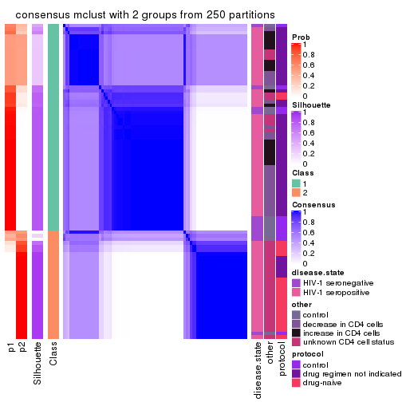</p>

</div>
<div id='tab-MAD-mclust-consensus-heatmap-2'>
<pre><code class="r">consensus_heatmap(res, k = 3)
</code></pre>

<p>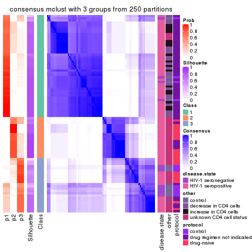</p>

</div>
<div id='tab-MAD-mclust-consensus-heatmap-3'>
<pre><code class="r">consensus_heatmap(res, k = 4)
</code></pre>

<p>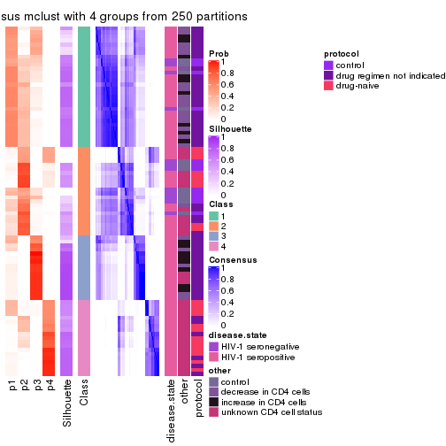</p>

</div>
<div id='tab-MAD-mclust-consensus-heatmap-4'>
<pre><code class="r">consensus_heatmap(res, k = 5)
</code></pre>

<p>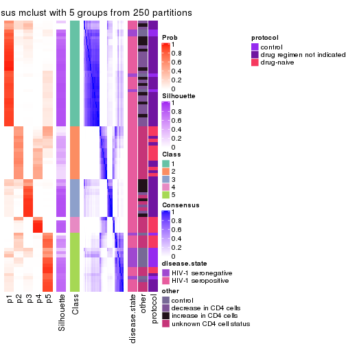</p>

</div>
<div id='tab-MAD-mclust-consensus-heatmap-5'>
<pre><code class="r">consensus_heatmap(res, k = 6)
</code></pre>

<p>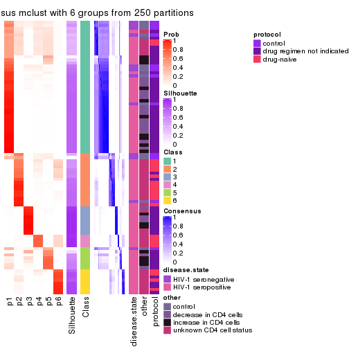</p>

</div>
</div>

Heatmaps for the membership of samples in all partitions to see how consistent they are:


<script>
$( function() {
	$( '#tabs-MAD-mclust-membership-heatmap' ).tabs();
} );
</script>
<div id='tabs-MAD-mclust-membership-heatmap'>
<ul>
<li><a href='#tab-MAD-mclust-membership-heatmap-1'>k = 2</a></li>
<li><a href='#tab-MAD-mclust-membership-heatmap-2'>k = 3</a></li>
<li><a href='#tab-MAD-mclust-membership-heatmap-3'>k = 4</a></li>
<li><a href='#tab-MAD-mclust-membership-heatmap-4'>k = 5</a></li>
<li><a href='#tab-MAD-mclust-membership-heatmap-5'>k = 6</a></li>
</ul>
<div id='tab-MAD-mclust-membership-heatmap-1'>
<pre><code class="r">membership_heatmap(res, k = 2)
</code></pre>

<p>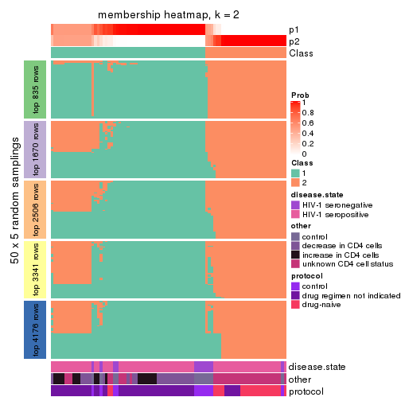</p>

</div>
<div id='tab-MAD-mclust-membership-heatmap-2'>
<pre><code class="r">membership_heatmap(res, k = 3)
</code></pre>

<p>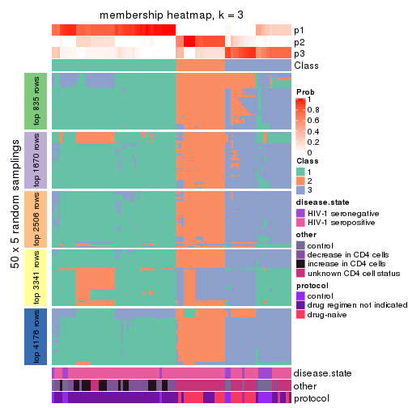</p>

</div>
<div id='tab-MAD-mclust-membership-heatmap-3'>
<pre><code class="r">membership_heatmap(res, k = 4)
</code></pre>

<p>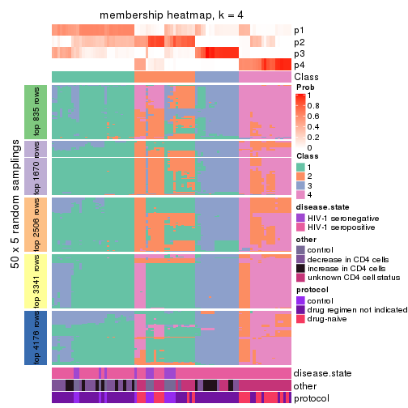</p>

</div>
<div id='tab-MAD-mclust-membership-heatmap-4'>
<pre><code class="r">membership_heatmap(res, k = 5)
</code></pre>

<p>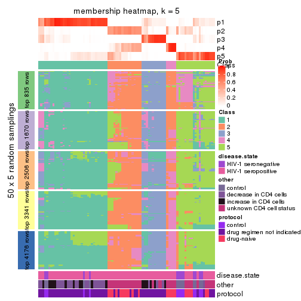</p>

</div>
<div id='tab-MAD-mclust-membership-heatmap-5'>
<pre><code class="r">membership_heatmap(res, k = 6)
</code></pre>

<p>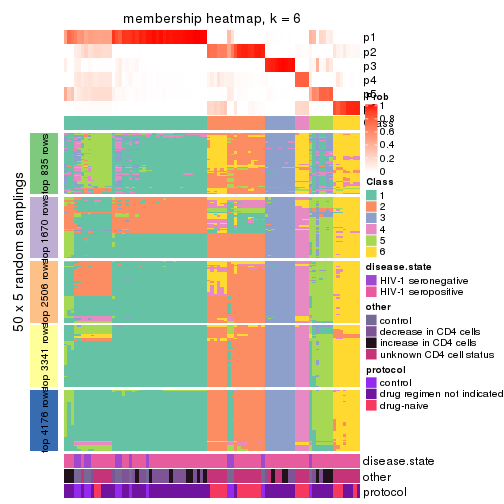</p>

</div>
</div>

As soon as we have had the classes for columns, we can look for signatures
which are significantly different between classes which can be candidate marks
for certain classes. Following are the heatmaps for signatures.


Signature heatmaps where rows are scaled:


<script>
$( function() {
	$( '#tabs-MAD-mclust-get-signatures' ).tabs();
} );
</script>
<div id='tabs-MAD-mclust-get-signatures'>
<ul>
<li><a href='#tab-MAD-mclust-get-signatures-1'>k = 2</a></li>
<li><a href='#tab-MAD-mclust-get-signatures-2'>k = 3</a></li>
<li><a href='#tab-MAD-mclust-get-signatures-3'>k = 4</a></li>
<li><a href='#tab-MAD-mclust-get-signatures-4'>k = 5</a></li>
<li><a href='#tab-MAD-mclust-get-signatures-5'>k = 6</a></li>
</ul>
<div id='tab-MAD-mclust-get-signatures-1'>
<pre><code class="r">get_signatures(res, k = 2)
</code></pre>

<p>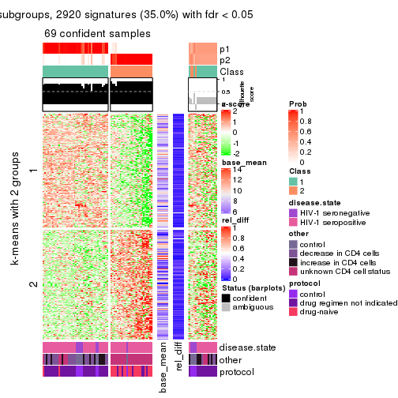</p>

</div>
<div id='tab-MAD-mclust-get-signatures-2'>
<pre><code class="r">get_signatures(res, k = 3)
</code></pre>

<p>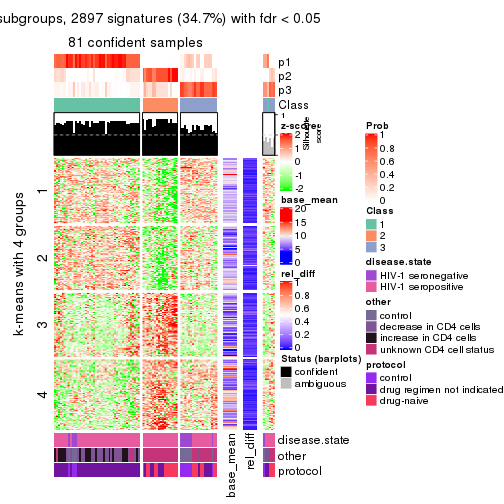</p>

</div>
<div id='tab-MAD-mclust-get-signatures-3'>
<pre><code class="r">get_signatures(res, k = 4)
</code></pre>

<p>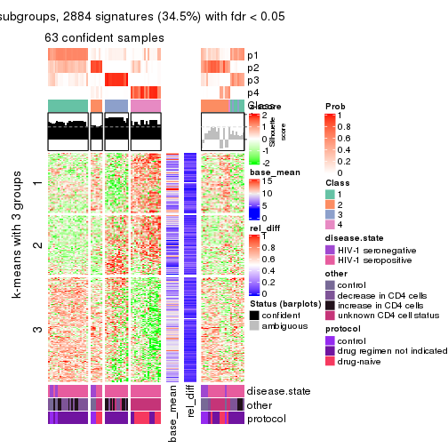</p>

</div>
<div id='tab-MAD-mclust-get-signatures-4'>
<pre><code class="r">get_signatures(res, k = 5)
</code></pre>

<p>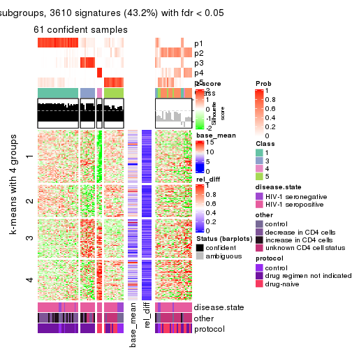</p>

</div>
<div id='tab-MAD-mclust-get-signatures-5'>
<pre><code class="r">get_signatures(res, k = 6)
</code></pre>

<p>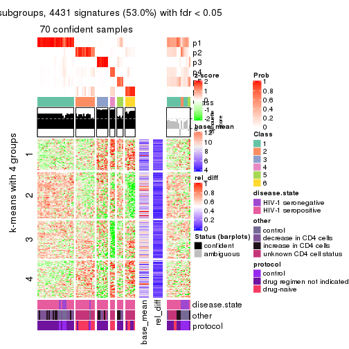</p>

</div>
</div>


Signature heatmaps where rows are not scaled:


<script>
$( function() {
	$( '#tabs-MAD-mclust-get-signatures-no-scale' ).tabs();
} );
</script>
<div id='tabs-MAD-mclust-get-signatures-no-scale'>
<ul>
<li><a href='#tab-MAD-mclust-get-signatures-no-scale-1'>k = 2</a></li>
<li><a href='#tab-MAD-mclust-get-signatures-no-scale-2'>k = 3</a></li>
<li><a href='#tab-MAD-mclust-get-signatures-no-scale-3'>k = 4</a></li>
<li><a href='#tab-MAD-mclust-get-signatures-no-scale-4'>k = 5</a></li>
<li><a href='#tab-MAD-mclust-get-signatures-no-scale-5'>k = 6</a></li>
</ul>
<div id='tab-MAD-mclust-get-signatures-no-scale-1'>
<pre><code class="r">get_signatures(res, k = 2, scale_rows = FALSE)
</code></pre>

<p>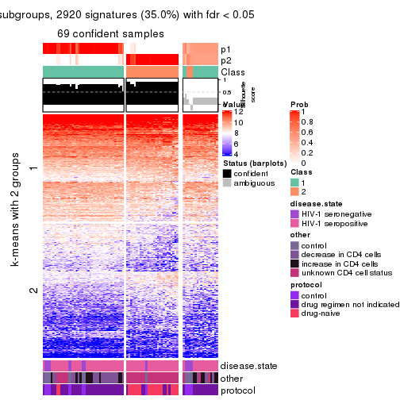</p>

</div>
<div id='tab-MAD-mclust-get-signatures-no-scale-2'>
<pre><code class="r">get_signatures(res, k = 3, scale_rows = FALSE)
</code></pre>

<p>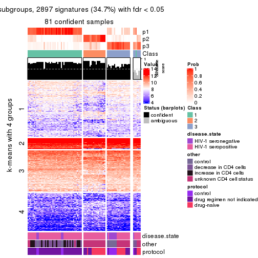</p>

</div>
<div id='tab-MAD-mclust-get-signatures-no-scale-3'>
<pre><code class="r">get_signatures(res, k = 4, scale_rows = FALSE)
</code></pre>

<p>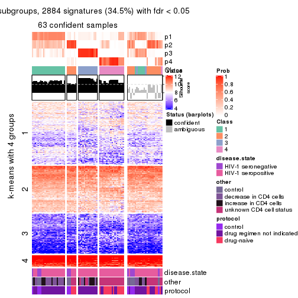</p>

</div>
<div id='tab-MAD-mclust-get-signatures-no-scale-4'>
<pre><code class="r">get_signatures(res, k = 5, scale_rows = FALSE)
</code></pre>

<p>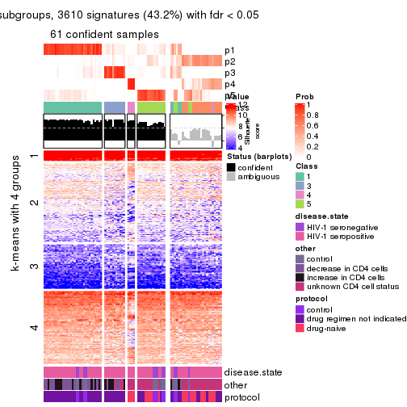</p>

</div>
<div id='tab-MAD-mclust-get-signatures-no-scale-5'>
<pre><code class="r">get_signatures(res, k = 6, scale_rows = FALSE)
</code></pre>

<p>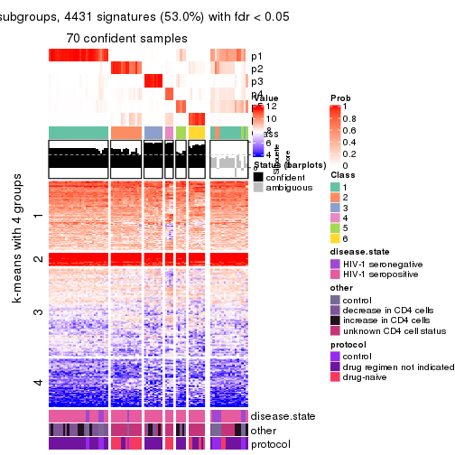</p>

</div>
</div>


Compare the overlap of signatures from different k:

```r
compare_signatures(res)
```

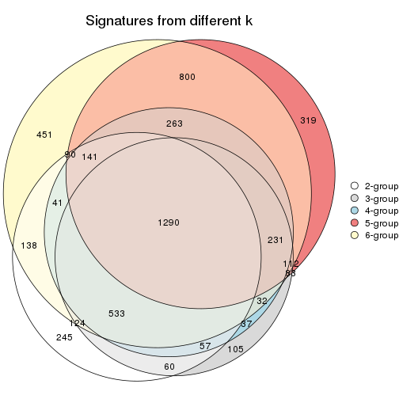

`get_signature()` returns a data frame invisibly. TO get the list of signatures, the function
call should be assigned to a variable explicitly. In following code, if `plot` argument is set
to `FALSE`, no heatmap is plotted while only the differential analysis is performed.

```r
# code only for demonstration
tb = get_signature(res, k = ..., plot = FALSE)
```

An example of the output of `tb` is:

```
#>   which_row         fdr    mean_1    mean_2 scaled_mean_1 scaled_mean_2 km
#> 1        38 0.042760348  8.373488  9.131774    -0.5533452     0.5164555  1
#> 2        40 0.018707592  7.106213  8.469186    -0.6173731     0.5762149  1
#> 3        55 0.019134737 10.221463 11.207825    -0.6159697     0.5749050  1
#> 4        59 0.006059896  5.921854  7.869574    -0.6899429     0.6439467  1
#> 5        60 0.018055526  8.928898 10.211722    -0.6204761     0.5791110  1
#> 6        98 0.009384629 15.714769 14.887706     0.6635654    -0.6193277  2
...
```

The columns in `tb` are:

1. `which_row`: row indices corresponding to the input matrix.
2. `fdr`: FDR for the differential test. 
3. `mean_x`: The mean value in group x.
4. `scaled_mean_x`: The mean value in group x after rows are scaled.
5. `km`: Row groups if k-means clustering is applied to rows.


UMAP plot which shows how samples are separated.


<script>
$( function() {
	$( '#tabs-MAD-mclust-dimension-reduction' ).tabs();
} );
</script>
<div id='tabs-MAD-mclust-dimension-reduction'>
<ul>
<li><a href='#tab-MAD-mclust-dimension-reduction-1'>k = 2</a></li>
<li><a href='#tab-MAD-mclust-dimension-reduction-2'>k = 3</a></li>
<li><a href='#tab-MAD-mclust-dimension-reduction-3'>k = 4</a></li>
<li><a href='#tab-MAD-mclust-dimension-reduction-4'>k = 5</a></li>
<li><a href='#tab-MAD-mclust-dimension-reduction-5'>k = 6</a></li>
</ul>
<div id='tab-MAD-mclust-dimension-reduction-1'>
<pre><code class="r">dimension_reduction(res, k = 2, method = &quot;UMAP&quot;)
</code></pre>

<p>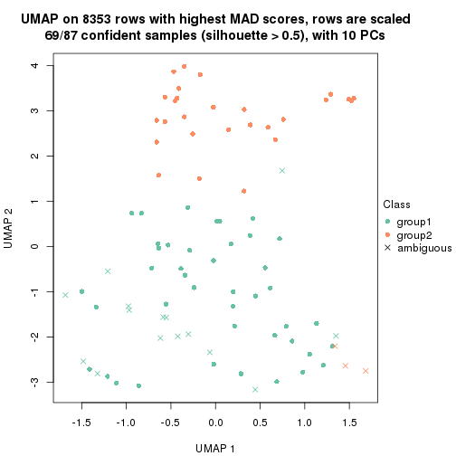</p>

</div>
<div id='tab-MAD-mclust-dimension-reduction-2'>
<pre><code class="r">dimension_reduction(res, k = 3, method = &quot;UMAP&quot;)
</code></pre>

<p>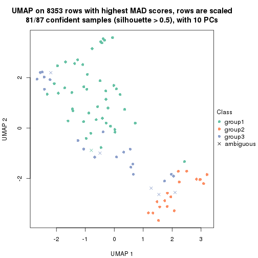</p>

</div>
<div id='tab-MAD-mclust-dimension-reduction-3'>
<pre><code class="r">dimension_reduction(res, k = 4, method = &quot;UMAP&quot;)
</code></pre>

<p>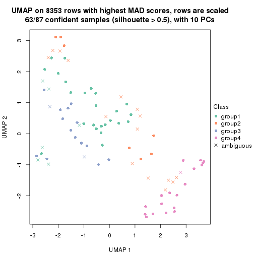</p>

</div>
<div id='tab-MAD-mclust-dimension-reduction-4'>
<pre><code class="r">dimension_reduction(res, k = 5, method = &quot;UMAP&quot;)
</code></pre>

<p>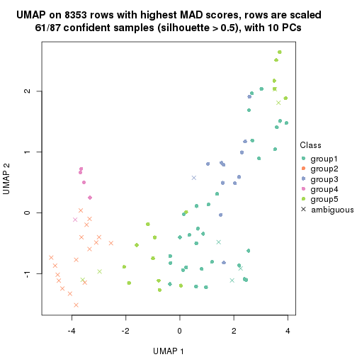</p>

</div>
<div id='tab-MAD-mclust-dimension-reduction-5'>
<pre><code class="r">dimension_reduction(res, k = 6, method = &quot;UMAP&quot;)
</code></pre>

<p>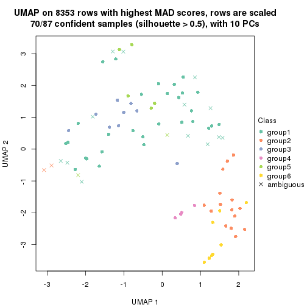</p>

</div>
</div>


Following heatmap shows how subgroups are split when increasing `k`:

```r
collect_classes(res)
```

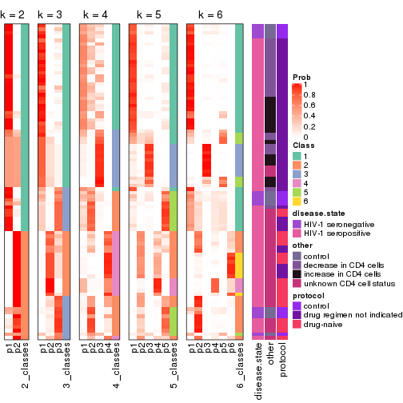


Test correlation between subgroups and known annotations. If the known
annotation is numeric, one-way ANOVA test is applied, and if the known
annotation is discrete, chi-squared contingency table test is applied.

```r
test_to_known_factors(res)
```

```
#>             n disease.state(p) other(p) protocol(p) k
#> MAD:mclust 69          0.20904 9.91e-10    1.26e-08 2
#> MAD:mclust 81          0.00209 5.35e-13    6.46e-10 3
#> MAD:mclust 63          0.00776 4.26e-10    5.61e-09 4
#> MAD:mclust 61          0.07864 1.02e-06    9.16e-08 5
#> MAD:mclust 70          0.38169 2.95e-08    7.73e-08 6
```


If matrix rows can be associated to genes, consider to use `GO_Enrichment(res,
...)` to perform function enrichment for the signature genes.


 

---------------------------------------------------


### MAD:NMF


The object with results only for a single top-value method and a single partition method 
can be extracted as:

```r
res = res_list["MAD", "NMF"]
# you can also extract it by
# res = res_list["MAD:NMF"]
```

A summary of `res` and all the functions that can be applied to it:

```r
res
```

```
#> A 'ConsensusPartition' object with k = 2, 3, 4, 5, 6.
#>   On a matrix with 8353 rows and 87 columns.
#>   Top rows (835, 1670, 2506, 3341, 4176) are extracted by 'MAD' method.
#>   Subgroups are detected by 'NMF' method.
#>   Performed in total 1250 partitions by row resampling.
#>   Best k for subgroups seems to be 2.
#> 
#> Following methods can be applied to this 'ConsensusPartition' object:
#>  [1] "cola_report"             "collect_classes"         "collect_plots"          
#>  [4] "collect_stats"           "colnames"                "compare_signatures"     
#>  [7] "consensus_heatmap"       "dimension_reduction"     "functional_enrichment"  
#> [10] "get_anno_col"            "get_anno"                "get_classes"            
#> [13] "get_consensus"           "get_matrix"              "get_membership"         
#> [16] "get_param"               "get_signatures"          "get_stats"              
#> [19] "is_best_k"               "is_stable_k"             "membership_heatmap"     
#> [22] "ncol"                    "nrow"                    "plot_ecdf"              
#> [25] "rownames"                "select_partition_number" "show"                   
#> [28] "suggest_best_k"          "test_to_known_factors"
```

`collect_plots()` function collects all the plots made from `res` for all `k` (number of partitions)
into one single page to provide an easy and fast comparison between different `k`.

```r
collect_plots(res)
```

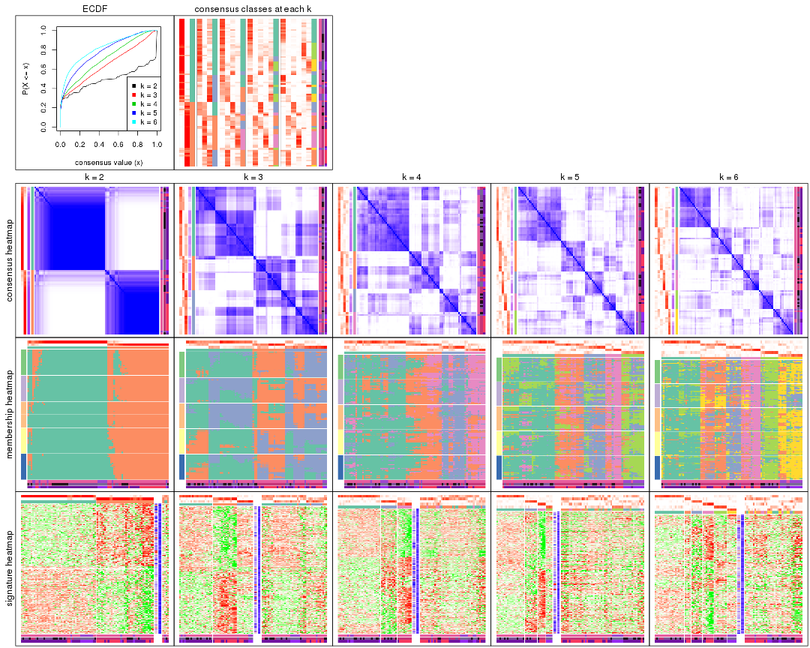

The plots are:

- The first row: a plot of the ECDF (Empirical cumulative distribution
  function) curves of the consensus matrix for each `k` and the heatmap of
  predicted classes for each `k`.
- The second row: heatmaps of the consensus matrix for each `k`.
- The third row: heatmaps of the membership matrix for each `k`.
- The fouth row: heatmaps of the signatures for each `k`.

All the plots in panels can be made by individual functions and they are
plotted later in this section.

`select_partition_number()` produces several plots showing different
statistics for choosing "optimized" `k`. There are following statistics:

- ECDF curves of the consensus matrix for each `k`;
- 1-PAC. [The PAC
  score](https://en.wikipedia.org/wiki/Consensus_clustering#Over-interpretation_potential_of_consensus_clustering)
  measures the proportion of the ambiguous subgrouping.
- Mean silhouette score.
- Concordance. The mean probability of fiting the consensus class ids in all
  partitions.
- Area increased. Denote $A_k$ as the area under the ECDF curve for current
  `k`, the area increased is defined as $A_k - A_{k-1}$.
- Rand index. The percent of pairs of samples that are both in a same cluster
  or both are not in a same cluster in the partition of k and k-1.
- Jaccard index. The ratio of pairs of samples are both in a same cluster in
  the partition of k and k-1 and the pairs of samples are both in a same
  cluster in the partition k or k-1.

The detailed explanations of these statistics can be found in [the cola
vignette](http://bioconductor.org/packages/devel/bioc/vignettes/cola/inst/doc/cola.html#toc_13).

Generally speaking, lower PAC score, higher mean silhouette score or higher
concordance corresponds to better partition. Rand index and Jaccard index
measure how similar the current partition is compared to partition with `k-1`.
If they are too similar, we won't accept `k` is better than `k-1`.

```r
select_partition_number(res)
```

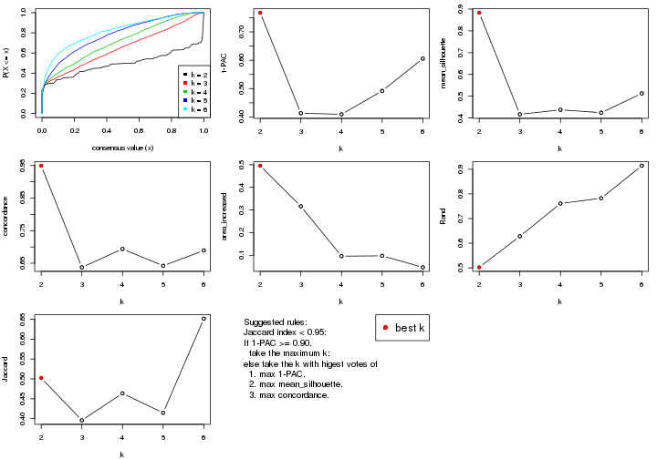

The numeric values for all these statistics can be obtained by `get_stats()`.

```r
get_stats(res)
```

```
#>   k 1-PAC mean_silhouette concordance area_increased  Rand Jaccard
#> 2 2 0.768           0.883       0.949         0.4956 0.502   0.502
#> 3 3 0.413           0.417       0.637         0.3163 0.628   0.396
#> 4 4 0.410           0.438       0.694         0.0962 0.761   0.463
#> 5 5 0.492           0.424       0.642         0.0977 0.782   0.414
#> 6 6 0.606           0.513       0.689         0.0469 0.914   0.651
```

`suggest_best_k()` suggests the best $k$ based on these statistics. The rules are as follows:

- All $k$ with Jaccard index larger than 0.95 are removed because the increase of
  the partition number does not provides enough extra information. If all $k$ are removed,
  the best $k$ is assigned by `NA`.
- For $k$ with 1-PAC larger than 0.9, the maximal $k$ is taken as the "best k". Other $k$ is called "optional k".
- If it does not fit the second rule. The $k$ with the highest vote of highest
  1-PAC, mean silhouette and concordance is taken as the "best k".

```r
suggest_best_k(res)
```

```
#> [1] 2
```


Following shows the table of the partitions (You need to click the **show/hide
code output** link to see it). The membership matrix (columns with name `p*`)
is inferred by
[`clue::cl_consensus()`](https://www.rdocumentation.org/link/cl_consensus?package=clue)
function with the `SE` method. Basically the value in the membership matrix
represents the probability to belong to a certain group. The finall class
label for an item is determined with the group with highest probability it
belongs to.

In `get_classes()` function, the entropy is calculated from the membership
matrix and the silhouette score is calculated from the consensus matrix.


<script>
$( function() {
	$( '#tabs-MAD-NMF-get-classes' ).tabs();
} );
</script>
<div id='tabs-MAD-NMF-get-classes'>
<ul>
<li><a href='#tab-MAD-NMF-get-classes-1'>k = 2</a></li>
<li><a href='#tab-MAD-NMF-get-classes-2'>k = 3</a></li>
<li><a href='#tab-MAD-NMF-get-classes-3'>k = 4</a></li>
<li><a href='#tab-MAD-NMF-get-classes-4'>k = 5</a></li>
<li><a href='#tab-MAD-NMF-get-classes-5'>k = 6</a></li>
</ul>

<div id='tab-MAD-NMF-get-classes-1'>
<p><a id='tab-MAD-NMF-get-classes-1-a' style='color:#0366d6' href='#'>show/hide code output</a></p>
<pre><code class="r">cbind(get_classes(res, k = 2), get_membership(res, k = 2))
</code></pre>

<pre><code>#&gt;          class entropy silhouette    p1    p2
#&gt; GSM39104     1  0.0000      0.951 1.000 0.000
#&gt; GSM39105     1  0.0000      0.951 1.000 0.000
#&gt; GSM39106     1  0.0376      0.948 0.996 0.004
#&gt; GSM39107     1  0.8713      0.589 0.708 0.292
#&gt; GSM39108     1  0.0000      0.951 1.000 0.000
#&gt; GSM39109     2  0.7219      0.749 0.200 0.800
#&gt; GSM39110     1  0.0000      0.951 1.000 0.000
#&gt; GSM39111     1  0.0000      0.951 1.000 0.000
#&gt; GSM39112     1  0.3879      0.890 0.924 0.076
#&gt; GSM39113     1  0.9795      0.285 0.584 0.416
#&gt; GSM39114     2  0.0000      0.934 0.000 1.000
#&gt; GSM39115     1  0.0000      0.951 1.000 0.000
#&gt; GSM39148     1  0.0000      0.951 1.000 0.000
#&gt; GSM39149     2  0.7815      0.712 0.232 0.768
#&gt; GSM39150     1  0.0000      0.951 1.000 0.000
#&gt; GSM39151     2  0.7674      0.722 0.224 0.776
#&gt; GSM39152     1  0.2423      0.921 0.960 0.040
#&gt; GSM39153     1  0.0000      0.951 1.000 0.000
#&gt; GSM39154     1  0.0000      0.951 1.000 0.000
#&gt; GSM39155     1  0.0000      0.951 1.000 0.000
#&gt; GSM39156     1  0.0000      0.951 1.000 0.000
#&gt; GSM39157     1  0.0000      0.951 1.000 0.000
#&gt; GSM39158     1  0.0000      0.951 1.000 0.000
#&gt; GSM39159     1  0.1414      0.937 0.980 0.020
#&gt; GSM39160     1  0.0000      0.951 1.000 0.000
#&gt; GSM39161     1  0.5178      0.842 0.884 0.116
#&gt; GSM39162     1  0.0000      0.951 1.000 0.000
#&gt; GSM39163     1  0.0000      0.951 1.000 0.000
#&gt; GSM39164     1  0.0000      0.951 1.000 0.000
#&gt; GSM39165     1  0.0000      0.951 1.000 0.000
#&gt; GSM39166     1  0.0000      0.951 1.000 0.000
#&gt; GSM39167     1  0.0000      0.951 1.000 0.000
#&gt; GSM39168     1  0.0000      0.951 1.000 0.000
#&gt; GSM39169     1  0.0000      0.951 1.000 0.000
#&gt; GSM39170     1  0.0000      0.951 1.000 0.000
#&gt; GSM39171     1  0.0000      0.951 1.000 0.000
#&gt; GSM39172     2  0.1184      0.927 0.016 0.984
#&gt; GSM39173     2  0.1414      0.924 0.020 0.980
#&gt; GSM39174     1  0.0000      0.951 1.000 0.000
#&gt; GSM39175     1  0.0000      0.951 1.000 0.000
#&gt; GSM39176     1  0.0000      0.951 1.000 0.000
#&gt; GSM39177     1  0.9608      0.344 0.616 0.384
#&gt; GSM39178     1  0.0000      0.951 1.000 0.000
#&gt; GSM39179     2  0.0938      0.929 0.012 0.988
#&gt; GSM39180     2  0.0000      0.934 0.000 1.000
#&gt; GSM39181     1  0.0000      0.951 1.000 0.000
#&gt; GSM39182     2  0.3879      0.884 0.076 0.924
#&gt; GSM39183     1  0.0000      0.951 1.000 0.000
#&gt; GSM39184     1  0.0000      0.951 1.000 0.000
#&gt; GSM39185     1  0.8909      0.531 0.692 0.308
#&gt; GSM39186     1  0.0000      0.951 1.000 0.000
#&gt; GSM39187     1  0.0000      0.951 1.000 0.000
#&gt; GSM39116     2  0.0000      0.934 0.000 1.000
#&gt; GSM39117     2  0.0000      0.934 0.000 1.000
#&gt; GSM39118     2  0.0000      0.934 0.000 1.000
#&gt; GSM39119     2  0.0000      0.934 0.000 1.000
#&gt; GSM39120     1  0.7376      0.733 0.792 0.208
#&gt; GSM39121     2  0.9460      0.439 0.364 0.636
#&gt; GSM39122     2  0.8386      0.642 0.268 0.732
#&gt; GSM39123     2  0.0000      0.934 0.000 1.000
#&gt; GSM39124     2  0.0000      0.934 0.000 1.000
#&gt; GSM39125     1  0.7056      0.754 0.808 0.192
#&gt; GSM39126     2  0.7453      0.732 0.212 0.788
#&gt; GSM39127     2  0.0000      0.934 0.000 1.000
#&gt; GSM39128     2  0.0000      0.934 0.000 1.000
#&gt; GSM39129     2  0.0000      0.934 0.000 1.000
#&gt; GSM39130     2  0.0000      0.934 0.000 1.000
#&gt; GSM39131     2  0.0000      0.934 0.000 1.000
#&gt; GSM39132     2  0.0000      0.934 0.000 1.000
#&gt; GSM39133     2  0.0000      0.934 0.000 1.000
#&gt; GSM39134     2  0.0000      0.934 0.000 1.000
#&gt; GSM39135     2  0.0000      0.934 0.000 1.000
#&gt; GSM39136     2  0.0000      0.934 0.000 1.000
#&gt; GSM39137     2  0.0376      0.932 0.004 0.996
#&gt; GSM39138     2  0.0000      0.934 0.000 1.000
#&gt; GSM39139     2  0.0000      0.934 0.000 1.000
#&gt; GSM39140     1  0.4298      0.877 0.912 0.088
#&gt; GSM39141     1  0.0376      0.948 0.996 0.004
#&gt; GSM39142     1  0.0000      0.951 1.000 0.000
#&gt; GSM39143     1  0.0000      0.951 1.000 0.000
#&gt; GSM39144     2  0.0000      0.934 0.000 1.000
#&gt; GSM39145     2  0.0000      0.934 0.000 1.000
#&gt; GSM39146     2  0.0000      0.934 0.000 1.000
#&gt; GSM39147     2  0.0000      0.934 0.000 1.000
#&gt; GSM39188     2  0.5519      0.836 0.128 0.872
#&gt; GSM39189     2  0.9833      0.303 0.424 0.576
#&gt; GSM39190     2  0.4161      0.878 0.084 0.916
</code></pre>

<script>
$('#tab-MAD-NMF-get-classes-1-a').parent().next().next().hide();
$('#tab-MAD-NMF-get-classes-1-a').click(function(){
  $('#tab-MAD-NMF-get-classes-1-a').parent().next().next().toggle();
  return(false);
});
</script>
</div>

<div id='tab-MAD-NMF-get-classes-2'>
<p><a id='tab-MAD-NMF-get-classes-2-a' style='color:#0366d6' href='#'>show/hide code output</a></p>
<pre><code class="r">cbind(get_classes(res, k = 3), get_membership(res, k = 3))
</code></pre>

<pre><code>#&gt;          class entropy silhouette    p1    p2    p3
#&gt; GSM39104     1  0.4842     0.5702 0.776 0.000 0.224
#&gt; GSM39105     1  0.6192     0.3288 0.580 0.000 0.420
#&gt; GSM39106     3  0.4931     0.4731 0.232 0.000 0.768
#&gt; GSM39107     3  0.0983     0.5914 0.016 0.004 0.980
#&gt; GSM39108     1  0.6305     0.1673 0.516 0.000 0.484
#&gt; GSM39109     2  0.8977     0.3027 0.188 0.560 0.252
#&gt; GSM39110     3  0.6286    -0.0636 0.464 0.000 0.536
#&gt; GSM39111     1  0.4235     0.5888 0.824 0.000 0.176
#&gt; GSM39112     3  0.1860     0.6126 0.052 0.000 0.948
#&gt; GSM39113     3  0.0983     0.5747 0.004 0.016 0.980
#&gt; GSM39114     3  0.4452     0.3535 0.000 0.192 0.808
#&gt; GSM39115     1  0.6307     0.1623 0.512 0.000 0.488
#&gt; GSM39148     3  0.6286    -0.0680 0.464 0.000 0.536
#&gt; GSM39149     1  0.6140     0.2739 0.596 0.404 0.000
#&gt; GSM39150     1  0.2448     0.6058 0.924 0.000 0.076
#&gt; GSM39151     1  0.6225     0.2316 0.568 0.432 0.000
#&gt; GSM39152     1  0.4702     0.5001 0.788 0.212 0.000
#&gt; GSM39153     1  0.5529     0.5196 0.704 0.000 0.296
#&gt; GSM39154     1  0.5058     0.5593 0.756 0.000 0.244
#&gt; GSM39155     1  0.5497     0.5234 0.708 0.000 0.292
#&gt; GSM39156     3  0.4452     0.5239 0.192 0.000 0.808
#&gt; GSM39157     1  0.6244     0.2872 0.560 0.000 0.440
#&gt; GSM39158     1  0.5560     0.5168 0.700 0.000 0.300
#&gt; GSM39159     1  0.3192     0.5619 0.888 0.112 0.000
#&gt; GSM39160     1  0.1643     0.6012 0.956 0.000 0.044
#&gt; GSM39161     1  0.4931     0.4817 0.768 0.232 0.000
#&gt; GSM39162     3  0.5926     0.2315 0.356 0.000 0.644
#&gt; GSM39163     1  0.5810     0.4712 0.664 0.000 0.336
#&gt; GSM39164     1  0.6111     0.3791 0.604 0.000 0.396
#&gt; GSM39165     1  0.0829     0.5936 0.984 0.004 0.012
#&gt; GSM39166     1  0.3192     0.6061 0.888 0.000 0.112
#&gt; GSM39167     1  0.6244     0.2893 0.560 0.000 0.440
#&gt; GSM39168     3  0.6204     0.0549 0.424 0.000 0.576
#&gt; GSM39169     1  0.5529     0.5168 0.704 0.000 0.296
#&gt; GSM39170     1  0.5138     0.5556 0.748 0.000 0.252
#&gt; GSM39171     1  0.3192     0.6061 0.888 0.000 0.112
#&gt; GSM39172     1  0.6305     0.1231 0.516 0.484 0.000
#&gt; GSM39173     2  0.6192     0.0434 0.420 0.580 0.000
#&gt; GSM39174     1  0.5760     0.4796 0.672 0.000 0.328
#&gt; GSM39175     1  0.3500     0.6064 0.880 0.004 0.116
#&gt; GSM39176     1  0.6095     0.3868 0.608 0.000 0.392
#&gt; GSM39177     1  0.5529     0.4167 0.704 0.296 0.000
#&gt; GSM39178     1  0.2796     0.5676 0.908 0.092 0.000
#&gt; GSM39179     1  0.6302     0.1319 0.520 0.480 0.000
#&gt; GSM39180     2  0.5621     0.3157 0.308 0.692 0.000
#&gt; GSM39181     1  0.3116     0.6065 0.892 0.000 0.108
#&gt; GSM39182     1  0.6309     0.0944 0.504 0.496 0.000
#&gt; GSM39183     1  0.2537     0.6063 0.920 0.000 0.080
#&gt; GSM39184     1  0.4887     0.5674 0.772 0.000 0.228
#&gt; GSM39185     1  0.5431     0.4313 0.716 0.284 0.000
#&gt; GSM39186     1  0.5650     0.5023 0.688 0.000 0.312
#&gt; GSM39187     3  0.6299    -0.1048 0.476 0.000 0.524
#&gt; GSM39116     2  0.6026     0.5764 0.000 0.624 0.376
#&gt; GSM39117     2  0.1163     0.6653 0.028 0.972 0.000
#&gt; GSM39118     2  0.4605     0.6977 0.000 0.796 0.204
#&gt; GSM39119     2  0.2165     0.7162 0.000 0.936 0.064
#&gt; GSM39120     3  0.2301     0.6129 0.060 0.004 0.936
#&gt; GSM39121     3  0.2261     0.5238 0.000 0.068 0.932
#&gt; GSM39122     3  0.4002     0.4172 0.000 0.160 0.840
#&gt; GSM39123     2  0.1129     0.6952 0.004 0.976 0.020
#&gt; GSM39124     3  0.5882     0.0124 0.000 0.348 0.652
#&gt; GSM39125     3  0.3038     0.5934 0.104 0.000 0.896
#&gt; GSM39126     3  0.3340     0.4710 0.000 0.120 0.880
#&gt; GSM39127     3  0.6291    -0.3169 0.000 0.468 0.532
#&gt; GSM39128     3  0.6140    -0.1570 0.000 0.404 0.596
#&gt; GSM39129     2  0.2711     0.7221 0.000 0.912 0.088
#&gt; GSM39130     2  0.0892     0.6973 0.000 0.980 0.020
#&gt; GSM39131     3  0.6204    -0.2105 0.000 0.424 0.576
#&gt; GSM39132     2  0.6309     0.3545 0.000 0.504 0.496
#&gt; GSM39133     2  0.3551     0.7235 0.000 0.868 0.132
#&gt; GSM39134     2  0.3551     0.7236 0.000 0.868 0.132
#&gt; GSM39135     2  0.6095     0.5545 0.000 0.608 0.392
#&gt; GSM39136     2  0.6008     0.5809 0.000 0.628 0.372
#&gt; GSM39137     3  0.5497     0.1610 0.000 0.292 0.708
#&gt; GSM39138     2  0.2448     0.7197 0.000 0.924 0.076
#&gt; GSM39139     2  0.5760     0.6216 0.000 0.672 0.328
#&gt; GSM39140     3  0.3686     0.5728 0.140 0.000 0.860
#&gt; GSM39141     3  0.3816     0.5673 0.148 0.000 0.852
#&gt; GSM39142     3  0.4750     0.4944 0.216 0.000 0.784
#&gt; GSM39143     3  0.4002     0.5572 0.160 0.000 0.840
#&gt; GSM39144     2  0.3482     0.7240 0.000 0.872 0.128
#&gt; GSM39145     2  0.5968     0.5906 0.000 0.636 0.364
#&gt; GSM39146     2  0.6244     0.4707 0.000 0.560 0.440
#&gt; GSM39147     3  0.6299    -0.3444 0.000 0.476 0.524
#&gt; GSM39188     1  0.6295     0.1549 0.528 0.472 0.000
#&gt; GSM39189     1  0.6008     0.3188 0.628 0.372 0.000
#&gt; GSM39190     1  0.6299     0.1471 0.524 0.476 0.000
</code></pre>

<script>
$('#tab-MAD-NMF-get-classes-2-a').parent().next().next().hide();
$('#tab-MAD-NMF-get-classes-2-a').click(function(){
  $('#tab-MAD-NMF-get-classes-2-a').parent().next().next().toggle();
  return(false);
});
</script>
</div>

<div id='tab-MAD-NMF-get-classes-3'>
<p><a id='tab-MAD-NMF-get-classes-3-a' style='color:#0366d6' href='#'>show/hide code output</a></p>
<pre><code class="r">cbind(get_classes(res, k = 4), get_membership(res, k = 4))
</code></pre>

<pre><code>#&gt;          class entropy silhouette    p1    p2    p3    p4
#&gt; GSM39104     1   0.606     0.6711 0.720 0.064 0.180 0.036
#&gt; GSM39105     1   0.637     0.5928 0.692 0.200 0.076 0.032
#&gt; GSM39106     2   0.707    -0.0364 0.440 0.476 0.044 0.040
#&gt; GSM39107     2   0.691     0.4606 0.292 0.592 0.012 0.104
#&gt; GSM39108     1   0.760     0.4599 0.552 0.296 0.120 0.032
#&gt; GSM39109     4   0.993     0.0121 0.280 0.200 0.240 0.280
#&gt; GSM39110     1   0.783     0.2177 0.452 0.400 0.116 0.032
#&gt; GSM39111     1   0.707     0.5563 0.596 0.080 0.292 0.032
#&gt; GSM39112     2   0.535     0.4698 0.272 0.692 0.004 0.032
#&gt; GSM39113     2   0.573     0.5062 0.216 0.712 0.012 0.060
#&gt; GSM39114     2   0.329     0.4532 0.036 0.884 0.008 0.072
#&gt; GSM39115     1   0.448     0.6528 0.820 0.120 0.016 0.044
#&gt; GSM39148     1   0.441     0.5440 0.756 0.232 0.004 0.008
#&gt; GSM39149     3   0.272     0.6714 0.052 0.028 0.912 0.008
#&gt; GSM39150     1   0.520     0.6024 0.700 0.000 0.264 0.036
#&gt; GSM39151     3   0.256     0.6851 0.068 0.004 0.912 0.016
#&gt; GSM39152     3   0.402     0.5415 0.224 0.000 0.772 0.004
#&gt; GSM39153     1   0.296     0.7214 0.896 0.028 0.072 0.004
#&gt; GSM39154     1   0.322     0.7023 0.864 0.004 0.124 0.008
#&gt; GSM39155     1   0.259     0.7220 0.904 0.016 0.080 0.000
#&gt; GSM39156     2   0.567     0.0404 0.472 0.508 0.004 0.016
#&gt; GSM39157     1   0.304     0.6573 0.876 0.112 0.008 0.004
#&gt; GSM39158     1   0.288     0.7033 0.904 0.008 0.028 0.060
#&gt; GSM39159     1   0.627     0.4261 0.620 0.000 0.292 0.088
#&gt; GSM39160     1   0.532     0.5513 0.660 0.000 0.312 0.028
#&gt; GSM39161     1   0.731     0.2632 0.528 0.000 0.200 0.272
#&gt; GSM39162     1   0.495     0.3459 0.648 0.344 0.000 0.008
#&gt; GSM39163     1   0.209     0.7130 0.940 0.020 0.028 0.012
#&gt; GSM39164     1   0.426     0.6657 0.824 0.128 0.040 0.008
#&gt; GSM39165     1   0.547     0.3742 0.576 0.004 0.408 0.012
#&gt; GSM39166     1   0.448     0.6598 0.804 0.000 0.128 0.068
#&gt; GSM39167     1   0.248     0.6802 0.904 0.088 0.008 0.000
#&gt; GSM39168     1   0.490     0.4391 0.688 0.300 0.004 0.008
#&gt; GSM39169     1   0.350     0.7190 0.860 0.036 0.104 0.000
#&gt; GSM39170     1   0.232     0.7115 0.928 0.004 0.032 0.036
#&gt; GSM39171     1   0.552     0.5678 0.660 0.008 0.308 0.024
#&gt; GSM39172     3   0.762     0.3810 0.228 0.000 0.464 0.308
#&gt; GSM39173     3   0.310     0.6130 0.012 0.060 0.896 0.032
#&gt; GSM39174     1   0.368     0.7170 0.856 0.060 0.084 0.000
#&gt; GSM39175     1   0.453     0.6261 0.752 0.004 0.232 0.012
#&gt; GSM39176     1   0.201     0.6918 0.932 0.060 0.004 0.004
#&gt; GSM39177     3   0.424     0.6483 0.176 0.000 0.796 0.028
#&gt; GSM39178     1   0.625     0.3404 0.544 0.000 0.396 0.060
#&gt; GSM39179     3   0.327     0.6692 0.048 0.004 0.884 0.064
#&gt; GSM39180     3   0.546     0.5601 0.064 0.000 0.708 0.228
#&gt; GSM39181     1   0.572     0.5676 0.700 0.000 0.088 0.212
#&gt; GSM39182     4   0.610     0.1882 0.180 0.000 0.140 0.680
#&gt; GSM39183     1   0.579     0.5766 0.708 0.000 0.124 0.168
#&gt; GSM39184     1   0.354     0.7032 0.852 0.008 0.128 0.012
#&gt; GSM39185     1   0.761     0.1252 0.476 0.000 0.260 0.264
#&gt; GSM39186     1   0.417     0.7156 0.840 0.052 0.096 0.012
#&gt; GSM39187     1   0.378     0.6237 0.828 0.156 0.008 0.008
#&gt; GSM39116     4   0.506     0.5758 0.000 0.284 0.024 0.692
#&gt; GSM39117     4   0.310     0.5888 0.000 0.020 0.104 0.876
#&gt; GSM39118     4   0.777     0.4544 0.000 0.328 0.252 0.420
#&gt; GSM39119     4   0.669     0.5131 0.000 0.144 0.248 0.608
#&gt; GSM39120     2   0.554     0.4860 0.276 0.680 0.004 0.040
#&gt; GSM39121     2   0.352     0.4955 0.112 0.856 0.000 0.032
#&gt; GSM39122     2   0.393     0.4755 0.068 0.856 0.012 0.064
#&gt; GSM39123     4   0.248     0.6374 0.000 0.052 0.032 0.916
#&gt; GSM39124     2   0.489     0.2548 0.008 0.732 0.016 0.244
#&gt; GSM39125     1   0.766    -0.2113 0.424 0.408 0.008 0.160
#&gt; GSM39126     2   0.405     0.4766 0.072 0.852 0.016 0.060
#&gt; GSM39127     2   0.552    -0.1363 0.004 0.556 0.012 0.428
#&gt; GSM39128     2   0.513     0.1406 0.000 0.668 0.020 0.312
#&gt; GSM39129     3   0.741    -0.0359 0.000 0.256 0.516 0.228
#&gt; GSM39130     4   0.293     0.6331 0.000 0.048 0.056 0.896
#&gt; GSM39131     2   0.503     0.1222 0.000 0.672 0.016 0.312
#&gt; GSM39132     2   0.563    -0.0998 0.000 0.588 0.028 0.384
#&gt; GSM39133     4   0.284     0.6471 0.000 0.088 0.020 0.892
#&gt; GSM39134     4   0.744     0.5062 0.000 0.240 0.248 0.512
#&gt; GSM39135     4   0.568     0.4265 0.000 0.404 0.028 0.568
#&gt; GSM39136     4   0.439     0.5988 0.000 0.236 0.012 0.752
#&gt; GSM39137     2   0.501     0.3646 0.032 0.772 0.020 0.176
#&gt; GSM39138     3   0.757    -0.1312 0.000 0.228 0.480 0.292
#&gt; GSM39139     2   0.743    -0.1994 0.000 0.496 0.308 0.196
#&gt; GSM39140     2   0.540     0.2568 0.404 0.580 0.000 0.016
#&gt; GSM39141     2   0.559     0.1419 0.456 0.524 0.000 0.020
#&gt; GSM39142     1   0.571     0.1101 0.556 0.416 0.000 0.028
#&gt; GSM39143     2   0.560     0.0902 0.476 0.504 0.000 0.020
#&gt; GSM39144     3   0.755    -0.1133 0.000 0.332 0.464 0.204
#&gt; GSM39145     2   0.724    -0.1488 0.000 0.536 0.276 0.188
#&gt; GSM39146     4   0.507     0.5211 0.000 0.320 0.016 0.664
#&gt; GSM39147     2   0.528     0.2002 0.000 0.736 0.072 0.192
#&gt; GSM39188     3   0.322     0.6852 0.076 0.000 0.880 0.044
#&gt; GSM39189     3   0.476     0.5835 0.220 0.000 0.748 0.032
#&gt; GSM39190     3   0.327     0.6870 0.084 0.004 0.880 0.032
</code></pre>

<script>
$('#tab-MAD-NMF-get-classes-3-a').parent().next().next().hide();
$('#tab-MAD-NMF-get-classes-3-a').click(function(){
  $('#tab-MAD-NMF-get-classes-3-a').parent().next().next().toggle();
  return(false);
});
</script>
</div>

<div id='tab-MAD-NMF-get-classes-4'>
<p><a id='tab-MAD-NMF-get-classes-4-a' style='color:#0366d6' href='#'>show/hide code output</a></p>
<pre><code class="r">cbind(get_classes(res, k = 5), get_membership(res, k = 5))
</code></pre>

<pre><code>#&gt;          class entropy silhouette    p1    p2    p3    p4    p5
#&gt; GSM39104     5   0.519     0.3818 0.080 0.000 0.244 0.004 0.672
#&gt; GSM39105     5   0.456     0.5299 0.152 0.000 0.100 0.000 0.748
#&gt; GSM39106     5   0.395     0.5896 0.060 0.060 0.048 0.000 0.832
#&gt; GSM39107     5   0.631     0.4107 0.068 0.220 0.000 0.084 0.628
#&gt; GSM39108     5   0.485     0.5563 0.108 0.020 0.116 0.000 0.756
#&gt; GSM39109     5   0.627     0.3743 0.008 0.020 0.168 0.172 0.632
#&gt; GSM39110     5   0.525     0.5376 0.068 0.044 0.160 0.000 0.728
#&gt; GSM39111     5   0.539     0.2809 0.064 0.004 0.328 0.000 0.604
#&gt; GSM39112     5   0.505     0.4991 0.076 0.200 0.000 0.012 0.712
#&gt; GSM39113     5   0.582     0.4501 0.044 0.228 0.008 0.052 0.668
#&gt; GSM39114     5   0.573     0.1464 0.016 0.372 0.000 0.056 0.556
#&gt; GSM39115     5   0.592     0.1495 0.340 0.004 0.036 0.040 0.580
#&gt; GSM39148     1   0.438     0.5697 0.780 0.076 0.004 0.004 0.136
#&gt; GSM39149     3   0.347     0.6445 0.012 0.068 0.860 0.008 0.052
#&gt; GSM39150     5   0.698    -0.0160 0.184 0.000 0.328 0.024 0.464
#&gt; GSM39151     3   0.311     0.6584 0.012 0.032 0.884 0.016 0.056
#&gt; GSM39152     3   0.482     0.5037 0.056 0.004 0.700 0.000 0.240
#&gt; GSM39153     1   0.337     0.6359 0.860 0.004 0.064 0.008 0.064
#&gt; GSM39154     1   0.350     0.6406 0.860 0.024 0.076 0.008 0.032
#&gt; GSM39155     1   0.506     0.5772 0.720 0.000 0.116 0.008 0.156
#&gt; GSM39156     1   0.644     0.2658 0.516 0.152 0.004 0.004 0.324
#&gt; GSM39157     1   0.247     0.6346 0.912 0.040 0.012 0.004 0.032
#&gt; GSM39158     1   0.515     0.5782 0.744 0.000 0.040 0.096 0.120
#&gt; GSM39159     1   0.761     0.3126 0.524 0.008 0.220 0.144 0.104
#&gt; GSM39160     3   0.700     0.0952 0.188 0.000 0.400 0.020 0.392
#&gt; GSM39161     1   0.797     0.2483 0.452 0.008 0.148 0.280 0.112
#&gt; GSM39162     1   0.503     0.5187 0.716 0.120 0.000 0.004 0.160
#&gt; GSM39163     1   0.278     0.6387 0.896 0.000 0.032 0.036 0.036
#&gt; GSM39164     1   0.481     0.5779 0.740 0.028 0.044 0.000 0.188
#&gt; GSM39165     1   0.587     0.4487 0.636 0.052 0.268 0.004 0.040
#&gt; GSM39166     1   0.746     0.3220 0.520 0.000 0.188 0.100 0.192
#&gt; GSM39167     1   0.220     0.6367 0.924 0.036 0.004 0.008 0.028
#&gt; GSM39168     1   0.491     0.5146 0.712 0.080 0.004 0.000 0.204
#&gt; GSM39169     1   0.497     0.5867 0.740 0.004 0.084 0.012 0.160
#&gt; GSM39170     1   0.628     0.5162 0.660 0.004 0.092 0.076 0.168
#&gt; GSM39171     3   0.716     0.1070 0.360 0.000 0.388 0.020 0.232
#&gt; GSM39172     4   0.660    -0.2407 0.080 0.008 0.432 0.452 0.028
#&gt; GSM39173     3   0.454     0.4002 0.008 0.268 0.704 0.008 0.012
#&gt; GSM39174     1   0.347     0.6377 0.856 0.012 0.072 0.004 0.056
#&gt; GSM39175     1   0.412     0.6093 0.792 0.000 0.144 0.008 0.056
#&gt; GSM39176     1   0.128     0.6423 0.960 0.004 0.000 0.016 0.020
#&gt; GSM39177     3   0.468     0.6332 0.112 0.084 0.780 0.012 0.012
#&gt; GSM39178     3   0.765     0.2930 0.204 0.000 0.452 0.076 0.268
#&gt; GSM39179     3   0.405     0.6410 0.020 0.084 0.832 0.048 0.016
#&gt; GSM39180     3   0.768     0.4223 0.080 0.112 0.564 0.196 0.048
#&gt; GSM39181     1   0.712     0.4200 0.544 0.004 0.064 0.256 0.132
#&gt; GSM39182     4   0.316     0.5534 0.052 0.000 0.060 0.872 0.016
#&gt; GSM39183     1   0.774     0.3585 0.508 0.004 0.132 0.196 0.160
#&gt; GSM39184     1   0.486     0.6104 0.768 0.000 0.108 0.044 0.080
#&gt; GSM39185     1   0.837     0.0651 0.356 0.008 0.192 0.320 0.124
#&gt; GSM39186     1   0.631     0.3107 0.536 0.000 0.128 0.012 0.324
#&gt; GSM39187     1   0.286     0.6310 0.888 0.036 0.000 0.016 0.060
#&gt; GSM39116     4   0.562     0.3227 0.000 0.328 0.008 0.592 0.072
#&gt; GSM39117     4   0.228     0.6529 0.000 0.060 0.032 0.908 0.000
#&gt; GSM39118     2   0.644     0.1142 0.000 0.508 0.104 0.364 0.024
#&gt; GSM39119     4   0.562     0.4089 0.000 0.280 0.112 0.608 0.000
#&gt; GSM39120     5   0.669     0.2384 0.220 0.316 0.000 0.004 0.460
#&gt; GSM39121     2   0.621     0.1989 0.256 0.564 0.000 0.004 0.176
#&gt; GSM39122     2   0.554     0.3402 0.092 0.656 0.000 0.012 0.240
#&gt; GSM39123     4   0.196     0.6536 0.000 0.052 0.012 0.928 0.008
#&gt; GSM39124     2   0.536     0.4907 0.048 0.736 0.004 0.132 0.080
#&gt; GSM39125     1   0.773     0.2760 0.492 0.168 0.000 0.136 0.204
#&gt; GSM39126     2   0.526     0.3887 0.144 0.680 0.000 0.000 0.176
#&gt; GSM39127     2   0.586     0.2589 0.012 0.568 0.000 0.340 0.080
#&gt; GSM39128     2   0.526     0.4647 0.036 0.716 0.000 0.184 0.064
#&gt; GSM39129     2   0.591     0.3206 0.000 0.540 0.380 0.056 0.024
#&gt; GSM39130     4   0.201     0.6567 0.004 0.056 0.016 0.924 0.000
#&gt; GSM39131     2   0.624     0.3627 0.004 0.584 0.004 0.224 0.184
#&gt; GSM39132     2   0.555     0.3276 0.000 0.616 0.004 0.292 0.088
#&gt; GSM39133     4   0.228     0.6451 0.000 0.096 0.004 0.896 0.004
#&gt; GSM39134     2   0.606     0.0887 0.000 0.508 0.128 0.364 0.000
#&gt; GSM39135     2   0.499    -0.0299 0.000 0.512 0.008 0.464 0.016
#&gt; GSM39136     4   0.497     0.3914 0.000 0.320 0.000 0.632 0.048
#&gt; GSM39137     2   0.468     0.4901 0.120 0.776 0.000 0.036 0.068
#&gt; GSM39138     2   0.566     0.3467 0.000 0.560 0.348 0.092 0.000
#&gt; GSM39139     2   0.440     0.4482 0.000 0.724 0.240 0.032 0.004
#&gt; GSM39140     1   0.625     0.3187 0.544 0.292 0.000 0.004 0.160
#&gt; GSM39141     1   0.615     0.3733 0.580 0.224 0.000 0.004 0.192
#&gt; GSM39142     1   0.601     0.3889 0.588 0.148 0.000 0.004 0.260
#&gt; GSM39143     1   0.630     0.3118 0.536 0.164 0.000 0.004 0.296
#&gt; GSM39144     2   0.545     0.3267 0.000 0.560 0.384 0.048 0.008
#&gt; GSM39145     2   0.442     0.4654 0.000 0.740 0.216 0.036 0.008
#&gt; GSM39146     4   0.512     0.3455 0.000 0.336 0.004 0.616 0.044
#&gt; GSM39147     2   0.259     0.5208 0.004 0.908 0.024 0.024 0.040
#&gt; GSM39188     3   0.228     0.6690 0.032 0.016 0.924 0.020 0.008
#&gt; GSM39189     3   0.521     0.5689 0.056 0.000 0.728 0.048 0.168
#&gt; GSM39190     3   0.317     0.6671 0.036 0.044 0.884 0.016 0.020
</code></pre>

<script>
$('#tab-MAD-NMF-get-classes-4-a').parent().next().next().hide();
$('#tab-MAD-NMF-get-classes-4-a').click(function(){
  $('#tab-MAD-NMF-get-classes-4-a').parent().next().next().toggle();
  return(false);
});
</script>
</div>

<div id='tab-MAD-NMF-get-classes-5'>
<p><a id='tab-MAD-NMF-get-classes-5-a' style='color:#0366d6' href='#'>show/hide code output</a></p>
<pre><code class="r">cbind(get_classes(res, k = 6), get_membership(res, k = 6))
</code></pre>

<pre><code>#&gt;          class entropy silhouette    p1    p2    p3    p4    p5    p6
#&gt; GSM39104     6  0.3789     0.5561 0.040 0.004 0.072 0.000 0.064 0.820
#&gt; GSM39105     6  0.3920     0.5752 0.136 0.000 0.024 0.000 0.052 0.788
#&gt; GSM39106     6  0.3304     0.5986 0.036 0.064 0.012 0.000 0.032 0.856
#&gt; GSM39107     6  0.6201     0.3946 0.044 0.280 0.000 0.048 0.052 0.576
#&gt; GSM39108     6  0.3799     0.5764 0.076 0.008 0.080 0.000 0.020 0.816
#&gt; GSM39109     6  0.4672     0.4630 0.004 0.016 0.124 0.112 0.004 0.740
#&gt; GSM39110     6  0.3447     0.5541 0.048 0.012 0.108 0.000 0.004 0.828
#&gt; GSM39111     6  0.4669     0.4289 0.036 0.000 0.208 0.000 0.048 0.708
#&gt; GSM39112     6  0.4800     0.5171 0.100 0.212 0.000 0.000 0.008 0.680
#&gt; GSM39113     6  0.4607     0.4783 0.028 0.256 0.000 0.016 0.012 0.688
#&gt; GSM39114     6  0.5017     0.1693 0.004 0.416 0.000 0.032 0.016 0.532
#&gt; GSM39115     6  0.6008     0.0748 0.156 0.008 0.000 0.004 0.376 0.456
#&gt; GSM39148     1  0.1908     0.7409 0.924 0.012 0.000 0.000 0.044 0.020
#&gt; GSM39149     3  0.3955     0.7357 0.008 0.052 0.812 0.008 0.020 0.100
#&gt; GSM39150     6  0.6078     0.2852 0.032 0.004 0.164 0.000 0.232 0.568
#&gt; GSM39151     3  0.4512     0.7235 0.004 0.012 0.756 0.020 0.052 0.156
#&gt; GSM39152     3  0.5115     0.4617 0.004 0.000 0.560 0.000 0.080 0.356
#&gt; GSM39153     1  0.3674     0.7289 0.836 0.004 0.060 0.008 0.060 0.032
#&gt; GSM39154     1  0.3101     0.7342 0.868 0.008 0.036 0.008 0.068 0.012
#&gt; GSM39155     1  0.5328     0.4370 0.564 0.004 0.016 0.000 0.352 0.064
#&gt; GSM39156     1  0.3533     0.6900 0.824 0.036 0.008 0.004 0.008 0.120
#&gt; GSM39157     1  0.3261     0.7141 0.780 0.016 0.000 0.000 0.204 0.000
#&gt; GSM39158     5  0.3053     0.6788 0.172 0.004 0.000 0.000 0.812 0.012
#&gt; GSM39159     5  0.3620     0.7512 0.092 0.008 0.048 0.008 0.832 0.012
#&gt; GSM39160     6  0.7143     0.0462 0.064 0.012 0.260 0.008 0.180 0.476
#&gt; GSM39161     5  0.3611     0.7328 0.060 0.024 0.028 0.032 0.848 0.008
#&gt; GSM39162     1  0.1503     0.7321 0.944 0.032 0.000 0.000 0.008 0.016
#&gt; GSM39163     1  0.3941     0.5889 0.660 0.004 0.004 0.000 0.328 0.004
#&gt; GSM39164     1  0.3183     0.7382 0.852 0.000 0.012 0.004 0.068 0.064
#&gt; GSM39165     1  0.5832     0.5146 0.624 0.044 0.232 0.000 0.084 0.016
#&gt; GSM39166     5  0.2993     0.7540 0.080 0.000 0.016 0.004 0.864 0.036
#&gt; GSM39167     1  0.3121     0.7193 0.804 0.012 0.000 0.000 0.180 0.004
#&gt; GSM39168     1  0.1464     0.7336 0.944 0.016 0.000 0.000 0.004 0.036
#&gt; GSM39169     1  0.5228     0.4530 0.572 0.004 0.016 0.000 0.352 0.056
#&gt; GSM39170     5  0.3336     0.7232 0.132 0.008 0.000 0.004 0.824 0.032
#&gt; GSM39171     5  0.7980     0.0806 0.244 0.012 0.224 0.000 0.288 0.232
#&gt; GSM39172     4  0.6306     0.2308 0.024 0.020 0.292 0.572 0.048 0.044
#&gt; GSM39173     3  0.4772     0.4706 0.000 0.200 0.704 0.000 0.064 0.032
#&gt; GSM39174     1  0.3484     0.7245 0.812 0.004 0.024 0.008 0.148 0.004
#&gt; GSM39175     1  0.4896     0.6783 0.732 0.008 0.076 0.008 0.152 0.024
#&gt; GSM39176     1  0.3829     0.6664 0.720 0.008 0.000 0.004 0.260 0.008
#&gt; GSM39177     3  0.5003     0.6883 0.068 0.048 0.764 0.016 0.076 0.028
#&gt; GSM39178     5  0.6108     0.3042 0.016 0.008 0.204 0.004 0.568 0.200
#&gt; GSM39179     3  0.5397     0.6891 0.068 0.024 0.740 0.064 0.028 0.076
#&gt; GSM39180     5  0.6643    -0.0312 0.000 0.092 0.340 0.052 0.488 0.028
#&gt; GSM39181     5  0.3407     0.7376 0.108 0.016 0.000 0.040 0.832 0.004
#&gt; GSM39182     4  0.3593     0.6162 0.008 0.016 0.064 0.844 0.052 0.016
#&gt; GSM39183     5  0.2773     0.7567 0.076 0.004 0.004 0.020 0.880 0.016
#&gt; GSM39184     1  0.5423     0.4938 0.576 0.008 0.036 0.000 0.340 0.040
#&gt; GSM39185     5  0.2881     0.7305 0.040 0.028 0.020 0.028 0.884 0.000
#&gt; GSM39186     1  0.6694     0.2587 0.472 0.008 0.028 0.004 0.212 0.276
#&gt; GSM39187     1  0.3624     0.7146 0.780 0.016 0.000 0.004 0.188 0.012
#&gt; GSM39116     4  0.5088     0.4576 0.000 0.296 0.004 0.624 0.016 0.060
#&gt; GSM39117     4  0.1109     0.6862 0.000 0.004 0.012 0.964 0.016 0.004
#&gt; GSM39118     4  0.6432     0.2014 0.000 0.352 0.132 0.472 0.012 0.032
#&gt; GSM39119     4  0.5177     0.5479 0.000 0.172 0.104 0.688 0.032 0.004
#&gt; GSM39120     6  0.6701     0.1543 0.180 0.356 0.004 0.000 0.044 0.416
#&gt; GSM39121     2  0.4891     0.1873 0.436 0.516 0.004 0.000 0.004 0.040
#&gt; GSM39122     2  0.5703     0.4676 0.164 0.644 0.016 0.024 0.000 0.152
#&gt; GSM39123     4  0.0748     0.6879 0.000 0.004 0.004 0.976 0.016 0.000
#&gt; GSM39124     2  0.4936     0.5063 0.104 0.732 0.016 0.120 0.000 0.028
#&gt; GSM39125     1  0.8206     0.0124 0.308 0.224 0.004 0.032 0.284 0.148
#&gt; GSM39126     2  0.4448     0.5106 0.176 0.732 0.008 0.004 0.000 0.080
#&gt; GSM39127     2  0.5887     0.2533 0.004 0.592 0.008 0.272 0.032 0.092
#&gt; GSM39128     2  0.4925     0.4687 0.060 0.740 0.004 0.144 0.028 0.024
#&gt; GSM39129     2  0.5565     0.2321 0.000 0.488 0.432 0.016 0.040 0.024
#&gt; GSM39130     4  0.0982     0.6879 0.000 0.004 0.004 0.968 0.020 0.004
#&gt; GSM39131     2  0.5815     0.3508 0.000 0.604 0.004 0.152 0.028 0.212
#&gt; GSM39132     2  0.4988     0.3881 0.000 0.700 0.012 0.192 0.020 0.076
#&gt; GSM39133     4  0.1599     0.6856 0.000 0.028 0.000 0.940 0.024 0.008
#&gt; GSM39134     2  0.6788     0.0539 0.000 0.428 0.172 0.340 0.056 0.004
#&gt; GSM39135     4  0.4779     0.1802 0.000 0.464 0.012 0.500 0.020 0.004
#&gt; GSM39136     4  0.5222     0.4481 0.000 0.312 0.004 0.608 0.044 0.032
#&gt; GSM39137     2  0.4582     0.5194 0.176 0.744 0.016 0.044 0.008 0.012
#&gt; GSM39138     2  0.6023     0.2574 0.000 0.484 0.396 0.052 0.060 0.008
#&gt; GSM39139     2  0.4853     0.4125 0.004 0.636 0.308 0.008 0.036 0.008
#&gt; GSM39140     1  0.3168     0.6664 0.820 0.148 0.000 0.000 0.004 0.028
#&gt; GSM39141     1  0.3010     0.6912 0.848 0.112 0.000 0.004 0.004 0.032
#&gt; GSM39142     1  0.3039     0.7196 0.860 0.052 0.000 0.000 0.020 0.068
#&gt; GSM39143     1  0.3647     0.6860 0.812 0.104 0.000 0.000 0.016 0.068
#&gt; GSM39144     2  0.5633     0.2430 0.000 0.492 0.424 0.024 0.040 0.020
#&gt; GSM39145     2  0.4898     0.4640 0.000 0.656 0.280 0.020 0.028 0.016
#&gt; GSM39146     4  0.3350     0.6317 0.004 0.156 0.000 0.812 0.012 0.016
#&gt; GSM39147     2  0.4694     0.5341 0.060 0.772 0.100 0.044 0.008 0.016
#&gt; GSM39188     3  0.4027     0.7483 0.004 0.016 0.816 0.032 0.056 0.076
#&gt; GSM39189     3  0.6396     0.5598 0.012 0.016 0.568 0.032 0.112 0.260
#&gt; GSM39190     3  0.5208     0.6876 0.000 0.080 0.704 0.004 0.144 0.068
</code></pre>

<script>
$('#tab-MAD-NMF-get-classes-5-a').parent().next().next().hide();
$('#tab-MAD-NMF-get-classes-5-a').click(function(){
  $('#tab-MAD-NMF-get-classes-5-a').parent().next().next().toggle();
  return(false);
});
</script>
</div>
</div>

Heatmaps for the consensus matrix. It visualizes the probability of two
samples to be in a same group.


<script>
$( function() {
	$( '#tabs-MAD-NMF-consensus-heatmap' ).tabs();
} );
</script>
<div id='tabs-MAD-NMF-consensus-heatmap'>
<ul>
<li><a href='#tab-MAD-NMF-consensus-heatmap-1'>k = 2</a></li>
<li><a href='#tab-MAD-NMF-consensus-heatmap-2'>k = 3</a></li>
<li><a href='#tab-MAD-NMF-consensus-heatmap-3'>k = 4</a></li>
<li><a href='#tab-MAD-NMF-consensus-heatmap-4'>k = 5</a></li>
<li><a href='#tab-MAD-NMF-consensus-heatmap-5'>k = 6</a></li>
</ul>
<div id='tab-MAD-NMF-consensus-heatmap-1'>
<pre><code class="r">consensus_heatmap(res, k = 2)
</code></pre>

<p>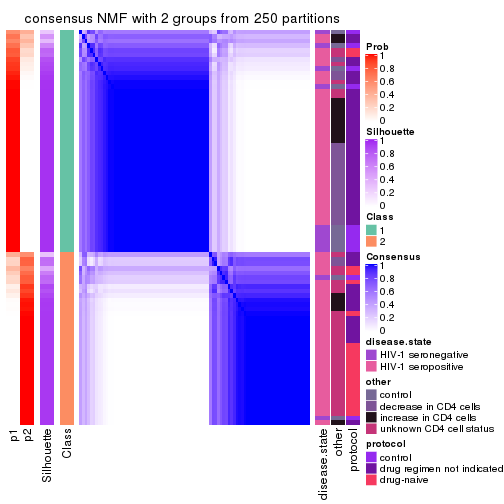</p>

</div>
<div id='tab-MAD-NMF-consensus-heatmap-2'>
<pre><code class="r">consensus_heatmap(res, k = 3)
</code></pre>

<p>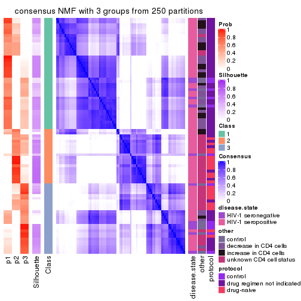</p>

</div>
<div id='tab-MAD-NMF-consensus-heatmap-3'>
<pre><code class="r">consensus_heatmap(res, k = 4)
</code></pre>

<p>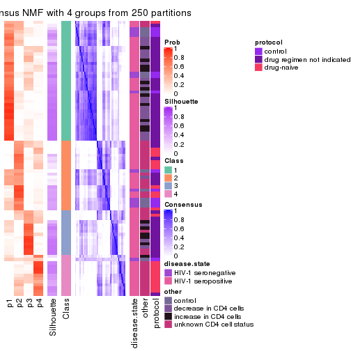</p>

</div>
<div id='tab-MAD-NMF-consensus-heatmap-4'>
<pre><code class="r">consensus_heatmap(res, k = 5)
</code></pre>

<p>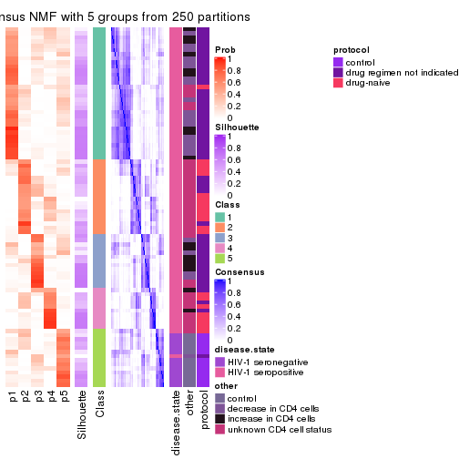</p>

</div>
<div id='tab-MAD-NMF-consensus-heatmap-5'>
<pre><code class="r">consensus_heatmap(res, k = 6)
</code></pre>

<p>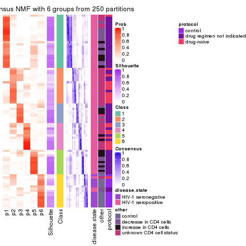</p>

</div>
</div>

Heatmaps for the membership of samples in all partitions to see how consistent they are:


<script>
$( function() {
	$( '#tabs-MAD-NMF-membership-heatmap' ).tabs();
} );
</script>
<div id='tabs-MAD-NMF-membership-heatmap'>
<ul>
<li><a href='#tab-MAD-NMF-membership-heatmap-1'>k = 2</a></li>
<li><a href='#tab-MAD-NMF-membership-heatmap-2'>k = 3</a></li>
<li><a href='#tab-MAD-NMF-membership-heatmap-3'>k = 4</a></li>
<li><a href='#tab-MAD-NMF-membership-heatmap-4'>k = 5</a></li>
<li><a href='#tab-MAD-NMF-membership-heatmap-5'>k = 6</a></li>
</ul>
<div id='tab-MAD-NMF-membership-heatmap-1'>
<pre><code class="r">membership_heatmap(res, k = 2)
</code></pre>

<p>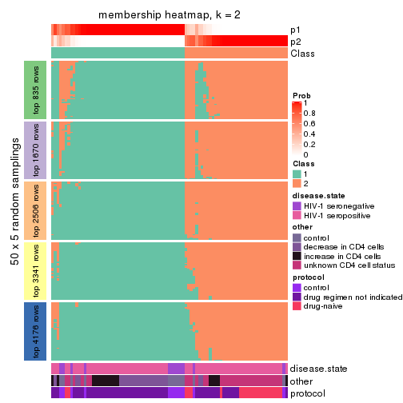</p>

</div>
<div id='tab-MAD-NMF-membership-heatmap-2'>
<pre><code class="r">membership_heatmap(res, k = 3)
</code></pre>

<p>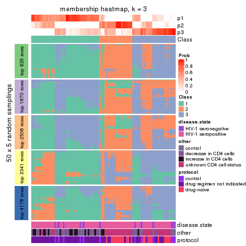</p>

</div>
<div id='tab-MAD-NMF-membership-heatmap-3'>
<pre><code class="r">membership_heatmap(res, k = 4)
</code></pre>

<p>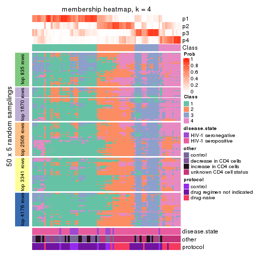</p>

</div>
<div id='tab-MAD-NMF-membership-heatmap-4'>
<pre><code class="r">membership_heatmap(res, k = 5)
</code></pre>

<p>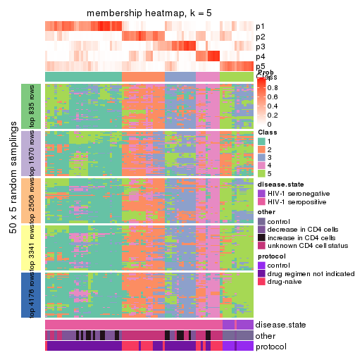</p>

</div>
<div id='tab-MAD-NMF-membership-heatmap-5'>
<pre><code class="r">membership_heatmap(res, k = 6)
</code></pre>

<p>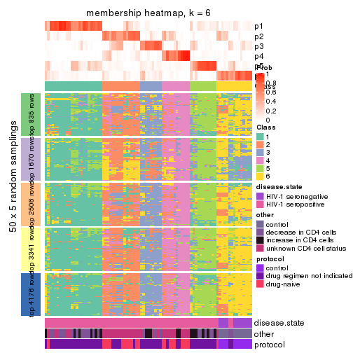</p>

</div>
</div>

As soon as we have had the classes for columns, we can look for signatures
which are significantly different between classes which can be candidate marks
for certain classes. Following are the heatmaps for signatures.


Signature heatmaps where rows are scaled:


<script>
$( function() {
	$( '#tabs-MAD-NMF-get-signatures' ).tabs();
} );
</script>
<div id='tabs-MAD-NMF-get-signatures'>
<ul>
<li><a href='#tab-MAD-NMF-get-signatures-1'>k = 2</a></li>
<li><a href='#tab-MAD-NMF-get-signatures-2'>k = 3</a></li>
<li><a href='#tab-MAD-NMF-get-signatures-3'>k = 4</a></li>
<li><a href='#tab-MAD-NMF-get-signatures-4'>k = 5</a></li>
<li><a href='#tab-MAD-NMF-get-signatures-5'>k = 6</a></li>
</ul>
<div id='tab-MAD-NMF-get-signatures-1'>
<pre><code class="r">get_signatures(res, k = 2)
</code></pre>

<p>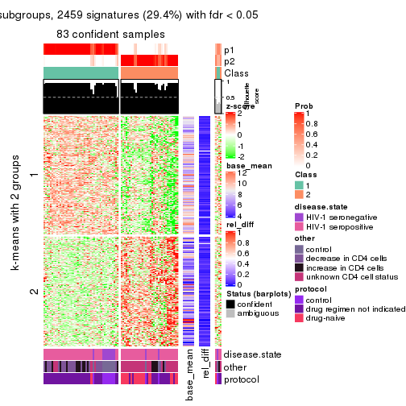</p>

</div>
<div id='tab-MAD-NMF-get-signatures-2'>
<pre><code class="r">get_signatures(res, k = 3)
</code></pre>

<p>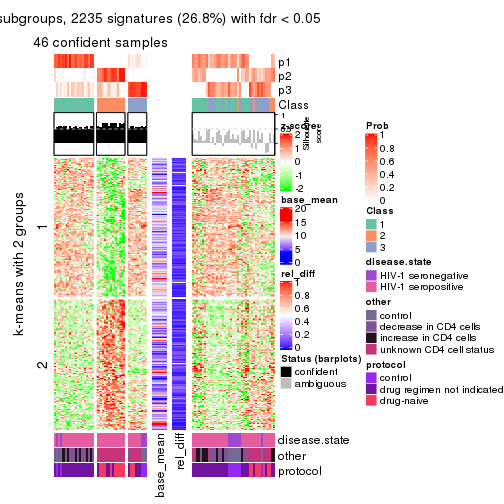</p>

</div>
<div id='tab-MAD-NMF-get-signatures-3'>
<pre><code class="r">get_signatures(res, k = 4)
</code></pre>

<p>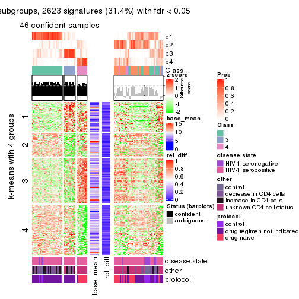</p>

</div>
<div id='tab-MAD-NMF-get-signatures-4'>
<pre><code class="r">get_signatures(res, k = 5)
</code></pre>

<p>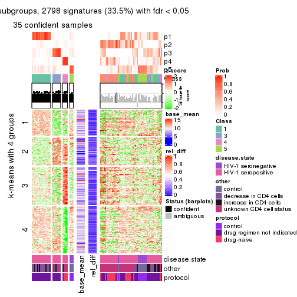</p>

</div>
<div id='tab-MAD-NMF-get-signatures-5'>
<pre><code class="r">get_signatures(res, k = 6)
</code></pre>

<p>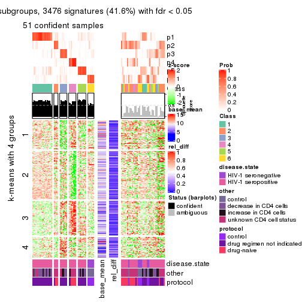</p>

</div>
</div>


Signature heatmaps where rows are not scaled:


<script>
$( function() {
	$( '#tabs-MAD-NMF-get-signatures-no-scale' ).tabs();
} );
</script>
<div id='tabs-MAD-NMF-get-signatures-no-scale'>
<ul>
<li><a href='#tab-MAD-NMF-get-signatures-no-scale-1'>k = 2</a></li>
<li><a href='#tab-MAD-NMF-get-signatures-no-scale-2'>k = 3</a></li>
<li><a href='#tab-MAD-NMF-get-signatures-no-scale-3'>k = 4</a></li>
<li><a href='#tab-MAD-NMF-get-signatures-no-scale-4'>k = 5</a></li>
<li><a href='#tab-MAD-NMF-get-signatures-no-scale-5'>k = 6</a></li>
</ul>
<div id='tab-MAD-NMF-get-signatures-no-scale-1'>
<pre><code class="r">get_signatures(res, k = 2, scale_rows = FALSE)
</code></pre>

<p>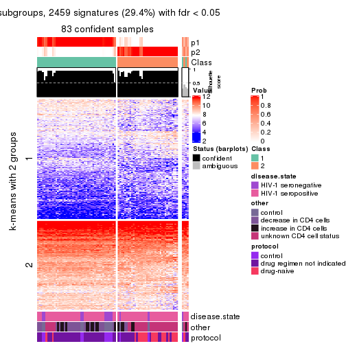</p>

</div>
<div id='tab-MAD-NMF-get-signatures-no-scale-2'>
<pre><code class="r">get_signatures(res, k = 3, scale_rows = FALSE)
</code></pre>

<p>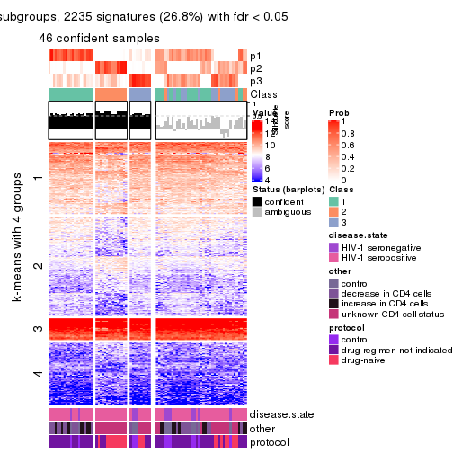</p>

</div>
<div id='tab-MAD-NMF-get-signatures-no-scale-3'>
<pre><code class="r">get_signatures(res, k = 4, scale_rows = FALSE)
</code></pre>

<p>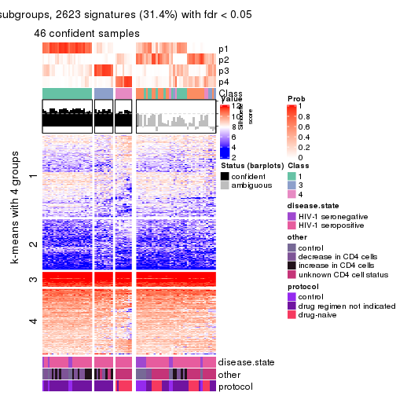</p>

</div>
<div id='tab-MAD-NMF-get-signatures-no-scale-4'>
<pre><code class="r">get_signatures(res, k = 5, scale_rows = FALSE)
</code></pre>

<p>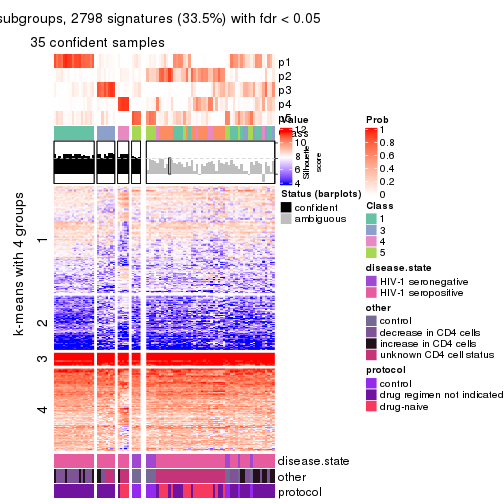</p>

</div>
<div id='tab-MAD-NMF-get-signatures-no-scale-5'>
<pre><code class="r">get_signatures(res, k = 6, scale_rows = FALSE)
</code></pre>

<p>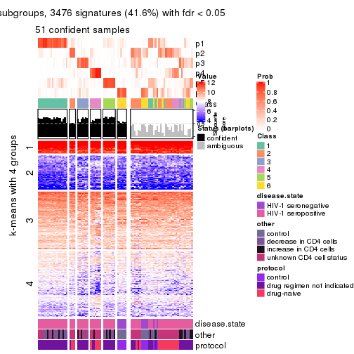</p>

</div>
</div>


Compare the overlap of signatures from different k:

```r
compare_signatures(res)
```

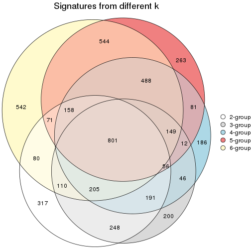

`get_signature()` returns a data frame invisibly. TO get the list of signatures, the function
call should be assigned to a variable explicitly. In following code, if `plot` argument is set
to `FALSE`, no heatmap is plotted while only the differential analysis is performed.

```r
# code only for demonstration
tb = get_signature(res, k = ..., plot = FALSE)
```

An example of the output of `tb` is:

```
#>   which_row         fdr    mean_1    mean_2 scaled_mean_1 scaled_mean_2 km
#> 1        38 0.042760348  8.373488  9.131774    -0.5533452     0.5164555  1
#> 2        40 0.018707592  7.106213  8.469186    -0.6173731     0.5762149  1
#> 3        55 0.019134737 10.221463 11.207825    -0.6159697     0.5749050  1
#> 4        59 0.006059896  5.921854  7.869574    -0.6899429     0.6439467  1
#> 5        60 0.018055526  8.928898 10.211722    -0.6204761     0.5791110  1
#> 6        98 0.009384629 15.714769 14.887706     0.6635654    -0.6193277  2
...
```

The columns in `tb` are:

1. `which_row`: row indices corresponding to the input matrix.
2. `fdr`: FDR for the differential test. 
3. `mean_x`: The mean value in group x.
4. `scaled_mean_x`: The mean value in group x after rows are scaled.
5. `km`: Row groups if k-means clustering is applied to rows.


UMAP plot which shows how samples are separated.


<script>
$( function() {
	$( '#tabs-MAD-NMF-dimension-reduction' ).tabs();
} );
</script>
<div id='tabs-MAD-NMF-dimension-reduction'>
<ul>
<li><a href='#tab-MAD-NMF-dimension-reduction-1'>k = 2</a></li>
<li><a href='#tab-MAD-NMF-dimension-reduction-2'>k = 3</a></li>
<li><a href='#tab-MAD-NMF-dimension-reduction-3'>k = 4</a></li>
<li><a href='#tab-MAD-NMF-dimension-reduction-4'>k = 5</a></li>
<li><a href='#tab-MAD-NMF-dimension-reduction-5'>k = 6</a></li>
</ul>
<div id='tab-MAD-NMF-dimension-reduction-1'>
<pre><code class="r">dimension_reduction(res, k = 2, method = &quot;UMAP&quot;)
</code></pre>

<p>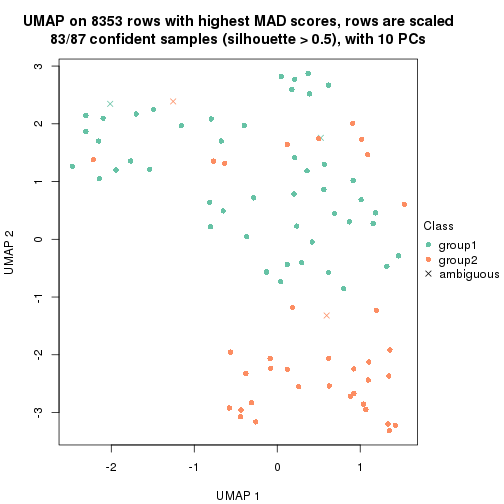</p>

</div>
<div id='tab-MAD-NMF-dimension-reduction-2'>
<pre><code class="r">dimension_reduction(res, k = 3, method = &quot;UMAP&quot;)
</code></pre>

<p>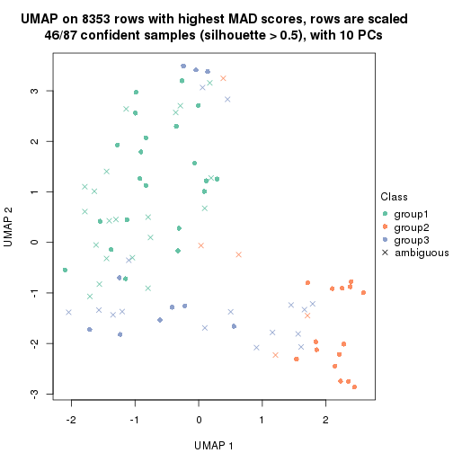</p>

</div>
<div id='tab-MAD-NMF-dimension-reduction-3'>
<pre><code class="r">dimension_reduction(res, k = 4, method = &quot;UMAP&quot;)
</code></pre>

<p>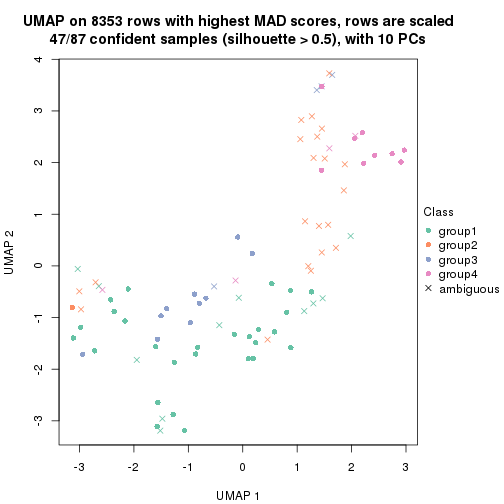</p>

</div>
<div id='tab-MAD-NMF-dimension-reduction-4'>
<pre><code class="r">dimension_reduction(res, k = 5, method = &quot;UMAP&quot;)
</code></pre>

<p>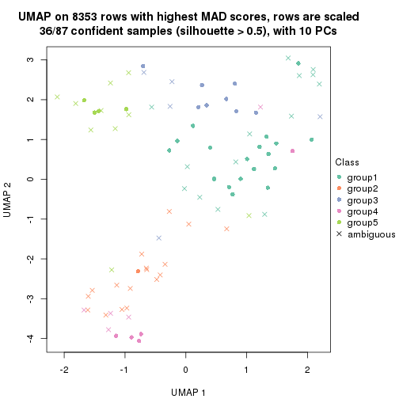</p>

</div>
<div id='tab-MAD-NMF-dimension-reduction-5'>
<pre><code class="r">dimension_reduction(res, k = 6, method = &quot;UMAP&quot;)
</code></pre>

<p>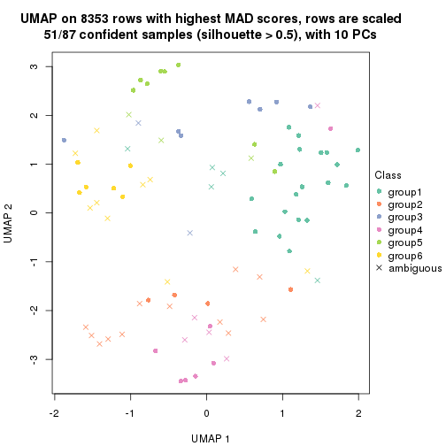</p>

</div>
</div>


Following heatmap shows how subgroups are split when increasing `k`:

```r
collect_classes(res)
```

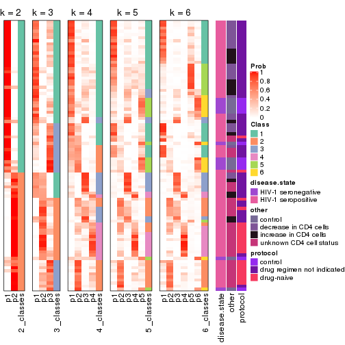


Test correlation between subgroups and known annotations. If the known
annotation is numeric, one-way ANOVA test is applied, and if the known
annotation is discrete, chi-squared contingency table test is applied.

```r
test_to_known_factors(res)
```

```
#>          n disease.state(p) other(p) protocol(p) k
#> MAD:NMF 83         1.38e-01 1.27e-07    2.42e-06 2
#> MAD:NMF 46         5.94e-02 5.30e-08    1.71e-05 3
#> MAD:NMF 47         1.09e-02 6.19e-07    3.24e-09 4
#> MAD:NMF 36         2.89e-07 7.84e-08    8.44e-11 5
#> MAD:NMF 51         8.65e-10 3.73e-10    4.97e-14 6
```


If matrix rows can be associated to genes, consider to use `GO_Enrichment(res,
...)` to perform function enrichment for the signature genes.


 

---------------------------------------------------


### ATC:hclust**


The object with results only for a single top-value method and a single partition method 
can be extracted as:

```r
res = res_list["ATC", "hclust"]
# you can also extract it by
# res = res_list["ATC:hclust"]
```

A summary of `res` and all the functions that can be applied to it:

```r
res
```

```
#> A 'ConsensusPartition' object with k = 2, 3, 4, 5, 6.
#>   On a matrix with 8353 rows and 87 columns.
#>   Top rows (835, 1670, 2506, 3341, 4176) are extracted by 'ATC' method.
#>   Subgroups are detected by 'hclust' method.
#>   Performed in total 1250 partitions by row resampling.
#>   Best k for subgroups seems to be 2.
#> 
#> Following methods can be applied to this 'ConsensusPartition' object:
#>  [1] "cola_report"             "collect_classes"         "collect_plots"          
#>  [4] "collect_stats"           "colnames"                "compare_signatures"     
#>  [7] "consensus_heatmap"       "dimension_reduction"     "functional_enrichment"  
#> [10] "get_anno_col"            "get_anno"                "get_classes"            
#> [13] "get_consensus"           "get_matrix"              "get_membership"         
#> [16] "get_param"               "get_signatures"          "get_stats"              
#> [19] "is_best_k"               "is_stable_k"             "membership_heatmap"     
#> [22] "ncol"                    "nrow"                    "plot_ecdf"              
#> [25] "rownames"                "select_partition_number" "show"                   
#> [28] "suggest_best_k"          "test_to_known_factors"
```

`collect_plots()` function collects all the plots made from `res` for all `k` (number of partitions)
into one single page to provide an easy and fast comparison between different `k`.

```r
collect_plots(res)
```

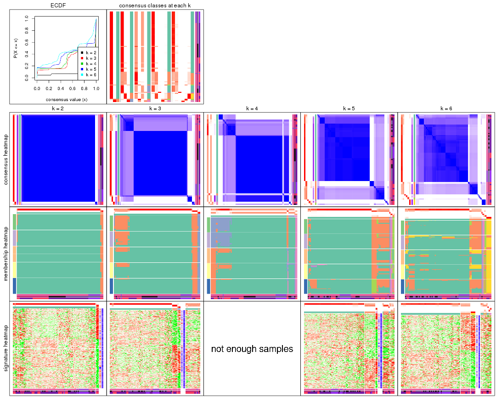

The plots are:

- The first row: a plot of the ECDF (Empirical cumulative distribution
  function) curves of the consensus matrix for each `k` and the heatmap of
  predicted classes for each `k`.
- The second row: heatmaps of the consensus matrix for each `k`.
- The third row: heatmaps of the membership matrix for each `k`.
- The fouth row: heatmaps of the signatures for each `k`.

All the plots in panels can be made by individual functions and they are
plotted later in this section.

`select_partition_number()` produces several plots showing different
statistics for choosing "optimized" `k`. There are following statistics:

- ECDF curves of the consensus matrix for each `k`;
- 1-PAC. [The PAC
  score](https://en.wikipedia.org/wiki/Consensus_clustering#Over-interpretation_potential_of_consensus_clustering)
  measures the proportion of the ambiguous subgrouping.
- Mean silhouette score.
- Concordance. The mean probability of fiting the consensus class ids in all
  partitions.
- Area increased. Denote $A_k$ as the area under the ECDF curve for current
  `k`, the area increased is defined as $A_k - A_{k-1}$.
- Rand index. The percent of pairs of samples that are both in a same cluster
  or both are not in a same cluster in the partition of k and k-1.
- Jaccard index. The ratio of pairs of samples are both in a same cluster in
  the partition of k and k-1 and the pairs of samples are both in a same
  cluster in the partition k or k-1.

The detailed explanations of these statistics can be found in [the cola
vignette](http://bioconductor.org/packages/devel/bioc/vignettes/cola/inst/doc/cola.html#toc_13).

Generally speaking, lower PAC score, higher mean silhouette score or higher
concordance corresponds to better partition. Rand index and Jaccard index
measure how similar the current partition is compared to partition with `k-1`.
If they are too similar, we won't accept `k` is better than `k-1`.

```r
select_partition_number(res)
```

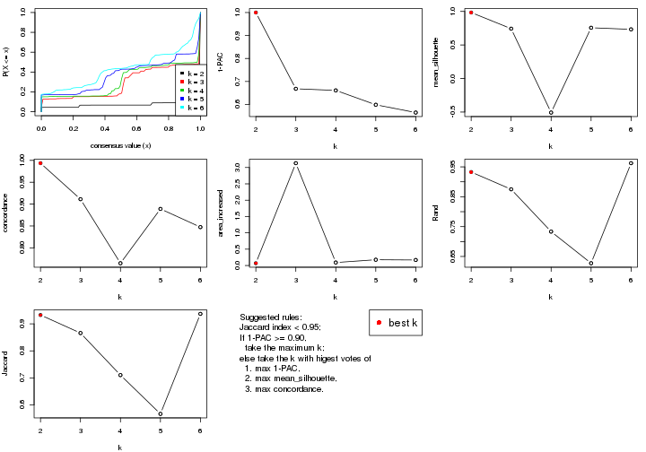

The numeric values for all these statistics can be obtained by `get_stats()`.

```r
get_stats(res)
```

```
#>   k 1-PAC mean_silhouette concordance area_increased  Rand Jaccard
#> 2 2 1.000           0.984       0.994         0.0699 0.933   0.933
#> 3 3 0.668           0.743       0.911         3.1322 0.875   0.866
#> 4 4 0.661          -0.508       0.765         0.0922 0.733   0.710
#> 5 5 0.599           0.757       0.889         0.1770 0.627   0.567
#> 6 6 0.565           0.733       0.847         0.1696 0.962   0.937
```

`suggest_best_k()` suggests the best $k$ based on these statistics. The rules are as follows:

- All $k$ with Jaccard index larger than 0.95 are removed because the increase of
  the partition number does not provides enough extra information. If all $k$ are removed,
  the best $k$ is assigned by `NA`.
- For $k$ with 1-PAC larger than 0.9, the maximal $k$ is taken as the "best k". Other $k$ is called "optional k".
- If it does not fit the second rule. The $k$ with the highest vote of highest
  1-PAC, mean silhouette and concordance is taken as the "best k".

```r
suggest_best_k(res)
```

```
#> [1] 2
```


Following shows the table of the partitions (You need to click the **show/hide
code output** link to see it). The membership matrix (columns with name `p*`)
is inferred by
[`clue::cl_consensus()`](https://www.rdocumentation.org/link/cl_consensus?package=clue)
function with the `SE` method. Basically the value in the membership matrix
represents the probability to belong to a certain group. The finall class
label for an item is determined with the group with highest probability it
belongs to.

In `get_classes()` function, the entropy is calculated from the membership
matrix and the silhouette score is calculated from the consensus matrix.


<script>
$( function() {
	$( '#tabs-ATC-hclust-get-classes' ).tabs();
} );
</script>
<div id='tabs-ATC-hclust-get-classes'>
<ul>
<li><a href='#tab-ATC-hclust-get-classes-1'>k = 2</a></li>
<li><a href='#tab-ATC-hclust-get-classes-2'>k = 3</a></li>
<li><a href='#tab-ATC-hclust-get-classes-3'>k = 4</a></li>
<li><a href='#tab-ATC-hclust-get-classes-4'>k = 5</a></li>
<li><a href='#tab-ATC-hclust-get-classes-5'>k = 6</a></li>
</ul>

<div id='tab-ATC-hclust-get-classes-1'>
<p><a id='tab-ATC-hclust-get-classes-1-a' style='color:#0366d6' href='#'>show/hide code output</a></p>
<pre><code class="r">cbind(get_classes(res, k = 2), get_membership(res, k = 2))
</code></pre>

<pre><code>#&gt;          class entropy silhouette    p1    p2
#&gt; GSM39104     1  0.0000      0.996 1.000 0.000
#&gt; GSM39105     1  0.0000      0.996 1.000 0.000
#&gt; GSM39106     1  0.0000      0.996 1.000 0.000
#&gt; GSM39107     1  0.0000      0.996 1.000 0.000
#&gt; GSM39108     1  0.0000      0.996 1.000 0.000
#&gt; GSM39109     1  0.0000      0.996 1.000 0.000
#&gt; GSM39110     1  0.0000      0.996 1.000 0.000
#&gt; GSM39111     1  0.0000      0.996 1.000 0.000
#&gt; GSM39112     1  0.0000      0.996 1.000 0.000
#&gt; GSM39113     1  0.0000      0.996 1.000 0.000
#&gt; GSM39114     1  0.0000      0.996 1.000 0.000
#&gt; GSM39115     1  0.0000      0.996 1.000 0.000
#&gt; GSM39148     1  0.0000      0.996 1.000 0.000
#&gt; GSM39149     1  0.0000      0.996 1.000 0.000
#&gt; GSM39150     1  0.0000      0.996 1.000 0.000
#&gt; GSM39151     1  0.0000      0.996 1.000 0.000
#&gt; GSM39152     1  0.0000      0.996 1.000 0.000
#&gt; GSM39153     1  0.0000      0.996 1.000 0.000
#&gt; GSM39154     1  0.0000      0.996 1.000 0.000
#&gt; GSM39155     1  0.0000      0.996 1.000 0.000
#&gt; GSM39156     1  0.0000      0.996 1.000 0.000
#&gt; GSM39157     1  0.0000      0.996 1.000 0.000
#&gt; GSM39158     1  0.0000      0.996 1.000 0.000
#&gt; GSM39159     1  0.0000      0.996 1.000 0.000
#&gt; GSM39160     1  0.0000      0.996 1.000 0.000
#&gt; GSM39161     1  0.0000      0.996 1.000 0.000
#&gt; GSM39162     1  0.0000      0.996 1.000 0.000
#&gt; GSM39163     1  0.0000      0.996 1.000 0.000
#&gt; GSM39164     1  0.0000      0.996 1.000 0.000
#&gt; GSM39165     1  0.0000      0.996 1.000 0.000
#&gt; GSM39166     1  0.0000      0.996 1.000 0.000
#&gt; GSM39167     1  0.0000      0.996 1.000 0.000
#&gt; GSM39168     1  0.0000      0.996 1.000 0.000
#&gt; GSM39169     1  0.0000      0.996 1.000 0.000
#&gt; GSM39170     1  0.0000      0.996 1.000 0.000
#&gt; GSM39171     1  0.0000      0.996 1.000 0.000
#&gt; GSM39172     1  0.0000      0.996 1.000 0.000
#&gt; GSM39173     1  0.0000      0.996 1.000 0.000
#&gt; GSM39174     1  0.0000      0.996 1.000 0.000
#&gt; GSM39175     1  0.0000      0.996 1.000 0.000
#&gt; GSM39176     1  0.0000      0.996 1.000 0.000
#&gt; GSM39177     1  0.0000      0.996 1.000 0.000
#&gt; GSM39178     1  0.0000      0.996 1.000 0.000
#&gt; GSM39179     1  0.0000      0.996 1.000 0.000
#&gt; GSM39180     1  0.0000      0.996 1.000 0.000
#&gt; GSM39181     1  0.0000      0.996 1.000 0.000
#&gt; GSM39182     1  0.0000      0.996 1.000 0.000
#&gt; GSM39183     1  0.0000      0.996 1.000 0.000
#&gt; GSM39184     1  0.0000      0.996 1.000 0.000
#&gt; GSM39185     1  0.0000      0.996 1.000 0.000
#&gt; GSM39186     1  0.0000      0.996 1.000 0.000
#&gt; GSM39187     1  0.0000      0.996 1.000 0.000
#&gt; GSM39116     1  0.0000      0.996 1.000 0.000
#&gt; GSM39117     2  0.0000      0.878 0.000 1.000
#&gt; GSM39118     1  0.0000      0.996 1.000 0.000
#&gt; GSM39119     1  0.0672      0.987 0.992 0.008
#&gt; GSM39120     1  0.0000      0.996 1.000 0.000
#&gt; GSM39121     1  0.0000      0.996 1.000 0.000
#&gt; GSM39122     1  0.0000      0.996 1.000 0.000
#&gt; GSM39123     2  0.7950      0.681 0.240 0.760
#&gt; GSM39124     1  0.0000      0.996 1.000 0.000
#&gt; GSM39125     1  0.0000      0.996 1.000 0.000
#&gt; GSM39126     1  0.0000      0.996 1.000 0.000
#&gt; GSM39127     1  0.0000      0.996 1.000 0.000
#&gt; GSM39128     1  0.0000      0.996 1.000 0.000
#&gt; GSM39129     1  0.0000      0.996 1.000 0.000
#&gt; GSM39130     2  0.0000      0.878 0.000 1.000
#&gt; GSM39131     1  0.0000      0.996 1.000 0.000
#&gt; GSM39132     1  0.0000      0.996 1.000 0.000
#&gt; GSM39133     1  0.8861      0.506 0.696 0.304
#&gt; GSM39134     1  0.0000      0.996 1.000 0.000
#&gt; GSM39135     1  0.0000      0.996 1.000 0.000
#&gt; GSM39136     1  0.0938      0.983 0.988 0.012
#&gt; GSM39137     1  0.0000      0.996 1.000 0.000
#&gt; GSM39138     1  0.0000      0.996 1.000 0.000
#&gt; GSM39139     1  0.0000      0.996 1.000 0.000
#&gt; GSM39140     1  0.0000      0.996 1.000 0.000
#&gt; GSM39141     1  0.0000      0.996 1.000 0.000
#&gt; GSM39142     1  0.0000      0.996 1.000 0.000
#&gt; GSM39143     1  0.0000      0.996 1.000 0.000
#&gt; GSM39144     1  0.0000      0.996 1.000 0.000
#&gt; GSM39145     1  0.0000      0.996 1.000 0.000
#&gt; GSM39146     1  0.0000      0.996 1.000 0.000
#&gt; GSM39147     1  0.0000      0.996 1.000 0.000
#&gt; GSM39188     1  0.0000      0.996 1.000 0.000
#&gt; GSM39189     1  0.0000      0.996 1.000 0.000
#&gt; GSM39190     1  0.0000      0.996 1.000 0.000
</code></pre>

<script>
$('#tab-ATC-hclust-get-classes-1-a').parent().next().next().hide();
$('#tab-ATC-hclust-get-classes-1-a').click(function(){
  $('#tab-ATC-hclust-get-classes-1-a').parent().next().next().toggle();
  return(false);
});
</script>
</div>

<div id='tab-ATC-hclust-get-classes-2'>
<p><a id='tab-ATC-hclust-get-classes-2-a' style='color:#0366d6' href='#'>show/hide code output</a></p>
<pre><code class="r">cbind(get_classes(res, k = 3), get_membership(res, k = 3))
</code></pre>

<pre><code>#&gt;          class entropy silhouette    p1    p2    p3
#&gt; GSM39104     1  0.0000     0.8945 1.000 0.000 0.000
#&gt; GSM39105     1  0.0000     0.8945 1.000 0.000 0.000
#&gt; GSM39106     1  0.0000     0.8945 1.000 0.000 0.000
#&gt; GSM39107     1  0.0000     0.8945 1.000 0.000 0.000
#&gt; GSM39108     1  0.0000     0.8945 1.000 0.000 0.000
#&gt; GSM39109     1  0.0000     0.8945 1.000 0.000 0.000
#&gt; GSM39110     1  0.0000     0.8945 1.000 0.000 0.000
#&gt; GSM39111     1  0.0000     0.8945 1.000 0.000 0.000
#&gt; GSM39112     1  0.0000     0.8945 1.000 0.000 0.000
#&gt; GSM39113     1  0.0000     0.8945 1.000 0.000 0.000
#&gt; GSM39114     1  0.6305     0.0976 0.516 0.484 0.000
#&gt; GSM39115     1  0.0000     0.8945 1.000 0.000 0.000
#&gt; GSM39148     1  0.0000     0.8945 1.000 0.000 0.000
#&gt; GSM39149     1  0.0000     0.8945 1.000 0.000 0.000
#&gt; GSM39150     1  0.0000     0.8945 1.000 0.000 0.000
#&gt; GSM39151     1  0.0000     0.8945 1.000 0.000 0.000
#&gt; GSM39152     1  0.0000     0.8945 1.000 0.000 0.000
#&gt; GSM39153     1  0.0000     0.8945 1.000 0.000 0.000
#&gt; GSM39154     1  0.0000     0.8945 1.000 0.000 0.000
#&gt; GSM39155     1  0.0000     0.8945 1.000 0.000 0.000
#&gt; GSM39156     1  0.0000     0.8945 1.000 0.000 0.000
#&gt; GSM39157     1  0.0000     0.8945 1.000 0.000 0.000
#&gt; GSM39158     1  0.0000     0.8945 1.000 0.000 0.000
#&gt; GSM39159     1  0.0000     0.8945 1.000 0.000 0.000
#&gt; GSM39160     1  0.0000     0.8945 1.000 0.000 0.000
#&gt; GSM39161     1  0.0000     0.8945 1.000 0.000 0.000
#&gt; GSM39162     1  0.0000     0.8945 1.000 0.000 0.000
#&gt; GSM39163     1  0.0000     0.8945 1.000 0.000 0.000
#&gt; GSM39164     1  0.0000     0.8945 1.000 0.000 0.000
#&gt; GSM39165     1  0.0000     0.8945 1.000 0.000 0.000
#&gt; GSM39166     1  0.0000     0.8945 1.000 0.000 0.000
#&gt; GSM39167     1  0.0000     0.8945 1.000 0.000 0.000
#&gt; GSM39168     1  0.0000     0.8945 1.000 0.000 0.000
#&gt; GSM39169     1  0.0000     0.8945 1.000 0.000 0.000
#&gt; GSM39170     1  0.0000     0.8945 1.000 0.000 0.000
#&gt; GSM39171     1  0.0000     0.8945 1.000 0.000 0.000
#&gt; GSM39172     1  0.0000     0.8945 1.000 0.000 0.000
#&gt; GSM39173     1  0.6026     0.3767 0.624 0.376 0.000
#&gt; GSM39174     1  0.0000     0.8945 1.000 0.000 0.000
#&gt; GSM39175     1  0.0000     0.8945 1.000 0.000 0.000
#&gt; GSM39176     1  0.0000     0.8945 1.000 0.000 0.000
#&gt; GSM39177     1  0.0000     0.8945 1.000 0.000 0.000
#&gt; GSM39178     1  0.0000     0.8945 1.000 0.000 0.000
#&gt; GSM39179     1  0.0000     0.8945 1.000 0.000 0.000
#&gt; GSM39180     1  0.0000     0.8945 1.000 0.000 0.000
#&gt; GSM39181     1  0.0000     0.8945 1.000 0.000 0.000
#&gt; GSM39182     1  0.0000     0.8945 1.000 0.000 0.000
#&gt; GSM39183     1  0.0000     0.8945 1.000 0.000 0.000
#&gt; GSM39184     1  0.0000     0.8945 1.000 0.000 0.000
#&gt; GSM39185     1  0.0000     0.8945 1.000 0.000 0.000
#&gt; GSM39186     1  0.0000     0.8945 1.000 0.000 0.000
#&gt; GSM39187     1  0.0000     0.8945 1.000 0.000 0.000
#&gt; GSM39116     1  0.6307     0.0848 0.512 0.488 0.000
#&gt; GSM39117     3  0.0000     0.7729 0.000 0.000 1.000
#&gt; GSM39118     1  0.6307     0.0848 0.512 0.488 0.000
#&gt; GSM39119     2  0.6680    -0.1219 0.484 0.508 0.008
#&gt; GSM39120     1  0.0000     0.8945 1.000 0.000 0.000
#&gt; GSM39121     1  0.0000     0.8945 1.000 0.000 0.000
#&gt; GSM39122     1  0.0000     0.8945 1.000 0.000 0.000
#&gt; GSM39123     3  0.6208     0.5160 0.192 0.052 0.756
#&gt; GSM39124     1  0.6305     0.0976 0.516 0.484 0.000
#&gt; GSM39125     1  0.0000     0.8945 1.000 0.000 0.000
#&gt; GSM39126     1  0.0000     0.8945 1.000 0.000 0.000
#&gt; GSM39127     1  0.6307     0.0848 0.512 0.488 0.000
#&gt; GSM39128     1  0.4555     0.6878 0.800 0.200 0.000
#&gt; GSM39129     2  0.0424     0.7457 0.008 0.992 0.000
#&gt; GSM39130     3  0.0000     0.7729 0.000 0.000 1.000
#&gt; GSM39131     1  0.6307     0.0848 0.512 0.488 0.000
#&gt; GSM39132     1  0.6305     0.0976 0.516 0.484 0.000
#&gt; GSM39133     1  0.7246     0.4595 0.648 0.052 0.300
#&gt; GSM39134     2  0.0424     0.7457 0.008 0.992 0.000
#&gt; GSM39135     1  0.6307     0.0848 0.512 0.488 0.000
#&gt; GSM39136     1  0.6587     0.2436 0.568 0.424 0.008
#&gt; GSM39137     1  0.6267     0.1897 0.548 0.452 0.000
#&gt; GSM39138     2  0.0424     0.7457 0.008 0.992 0.000
#&gt; GSM39139     2  0.0424     0.7457 0.008 0.992 0.000
#&gt; GSM39140     1  0.0000     0.8945 1.000 0.000 0.000
#&gt; GSM39141     1  0.0000     0.8945 1.000 0.000 0.000
#&gt; GSM39142     1  0.0000     0.8945 1.000 0.000 0.000
#&gt; GSM39143     1  0.0000     0.8945 1.000 0.000 0.000
#&gt; GSM39144     2  0.0424     0.7457 0.008 0.992 0.000
#&gt; GSM39145     1  0.6252     0.2111 0.556 0.444 0.000
#&gt; GSM39146     1  0.5650     0.5088 0.688 0.312 0.000
#&gt; GSM39147     1  0.6305     0.0976 0.516 0.484 0.000
#&gt; GSM39188     1  0.0000     0.8945 1.000 0.000 0.000
#&gt; GSM39189     1  0.0000     0.8945 1.000 0.000 0.000
#&gt; GSM39190     1  0.0000     0.8945 1.000 0.000 0.000
</code></pre>

<script>
$('#tab-ATC-hclust-get-classes-2-a').parent().next().next().hide();
$('#tab-ATC-hclust-get-classes-2-a').click(function(){
  $('#tab-ATC-hclust-get-classes-2-a').parent().next().next().toggle();
  return(false);
});
</script>
</div>

<div id='tab-ATC-hclust-get-classes-3'>
<p><a id='tab-ATC-hclust-get-classes-3-a' style='color:#0366d6' href='#'>show/hide code output</a></p>
<pre><code class="r">cbind(get_classes(res, k = 4), get_membership(res, k = 4))
</code></pre>

<pre><code>#&gt;          class entropy silhouette    p1    p2    p3    p4
#&gt; GSM39104     1  0.5000    -0.8781 0.504 0.000 0.496 0.000
#&gt; GSM39105     1  0.5000    -0.8781 0.504 0.000 0.496 0.000
#&gt; GSM39106     1  0.5000    -0.8781 0.504 0.000 0.496 0.000
#&gt; GSM39107     1  0.5000    -0.8781 0.504 0.000 0.496 0.000
#&gt; GSM39108     1  0.5000    -0.8781 0.504 0.000 0.496 0.000
#&gt; GSM39109     1  0.5000    -0.8781 0.504 0.000 0.496 0.000
#&gt; GSM39110     1  0.5000    -0.8781 0.504 0.000 0.496 0.000
#&gt; GSM39111     1  0.5000    -0.8781 0.504 0.000 0.496 0.000
#&gt; GSM39112     1  0.5000    -0.8781 0.504 0.000 0.496 0.000
#&gt; GSM39113     1  0.5000    -0.8781 0.504 0.000 0.496 0.000
#&gt; GSM39114     1  0.0188     0.1216 0.996 0.000 0.004 0.000
#&gt; GSM39115     1  0.5000    -0.8781 0.504 0.000 0.496 0.000
#&gt; GSM39148     1  0.5000    -0.8781 0.504 0.000 0.496 0.000
#&gt; GSM39149     1  0.5000    -0.8781 0.504 0.000 0.496 0.000
#&gt; GSM39150     1  0.5000    -0.8781 0.504 0.000 0.496 0.000
#&gt; GSM39151     1  0.5000    -0.8781 0.504 0.000 0.496 0.000
#&gt; GSM39152     1  0.5000    -0.8781 0.504 0.000 0.496 0.000
#&gt; GSM39153     1  0.5000    -0.8781 0.504 0.000 0.496 0.000
#&gt; GSM39154     1  0.5000    -0.8781 0.504 0.000 0.496 0.000
#&gt; GSM39155     1  0.5000    -0.8781 0.504 0.000 0.496 0.000
#&gt; GSM39156     1  0.5000    -0.8781 0.504 0.000 0.496 0.000
#&gt; GSM39157     1  0.5000    -0.8781 0.504 0.000 0.496 0.000
#&gt; GSM39158     3  0.5167     1.0000 0.488 0.000 0.508 0.004
#&gt; GSM39159     1  0.5000    -0.8781 0.504 0.000 0.496 0.000
#&gt; GSM39160     1  0.5000    -0.8781 0.504 0.000 0.496 0.000
#&gt; GSM39161     3  0.5167     1.0000 0.488 0.000 0.508 0.004
#&gt; GSM39162     1  0.5000    -0.8781 0.504 0.000 0.496 0.000
#&gt; GSM39163     1  0.5000    -0.8781 0.504 0.000 0.496 0.000
#&gt; GSM39164     1  0.5000    -0.8781 0.504 0.000 0.496 0.000
#&gt; GSM39165     1  0.5000    -0.8781 0.504 0.000 0.496 0.000
#&gt; GSM39166     3  0.5167     1.0000 0.488 0.000 0.508 0.004
#&gt; GSM39167     1  0.5000    -0.8781 0.504 0.000 0.496 0.000
#&gt; GSM39168     1  0.5000    -0.8781 0.504 0.000 0.496 0.000
#&gt; GSM39169     1  0.5000    -0.8781 0.504 0.000 0.496 0.000
#&gt; GSM39170     1  0.5000    -0.8781 0.504 0.000 0.496 0.000
#&gt; GSM39171     1  0.5000    -0.8781 0.504 0.000 0.496 0.000
#&gt; GSM39172     1  0.5000    -0.8781 0.504 0.000 0.496 0.000
#&gt; GSM39173     1  0.2530     0.0797 0.888 0.000 0.112 0.000
#&gt; GSM39174     1  0.5000    -0.8781 0.504 0.000 0.496 0.000
#&gt; GSM39175     1  0.5000    -0.8781 0.504 0.000 0.496 0.000
#&gt; GSM39176     1  0.5000    -0.8781 0.504 0.000 0.496 0.000
#&gt; GSM39177     1  0.5000    -0.8781 0.504 0.000 0.496 0.000
#&gt; GSM39178     1  0.5000    -0.8781 0.504 0.000 0.496 0.000
#&gt; GSM39179     1  0.5000    -0.8781 0.504 0.000 0.496 0.000
#&gt; GSM39180     4  0.7890    -0.2697 0.044 0.100 0.416 0.440
#&gt; GSM39181     3  0.5167     1.0000 0.488 0.000 0.508 0.004
#&gt; GSM39182     1  0.5000    -0.8781 0.504 0.000 0.496 0.000
#&gt; GSM39183     3  0.5167     1.0000 0.488 0.000 0.508 0.004
#&gt; GSM39184     1  0.5000    -0.8781 0.504 0.000 0.496 0.000
#&gt; GSM39185     3  0.5167     1.0000 0.488 0.000 0.508 0.004
#&gt; GSM39186     1  0.5000    -0.8781 0.504 0.000 0.496 0.000
#&gt; GSM39187     1  0.5000    -0.8781 0.504 0.000 0.496 0.000
#&gt; GSM39116     1  0.0188     0.1128 0.996 0.004 0.000 0.000
#&gt; GSM39117     4  0.4972     0.2578 0.000 0.456 0.000 0.544
#&gt; GSM39118     1  0.0188     0.1128 0.996 0.004 0.000 0.000
#&gt; GSM39119     1  0.5288    -0.1729 0.776 0.112 0.096 0.016
#&gt; GSM39120     1  0.5000    -0.8781 0.504 0.000 0.496 0.000
#&gt; GSM39121     1  0.5000    -0.8781 0.504 0.000 0.496 0.000
#&gt; GSM39122     1  0.5000    -0.8781 0.504 0.000 0.496 0.000
#&gt; GSM39123     2  0.0000    -0.4830 0.000 1.000 0.000 0.000
#&gt; GSM39124     1  0.0188     0.1216 0.996 0.000 0.004 0.000
#&gt; GSM39125     1  0.5000    -0.8781 0.504 0.000 0.496 0.000
#&gt; GSM39126     1  0.5000    -0.8781 0.504 0.000 0.496 0.000
#&gt; GSM39127     1  0.0000     0.1140 1.000 0.000 0.000 0.000
#&gt; GSM39128     1  0.4643    -0.2555 0.656 0.000 0.344 0.000
#&gt; GSM39129     1  0.5512    -0.4762 0.496 0.000 0.488 0.016
#&gt; GSM39130     4  0.4972     0.2578 0.000 0.456 0.000 0.544
#&gt; GSM39131     1  0.0000     0.1140 1.000 0.000 0.000 0.000
#&gt; GSM39132     1  0.0188     0.1216 0.996 0.000 0.004 0.000
#&gt; GSM39133     2  0.6359    -0.1161 0.396 0.544 0.056 0.004
#&gt; GSM39134     1  0.5512    -0.4762 0.496 0.000 0.488 0.016
#&gt; GSM39135     1  0.0000     0.1140 1.000 0.000 0.000 0.000
#&gt; GSM39136     1  0.5136    -0.1107 0.768 0.144 0.084 0.004
#&gt; GSM39137     1  0.1118     0.1391 0.964 0.000 0.036 0.000
#&gt; GSM39138     1  0.5512    -0.4762 0.496 0.000 0.488 0.016
#&gt; GSM39139     1  0.5512    -0.4762 0.496 0.000 0.488 0.016
#&gt; GSM39140     1  0.5000    -0.8781 0.504 0.000 0.496 0.000
#&gt; GSM39141     1  0.5000    -0.8781 0.504 0.000 0.496 0.000
#&gt; GSM39142     1  0.5000    -0.8781 0.504 0.000 0.496 0.000
#&gt; GSM39143     1  0.5000    -0.8781 0.504 0.000 0.496 0.000
#&gt; GSM39144     1  0.5512    -0.4762 0.496 0.000 0.488 0.016
#&gt; GSM39145     1  0.1302     0.1343 0.956 0.000 0.044 0.000
#&gt; GSM39146     1  0.3444    -0.0154 0.816 0.000 0.184 0.000
#&gt; GSM39147     1  0.0188     0.1216 0.996 0.000 0.004 0.000
#&gt; GSM39188     1  0.5000    -0.8781 0.504 0.000 0.496 0.000
#&gt; GSM39189     1  0.5000    -0.8781 0.504 0.000 0.496 0.000
#&gt; GSM39190     1  0.5000    -0.8781 0.504 0.000 0.496 0.000
</code></pre>

<script>
$('#tab-ATC-hclust-get-classes-3-a').parent().next().next().hide();
$('#tab-ATC-hclust-get-classes-3-a').click(function(){
  $('#tab-ATC-hclust-get-classes-3-a').parent().next().next().toggle();
  return(false);
});
</script>
</div>

<div id='tab-ATC-hclust-get-classes-4'>
<p><a id='tab-ATC-hclust-get-classes-4-a' style='color:#0366d6' href='#'>show/hide code output</a></p>
<pre><code class="r">cbind(get_classes(res, k = 5), get_membership(res, k = 5))
</code></pre>

<pre><code>#&gt;          class entropy silhouette    p1    p2   p3    p4    p5
#&gt; GSM39104     1  0.0324     0.9470 0.992 0.004 0.00 0.000 0.004
#&gt; GSM39105     1  0.0324     0.9470 0.992 0.004 0.00 0.000 0.004
#&gt; GSM39106     1  0.0324     0.9470 0.992 0.004 0.00 0.000 0.004
#&gt; GSM39107     1  0.0324     0.9470 0.992 0.004 0.00 0.000 0.004
#&gt; GSM39108     1  0.0324     0.9470 0.992 0.004 0.00 0.000 0.004
#&gt; GSM39109     1  0.0324     0.9470 0.992 0.004 0.00 0.000 0.004
#&gt; GSM39110     1  0.0324     0.9470 0.992 0.004 0.00 0.000 0.004
#&gt; GSM39111     1  0.0324     0.9470 0.992 0.004 0.00 0.000 0.004
#&gt; GSM39112     1  0.0324     0.9470 0.992 0.004 0.00 0.000 0.004
#&gt; GSM39113     1  0.0324     0.9470 0.992 0.004 0.00 0.000 0.004
#&gt; GSM39114     2  0.4171     0.6543 0.396 0.604 0.00 0.000 0.000
#&gt; GSM39115     1  0.0324     0.9470 0.992 0.004 0.00 0.000 0.004
#&gt; GSM39148     1  0.0000     0.9479 1.000 0.000 0.00 0.000 0.000
#&gt; GSM39149     1  0.0609     0.9373 0.980 0.000 0.00 0.000 0.020
#&gt; GSM39150     1  0.0510     0.9404 0.984 0.000 0.00 0.000 0.016
#&gt; GSM39151     1  0.0703     0.9337 0.976 0.000 0.00 0.000 0.024
#&gt; GSM39152     1  0.0609     0.9373 0.980 0.000 0.00 0.000 0.020
#&gt; GSM39153     1  0.0000     0.9479 1.000 0.000 0.00 0.000 0.000
#&gt; GSM39154     1  0.0000     0.9479 1.000 0.000 0.00 0.000 0.000
#&gt; GSM39155     1  0.0162     0.9471 0.996 0.000 0.00 0.000 0.004
#&gt; GSM39156     1  0.0000     0.9479 1.000 0.000 0.00 0.000 0.000
#&gt; GSM39157     1  0.0000     0.9479 1.000 0.000 0.00 0.000 0.000
#&gt; GSM39158     1  0.3542     0.7553 0.840 0.112 0.02 0.000 0.028
#&gt; GSM39159     1  0.0162     0.9465 0.996 0.000 0.00 0.000 0.004
#&gt; GSM39160     1  0.0404     0.9431 0.988 0.000 0.00 0.000 0.012
#&gt; GSM39161     1  0.3542     0.7553 0.840 0.112 0.02 0.000 0.028
#&gt; GSM39162     1  0.0000     0.9479 1.000 0.000 0.00 0.000 0.000
#&gt; GSM39163     1  0.0000     0.9479 1.000 0.000 0.00 0.000 0.000
#&gt; GSM39164     1  0.0000     0.9479 1.000 0.000 0.00 0.000 0.000
#&gt; GSM39165     1  0.0000     0.9479 1.000 0.000 0.00 0.000 0.000
#&gt; GSM39166     1  0.3542     0.7553 0.840 0.112 0.02 0.000 0.028
#&gt; GSM39167     1  0.0000     0.9479 1.000 0.000 0.00 0.000 0.000
#&gt; GSM39168     1  0.0000     0.9479 1.000 0.000 0.00 0.000 0.000
#&gt; GSM39169     1  0.0162     0.9471 0.996 0.000 0.00 0.000 0.004
#&gt; GSM39170     1  0.0000     0.9479 1.000 0.000 0.00 0.000 0.000
#&gt; GSM39171     1  0.0404     0.9431 0.988 0.000 0.00 0.000 0.012
#&gt; GSM39172     1  0.0609     0.9356 0.980 0.000 0.00 0.000 0.020
#&gt; GSM39173     1  0.4299    -0.1555 0.608 0.388 0.00 0.000 0.004
#&gt; GSM39174     1  0.0000     0.9479 1.000 0.000 0.00 0.000 0.000
#&gt; GSM39175     1  0.0000     0.9479 1.000 0.000 0.00 0.000 0.000
#&gt; GSM39176     1  0.0000     0.9479 1.000 0.000 0.00 0.000 0.000
#&gt; GSM39177     1  0.0162     0.9468 0.996 0.000 0.00 0.000 0.004
#&gt; GSM39178     1  0.0404     0.9431 0.988 0.000 0.00 0.000 0.012
#&gt; GSM39179     1  0.0703     0.9337 0.976 0.000 0.00 0.000 0.024
#&gt; GSM39180     3  0.0000     0.0000 0.000 0.000 1.00 0.000 0.000
#&gt; GSM39181     1  0.3542     0.7553 0.840 0.112 0.02 0.000 0.028
#&gt; GSM39182     1  0.0609     0.9356 0.980 0.000 0.00 0.000 0.020
#&gt; GSM39183     1  0.3542     0.7553 0.840 0.112 0.02 0.000 0.028
#&gt; GSM39184     1  0.0162     0.9471 0.996 0.000 0.00 0.000 0.004
#&gt; GSM39185     1  0.3542     0.7553 0.840 0.112 0.02 0.000 0.028
#&gt; GSM39186     1  0.0162     0.9471 0.996 0.000 0.00 0.000 0.004
#&gt; GSM39187     1  0.0000     0.9479 1.000 0.000 0.00 0.000 0.000
#&gt; GSM39116     2  0.4310     0.6530 0.392 0.604 0.00 0.000 0.004
#&gt; GSM39117     4  0.0000     0.7508 0.000 0.000 0.00 1.000 0.000
#&gt; GSM39118     2  0.4310     0.6530 0.392 0.604 0.00 0.000 0.004
#&gt; GSM39119     2  0.6031     0.3357 0.244 0.576 0.00 0.000 0.180
#&gt; GSM39120     1  0.0162     0.9464 0.996 0.004 0.00 0.000 0.000
#&gt; GSM39121     1  0.0162     0.9464 0.996 0.004 0.00 0.000 0.000
#&gt; GSM39122     1  0.0162     0.9464 0.996 0.004 0.00 0.000 0.000
#&gt; GSM39123     5  0.4273    -0.5371 0.000 0.000 0.00 0.448 0.552
#&gt; GSM39124     2  0.4171     0.6543 0.396 0.604 0.00 0.000 0.000
#&gt; GSM39125     1  0.0162     0.9464 0.996 0.004 0.00 0.000 0.000
#&gt; GSM39126     1  0.0162     0.9464 0.996 0.004 0.00 0.000 0.000
#&gt; GSM39127     2  0.4201     0.6460 0.408 0.592 0.00 0.000 0.000
#&gt; GSM39128     1  0.3789     0.5350 0.760 0.224 0.00 0.000 0.016
#&gt; GSM39129     2  0.2179     0.0686 0.000 0.888 0.00 0.000 0.112
#&gt; GSM39130     4  0.3424     0.7434 0.000 0.000 0.00 0.760 0.240
#&gt; GSM39131     2  0.4201     0.6460 0.408 0.592 0.00 0.000 0.000
#&gt; GSM39132     2  0.4171     0.6543 0.396 0.604 0.00 0.000 0.000
#&gt; GSM39133     5  0.6022     0.1054 0.252 0.112 0.02 0.000 0.616
#&gt; GSM39134     2  0.2179     0.0686 0.000 0.888 0.00 0.000 0.112
#&gt; GSM39135     2  0.4161     0.6535 0.392 0.608 0.00 0.000 0.000
#&gt; GSM39136     2  0.6940     0.3214 0.280 0.484 0.02 0.000 0.216
#&gt; GSM39137     2  0.4283     0.5852 0.456 0.544 0.00 0.000 0.000
#&gt; GSM39138     2  0.2179     0.0686 0.000 0.888 0.00 0.000 0.112
#&gt; GSM39139     2  0.2179     0.0686 0.000 0.888 0.00 0.000 0.112
#&gt; GSM39140     1  0.0000     0.9479 1.000 0.000 0.00 0.000 0.000
#&gt; GSM39141     1  0.0000     0.9479 1.000 0.000 0.00 0.000 0.000
#&gt; GSM39142     1  0.0000     0.9479 1.000 0.000 0.00 0.000 0.000
#&gt; GSM39143     1  0.0000     0.9479 1.000 0.000 0.00 0.000 0.000
#&gt; GSM39144     2  0.2179     0.0686 0.000 0.888 0.00 0.000 0.112
#&gt; GSM39145     2  0.4256     0.6051 0.436 0.564 0.00 0.000 0.000
#&gt; GSM39146     1  0.4201    -0.1732 0.592 0.408 0.00 0.000 0.000
#&gt; GSM39147     2  0.4171     0.6543 0.396 0.604 0.00 0.000 0.000
#&gt; GSM39188     1  0.0703     0.9337 0.976 0.000 0.00 0.000 0.024
#&gt; GSM39189     1  0.0703     0.9337 0.976 0.000 0.00 0.000 0.024
#&gt; GSM39190     1  0.0703     0.9337 0.976 0.000 0.00 0.000 0.024
</code></pre>

<script>
$('#tab-ATC-hclust-get-classes-4-a').parent().next().next().hide();
$('#tab-ATC-hclust-get-classes-4-a').click(function(){
  $('#tab-ATC-hclust-get-classes-4-a').parent().next().next().toggle();
  return(false);
});
</script>
</div>

<div id='tab-ATC-hclust-get-classes-5'>
<p><a id='tab-ATC-hclust-get-classes-5-a' style='color:#0366d6' href='#'>show/hide code output</a></p>
<pre><code class="r">cbind(get_classes(res, k = 6), get_membership(res, k = 6))
</code></pre>

<pre><code>#&gt;          class entropy silhouette    p1    p2 p3    p4    p5    p6
#&gt; GSM39104     1  0.0713     0.8756 0.972 0.028  0 0.000 0.000 0.000
#&gt; GSM39105     1  0.0713     0.8756 0.972 0.028  0 0.000 0.000 0.000
#&gt; GSM39106     1  0.0713     0.8756 0.972 0.028  0 0.000 0.000 0.000
#&gt; GSM39107     1  0.0713     0.8756 0.972 0.028  0 0.000 0.000 0.000
#&gt; GSM39108     1  0.0713     0.8756 0.972 0.028  0 0.000 0.000 0.000
#&gt; GSM39109     1  0.0713     0.8756 0.972 0.028  0 0.000 0.000 0.000
#&gt; GSM39110     1  0.0713     0.8756 0.972 0.028  0 0.000 0.000 0.000
#&gt; GSM39111     1  0.0713     0.8756 0.972 0.028  0 0.000 0.000 0.000
#&gt; GSM39112     1  0.0713     0.8756 0.972 0.028  0 0.000 0.000 0.000
#&gt; GSM39113     1  0.0713     0.8756 0.972 0.028  0 0.000 0.000 0.000
#&gt; GSM39114     2  0.5814     0.8727 0.364 0.448  0 0.000 0.000 0.188
#&gt; GSM39115     1  0.0713     0.8756 0.972 0.028  0 0.000 0.000 0.000
#&gt; GSM39148     1  0.0632     0.8712 0.976 0.024  0 0.000 0.000 0.000
#&gt; GSM39149     1  0.2048     0.8183 0.880 0.120  0 0.000 0.000 0.000
#&gt; GSM39150     1  0.1501     0.8510 0.924 0.076  0 0.000 0.000 0.000
#&gt; GSM39151     1  0.2178     0.8073 0.868 0.132  0 0.000 0.000 0.000
#&gt; GSM39152     1  0.1765     0.8379 0.904 0.096  0 0.000 0.000 0.000
#&gt; GSM39153     1  0.0547     0.8756 0.980 0.020  0 0.000 0.000 0.000
#&gt; GSM39154     1  0.0713     0.8756 0.972 0.028  0 0.000 0.000 0.000
#&gt; GSM39155     1  0.0146     0.8770 0.996 0.004  0 0.000 0.000 0.000
#&gt; GSM39156     1  0.0547     0.8756 0.980 0.020  0 0.000 0.000 0.000
#&gt; GSM39157     1  0.0458     0.8766 0.984 0.016  0 0.000 0.000 0.000
#&gt; GSM39158     1  0.3464     0.5144 0.688 0.312  0 0.000 0.000 0.000
#&gt; GSM39159     1  0.0865     0.8760 0.964 0.036  0 0.000 0.000 0.000
#&gt; GSM39160     1  0.1141     0.8660 0.948 0.052  0 0.000 0.000 0.000
#&gt; GSM39161     1  0.3482     0.5062 0.684 0.316  0 0.000 0.000 0.000
#&gt; GSM39162     1  0.0632     0.8712 0.976 0.024  0 0.000 0.000 0.000
#&gt; GSM39163     1  0.0713     0.8756 0.972 0.028  0 0.000 0.000 0.000
#&gt; GSM39164     1  0.0260     0.8771 0.992 0.008  0 0.000 0.000 0.000
#&gt; GSM39165     1  0.0547     0.8756 0.980 0.020  0 0.000 0.000 0.000
#&gt; GSM39166     1  0.3464     0.5144 0.688 0.312  0 0.000 0.000 0.000
#&gt; GSM39167     1  0.0547     0.8756 0.980 0.020  0 0.000 0.000 0.000
#&gt; GSM39168     1  0.0632     0.8712 0.976 0.024  0 0.000 0.000 0.000
#&gt; GSM39169     1  0.0260     0.8763 0.992 0.008  0 0.000 0.000 0.000
#&gt; GSM39170     1  0.0632     0.8712 0.976 0.024  0 0.000 0.000 0.000
#&gt; GSM39171     1  0.1007     0.8706 0.956 0.044  0 0.000 0.000 0.000
#&gt; GSM39172     1  0.2003     0.8152 0.884 0.116  0 0.000 0.000 0.000
#&gt; GSM39173     1  0.5057    -0.3632 0.560 0.352  0 0.000 0.000 0.088
#&gt; GSM39174     1  0.0458     0.8766 0.984 0.016  0 0.000 0.000 0.000
#&gt; GSM39175     1  0.0547     0.8756 0.980 0.020  0 0.000 0.000 0.000
#&gt; GSM39176     1  0.0713     0.8756 0.972 0.028  0 0.000 0.000 0.000
#&gt; GSM39177     1  0.1141     0.8643 0.948 0.052  0 0.000 0.000 0.000
#&gt; GSM39178     1  0.1204     0.8641 0.944 0.056  0 0.000 0.000 0.000
#&gt; GSM39179     1  0.2135     0.8094 0.872 0.128  0 0.000 0.000 0.000
#&gt; GSM39180     3  0.0000     0.0000 0.000 0.000  1 0.000 0.000 0.000
#&gt; GSM39181     1  0.3464     0.5144 0.688 0.312  0 0.000 0.000 0.000
#&gt; GSM39182     1  0.2003     0.8152 0.884 0.116  0 0.000 0.000 0.000
#&gt; GSM39183     1  0.3464     0.5144 0.688 0.312  0 0.000 0.000 0.000
#&gt; GSM39184     1  0.0146     0.8770 0.996 0.004  0 0.000 0.000 0.000
#&gt; GSM39185     1  0.3482     0.5062 0.684 0.316  0 0.000 0.000 0.000
#&gt; GSM39186     1  0.0865     0.8734 0.964 0.036  0 0.000 0.000 0.000
#&gt; GSM39187     1  0.0547     0.8756 0.980 0.020  0 0.000 0.000 0.000
#&gt; GSM39116     2  0.5814     0.8713 0.364 0.448  0 0.000 0.000 0.188
#&gt; GSM39117     4  0.5296     0.4040 0.000 0.100  0 0.452 0.448 0.000
#&gt; GSM39118     2  0.5814     0.8713 0.364 0.448  0 0.000 0.000 0.188
#&gt; GSM39119     2  0.5717    -0.0544 0.088 0.628  0 0.000 0.072 0.212
#&gt; GSM39120     1  0.0790     0.8678 0.968 0.032  0 0.000 0.000 0.000
#&gt; GSM39121     1  0.0865     0.8654 0.964 0.036  0 0.000 0.000 0.000
#&gt; GSM39122     1  0.0865     0.8654 0.964 0.036  0 0.000 0.000 0.000
#&gt; GSM39123     5  0.0000    -0.1327 0.000 0.000  0 0.000 1.000 0.000
#&gt; GSM39124     2  0.5814     0.8727 0.364 0.448  0 0.000 0.000 0.188
#&gt; GSM39125     1  0.0790     0.8678 0.968 0.032  0 0.000 0.000 0.000
#&gt; GSM39126     1  0.0790     0.8678 0.968 0.032  0 0.000 0.000 0.000
#&gt; GSM39127     2  0.5848     0.8583 0.380 0.428  0 0.000 0.000 0.192
#&gt; GSM39128     1  0.4383     0.4029 0.716 0.176  0 0.000 0.000 0.108
#&gt; GSM39129     6  0.0000     1.0000 0.000 0.000  0 0.000 0.000 1.000
#&gt; GSM39130     4  0.0000     0.3971 0.000 0.000  0 1.000 0.000 0.000
#&gt; GSM39131     2  0.5848     0.8583 0.380 0.428  0 0.000 0.000 0.192
#&gt; GSM39132     2  0.5814     0.8727 0.364 0.448  0 0.000 0.000 0.188
#&gt; GSM39133     5  0.4933     0.2561 0.064 0.432  0 0.000 0.504 0.000
#&gt; GSM39134     6  0.0000     1.0000 0.000 0.000  0 0.000 0.000 1.000
#&gt; GSM39135     2  0.5833     0.8714 0.364 0.444  0 0.000 0.000 0.192
#&gt; GSM39136     2  0.5467    -0.1489 0.084 0.676  0 0.000 0.104 0.136
#&gt; GSM39137     1  0.5725    -0.8040 0.420 0.416  0 0.000 0.000 0.164
#&gt; GSM39138     6  0.0000     1.0000 0.000 0.000  0 0.000 0.000 1.000
#&gt; GSM39139     6  0.0000     1.0000 0.000 0.000  0 0.000 0.000 1.000
#&gt; GSM39140     1  0.0713     0.8697 0.972 0.028  0 0.000 0.000 0.000
#&gt; GSM39141     1  0.0632     0.8712 0.976 0.024  0 0.000 0.000 0.000
#&gt; GSM39142     1  0.0632     0.8712 0.976 0.024  0 0.000 0.000 0.000
#&gt; GSM39143     1  0.0632     0.8712 0.976 0.024  0 0.000 0.000 0.000
#&gt; GSM39144     6  0.0000     1.0000 0.000 0.000  0 0.000 0.000 1.000
#&gt; GSM39145     2  0.5642     0.8328 0.388 0.460  0 0.000 0.000 0.152
#&gt; GSM39146     1  0.5391    -0.4062 0.552 0.308  0 0.000 0.000 0.140
#&gt; GSM39147     2  0.5814     0.8727 0.364 0.448  0 0.000 0.000 0.188
#&gt; GSM39188     1  0.2219     0.8071 0.864 0.136  0 0.000 0.000 0.000
#&gt; GSM39189     1  0.2135     0.8094 0.872 0.128  0 0.000 0.000 0.000
#&gt; GSM39190     1  0.2135     0.8094 0.872 0.128  0 0.000 0.000 0.000
</code></pre>

<script>
$('#tab-ATC-hclust-get-classes-5-a').parent().next().next().hide();
$('#tab-ATC-hclust-get-classes-5-a').click(function(){
  $('#tab-ATC-hclust-get-classes-5-a').parent().next().next().toggle();
  return(false);
});
</script>
</div>
</div>

Heatmaps for the consensus matrix. It visualizes the probability of two
samples to be in a same group.


<script>
$( function() {
	$( '#tabs-ATC-hclust-consensus-heatmap' ).tabs();
} );
</script>
<div id='tabs-ATC-hclust-consensus-heatmap'>
<ul>
<li><a href='#tab-ATC-hclust-consensus-heatmap-1'>k = 2</a></li>
<li><a href='#tab-ATC-hclust-consensus-heatmap-2'>k = 3</a></li>
<li><a href='#tab-ATC-hclust-consensus-heatmap-3'>k = 4</a></li>
<li><a href='#tab-ATC-hclust-consensus-heatmap-4'>k = 5</a></li>
<li><a href='#tab-ATC-hclust-consensus-heatmap-5'>k = 6</a></li>
</ul>
<div id='tab-ATC-hclust-consensus-heatmap-1'>
<pre><code class="r">consensus_heatmap(res, k = 2)
</code></pre>

<p>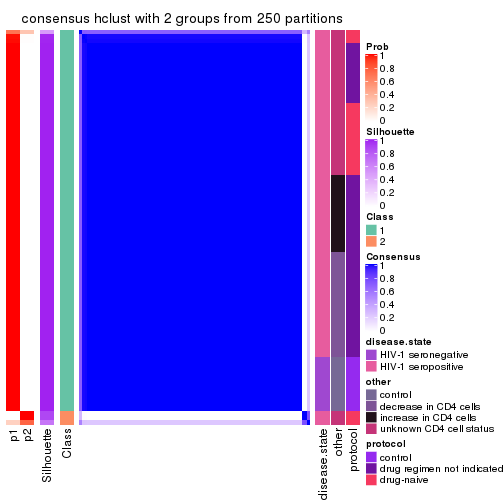</p>

</div>
<div id='tab-ATC-hclust-consensus-heatmap-2'>
<pre><code class="r">consensus_heatmap(res, k = 3)
</code></pre>

<p>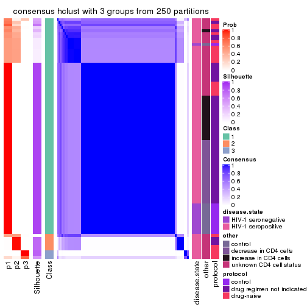</p>

</div>
<div id='tab-ATC-hclust-consensus-heatmap-3'>
<pre><code class="r">consensus_heatmap(res, k = 4)
</code></pre>

<p>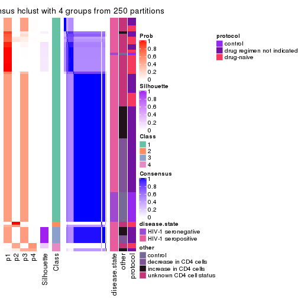</p>

</div>
<div id='tab-ATC-hclust-consensus-heatmap-4'>
<pre><code class="r">consensus_heatmap(res, k = 5)
</code></pre>

<p>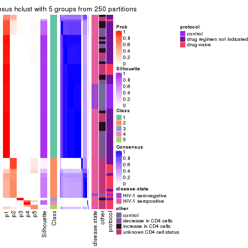</p>

</div>
<div id='tab-ATC-hclust-consensus-heatmap-5'>
<pre><code class="r">consensus_heatmap(res, k = 6)
</code></pre>

<p>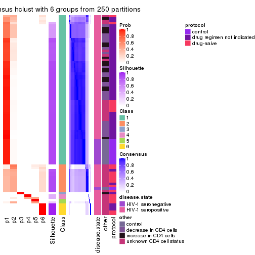</p>

</div>
</div>

Heatmaps for the membership of samples in all partitions to see how consistent they are:


<script>
$( function() {
	$( '#tabs-ATC-hclust-membership-heatmap' ).tabs();
} );
</script>
<div id='tabs-ATC-hclust-membership-heatmap'>
<ul>
<li><a href='#tab-ATC-hclust-membership-heatmap-1'>k = 2</a></li>
<li><a href='#tab-ATC-hclust-membership-heatmap-2'>k = 3</a></li>
<li><a href='#tab-ATC-hclust-membership-heatmap-3'>k = 4</a></li>
<li><a href='#tab-ATC-hclust-membership-heatmap-4'>k = 5</a></li>
<li><a href='#tab-ATC-hclust-membership-heatmap-5'>k = 6</a></li>
</ul>
<div id='tab-ATC-hclust-membership-heatmap-1'>
<pre><code class="r">membership_heatmap(res, k = 2)
</code></pre>

<p>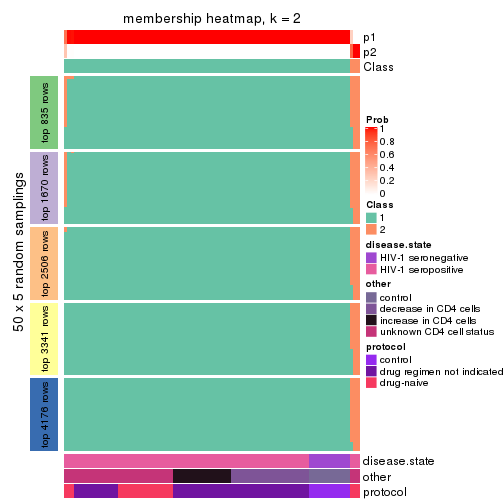</p>

</div>
<div id='tab-ATC-hclust-membership-heatmap-2'>
<pre><code class="r">membership_heatmap(res, k = 3)
</code></pre>

<p>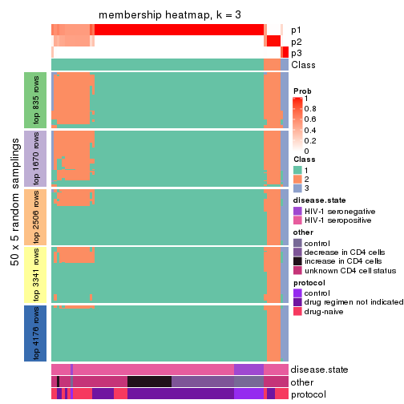</p>

</div>
<div id='tab-ATC-hclust-membership-heatmap-3'>
<pre><code class="r">membership_heatmap(res, k = 4)
</code></pre>

<p>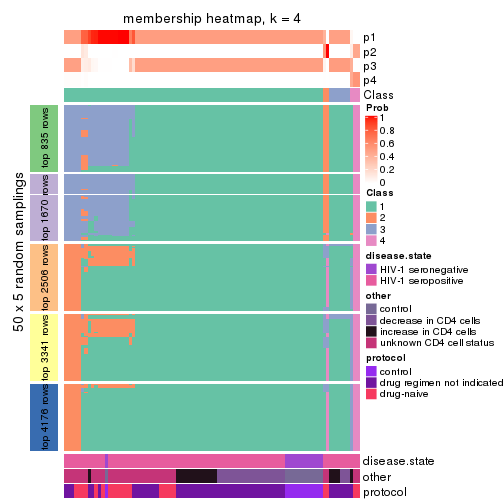</p>

</div>
<div id='tab-ATC-hclust-membership-heatmap-4'>
<pre><code class="r">membership_heatmap(res, k = 5)
</code></pre>

<p>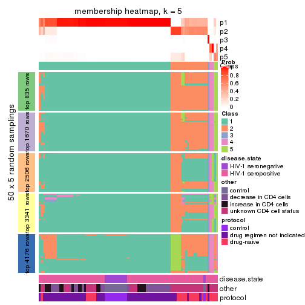</p>

</div>
<div id='tab-ATC-hclust-membership-heatmap-5'>
<pre><code class="r">membership_heatmap(res, k = 6)
</code></pre>

<p>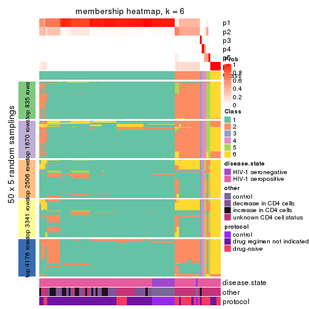</p>

</div>
</div>

As soon as we have had the classes for columns, we can look for signatures
which are significantly different between classes which can be candidate marks
for certain classes. Following are the heatmaps for signatures.


Signature heatmaps where rows are scaled:


<script>
$( function() {
	$( '#tabs-ATC-hclust-get-signatures' ).tabs();
} );
</script>
<div id='tabs-ATC-hclust-get-signatures'>
<ul>
<li><a href='#tab-ATC-hclust-get-signatures-1'>k = 2</a></li>
<li><a href='#tab-ATC-hclust-get-signatures-2'>k = 3</a></li>
<li><a href='#tab-ATC-hclust-get-signatures-3'>k = 4</a></li>
<li><a href='#tab-ATC-hclust-get-signatures-4'>k = 5</a></li>
<li><a href='#tab-ATC-hclust-get-signatures-5'>k = 6</a></li>
</ul>
<div id='tab-ATC-hclust-get-signatures-1'>
<pre><code class="r">get_signatures(res, k = 2)
</code></pre>

<p>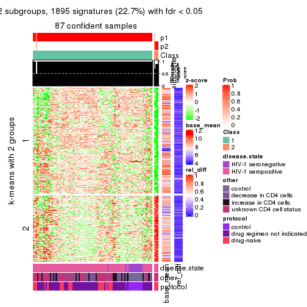</p>

</div>
<div id='tab-ATC-hclust-get-signatures-2'>
<pre><code class="r">get_signatures(res, k = 3)
</code></pre>

<p>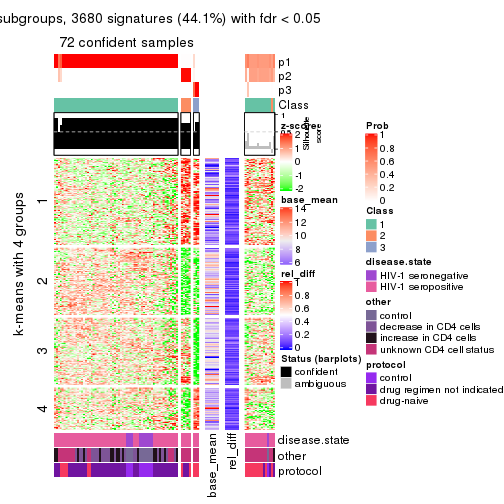</p>

</div>
<div id='tab-ATC-hclust-get-signatures-3'>
<pre><code class="r">get_signatures(res, k = 4)
</code></pre>

<p></p>

</div>
<div id='tab-ATC-hclust-get-signatures-4'>
<pre><code class="r">get_signatures(res, k = 5)
</code></pre>

<p>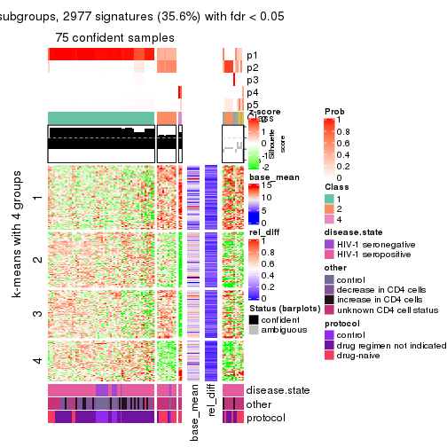</p>

</div>
<div id='tab-ATC-hclust-get-signatures-5'>
<pre><code class="r">get_signatures(res, k = 6)
</code></pre>

<p>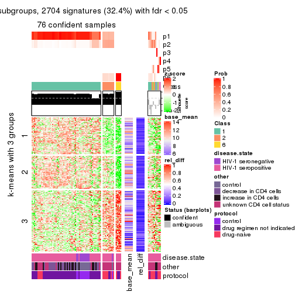</p>

</div>
</div>


Signature heatmaps where rows are not scaled:


<script>
$( function() {
	$( '#tabs-ATC-hclust-get-signatures-no-scale' ).tabs();
} );
</script>
<div id='tabs-ATC-hclust-get-signatures-no-scale'>
<ul>
<li><a href='#tab-ATC-hclust-get-signatures-no-scale-1'>k = 2</a></li>
<li><a href='#tab-ATC-hclust-get-signatures-no-scale-2'>k = 3</a></li>
<li><a href='#tab-ATC-hclust-get-signatures-no-scale-3'>k = 4</a></li>
<li><a href='#tab-ATC-hclust-get-signatures-no-scale-4'>k = 5</a></li>
<li><a href='#tab-ATC-hclust-get-signatures-no-scale-5'>k = 6</a></li>
</ul>
<div id='tab-ATC-hclust-get-signatures-no-scale-1'>
<pre><code class="r">get_signatures(res, k = 2, scale_rows = FALSE)
</code></pre>

<p>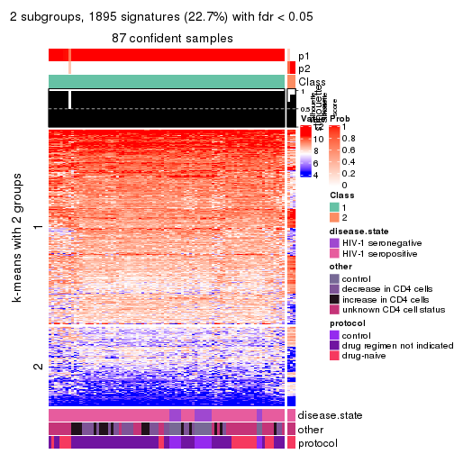</p>

</div>
<div id='tab-ATC-hclust-get-signatures-no-scale-2'>
<pre><code class="r">get_signatures(res, k = 3, scale_rows = FALSE)
</code></pre>

<p>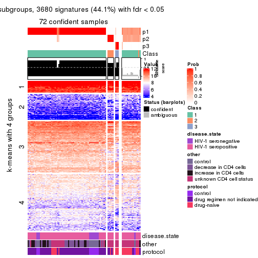</p>

</div>
<div id='tab-ATC-hclust-get-signatures-no-scale-3'>
<pre><code class="r">get_signatures(res, k = 4, scale_rows = FALSE)
</code></pre>

<p></p>

</div>
<div id='tab-ATC-hclust-get-signatures-no-scale-4'>
<pre><code class="r">get_signatures(res, k = 5, scale_rows = FALSE)
</code></pre>

<p>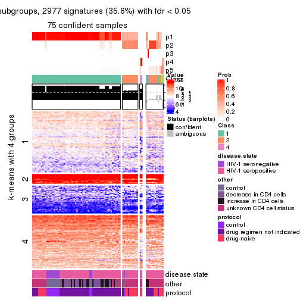</p>

</div>
<div id='tab-ATC-hclust-get-signatures-no-scale-5'>
<pre><code class="r">get_signatures(res, k = 6, scale_rows = FALSE)
</code></pre>

<p>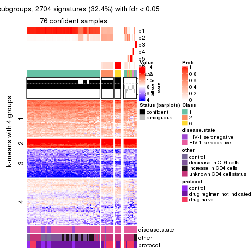</p>

</div>
</div>


Compare the overlap of signatures from different k:

```r
compare_signatures(res)
```

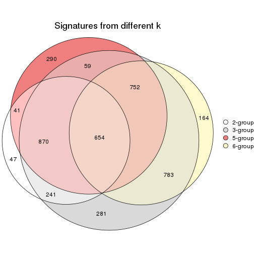

`get_signature()` returns a data frame invisibly. TO get the list of signatures, the function
call should be assigned to a variable explicitly. In following code, if `plot` argument is set
to `FALSE`, no heatmap is plotted while only the differential analysis is performed.

```r
# code only for demonstration
tb = get_signature(res, k = ..., plot = FALSE)
```

An example of the output of `tb` is:

```
#>   which_row         fdr    mean_1    mean_2 scaled_mean_1 scaled_mean_2 km
#> 1        38 0.042760348  8.373488  9.131774    -0.5533452     0.5164555  1
#> 2        40 0.018707592  7.106213  8.469186    -0.6173731     0.5762149  1
#> 3        55 0.019134737 10.221463 11.207825    -0.6159697     0.5749050  1
#> 4        59 0.006059896  5.921854  7.869574    -0.6899429     0.6439467  1
#> 5        60 0.018055526  8.928898 10.211722    -0.6204761     0.5791110  1
#> 6        98 0.009384629 15.714769 14.887706     0.6635654    -0.6193277  2
...
```

The columns in `tb` are:

1. `which_row`: row indices corresponding to the input matrix.
2. `fdr`: FDR for the differential test. 
3. `mean_x`: The mean value in group x.
4. `scaled_mean_x`: The mean value in group x after rows are scaled.
5. `km`: Row groups if k-means clustering is applied to rows.


UMAP plot which shows how samples are separated.


<script>
$( function() {
	$( '#tabs-ATC-hclust-dimension-reduction' ).tabs();
} );
</script>
<div id='tabs-ATC-hclust-dimension-reduction'>
<ul>
<li><a href='#tab-ATC-hclust-dimension-reduction-1'>k = 2</a></li>
<li><a href='#tab-ATC-hclust-dimension-reduction-2'>k = 3</a></li>
<li><a href='#tab-ATC-hclust-dimension-reduction-3'>k = 4</a></li>
<li><a href='#tab-ATC-hclust-dimension-reduction-4'>k = 5</a></li>
<li><a href='#tab-ATC-hclust-dimension-reduction-5'>k = 6</a></li>
</ul>
<div id='tab-ATC-hclust-dimension-reduction-1'>
<pre><code class="r">dimension_reduction(res, k = 2, method = &quot;UMAP&quot;)
</code></pre>

<p>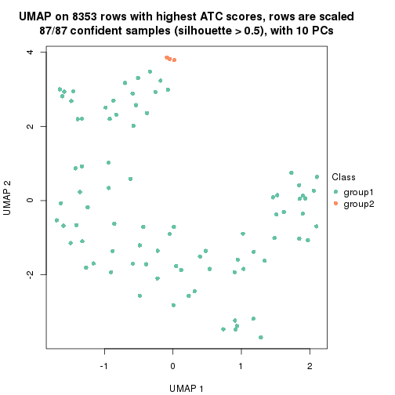</p>

</div>
<div id='tab-ATC-hclust-dimension-reduction-2'>
<pre><code class="r">dimension_reduction(res, k = 3, method = &quot;UMAP&quot;)
</code></pre>

<p>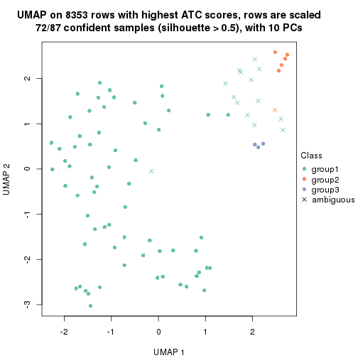</p>

</div>
<div id='tab-ATC-hclust-dimension-reduction-3'>
<pre><code class="r">dimension_reduction(res, k = 4, method = &quot;UMAP&quot;)
</code></pre>

<p>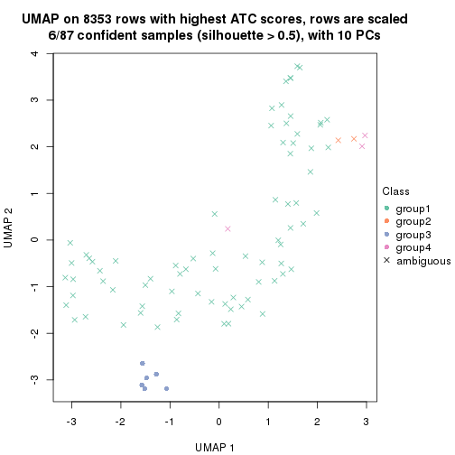</p>

</div>
<div id='tab-ATC-hclust-dimension-reduction-4'>
<pre><code class="r">dimension_reduction(res, k = 5, method = &quot;UMAP&quot;)
</code></pre>

<p>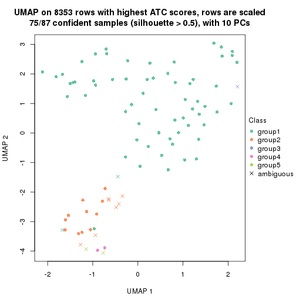</p>

</div>
<div id='tab-ATC-hclust-dimension-reduction-5'>
<pre><code class="r">dimension_reduction(res, k = 6, method = &quot;UMAP&quot;)
</code></pre>

<p>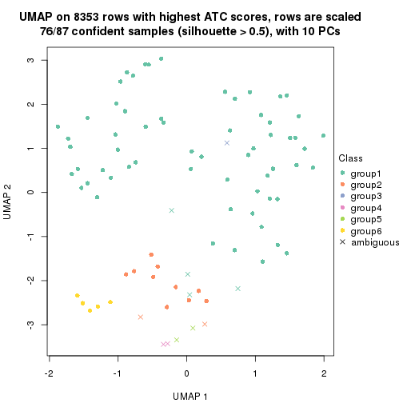</p>

</div>
</div>


Following heatmap shows how subgroups are split when increasing `k`:

```r
collect_classes(res)
```

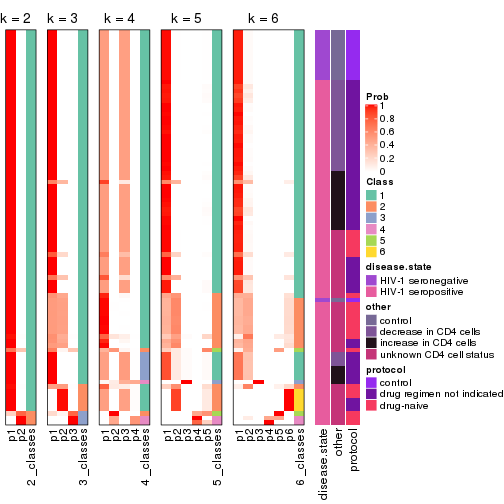


Test correlation between subgroups and known annotations. If the known
annotation is numeric, one-way ANOVA test is applied, and if the known
annotation is discrete, chi-squared contingency table test is applied.

```r
test_to_known_factors(res)
```

```
#>             n disease.state(p) other(p) protocol(p) k
#> ATC:hclust 87            1.000 2.02e-01    1.02e-02 2
#> ATC:hclust 72            0.444 2.30e-03    2.86e-04 3
#> ATC:hclust  6               NA       NA          NA 4
#> ATC:hclust 75            0.634 3.16e-04    5.29e-06 5
#> ATC:hclust 76            0.492 4.42e-05    7.40e-05 6
```


If matrix rows can be associated to genes, consider to use `GO_Enrichment(res,
...)` to perform function enrichment for the signature genes.


 

---------------------------------------------------


### ATC:kmeans


The object with results only for a single top-value method and a single partition method 
can be extracted as:

```r
res = res_list["ATC", "kmeans"]
# you can also extract it by
# res = res_list["ATC:kmeans"]
```

A summary of `res` and all the functions that can be applied to it:

```r
res
```

```
#> A 'ConsensusPartition' object with k = 2, 3, 4, 5, 6.
#>   On a matrix with 8353 rows and 87 columns.
#>   Top rows (835, 1670, 2506, 3341, 4176) are extracted by 'ATC' method.
#>   Subgroups are detected by 'kmeans' method.
#>   Performed in total 1250 partitions by row resampling.
#>   Best k for subgroups seems to be 2.
#> 
#> Following methods can be applied to this 'ConsensusPartition' object:
#>  [1] "cola_report"             "collect_classes"         "collect_plots"          
#>  [4] "collect_stats"           "colnames"                "compare_signatures"     
#>  [7] "consensus_heatmap"       "dimension_reduction"     "functional_enrichment"  
#> [10] "get_anno_col"            "get_anno"                "get_classes"            
#> [13] "get_consensus"           "get_matrix"              "get_membership"         
#> [16] "get_param"               "get_signatures"          "get_stats"              
#> [19] "is_best_k"               "is_stable_k"             "membership_heatmap"     
#> [22] "ncol"                    "nrow"                    "plot_ecdf"              
#> [25] "rownames"                "select_partition_number" "show"                   
#> [28] "suggest_best_k"          "test_to_known_factors"
```

`collect_plots()` function collects all the plots made from `res` for all `k` (number of partitions)
into one single page to provide an easy and fast comparison between different `k`.

```r
collect_plots(res)
```

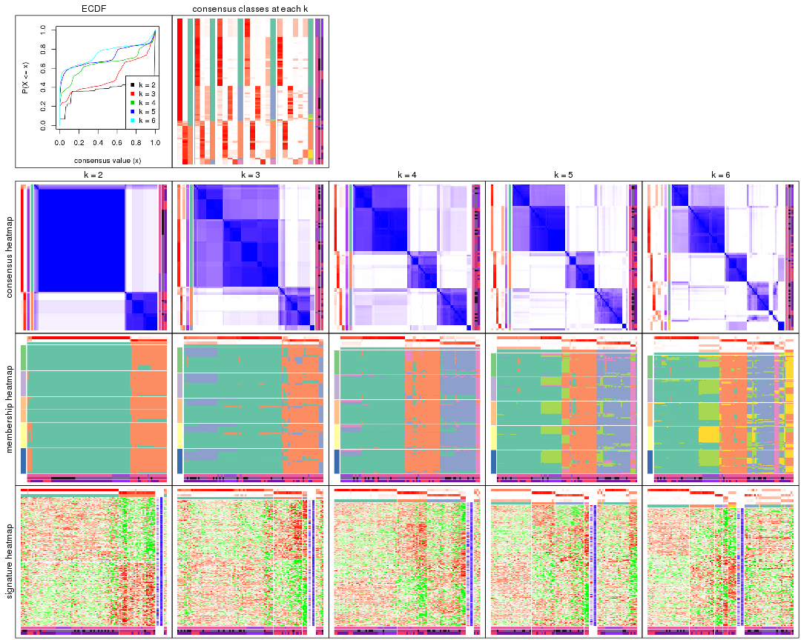

The plots are:

- The first row: a plot of the ECDF (Empirical cumulative distribution
  function) curves of the consensus matrix for each `k` and the heatmap of
  predicted classes for each `k`.
- The second row: heatmaps of the consensus matrix for each `k`.
- The third row: heatmaps of the membership matrix for each `k`.
- The fouth row: heatmaps of the signatures for each `k`.

All the plots in panels can be made by individual functions and they are
plotted later in this section.

`select_partition_number()` produces several plots showing different
statistics for choosing "optimized" `k`. There are following statistics:

- ECDF curves of the consensus matrix for each `k`;
- 1-PAC. [The PAC
  score](https://en.wikipedia.org/wiki/Consensus_clustering#Over-interpretation_potential_of_consensus_clustering)
  measures the proportion of the ambiguous subgrouping.
- Mean silhouette score.
- Concordance. The mean probability of fiting the consensus class ids in all
  partitions.
- Area increased. Denote $A_k$ as the area under the ECDF curve for current
  `k`, the area increased is defined as $A_k - A_{k-1}$.
- Rand index. The percent of pairs of samples that are both in a same cluster
  or both are not in a same cluster in the partition of k and k-1.
- Jaccard index. The ratio of pairs of samples are both in a same cluster in
  the partition of k and k-1 and the pairs of samples are both in a same
  cluster in the partition k or k-1.

The detailed explanations of these statistics can be found in [the cola
vignette](http://bioconductor.org/packages/devel/bioc/vignettes/cola/inst/doc/cola.html#toc_13).

Generally speaking, lower PAC score, higher mean silhouette score or higher
concordance corresponds to better partition. Rand index and Jaccard index
measure how similar the current partition is compared to partition with `k-1`.
If they are too similar, we won't accept `k` is better than `k-1`.

```r
select_partition_number(res)
```

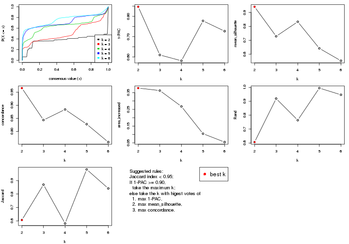

The numeric values for all these statistics can be obtained by `get_stats()`.

```r
get_stats(res)
```

```
#>   k 1-PAC mean_silhouette concordance area_increased  Rand Jaccard
#> 2 2 0.847           0.941       0.965         0.3771 0.607   0.607
#> 3 3 0.610           0.729       0.843         0.3623 0.919   0.870
#> 4 4 0.581           0.833       0.884         0.2674 0.764   0.581
#> 5 5 0.778           0.642       0.828         0.1047 0.994   0.983
#> 6 6 0.727           0.553       0.759         0.0544 0.946   0.842
```

`suggest_best_k()` suggests the best $k$ based on these statistics. The rules are as follows:

- All $k$ with Jaccard index larger than 0.95 are removed because the increase of
  the partition number does not provides enough extra information. If all $k$ are removed,
  the best $k$ is assigned by `NA`.
- For $k$ with 1-PAC larger than 0.9, the maximal $k$ is taken as the "best k". Other $k$ is called "optional k".
- If it does not fit the second rule. The $k$ with the highest vote of highest
  1-PAC, mean silhouette and concordance is taken as the "best k".

```r
suggest_best_k(res)
```

```
#> [1] 2
```


Following shows the table of the partitions (You need to click the **show/hide
code output** link to see it). The membership matrix (columns with name `p*`)
is inferred by
[`clue::cl_consensus()`](https://www.rdocumentation.org/link/cl_consensus?package=clue)
function with the `SE` method. Basically the value in the membership matrix
represents the probability to belong to a certain group. The finall class
label for an item is determined with the group with highest probability it
belongs to.

In `get_classes()` function, the entropy is calculated from the membership
matrix and the silhouette score is calculated from the consensus matrix.


<script>
$( function() {
	$( '#tabs-ATC-kmeans-get-classes' ).tabs();
} );
</script>
<div id='tabs-ATC-kmeans-get-classes'>
<ul>
<li><a href='#tab-ATC-kmeans-get-classes-1'>k = 2</a></li>
<li><a href='#tab-ATC-kmeans-get-classes-2'>k = 3</a></li>
<li><a href='#tab-ATC-kmeans-get-classes-3'>k = 4</a></li>
<li><a href='#tab-ATC-kmeans-get-classes-4'>k = 5</a></li>
<li><a href='#tab-ATC-kmeans-get-classes-5'>k = 6</a></li>
</ul>

<div id='tab-ATC-kmeans-get-classes-1'>
<p><a id='tab-ATC-kmeans-get-classes-1-a' style='color:#0366d6' href='#'>show/hide code output</a></p>
<pre><code class="r">cbind(get_classes(res, k = 2), get_membership(res, k = 2))
</code></pre>

<pre><code>#&gt;          class entropy silhouette    p1    p2
#&gt; GSM39104     1   0.000      0.981 1.000 0.000
#&gt; GSM39105     1   0.000      0.981 1.000 0.000
#&gt; GSM39106     1   0.000      0.981 1.000 0.000
#&gt; GSM39107     1   0.000      0.981 1.000 0.000
#&gt; GSM39108     1   0.000      0.981 1.000 0.000
#&gt; GSM39109     1   0.000      0.981 1.000 0.000
#&gt; GSM39110     1   0.000      0.981 1.000 0.000
#&gt; GSM39111     1   0.000      0.981 1.000 0.000
#&gt; GSM39112     1   0.000      0.981 1.000 0.000
#&gt; GSM39113     1   0.000      0.981 1.000 0.000
#&gt; GSM39114     2   0.518      0.934 0.116 0.884
#&gt; GSM39115     1   0.000      0.981 1.000 0.000
#&gt; GSM39148     1   0.000      0.981 1.000 0.000
#&gt; GSM39149     1   0.000      0.981 1.000 0.000
#&gt; GSM39150     1   0.000      0.981 1.000 0.000
#&gt; GSM39151     1   0.000      0.981 1.000 0.000
#&gt; GSM39152     1   0.000      0.981 1.000 0.000
#&gt; GSM39153     1   0.000      0.981 1.000 0.000
#&gt; GSM39154     1   0.000      0.981 1.000 0.000
#&gt; GSM39155     1   0.000      0.981 1.000 0.000
#&gt; GSM39156     1   0.000      0.981 1.000 0.000
#&gt; GSM39157     1   0.000      0.981 1.000 0.000
#&gt; GSM39158     1   0.000      0.981 1.000 0.000
#&gt; GSM39159     1   0.000      0.981 1.000 0.000
#&gt; GSM39160     1   0.000      0.981 1.000 0.000
#&gt; GSM39161     1   0.000      0.981 1.000 0.000
#&gt; GSM39162     1   0.000      0.981 1.000 0.000
#&gt; GSM39163     1   0.000      0.981 1.000 0.000
#&gt; GSM39164     1   0.000      0.981 1.000 0.000
#&gt; GSM39165     1   0.000      0.981 1.000 0.000
#&gt; GSM39166     1   0.000      0.981 1.000 0.000
#&gt; GSM39167     1   0.000      0.981 1.000 0.000
#&gt; GSM39168     1   0.000      0.981 1.000 0.000
#&gt; GSM39169     1   0.000      0.981 1.000 0.000
#&gt; GSM39170     1   0.000      0.981 1.000 0.000
#&gt; GSM39171     1   0.000      0.981 1.000 0.000
#&gt; GSM39172     1   0.000      0.981 1.000 0.000
#&gt; GSM39173     2   0.552      0.922 0.128 0.872
#&gt; GSM39174     1   0.000      0.981 1.000 0.000
#&gt; GSM39175     1   0.000      0.981 1.000 0.000
#&gt; GSM39176     1   0.000      0.981 1.000 0.000
#&gt; GSM39177     1   0.000      0.981 1.000 0.000
#&gt; GSM39178     1   0.000      0.981 1.000 0.000
#&gt; GSM39179     1   0.000      0.981 1.000 0.000
#&gt; GSM39180     2   0.373      0.947 0.072 0.928
#&gt; GSM39181     1   0.000      0.981 1.000 0.000
#&gt; GSM39182     1   0.000      0.981 1.000 0.000
#&gt; GSM39183     1   0.000      0.981 1.000 0.000
#&gt; GSM39184     1   0.000      0.981 1.000 0.000
#&gt; GSM39185     1   0.000      0.981 1.000 0.000
#&gt; GSM39186     1   0.000      0.981 1.000 0.000
#&gt; GSM39187     1   0.000      0.981 1.000 0.000
#&gt; GSM39116     2   0.518      0.934 0.116 0.884
#&gt; GSM39117     2   0.000      0.910 0.000 1.000
#&gt; GSM39118     2   0.518      0.934 0.116 0.884
#&gt; GSM39119     2   0.327      0.948 0.060 0.940
#&gt; GSM39120     1   0.000      0.981 1.000 0.000
#&gt; GSM39121     1   0.000      0.981 1.000 0.000
#&gt; GSM39122     1   0.000      0.981 1.000 0.000
#&gt; GSM39123     2   0.000      0.910 0.000 1.000
#&gt; GSM39124     2   0.518      0.934 0.116 0.884
#&gt; GSM39125     1   0.000      0.981 1.000 0.000
#&gt; GSM39126     1   0.000      0.981 1.000 0.000
#&gt; GSM39127     2   0.518      0.934 0.116 0.884
#&gt; GSM39128     1   0.814      0.614 0.748 0.252
#&gt; GSM39129     2   0.327      0.948 0.060 0.940
#&gt; GSM39130     2   0.000      0.910 0.000 1.000
#&gt; GSM39131     2   0.946      0.534 0.364 0.636
#&gt; GSM39132     2   0.327      0.948 0.060 0.940
#&gt; GSM39133     2   0.000      0.910 0.000 1.000
#&gt; GSM39134     2   0.327      0.948 0.060 0.940
#&gt; GSM39135     2   0.518      0.934 0.116 0.884
#&gt; GSM39136     2   0.327      0.948 0.060 0.940
#&gt; GSM39137     1   0.999     -0.104 0.516 0.484
#&gt; GSM39138     2   0.327      0.948 0.060 0.940
#&gt; GSM39139     2   0.327      0.948 0.060 0.940
#&gt; GSM39140     1   0.000      0.981 1.000 0.000
#&gt; GSM39141     1   0.000      0.981 1.000 0.000
#&gt; GSM39142     1   0.000      0.981 1.000 0.000
#&gt; GSM39143     1   0.000      0.981 1.000 0.000
#&gt; GSM39144     2   0.327      0.948 0.060 0.940
#&gt; GSM39145     2   0.518      0.934 0.116 0.884
#&gt; GSM39146     1   0.932      0.387 0.652 0.348
#&gt; GSM39147     2   0.373      0.947 0.072 0.928
#&gt; GSM39188     1   0.000      0.981 1.000 0.000
#&gt; GSM39189     1   0.000      0.981 1.000 0.000
#&gt; GSM39190     1   0.000      0.981 1.000 0.000
</code></pre>

<script>
$('#tab-ATC-kmeans-get-classes-1-a').parent().next().next().hide();
$('#tab-ATC-kmeans-get-classes-1-a').click(function(){
  $('#tab-ATC-kmeans-get-classes-1-a').parent().next().next().toggle();
  return(false);
});
</script>
</div>

<div id='tab-ATC-kmeans-get-classes-2'>
<p><a id='tab-ATC-kmeans-get-classes-2-a' style='color:#0366d6' href='#'>show/hide code output</a></p>
<pre><code class="r">cbind(get_classes(res, k = 3), get_membership(res, k = 3))
</code></pre>

<pre><code>#&gt;          class entropy silhouette    p1    p2    p3
#&gt; GSM39104     1   0.207     0.8389 0.940 0.000 0.060
#&gt; GSM39105     1   0.196     0.8393 0.944 0.000 0.056
#&gt; GSM39106     1   0.311     0.8357 0.916 0.028 0.056
#&gt; GSM39107     1   0.158     0.8407 0.964 0.028 0.008
#&gt; GSM39108     1   0.311     0.8357 0.916 0.028 0.056
#&gt; GSM39109     1   0.311     0.8357 0.916 0.028 0.056
#&gt; GSM39110     1   0.311     0.8357 0.916 0.028 0.056
#&gt; GSM39111     1   0.285     0.8378 0.924 0.020 0.056
#&gt; GSM39112     1   0.311     0.8357 0.916 0.028 0.056
#&gt; GSM39113     1   0.311     0.8357 0.916 0.028 0.056
#&gt; GSM39114     2   0.304     0.6585 0.104 0.896 0.000
#&gt; GSM39115     1   0.298     0.8368 0.920 0.024 0.056
#&gt; GSM39148     1   0.103     0.8408 0.976 0.024 0.000
#&gt; GSM39149     1   0.604     0.6972 0.620 0.000 0.380
#&gt; GSM39150     1   0.604     0.6972 0.620 0.000 0.380
#&gt; GSM39151     1   0.606     0.6940 0.616 0.000 0.384
#&gt; GSM39152     1   0.604     0.6972 0.620 0.000 0.380
#&gt; GSM39153     1   0.000     0.8459 1.000 0.000 0.000
#&gt; GSM39154     1   0.000     0.8459 1.000 0.000 0.000
#&gt; GSM39155     1   0.000     0.8459 1.000 0.000 0.000
#&gt; GSM39156     1   0.000     0.8459 1.000 0.000 0.000
#&gt; GSM39157     1   0.103     0.8408 0.976 0.024 0.000
#&gt; GSM39158     1   0.450     0.7830 0.804 0.000 0.196
#&gt; GSM39159     1   0.568     0.7172 0.684 0.000 0.316
#&gt; GSM39160     1   0.604     0.6972 0.620 0.000 0.380
#&gt; GSM39161     1   0.579     0.7084 0.668 0.000 0.332
#&gt; GSM39162     1   0.103     0.8408 0.976 0.024 0.000
#&gt; GSM39163     1   0.000     0.8459 1.000 0.000 0.000
#&gt; GSM39164     1   0.000     0.8459 1.000 0.000 0.000
#&gt; GSM39165     1   0.497     0.7623 0.764 0.000 0.236
#&gt; GSM39166     1   0.604     0.6972 0.620 0.000 0.380
#&gt; GSM39167     1   0.000     0.8459 1.000 0.000 0.000
#&gt; GSM39168     1   0.103     0.8408 0.976 0.024 0.000
#&gt; GSM39169     1   0.103     0.8408 0.976 0.024 0.000
#&gt; GSM39170     1   0.103     0.8408 0.976 0.024 0.000
#&gt; GSM39171     1   0.196     0.8393 0.944 0.000 0.056
#&gt; GSM39172     1   0.606     0.6940 0.616 0.000 0.384
#&gt; GSM39173     2   0.428     0.6324 0.072 0.872 0.056
#&gt; GSM39174     1   0.103     0.8408 0.976 0.024 0.000
#&gt; GSM39175     1   0.103     0.8439 0.976 0.000 0.024
#&gt; GSM39176     1   0.000     0.8459 1.000 0.000 0.000
#&gt; GSM39177     1   0.573     0.7117 0.676 0.000 0.324
#&gt; GSM39178     1   0.604     0.6972 0.620 0.000 0.380
#&gt; GSM39179     1   0.606     0.6940 0.616 0.000 0.384
#&gt; GSM39180     2   0.923     0.0874 0.196 0.524 0.280
#&gt; GSM39181     1   0.576     0.7112 0.672 0.000 0.328
#&gt; GSM39182     1   0.576     0.7090 0.672 0.000 0.328
#&gt; GSM39183     1   0.579     0.7105 0.668 0.000 0.332
#&gt; GSM39184     1   0.000     0.8459 1.000 0.000 0.000
#&gt; GSM39185     1   0.815     0.6180 0.580 0.088 0.332
#&gt; GSM39186     1   0.196     0.8393 0.944 0.000 0.056
#&gt; GSM39187     1   0.000     0.8459 1.000 0.000 0.000
#&gt; GSM39116     2   0.263     0.6762 0.084 0.916 0.000
#&gt; GSM39117     3   0.611     1.0000 0.000 0.396 0.604
#&gt; GSM39118     2   0.287     0.6729 0.076 0.916 0.008
#&gt; GSM39119     2   0.263     0.5286 0.000 0.916 0.084
#&gt; GSM39120     1   0.116     0.8391 0.972 0.028 0.000
#&gt; GSM39121     1   0.175     0.8280 0.952 0.048 0.000
#&gt; GSM39122     1   0.175     0.8280 0.952 0.048 0.000
#&gt; GSM39123     3   0.611     1.0000 0.000 0.396 0.604
#&gt; GSM39124     2   0.263     0.6762 0.084 0.916 0.000
#&gt; GSM39125     1   0.000     0.8459 1.000 0.000 0.000
#&gt; GSM39126     1   0.271     0.7935 0.912 0.088 0.000
#&gt; GSM39127     2   0.263     0.6762 0.084 0.916 0.000
#&gt; GSM39128     2   0.620     0.2860 0.424 0.576 0.000
#&gt; GSM39129     2   0.327     0.5008 0.000 0.884 0.116
#&gt; GSM39130     3   0.611     1.0000 0.000 0.396 0.604
#&gt; GSM39131     2   0.470     0.5272 0.212 0.788 0.000
#&gt; GSM39132     2   0.000     0.6059 0.000 1.000 0.000
#&gt; GSM39133     2   0.475     0.2258 0.000 0.784 0.216
#&gt; GSM39134     2   0.327     0.5008 0.000 0.884 0.116
#&gt; GSM39135     2   0.263     0.6762 0.084 0.916 0.000
#&gt; GSM39136     2   0.116     0.5789 0.000 0.972 0.028
#&gt; GSM39137     2   0.573     0.3962 0.324 0.676 0.000
#&gt; GSM39138     2   0.327     0.5008 0.000 0.884 0.116
#&gt; GSM39139     2   0.164     0.5746 0.000 0.956 0.044
#&gt; GSM39140     1   0.175     0.8280 0.952 0.048 0.000
#&gt; GSM39141     1   0.116     0.8391 0.972 0.028 0.000
#&gt; GSM39142     1   0.103     0.8408 0.976 0.024 0.000
#&gt; GSM39143     1   0.116     0.8391 0.972 0.028 0.000
#&gt; GSM39144     2   0.327     0.5008 0.000 0.884 0.116
#&gt; GSM39145     2   0.263     0.6762 0.084 0.916 0.000
#&gt; GSM39146     2   0.631     0.2157 0.488 0.512 0.000
#&gt; GSM39147     2   0.254     0.6751 0.080 0.920 0.000
#&gt; GSM39188     1   0.606     0.6940 0.616 0.000 0.384
#&gt; GSM39189     1   0.606     0.6940 0.616 0.000 0.384
#&gt; GSM39190     1   0.606     0.6940 0.616 0.000 0.384
</code></pre>

<script>
$('#tab-ATC-kmeans-get-classes-2-a').parent().next().next().hide();
$('#tab-ATC-kmeans-get-classes-2-a').click(function(){
  $('#tab-ATC-kmeans-get-classes-2-a').parent().next().next().toggle();
  return(false);
});
</script>
</div>

<div id='tab-ATC-kmeans-get-classes-3'>
<p><a id='tab-ATC-kmeans-get-classes-3-a' style='color:#0366d6' href='#'>show/hide code output</a></p>
<pre><code class="r">cbind(get_classes(res, k = 4), get_membership(res, k = 4))
</code></pre>

<pre><code>#&gt;          class entropy silhouette    p1    p2    p3    p4
#&gt; GSM39104     1  0.4301      0.837 0.816 0.000 0.120 0.064
#&gt; GSM39105     1  0.4428      0.839 0.816 0.004 0.116 0.064
#&gt; GSM39106     1  0.4179      0.845 0.832 0.004 0.104 0.060
#&gt; GSM39107     1  0.3431      0.873 0.876 0.004 0.060 0.060
#&gt; GSM39108     1  0.4179      0.845 0.832 0.004 0.104 0.060
#&gt; GSM39109     1  0.4254      0.841 0.828 0.004 0.104 0.064
#&gt; GSM39110     1  0.4179      0.845 0.832 0.004 0.104 0.060
#&gt; GSM39111     1  0.4428      0.839 0.816 0.004 0.116 0.064
#&gt; GSM39112     1  0.4179      0.845 0.832 0.004 0.104 0.060
#&gt; GSM39113     1  0.4179      0.845 0.832 0.004 0.104 0.060
#&gt; GSM39114     2  0.1635      0.815 0.008 0.948 0.000 0.044
#&gt; GSM39115     1  0.4353      0.842 0.820 0.004 0.116 0.060
#&gt; GSM39148     1  0.0000      0.921 1.000 0.000 0.000 0.000
#&gt; GSM39149     3  0.3280      0.872 0.124 0.000 0.860 0.016
#&gt; GSM39150     3  0.4552      0.835 0.128 0.000 0.800 0.072
#&gt; GSM39151     3  0.3224      0.870 0.120 0.000 0.864 0.016
#&gt; GSM39152     3  0.3032      0.873 0.124 0.000 0.868 0.008
#&gt; GSM39153     1  0.0469      0.920 0.988 0.000 0.012 0.000
#&gt; GSM39154     1  0.0469      0.920 0.988 0.000 0.012 0.000
#&gt; GSM39155     1  0.0657      0.920 0.984 0.000 0.012 0.004
#&gt; GSM39156     1  0.0469      0.920 0.988 0.000 0.012 0.000
#&gt; GSM39157     1  0.0188      0.921 0.996 0.000 0.004 0.000
#&gt; GSM39158     3  0.5571      0.616 0.396 0.000 0.580 0.024
#&gt; GSM39159     3  0.4262      0.823 0.236 0.000 0.756 0.008
#&gt; GSM39160     3  0.4428      0.839 0.124 0.000 0.808 0.068
#&gt; GSM39161     3  0.4238      0.845 0.176 0.000 0.796 0.028
#&gt; GSM39162     1  0.0000      0.921 1.000 0.000 0.000 0.000
#&gt; GSM39163     1  0.0469      0.920 0.988 0.000 0.012 0.000
#&gt; GSM39164     1  0.0469      0.920 0.988 0.000 0.012 0.000
#&gt; GSM39165     3  0.5168      0.405 0.492 0.000 0.504 0.004
#&gt; GSM39166     3  0.3787      0.869 0.124 0.000 0.840 0.036
#&gt; GSM39167     1  0.0657      0.919 0.984 0.000 0.012 0.004
#&gt; GSM39168     1  0.0000      0.921 1.000 0.000 0.000 0.000
#&gt; GSM39169     1  0.0188      0.921 0.996 0.000 0.000 0.004
#&gt; GSM39170     1  0.0000      0.921 1.000 0.000 0.000 0.000
#&gt; GSM39171     1  0.4301      0.837 0.816 0.000 0.120 0.064
#&gt; GSM39172     3  0.3052      0.874 0.136 0.000 0.860 0.004
#&gt; GSM39173     2  0.1909      0.809 0.008 0.940 0.048 0.004
#&gt; GSM39174     1  0.0188      0.921 0.996 0.000 0.004 0.000
#&gt; GSM39175     1  0.0779      0.917 0.980 0.000 0.016 0.004
#&gt; GSM39176     1  0.0336      0.921 0.992 0.000 0.008 0.000
#&gt; GSM39177     3  0.4053      0.833 0.228 0.000 0.768 0.004
#&gt; GSM39178     3  0.3161      0.872 0.124 0.000 0.864 0.012
#&gt; GSM39179     3  0.3161      0.873 0.124 0.000 0.864 0.012
#&gt; GSM39180     3  0.5122      0.548 0.016 0.208 0.748 0.028
#&gt; GSM39181     3  0.4576      0.821 0.232 0.000 0.748 0.020
#&gt; GSM39182     3  0.3972      0.849 0.204 0.000 0.788 0.008
#&gt; GSM39183     3  0.4204      0.851 0.192 0.000 0.788 0.020
#&gt; GSM39184     1  0.0657      0.920 0.984 0.000 0.012 0.004
#&gt; GSM39185     3  0.5037      0.746 0.100 0.072 0.800 0.028
#&gt; GSM39186     1  0.4428      0.839 0.816 0.004 0.116 0.064
#&gt; GSM39187     1  0.0657      0.919 0.984 0.000 0.012 0.004
#&gt; GSM39116     2  0.0804      0.834 0.008 0.980 0.012 0.000
#&gt; GSM39117     4  0.2704      0.993 0.000 0.124 0.000 0.876
#&gt; GSM39118     2  0.0804      0.834 0.008 0.980 0.012 0.000
#&gt; GSM39119     2  0.1767      0.812 0.000 0.944 0.012 0.044
#&gt; GSM39120     1  0.0188      0.919 0.996 0.000 0.004 0.000
#&gt; GSM39121     1  0.1004      0.900 0.972 0.024 0.004 0.000
#&gt; GSM39122     1  0.1209      0.896 0.964 0.032 0.004 0.000
#&gt; GSM39123     4  0.3280      0.987 0.000 0.124 0.016 0.860
#&gt; GSM39124     2  0.0336      0.835 0.008 0.992 0.000 0.000
#&gt; GSM39125     1  0.0657      0.917 0.984 0.000 0.012 0.004
#&gt; GSM39126     1  0.3249      0.759 0.852 0.140 0.008 0.000
#&gt; GSM39127     2  0.0937      0.834 0.012 0.976 0.012 0.000
#&gt; GSM39128     2  0.5134      0.416 0.320 0.664 0.012 0.004
#&gt; GSM39129     2  0.4780      0.702 0.000 0.788 0.096 0.116
#&gt; GSM39130     4  0.2704      0.993 0.000 0.124 0.000 0.876
#&gt; GSM39131     2  0.2473      0.784 0.080 0.908 0.012 0.000
#&gt; GSM39132     2  0.0188      0.833 0.004 0.996 0.000 0.000
#&gt; GSM39133     2  0.5883      0.367 0.000 0.640 0.060 0.300
#&gt; GSM39134     2  0.4780      0.702 0.000 0.788 0.096 0.116
#&gt; GSM39135     2  0.0804      0.834 0.008 0.980 0.012 0.000
#&gt; GSM39136     2  0.1082      0.831 0.004 0.972 0.020 0.004
#&gt; GSM39137     2  0.2928      0.752 0.108 0.880 0.012 0.000
#&gt; GSM39138     2  0.4780      0.702 0.000 0.788 0.096 0.116
#&gt; GSM39139     2  0.3080      0.774 0.000 0.880 0.096 0.024
#&gt; GSM39140     1  0.0000      0.921 1.000 0.000 0.000 0.000
#&gt; GSM39141     1  0.0000      0.921 1.000 0.000 0.000 0.000
#&gt; GSM39142     1  0.0000      0.921 1.000 0.000 0.000 0.000
#&gt; GSM39143     1  0.0000      0.921 1.000 0.000 0.000 0.000
#&gt; GSM39144     2  0.4780      0.702 0.000 0.788 0.096 0.116
#&gt; GSM39145     2  0.0336      0.835 0.008 0.992 0.000 0.000
#&gt; GSM39146     2  0.5217      0.316 0.380 0.608 0.012 0.000
#&gt; GSM39147     2  0.0336      0.835 0.008 0.992 0.000 0.000
#&gt; GSM39188     3  0.3166      0.867 0.116 0.000 0.868 0.016
#&gt; GSM39189     3  0.3280      0.873 0.124 0.000 0.860 0.016
#&gt; GSM39190     3  0.3280      0.872 0.124 0.000 0.860 0.016
</code></pre>

<script>
$('#tab-ATC-kmeans-get-classes-3-a').parent().next().next().hide();
$('#tab-ATC-kmeans-get-classes-3-a').click(function(){
  $('#tab-ATC-kmeans-get-classes-3-a').parent().next().next().toggle();
  return(false);
});
</script>
</div>

<div id='tab-ATC-kmeans-get-classes-4'>
<p><a id='tab-ATC-kmeans-get-classes-4-a' style='color:#0366d6' href='#'>show/hide code output</a></p>
<pre><code class="r">cbind(get_classes(res, k = 5), get_membership(res, k = 5))
</code></pre>

<pre><code>#&gt;          class entropy silhouette    p1    p2    p3    p4    p5
#&gt; GSM39104     1  0.1828      0.401 0.936 0.000 0.028 0.004 0.032
#&gt; GSM39105     1  0.1582      0.417 0.944 0.000 0.028 0.000 0.028
#&gt; GSM39106     1  0.0703      0.442 0.976 0.000 0.024 0.000 0.000
#&gt; GSM39107     1  0.0000      0.453 1.000 0.000 0.000 0.000 0.000
#&gt; GSM39108     1  0.0703      0.442 0.976 0.000 0.024 0.000 0.000
#&gt; GSM39109     1  0.1300      0.423 0.956 0.000 0.028 0.000 0.016
#&gt; GSM39110     1  0.0703      0.442 0.976 0.000 0.024 0.000 0.000
#&gt; GSM39111     1  0.1493      0.418 0.948 0.000 0.028 0.000 0.024
#&gt; GSM39112     1  0.0703      0.442 0.976 0.000 0.024 0.000 0.000
#&gt; GSM39113     1  0.0865      0.438 0.972 0.000 0.024 0.000 0.004
#&gt; GSM39114     2  0.1469      0.786 0.036 0.948 0.000 0.000 0.016
#&gt; GSM39115     1  0.1106      0.435 0.964 0.000 0.024 0.000 0.012
#&gt; GSM39148     1  0.4101      0.680 0.628 0.000 0.000 0.000 0.372
#&gt; GSM39149     3  0.3479      0.749 0.080 0.000 0.836 0.000 0.084
#&gt; GSM39150     3  0.5657      0.429 0.380 0.000 0.544 0.004 0.072
#&gt; GSM39151     3  0.1704      0.782 0.004 0.000 0.928 0.000 0.068
#&gt; GSM39152     3  0.2575      0.781 0.012 0.000 0.884 0.004 0.100
#&gt; GSM39153     1  0.4150      0.671 0.612 0.000 0.000 0.000 0.388
#&gt; GSM39154     1  0.4171      0.664 0.604 0.000 0.000 0.000 0.396
#&gt; GSM39155     1  0.4138      0.664 0.616 0.000 0.000 0.000 0.384
#&gt; GSM39156     1  0.4150      0.671 0.612 0.000 0.000 0.000 0.388
#&gt; GSM39157     1  0.4101      0.680 0.628 0.000 0.000 0.000 0.372
#&gt; GSM39158     3  0.6505      0.295 0.112 0.000 0.584 0.044 0.260
#&gt; GSM39159     3  0.3752      0.696 0.048 0.000 0.804 0.000 0.148
#&gt; GSM39160     3  0.5468      0.448 0.368 0.000 0.568 0.004 0.060
#&gt; GSM39161     3  0.3809      0.758 0.016 0.000 0.824 0.044 0.116
#&gt; GSM39162     1  0.4101      0.680 0.628 0.000 0.000 0.000 0.372
#&gt; GSM39163     1  0.4161      0.668 0.608 0.000 0.000 0.000 0.392
#&gt; GSM39164     1  0.4161      0.668 0.608 0.000 0.000 0.000 0.392
#&gt; GSM39165     5  0.6638      0.000 0.224 0.000 0.364 0.000 0.412
#&gt; GSM39166     3  0.5866      0.692 0.132 0.000 0.684 0.048 0.136
#&gt; GSM39167     1  0.4201      0.648 0.592 0.000 0.000 0.000 0.408
#&gt; GSM39168     1  0.4101      0.680 0.628 0.000 0.000 0.000 0.372
#&gt; GSM39169     1  0.4045      0.675 0.644 0.000 0.000 0.000 0.356
#&gt; GSM39170     1  0.4101      0.680 0.628 0.000 0.000 0.000 0.372
#&gt; GSM39171     1  0.2067      0.406 0.924 0.000 0.028 0.004 0.044
#&gt; GSM39172     3  0.0671      0.788 0.004 0.000 0.980 0.000 0.016
#&gt; GSM39173     2  0.1216      0.795 0.000 0.960 0.020 0.000 0.020
#&gt; GSM39174     1  0.4101      0.680 0.628 0.000 0.000 0.000 0.372
#&gt; GSM39175     1  0.4375      0.626 0.576 0.000 0.004 0.000 0.420
#&gt; GSM39176     1  0.4138      0.673 0.616 0.000 0.000 0.000 0.384
#&gt; GSM39177     3  0.2740      0.767 0.028 0.000 0.876 0.000 0.096
#&gt; GSM39178     3  0.4068      0.712 0.144 0.000 0.792 0.004 0.060
#&gt; GSM39179     3  0.1831      0.781 0.004 0.000 0.920 0.000 0.076
#&gt; GSM39180     3  0.5674      0.645 0.000 0.132 0.700 0.044 0.124
#&gt; GSM39181     3  0.4708      0.703 0.028 0.000 0.752 0.044 0.176
#&gt; GSM39182     3  0.2370      0.763 0.040 0.000 0.904 0.000 0.056
#&gt; GSM39183     3  0.3951      0.757 0.016 0.000 0.812 0.044 0.128
#&gt; GSM39184     1  0.4138      0.664 0.616 0.000 0.000 0.000 0.384
#&gt; GSM39185     3  0.4328      0.746 0.012 0.012 0.796 0.044 0.136
#&gt; GSM39186     1  0.1911      0.400 0.932 0.000 0.028 0.004 0.036
#&gt; GSM39187     1  0.4201      0.648 0.592 0.000 0.000 0.000 0.408
#&gt; GSM39116     2  0.0486      0.798 0.004 0.988 0.004 0.000 0.004
#&gt; GSM39117     4  0.1341      1.000 0.000 0.056 0.000 0.944 0.000
#&gt; GSM39118     2  0.0324      0.799 0.000 0.992 0.004 0.000 0.004
#&gt; GSM39119     2  0.0703      0.793 0.000 0.976 0.000 0.024 0.000
#&gt; GSM39120     1  0.4101      0.680 0.628 0.000 0.000 0.000 0.372
#&gt; GSM39121     1  0.4101      0.680 0.628 0.000 0.000 0.000 0.372
#&gt; GSM39122     1  0.4101      0.680 0.628 0.000 0.000 0.000 0.372
#&gt; GSM39123     4  0.1341      1.000 0.000 0.056 0.000 0.944 0.000
#&gt; GSM39124     2  0.0510      0.799 0.000 0.984 0.000 0.000 0.016
#&gt; GSM39125     1  0.4171      0.658 0.604 0.000 0.000 0.000 0.396
#&gt; GSM39126     1  0.5717      0.496 0.540 0.092 0.000 0.000 0.368
#&gt; GSM39127     2  0.0486      0.798 0.004 0.988 0.004 0.000 0.004
#&gt; GSM39128     2  0.4873      0.435 0.068 0.688 0.000 0.000 0.244
#&gt; GSM39129     2  0.5304      0.477 0.000 0.560 0.000 0.056 0.384
#&gt; GSM39130     4  0.1341      1.000 0.000 0.056 0.000 0.944 0.000
#&gt; GSM39131     2  0.1412      0.779 0.008 0.952 0.004 0.000 0.036
#&gt; GSM39132     2  0.0510      0.799 0.000 0.984 0.000 0.000 0.016
#&gt; GSM39133     2  0.7025      0.250 0.000 0.568 0.216 0.124 0.092
#&gt; GSM39134     2  0.5304      0.477 0.000 0.560 0.000 0.056 0.384
#&gt; GSM39135     2  0.0324      0.799 0.000 0.992 0.004 0.000 0.004
#&gt; GSM39136     2  0.0324      0.799 0.000 0.992 0.004 0.000 0.004
#&gt; GSM39137     2  0.1484      0.770 0.008 0.944 0.000 0.000 0.048
#&gt; GSM39138     2  0.5304      0.477 0.000 0.560 0.000 0.056 0.384
#&gt; GSM39139     2  0.4403      0.526 0.000 0.608 0.000 0.008 0.384
#&gt; GSM39140     1  0.4101      0.680 0.628 0.000 0.000 0.000 0.372
#&gt; GSM39141     1  0.4101      0.680 0.628 0.000 0.000 0.000 0.372
#&gt; GSM39142     1  0.4101      0.680 0.628 0.000 0.000 0.000 0.372
#&gt; GSM39143     1  0.4101      0.680 0.628 0.000 0.000 0.000 0.372
#&gt; GSM39144     2  0.5304      0.477 0.000 0.560 0.000 0.056 0.384
#&gt; GSM39145     2  0.0510      0.799 0.000 0.984 0.000 0.000 0.016
#&gt; GSM39146     2  0.4868      0.489 0.084 0.720 0.004 0.000 0.192
#&gt; GSM39147     2  0.0510      0.799 0.000 0.984 0.000 0.000 0.016
#&gt; GSM39188     3  0.1638      0.782 0.004 0.000 0.932 0.000 0.064
#&gt; GSM39189     3  0.1569      0.790 0.008 0.000 0.944 0.004 0.044
#&gt; GSM39190     3  0.1704      0.781 0.004 0.000 0.928 0.000 0.068
</code></pre>

<script>
$('#tab-ATC-kmeans-get-classes-4-a').parent().next().next().hide();
$('#tab-ATC-kmeans-get-classes-4-a').click(function(){
  $('#tab-ATC-kmeans-get-classes-4-a').parent().next().next().toggle();
  return(false);
});
</script>
</div>

<div id='tab-ATC-kmeans-get-classes-5'>
<p><a id='tab-ATC-kmeans-get-classes-5-a' style='color:#0366d6' href='#'>show/hide code output</a></p>
<pre><code class="r">cbind(get_classes(res, k = 6), get_membership(res, k = 6))
</code></pre>

<pre><code>#&gt;          class entropy silhouette    p1    p2    p3    p4    p5    p6
#&gt; GSM39104     1  0.6476    0.36366 0.352 0.004 0.004 0.344 0.004 0.292
#&gt; GSM39105     1  0.6637    0.37697 0.372 0.008 0.004 0.328 0.008 0.280
#&gt; GSM39106     1  0.6305    0.38713 0.372 0.008 0.000 0.340 0.000 0.280
#&gt; GSM39107     1  0.6305    0.38713 0.372 0.008 0.000 0.340 0.000 0.280
#&gt; GSM39108     1  0.6305    0.38713 0.372 0.008 0.000 0.340 0.000 0.280
#&gt; GSM39109     1  0.6554    0.37305 0.356 0.008 0.004 0.348 0.004 0.280
#&gt; GSM39110     1  0.6422    0.38671 0.372 0.008 0.000 0.340 0.004 0.276
#&gt; GSM39111     1  0.6548    0.37721 0.372 0.008 0.004 0.332 0.004 0.280
#&gt; GSM39112     1  0.6305    0.38713 0.372 0.008 0.000 0.340 0.000 0.280
#&gt; GSM39113     1  0.6308    0.38049 0.364 0.008 0.000 0.348 0.000 0.280
#&gt; GSM39114     2  0.1464    0.85181 0.000 0.944 0.000 0.016 0.004 0.036
#&gt; GSM39115     1  0.6417    0.38503 0.384 0.008 0.000 0.324 0.004 0.280
#&gt; GSM39148     1  0.0405    0.72876 0.988 0.000 0.000 0.008 0.000 0.004
#&gt; GSM39149     3  0.1464    0.49443 0.000 0.000 0.944 0.036 0.004 0.016
#&gt; GSM39150     6  0.7184   -0.31340 0.004 0.000 0.300 0.312 0.064 0.320
#&gt; GSM39151     3  0.0725    0.50966 0.000 0.000 0.976 0.000 0.012 0.012
#&gt; GSM39152     3  0.1275    0.51044 0.000 0.000 0.956 0.012 0.016 0.016
#&gt; GSM39153     1  0.0551    0.72352 0.984 0.000 0.004 0.000 0.008 0.004
#&gt; GSM39154     1  0.0922    0.71932 0.968 0.000 0.004 0.000 0.024 0.004
#&gt; GSM39155     1  0.2170    0.70630 0.908 0.000 0.000 0.060 0.016 0.016
#&gt; GSM39156     1  0.0436    0.72483 0.988 0.000 0.004 0.000 0.004 0.004
#&gt; GSM39157     1  0.0146    0.72674 0.996 0.000 0.000 0.000 0.004 0.000
#&gt; GSM39158     5  0.7101    0.26634 0.164 0.012 0.360 0.028 0.412 0.024
#&gt; GSM39159     3  0.5867   -0.11960 0.288 0.012 0.544 0.000 0.152 0.004
#&gt; GSM39160     3  0.7062   -0.00236 0.000 0.000 0.328 0.296 0.064 0.312
#&gt; GSM39161     3  0.4274   -0.35161 0.000 0.012 0.552 0.000 0.432 0.004
#&gt; GSM39162     1  0.0405    0.72876 0.988 0.000 0.000 0.008 0.000 0.004
#&gt; GSM39163     1  0.0748    0.72132 0.976 0.000 0.004 0.000 0.016 0.004
#&gt; GSM39164     1  0.0146    0.72674 0.996 0.000 0.000 0.000 0.004 0.000
#&gt; GSM39165     1  0.4501    0.31918 0.684 0.000 0.256 0.004 0.052 0.004
#&gt; GSM39166     3  0.6115   -0.32423 0.000 0.000 0.440 0.108 0.412 0.040
#&gt; GSM39167     1  0.1364    0.70447 0.944 0.000 0.004 0.000 0.048 0.004
#&gt; GSM39168     1  0.0405    0.72876 0.988 0.000 0.000 0.008 0.000 0.004
#&gt; GSM39169     1  0.1297    0.72305 0.948 0.000 0.000 0.040 0.000 0.012
#&gt; GSM39170     1  0.0922    0.72667 0.968 0.000 0.000 0.024 0.004 0.004
#&gt; GSM39171     1  0.7019    0.36718 0.380 0.000 0.016 0.312 0.032 0.260
#&gt; GSM39172     3  0.2030    0.48286 0.000 0.000 0.908 0.000 0.064 0.028
#&gt; GSM39173     2  0.1364    0.85323 0.000 0.944 0.004 0.000 0.004 0.048
#&gt; GSM39174     1  0.0000    0.72744 1.000 0.000 0.000 0.000 0.000 0.000
#&gt; GSM39175     1  0.1969    0.68836 0.920 0.000 0.020 0.004 0.052 0.004
#&gt; GSM39176     1  0.0653    0.72194 0.980 0.000 0.004 0.000 0.012 0.004
#&gt; GSM39177     3  0.1003    0.49199 0.028 0.000 0.964 0.000 0.004 0.004
#&gt; GSM39178     3  0.5964    0.16317 0.000 0.000 0.604 0.096 0.084 0.216
#&gt; GSM39179     3  0.0603    0.50778 0.000 0.000 0.980 0.000 0.016 0.004
#&gt; GSM39180     5  0.6026    0.34052 0.000 0.092 0.308 0.004 0.548 0.048
#&gt; GSM39181     3  0.5993   -0.41276 0.076 0.012 0.476 0.012 0.412 0.012
#&gt; GSM39182     3  0.4884    0.17768 0.160 0.000 0.704 0.000 0.112 0.024
#&gt; GSM39183     3  0.4978   -0.32905 0.004 0.012 0.540 0.012 0.416 0.016
#&gt; GSM39184     1  0.2483    0.70132 0.896 0.000 0.004 0.060 0.024 0.016
#&gt; GSM39185     5  0.4315    0.23999 0.000 0.012 0.492 0.000 0.492 0.004
#&gt; GSM39186     1  0.6875    0.34556 0.348 0.008 0.004 0.324 0.020 0.296
#&gt; GSM39187     1  0.1429    0.70192 0.940 0.000 0.004 0.000 0.052 0.004
#&gt; GSM39116     2  0.0603    0.86186 0.000 0.980 0.000 0.000 0.016 0.004
#&gt; GSM39117     4  0.4124    0.96705 0.000 0.008 0.000 0.648 0.332 0.012
#&gt; GSM39118     2  0.0603    0.86186 0.000 0.980 0.000 0.000 0.016 0.004
#&gt; GSM39119     2  0.1498    0.84338 0.000 0.940 0.000 0.000 0.032 0.028
#&gt; GSM39120     1  0.1180    0.72580 0.960 0.000 0.004 0.024 0.004 0.008
#&gt; GSM39121     1  0.1003    0.72648 0.964 0.000 0.000 0.028 0.004 0.004
#&gt; GSM39122     1  0.1553    0.72351 0.944 0.008 0.000 0.032 0.004 0.012
#&gt; GSM39123     4  0.4576    0.93280 0.000 0.008 0.000 0.556 0.412 0.024
#&gt; GSM39124     2  0.1082    0.85568 0.000 0.956 0.000 0.000 0.004 0.040
#&gt; GSM39125     1  0.2033    0.70184 0.916 0.000 0.004 0.020 0.056 0.004
#&gt; GSM39126     1  0.3144    0.60179 0.832 0.136 0.000 0.020 0.004 0.008
#&gt; GSM39127     2  0.0146    0.86471 0.000 0.996 0.000 0.000 0.000 0.004
#&gt; GSM39128     2  0.3323    0.54221 0.204 0.780 0.000 0.000 0.008 0.008
#&gt; GSM39129     6  0.3684    0.70632 0.000 0.372 0.000 0.000 0.000 0.628
#&gt; GSM39130     4  0.4124    0.96705 0.000 0.008 0.000 0.648 0.332 0.012
#&gt; GSM39131     2  0.0405    0.86278 0.008 0.988 0.000 0.000 0.000 0.004
#&gt; GSM39132     2  0.1152    0.85422 0.000 0.952 0.000 0.000 0.004 0.044
#&gt; GSM39133     2  0.5248    0.18344 0.000 0.496 0.012 0.024 0.444 0.024
#&gt; GSM39134     6  0.3684    0.70632 0.000 0.372 0.000 0.000 0.000 0.628
#&gt; GSM39135     2  0.0146    0.86471 0.000 0.996 0.000 0.000 0.000 0.004
#&gt; GSM39136     2  0.1049    0.84994 0.000 0.960 0.000 0.000 0.032 0.008
#&gt; GSM39137     2  0.0551    0.86351 0.008 0.984 0.000 0.000 0.004 0.004
#&gt; GSM39138     6  0.3684    0.70632 0.000 0.372 0.000 0.000 0.000 0.628
#&gt; GSM39139     6  0.3706    0.69419 0.000 0.380 0.000 0.000 0.000 0.620
#&gt; GSM39140     1  0.1003    0.72648 0.964 0.000 0.000 0.028 0.004 0.004
#&gt; GSM39141     1  0.0858    0.72742 0.968 0.000 0.000 0.028 0.000 0.004
#&gt; GSM39142     1  0.0405    0.72884 0.988 0.000 0.000 0.008 0.000 0.004
#&gt; GSM39143     1  0.0858    0.72742 0.968 0.000 0.000 0.028 0.000 0.004
#&gt; GSM39144     6  0.3684    0.70632 0.000 0.372 0.000 0.000 0.000 0.628
#&gt; GSM39145     2  0.1152    0.85422 0.000 0.952 0.000 0.000 0.004 0.044
#&gt; GSM39146     2  0.3035    0.63282 0.148 0.828 0.000 0.000 0.008 0.016
#&gt; GSM39147     2  0.1152    0.85422 0.000 0.952 0.000 0.000 0.004 0.044
#&gt; GSM39188     3  0.0405    0.50757 0.000 0.000 0.988 0.000 0.008 0.004
#&gt; GSM39189     3  0.2817    0.47109 0.000 0.000 0.868 0.008 0.072 0.052
#&gt; GSM39190     3  0.0260    0.50940 0.000 0.000 0.992 0.000 0.008 0.000
</code></pre>

<script>
$('#tab-ATC-kmeans-get-classes-5-a').parent().next().next().hide();
$('#tab-ATC-kmeans-get-classes-5-a').click(function(){
  $('#tab-ATC-kmeans-get-classes-5-a').parent().next().next().toggle();
  return(false);
});
</script>
</div>
</div>

Heatmaps for the consensus matrix. It visualizes the probability of two
samples to be in a same group.


<script>
$( function() {
	$( '#tabs-ATC-kmeans-consensus-heatmap' ).tabs();
} );
</script>
<div id='tabs-ATC-kmeans-consensus-heatmap'>
<ul>
<li><a href='#tab-ATC-kmeans-consensus-heatmap-1'>k = 2</a></li>
<li><a href='#tab-ATC-kmeans-consensus-heatmap-2'>k = 3</a></li>
<li><a href='#tab-ATC-kmeans-consensus-heatmap-3'>k = 4</a></li>
<li><a href='#tab-ATC-kmeans-consensus-heatmap-4'>k = 5</a></li>
<li><a href='#tab-ATC-kmeans-consensus-heatmap-5'>k = 6</a></li>
</ul>
<div id='tab-ATC-kmeans-consensus-heatmap-1'>
<pre><code class="r">consensus_heatmap(res, k = 2)
</code></pre>

<p>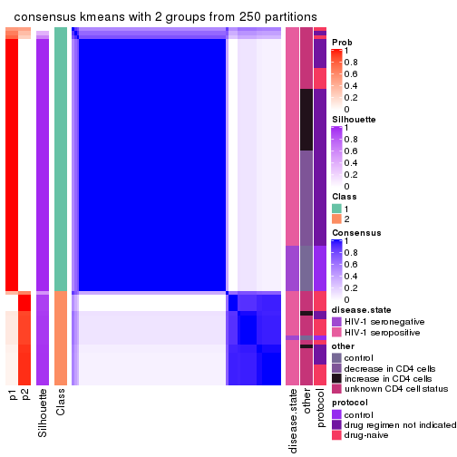</p>

</div>
<div id='tab-ATC-kmeans-consensus-heatmap-2'>
<pre><code class="r">consensus_heatmap(res, k = 3)
</code></pre>

<p>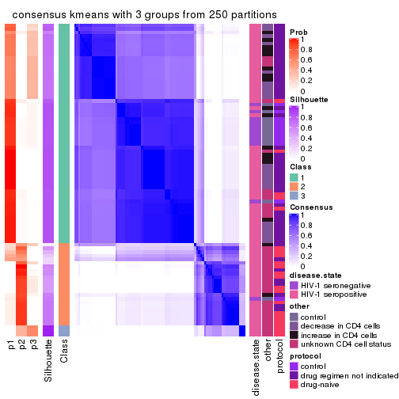</p>

</div>
<div id='tab-ATC-kmeans-consensus-heatmap-3'>
<pre><code class="r">consensus_heatmap(res, k = 4)
</code></pre>

<p>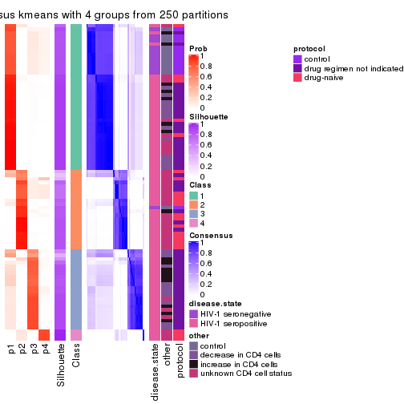</p>

</div>
<div id='tab-ATC-kmeans-consensus-heatmap-4'>
<pre><code class="r">consensus_heatmap(res, k = 5)
</code></pre>

<p>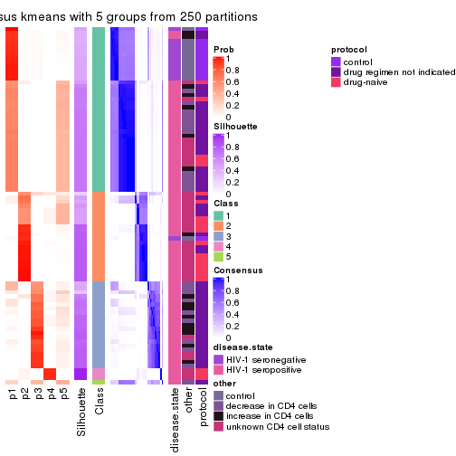</p>

</div>
<div id='tab-ATC-kmeans-consensus-heatmap-5'>
<pre><code class="r">consensus_heatmap(res, k = 6)
</code></pre>

<p>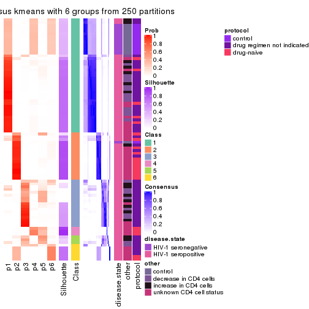</p>

</div>
</div>

Heatmaps for the membership of samples in all partitions to see how consistent they are:


<script>
$( function() {
	$( '#tabs-ATC-kmeans-membership-heatmap' ).tabs();
} );
</script>
<div id='tabs-ATC-kmeans-membership-heatmap'>
<ul>
<li><a href='#tab-ATC-kmeans-membership-heatmap-1'>k = 2</a></li>
<li><a href='#tab-ATC-kmeans-membership-heatmap-2'>k = 3</a></li>
<li><a href='#tab-ATC-kmeans-membership-heatmap-3'>k = 4</a></li>
<li><a href='#tab-ATC-kmeans-membership-heatmap-4'>k = 5</a></li>
<li><a href='#tab-ATC-kmeans-membership-heatmap-5'>k = 6</a></li>
</ul>
<div id='tab-ATC-kmeans-membership-heatmap-1'>
<pre><code class="r">membership_heatmap(res, k = 2)
</code></pre>

<p>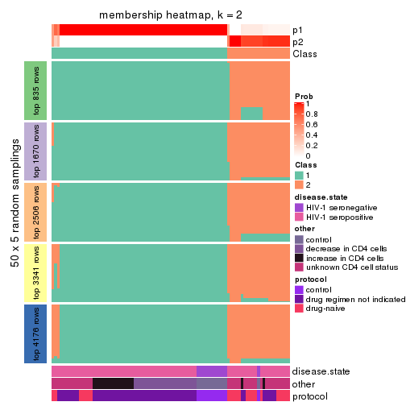</p>

</div>
<div id='tab-ATC-kmeans-membership-heatmap-2'>
<pre><code class="r">membership_heatmap(res, k = 3)
</code></pre>

<p>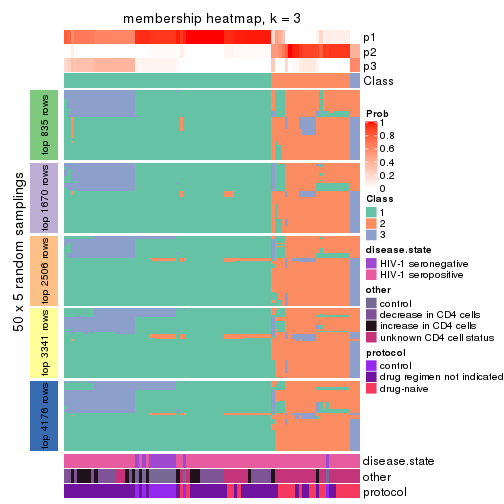</p>

</div>
<div id='tab-ATC-kmeans-membership-heatmap-3'>
<pre><code class="r">membership_heatmap(res, k = 4)
</code></pre>

<p>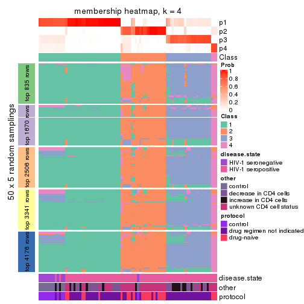</p>

</div>
<div id='tab-ATC-kmeans-membership-heatmap-4'>
<pre><code class="r">membership_heatmap(res, k = 5)
</code></pre>

<p>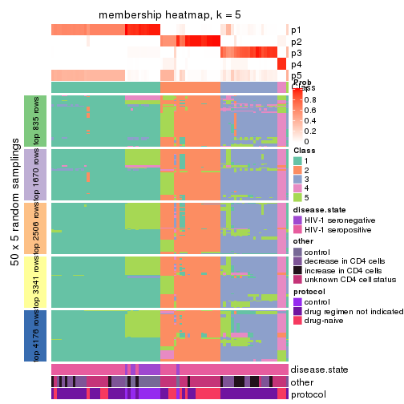</p>

</div>
<div id='tab-ATC-kmeans-membership-heatmap-5'>
<pre><code class="r">membership_heatmap(res, k = 6)
</code></pre>

<p>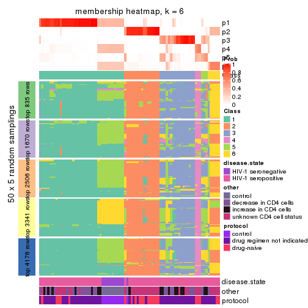</p>

</div>
</div>

As soon as we have had the classes for columns, we can look for signatures
which are significantly different between classes which can be candidate marks
for certain classes. Following are the heatmaps for signatures.


Signature heatmaps where rows are scaled:


<script>
$( function() {
	$( '#tabs-ATC-kmeans-get-signatures' ).tabs();
} );
</script>
<div id='tabs-ATC-kmeans-get-signatures'>
<ul>
<li><a href='#tab-ATC-kmeans-get-signatures-1'>k = 2</a></li>
<li><a href='#tab-ATC-kmeans-get-signatures-2'>k = 3</a></li>
<li><a href='#tab-ATC-kmeans-get-signatures-3'>k = 4</a></li>
<li><a href='#tab-ATC-kmeans-get-signatures-4'>k = 5</a></li>
<li><a href='#tab-ATC-kmeans-get-signatures-5'>k = 6</a></li>
</ul>
<div id='tab-ATC-kmeans-get-signatures-1'>
<pre><code class="r">get_signatures(res, k = 2)
</code></pre>

<p>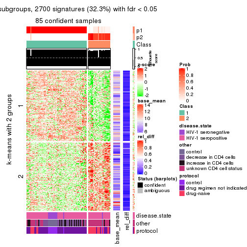</p>

</div>
<div id='tab-ATC-kmeans-get-signatures-2'>
<pre><code class="r">get_signatures(res, k = 3)
</code></pre>

<p>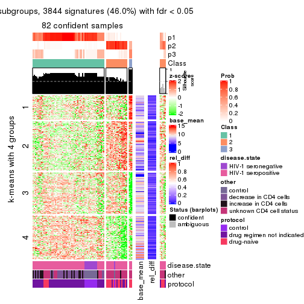</p>

</div>
<div id='tab-ATC-kmeans-get-signatures-3'>
<pre><code class="r">get_signatures(res, k = 4)
</code></pre>

<p>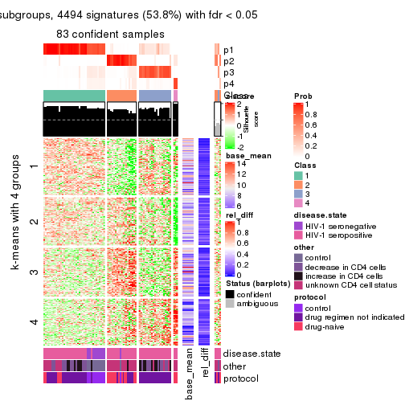</p>

</div>
<div id='tab-ATC-kmeans-get-signatures-4'>
<pre><code class="r">get_signatures(res, k = 5)
</code></pre>

<p>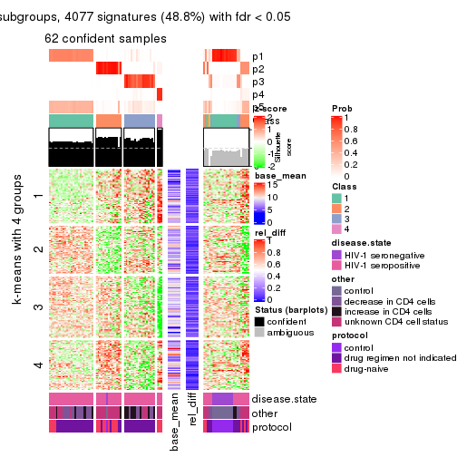</p>

</div>
<div id='tab-ATC-kmeans-get-signatures-5'>
<pre><code class="r">get_signatures(res, k = 6)
</code></pre>

<p>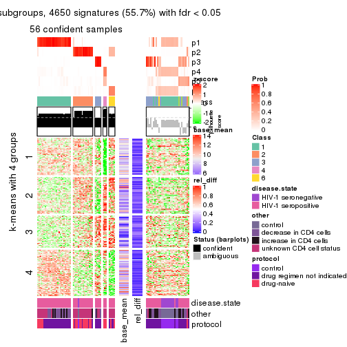</p>

</div>
</div>


Signature heatmaps where rows are not scaled:


<script>
$( function() {
	$( '#tabs-ATC-kmeans-get-signatures-no-scale' ).tabs();
} );
</script>
<div id='tabs-ATC-kmeans-get-signatures-no-scale'>
<ul>
<li><a href='#tab-ATC-kmeans-get-signatures-no-scale-1'>k = 2</a></li>
<li><a href='#tab-ATC-kmeans-get-signatures-no-scale-2'>k = 3</a></li>
<li><a href='#tab-ATC-kmeans-get-signatures-no-scale-3'>k = 4</a></li>
<li><a href='#tab-ATC-kmeans-get-signatures-no-scale-4'>k = 5</a></li>
<li><a href='#tab-ATC-kmeans-get-signatures-no-scale-5'>k = 6</a></li>
</ul>
<div id='tab-ATC-kmeans-get-signatures-no-scale-1'>
<pre><code class="r">get_signatures(res, k = 2, scale_rows = FALSE)
</code></pre>

<p>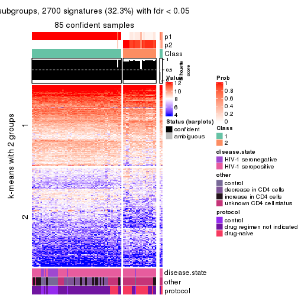</p>

</div>
<div id='tab-ATC-kmeans-get-signatures-no-scale-2'>
<pre><code class="r">get_signatures(res, k = 3, scale_rows = FALSE)
</code></pre>

<p>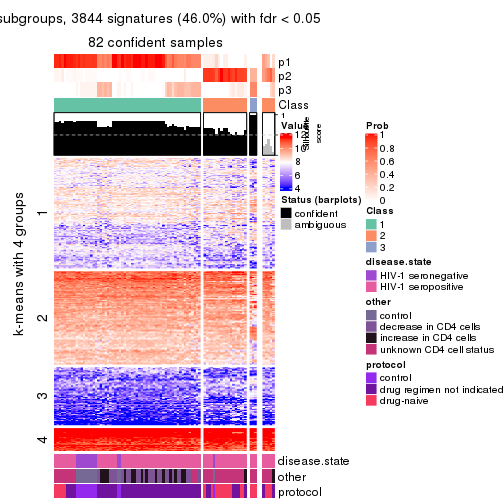</p>

</div>
<div id='tab-ATC-kmeans-get-signatures-no-scale-3'>
<pre><code class="r">get_signatures(res, k = 4, scale_rows = FALSE)
</code></pre>

<p>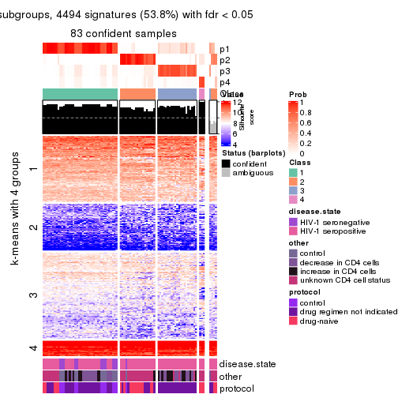</p>

</div>
<div id='tab-ATC-kmeans-get-signatures-no-scale-4'>
<pre><code class="r">get_signatures(res, k = 5, scale_rows = FALSE)
</code></pre>

<p>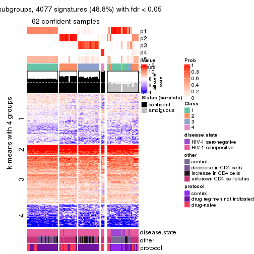</p>

</div>
<div id='tab-ATC-kmeans-get-signatures-no-scale-5'>
<pre><code class="r">get_signatures(res, k = 6, scale_rows = FALSE)
</code></pre>

<p>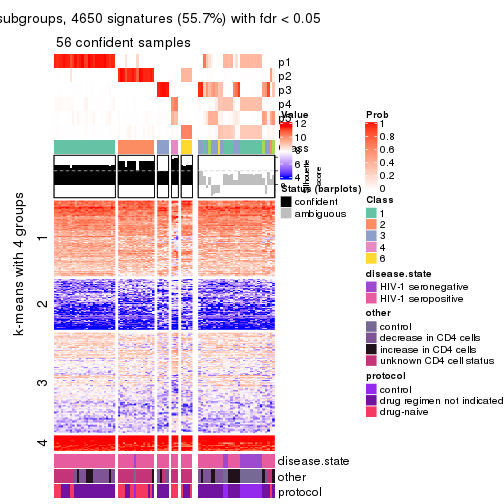</p>

</div>
</div>


Compare the overlap of signatures from different k:

```r
compare_signatures(res)
```

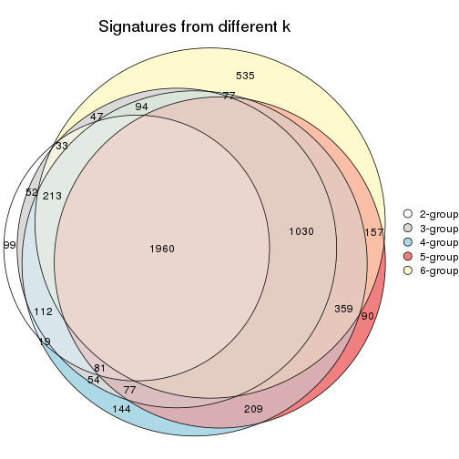

`get_signature()` returns a data frame invisibly. TO get the list of signatures, the function
call should be assigned to a variable explicitly. In following code, if `plot` argument is set
to `FALSE`, no heatmap is plotted while only the differential analysis is performed.

```r
# code only for demonstration
tb = get_signature(res, k = ..., plot = FALSE)
```

An example of the output of `tb` is:

```
#>   which_row         fdr    mean_1    mean_2 scaled_mean_1 scaled_mean_2 km
#> 1        38 0.042760348  8.373488  9.131774    -0.5533452     0.5164555  1
#> 2        40 0.018707592  7.106213  8.469186    -0.6173731     0.5762149  1
#> 3        55 0.019134737 10.221463 11.207825    -0.6159697     0.5749050  1
#> 4        59 0.006059896  5.921854  7.869574    -0.6899429     0.6439467  1
#> 5        60 0.018055526  8.928898 10.211722    -0.6204761     0.5791110  1
#> 6        98 0.009384629 15.714769 14.887706     0.6635654    -0.6193277  2
...
```

The columns in `tb` are:

1. `which_row`: row indices corresponding to the input matrix.
2. `fdr`: FDR for the differential test. 
3. `mean_x`: The mean value in group x.
4. `scaled_mean_x`: The mean value in group x after rows are scaled.
5. `km`: Row groups if k-means clustering is applied to rows.


UMAP plot which shows how samples are separated.


<script>
$( function() {
	$( '#tabs-ATC-kmeans-dimension-reduction' ).tabs();
} );
</script>
<div id='tabs-ATC-kmeans-dimension-reduction'>
<ul>
<li><a href='#tab-ATC-kmeans-dimension-reduction-1'>k = 2</a></li>
<li><a href='#tab-ATC-kmeans-dimension-reduction-2'>k = 3</a></li>
<li><a href='#tab-ATC-kmeans-dimension-reduction-3'>k = 4</a></li>
<li><a href='#tab-ATC-kmeans-dimension-reduction-4'>k = 5</a></li>
<li><a href='#tab-ATC-kmeans-dimension-reduction-5'>k = 6</a></li>
</ul>
<div id='tab-ATC-kmeans-dimension-reduction-1'>
<pre><code class="r">dimension_reduction(res, k = 2, method = &quot;UMAP&quot;)
</code></pre>

<p>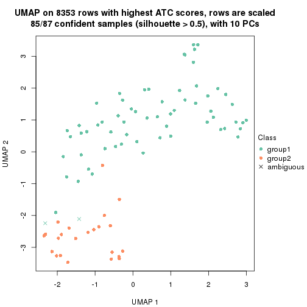</p>

</div>
<div id='tab-ATC-kmeans-dimension-reduction-2'>
<pre><code class="r">dimension_reduction(res, k = 3, method = &quot;UMAP&quot;)
</code></pre>

<p>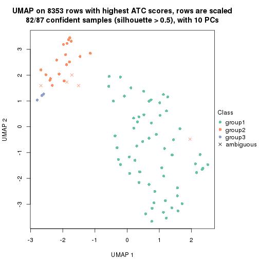</p>

</div>
<div id='tab-ATC-kmeans-dimension-reduction-3'>
<pre><code class="r">dimension_reduction(res, k = 4, method = &quot;UMAP&quot;)
</code></pre>

<p>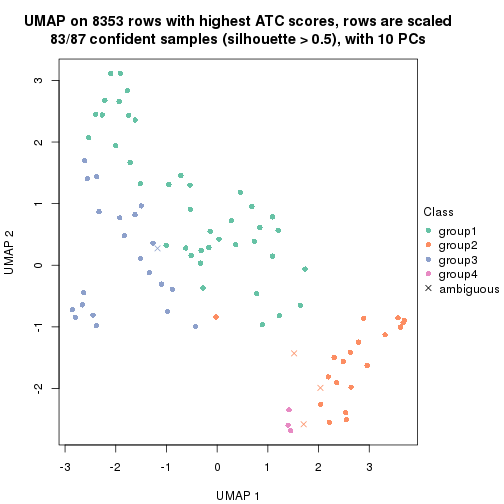</p>

</div>
<div id='tab-ATC-kmeans-dimension-reduction-4'>
<pre><code class="r">dimension_reduction(res, k = 5, method = &quot;UMAP&quot;)
</code></pre>

<p>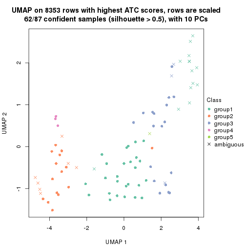</p>

</div>
<div id='tab-ATC-kmeans-dimension-reduction-5'>
<pre><code class="r">dimension_reduction(res, k = 6, method = &quot;UMAP&quot;)
</code></pre>

<p>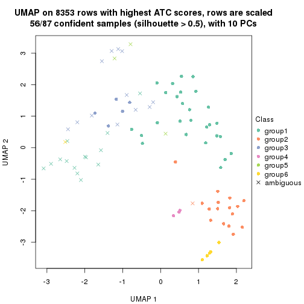</p>

</div>
</div>


Following heatmap shows how subgroups are split when increasing `k`:

```r
collect_classes(res)
```

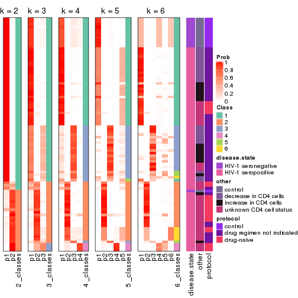


Test correlation between subgroups and known annotations. If the known
annotation is numeric, one-way ANOVA test is applied, and if the known
annotation is discrete, chi-squared contingency table test is applied.

```r
test_to_known_factors(res)
```

```
#>             n disease.state(p) other(p) protocol(p) k
#> ATC:kmeans 85           0.2206 6.68e-07    8.53e-07 2
#> ATC:kmeans 82           0.3221 7.22e-06    1.70e-06 3
#> ATC:kmeans 83           0.0125 3.24e-07    3.76e-08 4
#> ATC:kmeans 62           0.3640 1.78e-04    1.18e-05 5
#> ATC:kmeans 56           0.6365 1.93e-02    3.86e-03 6
```


If matrix rows can be associated to genes, consider to use `GO_Enrichment(res,
...)` to perform function enrichment for the signature genes.


 

---------------------------------------------------


### ATC:skmeans**


The object with results only for a single top-value method and a single partition method 
can be extracted as:

```r
res = res_list["ATC", "skmeans"]
# you can also extract it by
# res = res_list["ATC:skmeans"]
```

A summary of `res` and all the functions that can be applied to it:

```r
res
```

```
#> A 'ConsensusPartition' object with k = 2, 3, 4, 5, 6.
#>   On a matrix with 8353 rows and 87 columns.
#>   Top rows (835, 1670, 2506, 3341, 4176) are extracted by 'ATC' method.
#>   Subgroups are detected by 'skmeans' method.
#>   Performed in total 1250 partitions by row resampling.
#>   Best k for subgroups seems to be 3.
#> 
#> Following methods can be applied to this 'ConsensusPartition' object:
#>  [1] "cola_report"             "collect_classes"         "collect_plots"          
#>  [4] "collect_stats"           "colnames"                "compare_signatures"     
#>  [7] "consensus_heatmap"       "dimension_reduction"     "functional_enrichment"  
#> [10] "get_anno_col"            "get_anno"                "get_classes"            
#> [13] "get_consensus"           "get_matrix"              "get_membership"         
#> [16] "get_param"               "get_signatures"          "get_stats"              
#> [19] "is_best_k"               "is_stable_k"             "membership_heatmap"     
#> [22] "ncol"                    "nrow"                    "plot_ecdf"              
#> [25] "rownames"                "select_partition_number" "show"                   
#> [28] "suggest_best_k"          "test_to_known_factors"
```

`collect_plots()` function collects all the plots made from `res` for all `k` (number of partitions)
into one single page to provide an easy and fast comparison between different `k`.

```r
collect_plots(res)
```

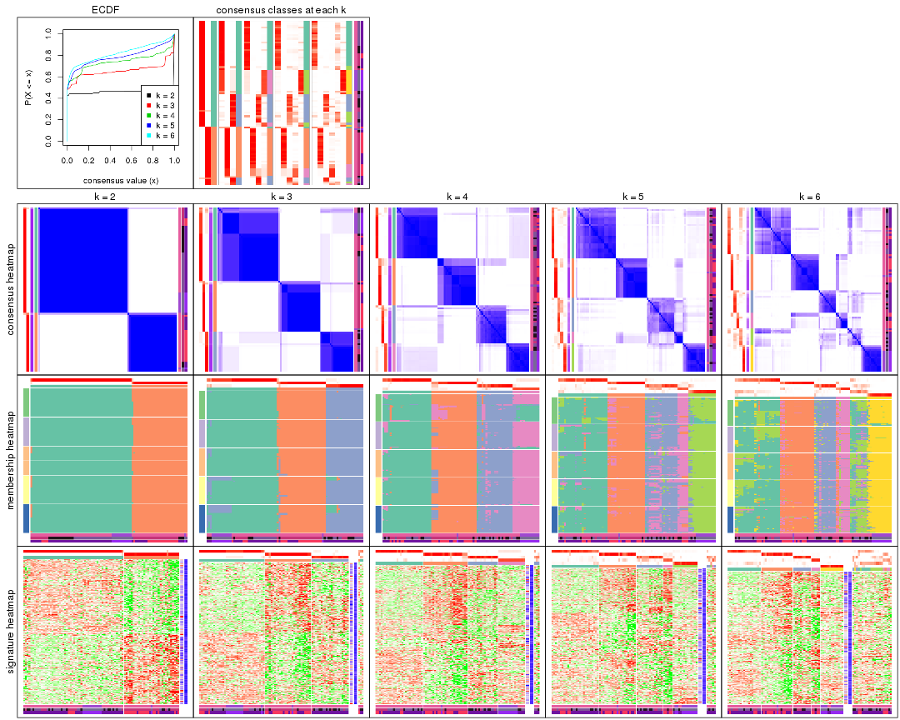

The plots are:

- The first row: a plot of the ECDF (Empirical cumulative distribution
  function) curves of the consensus matrix for each `k` and the heatmap of
  predicted classes for each `k`.
- The second row: heatmaps of the consensus matrix for each `k`.
- The third row: heatmaps of the membership matrix for each `k`.
- The fouth row: heatmaps of the signatures for each `k`.

All the plots in panels can be made by individual functions and they are
plotted later in this section.

`select_partition_number()` produces several plots showing different
statistics for choosing "optimized" `k`. There are following statistics:

- ECDF curves of the consensus matrix for each `k`;
- 1-PAC. [The PAC
  score](https://en.wikipedia.org/wiki/Consensus_clustering#Over-interpretation_potential_of_consensus_clustering)
  measures the proportion of the ambiguous subgrouping.
- Mean silhouette score.
- Concordance. The mean probability of fiting the consensus class ids in all
  partitions.
- Area increased. Denote $A_k$ as the area under the ECDF curve for current
  `k`, the area increased is defined as $A_k - A_{k-1}$.
- Rand index. The percent of pairs of samples that are both in a same cluster
  or both are not in a same cluster in the partition of k and k-1.
- Jaccard index. The ratio of pairs of samples are both in a same cluster in
  the partition of k and k-1 and the pairs of samples are both in a same
  cluster in the partition k or k-1.

The detailed explanations of these statistics can be found in [the cola
vignette](http://bioconductor.org/packages/devel/bioc/vignettes/cola/inst/doc/cola.html#toc_13).

Generally speaking, lower PAC score, higher mean silhouette score or higher
concordance corresponds to better partition. Rand index and Jaccard index
measure how similar the current partition is compared to partition with `k-1`.
If they are too similar, we won't accept `k` is better than `k-1`.

```r
select_partition_number(res)
```

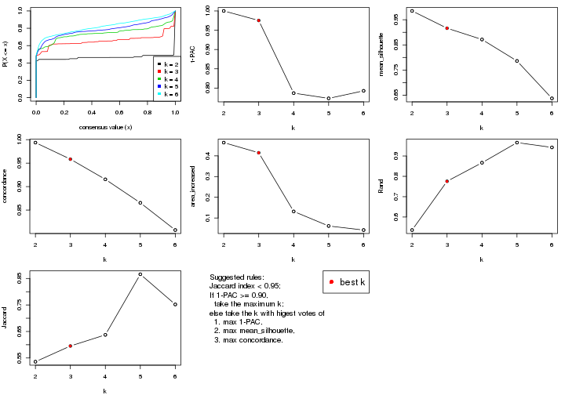

The numeric values for all these statistics can be obtained by `get_stats()`.

```r
get_stats(res)
```

```
#>   k 1-PAC mean_silhouette concordance area_increased  Rand Jaccard
#> 2 2 1.000           0.985       0.994         0.4639 0.536   0.536
#> 3 3 0.975           0.916       0.958         0.4150 0.776   0.595
#> 4 4 0.787           0.871       0.915         0.1317 0.867   0.637
#> 5 5 0.773           0.786       0.865         0.0615 0.966   0.866
#> 6 6 0.793           0.637       0.807         0.0419 0.942   0.752
```

`suggest_best_k()` suggests the best $k$ based on these statistics. The rules are as follows:

- All $k$ with Jaccard index larger than 0.95 are removed because the increase of
  the partition number does not provides enough extra information. If all $k$ are removed,
  the best $k$ is assigned by `NA`.
- For $k$ with 1-PAC larger than 0.9, the maximal $k$ is taken as the "best k". Other $k$ is called "optional k".
- If it does not fit the second rule. The $k$ with the highest vote of highest
  1-PAC, mean silhouette and concordance is taken as the "best k".

```r
suggest_best_k(res)
```

```
#> [1] 3
#> attr(,"optional")
#> [1] 2
```

There is also optional best $k$ = 2 that is worth to check.

Following shows the table of the partitions (You need to click the **show/hide
code output** link to see it). The membership matrix (columns with name `p*`)
is inferred by
[`clue::cl_consensus()`](https://www.rdocumentation.org/link/cl_consensus?package=clue)
function with the `SE` method. Basically the value in the membership matrix
represents the probability to belong to a certain group. The finall class
label for an item is determined with the group with highest probability it
belongs to.

In `get_classes()` function, the entropy is calculated from the membership
matrix and the silhouette score is calculated from the consensus matrix.


<script>
$( function() {
	$( '#tabs-ATC-skmeans-get-classes' ).tabs();
} );
</script>
<div id='tabs-ATC-skmeans-get-classes'>
<ul>
<li><a href='#tab-ATC-skmeans-get-classes-1'>k = 2</a></li>
<li><a href='#tab-ATC-skmeans-get-classes-2'>k = 3</a></li>
<li><a href='#tab-ATC-skmeans-get-classes-3'>k = 4</a></li>
<li><a href='#tab-ATC-skmeans-get-classes-4'>k = 5</a></li>
<li><a href='#tab-ATC-skmeans-get-classes-5'>k = 6</a></li>
</ul>

<div id='tab-ATC-skmeans-get-classes-1'>
<p><a id='tab-ATC-skmeans-get-classes-1-a' style='color:#0366d6' href='#'>show/hide code output</a></p>
<pre><code class="r">cbind(get_classes(res, k = 2), get_membership(res, k = 2))
</code></pre>

<pre><code>#&gt;          class entropy silhouette    p1    p2
#&gt; GSM39104     1   0.000      0.996 1.000 0.000
#&gt; GSM39105     1   0.000      0.996 1.000 0.000
#&gt; GSM39106     1   0.000      0.996 1.000 0.000
#&gt; GSM39107     1   0.000      0.996 1.000 0.000
#&gt; GSM39108     1   0.000      0.996 1.000 0.000
#&gt; GSM39109     1   0.000      0.996 1.000 0.000
#&gt; GSM39110     1   0.000      0.996 1.000 0.000
#&gt; GSM39111     1   0.000      0.996 1.000 0.000
#&gt; GSM39112     1   0.000      0.996 1.000 0.000
#&gt; GSM39113     1   0.000      0.996 1.000 0.000
#&gt; GSM39114     2   0.000      0.989 0.000 1.000
#&gt; GSM39115     1   0.000      0.996 1.000 0.000
#&gt; GSM39148     1   0.000      0.996 1.000 0.000
#&gt; GSM39149     1   0.000      0.996 1.000 0.000
#&gt; GSM39150     1   0.000      0.996 1.000 0.000
#&gt; GSM39151     2   0.876      0.575 0.296 0.704
#&gt; GSM39152     1   0.000      0.996 1.000 0.000
#&gt; GSM39153     1   0.000      0.996 1.000 0.000
#&gt; GSM39154     1   0.000      0.996 1.000 0.000
#&gt; GSM39155     1   0.000      0.996 1.000 0.000
#&gt; GSM39156     1   0.000      0.996 1.000 0.000
#&gt; GSM39157     1   0.000      0.996 1.000 0.000
#&gt; GSM39158     1   0.000      0.996 1.000 0.000
#&gt; GSM39159     1   0.000      0.996 1.000 0.000
#&gt; GSM39160     1   0.000      0.996 1.000 0.000
#&gt; GSM39161     2   0.000      0.989 0.000 1.000
#&gt; GSM39162     1   0.000      0.996 1.000 0.000
#&gt; GSM39163     1   0.000      0.996 1.000 0.000
#&gt; GSM39164     1   0.000      0.996 1.000 0.000
#&gt; GSM39165     1   0.000      0.996 1.000 0.000
#&gt; GSM39166     1   0.000      0.996 1.000 0.000
#&gt; GSM39167     1   0.000      0.996 1.000 0.000
#&gt; GSM39168     1   0.000      0.996 1.000 0.000
#&gt; GSM39169     1   0.000      0.996 1.000 0.000
#&gt; GSM39170     1   0.000      0.996 1.000 0.000
#&gt; GSM39171     1   0.000      0.996 1.000 0.000
#&gt; GSM39172     1   0.000      0.996 1.000 0.000
#&gt; GSM39173     2   0.000      0.989 0.000 1.000
#&gt; GSM39174     1   0.000      0.996 1.000 0.000
#&gt; GSM39175     1   0.000      0.996 1.000 0.000
#&gt; GSM39176     1   0.000      0.996 1.000 0.000
#&gt; GSM39177     1   0.000      0.996 1.000 0.000
#&gt; GSM39178     1   0.000      0.996 1.000 0.000
#&gt; GSM39179     1   0.000      0.996 1.000 0.000
#&gt; GSM39180     2   0.000      0.989 0.000 1.000
#&gt; GSM39181     1   0.000      0.996 1.000 0.000
#&gt; GSM39182     1   0.000      0.996 1.000 0.000
#&gt; GSM39183     1   0.000      0.996 1.000 0.000
#&gt; GSM39184     1   0.000      0.996 1.000 0.000
#&gt; GSM39185     2   0.000      0.989 0.000 1.000
#&gt; GSM39186     1   0.000      0.996 1.000 0.000
#&gt; GSM39187     1   0.000      0.996 1.000 0.000
#&gt; GSM39116     2   0.000      0.989 0.000 1.000
#&gt; GSM39117     2   0.000      0.989 0.000 1.000
#&gt; GSM39118     2   0.000      0.989 0.000 1.000
#&gt; GSM39119     2   0.000      0.989 0.000 1.000
#&gt; GSM39120     1   0.000      0.996 1.000 0.000
#&gt; GSM39121     1   0.000      0.996 1.000 0.000
#&gt; GSM39122     1   0.000      0.996 1.000 0.000
#&gt; GSM39123     2   0.000      0.989 0.000 1.000
#&gt; GSM39124     2   0.000      0.989 0.000 1.000
#&gt; GSM39125     1   0.000      0.996 1.000 0.000
#&gt; GSM39126     2   0.118      0.974 0.016 0.984
#&gt; GSM39127     2   0.000      0.989 0.000 1.000
#&gt; GSM39128     2   0.000      0.989 0.000 1.000
#&gt; GSM39129     2   0.000      0.989 0.000 1.000
#&gt; GSM39130     2   0.000      0.989 0.000 1.000
#&gt; GSM39131     2   0.000      0.989 0.000 1.000
#&gt; GSM39132     2   0.000      0.989 0.000 1.000
#&gt; GSM39133     2   0.000      0.989 0.000 1.000
#&gt; GSM39134     2   0.000      0.989 0.000 1.000
#&gt; GSM39135     2   0.000      0.989 0.000 1.000
#&gt; GSM39136     2   0.000      0.989 0.000 1.000
#&gt; GSM39137     2   0.000      0.989 0.000 1.000
#&gt; GSM39138     2   0.000      0.989 0.000 1.000
#&gt; GSM39139     2   0.000      0.989 0.000 1.000
#&gt; GSM39140     1   0.000      0.996 1.000 0.000
#&gt; GSM39141     1   0.000      0.996 1.000 0.000
#&gt; GSM39142     1   0.000      0.996 1.000 0.000
#&gt; GSM39143     1   0.000      0.996 1.000 0.000
#&gt; GSM39144     2   0.000      0.989 0.000 1.000
#&gt; GSM39145     2   0.000      0.989 0.000 1.000
#&gt; GSM39146     2   0.000      0.989 0.000 1.000
#&gt; GSM39147     2   0.000      0.989 0.000 1.000
#&gt; GSM39188     2   0.000      0.989 0.000 1.000
#&gt; GSM39189     1   0.000      0.996 1.000 0.000
#&gt; GSM39190     1   0.788      0.686 0.764 0.236
</code></pre>

<script>
$('#tab-ATC-skmeans-get-classes-1-a').parent().next().next().hide();
$('#tab-ATC-skmeans-get-classes-1-a').click(function(){
  $('#tab-ATC-skmeans-get-classes-1-a').parent().next().next().toggle();
  return(false);
});
</script>
</div>

<div id='tab-ATC-skmeans-get-classes-2'>
<p><a id='tab-ATC-skmeans-get-classes-2-a' style='color:#0366d6' href='#'>show/hide code output</a></p>
<pre><code class="r">cbind(get_classes(res, k = 3), get_membership(res, k = 3))
</code></pre>

<pre><code>#&gt;          class entropy silhouette    p1    p2    p3
#&gt; GSM39104     1  0.2711      0.912 0.912 0.000 0.088
#&gt; GSM39105     1  0.2711      0.912 0.912 0.000 0.088
#&gt; GSM39106     1  0.2711      0.912 0.912 0.000 0.088
#&gt; GSM39107     1  0.2711      0.912 0.912 0.000 0.088
#&gt; GSM39108     1  0.2711      0.912 0.912 0.000 0.088
#&gt; GSM39109     1  0.2711      0.912 0.912 0.000 0.088
#&gt; GSM39110     1  0.2711      0.912 0.912 0.000 0.088
#&gt; GSM39111     1  0.2711      0.912 0.912 0.000 0.088
#&gt; GSM39112     1  0.2711      0.912 0.912 0.000 0.088
#&gt; GSM39113     1  0.2711      0.912 0.912 0.000 0.088
#&gt; GSM39114     2  0.0000      0.960 0.000 1.000 0.000
#&gt; GSM39115     1  0.2711      0.912 0.912 0.000 0.088
#&gt; GSM39148     1  0.0000      0.946 1.000 0.000 0.000
#&gt; GSM39149     3  0.0000      0.960 0.000 0.000 1.000
#&gt; GSM39150     3  0.0237      0.958 0.004 0.000 0.996
#&gt; GSM39151     3  0.0000      0.960 0.000 0.000 1.000
#&gt; GSM39152     3  0.0000      0.960 0.000 0.000 1.000
#&gt; GSM39153     1  0.0000      0.946 1.000 0.000 0.000
#&gt; GSM39154     1  0.0000      0.946 1.000 0.000 0.000
#&gt; GSM39155     1  0.0000      0.946 1.000 0.000 0.000
#&gt; GSM39156     1  0.0000      0.946 1.000 0.000 0.000
#&gt; GSM39157     1  0.0000      0.946 1.000 0.000 0.000
#&gt; GSM39158     3  0.2711      0.921 0.088 0.000 0.912
#&gt; GSM39159     3  0.2711      0.921 0.088 0.000 0.912
#&gt; GSM39160     3  0.0000      0.960 0.000 0.000 1.000
#&gt; GSM39161     3  0.2056      0.942 0.024 0.024 0.952
#&gt; GSM39162     1  0.0000      0.946 1.000 0.000 0.000
#&gt; GSM39163     1  0.0000      0.946 1.000 0.000 0.000
#&gt; GSM39164     1  0.0000      0.946 1.000 0.000 0.000
#&gt; GSM39165     3  0.3267      0.900 0.116 0.000 0.884
#&gt; GSM39166     3  0.0000      0.960 0.000 0.000 1.000
#&gt; GSM39167     1  0.0000      0.946 1.000 0.000 0.000
#&gt; GSM39168     1  0.0000      0.946 1.000 0.000 0.000
#&gt; GSM39169     1  0.0000      0.946 1.000 0.000 0.000
#&gt; GSM39170     1  0.0000      0.946 1.000 0.000 0.000
#&gt; GSM39171     1  0.6192      0.393 0.580 0.000 0.420
#&gt; GSM39172     3  0.0000      0.960 0.000 0.000 1.000
#&gt; GSM39173     2  0.0000      0.960 0.000 1.000 0.000
#&gt; GSM39174     1  0.0000      0.946 1.000 0.000 0.000
#&gt; GSM39175     1  0.5760      0.490 0.672 0.000 0.328
#&gt; GSM39176     1  0.0000      0.946 1.000 0.000 0.000
#&gt; GSM39177     3  0.2711      0.921 0.088 0.000 0.912
#&gt; GSM39178     3  0.0000      0.960 0.000 0.000 1.000
#&gt; GSM39179     3  0.0000      0.960 0.000 0.000 1.000
#&gt; GSM39180     2  0.5760      0.505 0.000 0.672 0.328
#&gt; GSM39181     3  0.2711      0.921 0.088 0.000 0.912
#&gt; GSM39182     3  0.2711      0.921 0.088 0.000 0.912
#&gt; GSM39183     3  0.0000      0.960 0.000 0.000 1.000
#&gt; GSM39184     1  0.0000      0.946 1.000 0.000 0.000
#&gt; GSM39185     3  0.3038      0.876 0.000 0.104 0.896
#&gt; GSM39186     1  0.5058      0.742 0.756 0.000 0.244
#&gt; GSM39187     1  0.0237      0.944 0.996 0.000 0.004
#&gt; GSM39116     2  0.0000      0.960 0.000 1.000 0.000
#&gt; GSM39117     2  0.1529      0.933 0.000 0.960 0.040
#&gt; GSM39118     2  0.0000      0.960 0.000 1.000 0.000
#&gt; GSM39119     2  0.0000      0.960 0.000 1.000 0.000
#&gt; GSM39120     1  0.0000      0.946 1.000 0.000 0.000
#&gt; GSM39121     1  0.0000      0.946 1.000 0.000 0.000
#&gt; GSM39122     1  0.0000      0.946 1.000 0.000 0.000
#&gt; GSM39123     2  0.1529      0.933 0.000 0.960 0.040
#&gt; GSM39124     2  0.0000      0.960 0.000 1.000 0.000
#&gt; GSM39125     1  0.0237      0.944 0.996 0.000 0.004
#&gt; GSM39126     2  0.6267      0.199 0.452 0.548 0.000
#&gt; GSM39127     2  0.0000      0.960 0.000 1.000 0.000
#&gt; GSM39128     2  0.0000      0.960 0.000 1.000 0.000
#&gt; GSM39129     2  0.0000      0.960 0.000 1.000 0.000
#&gt; GSM39130     2  0.1529      0.933 0.000 0.960 0.040
#&gt; GSM39131     2  0.0000      0.960 0.000 1.000 0.000
#&gt; GSM39132     2  0.0000      0.960 0.000 1.000 0.000
#&gt; GSM39133     2  0.1529      0.933 0.000 0.960 0.040
#&gt; GSM39134     2  0.0000      0.960 0.000 1.000 0.000
#&gt; GSM39135     2  0.0000      0.960 0.000 1.000 0.000
#&gt; GSM39136     2  0.0000      0.960 0.000 1.000 0.000
#&gt; GSM39137     2  0.0000      0.960 0.000 1.000 0.000
#&gt; GSM39138     2  0.0000      0.960 0.000 1.000 0.000
#&gt; GSM39139     2  0.0000      0.960 0.000 1.000 0.000
#&gt; GSM39140     1  0.0000      0.946 1.000 0.000 0.000
#&gt; GSM39141     1  0.0000      0.946 1.000 0.000 0.000
#&gt; GSM39142     1  0.0000      0.946 1.000 0.000 0.000
#&gt; GSM39143     1  0.0000      0.946 1.000 0.000 0.000
#&gt; GSM39144     2  0.0000      0.960 0.000 1.000 0.000
#&gt; GSM39145     2  0.0000      0.960 0.000 1.000 0.000
#&gt; GSM39146     2  0.0000      0.960 0.000 1.000 0.000
#&gt; GSM39147     2  0.0000      0.960 0.000 1.000 0.000
#&gt; GSM39188     3  0.0000      0.960 0.000 0.000 1.000
#&gt; GSM39189     3  0.0000      0.960 0.000 0.000 1.000
#&gt; GSM39190     3  0.0000      0.960 0.000 0.000 1.000
</code></pre>

<script>
$('#tab-ATC-skmeans-get-classes-2-a').parent().next().next().hide();
$('#tab-ATC-skmeans-get-classes-2-a').click(function(){
  $('#tab-ATC-skmeans-get-classes-2-a').parent().next().next().toggle();
  return(false);
});
</script>
</div>

<div id='tab-ATC-skmeans-get-classes-3'>
<p><a id='tab-ATC-skmeans-get-classes-3-a' style='color:#0366d6' href='#'>show/hide code output</a></p>
<pre><code class="r">cbind(get_classes(res, k = 4), get_membership(res, k = 4))
</code></pre>

<pre><code>#&gt;          class entropy silhouette    p1    p2    p3    p4
#&gt; GSM39104     4  0.2831     0.9552 0.120 0.000 0.004 0.876
#&gt; GSM39105     4  0.2760     0.9564 0.128 0.000 0.000 0.872
#&gt; GSM39106     4  0.2868     0.9548 0.136 0.000 0.000 0.864
#&gt; GSM39107     4  0.3074     0.9451 0.152 0.000 0.000 0.848
#&gt; GSM39108     4  0.2868     0.9551 0.136 0.000 0.000 0.864
#&gt; GSM39109     4  0.2704     0.9565 0.124 0.000 0.000 0.876
#&gt; GSM39110     4  0.2921     0.9527 0.140 0.000 0.000 0.860
#&gt; GSM39111     4  0.2760     0.9564 0.128 0.000 0.000 0.872
#&gt; GSM39112     4  0.2868     0.9551 0.136 0.000 0.000 0.864
#&gt; GSM39113     4  0.2814     0.9558 0.132 0.000 0.000 0.868
#&gt; GSM39114     2  0.0336     0.9157 0.000 0.992 0.000 0.008
#&gt; GSM39115     4  0.2814     0.9555 0.132 0.000 0.000 0.868
#&gt; GSM39148     1  0.0000     0.9552 1.000 0.000 0.000 0.000
#&gt; GSM39149     3  0.4730     0.4234 0.000 0.000 0.636 0.364
#&gt; GSM39150     4  0.2999     0.8030 0.004 0.000 0.132 0.864
#&gt; GSM39151     3  0.0188     0.8859 0.000 0.000 0.996 0.004
#&gt; GSM39152     3  0.1637     0.8670 0.000 0.000 0.940 0.060
#&gt; GSM39153     1  0.0336     0.9563 0.992 0.000 0.000 0.008
#&gt; GSM39154     1  0.0469     0.9551 0.988 0.000 0.000 0.012
#&gt; GSM39155     1  0.3942     0.6759 0.764 0.000 0.000 0.236
#&gt; GSM39156     1  0.0336     0.9563 0.992 0.000 0.000 0.008
#&gt; GSM39157     1  0.0336     0.9563 0.992 0.000 0.000 0.008
#&gt; GSM39158     3  0.2197     0.8616 0.048 0.000 0.928 0.024
#&gt; GSM39159     3  0.0657     0.8848 0.012 0.000 0.984 0.004
#&gt; GSM39160     4  0.3486     0.7342 0.000 0.000 0.188 0.812
#&gt; GSM39161     3  0.0921     0.8792 0.000 0.000 0.972 0.028
#&gt; GSM39162     1  0.0000     0.9552 1.000 0.000 0.000 0.000
#&gt; GSM39163     1  0.0469     0.9551 0.988 0.000 0.000 0.012
#&gt; GSM39164     1  0.0592     0.9531 0.984 0.000 0.000 0.016
#&gt; GSM39165     3  0.5404     0.0656 0.476 0.000 0.512 0.012
#&gt; GSM39166     3  0.2704     0.8254 0.000 0.000 0.876 0.124
#&gt; GSM39167     1  0.0469     0.9551 0.988 0.000 0.000 0.012
#&gt; GSM39168     1  0.0336     0.9563 0.992 0.000 0.000 0.008
#&gt; GSM39169     1  0.3444     0.7667 0.816 0.000 0.000 0.184
#&gt; GSM39170     1  0.0188     0.9542 0.996 0.000 0.000 0.004
#&gt; GSM39171     4  0.3525     0.9270 0.100 0.000 0.040 0.860
#&gt; GSM39172     3  0.0188     0.8856 0.000 0.000 0.996 0.004
#&gt; GSM39173     2  0.0000     0.9194 0.000 1.000 0.000 0.000
#&gt; GSM39174     1  0.0336     0.9563 0.992 0.000 0.000 0.008
#&gt; GSM39175     1  0.2222     0.8994 0.924 0.000 0.060 0.016
#&gt; GSM39176     1  0.0336     0.9563 0.992 0.000 0.000 0.008
#&gt; GSM39177     3  0.2480     0.8337 0.088 0.000 0.904 0.008
#&gt; GSM39178     3  0.3024     0.7935 0.000 0.000 0.852 0.148
#&gt; GSM39179     3  0.0469     0.8853 0.000 0.000 0.988 0.012
#&gt; GSM39180     3  0.6327     0.4783 0.000 0.228 0.648 0.124
#&gt; GSM39181     3  0.0804     0.8857 0.008 0.000 0.980 0.012
#&gt; GSM39182     3  0.0592     0.8840 0.000 0.000 0.984 0.016
#&gt; GSM39183     3  0.0336     0.8851 0.000 0.000 0.992 0.008
#&gt; GSM39184     1  0.3400     0.7712 0.820 0.000 0.000 0.180
#&gt; GSM39185     3  0.2888     0.8160 0.000 0.004 0.872 0.124
#&gt; GSM39186     4  0.3160     0.9445 0.108 0.000 0.020 0.872
#&gt; GSM39187     1  0.0469     0.9551 0.988 0.000 0.000 0.012
#&gt; GSM39116     2  0.2149     0.8928 0.000 0.912 0.000 0.088
#&gt; GSM39117     2  0.6685     0.5492 0.000 0.592 0.284 0.124
#&gt; GSM39118     2  0.2149     0.8925 0.000 0.912 0.000 0.088
#&gt; GSM39119     2  0.2149     0.8925 0.000 0.912 0.000 0.088
#&gt; GSM39120     1  0.0188     0.9542 0.996 0.000 0.000 0.004
#&gt; GSM39121     1  0.0188     0.9538 0.996 0.004 0.000 0.000
#&gt; GSM39122     1  0.0524     0.9506 0.988 0.008 0.000 0.004
#&gt; GSM39123     2  0.6685     0.5492 0.000 0.592 0.284 0.124
#&gt; GSM39124     2  0.0000     0.9194 0.000 1.000 0.000 0.000
#&gt; GSM39125     1  0.0188     0.9542 0.996 0.000 0.000 0.004
#&gt; GSM39126     1  0.3626     0.7448 0.812 0.184 0.000 0.004
#&gt; GSM39127     2  0.0000     0.9194 0.000 1.000 0.000 0.000
#&gt; GSM39128     2  0.0000     0.9194 0.000 1.000 0.000 0.000
#&gt; GSM39129     2  0.0469     0.9186 0.000 0.988 0.000 0.012
#&gt; GSM39130     2  0.6685     0.5492 0.000 0.592 0.284 0.124
#&gt; GSM39131     2  0.0000     0.9194 0.000 1.000 0.000 0.000
#&gt; GSM39132     2  0.0000     0.9194 0.000 1.000 0.000 0.000
#&gt; GSM39133     2  0.6685     0.5492 0.000 0.592 0.284 0.124
#&gt; GSM39134     2  0.0469     0.9186 0.000 0.988 0.000 0.012
#&gt; GSM39135     2  0.0336     0.9191 0.000 0.992 0.000 0.008
#&gt; GSM39136     2  0.2281     0.8883 0.000 0.904 0.000 0.096
#&gt; GSM39137     2  0.0000     0.9194 0.000 1.000 0.000 0.000
#&gt; GSM39138     2  0.0469     0.9186 0.000 0.988 0.000 0.012
#&gt; GSM39139     2  0.0000     0.9194 0.000 1.000 0.000 0.000
#&gt; GSM39140     1  0.0657     0.9463 0.984 0.012 0.000 0.004
#&gt; GSM39141     1  0.0000     0.9552 1.000 0.000 0.000 0.000
#&gt; GSM39142     1  0.0336     0.9563 0.992 0.000 0.000 0.008
#&gt; GSM39143     1  0.0188     0.9545 0.996 0.000 0.000 0.004
#&gt; GSM39144     2  0.0469     0.9186 0.000 0.988 0.000 0.012
#&gt; GSM39145     2  0.0000     0.9194 0.000 1.000 0.000 0.000
#&gt; GSM39146     2  0.1716     0.9007 0.000 0.936 0.000 0.064
#&gt; GSM39147     2  0.0000     0.9194 0.000 1.000 0.000 0.000
#&gt; GSM39188     3  0.0469     0.8860 0.000 0.000 0.988 0.012
#&gt; GSM39189     3  0.1637     0.8657 0.000 0.000 0.940 0.060
#&gt; GSM39190     3  0.0188     0.8859 0.000 0.000 0.996 0.004
</code></pre>

<script>
$('#tab-ATC-skmeans-get-classes-3-a').parent().next().next().hide();
$('#tab-ATC-skmeans-get-classes-3-a').click(function(){
  $('#tab-ATC-skmeans-get-classes-3-a').parent().next().next().toggle();
  return(false);
});
</script>
</div>

<div id='tab-ATC-skmeans-get-classes-4'>
<p><a id='tab-ATC-skmeans-get-classes-4-a' style='color:#0366d6' href='#'>show/hide code output</a></p>
<pre><code class="r">cbind(get_classes(res, k = 5), get_membership(res, k = 5))
</code></pre>

<pre><code>#&gt;          class entropy silhouette    p1    p2    p3    p4    p5
#&gt; GSM39104     5  0.1012      0.906 0.020 0.000 0.012 0.000 0.968
#&gt; GSM39105     5  0.1282      0.897 0.044 0.000 0.000 0.004 0.952
#&gt; GSM39106     5  0.0703      0.906 0.024 0.000 0.000 0.000 0.976
#&gt; GSM39107     5  0.1282      0.893 0.044 0.000 0.004 0.000 0.952
#&gt; GSM39108     5  0.0703      0.906 0.024 0.000 0.000 0.000 0.976
#&gt; GSM39109     5  0.0609      0.907 0.020 0.000 0.000 0.000 0.980
#&gt; GSM39110     5  0.0963      0.895 0.036 0.000 0.000 0.000 0.964
#&gt; GSM39111     5  0.0880      0.904 0.032 0.000 0.000 0.000 0.968
#&gt; GSM39112     5  0.0703      0.906 0.024 0.000 0.000 0.000 0.976
#&gt; GSM39113     5  0.0609      0.907 0.020 0.000 0.000 0.000 0.980
#&gt; GSM39114     2  0.0290      0.919 0.000 0.992 0.000 0.000 0.008
#&gt; GSM39115     5  0.0963      0.903 0.036 0.000 0.000 0.000 0.964
#&gt; GSM39148     1  0.0865      0.885 0.972 0.000 0.000 0.004 0.024
#&gt; GSM39149     3  0.3106      0.646 0.000 0.000 0.840 0.020 0.140
#&gt; GSM39150     5  0.3123      0.777 0.000 0.000 0.160 0.012 0.828
#&gt; GSM39151     3  0.1638      0.709 0.000 0.000 0.932 0.064 0.004
#&gt; GSM39152     3  0.1168      0.713 0.000 0.000 0.960 0.032 0.008
#&gt; GSM39153     1  0.1612      0.884 0.948 0.000 0.016 0.024 0.012
#&gt; GSM39154     1  0.3474      0.848 0.856 0.000 0.052 0.068 0.024
#&gt; GSM39155     1  0.5903      0.610 0.636 0.000 0.044 0.064 0.256
#&gt; GSM39156     1  0.1806      0.883 0.940 0.000 0.016 0.028 0.016
#&gt; GSM39157     1  0.0854      0.887 0.976 0.000 0.004 0.008 0.012
#&gt; GSM39158     3  0.5905      0.503 0.044 0.000 0.532 0.392 0.032
#&gt; GSM39159     3  0.5318      0.590 0.052 0.000 0.616 0.324 0.008
#&gt; GSM39160     5  0.4811      0.191 0.000 0.000 0.452 0.020 0.528
#&gt; GSM39161     3  0.4425      0.443 0.000 0.000 0.544 0.452 0.004
#&gt; GSM39162     1  0.0865      0.885 0.972 0.000 0.000 0.004 0.024
#&gt; GSM39163     1  0.2568      0.871 0.904 0.000 0.032 0.048 0.016
#&gt; GSM39164     1  0.2086      0.881 0.928 0.000 0.016 0.028 0.028
#&gt; GSM39165     3  0.5760      0.425 0.280 0.000 0.620 0.084 0.016
#&gt; GSM39166     3  0.5289      0.591 0.000 0.000 0.616 0.312 0.072
#&gt; GSM39167     1  0.3656      0.840 0.844 0.000 0.052 0.080 0.024
#&gt; GSM39168     1  0.0955      0.886 0.968 0.000 0.000 0.004 0.028
#&gt; GSM39169     1  0.3635      0.694 0.748 0.000 0.000 0.004 0.248
#&gt; GSM39170     1  0.1243      0.881 0.960 0.000 0.004 0.008 0.028
#&gt; GSM39171     5  0.6011      0.547 0.072 0.000 0.268 0.040 0.620
#&gt; GSM39172     3  0.2690      0.667 0.000 0.000 0.844 0.156 0.000
#&gt; GSM39173     2  0.0000      0.924 0.000 1.000 0.000 0.000 0.000
#&gt; GSM39174     1  0.0404      0.887 0.988 0.000 0.000 0.000 0.012
#&gt; GSM39175     1  0.5629      0.632 0.668 0.000 0.220 0.088 0.024
#&gt; GSM39176     1  0.1612      0.884 0.948 0.000 0.016 0.024 0.012
#&gt; GSM39177     3  0.2139      0.693 0.052 0.000 0.916 0.032 0.000
#&gt; GSM39178     3  0.3527      0.671 0.000 0.000 0.828 0.056 0.116
#&gt; GSM39179     3  0.1608      0.705 0.000 0.000 0.928 0.072 0.000
#&gt; GSM39180     4  0.3437      0.811 0.000 0.048 0.120 0.832 0.000
#&gt; GSM39181     3  0.5343      0.541 0.036 0.000 0.572 0.380 0.012
#&gt; GSM39182     3  0.4791      0.135 0.012 0.000 0.524 0.460 0.004
#&gt; GSM39183     3  0.4575      0.555 0.004 0.000 0.596 0.392 0.008
#&gt; GSM39184     1  0.5792      0.697 0.680 0.000 0.052 0.080 0.188
#&gt; GSM39185     4  0.3333      0.478 0.000 0.000 0.208 0.788 0.004
#&gt; GSM39186     5  0.1808      0.893 0.044 0.000 0.012 0.008 0.936
#&gt; GSM39187     1  0.3839      0.833 0.832 0.000 0.056 0.088 0.024
#&gt; GSM39116     2  0.3913      0.579 0.000 0.676 0.000 0.324 0.000
#&gt; GSM39117     4  0.4139      0.890 0.000 0.132 0.084 0.784 0.000
#&gt; GSM39118     2  0.3561      0.688 0.000 0.740 0.000 0.260 0.000
#&gt; GSM39119     2  0.3003      0.778 0.000 0.812 0.000 0.188 0.000
#&gt; GSM39120     1  0.1710      0.874 0.940 0.000 0.004 0.016 0.040
#&gt; GSM39121     1  0.1870      0.873 0.936 0.004 0.004 0.016 0.040
#&gt; GSM39122     1  0.3328      0.826 0.848 0.012 0.004 0.016 0.120
#&gt; GSM39123     4  0.4139      0.890 0.000 0.132 0.084 0.784 0.000
#&gt; GSM39124     2  0.0000      0.924 0.000 1.000 0.000 0.000 0.000
#&gt; GSM39125     1  0.4245      0.827 0.800 0.000 0.048 0.124 0.028
#&gt; GSM39126     1  0.5045      0.556 0.672 0.280 0.004 0.016 0.028
#&gt; GSM39127     2  0.0290      0.923 0.000 0.992 0.000 0.008 0.000
#&gt; GSM39128     2  0.0898      0.912 0.000 0.972 0.000 0.020 0.008
#&gt; GSM39129     2  0.0404      0.922 0.000 0.988 0.000 0.012 0.000
#&gt; GSM39130     4  0.4139      0.890 0.000 0.132 0.084 0.784 0.000
#&gt; GSM39131     2  0.0000      0.924 0.000 1.000 0.000 0.000 0.000
#&gt; GSM39132     2  0.0000      0.924 0.000 1.000 0.000 0.000 0.000
#&gt; GSM39133     4  0.4139      0.890 0.000 0.132 0.084 0.784 0.000
#&gt; GSM39134     2  0.0404      0.922 0.000 0.988 0.000 0.012 0.000
#&gt; GSM39135     2  0.0703      0.917 0.000 0.976 0.000 0.024 0.000
#&gt; GSM39136     2  0.3857      0.601 0.000 0.688 0.000 0.312 0.000
#&gt; GSM39137     2  0.0000      0.924 0.000 1.000 0.000 0.000 0.000
#&gt; GSM39138     2  0.0404      0.922 0.000 0.988 0.000 0.012 0.000
#&gt; GSM39139     2  0.0000      0.924 0.000 1.000 0.000 0.000 0.000
#&gt; GSM39140     1  0.1996      0.871 0.932 0.008 0.004 0.016 0.040
#&gt; GSM39141     1  0.1116      0.882 0.964 0.000 0.004 0.004 0.028
#&gt; GSM39142     1  0.0794      0.888 0.972 0.000 0.000 0.000 0.028
#&gt; GSM39143     1  0.1365      0.882 0.952 0.000 0.004 0.004 0.040
#&gt; GSM39144     2  0.0404      0.922 0.000 0.988 0.000 0.012 0.000
#&gt; GSM39145     2  0.0000      0.924 0.000 1.000 0.000 0.000 0.000
#&gt; GSM39146     2  0.2929      0.786 0.000 0.820 0.000 0.180 0.000
#&gt; GSM39147     2  0.0000      0.924 0.000 1.000 0.000 0.000 0.000
#&gt; GSM39188     3  0.2230      0.690 0.000 0.000 0.884 0.116 0.000
#&gt; GSM39189     3  0.2230      0.704 0.000 0.000 0.912 0.044 0.044
#&gt; GSM39190     3  0.2074      0.694 0.000 0.000 0.896 0.104 0.000
</code></pre>

<script>
$('#tab-ATC-skmeans-get-classes-4-a').parent().next().next().hide();
$('#tab-ATC-skmeans-get-classes-4-a').click(function(){
  $('#tab-ATC-skmeans-get-classes-4-a').parent().next().next().toggle();
  return(false);
});
</script>
</div>

<div id='tab-ATC-skmeans-get-classes-5'>
<p><a id='tab-ATC-skmeans-get-classes-5-a' style='color:#0366d6' href='#'>show/hide code output</a></p>
<pre><code class="r">cbind(get_classes(res, k = 6), get_membership(res, k = 6))
</code></pre>

<pre><code>#&gt;          class entropy silhouette    p1    p2    p3    p4    p5    p6
#&gt; GSM39104     6  0.0146     0.9143 0.000 0.000 0.004 0.000 0.000 0.996
#&gt; GSM39105     6  0.0951     0.9097 0.004 0.000 0.008 0.000 0.020 0.968
#&gt; GSM39106     6  0.0520     0.9133 0.008 0.000 0.000 0.000 0.008 0.984
#&gt; GSM39107     6  0.0820     0.9088 0.016 0.000 0.000 0.000 0.012 0.972
#&gt; GSM39108     6  0.0405     0.9163 0.004 0.000 0.000 0.000 0.008 0.988
#&gt; GSM39109     6  0.0000     0.9160 0.000 0.000 0.000 0.000 0.000 1.000
#&gt; GSM39110     6  0.1003     0.9033 0.020 0.000 0.000 0.000 0.016 0.964
#&gt; GSM39111     6  0.0260     0.9163 0.000 0.000 0.000 0.000 0.008 0.992
#&gt; GSM39112     6  0.0405     0.9163 0.004 0.000 0.000 0.000 0.008 0.988
#&gt; GSM39113     6  0.0405     0.9163 0.004 0.000 0.000 0.000 0.008 0.988
#&gt; GSM39114     2  0.0653     0.9000 0.000 0.980 0.000 0.004 0.004 0.012
#&gt; GSM39115     6  0.0653     0.9145 0.004 0.000 0.004 0.000 0.012 0.980
#&gt; GSM39148     1  0.0405     0.6950 0.988 0.000 0.000 0.000 0.004 0.008
#&gt; GSM39149     3  0.1196     0.7949 0.000 0.000 0.952 0.000 0.008 0.040
#&gt; GSM39150     6  0.3651     0.6940 0.000 0.000 0.180 0.000 0.048 0.772
#&gt; GSM39151     3  0.1053     0.8066 0.000 0.000 0.964 0.020 0.012 0.004
#&gt; GSM39152     3  0.1124     0.7937 0.000 0.000 0.956 0.000 0.036 0.008
#&gt; GSM39153     1  0.3586     0.6353 0.720 0.000 0.000 0.000 0.268 0.012
#&gt; GSM39154     1  0.4192     0.4701 0.572 0.000 0.000 0.000 0.412 0.016
#&gt; GSM39155     1  0.6010     0.2430 0.412 0.000 0.004 0.000 0.384 0.200
#&gt; GSM39156     1  0.3717     0.6284 0.708 0.000 0.000 0.000 0.276 0.016
#&gt; GSM39157     1  0.3110     0.6679 0.792 0.000 0.000 0.000 0.196 0.012
#&gt; GSM39158     5  0.4566     0.5101 0.048 0.000 0.116 0.084 0.752 0.000
#&gt; GSM39159     5  0.5742     0.3149 0.032 0.000 0.352 0.088 0.528 0.000
#&gt; GSM39160     3  0.4855     0.4069 0.000 0.000 0.596 0.000 0.076 0.328
#&gt; GSM39161     5  0.5941     0.1825 0.000 0.000 0.316 0.236 0.448 0.000
#&gt; GSM39162     1  0.0405     0.6950 0.988 0.000 0.000 0.000 0.004 0.008
#&gt; GSM39163     1  0.3984     0.5699 0.648 0.000 0.000 0.000 0.336 0.016
#&gt; GSM39164     1  0.3652     0.6356 0.720 0.000 0.000 0.000 0.264 0.016
#&gt; GSM39165     5  0.6141     0.2180 0.236 0.000 0.304 0.000 0.452 0.008
#&gt; GSM39166     5  0.5713     0.2103 0.000 0.000 0.356 0.068 0.532 0.044
#&gt; GSM39167     1  0.4212     0.4519 0.560 0.000 0.000 0.000 0.424 0.016
#&gt; GSM39168     1  0.0820     0.6967 0.972 0.000 0.000 0.000 0.016 0.012
#&gt; GSM39169     1  0.3511     0.5434 0.760 0.000 0.000 0.000 0.024 0.216
#&gt; GSM39170     1  0.1732     0.6653 0.920 0.000 0.000 0.004 0.072 0.004
#&gt; GSM39171     6  0.6958    -0.0861 0.072 0.000 0.200 0.000 0.352 0.376
#&gt; GSM39172     3  0.2019     0.7788 0.000 0.000 0.900 0.088 0.012 0.000
#&gt; GSM39173     2  0.0405     0.9036 0.000 0.988 0.004 0.008 0.000 0.000
#&gt; GSM39174     1  0.2019     0.6963 0.900 0.000 0.000 0.000 0.088 0.012
#&gt; GSM39175     5  0.5500    -0.2982 0.440 0.000 0.088 0.000 0.460 0.012
#&gt; GSM39176     1  0.3564     0.6373 0.724 0.000 0.000 0.000 0.264 0.012
#&gt; GSM39177     3  0.3142     0.6597 0.044 0.000 0.840 0.008 0.108 0.000
#&gt; GSM39178     3  0.4186     0.6282 0.000 0.000 0.756 0.016 0.164 0.064
#&gt; GSM39179     3  0.0993     0.8054 0.000 0.000 0.964 0.024 0.012 0.000
#&gt; GSM39180     4  0.1599     0.6945 0.000 0.008 0.028 0.940 0.024 0.000
#&gt; GSM39181     5  0.4519     0.4979 0.020 0.000 0.152 0.092 0.736 0.000
#&gt; GSM39182     3  0.5405     0.2076 0.020 0.000 0.480 0.436 0.064 0.000
#&gt; GSM39183     5  0.5008     0.3742 0.000 0.000 0.280 0.108 0.612 0.000
#&gt; GSM39184     1  0.5634     0.2897 0.444 0.000 0.004 0.000 0.424 0.128
#&gt; GSM39185     4  0.4660     0.1916 0.000 0.000 0.056 0.600 0.344 0.000
#&gt; GSM39186     6  0.1970     0.8709 0.000 0.000 0.028 0.000 0.060 0.912
#&gt; GSM39187     1  0.4238     0.4188 0.540 0.000 0.000 0.000 0.444 0.016
#&gt; GSM39116     4  0.4328     0.0152 0.000 0.460 0.000 0.520 0.020 0.000
#&gt; GSM39117     4  0.1261     0.7330 0.000 0.024 0.024 0.952 0.000 0.000
#&gt; GSM39118     2  0.4101     0.2587 0.000 0.580 0.000 0.408 0.012 0.000
#&gt; GSM39119     2  0.3565     0.5454 0.000 0.692 0.000 0.304 0.004 0.000
#&gt; GSM39120     1  0.2531     0.6266 0.856 0.000 0.000 0.012 0.132 0.000
#&gt; GSM39121     1  0.2841     0.6137 0.848 0.012 0.000 0.012 0.128 0.000
#&gt; GSM39122     1  0.4228     0.5643 0.784 0.028 0.000 0.016 0.128 0.044
#&gt; GSM39123     4  0.1261     0.7330 0.000 0.024 0.024 0.952 0.000 0.000
#&gt; GSM39124     2  0.0291     0.9033 0.000 0.992 0.000 0.004 0.004 0.000
#&gt; GSM39125     5  0.4192    -0.3181 0.412 0.000 0.000 0.016 0.572 0.000
#&gt; GSM39126     1  0.5634     0.2726 0.572 0.280 0.000 0.016 0.132 0.000
#&gt; GSM39127     2  0.1549     0.8870 0.000 0.936 0.000 0.044 0.020 0.000
#&gt; GSM39128     2  0.2179     0.8614 0.000 0.900 0.000 0.036 0.064 0.000
#&gt; GSM39129     2  0.0865     0.8982 0.000 0.964 0.000 0.036 0.000 0.000
#&gt; GSM39130     4  0.1261     0.7330 0.000 0.024 0.024 0.952 0.000 0.000
#&gt; GSM39131     2  0.1257     0.8947 0.000 0.952 0.000 0.028 0.020 0.000
#&gt; GSM39132     2  0.0291     0.9033 0.000 0.992 0.000 0.004 0.004 0.000
#&gt; GSM39133     4  0.1261     0.7330 0.000 0.024 0.024 0.952 0.000 0.000
#&gt; GSM39134     2  0.0790     0.9001 0.000 0.968 0.000 0.032 0.000 0.000
#&gt; GSM39135     2  0.1745     0.8762 0.000 0.920 0.000 0.068 0.012 0.000
#&gt; GSM39136     4  0.4165     0.0390 0.000 0.452 0.000 0.536 0.012 0.000
#&gt; GSM39137     2  0.0520     0.9017 0.000 0.984 0.000 0.008 0.008 0.000
#&gt; GSM39138     2  0.0790     0.9001 0.000 0.968 0.000 0.032 0.000 0.000
#&gt; GSM39139     2  0.0146     0.9040 0.000 0.996 0.000 0.004 0.000 0.000
#&gt; GSM39140     1  0.2257     0.6337 0.876 0.000 0.000 0.008 0.116 0.000
#&gt; GSM39141     1  0.0891     0.6882 0.968 0.000 0.000 0.000 0.024 0.008
#&gt; GSM39142     1  0.2384     0.6962 0.884 0.000 0.000 0.000 0.084 0.032
#&gt; GSM39143     1  0.1176     0.6870 0.956 0.000 0.000 0.000 0.020 0.024
#&gt; GSM39144     2  0.0790     0.9001 0.000 0.968 0.000 0.032 0.000 0.000
#&gt; GSM39145     2  0.0000     0.9039 0.000 1.000 0.000 0.000 0.000 0.000
#&gt; GSM39146     2  0.4011     0.5228 0.000 0.672 0.000 0.304 0.024 0.000
#&gt; GSM39147     2  0.0000     0.9039 0.000 1.000 0.000 0.000 0.000 0.000
#&gt; GSM39188     3  0.1082     0.8037 0.000 0.000 0.956 0.040 0.004 0.000
#&gt; GSM39189     3  0.1983     0.7854 0.000 0.000 0.916 0.012 0.060 0.012
#&gt; GSM39190     3  0.1007     0.8039 0.000 0.000 0.956 0.044 0.000 0.000
</code></pre>

<script>
$('#tab-ATC-skmeans-get-classes-5-a').parent().next().next().hide();
$('#tab-ATC-skmeans-get-classes-5-a').click(function(){
  $('#tab-ATC-skmeans-get-classes-5-a').parent().next().next().toggle();
  return(false);
});
</script>
</div>
</div>

Heatmaps for the consensus matrix. It visualizes the probability of two
samples to be in a same group.


<script>
$( function() {
	$( '#tabs-ATC-skmeans-consensus-heatmap' ).tabs();
} );
</script>
<div id='tabs-ATC-skmeans-consensus-heatmap'>
<ul>
<li><a href='#tab-ATC-skmeans-consensus-heatmap-1'>k = 2</a></li>
<li><a href='#tab-ATC-skmeans-consensus-heatmap-2'>k = 3</a></li>
<li><a href='#tab-ATC-skmeans-consensus-heatmap-3'>k = 4</a></li>
<li><a href='#tab-ATC-skmeans-consensus-heatmap-4'>k = 5</a></li>
<li><a href='#tab-ATC-skmeans-consensus-heatmap-5'>k = 6</a></li>
</ul>
<div id='tab-ATC-skmeans-consensus-heatmap-1'>
<pre><code class="r">consensus_heatmap(res, k = 2)
</code></pre>

<p>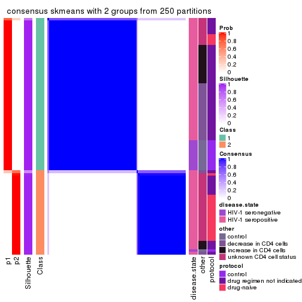</p>

</div>
<div id='tab-ATC-skmeans-consensus-heatmap-2'>
<pre><code class="r">consensus_heatmap(res, k = 3)
</code></pre>

<p>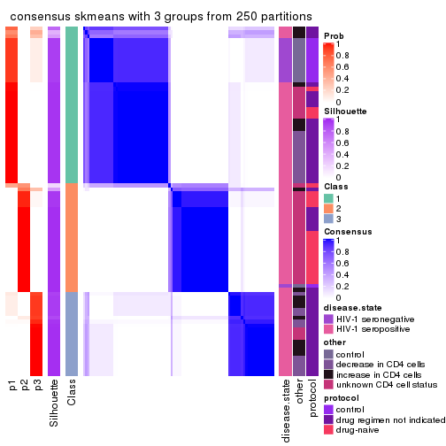</p>

</div>
<div id='tab-ATC-skmeans-consensus-heatmap-3'>
<pre><code class="r">consensus_heatmap(res, k = 4)
</code></pre>

<p>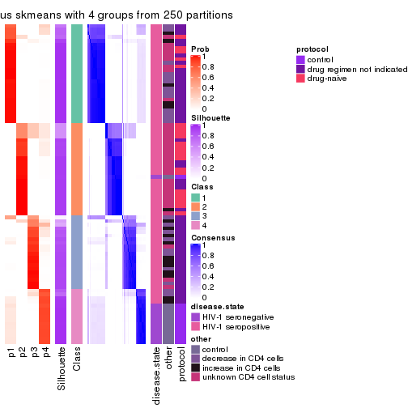</p>

</div>
<div id='tab-ATC-skmeans-consensus-heatmap-4'>
<pre><code class="r">consensus_heatmap(res, k = 5)
</code></pre>

<p>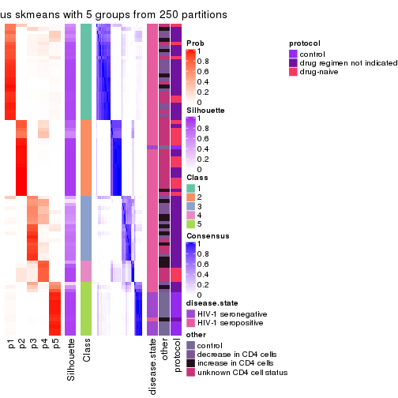</p>

</div>
<div id='tab-ATC-skmeans-consensus-heatmap-5'>
<pre><code class="r">consensus_heatmap(res, k = 6)
</code></pre>

<p>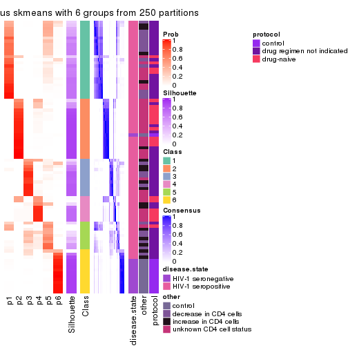</p>

</div>
</div>

Heatmaps for the membership of samples in all partitions to see how consistent they are:


<script>
$( function() {
	$( '#tabs-ATC-skmeans-membership-heatmap' ).tabs();
} );
</script>
<div id='tabs-ATC-skmeans-membership-heatmap'>
<ul>
<li><a href='#tab-ATC-skmeans-membership-heatmap-1'>k = 2</a></li>
<li><a href='#tab-ATC-skmeans-membership-heatmap-2'>k = 3</a></li>
<li><a href='#tab-ATC-skmeans-membership-heatmap-3'>k = 4</a></li>
<li><a href='#tab-ATC-skmeans-membership-heatmap-4'>k = 5</a></li>
<li><a href='#tab-ATC-skmeans-membership-heatmap-5'>k = 6</a></li>
</ul>
<div id='tab-ATC-skmeans-membership-heatmap-1'>
<pre><code class="r">membership_heatmap(res, k = 2)
</code></pre>

<p>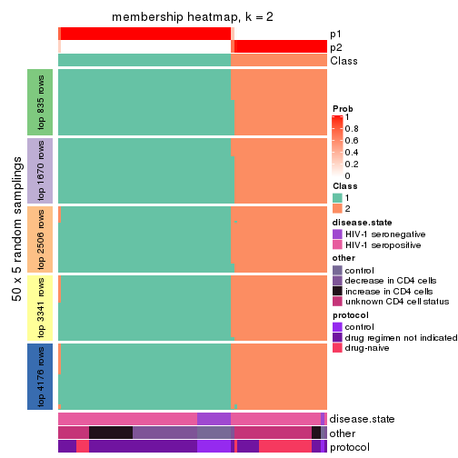</p>

</div>
<div id='tab-ATC-skmeans-membership-heatmap-2'>
<pre><code class="r">membership_heatmap(res, k = 3)
</code></pre>

<p>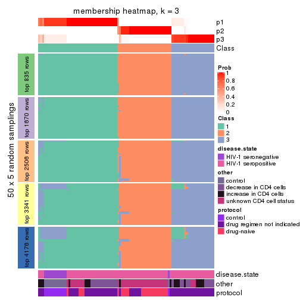</p>

</div>
<div id='tab-ATC-skmeans-membership-heatmap-3'>
<pre><code class="r">membership_heatmap(res, k = 4)
</code></pre>

<p>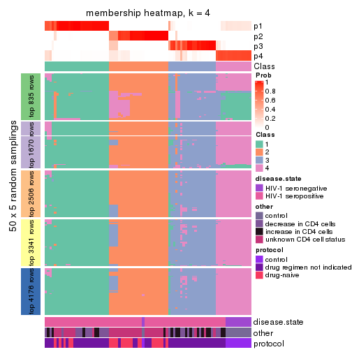</p>

</div>
<div id='tab-ATC-skmeans-membership-heatmap-4'>
<pre><code class="r">membership_heatmap(res, k = 5)
</code></pre>

<p>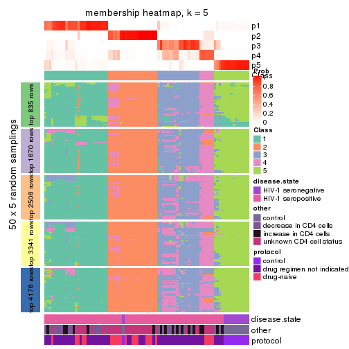</p>

</div>
<div id='tab-ATC-skmeans-membership-heatmap-5'>
<pre><code class="r">membership_heatmap(res, k = 6)
</code></pre>

<p>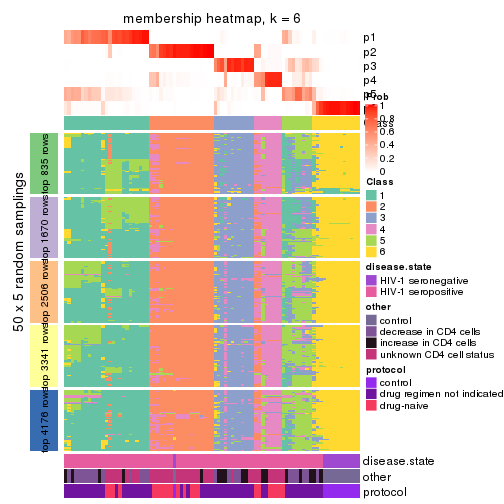</p>

</div>
</div>

As soon as we have had the classes for columns, we can look for signatures
which are significantly different between classes which can be candidate marks
for certain classes. Following are the heatmaps for signatures.


Signature heatmaps where rows are scaled:


<script>
$( function() {
	$( '#tabs-ATC-skmeans-get-signatures' ).tabs();
} );
</script>
<div id='tabs-ATC-skmeans-get-signatures'>
<ul>
<li><a href='#tab-ATC-skmeans-get-signatures-1'>k = 2</a></li>
<li><a href='#tab-ATC-skmeans-get-signatures-2'>k = 3</a></li>
<li><a href='#tab-ATC-skmeans-get-signatures-3'>k = 4</a></li>
<li><a href='#tab-ATC-skmeans-get-signatures-4'>k = 5</a></li>
<li><a href='#tab-ATC-skmeans-get-signatures-5'>k = 6</a></li>
</ul>
<div id='tab-ATC-skmeans-get-signatures-1'>
<pre><code class="r">get_signatures(res, k = 2)
</code></pre>

<p>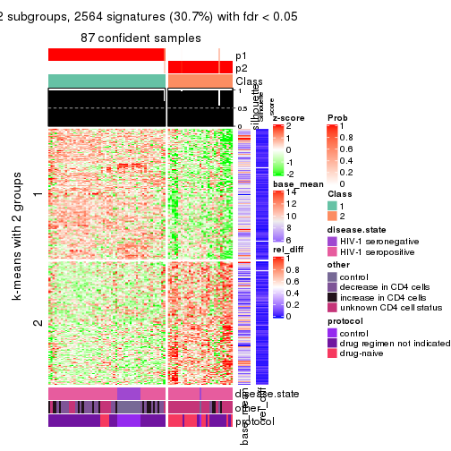</p>

</div>
<div id='tab-ATC-skmeans-get-signatures-2'>
<pre><code class="r">get_signatures(res, k = 3)
</code></pre>

<p>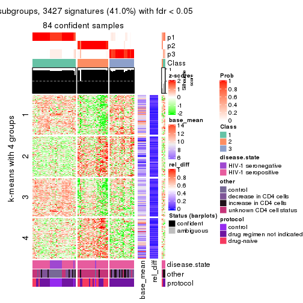</p>

</div>
<div id='tab-ATC-skmeans-get-signatures-3'>
<pre><code class="r">get_signatures(res, k = 4)
</code></pre>

<p>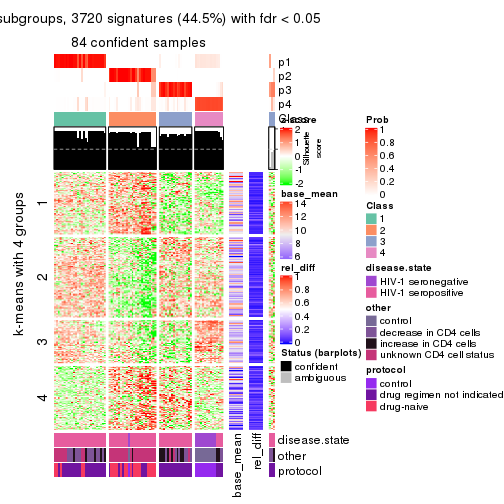</p>

</div>
<div id='tab-ATC-skmeans-get-signatures-4'>
<pre><code class="r">get_signatures(res, k = 5)
</code></pre>

<p>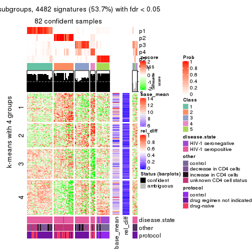</p>

</div>
<div id='tab-ATC-skmeans-get-signatures-5'>
<pre><code class="r">get_signatures(res, k = 6)
</code></pre>

<p>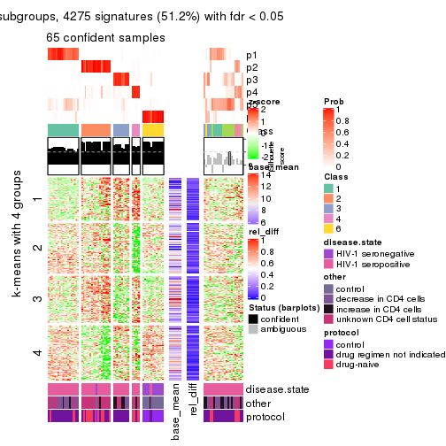</p>

</div>
</div>


Signature heatmaps where rows are not scaled:


<script>
$( function() {
	$( '#tabs-ATC-skmeans-get-signatures-no-scale' ).tabs();
} );
</script>
<div id='tabs-ATC-skmeans-get-signatures-no-scale'>
<ul>
<li><a href='#tab-ATC-skmeans-get-signatures-no-scale-1'>k = 2</a></li>
<li><a href='#tab-ATC-skmeans-get-signatures-no-scale-2'>k = 3</a></li>
<li><a href='#tab-ATC-skmeans-get-signatures-no-scale-3'>k = 4</a></li>
<li><a href='#tab-ATC-skmeans-get-signatures-no-scale-4'>k = 5</a></li>
<li><a href='#tab-ATC-skmeans-get-signatures-no-scale-5'>k = 6</a></li>
</ul>
<div id='tab-ATC-skmeans-get-signatures-no-scale-1'>
<pre><code class="r">get_signatures(res, k = 2, scale_rows = FALSE)
</code></pre>

<p>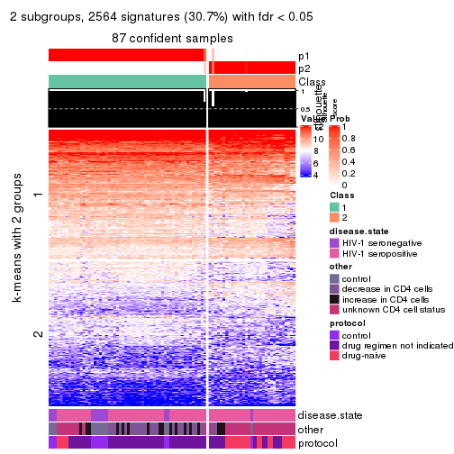</p>

</div>
<div id='tab-ATC-skmeans-get-signatures-no-scale-2'>
<pre><code class="r">get_signatures(res, k = 3, scale_rows = FALSE)
</code></pre>

<p>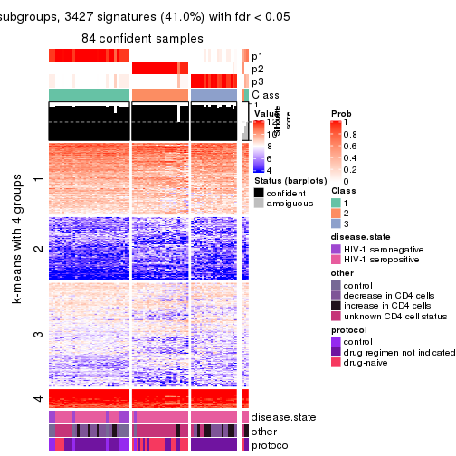</p>

</div>
<div id='tab-ATC-skmeans-get-signatures-no-scale-3'>
<pre><code class="r">get_signatures(res, k = 4, scale_rows = FALSE)
</code></pre>

<p>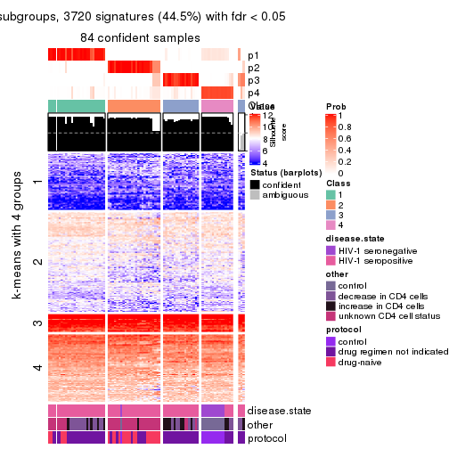</p>

</div>
<div id='tab-ATC-skmeans-get-signatures-no-scale-4'>
<pre><code class="r">get_signatures(res, k = 5, scale_rows = FALSE)
</code></pre>

<p>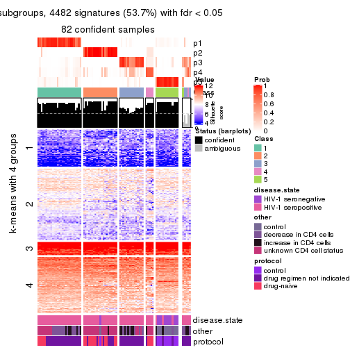</p>

</div>
<div id='tab-ATC-skmeans-get-signatures-no-scale-5'>
<pre><code class="r">get_signatures(res, k = 6, scale_rows = FALSE)
</code></pre>

<p>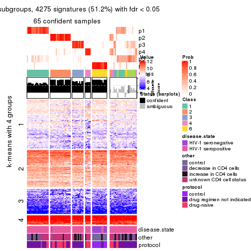</p>

</div>
</div>


Compare the overlap of signatures from different k:

```r
compare_signatures(res)
```

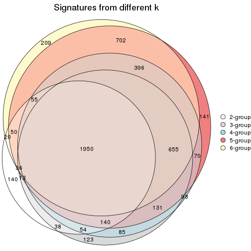

`get_signature()` returns a data frame invisibly. TO get the list of signatures, the function
call should be assigned to a variable explicitly. In following code, if `plot` argument is set
to `FALSE`, no heatmap is plotted while only the differential analysis is performed.

```r
# code only for demonstration
tb = get_signature(res, k = ..., plot = FALSE)
```

An example of the output of `tb` is:

```
#>   which_row         fdr    mean_1    mean_2 scaled_mean_1 scaled_mean_2 km
#> 1        38 0.042760348  8.373488  9.131774    -0.5533452     0.5164555  1
#> 2        40 0.018707592  7.106213  8.469186    -0.6173731     0.5762149  1
#> 3        55 0.019134737 10.221463 11.207825    -0.6159697     0.5749050  1
#> 4        59 0.006059896  5.921854  7.869574    -0.6899429     0.6439467  1
#> 5        60 0.018055526  8.928898 10.211722    -0.6204761     0.5791110  1
#> 6        98 0.009384629 15.714769 14.887706     0.6635654    -0.6193277  2
...
```

The columns in `tb` are:

1. `which_row`: row indices corresponding to the input matrix.
2. `fdr`: FDR for the differential test. 
3. `mean_x`: The mean value in group x.
4. `scaled_mean_x`: The mean value in group x after rows are scaled.
5. `km`: Row groups if k-means clustering is applied to rows.


UMAP plot which shows how samples are separated.


<script>
$( function() {
	$( '#tabs-ATC-skmeans-dimension-reduction' ).tabs();
} );
</script>
<div id='tabs-ATC-skmeans-dimension-reduction'>
<ul>
<li><a href='#tab-ATC-skmeans-dimension-reduction-1'>k = 2</a></li>
<li><a href='#tab-ATC-skmeans-dimension-reduction-2'>k = 3</a></li>
<li><a href='#tab-ATC-skmeans-dimension-reduction-3'>k = 4</a></li>
<li><a href='#tab-ATC-skmeans-dimension-reduction-4'>k = 5</a></li>
<li><a href='#tab-ATC-skmeans-dimension-reduction-5'>k = 6</a></li>
</ul>
<div id='tab-ATC-skmeans-dimension-reduction-1'>
<pre><code class="r">dimension_reduction(res, k = 2, method = &quot;UMAP&quot;)
</code></pre>

<p>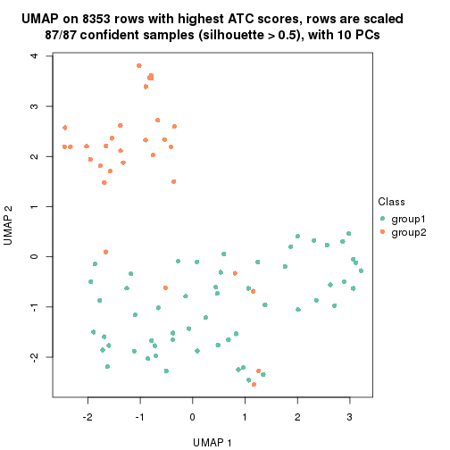</p>

</div>
<div id='tab-ATC-skmeans-dimension-reduction-2'>
<pre><code class="r">dimension_reduction(res, k = 3, method = &quot;UMAP&quot;)
</code></pre>

<p>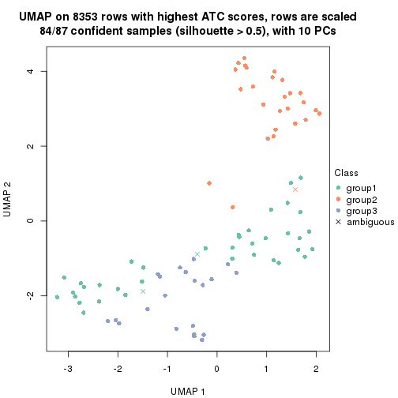</p>

</div>
<div id='tab-ATC-skmeans-dimension-reduction-3'>
<pre><code class="r">dimension_reduction(res, k = 4, method = &quot;UMAP&quot;)
</code></pre>

<p>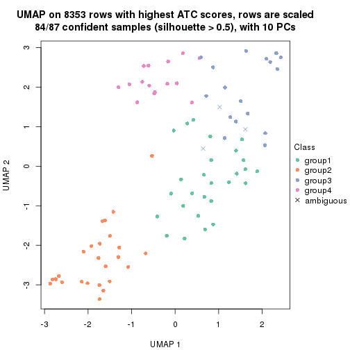</p>

</div>
<div id='tab-ATC-skmeans-dimension-reduction-4'>
<pre><code class="r">dimension_reduction(res, k = 5, method = &quot;UMAP&quot;)
</code></pre>

<p>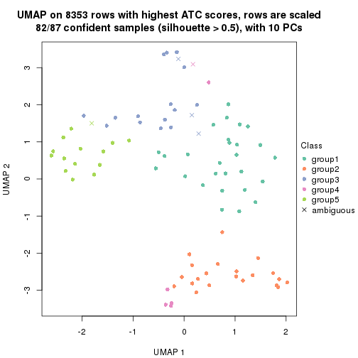</p>

</div>
<div id='tab-ATC-skmeans-dimension-reduction-5'>
<pre><code class="r">dimension_reduction(res, k = 6, method = &quot;UMAP&quot;)
</code></pre>

<p>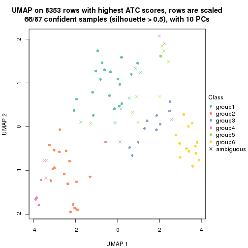</p>

</div>
</div>


Following heatmap shows how subgroups are split when increasing `k`:

```r
collect_classes(res)
```

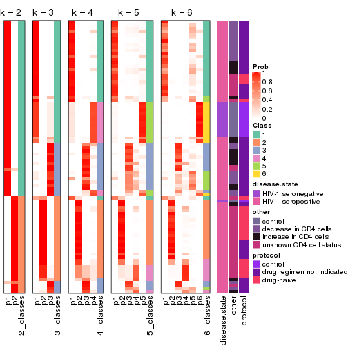


Test correlation between subgroups and known annotations. If the known
annotation is numeric, one-way ANOVA test is applied, and if the known
annotation is discrete, chi-squared contingency table test is applied.

```r
test_to_known_factors(res)
```

```
#>              n disease.state(p) other(p) protocol(p) k
#> ATC:skmeans 87         7.15e-02 3.03e-07    7.30e-07 2
#> ATC:skmeans 84         1.49e-03 3.65e-09    3.07e-09 3
#> ATC:skmeans 84         2.71e-11 4.43e-16    4.88e-16 4
#> ATC:skmeans 82         2.54e-11 3.98e-14    6.24e-15 5
#> ATC:skmeans 66         3.12e-09 1.04e-10    3.18e-11 6
```


If matrix rows can be associated to genes, consider to use `GO_Enrichment(res,
...)` to perform function enrichment for the signature genes.


 

---------------------------------------------------


### ATC:pam


The object with results only for a single top-value method and a single partition method 
can be extracted as:

```r
res = res_list["ATC", "pam"]
# you can also extract it by
# res = res_list["ATC:pam"]
```

A summary of `res` and all the functions that can be applied to it:

```r
res
```

```
#> A 'ConsensusPartition' object with k = 2, 3, 4, 5, 6.
#>   On a matrix with 8353 rows and 87 columns.
#>   Top rows (835, 1670, 2506, 3341, 4176) are extracted by 'ATC' method.
#>   Subgroups are detected by 'pam' method.
#>   Performed in total 1250 partitions by row resampling.
#>   Best k for subgroups seems to be 4.
#> 
#> Following methods can be applied to this 'ConsensusPartition' object:
#>  [1] "cola_report"             "collect_classes"         "collect_plots"          
#>  [4] "collect_stats"           "colnames"                "compare_signatures"     
#>  [7] "consensus_heatmap"       "dimension_reduction"     "functional_enrichment"  
#> [10] "get_anno_col"            "get_anno"                "get_classes"            
#> [13] "get_consensus"           "get_matrix"              "get_membership"         
#> [16] "get_param"               "get_signatures"          "get_stats"              
#> [19] "is_best_k"               "is_stable_k"             "membership_heatmap"     
#> [22] "ncol"                    "nrow"                    "plot_ecdf"              
#> [25] "rownames"                "select_partition_number" "show"                   
#> [28] "suggest_best_k"          "test_to_known_factors"
```

`collect_plots()` function collects all the plots made from `res` for all `k` (number of partitions)
into one single page to provide an easy and fast comparison between different `k`.

```r
collect_plots(res)
```

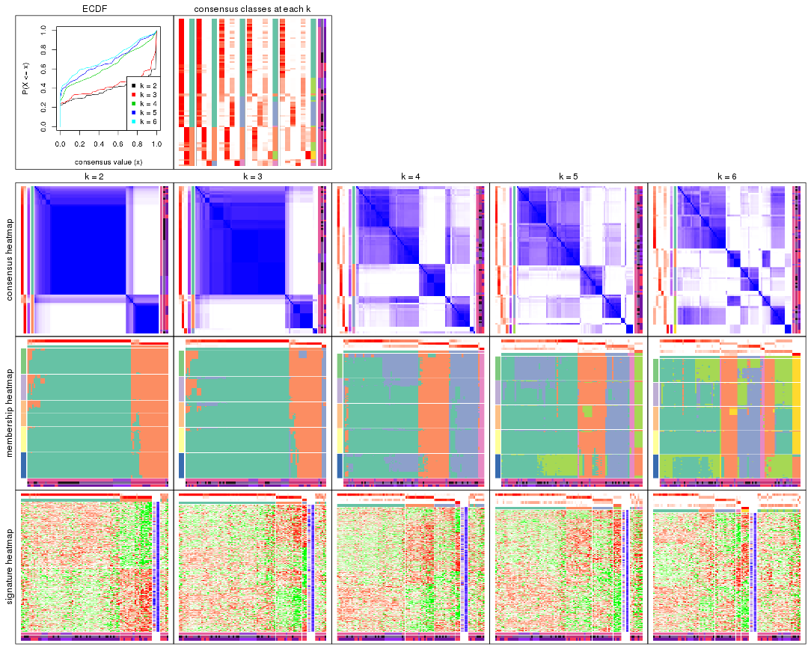

The plots are:

- The first row: a plot of the ECDF (Empirical cumulative distribution
  function) curves of the consensus matrix for each `k` and the heatmap of
  predicted classes for each `k`.
- The second row: heatmaps of the consensus matrix for each `k`.
- The third row: heatmaps of the membership matrix for each `k`.
- The fouth row: heatmaps of the signatures for each `k`.

All the plots in panels can be made by individual functions and they are
plotted later in this section.

`select_partition_number()` produces several plots showing different
statistics for choosing "optimized" `k`. There are following statistics:

- ECDF curves of the consensus matrix for each `k`;
- 1-PAC. [The PAC
  score](https://en.wikipedia.org/wiki/Consensus_clustering#Over-interpretation_potential_of_consensus_clustering)
  measures the proportion of the ambiguous subgrouping.
- Mean silhouette score.
- Concordance. The mean probability of fiting the consensus class ids in all
  partitions.
- Area increased. Denote $A_k$ as the area under the ECDF curve for current
  `k`, the area increased is defined as $A_k - A_{k-1}$.
- Rand index. The percent of pairs of samples that are both in a same cluster
  or both are not in a same cluster in the partition of k and k-1.
- Jaccard index. The ratio of pairs of samples are both in a same cluster in
  the partition of k and k-1 and the pairs of samples are both in a same
  cluster in the partition k or k-1.

The detailed explanations of these statistics can be found in [the cola
vignette](http://bioconductor.org/packages/devel/bioc/vignettes/cola/inst/doc/cola.html#toc_13).

Generally speaking, lower PAC score, higher mean silhouette score or higher
concordance corresponds to better partition. Rand index and Jaccard index
measure how similar the current partition is compared to partition with `k-1`.
If they are too similar, we won't accept `k` is better than `k-1`.

```r
select_partition_number(res)
```

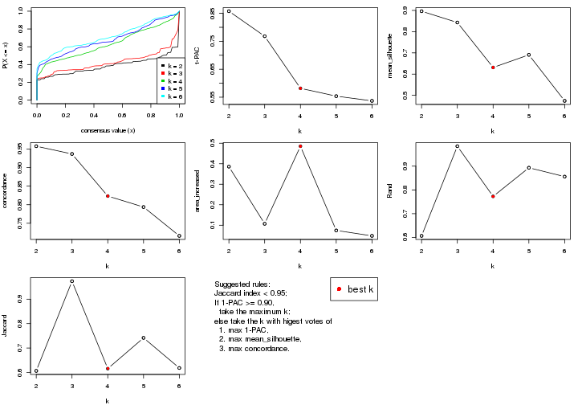

The numeric values for all these statistics can be obtained by `get_stats()`.

```r
get_stats(res)
```

```
#>   k 1-PAC mean_silhouette concordance area_increased  Rand Jaccard
#> 2 2 0.858           0.896       0.957         0.3858 0.607   0.607
#> 3 3 0.768           0.843       0.937         0.1070 0.984   0.974
#> 4 4 0.582           0.631       0.823         0.4854 0.773   0.616
#> 5 5 0.554           0.691       0.794         0.0746 0.893   0.742
#> 6 6 0.537           0.474       0.716         0.0481 0.856   0.618
```

`suggest_best_k()` suggests the best $k$ based on these statistics. The rules are as follows:

- All $k$ with Jaccard index larger than 0.95 are removed because the increase of
  the partition number does not provides enough extra information. If all $k$ are removed,
  the best $k$ is assigned by `NA`.
- For $k$ with 1-PAC larger than 0.9, the maximal $k$ is taken as the "best k". Other $k$ is called "optional k".
- If it does not fit the second rule. The $k$ with the highest vote of highest
  1-PAC, mean silhouette and concordance is taken as the "best k".

```r
suggest_best_k(res)
```

```
#> [1] 4
```


Following shows the table of the partitions (You need to click the **show/hide
code output** link to see it). The membership matrix (columns with name `p*`)
is inferred by
[`clue::cl_consensus()`](https://www.rdocumentation.org/link/cl_consensus?package=clue)
function with the `SE` method. Basically the value in the membership matrix
represents the probability to belong to a certain group. The finall class
label for an item is determined with the group with highest probability it
belongs to.

In `get_classes()` function, the entropy is calculated from the membership
matrix and the silhouette score is calculated from the consensus matrix.


<script>
$( function() {
	$( '#tabs-ATC-pam-get-classes' ).tabs();
} );
</script>
<div id='tabs-ATC-pam-get-classes'>
<ul>
<li><a href='#tab-ATC-pam-get-classes-1'>k = 2</a></li>
<li><a href='#tab-ATC-pam-get-classes-2'>k = 3</a></li>
<li><a href='#tab-ATC-pam-get-classes-3'>k = 4</a></li>
<li><a href='#tab-ATC-pam-get-classes-4'>k = 5</a></li>
<li><a href='#tab-ATC-pam-get-classes-5'>k = 6</a></li>
</ul>

<div id='tab-ATC-pam-get-classes-1'>
<p><a id='tab-ATC-pam-get-classes-1-a' style='color:#0366d6' href='#'>show/hide code output</a></p>
<pre><code class="r">cbind(get_classes(res, k = 2), get_membership(res, k = 2))
</code></pre>

<pre><code>#&gt;          class entropy silhouette    p1    p2
#&gt; GSM39104     1  0.0000     0.9697 1.000 0.000
#&gt; GSM39105     1  0.0000     0.9697 1.000 0.000
#&gt; GSM39106     1  0.0000     0.9697 1.000 0.000
#&gt; GSM39107     1  0.0000     0.9697 1.000 0.000
#&gt; GSM39108     1  0.0000     0.9697 1.000 0.000
#&gt; GSM39109     1  0.0000     0.9697 1.000 0.000
#&gt; GSM39110     1  0.0000     0.9697 1.000 0.000
#&gt; GSM39111     1  0.0000     0.9697 1.000 0.000
#&gt; GSM39112     1  0.0000     0.9697 1.000 0.000
#&gt; GSM39113     1  0.0000     0.9697 1.000 0.000
#&gt; GSM39114     2  0.0000     0.9027 0.000 1.000
#&gt; GSM39115     1  0.0000     0.9697 1.000 0.000
#&gt; GSM39148     1  0.0000     0.9697 1.000 0.000
#&gt; GSM39149     1  0.0000     0.9697 1.000 0.000
#&gt; GSM39150     1  0.0000     0.9697 1.000 0.000
#&gt; GSM39151     1  0.0672     0.9634 0.992 0.008
#&gt; GSM39152     1  0.0000     0.9697 1.000 0.000
#&gt; GSM39153     1  0.0000     0.9697 1.000 0.000
#&gt; GSM39154     1  0.0000     0.9697 1.000 0.000
#&gt; GSM39155     1  0.0000     0.9697 1.000 0.000
#&gt; GSM39156     1  0.0000     0.9697 1.000 0.000
#&gt; GSM39157     1  0.0000     0.9697 1.000 0.000
#&gt; GSM39158     1  0.0000     0.9697 1.000 0.000
#&gt; GSM39159     1  0.0000     0.9697 1.000 0.000
#&gt; GSM39160     1  0.0000     0.9697 1.000 0.000
#&gt; GSM39161     1  0.4298     0.8871 0.912 0.088
#&gt; GSM39162     1  0.0000     0.9697 1.000 0.000
#&gt; GSM39163     1  0.0000     0.9697 1.000 0.000
#&gt; GSM39164     1  0.0000     0.9697 1.000 0.000
#&gt; GSM39165     1  0.0000     0.9697 1.000 0.000
#&gt; GSM39166     1  0.0000     0.9697 1.000 0.000
#&gt; GSM39167     1  0.0000     0.9697 1.000 0.000
#&gt; GSM39168     1  0.0000     0.9697 1.000 0.000
#&gt; GSM39169     1  0.0000     0.9697 1.000 0.000
#&gt; GSM39170     1  0.0000     0.9697 1.000 0.000
#&gt; GSM39171     1  0.0000     0.9697 1.000 0.000
#&gt; GSM39172     1  0.0000     0.9697 1.000 0.000
#&gt; GSM39173     2  0.0000     0.9027 0.000 1.000
#&gt; GSM39174     1  0.0000     0.9697 1.000 0.000
#&gt; GSM39175     1  0.0000     0.9697 1.000 0.000
#&gt; GSM39176     1  0.0000     0.9697 1.000 0.000
#&gt; GSM39177     1  0.0000     0.9697 1.000 0.000
#&gt; GSM39178     1  0.0000     0.9697 1.000 0.000
#&gt; GSM39179     1  0.0000     0.9697 1.000 0.000
#&gt; GSM39180     1  0.9944     0.0564 0.544 0.456
#&gt; GSM39181     1  0.0000     0.9697 1.000 0.000
#&gt; GSM39182     1  0.0000     0.9697 1.000 0.000
#&gt; GSM39183     1  0.3114     0.9205 0.944 0.056
#&gt; GSM39184     1  0.0000     0.9697 1.000 0.000
#&gt; GSM39185     1  0.6048     0.8125 0.852 0.148
#&gt; GSM39186     1  0.0000     0.9697 1.000 0.000
#&gt; GSM39187     1  0.0000     0.9697 1.000 0.000
#&gt; GSM39116     2  0.5178     0.8215 0.116 0.884
#&gt; GSM39117     2  0.0000     0.9027 0.000 1.000
#&gt; GSM39118     2  0.8386     0.6472 0.268 0.732
#&gt; GSM39119     2  0.0000     0.9027 0.000 1.000
#&gt; GSM39120     1  0.0000     0.9697 1.000 0.000
#&gt; GSM39121     1  0.3274     0.9169 0.940 0.060
#&gt; GSM39122     1  0.3114     0.9206 0.944 0.056
#&gt; GSM39123     2  0.9732     0.3825 0.404 0.596
#&gt; GSM39124     2  0.0000     0.9027 0.000 1.000
#&gt; GSM39125     1  0.0000     0.9697 1.000 0.000
#&gt; GSM39126     1  0.5519     0.8414 0.872 0.128
#&gt; GSM39127     2  0.1633     0.8890 0.024 0.976
#&gt; GSM39128     1  0.9087     0.4842 0.676 0.324
#&gt; GSM39129     2  0.0000     0.9027 0.000 1.000
#&gt; GSM39130     2  0.0000     0.9027 0.000 1.000
#&gt; GSM39131     2  0.9933     0.2464 0.452 0.548
#&gt; GSM39132     2  0.0000     0.9027 0.000 1.000
#&gt; GSM39133     2  0.8207     0.6657 0.256 0.744
#&gt; GSM39134     2  0.0000     0.9027 0.000 1.000
#&gt; GSM39135     2  0.0000     0.9027 0.000 1.000
#&gt; GSM39136     2  0.0000     0.9027 0.000 1.000
#&gt; GSM39137     2  0.9988     0.1516 0.480 0.520
#&gt; GSM39138     2  0.0000     0.9027 0.000 1.000
#&gt; GSM39139     2  0.0000     0.9027 0.000 1.000
#&gt; GSM39140     1  0.3274     0.9169 0.940 0.060
#&gt; GSM39141     1  0.0000     0.9697 1.000 0.000
#&gt; GSM39142     1  0.0000     0.9697 1.000 0.000
#&gt; GSM39143     1  0.0000     0.9697 1.000 0.000
#&gt; GSM39144     2  0.0000     0.9027 0.000 1.000
#&gt; GSM39145     2  0.0000     0.9027 0.000 1.000
#&gt; GSM39146     1  0.7745     0.6868 0.772 0.228
#&gt; GSM39147     2  0.0000     0.9027 0.000 1.000
#&gt; GSM39188     1  0.4298     0.8868 0.912 0.088
#&gt; GSM39189     1  0.0000     0.9697 1.000 0.000
#&gt; GSM39190     1  0.0000     0.9697 1.000 0.000
</code></pre>

<script>
$('#tab-ATC-pam-get-classes-1-a').parent().next().next().hide();
$('#tab-ATC-pam-get-classes-1-a').click(function(){
  $('#tab-ATC-pam-get-classes-1-a').parent().next().next().toggle();
  return(false);
});
</script>
</div>

<div id='tab-ATC-pam-get-classes-2'>
<p><a id='tab-ATC-pam-get-classes-2-a' style='color:#0366d6' href='#'>show/hide code output</a></p>
<pre><code class="r">cbind(get_classes(res, k = 3), get_membership(res, k = 3))
</code></pre>

<pre><code>#&gt;          class entropy silhouette    p1    p2    p3
#&gt; GSM39104     1  0.0000     0.9477 1.000 0.000 0.000
#&gt; GSM39105     1  0.0000     0.9477 1.000 0.000 0.000
#&gt; GSM39106     1  0.0237     0.9476 0.996 0.000 0.004
#&gt; GSM39107     1  0.0237     0.9476 0.996 0.000 0.004
#&gt; GSM39108     1  0.0237     0.9476 0.996 0.000 0.004
#&gt; GSM39109     1  0.0000     0.9477 1.000 0.000 0.000
#&gt; GSM39110     1  0.0000     0.9477 1.000 0.000 0.000
#&gt; GSM39111     1  0.0000     0.9477 1.000 0.000 0.000
#&gt; GSM39112     1  0.0237     0.9476 0.996 0.000 0.004
#&gt; GSM39113     1  0.0237     0.9476 0.996 0.000 0.004
#&gt; GSM39114     2  0.0000     0.7898 0.000 1.000 0.000
#&gt; GSM39115     1  0.0000     0.9477 1.000 0.000 0.000
#&gt; GSM39148     1  0.0237     0.9476 0.996 0.000 0.004
#&gt; GSM39149     1  0.0000     0.9477 1.000 0.000 0.000
#&gt; GSM39150     1  0.1411     0.9331 0.964 0.000 0.036
#&gt; GSM39151     1  0.1964     0.9232 0.944 0.000 0.056
#&gt; GSM39152     1  0.1964     0.9232 0.944 0.000 0.056
#&gt; GSM39153     1  0.0000     0.9477 1.000 0.000 0.000
#&gt; GSM39154     1  0.0237     0.9476 0.996 0.000 0.004
#&gt; GSM39155     1  0.0000     0.9477 1.000 0.000 0.000
#&gt; GSM39156     1  0.0000     0.9477 1.000 0.000 0.000
#&gt; GSM39157     1  0.0237     0.9476 0.996 0.000 0.004
#&gt; GSM39158     1  0.1964     0.9232 0.944 0.000 0.056
#&gt; GSM39159     1  0.0892     0.9411 0.980 0.000 0.020
#&gt; GSM39160     1  0.1411     0.9331 0.964 0.000 0.036
#&gt; GSM39161     1  0.4458     0.8530 0.864 0.080 0.056
#&gt; GSM39162     1  0.0237     0.9476 0.996 0.000 0.004
#&gt; GSM39163     1  0.0000     0.9477 1.000 0.000 0.000
#&gt; GSM39164     1  0.0000     0.9477 1.000 0.000 0.000
#&gt; GSM39165     1  0.0000     0.9477 1.000 0.000 0.000
#&gt; GSM39166     1  0.1964     0.9232 0.944 0.000 0.056
#&gt; GSM39167     1  0.0237     0.9476 0.996 0.000 0.004
#&gt; GSM39168     1  0.0237     0.9476 0.996 0.000 0.004
#&gt; GSM39169     1  0.0000     0.9477 1.000 0.000 0.000
#&gt; GSM39170     1  0.0237     0.9476 0.996 0.000 0.004
#&gt; GSM39171     1  0.0000     0.9477 1.000 0.000 0.000
#&gt; GSM39172     1  0.1031     0.9396 0.976 0.000 0.024
#&gt; GSM39173     2  0.0000     0.7898 0.000 1.000 0.000
#&gt; GSM39174     1  0.0237     0.9476 0.996 0.000 0.004
#&gt; GSM39175     1  0.0000     0.9477 1.000 0.000 0.000
#&gt; GSM39176     1  0.0237     0.9476 0.996 0.000 0.004
#&gt; GSM39177     1  0.0000     0.9477 1.000 0.000 0.000
#&gt; GSM39178     1  0.1964     0.9232 0.944 0.000 0.056
#&gt; GSM39179     1  0.0747     0.9428 0.984 0.000 0.016
#&gt; GSM39180     1  0.7853     0.2674 0.556 0.384 0.060
#&gt; GSM39181     1  0.1964     0.9232 0.944 0.000 0.056
#&gt; GSM39182     1  0.0237     0.9476 0.996 0.000 0.004
#&gt; GSM39183     1  0.2384     0.9185 0.936 0.008 0.056
#&gt; GSM39184     1  0.0000     0.9477 1.000 0.000 0.000
#&gt; GSM39185     1  0.6203     0.7222 0.760 0.184 0.056
#&gt; GSM39186     1  0.0592     0.9442 0.988 0.000 0.012
#&gt; GSM39187     1  0.0000     0.9477 1.000 0.000 0.000
#&gt; GSM39116     2  0.5982     0.3912 0.328 0.668 0.004
#&gt; GSM39117     3  0.1964     0.9422 0.000 0.056 0.944
#&gt; GSM39118     2  0.2959     0.6903 0.100 0.900 0.000
#&gt; GSM39119     2  0.0000     0.7898 0.000 1.000 0.000
#&gt; GSM39120     1  0.0237     0.9476 0.996 0.000 0.004
#&gt; GSM39121     1  0.3851     0.8228 0.860 0.136 0.004
#&gt; GSM39122     1  0.3851     0.8228 0.860 0.136 0.004
#&gt; GSM39123     3  0.2165     0.9000 0.000 0.064 0.936
#&gt; GSM39124     2  0.0000     0.7898 0.000 1.000 0.000
#&gt; GSM39125     1  0.1031     0.9415 0.976 0.000 0.024
#&gt; GSM39126     1  0.4978     0.7124 0.780 0.216 0.004
#&gt; GSM39127     2  0.3192     0.6767 0.112 0.888 0.000
#&gt; GSM39128     1  0.6079     0.3501 0.612 0.388 0.000
#&gt; GSM39129     2  0.2066     0.7609 0.000 0.940 0.060
#&gt; GSM39130     3  0.1753     0.9455 0.000 0.048 0.952
#&gt; GSM39131     2  0.6495     0.1343 0.460 0.536 0.004
#&gt; GSM39132     2  0.0000     0.7898 0.000 1.000 0.000
#&gt; GSM39133     2  0.8779     0.0126 0.112 0.472 0.416
#&gt; GSM39134     2  0.2066     0.7609 0.000 0.940 0.060
#&gt; GSM39135     2  0.0000     0.7898 0.000 1.000 0.000
#&gt; GSM39136     2  0.0000     0.7898 0.000 1.000 0.000
#&gt; GSM39137     2  0.6228     0.3458 0.372 0.624 0.004
#&gt; GSM39138     2  0.2066     0.7609 0.000 0.940 0.060
#&gt; GSM39139     2  0.2066     0.7609 0.000 0.940 0.060
#&gt; GSM39140     1  0.3851     0.8228 0.860 0.136 0.004
#&gt; GSM39141     1  0.0237     0.9476 0.996 0.000 0.004
#&gt; GSM39142     1  0.0237     0.9476 0.996 0.000 0.004
#&gt; GSM39143     1  0.0237     0.9476 0.996 0.000 0.004
#&gt; GSM39144     2  0.2066     0.7609 0.000 0.940 0.060
#&gt; GSM39145     2  0.0000     0.7898 0.000 1.000 0.000
#&gt; GSM39146     1  0.6359     0.2850 0.592 0.404 0.004
#&gt; GSM39147     2  0.0000     0.7898 0.000 1.000 0.000
#&gt; GSM39188     1  0.4868     0.8298 0.844 0.100 0.056
#&gt; GSM39189     1  0.1964     0.9232 0.944 0.000 0.056
#&gt; GSM39190     1  0.1031     0.9396 0.976 0.000 0.024
</code></pre>

<script>
$('#tab-ATC-pam-get-classes-2-a').parent().next().next().hide();
$('#tab-ATC-pam-get-classes-2-a').click(function(){
  $('#tab-ATC-pam-get-classes-2-a').parent().next().next().toggle();
  return(false);
});
</script>
</div>

<div id='tab-ATC-pam-get-classes-3'>
<p><a id='tab-ATC-pam-get-classes-3-a' style='color:#0366d6' href='#'>show/hide code output</a></p>
<pre><code class="r">cbind(get_classes(res, k = 4), get_membership(res, k = 4))
</code></pre>

<pre><code>#&gt;          class entropy silhouette    p1    p2    p3  p4
#&gt; GSM39104     1  0.4855     0.5351 0.600 0.000 0.400 0.0
#&gt; GSM39105     1  0.4790     0.5511 0.620 0.000 0.380 0.0
#&gt; GSM39106     1  0.4661     0.5651 0.652 0.000 0.348 0.0
#&gt; GSM39107     1  0.3172     0.6763 0.840 0.000 0.160 0.0
#&gt; GSM39108     1  0.4624     0.5902 0.660 0.000 0.340 0.0
#&gt; GSM39109     1  0.4817     0.5410 0.612 0.000 0.388 0.0
#&gt; GSM39110     1  0.0188     0.6953 0.996 0.000 0.004 0.0
#&gt; GSM39111     1  0.4817     0.5410 0.612 0.000 0.388 0.0
#&gt; GSM39112     1  0.2408     0.6865 0.896 0.000 0.104 0.0
#&gt; GSM39113     1  0.4776     0.5548 0.624 0.000 0.376 0.0
#&gt; GSM39114     2  0.0000     0.8998 0.000 1.000 0.000 0.0
#&gt; GSM39115     1  0.4790     0.5511 0.620 0.000 0.380 0.0
#&gt; GSM39148     1  0.0000     0.6938 1.000 0.000 0.000 0.0
#&gt; GSM39149     1  0.4817     0.5410 0.612 0.000 0.388 0.0
#&gt; GSM39150     3  0.3311     0.6807 0.172 0.000 0.828 0.0
#&gt; GSM39151     3  0.1557     0.7467 0.056 0.000 0.944 0.0
#&gt; GSM39152     3  0.1557     0.7463 0.056 0.000 0.944 0.0
#&gt; GSM39153     1  0.0707     0.6955 0.980 0.000 0.020 0.0
#&gt; GSM39154     1  0.4585     0.5908 0.668 0.000 0.332 0.0
#&gt; GSM39155     1  0.4790     0.5511 0.620 0.000 0.380 0.0
#&gt; GSM39156     1  0.1792     0.6982 0.932 0.000 0.068 0.0
#&gt; GSM39157     1  0.2281     0.6927 0.904 0.000 0.096 0.0
#&gt; GSM39158     3  0.1302     0.7452 0.044 0.000 0.956 0.0
#&gt; GSM39159     1  0.4996     0.3069 0.516 0.000 0.484 0.0
#&gt; GSM39160     3  0.3123     0.6814 0.156 0.000 0.844 0.0
#&gt; GSM39161     3  0.2647     0.6695 0.120 0.000 0.880 0.0
#&gt; GSM39162     1  0.0000     0.6938 1.000 0.000 0.000 0.0
#&gt; GSM39163     1  0.4730     0.5772 0.636 0.000 0.364 0.0
#&gt; GSM39164     1  0.4103     0.6308 0.744 0.000 0.256 0.0
#&gt; GSM39165     1  0.4431     0.5981 0.696 0.000 0.304 0.0
#&gt; GSM39166     3  0.1302     0.7452 0.044 0.000 0.956 0.0
#&gt; GSM39167     1  0.4331     0.6096 0.712 0.000 0.288 0.0
#&gt; GSM39168     1  0.0000     0.6938 1.000 0.000 0.000 0.0
#&gt; GSM39169     1  0.0188     0.6953 0.996 0.000 0.004 0.0
#&gt; GSM39170     1  0.0469     0.6928 0.988 0.000 0.012 0.0
#&gt; GSM39171     1  0.4843     0.5376 0.604 0.000 0.396 0.0
#&gt; GSM39172     3  0.4996    -0.1856 0.484 0.000 0.516 0.0
#&gt; GSM39173     2  0.2345     0.8196 0.100 0.900 0.000 0.0
#&gt; GSM39174     1  0.0707     0.6959 0.980 0.000 0.020 0.0
#&gt; GSM39175     1  0.4843     0.5412 0.604 0.000 0.396 0.0
#&gt; GSM39176     1  0.3356     0.6687 0.824 0.000 0.176 0.0
#&gt; GSM39177     1  0.4304     0.6323 0.716 0.000 0.284 0.0
#&gt; GSM39178     3  0.1302     0.7452 0.044 0.000 0.956 0.0
#&gt; GSM39179     3  0.5000    -0.3330 0.500 0.000 0.500 0.0
#&gt; GSM39180     3  0.6844     0.0416 0.260 0.152 0.588 0.0
#&gt; GSM39181     3  0.1022     0.7455 0.032 0.000 0.968 0.0
#&gt; GSM39182     1  0.1211     0.6934 0.960 0.000 0.040 0.0
#&gt; GSM39183     3  0.1022     0.7455 0.032 0.000 0.968 0.0
#&gt; GSM39184     1  0.4790     0.5511 0.620 0.000 0.380 0.0
#&gt; GSM39185     3  0.1833     0.6907 0.024 0.032 0.944 0.0
#&gt; GSM39186     3  0.4661     0.2906 0.348 0.000 0.652 0.0
#&gt; GSM39187     1  0.4643     0.5893 0.656 0.000 0.344 0.0
#&gt; GSM39116     2  0.5090     0.4898 0.324 0.660 0.016 0.0
#&gt; GSM39117     4  0.0000     0.8365 0.000 0.000 0.000 1.0
#&gt; GSM39118     2  0.2408     0.8462 0.044 0.920 0.036 0.0
#&gt; GSM39119     2  0.0000     0.8998 0.000 1.000 0.000 0.0
#&gt; GSM39120     1  0.0469     0.6928 0.988 0.000 0.012 0.0
#&gt; GSM39121     1  0.1004     0.6793 0.972 0.024 0.004 0.0
#&gt; GSM39122     1  0.1936     0.6770 0.940 0.032 0.028 0.0
#&gt; GSM39123     4  0.0000     0.8365 0.000 0.000 0.000 1.0
#&gt; GSM39124     2  0.0000     0.8998 0.000 1.000 0.000 0.0
#&gt; GSM39125     1  0.3400     0.5868 0.820 0.000 0.180 0.0
#&gt; GSM39126     1  0.1854     0.6639 0.940 0.048 0.012 0.0
#&gt; GSM39127     2  0.2021     0.8572 0.056 0.932 0.012 0.0
#&gt; GSM39128     1  0.5310    -0.0562 0.576 0.412 0.012 0.0
#&gt; GSM39129     2  0.1022     0.8890 0.000 0.968 0.032 0.0
#&gt; GSM39130     4  0.0000     0.8365 0.000 0.000 0.000 1.0
#&gt; GSM39131     2  0.4898     0.5907 0.260 0.716 0.024 0.0
#&gt; GSM39132     2  0.0000     0.8998 0.000 1.000 0.000 0.0
#&gt; GSM39133     4  0.7902     0.2459 0.004 0.364 0.232 0.4
#&gt; GSM39134     2  0.1022     0.8890 0.000 0.968 0.032 0.0
#&gt; GSM39135     2  0.0000     0.8998 0.000 1.000 0.000 0.0
#&gt; GSM39136     2  0.0000     0.8998 0.000 1.000 0.000 0.0
#&gt; GSM39137     2  0.4281     0.7023 0.180 0.792 0.028 0.0
#&gt; GSM39138     2  0.1022     0.8890 0.000 0.968 0.032 0.0
#&gt; GSM39139     2  0.1022     0.8890 0.000 0.968 0.032 0.0
#&gt; GSM39140     1  0.0817     0.6775 0.976 0.024 0.000 0.0
#&gt; GSM39141     1  0.0921     0.6957 0.972 0.000 0.028 0.0
#&gt; GSM39142     1  0.0921     0.6957 0.972 0.000 0.028 0.0
#&gt; GSM39143     1  0.0921     0.6957 0.972 0.000 0.028 0.0
#&gt; GSM39144     2  0.1022     0.8890 0.000 0.968 0.032 0.0
#&gt; GSM39145     2  0.0188     0.8987 0.004 0.996 0.000 0.0
#&gt; GSM39146     1  0.5977    -0.0891 0.528 0.432 0.040 0.0
#&gt; GSM39147     2  0.0000     0.8998 0.000 1.000 0.000 0.0
#&gt; GSM39188     3  0.1022     0.7455 0.032 0.000 0.968 0.0
#&gt; GSM39189     3  0.1118     0.7443 0.036 0.000 0.964 0.0
#&gt; GSM39190     3  0.4996    -0.3030 0.484 0.000 0.516 0.0
</code></pre>

<script>
$('#tab-ATC-pam-get-classes-3-a').parent().next().next().hide();
$('#tab-ATC-pam-get-classes-3-a').click(function(){
  $('#tab-ATC-pam-get-classes-3-a').parent().next().next().toggle();
  return(false);
});
</script>
</div>

<div id='tab-ATC-pam-get-classes-4'>
<p><a id='tab-ATC-pam-get-classes-4-a' style='color:#0366d6' href='#'>show/hide code output</a></p>
<pre><code class="r">cbind(get_classes(res, k = 5), get_membership(res, k = 5))
</code></pre>

<pre><code>#&gt;          class entropy silhouette    p1    p2    p3    p4    p5
#&gt; GSM39104     1  0.4718     0.6957 0.540 0.000 0.016 0.444 0.000
#&gt; GSM39105     1  0.4278     0.7001 0.548 0.000 0.000 0.452 0.000
#&gt; GSM39106     1  0.3715     0.7062 0.736 0.000 0.004 0.260 0.000
#&gt; GSM39107     1  0.3586     0.7203 0.736 0.000 0.000 0.264 0.000
#&gt; GSM39108     1  0.4101     0.7285 0.628 0.000 0.000 0.372 0.000
#&gt; GSM39109     1  0.4632     0.6957 0.540 0.000 0.012 0.448 0.000
#&gt; GSM39110     1  0.0566     0.6975 0.984 0.000 0.004 0.012 0.000
#&gt; GSM39111     1  0.4637     0.6918 0.536 0.000 0.012 0.452 0.000
#&gt; GSM39112     1  0.3074     0.7056 0.804 0.000 0.000 0.196 0.000
#&gt; GSM39113     1  0.4262     0.7045 0.560 0.000 0.000 0.440 0.000
#&gt; GSM39114     2  0.2127     0.7134 0.000 0.892 0.000 0.000 0.108
#&gt; GSM39115     1  0.4273     0.7016 0.552 0.000 0.000 0.448 0.000
#&gt; GSM39148     1  0.0000     0.6926 1.000 0.000 0.000 0.000 0.000
#&gt; GSM39149     1  0.4637     0.6918 0.536 0.000 0.012 0.452 0.000
#&gt; GSM39150     3  0.5400     0.7424 0.096 0.000 0.632 0.272 0.000
#&gt; GSM39151     3  0.4415     0.6445 0.004 0.000 0.552 0.444 0.000
#&gt; GSM39152     3  0.4229     0.8336 0.020 0.000 0.704 0.276 0.000
#&gt; GSM39153     1  0.0671     0.6986 0.980 0.000 0.004 0.016 0.000
#&gt; GSM39154     1  0.3861     0.7312 0.712 0.000 0.004 0.284 0.000
#&gt; GSM39155     1  0.4262     0.7061 0.560 0.000 0.000 0.440 0.000
#&gt; GSM39156     1  0.1831     0.7200 0.920 0.000 0.004 0.076 0.000
#&gt; GSM39157     1  0.2763     0.7119 0.848 0.000 0.004 0.148 0.000
#&gt; GSM39158     3  0.3689     0.8467 0.004 0.000 0.740 0.256 0.000
#&gt; GSM39159     1  0.5839     0.6112 0.560 0.000 0.116 0.324 0.000
#&gt; GSM39160     3  0.5446     0.7406 0.100 0.000 0.628 0.272 0.000
#&gt; GSM39161     3  0.4096     0.8281 0.004 0.020 0.744 0.232 0.000
#&gt; GSM39162     1  0.0000     0.6926 1.000 0.000 0.000 0.000 0.000
#&gt; GSM39163     1  0.4288     0.7282 0.612 0.000 0.004 0.384 0.000
#&gt; GSM39164     1  0.3663     0.7175 0.776 0.000 0.016 0.208 0.000
#&gt; GSM39165     1  0.4065     0.6974 0.720 0.000 0.016 0.264 0.000
#&gt; GSM39166     3  0.3689     0.8467 0.004 0.000 0.740 0.256 0.000
#&gt; GSM39167     1  0.3766     0.7067 0.728 0.000 0.004 0.268 0.000
#&gt; GSM39168     1  0.0000     0.6926 1.000 0.000 0.000 0.000 0.000
#&gt; GSM39169     1  0.0771     0.7014 0.976 0.000 0.004 0.020 0.000
#&gt; GSM39170     1  0.0162     0.6920 0.996 0.000 0.004 0.000 0.000
#&gt; GSM39171     1  0.4718     0.6957 0.540 0.000 0.016 0.444 0.000
#&gt; GSM39172     1  0.6470     0.4313 0.536 0.008 0.192 0.264 0.000
#&gt; GSM39173     2  0.3209     0.6576 0.180 0.812 0.000 0.000 0.008
#&gt; GSM39174     1  0.0451     0.6972 0.988 0.000 0.004 0.008 0.000
#&gt; GSM39175     1  0.4610     0.7110 0.596 0.000 0.016 0.388 0.000
#&gt; GSM39176     1  0.3010     0.7251 0.824 0.000 0.004 0.172 0.000
#&gt; GSM39177     1  0.4227     0.7471 0.692 0.000 0.016 0.292 0.000
#&gt; GSM39178     3  0.3814     0.8454 0.004 0.000 0.720 0.276 0.000
#&gt; GSM39179     1  0.5970     0.6064 0.524 0.000 0.120 0.356 0.000
#&gt; GSM39180     3  0.6696     0.0377 0.184 0.360 0.448 0.008 0.000
#&gt; GSM39181     3  0.3612     0.8453 0.000 0.000 0.732 0.268 0.000
#&gt; GSM39182     1  0.2193     0.7030 0.920 0.008 0.028 0.044 0.000
#&gt; GSM39183     3  0.3534     0.8453 0.000 0.000 0.744 0.256 0.000
#&gt; GSM39184     1  0.4273     0.7026 0.552 0.000 0.000 0.448 0.000
#&gt; GSM39185     3  0.4429     0.5583 0.000 0.192 0.744 0.064 0.000
#&gt; GSM39186     4  0.6638    -0.4075 0.272 0.000 0.276 0.452 0.000
#&gt; GSM39187     1  0.4171     0.7248 0.604 0.000 0.000 0.396 0.000
#&gt; GSM39116     2  0.2824     0.7352 0.020 0.864 0.000 0.116 0.000
#&gt; GSM39117     4  0.6200     0.4728 0.000 0.000 0.256 0.548 0.196
#&gt; GSM39118     2  0.1638     0.7611 0.004 0.932 0.000 0.064 0.000
#&gt; GSM39119     2  0.0404     0.7548 0.000 0.988 0.000 0.000 0.012
#&gt; GSM39120     1  0.0162     0.6920 0.996 0.000 0.004 0.000 0.000
#&gt; GSM39121     1  0.0609     0.7001 0.980 0.000 0.000 0.020 0.000
#&gt; GSM39122     1  0.3010     0.7041 0.824 0.004 0.000 0.172 0.000
#&gt; GSM39123     4  0.6466     0.4705 0.000 0.008 0.252 0.540 0.200
#&gt; GSM39124     2  0.2127     0.7134 0.000 0.892 0.000 0.000 0.108
#&gt; GSM39125     1  0.5348     0.6480 0.656 0.000 0.112 0.232 0.000
#&gt; GSM39126     1  0.4225     0.2448 0.632 0.364 0.004 0.000 0.000
#&gt; GSM39127     2  0.2011     0.7563 0.004 0.908 0.000 0.088 0.000
#&gt; GSM39128     2  0.3759     0.6130 0.220 0.764 0.000 0.016 0.000
#&gt; GSM39129     5  0.3561     1.0000 0.000 0.260 0.000 0.000 0.740
#&gt; GSM39130     4  0.6494     0.4588 0.000 0.000 0.252 0.492 0.256
#&gt; GSM39131     2  0.3846     0.7001 0.056 0.800 0.000 0.144 0.000
#&gt; GSM39132     2  0.2127     0.7134 0.000 0.892 0.000 0.000 0.108
#&gt; GSM39133     2  0.7317     0.3806 0.000 0.540 0.096 0.188 0.176
#&gt; GSM39134     5  0.3561     1.0000 0.000 0.260 0.000 0.000 0.740
#&gt; GSM39135     2  0.0000     0.7568 0.000 1.000 0.000 0.000 0.000
#&gt; GSM39136     2  0.0000     0.7568 0.000 1.000 0.000 0.000 0.000
#&gt; GSM39137     2  0.4600     0.6807 0.008 0.748 0.000 0.180 0.064
#&gt; GSM39138     5  0.3561     1.0000 0.000 0.260 0.000 0.000 0.740
#&gt; GSM39139     5  0.3561     1.0000 0.000 0.260 0.000 0.000 0.740
#&gt; GSM39140     1  0.0000     0.6926 1.000 0.000 0.000 0.000 0.000
#&gt; GSM39141     1  0.2852     0.7043 0.828 0.000 0.000 0.172 0.000
#&gt; GSM39142     1  0.2929     0.7038 0.820 0.000 0.000 0.180 0.000
#&gt; GSM39143     1  0.2929     0.7038 0.820 0.000 0.000 0.180 0.000
#&gt; GSM39144     5  0.3561     1.0000 0.000 0.260 0.000 0.000 0.740
#&gt; GSM39145     2  0.2127     0.7134 0.000 0.892 0.000 0.000 0.108
#&gt; GSM39146     2  0.4444     0.6188 0.072 0.748 0.000 0.180 0.000
#&gt; GSM39147     2  0.2127     0.7134 0.000 0.892 0.000 0.000 0.108
#&gt; GSM39188     3  0.3586     0.8465 0.000 0.000 0.736 0.264 0.000
#&gt; GSM39189     3  0.3661     0.8458 0.000 0.000 0.724 0.276 0.000
#&gt; GSM39190     1  0.6102     0.5729 0.440 0.000 0.124 0.436 0.000
</code></pre>

<script>
$('#tab-ATC-pam-get-classes-4-a').parent().next().next().hide();
$('#tab-ATC-pam-get-classes-4-a').click(function(){
  $('#tab-ATC-pam-get-classes-4-a').parent().next().next().toggle();
  return(false);
});
</script>
</div>

<div id='tab-ATC-pam-get-classes-5'>
<p><a id='tab-ATC-pam-get-classes-5-a' style='color:#0366d6' href='#'>show/hide code output</a></p>
<pre><code class="r">cbind(get_classes(res, k = 6), get_membership(res, k = 6))
</code></pre>

<pre><code>#&gt;          class entropy silhouette    p1    p2    p3    p4    p5    p6
#&gt; GSM39104     5  0.4101    0.04241 0.408 0.000 0.012 0.000 0.580 0.000
#&gt; GSM39105     5  0.4116    0.03284 0.416 0.000 0.012 0.000 0.572 0.000
#&gt; GSM39106     1  0.3729    0.53057 0.692 0.000 0.012 0.000 0.296 0.000
#&gt; GSM39107     1  0.3445    0.60726 0.744 0.000 0.012 0.000 0.244 0.000
#&gt; GSM39108     1  0.3647    0.52074 0.640 0.000 0.000 0.000 0.360 0.000
#&gt; GSM39109     5  0.3993    0.05457 0.400 0.000 0.008 0.000 0.592 0.000
#&gt; GSM39110     1  0.0458    0.70748 0.984 0.000 0.000 0.000 0.016 0.000
#&gt; GSM39111     5  0.4101    0.04630 0.408 0.000 0.012 0.000 0.580 0.000
#&gt; GSM39112     1  0.3717    0.35529 0.616 0.000 0.000 0.000 0.384 0.000
#&gt; GSM39113     5  0.4123    0.02478 0.420 0.000 0.012 0.000 0.568 0.000
#&gt; GSM39114     2  0.6044    0.78973 0.000 0.396 0.000 0.000 0.348 0.256
#&gt; GSM39115     5  0.4116    0.03284 0.416 0.000 0.012 0.000 0.572 0.000
#&gt; GSM39148     1  0.0000    0.70490 1.000 0.000 0.000 0.000 0.000 0.000
#&gt; GSM39149     5  0.4084    0.05545 0.400 0.000 0.012 0.000 0.588 0.000
#&gt; GSM39150     3  0.4093    0.64072 0.012 0.000 0.584 0.000 0.404 0.000
#&gt; GSM39151     3  0.3864    0.53930 0.000 0.000 0.520 0.000 0.480 0.000
#&gt; GSM39152     3  0.3695    0.67873 0.000 0.000 0.624 0.000 0.376 0.000
#&gt; GSM39153     1  0.0603    0.70898 0.980 0.000 0.004 0.000 0.016 0.000
#&gt; GSM39154     1  0.3534    0.62318 0.740 0.000 0.016 0.000 0.244 0.000
#&gt; GSM39155     1  0.4161    0.32848 0.540 0.000 0.012 0.000 0.448 0.000
#&gt; GSM39156     1  0.1588    0.70897 0.924 0.000 0.004 0.000 0.072 0.000
#&gt; GSM39157     1  0.2442    0.66757 0.852 0.000 0.004 0.000 0.144 0.000
#&gt; GSM39158     3  0.1501    0.74107 0.000 0.000 0.924 0.000 0.076 0.000
#&gt; GSM39159     1  0.5787    0.34754 0.504 0.000 0.244 0.000 0.252 0.000
#&gt; GSM39160     3  0.3867    0.70031 0.012 0.000 0.660 0.000 0.328 0.000
#&gt; GSM39161     3  0.1501    0.74107 0.000 0.000 0.924 0.000 0.076 0.000
#&gt; GSM39162     1  0.0000    0.70490 1.000 0.000 0.000 0.000 0.000 0.000
#&gt; GSM39163     1  0.3807    0.51531 0.628 0.000 0.004 0.000 0.368 0.000
#&gt; GSM39164     1  0.2964    0.64041 0.792 0.000 0.004 0.000 0.204 0.000
#&gt; GSM39165     1  0.3320    0.62893 0.772 0.000 0.016 0.000 0.212 0.000
#&gt; GSM39166     3  0.1556    0.74149 0.000 0.000 0.920 0.000 0.080 0.000
#&gt; GSM39167     1  0.3290    0.63399 0.776 0.000 0.016 0.000 0.208 0.000
#&gt; GSM39168     1  0.0000    0.70490 1.000 0.000 0.000 0.000 0.000 0.000
#&gt; GSM39169     1  0.0632    0.70997 0.976 0.000 0.000 0.000 0.024 0.000
#&gt; GSM39170     1  0.0000    0.70490 1.000 0.000 0.000 0.000 0.000 0.000
#&gt; GSM39171     5  0.4116    0.03107 0.416 0.000 0.012 0.000 0.572 0.000
#&gt; GSM39172     1  0.5573    0.33089 0.524 0.000 0.312 0.000 0.164 0.000
#&gt; GSM39173     2  0.6087    0.62942 0.176 0.412 0.000 0.000 0.400 0.012
#&gt; GSM39174     1  0.0260    0.70799 0.992 0.000 0.000 0.000 0.008 0.000
#&gt; GSM39175     1  0.4026    0.53224 0.636 0.000 0.016 0.000 0.348 0.000
#&gt; GSM39176     1  0.2738    0.65870 0.820 0.000 0.004 0.000 0.176 0.000
#&gt; GSM39177     1  0.3541    0.64083 0.728 0.000 0.012 0.000 0.260 0.000
#&gt; GSM39178     3  0.3515    0.70852 0.000 0.000 0.676 0.000 0.324 0.000
#&gt; GSM39179     1  0.5758    0.33536 0.492 0.000 0.196 0.000 0.312 0.000
#&gt; GSM39180     3  0.5516    0.29859 0.172 0.104 0.660 0.000 0.064 0.000
#&gt; GSM39181     3  0.1863    0.73804 0.000 0.000 0.896 0.000 0.104 0.000
#&gt; GSM39182     1  0.2263    0.69966 0.896 0.000 0.048 0.000 0.056 0.000
#&gt; GSM39183     3  0.1501    0.74107 0.000 0.000 0.924 0.000 0.076 0.000
#&gt; GSM39184     5  0.4136   -0.00748 0.428 0.000 0.012 0.000 0.560 0.000
#&gt; GSM39185     3  0.1588    0.63062 0.000 0.072 0.924 0.000 0.004 0.000
#&gt; GSM39186     5  0.5318   -0.05874 0.148 0.000 0.272 0.000 0.580 0.000
#&gt; GSM39187     1  0.4037    0.48987 0.608 0.000 0.012 0.000 0.380 0.000
#&gt; GSM39116     5  0.5002   -0.69868 0.000 0.412 0.000 0.000 0.516 0.072
#&gt; GSM39117     4  0.1444    0.70980 0.000 0.072 0.000 0.928 0.000 0.000
#&gt; GSM39118     5  0.5442   -0.77050 0.000 0.412 0.000 0.000 0.468 0.120
#&gt; GSM39119     2  0.5981    0.78752 0.000 0.404 0.004 0.000 0.400 0.192
#&gt; GSM39120     1  0.0146    0.70453 0.996 0.000 0.000 0.000 0.004 0.000
#&gt; GSM39121     1  0.0547    0.70769 0.980 0.000 0.000 0.000 0.020 0.000
#&gt; GSM39122     1  0.2703    0.64541 0.824 0.004 0.000 0.000 0.172 0.000
#&gt; GSM39123     4  0.1267    0.72908 0.000 0.000 0.060 0.940 0.000 0.000
#&gt; GSM39124     2  0.6044    0.78973 0.000 0.396 0.000 0.000 0.348 0.256
#&gt; GSM39125     1  0.5429    0.40939 0.576 0.000 0.236 0.000 0.188 0.000
#&gt; GSM39126     1  0.4368    0.30228 0.656 0.296 0.000 0.000 0.048 0.000
#&gt; GSM39127     5  0.5372   -0.73671 0.004 0.412 0.000 0.000 0.488 0.096
#&gt; GSM39128     2  0.5891    0.62469 0.172 0.412 0.000 0.000 0.412 0.004
#&gt; GSM39129     6  0.0000    1.00000 0.000 0.000 0.000 0.000 0.000 1.000
#&gt; GSM39130     2  0.3782   -0.65620 0.000 0.588 0.000 0.412 0.000 0.000
#&gt; GSM39131     5  0.4670   -0.63305 0.036 0.412 0.000 0.000 0.548 0.004
#&gt; GSM39132     2  0.6044    0.78973 0.000 0.396 0.000 0.000 0.348 0.256
#&gt; GSM39133     4  0.6136    0.52531 0.000 0.120 0.288 0.540 0.052 0.000
#&gt; GSM39134     6  0.0000    1.00000 0.000 0.000 0.000 0.000 0.000 1.000
#&gt; GSM39135     2  0.5838    0.78674 0.000 0.412 0.000 0.000 0.400 0.188
#&gt; GSM39136     2  0.5838    0.78674 0.000 0.412 0.000 0.000 0.400 0.188
#&gt; GSM39137     5  0.4531   -0.60706 0.000 0.408 0.000 0.000 0.556 0.036
#&gt; GSM39138     6  0.0000    1.00000 0.000 0.000 0.000 0.000 0.000 1.000
#&gt; GSM39139     6  0.0000    1.00000 0.000 0.000 0.000 0.000 0.000 1.000
#&gt; GSM39140     1  0.0000    0.70490 1.000 0.000 0.000 0.000 0.000 0.000
#&gt; GSM39141     1  0.2562    0.64586 0.828 0.000 0.000 0.000 0.172 0.000
#&gt; GSM39142     1  0.2664    0.64058 0.816 0.000 0.000 0.000 0.184 0.000
#&gt; GSM39143     1  0.2664    0.64058 0.816 0.000 0.000 0.000 0.184 0.000
#&gt; GSM39144     6  0.0000    1.00000 0.000 0.000 0.000 0.000 0.000 1.000
#&gt; GSM39145     2  0.6044    0.78973 0.000 0.396 0.000 0.000 0.348 0.256
#&gt; GSM39146     5  0.4093   -0.58749 0.012 0.404 0.000 0.000 0.584 0.000
#&gt; GSM39147     2  0.6044    0.78973 0.000 0.396 0.000 0.000 0.348 0.256
#&gt; GSM39188     3  0.2053    0.74632 0.000 0.004 0.888 0.000 0.108 0.000
#&gt; GSM39189     3  0.3464    0.71236 0.000 0.000 0.688 0.000 0.312 0.000
#&gt; GSM39190     5  0.5152   -0.06422 0.400 0.000 0.088 0.000 0.512 0.000
</code></pre>

<script>
$('#tab-ATC-pam-get-classes-5-a').parent().next().next().hide();
$('#tab-ATC-pam-get-classes-5-a').click(function(){
  $('#tab-ATC-pam-get-classes-5-a').parent().next().next().toggle();
  return(false);
});
</script>
</div>
</div>

Heatmaps for the consensus matrix. It visualizes the probability of two
samples to be in a same group.


<script>
$( function() {
	$( '#tabs-ATC-pam-consensus-heatmap' ).tabs();
} );
</script>
<div id='tabs-ATC-pam-consensus-heatmap'>
<ul>
<li><a href='#tab-ATC-pam-consensus-heatmap-1'>k = 2</a></li>
<li><a href='#tab-ATC-pam-consensus-heatmap-2'>k = 3</a></li>
<li><a href='#tab-ATC-pam-consensus-heatmap-3'>k = 4</a></li>
<li><a href='#tab-ATC-pam-consensus-heatmap-4'>k = 5</a></li>
<li><a href='#tab-ATC-pam-consensus-heatmap-5'>k = 6</a></li>
</ul>
<div id='tab-ATC-pam-consensus-heatmap-1'>
<pre><code class="r">consensus_heatmap(res, k = 2)
</code></pre>

<p>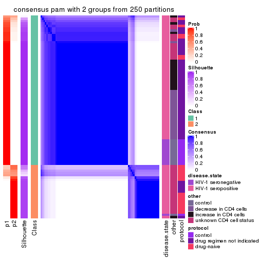</p>

</div>
<div id='tab-ATC-pam-consensus-heatmap-2'>
<pre><code class="r">consensus_heatmap(res, k = 3)
</code></pre>

<p>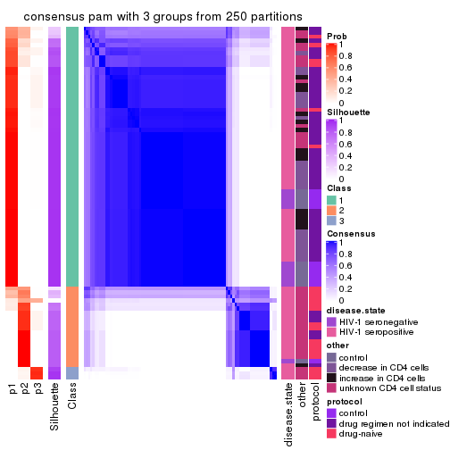</p>

</div>
<div id='tab-ATC-pam-consensus-heatmap-3'>
<pre><code class="r">consensus_heatmap(res, k = 4)
</code></pre>

<p>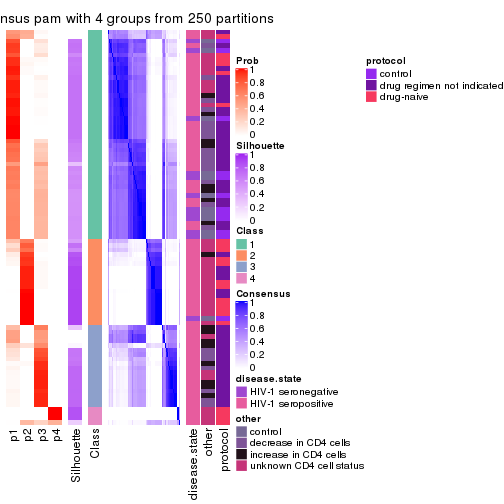</p>

</div>
<div id='tab-ATC-pam-consensus-heatmap-4'>
<pre><code class="r">consensus_heatmap(res, k = 5)
</code></pre>

<p>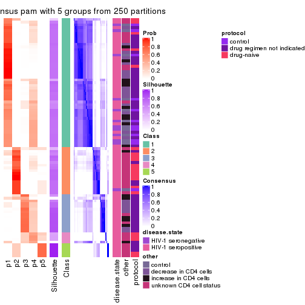</p>

</div>
<div id='tab-ATC-pam-consensus-heatmap-5'>
<pre><code class="r">consensus_heatmap(res, k = 6)
</code></pre>

<p>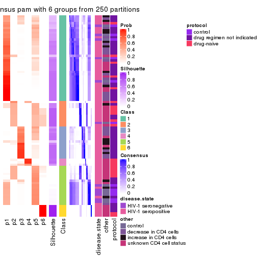</p>

</div>
</div>

Heatmaps for the membership of samples in all partitions to see how consistent they are:


<script>
$( function() {
	$( '#tabs-ATC-pam-membership-heatmap' ).tabs();
} );
</script>
<div id='tabs-ATC-pam-membership-heatmap'>
<ul>
<li><a href='#tab-ATC-pam-membership-heatmap-1'>k = 2</a></li>
<li><a href='#tab-ATC-pam-membership-heatmap-2'>k = 3</a></li>
<li><a href='#tab-ATC-pam-membership-heatmap-3'>k = 4</a></li>
<li><a href='#tab-ATC-pam-membership-heatmap-4'>k = 5</a></li>
<li><a href='#tab-ATC-pam-membership-heatmap-5'>k = 6</a></li>
</ul>
<div id='tab-ATC-pam-membership-heatmap-1'>
<pre><code class="r">membership_heatmap(res, k = 2)
</code></pre>

<p>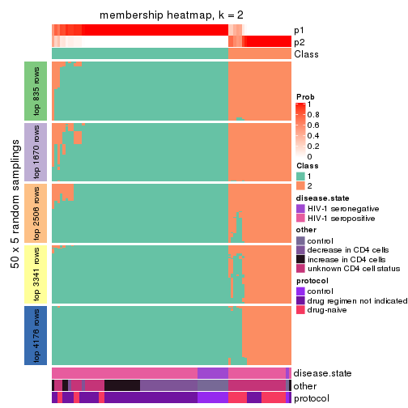</p>

</div>
<div id='tab-ATC-pam-membership-heatmap-2'>
<pre><code class="r">membership_heatmap(res, k = 3)
</code></pre>

<p>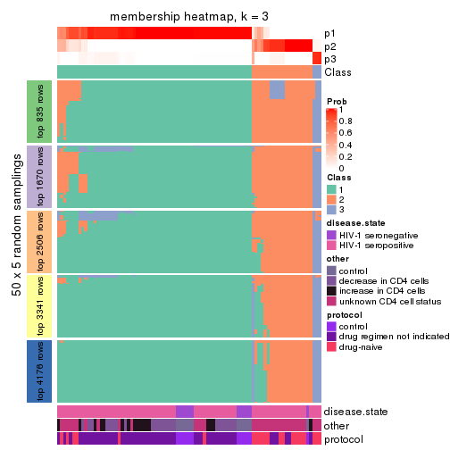</p>

</div>
<div id='tab-ATC-pam-membership-heatmap-3'>
<pre><code class="r">membership_heatmap(res, k = 4)
</code></pre>

<p>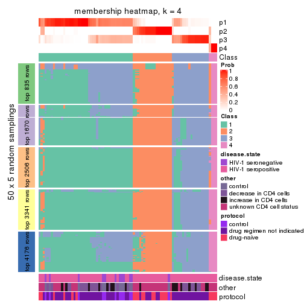</p>

</div>
<div id='tab-ATC-pam-membership-heatmap-4'>
<pre><code class="r">membership_heatmap(res, k = 5)
</code></pre>

<p>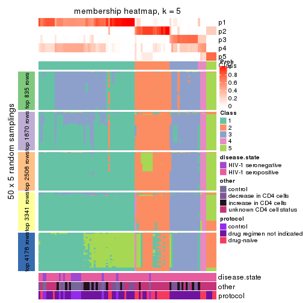</p>

</div>
<div id='tab-ATC-pam-membership-heatmap-5'>
<pre><code class="r">membership_heatmap(res, k = 6)
</code></pre>

<p>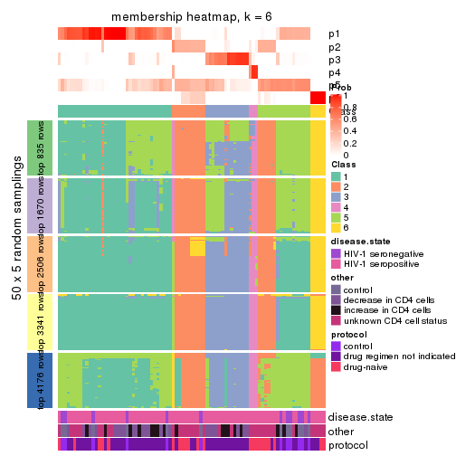</p>

</div>
</div>

As soon as we have had the classes for columns, we can look for signatures
which are significantly different between classes which can be candidate marks
for certain classes. Following are the heatmaps for signatures.


Signature heatmaps where rows are scaled:


<script>
$( function() {
	$( '#tabs-ATC-pam-get-signatures' ).tabs();
} );
</script>
<div id='tabs-ATC-pam-get-signatures'>
<ul>
<li><a href='#tab-ATC-pam-get-signatures-1'>k = 2</a></li>
<li><a href='#tab-ATC-pam-get-signatures-2'>k = 3</a></li>
<li><a href='#tab-ATC-pam-get-signatures-3'>k = 4</a></li>
<li><a href='#tab-ATC-pam-get-signatures-4'>k = 5</a></li>
<li><a href='#tab-ATC-pam-get-signatures-5'>k = 6</a></li>
</ul>
<div id='tab-ATC-pam-get-signatures-1'>
<pre><code class="r">get_signatures(res, k = 2)
</code></pre>

<p>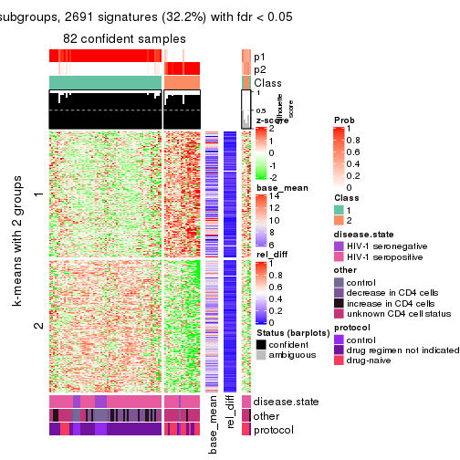</p>

</div>
<div id='tab-ATC-pam-get-signatures-2'>
<pre><code class="r">get_signatures(res, k = 3)
</code></pre>

<p>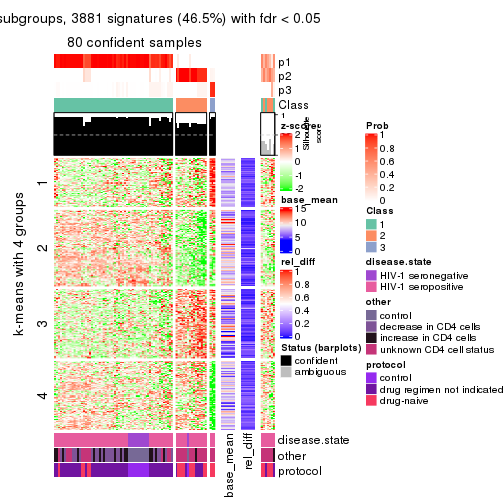</p>

</div>
<div id='tab-ATC-pam-get-signatures-3'>
<pre><code class="r">get_signatures(res, k = 4)
</code></pre>

<p>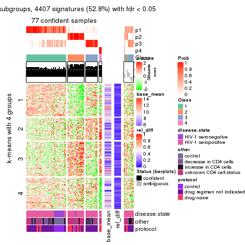</p>

</div>
<div id='tab-ATC-pam-get-signatures-4'>
<pre><code class="r">get_signatures(res, k = 5)
</code></pre>

<p>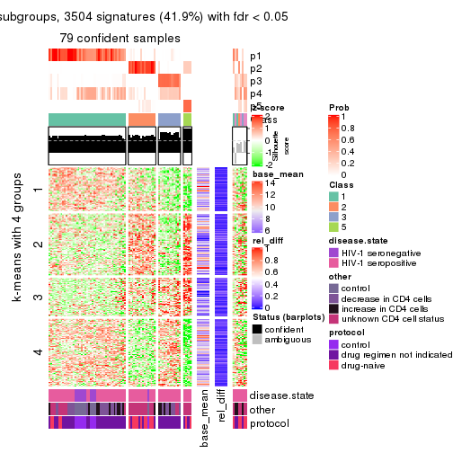</p>

</div>
<div id='tab-ATC-pam-get-signatures-5'>
<pre><code class="r">get_signatures(res, k = 6)
</code></pre>

<p>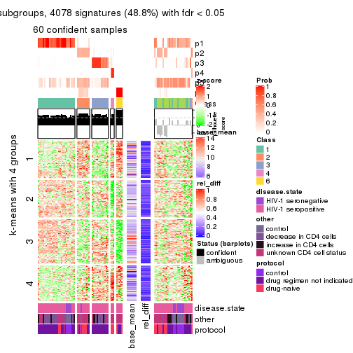</p>

</div>
</div>


Signature heatmaps where rows are not scaled:


<script>
$( function() {
	$( '#tabs-ATC-pam-get-signatures-no-scale' ).tabs();
} );
</script>
<div id='tabs-ATC-pam-get-signatures-no-scale'>
<ul>
<li><a href='#tab-ATC-pam-get-signatures-no-scale-1'>k = 2</a></li>
<li><a href='#tab-ATC-pam-get-signatures-no-scale-2'>k = 3</a></li>
<li><a href='#tab-ATC-pam-get-signatures-no-scale-3'>k = 4</a></li>
<li><a href='#tab-ATC-pam-get-signatures-no-scale-4'>k = 5</a></li>
<li><a href='#tab-ATC-pam-get-signatures-no-scale-5'>k = 6</a></li>
</ul>
<div id='tab-ATC-pam-get-signatures-no-scale-1'>
<pre><code class="r">get_signatures(res, k = 2, scale_rows = FALSE)
</code></pre>

<p>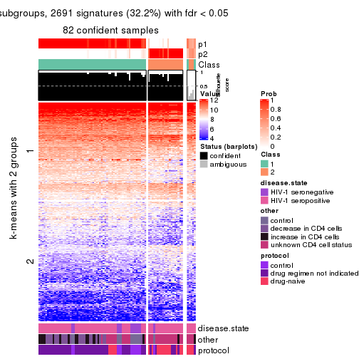</p>

</div>
<div id='tab-ATC-pam-get-signatures-no-scale-2'>
<pre><code class="r">get_signatures(res, k = 3, scale_rows = FALSE)
</code></pre>

<p>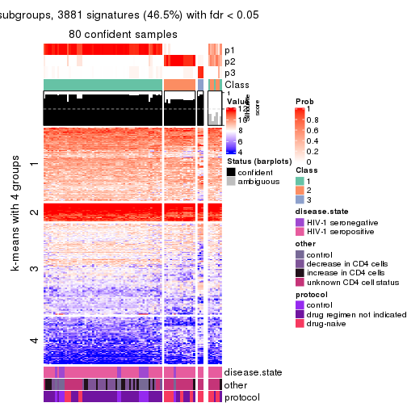</p>

</div>
<div id='tab-ATC-pam-get-signatures-no-scale-3'>
<pre><code class="r">get_signatures(res, k = 4, scale_rows = FALSE)
</code></pre>

<p>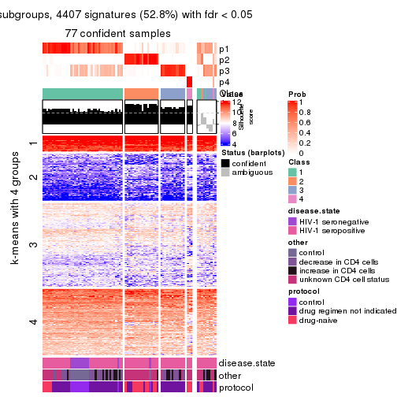</p>

</div>
<div id='tab-ATC-pam-get-signatures-no-scale-4'>
<pre><code class="r">get_signatures(res, k = 5, scale_rows = FALSE)
</code></pre>

<p>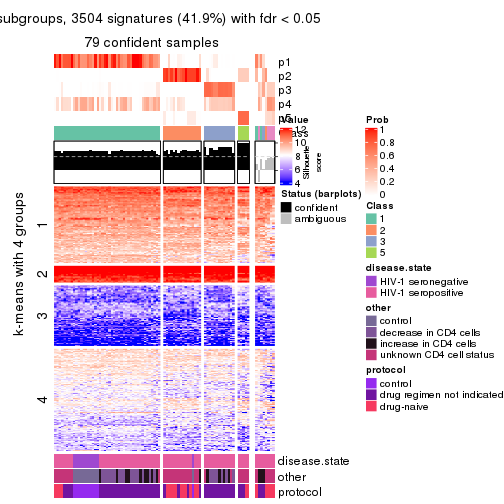</p>

</div>
<div id='tab-ATC-pam-get-signatures-no-scale-5'>
<pre><code class="r">get_signatures(res, k = 6, scale_rows = FALSE)
</code></pre>

<p>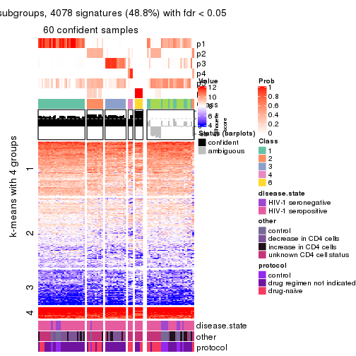</p>

</div>
</div>


Compare the overlap of signatures from different k:

```r
compare_signatures(res)
```

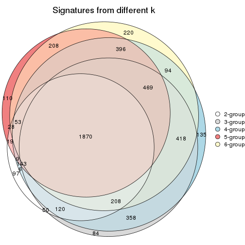

`get_signature()` returns a data frame invisibly. TO get the list of signatures, the function
call should be assigned to a variable explicitly. In following code, if `plot` argument is set
to `FALSE`, no heatmap is plotted while only the differential analysis is performed.

```r
# code only for demonstration
tb = get_signature(res, k = ..., plot = FALSE)
```

An example of the output of `tb` is:

```
#>   which_row         fdr    mean_1    mean_2 scaled_mean_1 scaled_mean_2 km
#> 1        38 0.042760348  8.373488  9.131774    -0.5533452     0.5164555  1
#> 2        40 0.018707592  7.106213  8.469186    -0.6173731     0.5762149  1
#> 3        55 0.019134737 10.221463 11.207825    -0.6159697     0.5749050  1
#> 4        59 0.006059896  5.921854  7.869574    -0.6899429     0.6439467  1
#> 5        60 0.018055526  8.928898 10.211722    -0.6204761     0.5791110  1
#> 6        98 0.009384629 15.714769 14.887706     0.6635654    -0.6193277  2
...
```

The columns in `tb` are:

1. `which_row`: row indices corresponding to the input matrix.
2. `fdr`: FDR for the differential test. 
3. `mean_x`: The mean value in group x.
4. `scaled_mean_x`: The mean value in group x after rows are scaled.
5. `km`: Row groups if k-means clustering is applied to rows.


UMAP plot which shows how samples are separated.


<script>
$( function() {
	$( '#tabs-ATC-pam-dimension-reduction' ).tabs();
} );
</script>
<div id='tabs-ATC-pam-dimension-reduction'>
<ul>
<li><a href='#tab-ATC-pam-dimension-reduction-1'>k = 2</a></li>
<li><a href='#tab-ATC-pam-dimension-reduction-2'>k = 3</a></li>
<li><a href='#tab-ATC-pam-dimension-reduction-3'>k = 4</a></li>
<li><a href='#tab-ATC-pam-dimension-reduction-4'>k = 5</a></li>
<li><a href='#tab-ATC-pam-dimension-reduction-5'>k = 6</a></li>
</ul>
<div id='tab-ATC-pam-dimension-reduction-1'>
<pre><code class="r">dimension_reduction(res, k = 2, method = &quot;UMAP&quot;)
</code></pre>

<p>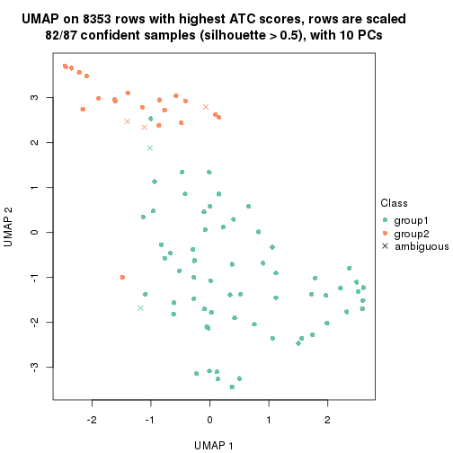</p>

</div>
<div id='tab-ATC-pam-dimension-reduction-2'>
<pre><code class="r">dimension_reduction(res, k = 3, method = &quot;UMAP&quot;)
</code></pre>

<p>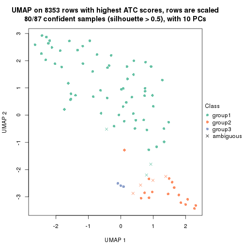</p>

</div>
<div id='tab-ATC-pam-dimension-reduction-3'>
<pre><code class="r">dimension_reduction(res, k = 4, method = &quot;UMAP&quot;)
</code></pre>

<p>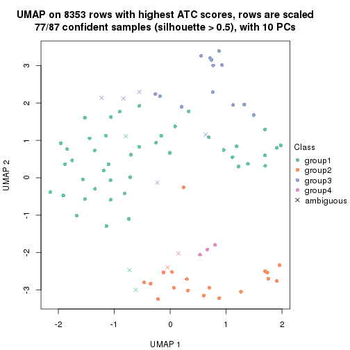</p>

</div>
<div id='tab-ATC-pam-dimension-reduction-4'>
<pre><code class="r">dimension_reduction(res, k = 5, method = &quot;UMAP&quot;)
</code></pre>

<p>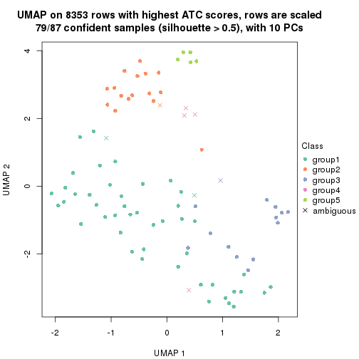</p>

</div>
<div id='tab-ATC-pam-dimension-reduction-5'>
<pre><code class="r">dimension_reduction(res, k = 6, method = &quot;UMAP&quot;)
</code></pre>

<p>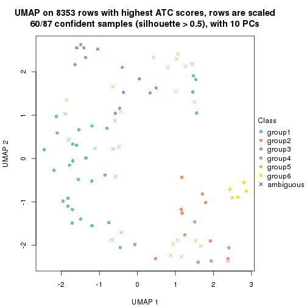</p>

</div>
</div>


Following heatmap shows how subgroups are split when increasing `k`:

```r
collect_classes(res)
```

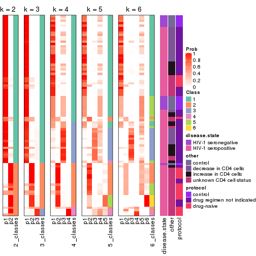


Test correlation between subgroups and known annotations. If the known
annotation is numeric, one-way ANOVA test is applied, and if the known
annotation is discrete, chi-squared contingency table test is applied.

```r
test_to_known_factors(res)
```

```
#>          n disease.state(p) other(p) protocol(p) k
#> ATC:pam 82           0.2992 8.44e-07    5.96e-07 2
#> ATC:pam 80           0.3809 2.38e-05    7.41e-06 3
#> ATC:pam 77           0.0551 1.07e-05    2.05e-06 4
#> ATC:pam 79           0.0655 7.50e-06    2.53e-06 5
#> ATC:pam 60           0.5450 3.78e-03    4.26e-04 6
```


If matrix rows can be associated to genes, consider to use `GO_Enrichment(res,
...)` to perform function enrichment for the signature genes.


 

---------------------------------------------------


### ATC:mclust**


The object with results only for a single top-value method and a single partition method 
can be extracted as:

```r
res = res_list["ATC", "mclust"]
# you can also extract it by
# res = res_list["ATC:mclust"]
```

A summary of `res` and all the functions that can be applied to it:

```r
res
```

```
#> A 'ConsensusPartition' object with k = 2, 3, 4, 5, 6.
#>   On a matrix with 8353 rows and 87 columns.
#>   Top rows (835, 1670, 2506, 3341, 4176) are extracted by 'ATC' method.
#>   Subgroups are detected by 'mclust' method.
#>   Performed in total 1250 partitions by row resampling.
#>   Best k for subgroups seems to be 2.
#> 
#> Following methods can be applied to this 'ConsensusPartition' object:
#>  [1] "cola_report"             "collect_classes"         "collect_plots"          
#>  [4] "collect_stats"           "colnames"                "compare_signatures"     
#>  [7] "consensus_heatmap"       "dimension_reduction"     "functional_enrichment"  
#> [10] "get_anno_col"            "get_anno"                "get_classes"            
#> [13] "get_consensus"           "get_matrix"              "get_membership"         
#> [16] "get_param"               "get_signatures"          "get_stats"              
#> [19] "is_best_k"               "is_stable_k"             "membership_heatmap"     
#> [22] "ncol"                    "nrow"                    "plot_ecdf"              
#> [25] "rownames"                "select_partition_number" "show"                   
#> [28] "suggest_best_k"          "test_to_known_factors"
```

`collect_plots()` function collects all the plots made from `res` for all `k` (number of partitions)
into one single page to provide an easy and fast comparison between different `k`.

```r
collect_plots(res)
```

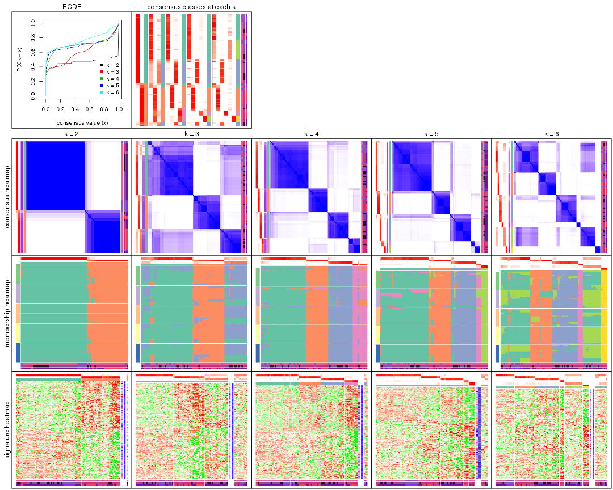

The plots are:

- The first row: a plot of the ECDF (Empirical cumulative distribution
  function) curves of the consensus matrix for each `k` and the heatmap of
  predicted classes for each `k`.
- The second row: heatmaps of the consensus matrix for each `k`.
- The third row: heatmaps of the membership matrix for each `k`.
- The fouth row: heatmaps of the signatures for each `k`.

All the plots in panels can be made by individual functions and they are
plotted later in this section.

`select_partition_number()` produces several plots showing different
statistics for choosing "optimized" `k`. There are following statistics:

- ECDF curves of the consensus matrix for each `k`;
- 1-PAC. [The PAC
  score](https://en.wikipedia.org/wiki/Consensus_clustering#Over-interpretation_potential_of_consensus_clustering)
  measures the proportion of the ambiguous subgrouping.
- Mean silhouette score.
- Concordance. The mean probability of fiting the consensus class ids in all
  partitions.
- Area increased. Denote $A_k$ as the area under the ECDF curve for current
  `k`, the area increased is defined as $A_k - A_{k-1}$.
- Rand index. The percent of pairs of samples that are both in a same cluster
  or both are not in a same cluster in the partition of k and k-1.
- Jaccard index. The ratio of pairs of samples are both in a same cluster in
  the partition of k and k-1 and the pairs of samples are both in a same
  cluster in the partition k or k-1.

The detailed explanations of these statistics can be found in [the cola
vignette](http://bioconductor.org/packages/devel/bioc/vignettes/cola/inst/doc/cola.html#toc_13).

Generally speaking, lower PAC score, higher mean silhouette score or higher
concordance corresponds to better partition. Rand index and Jaccard index
measure how similar the current partition is compared to partition with `k-1`.
If they are too similar, we won't accept `k` is better than `k-1`.

```r
select_partition_number(res)
```

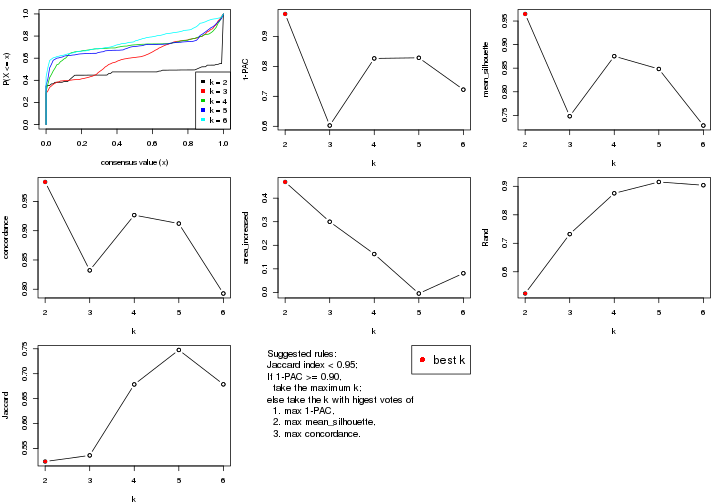

The numeric values for all these statistics can be obtained by `get_stats()`.

```r
get_stats(res)
```

```
#>   k 1-PAC mean_silhouette concordance area_increased  Rand Jaccard
#> 2 2 0.975           0.965       0.983        0.46871 0.524   0.524
#> 3 3 0.603           0.748       0.832        0.29991 0.732   0.536
#> 4 4 0.827           0.875       0.927        0.16281 0.875   0.678
#> 5 5 0.829           0.848       0.912       -0.00469 0.915   0.748
#> 6 6 0.722           0.728       0.793        0.08116 0.904   0.679
```

`suggest_best_k()` suggests the best $k$ based on these statistics. The rules are as follows:

- All $k$ with Jaccard index larger than 0.95 are removed because the increase of
  the partition number does not provides enough extra information. If all $k$ are removed,
  the best $k$ is assigned by `NA`.
- For $k$ with 1-PAC larger than 0.9, the maximal $k$ is taken as the "best k". Other $k$ is called "optional k".
- If it does not fit the second rule. The $k$ with the highest vote of highest
  1-PAC, mean silhouette and concordance is taken as the "best k".

```r
suggest_best_k(res)
```

```
#> [1] 2
```


Following shows the table of the partitions (You need to click the **show/hide
code output** link to see it). The membership matrix (columns with name `p*`)
is inferred by
[`clue::cl_consensus()`](https://www.rdocumentation.org/link/cl_consensus?package=clue)
function with the `SE` method. Basically the value in the membership matrix
represents the probability to belong to a certain group. The finall class
label for an item is determined with the group with highest probability it
belongs to.

In `get_classes()` function, the entropy is calculated from the membership
matrix and the silhouette score is calculated from the consensus matrix.


<script>
$( function() {
	$( '#tabs-ATC-mclust-get-classes' ).tabs();
} );
</script>
<div id='tabs-ATC-mclust-get-classes'>
<ul>
<li><a href='#tab-ATC-mclust-get-classes-1'>k = 2</a></li>
<li><a href='#tab-ATC-mclust-get-classes-2'>k = 3</a></li>
<li><a href='#tab-ATC-mclust-get-classes-3'>k = 4</a></li>
<li><a href='#tab-ATC-mclust-get-classes-4'>k = 5</a></li>
<li><a href='#tab-ATC-mclust-get-classes-5'>k = 6</a></li>
</ul>

<div id='tab-ATC-mclust-get-classes-1'>
<p><a id='tab-ATC-mclust-get-classes-1-a' style='color:#0366d6' href='#'>show/hide code output</a></p>
<pre><code class="r">cbind(get_classes(res, k = 2), get_membership(res, k = 2))
</code></pre>

<pre><code>#&gt;          class entropy silhouette    p1    p2
#&gt; GSM39104     1  0.0000      0.998 1.000 0.000
#&gt; GSM39105     1  0.0000      0.998 1.000 0.000
#&gt; GSM39106     1  0.0000      0.998 1.000 0.000
#&gt; GSM39107     2  0.9358      0.505 0.352 0.648
#&gt; GSM39108     1  0.0000      0.998 1.000 0.000
#&gt; GSM39109     1  0.0672      0.990 0.992 0.008
#&gt; GSM39110     1  0.4562      0.888 0.904 0.096
#&gt; GSM39111     1  0.0000      0.998 1.000 0.000
#&gt; GSM39112     1  0.0000      0.998 1.000 0.000
#&gt; GSM39113     1  0.0000      0.998 1.000 0.000
#&gt; GSM39114     2  0.0000      0.958 0.000 1.000
#&gt; GSM39115     1  0.0000      0.998 1.000 0.000
#&gt; GSM39148     1  0.0000      0.998 1.000 0.000
#&gt; GSM39149     1  0.0000      0.998 1.000 0.000
#&gt; GSM39150     1  0.0000      0.998 1.000 0.000
#&gt; GSM39151     1  0.0000      0.998 1.000 0.000
#&gt; GSM39152     1  0.0000      0.998 1.000 0.000
#&gt; GSM39153     1  0.0000      0.998 1.000 0.000
#&gt; GSM39154     1  0.0000      0.998 1.000 0.000
#&gt; GSM39155     1  0.0000      0.998 1.000 0.000
#&gt; GSM39156     1  0.0000      0.998 1.000 0.000
#&gt; GSM39157     1  0.0000      0.998 1.000 0.000
#&gt; GSM39158     1  0.0000      0.998 1.000 0.000
#&gt; GSM39159     1  0.0000      0.998 1.000 0.000
#&gt; GSM39160     1  0.0000      0.998 1.000 0.000
#&gt; GSM39161     1  0.0000      0.998 1.000 0.000
#&gt; GSM39162     1  0.0000      0.998 1.000 0.000
#&gt; GSM39163     1  0.0000      0.998 1.000 0.000
#&gt; GSM39164     1  0.0000      0.998 1.000 0.000
#&gt; GSM39165     1  0.0000      0.998 1.000 0.000
#&gt; GSM39166     1  0.0000      0.998 1.000 0.000
#&gt; GSM39167     1  0.0000      0.998 1.000 0.000
#&gt; GSM39168     1  0.0000      0.998 1.000 0.000
#&gt; GSM39169     1  0.0000      0.998 1.000 0.000
#&gt; GSM39170     1  0.0000      0.998 1.000 0.000
#&gt; GSM39171     1  0.0000      0.998 1.000 0.000
#&gt; GSM39172     1  0.0000      0.998 1.000 0.000
#&gt; GSM39173     2  0.0000      0.958 0.000 1.000
#&gt; GSM39174     1  0.0000      0.998 1.000 0.000
#&gt; GSM39175     1  0.0000      0.998 1.000 0.000
#&gt; GSM39176     1  0.0000      0.998 1.000 0.000
#&gt; GSM39177     1  0.0000      0.998 1.000 0.000
#&gt; GSM39178     1  0.0000      0.998 1.000 0.000
#&gt; GSM39179     1  0.0000      0.998 1.000 0.000
#&gt; GSM39180     2  0.2778      0.927 0.048 0.952
#&gt; GSM39181     1  0.0000      0.998 1.000 0.000
#&gt; GSM39182     2  0.5946      0.837 0.144 0.856
#&gt; GSM39183     1  0.0000      0.998 1.000 0.000
#&gt; GSM39184     1  0.0000      0.998 1.000 0.000
#&gt; GSM39185     2  0.9460      0.480 0.364 0.636
#&gt; GSM39186     1  0.0000      0.998 1.000 0.000
#&gt; GSM39187     1  0.0000      0.998 1.000 0.000
#&gt; GSM39116     2  0.0000      0.958 0.000 1.000
#&gt; GSM39117     2  0.0000      0.958 0.000 1.000
#&gt; GSM39118     2  0.0000      0.958 0.000 1.000
#&gt; GSM39119     2  0.0000      0.958 0.000 1.000
#&gt; GSM39120     1  0.0000      0.998 1.000 0.000
#&gt; GSM39121     2  0.5629      0.855 0.132 0.868
#&gt; GSM39122     2  0.5408      0.862 0.124 0.876
#&gt; GSM39123     2  0.0000      0.958 0.000 1.000
#&gt; GSM39124     2  0.0000      0.958 0.000 1.000
#&gt; GSM39125     1  0.0000      0.998 1.000 0.000
#&gt; GSM39126     2  0.1843      0.941 0.028 0.972
#&gt; GSM39127     2  0.0000      0.958 0.000 1.000
#&gt; GSM39128     2  0.0000      0.958 0.000 1.000
#&gt; GSM39129     2  0.0000      0.958 0.000 1.000
#&gt; GSM39130     2  0.0000      0.958 0.000 1.000
#&gt; GSM39131     2  0.0000      0.958 0.000 1.000
#&gt; GSM39132     2  0.0000      0.958 0.000 1.000
#&gt; GSM39133     2  0.0000      0.958 0.000 1.000
#&gt; GSM39134     2  0.0000      0.958 0.000 1.000
#&gt; GSM39135     2  0.0000      0.958 0.000 1.000
#&gt; GSM39136     2  0.0000      0.958 0.000 1.000
#&gt; GSM39137     2  0.0000      0.958 0.000 1.000
#&gt; GSM39138     2  0.0000      0.958 0.000 1.000
#&gt; GSM39139     2  0.0000      0.958 0.000 1.000
#&gt; GSM39140     2  0.6247      0.829 0.156 0.844
#&gt; GSM39141     1  0.0000      0.998 1.000 0.000
#&gt; GSM39142     1  0.0000      0.998 1.000 0.000
#&gt; GSM39143     1  0.0000      0.998 1.000 0.000
#&gt; GSM39144     2  0.0000      0.958 0.000 1.000
#&gt; GSM39145     2  0.0000      0.958 0.000 1.000
#&gt; GSM39146     2  0.0000      0.958 0.000 1.000
#&gt; GSM39147     2  0.0000      0.958 0.000 1.000
#&gt; GSM39188     1  0.0000      0.998 1.000 0.000
#&gt; GSM39189     1  0.0000      0.998 1.000 0.000
#&gt; GSM39190     1  0.0000      0.998 1.000 0.000
</code></pre>

<script>
$('#tab-ATC-mclust-get-classes-1-a').parent().next().next().hide();
$('#tab-ATC-mclust-get-classes-1-a').click(function(){
  $('#tab-ATC-mclust-get-classes-1-a').parent().next().next().toggle();
  return(false);
});
</script>
</div>

<div id='tab-ATC-mclust-get-classes-2'>
<p><a id='tab-ATC-mclust-get-classes-2-a' style='color:#0366d6' href='#'>show/hide code output</a></p>
<pre><code class="r">cbind(get_classes(res, k = 3), get_membership(res, k = 3))
</code></pre>

<pre><code>#&gt;          class entropy silhouette    p1    p2    p3
#&gt; GSM39104     1  0.2625     0.7605 0.916 0.000 0.084
#&gt; GSM39105     1  0.0747     0.8058 0.984 0.000 0.016
#&gt; GSM39106     1  0.1529     0.7970 0.960 0.000 0.040
#&gt; GSM39107     1  0.7756    -0.0450 0.564 0.056 0.380
#&gt; GSM39108     1  0.1163     0.8025 0.972 0.000 0.028
#&gt; GSM39109     1  0.7325    -0.0308 0.576 0.036 0.388
#&gt; GSM39110     1  0.3456     0.7503 0.904 0.036 0.060
#&gt; GSM39111     1  0.1643     0.8010 0.956 0.000 0.044
#&gt; GSM39112     1  0.3192     0.7268 0.888 0.000 0.112
#&gt; GSM39113     1  0.7245     0.0201 0.596 0.036 0.368
#&gt; GSM39114     2  0.0747     0.9197 0.000 0.984 0.016
#&gt; GSM39115     1  0.6879     0.0558 0.616 0.024 0.360
#&gt; GSM39148     1  0.1031     0.8053 0.976 0.000 0.024
#&gt; GSM39149     3  0.6291     0.6572 0.468 0.000 0.532
#&gt; GSM39150     3  0.6079     0.8292 0.388 0.000 0.612
#&gt; GSM39151     3  0.5621     0.8987 0.308 0.000 0.692
#&gt; GSM39152     3  0.6062     0.8344 0.384 0.000 0.616
#&gt; GSM39153     1  0.0592     0.8065 0.988 0.000 0.012
#&gt; GSM39154     1  0.1163     0.7959 0.972 0.000 0.028
#&gt; GSM39155     1  0.1031     0.7989 0.976 0.000 0.024
#&gt; GSM39156     1  0.0592     0.8065 0.988 0.000 0.012
#&gt; GSM39157     1  0.0592     0.8065 0.988 0.000 0.012
#&gt; GSM39158     1  0.5733     0.2544 0.676 0.000 0.324
#&gt; GSM39159     3  0.5905     0.8653 0.352 0.000 0.648
#&gt; GSM39160     3  0.6204     0.7646 0.424 0.000 0.576
#&gt; GSM39161     3  0.5591     0.8967 0.304 0.000 0.696
#&gt; GSM39162     1  0.1289     0.7998 0.968 0.000 0.032
#&gt; GSM39163     1  0.1031     0.7989 0.976 0.000 0.024
#&gt; GSM39164     1  0.1163     0.8058 0.972 0.000 0.028
#&gt; GSM39165     1  0.4974     0.4793 0.764 0.000 0.236
#&gt; GSM39166     3  0.5706     0.8922 0.320 0.000 0.680
#&gt; GSM39167     1  0.0592     0.8067 0.988 0.000 0.012
#&gt; GSM39168     1  0.1289     0.7998 0.968 0.000 0.032
#&gt; GSM39169     1  0.0892     0.8064 0.980 0.000 0.020
#&gt; GSM39170     1  0.3116     0.7248 0.892 0.000 0.108
#&gt; GSM39171     1  0.1753     0.8010 0.952 0.000 0.048
#&gt; GSM39172     3  0.5591     0.8967 0.304 0.000 0.696
#&gt; GSM39173     2  0.2796     0.9173 0.000 0.908 0.092
#&gt; GSM39174     1  0.0592     0.8065 0.988 0.000 0.012
#&gt; GSM39175     1  0.1643     0.7968 0.956 0.000 0.044
#&gt; GSM39176     1  0.1031     0.7990 0.976 0.000 0.024
#&gt; GSM39177     1  0.6215    -0.3336 0.572 0.000 0.428
#&gt; GSM39178     3  0.5760     0.8880 0.328 0.000 0.672
#&gt; GSM39179     3  0.5650     0.8979 0.312 0.000 0.688
#&gt; GSM39180     3  0.7297     0.7110 0.188 0.108 0.704
#&gt; GSM39181     3  0.5810     0.8828 0.336 0.000 0.664
#&gt; GSM39182     3  0.9452     0.5796 0.232 0.268 0.500
#&gt; GSM39183     3  0.5621     0.8973 0.308 0.000 0.692
#&gt; GSM39184     1  0.1163     0.8044 0.972 0.000 0.028
#&gt; GSM39185     3  0.6927     0.8212 0.240 0.060 0.700
#&gt; GSM39186     1  0.1289     0.8063 0.968 0.000 0.032
#&gt; GSM39187     1  0.0592     0.8047 0.988 0.000 0.012
#&gt; GSM39116     2  0.1163     0.9203 0.000 0.972 0.028
#&gt; GSM39117     2  0.5327     0.8232 0.000 0.728 0.272
#&gt; GSM39118     2  0.2066     0.9201 0.000 0.940 0.060
#&gt; GSM39119     2  0.3551     0.8980 0.000 0.868 0.132
#&gt; GSM39120     1  0.1860     0.7958 0.948 0.000 0.052
#&gt; GSM39121     1  0.7773     0.3821 0.612 0.316 0.072
#&gt; GSM39122     1  0.7944     0.3309 0.580 0.348 0.072
#&gt; GSM39123     2  0.5327     0.8232 0.000 0.728 0.272
#&gt; GSM39124     2  0.0747     0.9197 0.000 0.984 0.016
#&gt; GSM39125     1  0.5988     0.0614 0.632 0.000 0.368
#&gt; GSM39126     2  0.7558     0.5074 0.284 0.644 0.072
#&gt; GSM39127     2  0.0892     0.9201 0.000 0.980 0.020
#&gt; GSM39128     2  0.1529     0.9100 0.000 0.960 0.040
#&gt; GSM39129     2  0.3412     0.8996 0.000 0.876 0.124
#&gt; GSM39130     2  0.5327     0.8232 0.000 0.728 0.272
#&gt; GSM39131     2  0.1289     0.9140 0.000 0.968 0.032
#&gt; GSM39132     2  0.0747     0.9197 0.000 0.984 0.016
#&gt; GSM39133     2  0.5327     0.8232 0.000 0.728 0.272
#&gt; GSM39134     2  0.2448     0.9139 0.000 0.924 0.076
#&gt; GSM39135     2  0.1163     0.9203 0.000 0.972 0.028
#&gt; GSM39136     2  0.2711     0.9122 0.000 0.912 0.088
#&gt; GSM39137     2  0.1163     0.9156 0.000 0.972 0.028
#&gt; GSM39138     2  0.2448     0.9139 0.000 0.924 0.076
#&gt; GSM39139     2  0.2448     0.9139 0.000 0.924 0.076
#&gt; GSM39140     1  0.7545     0.4308 0.652 0.272 0.076
#&gt; GSM39141     1  0.0892     0.8061 0.980 0.000 0.020
#&gt; GSM39142     1  0.2878     0.7426 0.904 0.000 0.096
#&gt; GSM39143     1  0.1031     0.8051 0.976 0.000 0.024
#&gt; GSM39144     2  0.2448     0.9139 0.000 0.924 0.076
#&gt; GSM39145     2  0.0892     0.9203 0.000 0.980 0.020
#&gt; GSM39146     2  0.2261     0.9015 0.000 0.932 0.068
#&gt; GSM39147     2  0.0747     0.9197 0.000 0.984 0.016
#&gt; GSM39188     3  0.5621     0.8987 0.308 0.000 0.692
#&gt; GSM39189     3  0.5621     0.8987 0.308 0.000 0.692
#&gt; GSM39190     3  0.5621     0.8987 0.308 0.000 0.692
</code></pre>

<script>
$('#tab-ATC-mclust-get-classes-2-a').parent().next().next().hide();
$('#tab-ATC-mclust-get-classes-2-a').click(function(){
  $('#tab-ATC-mclust-get-classes-2-a').parent().next().next().toggle();
  return(false);
});
</script>
</div>

<div id='tab-ATC-mclust-get-classes-3'>
<p><a id='tab-ATC-mclust-get-classes-3-a' style='color:#0366d6' href='#'>show/hide code output</a></p>
<pre><code class="r">cbind(get_classes(res, k = 4), get_membership(res, k = 4))
</code></pre>

<pre><code>#&gt;          class entropy silhouette    p1    p2    p3    p4
#&gt; GSM39104     1  0.1867     0.9201 0.928 0.000 0.072 0.000
#&gt; GSM39105     1  0.0188     0.9298 0.996 0.000 0.004 0.000
#&gt; GSM39106     1  0.0817     0.9334 0.976 0.000 0.024 0.000
#&gt; GSM39107     1  0.7231     0.0654 0.464 0.144 0.392 0.000
#&gt; GSM39108     1  0.0895     0.9339 0.976 0.004 0.020 0.000
#&gt; GSM39109     3  0.6600     0.1816 0.396 0.084 0.520 0.000
#&gt; GSM39110     1  0.4332     0.8169 0.816 0.112 0.072 0.000
#&gt; GSM39111     1  0.1211     0.9322 0.960 0.000 0.040 0.000
#&gt; GSM39112     1  0.2500     0.9197 0.916 0.044 0.040 0.000
#&gt; GSM39113     1  0.5109     0.7424 0.744 0.060 0.196 0.000
#&gt; GSM39114     2  0.0188     0.9619 0.000 0.996 0.000 0.004
#&gt; GSM39115     1  0.3899     0.8553 0.840 0.052 0.108 0.000
#&gt; GSM39148     1  0.2131     0.9269 0.932 0.036 0.032 0.000
#&gt; GSM39149     3  0.2216     0.8722 0.092 0.000 0.908 0.000
#&gt; GSM39150     3  0.1474     0.8969 0.052 0.000 0.948 0.000
#&gt; GSM39151     3  0.0188     0.9062 0.004 0.000 0.996 0.000
#&gt; GSM39152     3  0.2011     0.8807 0.080 0.000 0.920 0.000
#&gt; GSM39153     1  0.0592     0.9327 0.984 0.000 0.016 0.000
#&gt; GSM39154     1  0.0000     0.9282 1.000 0.000 0.000 0.000
#&gt; GSM39155     1  0.0000     0.9282 1.000 0.000 0.000 0.000
#&gt; GSM39156     1  0.0469     0.9322 0.988 0.000 0.012 0.000
#&gt; GSM39157     1  0.1452     0.9321 0.956 0.008 0.036 0.000
#&gt; GSM39158     1  0.4500     0.5889 0.684 0.000 0.316 0.000
#&gt; GSM39159     3  0.2647     0.8412 0.120 0.000 0.880 0.000
#&gt; GSM39160     3  0.2081     0.8780 0.084 0.000 0.916 0.000
#&gt; GSM39161     3  0.0188     0.9039 0.004 0.000 0.996 0.000
#&gt; GSM39162     1  0.2131     0.9277 0.932 0.032 0.036 0.000
#&gt; GSM39163     1  0.0336     0.9311 0.992 0.000 0.008 0.000
#&gt; GSM39164     1  0.0000     0.9282 1.000 0.000 0.000 0.000
#&gt; GSM39165     1  0.4164     0.6594 0.736 0.000 0.264 0.000
#&gt; GSM39166     3  0.0592     0.9092 0.016 0.000 0.984 0.000
#&gt; GSM39167     1  0.0336     0.9311 0.992 0.000 0.008 0.000
#&gt; GSM39168     1  0.2131     0.9277 0.932 0.032 0.036 0.000
#&gt; GSM39169     1  0.1624     0.9313 0.952 0.020 0.028 0.000
#&gt; GSM39170     1  0.1398     0.9323 0.956 0.004 0.040 0.000
#&gt; GSM39171     1  0.0817     0.9332 0.976 0.000 0.024 0.000
#&gt; GSM39172     3  0.0469     0.9084 0.012 0.000 0.988 0.000
#&gt; GSM39173     4  0.3870     0.7998 0.000 0.208 0.004 0.788
#&gt; GSM39174     1  0.1305     0.9317 0.960 0.004 0.036 0.000
#&gt; GSM39175     1  0.0817     0.9328 0.976 0.000 0.024 0.000
#&gt; GSM39176     1  0.0592     0.9331 0.984 0.000 0.016 0.000
#&gt; GSM39177     3  0.3873     0.7199 0.228 0.000 0.772 0.000
#&gt; GSM39178     3  0.0817     0.9087 0.024 0.000 0.976 0.000
#&gt; GSM39179     3  0.0469     0.9088 0.012 0.000 0.988 0.000
#&gt; GSM39180     4  0.6421     0.2443 0.004 0.056 0.432 0.508
#&gt; GSM39181     3  0.1118     0.9013 0.036 0.000 0.964 0.000
#&gt; GSM39182     3  0.4019     0.7956 0.008 0.076 0.848 0.068
#&gt; GSM39183     3  0.0469     0.9084 0.012 0.000 0.988 0.000
#&gt; GSM39184     1  0.0592     0.9331 0.984 0.000 0.016 0.000
#&gt; GSM39185     3  0.1892     0.8665 0.004 0.036 0.944 0.016
#&gt; GSM39186     1  0.0707     0.9331 0.980 0.000 0.020 0.000
#&gt; GSM39187     1  0.0000     0.9282 1.000 0.000 0.000 0.000
#&gt; GSM39116     2  0.0657     0.9625 0.000 0.984 0.004 0.012
#&gt; GSM39117     4  0.0000     0.8719 0.000 0.000 0.000 1.000
#&gt; GSM39118     2  0.1389     0.9408 0.000 0.952 0.000 0.048
#&gt; GSM39119     4  0.2530     0.8948 0.000 0.112 0.000 0.888
#&gt; GSM39120     1  0.1305     0.9324 0.960 0.004 0.036 0.000
#&gt; GSM39121     2  0.1890     0.9053 0.056 0.936 0.008 0.000
#&gt; GSM39122     2  0.1151     0.9397 0.024 0.968 0.008 0.000
#&gt; GSM39123     4  0.0000     0.8719 0.000 0.000 0.000 1.000
#&gt; GSM39124     2  0.0336     0.9628 0.000 0.992 0.000 0.008
#&gt; GSM39125     1  0.3743     0.8370 0.824 0.016 0.160 0.000
#&gt; GSM39126     2  0.0657     0.9516 0.012 0.984 0.004 0.000
#&gt; GSM39127     2  0.0469     0.9631 0.000 0.988 0.000 0.012
#&gt; GSM39128     2  0.0592     0.9627 0.000 0.984 0.000 0.016
#&gt; GSM39129     4  0.2530     0.8948 0.000 0.112 0.000 0.888
#&gt; GSM39130     4  0.0000     0.8719 0.000 0.000 0.000 1.000
#&gt; GSM39131     2  0.0592     0.9627 0.000 0.984 0.000 0.016
#&gt; GSM39132     2  0.0469     0.9631 0.000 0.988 0.000 0.012
#&gt; GSM39133     4  0.0188     0.8733 0.000 0.004 0.000 0.996
#&gt; GSM39134     4  0.2589     0.8946 0.000 0.116 0.000 0.884
#&gt; GSM39135     2  0.0469     0.9631 0.000 0.988 0.000 0.012
#&gt; GSM39136     2  0.3751     0.7476 0.000 0.800 0.004 0.196
#&gt; GSM39137     2  0.0188     0.9619 0.000 0.996 0.000 0.004
#&gt; GSM39138     4  0.2589     0.8946 0.000 0.116 0.000 0.884
#&gt; GSM39139     4  0.2647     0.8932 0.000 0.120 0.000 0.880
#&gt; GSM39140     2  0.2546     0.8535 0.092 0.900 0.008 0.000
#&gt; GSM39141     1  0.2036     0.9278 0.936 0.032 0.032 0.000
#&gt; GSM39142     1  0.1635     0.9311 0.948 0.008 0.044 0.000
#&gt; GSM39143     1  0.2021     0.9295 0.936 0.024 0.040 0.000
#&gt; GSM39144     4  0.2589     0.8946 0.000 0.116 0.000 0.884
#&gt; GSM39145     2  0.0817     0.9551 0.000 0.976 0.000 0.024
#&gt; GSM39146     2  0.0779     0.9620 0.000 0.980 0.004 0.016
#&gt; GSM39147     2  0.0336     0.9628 0.000 0.992 0.000 0.008
#&gt; GSM39188     3  0.0188     0.9062 0.004 0.000 0.996 0.000
#&gt; GSM39189     3  0.0469     0.9088 0.012 0.000 0.988 0.000
#&gt; GSM39190     3  0.0188     0.9062 0.004 0.000 0.996 0.000
</code></pre>

<script>
$('#tab-ATC-mclust-get-classes-3-a').parent().next().next().hide();
$('#tab-ATC-mclust-get-classes-3-a').click(function(){
  $('#tab-ATC-mclust-get-classes-3-a').parent().next().next().toggle();
  return(false);
});
</script>
</div>

<div id='tab-ATC-mclust-get-classes-4'>
<p><a id='tab-ATC-mclust-get-classes-4-a' style='color:#0366d6' href='#'>show/hide code output</a></p>
<pre><code class="r">cbind(get_classes(res, k = 5), get_membership(res, k = 5))
</code></pre>

<pre><code>#&gt;          class entropy silhouette    p1    p2    p3    p4    p5
#&gt; GSM39104     1  0.1579     0.9191 0.944 0.000 0.024 0.032 0.000
#&gt; GSM39105     1  0.0963     0.9211 0.964 0.000 0.000 0.036 0.000
#&gt; GSM39106     1  0.1281     0.9277 0.956 0.000 0.012 0.032 0.000
#&gt; GSM39107     1  0.3067     0.9067 0.876 0.016 0.040 0.068 0.000
#&gt; GSM39108     1  0.1704     0.9217 0.928 0.000 0.004 0.068 0.000
#&gt; GSM39109     1  0.2696     0.9149 0.896 0.012 0.040 0.052 0.000
#&gt; GSM39110     1  0.3274     0.8989 0.868 0.048 0.024 0.060 0.000
#&gt; GSM39111     1  0.1195     0.9232 0.960 0.000 0.028 0.012 0.000
#&gt; GSM39112     1  0.2463     0.9106 0.888 0.008 0.004 0.100 0.000
#&gt; GSM39113     1  0.2741     0.9136 0.892 0.012 0.032 0.064 0.000
#&gt; GSM39114     2  0.0162     0.8914 0.000 0.996 0.000 0.000 0.004
#&gt; GSM39115     1  0.2199     0.9187 0.916 0.016 0.008 0.060 0.000
#&gt; GSM39148     1  0.2339     0.9119 0.892 0.004 0.004 0.100 0.000
#&gt; GSM39149     3  0.0955     0.8573 0.028 0.000 0.968 0.004 0.000
#&gt; GSM39150     3  0.0880     0.8575 0.032 0.000 0.968 0.000 0.000
#&gt; GSM39151     3  0.1300     0.8534 0.016 0.000 0.956 0.028 0.000
#&gt; GSM39152     3  0.0880     0.8575 0.032 0.000 0.968 0.000 0.000
#&gt; GSM39153     1  0.0963     0.9211 0.964 0.000 0.000 0.036 0.000
#&gt; GSM39154     1  0.0963     0.9211 0.964 0.000 0.000 0.036 0.000
#&gt; GSM39155     1  0.0963     0.9211 0.964 0.000 0.000 0.036 0.000
#&gt; GSM39156     1  0.0963     0.9211 0.964 0.000 0.000 0.036 0.000
#&gt; GSM39157     1  0.2228     0.9133 0.900 0.004 0.004 0.092 0.000
#&gt; GSM39158     1  0.1970     0.9109 0.924 0.004 0.060 0.012 0.000
#&gt; GSM39159     3  0.4552     0.1249 0.468 0.000 0.524 0.008 0.000
#&gt; GSM39160     3  0.0880     0.8575 0.032 0.000 0.968 0.000 0.000
#&gt; GSM39161     3  0.1300     0.8534 0.016 0.000 0.956 0.028 0.000
#&gt; GSM39162     1  0.2228     0.9133 0.900 0.004 0.004 0.092 0.000
#&gt; GSM39163     1  0.0963     0.9211 0.964 0.000 0.000 0.036 0.000
#&gt; GSM39164     1  0.0880     0.9220 0.968 0.000 0.000 0.032 0.000
#&gt; GSM39165     3  0.3932     0.5027 0.328 0.000 0.672 0.000 0.000
#&gt; GSM39166     3  0.1012     0.8564 0.020 0.000 0.968 0.012 0.000
#&gt; GSM39167     1  0.0963     0.9211 0.964 0.000 0.000 0.036 0.000
#&gt; GSM39168     1  0.2228     0.9133 0.900 0.004 0.004 0.092 0.000
#&gt; GSM39169     1  0.1928     0.9203 0.920 0.004 0.004 0.072 0.000
#&gt; GSM39170     1  0.0609     0.9280 0.980 0.000 0.000 0.020 0.000
#&gt; GSM39171     1  0.1117     0.9246 0.964 0.000 0.016 0.020 0.000
#&gt; GSM39172     3  0.1386     0.8541 0.016 0.000 0.952 0.032 0.000
#&gt; GSM39173     2  0.1544     0.8490 0.000 0.932 0.000 0.000 0.068
#&gt; GSM39174     1  0.1704     0.9218 0.928 0.000 0.004 0.068 0.000
#&gt; GSM39175     1  0.1041     0.9228 0.964 0.000 0.004 0.032 0.000
#&gt; GSM39176     1  0.0703     0.9246 0.976 0.000 0.000 0.024 0.000
#&gt; GSM39177     3  0.0963     0.8558 0.036 0.000 0.964 0.000 0.000
#&gt; GSM39178     3  0.1012     0.8564 0.020 0.000 0.968 0.012 0.000
#&gt; GSM39179     3  0.1117     0.8549 0.016 0.000 0.964 0.020 0.000
#&gt; GSM39180     3  0.5496     0.5725 0.016 0.100 0.712 0.012 0.160
#&gt; GSM39181     3  0.4641     0.1702 0.456 0.000 0.532 0.012 0.000
#&gt; GSM39182     3  0.2734     0.7591 0.100 0.004 0.880 0.012 0.004
#&gt; GSM39183     3  0.1012     0.8564 0.020 0.000 0.968 0.012 0.000
#&gt; GSM39184     1  0.0290     0.9262 0.992 0.000 0.000 0.008 0.000
#&gt; GSM39185     3  0.3113     0.7843 0.016 0.080 0.876 0.020 0.008
#&gt; GSM39186     1  0.1041     0.9228 0.964 0.000 0.004 0.032 0.000
#&gt; GSM39187     1  0.0963     0.9211 0.964 0.000 0.000 0.036 0.000
#&gt; GSM39116     2  0.0566     0.8919 0.000 0.984 0.012 0.000 0.004
#&gt; GSM39117     4  0.2813     0.9591 0.000 0.000 0.000 0.832 0.168
#&gt; GSM39118     2  0.0807     0.8896 0.000 0.976 0.012 0.000 0.012
#&gt; GSM39119     2  0.3550     0.6570 0.000 0.760 0.000 0.004 0.236
#&gt; GSM39120     1  0.0566     0.9279 0.984 0.000 0.004 0.012 0.000
#&gt; GSM39121     1  0.5604     0.0638 0.472 0.456 0.000 0.072 0.000
#&gt; GSM39122     2  0.5459     0.2829 0.360 0.568 0.000 0.072 0.000
#&gt; GSM39123     4  0.2813     0.9591 0.000 0.000 0.000 0.832 0.168
#&gt; GSM39124     2  0.0162     0.8914 0.000 0.996 0.000 0.000 0.004
#&gt; GSM39125     1  0.1461     0.9233 0.952 0.004 0.028 0.016 0.000
#&gt; GSM39126     2  0.3752     0.4666 0.292 0.708 0.000 0.000 0.000
#&gt; GSM39127     2  0.0566     0.8919 0.000 0.984 0.012 0.000 0.004
#&gt; GSM39128     2  0.0566     0.8919 0.000 0.984 0.012 0.000 0.004
#&gt; GSM39129     5  0.0162     0.9876 0.000 0.000 0.000 0.004 0.996
#&gt; GSM39130     4  0.2813     0.9591 0.000 0.000 0.000 0.832 0.168
#&gt; GSM39131     2  0.0000     0.8912 0.000 1.000 0.000 0.000 0.000
#&gt; GSM39132     2  0.0865     0.8870 0.000 0.972 0.004 0.000 0.024
#&gt; GSM39133     4  0.4199     0.8744 0.000 0.056 0.000 0.764 0.180
#&gt; GSM39134     5  0.0000     0.9903 0.000 0.000 0.000 0.000 1.000
#&gt; GSM39135     2  0.0566     0.8919 0.000 0.984 0.012 0.000 0.004
#&gt; GSM39136     2  0.2561     0.7763 0.000 0.856 0.000 0.000 0.144
#&gt; GSM39137     2  0.0000     0.8912 0.000 1.000 0.000 0.000 0.000
#&gt; GSM39138     5  0.0000     0.9903 0.000 0.000 0.000 0.000 1.000
#&gt; GSM39139     5  0.0609     0.9661 0.000 0.020 0.000 0.000 0.980
#&gt; GSM39140     1  0.4645     0.7204 0.724 0.204 0.000 0.072 0.000
#&gt; GSM39141     1  0.2339     0.9119 0.892 0.004 0.004 0.100 0.000
#&gt; GSM39142     1  0.2568     0.9093 0.888 0.016 0.004 0.092 0.000
#&gt; GSM39143     1  0.2339     0.9119 0.892 0.004 0.004 0.100 0.000
#&gt; GSM39144     5  0.0000     0.9903 0.000 0.000 0.000 0.000 1.000
#&gt; GSM39145     2  0.0290     0.8903 0.000 0.992 0.000 0.000 0.008
#&gt; GSM39146     2  0.0566     0.8919 0.000 0.984 0.012 0.000 0.004
#&gt; GSM39147     2  0.0162     0.8914 0.000 0.996 0.000 0.000 0.004
#&gt; GSM39188     3  0.1300     0.8534 0.016 0.000 0.956 0.028 0.000
#&gt; GSM39189     3  0.1300     0.8534 0.016 0.000 0.956 0.028 0.000
#&gt; GSM39190     3  0.1300     0.8534 0.016 0.000 0.956 0.028 0.000
</code></pre>

<script>
$('#tab-ATC-mclust-get-classes-4-a').parent().next().next().hide();
$('#tab-ATC-mclust-get-classes-4-a').click(function(){
  $('#tab-ATC-mclust-get-classes-4-a').parent().next().next().toggle();
  return(false);
});
</script>
</div>

<div id='tab-ATC-mclust-get-classes-5'>
<p><a id='tab-ATC-mclust-get-classes-5-a' style='color:#0366d6' href='#'>show/hide code output</a></p>
<pre><code class="r">cbind(get_classes(res, k = 6), get_membership(res, k = 6))
</code></pre>

<pre><code>#&gt;          class entropy silhouette    p1    p2    p3    p4    p5    p6
#&gt; GSM39104     5  0.4718     0.7590 0.316 0.000 0.068 0.000 0.616 0.000
#&gt; GSM39105     5  0.3782     0.8786 0.412 0.000 0.000 0.000 0.588 0.000
#&gt; GSM39106     1  0.3351     0.2944 0.712 0.000 0.000 0.000 0.288 0.000
#&gt; GSM39107     1  0.2513     0.6531 0.852 0.000 0.008 0.000 0.140 0.000
#&gt; GSM39108     1  0.2219     0.6540 0.864 0.000 0.000 0.000 0.136 0.000
#&gt; GSM39109     1  0.2841     0.6377 0.824 0.000 0.012 0.000 0.164 0.000
#&gt; GSM39110     1  0.3168     0.6425 0.828 0.056 0.000 0.000 0.116 0.000
#&gt; GSM39111     5  0.3851     0.7955 0.460 0.000 0.000 0.000 0.540 0.000
#&gt; GSM39112     1  0.0291     0.6710 0.992 0.004 0.004 0.000 0.000 0.000
#&gt; GSM39113     1  0.2513     0.6531 0.852 0.000 0.008 0.000 0.140 0.000
#&gt; GSM39114     2  0.2219     0.8604 0.000 0.864 0.000 0.000 0.136 0.000
#&gt; GSM39115     1  0.2300     0.6468 0.856 0.000 0.000 0.000 0.144 0.000
#&gt; GSM39148     1  0.0000     0.6773 1.000 0.000 0.000 0.000 0.000 0.000
#&gt; GSM39149     3  0.1398     0.8451 0.008 0.000 0.940 0.000 0.052 0.000
#&gt; GSM39150     3  0.1890     0.8387 0.024 0.000 0.916 0.000 0.060 0.000
#&gt; GSM39151     3  0.1956     0.8239 0.000 0.000 0.908 0.004 0.080 0.008
#&gt; GSM39152     3  0.2099     0.8264 0.008 0.000 0.904 0.004 0.080 0.004
#&gt; GSM39153     5  0.3804     0.8716 0.424 0.000 0.000 0.000 0.576 0.000
#&gt; GSM39154     5  0.3804     0.8718 0.424 0.000 0.000 0.000 0.576 0.000
#&gt; GSM39155     5  0.3765     0.8789 0.404 0.000 0.000 0.000 0.596 0.000
#&gt; GSM39156     5  0.3747     0.8776 0.396 0.000 0.000 0.000 0.604 0.000
#&gt; GSM39157     1  0.0000     0.6773 1.000 0.000 0.000 0.000 0.000 0.000
#&gt; GSM39158     5  0.4873     0.7572 0.420 0.000 0.060 0.000 0.520 0.000
#&gt; GSM39159     3  0.5303     0.4073 0.196 0.000 0.600 0.000 0.204 0.000
#&gt; GSM39160     3  0.1196     0.8445 0.008 0.000 0.952 0.000 0.040 0.000
#&gt; GSM39161     3  0.0862     0.8402 0.000 0.000 0.972 0.004 0.016 0.008
#&gt; GSM39162     1  0.0000     0.6773 1.000 0.000 0.000 0.000 0.000 0.000
#&gt; GSM39163     5  0.3727     0.8735 0.388 0.000 0.000 0.000 0.612 0.000
#&gt; GSM39164     5  0.3838     0.8393 0.448 0.000 0.000 0.000 0.552 0.000
#&gt; GSM39165     3  0.4583     0.6182 0.128 0.000 0.696 0.000 0.176 0.000
#&gt; GSM39166     3  0.1625     0.8395 0.012 0.000 0.928 0.000 0.060 0.000
#&gt; GSM39167     5  0.3727     0.8735 0.388 0.000 0.000 0.000 0.612 0.000
#&gt; GSM39168     1  0.0000     0.6773 1.000 0.000 0.000 0.000 0.000 0.000
#&gt; GSM39169     1  0.2300     0.6466 0.856 0.000 0.000 0.000 0.144 0.000
#&gt; GSM39170     1  0.3023     0.4794 0.768 0.000 0.000 0.000 0.232 0.000
#&gt; GSM39171     5  0.4587     0.7878 0.356 0.000 0.048 0.000 0.596 0.000
#&gt; GSM39172     3  0.0810     0.8433 0.004 0.000 0.976 0.004 0.008 0.008
#&gt; GSM39173     2  0.2553     0.8515 0.000 0.848 0.000 0.000 0.144 0.008
#&gt; GSM39174     1  0.1863     0.6683 0.896 0.000 0.000 0.000 0.104 0.000
#&gt; GSM39175     5  0.4609     0.8124 0.364 0.000 0.048 0.000 0.588 0.000
#&gt; GSM39176     1  0.3833    -0.4112 0.556 0.000 0.000 0.000 0.444 0.000
#&gt; GSM39177     3  0.2106     0.8336 0.032 0.000 0.904 0.000 0.064 0.000
#&gt; GSM39178     3  0.1524     0.8394 0.008 0.000 0.932 0.000 0.060 0.000
#&gt; GSM39179     3  0.2211     0.8249 0.008 0.000 0.900 0.004 0.080 0.008
#&gt; GSM39180     3  0.4586     0.6625 0.012 0.148 0.732 0.000 0.104 0.004
#&gt; GSM39181     3  0.4500     0.5529 0.248 0.000 0.676 0.000 0.076 0.000
#&gt; GSM39182     3  0.4107     0.6939 0.168 0.016 0.760 0.000 0.056 0.000
#&gt; GSM39183     3  0.1625     0.8395 0.012 0.000 0.928 0.000 0.060 0.000
#&gt; GSM39184     1  0.3862    -0.6754 0.524 0.000 0.000 0.000 0.476 0.000
#&gt; GSM39185     3  0.3100     0.7754 0.012 0.108 0.848 0.004 0.028 0.000
#&gt; GSM39186     5  0.4037     0.8546 0.380 0.000 0.012 0.000 0.608 0.000
#&gt; GSM39187     5  0.3727     0.8735 0.388 0.000 0.000 0.000 0.612 0.000
#&gt; GSM39116     2  0.0000     0.8872 0.000 1.000 0.000 0.000 0.000 0.000
#&gt; GSM39117     4  0.0146     0.9415 0.000 0.000 0.000 0.996 0.000 0.004
#&gt; GSM39118     2  0.0260     0.8850 0.000 0.992 0.000 0.000 0.008 0.000
#&gt; GSM39119     2  0.3426     0.7967 0.000 0.764 0.000 0.004 0.220 0.012
#&gt; GSM39120     1  0.3101     0.4445 0.756 0.000 0.000 0.000 0.244 0.000
#&gt; GSM39121     1  0.3979     0.0855 0.540 0.456 0.000 0.000 0.004 0.000
#&gt; GSM39122     2  0.3999    -0.0338 0.496 0.500 0.000 0.000 0.004 0.000
#&gt; GSM39123     4  0.0146     0.9415 0.000 0.000 0.000 0.996 0.000 0.004
#&gt; GSM39124     2  0.2219     0.8604 0.000 0.864 0.000 0.000 0.136 0.000
#&gt; GSM39125     1  0.3774     0.0690 0.664 0.000 0.008 0.000 0.328 0.000
#&gt; GSM39126     2  0.0692     0.8699 0.020 0.976 0.000 0.000 0.004 0.000
#&gt; GSM39127     2  0.0000     0.8872 0.000 1.000 0.000 0.000 0.000 0.000
#&gt; GSM39128     2  0.0000     0.8872 0.000 1.000 0.000 0.000 0.000 0.000
#&gt; GSM39129     6  0.0665     0.9878 0.000 0.008 0.000 0.004 0.008 0.980
#&gt; GSM39130     4  0.0146     0.9415 0.000 0.000 0.000 0.996 0.000 0.004
#&gt; GSM39131     2  0.0000     0.8872 0.000 1.000 0.000 0.000 0.000 0.000
#&gt; GSM39132     2  0.2219     0.8604 0.000 0.864 0.000 0.000 0.136 0.000
#&gt; GSM39133     4  0.3161     0.8188 0.000 0.076 0.000 0.840 0.080 0.004
#&gt; GSM39134     6  0.0260     0.9938 0.000 0.008 0.000 0.000 0.000 0.992
#&gt; GSM39135     2  0.0000     0.8872 0.000 1.000 0.000 0.000 0.000 0.000
#&gt; GSM39136     2  0.1753     0.8403 0.000 0.912 0.000 0.000 0.084 0.004
#&gt; GSM39137     2  0.0000     0.8872 0.000 1.000 0.000 0.000 0.000 0.000
#&gt; GSM39138     6  0.0260     0.9938 0.000 0.008 0.000 0.000 0.000 0.992
#&gt; GSM39139     6  0.0458     0.9857 0.000 0.016 0.000 0.000 0.000 0.984
#&gt; GSM39140     1  0.3830     0.3301 0.620 0.376 0.000 0.000 0.004 0.000
#&gt; GSM39141     1  0.0000     0.6773 1.000 0.000 0.000 0.000 0.000 0.000
#&gt; GSM39142     1  0.0146     0.6778 0.996 0.000 0.000 0.000 0.004 0.000
#&gt; GSM39143     1  0.0000     0.6773 1.000 0.000 0.000 0.000 0.000 0.000
#&gt; GSM39144     6  0.0260     0.9938 0.000 0.008 0.000 0.000 0.000 0.992
#&gt; GSM39145     2  0.2219     0.8604 0.000 0.864 0.000 0.000 0.136 0.000
#&gt; GSM39146     2  0.0000     0.8872 0.000 1.000 0.000 0.000 0.000 0.000
#&gt; GSM39147     2  0.2219     0.8604 0.000 0.864 0.000 0.000 0.136 0.000
#&gt; GSM39188     3  0.2009     0.8232 0.000 0.000 0.904 0.004 0.084 0.008
#&gt; GSM39189     3  0.2211     0.8249 0.008 0.000 0.900 0.004 0.080 0.008
#&gt; GSM39190     3  0.1956     0.8239 0.000 0.000 0.908 0.004 0.080 0.008
</code></pre>

<script>
$('#tab-ATC-mclust-get-classes-5-a').parent().next().next().hide();
$('#tab-ATC-mclust-get-classes-5-a').click(function(){
  $('#tab-ATC-mclust-get-classes-5-a').parent().next().next().toggle();
  return(false);
});
</script>
</div>
</div>

Heatmaps for the consensus matrix. It visualizes the probability of two
samples to be in a same group.


<script>
$( function() {
	$( '#tabs-ATC-mclust-consensus-heatmap' ).tabs();
} );
</script>
<div id='tabs-ATC-mclust-consensus-heatmap'>
<ul>
<li><a href='#tab-ATC-mclust-consensus-heatmap-1'>k = 2</a></li>
<li><a href='#tab-ATC-mclust-consensus-heatmap-2'>k = 3</a></li>
<li><a href='#tab-ATC-mclust-consensus-heatmap-3'>k = 4</a></li>
<li><a href='#tab-ATC-mclust-consensus-heatmap-4'>k = 5</a></li>
<li><a href='#tab-ATC-mclust-consensus-heatmap-5'>k = 6</a></li>
</ul>
<div id='tab-ATC-mclust-consensus-heatmap-1'>
<pre><code class="r">consensus_heatmap(res, k = 2)
</code></pre>

<p>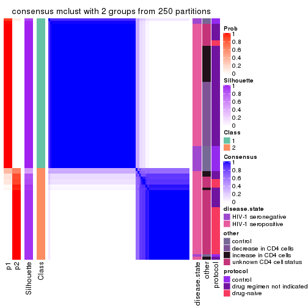</p>

</div>
<div id='tab-ATC-mclust-consensus-heatmap-2'>
<pre><code class="r">consensus_heatmap(res, k = 3)
</code></pre>

<p>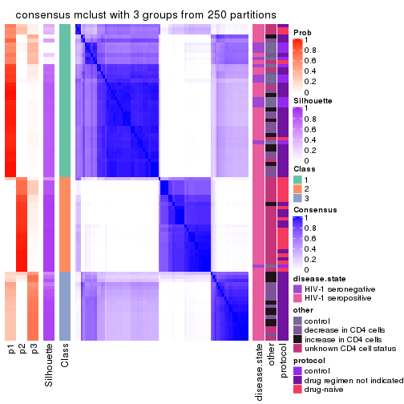</p>

</div>
<div id='tab-ATC-mclust-consensus-heatmap-3'>
<pre><code class="r">consensus_heatmap(res, k = 4)
</code></pre>

<p>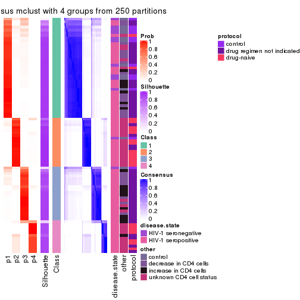</p>

</div>
<div id='tab-ATC-mclust-consensus-heatmap-4'>
<pre><code class="r">consensus_heatmap(res, k = 5)
</code></pre>

<p>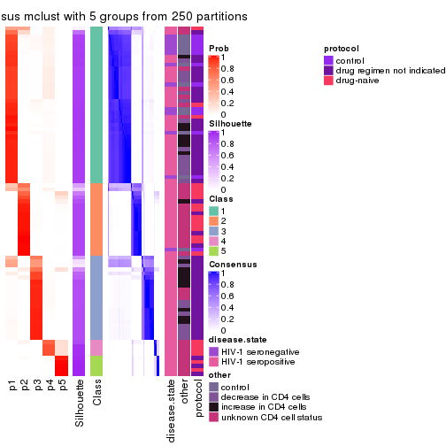</p>

</div>
<div id='tab-ATC-mclust-consensus-heatmap-5'>
<pre><code class="r">consensus_heatmap(res, k = 6)
</code></pre>

<p>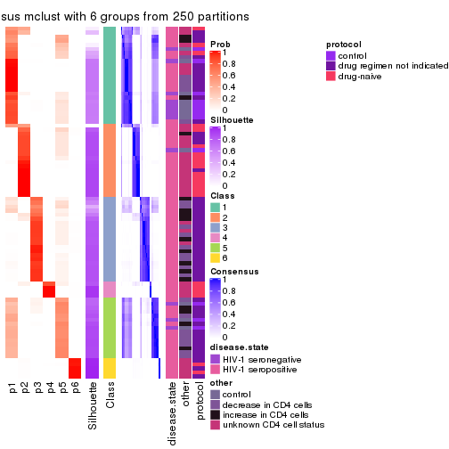</p>

</div>
</div>

Heatmaps for the membership of samples in all partitions to see how consistent they are:


<script>
$( function() {
	$( '#tabs-ATC-mclust-membership-heatmap' ).tabs();
} );
</script>
<div id='tabs-ATC-mclust-membership-heatmap'>
<ul>
<li><a href='#tab-ATC-mclust-membership-heatmap-1'>k = 2</a></li>
<li><a href='#tab-ATC-mclust-membership-heatmap-2'>k = 3</a></li>
<li><a href='#tab-ATC-mclust-membership-heatmap-3'>k = 4</a></li>
<li><a href='#tab-ATC-mclust-membership-heatmap-4'>k = 5</a></li>
<li><a href='#tab-ATC-mclust-membership-heatmap-5'>k = 6</a></li>
</ul>
<div id='tab-ATC-mclust-membership-heatmap-1'>
<pre><code class="r">membership_heatmap(res, k = 2)
</code></pre>

<p>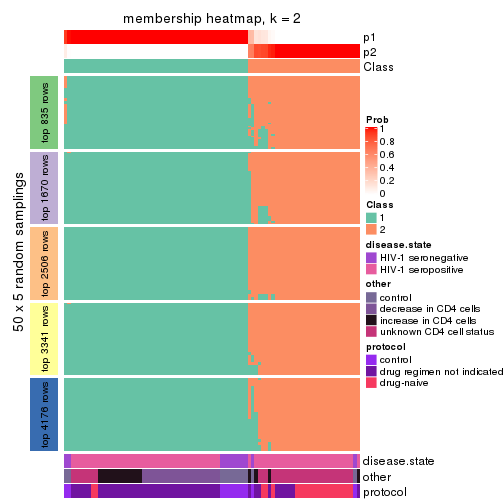</p>

</div>
<div id='tab-ATC-mclust-membership-heatmap-2'>
<pre><code class="r">membership_heatmap(res, k = 3)
</code></pre>

<p>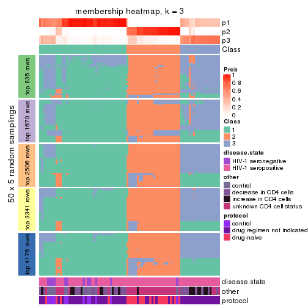</p>

</div>
<div id='tab-ATC-mclust-membership-heatmap-3'>
<pre><code class="r">membership_heatmap(res, k = 4)
</code></pre>

<p>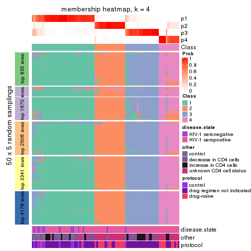</p>

</div>
<div id='tab-ATC-mclust-membership-heatmap-4'>
<pre><code class="r">membership_heatmap(res, k = 5)
</code></pre>

<p>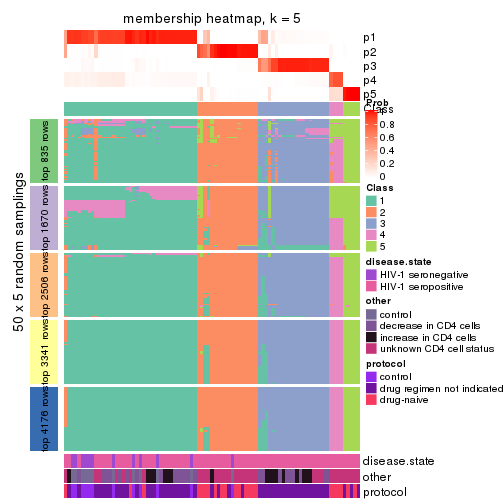</p>

</div>
<div id='tab-ATC-mclust-membership-heatmap-5'>
<pre><code class="r">membership_heatmap(res, k = 6)
</code></pre>

<p>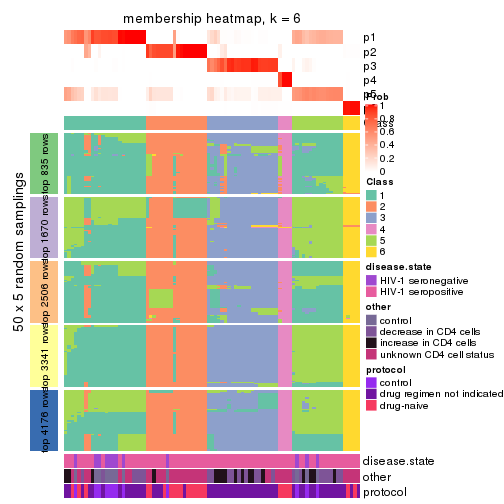</p>

</div>
</div>

As soon as we have had the classes for columns, we can look for signatures
which are significantly different between classes which can be candidate marks
for certain classes. Following are the heatmaps for signatures.


Signature heatmaps where rows are scaled:


<script>
$( function() {
	$( '#tabs-ATC-mclust-get-signatures' ).tabs();
} );
</script>
<div id='tabs-ATC-mclust-get-signatures'>
<ul>
<li><a href='#tab-ATC-mclust-get-signatures-1'>k = 2</a></li>
<li><a href='#tab-ATC-mclust-get-signatures-2'>k = 3</a></li>
<li><a href='#tab-ATC-mclust-get-signatures-3'>k = 4</a></li>
<li><a href='#tab-ATC-mclust-get-signatures-4'>k = 5</a></li>
<li><a href='#tab-ATC-mclust-get-signatures-5'>k = 6</a></li>
</ul>
<div id='tab-ATC-mclust-get-signatures-1'>
<pre><code class="r">get_signatures(res, k = 2)
</code></pre>

<p>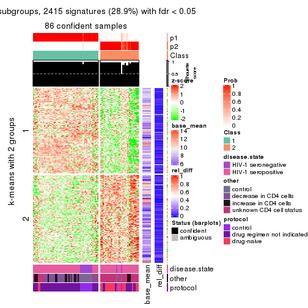</p>

</div>
<div id='tab-ATC-mclust-get-signatures-2'>
<pre><code class="r">get_signatures(res, k = 3)
</code></pre>

<p>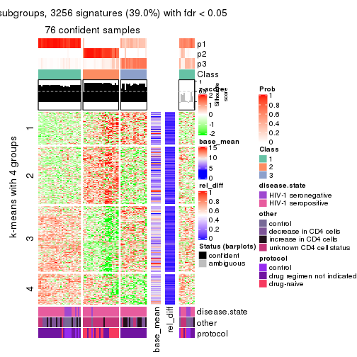</p>

</div>
<div id='tab-ATC-mclust-get-signatures-3'>
<pre><code class="r">get_signatures(res, k = 4)
</code></pre>

<p>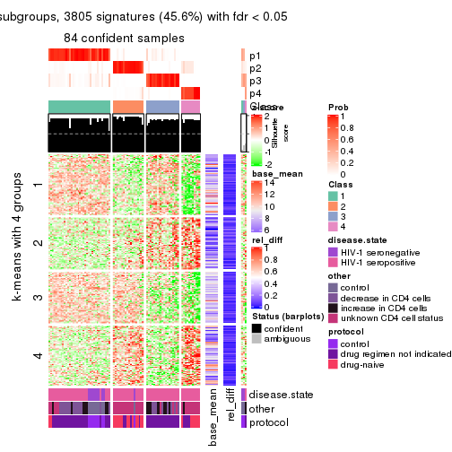</p>

</div>
<div id='tab-ATC-mclust-get-signatures-4'>
<pre><code class="r">get_signatures(res, k = 5)
</code></pre>

<p>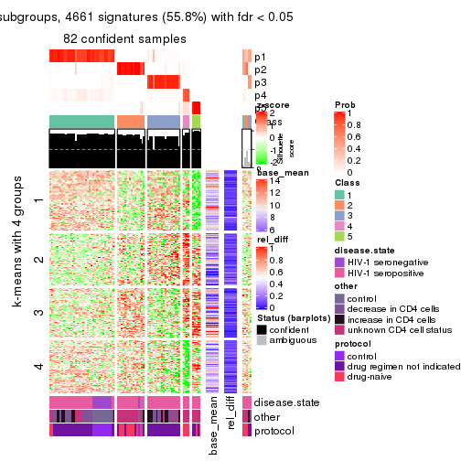</p>

</div>
<div id='tab-ATC-mclust-get-signatures-5'>
<pre><code class="r">get_signatures(res, k = 6)
</code></pre>

<p>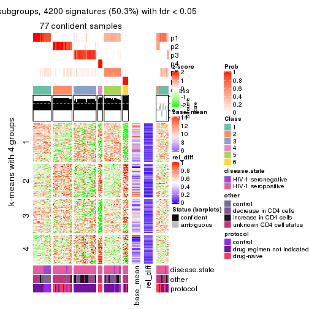</p>

</div>
</div>


Signature heatmaps where rows are not scaled:


<script>
$( function() {
	$( '#tabs-ATC-mclust-get-signatures-no-scale' ).tabs();
} );
</script>
<div id='tabs-ATC-mclust-get-signatures-no-scale'>
<ul>
<li><a href='#tab-ATC-mclust-get-signatures-no-scale-1'>k = 2</a></li>
<li><a href='#tab-ATC-mclust-get-signatures-no-scale-2'>k = 3</a></li>
<li><a href='#tab-ATC-mclust-get-signatures-no-scale-3'>k = 4</a></li>
<li><a href='#tab-ATC-mclust-get-signatures-no-scale-4'>k = 5</a></li>
<li><a href='#tab-ATC-mclust-get-signatures-no-scale-5'>k = 6</a></li>
</ul>
<div id='tab-ATC-mclust-get-signatures-no-scale-1'>
<pre><code class="r">get_signatures(res, k = 2, scale_rows = FALSE)
</code></pre>

<p>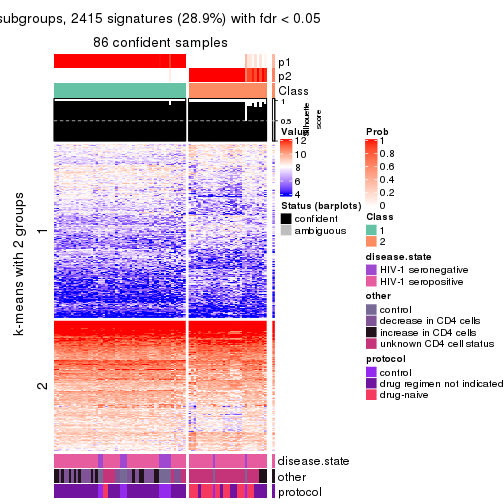</p>

</div>
<div id='tab-ATC-mclust-get-signatures-no-scale-2'>
<pre><code class="r">get_signatures(res, k = 3, scale_rows = FALSE)
</code></pre>

<p>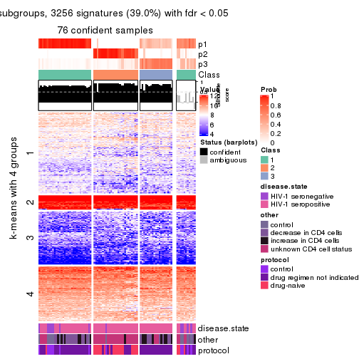</p>

</div>
<div id='tab-ATC-mclust-get-signatures-no-scale-3'>
<pre><code class="r">get_signatures(res, k = 4, scale_rows = FALSE)
</code></pre>

<p>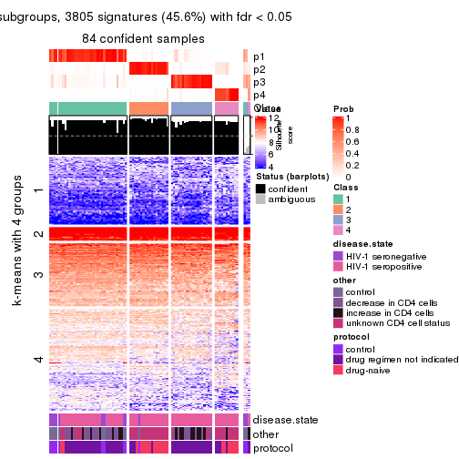</p>

</div>
<div id='tab-ATC-mclust-get-signatures-no-scale-4'>
<pre><code class="r">get_signatures(res, k = 5, scale_rows = FALSE)
</code></pre>

<p>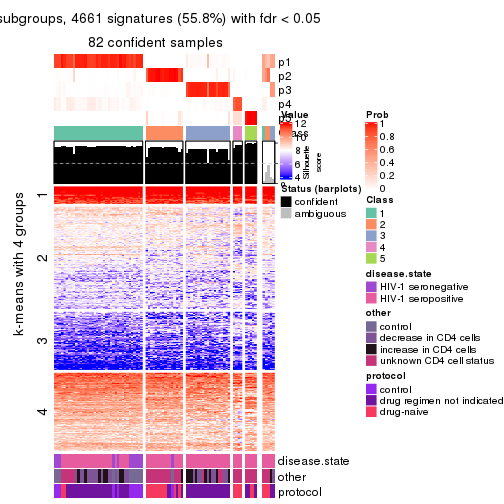</p>

</div>
<div id='tab-ATC-mclust-get-signatures-no-scale-5'>
<pre><code class="r">get_signatures(res, k = 6, scale_rows = FALSE)
</code></pre>

<p>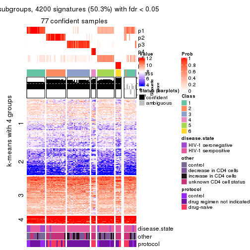</p>

</div>
</div>


Compare the overlap of signatures from different k:

```r
compare_signatures(res)
```

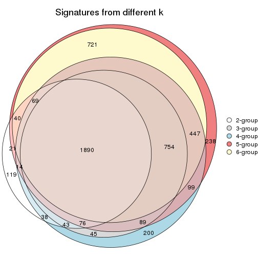

`get_signature()` returns a data frame invisibly. TO get the list of signatures, the function
call should be assigned to a variable explicitly. In following code, if `plot` argument is set
to `FALSE`, no heatmap is plotted while only the differential analysis is performed.

```r
# code only for demonstration
tb = get_signature(res, k = ..., plot = FALSE)
```

An example of the output of `tb` is:

```
#>   which_row         fdr    mean_1    mean_2 scaled_mean_1 scaled_mean_2 km
#> 1        38 0.042760348  8.373488  9.131774    -0.5533452     0.5164555  1
#> 2        40 0.018707592  7.106213  8.469186    -0.6173731     0.5762149  1
#> 3        55 0.019134737 10.221463 11.207825    -0.6159697     0.5749050  1
#> 4        59 0.006059896  5.921854  7.869574    -0.6899429     0.6439467  1
#> 5        60 0.018055526  8.928898 10.211722    -0.6204761     0.5791110  1
#> 6        98 0.009384629 15.714769 14.887706     0.6635654    -0.6193277  2
...
```

The columns in `tb` are:

1. `which_row`: row indices corresponding to the input matrix.
2. `fdr`: FDR for the differential test. 
3. `mean_x`: The mean value in group x.
4. `scaled_mean_x`: The mean value in group x after rows are scaled.
5. `km`: Row groups if k-means clustering is applied to rows.


UMAP plot which shows how samples are separated.


<script>
$( function() {
	$( '#tabs-ATC-mclust-dimension-reduction' ).tabs();
} );
</script>
<div id='tabs-ATC-mclust-dimension-reduction'>
<ul>
<li><a href='#tab-ATC-mclust-dimension-reduction-1'>k = 2</a></li>
<li><a href='#tab-ATC-mclust-dimension-reduction-2'>k = 3</a></li>
<li><a href='#tab-ATC-mclust-dimension-reduction-3'>k = 4</a></li>
<li><a href='#tab-ATC-mclust-dimension-reduction-4'>k = 5</a></li>
<li><a href='#tab-ATC-mclust-dimension-reduction-5'>k = 6</a></li>
</ul>
<div id='tab-ATC-mclust-dimension-reduction-1'>
<pre><code class="r">dimension_reduction(res, k = 2, method = &quot;UMAP&quot;)
</code></pre>

<p>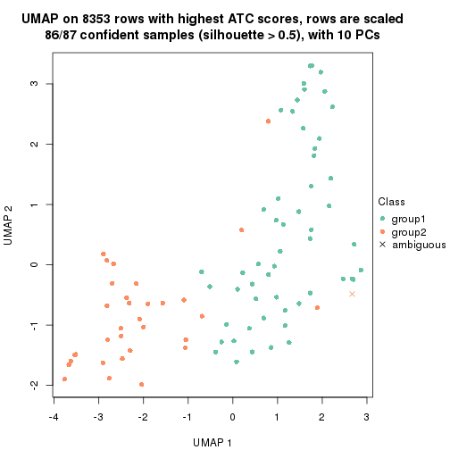</p>

</div>
<div id='tab-ATC-mclust-dimension-reduction-2'>
<pre><code class="r">dimension_reduction(res, k = 3, method = &quot;UMAP&quot;)
</code></pre>

<p>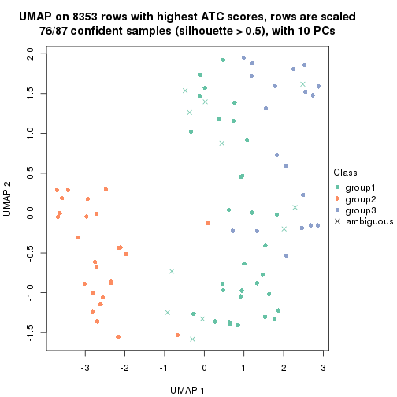</p>

</div>
<div id='tab-ATC-mclust-dimension-reduction-3'>
<pre><code class="r">dimension_reduction(res, k = 4, method = &quot;UMAP&quot;)
</code></pre>

<p>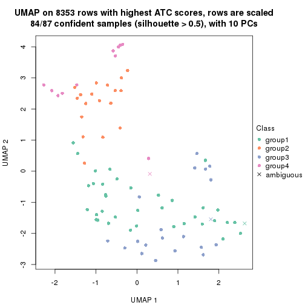</p>

</div>
<div id='tab-ATC-mclust-dimension-reduction-4'>
<pre><code class="r">dimension_reduction(res, k = 5, method = &quot;UMAP&quot;)
</code></pre>

<p>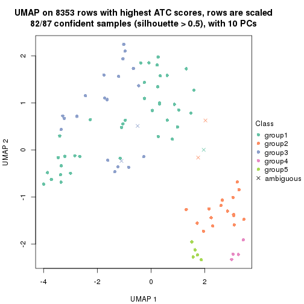</p>

</div>
<div id='tab-ATC-mclust-dimension-reduction-5'>
<pre><code class="r">dimension_reduction(res, k = 6, method = &quot;UMAP&quot;)
</code></pre>

<p>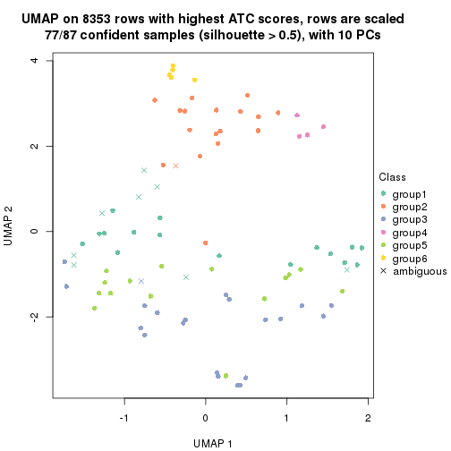</p>

</div>
</div>


Following heatmap shows how subgroups are split when increasing `k`:

```r
collect_classes(res)
```

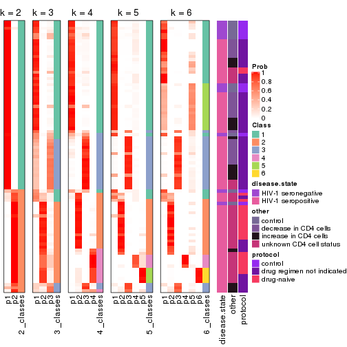


Test correlation between subgroups and known annotations. If the known
annotation is numeric, one-way ANOVA test is applied, and if the known
annotation is discrete, chi-squared contingency table test is applied.

```r
test_to_known_factors(res)
```

```
#>             n disease.state(p) other(p) protocol(p) k
#> ATC:mclust 86          0.20580 3.97e-09    1.18e-08 2
#> ATC:mclust 76          0.01616 2.11e-09    8.51e-10 3
#> ATC:mclust 84          0.01389 2.13e-09    2.74e-09 4
#> ATC:mclust 82          0.01786 2.46e-07    3.55e-09 5
#> ATC:mclust 77          0.00356 7.56e-09    2.82e-10 6
```


If matrix rows can be associated to genes, consider to use `GO_Enrichment(res,
...)` to perform function enrichment for the signature genes.


 

---------------------------------------------------


### ATC:NMF**


The object with results only for a single top-value method and a single partition method 
can be extracted as:

```r
res = res_list["ATC", "NMF"]
# you can also extract it by
# res = res_list["ATC:NMF"]
```

A summary of `res` and all the functions that can be applied to it:

```r
res
```

```
#> A 'ConsensusPartition' object with k = 2, 3, 4, 5, 6.
#>   On a matrix with 8353 rows and 87 columns.
#>   Top rows (835, 1670, 2506, 3341, 4176) are extracted by 'ATC' method.
#>   Subgroups are detected by 'NMF' method.
#>   Performed in total 1250 partitions by row resampling.
#>   Best k for subgroups seems to be 2.
#> 
#> Following methods can be applied to this 'ConsensusPartition' object:
#>  [1] "cola_report"             "collect_classes"         "collect_plots"          
#>  [4] "collect_stats"           "colnames"                "compare_signatures"     
#>  [7] "consensus_heatmap"       "dimension_reduction"     "functional_enrichment"  
#> [10] "get_anno_col"            "get_anno"                "get_classes"            
#> [13] "get_consensus"           "get_matrix"              "get_membership"         
#> [16] "get_param"               "get_signatures"          "get_stats"              
#> [19] "is_best_k"               "is_stable_k"             "membership_heatmap"     
#> [22] "ncol"                    "nrow"                    "plot_ecdf"              
#> [25] "rownames"                "select_partition_number" "show"                   
#> [28] "suggest_best_k"          "test_to_known_factors"
```

`collect_plots()` function collects all the plots made from `res` for all `k` (number of partitions)
into one single page to provide an easy and fast comparison between different `k`.

```r
collect_plots(res)
```

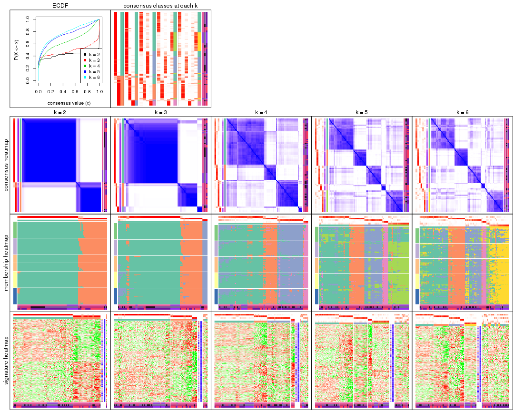

The plots are:

- The first row: a plot of the ECDF (Empirical cumulative distribution
  function) curves of the consensus matrix for each `k` and the heatmap of
  predicted classes for each `k`.
- The second row: heatmaps of the consensus matrix for each `k`.
- The third row: heatmaps of the membership matrix for each `k`.
- The fouth row: heatmaps of the signatures for each `k`.

All the plots in panels can be made by individual functions and they are
plotted later in this section.

`select_partition_number()` produces several plots showing different
statistics for choosing "optimized" `k`. There are following statistics:

- ECDF curves of the consensus matrix for each `k`;
- 1-PAC. [The PAC
  score](https://en.wikipedia.org/wiki/Consensus_clustering#Over-interpretation_potential_of_consensus_clustering)
  measures the proportion of the ambiguous subgrouping.
- Mean silhouette score.
- Concordance. The mean probability of fiting the consensus class ids in all
  partitions.
- Area increased. Denote $A_k$ as the area under the ECDF curve for current
  `k`, the area increased is defined as $A_k - A_{k-1}$.
- Rand index. The percent of pairs of samples that are both in a same cluster
  or both are not in a same cluster in the partition of k and k-1.
- Jaccard index. The ratio of pairs of samples are both in a same cluster in
  the partition of k and k-1 and the pairs of samples are both in a same
  cluster in the partition k or k-1.

The detailed explanations of these statistics can be found in [the cola
vignette](http://bioconductor.org/packages/devel/bioc/vignettes/cola/inst/doc/cola.html#toc_13).

Generally speaking, lower PAC score, higher mean silhouette score or higher
concordance corresponds to better partition. Rand index and Jaccard index
measure how similar the current partition is compared to partition with `k-1`.
If they are too similar, we won't accept `k` is better than `k-1`.

```r
select_partition_number(res)
```

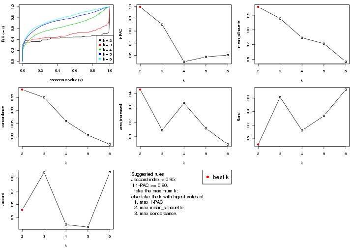

The numeric values for all these statistics can be obtained by `get_stats()`.

```r
get_stats(res)
```

```
#>   k 1-PAC mean_silhouette concordance area_increased  Rand Jaccard
#> 2 2 0.999           0.957       0.980          0.430 0.558   0.558
#> 3 3 0.854           0.877       0.950          0.143 0.906   0.842
#> 4 4 0.547           0.747       0.860          0.335 0.661   0.447
#> 5 5 0.587           0.706       0.807          0.156 0.769   0.428
#> 6 6 0.602           0.583       0.772          0.043 0.963   0.844
```

`suggest_best_k()` suggests the best $k$ based on these statistics. The rules are as follows:

- All $k$ with Jaccard index larger than 0.95 are removed because the increase of
  the partition number does not provides enough extra information. If all $k$ are removed,
  the best $k$ is assigned by `NA`.
- For $k$ with 1-PAC larger than 0.9, the maximal $k$ is taken as the "best k". Other $k$ is called "optional k".
- If it does not fit the second rule. The $k$ with the highest vote of highest
  1-PAC, mean silhouette and concordance is taken as the "best k".

```r
suggest_best_k(res)
```

```
#> [1] 2
```


Following shows the table of the partitions (You need to click the **show/hide
code output** link to see it). The membership matrix (columns with name `p*`)
is inferred by
[`clue::cl_consensus()`](https://www.rdocumentation.org/link/cl_consensus?package=clue)
function with the `SE` method. Basically the value in the membership matrix
represents the probability to belong to a certain group. The finall class
label for an item is determined with the group with highest probability it
belongs to.

In `get_classes()` function, the entropy is calculated from the membership
matrix and the silhouette score is calculated from the consensus matrix.


<script>
$( function() {
	$( '#tabs-ATC-NMF-get-classes' ).tabs();
} );
</script>
<div id='tabs-ATC-NMF-get-classes'>
<ul>
<li><a href='#tab-ATC-NMF-get-classes-1'>k = 2</a></li>
<li><a href='#tab-ATC-NMF-get-classes-2'>k = 3</a></li>
<li><a href='#tab-ATC-NMF-get-classes-3'>k = 4</a></li>
<li><a href='#tab-ATC-NMF-get-classes-4'>k = 5</a></li>
<li><a href='#tab-ATC-NMF-get-classes-5'>k = 6</a></li>
</ul>

<div id='tab-ATC-NMF-get-classes-1'>
<p><a id='tab-ATC-NMF-get-classes-1-a' style='color:#0366d6' href='#'>show/hide code output</a></p>
<pre><code class="r">cbind(get_classes(res, k = 2), get_membership(res, k = 2))
</code></pre>

<pre><code>#&gt;          class entropy silhouette    p1    p2
#&gt; GSM39104     1  0.0000      0.996 1.000 0.000
#&gt; GSM39105     1  0.0000      0.996 1.000 0.000
#&gt; GSM39106     1  0.0000      0.996 1.000 0.000
#&gt; GSM39107     1  0.0000      0.996 1.000 0.000
#&gt; GSM39108     1  0.0000      0.996 1.000 0.000
#&gt; GSM39109     1  0.0000      0.996 1.000 0.000
#&gt; GSM39110     1  0.0000      0.996 1.000 0.000
#&gt; GSM39111     1  0.0000      0.996 1.000 0.000
#&gt; GSM39112     1  0.0000      0.996 1.000 0.000
#&gt; GSM39113     1  0.0000      0.996 1.000 0.000
#&gt; GSM39114     2  0.0000      0.943 0.000 1.000
#&gt; GSM39115     1  0.0000      0.996 1.000 0.000
#&gt; GSM39148     1  0.0000      0.996 1.000 0.000
#&gt; GSM39149     1  0.0000      0.996 1.000 0.000
#&gt; GSM39150     1  0.0000      0.996 1.000 0.000
#&gt; GSM39151     1  0.4562      0.888 0.904 0.096
#&gt; GSM39152     1  0.0000      0.996 1.000 0.000
#&gt; GSM39153     1  0.0000      0.996 1.000 0.000
#&gt; GSM39154     1  0.0000      0.996 1.000 0.000
#&gt; GSM39155     1  0.0000      0.996 1.000 0.000
#&gt; GSM39156     1  0.0000      0.996 1.000 0.000
#&gt; GSM39157     1  0.0000      0.996 1.000 0.000
#&gt; GSM39158     1  0.0000      0.996 1.000 0.000
#&gt; GSM39159     1  0.0000      0.996 1.000 0.000
#&gt; GSM39160     1  0.0000      0.996 1.000 0.000
#&gt; GSM39161     1  0.1633      0.972 0.976 0.024
#&gt; GSM39162     1  0.0000      0.996 1.000 0.000
#&gt; GSM39163     1  0.0000      0.996 1.000 0.000
#&gt; GSM39164     1  0.0000      0.996 1.000 0.000
#&gt; GSM39165     1  0.0000      0.996 1.000 0.000
#&gt; GSM39166     1  0.0000      0.996 1.000 0.000
#&gt; GSM39167     1  0.0000      0.996 1.000 0.000
#&gt; GSM39168     1  0.0000      0.996 1.000 0.000
#&gt; GSM39169     1  0.0000      0.996 1.000 0.000
#&gt; GSM39170     1  0.0000      0.996 1.000 0.000
#&gt; GSM39171     1  0.0000      0.996 1.000 0.000
#&gt; GSM39172     1  0.0000      0.996 1.000 0.000
#&gt; GSM39173     2  0.0000      0.943 0.000 1.000
#&gt; GSM39174     1  0.0000      0.996 1.000 0.000
#&gt; GSM39175     1  0.0000      0.996 1.000 0.000
#&gt; GSM39176     1  0.0000      0.996 1.000 0.000
#&gt; GSM39177     1  0.0000      0.996 1.000 0.000
#&gt; GSM39178     1  0.0000      0.996 1.000 0.000
#&gt; GSM39179     1  0.0000      0.996 1.000 0.000
#&gt; GSM39180     2  0.0000      0.943 0.000 1.000
#&gt; GSM39181     1  0.0000      0.996 1.000 0.000
#&gt; GSM39182     1  0.0000      0.996 1.000 0.000
#&gt; GSM39183     1  0.0000      0.996 1.000 0.000
#&gt; GSM39184     1  0.0000      0.996 1.000 0.000
#&gt; GSM39185     2  0.7299      0.760 0.204 0.796
#&gt; GSM39186     1  0.0000      0.996 1.000 0.000
#&gt; GSM39187     1  0.0000      0.996 1.000 0.000
#&gt; GSM39116     2  0.0000      0.943 0.000 1.000
#&gt; GSM39117     2  0.0000      0.943 0.000 1.000
#&gt; GSM39118     2  0.0000      0.943 0.000 1.000
#&gt; GSM39119     2  0.0000      0.943 0.000 1.000
#&gt; GSM39120     1  0.0000      0.996 1.000 0.000
#&gt; GSM39121     1  0.0000      0.996 1.000 0.000
#&gt; GSM39122     1  0.0000      0.996 1.000 0.000
#&gt; GSM39123     2  0.0000      0.943 0.000 1.000
#&gt; GSM39124     2  0.0000      0.943 0.000 1.000
#&gt; GSM39125     1  0.0000      0.996 1.000 0.000
#&gt; GSM39126     1  0.0672      0.988 0.992 0.008
#&gt; GSM39127     2  0.0376      0.941 0.004 0.996
#&gt; GSM39128     2  0.8713      0.633 0.292 0.708
#&gt; GSM39129     2  0.0000      0.943 0.000 1.000
#&gt; GSM39130     2  0.0000      0.943 0.000 1.000
#&gt; GSM39131     2  0.2423      0.916 0.040 0.960
#&gt; GSM39132     2  0.0000      0.943 0.000 1.000
#&gt; GSM39133     2  0.0000      0.943 0.000 1.000
#&gt; GSM39134     2  0.0000      0.943 0.000 1.000
#&gt; GSM39135     2  0.0000      0.943 0.000 1.000
#&gt; GSM39136     2  0.0000      0.943 0.000 1.000
#&gt; GSM39137     2  0.7602      0.740 0.220 0.780
#&gt; GSM39138     2  0.0000      0.943 0.000 1.000
#&gt; GSM39139     2  0.0000      0.943 0.000 1.000
#&gt; GSM39140     1  0.0000      0.996 1.000 0.000
#&gt; GSM39141     1  0.0000      0.996 1.000 0.000
#&gt; GSM39142     1  0.0000      0.996 1.000 0.000
#&gt; GSM39143     1  0.0000      0.996 1.000 0.000
#&gt; GSM39144     2  0.0000      0.943 0.000 1.000
#&gt; GSM39145     2  0.0000      0.943 0.000 1.000
#&gt; GSM39146     2  0.9000      0.589 0.316 0.684
#&gt; GSM39147     2  0.0000      0.943 0.000 1.000
#&gt; GSM39188     2  0.9866      0.314 0.432 0.568
#&gt; GSM39189     1  0.0000      0.996 1.000 0.000
#&gt; GSM39190     1  0.4161      0.903 0.916 0.084
</code></pre>

<script>
$('#tab-ATC-NMF-get-classes-1-a').parent().next().next().hide();
$('#tab-ATC-NMF-get-classes-1-a').click(function(){
  $('#tab-ATC-NMF-get-classes-1-a').parent().next().next().toggle();
  return(false);
});
</script>
</div>

<div id='tab-ATC-NMF-get-classes-2'>
<p><a id='tab-ATC-NMF-get-classes-2-a' style='color:#0366d6' href='#'>show/hide code output</a></p>
<pre><code class="r">cbind(get_classes(res, k = 3), get_membership(res, k = 3))
</code></pre>

<pre><code>#&gt;          class entropy silhouette    p1    p2    p3
#&gt; GSM39104     1  0.0000     0.9464 1.000 0.000 0.000
#&gt; GSM39105     1  0.0000     0.9464 1.000 0.000 0.000
#&gt; GSM39106     1  0.0000     0.9464 1.000 0.000 0.000
#&gt; GSM39107     1  0.0000     0.9464 1.000 0.000 0.000
#&gt; GSM39108     1  0.0000     0.9464 1.000 0.000 0.000
#&gt; GSM39109     1  0.0000     0.9464 1.000 0.000 0.000
#&gt; GSM39110     1  0.1411     0.9216 0.964 0.036 0.000
#&gt; GSM39111     1  0.0000     0.9464 1.000 0.000 0.000
#&gt; GSM39112     1  0.0892     0.9342 0.980 0.020 0.000
#&gt; GSM39113     1  0.0000     0.9464 1.000 0.000 0.000
#&gt; GSM39114     2  0.0237     0.9088 0.004 0.996 0.000
#&gt; GSM39115     1  0.0000     0.9464 1.000 0.000 0.000
#&gt; GSM39148     1  0.0747     0.9370 0.984 0.016 0.000
#&gt; GSM39149     1  0.0000     0.9464 1.000 0.000 0.000
#&gt; GSM39150     1  0.0000     0.9464 1.000 0.000 0.000
#&gt; GSM39151     1  0.2711     0.8819 0.912 0.000 0.088
#&gt; GSM39152     1  0.0424     0.9423 0.992 0.000 0.008
#&gt; GSM39153     1  0.0000     0.9464 1.000 0.000 0.000
#&gt; GSM39154     1  0.0000     0.9464 1.000 0.000 0.000
#&gt; GSM39155     1  0.0000     0.9464 1.000 0.000 0.000
#&gt; GSM39156     1  0.0000     0.9464 1.000 0.000 0.000
#&gt; GSM39157     1  0.0000     0.9464 1.000 0.000 0.000
#&gt; GSM39158     1  0.0000     0.9464 1.000 0.000 0.000
#&gt; GSM39159     1  0.0000     0.9464 1.000 0.000 0.000
#&gt; GSM39160     1  0.0000     0.9464 1.000 0.000 0.000
#&gt; GSM39161     1  0.4555     0.7591 0.800 0.000 0.200
#&gt; GSM39162     1  0.0237     0.9444 0.996 0.004 0.000
#&gt; GSM39163     1  0.0000     0.9464 1.000 0.000 0.000
#&gt; GSM39164     1  0.0000     0.9464 1.000 0.000 0.000
#&gt; GSM39165     1  0.0000     0.9464 1.000 0.000 0.000
#&gt; GSM39166     1  0.0424     0.9423 0.992 0.000 0.008
#&gt; GSM39167     1  0.0000     0.9464 1.000 0.000 0.000
#&gt; GSM39168     1  0.0237     0.9444 0.996 0.004 0.000
#&gt; GSM39169     1  0.0747     0.9370 0.984 0.016 0.000
#&gt; GSM39170     1  0.0000     0.9464 1.000 0.000 0.000
#&gt; GSM39171     1  0.0000     0.9464 1.000 0.000 0.000
#&gt; GSM39172     1  0.3879     0.8180 0.848 0.000 0.152
#&gt; GSM39173     2  0.0237     0.9088 0.004 0.996 0.000
#&gt; GSM39174     1  0.0000     0.9464 1.000 0.000 0.000
#&gt; GSM39175     1  0.0000     0.9464 1.000 0.000 0.000
#&gt; GSM39176     1  0.0000     0.9464 1.000 0.000 0.000
#&gt; GSM39177     1  0.0000     0.9464 1.000 0.000 0.000
#&gt; GSM39178     1  0.0237     0.9445 0.996 0.000 0.004
#&gt; GSM39179     1  0.0747     0.9374 0.984 0.000 0.016
#&gt; GSM39180     3  0.0829     0.9770 0.012 0.004 0.984
#&gt; GSM39181     1  0.0000     0.9464 1.000 0.000 0.000
#&gt; GSM39182     1  0.2625     0.8850 0.916 0.000 0.084
#&gt; GSM39183     1  0.0424     0.9423 0.992 0.000 0.008
#&gt; GSM39184     1  0.0000     0.9464 1.000 0.000 0.000
#&gt; GSM39185     1  0.6045     0.4426 0.620 0.000 0.380
#&gt; GSM39186     1  0.0000     0.9464 1.000 0.000 0.000
#&gt; GSM39187     1  0.0000     0.9464 1.000 0.000 0.000
#&gt; GSM39116     2  0.0237     0.9088 0.004 0.996 0.000
#&gt; GSM39117     3  0.0237     0.9943 0.000 0.004 0.996
#&gt; GSM39118     2  0.1964     0.8826 0.000 0.944 0.056
#&gt; GSM39119     2  0.4702     0.7152 0.000 0.788 0.212
#&gt; GSM39120     1  0.0000     0.9464 1.000 0.000 0.000
#&gt; GSM39121     1  0.6244     0.2137 0.560 0.440 0.000
#&gt; GSM39122     1  0.6307     0.0417 0.512 0.488 0.000
#&gt; GSM39123     3  0.0237     0.9943 0.000 0.004 0.996
#&gt; GSM39124     2  0.0237     0.9088 0.004 0.996 0.000
#&gt; GSM39125     1  0.0000     0.9464 1.000 0.000 0.000
#&gt; GSM39126     2  0.4605     0.6202 0.204 0.796 0.000
#&gt; GSM39127     2  0.0237     0.9088 0.004 0.996 0.000
#&gt; GSM39128     2  0.3116     0.7770 0.108 0.892 0.000
#&gt; GSM39129     2  0.2165     0.8768 0.000 0.936 0.064
#&gt; GSM39130     3  0.0237     0.9943 0.000 0.004 0.996
#&gt; GSM39131     2  0.0237     0.9088 0.004 0.996 0.000
#&gt; GSM39132     2  0.0000     0.9078 0.000 1.000 0.000
#&gt; GSM39133     3  0.0237     0.9943 0.000 0.004 0.996
#&gt; GSM39134     2  0.1964     0.8823 0.000 0.944 0.056
#&gt; GSM39135     2  0.0000     0.9078 0.000 1.000 0.000
#&gt; GSM39136     2  0.3551     0.8144 0.000 0.868 0.132
#&gt; GSM39137     2  0.0237     0.9088 0.004 0.996 0.000
#&gt; GSM39138     2  0.1643     0.8895 0.000 0.956 0.044
#&gt; GSM39139     2  0.0000     0.9078 0.000 1.000 0.000
#&gt; GSM39140     1  0.5016     0.6728 0.760 0.240 0.000
#&gt; GSM39141     1  0.1289     0.9250 0.968 0.032 0.000
#&gt; GSM39142     1  0.0000     0.9464 1.000 0.000 0.000
#&gt; GSM39143     1  0.0747     0.9370 0.984 0.016 0.000
#&gt; GSM39144     2  0.0592     0.9036 0.000 0.988 0.012
#&gt; GSM39145     2  0.0237     0.9088 0.004 0.996 0.000
#&gt; GSM39146     2  0.6168     0.2685 0.412 0.588 0.000
#&gt; GSM39147     2  0.0000     0.9078 0.000 1.000 0.000
#&gt; GSM39188     1  0.6295     0.1912 0.528 0.000 0.472
#&gt; GSM39189     1  0.3116     0.8629 0.892 0.000 0.108
#&gt; GSM39190     1  0.3752     0.8267 0.856 0.000 0.144
</code></pre>

<script>
$('#tab-ATC-NMF-get-classes-2-a').parent().next().next().hide();
$('#tab-ATC-NMF-get-classes-2-a').click(function(){
  $('#tab-ATC-NMF-get-classes-2-a').parent().next().next().toggle();
  return(false);
});
</script>
</div>

<div id='tab-ATC-NMF-get-classes-3'>
<p><a id='tab-ATC-NMF-get-classes-3-a' style='color:#0366d6' href='#'>show/hide code output</a></p>
<pre><code class="r">cbind(get_classes(res, k = 4), get_membership(res, k = 4))
</code></pre>

<pre><code>#&gt;          class entropy silhouette    p1    p2    p3    p4
#&gt; GSM39104     3  0.2469     0.8479 0.108 0.000 0.892 0.000
#&gt; GSM39105     1  0.3801     0.7765 0.780 0.000 0.220 0.000
#&gt; GSM39106     1  0.3123     0.8207 0.844 0.000 0.156 0.000
#&gt; GSM39107     1  0.1584     0.8326 0.952 0.000 0.036 0.012
#&gt; GSM39108     1  0.2011     0.8341 0.920 0.000 0.080 0.000
#&gt; GSM39109     1  0.2149     0.8316 0.912 0.000 0.088 0.000
#&gt; GSM39110     1  0.3464     0.8296 0.860 0.032 0.108 0.000
#&gt; GSM39111     1  0.4877     0.4687 0.592 0.000 0.408 0.000
#&gt; GSM39112     1  0.1398     0.8244 0.956 0.000 0.040 0.004
#&gt; GSM39113     1  0.1722     0.8269 0.944 0.000 0.048 0.008
#&gt; GSM39114     2  0.4855     0.3636 0.400 0.600 0.000 0.000
#&gt; GSM39115     1  0.2011     0.8347 0.920 0.000 0.080 0.000
#&gt; GSM39148     1  0.1209     0.8346 0.964 0.004 0.032 0.000
#&gt; GSM39149     3  0.1488     0.8772 0.032 0.012 0.956 0.000
#&gt; GSM39150     3  0.1474     0.8800 0.052 0.000 0.948 0.000
#&gt; GSM39151     3  0.1724     0.8561 0.020 0.032 0.948 0.000
#&gt; GSM39152     3  0.1004     0.8832 0.024 0.004 0.972 0.000
#&gt; GSM39153     1  0.4989     0.2271 0.528 0.000 0.472 0.000
#&gt; GSM39154     1  0.3942     0.7418 0.764 0.000 0.236 0.000
#&gt; GSM39155     1  0.3486     0.7995 0.812 0.000 0.188 0.000
#&gt; GSM39156     1  0.4356     0.6965 0.708 0.000 0.292 0.000
#&gt; GSM39157     1  0.1474     0.8365 0.948 0.000 0.052 0.000
#&gt; GSM39158     3  0.4972     0.0307 0.456 0.000 0.544 0.000
#&gt; GSM39159     3  0.2589     0.8525 0.116 0.000 0.884 0.000
#&gt; GSM39160     3  0.1302     0.8818 0.044 0.000 0.956 0.000
#&gt; GSM39161     3  0.2140     0.8707 0.052 0.008 0.932 0.008
#&gt; GSM39162     1  0.1474     0.8388 0.948 0.000 0.052 0.000
#&gt; GSM39163     1  0.4522     0.6245 0.680 0.000 0.320 0.000
#&gt; GSM39164     1  0.4741     0.6576 0.668 0.004 0.328 0.000
#&gt; GSM39165     3  0.1637     0.8805 0.060 0.000 0.940 0.000
#&gt; GSM39166     3  0.1302     0.8818 0.044 0.000 0.956 0.000
#&gt; GSM39167     1  0.4608     0.6491 0.692 0.004 0.304 0.000
#&gt; GSM39168     1  0.1389     0.8396 0.952 0.000 0.048 0.000
#&gt; GSM39169     1  0.2831     0.8340 0.876 0.004 0.120 0.000
#&gt; GSM39170     1  0.1940     0.8364 0.924 0.000 0.076 0.000
#&gt; GSM39171     3  0.2704     0.8297 0.124 0.000 0.876 0.000
#&gt; GSM39172     3  0.1929     0.8791 0.036 0.000 0.940 0.024
#&gt; GSM39173     2  0.1109     0.8014 0.004 0.968 0.028 0.000
#&gt; GSM39174     1  0.2469     0.8333 0.892 0.000 0.108 0.000
#&gt; GSM39175     3  0.2216     0.8682 0.092 0.000 0.908 0.000
#&gt; GSM39176     1  0.3311     0.7979 0.828 0.000 0.172 0.000
#&gt; GSM39177     3  0.1489     0.8826 0.044 0.004 0.952 0.000
#&gt; GSM39178     3  0.1302     0.8818 0.044 0.000 0.956 0.000
#&gt; GSM39179     3  0.1209     0.8837 0.032 0.004 0.964 0.000
#&gt; GSM39180     3  0.6789     0.1213 0.020 0.052 0.504 0.424
#&gt; GSM39181     3  0.3172     0.8116 0.160 0.000 0.840 0.000
#&gt; GSM39182     3  0.6359     0.6318 0.132 0.000 0.648 0.220
#&gt; GSM39183     3  0.1940     0.8758 0.076 0.000 0.924 0.000
#&gt; GSM39184     1  0.3074     0.8217 0.848 0.000 0.152 0.000
#&gt; GSM39185     3  0.4618     0.7663 0.052 0.004 0.796 0.148
#&gt; GSM39186     1  0.5000     0.1825 0.500 0.000 0.500 0.000
#&gt; GSM39187     1  0.4431     0.6372 0.696 0.000 0.304 0.000
#&gt; GSM39116     1  0.3570     0.7527 0.860 0.092 0.000 0.048
#&gt; GSM39117     4  0.0188     0.8217 0.000 0.000 0.004 0.996
#&gt; GSM39118     2  0.3107     0.7806 0.036 0.884 0.000 0.080
#&gt; GSM39119     2  0.2867     0.7541 0.000 0.884 0.012 0.104
#&gt; GSM39120     1  0.1792     0.8373 0.932 0.000 0.068 0.000
#&gt; GSM39121     1  0.2197     0.7962 0.916 0.080 0.004 0.000
#&gt; GSM39122     1  0.2408     0.7845 0.896 0.104 0.000 0.000
#&gt; GSM39123     4  0.1474     0.8252 0.052 0.000 0.000 0.948
#&gt; GSM39124     2  0.4103     0.5709 0.256 0.744 0.000 0.000
#&gt; GSM39125     1  0.2408     0.8291 0.896 0.000 0.104 0.000
#&gt; GSM39126     1  0.3529     0.7600 0.836 0.152 0.012 0.000
#&gt; GSM39127     1  0.3688     0.6921 0.792 0.208 0.000 0.000
#&gt; GSM39128     1  0.3300     0.7591 0.848 0.144 0.008 0.000
#&gt; GSM39129     2  0.2363     0.7764 0.000 0.920 0.024 0.056
#&gt; GSM39130     4  0.0188     0.8241 0.004 0.000 0.000 0.996
#&gt; GSM39131     1  0.4855     0.3240 0.600 0.400 0.000 0.000
#&gt; GSM39132     2  0.1489     0.8039 0.044 0.952 0.000 0.004
#&gt; GSM39133     4  0.1792     0.8155 0.068 0.000 0.000 0.932
#&gt; GSM39134     2  0.1938     0.7922 0.000 0.936 0.012 0.052
#&gt; GSM39135     2  0.5247     0.5138 0.284 0.684 0.000 0.032
#&gt; GSM39136     4  0.6611    -0.0787 0.080 0.456 0.000 0.464
#&gt; GSM39137     1  0.4008     0.6528 0.756 0.244 0.000 0.000
#&gt; GSM39138     2  0.1706     0.7952 0.000 0.948 0.016 0.036
#&gt; GSM39139     2  0.0524     0.8081 0.008 0.988 0.000 0.004
#&gt; GSM39140     1  0.2542     0.8014 0.904 0.084 0.012 0.000
#&gt; GSM39141     1  0.0469     0.8263 0.988 0.000 0.012 0.000
#&gt; GSM39142     1  0.0592     0.8312 0.984 0.000 0.016 0.000
#&gt; GSM39143     1  0.0188     0.8269 0.996 0.000 0.004 0.000
#&gt; GSM39144     2  0.1247     0.8057 0.004 0.968 0.012 0.016
#&gt; GSM39145     2  0.1118     0.8070 0.036 0.964 0.000 0.000
#&gt; GSM39146     1  0.1978     0.7964 0.928 0.068 0.000 0.004
#&gt; GSM39147     2  0.1743     0.7975 0.056 0.940 0.000 0.004
#&gt; GSM39188     3  0.2400     0.8281 0.004 0.044 0.924 0.028
#&gt; GSM39189     3  0.1443     0.8807 0.028 0.004 0.960 0.008
#&gt; GSM39190     3  0.1486     0.8612 0.008 0.024 0.960 0.008
</code></pre>

<script>
$('#tab-ATC-NMF-get-classes-3-a').parent().next().next().hide();
$('#tab-ATC-NMF-get-classes-3-a').click(function(){
  $('#tab-ATC-NMF-get-classes-3-a').parent().next().next().toggle();
  return(false);
});
</script>
</div>

<div id='tab-ATC-NMF-get-classes-4'>
<p><a id='tab-ATC-NMF-get-classes-4-a' style='color:#0366d6' href='#'>show/hide code output</a></p>
<pre><code class="r">cbind(get_classes(res, k = 5), get_membership(res, k = 5))
</code></pre>

<pre><code>#&gt;          class entropy silhouette    p1    p2    p3    p4    p5
#&gt; GSM39104     5  0.4707      0.106 0.020 0.000 0.392 0.000 0.588
#&gt; GSM39105     5  0.2209      0.784 0.032 0.000 0.056 0.000 0.912
#&gt; GSM39106     5  0.2554      0.812 0.072 0.000 0.036 0.000 0.892
#&gt; GSM39107     5  0.3048      0.780 0.176 0.000 0.004 0.000 0.820
#&gt; GSM39108     5  0.1830      0.814 0.068 0.000 0.008 0.000 0.924
#&gt; GSM39109     5  0.1568      0.802 0.036 0.000 0.020 0.000 0.944
#&gt; GSM39110     5  0.2518      0.813 0.080 0.016 0.008 0.000 0.896
#&gt; GSM39111     5  0.3391      0.623 0.012 0.000 0.188 0.000 0.800
#&gt; GSM39112     5  0.1502      0.806 0.056 0.000 0.000 0.004 0.940
#&gt; GSM39113     5  0.1798      0.810 0.064 0.000 0.004 0.004 0.928
#&gt; GSM39114     5  0.4225      0.396 0.004 0.364 0.000 0.000 0.632
#&gt; GSM39115     5  0.1965      0.808 0.052 0.000 0.024 0.000 0.924
#&gt; GSM39148     1  0.2228      0.788 0.900 0.004 0.004 0.000 0.092
#&gt; GSM39149     3  0.2732      0.761 0.000 0.000 0.840 0.000 0.160
#&gt; GSM39150     3  0.4696      0.372 0.016 0.000 0.556 0.000 0.428
#&gt; GSM39151     3  0.2069      0.773 0.000 0.012 0.912 0.000 0.076
#&gt; GSM39152     3  0.2209      0.793 0.032 0.000 0.912 0.000 0.056
#&gt; GSM39153     1  0.2927      0.779 0.868 0.000 0.092 0.000 0.040
#&gt; GSM39154     1  0.2903      0.796 0.872 0.000 0.048 0.000 0.080
#&gt; GSM39155     5  0.3805      0.758 0.184 0.000 0.032 0.000 0.784
#&gt; GSM39156     1  0.3995      0.762 0.788 0.000 0.060 0.000 0.152
#&gt; GSM39157     1  0.1892      0.793 0.916 0.000 0.004 0.000 0.080
#&gt; GSM39158     1  0.5365      0.653 0.664 0.000 0.204 0.000 0.132
#&gt; GSM39159     1  0.4485      0.553 0.680 0.000 0.292 0.000 0.028
#&gt; GSM39160     3  0.3759      0.732 0.016 0.000 0.764 0.000 0.220
#&gt; GSM39161     3  0.3970      0.669 0.220 0.004 0.760 0.004 0.012
#&gt; GSM39162     1  0.1768      0.792 0.924 0.000 0.004 0.000 0.072
#&gt; GSM39163     1  0.2770      0.786 0.880 0.000 0.076 0.000 0.044
#&gt; GSM39164     1  0.5957      0.534 0.588 0.000 0.176 0.000 0.236
#&gt; GSM39165     3  0.4946      0.355 0.368 0.000 0.596 0.000 0.036
#&gt; GSM39166     3  0.3655      0.776 0.036 0.000 0.804 0.000 0.160
#&gt; GSM39167     1  0.2989      0.789 0.868 0.000 0.072 0.000 0.060
#&gt; GSM39168     1  0.4288      0.356 0.612 0.000 0.004 0.000 0.384
#&gt; GSM39169     5  0.2731      0.809 0.104 0.004 0.016 0.000 0.876
#&gt; GSM39170     1  0.0510      0.786 0.984 0.000 0.000 0.000 0.016
#&gt; GSM39171     3  0.5106      0.277 0.036 0.000 0.508 0.000 0.456
#&gt; GSM39172     3  0.2352      0.764 0.092 0.000 0.896 0.004 0.008
#&gt; GSM39173     2  0.1124      0.890 0.000 0.960 0.036 0.000 0.004
#&gt; GSM39174     1  0.1768      0.795 0.924 0.000 0.004 0.000 0.072
#&gt; GSM39175     1  0.5095      0.276 0.560 0.000 0.400 0.000 0.040
#&gt; GSM39176     1  0.1195      0.793 0.960 0.000 0.028 0.000 0.012
#&gt; GSM39177     3  0.3673      0.744 0.140 0.012 0.820 0.000 0.028
#&gt; GSM39178     3  0.3229      0.787 0.032 0.000 0.840 0.000 0.128
#&gt; GSM39179     3  0.1444      0.779 0.040 0.000 0.948 0.000 0.012
#&gt; GSM39180     4  0.7511      0.411 0.200 0.020 0.276 0.476 0.028
#&gt; GSM39181     1  0.4503      0.569 0.696 0.000 0.268 0.000 0.036
#&gt; GSM39182     1  0.6102      0.480 0.632 0.000 0.128 0.212 0.028
#&gt; GSM39183     3  0.4355      0.672 0.224 0.000 0.732 0.000 0.044
#&gt; GSM39184     5  0.3409      0.788 0.144 0.000 0.032 0.000 0.824
#&gt; GSM39185     1  0.6380      0.390 0.572 0.004 0.296 0.104 0.024
#&gt; GSM39186     5  0.3061      0.697 0.020 0.000 0.136 0.000 0.844
#&gt; GSM39187     1  0.3442      0.790 0.836 0.000 0.060 0.000 0.104
#&gt; GSM39116     5  0.7092      0.451 0.108 0.132 0.000 0.188 0.572
#&gt; GSM39117     4  0.0324      0.831 0.000 0.004 0.000 0.992 0.004
#&gt; GSM39118     2  0.2528      0.872 0.012 0.908 0.008 0.056 0.016
#&gt; GSM39119     2  0.1997      0.877 0.000 0.924 0.036 0.040 0.000
#&gt; GSM39120     1  0.0794      0.782 0.972 0.000 0.000 0.000 0.028
#&gt; GSM39121     1  0.3714      0.740 0.812 0.056 0.000 0.000 0.132
#&gt; GSM39122     5  0.5013      0.667 0.232 0.084 0.000 0.000 0.684
#&gt; GSM39123     4  0.0566      0.832 0.004 0.000 0.000 0.984 0.012
#&gt; GSM39124     2  0.2532      0.835 0.012 0.892 0.000 0.008 0.088
#&gt; GSM39125     1  0.1568      0.796 0.944 0.000 0.020 0.000 0.036
#&gt; GSM39126     1  0.2654      0.777 0.888 0.064 0.000 0.000 0.048
#&gt; GSM39127     1  0.5596      0.335 0.552 0.376 0.000 0.004 0.068
#&gt; GSM39128     1  0.3969      0.751 0.808 0.096 0.000 0.004 0.092
#&gt; GSM39129     2  0.1914      0.869 0.000 0.924 0.060 0.016 0.000
#&gt; GSM39130     4  0.0000      0.832 0.000 0.000 0.000 1.000 0.000
#&gt; GSM39131     2  0.3695      0.700 0.164 0.800 0.000 0.000 0.036
#&gt; GSM39132     2  0.1012      0.889 0.000 0.968 0.000 0.020 0.012
#&gt; GSM39133     4  0.0898      0.829 0.008 0.000 0.000 0.972 0.020
#&gt; GSM39134     2  0.1106      0.891 0.000 0.964 0.024 0.012 0.000
#&gt; GSM39135     2  0.2937      0.844 0.016 0.884 0.000 0.040 0.060
#&gt; GSM39136     4  0.5091      0.385 0.004 0.328 0.000 0.624 0.044
#&gt; GSM39137     2  0.5714      0.452 0.212 0.624 0.000 0.000 0.164
#&gt; GSM39138     2  0.1251      0.888 0.000 0.956 0.036 0.008 0.000
#&gt; GSM39139     2  0.0566      0.893 0.000 0.984 0.012 0.000 0.004
#&gt; GSM39140     1  0.2438      0.772 0.900 0.040 0.000 0.000 0.060
#&gt; GSM39141     1  0.3093      0.730 0.824 0.008 0.000 0.000 0.168
#&gt; GSM39142     5  0.4270      0.530 0.336 0.004 0.004 0.000 0.656
#&gt; GSM39143     5  0.4147      0.595 0.316 0.008 0.000 0.000 0.676
#&gt; GSM39144     2  0.0865      0.893 0.000 0.972 0.024 0.004 0.000
#&gt; GSM39145     2  0.0290      0.892 0.000 0.992 0.000 0.000 0.008
#&gt; GSM39146     1  0.5501      0.613 0.684 0.112 0.000 0.016 0.188
#&gt; GSM39147     2  0.0671      0.891 0.000 0.980 0.000 0.004 0.016
#&gt; GSM39188     3  0.1026      0.750 0.004 0.024 0.968 0.000 0.004
#&gt; GSM39189     3  0.2144      0.783 0.020 0.000 0.912 0.000 0.068
#&gt; GSM39190     3  0.1701      0.776 0.028 0.012 0.944 0.000 0.016
</code></pre>

<script>
$('#tab-ATC-NMF-get-classes-4-a').parent().next().next().hide();
$('#tab-ATC-NMF-get-classes-4-a').click(function(){
  $('#tab-ATC-NMF-get-classes-4-a').parent().next().next().toggle();
  return(false);
});
</script>
</div>

<div id='tab-ATC-NMF-get-classes-5'>
<p><a id='tab-ATC-NMF-get-classes-5-a' style='color:#0366d6' href='#'>show/hide code output</a></p>
<pre><code class="r">cbind(get_classes(res, k = 6), get_membership(res, k = 6))
</code></pre>

<pre><code>#&gt;          class entropy silhouette    p1    p2    p3    p4    p5    p6
#&gt; GSM39104     6  0.5673     0.3608 0.052 0.000 0.280 0.000 0.076 0.592
#&gt; GSM39105     6  0.2169     0.7071 0.012 0.000 0.080 0.000 0.008 0.900
#&gt; GSM39106     6  0.3811     0.6975 0.116 0.000 0.040 0.000 0.040 0.804
#&gt; GSM39107     6  0.5158     0.4612 0.144 0.000 0.004 0.000 0.220 0.632
#&gt; GSM39108     6  0.1845     0.7216 0.052 0.000 0.028 0.000 0.000 0.920
#&gt; GSM39109     6  0.1528     0.7053 0.012 0.000 0.028 0.000 0.016 0.944
#&gt; GSM39110     6  0.3256     0.7099 0.104 0.008 0.028 0.000 0.016 0.844
#&gt; GSM39111     6  0.2592     0.6915 0.016 0.000 0.116 0.000 0.004 0.864
#&gt; GSM39112     6  0.1003     0.6878 0.004 0.004 0.000 0.000 0.028 0.964
#&gt; GSM39113     6  0.1138     0.6989 0.012 0.000 0.004 0.000 0.024 0.960
#&gt; GSM39114     6  0.4099     0.3141 0.000 0.372 0.000 0.000 0.016 0.612
#&gt; GSM39115     6  0.0984     0.7053 0.012 0.000 0.008 0.000 0.012 0.968
#&gt; GSM39148     1  0.2066     0.6500 0.908 0.000 0.000 0.000 0.052 0.040
#&gt; GSM39149     3  0.3525     0.6462 0.016 0.004 0.816 0.000 0.032 0.132
#&gt; GSM39150     3  0.6177     0.1190 0.040 0.000 0.428 0.000 0.116 0.416
#&gt; GSM39151     3  0.2008     0.6551 0.004 0.004 0.920 0.000 0.032 0.040
#&gt; GSM39152     3  0.2231     0.6700 0.068 0.000 0.900 0.000 0.004 0.028
#&gt; GSM39153     1  0.2485     0.6640 0.884 0.000 0.084 0.000 0.008 0.024
#&gt; GSM39154     1  0.3530     0.6424 0.824 0.000 0.104 0.000 0.044 0.028
#&gt; GSM39155     6  0.5380     0.4847 0.240 0.000 0.124 0.000 0.016 0.620
#&gt; GSM39156     1  0.3817     0.6415 0.800 0.000 0.120 0.000 0.024 0.056
#&gt; GSM39157     1  0.1313     0.6658 0.952 0.000 0.004 0.000 0.016 0.028
#&gt; GSM39158     1  0.6071     0.4456 0.600 0.004 0.172 0.000 0.172 0.052
#&gt; GSM39159     1  0.4771     0.4743 0.652 0.000 0.248 0.000 0.100 0.000
#&gt; GSM39160     3  0.4764     0.5633 0.028 0.000 0.664 0.000 0.040 0.268
#&gt; GSM39161     3  0.5569     0.3130 0.320 0.000 0.520 0.000 0.160 0.000
#&gt; GSM39162     1  0.2145     0.6469 0.900 0.000 0.000 0.000 0.072 0.028
#&gt; GSM39163     1  0.2288     0.6640 0.900 0.000 0.068 0.000 0.016 0.016
#&gt; GSM39164     1  0.4919     0.5277 0.676 0.000 0.216 0.000 0.016 0.092
#&gt; GSM39165     1  0.4684     0.0832 0.520 0.000 0.444 0.000 0.028 0.008
#&gt; GSM39166     3  0.5879     0.5909 0.096 0.000 0.632 0.000 0.112 0.160
#&gt; GSM39167     1  0.3074     0.6515 0.856 0.000 0.080 0.000 0.044 0.020
#&gt; GSM39168     1  0.4266     0.5060 0.712 0.000 0.012 0.000 0.040 0.236
#&gt; GSM39169     6  0.2563     0.7160 0.076 0.008 0.016 0.000 0.012 0.888
#&gt; GSM39170     1  0.3984     0.3965 0.648 0.000 0.000 0.000 0.336 0.016
#&gt; GSM39171     3  0.5371     0.3288 0.088 0.000 0.512 0.000 0.008 0.392
#&gt; GSM39172     3  0.4307     0.5232 0.072 0.000 0.704 0.000 0.224 0.000
#&gt; GSM39173     2  0.1074     0.8929 0.000 0.960 0.028 0.000 0.012 0.000
#&gt; GSM39174     1  0.1970     0.6585 0.920 0.000 0.008 0.000 0.044 0.028
#&gt; GSM39175     1  0.5106     0.3647 0.600 0.000 0.324 0.000 0.052 0.024
#&gt; GSM39176     1  0.1578     0.6636 0.936 0.000 0.012 0.000 0.048 0.004
#&gt; GSM39177     3  0.4027     0.4765 0.308 0.000 0.672 0.000 0.012 0.008
#&gt; GSM39178     3  0.3893     0.6636 0.056 0.000 0.796 0.000 0.028 0.120
#&gt; GSM39179     3  0.2830     0.6471 0.064 0.000 0.864 0.000 0.068 0.004
#&gt; GSM39180     5  0.4722     0.2392 0.052 0.000 0.116 0.072 0.752 0.008
#&gt; GSM39181     1  0.5159     0.5071 0.664 0.000 0.164 0.000 0.156 0.016
#&gt; GSM39182     1  0.6500    -0.0129 0.460 0.000 0.036 0.168 0.332 0.004
#&gt; GSM39183     3  0.6095     0.2840 0.344 0.004 0.476 0.000 0.164 0.012
#&gt; GSM39184     6  0.6523     0.2562 0.312 0.000 0.136 0.000 0.068 0.484
#&gt; GSM39185     5  0.6310     0.0126 0.356 0.000 0.184 0.024 0.436 0.000
#&gt; GSM39186     6  0.2711     0.6904 0.012 0.000 0.116 0.000 0.012 0.860
#&gt; GSM39187     1  0.4170     0.6137 0.776 0.000 0.120 0.000 0.076 0.028
#&gt; GSM39116     5  0.7038     0.0862 0.044 0.044 0.000 0.120 0.424 0.368
#&gt; GSM39117     4  0.0363     0.8480 0.000 0.000 0.000 0.988 0.012 0.000
#&gt; GSM39118     2  0.4025     0.7856 0.000 0.804 0.004 0.064 0.048 0.080
#&gt; GSM39119     2  0.2058     0.8705 0.000 0.916 0.012 0.048 0.024 0.000
#&gt; GSM39120     1  0.4268     0.2093 0.556 0.000 0.004 0.000 0.428 0.012
#&gt; GSM39121     1  0.4543     0.5568 0.756 0.112 0.000 0.000 0.076 0.056
#&gt; GSM39122     6  0.5203     0.5020 0.188 0.052 0.000 0.000 0.080 0.680
#&gt; GSM39123     4  0.0806     0.8495 0.000 0.000 0.000 0.972 0.020 0.008
#&gt; GSM39124     2  0.1333     0.8839 0.000 0.944 0.000 0.000 0.008 0.048
#&gt; GSM39125     1  0.1956     0.6500 0.908 0.000 0.000 0.004 0.080 0.008
#&gt; GSM39126     1  0.3962     0.5528 0.772 0.128 0.000 0.000 0.096 0.004
#&gt; GSM39127     2  0.5530     0.2795 0.328 0.564 0.000 0.000 0.080 0.028
#&gt; GSM39128     1  0.4652     0.4735 0.680 0.252 0.000 0.000 0.048 0.020
#&gt; GSM39129     2  0.2366     0.8573 0.000 0.900 0.056 0.024 0.020 0.000
#&gt; GSM39130     4  0.0363     0.8471 0.000 0.000 0.000 0.988 0.012 0.000
#&gt; GSM39131     2  0.2281     0.8624 0.048 0.908 0.000 0.004 0.028 0.012
#&gt; GSM39132     2  0.0696     0.8959 0.004 0.980 0.000 0.004 0.008 0.004
#&gt; GSM39133     4  0.1124     0.8451 0.000 0.000 0.000 0.956 0.036 0.008
#&gt; GSM39134     2  0.0909     0.8949 0.000 0.968 0.000 0.020 0.012 0.000
#&gt; GSM39135     2  0.2567     0.8465 0.004 0.876 0.000 0.012 0.008 0.100
#&gt; GSM39136     4  0.5974     0.4417 0.000 0.252 0.000 0.584 0.092 0.072
#&gt; GSM39137     2  0.3505     0.7683 0.092 0.824 0.000 0.000 0.016 0.068
#&gt; GSM39138     2  0.0964     0.8940 0.000 0.968 0.016 0.004 0.012 0.000
#&gt; GSM39139     2  0.0146     0.8967 0.000 0.996 0.000 0.000 0.004 0.000
#&gt; GSM39140     1  0.5116     0.3353 0.604 0.044 0.000 0.000 0.320 0.032
#&gt; GSM39141     1  0.4140     0.5376 0.744 0.000 0.000 0.000 0.152 0.104
#&gt; GSM39142     6  0.4371     0.3291 0.392 0.000 0.000 0.000 0.028 0.580
#&gt; GSM39143     6  0.4793     0.4406 0.288 0.000 0.000 0.000 0.084 0.628
#&gt; GSM39144     2  0.0551     0.8961 0.000 0.984 0.004 0.004 0.008 0.000
#&gt; GSM39145     2  0.0405     0.8972 0.000 0.988 0.000 0.000 0.008 0.004
#&gt; GSM39146     1  0.6783     0.2293 0.524 0.244 0.000 0.012 0.084 0.136
#&gt; GSM39147     2  0.0696     0.8959 0.004 0.980 0.000 0.004 0.008 0.004
#&gt; GSM39188     3  0.1296     0.6255 0.000 0.004 0.948 0.000 0.044 0.004
#&gt; GSM39189     3  0.3318     0.6194 0.020 0.000 0.824 0.000 0.132 0.024
#&gt; GSM39190     3  0.1706     0.6541 0.024 0.004 0.936 0.000 0.032 0.004
</code></pre>

<script>
$('#tab-ATC-NMF-get-classes-5-a').parent().next().next().hide();
$('#tab-ATC-NMF-get-classes-5-a').click(function(){
  $('#tab-ATC-NMF-get-classes-5-a').parent().next().next().toggle();
  return(false);
});
</script>
</div>
</div>

Heatmaps for the consensus matrix. It visualizes the probability of two
samples to be in a same group.


<script>
$( function() {
	$( '#tabs-ATC-NMF-consensus-heatmap' ).tabs();
} );
</script>
<div id='tabs-ATC-NMF-consensus-heatmap'>
<ul>
<li><a href='#tab-ATC-NMF-consensus-heatmap-1'>k = 2</a></li>
<li><a href='#tab-ATC-NMF-consensus-heatmap-2'>k = 3</a></li>
<li><a href='#tab-ATC-NMF-consensus-heatmap-3'>k = 4</a></li>
<li><a href='#tab-ATC-NMF-consensus-heatmap-4'>k = 5</a></li>
<li><a href='#tab-ATC-NMF-consensus-heatmap-5'>k = 6</a></li>
</ul>
<div id='tab-ATC-NMF-consensus-heatmap-1'>
<pre><code class="r">consensus_heatmap(res, k = 2)
</code></pre>

<p>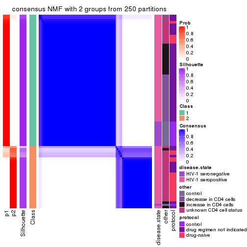</p>

</div>
<div id='tab-ATC-NMF-consensus-heatmap-2'>
<pre><code class="r">consensus_heatmap(res, k = 3)
</code></pre>

<p>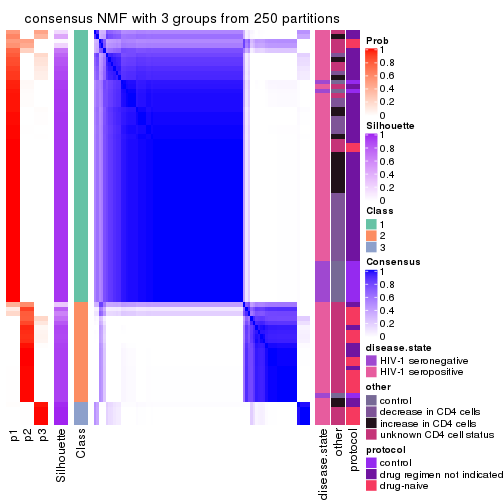</p>

</div>
<div id='tab-ATC-NMF-consensus-heatmap-3'>
<pre><code class="r">consensus_heatmap(res, k = 4)
</code></pre>

<p>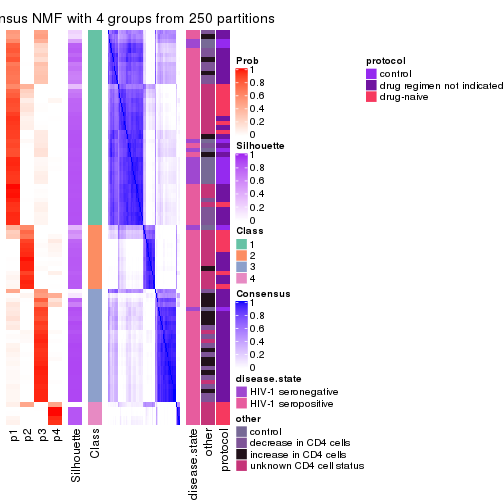</p>

</div>
<div id='tab-ATC-NMF-consensus-heatmap-4'>
<pre><code class="r">consensus_heatmap(res, k = 5)
</code></pre>

<p>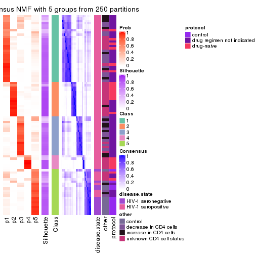</p>

</div>
<div id='tab-ATC-NMF-consensus-heatmap-5'>
<pre><code class="r">consensus_heatmap(res, k = 6)
</code></pre>

<p>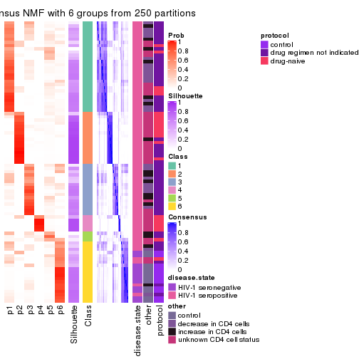</p>

</div>
</div>

Heatmaps for the membership of samples in all partitions to see how consistent they are:


<script>
$( function() {
	$( '#tabs-ATC-NMF-membership-heatmap' ).tabs();
} );
</script>
<div id='tabs-ATC-NMF-membership-heatmap'>
<ul>
<li><a href='#tab-ATC-NMF-membership-heatmap-1'>k = 2</a></li>
<li><a href='#tab-ATC-NMF-membership-heatmap-2'>k = 3</a></li>
<li><a href='#tab-ATC-NMF-membership-heatmap-3'>k = 4</a></li>
<li><a href='#tab-ATC-NMF-membership-heatmap-4'>k = 5</a></li>
<li><a href='#tab-ATC-NMF-membership-heatmap-5'>k = 6</a></li>
</ul>
<div id='tab-ATC-NMF-membership-heatmap-1'>
<pre><code class="r">membership_heatmap(res, k = 2)
</code></pre>

<p>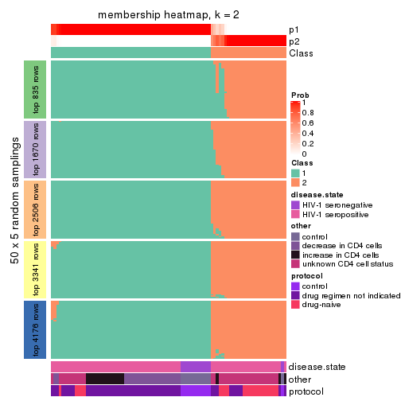</p>

</div>
<div id='tab-ATC-NMF-membership-heatmap-2'>
<pre><code class="r">membership_heatmap(res, k = 3)
</code></pre>

<p>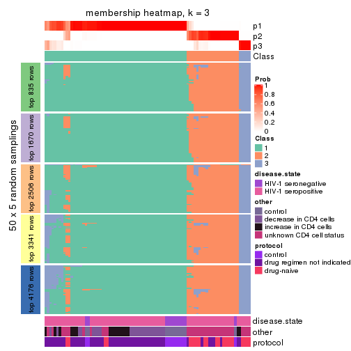</p>

</div>
<div id='tab-ATC-NMF-membership-heatmap-3'>
<pre><code class="r">membership_heatmap(res, k = 4)
</code></pre>

<p>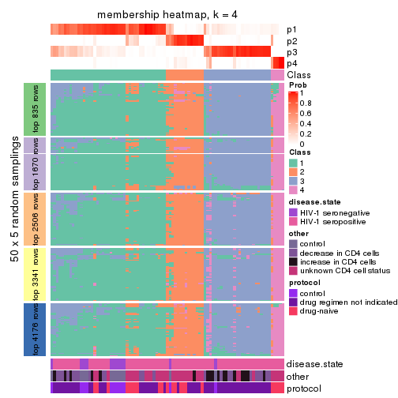</p>

</div>
<div id='tab-ATC-NMF-membership-heatmap-4'>
<pre><code class="r">membership_heatmap(res, k = 5)
</code></pre>

<p>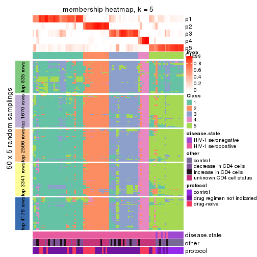</p>

</div>
<div id='tab-ATC-NMF-membership-heatmap-5'>
<pre><code class="r">membership_heatmap(res, k = 6)
</code></pre>

<p>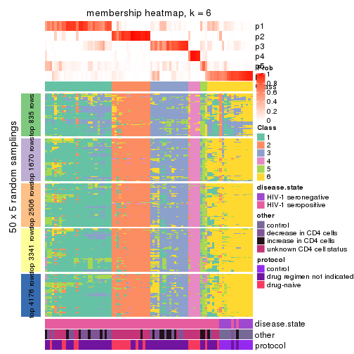</p>

</div>
</div>

As soon as we have had the classes for columns, we can look for signatures
which are significantly different between classes which can be candidate marks
for certain classes. Following are the heatmaps for signatures.


Signature heatmaps where rows are scaled:


<script>
$( function() {
	$( '#tabs-ATC-NMF-get-signatures' ).tabs();
} );
</script>
<div id='tabs-ATC-NMF-get-signatures'>
<ul>
<li><a href='#tab-ATC-NMF-get-signatures-1'>k = 2</a></li>
<li><a href='#tab-ATC-NMF-get-signatures-2'>k = 3</a></li>
<li><a href='#tab-ATC-NMF-get-signatures-3'>k = 4</a></li>
<li><a href='#tab-ATC-NMF-get-signatures-4'>k = 5</a></li>
<li><a href='#tab-ATC-NMF-get-signatures-5'>k = 6</a></li>
</ul>
<div id='tab-ATC-NMF-get-signatures-1'>
<pre><code class="r">get_signatures(res, k = 2)
</code></pre>

<p>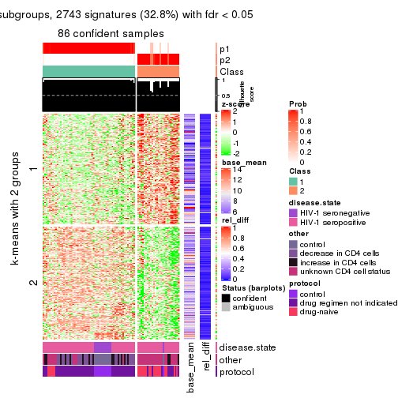</p>

</div>
<div id='tab-ATC-NMF-get-signatures-2'>
<pre><code class="r">get_signatures(res, k = 3)
</code></pre>

<p>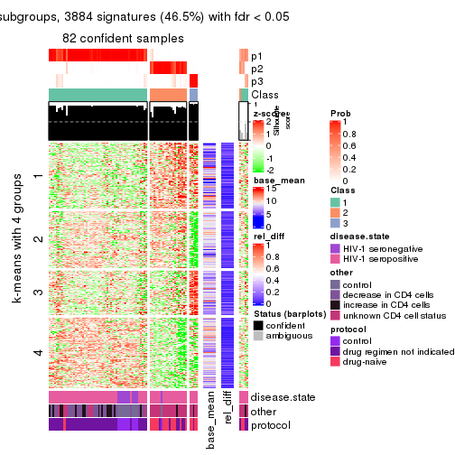</p>

</div>
<div id='tab-ATC-NMF-get-signatures-3'>
<pre><code class="r">get_signatures(res, k = 4)
</code></pre>

<p>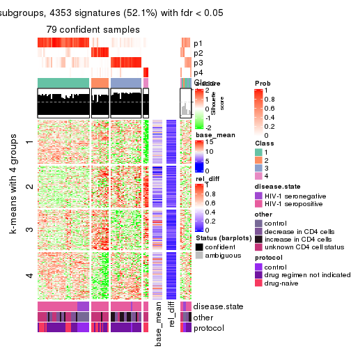</p>

</div>
<div id='tab-ATC-NMF-get-signatures-4'>
<pre><code class="r">get_signatures(res, k = 5)
</code></pre>

<p>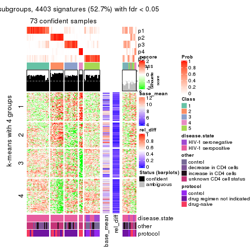</p>

</div>
<div id='tab-ATC-NMF-get-signatures-5'>
<pre><code class="r">get_signatures(res, k = 6)
</code></pre>

<p>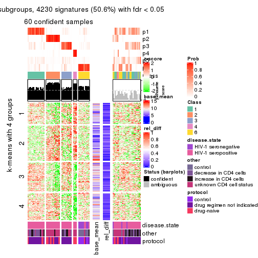</p>

</div>
</div>


Signature heatmaps where rows are not scaled:


<script>
$( function() {
	$( '#tabs-ATC-NMF-get-signatures-no-scale' ).tabs();
} );
</script>
<div id='tabs-ATC-NMF-get-signatures-no-scale'>
<ul>
<li><a href='#tab-ATC-NMF-get-signatures-no-scale-1'>k = 2</a></li>
<li><a href='#tab-ATC-NMF-get-signatures-no-scale-2'>k = 3</a></li>
<li><a href='#tab-ATC-NMF-get-signatures-no-scale-3'>k = 4</a></li>
<li><a href='#tab-ATC-NMF-get-signatures-no-scale-4'>k = 5</a></li>
<li><a href='#tab-ATC-NMF-get-signatures-no-scale-5'>k = 6</a></li>
</ul>
<div id='tab-ATC-NMF-get-signatures-no-scale-1'>
<pre><code class="r">get_signatures(res, k = 2, scale_rows = FALSE)
</code></pre>

<p>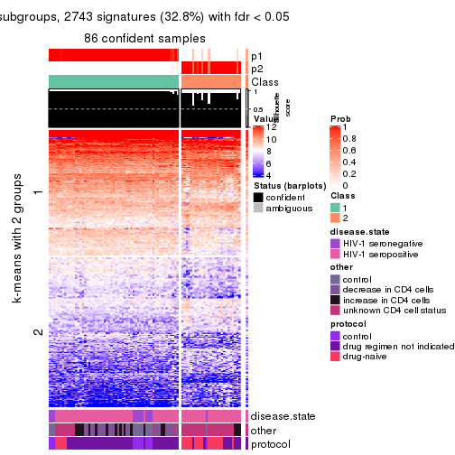</p>

</div>
<div id='tab-ATC-NMF-get-signatures-no-scale-2'>
<pre><code class="r">get_signatures(res, k = 3, scale_rows = FALSE)
</code></pre>

<p>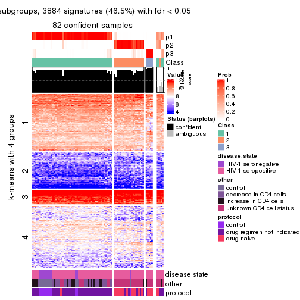</p>

</div>
<div id='tab-ATC-NMF-get-signatures-no-scale-3'>
<pre><code class="r">get_signatures(res, k = 4, scale_rows = FALSE)
</code></pre>

<p>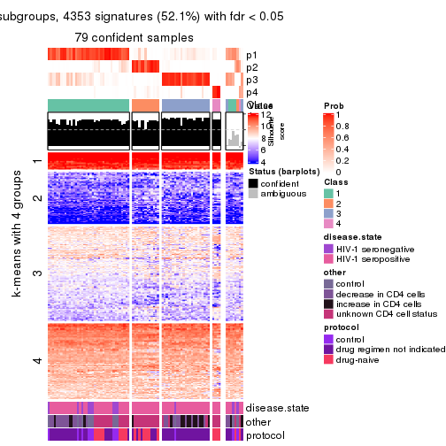</p>

</div>
<div id='tab-ATC-NMF-get-signatures-no-scale-4'>
<pre><code class="r">get_signatures(res, k = 5, scale_rows = FALSE)
</code></pre>

<p>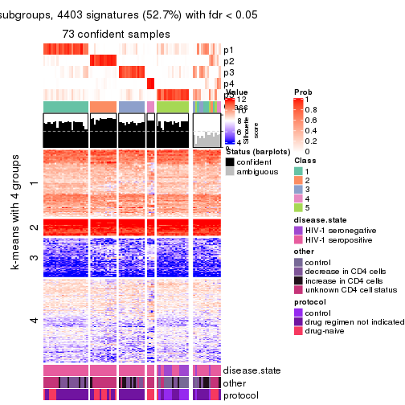</p>

</div>
<div id='tab-ATC-NMF-get-signatures-no-scale-5'>
<pre><code class="r">get_signatures(res, k = 6, scale_rows = FALSE)
</code></pre>

<p>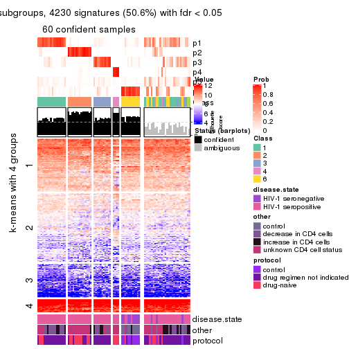</p>

</div>
</div>


Compare the overlap of signatures from different k:

```r
compare_signatures(res)
```

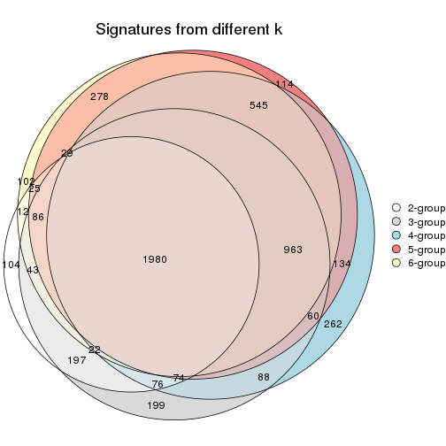

`get_signature()` returns a data frame invisibly. TO get the list of signatures, the function
call should be assigned to a variable explicitly. In following code, if `plot` argument is set
to `FALSE`, no heatmap is plotted while only the differential analysis is performed.

```r
# code only for demonstration
tb = get_signature(res, k = ..., plot = FALSE)
```

An example of the output of `tb` is:

```
#>   which_row         fdr    mean_1    mean_2 scaled_mean_1 scaled_mean_2 km
#> 1        38 0.042760348  8.373488  9.131774    -0.5533452     0.5164555  1
#> 2        40 0.018707592  7.106213  8.469186    -0.6173731     0.5762149  1
#> 3        55 0.019134737 10.221463 11.207825    -0.6159697     0.5749050  1
#> 4        59 0.006059896  5.921854  7.869574    -0.6899429     0.6439467  1
#> 5        60 0.018055526  8.928898 10.211722    -0.6204761     0.5791110  1
#> 6        98 0.009384629 15.714769 14.887706     0.6635654    -0.6193277  2
...
```

The columns in `tb` are:

1. `which_row`: row indices corresponding to the input matrix.
2. `fdr`: FDR for the differential test. 
3. `mean_x`: The mean value in group x.
4. `scaled_mean_x`: The mean value in group x after rows are scaled.
5. `km`: Row groups if k-means clustering is applied to rows.


UMAP plot which shows how samples are separated.


<script>
$( function() {
	$( '#tabs-ATC-NMF-dimension-reduction' ).tabs();
} );
</script>
<div id='tabs-ATC-NMF-dimension-reduction'>
<ul>
<li><a href='#tab-ATC-NMF-dimension-reduction-1'>k = 2</a></li>
<li><a href='#tab-ATC-NMF-dimension-reduction-2'>k = 3</a></li>
<li><a href='#tab-ATC-NMF-dimension-reduction-3'>k = 4</a></li>
<li><a href='#tab-ATC-NMF-dimension-reduction-4'>k = 5</a></li>
<li><a href='#tab-ATC-NMF-dimension-reduction-5'>k = 6</a></li>
</ul>
<div id='tab-ATC-NMF-dimension-reduction-1'>
<pre><code class="r">dimension_reduction(res, k = 2, method = &quot;UMAP&quot;)
</code></pre>

<p>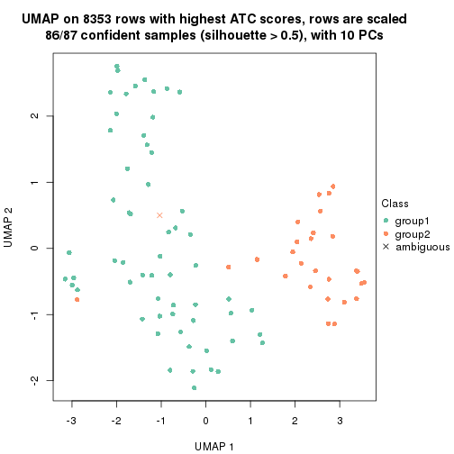</p>

</div>
<div id='tab-ATC-NMF-dimension-reduction-2'>
<pre><code class="r">dimension_reduction(res, k = 3, method = &quot;UMAP&quot;)
</code></pre>

<p>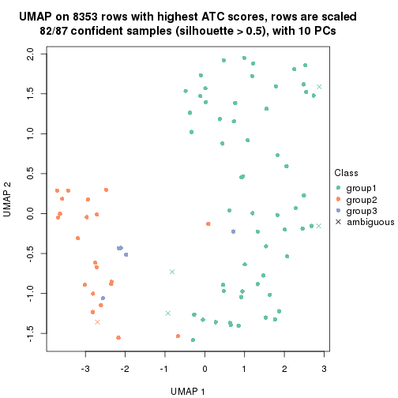</p>

</div>
<div id='tab-ATC-NMF-dimension-reduction-3'>
<pre><code class="r">dimension_reduction(res, k = 4, method = &quot;UMAP&quot;)
</code></pre>

<p>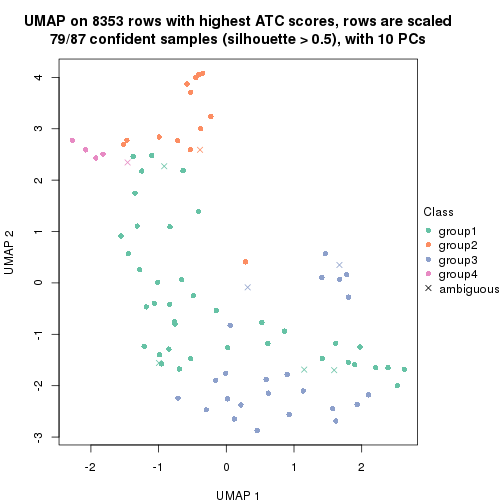</p>

</div>
<div id='tab-ATC-NMF-dimension-reduction-4'>
<pre><code class="r">dimension_reduction(res, k = 5, method = &quot;UMAP&quot;)
</code></pre>

<p>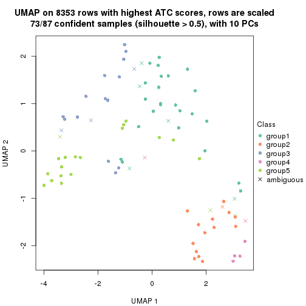</p>

</div>
<div id='tab-ATC-NMF-dimension-reduction-5'>
<pre><code class="r">dimension_reduction(res, k = 6, method = &quot;UMAP&quot;)
</code></pre>

<p>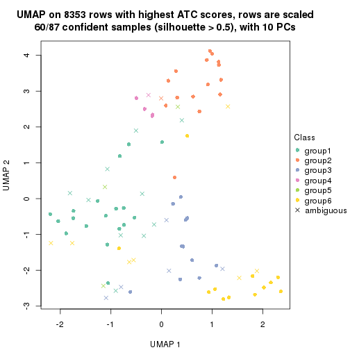</p>

</div>
</div>


Following heatmap shows how subgroups are split when increasing `k`:

```r
collect_classes(res)
```

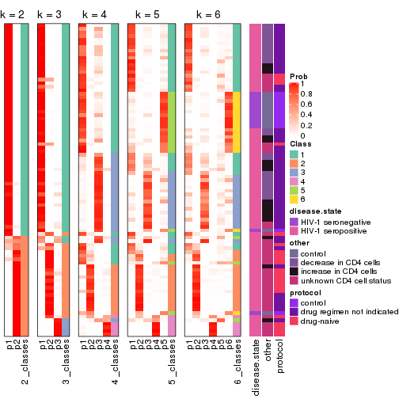


Test correlation between subgroups and known annotations. If the known
annotation is numeric, one-way ANOVA test is applied, and if the known
annotation is discrete, chi-squared contingency table test is applied.

```r
test_to_known_factors(res)
```

```
#>          n disease.state(p) other(p) protocol(p) k
#> ATC:NMF 86         1.28e-01 8.56e-08    4.44e-07 2
#> ATC:NMF 82         1.64e-01 1.20e-07    1.62e-08 3
#> ATC:NMF 79         5.19e-02 9.69e-06    9.32e-06 4
#> ATC:NMF 73         1.03e-07 1.98e-09    8.01e-11 5
#> ATC:NMF 60         1.41e-08 2.51e-10    2.40e-11 6
```


If matrix rows can be associated to genes, consider to use `GO_Enrichment(res,
...)` to perform function enrichment for the signature genes.


 

## Session info


```r
sessionInfo()
```

```
#> R version 3.6.0 (2019-04-26)
#> Platform: x86_64-pc-linux-gnu (64-bit)
#> Running under: CentOS Linux 7 (Core)
#> 
#> Matrix products: default
#> BLAS:   /usr/lib64/libblas.so.3.4.2
#> LAPACK: /usr/lib64/liblapack.so.3.4.2
#> 
#> locale:
#>  [1] LC_CTYPE=en_GB.UTF-8       LC_NUMERIC=C               LC_TIME=en_GB.UTF-8       
#>  [4] LC_COLLATE=en_GB.UTF-8     LC_MONETARY=en_GB.UTF-8    LC_MESSAGES=en_GB.UTF-8   
#>  [7] LC_PAPER=en_GB.UTF-8       LC_NAME=C                  LC_ADDRESS=C              
#> [10] LC_TELEPHONE=C             LC_MEASUREMENT=en_GB.UTF-8 LC_IDENTIFICATION=C       
#> 
#> attached base packages:
#> [1] grid      parallel  stats     graphics  grDevices utils     datasets  methods   base     
#> 
#> other attached packages:
#>  [1] genefilter_1.66.0     ComplexHeatmap_2.1.1  markdown_1.1          knitr_1.26           
#>  [5] preprocessCore_1.46.0 cola_1.3.2            GEOquery_2.52.0       Biobase_2.44.0       
#>  [9] BiocGenerics_0.30.0   GetoptLong_0.1.7     
#> 
#> loaded via a namespace (and not attached):
#>  [1] bitops_1.0-6         matrixStats_0.55.0   bit64_0.9-7          doParallel_1.0.15   
#>  [5] RColorBrewer_1.1-2   httr_1.4.1           tools_3.6.0          backports_1.1.5     
#>  [9] R6_2.4.1             DBI_1.0.0            lazyeval_0.2.2       colorspace_1.4-1    
#> [13] withr_2.1.2          tidyselect_0.2.5     gridExtra_2.3        bit_1.1-14          
#> [17] compiler_3.6.0       xml2_1.2.2           microbenchmark_1.4-7 pkgmaker_0.28       
#> [21] slam_0.1-46          scales_1.1.0         readr_1.3.1          NMF_0.23.6          
#> [25] stringr_1.4.0        digest_0.6.23        pkgconfig_2.0.3      bibtex_0.4.2        
#> [29] highr_0.8            limma_3.40.6         rlang_0.4.2          GlobalOptions_0.1.1 
#> [33] RSQLite_2.1.2        impute_1.58.0        shape_1.4.4          mclust_5.4.5        
#> [37] dendextend_1.12.0    dplyr_0.8.3          RCurl_1.95-4.12      magrittr_1.5        
#> [41] Matrix_1.2-17        Rcpp_1.0.3           munsell_0.5.0        S4Vectors_0.22.1    
#> [45] viridis_0.5.1        lifecycle_0.1.0      stringi_1.4.3        plyr_1.8.4          
#> [49] blob_1.2.0           crayon_1.3.4         lattice_0.20-38      splines_3.6.0       
#> [53] annotate_1.62.0      circlize_0.4.9       hms_0.5.2            zeallot_0.1.0       
#> [57] pillar_1.4.2         rjson_0.2.20         rngtools_1.4         reshape2_1.4.3      
#> [61] codetools_0.2-16     stats4_3.6.0         XML_3.98-1.20        glue_1.3.1          
#> [65] evaluate_0.14        png_0.1-7            vctrs_0.2.0          foreach_1.4.7       
#> [69] polyclip_1.10-0      gtable_0.3.0         purrr_0.3.3          tidyr_1.0.0         
#> [73] clue_0.3-57          assertthat_0.2.1     ggplot2_3.2.1        xfun_0.11           
#> [77] gridBase_0.4-7       eulerr_6.0.0         xtable_1.8-4         skmeans_0.2-11      
#> [81] survival_2.44-1.1    viridisLite_0.3.0    tibble_2.1.3         iterators_1.0.12    
#> [85] AnnotationDbi_1.46.1 registry_0.5-1       memoise_1.1.0        IRanges_2.18.3      
#> [89] cluster_2.1.0        brew_1.0-6
```


